<!--
CO_OP_TRANSLATOR_METADATA:
{
  "original_hash": "c688385d15dd3645e924ea0ffee8967f",
  "translation_date": "2025-11-04T02:12:19+00:00",
  "source_file": "2-js-basics/3-making-decisions/README.md",
  "language_code": "he"
}
-->
# יסודות JavaScript: קבלת החלטות

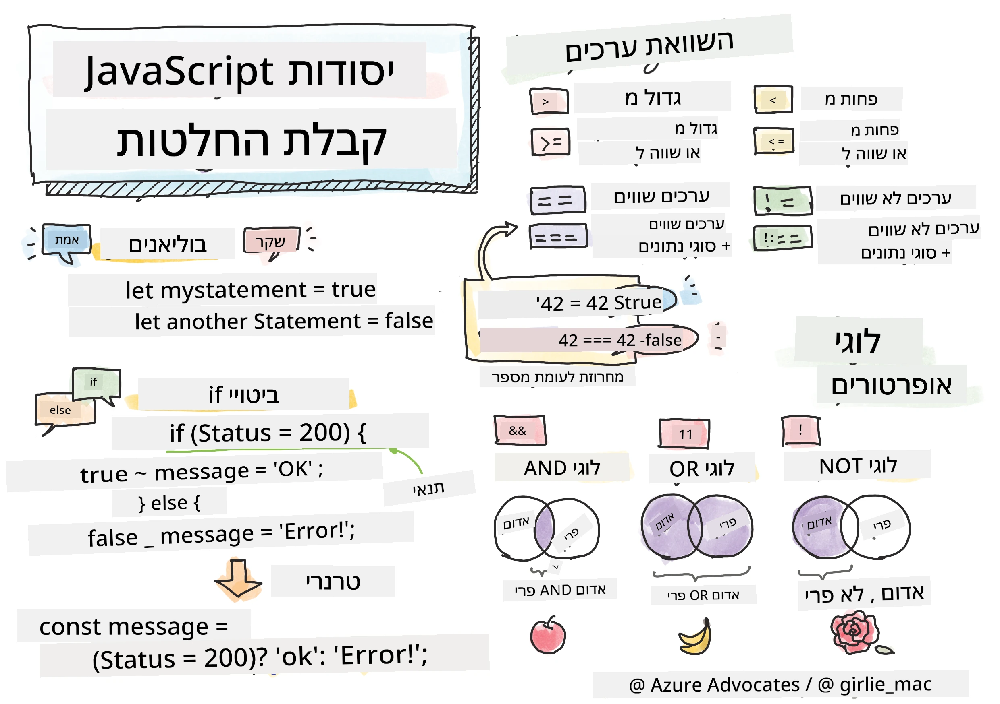

> סקיצה מאת [Tomomi Imura](https://twitter.com/girlie_mac)

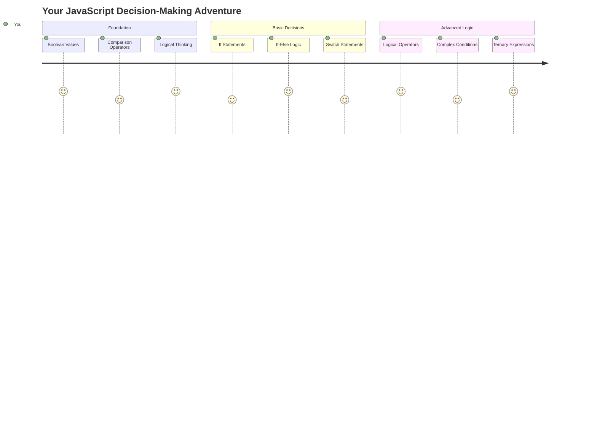

האם אי פעם תהיתם איך אפליקציות מקבלות החלטות חכמות? כמו איך מערכת ניווט בוחרת את המסלול המהיר ביותר, או איך תרמוסטט מחליט מתי להפעיל את החימום? זהו הרעיון הבסיסי של קבלת החלטות בתכנות.

כמו שמנוע האנליטי של צ'ארלס בבאג' תוכנן לבצע רצפים שונים של פעולות בהתבסס על תנאים, תוכניות JavaScript מודרניות צריכות לקבל החלטות בהתבסס על נסיבות משתנות. היכולת הזו להתפצל ולקבל החלטות היא מה שהופך קוד סטטי לאפליקציות רספונסיביות ואינטליגנטיות.

בשיעור הזה תלמדו איך ליישם לוגיקה מותנית בתוכניות שלכם. נחקור הצהרות מותנות, אופרטורים להשוואה וביטויים לוגיים שמאפשרים לקוד שלכם להעריך מצבים ולהגיב בהתאם.

## שאלון לפני השיעור

[שאלון לפני השיעור](https://ff-quizzes.netlify.app/web/quiz/11)

היכולת לקבל החלטות ולשלוט בזרימת התוכנית היא היבט בסיסי בתכנות. חלק זה מכסה איך לשלוט במסלול הביצוע של תוכניות JavaScript שלכם באמצעות ערכי בוליאן ולוגיקה מותנית.

[](https://youtube.com/watch?v=SxTp8j-fMMY "Making Decisions")

> 🎥 לחצו על התמונה למעלה לצפייה בסרטון על קבלת החלטות.

> ניתן לקחת את השיעור הזה ב-[Microsoft Learn](https://docs.microsoft.com/learn/modules/web-development-101-if-else/?WT.mc_id=academic-77807-sagibbon)!

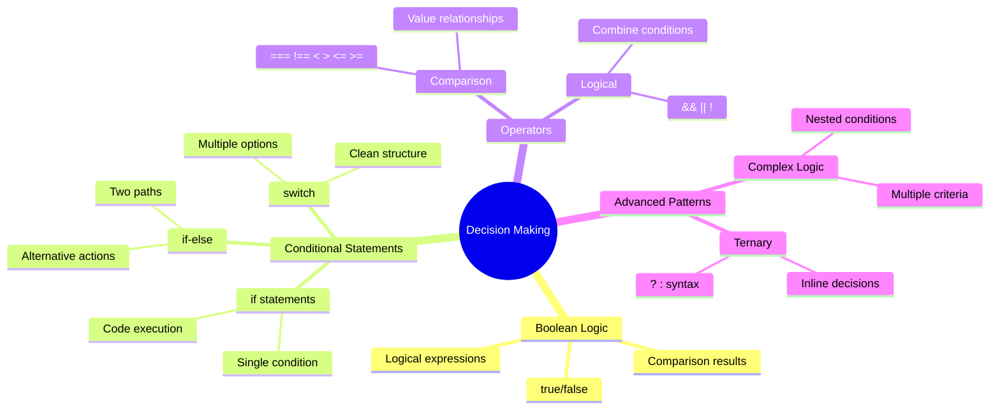

## סקירה קצרה על בוליאנים

לפני שנחקור את נושא קבלת ההחלטות, בואו נחזור לערכי בוליאן מהשיעור הקודם שלנו. ערכים אלו, שנקראים על שמו של המתמטיקאי ג'ורג' בול, מייצגים מצבים בינאריים – או `true` או `false`. אין עמימות, אין שטח ביניים.

ערכים בינאריים אלו מהווים את הבסיס לכל הלוגיקה החישובית. כל החלטה שהתוכנית שלכם מקבלת בסופו של דבר מתמצה להערכה בוליאנית.

יצירת משתנים בוליאניים היא פשוטה:

```javascript
let myTrueBool = true;
let myFalseBool = false;
```

זה יוצר שני משתנים עם ערכים בוליאניים מפורשים.

✅ בוליאנים נקראים על שמו של המתמטיקאי, הפילוסוף והלוגיקן האנגלי ג'ורג' בול (1815–1864).

## אופרטורים להשוואה ובוליאנים

בפועל, לעיתים רחוקות תגדירו ערכים בוליאניים באופן ידני. במקום זאת, תייצרו אותם על ידי הערכת תנאים: "האם המספר הזה גדול מהאחר?" או "האם הערכים האלו שווים?"

אופרטורים להשוואה מאפשרים את ההערכות הללו. הם משווים ערכים ומחזירים תוצאות בוליאניות בהתבסס על היחס בין האופרנדים.

| סימן | תיאור                                                                                                                                                   | דוגמה              |
| ------ | ------------------------------------------------------------------------------------------------------------------------------------------------------------- | ------------------ |
| `<`    | **קטן מ**: משווה שני ערכים ומחזיר את סוג הנתונים הבוליאני `true` אם הערך בצד שמאל קטן מהערך בצד ימין                              | `5 < 6 // true`    |
| `<=`   | **קטן או שווה ל**: משווה שני ערכים ומחזיר את סוג הנתונים הבוליאני `true` אם הערך בצד שמאל קטן או שווה לערך בצד ימין      | `5 <= 6 // true`   |
| `>`    | **גדול מ**: משווה שני ערכים ומחזיר את סוג הנתונים הבוליאני `true` אם הערך בצד שמאל גדול מהערך בצד ימין                         | `5 > 6 // false`   |
| `>=`   | **גדול או שווה ל**: משווה שני ערכים ומחזיר את סוג הנתונים הבוליאני `true` אם הערך בצד שמאל גדול או שווה לערך בצד ימין | `5 >= 6 // false`  |
| `===`  | **שוויון מוחלט**: משווה שני ערכים ומחזיר את סוג הנתונים הבוליאני `true` אם הערכים בצד ימין ושמאל שווים וגם מאותו סוג נתונים.       | `5 === 6 // false` |
| `!==`  | **אי שוויון**: משווה שני ערכים ומחזיר את הערך הבוליאני ההפוך למה שאופרטור השוויון המוחלט היה מחזיר                                    | `5 !== 6 // true`  |

✅ בדקו את הידע שלכם על ידי כתיבת כמה השוואות בקונסול של הדפדפן שלכם. האם הנתונים שהוחזרו מפתיעים אתכם?

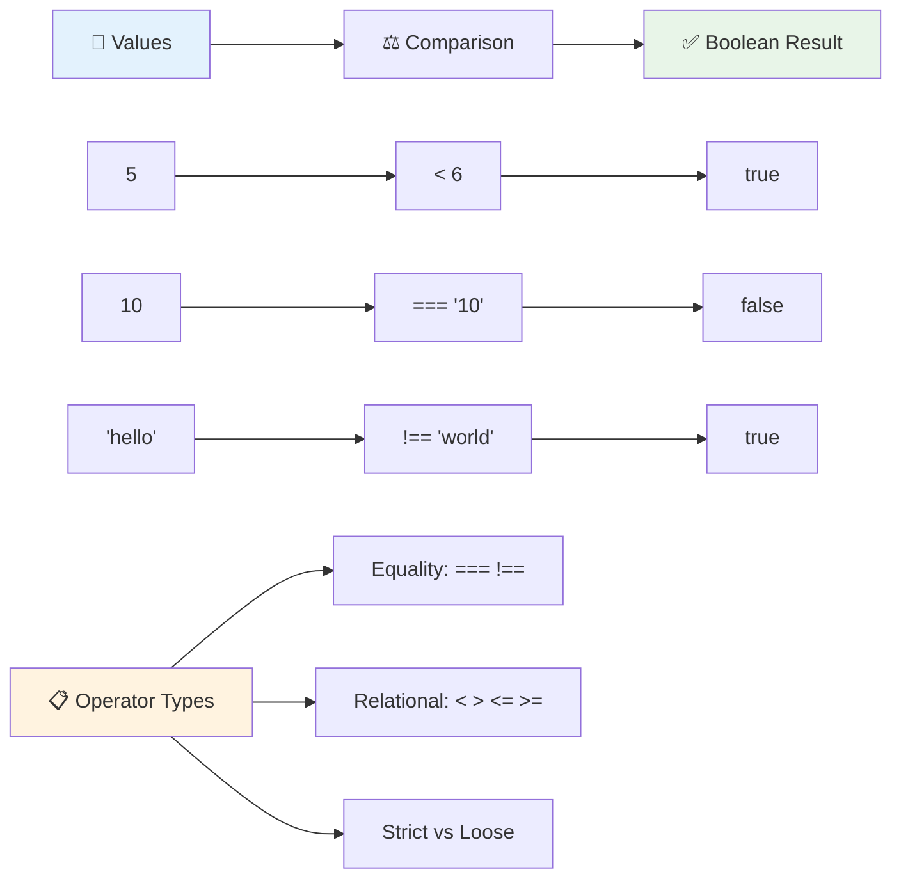

### 🧠 **בדיקת שליטה בהשוואות: הבנת לוגיקה בוליאנית**

**בדקו את הבנתכם בהשוואות:**
- מדוע לדעתכם `===` (שוויון מוחלט) בדרך כלל מועדף על פני `==` (שוויון רופף)?
- האם תוכלו לנבא מה `5 === '5'` מחזיר? ומה לגבי `5 == '5'`?
- מה ההבדל בין `!==` ל-`!=`?

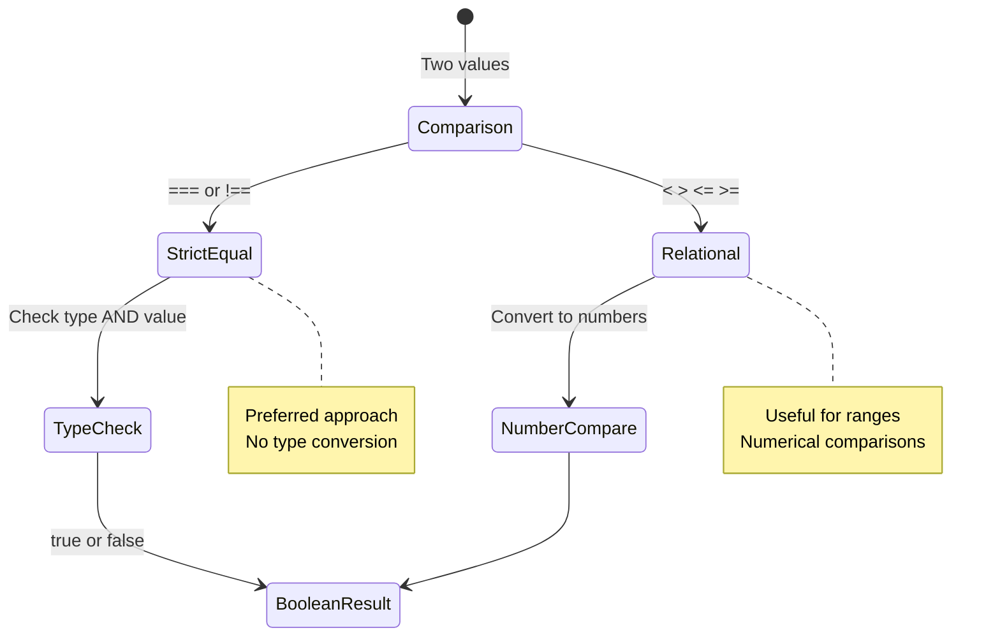

> **טיפ מקצועי**: תמיד השתמשו ב-`===` ו-`!==` לבדיקות שוויון אלא אם כן אתם צריכים המרה של סוג נתונים. זה מונע התנהגות בלתי צפויה!

## הצהרת If

הצהרת `if` היא כמו לשאול שאלה בקוד שלכם. "אם התנאי הזה נכון, אז תעשה את הדבר הזה." זה כנראה הכלי החשוב ביותר שתשתמשו בו לקבלת החלטות ב-JavaScript.

כך זה עובד:

```javascript
if (condition) {
  // Condition is true. Code in this block will run.
}
```

התנאי נכנס בתוך הסוגריים, ואם הוא `true`, JavaScript מריצה את הקוד בתוך הסוגריים המסולסלים. אם הוא `false`, JavaScript פשוט מדלגת על כל הבלוק הזה.

לעיתים קרובות תשתמשו באופרטורים להשוואה כדי ליצור את התנאים הללו. בואו נראה דוגמה מעשית:

```javascript
let currentMoney = 1000;
let laptopPrice = 800;

if (currentMoney >= laptopPrice) {
  // Condition is true. Code in this block will run.
  console.log("Getting a new laptop!");
}
```

מכיוון ש-`1000 >= 800` מוערך כ-`true`, הקוד בתוך הבלוק מבוצע ומציג "קונה מחשב נייד חדש!" בקונסול.

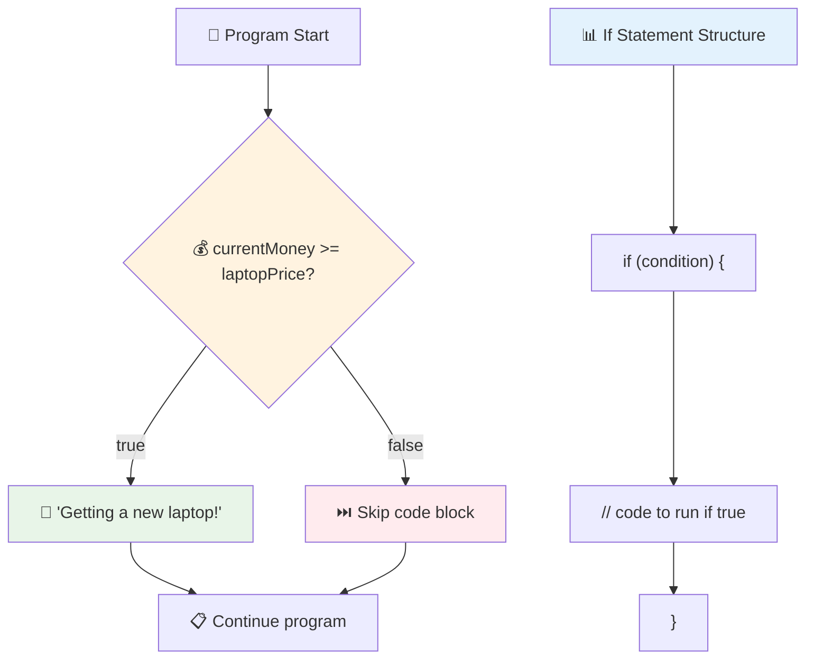

## הצהרת If..Else

אבל מה אם אתם רוצים שהתוכנית שלכם תעשה משהו אחר כשהתנאי הוא `false`? כאן נכנס ה-`else` – זה כמו תוכנית גיבוי.

הצהרת `else` נותנת לכם דרך לומר "אם התנאי הזה לא נכון, תעשה את הדבר האחר הזה במקום."

```javascript
let currentMoney = 500;
let laptopPrice = 800;

if (currentMoney >= laptopPrice) {
  // Condition is true. Code in this block will run.
  console.log("Getting a new laptop!");
} else {
  // Condition is false. Code in this block will run.
  console.log("Can't afford a new laptop, yet!");
}
```

עכשיו, מכיוון ש-`500 >= 800` הוא `false`, JavaScript מדלגת על הבלוק הראשון ומריצה את בלוק ה-`else` במקום. תראו "לא יכול להרשות לעצמי מחשב נייד חדש, עדיין!" בקונסול.

✅ בדקו את הבנתכם בקוד הזה ובקוד הבא על ידי הרצתם בקונסול של הדפדפן. שנו את הערכים של המשתנים currentMoney ו-laptopPrice כדי לשנות את הפלט של `console.log()`.

### 🎯 **בדיקת לוגיקת If-Else: מסלולי הסתעפות**

**העריכו את הבנתכם בלוגיקה מותנית:**
- מה קורה אם `currentMoney` שווה בדיוק ל-`laptopPrice`?
- האם תוכלו לחשוב על תרחיש בעולם האמיתי שבו לוגיקת if-else תהיה שימושית?
- איך תוכלו להרחיב את זה כדי לטפל בטווחי מחירים מרובים?

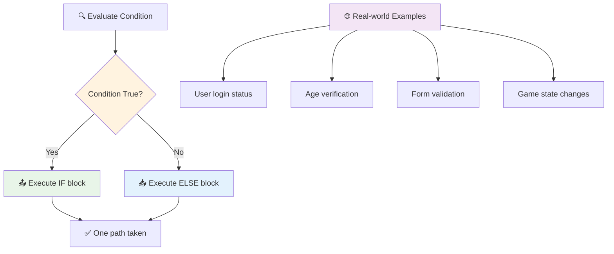

> **תובנה מרכזית**: If-else מבטיח שיינקט בדיוק מסלול אחד. זה מבטיח שהתוכנית שלכם תמיד תגיב לכל תנאי!

## הצהרת Switch

לפעמים אתם צריכים להשוות ערך אחד מול מספר אפשרויות. בעוד שתוכלו לשרשר מספר הצהרות `if..else`, הגישה הזו הופכת למסורבלת. הצהרת ה-`switch` מספקת מבנה נקי יותר לטיפול בערכים דיסקרטיים מרובים.

הרעיון דומה למערכות מיתוג מכניות שהיו בשימוש במרכזיות טלפון מוקדמות – ערך קלט אחד קובע איזה מסלול ביצוע ספציפי יילקח.

```javascript
switch (expression) {
  case x:
    // code block
    break;
  case y:
    // code block
    break;
  default:
    // code block
}
```

כך זה בנוי:
- JavaScript מעריכה את הביטוי פעם אחת
- היא עוברת על כל `case` כדי למצוא התאמה
- כשהיא מוצאת התאמה, היא מריצה את בלוק הקוד הזה
- ה-`break` אומר ל-JavaScript לעצור ולצאת מה-switch
- אם אין התאמות, היא מריצה את בלוק ה-`default` (אם יש כזה)

```javascript
// Program using switch statement for day of week
let dayNumber = 2;
let dayName;

switch (dayNumber) {
  case 1:
    dayName = "Monday";
    break;
  case 2:
    dayName = "Tuesday";
    break;
  case 3:
    dayName = "Wednesday";
    break;
  default:
    dayName = "Unknown day";
    break;
}
console.log(`Today is ${dayName}`);
```

בדוגמה הזו, JavaScript רואה ש-`dayNumber` הוא `2`, מוצאת את ה-`case 2` המתאים, מגדירה את `dayName` ל-"יום שלישי", ואז יוצאת מה-switch. התוצאה? "היום יום שלישי" מוצג בקונסול.

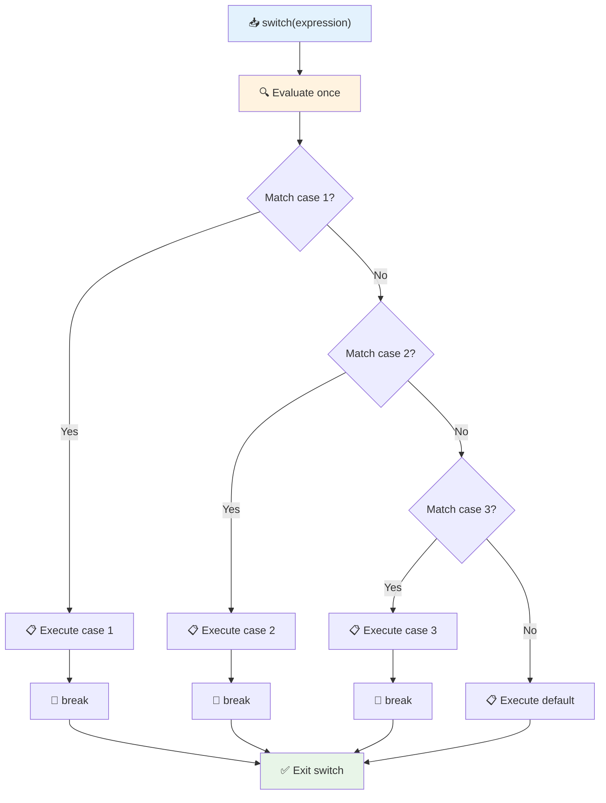

✅ בדקו את הבנתכם בקוד הזה ובקוד הבא על ידי הרצתם בקונסול של הדפדפן. שנו את הערכים של המשתנה a כדי לשנות את הפלט של `console.log()`.

### 🔄 **שליטה בהצהרת Switch: אפשרויות מרובות**

**בדקו את הבנתכם ב-switch:**
- מה קורה אם תשכחו הצהרת `break`?
- מתי תשתמשו ב-switch במקום במספר הצהרות if-else?
- מדוע ה-`default` שימושי גם אם אתם חושבים שכיסיתם את כל האפשרויות?

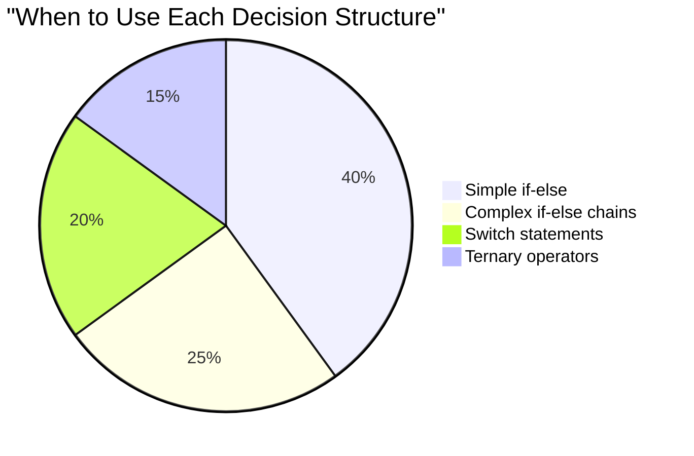

> **שיטה מומלצת**: השתמשו ב-switch כשמשווים משתנה אחד מול ערכים ספציפיים מרובים. השתמשו ב-if-else לבדיקות טווח או תנאים מורכבים!

## אופרטורים לוגיים ובוליאנים

החלטות מורכבות לעיתים דורשות הערכת מספר תנאים בו זמנית. כמו שאלגברה בוליאנית מאפשרת למתמטיקאים לשלב ביטויים לוגיים, תכנות מספק אופרטורים לוגיים לחיבור מספר תנאים בוליאניים.

אופרטורים אלו מאפשרים לוגיקה מותנית מתוחכמת על ידי שילוב הערכות פשוטות של true/false.

| סימן | תיאור                                                                                     | דוגמה                                                                 |
| ------ | ----------------------------------------------------------------------------------------------- | ----------------------------------------------------------------------- |
| `&&`   | **וגם לוגי**: משווה שני ביטויים בוליאניים. מחזיר true **רק** אם שני הצדדים הם true | `(5 > 3) && (5 < 10) // שני הצדדים נכונים. מחזיר true` |
| `\|\|` | **או לוגי**: משווה שני ביטויים בוליאניים. מחזיר true אם לפחות צד אחד הוא true     | `(5 > 10) \|\| (5 < 10) // צד אחד שגוי, השני נכון. מחזיר true` |
| `!`    | **לא לוגי**: מחזיר את הערך ההפוך של ביטוי בוליאני                             | `!(5 > 10) // 5 לא גדול מ-10, אז "!" הופך את זה לנכון`         |

אופרטורים אלו מאפשרים לכם לשלב תנאים בדרכים שימושיות:
- וגם (`&&`) אומר ששני התנאים חייבים להיות נכונים
- או (`||`) אומר שלפחות תנאי אחד חייב להיות נכון  
- לא (`!`) הופך נכון לשגוי (ולהיפך)

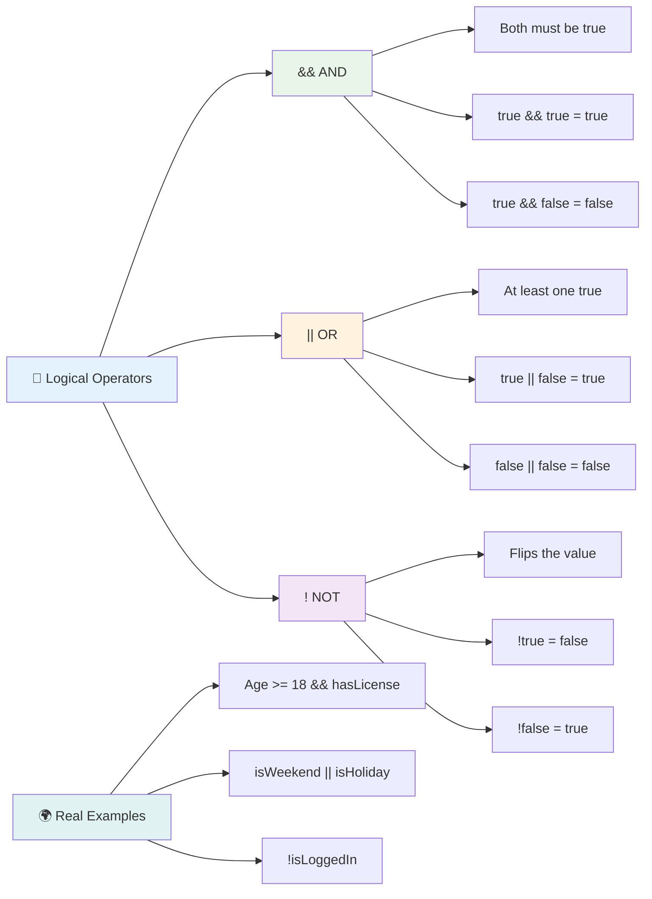

## תנאים והחלטות עם אופרטורים לוגיים

בואו נראה את האופרטורים הלוגיים הללו בפעולה עם דוגמה מציאותית יותר:

```javascript
let currentMoney = 600;
let laptopPrice = 800;
let laptopDiscountPrice = laptopPrice - (laptopPrice * 0.2); // Laptop price at 20 percent off

if (currentMoney >= laptopPrice || currentMoney >= laptopDiscountPrice) {
  // Condition is true. Code in this block will run.
  console.log("Getting a new laptop!");
} else {
  // Condition is false. Code in this block will run.
  console.log("Can't afford a new laptop, yet!");
}
```

בדוגמה הזו: אנחנו מחשבים מחיר הנחה של 20% (640), ואז מעריכים האם הכסף הזמין שלנו מכסה את המחיר המלא או את המחיר המוזל. מכיוון ש-600 עומד בסף המחיר המוזל של 640, התנאי מוערך כנכון.

### 🧮 **בדיקת אופרטורים לוגיים: שילוב תנאים**

**בדקו את הבנתכם באופרטורים לוגיים:**
- בביטוי `A && B`, מה קורה אם A הוא שגוי? האם B בכלל מוערך?
- האם תוכלו לחשוב על מצב שבו תצטרכו את כל שלושת האופרטורים (&&, ||, !)?
- מה ההבדל בין `!user.isActive` ל-`user.isActive !== true`?

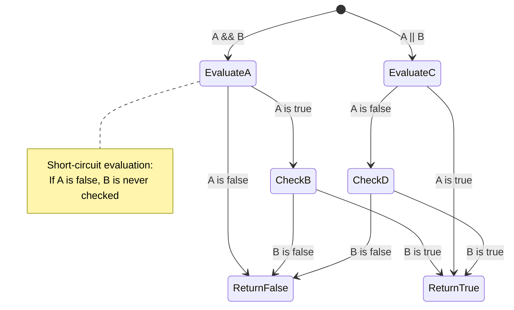

> **טיפ ביצועים**: JavaScript משתמשת ב"הערכה קצרה" - ב-`A && B`, אם A הוא שגוי, B אפילו לא מוערך. השתמשו בזה לטובתכם!

### אופרטור שלילה

לפעמים קל יותר לחשוב על מתי משהו **לא** נכון. כמו במקום לשאול "האם המשתמש מחובר?", אולי תרצו לשאול "האם המשתמש **לא** מחובר?" אופרטור סימן הקריאה (`!`) הופך את הלוגיקה עבורכם.

```javascript
if (!condition) {
  // runs if condition is false
} else {
  // runs if condition is true
}
```

אופרטור `!` הוא כמו לומר "ההפך מ..." – אם משהו הוא `true`, `!` הופך אותו ל-`false`, ולהיפך.

### ביטויים תנאיים

לצורך הקצאות תנאיות פשוטות, JavaScript מספקת את **אופרטור התנאי**. תחביר תמציתי זה מאפשר לכם לכתוב ביטוי תנאי בשורה אחת, שימושי כשאתם צריכים להקצות אחד משני ערכים בהתבסס על תנאי.

```javascript
let variable = condition ? returnThisIfTrue : returnThisIfFalse;
```

זה נקרא כמו שאלה: "האם התנאי הזה נכון? אם כן, השתמש בערך הזה. אם לא, השתמש בערך ההוא."

להלן דוגמה מוחשית יותר:

```javascript
let firstNumber = 20;
let secondNumber = 10;
let biggestNumber = firstNumber > secondNumber ? firstNumber : secondNumber;
```

✅ קחו רגע לקרוא את הקוד הזה כמה פעמים. האם אתם מבינים איך האופרטורים הללו עובדים?

הנה מה שהשורה הזו אומרת: "האם `firstNumber` גדול מ-`secondNumber`? אם כן, שים את `firstNumber` ב-`biggestNumber`. אם לא, שים את `secondNumber` ב-`biggestNumber`."

אופרטור התנאי הוא פשוט דרך קצרה יותר לכתוב את הצהרת ה-`if..else` המסורתית הזו:

```javascript
let biggestNumber;
if (firstNumber > secondNumber) {
  biggestNumber = firstNumber;
} else {
  biggestNumber = secondNumber;
}
```

שתי הגישות מפיקות תוצאות זהות. אופרטור התנאי מציע תמציתיות, בעוד שהמבנה המסורתי של if-else עשוי להיות קריא יותר לתנאים מורכבים.

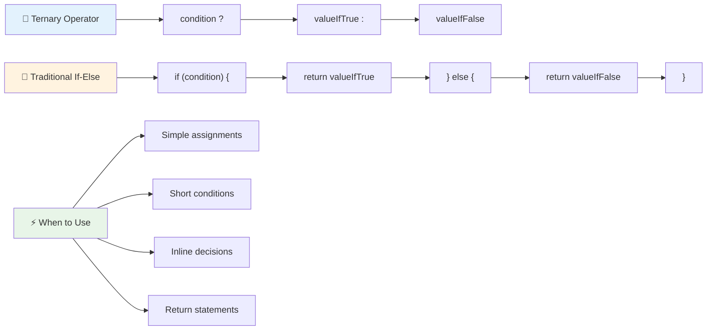

---

## 🚀 אתגר

צרו תוכנית שנכתבת תחילה עם אופרטורים לוגיים, ואז כתבו אותה מחדש באמצעות ביטוי תנאי. מה התחביר המועדף עליכם?

---

## אתגר סוכן GitHub Copilot 🚀

השתמשו במצב סוכן כדי להשלים את האתגר הבא:

**תיאור:** צרו מחשבון ציונים מקיף שמדגים מושגים שונים של קבלת החלטות מהשיעור הזה, כולל הצהרות if-else, הצהרות switch, אופרטורים לוגיים וביטויים תנאיים.

**הנחיה:** כתבו תוכנית JavaScript שמקבלת את הציון המספרי של תלמיד (0-100) וקובעת את הציון האותי שלו באמצעות הקריטריונים הבאים:
- A: 90-100
- B: 80-89  
- C: 70-79
- D: 60-69
- F: מתחת ל-60

דרישות:
1. השתמשו בהצהרת if-else כדי לקבוע את הציון האותי
2. השתמש באופרטורים לוגיים כדי לבדוק אם התלמיד עובר (ציון >= 60) וגם מקבל הצטיינות (ציון >= 90)  
3. השתמש בפקודת switch כדי לספק משוב ספציפי לכל ציון אות  
4. השתמש באופרטור תנאי כדי לקבוע אם התלמיד זכאי לקורס הבא (ציון >= 70)  
5. כלול בדיקת קלט כדי לוודא שהציון נמצא בין 0 ל-100  

בדוק את התוכנית שלך עם ציונים שונים כולל מקרים גבוליים כמו 59, 60, 89, 90 וקלטים לא תקינים.  

למידע נוסף על [מצב סוכן](https://code.visualstudio.com/blogs/2025/02/24/introducing-copilot-agent-mode) כאן.  

## שאלון לאחר ההרצאה  

[שאלון לאחר ההרצאה](https://ff-quizzes.netlify.app/web/quiz/12)  

## סקירה ולימוד עצמי  

קרא עוד על האופרטורים הרבים הזמינים למשתמש [ב-MDN](https://developer.mozilla.org/docs/Web/JavaScript/Reference/Operators).  

עבור על המדריך הנהדר של ג'וש קומאו [חיפוש אופרטורים](https://joshwcomeau.com/operator-lookup/)!  

## משימה  

[אופרטורים](assignment.md)  

---

## 🧠 **סיכום ערכת הכלים שלך לקבלת החלטות**  

```mermaid
graph TD
    A["🎯 JavaScript Decisions"] --> B["🔍 Boolean Logic"]
    A --> C["📊 Conditional Statements"]
    A --> D["🔗 Logical Operators"]
    A --> E["⚡ Advanced Patterns"]
    
    B --> B1["true/false values"]
    B --> B2["Comparison operators"]
    B --> B3["Truthiness concepts"]
    
    C --> C1["if statements"]
    C --> C2["if-else chains"]
    C --> C3["switch statements"]
    
    D --> D1["&& (AND)"]
    D --> D2["|| (OR)"]
    D --> D3["! (NOT)"]
    
    E --> E1["Ternary operator"]
    E --> E2["Short-circuit evaluation"]
    E --> E3["Complex conditions"]
    
    F["💡 Key Principles"] --> F1["Clear readable conditions"]
    F --> F2["Consistent comparison style"]
    F --> F3["Proper operator precedence"]
    F --> F4["Efficient evaluation order"]
    
    style A fill:#e3f2fd
    style B fill:#e8f5e8
    style C fill:#fff3e0
    style D fill:#f3e5f5
    style E fill:#e0f2f1
    style F fill:#fce4ec
```
  
---

## 🚀 ציר הזמן לשליטה בקבלת החלטות ב-JavaScript  

### ⚡ **מה ניתן לעשות ב-5 הדקות הקרובות**  
- [ ] תרגל אופרטורים להשוואה בקונסול של הדפדפן שלך  
- [ ] כתוב פקודת if-else פשוטה שבודקת את גילך  
- [ ] נסה את האתגר: כתוב מחדש if-else באמצעות אופרטור תנאי  
- [ ] בדוק מה קורה עם ערכים "אמיתיים" ו"שקריים" שונים  

### 🎯 **מה ניתן להשיג בשעה הקרובה**  
- [ ] השלם את שאלון לאחר השיעור וסקור מושגים מבלבלים  
- [ ] בנה מחשבון ציונים מקיף מאתגר GitHub Copilot  
- [ ] צור עץ החלטות פשוט לתרחיש מציאותי (כמו בחירת מה ללבוש)  
- [ ] תרגל שילוב תנאים מרובים עם אופרטורים לוגיים  
- [ ] נסה פקודות switch לשימושים שונים  

### 📅 **שליטה בלוגיקה במהלך השבוע**  
- [ ] השלם את משימת האופרטורים עם דוגמאות יצירתיות  
- [ ] בנה אפליקציית שאלון קטנה באמצעות מבני תנאי שונים  
- [ ] צור מאמת טפסים שבודק תנאי קלט מרובים  
- [ ] תרגל את התרגילים של ג'וש קומאו [חיפוש אופרטורים](https://joshwcomeau.com/operator-lookup/)  
- [ ] בצע שיפוץ קוד קיים כדי להשתמש במבני תנאי מתאימים יותר  
- [ ] למד על הערכת קיצור דרך והשלכות ביצועים  

### 🌟 **השינוי שלך לאורך החודש**  
- [ ] שלוט בתנאים מורכבים מקוננים ושמור על קריאות הקוד  
- [ ] בנה אפליקציה עם לוגיקת קבלת החלטות מתוחכמת  
- [ ] תרום לקוד פתוח על ידי שיפור לוגיקת תנאים בפרויקטים קיימים  
- [ ] למד מישהו אחר על מבני תנאים שונים ומתי להשתמש בכל אחד  
- [ ] חקור גישות תכנות פונקציונליות ללוגיקת תנאים  
- [ ] צור מדריך אישי לשיטות עבודה מומלצות בתנאים  

### 🏆 **בדיקת אלוף קבלת ההחלטות הסופית**  

**חגוג את שליטתך בחשיבה לוגית:**  
- מהי לוגיקת ההחלטות המורכבת ביותר שהצלחת ליישם?  
- איזה מבנה תנאי מרגיש לך הכי טבעי ולמה?  
- איך לימוד על אופרטורים לוגיים שינה את הגישה שלך לפתרון בעיות?  
- איזו אפליקציה מציאותית תיהנה מלוגיקת קבלת החלטות מתוחכמת?  

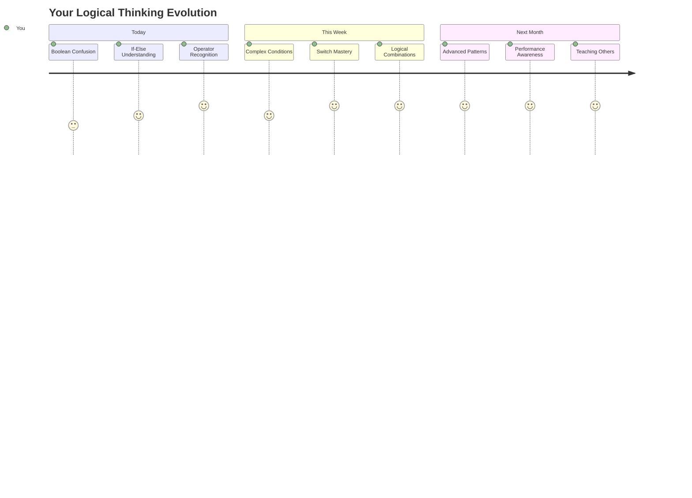
  
> 🧠 **שליטה באמנות קבלת החלטות דיגיטלית!** כל אפליקציה אינטראקטיבית מסתמכת על לוגיקת תנאים כדי להגיב בצורה חכמה לפעולות משתמש ולתנאים משתנים. עכשיו אתה מבין איך לגרום לתוכניות שלך לחשוב, להעריך ולבחור תגובות מתאימות. הבסיס הלוגי הזה יעניק כוח לכל אפליקציה דינמית שתבנה! 🎉  

---

**הצהרת אחריות**:  
מסמך זה תורגם באמצעות שירות תרגום AI [Co-op Translator](https://github.com/Azure/co-op-translator). למרות שאנו שואפים לדיוק, יש לקחת בחשבון שתרגומים אוטומטיים עשויים להכיל שגיאות או אי דיוקים. המסמך המקורי בשפתו המקורית צריך להיחשב כמקור סמכותי. עבור מידע קריטי, מומלץ להשתמש בתרגום מקצועי אנושי. איננו אחראים לאי הבנות או לפרשנויות שגויות הנובעות משימוש בתרגום זה.