<!--
CO_OP_TRANSLATOR_METADATA:
{
  "original_hash": "1710a50a519a6e4a1b40a5638783018d",
  "translation_date": "2025-11-04T02:11:42+00:00",
  "source_file": "2-js-basics/4-arrays-loops/README.md",
  "language_code": "he"
}
-->
# יסודות JavaScript: מערכים ולולאות


> סקיצה מאת [Tomomi Imura](https://twitter.com/girlie_mac)

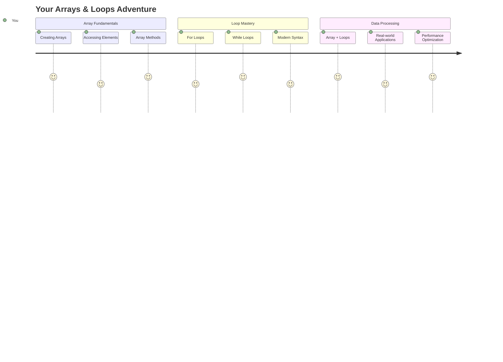

## שאלון לפני השיעור
[שאלון לפני השיעור](https://ff-quizzes.netlify.app/web/quiz/13)

אי פעם תהיתם איך אתרים עוקבים אחרי פריטים בעגלת הקניות או מציגים את רשימת החברים שלכם? כאן נכנסים לתמונה מערכים ולולאות. מערכים הם כמו מיכלים דיגיטליים שמחזיקים מידע רב, בעוד שלולאות מאפשרות לכם לעבוד עם כל המידע הזה בצורה יעילה בלי לכתוב קוד חוזר.

יחד, שני המושגים הללו מהווים את הבסיס לטיפול במידע בתוכניות שלכם. תלמדו לעבור מכתיבה ידנית של כל שלב ליצירת קוד חכם ויעיל שיכול לעבד מאות או אפילו אלפי פריטים במהירות.

בסוף השיעור הזה, תבינו איך לבצע משימות נתונים מורכבות בכמה שורות קוד בלבד. בואו נחקור את מושגי התכנות החיוניים הללו.

[](https://youtube.com/watch?v=1U4qTyq02Xw "Arrays")

[](https://www.youtube.com/watch?v=Eeh7pxtTZ3k "Loops")

> 🎥 לחצו על התמונות למעלה לצפייה בסרטונים על מערכים ולולאות.

> ניתן ללמוד את השיעור הזה ב-[Microsoft Learn](https://docs.microsoft.com/learn/modules/web-development-101-arrays/?WT.mc_id=academic-77807-sagibbon)!

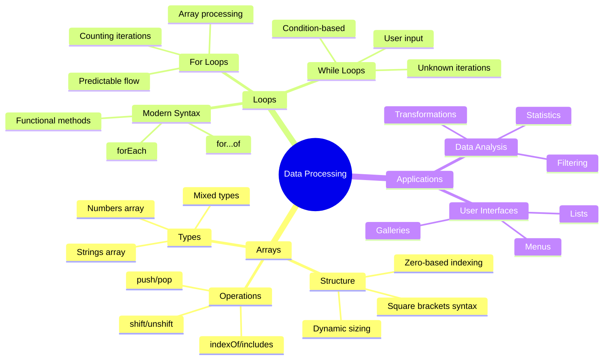

## מערכים

חשבו על מערכים כמו ארון תיוק דיגיטלי - במקום לאחסן מסמך אחד בכל מגירה, אפשר לארגן פריטים קשורים רבים במיכל מובנה אחד. במונחי תכנות, מערכים מאפשרים לכם לאחסן מידע רב בחבילה מאורגנת אחת.

בין אם אתם בונים גלריית תמונות, מנהלים רשימת משימות או עוקבים אחרי ציונים גבוהים במשחק, מערכים מספקים את הבסיס לארגון נתונים. בואו נראה איך הם עובדים.

✅ מערכים נמצאים בכל מקום! האם תוכלו לחשוב על דוגמה אמיתית למערך, כמו מערך של פאנלים סולאריים?

### יצירת מערכים

יצירת מערך היא פשוטה מאוד - פשוט השתמשו בסוגריים מרובעים!

```javascript
// Empty array - like an empty shopping cart waiting for items
const myArray = [];
```

**מה קורה כאן?**
הרגע יצרתם מיכל ריק באמצעות הסוגריים המרובעים `[]`. חשבו על זה כמו מדף ספרים ריק - הוא מוכן להכיל כל ספר שתרצו לארגן שם.

ניתן גם למלא את המערך בערכים ראשוניים כבר מההתחלה:

```javascript
// Your ice cream shop's flavor menu
const iceCreamFlavors = ["Chocolate", "Strawberry", "Vanilla", "Pistachio", "Rocky Road"];

// A user's profile info (mixing different types of data)
const userData = ["John", 25, true, "developer"];

// Test scores for your favorite class
const scores = [95, 87, 92, 78, 85];
```

**דברים מגניבים לשים לב אליהם:**
- ניתן לאחסן טקסט, מספרים ואפילו ערכים של נכון/לא נכון באותו מערך
- פשוט הפרידו כל פריט עם פסיק - קל!
- מערכים מושלמים לשמירה על מידע קשור יחד

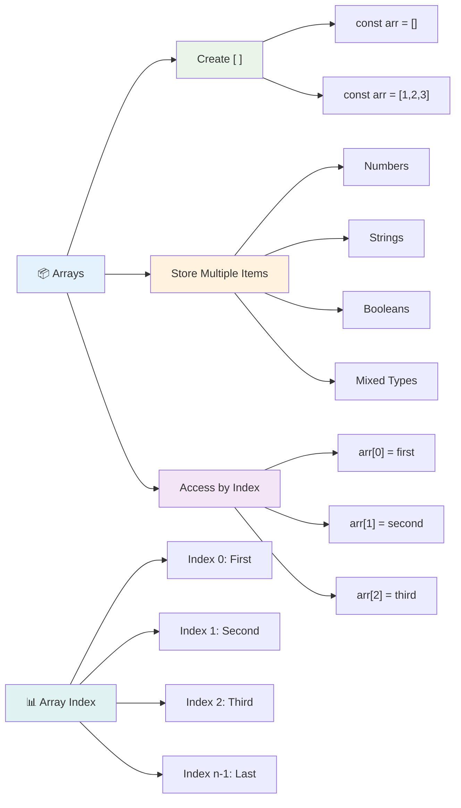

### אינדקסים במערכים

הנה משהו שעשוי להיראות מוזר בהתחלה: מערכים ממספרים את הפריטים שלהם החל מ-0, לא מ-1. אינדקסים מבוססי אפס נובעים מאופן הפעולה של זיכרון מחשב - זהו מוסכמה תכנותית מאז ימי השפות הראשונות כמו C. כל מקום במערך מקבל מספר כתובת משלו שנקרא **אינדקס**.

| אינדקס | ערך | תיאור |
|--------|-----|--------|
| 0 | "Chocolate" | פריט ראשון |
| 1 | "Strawberry" | פריט שני |
| 2 | "Vanilla" | פריט שלישי |
| 3 | "Pistachio" | פריט רביעי |
| 4 | "Rocky Road" | פריט חמישי |

✅ האם זה מפתיע אתכם שמערכים מתחילים באינדקס אפס? בשפות תכנות מסוימות, אינדקסים מתחילים ב-1. יש היסטוריה מעניינת סביב זה, אותה תוכלו [לקרוא בויקיפדיה](https://en.wikipedia.org/wiki/Zero-based_numbering).

**גישה לפריטי מערך:**

```javascript
const iceCreamFlavors = ["Chocolate", "Strawberry", "Vanilla", "Pistachio", "Rocky Road"];

// Access individual elements using bracket notation
console.log(iceCreamFlavors[0]); // "Chocolate" - first element
console.log(iceCreamFlavors[2]); // "Vanilla" - third element
console.log(iceCreamFlavors[4]); // "Rocky Road" - last element
```

**פירוט מה קורה כאן:**
- **משתמשים** בסוגריים מרובעים עם מספר האינדקס כדי לגשת לפריטים
- **מחזירים** את הערך המאוחסן במיקום הספציפי במערך
- **מתחילים** לספור מ-0, כך שהפריט הראשון הוא באינדקס 0

**שינוי פריטי מערך:**

```javascript
// Change an existing value
iceCreamFlavors[4] = "Butter Pecan";
console.log(iceCreamFlavors[4]); // "Butter Pecan"

// Add a new element at the end
iceCreamFlavors[5] = "Cookie Dough";
console.log(iceCreamFlavors[5]); // "Cookie Dough"
```

**בקטע הקוד למעלה:**
- **שינינו** את הפריט באינדקס 4 מ-"Rocky Road" ל-"Butter Pecan"
- **הוספנו** פריט חדש "Cookie Dough" באינדקס 5
- **הרחבנו** את אורך המערך באופן אוטומטי כשמוסיפים מעבר לגבולות הנוכחיים

### אורך מערך ושיטות נפוצות

למערכים יש תכונות ושיטות מובנות שמקלות על העבודה עם נתונים.

**מציאת אורך מערך:**

```javascript
const iceCreamFlavors = ["Chocolate", "Strawberry", "Vanilla", "Pistachio", "Rocky Road"];
console.log(iceCreamFlavors.length); // 5

// Length updates automatically as array changes
iceCreamFlavors.push("Mint Chip");
console.log(iceCreamFlavors.length); // 6
```

**נקודות חשובות לזכור:**
- **מחזיר** את מספר הפריטים הכולל במערך
- **מתעדכן** אוטומטית כשמוסיפים או מסירים פריטים
- **מספק** ספירה דינמית שימושית ללולאות ולאימות

**שיטות מערך חיוניות:**

```javascript
const fruits = ["apple", "banana", "orange"];

// Add elements
fruits.push("grape");           // Adds to end: ["apple", "banana", "orange", "grape"]
fruits.unshift("strawberry");   // Adds to beginning: ["strawberry", "apple", "banana", "orange", "grape"]

// Remove elements
const lastFruit = fruits.pop();        // Removes and returns "grape"
const firstFruit = fruits.shift();     // Removes and returns "strawberry"

// Find elements
const index = fruits.indexOf("banana"); // Returns 1 (position of "banana")
const hasApple = fruits.includes("apple"); // Returns true
```

**הבנת השיטות הללו:**
- **מוסיפים** פריטים עם `push()` (בסוף) ו-`unshift()` (בהתחלה)
- **מסירים** פריטים עם `pop()` (בסוף) ו-`shift()` (בהתחלה)
- **מאתרים** פריטים עם `indexOf()` ובודקים קיום עם `includes()`
- **מחזירים** ערכים שימושיים כמו פריטים שהוסרו או מיקומי אינדקס

✅ נסו בעצמכם! השתמשו בקונסול של הדפדפן כדי ליצור ולשנות מערך משלכם.

### 🧠 **בדיקת יסודות מערכים: ארגון הנתונים שלכם**

**בדקו את הבנתכם במערכים:**
- למה לדעתכם מערכים מתחילים לספור מ-0 ולא מ-1?
- מה קורה אם תנסו לגשת לאינדקס שלא קיים (כמו `arr[100]` במערך עם 5 פריטים)?
- האם תוכלו לחשוב על שלושה תרחישים אמיתיים שבהם מערכים יהיו שימושיים?

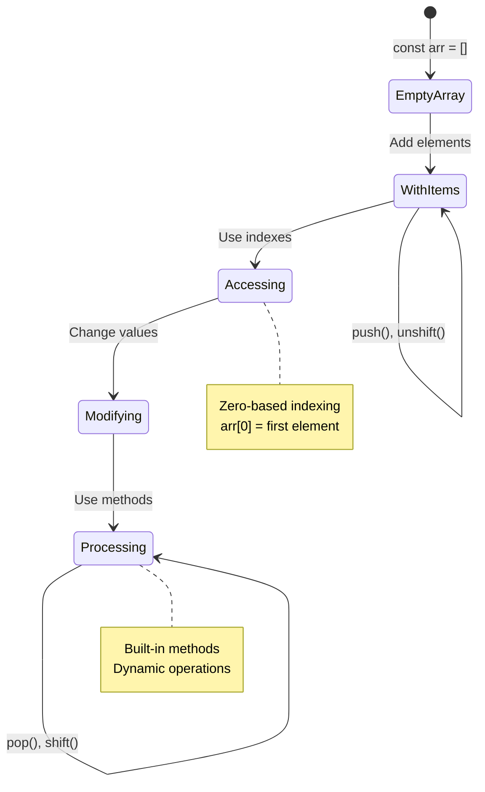

> **תובנה מעולם האמיתי**: מערכים נמצאים בכל מקום בתכנות! פידים ברשתות חברתיות, עגלות קניות, גלריות תמונות, שירים ברשימות השמעה - כולם מערכים מאחורי הקלעים!

## לולאות

חשבו על העונש המפורסם מספרי צ'ארלס דיקנס שבו תלמידים נאלצו לכתוב שורות שוב ושוב על לוח. דמיינו אם הייתם יכולים פשוט להורות למישהו "כתוב את המשפט הזה 100 פעמים" וזה היה נעשה אוטומטית. זה בדיוק מה שלולאות עושות עבור הקוד שלכם.

לולאות הן כמו עוזר בלתי נלאה שיכול לחזור על משימות ללא טעויות. בין אם אתם צריכים לבדוק כל פריט בעגלת קניות או להציג את כל התמונות באלבום, לולאות מטפלות בחזרה בצורה יעילה.

JavaScript מספק מספר סוגי לולאות לבחירה. בואו נבחן כל אחת ונבין מתי להשתמש בהן.

```mermaid
flowchart TD
    A["🔄 Loop Types"] --> B["For Loop"]
    A --> C["While Loop"]
    A --> D["For...of Loop"]
    A --> E["forEach Method"]
    
    B --> B1["Known iterations"]
    B --> B2["Counter-based"]
    B --> B3["for(init; condition; increment)"]
    
    C --> C1["Unknown iterations"]
    C --> C2["Condition-based"]
    C --> C3["while(condition)"]
    
    D --> D1["Modern ES6+"]
    D --> D2["Array iteration"]
    D --> D3["for(item of array)"]
    
    E --> E1["Functional style"]
    E --> E2["Array method"]
    E --> E3["array.forEach(callback)"]
    
    F["⏰ When to Use"] --> F1["For: Counting, indexes"]
    F --> F2["While: User input, searching"]
    F --> F3["For...of: Simple iteration"]
    F --> F4["forEach: Functional programming"]
    
    style A fill:#e3f2fd
    style B fill:#e8f5e8
    style C fill:#fff3e0
    style D fill:#f3e5f5
    style E fill:#e0f2f1
    style F fill:#fce4ec
```

### לולאת For

לולאת `for` היא כמו הגדרת טיימר - אתם יודעים בדיוק כמה פעמים אתם רוצים שמשהו יקרה. היא מאוד מאורגנת וצפויה, מה שהופך אותה למושלמת כשעובדים עם מערכים או צריכים לספור דברים.

**מבנה לולאת For:**

| רכיב | מטרה | דוגמה |
|------|------|-------|
| **אתחול** | קובע נקודת התחלה | `let i = 0` |
| **תנאי** | מתי להמשיך | `i < 10` |
| **הגדלה** | איך לעדכן | `i++` |

```javascript
// Counting from 0 to 9
for (let i = 0; i < 10; i++) {
  console.log(`Count: ${i}`);
}

// More practical example: processing scores
const testScores = [85, 92, 78, 96, 88];
for (let i = 0; i < testScores.length; i++) {
  console.log(`Student ${i + 1}: ${testScores[i]}%`);
}
```

**שלב אחר שלב, הנה מה שקורה:**
- **מאתחלים** את משתנה המונה `i` ל-0 בתחילת הלולאה
- **בודקים** את התנאי `i < 10` לפני כל איטרציה
- **מבצעים** את קטע הקוד כשהתנאי נכון
- **מגדילים** את `i` ב-1 אחרי כל איטרציה עם `i++`
- **עוצרים** כשהתנאי הופך לשקרי (כש-`i` מגיע ל-10)

✅ הריצו את הקוד הזה בקונסול של הדפדפן. מה קורה כשאתם מבצעים שינויים קטנים במונה, בתנאי או בביטוי האיטרציה? האם תוכלו לגרום ללולאה לרוץ אחורה, ליצור ספירה לאחור?

### 🗓️ **בדיקת שליטה בלולאת For: חזרה מבוקרת**

**העריכו את הבנתכם בלולאת for:**
- מהם שלושת החלקים של לולאת for ומה תפקידו של כל אחד?
- איך הייתם מבצעים לולאה על מערך אחורה?
- מה קורה אם תשכחו את חלק ההגדלה (`i++`)?

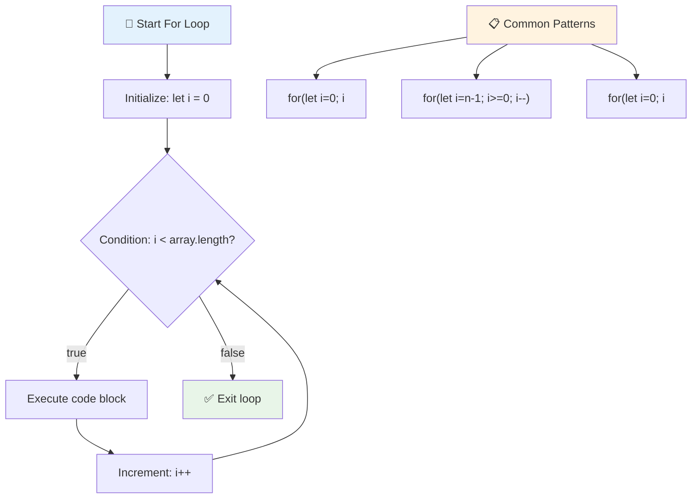

> **חוכמת לולאות**: לולאות for מושלמות כשאתם יודעים בדיוק כמה פעמים אתם צריכים לחזור על משהו. הן הבחירה הנפוצה ביותר לעיבוד מערכים!

### לולאת While

לולאת `while` היא כמו לומר "תמשיך לעשות את זה עד ש..." - ייתכן שלא תדעו בדיוק כמה פעמים היא תפעל, אבל תדעו מתי לעצור. היא מושלמת לדברים כמו בקשת קלט מהמשתמש עד שהוא נותן לכם את מה שאתם צריכים, או חיפוש נתונים עד שתמצאו את מה שאתם מחפשים.

**מאפייני לולאת While:**
- **ממשיכה** לפעול כל עוד התנאי נכון
- **דורשת** ניהול ידני של משתני מונה
- **בודקת** את התנאי לפני כל איטרציה
- **מסכנת** לולאות אינסופיות אם התנאי לעולם לא הופך לשקרי

```javascript
// Basic counting example
let i = 0;
while (i < 10) {
  console.log(`While count: ${i}`);
  i++; // Don't forget to increment!
}

// More practical example: processing user input
let userInput = "";
let attempts = 0;
const maxAttempts = 3;

while (userInput !== "quit" && attempts < maxAttempts) {
  userInput = prompt(`Enter 'quit' to exit (attempt ${attempts + 1}):`);
  attempts++;
}

if (attempts >= maxAttempts) {
  console.log("Maximum attempts reached!");
}
```

**הבנת הדוגמאות הללו:**
- **מנהלת** את משתנה המונה `i` ידנית בתוך גוף הלולאה
- **מגדילה** את המונה כדי למנוע לולאות אינסופיות
- **מדגימה** שימוש מעשי עם קלט משתמש והגבלת ניסיונות
- **כוללת** מנגנוני בטיחות למניעת ביצוע אינסופי

### ♾️ **בדיקת חוכמת לולאת While: חזרה מבוססת תנאי**

**בדקו את הבנתכם בלולאת while:**
- מהו הסיכון העיקרי בשימוש בלולאות while?
- מתי הייתם בוחרים בלולאת while על פני לולאת for?
- איך ניתן למנוע לולאות אינסופיות?

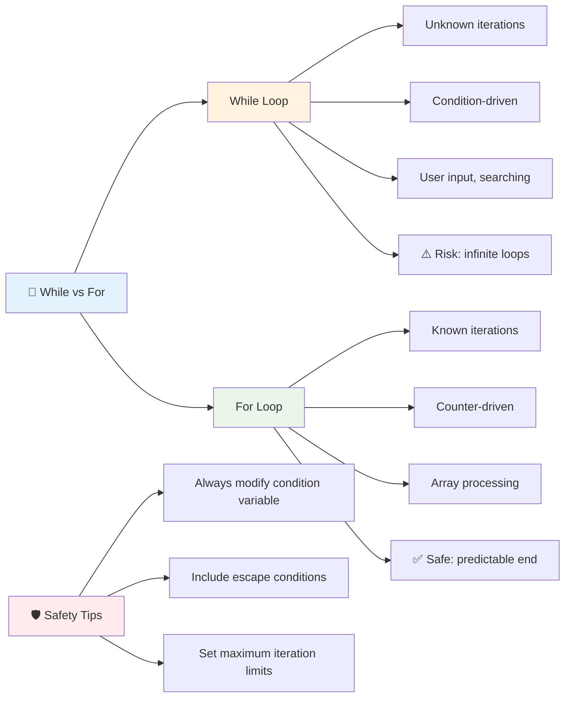

> **בטיחות תחילה**: לולאות while הן חזקות אך דורשות ניהול תנאים זהיר. תמיד וודאו שהתנאי שלכם יהפוך לשקרי בסופו של דבר!

### חלופות מודרניות ללולאות

JavaScript מציע תחביר לולאות מודרני שיכול להפוך את הקוד שלכם לקריא יותר ופחות נוטה לטעויות.

**לולאת For...of (ES6+):**

```javascript
const colors = ["red", "green", "blue", "yellow"];

// Modern approach - cleaner and safer
for (const color of colors) {
  console.log(`Color: ${color}`);
}

// Compare with traditional for loop
for (let i = 0; i < colors.length; i++) {
  console.log(`Color: ${colors[i]}`);
}
```

**יתרונות מרכזיים של for...of:**
- **מבטלת** את הצורך בניהול אינדקסים וסיכוני טעויות
- **מספקת** גישה ישירה לפריטי מערך
- **משפרת** את קריאות הקוד ומפחיתה את מורכבות התחביר

**שיטת forEach:**

```javascript
const prices = [9.99, 15.50, 22.75, 8.25];

// Using forEach for functional programming style
prices.forEach((price, index) => {
  console.log(`Item ${index + 1}: $${price.toFixed(2)}`);
});

// forEach with arrow functions for simple operations
prices.forEach(price => console.log(`Price: $${price}`));
```

**מה שצריך לדעת על forEach:**
- **מבצעת** פונקציה עבור כל פריט במערך
- **מספקת** גם את ערך הפריט וגם את האינדקס כפרמטרים
- **לא ניתן** לעצור אותה מוקדם (בניגוד ללולאות מסורתיות)
- **מחזירה** undefined (לא יוצרת מערך חדש)

✅ למה הייתם בוחרים בלולאת for לעומת לולאת while? 17K צופים שאלו את אותה שאלה ב-StackOverflow, וחלק מהדעות [עשויות לעניין אתכם](https://stackoverflow.com/questions/39969145/while-loops-vs-for-loops-in-javascript).

### 🎨 **בדיקת תחביר לולאות מודרני: אימוץ ES6+**

**העריכו את הבנתכם ב-JavaScript מודרני:**
- מהם היתרונות של `for...of` על פני לולאות for מסורתיות?
- מתי עדיין תעדיפו לולאות for מסורתיות?
- מה ההבדל בין `forEach` ל-`map`?

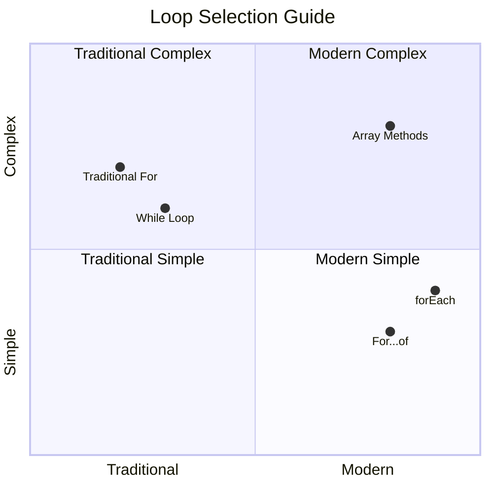

> **מגמה מודרנית**: תחביר ES6+ כמו `for...of` ו-`forEach` הופך לגישה המועדפת לעיבוד מערכים בגלל שהוא נקי יותר ופחות נוטה לטעויות!

## לולאות ומערכים

שילוב מערכים עם לולאות יוצר יכולות עיבוד נתונים עוצמתיות. השילוב הזה הוא בסיסי למשימות תכנות רבות, החל מהצגת רשימות ועד חישוב סטטיסטיקות.

**עיבוד מערכים מסורתי:**

```javascript
const iceCreamFlavors = ["Chocolate", "Strawberry", "Vanilla", "Pistachio", "Rocky Road"];

// Classic for loop approach
for (let i = 0; i < iceCreamFlavors.length; i++) {
  console.log(`Flavor ${i + 1}: ${iceCreamFlavors[i]}`);
}

// Modern for...of approach
for (const flavor of iceCreamFlavors) {
  console.log(`Available flavor: ${flavor}`);
}
```

**בואו נבין כל גישה:**
- **משתמשים** בתכונת אורך המערך כדי לקבוע את גבול הלולאה
- **ניגשים** לפריטים לפי אינדקס בלולאות for מסורתיות
- **מספקים** גישה ישירה לפריטים בלולאות for...of
- **מעבדים** כל פריט במערך בדיוק פעם אחת

**דוגמה לעיבוד נתונים מעשי:**

```javascript
const studentGrades = [85, 92, 78, 96, 88, 73, 89];
let total = 0;
let highestGrade = studentGrades[0];
let lowestGrade = studentGrades[0];

// Process all grades with a single loop
for (let i = 0; i < studentGrades.length; i++) {
  const grade = studentGrades[i];
  total += grade;
  
  if (grade > highestGrade) {
    highestGrade = grade;
  }
  
  if (grade < lowestGrade) {
    lowestGrade = grade;
  }
}

const average = total / studentGrades.length;
console.log(`Average: ${average.toFixed(1)}`);
console.log(`Highest: ${highestGrade}`);
console.log(`Lowest: ${lowestGrade}`);
```

**כך הקוד הזה עובד:**
- **מאתחלים** משתני מעקב לסכום ולערכים קיצוניים
- **מעבדים** כל ציון בלולאה יעילה אחת
- **מצטברים** את הסכום לחישוב ממוצע
- **עוקבים** אחרי הערכים הגבוהים והנמוכים במהלך האיטרציה
- **מחשבים** סטטיסטיקות סופיות לאחר סיום הלולאה

✅ נסו לבצע לולאה על מערך משלכם בקונסול של הדפדפן.

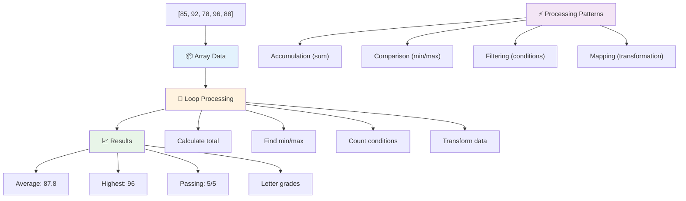

---

## אתגר סוכן GitHub Copilot 🚀

השתמשו במצב סוכן כדי להשלים את האתגר הבא:

**תיאור:** בנו פונקציית עיבוד נתונים מקיפה שמשלבת מערכים ולולאות כדי לנתח מערך נתונים וליצור תובנות משמעותיות.

**הנחיה:** צרו פונקציה בשם `analyzeGrades` שמקבלת מערך של אובייקטים עם ציוני תלמידים (כל אחד מכיל שם ותכונת ציון) ומחזירה אובייקט עם סטטיסטיקות כולל הציון הגבוה ביותר, הציון הנמוך ביותר, ציון ממוצע, מספר התלמידים שעברו (ציון >= 70), ומערך שמות התלמידים שקיבלו מעל הממוצע. השתמשו לפחות בשני סוגי לולאות שונים בפתרון שלכם.

למדו עוד על [מצב סוכן](https://code.visualstudio.com/blogs/2025/02/24/introducing-copilot-agent-mode) כאן.

## 🚀 אתגר
JavaScript מציע מספר שיטות מודרניות לעבודה עם מערכים שיכולות להחליף לולאות מסורתיות עבור משימות ספציפיות. חקור את [forEach](https://developer.mozilla.org/docs/Web/JavaScript/Reference/Global_Objects/Array/forEach), [for-of](https://developer.mozilla.org/docs/Web/JavaScript/Reference/Statements/for...of), [map](https://developer.mozilla.org/docs/Web/JavaScript/Reference/Global_Objects/Array/map), [filter](https://developer.mozilla.org/docs/Web/JavaScript/Reference/Global_Objects/Array/filter), ו-[reduce](https://developer.mozilla.org/docs/Web/JavaScript/Reference/Global_Objects/Array/reduce).

**האתגר שלך:** כתוב מחדש את דוגמת ציוני התלמידים תוך שימוש בלפחות שלוש שיטות מערך שונות. שים לב כמה הקוד הופך להיות נקי וקריא יותר עם תחביר מודרני של JavaScript.

## שאלון לאחר ההרצאה
[שאלון לאחר ההרצאה](https://ff-quizzes.netlify.app/web/quiz/14)

## סקירה ולימוד עצמי

למערכים ב-JavaScript יש שיטות רבות שמחוברות אליהם, והן שימושיות מאוד לעיבוד נתונים. [קרא על השיטות הללו](https://developer.mozilla.org/docs/Web/JavaScript/Reference/Global_Objects/Array) ונסה כמה מהן (כמו push, pop, slice ו-splice) על מערך שיצרת בעצמך.

## משימה

[לולאה על מערך](assignment.md)

---

## 📊 **סיכום ערכת הכלים שלך למערכים ולולאות**

```mermaid
graph TD
    A["🎯 Arrays & Loops Mastery"] --> B["📦 Array Fundamentals"]
    A --> C["🔄 Loop Types"]
    A --> D["🔗 Data Processing"]
    A --> E["🎨 Modern Techniques"]
    
    B --> B1["Creation: [ ]"]
    B --> B2["Indexing: arr[0]"]
    B --> B3["Methods: push, pop"]
    B --> B4["Properties: length"]
    
    C --> C1["For: Known iterations"]
    C --> C2["While: Condition-based"]
    C --> C3["For...of: Direct access"]
    C --> C4["forEach: Functional"]
    
    D --> D1["Statistics calculation"]
    D --> D2["Data transformation"]
    D --> D3["Filtering & searching"]
    D --> D4["Real-time processing"]
    
    E --> E1["Arrow functions"]
    E --> E2["Method chaining"]
    E --> E3["Destructuring"]
    E --> E4["Template literals"]
    
    F["💡 Key Benefits"] --> F1["Efficient data handling"]
    F --> F2["Reduced code repetition"]
    F --> F3["Scalable solutions"]
    F --> F4["Cleaner syntax"]
    
    style A fill:#e3f2fd
    style B fill:#e8f5e8
    style C fill:#fff3e0
    style D fill:#f3e5f5
    style E fill:#e0f2f1
    style F fill:#fce4ec
```

---

## 🚀 ציר הזמן שלך לשליטה במערכים ולולאות

### ⚡ **מה ניתן לעשות ב-5 הדקות הקרובות**
- [ ] צור מערך של הסרטים האהובים עליך וגשת לאלמנטים ספציפיים
- [ ] כתוב לולאת for שסופרת מ-1 עד 10
- [ ] נסה את אתגר שיטות המערכים המודרניות מהשיעור
- [ ] תרגל אינדקסים של מערכים בקונסול של הדפדפן שלך

### 🎯 **מה ניתן להשיג בשעה הקרובה**
- [ ] השלם את שאלון לאחר השיעור וסקור מושגים מאתגרים
- [ ] בנה מנתח ציונים מקיף מאתגר GitHub Copilot
- [ ] צור עגלת קניות פשוטה שמוסיפה ומסירה פריטים
- [ ] תרגל המרה בין סוגי לולאות שונים
- [ ] נסה שיטות מערכים כמו `push`, `pop`, `slice`, ו-`splice`

### 📅 **מסע עיבוד הנתונים שלך לשבוע**
- [ ] השלם את משימת "לולאה על מערך" עם שיפורים יצירתיים
- [ ] בנה אפליקציית רשימת משימות באמצעות מערכים ולולאות
- [ ] צור מחשבון סטטיסטיקות פשוט עבור נתונים מספריים
- [ ] תרגל עם [שיטות מערכים ב-MDN](https://developer.mozilla.org/docs/Web/JavaScript/Reference/Global_Objects/Array)
- [ ] בנה ממשק גלריית תמונות או רשימת השמעה מוזיקלית
- [ ] חקור תכנות פונקציונלי עם `map`, `filter`, ו-`reduce`

### 🌟 **השינוי שלך לחודש**
- [ ] שלוט בפעולות מערכים מתקדמות ואופטימיזציה של ביצועים
- [ ] בנה לוח מחוונים מלא לעיבוד נתונים
- [ ] תרום לפרויקטים בקוד פתוח שכוללים עיבוד נתונים
- [ ] למד מישהו אחר על מערכים ולולאות עם דוגמאות מעשיות
- [ ] צור ספרייה אישית של פונקציות לעיבוד נתונים לשימוש חוזר
- [ ] חקור אלגוריתמים ומבני נתונים המבוססים על מערכים

### 🏆 **בדיקת סיום של אלוף עיבוד הנתונים**

**חגוג את השליטה שלך במערכים ולולאות:**
- מהי פעולת המערך הכי שימושית שלמדת עבור יישומים בעולם האמיתי?
- איזה סוג לולאה מרגיש לך הכי טבעי ולמה?
- איך הבנת מערכים ולולאות שינתה את הגישה שלך לארגון נתונים?
- איזה משימת עיבוד נתונים מורכבת היית רוצה להתמודד איתה בהמשך?

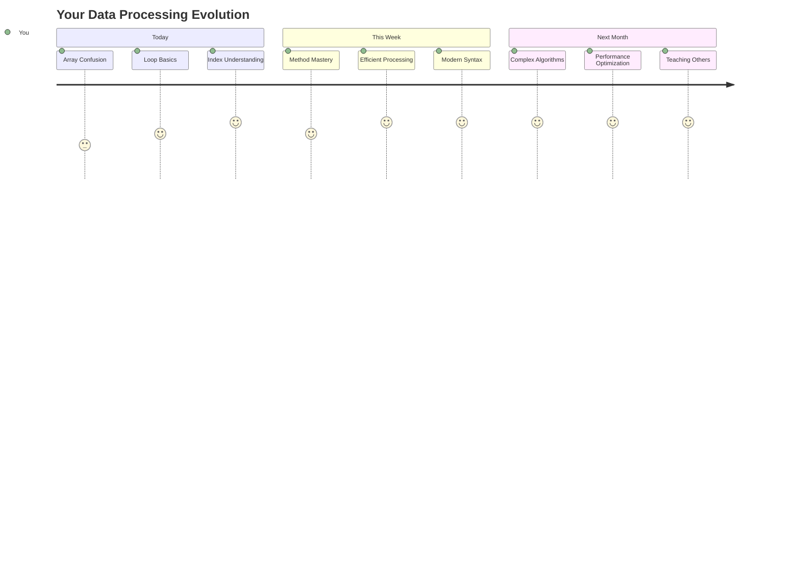

> 📦 **שחררת את הכוח של ארגון ועיבוד נתונים!** מערכים ולולאות הם הבסיס כמעט לכל אפליקציה שתבנה אי פעם. מרשימות פשוטות ועד ניתוח נתונים מורכב, עכשיו יש לך את הכלים להתמודד עם מידע בצורה יעילה ואלגנטית. כל אתר דינמי, אפליקציה לנייד ואפליקציה מבוססת נתונים מסתמכים על מושגים בסיסיים אלו. ברוך הבא לעולם של עיבוד נתונים בקנה מידה גדול! 🎉

---

**כתב ויתור**:  
מסמך זה תורגם באמצעות שירות תרגום AI [Co-op Translator](https://github.com/Azure/co-op-translator). למרות שאנו שואפים לדיוק, יש להיות מודעים לכך שתרגומים אוטומטיים עשויים להכיל שגיאות או אי דיוקים. המסמך המקורי בשפתו המקורית צריך להיחשב כמקור סמכותי. עבור מידע קריטי, מומלץ להשתמש בתרגום מקצועי אנושי. איננו אחראים לאי הבנות או לפרשנויות שגויות הנובעות משימוש בתרגום זה.