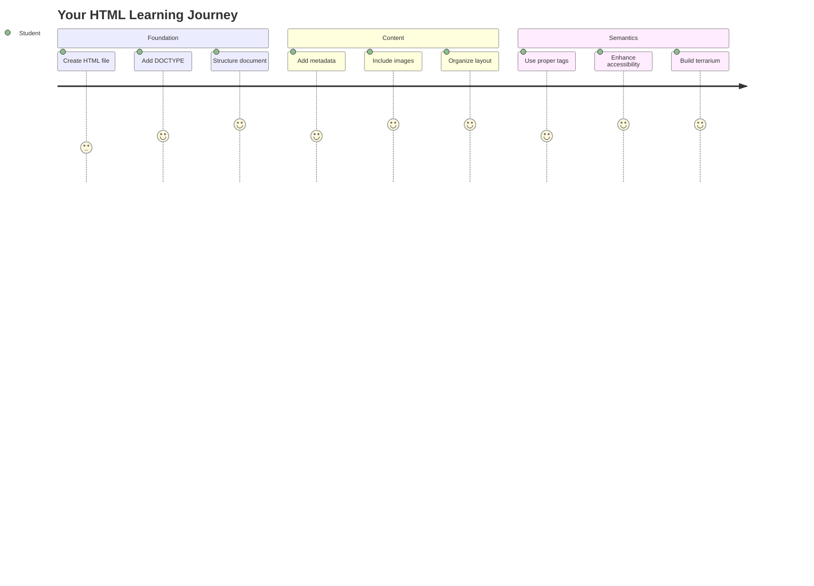
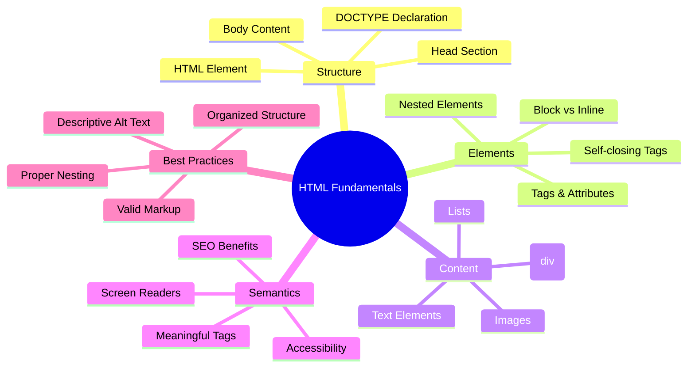
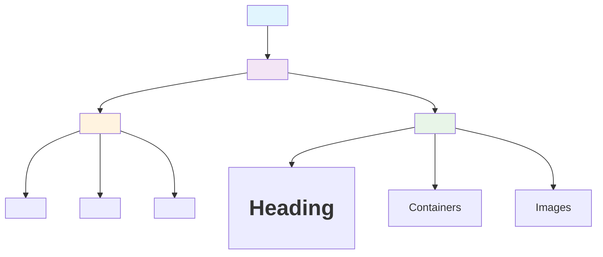
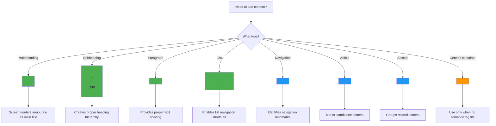
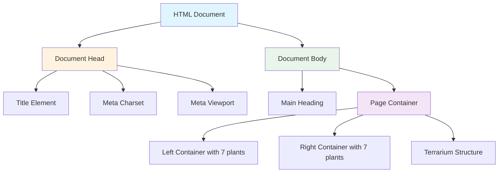
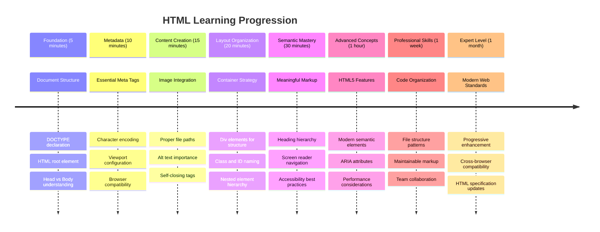

<!--
CO_OP_TRANSLATOR_METADATA:
{
  "original_hash": "3fcfa99c4897e051b558b5eaf1e8cc74",
  "translation_date": "2025-11-04T02:26:22+00:00",
  "source_file": "3-terrarium/1-intro-to-html/README.md",
  "language_code": "he"
}
-->
# פרויקט טרריום חלק 1: מבוא ל-HTML




> סקיצה מאת [Tomomi Imura](https://twitter.com/girlie_mac)

HTML, או HyperText Markup Language, הוא הבסיס לכל אתר שביקרת בו אי פעם. חשבו על HTML כשלד שמעניק מבנה לדפי אינטרנט – הוא מגדיר היכן התוכן נמצא, איך הוא מאורגן ומה כל חלק מייצג. בעוד ש-CSS "ילביש" את ה-HTML בצבעים ובפריסות, ו-JavaScript יעניק לו חיים עם אינטראקטיביות, HTML מספק את המבנה הבסיסי שמאפשר את כל השאר.

בשיעור הזה, תיצרו את מבנה ה-HTML לממשק טרריום וירטואלי. הפרויקט המעשי הזה ילמד אתכם מושגי HTML בסיסיים תוך כדי בניית משהו חזותי ומעניין. תלמדו איך לארגן תוכן באמצעות אלמנטים סמנטיים, לעבוד עם תמונות וליצור את הבסיס ליישום אינטרנט אינטראקטיבי.

בסוף השיעור, יהיה לכם דף HTML עובד שמציג תמונות של צמחים בעמודות מאורגנות, מוכן לעיצוב בשיעור הבא. אל תדאגו אם זה נראה בסיסי בהתחלה – זה בדיוק מה ש-HTML אמור לעשות לפני ש-CSS מוסיף את הליטוש החזותי.



## שאלון לפני השיעור

[שאלון לפני השיעור](https://ff-quizzes.netlify.app/web/quiz/15)

> 📺 **צפו ולמדו**: צפו בסרטון סקירה מועיל
> 
> [](https://www.youtube.com/watch?v=1TvxJKBzhyQ)

## הכנת הפרויקט שלכם

לפני שנצלול לקוד HTML, בואו נכין סביבת עבודה מסודרת לפרויקט הטרריום שלכם. יצירת מבנה קבצים מאורגן מההתחלה היא הרגל חשוב שישרת אתכם לאורך כל מסע פיתוח האינטרנט שלכם.

### משימה: יצירת מבנה הפרויקט שלכם

תיצרו תיקייה ייעודית לפרויקט הטרריום שלכם ותוסיפו את קובץ ה-HTML הראשון שלכם. הנה שתי גישות שתוכלו להשתמש בהן:

**אפשרות 1: שימוש ב-Visual Studio Code**
1. פתחו את Visual Studio Code
2. לחצו על "File" → "Open Folder" או השתמשו ב-`Ctrl+K, Ctrl+O` (Windows/Linux) או `Cmd+K, Cmd+O` (Mac)
3. צרו תיקייה חדשה בשם `terrarium` ובחרו אותה
4. בלוח ה-Explorer, לחצו על אייקון "New File"
5. תנו לקובץ את השם `index.html`


**אפשרות 2: שימוש בפקודות טרמינל**
```bash
mkdir terrarium
cd terrarium
touch index.html
code index.html
```

**מה הפקודות הללו מבצעות:**
- **יוצרות** תיקייה חדשה בשם `terrarium` לפרויקט שלכם
- **מנווטות** לתוך תיקיית הטרריום
- **יוצרות** קובץ `index.html` ריק
- **פותחות** את הקובץ ב-Visual Studio Code לעריכה

> 💡 **טיפ מקצועי**: שם הקובץ `index.html` הוא מיוחד בפיתוח אתרים. כאשר מישהו מבקר באתר, דפדפנים מחפשים אוטומטית את `index.html` כדף ברירת המחדל להצגה. זה אומר שכתובת כמו `https://mysite.com/projects/` תציג אוטומטית את קובץ `index.html` מתוך תיקיית `projects` מבלי צורך לציין את שם הקובץ בכתובת.

## הבנת מבנה מסמך HTML

כל מסמך HTML עוקב אחר מבנה ספציפי שהדפדפנים צריכים להבין ולהציג בצורה נכונה. חשבו על מבנה זה כמו מכתב רשמי – יש לו אלמנטים נדרשים בסדר מסוים שעוזרים למקבל (במקרה הזה, הדפדפן) לעבד את התוכן בצורה נכונה.



בואו נתחיל בהוספת הבסיס החיוני שכל מסמך HTML צריך.

### הצהרת DOCTYPE ואלמנט השורש

שני השורות הראשונות של כל קובץ HTML משמשות כ"הקדמה" של המסמך לדפדפן:

```html
<!DOCTYPE html>
<html></html>
```

**הבנת מה הקוד הזה עושה:**
- **מצהיר** על סוג המסמך כ-HTML5 באמצעות `<!DOCTYPE html>`
- **יוצר** את אלמנט השורש `<html>` שיכיל את כל תוכן הדף
- **מבסס** סטנדרטים מודרניים של אינטרנט להצגה נכונה בדפדפנים
- **מבטיח** תצוגה עקבית בין דפדפנים ומכשירים שונים

> 💡 **טיפ VS Code**: רחפו מעל כל תג HTML ב-VS Code כדי לראות מידע מועיל מ-MDN Web Docs, כולל דוגמאות שימוש ופרטי תאימות לדפדפנים.

> 📚 **למדו עוד**: הצהרת DOCTYPE מונעת מדפדפנים להיכנס ל"מצב quirks", ששימש לתמיכה באתרים ישנים מאוד. פיתוח אינטרנט מודרני משתמש בהצהרה הפשוטה `<!DOCTYPE html>` כדי להבטיח [תצוגה תואמת סטנדרטים](https://developer.mozilla.org/docs/Web/HTML/Quirks_Mode_and_Standards_Mode).

### 🔄 **בדיקה פדגוגית**
**עצירה והרהור**: לפני שתמשיכו, ודאו שאתם מבינים:
- ✅ למה כל מסמך HTML צריך הצהרת DOCTYPE
- ✅ מה מכיל אלמנט השורש `<html>`
- ✅ איך מבנה זה עוזר לדפדפנים להציג דפים בצורה נכונה

**מבחן עצמי מהיר**: האם תוכלו להסביר במילים שלכם מה משמעות "תצוגה תואמת סטנדרטים"?

## הוספת מטא-נתונים חיוניים למסמך

החלק `<head>` של מסמך HTML מכיל מידע חיוני שדפדפנים ומנועי חיפוש צריכים, אך המבקרים לא רואים ישירות בדף. חשבו על זה כמידע "מאחורי הקלעים" שעוזר לדף האינטרנט שלכם לעבוד בצורה נכונה ולהופיע בצורה נכונה במכשירים ופלטפורמות שונות.

מטא-נתונים אלו אומרים לדפדפנים איך להציג את הדף שלכם, איזה קידוד תווים להשתמש, ואיך להתמודד עם גדלי מסך שונים – הכל חיוני ליצירת דפי אינטרנט מקצועיים ונגישים.

### משימה: הוסיפו את החלק הראשי של המסמך

הכניסו את החלק `<head>` הזה בין תגי הפתיחה והסגירה של `<html>`:

```html
<head>
	<title>Welcome to my Virtual Terrarium</title>
	<meta charset="utf-8" />
	<meta http-equiv="X-UA-Compatible" content="IE=edge" />
	<meta name="viewport" content="width=device-width, initial-scale=1" />
</head>
```

**פירוט מה כל אלמנט מבצע:**
- **מגדיר** את כותרת הדף שמופיעה בלשוניות הדפדפן ובתוצאות חיפוש
- **מציין** קידוד תווים UTF-8 להצגת טקסט בצורה נכונה ברחבי העולם
- **מבטיח** תאימות עם גרסאות מודרניות של Internet Explorer
- **מגדיר** עיצוב רספונסיבי על ידי התאמת ה-viewport לרוחב המכשיר
- **שולט** ברמת הזום ההתחלתית להצגת תוכן בגודל טבעי

> 🤔 **חשבו על זה**: מה יקרה אם תגדירו תג מטא viewport כמו זה: `<meta name="viewport" content="width=600">`? זה יגרום לדף להיות תמיד ברוחב של 600 פיקסלים, מה שישבור את העיצוב הרספונסיבי! למדו עוד על [הגדרת viewport נכונה](https://developer.mozilla.org/docs/Web/HTML/Viewport_meta_tag).

## בניית גוף המסמך

האלמנט `<body>` מכיל את כל התוכן הנראה של דף האינטרנט שלכם – כל מה שהמשתמשים יראו ויתקשרו איתו. בעוד שהחלק `<head>` סיפק הוראות לדפדפן, החלק `<body>` מכיל את התוכן עצמו: טקסט, תמונות, כפתורים ואלמנטים אחרים שיוצרים את ממשק המשתמש שלכם.

בואו נוסיף את מבנה הגוף ונבין איך תגי HTML עובדים יחד כדי ליצור תוכן משמעותי.

### הבנת מבנה תגי HTML

HTML משתמש בתגים זוגיים כדי להגדיר אלמנטים. לרוב התגים יש תג פתיחה כמו `<p>` ותג סגירה כמו `</p>`, עם תוכן ביניהם: `<p>Hello, world!</p>`. זה יוצר אלמנט פסקה שמכיל את הטקסט "Hello, world!".

### משימה: הוסיפו את אלמנט הגוף

עדכנו את קובץ ה-HTML שלכם כדי לכלול את האלמנט `<body>`:

```html
<!DOCTYPE html>
<html>
	<head>
		<title>Welcome to my Virtual Terrarium</title>
		<meta charset="utf-8" />
		<meta http-equiv="X-UA-Compatible" content="IE=edge" />
		<meta name="viewport" content="width=device-width, initial-scale=1" />
	</head>
	<body></body>
</html>
```

**מה המבנה המלא הזה מספק:**
- **מבסס** את מסגרת המסמך הבסיסית של HTML5
- **כולל** מטא-נתונים חיוניים להצגה נכונה בדפדפנים
- **יוצר** גוף ריק מוכן לתוכן הנראה שלכם
- **עוקב** אחרי שיטות עבודה מומלצות בפיתוח אינטרנט מודרני

עכשיו אתם מוכנים להוסיף את האלמנטים הנראים של הטרריום שלכם. נשתמש באלמנטים `<div>` כקונטיינרים לארגון חלקים שונים של תוכן, ובאלמנטים `` להצגת תמונות הצמחים.

### עבודה עם תמונות וקונטיינרים לפריסה

תמונות הן מיוחדות ב-HTML כי הן משתמשות בתגים "סוגרים עצמם". בניגוד לאלמנטים כמו `<p></p>` שעוטפים תוכן, תג `` מכיל את כל המידע שהוא צריך בתוך התג עצמו באמצעות מאפיינים כמו `src` לנתיב קובץ התמונה ו-`alt` לנגישות.

לפני שתוסיפו תמונות ל-HTML שלכם, תצטרכו לארגן את קבצי הפרויקט שלכם בצורה נכונה על ידי יצירת תיקיית תמונות והוספת גרפיקות הצמחים.

**ראשית, הכינו את התמונות שלכם:**
1. צרו תיקייה בשם `images` בתוך תיקיית פרויקט הטרריום שלכם
2. הורידו את תמונות הצמחים מתיקיית [הפתרון](../../../../3-terrarium/solution/images) (14 תמונות צמחים בסך הכל)
3. העתיקו את כל תמונות הצמחים לתוך תיקיית `images` החדשה שלכם

### משימה: צרו את פריסת תצוגת הצמחים

עכשיו הוסיפו את תמונות הצמחים מאורגנות בשתי עמודות בין תגי `<body></body>`:

```html
<div id="page">
	<div id="left-container" class="container">
		<div class="plant-holder">
			
		</div>
		<div class="plant-holder">
			
		</div>
		<div class="plant-holder">
			
		</div>
		<div class="plant-holder">
			
		</div>
		<div class="plant-holder">
			
		</div>
		<div class="plant-holder">
			
		</div>
		<div class="plant-holder">
			
		</div>
	</div>
	<div id="right-container" class="container">
		<div class="plant-holder">
			
		</div>
		<div class="plant-holder">
			
		</div>
		<div class="plant-holder">
			
		</div>
		<div class="plant-holder">
			
		</div>
		<div class="plant-holder">
			
		</div>
		<div class="plant-holder">
			
		</div>
		<div class="plant-holder">
			
		</div>
	</div>
</div>
```

**שלב אחר שלב, מה קורה בקוד הזה:**
- **יוצר** קונטיינר עמוד ראשי עם `id="page"` שמחזיק את כל התוכן
- **מבסס** שני קונטיינרים לעמודות: `left-container` ו-`right-container`
- **מארגן** 7 צמחים בעמודה השמאלית ו-7 צמחים בעמודה הימנית
- **עוטף** כל תמונת צמח ב-div `plant-holder` למיקום אישי
- **מיישם** שמות מחלקה עקביים לעיצוב CSS בשיעור הבא
- **מעניק** מזהים ייחודיים לכל תמונת צמח לאינטראקציה עם JavaScript בהמשך
- **כולל** נתיבי קבצים נכונים שמצביעים על תיקיית התמונות

> 🤔 **חשבו על זה**: שימו לב שכל התמונות כרגע מכילות את אותו טקסט alt "plant". זה לא אידיאלי לנגישות. משתמשי קוראי מסך ישמעו "plant" חוזר 14 פעמים מבלי לדעת איזה צמח כל תמונה מציגה. האם תוכלו לחשוב על טקסט alt טוב יותר, יותר תיאורי, לכל תמונה?

> 📝 **סוגי אלמנטים HTML**: אלמנטים `<div>` הם "ברמת בלוק" ותופסים רוחב מלא, בעוד שאלמנטים `<span>` הם "בקו" ותופסים רק את הרוחב הנדרש. מה לדעתכם יקרה אם תשנו את כל תגי `<div>` הללו לתגי `<span>`?

### 🔄 **בדיקה פדגוגית**
**הבנת מבנה**: קחו רגע לסקור את מבנה ה-HTML שלכם:
- ✅ האם אתם יכולים לזהות את הקונטיינרים הראשיים בפריסה שלכם?
- ✅ האם אתם מבינים למה לכל תמונה יש מזהה ייחודי?
- ✅ איך הייתם מתארים את מטרת ה-divs `plant-holder`?

**בדיקה חזותית**: פתחו את קובץ ה-HTML שלכם בדפדפן. אתם אמורים לראות:
- רשימה בסיסית של תמונות צמחים
- תמונות מאורגנות בשתי עמודות
- פריסה פשוטה ולא מעוצבת

**זכרו**: המראה הפשוט הזה הוא בדיוק איך ש-HTML אמור להיראות לפני עיצוב CSS!

עם סימון זה שנוסף, הצמחים יופיעו על המסך, למרות שהם עדיין לא ייראו מלוטשים – זה מה ש-CSS נועד לעשות בשיעור הבא! לעת עתה, יש לכם בסיס HTML מוצק שמארגן את התוכן שלכם בצורה נכונה ועוקב אחרי שיטות עבודה מומלצות לנגישות.

## שימוש ב-HTML סמנטי לנגישות

HTML סמנטי פירושו בחירת אלמנטים HTML על בסיס משמעותם ומטרתם, לא רק על בסיס המראה שלהם. כשאתם משתמשים בסימון סמנטי, אתם מתקשרים את המבנה והמשמעות של התוכן שלכם לדפדפנים, מנועי חיפוש וטכנולוגיות מסייעות כמו קוראי מסך.



גישה זו הופכת את האתרים שלכם לנגישים יותר למשתמשים עם מוגבלויות ועוזרת למנועי חיפוש להבין טוב יותר את התוכן שלכם. זהו עקרון יסוד של פיתוח אינטרנט מודרני שיוצר חוויות טובות יותר לכולם.

### הוספת כותרת עמוד סמנטית

בואו נוסיף כותרת מתאימה לדף הטרריום שלכם. הכניסו את השורה הזו מיד אחרי תג הפתיחה `<body>`:

```html
<h1>My Terrarium</h1>
```

**למה סימון סמנטי חשוב:**
- **עוזר** לקוראי מסך לנווט ולהבין את מבנה הדף
- **משפר** אופטימיזציה למנועי חיפוש (SEO) על ידי הבהרת היררכיית התוכן
- **מגביר** נגישות למשתמשים עם לקויות ראייה או הבדלים קוגניטיביים
- **יוצר** חוויות משתמש טובות יותר בכל המכשירים והפלטפורמות
- **עוקב** אחרי סטנדרטים ושיטות עבודה מומלצות לפיתוח מקצועי

**דוגמאות לבחירות סמנטיות מול לא סמנטיות:**

| מטרה | ✅ בחירה סמנטית | ❌ בחירה לא סמנטית |
|---------|-------------------|------------------------|
| כותרת ראשית | `<h1>Title</h1>` | `<div class="big-text">Title</div>` |
| ניווט | `<nav><ul><li></li></ul></nav>` | `<div class="menu"><div></div></div>` |
| כפתור | `<button>Click me</button>` | `<span onclick="...">Click me</span>` |
| תוכן מאמר | `<article><p></p></article>` | `<div class="content"><div></div></div>` |

> 🎥 **ראו את זה בפעולה**: צפו [איך קוראי מסך מתקשרים עם דפי אינטרנט](https://www.youtube.com/watch?v=OUDV1gqs9GA) כדי להבין למה סימון סמנטי חיוני לנגישות. שימו לב איך מבנה HTML נכון עוזר למשתמשים לנווט ביעילות.

## יצירת קונטיינר הטרריום

עכשיו נוסיף את מבנה ה-HTML לטרריום עצמו – הקונטיינר הזכוכיתי שבו הצמחים יונחו בסופו של דבר. החלק הזה מדגים עיקרון חשוב: HTML מספק מבנה, אבל ללא עיצוב CSS, אלמנטים אלו עדיין לא יהיו נראים.

סימון הטרריום משתמש בשמות מחלקה תיאוריים שיהפכו את עיצוב ה-CSS לאינטואיטיבי וניתן לתחזוקה בשיעור הבא.

### משימה: הוסיפו את מבנה הטרריום

הכניסו את הסימון הזה מעל תג `</div>` האחרון (לפני תג הסגירה של קונטיינר העמוד):

```html
<div id="terrarium">
	<div class="jar-top"></div>
	<div class="jar-walls">
		<div class="jar-glossy-long"></div>
		<div class="jar-glossy-short"></div>
	</div>
	<div class="dirt"></div>
	<div class="jar-bottom"></div>
</div>
```

**הבנת מבנה הטרריום הזה:**
- **יוצר** קונטיינר טרריום ראשי עם מזהה ייחודי לעיצוב
- **מגדיר** אלמנטים נפרדים לכל רכיב חזותי (חלק עליון, קירות, אדמה, תחתית)
- **כולל** אלמנטים מקוננים לאפקטים של השתקפות זכוכית (אלמנטים מבריקים)
- **משתמש** בשמות מחלקות תיאוריים שמבהירים את מטרת כל אלמנט
- **מכין** את המבנה לעיצוב CSS שייצור את מראה הטרריום מזכוכית

> 🤔 **שמתם לב למשהו?**: למרות שהוספתם את הסימון הזה, אתם לא רואים שום דבר חדש בדף! זה ממחיש בצורה מושלמת איך HTML מספק מבנה בעוד CSS מספק מראה. אלמנטים `<div>` אלו קיימים אך עדיין אין להם עיצוב חזותי – זה יגיע בשיעור הבא!



### 🔄 **בדיקה פדגוגית**
**שליטה במבנה HTML**: לפני שממשיכים, ודאו שאתם יכולים:
- ✅ להסביר את ההבדל בין מבנה HTML למראה חזותי
- ✅ לזהות אלמנטים סמנטיים מול אלמנטים לא סמנטיים ב-HTML
- ✅ לתאר איך סימון נכון משפר נגישות
- ✅ לזהות את מבנה עץ המסמך המלא

**בדיקת ההבנה שלכם**: נסו לפתוח את קובץ ה-HTML שלכם בדפדפן עם JavaScript מושבת ובלי CSS. זה יראה לכם את המבנה הסמנטי הטהור שיצרתם!

---

## אתגר סוכן GitHub Copilot

השתמשו במצב סוכן כדי להשלים את האתגר הבא:

**תיאור:** צרו מבנה HTML סמנטי עבור חלק של מדריך טיפול בצמחים שניתן להוסיף לפרויקט הטרריום.

**הנחיה:** צרו חלק HTML סמנטי שכולל כותרת ראשית "מדריך טיפול בצמחים", שלושה תתי-חלקים עם כותרות "השקיה", "דרישות אור" ו"טיפול באדמה", שכל אחד מהם מכיל פסקה של מידע על טיפול בצמחים. השתמשו בתגי HTML סמנטיים מתאימים כמו `<section>`, `<h2>`, `<h3>`, ו-`<p>` כדי לבנות את התוכן בצורה נכונה.

למדו עוד על [מצב סוכן](https://code.visualstudio.com/blogs/2025/02/24/introducing-copilot-agent-mode) כאן.

## אתגר חקר היסטוריית HTML

**לימוד על התפתחות הרשת**

HTML התפתח משמעותית מאז שטים ברנרס-לי יצר את הדפדפן הראשון ב-CERN בשנת 1990. כמה תגיות ישנות כמו `<marquee>` הוצאו משימוש כי הן לא מתאימות לסטנדרטים מודרניים של נגישות ועיצוב רספונסיבי.

**נסו את הניסוי הזה:**
1. עטפו זמנית את כותרת `<h1>` שלכם בתג `<marquee>`: `<marquee><h1>הטרריום שלי</h1></marquee>`
2. פתחו את הדף שלכם בדפדפן וצפו באפקט הגלילה
3. חשבו מדוע התג הזה הוצא משימוש (רמז: חשבו על חוויית משתמש ונגישות)
4. הסירו את תג `<marquee>` וחזרו לסימון סמנטי

**שאלות למחשבה:**
- איך כותרת מתגלגלת עשויה להשפיע על משתמשים עם לקויות ראייה או רגישות לתנועה?
- אילו טכניקות CSS מודרניות יכולות להשיג אפקטים חזותיים דומים בצורה נגישה יותר?
- מדוע חשוב להשתמש בסטנדרטים עדכניים של הרשת במקום אלמנטים שהוצאו משימוש?

למדו עוד על [אלמנטים HTML מיושנים ומוצאים משימוש](https://developer.mozilla.org/docs/Web/HTML/Element#Obsolete_and_deprecated_elements) כדי להבין איך סטנדרטים של הרשת מתפתחים לשיפור חוויית המשתמש.

## מבחן לאחר השיעור

[מבחן לאחר השיעור](https://ff-quizzes.netlify.app/web/quiz/16)

## סקירה ולימוד עצמי

**העמיקו את הידע שלכם ב-HTML**

HTML הוא הבסיס של הרשת כבר מעל 30 שנה, והתפתח משפת סימון מסמכים פשוטה לפלטפורמה מתקדמת לבניית יישומים אינטראקטיביים. הבנת ההתפתחות הזו עוזרת לכם להעריך את הסטנדרטים המודרניים של הרשת ולקבל החלטות פיתוח טובות יותר.

**מסלולי לימוד מומלצים:**

1. **היסטוריה והתפתחות HTML**
   - חקרו את ציר הזמן מ-HTML 1.0 ועד HTML5
   - בדקו מדוע תגיות מסוימות הוצאו משימוש (נגישות, ידידותיות למובייל, תחזוקה)
   - חקרו תכונות HTML מתקדמות והצעות חדשות

2. **העמקה ב-HTML סמנטי**
   - למדו את הרשימה המלאה של [אלמנטים סמנטיים ב-HTML5](https://developer.mozilla.org/docs/Web/HTML/Element)
   - תרגלו זיהוי מתי להשתמש ב-`<article>`, `<section>`, `<aside>`, ו-`<main>`
   - למדו על תכונות ARIA לשיפור הנגישות

3. **פיתוח רשת מודרני**
   - חקרו [בניית אתרים רספונסיביים](https://docs.microsoft.com/learn/modules/build-simple-website/?WT.mc_id=academic-77807-sagibbon) ב-Microsoft Learn
   - הבינו איך HTML משתלב עם CSS ו-JavaScript
   - למדו על ביצועי רשת ושיטות עבודה מומלצות ל-SEO

**שאלות למחשבה:**
- אילו תגיות HTML מיושנות גיליתם, ומדוע הן הוצאו משימוש?
- אילו תכונות HTML חדשות מוצעות לגרסאות עתידיות?
- איך HTML סמנטי תורם לנגישות הרשת ול-SEO?

### ⚡ **מה תוכלו לעשות ב-5 הדקות הקרובות**
- [ ] פתחו DevTools (F12) ובדקו את מבנה ה-HTML של האתר האהוב עליכם
- [ ] צרו קובץ HTML פשוט עם תגיות בסיסיות: `<h1>`, `<p>`, ו-``
- [ ] בדקו את ה-HTML שלכם באמצעות W3C HTML Validator אונליין
- [ ] נסו להוסיף הערה ל-HTML שלכם באמצעות `<!-- הערה -->`

### 🎯 **מה תוכלו להשיג בשעה הקרובה**
- [ ] השלימו את המבחן לאחר השיעור וסקירה של מושגי HTML סמנטי
- [ ] בנו דף אינטרנט פשוט על עצמכם עם מבנה HTML נכון
- [ ] נסו רמות כותרות שונות ותגיות עיצוב טקסט
- [ ] הוסיפו תמונות וקישורים כדי לתרגל שילוב מולטימדיה
- [ ] חקרו תכונות HTML5 שעדיין לא ניסיתם

### 📅 **מסע ה-HTML שלכם לשבוע**
- [ ] השלימו את משימת פרויקט הטרריום עם סימון סמנטי
- [ ] צרו דף אינטרנט נגיש באמצעות תוויות ותפקידים של ARIA
- [ ] תרגלו יצירת טפסים עם סוגי קלט שונים
- [ ] חקרו APIs של HTML5 כמו localStorage או geolocation
- [ ] למדו דפוסי HTML רספונסיביים ועיצוב מובייל תחילה
- [ ] בדקו את קוד ה-HTML של מפתחים אחרים כדי ללמוד שיטות עבודה מומלצות

### 🌟 **הבסיס שלכם לחודש שלם ברשת**
- [ ] בנו אתר פורטפוליו שמציג את שליטתכם ב-HTML
- [ ] למדו תבניות HTML עם מסגרת כמו Handlebars
- [ ] תרמו לפרויקטים בקוד פתוח על ידי שיפור תיעוד HTML
- [ ] שלטו במושגי HTML מתקדמים כמו אלמנטים מותאמים אישית
- [ ] שלבו HTML עם מסגרות CSS וספריות JavaScript
- [ ] היו מנטורים לאחרים שלומדים את יסודות ה-HTML

## 🎯 לוח הזמנים שלכם לשליטה ב-HTML



### 🛠️ סיכום ערכת הכלים שלכם ב-HTML

לאחר השלמת השיעור הזה, יש לכם עכשיו:
- **מבנה מסמך**: בסיס HTML5 מלא עם DOCTYPE נכון
- **סימון סמנטי**: תגיות משמעותיות שמשפרות נגישות ו-SEO
- **שילוב תמונות**: ארגון קבצים נכון ושיטות עבודה עם טקסט חלופי
- **מיכלי פריסה**: שימוש אסטרטגי ב-divs עם שמות מחלקות תיאוריים
- **מודעות לנגישות**: הבנה של ניווט קוראי מסך
- **סטנדרטים מודרניים**: שיטות עבודה עדכניות ב-HTML5 וידע על תגיות מיושנות
- **בסיס לפרויקט**: בסיס מוצק לעיצוב CSS ואינטראקטיביות עם JavaScript

**השלבים הבאים**: מבנה ה-HTML שלכם מוכן לעיצוב CSS! הבסיס הסמנטי שבניתם יהפוך את השיעור הבא לקל יותר להבנה.

## משימה

[תרגלו את ה-HTML שלכם: בנו דגם בלוג](assignment.md)

---

**הצהרת אחריות**:  
מסמך זה תורגם באמצעות שירות תרגום AI [Co-op Translator](https://github.com/Azure/co-op-translator). למרות שאנו שואפים לדיוק, יש להיות מודעים לכך שתרגומים אוטומטיים עשויים להכיל שגיאות או אי דיוקים. המסמך המקורי בשפתו המקורית צריך להיחשב כמקור סמכותי. עבור מידע קריטי, מומלץ להשתמש בתרגום מקצועי אנושי. איננו אחראים לאי הבנות או פרשנויות שגויות הנובעות משימוש בתרגום זה.