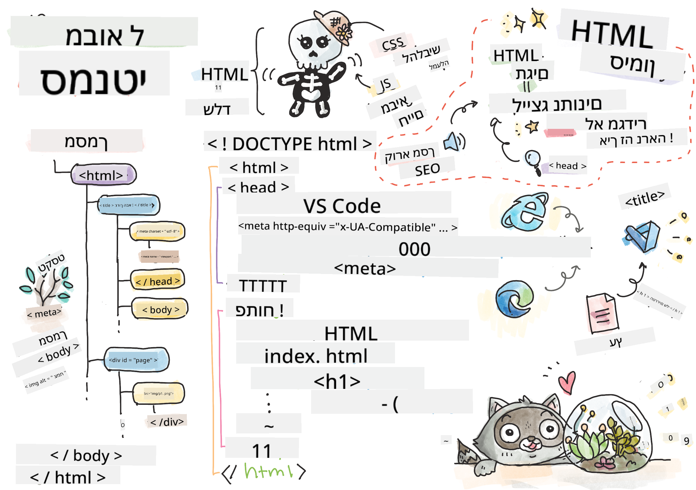

<!--
CO_OP_TRANSLATOR_METADATA:
{
  "original_hash": "20c72cf2e5b0050d38ca3cb14a75a9df",
  "translation_date": "2025-10-23T01:26:30+00:00",
  "source_file": "3-terrarium/1-intro-to-html/README.md",
  "language_code": "he"
}
-->
# פרויקט טרריום חלק 1: מבוא ל-HTML


> איור מאת [Tomomi Imura](https://twitter.com/girlie_mac)

HTML, או HyperText Markup Language, הוא הבסיס לכל אתר שביקרת בו אי פעם. חשבו על HTML כעל השלד שמעניק מבנה לדפי אינטרנט – הוא מגדיר היכן התוכן נמצא, איך הוא מאורגן ומה כל חלק מייצג. בעוד ש-CSS "ילביש" את ה-HTML בצבעים ובפריסות, ו-JavaScript יכניס חיים עם אינטראקטיביות, HTML מספק את המבנה החיוני שמאפשר את כל השאר.

בשיעור הזה, תיצרו את מבנה ה-HTML לממשק טרריום וירטואלי. הפרויקט המעשי הזה ילמד אתכם מושגי HTML בסיסיים תוך כדי בניית משהו מושך ויזואלית. תלמדו איך לארגן תוכן באמצעות אלמנטים סמנטיים, לעבוד עם תמונות וליצור את הבסיס ליישום אינטרנט אינטראקטיבי.

בסוף השיעור, יהיה לכם דף HTML פעיל שמציג תמונות של צמחים בעמודות מאורגנות, מוכן לעיצוב בשיעור הבא. אל תדאגו אם זה נראה בסיסי בהתחלה – זה בדיוק מה ש-HTML אמור לעשות לפני ש-CSS מוסיף את הליטוש הוויזואלי.

## שאלון לפני השיעור

[שאלון לפני השיעור](https://ff-quizzes.netlify.app/web/quiz/15)

> 📺 **צפו ולמדו**: צפו בסרטון סקירה מועיל
> 
> [](https://www.youtube.com/watch?v=1TvxJKBzhyQ)

## הגדרת הפרויקט שלכם

לפני שנצלול לקוד HTML, בואו נגדיר סביבת עבודה מסודרת לפרויקט הטרריום שלכם. יצירת מבנה קבצים מאורגן מההתחלה היא הרגל חשוב שישרת אתכם היטב לאורך מסע פיתוח האינטרנט שלכם.

### משימה: יצירת מבנה הפרויקט שלכם

תיצרו תיקייה ייעודית לפרויקט הטרריום שלכם ותוסיפו את קובץ ה-HTML הראשון שלכם. הנה שתי גישות שתוכלו להשתמש בהן:

**אפשרות 1: שימוש ב-Visual Studio Code**
1. פתחו את Visual Studio Code
2. לחצו על "File" → "Open Folder" או השתמשו ב-`Ctrl+K, Ctrl+O` (Windows/Linux) או `Cmd+K, Cmd+O` (Mac)
3. צרו תיקייה חדשה בשם `terrarium` ובחרו אותה
4. בלוח ה-Explorer, לחצו על אייקון "New File"
5. תנו לקובץ את השם `index.html`


**אפשרות 2: שימוש בפקודות טרמינל**
```bash
mkdir terrarium
cd terrarium
touch index.html
code index.html
```

**מה הפקודות הללו מבצעות:**
- **יוצרות** תיקייה חדשה בשם `terrarium` לפרויקט שלכם
- **מנווטות** לתוך תיקיית הטרריום
- **יוצרות** קובץ `index.html` ריק
- **פותחות** את הקובץ ב-Visual Studio Code לעריכה

> 💡 **טיפ מקצועי**: שם הקובץ `index.html` הוא מיוחד בפיתוח אתרים. כאשר מישהו מבקר באתר, דפדפנים מחפשים אוטומטית את `index.html` כדף ברירת המחדל להצגה. זה אומר שכתובת כמו `https://mysite.com/projects/` תציג אוטומטית את קובץ `index.html` מתיקיית `projects` בלי צורך לציין את שם הקובץ בכתובת.

## הבנת מבנה מסמך HTML

כל מסמך HTML עוקב אחר מבנה ספציפי שדפדפנים צריכים להבין ולהציג בצורה נכונה. חשבו על המבנה הזה כמו מכתב רשמי – יש בו אלמנטים נדרשים בסדר מסוים שעוזרים לנמען (במקרה הזה, הדפדפן) לעבד את התוכן בצורה נכונה.

בואו נתחיל בהוספת הבסיס החיוני שכל מסמך HTML צריך.

### הצהרת DOCTYPE ואלמנט השורש

שתי השורות הראשונות של כל קובץ HTML משמשות כ"פתיח" למסמך עבור הדפדפן:

```html
<!DOCTYPE html>
<html></html>
```

**הבנת מה הקוד הזה עושה:**
- **מצהיר** על סוג המסמך כ-HTML5 באמצעות `<!DOCTYPE html>`
- **יוצר** את אלמנט השורש `<html>` שיכיל את כל תוכן הדף
- **מבסס** סטנדרטים מודרניים להצגת דפדפן נכונה
- **מבטיח** תצוגה עקבית בין דפדפנים ומכשירים שונים

> 💡 **טיפ VS Code**: רחפו מעל כל תג HTML ב-VS Code כדי לראות מידע מועיל מ-MDN Web Docs, כולל דוגמאות שימוש ופרטי תאימות לדפדפנים.

> 📚 **למדו עוד**: הצהרת DOCTYPE מונעת מדפדפנים להיכנס ל"מצב מוזר", שהיה בשימוש לתמיכה באתרים ישנים מאוד. פיתוח אתרים מודרני משתמש בהצהרת `<!DOCTYPE html>` הפשוטה כדי להבטיח [תצוגה תואמת סטנדרטים](https://developer.mozilla.org/docs/Web/HTML/Quirks_Mode_and_Standards_Mode).

## הוספת מטא-נתונים חיוניים למסמך

החלק `<head>` של מסמך HTML מכיל מידע חיוני שדפדפנים ומנועי חיפוש צריכים, אך המבקרים לא רואים אותו ישירות בדף. חשבו עליו כעל "מאחורי הקלעים" שמסייע לדף שלכם לעבוד בצורה נכונה ולהופיע בצורה נכונה במכשירים ופלטפורמות שונות.

המטא-נתונים הללו אומרים לדפדפנים איך להציג את הדף שלכם, איזה קידוד תווים להשתמש, ואיך להתמודד עם גדלי מסך שונים – כל אלה חיוניים ליצירת דפי אינטרנט מקצועיים ונגישים.

### משימה: הוסיפו את החלק `<head>` למסמך

הכניסו את החלק `<head>` הזה בין תגי `<html>` הפותחים והסוגרים שלכם:

```html
<head>
	<title>Welcome to my Virtual Terrarium</title>
	<meta charset="utf-8" />
	<meta http-equiv="X-UA-Compatible" content="IE=edge" />
	<meta name="viewport" content="width=device-width, initial-scale=1" />
</head>
```

**פירוט מה כל אלמנט משיג:**
- **מגדיר** את כותרת הדף שמופיעה בלשוניות דפדפן ובתוצאות חיפוש
- **מציין** קידוד תווים UTF-8 להצגת טקסט בצורה נכונה ברחבי העולם
- **מבטיח** תאימות עם גרסאות מודרניות של Internet Explorer
- **מגדיר** עיצוב רספונסיבי על ידי התאמת תצוגת המסך לרוחב המכשיר
- **שולט** ברמת הזום הראשונית להצגת תוכן בגודל טבעי

> 🤔 **חשבו על זה**: מה יקרה אם תגדירו תג מטא תצוגה כמו זה: `<meta name="viewport" content="width=600">`? זה יכריח את הדף להיות תמיד ברוחב של 600 פיקסלים, וישבור את העיצוב הרספונסיבי! למדו עוד על [הגדרת תצוגה נכונה](https://developer.mozilla.org/docs/Web/HTML/Viewport_meta_tag).

## בניית גוף המסמך

אלמנט `<body>` מכיל את כל התוכן הנראה של דף האינטרנט שלכם – כל מה שהמשתמשים יראו ויתקשרו איתו. בעוד שהחלק `<head>` סיפק הוראות לדפדפן, החלק `<body>` מכיל את התוכן עצמו: טקסט, תמונות, כפתורים ואלמנטים אחרים שיוצרים את ממשק המשתמש שלכם.

בואו נוסיף את מבנה הגוף ונבין איך תגי HTML עובדים יחד כדי ליצור תוכן משמעותי.

### הבנת מבנה תגי HTML

HTML משתמש בתגים זוגיים כדי להגדיר אלמנטים. רוב התגים כוללים תג פתיחה כמו `<p>` ותג סגירה כמו `</p>`, עם תוכן ביניהם: `<p>שלום, עולם!</p>`. זה יוצר אלמנט פסקה שמכיל את הטקסט "שלום, עולם!".

### משימה: הוסיפו את אלמנט הגוף

עדכנו את קובץ ה-HTML שלכם כדי לכלול את אלמנט `<body>`:

```html
<!DOCTYPE html>
<html>
	<head>
		<title>Welcome to my Virtual Terrarium</title>
		<meta charset="utf-8" />
		<meta http-equiv="X-UA-Compatible" content="IE=edge" />
		<meta name="viewport" content="width=device-width, initial-scale=1" />
	</head>
	<body></body>
</html>
```

**מה המבנה המלא הזה מספק:**
- **מבסס** את מסגרת המסמך HTML5 הבסיסית
- **כולל** מטא-נתונים חיוניים להצגת דפדפן נכונה
- **יוצר** גוף ריק מוכן לתוכן הנראה שלכם
- **עוקב** אחר שיטות עבודה מומלצות לפיתוח אתרים מודרני

עכשיו אתם מוכנים להוסיף את האלמנטים הנראים של הטרריום שלכם. נשתמש באלמנטים `<div>` כקונטיינרים לארגון חלקים שונים של תוכן, ובאלמנטים `` להצגת תמונות הצמחים.

### עבודה עם תמונות וקונטיינרים לפריסה

תמונות הן מיוחדות ב-HTML כי הן משתמשות בתגים "סוגרים עצמם". בניגוד לאלמנטים כמו `<p></p>` שעוטפים תוכן, תג `` מכיל את כל המידע שהוא צריך בתוך התג עצמו באמצעות מאפיינים כמו `src` עבור נתיב קובץ התמונה ו-`alt` לנגישות.

לפני שתוסיפו תמונות ל-HTML שלכם, תצטרכו לארגן את קבצי הפרויקט שלכם בצורה נכונה על ידי יצירת תיקיית תמונות והוספת גרפיקות הצמחים.

**ראשית, הגדירו את התמונות שלכם:**
1. צרו תיקייה בשם `images` בתוך תיקיית פרויקט הטרריום שלכם
2. הורידו את תמונות הצמחים מתיקיית [הפתרון](../../../../3-terrarium/solution/images) (14 תמונות צמחים בסך הכל)
3. העתיקו את כל תמונות הצמחים לתוך תיקיית `images` החדשה שלכם

### משימה: צרו את פריסת תצוגת הצמחים

עכשיו הוסיפו את תמונות הצמחים מאורגנות בשתי עמודות בין תגי `<body></body>` שלכם:

```html
<div id="page">
	<div id="left-container" class="container">
		<div class="plant-holder">
			
		</div>
		<div class="plant-holder">
			
		</div>
		<div class="plant-holder">
			
		</div>
		<div class="plant-holder">
			
		</div>
		<div class="plant-holder">
			
		</div>
		<div class="plant-holder">
			
		</div>
		<div class="plant-holder">
			
		</div>
	</div>
	<div id="right-container" class="container">
		<div class="plant-holder">
			
		</div>
		<div class="plant-holder">
			
		</div>
		<div class="plant-holder">
			
		</div>
		<div class="plant-holder">
			
		</div>
		<div class="plant-holder">
			
		</div>
		<div class="plant-holder">
			
		</div>
		<div class="plant-holder">
			
		</div>
	</div>
</div>
```

**שלב אחר שלב, מה קורה בקוד הזה:**
- **יוצר** קונטיינר דף ראשי עם `id="page"` שמחזיק את כל התוכן
- **מבסס** שני קונטיינרים לעמודות: `left-container` ו-`right-container`
- **מארגן** 7 צמחים בעמודה השמאלית ו-7 צמחים בעמודה הימנית
- **עוטף** כל תמונת צמח בתוך div `plant-holder` למיקום אישי
- **מיישם** שמות מחלקה עקביים לעיצוב CSS בשיעור הבא
- **מעניק** מזהים ייחודיים לכל תמונת צמח לאינטראקציה עם JavaScript בהמשך
- **כולל** נתיבי קבצים נכונים שמצביעים על תיקיית התמונות

> 🤔 **חשבו על זה**: שימו לב שכל התמונות כרגע כוללות את אותו טקסט alt "plant". זה לא אידיאלי לנגישות. משתמשי קוראי מסך ישמעו "plant" חוזר 14 פעמים בלי לדעת איזה צמח כל תמונה מציגה. האם תוכלו לחשוב על טקסט alt טוב יותר, שמתאר כל תמונה?

> 📝 **סוגי אלמנטים HTML**: אלמנטים `<div>` הם "ברמת בלוק" ותופסים רוחב מלא, בעוד שאלמנטים `<span>` הם "בקו" ותופסים רק את הרוחב הנדרש. מה לדעתכם יקרה אם תשנו את כל תגי `<div>` הללו לתגי `<span>`?

עם סימון זה שנוסף, הצמחים יופיעו על המסך, למרות שהם עדיין לא ייראו מלוטשים – בשביל זה יש את CSS בשיעור הבא! לעת עתה, יש לכם בסיס HTML מוצק שמארגן את התוכן שלכם בצורה נכונה ועוקב אחר שיטות עבודה מומלצות לנגישות.

## שימוש ב-HTML סמנטי לנגישות

HTML סמנטי פירושו בחירת אלמנטים HTML על סמך משמעותם ומטרתם, ולא רק על סמך המראה שלהם. כשאתם משתמשים בסימון סמנטי, אתם מתקשרים את מבנה ומשמעות התוכן שלכם לדפדפנים, מנועי חיפוש וטכנולוגיות מסייעות כמו קוראי מסך.

גישה זו הופכת את האתרים שלכם לנגישים יותר למשתמשים עם מוגבלויות ועוזרת למנועי חיפוש להבין טוב יותר את התוכן שלכם. זהו עיקרון יסוד של פיתוח אתרים מודרני שיוצר חוויות טובות יותר לכולם.

### הוספת כותרת עמוד סמנטית

בואו נוסיף כותרת מתאימה לדף הטרריום שלכם. הכניסו את השורה הזו מיד אחרי תג `<body>` הפותח שלכם:

```html
<h1>My Terrarium</h1>
```

**למה סימון סמנטי חשוב:**
- **מסייע** לקוראי מסך לנווט ולהבין את מבנה הדף
- **משפר** אופטימיזציה למנועי חיפוש (SEO) על ידי הבהרת היררכיית התוכן
- **מגביר** נגישות למשתמשים עם לקויות ראייה או הבדלים קוגניטיביים
- **יוצר** חוויות משתמש טובות יותר בכל המכשירים והפלטפורמות
- **עוקב** אחר סטנדרטים ושיטות עבודה מומלצות לפיתוח מקצועי

**דוגמאות לבחירות סמנטיות מול לא סמנטיות:**

| מטרה | ✅ בחירה סמנטית | ❌ בחירה לא סמנטית |
|------|-----------------|--------------------|
| כותרת ראשית | `<h1>כותרת</h1>` | `<div class="big-text">כותרת</div>` |
| ניווט | `<nav><ul><li></li></ul></nav>` | `<div class="menu"><div></div></div>` |
| כפתור | `<button>לחץ כאן</button>` | `<span onclick="...">לחץ כאן</span>` |
| תוכן מאמר | `<article><p></p></article>` | `<div class="content"><div></div></div>` |

> 🎥 **ראו את זה בפעולה**: צפו [איך קוראי מסך מתקשרים עם דפי אינטרנט](https://www.youtube.com/watch?v=OUDV1gqs9GA) כדי להבין למה סימון סמנטי חיוני לנגישות. שימו לב איך מבנה HTML נכון מסייע למשתמשים לנווט ביעילות.

## יצירת קונטיינר הטרריום

עכשיו נוסיף את מבנה ה-HTML לטרריום עצמו – הקונטיינר הזכוכית שבו הצמחים יונחו בסופו של דבר. החלק הזה מדגים עיקרון חשוב: HTML מספק מבנה, אבל בלי עיצוב CSS, האלמנטים הללו עדיין לא יהיו נראים.

הסימון של הטרריום משתמש בשמות מחלקה תיאוריים שיהפכו את עיצוב ה-CSS לאינטואיטיבי וקל לתחזוקה בשיעור הבא.

### משימה: הוסיפו את מבנה הטרריום

הכניסו את הסימון הזה מעל תג `</div>` האחרון (לפני תג הסגירה של קונטיינר הדף):

```html
<div id="terrarium">
	<div class="jar-top"></div>
	<div class="jar-walls">
		<div class="jar-glossy-long"></div>
		<div class="jar-glossy-short"></div>
	</div>
	<div class="dirt"></div>
	<div class="jar-bottom"></div>
</div>
```

**הבנת מבנה הטרריום הזה:**
- **יוצר** קונטיינר טרריום ראשי עם מזהה ייחודי לעיצוב
- **מגדיר** אלמנטים נפרדים לכל רכיב ויזואלי (חלק עליון, קירות, אדמה, תחתית)
- **כולל** אלמנטים מקוננים לאפקטים של השתקפות זכוכית (אלמנטים מבריקים)
- **משתמש** בשמות מחלקה תיאוריים שמבהירים את מטרת כל אלמנט
- **מכין** את המבנה לעיצוב CSS שייצור את מראה הטרריום הזכוכית

> 🤔 **שימו לב למשהו?**: למרות שהוספתם את הסימון הזה, אתם לא רואים שום דבר חדש בדף! זה ממחיש בצורה מושלמת איך HTML מספק מבנה בעוד ש-CSS מספק מראה. אלמנטים `<div>` הללו קיימים אבל עדיין אין להם עיצוב ויזואלי – זה יגיע בשיעור הבא!

---

## אתגר סוכן GitHub Copilot

השתמשו במצב Agent כדי להשלים את האתגר הבא:

**תיאור:** צרו מבנה HTML סמנטי עבור חלק מדריך טיפול בצמחים שניתן להוסיף לפרויקט הטרריום.
**הנחיה:** צור קטע HTML סמנטי הכולל כותרת ראשית "מדריך לטיפול בצמחים", שלושה תתי-סעיפים עם כותרות "השקיה", "דרישות אור" ו-"טיפול באדמה", כאשר כל אחד מהם מכיל פסקה עם מידע על טיפול בצמחים. השתמש בתגי HTML סמנטיים מתאימים כמו `<section>`, `<h2>`, `<h3>`, ו-`<p>` כדי לבנות את התוכן בצורה נכונה.

למד עוד על [מצב סוכן](https://code.visualstudio.com/blogs/2025/02/24/introducing-copilot-agent-mode) כאן.

## אתגר היסטוריית HTML

**לימוד על התפתחות האינטרנט**

HTML התפתח באופן משמעותי מאז שטים ברנרס-לי יצר את הדפדפן הראשון ב-CERN בשנת 1990. כמה תגיות ישנות כמו `<marquee>` הוצאו משימוש מכיוון שהן לא מתאימות לסטנדרטים מודרניים של נגישות ועקרונות עיצוב רספונסיבי.

**נסו את הניסוי הזה:**
1. עטפו באופן זמני את כותרת `<h1>` שלכם בתגית `<marquee>`: `<marquee><h1>הטרריום שלי</h1></marquee>`
2. פתחו את הדף שלכם בדפדפן וצפו באפקט הגלילה
3. חשבו מדוע תגית זו הוצאה משימוש (רמז: חשבו על חוויית המשתמש ונגישות)
4. הסירו את תגית `<marquee>` וחזרו לסימון סמנטי

**שאלות למחשבה:**
- כיצד כותרת מתגלגלת עשויה להשפיע על משתמשים עם לקויות ראייה או רגישות לתנועה?
- אילו טכניקות CSS מודרניות יכולות להשיג אפקטים חזותיים דומים בצורה נגישה יותר?
- מדוע חשוב להשתמש בסטנדרטים אינטרנטיים עכשוויים במקום אלמנטים שהוצאו משימוש?

גלו עוד על [אלמנטים HTML מיושנים ומוצאים משימוש](https://developer.mozilla.org/docs/Web/HTML/Element#Obsolete_and_deprecated_elements) כדי להבין כיצד סטנדרטים אינטרנטיים מתפתחים לשיפור חוויית המשתמש.


## שאלון לאחר ההרצאה

[שאלון לאחר ההרצאה](https://ff-quizzes.netlify.app/web/quiz/16)

## סקירה ולימוד עצמי

**העמיקו את הידע שלכם ב-HTML**

HTML היה הבסיס של האינטרנט במשך יותר מ-30 שנה, והתפתח משפת סימון מסמכים פשוטה לפלטפורמה מתקדמת לבניית יישומים אינטראקטיביים. הבנת ההתפתחות הזו עוזרת להעריך את הסטנדרטים המודרניים של האינטרנט ולקבל החלטות פיתוח טובות יותר.

**מסלולי לימוד מומלצים:**

1. **היסטוריה והתפתחות HTML**
   - חקרו את ציר הזמן מ-HTML 1.0 ועד HTML5
   - בדקו מדוע תגיות מסוימות הוצאו משימוש (נגישות, ידידותיות למובייל, תחזוקה)
   - חקרו תכונות HTML מתקדמות והצעות עתידיות

2. **העמקה ב-HTML סמנטי**
   - למדו את הרשימה המלאה של [אלמנטים סמנטיים ב-HTML5](https://developer.mozilla.org/docs/Web/HTML/Element)
   - תרגלו זיהוי מתי להשתמש ב-`<article>`, `<section>`, `<aside>`, ו-`<main>`
   - למדו על מאפייני ARIA לשיפור הנגישות

3. **פיתוח אינטרנט מודרני**
   - חקרו [בניית אתרים רספונסיביים](https://docs.microsoft.com/learn/modules/build-simple-website/?WT.mc_id=academic-77807-sagibbon) ב-Microsoft Learn
   - הבינו כיצד HTML משתלב עם CSS ו-JavaScript
   - למדו על ביצועי אינטרנט ושיטות עבודה מומלצות ל-SEO

**שאלות למחשבה:**
- אילו תגיות HTML שהוצאו משימוש גיליתם, ומדוע הן הוסרו?
- אילו תכונות HTML חדשות מוצעות לגרסאות עתידיות?
- כיצד HTML סמנטי תורם לנגישות אינטרנטית ול-SEO?


## משימה

[תרגלו את ה-HTML שלכם: בנו דגם של בלוג](assignment.md)

---

**כתב ויתור**:  
מסמך זה תורגם באמצעות שירות תרגום מבוסס בינה מלאכותית [Co-op Translator](https://github.com/Azure/co-op-translator). למרות שאנו שואפים לדיוק, יש לקחת בחשבון שתרגומים אוטומטיים עשויים להכיל שגיאות או אי דיוקים. המסמך המקורי בשפתו המקורית צריך להיחשב כמקור סמכותי. למידע קריטי, מומלץ להשתמש בתרגום מקצועי אנושי. איננו אחראים לאי הבנות או לפרשנויות שגויות הנובעות משימוש בתרגום זה.