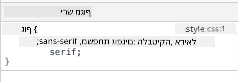

<!--
CO_OP_TRANSLATOR_METADATA:
{
  "original_hash": "acb5ae00cde004304296bb97da8ff4c3",
  "translation_date": "2025-08-29T01:18:04+00:00",
  "source_file": "3-terrarium/2-intro-to-css/README.md",
  "language_code": "he"
}
-->
# פרויקט הטרריום חלק 2: מבוא ל-CSS


> איור מאת [Tomomi Imura](https://twitter.com/girlie_mac)

## שאלון לפני השיעור

[שאלון לפני השיעור](https://ff-quizzes.netlify.app/web/quiz/17)

### מבוא

CSS, או Cascading Style Sheets, פותר בעיה חשובה בפיתוח אתרים: איך לגרום לאתר שלך להיראות טוב. עיצוב האפליקציות שלך הופך אותן לשימושיות ונעימות יותר למראה; ניתן גם להשתמש ב-CSS כדי ליצור עיצוב רספונסיבי (Responsive Web Design - RWD) שמאפשר לאפליקציות שלך להיראות טוב בכל גודל מסך שבו הן מוצגות. CSS לא עוסק רק במראה האפליקציה; המפרט שלו כולל אנימציות ושינויים שיכולים לאפשר אינטראקציות מתוחכמות באפליקציות שלך. קבוצת העבודה של CSS עוזרת לשמור על מפרטי CSS עדכניים; ניתן לעקוב אחר עבודתם באתר [World Wide Web Consortium](https://www.w3.org/Style/CSS/members).

> שים לב, CSS היא שפה שמתפתחת, כמו כל דבר באינטרנט, ולא כל הדפדפנים תומכים בחלקים החדשים של המפרט. תמיד בדוק את היישומים שלך באמצעות [CanIUse.com](https://caniuse.com).

בשיעור הזה, נוסיף סגנונות לטרריום המקוון שלנו ונלמד יותר על כמה מושגים ב-CSS: היררכיה, ירושה, שימוש בבוחרים, מיקום ושימוש ב-CSS לבניית פריסות. במהלך השיעור נפרוס את הטרריום וניצור את הטרריום עצמו.

### דרישות מוקדמות

עליך לבנות את ה-HTML של הטרריום שלך ולהכין אותו לעיצוב.

> צפה בסרטון

> 
> [](https://www.youtube.com/watch?v=6yIdOIV9p1I)

### משימה

בתיקיית הטרריום שלך, צור קובץ חדש בשם `style.css`. ייבא את הקובץ הזה בתוך החלק `<head>`:

```html
<link rel="stylesheet" href="./style.css" />
```

---

## ההיררכיה

Cascading Style Sheets כוללים את הרעיון שהסגנונות 'מתגלגלים' כך שיישום סגנון מונחה לפי סדר העדיפות שלו. סגנונות שנקבעו על ידי מחבר האתר מקבלים עדיפות על פני אלו שנקבעו על ידי הדפדפן. סגנונות שנקבעו 'inline' מקבלים עדיפות על פני אלו שנקבעו בקובץ סגנונות חיצוני.

### משימה

הוסף את הסגנון inline "color: red" לתג `<h1>` שלך:

```HTML
<h1 style="color: red">My Terrarium</h1>
```

לאחר מכן, הוסף את הקוד הבא לקובץ `style.css` שלך:

```CSS
h1 {
 color: blue;
}
```

✅ איזה צבע מוצג באפליקציה שלך? למה? האם תוכל למצוא דרך לעקוף סגנונות? מתי היית רוצה לעשות זאת, או למה לא?

---

## ירושה

סגנונות מועברים מסגנון של אב לסגנון של צאצא, כך שפריטים מקוננים יורשים את הסגנונות של ההורים שלהם.

### משימה

הגדר את הגופן של הגוף לגופן מסוים, ובדוק את הגופן של פריט מקונן:

```CSS
body {
	font-family: helvetica, arial, sans-serif;
}
```

פתח את הקונסולה של הדפדפן בלשונית 'Elements' וצפה בגופן של H1. הוא יורש את הגופן מהגוף, כפי שמצוין בתוך הדפדפן:



✅ האם תוכל לגרום לסגנון מקונן לרשת תכונה שונה?

---

## בוחרי CSS

### תגיות

עד כה, קובץ `style.css` שלך כולל רק כמה תגיות מעוצבות, והאפליקציה נראית די מוזרה:

```CSS
body {
	font-family: helvetica, arial, sans-serif;
}

h1 {
	color: #3a241d;
	text-align: center;
}
```

דרך זו של עיצוב תגית נותנת לך שליטה על פריטים ייחודיים, אך אתה צריך לשלוט בסגנונות של הרבה צמחים בטרריום שלך. כדי לעשות זאת, עליך להשתמש בבוחרי CSS.

### מזהים (Ids)

הוסף סגנון לפריסת המכולות השמאלית והימנית. מכיוון שיש רק מכולה שמאלית אחת ורק מכולה ימנית אחת, הן מקבלות מזהים ב-Markup. כדי לעצב אותן, השתמש ב-`#`:

```CSS
#left-container {
	background-color: #eee;
	width: 15%;
	left: 0px;
	top: 0px;
	position: absolute;
	height: 100%;
	padding: 10px;
}

#right-container {
	background-color: #eee;
	width: 15%;
	right: 0px;
	top: 0px;
	position: absolute;
	height: 100%;
	padding: 10px;
}
```

כאן, מיקמת את המכולות הללו עם מיקום מוחלט בצד שמאל וימין של המסך, והשתמשת באחוזים עבור רוחבן כך שהן יוכלו להתאים למסכים קטנים של טלפונים ניידים.

✅ הקוד הזה די חוזר על עצמו, ולכן הוא לא "DRY" (Don't Repeat Yourself); האם תוכל למצוא דרך טובה יותר לעצב את המזהים הללו, אולי עם מזהה ו-class? תצטרך לשנות את ה-Markup ולבצע רפקטור ל-CSS:

```html
<div id="left-container" class="container"></div>
```

### מחלקות (Classes)

בדוגמה לעיל, עיצבת שני פריטים ייחודיים על המסך. אם אתה רוצה שסגנונות יחולו על הרבה פריטים על המסך, תוכל להשתמש במחלקות CSS. עשה זאת כדי לפרוס את הצמחים במכולות השמאלית והימנית.

שים לב שכל צמח ב-Markup של ה-HTML כולל שילוב של מזהים ומחלקות. המזהים כאן משמשים את ה-JavaScript שתוסיף מאוחר יותר כדי לתפעל את מיקום הצמחים בטרריום. המחלקות, לעומת זאת, מעניקות לכל הצמחים סגנון מסוים.

```html
<div class="plant-holder">
	
</div>
```

הוסף את הקוד הבא לקובץ `style.css` שלך:

```CSS
.plant-holder {
	position: relative;
	height: 13%;
	left: -10px;
}

.plant {
	position: absolute;
	max-width: 150%;
	max-height: 150%;
	z-index: 2;
}
```

ראוי לציון בקטע זה הוא השילוב של מיקום יחסי ומוחלט, עליו נדון בסעיף הבא. הסתכל על הדרך שבה גבהים מטופלים באמצעות אחוזים:

הגדרת את גובה מחזיק הצמחים ל-13%, מספר טוב כדי להבטיח שכל הצמחים מוצגים בכל מכולה אנכית ללא צורך בגלילה.

הזזת את מחזיק הצמחים שמאלה כדי לאפשר לצמחים להיות ממורכזים יותר בתוך המכולה שלהם. לתמונות יש כמות גדולה של רקע שקוף כדי להפוך אותן לניתנות לגרירה, ולכן יש לדחוף אותן שמאלה כדי להתאים טוב יותר למסך.

לאחר מכן, הצמח עצמו מקבל רוחב מקסימלי של 150%. זה מאפשר לו להתכווץ ככל שהדפדפן מתכווץ. נסה לשנות את גודל הדפדפן שלך; הצמחים נשארים במכולות שלהם אך מתכווצים כדי להתאים.

גם ראוי לציון הוא השימוש ב-z-index, ששולט בגובה היחסי של פריט (כך שהצמחים יושבים מעל המכולה ונראים כאילו הם יושבים בתוך הטרריום).

✅ למה אתה צריך גם מחזיק צמחים וגם בוחר CSS לצמח?

## מיקום ב-CSS

שילוב תכונות מיקום (יש מיקומים סטטיים, יחסיים, קבועים, מוחלטים ודביקים) יכול להיות קצת מסובך, אבל כשנעשה נכון הוא נותן לך שליטה טובה על הפריטים בדפים שלך.

פריטים במיקום מוחלט ממוקמים יחסית לאבותיהם הממוקמים הקרובים ביותר, ואם אין כאלה, הם ממוקמים לפי גוף המסמך.

פריטים במיקום יחסי ממוקמים על סמך הוראות ה-CSS כדי להתאים את מיקומם הרחק ממיקומם הראשוני.

בדוגמה שלנו, ה-`plant-holder` הוא פריט במיקום יחסי שממוקם בתוך מכולה במיקום מוחלט. ההתנהגות המתקבלת היא שמכולות הצד מוצמדות לשמאל ולימין, וה-plant-holder מקונן, מתכוונן בתוך מכולות הצד, ונותן מקום לצמחים להיות ממוקמים בשורה אנכית.

> הצמח עצמו גם כן במיקום מוחלט, דבר הכרחי כדי להפוך אותו לניתן לגרירה, כפי שתגלו בשיעור הבא.

✅ נסה לשחק עם החלפת סוגי המיקום של מכולות הצד ושל ה-plant-holder. מה קורה?

## פריסות ב-CSS

עכשיו תשתמש במה שלמדת כדי לבנות את הטרריום עצמו, הכל באמצעות CSS!

ראשית, עצב את הילדים של div `.terrarium` כמלבן מעוגל באמצעות CSS:

```CSS
.jar-walls {
	height: 80%;
	width: 60%;
	background: #d1e1df;
	border-radius: 1rem;
	position: absolute;
	bottom: 0.5%;
	left: 20%;
	opacity: 0.5;
	z-index: 1;
}

.jar-top {
	width: 50%;
	height: 5%;
	background: #d1e1df;
	position: absolute;
	bottom: 80.5%;
	left: 25%;
	opacity: 0.7;
	z-index: 1;
}

.jar-bottom {
	width: 50%;
	height: 1%;
	background: #d1e1df;
	position: absolute;
	bottom: 0%;
	left: 25%;
	opacity: 0.7;
}

.dirt {
	width: 60%;
	height: 5%;
	background: #3a241d;
	position: absolute;
	border-radius: 0 0 1rem 1rem;
	bottom: 1%;
	left: 20%;
	opacity: 0.7;
	z-index: -1;
}
```

שים לב לשימוש באחוזים כאן. אם תקטין את הדפדפן שלך, תוכל לראות איך הצנצנת מתכווצת גם כן. שים לב גם לרוחבים ולאחוזי הגובה של אלמנטים הצנצנת ואיך כל אלמנט ממוקם באופן מוחלט במרכז, מוצמד לתחתית חלון הצפייה.

אנחנו גם משתמשים ב-`rem` עבור ה-border-radius, אורך יחסי לגופן. קרא עוד על סוג זה של מדידה יחסית במפרט [CSS](https://www.w3.org/TR/css-values-3/#font-relative-lengths).

✅ נסה לשנות את צבעי הצנצנת והאטימות לעומת אלו של האדמה. מה קורה? למה?

---

## 🚀אתגר

הוסף ברק 'בועה' לאזור התחתון השמאלי של הצנצנת כדי לגרום לה להיראות יותר כמו זכוכית. תעצב את `.jar-glossy-long` ו-`.jar-glossy-short` כך שיראו כמו ברק משתקף. כך זה ייראה:


כדי להשלים את שאלון לאחר השיעור, עבור דרך מודול הלמידה הזה: [עצב את אפליקציית ה-HTML שלך עם CSS](https://docs.microsoft.com/learn/modules/build-simple-website/4-css-basics/?WT.mc_id=academic-77807-sagibbon)

## שאלון לאחר השיעור

[שאלון לאחר השיעור](https://ff-quizzes.netlify.app/web/quiz/18)

## סקירה ולימוד עצמי

CSS נראה פשוט לכאורה, אבל ישנם אתגרים רבים כשמנסים לעצב אפליקציה בצורה מושלמת לכל הדפדפנים ולכל גדלי המסכים. CSS-Grid ו-Flexbox הם כלים שפותחו כדי להפוך את העבודה למעט יותר מובנית ואמינה. למד על הכלים הללו על ידי משחק ב-[Flexbox Froggy](https://flexboxfroggy.com/) וב-[Grid Garden](https://codepip.com/games/grid-garden/).

## משימה

[רפקטורינג ל-CSS](assignment.md)

---

**כתב ויתור**:  
מסמך זה תורגם באמצעות שירות תרגום מבוסס בינה מלאכותית [Co-op Translator](https://github.com/Azure/co-op-translator). בעוד שאנו שואפים לדיוק, יש לקחת בחשבון שתרגומים אוטומטיים עשויים להכיל שגיאות או אי-דיוקים. המסמך המקורי בשפתו המקורית נחשב למקור הסמכותי. למידע קריטי, מומלץ להשתמש בתרגום מקצועי על ידי בני אדם. איננו נושאים באחריות לכל אי-הבנה או פרשנות שגויה הנובעת משימוש בתרגום זה.