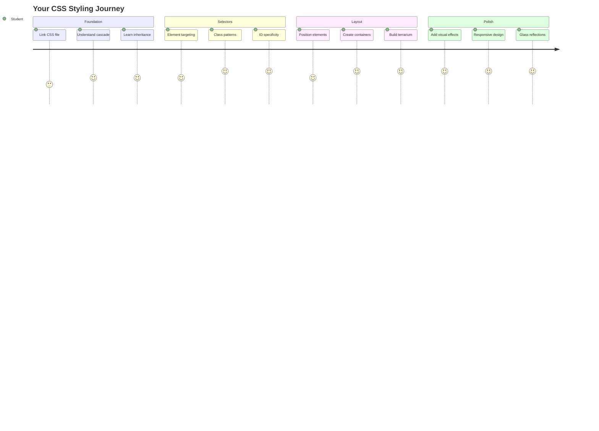
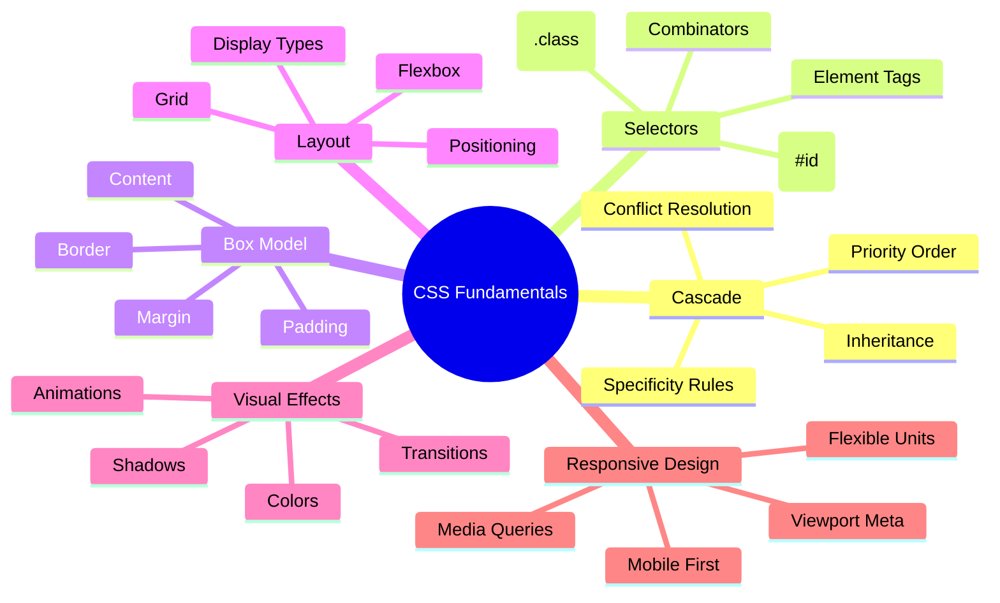
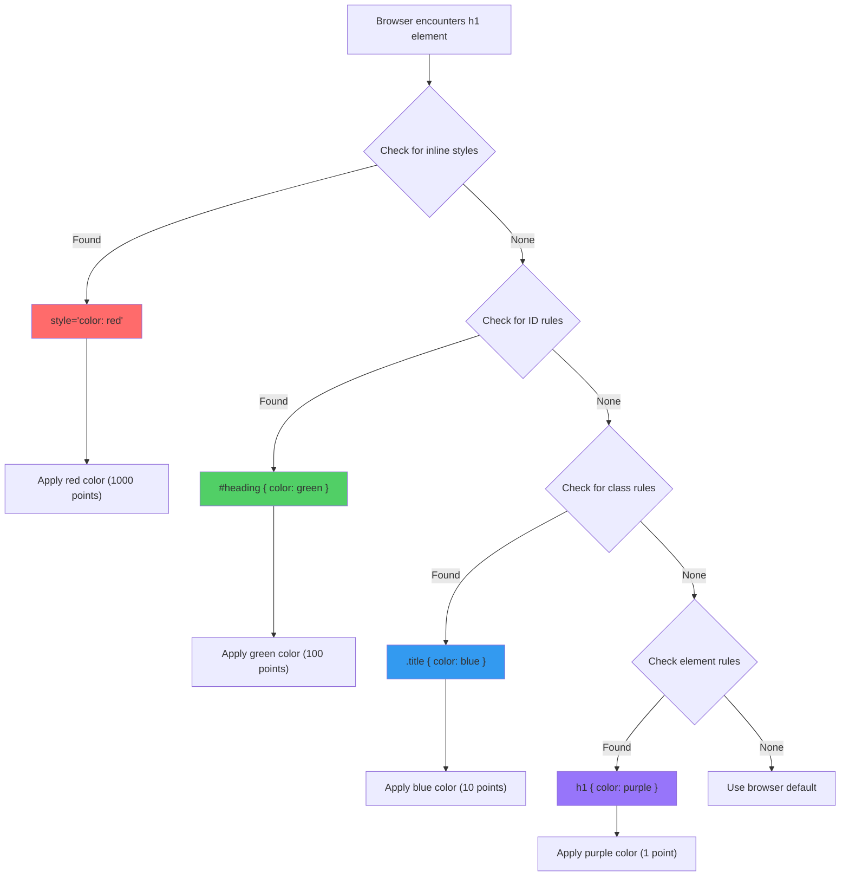
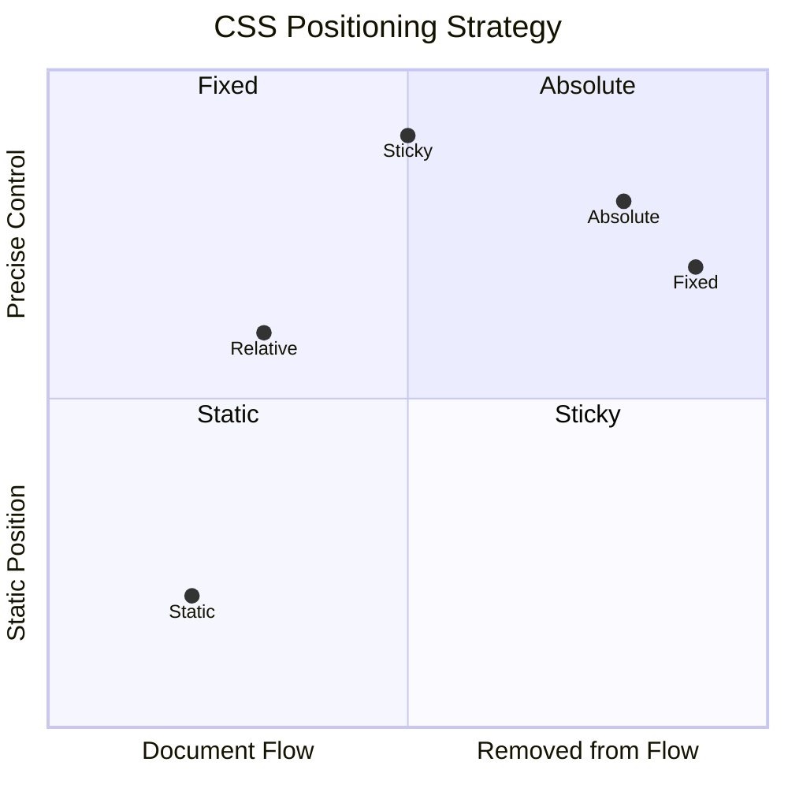
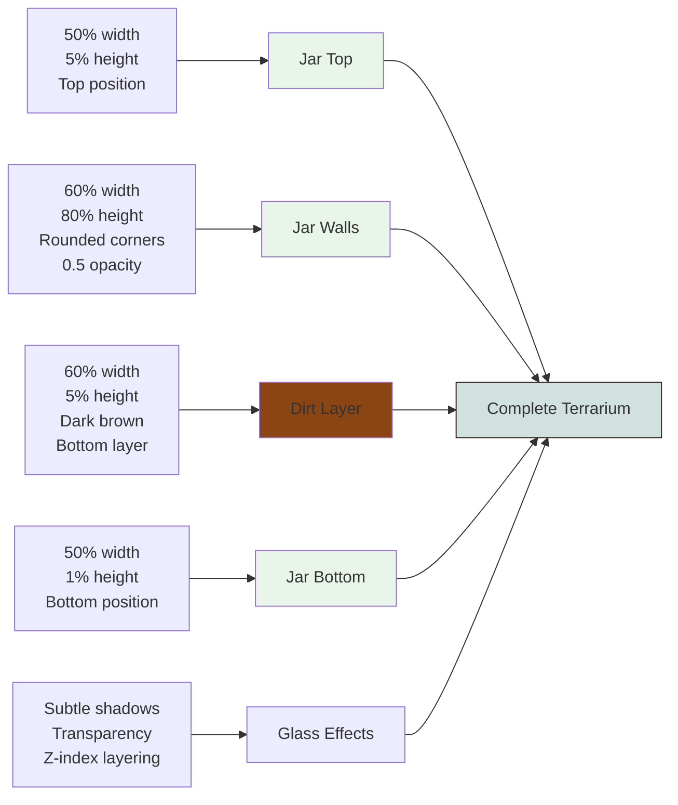
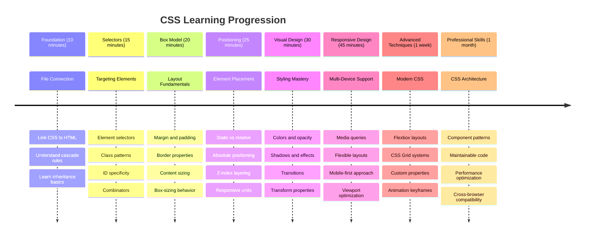

<!--
CO_OP_TRANSLATOR_METADATA:
{
  "original_hash": "e39f3a4e3bcccf94639e3af1248f8a4d",
  "translation_date": "2025-11-04T02:25:27+00:00",
  "source_file": "3-terrarium/2-intro-to-css/README.md",
  "language_code": "he"
}
-->
# פרויקט הטרריום חלק 2: מבוא ל-CSS




> איור מאת [Tomomi Imura](https://twitter.com/girlie_mac)

זוכרים איך הטרריום שלכם ב-HTML נראה די בסיסי? CSS הוא המקום שבו אנו הופכים את המבנה הפשוט הזה למשהו מושך מבחינה חזותית.

אם HTML הוא כמו בניית מסגרת של בית, אז CSS הוא כל מה שגורם לו להרגיש כמו בית - צבעי הקירות, סידור הרהיטים, התאורה ואיך החדרים מתחברים זה לזה. תחשבו איך ארמון ורסאי התחיל כבית ציד פשוט, אבל תשומת לב מדוקדקת לעיצוב ולפריסה הפכה אותו לאחד המבנים המפוארים בעולם.

היום, נהפוך את הטרריום שלכם מפונקציונלי למלוטש. תלמדו איך למקם אלמנטים בדיוק, ליצור פריסות שמגיבות לגדלים שונים של מסכים, וליצור את המשיכה החזותית שהופכת אתרים למרתקים.

בסוף השיעור הזה, תראו איך עיצוב CSS אסטרטגי יכול לשפר באופן דרמטי את הפרויקט שלכם. בואו נוסיף קצת סטייל לטרריום שלכם.



## שאלון לפני השיעור

[שאלון לפני השיעור](https://ff-quizzes.netlify.app/web/quiz/17)

## התחלת עבודה עם CSS

לעיתים קרובות חושבים על CSS כמשהו ש"עושה דברים יפים", אבל הוא משרת מטרה רחבה הרבה יותר. CSS הוא כמו להיות במאי של סרט - אתם שולטים לא רק איך הכל נראה, אלא גם איך זה זז, מגיב לאינטראקציה ומסתגל למצבים שונים.

CSS מודרני הוא בעל יכולות מרשימות. אתם יכולים לכתוב קוד שמותאם אוטומטית לפריסות של טלפונים, טאבלטים ומחשבים שולחניים. אתם יכולים ליצור אנימציות חלקות שמכוונות את תשומת הלב של המשתמשים למקום הנכון. התוצאות יכולות להיות מרשימות מאוד כשהכל עובד יחד.

> 💡 **טיפ מקצועי**: CSS מתפתח כל הזמן עם תכונות ויכולות חדשות. תמיד בדקו את [CanIUse.com](https://caniuse.com) כדי לוודא תמיכה בדפדפנים עבור תכונות CSS חדשות לפני השימוש בהן בפרויקטים.

**הנה מה שנשיג בשיעור הזה:**
- **ניצור** עיצוב חזותי מלא לטרריום שלכם באמצעות טכניקות CSS מודרניות
- **נחקור** מושגים בסיסיים כמו הקסקדה, ירושה ובוררי CSS
- **ניישם** אסטרטגיות מיקום ופריסה רספונסיביות
- **נבנה** את מיכל הטרריום באמצעות צורות ועיצוב ב-CSS

### דרישות מקדימות

עליכם לסיים את מבנה ה-HTML של הטרריום שלכם מהשיעור הקודם ולהכין אותו לעיצוב.

> 📺 **משאב וידאו**: צפו בסרטון ההדרכה המועיל הזה
>
> [](https://www.youtube.com/watch?v=6yIdOIV9p1I)

### הגדרת קובץ ה-CSS שלכם

לפני שנוכל להתחיל לעצב, עלינו לחבר את ה-CSS ל-HTML שלנו. החיבור הזה אומר לדפדפן היכן למצוא את הוראות העיצוב לטרריום שלנו.

בתיקיית הטרריום שלכם, צרו קובץ חדש בשם `style.css`, ואז קישרו אותו בסעיף `<head>` של מסמך ה-HTML שלכם:

```html
<link rel="stylesheet" href="./style.css" />
```

**הנה מה שהקוד הזה עושה:**
- **יוצר** חיבור בין קבצי ה-HTML וה-CSS שלכם
- **אומר** לדפדפן לטעון וליישם את העיצובים מ-`style.css`
- **משתמש** בתכונה `rel="stylesheet"` כדי לציין שזהו קובץ CSS
- **מתייחס** לנתיב הקובץ עם `href="./style.css"`

## הבנת הקסקדה של CSS

האם תהיתם אי פעם מדוע CSS נקרא "גיליונות סגנון מדורגים"? סגנונות זורמים למטה כמו מפל, ולפעמים הם מתנגשים זה עם זה.

תחשבו איך מבנה פיקוד צבאי עובד - פקודה כללית עשויה לומר "כל החיילים לובשים ירוק", אבל פקודה ספציפית ליחידה שלכם עשויה לומר "ללבוש כחול טקסי לטקס". ההוראה הספציפית יותר גוברת. CSS פועל לפי לוגיקה דומה, והבנת ההיררכיה הזו הופכת את פתרון הבעיות להרבה יותר קל.

### ניסוי עם עדיפות הקסקדה

בואו נראה את הקסקדה בפעולה על ידי יצירת סתירה בעיצוב. ראשית, הוסיפו סגנון מוטמע לתג `<h1>` שלכם:

```html
<h1 style="color: red">My Terrarium</h1>
```

**מה הקוד הזה עושה:**
- **מיישם** צבע אדום ישירות על אלמנט `<h1>` באמצעות עיצוב מוטמע
- **משתמש** בתכונה `style` כדי להטמיע CSS ישירות ב-HTML
- **יוצר** כלל סגנון בעדיפות הגבוהה ביותר עבור אלמנט ספציפי זה

לאחר מכן, הוסיפו את הכלל הזה לקובץ `style.css` שלכם:

```css
h1 {
  color: blue;
}
```

**במקרה הזה, עשינו:**
- **הגדרנו** כלל CSS שמכוון לכל אלמנטי `<h1>`
- **קבענו** את צבע הטקסט לכחול באמצעות גיליון סגנון חיצוני
- **יצרנו** כלל בעדיפות נמוכה יותר בהשוואה לסגנונות מוטמעים

✅ **בדיקת ידע**: איזה צבע מוצג באפליקציית האינטרנט שלכם? מדוע הצבע הזה גובר? האם אתם יכולים לחשוב על תרחישים שבהם תרצו לעקוף סגנונות?



> 💡 **סדר עדיפות CSS (מהגבוה לנמוך):**
> 1. **סגנונות מוטמעים** (תכונת style)
> 2. **מזהים** (#myId)
> 3. **מחלקות** (.myClass) ותכונות
> 4. **בוררי אלמנטים** (h1, div, p)
> 5. **ברירת מחדל של הדפדפן**

## ירושה ב-CSS בפעולה

ירושה ב-CSS עובדת כמו גנטיקה - אלמנטים יורשים תכונות מסוימות מהאלמנטים ההורים שלהם. אם תגדירו את משפחת הגופן על אלמנט ה-body, כל הטקסט שבתוכו ישתמש אוטומטית באותו גופן. זה דומה לאיך שהלסת המיוחדת של משפחת הבסבורג הופיעה לאורך הדורות מבלי שהוגדרה לכל פרט בנפרד.

עם זאת, לא הכל יורש. סגנונות טקסט כמו גופנים וצבעים כן יורשים, אבל תכונות פריסה כמו שוליים וגבולות לא. בדיוק כמו שילדים עשויים לרשת תכונות פיזיות אבל לא את בחירות האופנה של הוריהם.

### תצפית על ירושת גופנים

בואו נראה את הירושה בפעולה על ידי הגדרת משפחת גופן על אלמנט `<body>`:

```css
body {
  font-family: 'Segoe UI', Tahoma, Geneva, Verdana, sans-serif;
}
```

**פירוט מה קורה כאן:**
- **מגדיר** את משפחת הגופן לכל הדף על ידי מיקוד אלמנט `<body>`
- **משתמש** בערימת גופנים עם אפשרויות חלופיות לשיפור תאימות הדפדפן
- **מיישם** גופנים מודרניים שנראים נהדר במערכות הפעלה שונות
- **מבטיח** שכל האלמנטים הילדיים יורשים את הגופן הזה אלא אם כן הוגדר אחרת

פתחו את כלי המפתחים של הדפדפן שלכם (F12), עברו ללשונית Elements ובדקו את אלמנט `<h1>` שלכם. תראו שהוא יורש את משפחת הגופן מה-body:


✅ **זמן ניסוי**: נסו להגדיר תכונות אחרות שניתן לרשת על `<body>` כמו `color`, `line-height` או `text-align`. מה קורה לכותרת ולשאר האלמנטים?

> 📝 **תכונות שניתן לרשת כוללות**: `color`, `font-family`, `font-size`, `line-height`, `text-align`, `visibility`
>
> **תכונות שלא ניתן לרשת כוללות**: `margin`, `padding`, `border`, `width`, `height`, `position`

### 🔄 **בדיקת פדגוגיה**
**הבנת יסודות CSS**: לפני המעבר לבוררים, ודאו שאתם יכולים:
- ✅ להסביר את ההבדל בין קסקדה לירושה
- ✅ לחזות איזה סגנון ינצח בסכסוך ספציפיות
- ✅ לזהות אילו תכונות יורשות מאלמנטים הורים
- ✅ לחבר קבצי CSS ל-HTML בצורה נכונה

**מבחן מהיר**: אם יש לכם את הסגנונות האלה, איזה צבע יהיה ל-`<h1>` בתוך `<div class="special">`?
```css
div { color: blue; }
.special { color: green; }
h1 { color: red; }
```
*תשובה: אדום (בורר אלמנט מכוון ישירות ל-h1)*

## שליטה בבוררי CSS

בוררי CSS הם הדרך שלכם למקד אלמנטים ספציפיים לעיצוב. הם עובדים כמו לתת הוראות מדויקות - במקום לומר "הבית", אתם עשויים לומר "הבית הכחול עם הדלת האדומה ברחוב מייפל".

CSS מספק דרכים שונות להיות ספציפיים, ובחירת הבורר הנכון היא כמו בחירת הכלי המתאים למשימה. לפעמים אתם צריכים לעצב כל דלת בשכונה, ולפעמים רק דלת ספציפית אחת.

### בוררי אלמנטים (תגיות)

בוררי אלמנטים מכוונים אלמנטים HTML לפי שם התג שלהם. הם מושלמים להגדרת סגנונות בסיסיים שמיושמים באופן רחב על פני הדף שלכם:

```css
body {
  font-family: 'Segoe UI', Tahoma, Geneva, Verdana, sans-serif;
  margin: 0;
  padding: 0;
}

h1 {
  color: #3a241d;
  text-align: center;
  font-size: 2.5rem;
  margin-bottom: 1rem;
}
```

**הבנת הסגנונות האלה:**
- **מגדיר** טיפוגרפיה עקבית על פני כל הדף עם בורר `body`
- **מסיר** שוליים וריפוד ברירת מחדל של הדפדפן לשליטה טובה יותר
- **מעצב** את כל אלמנטי הכותרות עם צבע, יישור וריווח
- **משתמש** ביחידות `rem` לגודל גופן נגיש וניתן להרחבה

בעוד שבוררי אלמנטים עובדים היטב לעיצוב כללי, תצטרכו בוררים ספציפיים יותר כדי לעצב רכיבים בודדים כמו הצמחים בטרריום שלכם.

### בוררי מזהים לאלמנטים ייחודיים

בוררי מזהים משתמשים בסמל `#` ומכוונים אלמנטים עם תכונות `id` ספציפיות. מכיוון שמזהים חייבים להיות ייחודיים בדף, הם מושלמים לעיצוב אלמנטים בודדים ומיוחדים כמו מיכלי הצמחים השמאלי והימני שלנו.

בואו ניצור את העיצוב למיכלי הצד של הטרריום שלנו, שבהם הצמחים יימצאו:

```css
#left-container {
  background-color: #f5f5f5;
  width: 15%;
  left: 0;
  top: 0;
  position: absolute;
  height: 100vh;
  padding: 1rem;
  box-sizing: border-box;
}

#right-container {
  background-color: #f5f5f5;
  width: 15%;
  right: 0;
  top: 0;
  position: absolute;
  height: 100vh;
  padding: 1rem;
  box-sizing: border-box;
}
```

**הנה מה שהקוד הזה משיג:**
- **ממקם** מיכלים בקצוות השמאלי והימני באמצעות מיקום `absolute`
- **משתמש** ביחידות `vh` (גובה חלון תצוגה) לגובה רספונסיבי שמסתגל לגודל המסך
- **מיישם** `box-sizing: border-box` כך שהריפוד ייכלל ברוחב הכולל
- **מסיר** יחידות `px` מיותרות מערכים אפסיים לקוד נקי יותר
- **קובע** צבע רקע עדין שקל יותר לעין מאפור בוהק

✅ **אתגר איכות קוד**: שימו לב איך ה-CSS הזה מפר את עקרון DRY (אל תחזור על עצמך). האם תוכלו לשפר אותו באמצעות גם מזהה וגם מחלקה?

**גישה משופרת:**
```html
<div id="left-container" class="container"></div>
<div id="right-container" class="container"></div>
```

```css
.container {
  background-color: #f5f5f5;
  width: 15%;
  top: 0;
  position: absolute;
  height: 100vh;
  padding: 1rem;
  box-sizing: border-box;
}

#left-container {
  left: 0;
}

#right-container {
  right: 0;
}
```

### בוררי מחלקות לעיצובים חוזרים

בוררי מחלקות משתמשים בסמל `.` והם מושלמים כשאתם רוצים ליישם את אותם סגנונות על אלמנטים מרובים. בניגוד למזהים, מחלקות יכולות להיות בשימוש חוזר לאורך כל ה-HTML שלכם, מה שהופך אותן לאידיאליות לדפוסי עיצוב עקביים.

בטרריום שלנו, כל צמח זקוק לעיצוב דומה אך גם למיקום אישי. נשתמש בשילוב של מחלקות לעיצובים משותפים ומזהים למיקום ייחודי.

**הנה מבנה ה-HTML לכל צמח:**
```html
<div class="plant-holder">
  
</div>
```

**הסברים על האלמנטים המרכזיים:**
- **משתמש** ב-`class="plant-holder"` לעיצוב מיכל עקבי לכל הצמחים
- **מיישם** `class="plant"` לעיצוב ותפקוד משותף של תמונות
- **כולל** מזהה ייחודי `id="plant1"` למיקום אישי ואינטראקציה עם JavaScript
- **מספק** טקסט חלופי תיאורי לנגישות עבור קוראי מסך

עכשיו הוסיפו את הסגנונות האלה לקובץ `style.css` שלכם:

```css
.plant-holder {
  position: relative;
  height: 13%;
  left: -0.6rem;
}

.plant {
  position: absolute;
  max-width: 150%;
  max-height: 150%;
  z-index: 2;
  transition: transform 0.3s ease;
}

.plant:hover {
  transform: scale(1.05);
}
```

**פירוט הסגנונות האלה:**
- **יוצר** מיקום יחסי למחזיק הצמח כדי ליצור הקשר מיקום
- **קובע** כל מחזיק צמח לגובה של 13%, ומבטיח שכל הצמחים יתאימו אנכית ללא גלילה
- **מזיז** את המחזיקים מעט שמאלה כדי למרכז טוב יותר את הצמחים בתוך המיכלים שלהם
- **מאפשר** לצמחים להתאים את עצמם באופן רספונסיבי עם תכונות `max-width` ו-`max-height`
- **משתמש** ב-`z-index` כדי למקם את הצמחים מעל אלמנטים אחרים בטרריום
- **מוסיף** אפקט ריחוף עדין עם מעברי CSS לאינטראקציה טובה יותר עם המשתמש

✅ **חשיבה ביקורתית**: מדוע אנו צריכים גם את `.plant-holder` וגם את `.plant`? מה היה קורה אם היינו מנסים להשתמש רק באחד מהם?

> 💡 **תבנית עיצוב**: המיכל (`.plant-holder`) שולט בפריסה ובמיקום, בעוד שהתוכן (`.plant`) שולט במראה ובסקיילינג. ההפרדה הזו הופכת את הקוד ליותר ניתן לתחזוקה וגמיש.

## הבנת מיקום ב-CSS

מיקום ב-CSS הוא כמו להיות במאי במה - אתם מכוונים היכן כל שחקן עומד ואיך הוא זז על הבמה. חלק מהשחקנים עוקבים אחרי התצורה הסטנדרטית, בעוד שאחרים זקוקים למיקום ספציפי לאפקט דרמטי.

ברגע שתבינו מיקום, הרבה אתגרי פריסה יהפכו לניתנים לניהול. צריכים סרגל ניווט שנשאר בראש בזמן שהמשתמשים גוללים? מיקום מטפל בזה. רוצים תיבת טקסט שמופיעה במיקום ספציפי? גם זה מיקום.

### חמשת ערכי המיקום



| ערך מיקום | התנהגות | מקרה שימוש |
|------------|----------|-------------|
| `static` | זרימה ברירת מחדל, מתעלם מ-top/left/right/bottom | פריסת מסמך רגילה |
| `relative` | ממוקם יחסית למיקומו הרגיל | התאמות קטנות, יצירת הקשר מיקום |
| `absolute` | ממוקם יחסית לאב הממוקם הקרוב ביותר | מיקום מדויק, שכבות |
| `fixed` | ממוקם יחסית לחלון התצוגה | סרגלי ניווט, אלמנטים צפים |
| `sticky` | עובר בין יחסית לקבוע בהתאם לגלילה | כותרות שנצמדות בזמן גלילה |

### מיקום בטרריום שלנו

הטרריום שלנו משתמש בשילוב אסטרטגי של סוגי מיקום כדי ליצור את הפריסה הרצויה:

```css
/* Container positioning */
.container {
  position: absolute; /* Removes from normal flow */
  /* ... other styles ... */
}

/* Plant holder positioning */
.plant-holder {
  position: relative; /* Creates positioning context */
  /* ... other styles ... */
}

/* Plant positioning */
.plant {
  position: absolute; /* Allows precise placement within holder */
  /* ... other styles ... */
}
```

**הבנת אסטרטגיית המיקום:**
- **מיכלים מוחלטים** מוסרים מזרימת המסמך הרגילה ומוצמדים לקצוות המסך
- **מחזיקי צמחים יחסיים** יוצרים הקשר מיקום תוך שהם נשארים בזרימת המסמך
- **צמחים מוחלטים** יכולים להיות ממוקמים בדיוק בתוך המחזיקים היחסיים שלהם
- **השילוב הזה** מאפשר לצמחים להיערם אנכית תוך שהם ניתנים למיקום אישי

> 🎯 **מדוע זה חשוב**: אלמנטי ה-`plant` צריכים מיקום מוחלט כדי להפוך לגרירים בשיעור הבא. מיקום מוחלט מסיר אותם מזרימת הפריסה הרגילה, מה שהופך אינטראקציות גרירה ושחרור לאפשריות.

✅ **זמן ניסוי**: נסו לשנות את ערכי המיקום וצפו בתוצאות:
- מה קורה אם תשנו `.container` מ-`absolute` ל-`
- איך משתנה הפריסה אם `.plant-holder` משתמש ב-`absolute` במקום ב-`relative`?  
- מה קורה כשמשנים את המיקום של `.plant` ל-`relative`?

### 🔄 **בדיקת הבנה פדגוגית**  
**שליטה במיקום CSS**: עצרו כדי לוודא שאתם מבינים:  
- ✅ האם אתם יכולים להסביר מדוע הצמחים צריכים מיקום מוחלט כדי לגרור ולשחרר?  
- ✅ האם אתם מבינים כיצד מיכלים יחסיים יוצרים הקשר מיקום?  
- ✅ מדוע המיכלים הצדדיים משתמשים במיקום מוחלט?  
- ✅ מה יקרה אם תסירו את הצהרות המיקום לחלוטין?  

**חיבור לעולם האמיתי**: חשבו כיצד מיקום ב-CSS משקף פריסה בעולם האמיתי:  
- **סטטי**: ספרים על מדף (סדר טבעי)  
- **יחסי**: הזזת ספר מעט אך שמירה על מיקומו  
- **מוחלט**: הנחת סימנייה בעמוד מסוים  
- **קבוע**: פתק דביק שנשאר גלוי בזמן שאתם מדפדפים  

## בניית הטרריום עם CSS  

עכשיו נבנה צנצנת זכוכית באמצעות CSS בלבד - ללא תמונות או תוכנות גרפיות.  

יצירת זכוכית מציאותית, צללים ואפקטים של עומק באמצעות מיקום ושקיפות מדגימה את היכולות הוויזואליות של CSS. טכניקה זו משקפת כיצד אדריכלים בתנועת הבאוהאוס השתמשו בצורות גיאומטריות פשוטות כדי ליצור מבנים מורכבים ויפים. ברגע שתבינו את העקרונות הללו, תזהו את הטכניקות של CSS מאחורי עיצובים רבים באינטרנט.  


  
### יצירת רכיבי צנצנת הזכוכית  

בואו נבנה את צנצנת הטרריום חלק אחר חלק. כל חלק משתמש במיקום מוחלט ובגדלים מבוססי אחוזים לעיצוב רספונסיבי:  

```css
.jar-walls {
  height: 80%;
  width: 60%;
  background: #d1e1df;
  border-radius: 1rem;
  position: absolute;
  bottom: 0.5%;
  left: 20%;
  opacity: 0.5;
  z-index: 1;
  box-shadow: inset 0 0 2rem rgba(0, 0, 0, 0.1);
}

.jar-top {
  width: 50%;
  height: 5%;
  background: #d1e1df;
  position: absolute;
  bottom: 80.5%;
  left: 25%;
  opacity: 0.7;
  z-index: 1;
  border-radius: 0.5rem 0.5rem 0 0;
}

.jar-bottom {
  width: 50%;
  height: 1%;
  background: #d1e1df;
  position: absolute;
  bottom: 0;
  left: 25%;
  opacity: 0.7;
  border-radius: 0 0 0.5rem 0.5rem;
}

.dirt {
  width: 60%;
  height: 5%;
  background: #3a241d;
  position: absolute;
  border-radius: 0 0 1rem 1rem;
  bottom: 1%;
  left: 20%;
  opacity: 0.7;
  z-index: -1;
}
```
  
**הבנת בניית הטרריום:**  
- **שימוש** במידות מבוססות אחוזים להתאמה רספונסיבית בכל גודל מסך  
- **מיקום** אלמנטים באופן מוחלט כדי לערום וליישר אותם בדיוק  
- **יישום** ערכי שקיפות שונים ליצירת אפקט שקיפות הזכוכית  
- **שימוש** ב-`z-index` לשכבות כך שהצמחים יופיעו בתוך הצנצנת  
- **הוספת** צללים עדינים ורדיוס גבול מעודן למראה מציאותי יותר  

### עיצוב רספונסיבי עם אחוזים  

שימו לב שכל המידות משתמשות באחוזים במקום ערכי פיקסלים קבועים:  

**מדוע זה חשוב:**  
- **מבטיח** שהטרריום יתאים באופן פרופורציונלי לכל גודל מסך  
- **שומר** על היחסים הוויזואליים בין רכיבי הצנצנת  
- **מספק** חוויה עקבית מטלפונים ניידים ועד מסכי מחשב גדולים  
- **מאפשר** לעיצוב להתאים מבלי לשבור את הפריסה הוויזואלית  

### יחידות CSS בפעולה  

אנחנו משתמשים ביחידות `rem` עבור רדיוס הגבול, שמותאמות לגודל הגופן הראשי. זה יוצר עיצובים נגישים יותר שמכבדים את העדפות המשתמש. למדו עוד על [יחידות יחסיות ב-CSS](https://www.w3.org/TR/css-values-3/#font-relative-lengths) במפרט הרשמי.  

✅ **ניסוי ויזואלי**: נסו לשנות את הערכים הללו וצפו בהשפעות:  
- שנו את השקיפות של הצנצנת מ-0.5 ל-0.8 – איך זה משפיע על מראה הזכוכית?  
- התאימו את צבע האדמה מ-`#3a241d` ל-`#8B4513` – מה ההשפעה הוויזואלית?  
- שנו את ה-`z-index` של האדמה ל-2 – מה קורה לשכבות?  

### 🔄 **בדיקת הבנה פדגוגית**  
**הבנת עיצוב ויזואלי ב-CSS**: אשרו את הבנתכם בעיצוב ויזואלי ב-CSS:  
- ✅ כיצד מידות מבוססות אחוזים יוצרות עיצוב רספונסיבי?  
- ✅ מדוע שקיפות יוצרת אפקט שקיפות הזכוכית?  
- ✅ מה תפקידו של z-index בשכבות אלמנטים?  
- ✅ כיצד ערכי רדיוס גבול יוצרים את צורת הצנצנת?  

**עקרון עיצוב**: שימו לב כיצד אנחנו בונים ויזואליות מורכבת מצורות פשוטות:  
1. **מלבנים** → **מלבנים מעוגלים** → **רכיבי צנצנת**  
2. **צבעים שטוחים** → **שקיפות** → **אפקט זכוכית**  
3. **אלמנטים בודדים** → **קומפוזיציה שכבתית** → **מראה תלת-ממדי**  

---

## אתגר סוכן GitHub Copilot 🚀  

השתמשו במצב סוכן כדי להשלים את האתגר הבא:  

**תיאור:** צרו אנימציה ב-CSS שגורמת לצמחים בטרריום להתנדנד בעדינות מצד לצד, המדמה אפקט של רוח טבעית. זה יעזור לכם לתרגל אנימציות ב-CSS, טרנספורמציות ו-keyframes תוך שיפור האטרקטיביות הוויזואלית של הטרריום.  

**הנחיה:** הוסיפו אנימציות keyframe ב-CSS שיגרמו לצמחים בטרריום להתנדנד בעדינות מצד לצד. צרו אנימציה של התנדנדות שמסובבת כל צמח מעט (2-3 מעלות) שמאלה וימינה עם משך זמן של 3-4 שניות, ויישמו אותה על מחלקת `.plant`. ודאו שהאנימציה חוזרת על עצמה באופן אינסופי ויש לה פונקציית easing לתנועה טבעית.  

למדו עוד על [מצב סוכן](https://code.visualstudio.com/blogs/2025/02/24/introducing-copilot-agent-mode) כאן.  

## 🚀 אתגר: הוספת השתקפויות זכוכית  

מוכנים לשדרג את הטרריום עם השתקפויות זכוכית מציאותיות? טכניקה זו תוסיף עומק וריאליזם לעיצוב.  

תיצרו הדגשות עדינות שמדמות כיצד אור משתקף על פני זכוכית. גישה זו דומה לאופן שבו ציירי הרנסנס כמו יאן ואן אייק השתמשו באור והשתקפות כדי לגרום לזכוכית מצוירת להיראות תלת-ממדית. הנה מה שאתם שואפים להשיג:  

  

**האתגר שלכם:**  
- **צרו** צורות אליפטיות עדינות בצבע לבן או בהיר עבור השתקפויות הזכוכית  
- **מקמו** אותן באופן אסטרטגי בצד השמאלי של הצנצנת  
- **יישמו** אפקטי שקיפות וטשטוש מתאימים להשתקפות אור מציאותית  
- **השתמשו** ב-`border-radius` ליצירת צורות אורגניות דמויות בועות  
- **נסו** להשתמש בגרדיאנטים או בצללים לתוספת ריאליזם  

## מבחן לאחר השיעור  

[מבחן לאחר השיעור](https://ff-quizzes.netlify.app/web/quiz/18)  

## הרחיבו את הידע שלכם ב-CSS  

CSS יכול להרגיש מורכב בהתחלה, אבל הבנת העקרונות הבסיסיים הללו מספקת בסיס מוצק לטכניקות מתקדמות יותר.  

**תחומי הלמידה הבאים שלכם ב-CSS:**  
- **Flexbox** - מפשט יישור והפצת אלמנטים  
- **CSS Grid** - מספק כלים חזקים ליצירת פריסות מורכבות  
- **משתני CSS** - מפחית חזרות ומשפר את התחזוקה  
- **עיצוב רספונסיבי** - מבטיח שהאתרים יעבדו היטב בכל גודל מסך  

### משאבי למידה אינטראקטיביים  

תרגלו את העקרונות הללו עם משחקים מהנים ומעשיים:  
- 🐸 [Flexbox Froggy](https://flexboxfroggy.com/) - שלטו ב-Flexbox דרך אתגרים מהנים  
- 🌱 [Grid Garden](https://codepip.com/games/grid-garden/) - למדו CSS Grid על ידי גידול גזרים וירטואליים  
- 🎯 [CSS Battle](https://cssbattle.dev/) - בדקו את כישורי ה-CSS שלכם עם אתגרי קוד  

### למידה נוספת  

ללמידה מקיפה של יסודות CSS, השלימו את המודול של Microsoft Learn: [עצבו את אפליקציית ה-HTML שלכם עם CSS](https://docs.microsoft.com/learn/modules/build-simple-website/4-css-basics/?WT.mc_id=academic-77807-sagibbon)  

### ⚡ **מה תוכלו לעשות ב-5 הדקות הבאות**  
- [ ] פתחו את DevTools ובדקו סגנונות CSS בכל אתר באמצעות פאנל האלמנטים  
- [ ] צרו קובץ CSS פשוט וקשרו אותו לדף HTML  
- [ ] נסו לשנות צבעים באמצעות שיטות שונות: hex, RGB וצבעים בשם  
- [ ] תרגלו את מודל הקופסה על ידי הוספת padding ו-margin ל-div  

### 🎯 **מה תוכלו להשיג בשעה הקרובה**  
- [ ] השלימו את המבחן לאחר השיעור וסקרו את יסודות ה-CSS  
- [ ] עצבו את דף ה-HTML שלכם עם פונטים, צבעים וריווחים  
- [ ] צרו פריסה פשוטה באמצעות flexbox או grid  
- [ ] נסו אנימציות CSS למעבר חלק  
- [ ] תרגלו עיצוב רספונסיבי עם media queries  

### 📅 **הרפתקת CSS שבועית**  
- [ ] השלימו את משימת עיצוב הטרריום עם יצירתיות  
- [ ] שלטו ב-CSS Grid על ידי בניית פריסת גלריית תמונות  
- [ ] למדו אנימציות CSS כדי להחיות את העיצובים שלכם  
- [ ] חקרו קדם-מעבדי CSS כמו Sass או Less  
- [ ] למדו עקרונות עיצוב ויישמו אותם ב-CSS שלכם  
- [ ] נתחו ושחזרו עיצובים מעניינים שתמצאו באינטרנט  

### 🌟 **שליטה בעיצוב לאורך חודש**  
- [ ] בנו מערכת עיצוב אתר רספונסיבית מלאה  
- [ ] למדו CSS-in-JS או מסגרות כמו Tailwind  
- [ ] תרמו לפרויקטים בקוד פתוח עם שיפורי CSS  
- [ ] שלטו במושגי CSS מתקדמים כמו מאפיינים מותאמים אישית ו-containment  
- [ ] צרו ספריות רכיבים לשימוש חוזר עם CSS מודולרי  
- [ ] היו מנטורים לאחרים שלומדים CSS ושתפו ידע עיצובי  

## 🎯 לוח זמנים לשליטה ב-CSS  


  
### 🛠️ סיכום ערכת הכלים שלכם ב-CSS  

לאחר השלמת השיעור הזה, יש לכם עכשיו:  
- **הבנת היררכיה**: כיצד סגנונות יורשים ומחליפים זה את זה  
- **שליטה בבחירה**: מיקוד מדויק עם אלמנטים, מחלקות ו-IDs  
- **מיומנויות מיקום**: מיקום אסטרטגי ושכבות אלמנטים  
- **עיצוב ויזואלי**: יצירת אפקטי זכוכית, צללים ושקיפות  
- **טכניקות רספונסיביות**: פריסות מבוססות אחוזים שמתאימות לכל מסך  
- **ארגון קוד**: מבנה CSS נקי וניתן לתחזוקה  
- **שיטות מודרניות**: שימוש ביחידות יחסיות ובתבניות עיצוב נגישות  

**השלבים הבאים**: לטרריום שלכם יש עכשיו גם מבנה (HTML) וגם סגנון (CSS). השיעור האחרון יוסיף אינטראקטיביות עם JavaScript!  

## משימה  

[שיפור CSS](assignment.md)  

---

**כתב ויתור**:  
מסמך זה תורגם באמצעות שירות תרגום AI [Co-op Translator](https://github.com/Azure/co-op-translator). למרות שאנו שואפים לדיוק, יש להיות מודעים לכך שתרגומים אוטומטיים עשויים להכיל שגיאות או אי דיוקים. המסמך המקורי בשפתו המקורית צריך להיחשב כמקור סמכותי. עבור מידע קריטי, מומלץ להשתמש בתרגום מקצועי אנושי. איננו אחראים לאי הבנות או לפרשנויות שגויות הנובעות משימוש בתרגום זה.