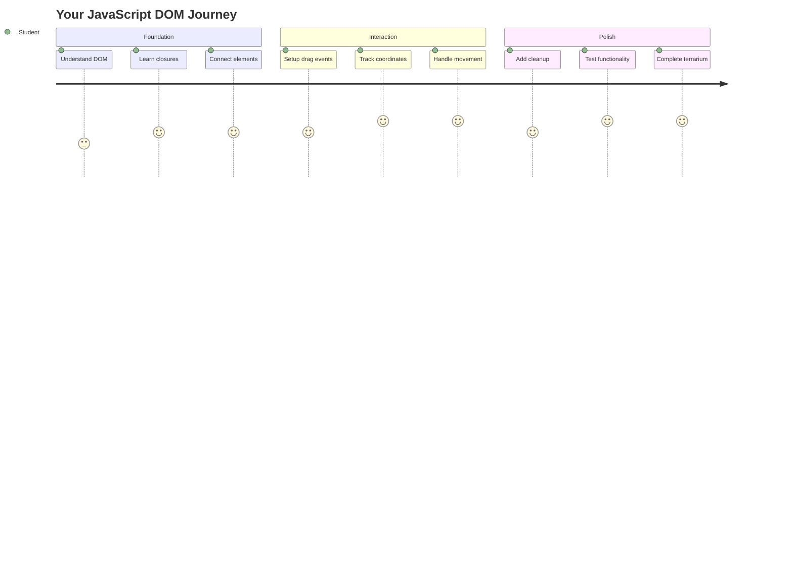
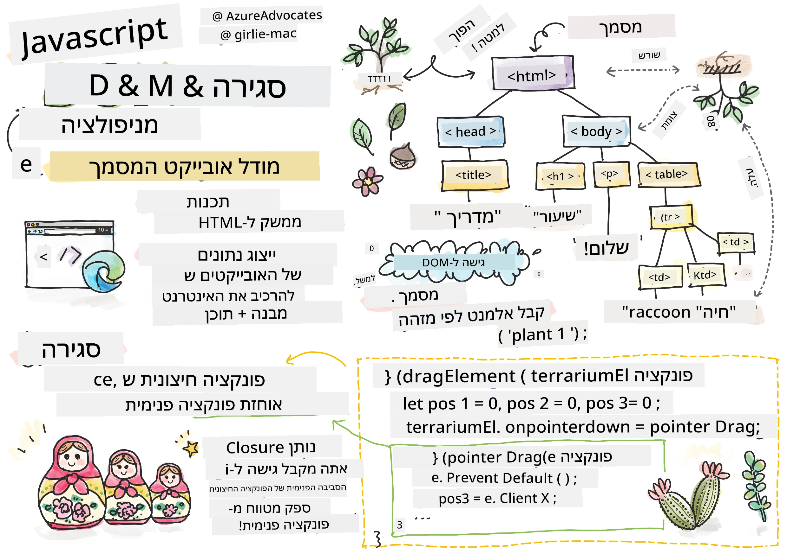
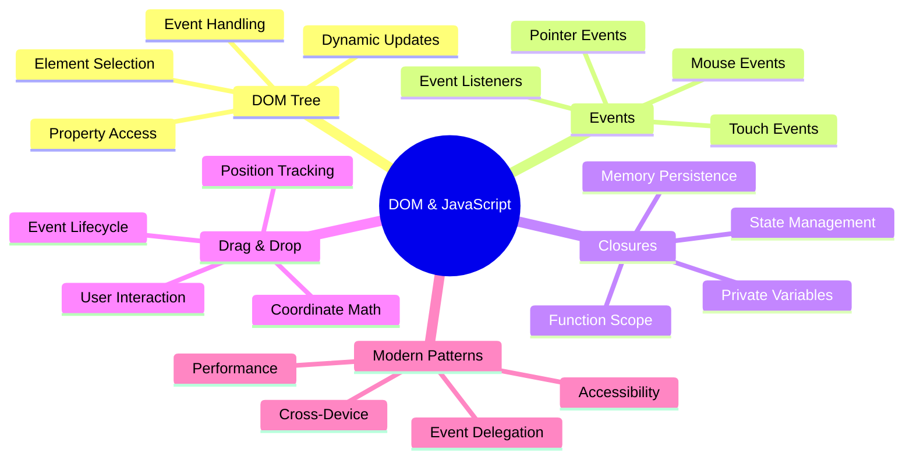
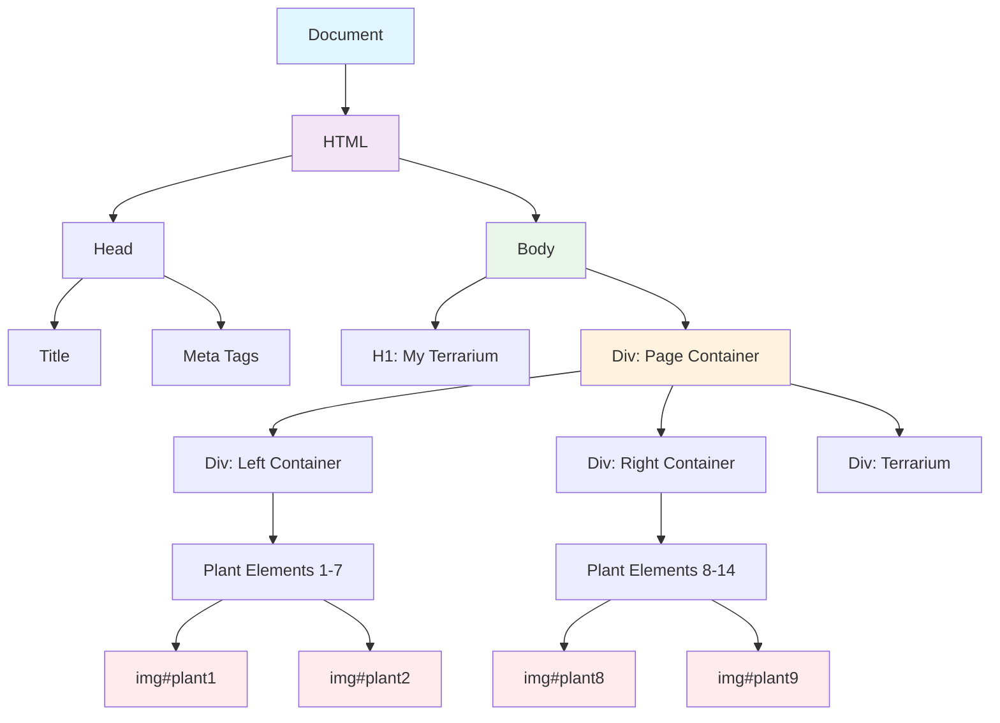
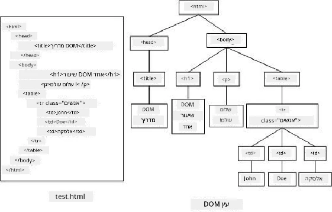
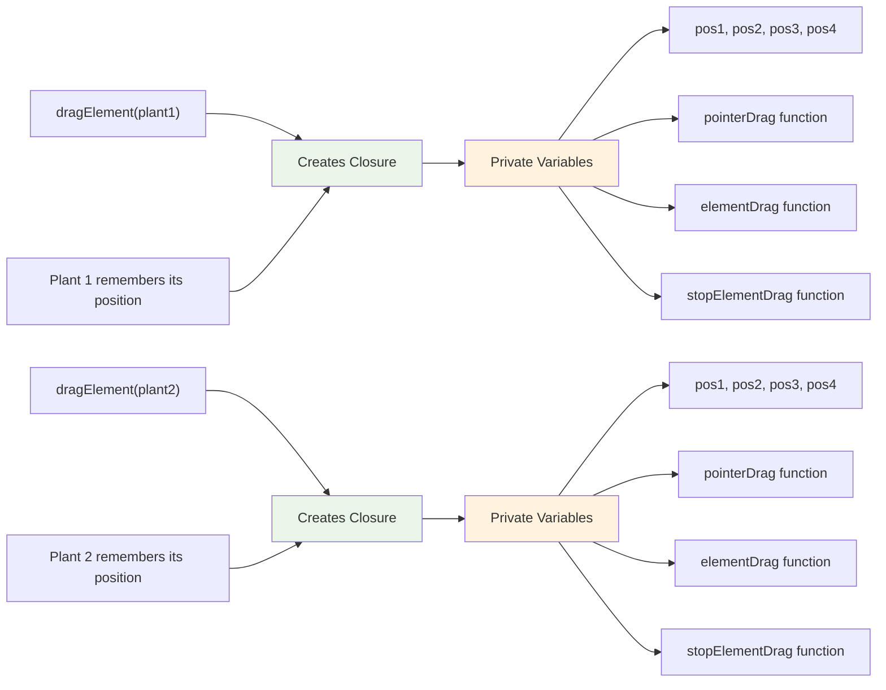
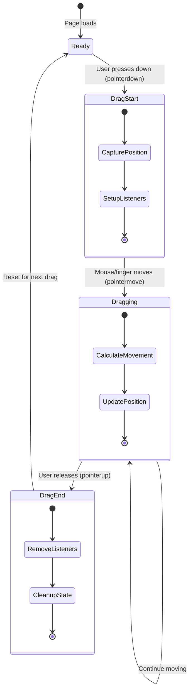
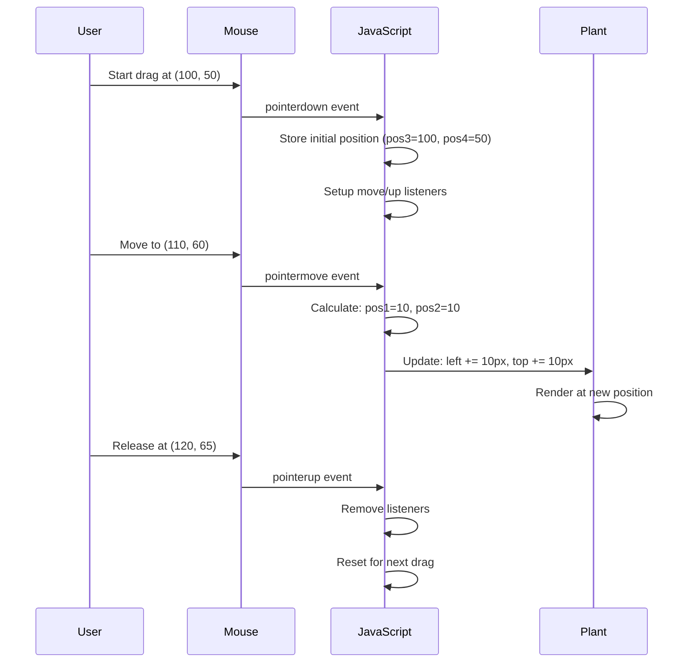
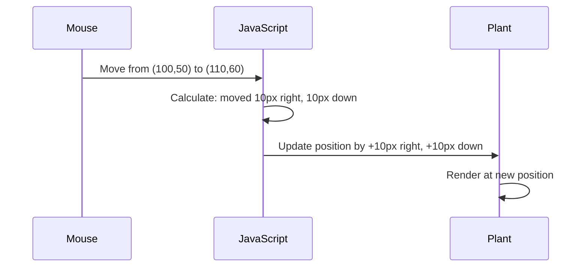
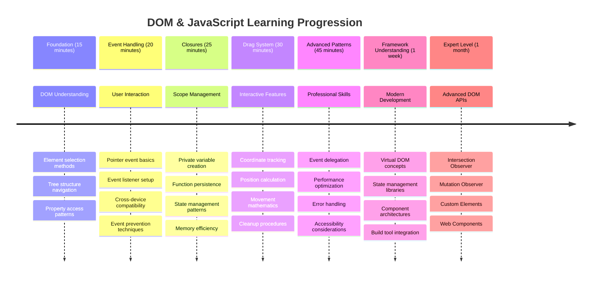

<!--
CO_OP_TRANSLATOR_METADATA:
{
  "original_hash": "973e48ad87d67bf5bb819746c9f8e302",
  "translation_date": "2025-11-04T02:24:28+00:00",
  "source_file": "3-terrarium/3-intro-to-DOM-and-closures/README.md",
  "language_code": "he"
}
-->
# פרויקט הטרריום חלק 3: מניפולציה של DOM וסגירות ב-JavaScript




> איור מאת [Tomomi Imura](https://twitter.com/girlie_mac)

ברוכים הבאים לאחד ההיבטים המרתקים ביותר בפיתוח אתרים - הפיכת דברים לאינטראקטיביים! מודל האובייקטים של המסמך (DOM) הוא כמו גשר בין ה-HTML שלך ל-JavaScript, והיום נשתמש בו כדי להחיות את הטרריום שלך. כשטים ברנרס-לי יצר את הדפדפן הראשון, הוא דמיין רשת שבה מסמכים יכולים להיות דינמיים ואינטראקטיביים - ה-DOM הופך את החזון הזה לאפשרי.

נחקור גם סגירות ב-JavaScript, שעלולות להישמע מאיימות בהתחלה. תחשוב על סגירות כיצירת "כיסי זיכרון" שבהם הפונקציות שלך יכולות לזכור מידע חשוב. זה כמו שלכל צמח בטרריום שלך יש רשומת נתונים משלו למעקב אחר מיקומו. בסוף השיעור הזה תבין כמה הן טבעיות ושימושיות.

הנה מה שאנחנו בונים: טרריום שבו משתמשים יכולים לגרור ולשחרר צמחים לכל מקום שירצו. תלמד את טכניקות המניפולציה של ה-DOM שמניעות הכל, החל מהעלאת קבצים בגרירה ושחרור ועד משחקים אינטראקטיביים. בואו נעשה את הטרריום שלכם חי.



## שאלון לפני השיעור

[שאלון לפני השיעור](https://ff-quizzes.netlify.app/web/quiz/19)

## הבנת ה-DOM: השער שלך לדפי אינטרנט אינטראקטיביים

מודל האובייקטים של המסמך (DOM) הוא הדרך שבה JavaScript מתקשר עם אלמנטים ה-HTML שלך. כאשר הדפדפן שלך טוען דף HTML, הוא יוצר ייצוג מובנה של הדף בזיכרון - זהו ה-DOM. תחשוב עליו כעץ משפחה שבו כל אלמנט HTML הוא בן משפחה ש-JavaScript יכול לגשת אליו, לשנות אותו או לסדר אותו מחדש.

מניפולציה של DOM הופכת דפים סטטיים לאתרים אינטראקטיביים. בכל פעם שאתה רואה כפתור שמשנה צבע במעבר עכבר, עדכון תוכן ללא רענון דף, או אלמנטים שניתן לגרור, זו מניפולציה של DOM בפעולה.





> ייצוג של ה-DOM והסימון של ה-HTML שמתייחס אליו. מתוך [Olfa Nasraoui](https://www.researchgate.net/publication/221417012_Profile-Based_Focused_Crawler_for_Social_Media-Sharing_Websites)

**הנה מה שהופך את ה-DOM לעוצמתי:**
- **מספק** דרך מובנית לגשת לכל אלמנט בדף שלך
- **מאפשר** עדכוני תוכן דינמיים ללא רענון דף
- **מאפשר** תגובה בזמן אמת לאינטראקציות משתמש כמו לחיצות וגרירות
- **יוצר** את הבסיס ליישומי אינטרנט אינטראקטיביים מודרניים

## סגירות ב-JavaScript: יצירת קוד מאורגן ועוצמתי

[סגירה ב-JavaScript](https://developer.mozilla.org/docs/Web/JavaScript/Closures) היא כמו לתת לפונקציה את סביבת העבודה הפרטית שלה עם זיכרון מתמשך. תחשוב על איך פרושי דרווין באיי גלאפגוס פיתחו כל אחד מקור ייחודי בהתבסס על סביבתם הספציפית - סגירות פועלות באופן דומה, יוצרות פונקציות ייחודיות ש"זוכרות" את ההקשר הספציפי שלהן גם לאחר שהפונקציה ההורה סיימה.

בטרריום שלנו, סגירות עוזרות לכל צמח לזכור את מיקומו באופן עצמאי. דפוס זה מופיע לאורך כל פיתוח JavaScript מקצועי, מה שהופך אותו למושג חשוב להבנה.



> 💡 **הבנת סגירות**: סגירות הן נושא משמעותי ב-JavaScript, ומפתחים רבים משתמשים בהן במשך שנים לפני שהם מבינים את כל ההיבטים התיאורטיים. היום נתמקד ביישום מעשי - תראה סגירות מופיעות באופן טבעי כשנבנה את התכונות האינטראקטיביות שלנו. ההבנה תתפתח כשתראה איך הן פותרות בעיות אמיתיות.


> ייצוג של ה-DOM והסימון של ה-HTML שמתייחס אליו. מתוך [Olfa Nasraoui](https://www.researchgate.net/publication/221417012_Profile-Based_Focused_Crawler_for_Social_Media-Sharing_Websites)

בשיעור הזה, נשלים את פרויקט הטרריום האינטראקטיבי שלנו על ידי יצירת ה-JavaScript שיאפשר למשתמשים לבצע מניפולציות על הצמחים בדף.

## לפני שמתחילים: הכנה להצלחה

תצטרך את קבצי ה-HTML וה-CSS שלך מהשיעורים הקודמים של הטרריום - אנחנו עומדים להפוך את העיצוב הסטטי הזה לאינטראקטיבי. אם אתה מצטרף בפעם הראשונה, השלמת השיעורים האלה קודם תספק הקשר חשוב.

הנה מה שנבנה:
- **גרירה ושחרור חלקה** לכל הצמחים בטרריום
- **מעקב אחר קואורדינטות** כדי שהצמחים יזכרו את מיקומם
- **ממשק אינטראקטיבי מלא** באמצעות JavaScript טהור
- **קוד נקי ומאורגן** באמצעות דפוסי סגירה

## הגדרת קובץ ה-JavaScript שלך

בואו ניצור את קובץ ה-JavaScript שיהפוך את הטרריום שלך לאינטראקטיבי.

**שלב 1: צור את קובץ הסקריפט שלך**

בתיקיית הטרריום שלך, צור קובץ חדש בשם `script.js`.

**שלב 2: קישור ה-JavaScript ל-HTML שלך**

הוסף את תג הסקריפט הזה לחלק `<head>` של קובץ `index.html` שלך:

```html
<script src="./script.js" defer></script>
```

**למה התכונה `defer` חשובה:**
- **מבטיחה** שה-JavaScript שלך יחכה עד שכל ה-HTML יטען
- **מונעת** שגיאות שבהן JavaScript מחפש אלמנטים שעדיין לא מוכנים
- **מבטיחה** שכל אלמנטי הצמחים שלך זמינים לאינטראקציה
- **מספקת** ביצועים טובים יותר מאשר מיקום סקריפטים בתחתית הדף

> ⚠️ **הערה חשובה**: התכונה `defer` מונעת בעיות תזמון נפוצות. בלעדיה, JavaScript עשוי לנסות לגשת לאלמנטים HTML לפני שהם נטענים, מה שגורם לשגיאות.

---

## חיבור JavaScript לאלמנטים HTML שלך

לפני שנוכל להפוך אלמנטים לגרירים, JavaScript צריך לאתר אותם ב-DOM. תחשוב על זה כמו מערכת קטלוג ספרייה - ברגע שיש לך את מספר הקטלוג, אתה יכול למצוא בדיוק את הספר שאתה צריך ולגשת לכל התוכן שלו.

נשתמש בשיטה `document.getElementById()` כדי לבצע את החיבורים האלה. זה כמו שיש לך מערכת תיוק מדויקת - אתה מספק מזהה, והיא מאתרת בדיוק את האלמנט שאתה צריך ב-HTML שלך.

### הפעלת פונקציית גרירה לכל הצמחים

הוסף את הקוד הזה לקובץ `script.js` שלך:

```javascript
// Enable drag functionality for all 14 plants
dragElement(document.getElementById('plant1'));
dragElement(document.getElementById('plant2'));
dragElement(document.getElementById('plant3'));
dragElement(document.getElementById('plant4'));
dragElement(document.getElementById('plant5'));
dragElement(document.getElementById('plant6'));
dragElement(document.getElementById('plant7'));
dragElement(document.getElementById('plant8'));
dragElement(document.getElementById('plant9'));
dragElement(document.getElementById('plant10'));
dragElement(document.getElementById('plant11'));
dragElement(document.getElementById('plant12'));
dragElement(document.getElementById('plant13'));
dragElement(document.getElementById('plant14'));
```

**הנה מה שהקוד הזה משיג:**
- **מאתר** כל אלמנט צמח ב-DOM באמצעות מזהה ייחודי שלו
- **מאחזר** הפניה ב-JavaScript לכל אלמנט HTML
- **מעביר** כל אלמנט לפונקציה `dragElement` (שניצור בהמשך)
- **מכין** כל צמח לאינטראקציה של גרירה ושחרור
- **מחבר** את מבנה ה-HTML שלך לפונקציונליות JavaScript

> 🎯 **למה להשתמש במזהים במקום במחלקות?** מזהים מספקים מזהים ייחודיים לאלמנטים ספציפיים, בעוד שמחלקות CSS מיועדות לעיצוב קבוצות של אלמנטים. כאשר JavaScript צריך לבצע מניפולציה על אלמנטים בודדים, מזהים מציעים את הדיוק והביצועים שאנחנו צריכים.

> 💡 **טיפ מקצועי**: שים לב איך אנחנו קוראים ל-`dragElement()` עבור כל צמח בנפרד. גישה זו מבטיחה שלכל צמח תהיה התנהגות גרירה עצמאית משלו, מה שחשוב לאינטראקציה חלקה של המשתמש.

### 🔄 **בדיקה פדגוגית**
**הבנת חיבור ה-DOM**: לפני המעבר לפונקציית הגרירה, ודא שאתה יכול:
- ✅ להסביר איך `document.getElementById()` מאתר אלמנטים HTML
- ✅ להבין למה אנחנו משתמשים במזהים ייחודיים לכל צמח
- ✅ לתאר את מטרת התכונה `defer` בתגי סקריפט
- ✅ לזהות איך JavaScript ו-HTML מתחברים דרך ה-DOM

**מבחן עצמי מהיר**: מה יקרה אם לשני אלמנטים יהיה אותו מזהה? למה `getElementById()` מחזיר רק אלמנט אחד?
*תשובה: מזהים צריכים להיות ייחודיים; אם הם משוכפלים, רק האלמנט הראשון מוחזר*

---

## בניית סגירת פונקציית גרירת אלמנט

עכשיו ניצור את הלב של פונקציית הגרירה שלנו: סגירה שמנהלת את התנהגות הגרירה עבור כל צמח. סגירה זו תכיל מספר פונקציות פנימיות שעובדות יחד כדי לעקוב אחר תנועות עכבר ולעדכן מיקומי אלמנטים.

סגירות מושלמות למשימה זו כי הן מאפשרות לנו ליצור משתנים "פרטיים" שמתמשכים בין קריאות פונקציה, ומעניקים לכל צמח מערכת מעקב קואורדינטות עצמאית.

### הבנת סגירות עם דוגמה פשוטה

תן לי להדגים סגירות עם דוגמה פשוטה שממחישה את הרעיון:

```javascript
function createCounter() {
    let count = 0; // This is like a private variable
    
    function increment() {
        count++; // The inner function remembers the outer variable
        return count;
    }
    
    return increment; // We're giving back the inner function
}

const myCounter = createCounter();
console.log(myCounter()); // 1
console.log(myCounter()); // 2
```

**הנה מה שקורה בדפוס הסגירה הזה:**
- **יוצר** משתנה `count` פרטי שקיים רק בתוך הסגירה הזו
- **הפונקציה הפנימית** יכולה לגשת ולשנות את המשתנה החיצוני (מנגנון הסגירה)
- **כשאנחנו מחזירים** את הפונקציה הפנימית, היא שומרת על החיבור לנתונים הפרטיים
- **גם אחרי** ש-`createCounter()` מסיימת את הביצוע, `count` מתמשך וזוכר את ערכו

### למה סגירות מושלמות לפונקציית גרירה

עבור הטרריום שלנו, כל צמח צריך לזכור את קואורדינטות המיקום הנוכחיות שלו. סגירות מספקות את הפתרון המושלם:

**יתרונות מרכזיים לפרויקט שלנו:**
- **שומרות** משתני מיקום פרטיים לכל צמח באופן עצמאי
- **משמרות** נתוני קואורדינטות בין אירועי גרירה
- **מונעות** קונפליקטים של משתנים בין אלמנטים גרירים שונים
- **יוצרות** מבנה קוד נקי ומאורגן

> 🎯 **מטרת הלמידה**: אתה לא צריך לשלוט בכל היבט של סגירות כרגע. התמקד בלראות איך הן עוזרות לנו לארגן קוד ולשמור על מצב עבור פונקציית הגרירה שלנו.



### יצירת פונקציית dragElement

עכשיו נבנה את הפונקציה הראשית שתטפל בכל לוגיקת הגרירה. הוסף את הפונקציה הזו מתחת להצהרות אלמנטי הצמחים שלך:

```javascript
function dragElement(terrariumElement) {
    // Initialize position tracking variables
    let pos1 = 0,  // Previous mouse X position
        pos2 = 0,  // Previous mouse Y position  
        pos3 = 0,  // Current mouse X position
        pos4 = 0;  // Current mouse Y position
    
    // Set up the initial drag event listener
    terrariumElement.onpointerdown = pointerDrag;
}
```

**הבנת מערכת מעקב המיקום:**
- **`pos1` ו-`pos2`**: שומרים את ההבדל בין מיקומי עכבר ישנים וחדשים
- **`pos3` ו-`pos4`**: עוקבים אחר קואורדינטות העכבר הנוכחיות
- **`terrariumElement`**: אלמנט הצמח הספציפי שאנחנו הופכים לגריר
- **`onpointerdown`**: האירוע שמופעל כשהמשתמש מתחיל לגרור

**הנה איך דפוס הסגירה עובד:**
- **יוצר** משתני מיקום פרטיים לכל אלמנט צמח
- **משמר** את המשתנים האלה לאורך מחזור החיים של הגרירה
- **מבטיח** שכל צמח עוקב אחר הקואורדינטות שלו באופן עצמאי
- **מספק** ממשק נקי דרך פונקציית `dragElement`

### למה להשתמש באירועי Pointer?

אולי תתהה למה אנחנו משתמשים ב-`onpointerdown` במקום ב-`onclick` המוכר יותר. הנה ההסבר:

| סוג אירוע | הכי מתאים ל | החיסרון |
|------------|----------|-------------|
| `onclick` | לחיצות פשוטות על כפתורים | לא יכול להתמודד עם גרירה (רק לחיצות ושחרורים) |
| `onpointerdown` | גם עכבר וגם מגע | חדש יותר, אבל נתמך היטב בימינו |
| `onmousedown` | עכבר שולחני בלבד | משאיר משתמשי מובייל מחוץ לתמונה |

**למה אירועי Pointer מושלמים למה שאנחנו בונים:**
- **עובדים נהדר** בין אם מישהו משתמש בעכבר, באצבע או אפילו בעט
- **מרגישים אותו דבר** על מחשב נייד, טאבלט או טלפון
- **מטפלים** בתנועת הגרירה בפועל (לא רק לחיצה ושחרור)
- **יוצרים** חוויה חלקה שמשתמשים מצפים לה מאפליקציות אינטרנט מודרניות

> 💡 **הכנה לעתיד**: אירועי Pointer הם הדרך המודרנית לטפל באינטראקציות משתמש. במקום לכתוב קוד נפרד לעכבר ולמגע, אתה מקבל את שניהם בחינם. די מגניב, נכון?

### 🔄 **בדיקה פדגוגית**
**הבנת טיפול באירועים**: עצור כדי לאשר את הבנתך לגבי אירועים:
- ✅ למה אנחנו משתמשים באירועי Pointer במקום באירועי עכבר?
- ✅ איך משתני סגירה מתמשכים בין קריאות פונקציה?
- ✅ מה תפקידו של `preventDefault()` בגרירה חלקה?
- ✅ למה אנחנו מצמידים מאזינים למסמך במקום לאלמנטים בודדים?

**חיבור לעולם האמיתי**: תחשוב על ממשקי גרירה ושחרור שאתה משתמש בהם מדי יום:
- **העלאת קבצים**: גרירת קבצים לחלון דפדפן
- **לוחות קאנבן**: העברת משימות בין עמודות
- **גלריות תמונות**: סידור מחדש של סדר תמונות
- **ממשקי מובייל**: החלקה וגרירה על מסכי מגע

---

## פונקציית pointerDrag: לכידת תחילת גרירה

כשמשתמש לוחץ על צמח (בין אם בלחיצת עכבר או במגע אצבע), פונקציית `pointerDrag` נכנסת לפעולה. פונקציה זו לוכדת את הקואורדינטות הראשוניות ומגדירה את מערכת הגרירה.

הוסף את הפונקציה הזו בתוך סגירת `dragElement`, מיד אחרי השורה `terrariumElement.onpointerdown = pointerDrag;`:

```javascript
function pointerDrag(e) {
    // Prevent default browser behavior (like text selection)
    e.preventDefault();
    
    // Capture the initial mouse/touch position
    pos3 = e.clientX;  // X coordinate where drag started
    pos4 = e.clientY;  // Y coordinate where drag started
    
    // Set up event listeners for the dragging process
    document.onpointermove = elementDrag;
    document.onpointerup = stopElementDrag;
}
```

**שלב אחר שלב, הנה מה שקורה:**
- **מונע** התנהגויות ברירת מחדל של הדפדפן שיכולות להפריע לגרירה
- **רושם** את הקואורדינטות המדויקות שבהן המשתמש התחיל את מחוות הגרירה
- **מקים** מאזיני אירועים לתנועת הגרירה המתמשכת
- **מכין** את המערכת למעקב אחר תנועת עכבר/אצבע על פני כל המסמך

### הבנת מניעת אירועים

השורה `e.preventDefault()` חיונית לגרירה חלקה:

**ללא מניעה, דפדפנים עשויים:**
- **לבחור** טקסט בעת גרירה על פני הדף
- **להפעיל** תפריטי הקשר בלחיצה ימנית גרירה
- **להפריע** להתנהגות הגרירה המותאמת שלנו
- **ליצור** ארטיפקטים חזותיים במהלך פעולת הגרירה

> 🔍 **ניסוי**: לאחר השלמת השיעור הזה, נסה להסיר את `e.preventDefault()` ותראה איך זה משפיע על חוויית הגרירה. תבין במהירות למה השורה הזו חיונית!

### מערכת מעקב קואורדינטות

המאפיינים `e.clientX` ו-`e.clientY` מספקים לנו קואורדינטות עכ
**הבנת הקואורדינטות הללו:**
- **מספקת** מידע מדויק למיקום פיקסלים
- **מתעדכנת** בזמן אמת כשהמשתמש מזיז את הסמן שלו
- **נשארת** עקבית על פני גדלי מסך ורמות זום שונות
- **מאפשרת** אינטראקציות גרירה חלקות ורספונסיביות

### הגדרת מאזיני אירועים ברמת המסמך

שימו לב כיצד אנו מצמידים את אירועי התנועה והעצירה לכלל ה-`document`, ולא רק לאלמנט הצמח:

```javascript
document.onpointermove = elementDrag;
document.onpointerup = stopElementDrag;
```

**למה להצמיד למסמך:**
- **ממשיכה** לעקוב גם כשהעכבר יוצא מאלמנט הצמח
- **מונעת** הפרעה לגרירה אם המשתמש זז במהירות
- **מספקת** גרירה חלקה על פני כל המסך
- **מטפלת** במקרים חריגים שבהם הסמן יוצא מחוץ לחלון הדפדפן

> ⚡ **הערת ביצועים**: ננקה את מאזיני האירועים ברמת המסמך כאשר הגרירה תיעצר כדי למנוע דליפות זיכרון ובעיות ביצועים.

## השלמת מערכת הגרירה: תנועה וניקוי

עכשיו נוסיף את שתי הפונקציות הנותרות שמטפלות בתנועת הגרירה בפועל ובניקוי כאשר הגרירה נעצרת. פונקציות אלו פועלות יחד כדי ליצור תנועת צמח חלקה ורספונסיבית ברחבי הטרריום שלכם.

### פונקציית elementDrag: מעקב אחר תנועה

הוסיפו את פונקציית `elementDrag` מיד לאחר הסוגר המסולסל הסוגר של `pointerDrag`:

```javascript
function elementDrag(e) {
    // Calculate the distance moved since the last event
    pos1 = pos3 - e.clientX;  // Horizontal distance moved
    pos2 = pos4 - e.clientY;  // Vertical distance moved
    
    // Update the current position tracking
    pos3 = e.clientX;  // New current X position
    pos4 = e.clientY;  // New current Y position
    
    // Apply the movement to the element's position
    terrariumElement.style.top = (terrariumElement.offsetTop - pos2) + 'px';
    terrariumElement.style.left = (terrariumElement.offsetLeft - pos1) + 'px';
}
```

**הבנת המתמטיקה של הקואורדינטות:**
- **`pos1` ו-`pos2`**: מחשבים כמה רחוק העכבר זז מאז העדכון האחרון
- **`pos3` ו-`pos4`**: שומרים את מיקום העכבר הנוכחי לחישוב הבא
- **`offsetTop` ו-`offsetLeft`**: מקבלים את מיקום האלמנט הנוכחי בעמוד
- **לוגיקת החיסור**: מזיזה את האלמנט באותו מרחק שהעכבר זז



**פירוט חישוב התנועה:**
1. **מודד** את ההבדל בין מיקומי העכבר הישנים והחדשים
2. **מחשב** כמה להזיז את האלמנט בהתבסס על תנועת העכבר
3. **מעדכן** את מאפייני המיקום של CSS בזמן אמת
4. **שומר** את המיקום החדש כבסיס לחישוב התנועה הבא

### ייצוג חזותי של המתמטיקה



### פונקציית stopElementDrag: ניקוי

הוסיפו את פונקציית הניקוי לאחר הסוגר המסולסל הסוגר של `elementDrag`:

```javascript
function stopElementDrag() {
    // Remove the document-level event listeners
    document.onpointerup = null;
    document.onpointermove = null;
}
```

**למה ניקוי הוא חיוני:**
- **מונע** דליפות זיכרון ממאזיני אירועים שנותרים
- **עוצר** את התנהגות הגרירה כשהמשתמש משחרר את הצמח
- **מאפשר** לגרור אלמנטים אחרים באופן עצמאי
- **מאפס** את המערכת לפעולת גרירה הבאה

**מה קורה ללא ניקוי:**
- מאזיני אירועים ממשיכים לפעול גם לאחר שהגרירה נעצרת
- הביצועים מתדרדרים ככל שמצטברים מאזינים לא בשימוש
- התנהגות לא צפויה בעת אינטראקציה עם אלמנטים אחרים
- משאבי הדפדפן מתבזבזים על טיפול באירועים מיותרים

### הבנת מאפייני מיקום ב-CSS

מערכת הגרירה שלנו משנה שני מאפייני CSS מרכזיים:

| מאפיין | מה הוא שולט עליו | איך אנחנו משתמשים בו |
|--------|-------------------|-----------------------|
| `top` | מרחק מקצה עליון | מיקום אנכי במהלך גרירה |
| `left` | מרחק מקצה שמאלי | מיקום אופקי במהלך גרירה |

**תובנות מרכזיות על מאפייני offset:**
- **`offsetTop`**: המרחק הנוכחי מהקצה העליון של אלמנט האב הממוקם
- **`offsetLeft`**: המרחק הנוכחי מהקצה השמאלי של אלמנט האב הממוקם
- **הקשר מיקום**: ערכים אלו יחסיים לאב הממוקם הקרוב ביותר
- **עדכונים בזמן אמת**: משתנים מיד כשאנחנו משנים את מאפייני ה-CSS

> 🎯 **פילוסופיית עיצוב**: מערכת הגרירה הזו גמישה בכוונה – אין "אזורים להנחה" או מגבלות. משתמשים יכולים למקם צמחים בכל מקום, מה שמעניק להם שליטה יצירתית מלאה על עיצוב הטרריום שלהם.

## חיבור הכל יחד: מערכת הגרירה המלאה שלכם

מזל טוב! הרגע בניתם מערכת גרירה ושחרור מתקדמת באמצעות JavaScript טהור. פונקציית `dragElement` המלאה שלכם מכילה עכשיו סגירה חזקה שמנהלת:

**מה הסגירה שלכם משיגה:**
- **שומרת** משתני מיקום פרטיים לכל צמח באופן עצמאי
- **מטפלת** במחזור החיים המלא של הגרירה מתחילתה ועד סופה
- **מספקת** תנועה חלקה ורספונסיבית על פני כל המסך
- **מנקה** משאבים כראוי כדי למנוע דליפות זיכרון
- **יוצרת** ממשק אינטואיטיבי ויצירתי לעיצוב טרריום

### בדיקת הטרריום האינטראקטיבי שלכם

עכשיו בדקו את הטרריום האינטראקטיבי שלכם! פתחו את קובץ `index.html` בדפדפן ונסו את הפונקציונליות:

1. **לחצו והחזיקו** כל צמח כדי להתחיל לגרור
2. **הזיזו את העכבר או האצבע** וצפו בצמח עוקב בצורה חלקה
3. **שחררו** כדי להניח את הצמח במיקומו החדש
4. **נסו** סידורים שונים כדי לחקור את הממשק

🥇 **הישג**: יצרתם יישום אינטרנט אינטראקטיבי לחלוטין באמצעות עקרונות ליבה שמפתחים מקצועיים משתמשים בהם מדי יום. פונקציונליות הגרירה והשחרור הזו משתמשת באותם עקרונות מאחורי העלאות קבצים, לוחות קנבן ועוד ממשקים אינטראקטיביים רבים.

### 🔄 **בדיקה פדגוגית**
**הבנת מערכת מלאה**: ודאו את שליטתכם במערכת הגרירה המלאה:
- ✅ איך סגירות שומרות על מצב עצמאי לכל צמח?
- ✅ למה מתמטיקת חישוב הקואורדינטות הכרחית לתנועה חלקה?
- ✅ מה היה קורה אם היינו שוכחים לנקות מאזיני אירועים?
- ✅ איך התבנית הזו מתרחבת לאינטראקציות מורכבות יותר?

**הרהור על איכות הקוד**: סקרו את הפתרון המלא שלכם:
- **עיצוב מודולרי**: כל צמח מקבל מופע סגירה משלו
- **יעילות אירועים**: הגדרה וניקוי נכונים של מאזינים
- **תמיכה חוצת מכשירים**: עובד על מחשבים שולחניים וניידים
- **מודעות ביצועים**: ללא דליפות זיכרון או חישובים מיותרים


---

## אתגר סוכן GitHub Copilot 🚀

השתמשו במצב סוכן כדי להשלים את האתגר הבא:

**תיאור:** שפרו את פרויקט הטרריום על ידי הוספת פונקציונליות איפוס שמחזירה את כל הצמחים למיקומם המקורי עם אנימציות חלקות.

**הנחיה:** צרו כפתור איפוס שכאשר לוחצים עליו, כל הצמחים חוזרים למיקומם המקורי בסרגל הצד עם מעבר חלק באמצעות מעברי CSS. הפונקציה צריכה לשמור את המיקומים המקוריים כאשר הדף נטען ולהעביר את הצמחים בחזרה למיקומים אלו בצורה חלקה במשך שנייה אחת כאשר לוחצים על כפתור האיפוס.

למידע נוסף על [מצב סוכן](https://code.visualstudio.com/blogs/2025/02/24/introducing-copilot-agent-mode) כאן.

## 🚀 אתגר נוסף: הרחיבו את הכישורים שלכם

מוכנים לקחת את הטרריום שלכם לשלב הבא? נסו ליישם את השיפורים הבאים:

**הרחבות יצירתיות:**
- **לחיצה כפולה** על צמח כדי להביא אותו לקדמת המסך (מניפולציה של z-index)
- **הוספת משוב חזותי** כמו זוהר עדין בעת מעבר מעל צמחים
- **יישום גבולות** כדי למנוע מצמחים להיגרר מחוץ לטרריום
- **יצירת פונקציית שמירה** שמזכירה מיקומי צמחים באמצעות localStorage
- **הוספת אפקטים קוליים** להרמת והנחת צמחים

> 💡 **הזדמנות למידה**: כל אחד מהאתגרים הללו ילמד אתכם היבטים חדשים של מניפולציה ב-DOM, טיפול באירועים ועיצוב חוויית משתמש.

## מבחן לאחר ההרצאה

[מבחן לאחר ההרצאה](https://ff-quizzes.netlify.app/web/quiz/20)

## סקירה ולימוד עצמי: העמקת ההבנה שלכם

שלוטם ביסודות מניפולציית DOM וסגירות, אך תמיד יש עוד מה ללמוד! הנה כמה דרכים להרחיב את הידע והכישורים שלכם.

### גישות חלופיות לגרירה ושחרור

השתמשנו באירועי מצביע למען גמישות מרבית, אך פיתוח אתרים מציע גישות רבות:

| גישה | הכי מתאים ל | ערך לימודי |
|------|--------------|------------|
| [HTML Drag and Drop API](https://developer.mozilla.org/docs/Web/API/HTML_Drag_and_Drop_API) | העלאות קבצים, אזורי גרירה פורמליים | הבנת יכולות דפדפן מובנות |
| [אירועי מגע](https://developer.mozilla.org/docs/Web/API/Touch_events) | אינטראקציות ספציפיות לנייד | דפוסי פיתוח ממוקדי נייד |
| מאפייני `transform` ב-CSS | אנימציות חלקות | טכניקות אופטימיזציה לביצועים |

### נושאים מתקדמים במניפולציה ב-DOM

**השלבים הבאים במסע הלמידה שלכם:**
- **הקצאת אירועים**: טיפול באירועים בצורה יעילה עבור אלמנטים מרובים
- **Intersection Observer**: זיהוי מתי אלמנטים נכנסים/יוצאים מהתצוגה
- **Mutation Observer**: מעקב אחר שינויים במבנה ה-DOM
- **Web Components**: יצירת אלמנטים UI חוזרים ומבודדים
- **מושגי DOM וירטואלי**: הבנת איך מסגרות אופטימיזציה עדכוני DOM

### משאבים חיוניים להמשך הלמידה

**תיעוד טכני:**
- [מדריך אירועי מצביע ב-MDN](https://developer.mozilla.org/docs/Web/API/Pointer_events) - מדריך מקיף לאירועי מצביע
- [מפרט אירועי מצביע של W3C](https://www.w3.org/TR/pointerevents1/) - תיעוד תקנים רשמי
- [צלילה עמוקה לסגירות ב-JavaScript](https://developer.mozilla.org/docs/Web/JavaScript/Closures) - דפוסי סגירה מתקדמים

**תאימות דפדפן:**
- [CanIUse.com](https://caniuse.com/) - בדיקת תמיכה בתכונות על פני דפדפנים
- [נתוני תאימות דפדפן ב-MDN](https://github.com/mdn/browser-compat-data) - מידע תאימות מפורט

**הזדמנויות תרגול:**
- **בנו** משחק פאזל באמצעות מכניקת גרירה דומה
- **צרו** לוח קנבן עם ניהול משימות באמצעות גרירה ושחרור
- **עצבו** גלריית תמונות עם סידור תמונות ניתן לגרירה
- **נסו** מחוות מגע לממשקים ניידים

> 🎯 **אסטרטגיית למידה**: הדרך הטובה ביותר להטמיע את המושגים הללו היא באמצעות תרגול. נסו לבנות וריאציות של ממשקי גרירה – כל פרויקט ילמד אתכם משהו חדש על אינטראקציה עם משתמשים ומניפולציה ב-DOM.

### ⚡ **מה תוכלו לעשות ב-5 הדקות הבאות**
- [ ] פתחו את DevTools בדפדפן והקלידו `document.querySelector('body')` בקונסולה
- [ ] נסו לשנות טקסט של דף אינטרנט באמצעות `innerHTML` או `textContent`
- [ ] הוסיפו מאזין אירוע לחיצה לכל כפתור או קישור בדף אינטרנט
- [ ] בדקו את מבנה עץ ה-DOM באמצעות פאנל האלמנטים

### 🎯 **מה תוכלו להשיג בשעה הקרובה**
- [ ] השלימו את מבחן לאחר השיעור וסקרו מושגי מניפולציה ב-DOM
- [ ] צרו דף אינטרנט אינטראקטיבי שמגיב ללחיצות משתמש
- [ ] תרגלו טיפול באירועים עם סוגי אירועים שונים (לחיצה, מעבר עכבר, הקשת מקשים)
- [ ] בנו רשימת משימות פשוטה או מונה באמצעות מניפולציה ב-DOM
- [ ] חקרו את הקשר בין אלמנטים HTML לאובייקטים JavaScript

### 📅 **מסע JavaScript שלכם לשבוע**
- [ ] השלימו את פרויקט הטרריום האינטראקטיבי עם פונקציונליות גרירה ושחרור
- [ ] שלטו בהקצאת אירועים לטיפול יעיל באירועים
- [ ] למדו על לולאת האירועים ו-JavaScript אסינכרוני
- [ ] תרגלו סגירות על ידי בניית מודולים עם מצב פרטי
- [ ] חקרו APIs מודרניים של DOM כמו Intersection Observer
- [ ] בנו רכיבים אינטראקטיביים ללא שימוש במסגרות

### 🌟 **מסע של חודש לשליטה ב-JavaScript**
- [ ] צרו יישום דף יחיד מורכב באמצעות JavaScript טהור
- [ ] למדו מסגרת מודרנית (React, Vue או Angular) והשוו אותה ל-DOM טהור
- [ ] תרמו לפרויקטים פתוחים של JavaScript
- [ ] שלטו במושגים מתקדמים כמו רכיבי אינטרנט ואלמנטים מותאמים אישית
- [ ] בנו יישומי אינטרנט יעילים עם דפוסי DOM אופטימליים
- [ ] לימדו אחרים על מניפולציה ב-DOM ועקרונות יסוד ב-JavaScript

## 🎯 ציר הזמן לשליטה ב-DOM ב-JavaScript



### 🛠️ סיכום ערכת הכלים שלכם ב-JavaScript

לאחר השלמת השיעור הזה, יש לכם עכשיו:
- **שליטה ב-DOM**: בחירת אלמנטים, מניפולציה של מאפיינים וניווט בעץ
- **מומחיות באירועים**: טיפול באינטראקציות חוצות מכשירים עם אירועי מצביע
- **הבנת סגירות**: ניהול מצב פרטי והתמדה של פונקציות
- **מערכות אינטראקטיביות**: יישום מלא של גרירה ושחרור מאפס
- **מודעות ביצועים**: ניקוי אירועים נכון וניהול זיכרון
- **דפוסים מודרניים**: טכניקות ארגון קוד בשימוש בפיתוח מקצועי
- **חוויית משתמש**: יצירת ממשקים אינטואיטיביים ורספונסיביים

**כישורים מקצועיים שנרכשו**: יצרתם תכונות באמצעות אותן טכניקות כמו:
- **לוחות קנבן/Trello**: גרירת כרטיסים בין עמודות
- **מערכות העלאת קבצים**: טיפול בקבצים באמצעות גרירה ושחרור
- **גלריות תמונות**: ממשקי סידור תמונות
- **אפליקציות ניידות**: דפוסי אינטראקציה מבוססי מגע

**הרמה הבאה**: אתם מוכנים לחקור מסגרות מודרניות כמו React, Vue או Angular שמבוססות על מושגי מניפולציה ב-DOM הללו!

## משימה

[עבדו עוד קצת עם ה-DOM](assignment.md)

---

**הצהרת אחריות**:  
מסמך זה תורגם באמצעות שירות תרגום AI [Co-op Translator](https://github.com/Azure/co-op-translator). למרות שאנו שואפים לדיוק, יש לקחת בחשבון שתרגומים אוטומטיים עשויים להכיל שגיאות או אי דיוקים. המסמך המקורי בשפתו המקורית צריך להיחשב כמקור סמכותי. עבור מידע קריטי, מומלץ להשתמש בתרגום מקצועי אנושי. אנו לא נושאים באחריות לאי הבנות או לפרשנויות שגויות הנובעות משימוש בתרגום זה.