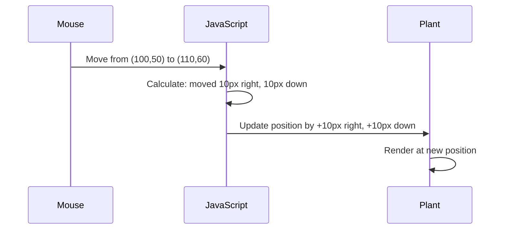

<!--
CO_OP_TRANSLATOR_METADATA:
{
  "original_hash": "bc93f6285423033ebf5b8abeb5282888",
  "translation_date": "2025-10-23T01:24:29+00:00",
  "source_file": "3-terrarium/3-intro-to-DOM-and-closures/README.md",
  "language_code": "he"
}
-->
# פרויקט הטרריום חלק 3: מניפולציה של DOM וסגירות ב-JavaScript


> איור מאת [Tomomi Imura](https://twitter.com/girlie_mac)

ברוכים הבאים לאחד ההיבטים המרתקים ביותר בפיתוח אתרים - הפיכת דברים לאינטראקטיביים! מודל האובייקטים של המסמך (DOM) הוא כמו גשר בין ה-HTML שלך ל-JavaScript, והיום נשתמש בו כדי להחיות את הטרריום שלך. כשטים ברנרס-לי יצר את הדפדפן הראשון, הוא דמיין רשת שבה מסמכים יכולים להיות דינמיים ואינטראקטיביים - ה-DOM הופך את החזון הזה לאפשרי.

נחקור גם סגירות ב-JavaScript, שיכולות להישמע מאיימות בהתחלה. תחשוב על סגירות כיצירת "כיסי זיכרון" שבהם הפונקציות שלך יכולות לזכור מידע חשוב. זה כמו שלכל צמח בטרריום יש רשומת נתונים משלו כדי לעקוב אחר מיקומו. בסוף השיעור הזה, תבין כמה הן טבעיות ושימושיות.

הנה מה שאנחנו בונים: טרריום שבו משתמשים יכולים לגרור ולהניח צמחים בכל מקום שירצו. תלמד את טכניקות המניפולציה של ה-DOM שמאפשרות הכל, החל מהעלאת קבצים בגרירה ושחרור ועד משחקים אינטראקטיביים. בואו נגרום לטרריום שלכם להתעורר לחיים.

## שאלון לפני השיעור

[שאלון לפני השיעור](https://ff-quizzes.netlify.app/web/quiz/19)

## הבנת ה-DOM: השער שלך לדפי אינטרנט אינטראקטיביים

מודל האובייקטים של המסמך (DOM) הוא הדרך שבה JavaScript מתקשר עם אלמנטים ה-HTML שלך. כאשר הדפדפן שלך טוען דף HTML, הוא יוצר ייצוג מובנה של הדף בזיכרון - זהו ה-DOM. תחשוב עליו כעץ משפחה שבו כל אלמנט HTML הוא בן משפחה ש-JavaScript יכול לגשת אליו, לשנות אותו או לסדר אותו מחדש.

מניפולציה של ה-DOM הופכת דפים סטטיים לאתרים אינטראקטיביים. בכל פעם שאתה רואה כפתור שמשנה צבע במעבר עכבר, תוכן שמתעדכן ללא רענון דף, או אלמנטים שניתן לגרור, זו מניפולציה של ה-DOM בפעולה.


> ייצוג של ה-DOM והסימון HTML שמפנה אליו. מתוך [Olfa Nasraoui](https://www.researchgate.net/publication/221417012_Profile-Based_Focused_Crawler_for_Social_Media-Sharing_Websites)

**הנה מה שהופך את ה-DOM לעוצמתי:**
- **מספק** דרך מובנית לגשת לכל אלמנט בדף שלך
- **מאפשר** עדכוני תוכן דינמיים ללא רענון דף
- **מאפשר** תגובה בזמן אמת לאינטראקציות משתמש כמו לחיצות וגרירות
- **יוצר** את הבסיס ליישומי אינטרנט אינטראקטיביים מודרניים

## סגירות ב-JavaScript: יצירת קוד מאורגן ועוצמתי

[סגירה ב-JavaScript](https://developer.mozilla.org/docs/Web/JavaScript/Closures) היא כמו לתת לפונקציה את סביבת העבודה הפרטית שלה עם זיכרון מתמשך. תחשוב על איך שהפרושים של דרווין באיי גלאפגוס פיתחו מקור מותאם לסביבתם הספציפית - סגירות פועלות באופן דומה, יוצרות פונקציות מותאמות אישית ש"זוכרות" את ההקשר הספציפי שלהן גם לאחר שהפונקציה ההורה סיימה.

בטרריום שלנו, סגירות עוזרות לכל צמח לזכור את מיקומו באופן עצמאי. דפוס זה מופיע לאורך כל פיתוח JavaScript מקצועי, מה שהופך אותו למושג חשוב להבנה.

> 💡 **הבנת סגירות**: סגירות הן נושא משמעותי ב-JavaScript, ומפתחים רבים משתמשים בהן במשך שנים לפני שהם מבינים את כל ההיבטים התיאורטיים. היום, אנחנו מתמקדים ביישום מעשי - תראה סגירות מופיעות באופן טבעי כשאנחנו בונים את התכונות האינטראקטיביות שלנו. ההבנה תתפתח ככל שתראה איך הן פותרות בעיות אמיתיות.


> ייצוג של ה-DOM והסימון HTML שמפנה אליו. מתוך [Olfa Nasraoui](https://www.researchgate.net/publication/221417012_Profile-Based_Focused_Crawler_for_Social_Media-Sharing_Websites)

בשיעור הזה, נשלים את פרויקט הטרריום האינטראקטיבי שלנו על ידי יצירת ה-JavaScript שיאפשר למשתמשים לבצע מניפולציות על הצמחים בדף.

## לפני שנתחיל: הכנה להצלחה

תצטרך את קבצי ה-HTML וה-CSS שלך מהשיעורים הקודמים של הטרריום - אנחנו עומדים להפוך את העיצוב הסטטי הזה לאינטראקטיבי. אם אתה מצטרף בפעם הראשונה, השלמת השיעורים האלה קודם תספק הקשר חשוב.

הנה מה שנבנה:
- **גרירה ושחרור חלקה** לכל הצמחים בטרריום
- **מעקב אחר קואורדינטות** כך שהצמחים יזכרו את מיקומם
- **ממשק אינטראקטיבי מלא** באמצעות JavaScript טהור
- **קוד נקי ומאורגן** באמצעות דפוסי סגירה

## הגדרת קובץ ה-JavaScript שלך

בואו ניצור את קובץ ה-JavaScript שיהפוך את הטרריום שלכם לאינטראקטיבי.

**שלב 1: צור את קובץ הסקריפט שלך**

בתיקיית הטרריום שלך, צור קובץ חדש בשם `script.js`.

**שלב 2: קישור ה-JavaScript ל-HTML שלך**

הוסף את תג הסקריפט הזה לחלק `<head>` של קובץ `index.html` שלך:

```html
<script src="./script.js" defer></script>
```

**למה התכונה `defer` חשובה:**
- **מבטיחה** שה-JavaScript שלך יחכה עד שכל ה-HTML יטען
- **מונעת** שגיאות שבהן JavaScript מחפש אלמנטים שעדיין לא מוכנים
- **מבטיחה** שכל אלמנטי הצמחים שלך זמינים לאינטראקציה
- **מספקת** ביצועים טובים יותר מאשר מיקום סקריפטים בתחתית הדף

> ⚠️ **הערה חשובה**: התכונה `defer` מונעת בעיות תזמון נפוצות. בלעדיה, JavaScript עשוי לנסות לגשת לאלמנטים HTML לפני שהם נטענים, מה שגורם לשגיאות.

---

## חיבור JavaScript לאלמנטים HTML שלך

לפני שנוכל להפוך אלמנטים לגרירים, JavaScript צריך לאתר אותם ב-DOM. תחשוב על זה כמו מערכת קטלוג ספרייה - ברגע שיש לך את מספר הקטלוג, אתה יכול למצוא בדיוק את הספר שאתה צריך ולגשת לכל התוכן שלו.

נשתמש בשיטה `document.getElementById()` כדי לבצע את החיבורים האלה. זה כמו שיש לך מערכת תיוק מדויקת - אתה מספק מזהה, והיא מאתרת בדיוק את האלמנט שאתה צריך ב-HTML שלך.

### הפעלת פונקציונליות גרירה לכל הצמחים

הוסף את הקוד הזה לקובץ `script.js` שלך:

```javascript
// Enable drag functionality for all 14 plants
dragElement(document.getElementById('plant1'));
dragElement(document.getElementById('plant2'));
dragElement(document.getElementById('plant3'));
dragElement(document.getElementById('plant4'));
dragElement(document.getElementById('plant5'));
dragElement(document.getElementById('plant6'));
dragElement(document.getElementById('plant7'));
dragElement(document.getElementById('plant8'));
dragElement(document.getElementById('plant9'));
dragElement(document.getElementById('plant10'));
dragElement(document.getElementById('plant11'));
dragElement(document.getElementById('plant12'));
dragElement(document.getElementById('plant13'));
dragElement(document.getElementById('plant14'));
```

**הנה מה שהקוד הזה משיג:**
- **מאתר** כל אלמנט צמח ב-DOM באמצעות מזהה ייחודי שלו
- **משיג** הפניה JavaScript לכל אלמנט HTML
- **מעביר** כל אלמנט לפונקציה `dragElement` (שניצור בהמשך)
- **מכין** כל צמח לאינטראקציה של גרירה ושחרור
- **מחבר** את מבנה ה-HTML שלך לפונקציונליות JavaScript

> 🎯 **למה להשתמש במזהים במקום במחלקות?** מזהים מספקים מזהים ייחודיים לאלמנטים ספציפיים, בעוד שמחלקות CSS מיועדות לעיצוב קבוצות של אלמנטים. כאשר JavaScript צריך לבצע מניפולציה על אלמנטים בודדים, מזהים מציעים את הדיוק והביצועים שאנחנו צריכים.

> 💡 **טיפ מקצועי**: שים לב איך אנחנו קוראים ל-`dragElement()` עבור כל צמח בנפרד. גישה זו מבטיחה שלכל צמח תהיה התנהגות גרירה עצמאית משלו, מה שחשוב לאינטראקציה חלקה של המשתמש.

---

## בניית סגירת פונקציית גרירה

עכשיו ניצור את הלב של פונקציונליות הגרירה שלנו: סגירה שמנהלת את התנהגות הגרירה עבור כל צמח. סגירה זו תכיל פונקציות פנימיות רבות שעובדות יחד כדי לעקוב אחר תנועות עכבר ולעדכן מיקומי אלמנטים.

סגירות מושלמות למשימה זו מכיוון שהן מאפשרות לנו ליצור משתנים "פרטיים" שנשארים בין קריאות פונקציה, ומעניקים לכל צמח מערכת מעקב קואורדינטות עצמאית משלו.

### הבנת סגירות עם דוגמה פשוטה

תן לי להדגים סגירות עם דוגמה פשוטה שממחישה את הרעיון:

```javascript
function createCounter() {
    let count = 0; // This is like a private variable
    
    function increment() {
        count++; // The inner function remembers the outer variable
        return count;
    }
    
    return increment; // We're giving back the inner function
}

const myCounter = createCounter();
console.log(myCounter()); // 1
console.log(myCounter()); // 2
```

**הנה מה שקורה בדפוס הסגירה הזה:**
- **יוצר** משתנה `count` פרטי שקיים רק בתוך הסגירה הזו
- **הפונקציה הפנימית** יכולה לגשת ולשנות את המשתנה החיצוני הזה (מנגנון הסגירה)
- **כשאנחנו מחזירים** את הפונקציה הפנימית, היא שומרת על הקשר שלה לנתונים הפרטיים
- **גם לאחר** ש-`createCounter()` מסיימת את הביצוע, `count` נשאר וזוכר את ערכו

### למה סגירות מושלמות לפונקציונליות גרירה

עבור הטרריום שלנו, כל צמח צריך לזכור את קואורדינטות המיקום הנוכחיות שלו. סגירות מספקות את הפתרון המושלם:

**יתרונות מרכזיים לפרויקט שלנו:**
- **שומרות** על משתני מיקום פרטיים לכל צמח באופן עצמאי
- **משמרות** נתוני קואורדינטות בין אירועי גרירה
- **מונעות** קונפליקטים של משתנים בין אלמנטים גרירים שונים
- **יוצרות** מבנה קוד נקי ומאורגן

> 🎯 **מטרת הלמידה**: אתה לא צריך לשלוט בכל היבט של סגירות כרגע. התמקד בלראות איך הן עוזרות לנו לארגן קוד ולשמור על מצב עבור פונקציונליות הגרירה שלנו.

### יצירת פונקציית dragElement

עכשיו נבנה את הפונקציה הראשית שתטפל בכל לוגיקת הגרירה. הוסף את הפונקציה הזו מתחת להצהרות אלמנטי הצמחים שלך:

```javascript
function dragElement(terrariumElement) {
    // Initialize position tracking variables
    let pos1 = 0,  // Previous mouse X position
        pos2 = 0,  // Previous mouse Y position  
        pos3 = 0,  // Current mouse X position
        pos4 = 0;  // Current mouse Y position
    
    // Set up the initial drag event listener
    terrariumElement.onpointerdown = pointerDrag;
}
```

**הבנת מערכת מעקב המיקום:**
- **`pos1` ו-`pos2`**: מאחסנים את ההבדל בין מיקומי עכבר ישנים וחדשים
- **`pos3` ו-`pos4`**: עוקבים אחר קואורדינטות העכבר הנוכחיות
- **`terrariumElement`**: האלמנט הצמחי הספציפי שאנחנו הופכים לגריר
- **`onpointerdown`**: האירוע שמופעל כאשר המשתמש מתחיל לגרור

**הנה איך דפוס הסגירה עובד:**
- **יוצר** משתני מיקום פרטיים לכל אלמנט צמח
- **משמר** את המשתנים האלה לאורך כל מחזור החיים של הגרירה
- **מבטיח** שכל צמח עוקב אחר קואורדינטות משלו באופן עצמאי
- **מספק** ממשק נקי דרך פונקציית `dragElement`

### למה להשתמש באירועי מצביע?

אולי אתה תוהה למה אנחנו משתמשים ב-`onpointerdown` במקום ב-`onclick` המוכר יותר. הנה ההסבר:

| סוג אירוע | מתאים ל | החיסרון |
|-----------|---------|---------|
| `onclick` | לחיצות פשוטות על כפתור | לא יכול להתמודד עם גרירה (רק לחיצות ושחרורים) |
| `onpointerdown` | גם עכבר וגם מגע | חדש יותר, אבל נתמך היטב בימינו |
| `onmousedown` | רק עכבר שולחני | משאיר משתמשי מובייל מחוץ לתמונה |

**למה אירועי מצביע מושלמים למה שאנחנו בונים:**
- **עובד נהדר** בין אם מישהו משתמש בעכבר, באצבע או אפילו בעט
- **מרגיש אותו דבר** על מחשב נייד, טאבלט או טלפון
- **מטפל** בתנועת הגרירה עצמה (לא רק לחיצה ושחרור)
- **יוצר** חוויה חלקה שמשתמשים מצפים לה מאפליקציות אינטרנט מודרניות

> 💡 **התאמה לעתיד**: אירועי מצביע הם הדרך המודרנית לטפל באינטראקציות משתמש. במקום לכתוב קוד נפרד לעכבר ולמגע, אתה מקבל את שניהם בחינם. די מגניב, נכון?

---

## פונקציית pointerDrag: לכידת תחילת גרירה

כאשר משתמש לוחץ על צמח (בין אם בלחיצת עכבר או מגע אצבע), פונקציית `pointerDrag` נכנסת לפעולה. פונקציה זו לוכדת את הקואורדינטות הראשוניות ומגדירה את מערכת הגרירה.

הוסף את הפונקציה הזו בתוך סגירת `dragElement`, מיד אחרי השורה `terrariumElement.onpointerdown = pointerDrag;`:

```javascript
function pointerDrag(e) {
    // Prevent default browser behavior (like text selection)
    e.preventDefault();
    
    // Capture the initial mouse/touch position
    pos3 = e.clientX;  // X coordinate where drag started
    pos4 = e.clientY;  // Y coordinate where drag started
    
    // Set up event listeners for the dragging process
    document.onpointermove = elementDrag;
    document.onpointerup = stopElementDrag;
}
```

**שלב אחר שלב, הנה מה שקורה:**
- **מונע** התנהגויות ברירת מחדל של הדפדפן שיכולות להפריע לגרירה
- **רושם** את הקואורדינטות המדויקות שבהן המשתמש התחיל את מחוות הגרירה
- **מקים** מאזיני אירועים לתנועת הגרירה המתמשכת
- **מכין** את המערכת לעקוב אחר תנועת עכבר/אצבע על פני כל המסמך

### הבנת מניעת אירועים

השורה `e.preventDefault()` היא קריטית לגרירה חלקה:

**ללא מניעה, דפדפנים עשויים:**
- **לבחור** טקסט בעת גרירה על פני הדף
- **להפעיל** תפריטי הקשר בלחיצת עכבר ימני בזמן גרירה
- **להפריע** להתנהגות הגרירה המותאמת שלנו
- **ליצור** ארטיפקטים חזותיים במהלך פעולת הגרירה

> 🔍 **ניסוי**: לאחר שתשלים את השיעור הזה, נסה להסיר את `e.preventDefault()` ותראה איך זה משפיע על חוויית הגרירה. תבין במהירות למה השורה הזו חיונית!

### מערכת מעקב קואורדינטות

תכונות `e.clientX` ו-`e.clientY` מספקות לנו מידע מדויק על קואורדינטות עכבר/מגע:

| תכונה | מה היא מודדת | שימוש |
|-------|--------------|-------|
| `clientX` | מיקום אופקי ביחס לתצוגה | מעקב אחר תנועה שמאלה-ימינה |
| `clientY` | מיקום אנכי ביחס לתצוגה | מעקב אחר תנועה למעלה-למטה |

**הבנת הקואורדינטות האלה:**
- **מספקת** מידע מיקום מדויק ברמת הפיקסל
- **מתעדכנת** בזמן אמת כשהמשתמש מזיז את המצביע
- **נשארת** עקבית על פני גדלי מסך ורמות זום שונות
- **מאפשרת** אינטראקציות גרירה חלקות ורספונסיביות

### הגדרת מאזיני אירועים ברמת המסמך

שימו לב איך אנחנו מצמידים את אירועי התנועה והעצירה לכל ה-`document`, לא רק לאלמנט הצמח:

```javascript
document.onpointermove = elementDrag;
document.onpointerup = stopElementDrag;
```

**למה להצמיד למסמך:**
- **ממשיך** לעקוב גם כשהעכבר עוזב את אלמנט הצמח
- **מונע** הפרעות לגרירה אם המשתמש זז במהירות
- **מספק** גרירה חלקה על פני כל המסך
- **מטפל** במקרים קיצוניים שבהם הסמן זז מחוץ לחלון הדפדפן

> ⚡ **הערת ביצועים**: ננקה את המאזינים ברמת המסמך כאשר הגרירה תיעצר כדי להימנע מדליפות זיכרון ובעיות ביצועים.

## השלמת מערכת הגרירה: תנועה וניקוי

עכשיו נוסיף את שתי הפונקציות הנותרות שמטפלות בתנועת הגרירה עצמה
- **`pos3` ו-`pos4`**: מאחסנים את מיקום העכבר הנוכחי לחישוב הבא  
- **`offsetTop` ו-`offsetLeft`**: מקבלים את המיקום הנוכחי של האלמנט בדף  
- **לוגיקת החיסור**: מזיזים את האלמנט באותו מרחק שהעכבר זז  

**פירוט חישוב התנועה:**  
1. **מודד** את ההבדל בין מיקום העכבר הישן והחדש  
2. **מחשב** כמה להזיז את האלמנט בהתאם לתנועת העכבר  
3. **מעדכן** את מאפייני המיקום של CSS בזמן אמת  
4. **מאחסן** את המיקום החדש כבסיס לחישוב התנועה הבא  

### ייצוג חזותי של המתמטיקה  


  

### הפונקציה stopElementDrag: ניקוי  

הוסף את פונקציית הניקוי לאחר הסוגר המסולסל של `elementDrag`:  

```javascript
function stopElementDrag() {
    // Remove the document-level event listeners
    document.onpointerup = null;
    document.onpointermove = null;
}
```
  

**למה ניקוי חשוב:**  
- **מונע** דליפות זיכרון מאזינים לאירועים שנשארים  
- **עוצר** את התנהגות הגרירה כשהמשתמש משחרר את הצמח  
- **מאפשר** לגרור אלמנטים אחרים באופן עצמאי  
- **מאפס** את המערכת לפעולת גרירה הבאה  

**מה קורה ללא ניקוי:**  
- מאזיני אירועים ממשיכים לפעול גם לאחר שהגרירה נעצרת  
- ביצועים יורדים ככל שמצטברים מאזינים לא בשימוש  
- התנהגות לא צפויה בעת אינטראקציה עם אלמנטים אחרים  
- משאבי הדפדפן מתבזבזים על טיפול באירועים מיותרים  

### הבנת מאפייני מיקום ב-CSS  

מערכת הגרירה שלנו משנה שני מאפייני CSS מרכזיים:  

| מאפיין | מה הוא שולט | איך אנחנו משתמשים בו |  
|--------|-------------|-----------------------|  
| `top` | מרחק מהקצה העליון | מיקום אנכי בזמן גרירה |  
| `left` | מרחק מהקצה השמאלי | מיקום אופקי בזמן גרירה |  

**תובנות מרכזיות על מאפייני offset:**  
- **`offsetTop`**: המרחק הנוכחי מהקצה העליון של אלמנט האב הממוקם  
- **`offsetLeft`**: המרחק הנוכחי מהקצה השמאלי של אלמנט האב הממוקם  
- **הקשר מיקום**: הערכים הללו הם יחסיים לאב הממוקם הקרוב ביותר  
- **עדכונים בזמן אמת**: משתנים מיד כשאנחנו משנים את מאפייני ה-CSS  

> 🎯 **פילוסופיית עיצוב**: מערכת הגרירה הזו גמישה בכוונה – אין "אזורי הנחה" או מגבלות. המשתמשים יכולים למקם את הצמחים בכל מקום, מה שמעניק להם שליטה יצירתית מלאה על עיצוב הטרריום שלהם.  

## חיבור הכל יחד: מערכת הגרירה המלאה שלך  

מזל טוב! הרגע בנית מערכת גרירה ושחרור מתקדמת באמצעות JavaScript טהור. פונקציית `dragElement` המלאה שלך עכשיו מכילה סגירה חזקה שמנהלת:  

**מה הסגירה שלך משיגה:**  
- **שומרת** משתני מיקום פרטיים לכל צמח באופן עצמאי  
- **מטפלת** במחזור החיים המלא של הגרירה מתחילתו ועד סופו  
- **מספקת** תנועה חלקה ומגיבה על פני כל המסך  
- **מנקה** משאבים כראוי כדי למנוע דליפות זיכרון  
- **יוצרת** ממשק אינטואיטיבי ויצירתי לעיצוב טרריום  

### בדיקת הטרריום האינטראקטיבי שלך  

עכשיו בדוק את הטרריום האינטראקטיבי שלך! פתח את קובץ `index.html` בדפדפן אינטרנט ונסה את הפונקציונליות:  

1. **לחץ והחזק** כל צמח כדי להתחיל לגרור  
2. **הזז את העכבר או האצבע** וצפה בצמח עוקב בצורה חלקה  
3. **שחרר** כדי להניח את הצמח במיקומו החדש  
4. **התנסה** בסידורים שונים כדי לחקור את הממשק  

🥇 **הישג**: יצרת יישום אינטרנט אינטראקטיבי לחלוטין באמצעות מושגים מרכזיים שמפתחים מקצועיים משתמשים בהם מדי יום. פונקציית הגרירה והשחרור הזו משתמשת באותם עקרונות שמאחורי העלאת קבצים, לוחות קנבן ועוד ממשקים אינטראקטיביים רבים.  

  

---

## אתגר סוכן GitHub Copilot 🚀  

השתמש במצב סוכן כדי להשלים את האתגר הבא:  

**תיאור:** שפר את פרויקט הטרריום על ידי הוספת פונקציונליות איפוס שמחזירה את כל הצמחים למיקומם המקורי עם אנימציות חלקות.  

**הנחיה:** צור כפתור איפוס שכאשר לוחצים עליו, כל הצמחים חוזרים למיקומם המקורי בסרגל הצד עם מעברים חלקים. הפונקציה צריכה לאחסן את המיקומים המקוריים כאשר הדף נטען ולהעביר את הצמחים בצורה חלקה חזרה למיקומים אלו תוך שנייה אחת כאשר לוחצים על כפתור האיפוס.  

למידע נוסף על [מצב סוכן](https://code.visualstudio.com/blogs/2025/02/24/introducing-copilot-agent-mode) כאן.  

## 🚀 אתגר נוסף: הרחב את הכישורים שלך  

מוכן לקחת את הטרריום שלך לשלב הבא? נסה ליישם את ההרחבות הבאות:  

**הרחבות יצירתיות:**  
- **לחיצה כפולה** על צמח כדי להביא אותו לקדמת המסך (מניפולציה של z-index)  
- **הוסף משוב חזותי** כמו זוהר עדין בעת מעבר מעל צמחים  
- **הטמע גבולות** כדי למנוע מצמחים להיגרר מחוץ לטרריום  
- **צור פונקציית שמירה** שמזכירה את מיקומי הצמחים באמצעות localStorage  
- **הוסף אפקטים קוליים** להרמת והנחת צמחים  

> 💡 **הזדמנות למידה**: כל אחד מהאתגרים הללו ילמד אותך היבטים חדשים של מניפולציה ב-DOM, טיפול באירועים ועיצוב חוויית משתמש.  

## מבחן לאחר ההרצאה  

[מבחן לאחר ההרצאה](https://ff-quizzes.netlify.app/web/quiz/20)  

## סקירה ולימוד עצמי: העמקת ההבנה שלך  

שלטת ביסודות המניפולציה ב-DOM ובסגירות, אבל תמיד יש עוד מה לחקור! הנה כמה דרכים להרחיב את הידע והכישורים שלך.  

### גישות חלופיות לגרירה ושחרור  

השתמשנו באירועי מצביע למען גמישות מרבית, אבל פיתוח אתרים מציע גישות רבות:  

| גישה | הכי מתאים ל | ערך לימודי |  
|------|--------------|------------|  
| [HTML Drag and Drop API](https://developer.mozilla.org/docs/Web/API/HTML_Drag_and_Drop_API) | העלאת קבצים, אזורי גרירה פורמליים | הבנת יכולות דפדפן מובנות |  
| [Touch Events](https://developer.mozilla.org/docs/Web/API/Touch_events) | אינטראקציות ספציפיות לנייד | דפוסי פיתוח מותאמים לנייד |  
| מאפייני CSS `transform` | אנימציות חלקות | טכניקות אופטימיזציה לביצועים |  

### נושאים מתקדמים במניפולציה ב-DOM  

**השלבים הבאים במסע הלמידה שלך:**  
- **האצלת אירועים**: טיפול באירועים בצורה יעילה עבור אלמנטים מרובים  
- **Intersection Observer**: זיהוי מתי אלמנטים נכנסים/יוצאים מהתצוגה  
- **Mutation Observer**: מעקב אחר שינויים במבנה ה-DOM  
- **Web Components**: יצירת אלמנטים UI לשימוש חוזר ומוגנים  
- **מושגי Virtual DOM**: הבנת איך מסגרות עבודה משפרות עדכוני DOM  

### משאבים חיוניים להמשך הלמידה  

**תיעוד טכני:**  
- [מדריך אירועי מצביע של MDN](https://developer.mozilla.org/docs/Web/API/Pointer_events) - מדריך מקיף לאירועי מצביע  
- [מפרט אירועי מצביע של W3C](https://www.w3.org/TR/pointerevents1/) - תיעוד תקנים רשמי  
- [סקירה מעמיקה על סגירות ב-JavaScript](https://developer.mozilla.org/docs/Web/JavaScript/Closures) - דפוסי סגירה מתקדמים  

**תאימות דפדפנים:**  
- [CanIUse.com](https://caniuse.com/) - בדוק תמיכה בתכונות בדפדפנים  
- [נתוני תאימות דפדפנים של MDN](https://github.com/mdn/browser-compat-data) - מידע מפורט על תאימות  

**הזדמנויות תרגול:**  
- **בנה** משחק פאזל באמצעות מנגנוני גרירה דומים  
- **צור** לוח קנבן עם ניהול משימות באמצעות גרירה ושחרור  
- **עצב** גלריית תמונות עם סידור תמונות נגררות  
- **התנסה** במחוות מגע עבור ממשקים לנייד  

> 🎯 **אסטרטגיית למידה**: הדרך הטובה ביותר להטמיע את המושגים הללו היא באמצעות תרגול. נסה לבנות וריאציות של ממשקים נגררים – כל פרויקט ילמד אותך משהו חדש על אינטראקציה עם משתמשים ומניפולציה ב-DOM.  

## משימה  

[עבוד קצת יותר עם ה-DOM](assignment.md)  

---

**הצהרת אחריות**:  
מסמך זה תורגם באמצעות שירות תרגום מבוסס AI [Co-op Translator](https://github.com/Azure/co-op-translator). למרות שאנו שואפים לדיוק, יש לקחת בחשבון שתרגומים אוטומטיים עשויים להכיל שגיאות או אי דיוקים. המסמך המקורי בשפתו המקורית צריך להיחשב כמקור סמכותי. עבור מידע קריטי, מומלץ להשתמש בתרגום מקצועי אנושי. אנו לא נושאים באחריות לאי הבנות או פירושים שגויים הנובעים משימוש בתרגום זה.