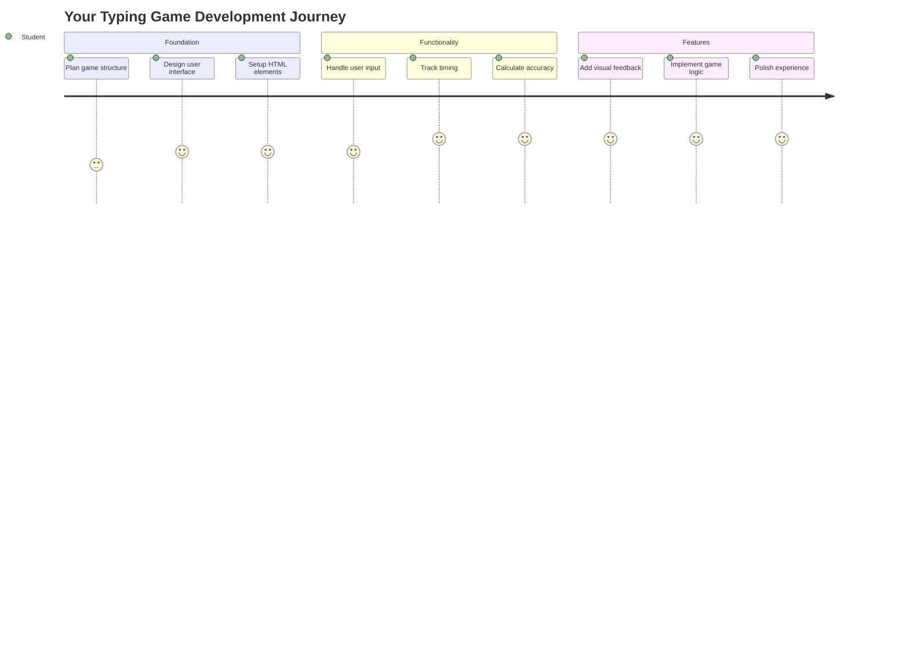
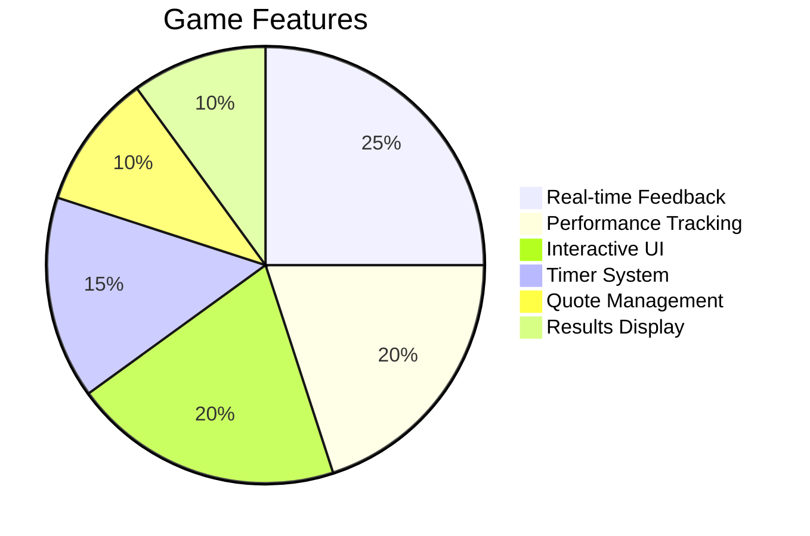
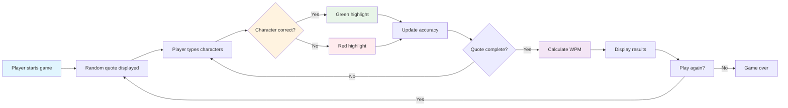
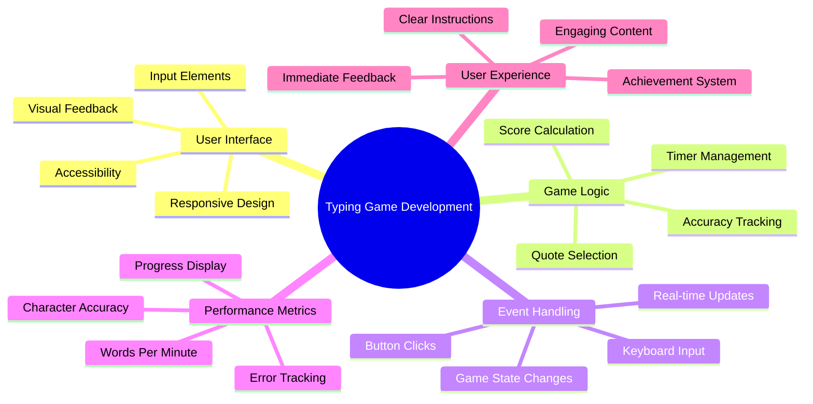
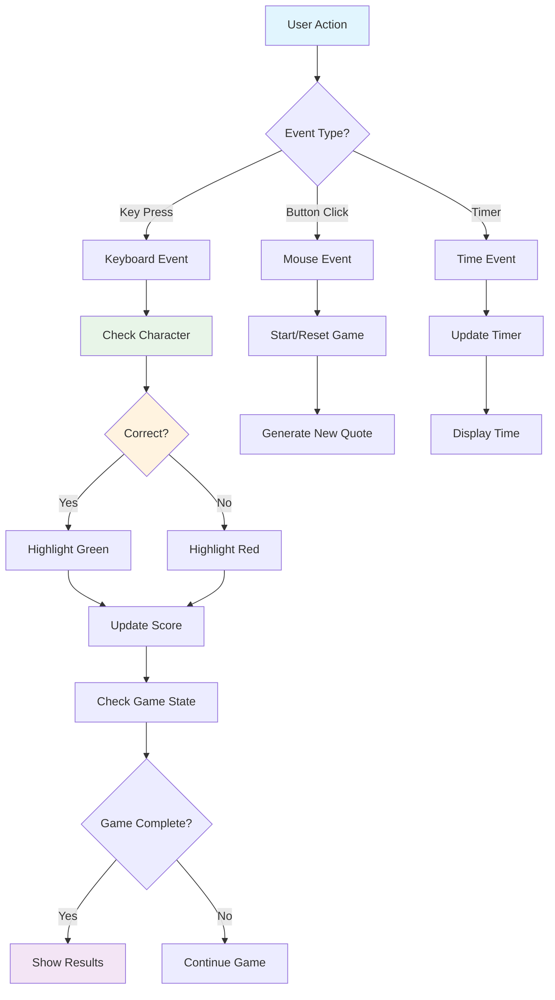
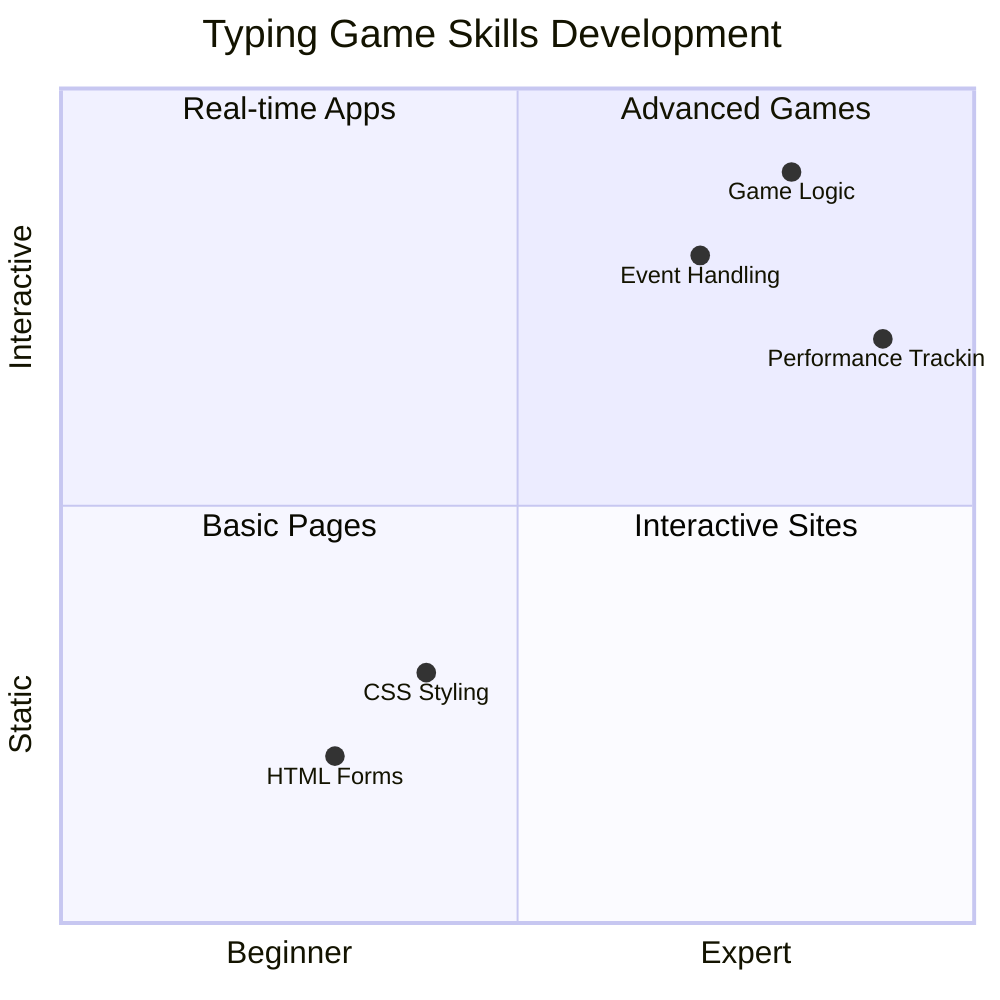
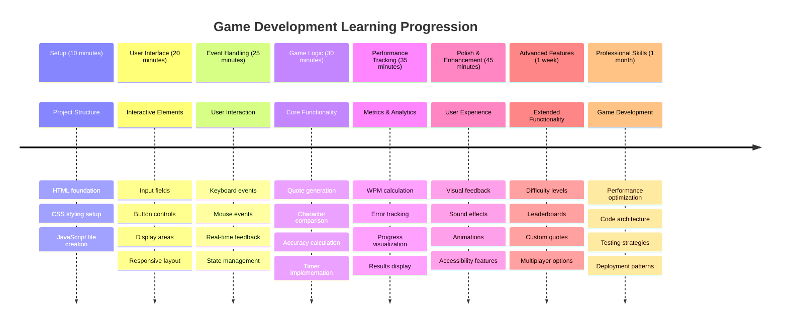

<!--
CO_OP_TRANSLATOR_METADATA:
{
  "original_hash": "efa2ab875b8bb5a7883816506da6b6d2",
  "translation_date": "2025-11-04T02:34:40+00:00",
  "source_file": "4-typing-game/README.md",
  "language_code": "he"
}
-->
# תכנות מונחה אירועים - בניית משחק הקלדה

## הקדמה

הנה משהו שכל מפתח יודע אבל כמעט לא מדברים עליו: להקליד מהר זה כוח על! 🚀 תחשבו על זה - ככל שתוכלו להעביר את הרעיונות שלכם מהמוח לעורך הקוד מהר יותר, כך היצירתיות שלכם תזרום בצורה חלקה יותר. זה כמו צינור ישיר בין המחשבות שלכם למסך.

רוצים לדעת אחת הדרכים הטובות ביותר לשפר את המיומנות הזו? ניחשתם נכון - אנחנו הולכים לבנות משחק!

> בואו ניצור יחד משחק הקלדה מדהים!

מוכנים להשתמש בכל הכישורים שלמדתם ב-JavaScript, HTML ו-CSS? אנחנו הולכים לבנות משחק הקלדה שיאתגר אתכם עם ציטוטים אקראיים מהבלש האגדי [שרלוק הולמס](https://en.wikipedia.org/wiki/Sherlock_Holmes). המשחק יעקוב אחרי מהירות ודיוק ההקלדה שלכם - ותאמינו לי, זה ממכר יותר ממה שאתם חושבים!

## מה כדאי לדעת

לפני שנתחיל, ודאו שאתם מרגישים בנוח עם המושגים הבאים (אל תדאגו אם אתם צריכים רענון קצר - כולנו היינו שם!):

- יצירת שדות טקסט וכפתורים
- CSS והגדרת סגנונות באמצעות מחלקות  
- יסודות JavaScript  
  - יצירת מערך
  - יצירת מספר אקראי
  - קבלת הזמן הנוכחי

אם אחד מהמושגים האלה מרגיש לכם קצת חלוד, זה לגמרי בסדר! לפעמים הדרך הטובה ביותר לחזק את הידע היא לקפוץ לפרויקט וללמוד תוך כדי.

### 🔄 **בדיקת יסודות**
**הערכת בסיס**: לפני שמתחילים בפיתוח, ודאו שאתם מבינים:
- ✅ איך טפסים ואלמנטים קלט ב-HTML עובדים
- ✅ מחלקות CSS ועיצוב דינמי
- ✅ מאזיני אירועים ומטפלים ב-JavaScript
- ✅ מניפולציה של מערכים ובחירה אקראית
- ✅ מדידת זמן וחישובים

**מבחן עצמי מהיר**: האם תוכלו להסביר איך המושגים האלה עובדים יחד במשחק אינטראקטיבי?
- **אירועים** מופעלים כאשר משתמשים מתקשרים עם אלמנטים
- **מטפלים** מעבדים את האירועים ומעדכנים את מצב המשחק
- **CSS** מספק משוב חזותי לפעולות המשתמש
- **תזמון** מאפשר מדידת ביצועים והתקדמות במשחק

## בואו נבנה את זה!

[יצירת משחק הקלדה באמצעות תכנות מונחה אירועים](./typing-game/README.md)

### ⚡ **מה תוכלו לעשות ב-5 הדקות הקרובות**
- [ ] לפתוח את קונסולת הדפדפן ולנסות להאזין לאירועי מקלדת עם `addEventListener`
- [ ] ליצור דף HTML פשוט עם שדה קלט ולבדוק זיהוי הקלדה
- [ ] לתרגל מניפולציה של מחרוזות על ידי השוואת טקסט מוקלד לטקסט יעד
- [ ] להתנסות עם `setTimeout` כדי להבין פונקציות תזמון

### 🎯 **מה תוכלו להשיג בשעה הקרובה**
- [ ] להשלים את מבחן השיעור ולהבין תכנות מונחה אירועים
- [ ] לבנות גרסה בסיסית של משחק ההקלדה עם אימות מילים
- [ ] להוסיף משוב חזותי להקלדה נכונה ושגויה
- [ ] ליישם מערכת ניקוד פשוטה המבוססת על מהירות ודיוק
- [ ] לעצב את המשחק שלכם עם CSS כדי להפוך אותו למושך חזותית

### 📅 **פיתוח משחק במהלך השבוע**
- [ ] להשלים את משחק ההקלדה המלא עם כל התכונות והליטושים
- [ ] להוסיף רמות קושי עם מורכבות מילים משתנה
- [ ] ליישם מעקב סטטיסטיקות משתמש (מילים לדקה, דיוק לאורך זמן)
- [ ] ליצור אפקטים קוליים ואנימציות לשיפור חוויית המשתמש
- [ ] להפוך את המשחק שלכם לרספונסיבי למכשירים ניידים
- [ ] לשתף את המשחק שלכם אונליין ולאסוף משוב ממשתמשים

### 🌟 **פיתוח אינטראקטיבי במהלך החודש**
- [ ] לבנות משחקים נוספים החוקרים דפוסי אינטראקציה שונים
- [ ] ללמוד על לולאות משחק, ניהול מצב ואופטימיזציית ביצועים
- [ ] לתרום לפרויקטים של פיתוח משחקים בקוד פתוח
- [ ] לשלוט במושגי תזמון מתקדמים ואנימציות חלקות
- [ ] ליצור תיק עבודות המציג יישומים אינטראקטיביים שונים
- [ ] להדריך אחרים המתעניינים בפיתוח משחקים ואינטראקציה עם משתמשים

## 🎯 לוח זמנים לשליטה במשחק ההקלדה

### 🛠️ סיכום ערכת הכלים לפיתוח משחקים

לאחר השלמת הפרויקט הזה, תשלוט ב:
- **תכנות מונחה אירועים**: ממשקי משתמש רספונסיביים שמגיבים לקלט
- **משוב בזמן אמת**: עדכונים חזותיים וביצועיים מיידיים
- **מדידת ביצועים**: מערכות תזמון וניקוד מדויקות
- **ניהול מצב משחק**: שליטה בזרימת האפליקציה וחוויית המשתמש
- **עיצוב אינטראקטיבי**: יצירת חוויות משתמש ממכרות ומרתקות
- **API מודרניים של דפדפן**: ניצול יכולות הדפדפן לאינטראקציות עשירות
- **דפוסי נגישות**: עיצוב כוללני לכל המשתמשים

**יישומים בעולם האמיתי**: הכישורים האלה מיושמים ישירות ב:
- **אפליקציות אינטרנט**: כל ממשק אינטראקטיבי או לוח בקרה
- **תוכנות חינוכיות**: פלטפורמות למידה וכלי הערכת מיומנויות
- **כלי פרודוקטיביות**: עורכי טקסט, IDE וכלי שיתוף פעולה
- **תעשיית המשחקים**: משחקי דפדפן ובידור אינטראקטיבי
- **פיתוח למובייל**: ממשקים מבוססי מגע וטיפול במחוות

**הרמה הבאה**: אתם מוכנים לחקור מסגרות משחק מתקדמות, מערכות מרובות משתתפים בזמן אמת או יישומים אינטראקטיביים מורכבים!

## קרדיטים

נכתב באהבה על ידי [כריסטופר האריסון](http://www.twitter.com/geektrainer)

---

**כתב ויתור**:  
מסמך זה תורגם באמצעות שירות תרגום AI [Co-op Translator](https://github.com/Azure/co-op-translator). בעוד שאנו שואפים לדיוק, יש להיות מודעים לכך שתרגומים אוטומטיים עשויים להכיל שגיאות או אי דיוקים. המסמך המקורי בשפתו המקורית צריך להיחשב כמקור סמכותי. עבור מידע קריטי, מומלץ להשתמש בתרגום מקצועי אנושי. איננו אחראים לאי הבנות או לפרשנויות שגויות הנובעות משימוש בתרגום זה.