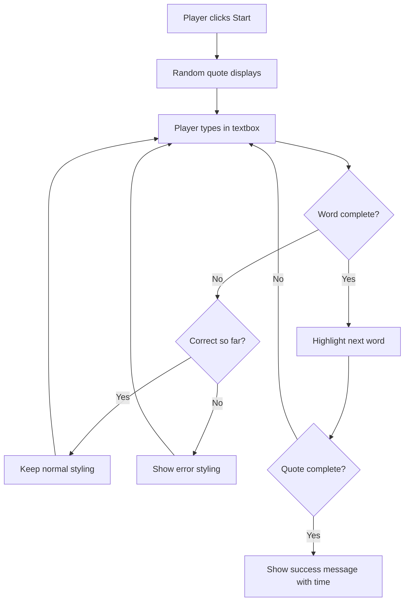
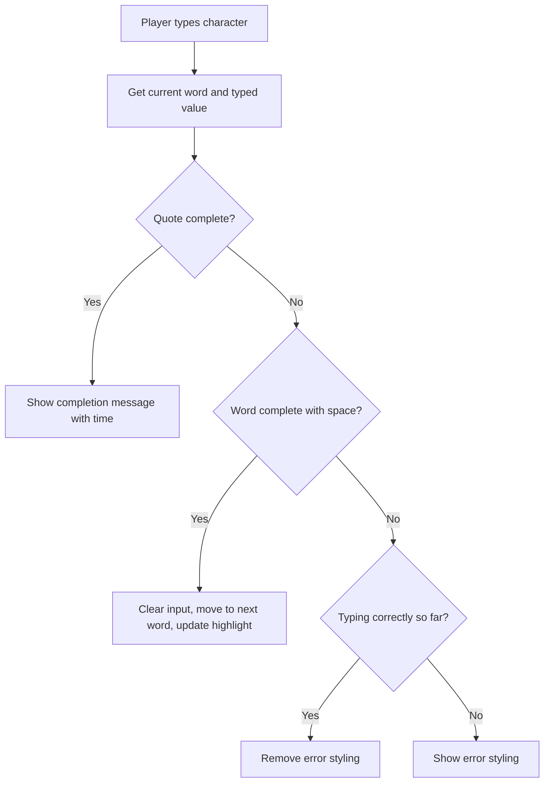
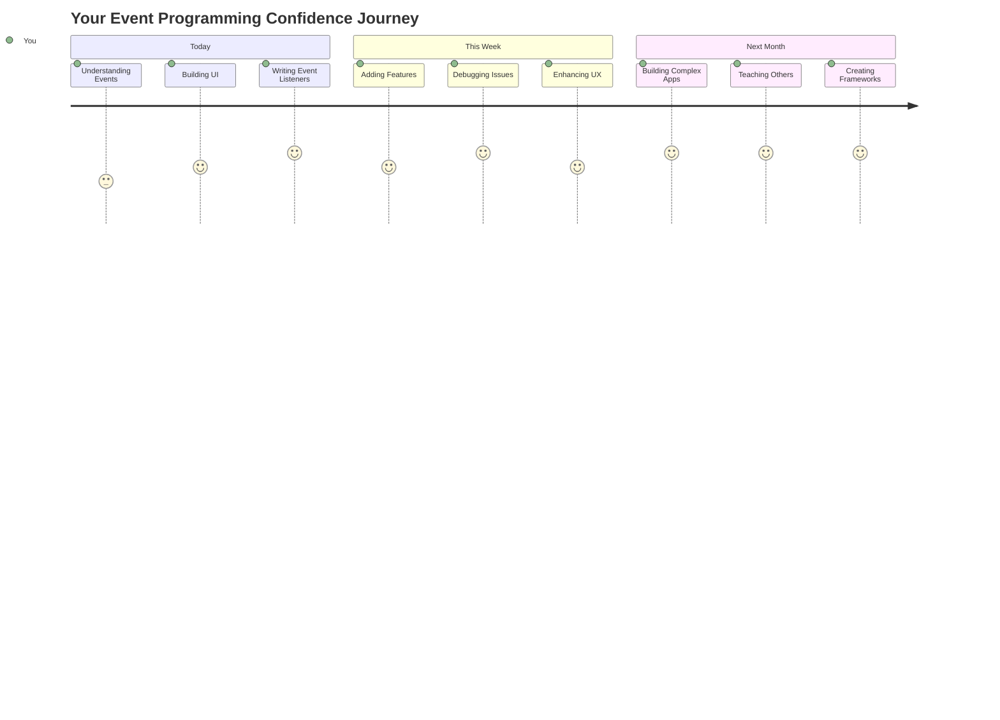

# יצירת משחק באמצעות אירועים

האם אי פעם תהיתם איך אתרים יודעים כשאתם לוחצים על כפתור או מקלידים בתיבת טקסט? זה הקסם של תכנות מבוסס אירועים! ומה יותר טוב מללמוד את המיומנות החשובה הזו מאשר לבנות משהו שימושי - משחק מהירות הקלדה שמגיב לכל הקשה שאתם מבצעים.

אתם הולכים לראות ממקור ראשון איך דפדפני אינטרנט "מדברים" עם קוד ה-JavaScript שלכם. בכל פעם שאתם לוחצים, מקלידים או מזיזים את העכבר, הדפדפן שולח הודעות קטנות (אנחנו קוראים להן אירועים) לקוד שלכם, ואתם מחליטים איך להגיב!

עד שנסיים כאן, תבנו משחק הקלדה אמיתי שעוקב אחרי המהירות והדיוק שלכם. חשוב מכך, תבינו את העקרונות הבסיסיים שמניעים כל אתר אינטראקטיבי שאי פעם השתמשתם בו. בואו נתחיל!

## שאלון לפני ההרצאה

[שאלון לפני ההרצאה](https://ff-quizzes.netlify.app/web/quiz/21)

## תכנות מבוסס אירועים

חשבו על האפליקציה או האתר האהוב עליכם - מה גורם לו להרגיש חי ומגיב? הכל קשור לאיך שהוא מגיב למה שאתם עושים! כל לחיצה, הקשה, החלקה או הקשה על מקש יוצרים מה שאנחנו קוראים לו "אירוע", ושם מתרחש הקסם האמיתי של פיתוח אתרים.

הנה מה שהופך את התכנות לאינטרנט לכל כך מעניין: אנחנו אף פעם לא יודעים מתי מישהו ילחץ על הכפתור הזה או יתחיל להקליד בתיבת טקסט. הם עשויים ללחוץ מיד, לחכות חמש דקות, או אולי בכלל לא ללחוץ! חוסר הוודאות הזה אומר שאנחנו צריכים לחשוב אחרת על איך אנחנו כותבים את הקוד שלנו.

במקום לכתוב קוד שרץ מלמעלה למטה כמו מתכון, אנחנו כותבים קוד שממתין בסבלנות שמשהו יקרה. זה דומה לאיך שמפעילי טלגרף במאה ה-19 היו יושבים ליד המכונות שלהם, מוכנים להגיב ברגע שהודעה מגיעה דרך החוט.

אז מה בדיוק זה "אירוע"? בפשטות, זה משהו שקורה! כשאתם לוחצים על כפתור - זה אירוע. כשאתם מקלידים אות - זה אירוע. כשאתם מזיזים את העכבר - זה עוד אירוע.

תכנות מבוסס אירועים מאפשר לנו להגדיר את הקוד שלנו להאזין ולהגיב. אנחנו יוצרים פונקציות מיוחדות שנקראות **מאזיני אירועים** שממתינות בסבלנות לדברים ספציפיים לקרות, ואז פועלות כשהם קורים.

חשבו על מאזיני אירועים כמו פעמון לדלת עבור הקוד שלכם. אתם מגדירים את הפעמון (`addEventListener()`), אומרים לו איזה צליל להאזין לו (כמו 'click' או 'keypress'), ואז מציינים מה צריך לקרות כשמישהו מצלצל בו (הפונקציה המותאמת שלכם).

**כך מאזיני אירועים עובדים:**
- **מקשיבים** לפעולות משתמש ספציפיות כמו לחיצות, הקשות או תנועות עכבר
- **מבצעים** את הקוד המותאם שלכם כשהאירוע המוגדר מתרחש
- **מגיבים** מיד לאינטראקציות משתמש, ויוצרים חוויה חלקה
- **מטפלים** במספר אירועים על אותו אלמנט באמצעות מאזינים שונים

> **NOTE:** כדאי להדגיש שיש דרכים רבות ליצור מאזיני אירועים. אפשר להשתמש בפונקציות אנונימיות או ליצור פונקציות עם שמות. אפשר להשתמש בקיצורי דרך שונים, כמו הגדרת מאפיין `click`, או שימוש ב-`addEventListener()`. בתרגיל שלנו נתמקד ב-`addEventListener()` ובפונקציות אנונימיות, שכן זו כנראה הטכניקה הנפוצה ביותר שמפתחי אתרים משתמשים בה. היא גם הכי גמישה, שכן `addEventListener()` עובד עבור כל האירועים, ושם האירוע יכול להינתן כפרמטר.

### אירועים נפוצים

בעוד שדפדפני אינטרנט מציעים עשרות אירועים שונים שניתן להאזין להם, רוב האפליקציות האינטראקטיביות מסתמכות רק על כמה אירועים חיוניים. הבנת האירועים המרכזיים הללו תעניק לכם את הבסיס לבניית אינטראקציות משתמש מתוחכמות.

יש [עשרות אירועים](https://developer.mozilla.org/docs/Web/Events) שניתן להאזין להם בעת יצירת אפליקציה. למעשה, כל דבר שמשתמש עושה בדף מעלה אירוע, מה שנותן לכם הרבה כוח להבטיח שהם יקבלו את החוויה שאתם רוצים. למרבה המזל, בדרך כלל תצטרכו רק קומץ קטן של אירועים. הנה כמה נפוצים (כולל שניים שנשתמש בהם כשניצור את המשחק שלנו):

| אירוע | תיאור | שימושים נפוצים |
|-------|--------|----------------|
| `click` | המשתמש לחץ על משהו | כפתורים, קישורים, אלמנטים אינטראקטיביים |
| `contextmenu` | המשתמש לחץ על כפתור העכבר הימני | תפריטי לחיצה ימנית מותאמים אישית |
| `select` | המשתמש סימן טקסט | עריכת טקסט, פעולות העתקה |
| `input` | המשתמש הזין טקסט | אימות טפסים, חיפוש בזמן אמת |

**הבנת סוגי האירועים הללו:**
- **מופעלים** כשמשתמשים מבצעים אינטראקציה עם אלמנטים ספציפיים בדף שלכם
- **מספקים** מידע מפורט על פעולת המשתמש דרך אובייקטי אירוע
- **מאפשרים** לכם ליצור אפליקציות אינטרנט מגיבות ואינטראקטיביות
- **עובדים** באופן עקבי בדפדפנים ומכשירים שונים

## יצירת המשחק

עכשיו כשאתם מבינים איך אירועים עובדים, בואו ניישם את הידע הזה על ידי יצירת משהו שימושי. ניצור משחק מהירות הקלדה שמדגים טיפול באירועים תוך כדי פיתוח מיומנות חשובה למפתחים.

אנחנו הולכים ליצור משחק כדי לחקור איך אירועים עובדים ב-JavaScript. המשחק שלנו יבדוק את מיומנות ההקלדה של השחקן, שהיא אחת המיומנויות הכי פחות מוערכות שכל מפתח צריך. עובדה מעניינת: פריסת המקלדת QWERTY שאנחנו משתמשים בה היום תוכננה למעשה בשנות ה-1870 עבור מכונות כתיבה - ומיומנויות הקלדה טובות עדיין חשובות מאוד למתכנתים היום! תהליך המשחק ייראה כך:



**כך המשחק שלנו יעבוד:**
- **מתחיל** כשהשחקן לוחץ על כפתור ההתחלה ומציג ציטוט אקראי
- **עוקב** אחרי התקדמות ההקלדה של השחקן מילה אחר מילה בזמן אמת
- **מדגיש** את המילה הנוכחית כדי להנחות את המיקוד של השחקן
- **מספק** משוב חזותי מיידי על טעויות הקלדה
- **מחשב** ומציג את הזמן הכולל כשהציטוט הושלם

בואו נבנה את המשחק שלנו ונלמד על אירועים!

### מבנה הקבצים

לפני שנתחיל לקודד, בואו נתארגן! שמירה על מבנה קבצים מסודר מההתחלה תחסוך לכם כאבי ראש בהמשך ותהפוך את הפרויקט שלכם למקצועי יותר. 😊

אנחנו נשמור על דברים פשוטים עם רק שלושה קבצים: `index.html` עבור מבנה הדף שלנו, `script.js` עבור כל לוגיקת המשחק שלנו, ו-`style.css` כדי לגרום להכל להיראות נהדר. זה השלישייה הקלאסית שמניעה את רוב האינטרנט!

**צרו תיקייה חדשה עבור העבודה שלכם על ידי פתיחת חלון קונסול או טרמינל והקלדת הפקודה הבאה:**

```bash
# Linux or macOS
mkdir typing-game && cd typing-game

# Windows
md typing-game && cd typing-game
```

**כך הפקודות הללו פועלות:**
- **יוצרות** ספרייה חדשה בשם `typing-game` עבור קבצי הפרויקט שלכם
- **מנווטות** לתוך הספרייה החדשה שנוצרה באופן אוטומטי
- **מגדירות** סביבת עבודה נקייה לפיתוח המשחק שלכם

**פתחו את Visual Studio Code:**

```bash
code .
```

**הפקודה הזו:**
- **משיקה** את Visual Studio Code בספרייה הנוכחית
- **פותחת** את תיקיית הפרויקט שלכם בעורך
- **מספקת** גישה לכלי הפיתוח שתצטרכו

**הוסיפו שלושה קבצים לתיקייה ב-Visual Studio Code עם השמות הבאים:**
- `index.html` - מכיל את המבנה והתוכן של המשחק שלכם
- `script.js` - מטפל בכל לוגיקת המשחק ומאזיני האירועים
- `style.css` - מגדיר את המראה החזותי והעיצוב

## יצירת ממשק המשתמש

עכשיו בואו נבנה את הבמה שבה כל פעולת המשחק שלנו תתרחש! חשבו על זה כמו עיצוב לוח הבקרה של חללית - אנחנו צריכים לוודא שכל מה שהשחקנים שלנו צריכים נמצא בדיוק במקום שהם מצפים לו.

בואו נבין מה המשחק שלנו באמת צריך. אם הייתם משחקים במשחק הקלדה, מה הייתם רוצים לראות על המסך? הנה מה שנצטרך:

| אלמנט ממשק משתמש | מטרה | אלמנט HTML |
|-------------------|-------|------------|
| תצוגת ציטוט | מציגה את הטקסט להקלדה | `<p>` עם `id="quote"` |
| אזור הודעות | מציג הודעות סטטוס והצלחה | `<p>` עם `id="message"` |
| שדה טקסט | המקום שבו השחקנים מקלידים את הציטוט | `<input>` עם `id="typed-value"` |
| כפתור התחלה | מתחיל את המשחק | `<button>` עם `id="start"` |

**הבנת מבנה ממשק המשתמש:**
- **מארגן** תוכן בצורה לוגית מלמעלה למטה
- **מגדיר** מזהים ייחודיים לאלמנטים לצורך מיקוד ב-JavaScript
- **מספק** היררכיה חזותית ברורה לחוויית משתמש טובה יותר
- **כולל** אלמנטים HTML סמנטיים לנגישות

כל אחד מהם יצטרך מזהים כדי שנוכל לעבוד איתם ב-JavaScript שלנו. נוסיף גם הפניות לקבצי ה-CSS וה-JavaScript שאנחנו הולכים ליצור.

צרו קובץ חדש בשם `index.html`. הוסיפו את ה-HTML הבא:

```html
<!-- inside index.html -->
<html>
<head>
  <title>Typing game</title>
  <link rel="stylesheet" href="style.css">
</head>
<body>
  <h1>Typing game!</h1>
  <p>Practice your typing skills with a quote from Sherlock Holmes. Click **start** to begin!</p>
  <p id="quote"></p> <!-- This will display our quote -->
  <p id="message"></p> <!-- This will display any status messages -->
  <div>
    <input type="text" aria-label="current word" id="typed-value" /> <!-- The textbox for typing -->
    <button type="button" id="start">Start</button> <!-- To start the game -->
  </div>
  <script src="script.js"></script>
</body>
</html>
```

**פירוק מה שהמבנה הזה של HTML משיג:**
- **מקשר** את גיליון הסגנונות CSS ב-`<head>` לצורך עיצוב
- **יוצר** כותרת ברורה והוראות למשתמשים
- **מגדיר** פסקאות עם מזהים ספציפיים לתוכן דינמי
- **כולל** שדה קלט עם מאפייני נגישות
- **מספק** כפתור התחלה להפעלת המשחק
- **טוען** את קובץ ה-JavaScript בסוף לצורך ביצועים מיטביים

### השקת האפליקציה

בדיקת האפליקציה שלכם לעיתים קרובות במהלך הפיתוח עוזרת לכם לזהות בעיות מוקדם ולראות את ההתקדמות שלכם בזמן אמת. Live Server הוא כלי יקר ערך שמרענן אוטומטית את הדפדפן שלכם בכל פעם שאתם שומרים שינויים, מה שהופך את הפיתוח ליעיל יותר.

תמיד עדיף לפתח באופן הדרגתי כדי לראות איך הדברים נראים. בואו נשיק את האפליקציה שלנו. יש הרחבה נהדרת ל-Visual Studio Code בשם [Live Server](https://marketplace.visualstudio.com/items?itemName=ritwickdey.LiveServer&WT.mc_id=academic-77807-sagibbon) שתארח את האפליקציה שלכם באופן מקומי ותעדכן את הדפדפן בכל פעם שאתם שומרים.

**התקינו [Live Server](https://marketplace.visualstudio.com/items?itemName=ritwickdey.LiveServer&WT.mc_id=academic-77807-sagibbon) על ידי לחיצה על הקישור ולחיצה על Install:**

**מה קורה במהלך ההתקנה:**
- **מפעיל** את הדפדפן שלכם לפתוח את Visual Studio Code
- **מנחה** אתכם בתהליך התקנת ההרחבה
- **עשוי לדרוש** הפעלה מחדש של Visual Studio Code להשלמת ההתקנה

**לאחר ההתקנה, ב-Visual Studio Code, לחצו על Ctrl-Shift-P (או Cmd-Shift-P) כדי לפתוח את תפריט הפקודות:**

**הבנת תפריט הפקודות:**
- **מספק** גישה מהירה לכל הפקודות של VS Code
- **מחפש** פקודות תוך כדי הקלדה
- **מציע** קיצורי מקלדת לפיתוח מהיר יותר

**הקלידו "Live Server: Open with Live Server":**

**מה Live Server עושה:**
- **מתחיל** שרת פיתוח מקומי עבור הפרויקט שלכם
- **מרענן** את הדפדפן באופן אוטומטי כשאתם שומרים קבצים
- **מגיש** את הקבצים שלכם מכתובת URL מקומית (בדרך כלל `localhost:5500`)

**פתחו דפדפן ונווטו ל-`https://localhost:5500`:**

כעת אתם אמורים לראות את הדף שיצרתם! בואו נוסיף קצת פונקציונליות.

## הוספת ה-CSS

עכשיו בואו נעשה שהדברים ייראו טוב! משוב חזותי היה קריטי לממשקי משתמש מאז ימי המחשוב הראשונים. בשנות ה-80, חוקרים גילו שמשוב חזותי מיידי משפר באופן דרמטי את ביצועי המשתמש ומפחית טעויות. זה בדיוק מה שאנחנו הולכים ליצור.

המשחק שלנו צריך להיות ברור לחלוטין לגבי מה שקורה. השחקנים צריכים לדעת מיד איזו מילה הם אמורים להקליד, ואם הם עושים טעות, הם צריכים לראות את זה מיד. בואו ניצור עיצוב פשוט אך יעיל:

צרו קובץ חדש בשם `style.css` והוסיפו את התחביר הבא.

```css
/* inside style.css */
.highlight {
  background-color: yellow;
}

.error {
  background-color: lightcoral;
  border: red;
}
```

**הבנת מחלקות ה-CSS הללו:**
- **מדגישות** את המילה הנוכחית עם רקע צהוב להנחיה חזותית ברורה
- **מסמנות** טעויות הקלדה עם צבע רקע קורל בהיר
- **מספקות** משוב מיידי מבלי להפריע לזרימת ההקלדה של המשתמש
- **משתמשות** בצבעים מנוגדים לנגישות ותקשורת חזותית ברורה

✅ כשמדובר ב-CSS, אתם יכולים לעצב את הדף שלכם איך שתרצו. הקדישו קצת זמן והפכו את הדף למושך יותר:

- בחרו גופן שונה
- צבעו את הכותרות
- שנו את גודל הפריטים

## JavaScript

כאן הדברים מתחילים להיות מעניינים! 🎉 יש לנו את מבנה ה-HTML ואת עיצוב ה-CSS שלנו, אבל כרגע המשחק שלנו הוא כמו מכונית יפה בלי מנוע. JavaScript הולך להיות המנוע הזה - זה מה שגורם להכל לעבוד בפועל ולהגיב למה שהשחקנים עושים.

כאן תראו את היצירה שלכם מתעוררת לחיים. אנחנו הולכים להתמודד עם זה שלב אחר שלב כדי ששום דבר לא ירגיש מכריע:

| שלב | מטרה | מה תלמדו |
|-----|-------|----------|
| [יצירת הקבועים](../../../../4-typing-game/typing-game) | הגדרת ציטוטים והתייחסויות DOM | ניהול משתנים ובחירת DOM |
| [מאזין אירועים להתחלת המשחק](../../../../4-typing-game/typing-game) | טיפול באתחול המשחק | טיפול באירועים ועדכוני ממשק משתמש |
| [מאזין אירועים להקלדה](../../../../4-typing-game/typing-game) | עיבוד קלט משתמש בזמן אמת | אימות קלט ומשוב דינמי |

**הגישה המובנית הזו עוזרת לכם:**
- **לארגן** את הקוד שלכם לחלקים לוגיים ונוחים לניהול
- **לבנות** פונקציונליות באופן הדרגתי לצורך איתור באגים קל יותר
- **להבין** איך חלקים שונים של האפליקציה שלכם עובדים יחד
- **ליצור** דפוסים לשימוש חוזר בפרויקטים עתידיים

אבל קודם, צרו קובץ חדש בשם `script.js`.

### הוספת הקבועים

לפני שנצלול לפעולה, בואו נאסוף את כל המשאבים שלנו! בדיוק כמו איך מרכז הבקרה של נאס"א מכין את כל מערכות המעקב שלהם לפני השיגור, הרבה יותר קל כשיש לכם הכל מוכן ומסודר. זה חוסך לנו חיפושים אחר דברים מאוחר יותר ועוזר למנוע שגיאות כתיב.

הנה מה שאנחנו צריכים להגדיר קודם:

| סוג נתונים | מטרה | דוגמה |
|------------|-------|-------|
| מערך ציטוטים | מאחסן את כל הציטוטים האפשריים למשחק | `['ציטוט 1', 'ציטוט 2', ...]` |
| מערך מילים | מפרק את הציטוט הנוכחי למילים בודדות | `['כש', 'אתה', 'יש', ...]` |
| אינדקס מילים | עוקב אחרי המילה שהשחקן מקליד | `0, 1, 2, 3...` |
| זמן התחלה | מחשב זמן שעבר לצורך ניקוד | `Date.now()` |

**נזדקק גם להפניות לאלמנטים בממשק המשתמש שלנו:**
| אלמנט | מזהה | מטרה |
|-------|------|-------|
| שדה טקסט | `typed-value` | המקום שבו השחקנים מקלידים |
| תצוגת ציטוט | `quote` | מציג את הציטוט להקלדה |
| אזור הודעות | `message` | מציג עדכוני מצב |

```javascript
// inside script.js
// all of our quotes
const quotes = [
    'When you have eliminated the impossible, whatever remains, however improbable, must be the truth.',
    'There is nothing more deceptive than an obvious fact.',
    'I ought to know by this time that when a fact appears to be opposed to a long train of deductions it invariably proves to be capable of bearing some other interpretation.',
    'I never make exceptions. An exception disproves the rule.',
    'What one man can invent another can discover.',
    'Nothing clears up a case so much as stating it to another person.',
    'Education never ends, Watson. It is a series of lessons, with the greatest for the last.',
];
// store the list of words and the index of the word the player is currently typing
let words = [];
let wordIndex = 0;
// the starting time
let startTime = Date.now();
// page elements
const quoteElement = document.getElementById('quote');
const messageElement = document.getElementById('message');
const typedValueElement = document.getElementById('typed-value');
```

**פירוק מה הקוד ההתחלתי הזה משיג:**
- **מאחסן** מערך של ציטוטים של שרלוק הולמס באמצעות `const` מכיוון שהציטוטים לא ישתנו
- **מאתחל** משתנים למעקב עם `let` מכיוון שערכים אלו יתעדכנו במהלך המשחק
- **לוכד** הפניות לאלמנטים ב-DOM באמצעות `document.getElementById()` לגישה יעילה
- **מכין** את הבסיס לכל פונקציונליות המשחק עם שמות משתנים ברורים ותיאוריים
- **מארגן** נתונים ואלמנטים קשורים בצורה לוגית לתחזוקת קוד קלה יותר

✅ קדימה, הוסיפו עוד ציטוטים למשחק שלכם

> 💡 **טיפ מקצועי**: אנחנו יכולים לשלוף את האלמנטים בכל זמן בקוד באמצעות `document.getElementById()`. מכיוון שאנחנו הולכים להתייחס לאלמנטים אלו באופן קבוע, נמנע שגיאות כתיב עם מחרוזות על ידי שימוש בקבועים. מסגרות כמו [Vue.js](https://vuejs.org/) או [React](https://reactjs.org/) יכולות לעזור לכם לנהל טוב יותר את מרכזיות הקוד שלכם.
>
**למה הגישה הזו עובדת כל כך טוב:**
- **מונעת** שגיאות כתיב כאשר מתייחסים לאלמנטים מספר פעמים
- **משפרת** את קריאות הקוד עם שמות קבועים תיאוריים
- **מאפשרת** תמיכה טובה יותר ב-IDE עם השלמה אוטומטית ובדיקת שגיאות
- **מקלה** על שינוי קוד אם מזהי האלמנטים משתנים מאוחר יותר

קחו רגע לצפות בסרטון על שימוש ב-`const`, `let` ו-`var`

[](https://youtube.com/watch?v=JNIXfGiDWM8 "סוגי משתנים")

> 🎥 לחצו על התמונה למעלה לסרטון על משתנים.

### הוספת לוגיקת התחלה

כאן הכל מתחבר! 🚀 אתם עומדים לכתוב את מאזין האירועים הראשון שלכם, ויש משהו מאוד מספק בלראות את הקוד שלכם מגיב ללחיצה על כפתור.

חשבו על זה: איפשהו שם בחוץ, שחקן עומד ללחוץ על כפתור "התחל", והקוד שלכם צריך להיות מוכן עבורו. אין לנו מושג מתי הוא ילחץ - אולי מיד, אולי אחרי שהוא ייקח קפה - אבל כשהוא יעשה זאת, המשחק שלכם יתחיל לפעול.

כשמשתמש לוחץ על `start`, אנחנו צריכים לבחור ציטוט, להגדיר את ממשק המשתמש, ולהגדיר מעקב עבור המילה הנוכחית והזמן. להלן ה-JavaScript שתצטרכו להוסיף; נדון בו מיד לאחר בלוק הסקריפט.

```javascript
// at the end of script.js
document.getElementById('start').addEventListener('click', () => {
  // get a quote
  const quoteIndex = Math.floor(Math.random() * quotes.length);
  const quote = quotes[quoteIndex];
  // Put the quote into an array of words
  words = quote.split(' ');
  // reset the word index for tracking
  wordIndex = 0;

  // UI updates
  // Create an array of span elements so we can set a class
  const spanWords = words.map(function(word) { return `<span>${word} </span>`});
  // Convert into string and set as innerHTML on quote display
  quoteElement.innerHTML = spanWords.join('');
  // Highlight the first word
  quoteElement.childNodes[0].className = 'highlight';
  // Clear any prior messages
  messageElement.innerText = '';

  // Setup the textbox
  // Clear the textbox
  typedValueElement.value = '';
  // set focus
  typedValueElement.focus();
  // set the event handler

  // Start the timer
  startTime = new Date().getTime();
});
```

**בואו נפרק את הקוד לחלקים לוגיים:**

**📊 הגדרת מעקב מילים:**
- **בוחר** ציטוט אקראי באמצעות `Math.floor()` ו-`Math.random()` לגיוון
- **ממיר** את הציטוט למערך של מילים בודדות באמצעות `split(' ')`
- **מאפס** את `wordIndex` ל-0 מכיוון שהשחקנים מתחילים עם המילה הראשונה
- **מכין** את מצב המשחק לסיבוב חדש

**🎨 הגדרת ממשק משתמש ותצוגה:**
- **יוצר** מערך של אלמנטים `<span>`, עוטף כל מילה לעיצוב אישי
- **מצרף** את אלמנטי ה-span למחרוזת אחת לעדכון יעיל של ה-DOM
- **מדגיש** את המילה הראשונה על ידי הוספת מחלקת CSS `highlight`
- **מנקה** הודעות משחק קודמות כדי לספק דף נקי

**⌨️ הכנת שדה טקסט:**
- **מנקה** טקסט קיים בשדה הקלט
- **ממקם פוקוס** על שדה הטקסט כדי שהשחקנים יוכלו להתחיל להקליד מיד
- **מכין** את אזור הקלט לסשן משחק חדש

**⏱️ אתחול טיימר:**
- **לוכד** את חותמת הזמן הנוכחית באמצעות `new Date().getTime()`
- **מאפשר** חישוב מדויק של מהירות ההקלדה וזמן ההשלמה
- **מתחיל** מעקב ביצועים לסשן המשחק

### הוספת לוגיקת הקלדה

כאן אנחנו מתמודדים עם לב המשחק שלנו! אל תדאגו אם זה נראה הרבה בהתחלה - נעבור על כל חלק, ובסוף תראו כמה זה הגיוני.

מה שאנחנו בונים כאן די מתוחכם: בכל פעם שמישהו מקליד אות, הקוד שלנו יבדוק מה הוא הקליד, ייתן לו משוב, ויחליט מה צריך לקרות הלאה. זה דומה לאיך מעבדי תמלילים מוקדמים כמו WordStar בשנות ה-70 סיפקו משוב בזמן אמת למקלידים.

```javascript
// at the end of script.js
typedValueElement.addEventListener('input', () => {
  // Get the current word
  const currentWord = words[wordIndex];
  // get the current value
  const typedValue = typedValueElement.value;

  if (typedValue === currentWord && wordIndex === words.length - 1) {
    // end of sentence
    // Display success
    const elapsedTime = new Date().getTime() - startTime;
    const message = `CONGRATULATIONS! You finished in ${elapsedTime / 1000} seconds.`;
    messageElement.innerText = message;
  } else if (typedValue.endsWith(' ') && typedValue.trim() === currentWord) {
    // end of word
    // clear the typedValueElement for the new word
    typedValueElement.value = '';
    // move to the next word
    wordIndex++;
    // reset the class name for all elements in quote
    for (const wordElement of quoteElement.childNodes) {
      wordElement.className = '';
    }
    // highlight the new word
    quoteElement.childNodes[wordIndex].className = 'highlight';
  } else if (currentWord.startsWith(typedValue)) {
    // currently correct
    // highlight the next word
    typedValueElement.className = '';
  } else {
    // error state
    typedValueElement.className = 'error';
  }
});
```

**הבנת זרימת לוגיקת ההקלדה:**

הפונקציה הזו משתמשת בגישה של "מפל", בודקת תנאים מהספציפי ביותר לכללי ביותר. בואו נפרק כל תרחיש:



**🏁 ציטוט הושלם (תרחיש 1):**
- **בודק** אם הערך שהוקלד תואם למילה הנוכחית ואנחנו במילה האחרונה
- **מחשב** זמן שעבר על ידי חיסור זמן ההתחלה מהזמן הנוכחי
- **ממיר** מילי-שניות לשניות על ידי חלוקה ב-1,000
- **מציג** הודעת ברכה עם זמן ההשלמה

**✅ מילה הושלמה (תרחיש 2):**
- **מזהה** השלמת מילה כשהקלט מסתיים ברווח
- **מאמת** שהקלט המקוצץ תואם בדיוק למילה הנוכחית
- **מנקה** את שדה הקלט למילה הבאה
- **מתקדם** למילה הבאה על ידי הגדלת `wordIndex`
- **מעדכן** הדגשה חזותית על ידי הסרת כל המחלקות והדגשת המילה החדשה

**📝 הקלדה בתהליך (תרחיש 3):**
- **מאמת** שהמילה הנוכחית מתחילה במה שהוקלד עד כה
- **מסיר** עיצוב שגיאה כדי להראות שהקלט נכון
- **מאפשר** המשך הקלדה ללא הפרעה

**❌ מצב שגיאה (תרחיש 4):**
- **מפעיל** כאשר הטקסט שהוקלד לא תואם לתחילת המילה הצפויה
- **מיישם** מחלקת CSS של שגיאה כדי לספק משוב חזותי מיידי
- **עוזר** לשחקנים לזהות ולתקן טעויות במהירות

## בדקו את האפליקציה שלכם

תראו מה השגתם! 🎉 הרגע בניתם משחק הקלדה אמיתי שעובד מאפס באמצעות תכנות מונחה אירועים. קחו רגע להעריך את זה - זו לא משימה קטנה!

עכשיו מגיע שלב הבדיקה! האם זה יעבוד כמו שציפיתם? האם פספסנו משהו? הנה הדבר: אם משהו לא עובד בצורה מושלמת מיד, זה לגמרי נורמלי. אפילו מפתחים מנוסים מוצאים באגים בקוד שלהם באופן קבוע. זה חלק מתהליך הפיתוח!

לחצו על `start`, והתחילו להקליד! זה אמור להיראות קצת כמו האנימציה שראינו קודם.


**מה לבדוק באפליקציה שלכם:**
- **מאמת** שלחיצה על התחלה מציגה ציטוט אקראי
- **מאשר** שהקלדה מדגישה את המילה הנוכחית בצורה נכונה
- **בודק** שעיצוב שגיאה מופיע עבור הקלדה שגויה
- **מבטיח** שהשלמת מילים מקדמת את ההדגשה בצורה נכונה
- **מבחן** שהשלמת הציטוט מציגה את הודעת ההשלמה עם הזמן

**טיפים נפוצים לניפוי שגיאות:**
- **בדקו** את קונסולת הדפדפן (F12) עבור שגיאות JavaScript
- **וודאו** שכל שמות הקבצים תואמים בדיוק (רגיש לאותיות גדולות וקטנות)
- **וודאו** ש-Live Server פועל ומרענן כראוי
- **בדקו** ציטוטים שונים כדי לוודא שהבחירה האקראית עובדת

---

## אתגר סוכן GitHub Copilot 🎮

השתמשו במצב סוכן כדי להשלים את האתגר הבא:

**תיאור:** הרחיבו את משחק ההקלדה על ידי יישום מערכת קושי שמתאימה את המשחק לפי ביצועי השחקן. אתגר זה יעזור לכם לתרגל טיפול באירועים מתקדמים, ניתוח נתונים ועדכוני ממשק משתמש דינמיים.

**הנחיה:** צרו מערכת התאמת קושי למשחק ההקלדה ש:
1. עוקבת אחרי מהירות ההקלדה של השחקן (מילים לדקה) ואחוז דיוק
2. מתאימה אוטומטית לשלוש רמות קושי: קל (ציטוטים פשוטים), בינוני (ציטוטים נוכחיים), קשה (ציטוטים מורכבים עם סימני פיסוק)
3. מציגה את רמת הקושי הנוכחית וסטטיסטיקות השחקן בממשק המשתמש
4. מיישמת מונה רצף שמעלה את הקושי לאחר 3 ביצועים טובים רצופים
5. מוסיפה משוב חזותי (צבעים, אנימציות) כדי להצביע על שינויי קושי

הוסיפו את האלמנטים הדרושים ב-HTML, סגנונות CSS ופונקציות JavaScript כדי ליישם את התכונה הזו. כללו טיפול שגיאות מתאים וודאו שהמשחק נשאר נגיש עם תוויות ARIA מתאימות.

למדו עוד על [מצב סוכן](https://code.visualstudio.com/blogs/2025/02/24/introducing-copilot-agent-mode) כאן.

## 🚀 אתגר

מוכנים לקחת את משחק ההקלדה שלכם לשלב הבא? נסו ליישם את התכונות המתקדמות הללו כדי להעמיק את ההבנה שלכם בטיפול באירועים ובמניפולציה של DOM:

**הוסיפו עוד פונקציונליות:**

| תכונה | תיאור | מיומנויות שתתרגלו |
|-------|--------|--------------------|
| **שליטה בקלט** | השבתת מאזין אירוע `input` בהשלמה, והפעלתו מחדש כאשר הכפתור נלחץ | ניהול אירועים ושליטה במצב |
| **ניהול מצב ממשק משתמש** | השבתת שדה הטקסט כאשר השחקן משלים את הציטוט | מניפולציה של מאפייני DOM |
| **תיבת דיאלוג מודאלית** | הצגת תיבת דיאלוג מודאלית עם הודעת הצלחה | דפוסי ממשק מתקדמים ונגישות |
| **מערכת ניקוד גבוה** | אחסון ניקוד גבוה באמצעות `localStorage` | ממשקי API לאחסון בדפדפן ושימור נתונים |

**טיפים ליישום:**
- **חקרו** `localStorage.setItem()` ו-`localStorage.getItem()` לאחסון מתמשך
- **תרגלו** הוספה והסרה של מאזיני אירועים באופן דינמי
- **חקור** אלמנטים של דיאלוג HTML או דפוסי מודאלים ב-CSS
- **שקלו** נגישות כאשר משביתים ומפעילים פקדי טופס

## מבחן לאחר ההרצאה

[מבחן לאחר ההרצאה](https://ff-quizzes.netlify.app/web/quiz/22)

---

## 🚀 ציר הזמן לשליטה במשחק ההקלדה שלכם

### ⚡ **מה תוכלו לעשות ב-5 הדקות הבאות**
- [ ] בדקו את משחק ההקלדה שלכם עם ציטוטים שונים כדי לוודא שהוא עובד בצורה חלקה
- [ ] נסו לשנות את עיצוב ה-CSS - נסו לשנות את צבעי ההדגשה והשגיאה
- [ ] פתחו את כלי המפתחים של הדפדפן (F12) וצפו בקונסולה בזמן המשחק
- [ ] אתגרו את עצמכם לסיים ציטוט במהירות האפשרית

### ⏰ **מה תוכלו להשיג בשעה הקרובה**
- [ ] הוסיפו עוד ציטוטים למערך (אולי מהספרים או הסרטים האהובים עליכם)
- [ ] יישמו מערכת ניקוד גבוה ב-localStorage מהחלק של האתגר
- [ ] צרו מחשבון מילים לדקה שמוצג לאחר כל משחק
- [ ] הוסיפו אפקטים קוליים להקלדה נכונה, שגיאות והשלמה

### 📅 **ההרפתקה שלכם לשבוע**
- [ ] בנו גרסה מרובת משתתפים שבה חברים יכולים להתחרות זה לצד זה
- [ ] צרו רמות קושי שונות עם מורכבות ציטוטים משתנה
- [ ] הוסיפו סרגל התקדמות שמראה כמה מהציטוט הושלם
- [ ] יישמו חשבונות משתמש עם מעקב סטטיסטיקות אישיות
- [ ] עיצבו ערכות נושא מותאמות ותנו למשתמשים לבחור את העיצוב המועדף עליהם

### 🗓️ **הטרנספורמציה שלכם לחודש**
- [ ] צרו קורס הקלדה עם שיעורים שמלמדים בהדרגה מיקום נכון של אצבעות
- [ ] בנו אנליטיקות שמראות אילו אותיות או מילים גורמות לרוב השגיאות
- [ ] הוסיפו תמיכה בשפות שונות ובפריסות מקלדת
- [ ] שלבו עם ממשקי API חינוכיים כדי למשוך ציטוטים ממאגרי ספרות
- [ ] פרסמו את משחק ההקלדה המשופר שלכם לשימוש והנאה של אחרים

### 🎯 **בדיקת השתקפות סופית**

**לפני שתמשיכו, קחו רגע לחגוג:**
- מה היה הרגע הכי מספק בזמן בניית המשחק הזה?
- איך אתם מרגישים לגבי תכנות מונחה אירועים עכשיו בהשוואה לתחילת הדרך?
- מהי תכונה אחת שאתם נרגשים להוסיף כדי להפוך את המשחק הזה לייחודי שלכם?
- איך תוכלו ליישם את מושגי הטיפול באירועים בפרויקטים אחרים?



> 🌟 **זכרו**: הרגע שלטתם באחד המושגים המרכזיים שמניעים כל אתר ואפליקציה אינטראקטיביים. תכנות מונחה אירועים הוא מה שגורם לאינטרנט להרגיש חי ומגיב. בכל פעם שאתם רואים תפריט נפתח, טופס שמאמת תוך כדי הקלדה, או משחק שמגיב ללחיצות שלכם, עכשיו אתם מבינים את הקסם שמאחוריו. אתם לא רק לומדים לתכנת - אתם לומדים ליצור חוויות שמרגישות אינטואיטיביות ומרתקות! 🎉

---

## סקירה ולימוד עצמי

קראו על [כל האירועים הזמינים](https://developer.mozilla.org/docs/Web/Events) למפתח דרך דפדפן האינטרנט, ושקלו את התרחישים שבהם הייתם משתמשים בכל אחד מהם.

## משימה

[צרו משחק מקלדת חדש](assignment.md)

---

**כתב ויתור**:  
מסמך זה תורגם באמצעות שירות תרגום AI [Co-op Translator](https://github.com/Azure/co-op-translator). למרות שאנו שואפים לדיוק, יש לקחת בחשבון שתרגומים אוטומטיים עשויים להכיל שגיאות או אי דיוקים. המסמך המקורי בשפתו המקורית צריך להיחשב כמקור הסמכותי. עבור מידע קריטי, מומלץ להשתמש בתרגום מקצועי אנושי. איננו אחראים לאי הבנות או לפרשנויות שגויות הנובעות משימוש בתרגום זה.