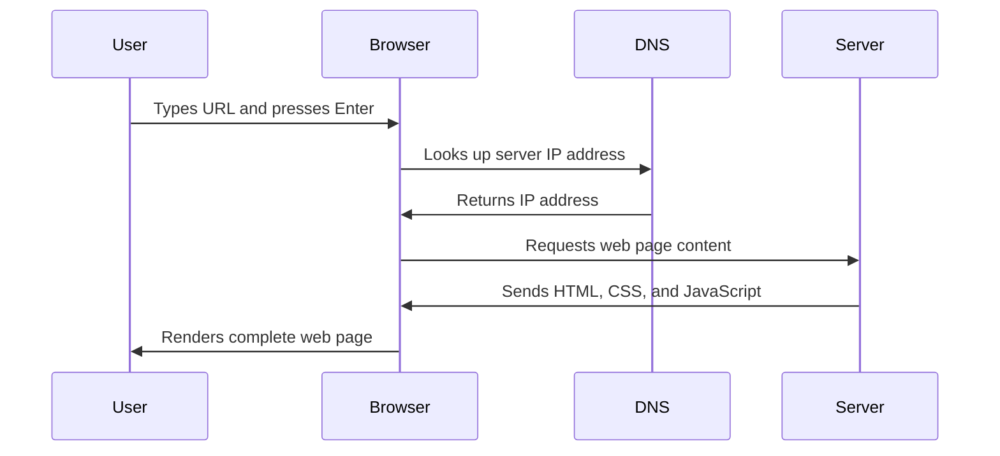

<!--
CO_OP_TRANSLATOR_METADATA:
{
  "original_hash": "33a875c522f237a2026e4653240dfc07",
  "translation_date": "2025-10-23T01:41:07+00:00",
  "source_file": "5-browser-extension/1-about-browsers/README.md",
  "language_code": "he"
}
-->
# פרויקט הרחבת דפדפן חלק 1: הכל על דפדפנים


> שרטוט מאת [Wassim Chegham](https://dev.to/wassimchegham/ever-wondered-what-happens-when-you-type-in-a-url-in-an-address-bar-in-a-browser-3dob)

## שאלון לפני השיעור

[שאלון לפני השיעור](https://ff-quizzes.netlify.app/web/quiz/23)

### הקדמה

הרחבות לדפדפן הן אפליקציות קטנות שמעשירות את חוויית הגלישה שלכם באינטרנט. כמו החזון המקורי של טים ברנרס-לי לרשת אינטראקטיבית, הרחבות מרחיבות את יכולות הדפדפן מעבר לצפייה פשוטה במסמכים. החל ממנהלי סיסמאות ששומרים על חשבונותיכם ועד לבוחרי צבעים שעוזרים למעצבים לבחור גוונים מושלמים, הרחבות פותרות אתגרים יומיומיים בגלישה.

לפני שנבנה את ההרחבה הראשונה שלכם, בואו נבין איך דפדפנים עובדים. בדיוק כמו שאלכסנדר גרהם בל היה צריך להבין את העברת הקול לפני שהמציא את הטלפון, הבנת יסודות הדפדפן תעזור לכם ליצור הרחבות שמשתלבות בצורה חלקה עם מערכות הדפדפן הקיימות.

בסוף השיעור הזה, תבינו את ארכיטקטורת הדפדפן ותתחילו לבנות את ההרחבה הראשונה שלכם.

## הבנת דפדפני אינטרנט

דפדפן אינטרנט הוא למעשה מפרש מסמכים מתוחכם. כשאתם מקלידים "google.com" בשורת הכתובת, הדפדפן מבצע סדרת פעולות מורכבת - מבקש תוכן משרתים ברחבי העולם, ואז מפרש ומציג את הקוד לדפי אינטרנט אינטראקטיביים שאתם רואים.

תהליך זה משקף את האופן שבו הדפדפן הראשון, WorldWideWeb, תוכנן על ידי טים ברנרס-לי בשנת 1990 כדי להפוך מסמכים מקושרים לנגישים לכולם.

✅ **קצת היסטוריה**: הדפדפן הראשון נקרא 'WorldWideWeb' ונוצר על ידי סר טימותי ברנרס-לי בשנת 1990.


> כמה דפדפנים מוקדמים, דרך [Karen McGrane](https://www.slideshare.net/KMcGrane/week-4-ixd-history-personal-computing)

### איך דפדפנים מעבדים תוכן אינטרנטי

התהליך בין הקלדת כתובת URL לבין הצגת דף אינטרנט כולל מספר שלבים מתואמים שמתרחשים תוך שניות:



**הנה מה שהתהליך הזה משיג:**
- **מתרגם** את כתובת ה-URL לקריאה אנושית לכתובת IP של שרת באמצעות חיפוש DNS
- **יוצר** חיבור מאובטח עם שרת האינטרנט באמצעות פרוטוקולי HTTP או HTTPS
- **מבקש** את תוכן דף האינטרנט הספציפי מהשרת
- **מקבל** קוד HTML, עיצוב CSS וקוד JavaScript מהשרת
- **מציג** את כל התוכן לדף אינטרנט אינטראקטיבי שאתם רואים

### תכונות ליבה של דפדפנים

דפדפנים מודרניים מספקים תכונות רבות שמפתחי הרחבות יכולים לנצל:

| תכונה | מטרה | הזדמנויות להרחבות |
|-------|-------|--------------------|
| **מנוע תצוגה** | מציג HTML, CSS ו-JavaScript | שינוי תוכן, הזרקת עיצוב |
| **מנוע JavaScript** | מבצע קוד JavaScript | סקריפטים מותאמים אישית, אינטראקציות עם API |
| **אחסון מקומי** | שומר נתונים באופן מקומי | העדפות משתמש, נתונים במטמון |
| **מערכת רשת** | מטפלת בבקשות אינטרנט | ניטור בקשות, ניתוח נתונים |
| **מודל אבטחה** | מגן על משתמשים מתוכן זדוני | סינון תוכן, שיפורי אבטחה |

**הבנת התכונות הללו עוזרת לכם:**
- **לזהות** היכן ההרחבה שלכם יכולה להוסיף את הערך הרב ביותר
- **לבחור** את ה-API של הדפדפן המתאים לפונקציונליות ההרחבה שלכם
- **לעצב** הרחבות שעובדות בצורה יעילה עם מערכות הדפדפן
- **להבטיח** שההרחבה שלכם עומדת בשיטות העבודה הטובות ביותר של אבטחת דפדפן

### שיקולים לפיתוח חוצה דפדפנים

דפדפנים שונים מיישמים סטנדרטים עם וריאציות קלות, בדומה לאופן שבו שפות תכנות שונות עשויות לטפל באותו אלגוריתם בצורה שונה. Chrome, Firefox ו-Safari כל אחד מהם מאופיין בתכונות ייחודיות שמפתחים צריכים לקחת בחשבון במהלך פיתוח הרחבות.

> 💡 **טיפ מקצועי**: השתמשו ב-[caniuse.com](https://www.caniuse.com) כדי לבדוק אילו טכנולוגיות אינטרנט נתמכות בדפדפנים שונים. זה חיוני בעת תכנון תכונות ההרחבה שלכם!

**שיקולים מרכזיים לפיתוח הרחבות:**
- **בדקו** את ההרחבה שלכם בדפדפנים Chrome, Firefox ו-Edge
- **התאימו** ל-API של הרחבות דפדפן שונים ולפורמטים של מניפסט
- **התמודדו** עם מאפייני ביצועים ומגבלות משתנים
- **ספקו** פתרונות חלופיים לתכונות ספציפיות לדפדפן שאולי לא יהיו זמינות

✅ **תובנות אנליטיות**: תוכלו לקבוע אילו דפדפנים המשתמשים שלכם מעדיפים על ידי התקנת חבילות אנליטיות בפרויקטי פיתוח האינטרנט שלכם. נתונים אלו יעזרו לכם לקבוע סדרי עדיפויות באילו דפדפנים לתמוך קודם.

## הבנת הרחבות לדפדפן

הרחבות לדפדפן פותרות אתגרים נפוצים בגלישה באינטרנט על ידי הוספת פונקציונליות ישירות לממשק הדפדפן. במקום לדרוש אפליקציות נפרדות או תהליכים מורכבים, הרחבות מספקות גישה מיידית לכלים ותכונות.

הרעיון הזה משקף את האופן שבו חלוצי מחשוב מוקדמים כמו דאגלס אנגלברט דמיינו את הרחבת יכולות האדם באמצעות טכנולוגיה - הרחבות מרחיבות את הפונקציונליות הבסיסית של הדפדפן שלכם.

**קטגוריות הרחבות פופולריות והיתרונות שלהן:**
- **כלי פרודוקטיביות**: מנהלי משימות, אפליקציות לרישום הערות ומעקב זמן שעוזרים לכם להישאר מאורגנים
- **שיפורי אבטחה**: מנהלי סיסמאות, חוסמי פרסומות וכלי פרטיות שמגנים על הנתונים שלכם
- **כלי פיתוח**: מעצבי קוד, בוחרי צבעים וכלי דיבוג שמייעלים את הפיתוח
- **שיפור תוכן**: מצבי קריאה, הורדת סרטונים וכלי צילום מסך שמשפרים את חוויית האינטרנט שלכם

✅ **שאלת מחשבה**: מהן ההרחבות האהובות עליכם לדפדפן? אילו משימות ספציפיות הן מבצעות, וכיצד הן משפרות את חוויית הגלישה שלכם?

## התקנה וניהול הרחבות

הבנת תהליך התקנת ההרחבות עוזרת לכם לצפות את חוויית המשתמש כאשר אנשים מתקינים את ההרחבה שלכם. תהליך ההתקנה הוא סטנדרטי בדפדפנים מודרניים, עם וריאציות קלות בעיצוב הממשק.


> **חשוב**: ודאו שאתם מפעילים מצב מפתחים ומאפשרים הרחבות מחנויות אחרות כאשר אתם בודקים את ההרחבות שלכם.

### תהליך התקנת הרחבות בפיתוח

כאשר אתם מפתחים ובודקים את ההרחבות שלכם, עקבו אחר תהליך העבודה הזה:

```bash
# Step 1: Build your extension
npm run build
```

**מה הפקודה הזו משיגה:**
- **מדרגת** את קוד המקור שלכם לקבצים מוכנים לדפדפן
- **אורזת** מודולי JavaScript לחבילות אופטימליות
- **יוצרת** את קבצי ההרחבה הסופיים בתיקיית `/dist`
- **מכינה** את ההרחבה שלכם להתקנה ובדיקה

**שלב 2: נווטו לדף ניהול הרחבות בדפדפן**
1. **פתחו** את דף ניהול ההרחבות של הדפדפן שלכם
2. **לחצו** על כפתור "הגדרות ועוד" (סמל `...`) בפינה הימנית העליונה
3. **בחרו** "הרחבות" מהתפריט הנפתח

**שלב 3: טענו את ההרחבה שלכם**
- **להתקנות חדשות**: בחרו `load unpacked` ובחרו את תיקיית `/dist` שלכם
- **לעדכונים**: לחצו על `reload` ליד ההרחבה שכבר הותקנה
- **לבדיקות**: הפעילו "מצב מפתחים" כדי לגשת לתכונות דיבוג נוספות

### התקנת הרחבה בגרסת ייצור

> ✅ **הערה**: ההוראות הללו מיועדות במיוחד להרחבות שאתם בונים בעצמכם. כדי להתקין הרחבות שפורסמו, בקרו בחנויות ההרחבות הרשמיות של הדפדפן כמו [Microsoft Edge Add-ons store](https://microsoftedge.microsoft.com/addons/Microsoft-Edge-Extensions-Home).

**הבנת ההבדל:**
- **התקנות בפיתוח** מאפשרות לכם לבדוק הרחבות לא מפורסמות במהלך הפיתוח
- **התקנות מחנות** מספקות הרחבות שפורסמו עם עדכונים אוטומטיים
- **התקנה צדדית** מאפשרת התקנת הרחבות מחוץ לחנויות הרשמיות (דורש מצב מפתחים)

## בניית הרחבת טביעת רגל פחמנית

ניצור הרחבת דפדפן שמציגה את טביעת הרגל הפחמנית של צריכת האנרגיה באזור שלכם. הפרויקט הזה מדגים מושגי פיתוח הרחבות חיוניים תוך יצירת כלי מעשי למודעות סביבתית.

גישה זו עוקבת אחר עקרון "למידה תוך כדי עשייה" שהוכח כיעיל מאז תיאוריות החינוך של ג'ון דיואי - שילוב מיומנויות טכניות עם יישומים משמעותיים בעולם האמיתי.

### דרישות הפרויקט

לפני תחילת הפיתוח, בואו נאסוף את המשאבים והדרישות הנחוצים:

**גישה ל-API נדרש:**
- **[מפתח API של CO2 Signal](https://www.co2signal.com/)**: הזינו את כתובת האימייל שלכם כדי לקבל מפתח API חינמי
- **[קוד אזור](http://api.electricitymap.org/v3/zones)**: מצאו את קוד האזור שלכם באמצעות [Electricity Map](https://www.electricitymap.org/map) (לדוגמה, בוסטון משתמשת ב-'US-NEISO')

**כלי פיתוח:**
- **[Node.js ו-NPM](https://www.npmjs.com)**: כלי לניהול חבילות להתקנת תלות בפרויקט
- **[קוד התחלה](../../../../5-browser-extension/start)**: הורידו את תיקיית `start` כדי להתחיל בפיתוח

✅ **למידה נוספת**: שפרו את מיומנויות ניהול החבילות שלכם עם [מודול הלמידה המקיף הזה](https://docs.microsoft.com/learn/modules/create-nodejs-project-dependencies/?WT.mc_id=academic-77807-sagibbon)

### הבנת מבנה הפרויקט

הבנת מבנה הפרויקט עוזרת לארגן את עבודת הפיתוח בצורה יעילה. כמו שהספרייה של אלכסנדריה אורגנה לצורך שליפה קלה של ידע, בסיס קוד מאורגן היטב הופך את הפיתוח ליעיל יותר:

```
project-root/
├── dist/                    # Built extension files
│   ├── manifest.json        # Extension configuration
│   ├── index.html           # User interface markup
│   ├── background.js        # Background script functionality
│   └── main.js              # Compiled JavaScript bundle
└── src/                     # Source development files
    └── index.js             # Your main JavaScript code
```

**פירוט מה כל קובץ משיג:**
- **`manifest.json`**: **מגדיר** מטא-נתונים של ההרחבה, הרשאות ונקודות כניסה
- **`index.html`**: **יוצר** את ממשק המשתמש שמופיע כאשר משתמשים לוחצים על ההרחבה
- **`background.js`**: **מטפל** במשימות רקע ומאזיני אירועים של הדפדפן
- **`main.js`**: **מכיל** את קוד ה-JavaScript הסופי לאחר תהליך הבנייה
- **`src/index.js`**: **מכיל** את קוד הפיתוח הראשי שמורכב ל-`main.js`

> 💡 **טיפ לארגון**: שמרו את מפתח ה-API וקוד האזור שלכם בהערה מאובטחת לצורך התייחסות קלה במהלך הפיתוח. תצטרכו את הערכים הללו כדי לבדוק את פונקציונליות ההרחבה שלכם.

✅ **הערת אבטחה**: לעולם אל תתחייבו מפתחות API או אישורים רגישים למאגר הקוד שלכם. נציג לכם כיצד לטפל בהם בצורה מאובטחת בשלבים הבאים.

## יצירת ממשק ההרחבה

עכשיו נבנה את רכיבי ממשק המשתמש. ההרחבה משתמשת בגישה של שני מסכים: מסך הגדרות להגדרה ראשונית ומסך תוצאות להצגת נתונים.

זה עוקב אחר עקרון הגילוי ההדרגתי שמשמש בעיצוב ממשקים מאז ימי המחשוב הראשונים - חשיפת מידע ואפשרויות בסדר לוגי כדי לא להעמיס על המשתמשים.

### סקירת מסכי ההרחבה

**מסך הגדרות** - הגדרת משתמש בפעם הראשונה:


**מסך תוצאות** - הצגת נתוני טביעת רגל פחמנית:


### בניית טופס ההגדרות

טופס ההגדרות אוסף נתוני הגדרת משתמש במהלך השימוש הראשוני. לאחר ההגדרה, מידע זה נשמר באחסון הדפדפן לצורך שימוש עתידי.

בקובץ `/dist/index.html`, הוסיפו את מבנה הטופס הזה:

```html
<form class="form-data" autocomplete="on">
    <div>
        <h2>New? Add your Information</h2>
    </div>
    <div>
        <label for="region">Region Name</label>
        <input type="text" id="region" required class="region-name" />
    </div>
    <div>
        <label for="api">Your API Key from tmrow</label>
        <input type="text" id="api" required class="api-key" />
    </div>
    <button class="search-btn">Submit</button>
</form>
```

**הנה מה שהטופס הזה משיג:**
- **יוצר** מבנה טופס סמנטי עם תוויות מתאימות וקישורים לקלט
- **מאפשר** פונקציונליות השלמה אוטומטית של הדפדפן לשיפור חוויית המשתמש
- **דורש** מילוי שני השדות לפני שליחה באמצעות התכונה `required`
- **מארגן** את השדות עם שמות מחלקות תיאוריים לצורך עיצוב קל ומיקוד JavaScript
- **מספק** הוראות ברורות למשתמשים שמגדירים את ההרחבה בפעם הראשונה

### בניית תצוגת התוצאות

כעת, צרו את אזור התוצאות שיציג את נתוני טביעת הרגל הפחמנית. הוסיפו את ה-HTML הזה מתחת לטופס:

```html
<div class="result">
    <div class="loading">loading...</div>
    <div class="errors"></div>
    <div class="data"></div>
    <div class="result-container">
        <p><strong>Region: </strong><span class="my-region"></span></p>
        <p><strong>Carbon Usage: </strong><span class="carbon-usage"></span></p>
        <p><strong>Fossil Fuel Percentage: </strong><span class="fossil-fuel"></span></p>
    </div>
    <button class="clear-btn">Change region</button>
</div>
```

**פירוט מה המבנה הזה מספק:**
- **`loading`**: **מציג** הודעת טעינה בזמן שמשתמשים בנתוני API
- **`errors`**: **מציג** הודעות שגיאה אם קריאות API נכשלות או שהנתונים אינם תקינים
- **`data`**: **מכיל** נתונים גולמיים לצורך דיבוג במהלך הפיתוח
- **`result-container`**: **מציג** מידע מעוצב על טביעת הרגל הפחמנית למשתמשים
- **`clear-btn`**: **מאפשר** למשתמשים לשנות את האזור שלהם ולהגדיר מחדש את ההרחבה

### הגדרת תהליך הבנייה

כעת נתקין את תלות הפרויקט ונבדוק את תהליך הבנייה:

```bash
npm install
```

**מה תהליך ההתקנה הזה משיג:**
- **מוריד** את Webpack ותלות פיתוח אחרות שצוינו ב-`package.json`
- **מגדיר** את שרשרת הכלים לבנייה לצורך קומפילציה של JavaScript מודרני
- **מכין** את סביבת הפיתוח לבניית ובדיקת הרחבות
- **מאפשר** איגוד קוד, אופטימיזציה ותכונות תאימות חוצה דפדפנים

> 💡 **תובנות על תהליך הבנייה**: Webpack מאגד את קוד המקור שלכם מ-`/src/index.js` ל-`/dist/main.js`. תהליך זה מייעל את הקוד שלכם לייצור ומבטיח תאימות לדפדפנים.

### בדיקת ההתקדמות שלכם

בשלב זה, תוכלו לבדוק את ההרחבה שלכם:


**תיאור:** שפר את תוסף הדפדפן על ידי הוספת אימות טפסים ותכונות משוב למשתמש כדי לשפר את חוויית המשתמש בעת הזנת מפתחות API וקודי אזור.

**הנחיה:** צור פונקציות אימות ב-JavaScript שבודקות אם שדה מפתח ה-API מכיל לפחות 20 תווים ואם קוד האזור תואם את הפורמט הנכון (כמו 'US-NEISO'). הוסף משוב חזותי על ידי שינוי צבעי גבול הקלט לירוק עבור קלטים תקינים ולאדום עבור קלטים לא תקינים. בנוסף, הוסף תכונת מעבר להצגת/הסתרת מפתח ה-API לצורכי אבטחה.

למידע נוסף על [מצב סוכן](https://code.visualstudio.com/blogs/2025/02/24/introducing-copilot-agent-mode) כאן.

## 🚀 אתגר

הסתכלו בחנות תוספי דפדפן והתקינו אחד לדפדפן שלכם. תוכלו לבדוק את הקבצים שלו בדרכים מעניינות. מה אתם מגלים?

## שאלון לאחר ההרצאה

[שאלון לאחר ההרצאה](https://ff-quizzes.netlify.app/web/quiz/24)

## סקירה ולימוד עצמי

בשיעור זה למדתם מעט על ההיסטוריה של דפדפני האינטרנט; נצלו את ההזדמנות ללמוד על איך ממציאי רשת האינטרנט העולמית דמיינו את השימוש בה על ידי קריאה נוספת על ההיסטוריה שלה. אתרים שימושיים כוללים:

[ההיסטוריה של דפדפני האינטרנט](https://www.mozilla.org/firefox/browsers/browser-history/)

[ההיסטוריה של האינטרנט](https://webfoundation.org/about/vision/history-of-the-web/)

[ראיון עם טים ברנרס-לי](https://www.theguardian.com/technology/2019/mar/12/tim-berners-lee-on-30-years-of-the-web-if-we-dream-a-little-we-can-get-the-web-we-want)

## משימה

[עצב מחדש את התוסף שלך](assignment.md)

---

**כתב ויתור**:  
מסמך זה תורגם באמצעות שירות תרגום AI [Co-op Translator](https://github.com/Azure/co-op-translator). למרות שאנו שואפים לדיוק, יש לקחת בחשבון שתרגומים אוטומטיים עשויים להכיל שגיאות או אי דיוקים. המסמך המקורי בשפתו המקורית צריך להיחשב כמקור סמכותי. עבור מידע קריטי, מומלץ להשתמש בתרגום מקצועי אנושי. איננו אחראים לאי הבנות או לפרשנויות שגויות הנובעות משימוש בתרגום זה.