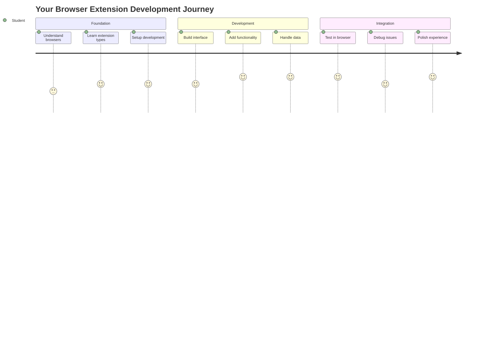
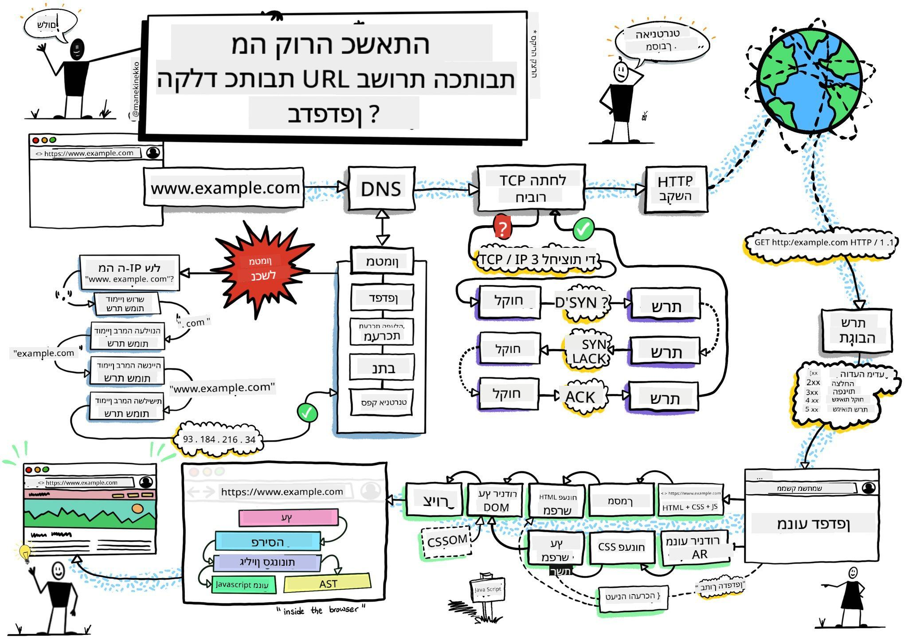
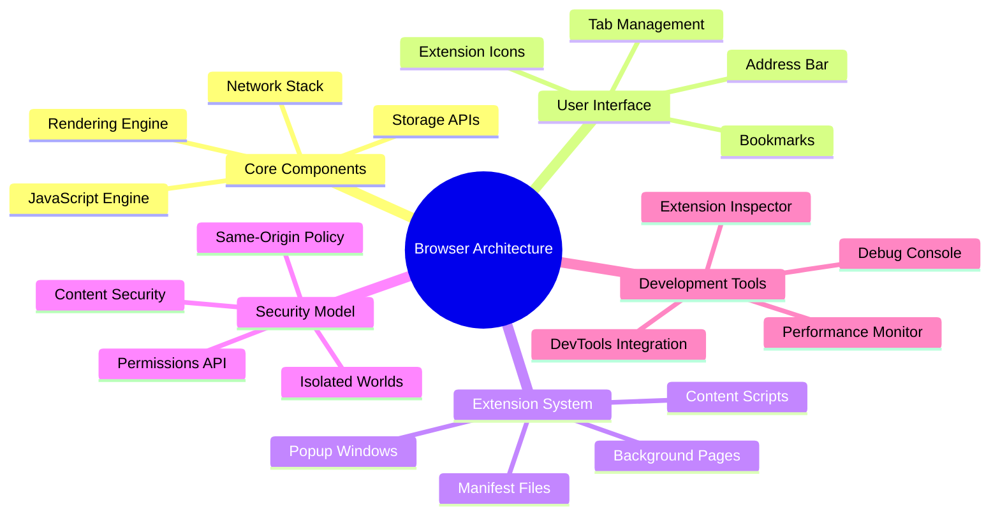
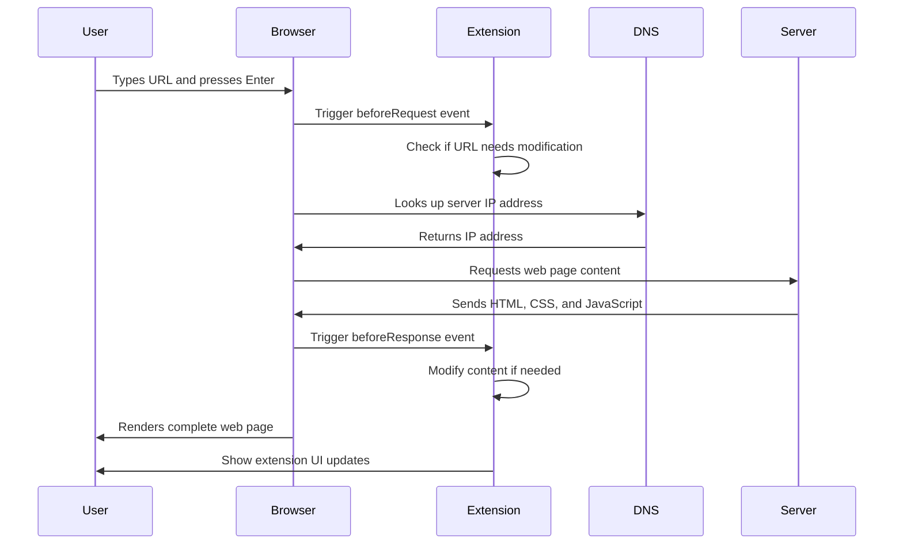
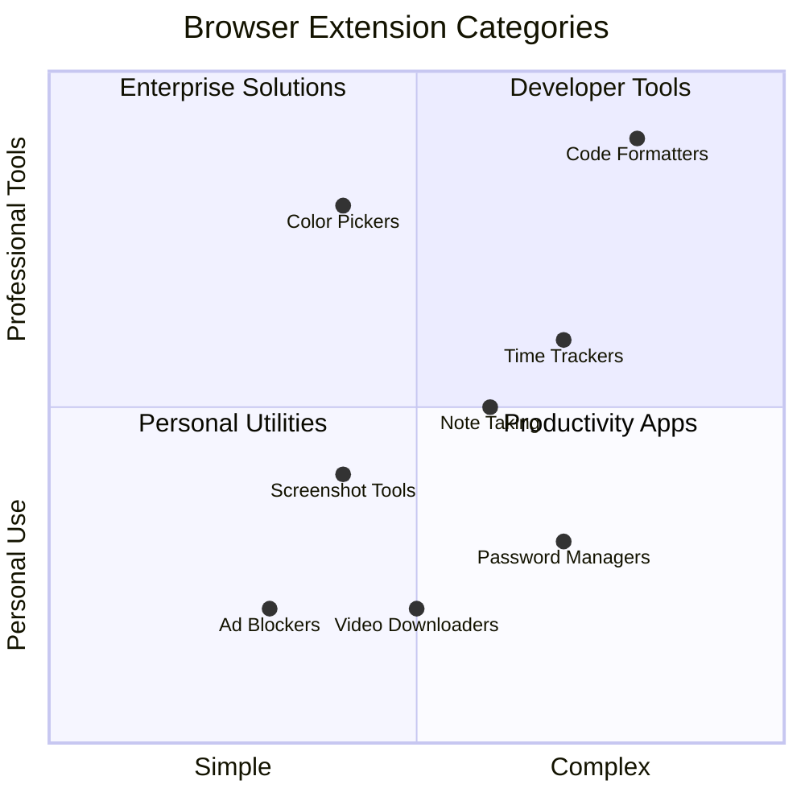
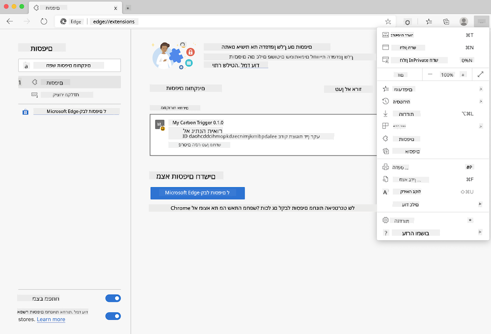
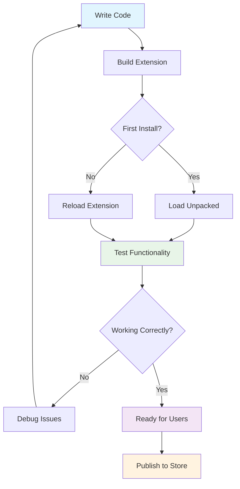
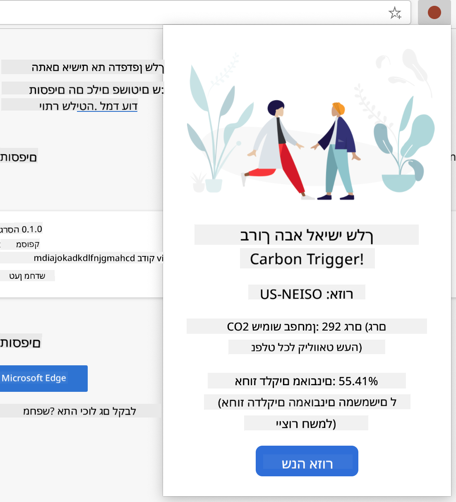
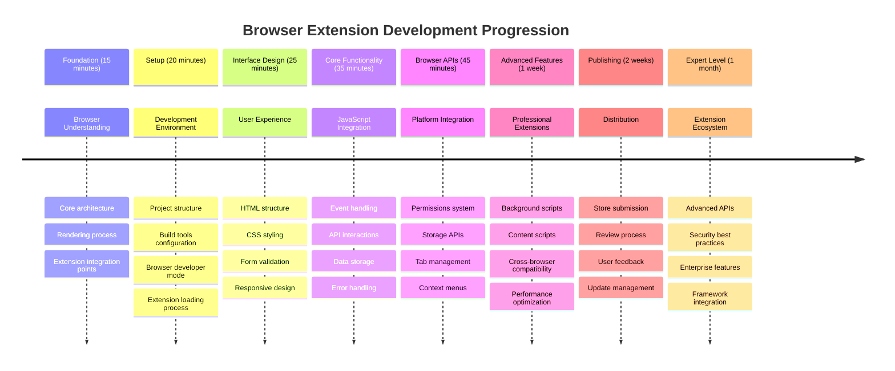

<!--
CO_OP_TRANSLATOR_METADATA:
{
  "original_hash": "00aa85715e1efd4930c17a23e3012e69",
  "translation_date": "2025-11-04T02:41:55+00:00",
  "source_file": "5-browser-extension/1-about-browsers/README.md",
  "language_code": "he"
}
-->
# פרויקט הרחבת דפדפן חלק 1: הכל על דפדפנים




> שרטוט מאת [Wassim Chegham](https://dev.to/wassimchegham/ever-wondered-what-happens-when-you-type-in-a-url-in-an-address-bar-in-a-browser-3dob)

## שאלון לפני השיעור

[שאלון לפני השיעור](https://ff-quizzes.netlify.app/web/quiz/23)

### הקדמה

הרחבות לדפדפן הן אפליקציות קטנות שמעשירות את חוויית הגלישה שלכם באינטרנט. כמו החזון המקורי של טים ברנרס-לי לגבי אינטרנט אינטראקטיבי, הרחבות מרחיבות את יכולות הדפדפן מעבר לצפייה פשוטה במסמכים. החל ממנהלי סיסמאות ששומרים על חשבונותיכם מאובטחים ועד לבוחרי צבעים שעוזרים למעצבים לבחור גוונים מושלמים, הרחבות פותרות אתגרים יומיומיים בגלישה.

לפני שנבנה את ההרחבה הראשונה שלכם, בואו נבין איך דפדפנים עובדים. בדיוק כמו שאלכסנדר גרהם בל היה צריך להבין את העברת הקול לפני שהמציא את הטלפון, הבנת יסודות הדפדפן תעזור לכם ליצור הרחבות שמשתלבות בצורה חלקה עם מערכות הדפדפן הקיימות.

בסוף השיעור הזה, תבינו את ארכיטקטורת הדפדפן ותתחילו לבנות את ההרחבה הראשונה שלכם.



## הבנת דפדפני אינטרנט

דפדפן אינטרנט הוא למעשה מפרש מסמכים מתוחכם. כשאתם מקלידים "google.com" בשורת הכתובת, הדפדפן מבצע סדרת פעולות מורכבות - מבקש תוכן משרתים ברחבי העולם, ואז מפרש ומציג את הקוד לדפי אינטרנט אינטראקטיביים שאתם רואים.

תהליך זה משקף את הדרך שבה עוצב הדפדפן הראשון, WorldWideWeb, על ידי טים ברנרס-לי בשנת 1990 כדי להפוך מסמכים מקושרים לנגישים לכולם.

✅ **קצת היסטוריה**: הדפדפן הראשון נקרא 'WorldWideWeb' ונוצר על ידי סר טימותי ברנרס-לי בשנת 1990.


> כמה דפדפנים מוקדמים, דרך [Karen McGrane](https://www.slideshare.net/KMcGrane/week-4-ixd-history-personal-computing)

### איך דפדפנים מעבדים תוכן אינטרנטי

התהליך בין הקלדת כתובת URL לבין הצגת דף אינטרנט כולל מספר שלבים מתואמים שמתרחשים תוך שניות:



**הנה מה שהתהליך הזה משיג:**
- **מתרגם** את כתובת ה-URL לקריאה אנושית לכתובת IP של שרת דרך חיפוש DNS
- **מקים** חיבור מאובטח עם שרת האינטרנט באמצעות פרוטוקולי HTTP או HTTPS
- **מבקש** את תוכן דף האינטרנט הספציפי מהשרת
- **מקבל** סימון HTML, עיצוב CSS וקוד JavaScript מהשרת
- **מציג** את כל התוכן לדף אינטרנט אינטראקטיבי שאתם רואים

### תכונות ליבה של דפדפנים

דפדפנים מודרניים מספקים תכונות רבות שמפתחי הרחבות יכולים לנצל:

| תכונה | מטרה | הזדמנויות להרחבות |
|---------|---------|------------------------|
| **מנוע הצגה** | מציג HTML, CSS ו-JavaScript | שינוי תוכן, הזרקת עיצוב |
| **מנוע JavaScript** | מבצע קוד JavaScript | סקריפטים מותאמים אישית, אינטראקציות API |
| **אחסון מקומי** | שומר נתונים באופן מקומי | העדפות משתמש, נתונים במטמון |
| **מערכת רשת** | מטפלת בבקשות אינטרנט | ניטור בקשות, ניתוח נתונים |
| **מודל אבטחה** | מגן על משתמשים מתוכן זדוני | סינון תוכן, שיפורי אבטחה |

**הבנת התכונות הללו עוזרת לכם:**
- **לזהות** היכן ההרחבה שלכם יכולה להוסיף את הערך הרב ביותר
- **לבחור** את ממשקי ה-API הנכונים של הדפדפן עבור פונקציונליות ההרחבה שלכם
- **לעצב** הרחבות שעובדות ביעילות עם מערכות הדפדפן
- **להבטיח** שההרחבה שלכם עומדת בשיטות העבודה הטובות ביותר של אבטחת דפדפן

### שיקולים לפיתוח חוצה דפדפנים

דפדפנים שונים מיישמים סטנדרטים עם וריאציות קלות, בדומה לאופן שבו שפות תכנות שונות עשויות להתמודד עם אותו אלגוריתם בצורה שונה. Chrome, Firefox ו-Safari לכל אחד מהם יש מאפיינים ייחודיים שמפתחים צריכים לקחת בחשבון במהלך פיתוח ההרחבות.

> 💡 **טיפ מקצועי**: השתמשו ב-[caniuse.com](https://www.caniuse.com) כדי לבדוק אילו טכנולוגיות אינטרנט נתמכות בדפדפנים שונים. זה חיוני בעת תכנון תכונות ההרחבה שלכם!

**שיקולים מרכזיים לפיתוח הרחבות:**
- **בדקו** את ההרחבה שלכם בדפדפנים Chrome, Firefox ו-Edge
- **התאימו** לממשקי API שונים של הרחבות דפדפן ולפורמטים של מניפסטים
- **התמודדו** עם מאפייני ביצועים ומגבלות משתנים
- **ספקו** פתרונות חלופיים לתכונות ספציפיות לדפדפן שעשויות לא להיות זמינות

✅ **תובנה אנליטית**: תוכלו לקבוע אילו דפדפנים המשתמשים שלכם מעדיפים על ידי התקנת חבילות אנליטיות בפרויקטי פיתוח האינטרנט שלכם. נתונים אלו יעזרו לכם לקבוע סדרי עדיפויות לגבי אילו דפדפנים לתמוך קודם.

## הבנת הרחבות דפדפן

הרחבות דפדפן פותרות אתגרים נפוצים בגלישה באינטרנט על ידי הוספת פונקציונליות ישירות לממשק הדפדפן. במקום לדרוש אפליקציות נפרדות או תהליכים מורכבים, הרחבות מספקות גישה מיידית לכלים ותכונות.

הרעיון הזה משקף איך חלוצי מחשבים מוקדמים כמו דאגלס אנגלברט דמיינו שיפור יכולות אנושיות באמצעות טכנולוגיה - הרחבות משפרות את הפונקציונליות הבסיסית של הדפדפן שלכם.



**קטגוריות הרחבות פופולריות והיתרונות שלהן:**
- **כלי פרודוקטיביות**: מנהלי משימות, אפליקציות לרישום הערות ומעקב זמן שעוזרים לכם להישאר מאורגנים
- **שיפורי אבטחה**: מנהלי סיסמאות, חוסמי פרסומות וכלי פרטיות שמגנים על הנתונים שלכם
- **כלי פיתוח**: מעצבי קוד, בוחרי צבעים וכלי דיבוג שמייעלים את הפיתוח
- **שיפור תוכן**: מצבי קריאה, מורידי וידאו וכלי צילום מסך שמשפרים את חוויית האינטרנט שלכם

✅ **שאלת רפלקציה**: מהן ההרחבות האהובות עליכם בדפדפן? אילו משימות ספציפיות הן מבצעות, וכיצד הן משפרות את חוויית הגלישה שלכם?

### 🔄 **בדיקה פדגוגית**
**הבנת ארכיטקטורת דפדפן**: לפני המעבר לפיתוח הרחבות, ודאו שאתם יכולים:
- ✅ להסביר איך דפדפנים מעבדים בקשות אינטרנט ומציגים תוכן
- ✅ לזהות את הרכיבים המרכזיים של ארכיטקטורת דפדפן
- ✅ להבין איך הרחבות משתלבות עם פונקציונליות דפדפן
- ✅ לזהות את מודל האבטחה שמגן על משתמשים

**מבחן עצמי מהיר**: האם אתם יכולים לעקוב אחר המסלול מהקלדת כתובת URL ועד הצגת דף אינטרנט?
1. **חיפוש DNS** ממיר כתובת URL לכתובת IP
2. **בקשת HTTP** מביאה תוכן מהשרת
3. **פירוש** מעבד HTML, CSS ו-JavaScript
4. **הצגה** מציגה את דף האינטרנט הסופי
5. **הרחבות** יכולות לשנות תוכן בשלבים שונים

## התקנה וניהול הרחבות

הבנת תהליך התקנת ההרחבות עוזרת לכם לצפות את חוויית המשתמש כאשר אנשים מתקינים את ההרחבה שלכם. תהליך ההתקנה סטנדרטי בדפדפנים מודרניים, עם וריאציות קלות בעיצוב הממשק.



> **חשוב**: ודאו שאתם מפעילים מצב מפתחים ומאפשרים הרחבות מחנויות אחרות כאשר אתם בודקים את ההרחבות שלכם.

### תהליך התקנת הרחבות בפיתוח

כשאתם מפתחים ובודקים את ההרחבות שלכם, עקבו אחר תהליך העבודה הזה:



```bash
# Step 1: Build your extension
npm run build
```

**מה הפקודה הזו משיגה:**
- **מדרגת** את קוד המקור שלכם לקבצים מוכנים לדפדפן
- **אורזת** מודולי JavaScript לחבילות אופטימליות
- **יוצרת** את קבצי ההרחבה הסופיים בתיקיית `/dist`
- **מכינה** את ההרחבה שלכם להתקנה ובדיקה

**שלב 2: נווטו לדף ניהול הרחבות בדפדפן**
1. **פתחו** את דף ניהול ההרחבות של הדפדפן שלכם
2. **לחצו** על כפתור "הגדרות ועוד" (סמל `...`) בפינה העליונה
3. **בחרו** "הרחבות" מהתפריט הנפתח

**שלב 3: טענו את ההרחבה שלכם**
- **להתקנות חדשות**: בחרו `load unpacked` ובחרו את תיקיית `/dist` שלכם
- **לעדכונים**: לחצו על `reload` ליד ההרחבה שכבר הותקנה
- **לבדיקות**: הפעילו "מצב מפתחים" כדי לגשת לתכונות דיבוג נוספות

### התקנת הרחבות בגרסת ייצור

> ✅ **הערה**: ההוראות הללו מיועדות במיוחד להרחבות שאתם מפתחים בעצמכם. כדי להתקין הרחבות שפורסמו, בקרו בחנויות ההרחבות הרשמיות של הדפדפן כמו [Microsoft Edge Add-ons store](https://microsoftedge.microsoft.com/addons/Microsoft-Edge-Extensions-Home).

**הבנת ההבדל:**
- **התקנות בפיתוח** מאפשרות לכם לבדוק הרחבות לא מפורסמות במהלך הפיתוח
- **התקנות מחנות** מספקות הרחבות שפורסמו ונבדקו עם עדכונים אוטומטיים
- **התקנה צדדית** מאפשרת התקנת הרחבות מחוץ לחנויות הרשמיות (דורש מצב מפתחים)

## בניית הרחבת טביעת רגל פחמנית

ניצור הרחבת דפדפן שמציגה את טביעת הרגל הפחמנית של צריכת האנרגיה באזור שלכם. הפרויקט הזה מדגים מושגים חיוניים בפיתוח הרחבות תוך יצירת כלי מעשי למודעות סביבתית.

גישה זו עוקבת אחר עקרון "למידה דרך עשייה" שהוכח כיעיל מאז תיאוריות החינוך של ג'ון דיואי - שילוב מיומנויות טכניות עם יישומים משמעותיים בעולם האמיתי.

### דרישות הפרויקט

לפני תחילת הפיתוח, בואו נאסוף את המשאבים והדרישות הנחוצים:

**גישה ל-API נדרש:**
- **[מפתח API של CO2 Signal](https://www.co2signal.com/)**: הזינו את כתובת האימייל שלכם כדי לקבל מפתח API חינמי
- **[קוד אזור](http://api.electricitymap.org/v3/zones)**: מצאו את קוד האזור שלכם באמצעות [Electricity Map](https://www.electricitymap.org/map) (לדוגמה, בוסטון משתמשת ב-'US-NEISO')

**כלי פיתוח:**
- **[Node.js ו-NPM](https://www.npmjs.com)**: כלי לניהול חבילות להתקנת תלות הפרויקט
- **[קוד התחלה](../../../../5-browser-extension/start)**: הורידו את תיקיית `start` כדי להתחיל בפיתוח

✅ **למדו עוד**: שפרו את מיומנויות ניהול החבילות שלכם עם [מודול הלמידה המקיף הזה](https://docs.microsoft.com/learn/modules/create-nodejs-project-dependencies/?WT.mc_id=academic-77807-sagibbon)

### הבנת מבנה הפרויקט

הבנת מבנה הפרויקט עוזרת לארגן את עבודת הפיתוח בצורה יעילה. כמו איך ספריית אלכסנדריה אורגנה לצורך שליפה קלה של ידע, בסיס קוד מאורגן היטב הופך את הפיתוח ליעיל יותר:

```
project-root/
├── dist/                    # Built extension files
│   ├── manifest.json        # Extension configuration
│   ├── index.html           # User interface markup
│   ├── background.js        # Background script functionality
│   └── main.js              # Compiled JavaScript bundle
├── src/                     # Source development files
│   └── index.js             # Your main JavaScript code
├── package.json             # Project dependencies and scripts
└── webpack.config.js        # Build configuration
```

**פירוט מה כל קובץ משיג:**
- **`manifest.json`**: **מגדיר** מטא-נתונים של ההרחבה, הרשאות ונקודות כניסה
- **`index.html`**: **יוצר** את ממשק המשתמש שמופיע כאשר משתמשים לוחצים על ההרחבה שלכם
- **`background.js`**: **מטפל** במשימות רקע ומאזיני אירועים של דפדפן
- **`main.js`**: **מכיל** את קוד ה-JavaScript הסופי לאחר תהליך הבנייה
- **`src/index.js`**: **מאחסן** את קוד הפיתוח הראשי שלכם שמדרג ל-`main.js`

> 💡 **טיפ ארגון**: שמרו את מפתח ה-API וקוד האזור שלכם בהערה מאובטחת לצורך שליפה קלה במהלך הפיתוח. תצטרכו את הערכים הללו כדי לבדוק את פונקציונליות ההרחבה שלכם.

✅ **הערת אבטחה**: לעולם אל תתחייבו מפתחות API או אישורים רגישים למאגר הקוד שלכם. נראה לכם איך להתמודד עם זה בצורה מאובטחת בשלבים הבאים.

## יצירת ממשק ההרחבה

עכשיו נבנה את רכיבי ממשק המשתמש. ההרחבה משתמשת בגישה של שני מסכים: מסך הגדרות להגדרה ראשונית ומסך תוצאות להצגת נתונים.

זה עוקב אחר עקרון החשיפה ההדרגתית המשמש בעיצוב ממשקים מאז ימי המחשוב הראשונים - חשיפת מידע ואפשרויות ברצף לוגי כדי לא להעמיס על המשתמשים.

### סקירת תצוגות ההרחבה

**תצוגת הגדרות** - הגדרת משתמש בפעם הראשונה:


**תצוגת תוצאות** - הצגת נתוני טביעת רגל פחמנית:


### בניית טופס ההגדרות

טופס ההגדרות אוסף נתוני הגדרה של משתמש במהלך השימוש הראשוני. לאחר ההגדרה, מידע זה נשמר באחסון הדפדפן לצורך סשנים עתידיים.

בקובץ `/dist/index.html`, הוסיפו את מבנה הטופס הזה:

```html
<form class="form-data" autocomplete="on">
    <div>
        <h2>New? Add your Information</h2>
    </div>
    <div>
        <label for="region">Region Name</label>
        <input type="text" id="region" required class="region-name" />
    </div>
    <div>
        <label for="api">Your API Key from tmrow</label>
        <input type="text" id="api" required class="api-key" />
    </div>
    <button class="search-btn">Submit</button>
</form>
```

**הנה מה שהטופס הזה משיג:**
- **יוצר** מבנה טופס סמנטי עם תוויות מתאימות ואסוציאציות קלט
- **מאפשר** פונקציונליות השלמה אוטומטית של דפדפן לשיפור חוויית המשתמש
- **דורש** מילוי שני השדות לפני שליחה באמצעות תכונת `required`
- **מארגן** קלטים עם שמות מחלקות תיאוריים לצורך עיצוב קל ומיקוד JavaScript
- **מספק** הוראות ברורות למשתמשים שמגדירים את ההרחבה בפעם הראשונה

### בניית תצוגת התוצאות

לאחר מכן, צרו את אזור התוצאות שיציג את נתוני טביעת הרגל הפחמנית. הוסיפו את ה-HTML הזה מתחת לטופס:

```html
<div class="result">
    <div class="loading">loading...</div>
    <div class="errors"></div>
    <div class="data"></div>
    <div class="result-container">
        <p><strong>Region: </strong><span class="my-region"></span></p>
        <p><strong>Carbon Usage: </strong><span class="carbon-usage"></span></p>
        <p><strong>Fossil Fuel Percentage: </strong><span class="fossil-fuel"></span></p>
    </div>
    <button class="clear-btn">Change region</button>
</div>
```

**פירוט מה מבנה זה מספק:**
- **`loading`**: **מציג** הודעת טעינה בזמן שליפת נתוני API
- **`errors`**: **מציג** הודעות שגיאה אם קריאות API נכשלות או נתונים אינם תקינים
- **`data`**: **מאחסן** נתונים גולמיים לצורך דיבוג במהלך הפיתוח
- **`result-container`**: **מציג** מידע
1. **הרץ** את פקודת הבנייה כדי לקמפל את הקוד שלך  
2. **טען** את ההרחבה לדפדפן שלך באמצעות מצב מפתחים  
3. **וודא** שהטופס מוצג בצורה נכונה ונראה מקצועי  
4. **בדוק** שכל רכיבי הטופס מיושרים ופועלים כראוי  

**מה שהשגת:**  
- **בניית** מבנה HTML בסיסי עבור ההרחבה שלך  
- **יצירת** ממשקי הגדרות ותוצאות עם סימון סמנטי נכון  
- **הגדרת** תהליך פיתוח מודרני באמצעות כלים סטנדרטיים בתעשייה  
- **הכנת** הבסיס להוספת פונקציונליות אינטראקטיבית ב-JavaScript  

### 🔄 **בדיקה פדגוגית**  
**התקדמות בפיתוח ההרחבה**: וודא שאתה מבין לפני שממשיכים:  
- ✅ האם אתה יכול להסביר את מטרת כל קובץ במבנה הפרויקט?  
- ✅ האם אתה מבין כיצד תהליך הבנייה משנה את קוד המקור שלך?  
- ✅ מדוע אנו מפרידים בין הגדרות ותוצאות למקטעים שונים בממשק המשתמש?  
- ✅ כיצד מבנה הטופס תומך בשימושיות ונגישות?  

**הבנת תהליך הפיתוח**: כעת אתה אמור להיות מסוגל:  
1. **לשנות** HTML ו-CSS עבור ממשק ההרחבה שלך  
2. **להריץ** את פקודת הבנייה כדי לקמפל את השינויים שלך  
3. **לטעון מחדש** את ההרחבה בדפדפן שלך כדי לבדוק עדכונים  
4. **לפתור בעיות** באמצעות כלי המפתחים של הדפדפן  

סיימת את השלב הראשון בפיתוח הרחבות לדפדפן. כמו שהאחים רייט היו צריכים להבין את חוקי האווירודינמיקה לפני שהצליחו לטוס, הבנת מושגים בסיסיים אלו מכינה אותך לבניית תכונות אינטראקטיביות מורכבות יותר בשיעור הבא.  

## אתגר סוכן GitHub Copilot 🚀  

השתמש במצב סוכן כדי להשלים את האתגר הבא:  

**תיאור:** שפר את ההרחבה לדפדפן על ידי הוספת אימות טפסים ותכונות משוב למשתמש כדי לשפר את חוויית המשתמש בעת הזנת מפתחות API וקודי אזור.  

**הנחיה:** צור פונקציות אימות ב-JavaScript שבודקות אם שדה מפתח ה-API מכיל לפחות 20 תווים ואם קוד האזור תואם לפורמט הנכון (כמו 'US-NEISO'). הוסף משוב חזותי על ידי שינוי צבעי גבול הקלט לירוק עבור קלטים תקינים ואדום עבור קלטים לא תקינים. כמו כן, הוסף תכונת מעבר להצגת/הסתרת מפתח ה-API לצורכי אבטחה.  

למידע נוסף על [מצב סוכן](https://code.visualstudio.com/blogs/2025/02/24/introducing-copilot-agent-mode) כאן.  

## 🚀 אתגר  

בדוק חנות הרחבות לדפדפן והתקן אחת בדפדפן שלך. תוכל לבחון את הקבצים שלה בדרכים מעניינות. מה גילית?  

## שאלון לאחר השיעור  

[שאלון לאחר השיעור](https://ff-quizzes.netlify.app/web/quiz/24)  

## סקירה ולימוד עצמי  

בשיעור זה למדת מעט על ההיסטוריה של דפדפנים; נצל הזדמנות זו ללמוד על איך ממציאי רשת האינטרנט ראו את השימוש בה על ידי קריאה נוספת על ההיסטוריה שלה. כמה אתרים שימושיים כוללים:  

[ההיסטוריה של דפדפנים](https://www.mozilla.org/firefox/browsers/browser-history/)  

[היסטוריה של האינטרנט](https://webfoundation.org/about/vision/history-of-the-web/)  

[ראיון עם טים ברנרס-לי](https://www.theguardian.com/technology/2019/mar/12/tim-berners-lee-on-30-years-of-the-web-if-we-dream-a-little-we-can-get-the-web-we-want)  

### ⚡ **מה אפשר לעשות ב-5 הדקות הקרובות**  
- [ ] פתח את עמוד ההרחבות של Chrome/Edge (chrome://extensions) ובדוק מה מותקן אצלך  
- [ ] הסתכל בלשונית הרשת של כלי המפתחים של הדפדפן בזמן טעינת דף אינטרנט  
- [ ] נסה לצפות בקוד המקור של הדף (Ctrl+U) כדי לראות את מבנה ה-HTML  
- [ ] בדוק כל רכיב בדף אינטרנט ושנה את ה-CSS שלו בכלי המפתחים  

### 🎯 **מה אפשר להשיג בשעה הקרובה**  
- [ ] השלם את השאלון לאחר השיעור והבין את יסודות הדפדפן  
- [ ] צור קובץ manifest.json בסיסי עבור הרחבה לדפדפן  
- [ ] בנה הרחבת "Hello World" פשוטה שמציגה חלון קופץ  
- [ ] בדוק טעינת ההרחבה שלך במצב מפתחים  
- [ ] חקור את תיעוד ההרחבות לדפדפן היעד שלך  

### 📅 **מסע ההרחבות שלך לשבוע הקרוב**  
- [ ] השלם הרחבה לדפדפן עם תועלת אמיתית  
- [ ] למד על סקריפטים לתוכן, סקריפטים לרקע ואינטראקציות עם חלונות קופצים  
- [ ] שלוט ב-API של דפדפנים כמו אחסון, לשוניות והודעות  
- [ ] עצב ממשקים ידידותיים למשתמש עבור ההרחבה שלך  
- [ ] בדוק את ההרחבה שלך באתרים ותסריטים שונים  
- [ ] פרסם את ההרחבה שלך בחנות ההרחבות של הדפדפן  

### 🌟 **פיתוח דפדפנים לאורך חודש**  
- [ ] בנה מספר הרחבות שמפתרות בעיות שונות למשתמשים  
- [ ] למד API מתקדמים לדפדפנים ושיטות אבטחה  
- [ ] תרום לפרויקטים של הרחבות דפדפן בקוד פתוח  
- [ ] שלוט בתאימות בין דפדפנים ושיפור הדרגתי  
- [ ] צור כלים ותבניות לפיתוח הרחבות עבור אחרים  
- [ ] הפוך למומחה להרחבות דפדפן שמסייע למפתחים אחרים  

## 🎯 לוח זמנים לשליטה בפיתוח הרחבות לדפדפן  


  
### 🛠️ סיכום ערכת הכלים לפיתוח הרחבות שלך  

לאחר השלמת השיעור, כעת יש לך:  
- **ידע על ארכיטקטורת דפדפנים**: הבנה של מנועי רינדור, מודלי אבטחה ואינטגרציה של הרחבות  
- **סביבת פיתוח**: שרשרת כלים מודרנית עם Webpack, NPM ויכולות דיבוג  
- **יסודות UI/UX**: מבנה HTML סמנטי עם דפוסי גילוי הדרגתי  
- **מודעות לאבטחה**: הבנה של הרשאות דפדפן ושיטות פיתוח בטוחות  
- **מושגים בין דפדפנים**: ידע על שיקולי תאימות ושיטות בדיקה  
- **אינטגרציית API**: בסיס לעבודה עם מקורות נתונים חיצוניים  
- **תהליך עבודה מקצועי**: שיטות פיתוח ובדיקה סטנדרטיות בתעשייה  

**יישומים בעולם האמיתי**: מיומנויות אלו מיועדות ישירות ל:  
- **פיתוח אתרים**: אפליקציות חד-עמודיות ואפליקציות אינטרנט מתקדמות  
- **אפליקציות שולחניות**: תוכנות שולחניות מבוססות אינטרנט ו-Electron  
- **פיתוח מובייל**: אפליקציות היברידיות ופתרונות מובייל מבוססי אינטרנט  
- **כלים ארגוניים**: אפליקציות פרודוקטיביות פנימיות ואוטומציה של תהליכי עבודה  
- **קוד פתוח**: תרומה לפרויקטים של הרחבות דפדפן וסטנדרטים אינטרנטיים  

**הרמה הבאה**: אתה מוכן להוסיף פונקציונליות אינטראקטיבית, לעבוד עם API של דפדפנים וליצור הרחבות שמפתרות בעיות אמיתיות למשתמשים!  

## משימה  

[עצב מחדש את ההרחבה שלך](assignment.md)  

---

**הצהרת אחריות**:  
מסמך זה תורגם באמצעות שירות תרגום AI [Co-op Translator](https://github.com/Azure/co-op-translator). למרות שאנו שואפים לדיוק, יש להיות מודעים לכך שתרגומים אוטומטיים עשויים להכיל שגיאות או אי דיוקים. המסמך המקורי בשפתו המקורית צריך להיחשב כמקור סמכותי. עבור מידע קריטי, מומלץ להשתמש בתרגום מקצועי אנושי. איננו אחראים לאי הבנות או לפרשנויות שגויות הנובעות משימוש בתרגום זה.