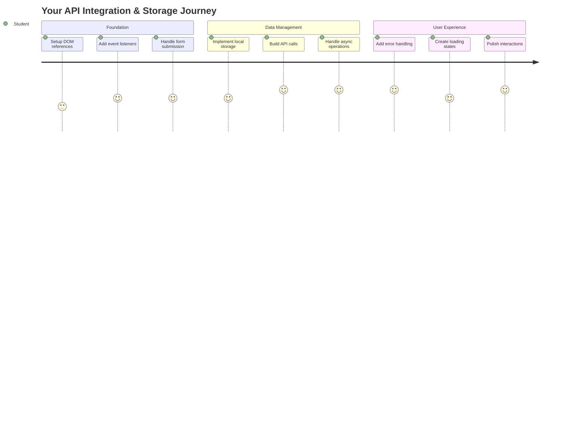
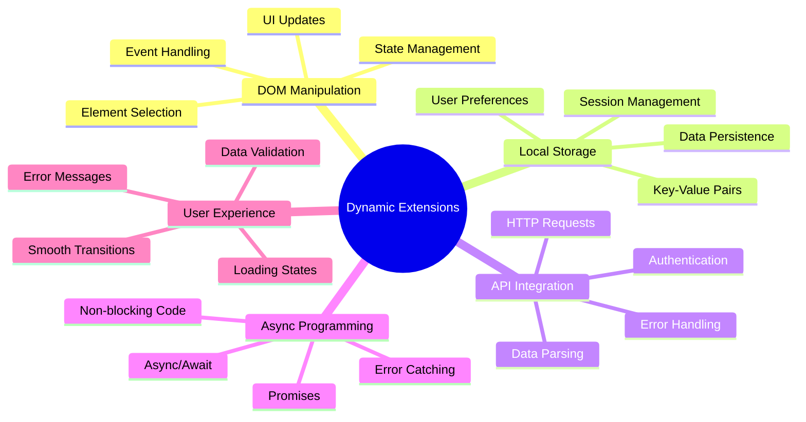
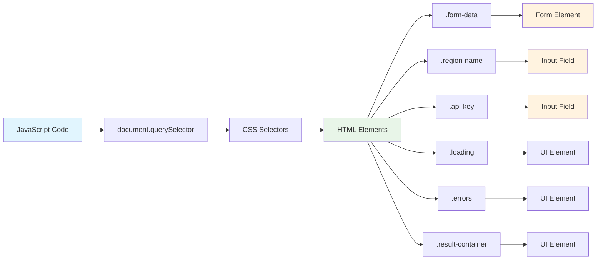
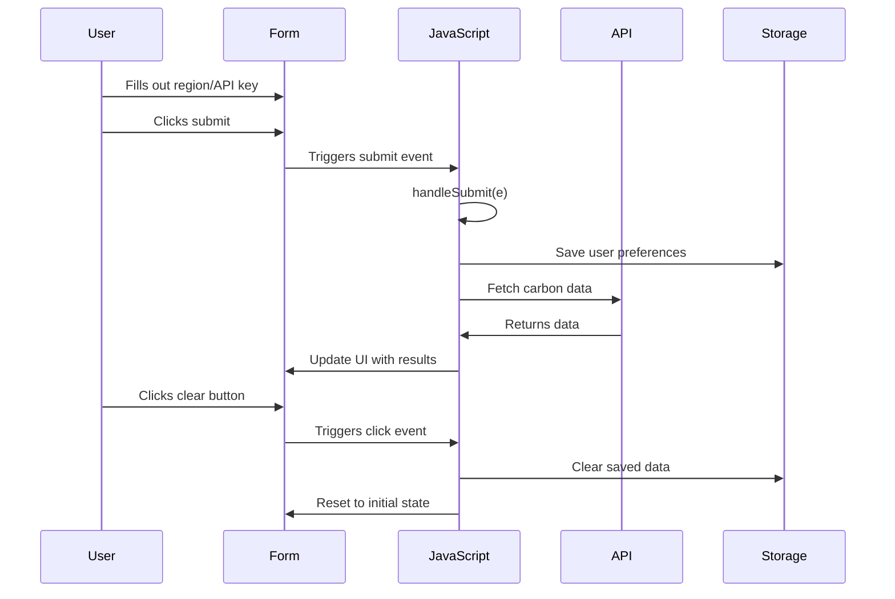
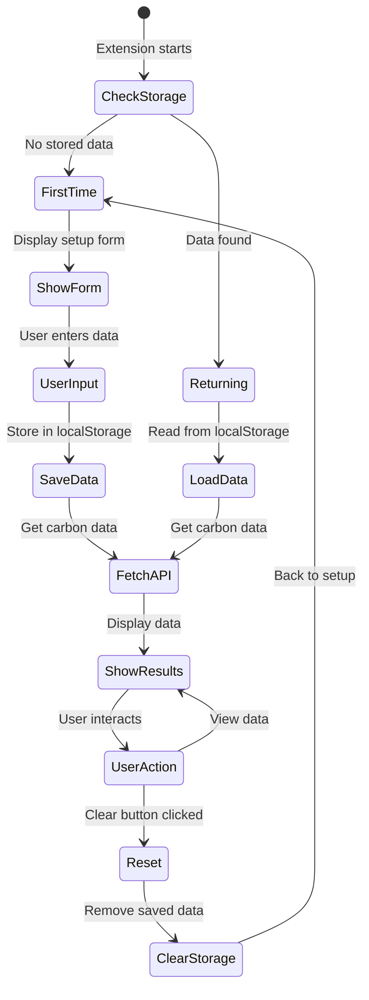
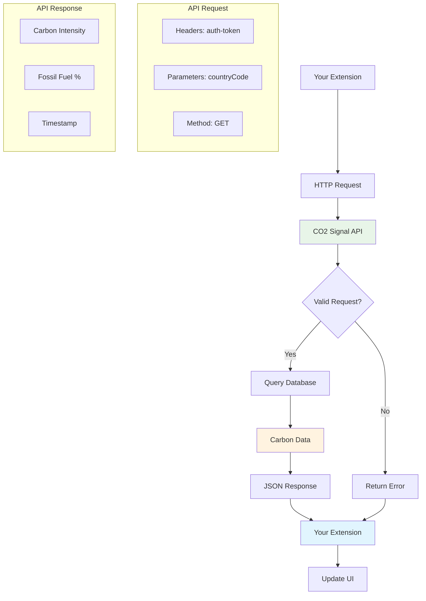
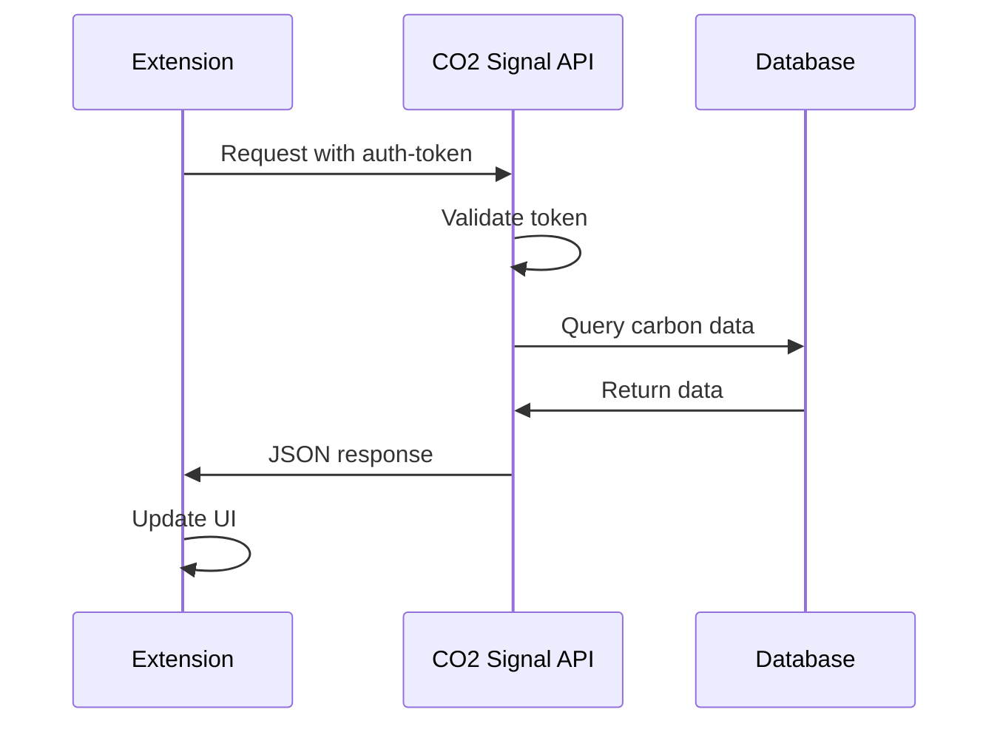
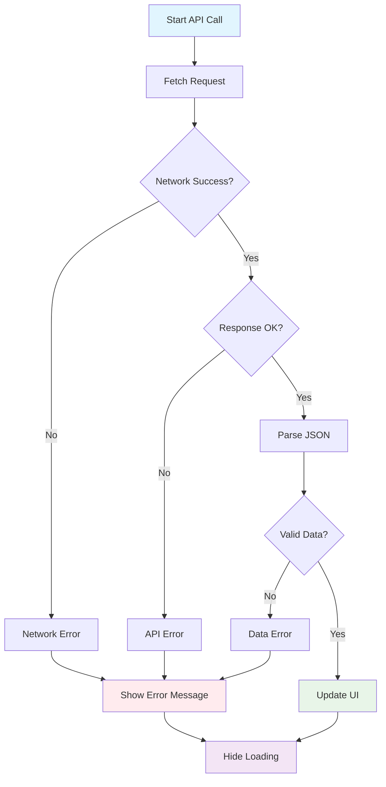
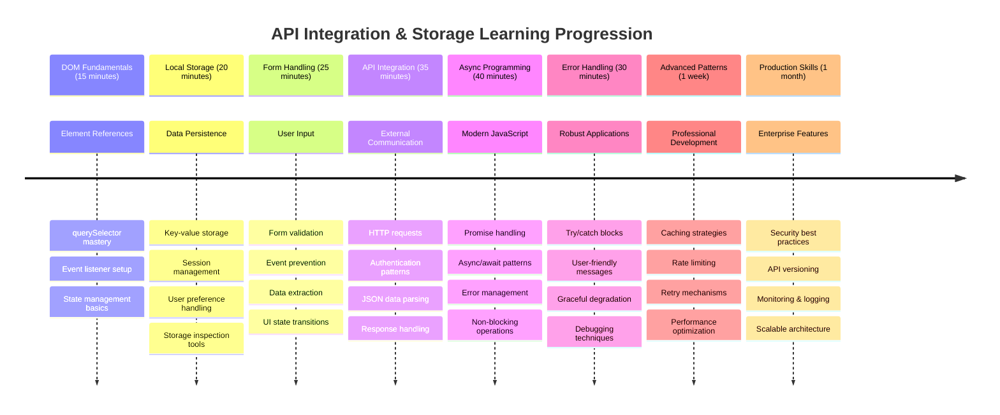

<!--
CO_OP_TRANSLATOR_METADATA:
{
  "original_hash": "2b6203a48c48d8234e0948353b47d84e",
  "translation_date": "2025-11-04T02:41:07+00:00",
  "source_file": "5-browser-extension/2-forms-browsers-local-storage/README.md",
  "language_code": "he"
}
-->
# פרויקט הרחבת דפדפן חלק 2: קריאה ל-API ושימוש באחסון מקומי



## שאלון לפני השיעור

[שאלון לפני השיעור](https://ff-quizzes.netlify.app/web/quiz/25)

## הקדמה

זוכרים את הרחבת הדפדפן שהתחלתם לבנות? כרגע יש לכם טופס שנראה טוב, אבל הוא בעצם סטטי. היום נביא אותו לחיים על ידי חיבור לנתונים אמיתיים ונתינת זיכרון.

תחשבו על מחשבי בקרת המשימה של אפולו - הם לא רק הציגו מידע קבוע. הם תקשרו באופן רציף עם החללית, התעדכנו בנתוני טלמטריה וזכרו פרמטרים קריטיים של המשימה. זה סוג ההתנהגות הדינמית שאנחנו בונים היום. ההרחבה שלכם תתחבר לאינטרנט, תאסוף נתוני סביבה אמיתיים ותזכור את ההגדרות שלכם לפעם הבאה.

אינטגרציה עם API אולי נשמעת מורכבת, אבל זה בעצם ללמד את הקוד שלכם איך לתקשר עם שירותים אחרים. בין אם אתם שולפים נתוני מזג אוויר, עדכונים מרשתות חברתיות או מידע על טביעת רגל פחמנית כמו שנעשה היום, הכל קשור ליצירת חיבורים דיגיטליים. נחקור גם איך דפדפנים יכולים לשמר מידע - בדומה לאיך ספריות השתמשו בקטלוגים כדי לזכור איפה הספרים נמצאים.

בסוף השיעור הזה, תהיה לכם הרחבת דפדפן שמביאה נתונים אמיתיים, שומרת העדפות משתמש ומספקת חוויית שימוש חלקה. בואו נתחיל!



✅ עקבו אחרי הקטעים הממוספרים בקבצים המתאימים כדי לדעת איפה למקם את הקוד שלכם

## הגדרת האלמנטים שצריך לתפעל בהרחבה

לפני שה-JavaScript שלכם יכול לתפעל את הממשק, הוא צריך הפניות לאלמנטים ספציפיים ב-HTML. תחשבו על זה כמו טלסקופ שצריך להיות מכוון לכוכבים מסוימים - לפני שגלילאו יכול היה לחקור את ירחי צדק, הוא היה צריך לאתר ולהתמקד בצדק עצמו.

בקובץ `index.js` שלכם, ניצור משתני `const` שיתפסו הפניות לכל אלמנט חשוב בטופס. זה דומה לאיך מדענים מסמנים את הציוד שלהם - במקום לחפש בכל המעבדה בכל פעם, הם יכולים לגשת ישירות למה שהם צריכים.



```javascript
// form fields
const form = document.querySelector('.form-data');
const region = document.querySelector('.region-name');
const apiKey = document.querySelector('.api-key');

// results
const errors = document.querySelector('.errors');
const loading = document.querySelector('.loading');
const results = document.querySelector('.result-container');
const usage = document.querySelector('.carbon-usage');
const fossilfuel = document.querySelector('.fossil-fuel');
const myregion = document.querySelector('.my-region');
const clearBtn = document.querySelector('.clear-btn');
```

**מה הקוד הזה עושה:**
- **תופס** אלמנטים בטופס באמצעות `document.querySelector()` עם בוררי CSS
- **יוצר** הפניות לשדות קלט עבור שם האזור ומפתח ה-API
- **מקים** חיבורים לאלמנטים להצגת תוצאות נתוני שימוש בפחמן
- **מגדיר** גישה לאלמנטים בממשק כמו אינדיקטורים לטעינה והודעות שגיאה
- **שומר** כל הפניה לאלמנט במשתנה `const` לשימוש חוזר בקוד שלכם

## הוספת מאזיני אירועים

עכשיו נעשה שההרחבה שלכם תגיב לפעולות המשתמש. מאזיני אירועים הם הדרך של הקוד שלכם לעקוב אחרי אינטראקציות משתמש. תחשבו עליהם כמו המפעילים במרכזיות טלפון מוקדמות - הם הקשיבו לשיחות נכנסות וחיברו את המעגלים הנכונים כשמישהו רצה לבצע שיחה.



```javascript
form.addEventListener('submit', (e) => handleSubmit(e));
clearBtn.addEventListener('click', (e) => reset(e));
init();
```

**הבנת המושגים האלה:**
- **מצמידים** מאזין שליחת טופס שמופעל כשהמשתמשים לוחצים Enter או על כפתור השליחה
- **מחברים** מאזין לחיצה לכפתור הניקוי לאיפוס הטופס
- **מעבירים** את אובייקט האירוע `(e)` לפונקציות מטפלות לשליטה נוספת
- **קוראים** לפונקציה `init()` מיד כדי להגדיר את מצב ההרחבה הראשוני

✅ שימו לב לקיצור התחביר של פונקציות חץ שמשמש כאן. הגישה המודרנית הזו ב-JavaScript נקייה יותר מביטויי פונקציה מסורתיים, אבל שניהם עובדים באותה מידה!

### 🔄 **בדיקה פדגוגית**
**הבנת טיפול באירועים**: לפני המעבר לאתחול, ודאו שאתם יכולים:
- ✅ להסביר איך `addEventListener` מחבר פעולות משתמש לפונקציות JavaScript
- ✅ להבין למה אנחנו מעבירים את אובייקט האירוע `(e)` לפונקציות מטפלות
- ✅ לזהות את ההבדל בין אירועי `submit` ו-`click`
- ✅ לתאר מתי הפונקציה `init()` פועלת ולמה

**מבחן עצמי מהיר**: מה יקרה אם תשכחו את `e.preventDefault()` בשליחת טופס?
*תשובה: הדף ייטען מחדש, יאבד את כל מצב ה-JavaScript ויפריע לחוויית המשתמש*

## בניית פונקציות אתחול ואיפוס

בואו ניצור את הלוגיקה של האתחול להרחבה שלכם. הפונקציה `init()` היא כמו מערכת ניווט של ספינה שבודקת את המכשירים שלה - היא קובעת את המצב הנוכחי ומכווננת את הממשק בהתאם. היא בודקת אם מישהו השתמש בהרחבה שלכם בעבר וטוענת את ההגדרות הקודמות שלו.

הפונקציה `reset()` מספקת למשתמשים התחלה חדשה - בדומה לאיך שמדענים מאפסים את המכשירים שלהם בין ניסויים כדי להבטיח נתונים נקיים.

```javascript
function init() {
	// Check if user has previously saved API credentials
	const storedApiKey = localStorage.getItem('apiKey');
	const storedRegion = localStorage.getItem('regionName');

	// Set extension icon to generic green (placeholder for future lesson)
	// TODO: Implement icon update in next lesson

	if (storedApiKey === null || storedRegion === null) {
		// First-time user: show the setup form
		form.style.display = 'block';
		results.style.display = 'none';
		loading.style.display = 'none';
		clearBtn.style.display = 'none';
		errors.textContent = '';
	} else {
		// Returning user: load their saved data automatically
		displayCarbonUsage(storedApiKey, storedRegion);
		results.style.display = 'none';
		form.style.display = 'none';
		clearBtn.style.display = 'block';
	}
}

function reset(e) {
	e.preventDefault();
	// Clear stored region to allow user to choose a new location
	localStorage.removeItem('regionName');
	// Restart the initialization process
	init();
}
```

**פירוט מה קורה כאן:**
- **שולפת** מפתח API ואזור מאוחסנים מהאחסון המקומי של הדפדפן
- **בודקת** אם זה משתמש בפעם הראשונה (אין אישורים מאוחסנים) או משתמש חוזר
- **מציגה** את טופס ההגדרות למשתמשים חדשים ומסתירה אלמנטים אחרים בממשק
- **טוענת** נתונים שמורים אוטומטית למשתמשים חוזרים ומציגה את אפשרות האיפוס
- **מנהלת** את מצב הממשק בהתאם לנתונים הזמינים

**מושגים חשובים על אחסון מקומי:**
- **משמר** נתונים בין סשנים של הדפדפן (בניגוד לאחסון סשן)
- **מאחסן** נתונים כזוגות מפתח-ערך באמצעות `getItem()` ו-`setItem()`
- **מחזיר** `null` כשאין נתונים קיימים עבור מפתח מסוים
- **מספק** דרך פשוטה לזכור העדפות והגדרות משתמש

> 💡 **הבנת אחסון בדפדפן**: [LocalStorage](https://developer.mozilla.org/docs/Web/API/Window/localStorage) הוא כמו לתת להרחבה שלכם זיכרון מתמשך. תחשבו איך ספריית אלכסנדריה העתיקה שמרה מגילות - המידע נשאר זמין גם כשהחוקרים עזבו וחזרו.
>
> **מאפיינים עיקריים:**
> - **משמר** נתונים גם אחרי שסוגרים את הדפדפן
> - **שורד** הפעלות מחדש של המחשב ותקלות בדפדפן
> - **מספק** שטח אחסון משמעותי להעדפות משתמש
> - **מציע** גישה מיידית ללא עיכובים ברשת

> **הערה חשובה**: להרחבת הדפדפן שלכם יש אחסון מקומי מבודד משלה, שהוא נפרד מדפי אינטרנט רגילים. זה מספק אבטחה ומונע קונפליקטים עם אתרים אחרים.

ניתן לצפות בנתונים המאוחסנים שלכם על ידי פתיחת כלי המפתחים של הדפדפן (F12), מעבר ללשונית **Application**, והרחבת הסעיף **Local Storage**.




> ⚠️ **שיקול אבטחה**: באפליקציות ייצור, אחסון מפתחות API ב-LocalStorage מהווה סיכון אבטחה מכיוון ש-JavaScript יכול לגשת לנתונים אלה. למטרות לימוד, הגישה הזו מתאימה, אבל באפליקציות אמיתיות יש להשתמש באחסון מאובטח בצד השרת עבור אישורים רגישים.

## טיפול בשליחת טופס

עכשיו נטפל במה שקורה כשמישהו שולח את הטופס שלכם. כברירת מחדל, דפדפנים טוענים מחדש את הדף כששולחים טפסים, אבל אנחנו ניירט את ההתנהגות הזו כדי ליצור חוויית שימוש חלקה.

הגישה הזו דומה לאיך שבקרת משימה מטפלת בתקשורת עם חלליות - במקום לאפס את כל המערכת עבור כל שידור, הם שומרים על פעולה רציפה תוך עיבוד מידע חדש.

צרו פונקציה שתתפוס את אירוע שליחת הטופס ותשלוף את הקלט של המשתמש:

```javascript
function handleSubmit(e) {
	e.preventDefault();
	setUpUser(apiKey.value, region.value);
}
```

**בקטע לעיל, עשינו:**
- **מונעים** את התנהגות ברירת המחדל של שליחת טופס שתגרום לרענון הדף
- **שולפים** ערכי קלט משתמש משדות מפתח ה-API והאזור
- **מעבירים** את נתוני הטופס לפונקציה `setUpUser()` לעיבוד
- **שומרים** על התנהגות אפליקציה בעמוד אחד על ידי הימנעות מרענון הדף

✅ זכרו ששדות הטופס ב-HTML שלכם כוללים את התכונה `required`, כך שהדפדפן מאמת אוטומטית שהמשתמשים מספקים גם את מפתח ה-API וגם את האזור לפני שהפונקציה הזו פועלת.

## הגדרת העדפות משתמש

הפונקציה `setUpUser` אחראית לשמירת האישורים של המשתמש ולהתחלת הקריאה הראשונה ל-API. זה יוצר מעבר חלק מההגדרות להצגת התוצאות.

```javascript
function setUpUser(apiKey, regionName) {
	// Save user credentials for future sessions
	localStorage.setItem('apiKey', apiKey);
	localStorage.setItem('regionName', regionName);
	
	// Update UI to show loading state
	loading.style.display = 'block';
	errors.textContent = '';
	clearBtn.style.display = 'block';
	
	// Fetch carbon usage data with user's credentials
	displayCarbonUsage(apiKey, regionName);
}
```

**שלב אחר שלב, הנה מה שקורה כאן:**
- **שומרת** את מפתח ה-API ושם האזור באחסון המקומי לשימוש עתידי
- **מציגה** אינדיקטור טעינה כדי ליידע את המשתמשים שהנתונים נשלפים
- **מנקה** כל הודעות שגיאה קודמות מהתצוגה
- **מגלה** את כפתור הניקוי למשתמשים כדי לאפס את ההגדרות שלהם מאוחר יותר
- **מתחילה** את הקריאה ל-API כדי לשלוף נתוני שימוש בפחמן אמיתיים

הפונקציה הזו יוצרת חוויית משתמש חלקה על ידי ניהול גם שימור נתונים וגם עדכוני ממשק משתמש בפעולה מתואמת אחת.

## הצגת נתוני שימוש בפחמן

עכשיו נחבר את ההרחבה שלכם למקורות נתונים חיצוניים דרך APIs. זה הופך את ההרחבה שלכם מכלי עצמאי למשהו שיכול לגשת למידע בזמן אמת מכל רחבי האינטרנט.

**הבנת APIs**

[APIs](https://www.webopedia.com/TERM/A/API.html) הם איך אפליקציות שונות מתקשרות זו עם זו. תחשבו עליהם כמו מערכת הטלגרף שחיברה ערים מרוחקות במאה ה-19 - מפעילים היו שולחים בקשות לתחנות מרוחקות ומקבלים תגובות עם המידע המבוקש. בכל פעם שאתם בודקים רשתות חברתיות, שואלים עוזר קולי שאלה או משתמשים באפליקציית משלוחים, APIs מאפשרים את חילופי הנתונים האלה.



**מושגים חשובים על REST APIs:**
- **REST** מייצג 'העברת מצב ייצוגית'
- **משתמש** בשיטות HTTP סטנדרטיות (GET, POST, PUT, DELETE) כדי לתקשר עם נתונים
- **מחזיר** נתונים בפורמטים צפויים, בדרך כלל JSON
- **מספק** נקודות קצה מבוססות URL לסוגי בקשות שונים

✅ ה-[CO2 Signal API](https://www.co2signal.com/) שנשתמש בו מספק נתוני עוצמת פחמן בזמן אמת מרשתות חשמל ברחבי העולם. זה עוזר למשתמשים להבין את ההשפעה הסביבתית של השימוש שלהם בחשמל!

> 💡 **הבנת JavaScript אסינכרוני**: המילה [`async`](https://developer.mozilla.org/docs/Web/JavaScript/Reference/Statements/async_function) מאפשרת לקוד שלכם להתמודד עם מספר פעולות בו זמנית. כשאתם מבקשים נתונים משרת, אתם לא רוצים שכל ההרחבה שלכם תקפא - זה יהיה כמו בקרת תעבורה אווירית שעוצרת את כל הפעולות בזמן שמחכים למטוס אחד להגיב.
>
> **יתרונות עיקריים:**
> - **שומרת** על תגובתיות ההרחבה בזמן טעינת נתונים
> - **מאפשרת** לקוד אחר להמשיך לפעול במהלך בקשות רשת
> - **משפרת** את קריאות הקוד בהשוואה לדפוסי קריאה מסורתיים
> - **מאפשרת** טיפול אלגנטי בשגיאות רשת

הנה סרטון קצר על `async`:

[](https://youtube.com/watch?v=YwmlRkrxvkk "Async and Await for managing promises")

> 🎥 לחצו על התמונה למעלה לצפייה בסרטון על async/await.

### 🔄 **בדיקה פדגוגית**
**הבנת תכנות אסינכרוני**: לפני שתצללו לפונקציית ה-API, ודאו שאתם מבינים:
- ✅ למה אנחנו משתמשים ב-`async/await` במקום לחסום את כל ההרחבה
- ✅ איך בלוקים של `try/catch` מטפלים בשגיאות רשת בצורה אלגנטית
- ✅ ההבדל בין פעולות סינכרוניות לאסינכרוניות
- ✅ למה קריאות API יכולות להיכשל ואיך להתמודד עם הכישלונות האלה

**חיבור לעולם האמיתי**: שקלו את הדוגמאות האסינכרוניות היומיומיות האלה:
- **הזמנת אוכל**: אתם לא מחכים ליד המטבח - אתם מקבלים קבלה וממשיכים בפעילויות אחרות
- **שליחת אימיילים**: אפליקציית האימייל שלכם לא קופאת בזמן השליחה - אתם יכולים לכתוב עוד אימיילים
- **טעינת דפי אינטרנט**: תמונות נטענות בהדרגה בזמן שאתם כבר יכולים לקרוא את הטקסט

**זרימת אימות API**:


צרו את הפונקציה לשליפת והצגת נתוני שימוש בפחמן:

```javascript
// Modern fetch API approach (no external dependencies needed)
async function displayCarbonUsage(apiKey, region) {
	try {
		// Fetch carbon intensity data from CO2 Signal API
		const response = await fetch('https://api.co2signal.com/v1/latest', {
			method: 'GET',
			headers: {
				'auth-token': apiKey,
				'Content-Type': 'application/json'
			},
			// Add query parameters for the specific region
			...new URLSearchParams({ countryCode: region }) && {
				url: `https://api.co2signal.com/v1/latest?countryCode=${region}`
			}
		});

		// Check if the API request was successful
		if (!response.ok) {
			throw new Error(`API request failed: ${response.status}`);
		}

		const data = await response.json();
		const carbonData = data.data;

		// Calculate rounded carbon intensity value
		const carbonIntensity = Math.round(carbonData.carbonIntensity);

		// Update the user interface with fetched data
		loading.style.display = 'none';
		form.style.display = 'none';
		myregion.textContent = region.toUpperCase();
		usage.textContent = `${carbonIntensity} grams (grams CO₂ emitted per kilowatt hour)`;
		fossilfuel.textContent = `${carbonData.fossilFuelPercentage.toFixed(2)}% (percentage of fossil fuels used to generate electricity)`;
		results.style.display = 'block';

		// TODO: calculateColor(carbonIntensity) - implement in next lesson

	} catch (error) {
		console.error('Error fetching carbon data:', error);
		
		// Show user-friendly error message
		loading.style.display = 'none';
		results.style.display = 'none';
		errors.textContent = 'Sorry, we couldn\'t fetch data for that region. Please check your API key and region code.';
	}
}
```

**פירוט מה קורה כאן:**
- **משתמשת** ב-API המודרני `fetch()` במקום ספריות חיצוניות כמו Axios לקוד נקי וללא תלות
- **מיישמת** בדיקת שגיאות נכונה עם `response.ok` כדי לתפוס כישלונות API מוקדם
- **מטפלת** בפעולות אסינכרוניות עם `async/await` לזרימת קוד קריאה יותר
- **מאמתת** עם ה-CO2 Signal API באמצעות כותרת `auth-token`
- **מנתחת** נתוני JSON מהתגובה ושולפת מידע על עוצמת הפחמן
- **מעדכנת** אלמנטים שונים בממשק עם נתוני סביבה מעוצבים
- **מספקת** הודעות שגיאה ידידותיות למשתמש כשקריאות API נכשלות

**מושגים מודרניים חשובים ב-JavaScript שמודגמים:**
- **תבניות טקסט** עם תחביר `${}` לעיצוב מחרוזות נקי
- **טיפול בשגיאות** עם בלוקים של try/catch לאפליקציות יציבות
- **דפוס async/await** לטיפול בקריאות רשת בצורה אלגנטית
- **פירוק אובייקטים** לשליפת נתונים ספציפיים מתגובות API
- **שרשור שיטות** למניפולציות רבות ב-DOM

✅ הפונקציה הזו מדגימה כמה מושגים חשובים בפיתוח ווב - תקשורת עם שרתים חיצוניים, טיפול באימות, עיבוד נתונים, עדכון ממשקים וניהול שגיאות בצורה אלגנטית. אלו מיומנויות בסיסיות שמפתחים מקצועיים משתמשים בהן באופן קבוע.



### 🔄 **בדיקה פדגוגית**
**הבנת המערכת המלאה**: ודאו שאתם שולטים בכל הזרימה:
- ✅ איך הפניות ל-DOM מאפשרות ל-JavaScript לשלוט בממשק
- ✅ למה אחסון מקומי יוצר שימור בין סשנים של הדפדפן
- ✅ איך async/await מבצע קריאות API בלי להקפיא את ההרחבה
- ✅ מה קורה כשקריאות API נכשלות ואיך שגיאות מטופלות
- ✅ למה חוויית משתמש כוללת מצבי טעינה והודעות שגיאה

🎉 **מה שהשגתם:** יצרתם הרחבת דפדפן ש:
- **מתחברת** לאינטרנט ושולפת נתוני סביבה אמית
**תיאור:** שפר את תוסף הדפדפן על ידי הוספת שיפורים בטיפול בשגיאות ותכונות לשיפור חוויית המשתמש. אתגר זה יעזור לך לתרגל עבודה עם APIs, אחסון מקומי ומניפולציה של DOM באמצעות תבניות מודרניות של JavaScript.

**הנחיה:** צור גרסה משופרת של הפונקציה displayCarbonUsage הכוללת: 1) מנגנון ניסיון חוזר לקריאות API שנכשלו עם backoff אקספוננציאלי, 2) אימות קלט עבור קוד האזור לפני ביצוע קריאת ה-API, 3) אנימציית טעינה עם אינדיקטורים להתקדמות, 4) שמירת תגובות API ב-localStorage עם תוקף (שמירה ל-30 דקות), ו-5) תכונה להצגת נתונים היסטוריים מקריאות API קודמות. כמו כן, הוסף הערות JSDoc בסגנון TypeScript לתיעוד כל הפרמטרים של הפונקציה וסוגי ההחזרה.

למד עוד על [מצב סוכן](https://code.visualstudio.com/blogs/2025/02/24/introducing-copilot-agent-mode) כאן.

## 🚀 אתגר

הרחב את הבנתך לגבי APIs על ידי חקר המגוון הרחב של APIs מבוססי דפדפן הזמינים לפיתוח אתרים. בחר אחד מ-APIs אלו ובנה הדגמה קטנה:

- [Geolocation API](https://developer.mozilla.org/docs/Web/API/Geolocation_API) - קבלת מיקום המשתמש הנוכחי
- [Notification API](https://developer.mozilla.org/docs/Web/API/Notifications_API) - שליחת התראות שולחן עבודה
- [HTML Drag and Drop API](https://developer.mozilla.org/docs/Web/API/HTML_Drag_and_Drop_API) - יצירת ממשקים אינטראקטיביים לגרירה
- [Web Storage API](https://developer.mozilla.org/docs/Web/API/Web_Storage_API) - טכניקות מתקדמות לאחסון מקומי
- [Fetch API](https://developer.mozilla.org/docs/Web/API/Fetch_API) - חלופה מודרנית ל-XMLHttpRequest

**שאלות מחקר לשקול:**
- אילו בעיות בעולם האמיתי ה-API הזה פותר?
- כיצד ה-API מטפל בשגיאות ובמקרים קיצוניים?
- אילו שיקולי אבטחה קיימים בשימוש ב-API הזה?
- עד כמה ה-API נתמך בדפדפנים שונים?

לאחר המחקר שלך, זהה אילו מאפיינים הופכים API לידידותי למפתחים ואמין.

## מבחן לאחר ההרצאה

[מבחן לאחר ההרצאה](https://ff-quizzes.netlify.app/web/quiz/26)

## סקירה ולימוד עצמי

למדת על LocalStorage ו-APIs בשיעור זה, שניהם מאוד שימושיים למפתח אתרים מקצועי. האם תוכל לחשוב כיצד שני הדברים הללו עובדים יחד? חשוב כיצד היית מתכנן אתר אינטרנט שיאחסן פריטים לשימוש על ידי API.

### ⚡ **מה תוכל לעשות ב-5 הדקות הקרובות**
- [ ] פתח את לשונית ה-DevTools Application וחקור את ה-localStorage בכל אתר
- [ ] צור טופס HTML פשוט ובדוק את אימות הטופס בדפדפן
- [ ] נסה לשמור ולשלוף נתונים באמצעות localStorage בקונסול הדפדפן
- [ ] בדוק את נתוני הטופס המוגשים באמצעות לשונית הרשת

### 🎯 **מה תוכל להשיג בשעה הקרובה**
- [ ] השלם את מבחן לאחר השיעור והבנת מושגי טיפול בטפסים
- [ ] בנה טופס תוסף דפדפן ששומר העדפות משתמש
- [ ] יישם אימות טפסים בצד הלקוח עם הודעות שגיאה מועילות
- [ ] תרגל שימוש ב-chrome.storage API לשמירת נתוני תוסף
- [ ] צור ממשק משתמש שמגיב להגדרות משתמש שנשמרו

### 📅 **בניית תוסף לשבוע שלם**
- [ ] השלם תוסף דפדפן מלא עם פונקציונליות טפסים
- [ ] שלוט באפשרויות אחסון שונות: local, sync ו-session storage
- [ ] יישם תכונות טופס מתקדמות כמו השלמה אוטומטית ואימות
- [ ] הוסף פונקציונליות ייבוא/ייצוא לנתוני משתמש
- [ ] בדוק את התוסף שלך באופן יסודי בדפדפנים שונים
- [ ] שפר את חוויית המשתמש של התוסף שלך וטיפול בשגיאות

### 🌟 **שליטה ב-Web API לחודש שלם**
- [ ] בנה יישומים מורכבים באמצעות מגוון APIs לאחסון בדפדפן
- [ ] למד על דפוסי פיתוח המעדיפים עבודה במצב לא מקוון
- [ ] תרום לפרויקטים בקוד פתוח הכוללים שמירת נתונים
- [ ] שלוט בפיתוח ממוקד פרטיות ובציות ל-GDPR
- [ ] צור ספריות לשימוש חוזר לטיפול בטפסים וניהול נתונים
- [ ] שתף ידע על APIs לאינטרנט ופיתוח תוספים

## 🎯 ציר הזמן לשליטה בפיתוח תוספים



### 🛠️ סיכום ערכת הכלים לפיתוח Full-Stack שלך

לאחר השלמת השיעור, יש לך:
- **שליטה ב-DOM**: מיקוד מדויק של אלמנטים ומניפולציה
- **מומחיות באחסון**: ניהול נתונים מתמשך עם localStorage
- **שילוב API**: שליפת נתונים בזמן אמת ואימות
- **תכנות אסינכרוני**: פעולות לא חוסמות עם JavaScript מודרני
- **טיפול בשגיאות**: יישומים חזקים שמטפלים בכשלים בצורה חלקה
- **חוויית משתמש**: מצבי טעינה, אימות ואינטראקציות חלקות
- **תבניות מודרניות**: fetch API, async/await ותכונות ES6+

**מיומנויות מקצועיות שנרכשו**: יישמת תבניות המשמשות ב:
- **יישומי אינטרנט**: אפליקציות עמוד יחיד עם מקורות נתונים חיצוניים
- **פיתוח מובייל**: אפליקציות מונעות API עם יכולות לא מקוונות
- **תוכנות שולחן עבודה**: אפליקציות Electron עם אחסון מתמשך
- **מערכות ארגוניות**: אימות, שמירה במטמון וטיפול בשגיאות
- **מסגרות מודרניות**: דפוסי ניהול נתונים ב-React/Vue/Angular

**הרמה הבאה**: אתה מוכן לחקור נושאים מתקדמים כמו אסטרטגיות שמירה במטמון, חיבורי WebSocket בזמן אמת או ניהול מצב מורכב!

## משימה

[אמצו API](assignment.md)

---

**הצהרת אחריות**:  
מסמך זה תורגם באמצעות שירות תרגום מבוסס בינה מלאכותית [Co-op Translator](https://github.com/Azure/co-op-translator). למרות שאנו שואפים לדיוק, יש לקחת בחשבון שתרגומים אוטומטיים עשויים להכיל שגיאות או אי דיוקים. המסמך המקורי בשפתו המקורית צריך להיחשב כמקור סמכותי. למידע קריטי, מומלץ להשתמש בתרגום מקצועי אנושי. אנו לא נושאים באחריות לאי הבנות או לפרשנויות שגויות הנובעות משימוש בתרגום זה.