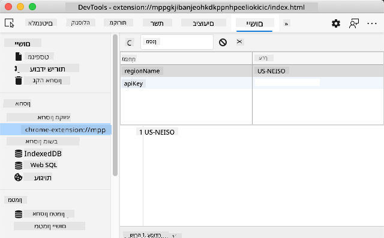

<!--
CO_OP_TRANSLATOR_METADATA:
{
  "original_hash": "e10f168beac4e7b05e30e0eb5c92bf11",
  "translation_date": "2025-08-27T20:45:33+00:00",
  "source_file": "5-browser-extension/2-forms-browsers-local-storage/README.md",
  "language_code": "he"
}
-->
# פרויקט הרחבת דפדפן חלק 2: קריאה ל-API ושימוש באחסון מקומי

## שאלון לפני השיעור

[שאלון לפני השיעור](https://ff-quizzes.netlify.app/web/quiz/25)

### מבוא

בשיעור הזה תלמדו כיצד לקרוא ל-API על ידי שליחת טופס של הרחבת הדפדפן שלכם והצגת התוצאות בהרחבה. בנוסף, תלמדו כיצד ניתן לאחסן נתונים באחסון המקומי של הדפדפן לשימוש עתידי.

✅ עקבו אחר הקטעים הממוספרים בקבצים המתאימים כדי לדעת היכן למקם את הקוד שלכם.

### הגדרת האלמנטים לעבודה בהרחבה:

עד עכשיו בניתם את ה-HTML עבור הטופס ותיבת התוצאות `<div>` עבור הרחבת הדפדפן שלכם. מעכשיו, תצטרכו לעבוד בקובץ `/src/index.js` ולבנות את ההרחבה שלכם שלב אחר שלב. עיינו בשיעור הקודם [כאן](../1-about-browsers/README.md) כדי להגדיר את הפרויקט שלכם וללמוד על תהליך הבנייה.

עבדו בקובץ `index.js` שלכם והתחילו ביצירת כמה משתנים `const` שיחזיקו את הערכים הקשורים לשדות שונים:

```JavaScript
// form fields
const form = document.querySelector('.form-data');
const region = document.querySelector('.region-name');
const apiKey = document.querySelector('.api-key');

// results
const errors = document.querySelector('.errors');
const loading = document.querySelector('.loading');
const results = document.querySelector('.result-container');
const usage = document.querySelector('.carbon-usage');
const fossilfuel = document.querySelector('.fossil-fuel');
const myregion = document.querySelector('.my-region');
const clearBtn = document.querySelector('.clear-btn');
```

כל השדות האלה מתייחסים למחלקות ה-CSS שלהם, כפי שהגדרתם ב-HTML בשיעור הקודם.

### הוספת מאזינים

כעת, הוסיפו מאזיני אירועים לטופס ולכפתור הניקוי שמאפס את הטופס, כך שאם משתמש שולח את הטופס או לוחץ על כפתור האיפוס, משהו יקרה. בנוסף, הוסיפו קריאה לאתחול האפליקציה בתחתית הקובץ:

```JavaScript
form.addEventListener('submit', (e) => handleSubmit(e));
clearBtn.addEventListener('click', (e) => reset(e));
init();
```

✅ שימו לב לקיצור הדרך המשמש להאזנה לאירועי שליחה או לחיצה, וכיצד האירוע מועבר לפונקציות handleSubmit או reset. האם תוכלו לכתוב את הקיצור הזה בפורמט ארוך יותר? איזה פורמט אתם מעדיפים?

### בניית הפונקציות init() ו-reset():

כעת תבנו את הפונקציה שמאתחלת את ההרחבה, שנקראת init():

```JavaScript
function init() {
	//if anything is in localStorage, pick it up
	const storedApiKey = localStorage.getItem('apiKey');
	const storedRegion = localStorage.getItem('regionName');

	//set icon to be generic green
	//todo

	if (storedApiKey === null || storedRegion === null) {
		//if we don't have the keys, show the form
		form.style.display = 'block';
		results.style.display = 'none';
		loading.style.display = 'none';
		clearBtn.style.display = 'none';
		errors.textContent = '';
	} else {
        //if we have saved keys/regions in localStorage, show results when they load
        displayCarbonUsage(storedApiKey, storedRegion);
		results.style.display = 'none';
		form.style.display = 'none';
		clearBtn.style.display = 'block';
	}
};

function reset(e) {
	e.preventDefault();
	//clear local storage for region only
	localStorage.removeItem('regionName');
	init();
}

```

בפונקציה הזו יש לוגיקה מעניינת. כשאתם קוראים אותה, האם אתם מבינים מה קורה?

- שני משתנים `const` מוגדרים כדי לבדוק אם המשתמש שמר מפתח API וקוד אזור באחסון המקומי.
- אם אחד מהם הוא null, הציגו את הטופס על ידי שינוי הסגנון שלו ל-'block'.
- הסתירו את אזור התוצאות, הטעינה וכפתור הניקוי, והגדירו כל טקסט שגיאה למחרוזת ריקה.
- אם קיים מפתח וקוד אזור, התחילו שגרה שכוללת:
  - קריאה ל-API לקבלת נתוני שימוש בפחמן.
  - הסתרת אזור התוצאות.
  - הסתרת הטופס.
  - הצגת כפתור האיפוס.

לפני שתמשיכו, כדאי ללמוד על מושג חשוב מאוד בדפדפנים: [LocalStorage](https://developer.mozilla.org/docs/Web/API/Window/localStorage). LocalStorage הוא דרך שימושית לאחסן מחרוזות בדפדפן כזוגות `key-value`. סוג זה של אחסון אינטרנטי ניתן לניהול באמצעות JavaScript כדי לנהל נתונים בדפדפן. LocalStorage אינו פג תוקף, בעוד SessionStorage, סוג אחר של אחסון אינטרנטי, נמחק כאשר הדפדפן נסגר. לכל סוגי האחסון יש יתרונות וחסרונות לשימוש בהם.

> שימו לב - להרחבת הדפדפן שלכם יש אחסון מקומי משלה; חלון הדפדפן הראשי הוא מופע נפרד ומתנהג באופן עצמאי.

אתם מגדירים את מפתח ה-API שלכם כך שיהיה בעל ערך מחרוזת, לדוגמה, ואתם יכולים לראות שהוא מוגדר ב-Edge על ידי "בדיקה" של דף אינטרנט (ניתן ללחוץ לחיצה ימנית על דפדפן כדי לבדוק) ולעבור ללשונית Applications כדי לראות את האחסון.



✅ חשבו על מצבים שבהם לא הייתם רוצים לאחסן נתונים מסוימים ב-LocalStorage. באופן כללי, הצבת מפתחות API ב-LocalStorage היא רעיון גרוע! האם אתם מבינים למה? במקרה שלנו, מכיוון שהאפליקציה שלנו מיועדת ללמידה בלבד ולא תפורסם בחנות אפליקציות, נשתמש בשיטה זו.

שימו לב שאתם משתמשים ב-Web API כדי לנהל את LocalStorage, בין אם באמצעות `getItem()`, `setItem()`, או `removeItem()`. זה נתמך באופן רחב בדפדפנים.

לפני שתבנו את הפונקציה `displayCarbonUsage()` שנקראת ב-`init()`, בואו נבנה את הפונקציונליות לטיפול בשליחת הטופס הראשונית.

### טיפול בשליחת הטופס

צרו פונקציה בשם `handleSubmit` שמקבלת ארגומנט אירוע `(e)`. עצרו את האירוע מלהתפשט (במקרה הזה, אנחנו רוצים לעצור את הדפדפן מלהתרענן) וקראו לפונקציה חדשה, `setUpUser`, תוך העברת הארגומנטים `apiKey.value` ו-`region.value`. כך אתם משתמשים בשני הערכים שמובאים דרך הטופס הראשוני כאשר השדות המתאימים מתמלאים.

```JavaScript
function handleSubmit(e) {
	e.preventDefault();
	setUpUser(apiKey.value, region.value);
}
```

✅ רעננו את הזיכרון שלכם - ה-HTML שהגדרתם בשיעור הקודם כולל שני שדות קלט שערכיהם נתפסים דרך המשתנים `const` שהגדרתם בראש הקובץ, ושניהם מוגדרים כ-`required`, כך שהדפדפן מונע מהמשתמשים להזין ערכים null.

### הגדרת המשתמש

נעבור לפונקציה `setUpUser`, כאן אתם מגדירים ערכי אחסון מקומי עבור apiKey ו-regionName. הוסיפו פונקציה חדשה:

```JavaScript
function setUpUser(apiKey, regionName) {
	localStorage.setItem('apiKey', apiKey);
	localStorage.setItem('regionName', regionName);
	loading.style.display = 'block';
	errors.textContent = '';
	clearBtn.style.display = 'block';
	//make initial call
	displayCarbonUsage(apiKey, regionName);
}
```

הפונקציה הזו מציגה הודעת טעינה בזמן שה-API נקרא. בשלב הזה, הגעתם ליצירת הפונקציה החשובה ביותר בהרחבת הדפדפן הזו!

### הצגת שימוש בפחמן

לבסוף, הגיע הזמן לשאול את ה-API!

לפני שנמשיך, כדאי לדון ב-APIs. APIs, או [ממשקי תכנות אפליקציות](https://www.webopedia.com/TERM/A/API.html), הם אלמנט קריטי בארגז הכלים של מפתחי אתרים. הם מספקים דרכים סטנדרטיות לתוכניות לתקשר ולהתחבר זו לזו. לדוגמה, אם אתם בונים אתר אינטרנט שצריך לשאול מסד נתונים, ייתכן שמישהו יצר API עבורכם לשימוש. בעוד שישנם סוגים רבים של APIs, אחד הפופולריים ביותר הוא [REST API](https://www.smashingmagazine.com/2018/01/understanding-using-rest-api/).

✅ המונח 'REST' מייצג 'Representational State Transfer' ומאפשר שימוש ב-URLs שונים כדי להביא נתונים. בצעו מחקר קטן על סוגי ה-APIs השונים הזמינים למפתחים. איזה פורמט מושך אתכם?

ישנם דברים חשובים לשים לב אליהם בפונקציה הזו. ראשית, שימו לב למילת המפתח [`async`](https://developer.mozilla.org/docs/Web/JavaScript/Reference/Statements/async_function). כתיבת הפונקציות שלכם כך שיפעלו באופן אסינכרוני אומרת שהן ממתינות לפעולה, כמו החזרת נתונים, שתושלם לפני שהן ממשיכות.

הנה סרטון קצר על `async`:

[](https://youtube.com/watch?v=YwmlRkrxvkk "Async ו-Await לניהול הבטחות")

> 🎥 לחצו על התמונה למעלה לסרטון על async/await.

צרו פונקציה חדשה לשאול את ה-API של C02Signal:

```JavaScript
import axios from '../node_modules/axios';

async function displayCarbonUsage(apiKey, region) {
	try {
		await axios
			.get('https://api.co2signal.com/v1/latest', {
				params: {
					countryCode: region,
				},
				headers: {
					'auth-token': apiKey,
				},
			})
			.then((response) => {
				let CO2 = Math.floor(response.data.data.carbonIntensity);

				//calculateColor(CO2);

				loading.style.display = 'none';
				form.style.display = 'none';
				myregion.textContent = region;
				usage.textContent =
					Math.round(response.data.data.carbonIntensity) + ' grams (grams C02 emitted per kilowatt hour)';
				fossilfuel.textContent =
					response.data.data.fossilFuelPercentage.toFixed(2) +
					'% (percentage of fossil fuels used to generate electricity)';
				results.style.display = 'block';
			});
	} catch (error) {
		console.log(error);
		loading.style.display = 'none';
		results.style.display = 'none';
		errors.textContent = 'Sorry, we have no data for the region you have requested.';
	}
}
```

זו פונקציה גדולה. מה קורה כאן?

- בהתאם לשיטות עבודה מומלצות, אתם משתמשים במילת המפתח `async` כדי לגרום לפונקציה הזו להתנהג באופן אסינכרוני. הפונקציה מכילה בלוק `try/catch` מכיוון שהיא תחזיר הבטחה כאשר ה-API יחזיר נתונים. מכיוון שאין לכם שליטה על מהירות התגובה של ה-API (ייתכן שהוא לא יגיב כלל!), אתם צריכים להתמודד עם אי-הוודאות הזו על ידי קריאה אסינכרונית.
- אתם שואלים את ה-API של co2signal כדי לקבל את נתוני האזור שלכם, תוך שימוש במפתח ה-API שלכם. כדי להשתמש במפתח הזה, עליכם להשתמש בסוג של אימות בפרמטרי הכותרת.
- ברגע שה-API מגיב, אתם מקצים אלמנטים שונים של נתוני התגובה שלו לחלקי המסך שהגדרתם להציג את הנתונים האלה.
- אם יש שגיאה, או אם אין תוצאה, אתם מציגים הודעת שגיאה.

✅ שימוש בתבניות תכנות אסינכרוניות הוא כלי שימושי נוסף בארגז הכלים שלכם. קראו [על הדרכים השונות](https://developer.mozilla.org/docs/Web/JavaScript/Reference/Statements/async_function) שבהן ניתן להגדיר קוד מסוג זה.

מזל טוב! אם תבנו את ההרחבה שלכם (`npm run build`) ותרעננו אותה בלשונית ההרחבות, יש לכם הרחבה עובדת! הדבר היחיד שלא עובד הוא האייקון, ותתקנו זאת בשיעור הבא.

---

## 🚀 אתגר

דיברנו על כמה סוגי APIs בשיעורים האלה. בחרו API אינטרנטי וחקרו לעומק מה הוא מציע. לדוגמה, הסתכלו על APIs זמינים בתוך דפדפנים כמו [HTML Drag and Drop API](https://developer.mozilla.org/docs/Web/API/HTML_Drag_and_Drop_API). מה לדעתכם הופך API למעולה?

## שאלון אחרי השיעור

[שאלון אחרי השיעור](https://ff-quizzes.netlify.app/web/quiz/26)

## סקירה ולימוד עצמי

למדתם על LocalStorage ו-APIs בשיעור הזה, שניהם מאוד שימושיים עבור מפתחי אתרים מקצועיים. האם אתם יכולים לחשוב כיצד שני הדברים האלה עובדים יחד? חשבו כיצד הייתם מתכננים אתר אינטרנט שיאחסן פריטים לשימוש על ידי API.

## משימה

[אמצו API](assignment.md)

---

**כתב ויתור**:  
מסמך זה תורגם באמצעות שירות תרגום מבוסס בינה מלאכותית [Co-op Translator](https://github.com/Azure/co-op-translator). למרות שאנו שואפים לדיוק, יש לקחת בחשבון שתרגומים אוטומטיים עשויים להכיל שגיאות או אי דיוקים. המסמך המקורי בשפתו המקורית צריך להיחשב כמקור הסמכותי. עבור מידע קריטי, מומלץ להשתמש בתרגום מקצועי על ידי אדם. איננו נושאים באחריות לאי הבנות או לפרשנויות שגויות הנובעות משימוש בתרגום זה.