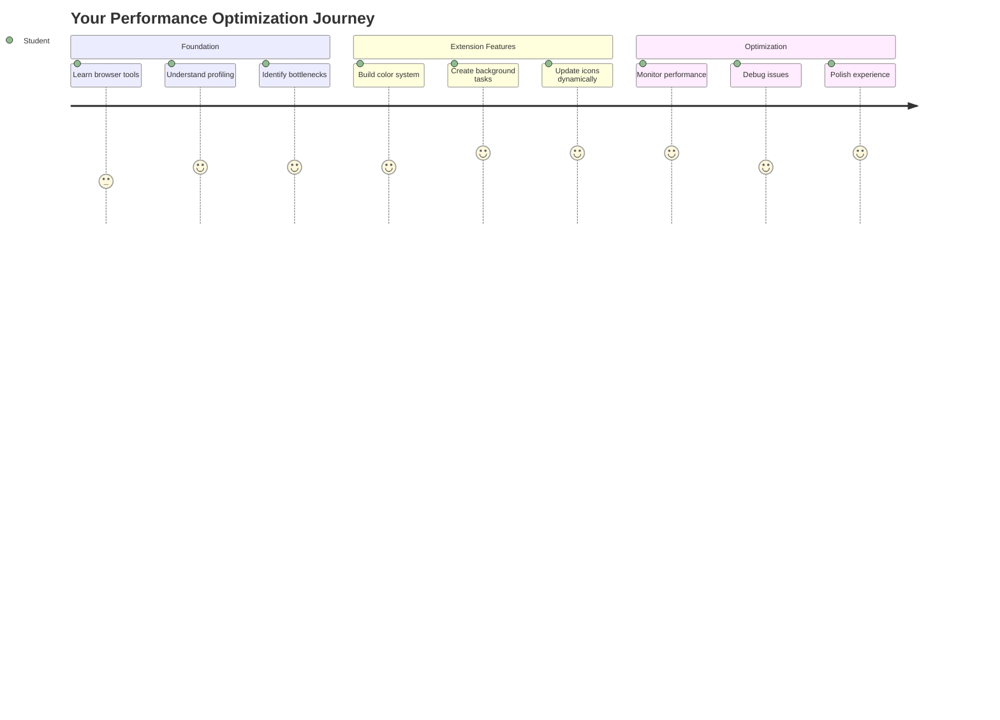
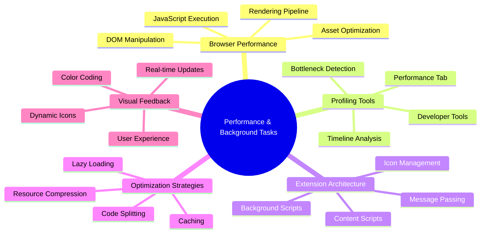
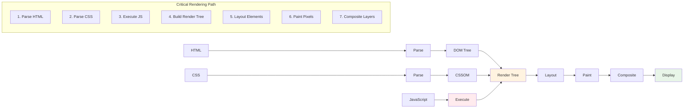
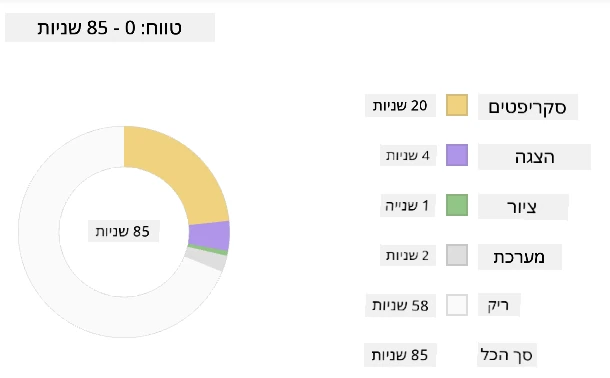
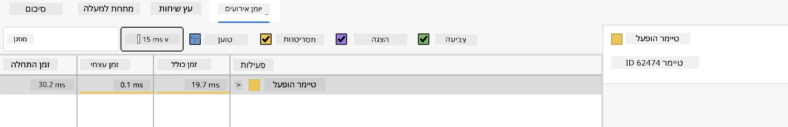
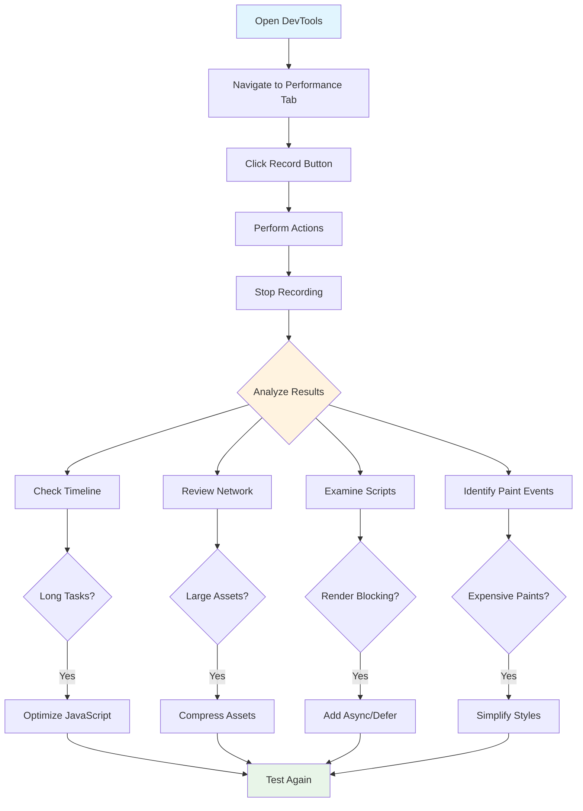
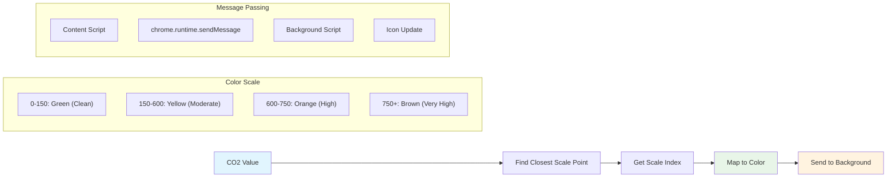
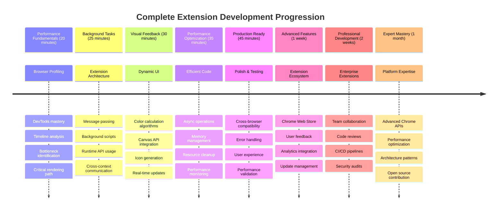

# פרויקט הרחבת דפדפן חלק 3: למדו על משימות רקע וביצועים



אי פעם תהיתם מה גורם לחלק מההרחבות בדפדפן להרגיש מהירות ותגובתיות בעוד שאחרות נראות איטיות? הסוד טמון במה שקורה מאחורי הקלעים. בזמן שמשתמשים לוחצים ברחבי ממשק ההרחבה שלכם, יש עולם שלם של תהליכי רקע שמנהלים בשקט את איסוף הנתונים, עדכוני האייקונים ומשאבי המערכת.

זהו השיעור האחרון בסדרת ההרחבות לדפדפן, ואנחנו הולכים לגרום למעקב טביעת הרגל הפחמנית שלכם לעבוד בצורה חלקה. תוסיפו עדכוני אייקונים דינמיים ותלמדו כיצד לזהות בעיות ביצועים לפני שהן הופכות לבעיות אמיתיות. זה כמו לכוון מכונית מרוץ - אופטימיזציות קטנות יכולות לעשות הבדל עצום באיך שהכל עובד.

עד שנסיים, תהיה לכם הרחבה מלוטשת ותבינו את עקרונות הביצועים שמבדילים בין אפליקציות אינטרנט טובות למעולות. בואו נצלול לעולם האופטימיזציה בדפדפן.

## שאלון לפני השיעור

[שאלון לפני השיעור](https://ff-quizzes.netlify.app/web/quiz/27)

### מבוא

בשיעורים הקודמים, בניתם טופס, חיברתם אותו ל-API, והתמודדתם עם איסוף נתונים אסינכרוני. ההרחבה שלכם מתחילה לקבל צורה יפה.

עכשיו אנחנו צריכים להוסיף את הנגיעות האחרונות - כמו לגרום לאייקון ההרחבה לשנות צבעים בהתאם לנתוני הפחמן. זה מזכיר לי איך נאס"א הייתה צריכה לאופטימיזציה של כל מערכת בחללית אפולו. הם לא יכלו להרשות לעצמם שום בזבוז של מחזורי עיבוד או זיכרון כי חיים היו תלויים בביצועים. למרות שההרחבה שלנו לא קריטית באותה מידה, אותם עקרונות חלים - קוד יעיל יוצר חוויות משתמש טובות יותר.



## יסודות ביצועי אינטרנט

כאשר הקוד שלכם פועל בצורה יעילה, אנשים יכולים ממש *להרגיש* את ההבדל. אתם מכירים את הרגע הזה שבו דף נטען מיד או אנימציה זורמת בצורה חלקה? זה ביצועים טובים בפעולה.

ביצועים הם לא רק עניין של מהירות - הם עניין של יצירת חוויות אינטרנט שמרגישות טבעיות במקום מגושמות ומתסכלות. בימים הראשונים של המחשוב, גרייס הופר שמרה על ננו-שנייה (חתיכת חוט באורך של כ-30 ס"מ) על שולחנה כדי להראות כמה רחוק האור עובר במיליארדית השנייה. זו הייתה הדרך שלה להסביר מדוע כל מיקרו-שנייה חשובה במחשוב. בואו נחקור את כלי החקירה שעוזרים לכם להבין מה מאט את העניינים.

> "ביצועי אתר הם על שני דברים: כמה מהר הדף נטען, וכמה מהר הקוד עליו פועל." -- [זאק גרוסברט](https://www.smashingmagazine.com/2012/06/javascript-profiling-chrome-developer-tools/)

הנושא של איך להפוך את האתרים שלכם למהירים במיוחד על כל סוגי המכשירים, לכל סוגי המשתמשים, בכל סוגי המצבים, הוא באופן לא מפתיע רחב. הנה כמה נקודות שכדאי לזכור כשאתם בונים פרויקט אינטרנט סטנדרטי או הרחבת דפדפן.

השלב הראשון באופטימיזציה של האתר שלכם הוא להבין מה באמת קורה מאחורי הקלעים. למרבה המזל, הדפדפן שלכם מגיע עם כלי חקירה חזקים מובנים.



כדי לפתוח את כלי המפתחים ב-Edge, לחצו על שלוש הנקודות בפינה הימנית העליונה, ואז לכו ל"כלים נוספים" > "כלי מפתחים". או השתמשו בקיצור מקלדת: `Ctrl` + `Shift` + `I` ב-Windows או `Option` + `Command` + `I` ב-Mac. ברגע שאתם שם, לחצו על לשונית הביצועים - כאן תבצעו את החקירה שלכם.

**הנה ערכת הכלים שלכם לחקירת ביצועים:**
- **פתחו** את כלי המפתחים (תשתמשו בהם כל הזמן כמפתחים!)
- **עברו** ללשונית הביצועים - חשבו עליה כעל מד דופק של אפליקציית האינטרנט שלכם
- **לחצו** על כפתור ההקלטה וצפו בדף שלכם בפעולה
- **למדו** את התוצאות כדי לזהות מה מאט את העניינים

בואו ננסה את זה. פתחו אתר (Microsoft.com עובד טוב לזה) ולחצו על כפתור 'הקלט'. עכשיו רעננו את הדף וצפו בפרופיילר לוכד את כל מה שקורה. כשעוצרים את ההקלטה, תראו פירוט מפורט של איך הדפדפן 'מפעיל', 'מצייר' ו'מעדכן' את האתר. זה מזכיר לי איך מרכז הבקרה עוקב אחרי כל מערכת בזמן שיגור רקטה - אתם מקבלים נתונים בזמן אמת על מה בדיוק קורה ומתי.


✅ [תיעוד Microsoft](https://docs.microsoft.com/microsoft-edge/devtools-guide/performance/?WT.mc_id=academic-77807-sagibbon) מכיל המון פרטים נוספים אם אתם רוצים לצלול לעומק

> טיפ מקצועי: נקו את מטמון הדפדפן שלכם לפני הבדיקה כדי לראות איך האתר שלכם מתפקד עבור מבקרים בפעם הראשונה - זה בדרך כלל שונה מאוד מביקורים חוזרים!

בחרו אלמנטים בציר הזמן של הפרופיל כדי להתמקד באירועים שמתרחשים בזמן טעינת הדף שלכם.

קבלו תמונת מצב של ביצועי הדף שלכם על ידי בחירת חלק מציר הזמן של הפרופיל והסתכלות על חלונית הסיכום:



בדקו את חלונית יומן האירועים כדי לראות אם יש אירוע שלקח יותר מ-15 מילי-שניות:



✅ הכירו את הפרופיילר שלכם! פתחו את כלי המפתחים באתר הזה ובדקו אם יש צווארי בקבוק. מהו הנכס שנטען הכי לאט? הכי מהר?



## מה לחפש בזמן פרופיילינג

הרצת הפרופיילר היא רק ההתחלה - המיומנות האמיתית היא לדעת מה הגרפים הצבעוניים האלה באמת אומרים לכם. אל תדאגו, תתרגלו לקרוא אותם. מפתחים מנוסים למדו לזהות את סימני האזהרה לפני שהם הופכים לבעיות של ממש.

בואו נדבר על החשודים הרגילים - הבעיות בביצועים שנוטות להתגנב לפרויקטים באינטרנט. כמו שמארי קירי הייתה צריכה לעקוב בזהירות אחרי רמות הקרינה במעבדה שלה, אנחנו צריכים לעקוב אחרי דפוסים מסוימים שמצביעים על בעיות שמתבשלות. זיהוי מוקדם יחסוך לכם (ולמשתמשים שלכם) הרבה תסכול.

**גדלי נכסים**: אתרים הופכים ל"כבדים" יותר עם השנים, והרבה מהמשקל הנוסף הזה מגיע מתמונות. זה כמו שאנחנו דוחסים יותר ויותר לתוך מזוודות דיגיטליות שלנו.

✅ בדקו את [ארכיון האינטרנט](https://httparchive.org/reports/page-weight) כדי לראות איך גדלי הדפים גדלו עם הזמן - זה די חושפני.

**הנה איך לשמור על הנכסים שלכם אופטימליים:**
- **כווצו** את התמונות! פורמטים מודרניים כמו WebP יכולים להקטין את גודל הקבצים בצורה דרמטית
- **שלחו** את גודל התמונה המתאים לכל מכשיר - אין צורך לשלוח תמונות גדולות של מחשבים שולחניים לטלפונים
- **כווצו** את ה-CSS וה-JavaScript שלכם - כל בייט חשוב
- **השתמשו** בטעינה עצלה כך שתמונות יורדו רק כשהמשתמשים גוללים אליהן

**מעברים ב-DOM**: הדפדפן צריך לבנות את מודל האובייקט של המסמך (DOM) על בסיס הקוד שאתם כותבים, ולכן זה אינטרס של ביצועי דף טובים לשמור על התגים מינימליים, תוך שימוש ועיצוב רק מה שהדף צריך. בהקשר זה, CSS מיותר הקשור לדף יכול להיות אופטימלי; סגנונות שצריכים להיות בשימוש רק בדף אחד לא צריכים להיכלל בגיליון הסגנונות הראשי, למשל.

**אסטרטגיות מפתח לאופטימיזציה של DOM:**
- **ממזערים** את מספר האלמנטים ב-HTML ורמות הקינון
- **מסירים** כללי CSS לא בשימוש ומרכזים גיליונות סגנון בצורה יעילה
- **מארגנים** CSS כך שייטען רק מה שנדרש לכל דף
- **מבנים** HTML בצורה סמנטית לפריסה טובה יותר של הדפדפן

**JavaScript**: כל מפתח JavaScript צריך לשים לב לסקריפטים 'חוסמי עיבוד' שחייבים להיטען לפני שהשאר של ה-DOM יכול להיות מעובד ומצויר לדפדפן. שקלו להשתמש ב-`defer` עם הסקריפטים המובנים שלכם (כפי שנעשה במודול ה-Terrarium).

**טכניקות אופטימיזציה מודרניות ל-JavaScript:**
- **משתמשים** בתכונת `defer` לטעינת סקריפטים לאחר עיבוד ה-DOM
- **מיישמים** פיצול קוד לטעינת JavaScript נחוץ בלבד
- **מיישמים** טעינה עצלה לפונקציונליות לא קריטית
- **ממזערים** את השימוש בספריות ובמסגרות כבדות כשאפשר

✅ נסו כמה אתרים באתר [בדיקת מהירות אתרים](https://www.webpagetest.org/) כדי ללמוד עוד על הבדיקות הנפוצות שנעשות כדי לקבוע ביצועי אתר.

### 🔄 **בדיקת פדגוגיה**
**הבנת ביצועים**: לפני בניית תכונות הרחבה, ודאו שאתם יכולים:
- ✅ להסביר את מסלול העיבוד הקריטי מ-HTML לפיקסלים
- ✅ לזהות צווארי בקבוק נפוצים בביצועי אפליקציות אינטרנט
- ✅ להשתמש בכלי המפתחים של הדפדפן לפרופיילינג ביצועי דף
- ✅ להבין איך גודל נכסים ומורכבות DOM משפיעים על מהירות

**מבחן עצמי מהיר**: מה קורה כשיש לכם JavaScript חוסם עיבוד?
*תשובה: הדפדפן חייב להוריד ולהריץ את הסקריפט לפני שהוא יכול להמשיך לעבד את ה-HTML ולצייר את הדף*

**השפעת ביצועים בעולם האמיתי**:
- **עיכוב של 100ms**: משתמשים שמים לב להאטה
- **עיכוב של 1 שנייה**: משתמשים מתחילים לאבד ריכוז
- **עיכוב של 3+ שניות**: 40% מהמשתמשים נוטשים את הדף
- **רשתות סלולריות**: ביצועים חשובים אפילו יותר

עכשיו כשיש לכם מושג איך הדפדפן מעבד את הנכסים שאתם שולחים אליו, בואו נסתכל על הדברים האחרונים שאתם צריכים לעשות כדי להשלים את ההרחבה שלכם:

### יצירת פונקציה לחישוב צבע

עכשיו ניצור פונקציה שהופכת נתונים מספריים לצבעים משמעותיים. חשבו על זה כמו מערכת רמזור - ירוק לאנרגיה נקייה, אדום לעוצמת פחמן גבוהה.

הפונקציה הזו תיקח את נתוני ה-CO2 מה-API שלנו ותקבע איזה צבע הכי מתאים לייצג את ההשפעה הסביבתית. זה דומה לאיך מדענים משתמשים בקידוד צבע במפות חום כדי להמחיש דפוסי נתונים מורכבים - מטמפרטורות אוקיינוס ועד יצירת כוכבים. בואו נוסיף את זה ל-`/src/index.js`, מיד אחרי משתני ה-`const` שהגדרנו קודם:



```javascript
function calculateColor(value) {
	// Define CO2 intensity scale (grams per kWh)
	const co2Scale = [0, 150, 600, 750, 800];
	// Corresponding colors from green (clean) to dark brown (high carbon)
	const colors = ['#2AA364', '#F5EB4D', '#9E4229', '#381D02', '#381D02'];

	// Find the closest scale value to our input
	const closestNum = co2Scale.sort((a, b) => {
		return Math.abs(a - value) - Math.abs(b - value);
	})[0];
	
	console.log(`${value} is closest to ${closestNum}`);
	
	// Find the index for color mapping
	const num = (element) => element > closestNum;
	const scaleIndex = co2Scale.findIndex(num);

	const closestColor = colors[scaleIndex];
	console.log(scaleIndex, closestColor);

	// Send color update message to background script
	chrome.runtime.sendMessage({ action: 'updateIcon', value: { color: closestColor } });
}
```

**בואו נפרק את הפונקציה החכמה הזו:**
- **מגדירה** שני מערכים - אחד לרמות CO2, ואחד לצבעים (ירוק = נקי, חום = מלוכלך!)
- **מוצאת** את ההתאמה הקרובה ביותר לערך ה-CO2 שלנו באמצעות מיון מערכים חכם
- **לוקחת** את הצבע המתאים באמצעות השיטה findIndex()
- **שולחת** הודעה לסקריפט הרקע של Chrome עם הצבע שבחרנו
- **משתמשת** בתבניות מחרוזת (backticks) לעיצוב מחרוזות נקי יותר
- **שומרת** הכל מאורגן עם הצהרות const

ה-API של `chrome.runtime` [API](https://developer.chrome.com/extensions/runtime) הוא כמו מערכת העצבים של ההרחבה שלכם - הוא מטפל בכל התקשורת והמשימות מאחורי הקלעים:

> "השתמשו ב-API של chrome.runtime כדי לקבל את דף הרקע, להחזיר פרטים על המניפסט, ולהאזין ולהגיב לאירועים במחזור החיים של האפליקציה או ההרחבה. אתם יכולים גם להשתמש ב-API הזה כדי להמיר את הנתיב היחסי של כתובות URL לכתובות URL מוסמכות לחלוטין."

**למה ה-API של Chrome Runtime כל כך שימושי:**
- **מאפשר** לחלקים שונים של ההרחבה לדבר אחד עם השני
- **מטפל** בעבודת רקע בלי להקפיא את ממשק המשתמש
- **מנהל** אירועי מחזור החיים של ההרחבה שלכם
- **מקלה** על העברת הודעות בין סקריפטים

✅ אם אתם מפתחים את ההרחבה הזו ל-Edge, זה עשוי להפתיע אתכם שאתם משתמשים ב-API של Chrome. גרסאות הדפדפן החדשות של Edge פועלות על מנוע הדפדפן Chromium, כך שאתם יכולים לנצל את הכלים האלה.

```mermaid
architecture-beta
    group browser(logos:chrome)[Browser]
    
    service popup(logos:html5)[Popup UI] in browser
    service content(logos:javascript)[Content Script] in browser
    service background(database)[Background Script] in browser
    service api(logos:api)[External API] in browser
    
    popup:R -- L:content
    content:R -- L:background
    background:T -- B:api
    content:T -- B:api
    
    junction junctionCenter in browser
    popup:R -- L:junctionCenter
    junctionCenter:R -- L:background
```



> **טיפ מקצועי**: אם אתם רוצים לפרופייל הרחבת דפדפן, פתחו את כלי המפתחים מתוך ההרחבה עצמה, שכן היא מופעלת כדפדפן נפרד. זה נותן לכם גישה למדדי ביצועים ספציפיים להרחבה.

### הגדרת צבע אייקון ברירת מחדל

לפני שנתחיל לאסוף נתונים אמיתיים, בואו ניתן להרחבה שלנו נקודת התחלה. אף אחד לא אוהב להסתכל על אייקון ריק או שבור. נתחיל עם צבע ירוק כדי שהמשתמשים ידעו שההרחבה עובדת מהרגע שהם מתקינים אותה.

בפונקציית `init()` שלכם, בואו נגדיר את האייקון הירוק כברירת מחדל:

```javascript
chrome.runtime.sendMessage({
	action: 'updateIcon',
	value: {
		color: 'green',
	},
});
```

**מה ההתחלה הזו משיגה:**
- **מגדירה** צבע ירוק ניטרלי כמצב ברירת מחדל
- **מספקת** משוב חזותי מיידי כשההרחבה נטענת
- **מבססת** את דפוס התקשורת עם סקריפט הרקע
- **מבטיחה** שהמשתמשים יראו הרחבה פונקציונלית לפני טעינת נתונים

### קריאה לפונקציה, ביצוע הקריאה

עכשיו בואו נחבר הכל יחד כך שכאשר נתוני CO2 חדשים מגיעים, האייקון שלכם יתעדכן אוטומטית עם הצבע הנכון. זה כמו לחבר את המעגל האחרון במכשיר אלקטרוני - פתאום כל הרכיבים הבודדים עובדים כמערכת אחת.

הוסיפו את השורה הזו מיד אחרי שאתם מקבלים את נתוני ה-CO2 מה-API:

```javascript
// After retrieving CO2 data from the API
// let CO2 = data.data[0].intensity.actual;
calculateColor(CO2);
```

**האינטגרציה הזו משיגה:**
- **מחברת** את זרימת נתוני ה-API עם מערכת האינדיקטור החזותי
- **מפעילה** עדכוני אייקון אוטומטית כשהנתונים החדשים מגיעים
- **מבטיחה** משוב חזותי בזמן אמת בהתבסס על עוצמת הפחמן הנוכחית
- **שומרת** על הפרדת תחומי האחריות בין איסוף נתונים ללוגיקת תצוגה

ולבסוף, ב-`/dist/background.js`, הוסיפו את המאזין לקריאות הפעולה ברקע:

```javascript
// Listen for messages from the content script
chrome.runtime.onMessage.addListener(function (msg, sender, sendResponse) {
	if (msg.action === 'updateIcon') {
		chrome.action.setIcon({ imageData: drawIcon(msg.value) });
	}
});

// Draw dynamic icon using Canvas API
// Borrowed from energy lollipop extension - nice feature!
function drawIcon(value) {
	// Create an offscreen canvas for better performance
	const canvas = new OffscreenCanvas(200, 200);
	const context = canvas.getContext('2d');

	// Draw a colored circle representing carbon intensity
	context.beginPath();
	context.fillStyle = value.color;
	context.arc(100, 100, 50, 0, 2 * Math.PI);
	context.fill();

	// Return the image data for the browser icon
	return context.getImageData(50, 50, 100, 100);
}
```

**הנה מה שהסקריפט הרקע הזה עושה:**
- **מאזין** להודעות מהסקריפט הראשי שלכם (כמו פקיד קבלה שמקבל שיחות)
- **מעבד** את בקשות 'updateIcon' לשינוי אייקון סרגל הכלים שלכם
- **יוצר** אייקונים חדשים תוך שימוש ב-Canvas API
- **מצייר** עיגול צבעוני פשוט שמראה את עוצמת הפחמן הנוכחית
- **מעדכן** את סרגל הכלים של הדפדפן שלכם עם האייקון החדש
- **משתמש** ב-OffscreenCanvas לביצועים חלקים
- ✅ מה תפקיד ה- Chrome Runtime API בארכיטקטורת הרחבות?
- ✅ כיצד אלגוריתם חישוב הצבע ממפה נתונים למשוב חזותי?

**שיקולי ביצועים**: ההרחבה שלך כעת מציגה:
- **העברת הודעות יעילה**: תקשורת נקייה בין הקשרים של סקריפטים
- **רינדור אופטימלי**: OffscreenCanvas מונע חסימת ממשק משתמש
- **עדכונים בזמן אמת**: שינויי אייקון דינמיים בהתבסס על נתונים חיים
- **ניהול זיכרון**: ניקוי נכון וטיפול במשאבים

**זמן לבדוק את ההרחבה שלך:**
- **בנה** הכל עם `npm run build`
- **טען מחדש** את ההרחבה שלך בדפדפן (אל תשכח את השלב הזה)
- **פתח** את ההרחבה שלך וצפה באייקון משנה צבעים
- **בדוק** כיצד היא מגיבה לנתוני פחמן אמיתיים מכל העולם

עכשיו תדע במבט אחד אם זה זמן טוב לכבס או שכדאי לחכות לאנרגיה נקייה יותר. הרגע בנית משהו באמת שימושי ולמדת על ביצועי דפדפן בדרך.

## אתגר סוכן GitHub Copilot 🚀

השתמש במצב סוכן כדי להשלים את האתגר הבא:

**תיאור:** שפר את יכולות ניטור הביצועים של ההרחבה על ידי הוספת תכונה שעוקבת ומציגה זמני טעינה של רכיבים שונים בהרחבה.

**הנחיה:** צור מערכת לניטור ביצועים עבור ההרחבה שמודדת ומקליטה את הזמן שלוקח לשלוף נתוני CO2 מה-API, לחשב צבעים ולעדכן את האייקון. הוסף פונקציה בשם `performanceTracker` שמשתמשת ב-Performance API למדידת פעולות אלו ומציגה את התוצאות בקונסול של הדפדפן עם חותמות זמן ומדדי משך.

למד עוד על [מצב סוכן](https://code.visualstudio.com/blogs/2025/02/24/introducing-copilot-agent-mode) כאן.

## 🚀 אתגר

הנה משימה בלשית מעניינת: בחר כמה אתרי קוד פתוח שקיימים כבר שנים (כמו ויקיפדיה, GitHub או Stack Overflow) וחפור בהיסטוריית הקומיטים שלהם. האם תוכל לזהות היכן הם ביצעו שיפורי ביצועים? אילו בעיות חזרו שוב ושוב?

**גישה לחקירה שלך:**
- **חפש** הודעות קומיט עם מילים כמו "אופטימיזציה", "ביצועים" או "מהיר יותר"
- **בדוק** דפוסים - האם הם ממשיכים לתקן את אותם סוגי בעיות?
- **זהה** את הגורמים הנפוצים שמאטים את האתרים
- **שתף** את מה שגילית - מפתחים אחרים לומדים מדוגמאות אמיתיות

## מבחן לאחר ההרצאה

[מבחן לאחר ההרצאה](https://ff-quizzes.netlify.app/web/quiz/28)

## סקירה ולימוד עצמי

שקול להירשם ל-[ניוזלטר ביצועים](https://perf.email/)

חקור כמה מהדרכים שבהן דפדפנים מודדים ביצועי רשת על ידי עיון בלשוניות הביצועים בכלי הרשת שלהם. האם אתה מוצא הבדלים משמעותיים?

### ⚡ **מה תוכל לעשות ב-5 הדקות הבאות**
- [ ] פתח את מנהל המשימות של הדפדפן (Shift+Esc בכרום) כדי לראות את השימוש במשאבים של ההרחבה
- [ ] השתמש בלשונית הביצועים של DevTools כדי להקליט ולנתח ביצועי דף אינטרנט
- [ ] בדוק את עמוד ההרחבות של הדפדפן כדי לראות אילו הרחבות משפיעות על זמן ההפעלה
- [ ] נסה להשבית הרחבות זמנית כדי לראות הבדלי ביצועים

### 🎯 **מה תוכל להשיג בשעה הקרובה**
- [ ] השלם את מבחן לאחר השיעור והבין מושגי ביצועים
- [ ] יישם סקריפט רקע להרחבת הדפדפן שלך
- [ ] למד להשתמש ב-browser.alarms למשימות רקע יעילות
- [ ] תרגל העברת הודעות בין סקריפטים של תוכן וסקריפטים של רקע
- [ ] מדוד ואופטימיזציה את השימוש במשאבים של ההרחבה שלך

### 📅 **מסע ביצועים שבועי**
- [ ] השלם הרחבת דפדפן בעלת ביצועים גבוהים עם פונקציונליות רקע
- [ ] שלוט בעובדי שירות ובארכיטקטורת הרחבות מודרנית
- [ ] יישם אסטרטגיות סנכרון נתונים ואחסון יעילות
- [ ] למד טכניקות דיבוג מתקדמות לביצועי הרחבות
- [ ] אופטימיזציה של ההרחבה שלך הן מבחינת פונקציונליות והן מבחינת יעילות משאבים
- [ ] צור בדיקות מקיפות לתרחישי ביצועים של הרחבות

### 🌟 **שליטה באופטימיזציה חודשית**
- [ ] בנה הרחבות דפדפן ברמה ארגונית עם ביצועים מיטביים
- [ ] למד על Web Workers, Service Workers וביצועי רשת מודרניים
- [ ] תרום לפרויקטים של קוד פתוח המתמקדים באופטימיזציה של ביצועים
- [ ] שלוט בפנימיות הדפדפן ובטכניקות דיבוג מתקדמות
- [ ] צור כלי ניטור ביצועים ומדריכי שיטות עבודה מומלצות
- [ ] הפוך למומחה ביצועים שעוזר לאופטימיזציה של יישומי רשת

## 🎯 ציר הזמן לשליטה בהרחבות דפדפן



### 🛠️ ערכת הכלים המלאה לפיתוח הרחבות שלך

לאחר השלמת הטרילוגיה הזו, כעת שלטת ב:
- **ארכיטקטורת דפדפן**: הבנה מעמיקה של איך הרחבות משתלבות עם מערכות דפדפן
- **פרופיל ביצועים**: יכולת לזהות ולתקן צווארי בקבוק באמצעות כלי מפתחים
- **תכנות אסינכרוני**: דפוסי JavaScript מודרניים לפעולות תגובתיות ולא חוסמות
- **שילוב API**: שליפת נתונים חיצוניים עם אימות וטיפול בשגיאות
- **עיצוב חזותי**: עדכוני ממשק משתמש דינמיים ויצירת גרפיקה מבוססת Canvas
- **העברת הודעות**: תקשורת בין סקריפטים בארכיטקטורת הרחבות
- **חוויית משתמש**: מצבי טעינה, טיפול בשגיאות ואינטראקציות אינטואיטיביות
- **מיומנויות ייצור**: בדיקה, דיבוג ואופטימיזציה לפריסה בעולם האמיתי

**יישומים בעולם האמיתי**: מיומנויות פיתוח ההרחבות שלך חלות ישירות על:
- **אפליקציות רשת מתקדמות**: ארכיטקטורה ודפוסי ביצועים דומים
- **אפליקציות שולחן עבודה של Electron**: אפליקציות חוצות פלטפורמות באמצעות טכנולוגיות רשת
- **אפליקציות היברידיות לנייד**: פיתוח Cordova/PhoneGap באמצעות APIs רשת
- **אפליקציות רשת ארגוניות**: כלי לוח מחוונים וכלי פרודוקטיביות מורכבים
- **הרחבות Chrome DevTools**: כלי מפתחים מתקדמים ודיבוג
- **שילוב API רשת**: כל אפליקציה שמתקשרת עם שירותים חיצוניים

**השפעה מקצועית**: כעת תוכל:
- **לבנות** הרחבות דפדפן מוכנות לייצור מהרעיון ועד לפריסה
- **לאופטימיזציה** ביצועי אפליקציות רשת באמצעות כלי פרופיל סטנדרטיים בתעשייה
- **לארכיטקט** מערכות ניתנות להרחבה עם הפרדה נכונה של חששות
- **לדבג** פעולות אסינכרוניות מורכבות ותקשורת בין הקשרים
- **לתרום** לפרויקטים של קוד פתוח להרחבות ולסטנדרטים של דפדפן

**הזדמנויות ברמה הבאה**:
- **מפתח חנות האינטרנט של Chrome**: פרסם הרחבות למיליוני משתמשים
- **מהנדס ביצועי רשת**: התמחות באופטימיזציה וחוויית משתמש
- **מפתח פלטפורמת דפדפן**: תרום לפיתוח מנועי דפדפן
- **יוצר מסגרת הרחבות**: צור כלים שעוזרים למפתחים אחרים
- **יחסי מפתחים**: שתף ידע דרך הוראה ויצירת תוכן

🌟 **הישג נפתח**: בנית הרחבת דפדפן שלמה, פונקציונלית, שמדגימה שיטות פיתוח מקצועיות וסטנדרטים מודרניים של רשת!

## משימה

[נתח אתר עבור ביצועים](assignment.md)

---

**כתב ויתור**:  
מסמך זה תורגם באמצעות שירות תרגום AI [Co-op Translator](https://github.com/Azure/co-op-translator). בעוד שאנו שואפים לדיוק, יש להיות מודעים לכך שתרגומים אוטומטיים עשויים להכיל שגיאות או אי דיוקים. המסמך המקורי בשפתו המקורית צריך להיחשב כמקור סמכותי. עבור מידע קריטי, מומלץ להשתמש בתרגום מקצועי אנושי. איננו אחראים לאי הבנות או לפרשנויות שגויות הנובעות משימוש בתרגום זה.