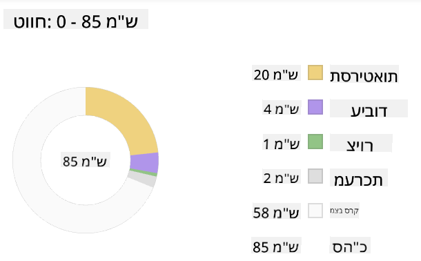
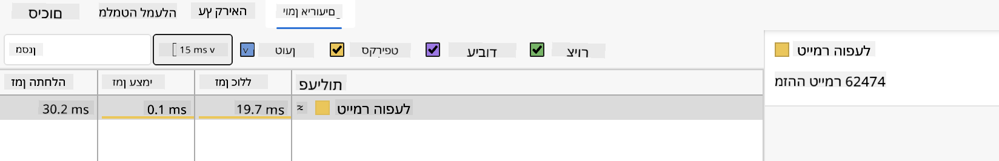

<!--
CO_OP_TRANSLATOR_METADATA:
{
  "original_hash": "eb358f3f4c2c082f9f3a4f98efa1d337",
  "translation_date": "2025-10-23T01:39:31+00:00",
  "source_file": "5-browser-extension/3-background-tasks-and-performance/README.md",
  "language_code": "he"
}
-->
# פרויקט הרחבת דפדפן חלק 3: למדו על משימות רקע וביצועים

אי פעם תהיתם מה גורם לחלק מההרחבות בדפדפן להרגיש מהירות ותגובתיות בעוד אחרות נראות איטיות? הסוד טמון במה שקורה מאחורי הקלעים. בזמן שמשתמשים לוחצים על ממשק ההרחבה שלכם, יש עולם שלם של תהליכי רקע שמנהלים בשקט את איסוף הנתונים, עדכוני האייקונים ומשאבי המערכת.

זהו השיעור האחרון בסדרת הרחבות הדפדפן שלנו, ואנחנו הולכים לגרום למעקב טביעת הרגל הפחמנית שלכם לעבוד בצורה חלקה. תוסיפו עדכוני אייקונים דינמיים ותלמדו כיצד לזהות בעיות ביצועים לפני שהן הופכות לבעיות. זה כמו לכוון מכונית מרוץ - אופטימיזציות קטנות יכולות לעשות הבדל עצום באיך שהכל עובד.

עד שנסיים, תהיה לכם הרחבה מלוטשת ותבינו את עקרונות הביצועים שמפרידים בין אפליקציות רשת טובות לבין כאלה מצוינות. בואו נצלול לעולם אופטימיזציית הדפדפן.

## שאלון לפני השיעור

[שאלון לפני השיעור](https://ff-quizzes.netlify.app/web/quiz/27)

### הקדמה

בשיעורים הקודמים, בניתם טופס, חיברתם אותו ל-API, והתמודדתם עם איסוף נתונים אסינכרוני. ההרחבה שלכם מתגבשת בצורה יפה.

עכשיו אנחנו צריכים להוסיף את הנגיעות האחרונות - כמו לגרום לאייקון ההרחבה לשנות צבעים בהתאם לנתוני הפחמן. זה מזכיר לי איך נאס"א הייתה צריכה לאופטימיזציה של כל מערכת בחללית אפולו. הם לא יכלו להרשות לעצמם שום בזבוז של מחזורי עיבוד או זיכרון כי חיים היו תלויים בביצועים. למרות שהרחבת הדפדפן שלנו לא קריטית באותה מידה, אותם עקרונות חלים - קוד יעיל יוצר חוויות משתמש טובות יותר.

## יסודות ביצועי רשת

כשקוד שלכם פועל בצורה יעילה, אנשים יכולים ממש *להרגיש* את ההבדל. אתם מכירים את הרגע הזה שבו דף נטען מיד או אנימציה זורמת בצורה חלקה? זה ביצועים טובים בפעולה.

ביצועים הם לא רק עניין של מהירות - הם עוסקים ביצירת חוויות רשת שמרגישות טבעיות במקום מגושמות ומתסכלות. בימים הראשונים של המחשוב, גרייס הופר שמרה על ננו-שנייה (חתיכת חוט באורך של כ-30 ס"מ) על שולחנה כדי להראות כמה רחוק אור עובר במיליארדית השנייה. זה היה הדרך שלה להסביר למה כל מיקרו-שנייה חשובה במחשוב. בואו נחקור את כלי החקירה שעוזרים לכם להבין מה מאט את הדברים.

> "ביצועי אתר עוסקים בשני דברים: כמה מהר הדף נטען, וכמה מהר הקוד עליו פועל." -- [זאק גרוסברט](https://www.smashingmagazine.com/2012/06/javascript-profiling-chrome-developer-tools/)

הנושא של איך להפוך את האתרים שלכם למהירים במיוחד על כל סוגי המכשירים, לכל סוגי המשתמשים, בכל סוגי המצבים, הוא באופן לא מפתיע רחב מאוד. הנה כמה נקודות שכדאי לזכור כשאתם בונים פרויקט רשת סטנדרטי או הרחבת דפדפן.

השלב הראשון באופטימיזציה של האתר שלכם הוא להבין מה באמת קורה מאחורי הקלעים. למרבה המזל, הדפדפן שלכם מגיע עם כלי חקירה חזקים מובנים.

כדי לפתוח את כלי המפתחים ב-Edge, לחצו על שלוש הנקודות בפינה הימנית העליונה, ואז לכו ל"כלים נוספים" > "כלי מפתחים". או השתמשו בקיצור מקלדת: `Ctrl` + `Shift` + `I` ב-Windows או `Option` + `Command` + `I` ב-Mac. ברגע שאתם שם, לחצו על לשונית הביצועים - כאן תבצעו את החקירה שלכם.

**הנה ערכת הכלים שלכם לחקירת ביצועים:**
- **פתחו** את כלי המפתחים (תשתמשו בהם כל הזמן כמפתחים!)
- **עברו** ללשונית הביצועים - חשבו עליה כעל מד כושר לאפליקציית הרשת שלכם
- **לחצו** על כפתור ההקלטה וצפו בדף שלכם בפעולה
- **למדו** את התוצאות כדי לזהות מה מאט את הדברים

בואו ננסה את זה. פתחו אתר (Microsoft.com עובד טוב בשביל זה) ולחצו על כפתור 'הקלט'. עכשיו רעננו את הדף וצפו בפרופילר לוכד את כל מה שקורה. כשעוצרים את ההקלטה, תראו פירוט מפורט של איך הדפדפן 'מפעיל', 'מצייר' ו'מעדכן' את האתר. זה מזכיר לי איך מרכז הבקרה עוקב אחרי כל מערכת בזמן שיגור רקטה - אתם מקבלים נתונים בזמן אמת על מה בדיוק קורה ומתי.

✅ [תיעוד של מיקרוסופט](https://docs.microsoft.com/microsoft-edge/devtools-guide/performance/?WT.mc_id=academic-77807-sagibbon) מכיל המון פרטים נוספים אם אתם רוצים להעמיק

> טיפ מקצועי: נקו את מטמון הדפדפן שלכם לפני הבדיקה כדי לראות איך האתר שלכם מתפקד עבור מבקרים בפעם הראשונה - זה בדרך כלל שונה מאוד מביקורים חוזרים!

בחרו אלמנטים בציר הזמן של הפרופיל כדי להתמקד באירועים שמתרחשים בזמן טעינת הדף שלכם.

קבלו תמונת מצב של ביצועי הדף שלכם על ידי בחירת חלק מציר הזמן של הפרופיל והסתכלות על חלונית הסיכום:



בדקו את חלונית יומן האירועים כדי לראות אם יש אירוע שלקח יותר מ-15 מילי-שניות:



✅ הכירו את הפרופילר שלכם! פתחו את כלי המפתחים באתר הזה ובדקו אם יש צווארי בקבוק. מהו הנכס שנטען הכי לאט? הכי מהר?

## מה לחפש בזמן פרופילינג

הרצת הפרופילר היא רק ההתחלה - המיומנות האמיתית היא לדעת מה הגרפים הצבעוניים האלה באמת אומרים לכם. אל תדאגו, תתרגלו לקרוא אותם. מפתחים מנוסים למדו לזהות את סימני האזהרה לפני שהם הופכים לבעיות של ממש.

בואו נדבר על החשודים הרגילים - הבעיות בביצועים שנוטות להתגנב לפרויקטי רשת. כמו שמארי קירי הייתה צריכה לעקוב בזהירות אחרי רמות הקרינה במעבדה שלה, אנחנו צריכים לעקוב אחרי דפוסים מסוימים שמצביעים על בעיות שמתבשלות. זיהוי מוקדם יחסוך לכם (ולמשתמשים שלכם) הרבה תסכול.

**גדלי נכסים**: אתרים הופכים ל"כבדים" יותר עם השנים, והרבה מהמשקל הנוסף הזה מגיע מתמונות. זה כמו שאנחנו ממלאים יותר ויותר את המזוודות הדיגיטליות שלנו.

✅ בדקו את [ארכיון האינטרנט](https://httparchive.org/reports/page-weight) כדי לראות איך גדלי הדפים גדלו עם הזמן - זה די חושפני.

**הנה איך לשמור על הנכסים שלכם אופטימליים:**
- **כווצו** את התמונות! פורמטים מודרניים כמו WebP יכולים להקטין את גודל הקבצים בצורה דרמטית
- **הגישו** את גודל התמונה הנכון לכל מכשיר - אין צורך לשלוח תמונות גדולות למכשירים ניידים
- **מזערו** את ה-CSS וה-JavaScript שלכם - כל בייט חשוב
- **השתמשו** בטעינה עצלה כך שהתמונות יורדו רק כשהמשתמשים גוללים אליהן

**מעברים ב-DOM**: הדפדפן צריך לבנות את מודל האובייקטים של המסמך (DOM) על בסיס הקוד שאתם כותבים, ולכן זה אינטרס של ביצועי דף טובים לשמור על התגים מינימליים, תוך שימוש ועיצוב רק מה שהדף צריך. בהקשר הזה, CSS מיותר שקשור לדף יכול להיות אופטימלי; סגנונות שצריכים להיות בשימוש רק בדף אחד לא צריכים להיות כלולים בגיליון הסגנונות הראשי, למשל.

**אסטרטגיות מפתח לאופטימיזציית DOM:**
- **צמצמו** את מספר האלמנטים ב-HTML ורמות ההיררכיה
- **הסירו** כללי CSS לא בשימוש ואחדו גיליונות סגנון בצורה יעילה
- **ארגנו** CSS כך שייטען רק מה שצריך לכל דף
- **בנו** HTML בצורה סמנטית לשיפור ניתוח הדפדפן

**JavaScript**: כל מפתח JavaScript צריך לשים לב לסקריפטים שחוסמים את הרינדור ושחייבים להיטען לפני שהשאר ה-DOM יכול להיות מעובד ומצויר בדפדפן. שקלו להשתמש ב-`defer` עם הסקריפטים המובנים שלכם (כפי שנעשה במודול הטרריום).

**טכניקות אופטימיזציה מודרניות ל-JavaScript:**
- **השתמשו** בתכונת `defer` לטעינת סקריפטים לאחר עיבוד ה-DOM
- **יישמו** פיצול קוד לטעינת JavaScript נחוץ בלבד
- **השתמשו** בטעינה עצלה לפונקציונליות לא קריטית
- **צמצמו** את השימוש בספריות ובמסגרות כבדות כשאפשר

✅ נסו כמה אתרים באתר [בדיקת מהירות אתרים](https://www.webpagetest.org/) כדי ללמוד עוד על הבדיקות הנפוצות שנעשות כדי לקבוע ביצועי אתר.

עכשיו כשיש לכם מושג איך הדפדפן מרנדר את הנכסים שאתם שולחים אליו, בואו נסתכל על הדברים האחרונים שאתם צריכים לעשות כדי להשלים את ההרחבה שלכם:

### צרו פונקציה לחישוב צבע

עכשיו ניצור פונקציה שהופכת נתונים מספריים לצבעים משמעותיים. חשבו על זה כמו מערכת רמזור - ירוק לאנרגיה נקייה, אדום לעוצמת פחמן גבוהה.

הפונקציה הזו תיקח את נתוני ה-CO2 מה-API שלנו ותקבע איזה צבע מייצג בצורה הטובה ביותר את ההשפעה הסביבתית. זה דומה לאיך שמדענים משתמשים בקידוד צבע במפות חום כדי להמחיש דפוסי נתונים מורכבים - מטמפרטורות אוקיינוס ועד היווצרות כוכבים. בואו נוסיף את זה ל-`/src/index.js`, מיד אחרי משתני ה-`const` שהגדרנו קודם:

```javascript
function calculateColor(value) {
	// Define CO2 intensity scale (grams per kWh)
	const co2Scale = [0, 150, 600, 750, 800];
	// Corresponding colors from green (clean) to dark brown (high carbon)
	const colors = ['#2AA364', '#F5EB4D', '#9E4229', '#381D02', '#381D02'];

	// Find the closest scale value to our input
	const closestNum = co2Scale.sort((a, b) => {
		return Math.abs(a - value) - Math.abs(b - value);
	})[0];
	
	console.log(`${value} is closest to ${closestNum}`);
	
	// Find the index for color mapping
	const num = (element) => element > closestNum;
	const scaleIndex = co2Scale.findIndex(num);

	const closestColor = colors[scaleIndex];
	console.log(scaleIndex, closestColor);

	// Send color update message to background script
	chrome.runtime.sendMessage({ action: 'updateIcon', value: { color: closestColor } });
}
```

**בואו נפרק את הפונקציה החכמה הזו:**
- **מגדירה** שני מערכים - אחד לרמות CO2, ואחד לצבעים (ירוק = נקי, חום = מלוכלך!)
- **מוצאת** את ההתאמה הקרובה ביותר לערך ה-CO2 שלנו באמצעות מיון מערכים חכם
- **לוקחת** את הצבע המתאים באמצעות השיטה findIndex()
- **שולחת** הודעה לסקריפט הרקע של Chrome עם הצבע שבחרנו
- **משתמשת** בתבניות טקסט (backticks) לעיצוב טקסט נקי יותר
- **שומרת** על הכל מאורגן עם הצהרות const

ה-API של `chrome.runtime` [API](https://developer.chrome.com/extensions/runtime) הוא כמו מערכת העצבים של ההרחבה שלכם - הוא מטפל בכל התקשורת והמשימות מאחורי הקלעים:

> "השתמשו ב-API של chrome.runtime כדי לאחזר את דף הרקע, להחזיר פרטים על המניפסט, ולהאזין ולהגיב לאירועים במחזור החיים של האפליקציה או ההרחבה. אתם יכולים גם להשתמש ב-API הזה כדי להמיר את הנתיב היחסי של כתובות URL לכתובות URL מלאות."

**למה ה-API של Chrome Runtime כל כך שימושי:**
- **מאפשר** לחלקים שונים של ההרחבה שלכם לתקשר זה עם זה
- **מטפל** בעבודת רקע בלי להקפיא את ממשק המשתמש
- **מנהל** את אירועי מחזור החיים של ההרחבה שלכם
- **מקלה** על העברת הודעות בין סקריפטים

✅ אם אתם מפתחים את ההרחבה הזו עבור Edge, זה עשוי להפתיע אתכם שאתם משתמשים ב-API של Chrome. גרסאות הדפדפן החדשות של Edge פועלות על מנוע הדפדפן Chromium, כך שאתם יכולים לנצל את הכלים האלה.

> **טיפ מקצועי**: אם אתם רוצים לפרופיל הרחבת דפדפן, פתחו את כלי המפתחים מתוך ההרחבה עצמה, שכן היא מופעלת כדפדפן נפרד. זה נותן לכם גישה למדדי ביצועים ספציפיים להרחבה.

### הגדרת צבע אייקון ברירת מחדל

לפני שנתחיל לאסוף נתונים אמיתיים, בואו ניתן להרחבה שלנו נקודת התחלה. אף אחד לא אוהב להסתכל על אייקון ריק או שבור. נתחיל עם צבע ירוק כך שהמשתמשים ידעו שההרחבה עובדת מהרגע שהם מתקינים אותה.

בפונקציית `init()` שלכם, בואו נגדיר את אייקון ברירת המחדל הירוק:

```javascript
chrome.runtime.sendMessage({
	action: 'updateIcon',
	value: {
		color: 'green',
	},
});
```

**מה ההתחלה הזו משיגה:**
- **מגדירה** צבע ירוק ניטרלי כמצב ברירת מחדל
- **מספקת** משוב חזותי מיידי כשההרחבה נטענת
- **מבססת** את דפוס התקשורת עם סקריפט הרקע
- **מבטיחה** שהמשתמשים יראו הרחבה פונקציונלית לפני טעינת נתונים

### קריאה לפונקציה, ביצוע הקריאה

עכשיו בואו נחבר הכל יחד כך שכאשר נתוני CO2 טריים מגיעים, האייקון שלכם מתעדכן אוטומטית עם הצבע הנכון. זה כמו לחבר את המעגל האחרון במכשיר אלקטרוני - פתאום כל הרכיבים הבודדים עובדים כמערכת אחת.

הוסיפו את השורה הזו מיד אחרי שאתם מקבלים את נתוני ה-CO2 מה-API:

```javascript
// After retrieving CO2 data from the API
// let CO2 = data.data[0].intensity.actual;
calculateColor(CO2);
```

**מה האינטגרציה הזו משיגה:**
- **מחברת** את זרימת נתוני ה-API עם מערכת האינדיקטור החזותי
- **מפעילה** עדכוני אייקונים אוטומטיים כשהנתונים החדשים מגיעים
- **מבטיחה** משוב חזותי בזמן אמת על בסיס עוצמת הפחמן הנוכחית
- **שומרת** על הפרדת תחומי האחריות בין איסוף נתונים ללוגיקת תצוגה

ולבסוף, ב-`/dist/background.js`, הוסיפו את המאזין לקריאות פעולות הרקע האלה:

```javascript
// Listen for messages from the content script
chrome.runtime.onMessage.addListener(function (msg, sender, sendResponse) {
	if (msg.action === 'updateIcon') {
		chrome.action.setIcon({ imageData: drawIcon(msg.value) });
	}
});

// Draw dynamic icon using Canvas API
// Borrowed from energy lollipop extension - nice feature!
function drawIcon(value) {
	// Create an offscreen canvas for better performance
	const canvas = new OffscreenCanvas(200, 200);
	const context = canvas.getContext('2d');

	// Draw a colored circle representing carbon intensity
	context.beginPath();
	context.fillStyle = value.color;
	context.arc(100, 100, 50, 0, 2 * Math.PI);
	context.fill();

	// Return the image data for the browser icon
	return context.getImageData(50, 50, 100, 100);
}
```

**מה הסקריפט הזה עושה:**
- **מאזין** להודעות מהסקריפט הראשי שלכם (כמו פקיד קבלה שמקבל שיחות)
- **מעבד** את בקשות 'updateIcon' לשינוי אייקון סרגל הכלים שלכם
- **יוצר** אייקונים חדשים תוך שימוש ב-Canvas API
- **מצייר** עיגול צבעוני פשוט שמראה את עוצמת הפחמן הנוכחית
- **מעדכן** את סרגל הכלים של הדפדפן שלכם עם האייקון החדש
- **משתמש** ב-OffscreenCanvas לביצועים חלקים (ללא חסימת ממשק משתמש)

✅ תלמדו עוד על Canvas API בשיעורי [משחק החלל](../../6-space-game/2-drawing-to-canvas/README.md).

**זמן לבדוק את ההרחבה שלכם:**
- **בנו** הכל עם `npm run build`
- **טענו מחדש** את ההרחבה שלכם בדפדפן (אל תשכחו את השלב הזה)
- **פתחו** את ההרחבה שלכם וצפו באייקון משנה צבעים
- **בדקו** איך היא מגיבה לנתוני פחמן אמיתיים מכל העולם

עכשיו תדעו במבט אחד אם זה זמן טוב לכבס או אם כדאי לחכות לאנרגיה נקייה יותר. הרגע בניתם משהו באמת שימושי ולמדתם על ביצועי דפדפן בדרך.

## אתגר סוכן GitHub Copilot 🚀

השתמשו במצב סוכן כדי להשלים את האתגר הבא:

**תיאור:** שפרו את יכולות ניטור הביצועים של ההרחבה על ידי הוספת תכונה שעוקבת ומציגה זמני טעינה עבור רכיבים שונים של ההרחבה.

**הנחיה:** צרו מערכת ניטור ביצועים להרחבת הדפדפן שמודדת ומתעדת את הזמן שלוקח לאסוף נתוני CO2 מה-API, לחשב צבעים ולעדכן את האייקון. הוסיפו פונקציה בשם `performanceTracker` שמשתמשת ב-Performance API למדידת פעולות אלה ומציגה את התוצאות בקונסול הדפד
הנה משימה בלשית מעניינת: בחרו כמה אתרי קוד פתוח שקיימים כבר שנים (כמו ויקיפדיה, GitHub או Stack Overflow) וחקרו את היסטוריית הקומיטים שלהם. האם תוכלו לזהות היכן הם ביצעו שיפורי ביצועים? אילו בעיות חזרו שוב ושוב?

**הגישה לחקירה שלכם:**
- **חפשו** הודעות קומיט עם מילים כמו "אופטימיזציה", "ביצועים" או "מהיר יותר"
- **חפשו** דפוסים - האם הם ממשיכים לתקן את אותם סוגי בעיות?
- **זהו** את הגורמים הנפוצים שמאטים את האתרים
- **שתפו** את מה שגיליתם - מפתחים אחרים יכולים ללמוד מדוגמאות אמיתיות

## שאלון לאחר ההרצאה

[שאלון לאחר ההרצאה](https://ff-quizzes.netlify.app/web/quiz/28)

## סקירה ולימוד עצמי

שקלו להירשם ל[ניוזלטר ביצועים](https://perf.email/)

חקרו כמה מהדרכים שבהן דפדפנים מודדים ביצועי אתרים על ידי עיון בלשוניות הביצועים בכלי הפיתוח שלהם. האם אתם מוצאים הבדלים משמעותיים?

## משימה

[נתחו אתר מבחינת ביצועים](assignment.md)

---

**הצהרת אחריות**:  
מסמך זה תורגם באמצעות שירות תרגום AI [Co-op Translator](https://github.com/Azure/co-op-translator). למרות שאנו שואפים לדיוק, יש להיות מודעים לכך שתרגומים אוטומטיים עשויים להכיל שגיאות או אי דיוקים. המסמך המקורי בשפתו המקורית צריך להיחשב כמקור סמכותי. עבור מידע קריטי, מומלץ להשתמש בתרגום מקצועי אנושי. אנו לא נושאים באחריות לכל אי הבנות או פרשנויות שגויות הנובעות משימוש בתרגום זה.