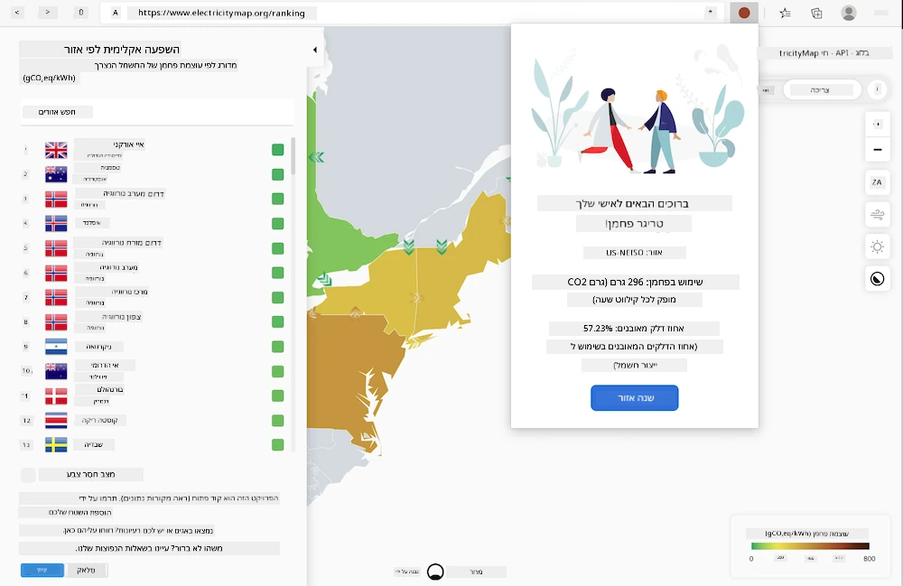
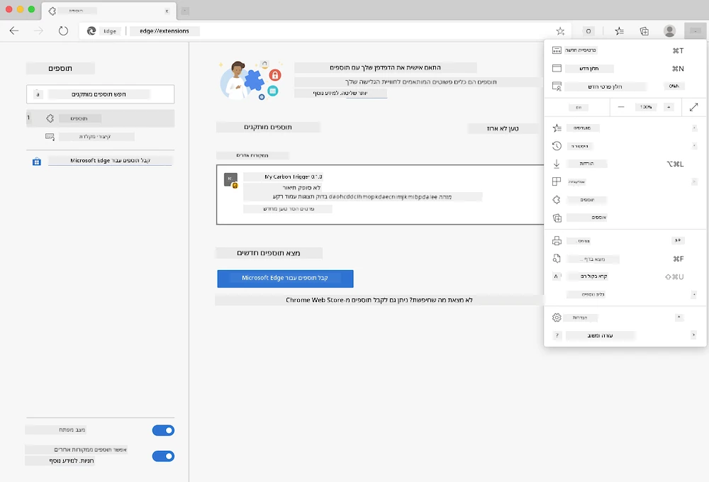

# Carbon Trigger: קוד להשלמת הרחבת דפדפן

באמצעות ה-API של CO2 Signal מבית tmrow למעקב אחר צריכת חשמל, צרו הרחבת דפדפן שתאפשר לכם לקבל תזכורת ישירות בדפדפן על צריכת החשמל באזורכם. השימוש בהרחבה זו יעזור לכם לקבל החלטות מושכלות לגבי הפעילויות שלכם בהתבסס על מידע זה.



## התחלה

תצטרכו להתקין [npm](https://npmjs.com). הורידו עותק של הקוד הזה לתיקייה במחשב שלכם.

התקינו את כל החבילות הנדרשות:

```
npm install
```

בנו את ההרחבה באמצעות webpack:

```
npm run build
```

כדי להתקין ב-Edge, השתמשו בתפריט 'שלוש נקודות' בפינה הימנית העליונה של הדפדפן כדי למצוא את לוח ההרחבות. משם, בחרו 'טען הרחבה לא מכווצת' כדי לטעון הרחבה חדשה. פתחו את תיקיית 'dist' כאשר תתבקשו, וההרחבה תיטען. כדי להשתמש בה, תצטרכו מפתח API ל-API של CO2 Signal ([קבלו אחד כאן באמצעות אימייל](https://www.co2signal.com/) - הכניסו את כתובת האימייל שלכם בתיבה בעמוד זה) ואת [קוד האזור שלכם](http://api.electricitymap.org/v3/zones) התואם ל[מפת החשמל](https://www.electricitymap.org/map) (לדוגמה, בבוסטון אני משתמש ב-'US-NEISO').



לאחר שהזנתם את מפתח ה-API ואת האזור בממשק ההרחבה, הנקודה הצבעונית בסרגל ההרחבות של הדפדפן אמורה להשתנות כדי לשקף את צריכת האנרגיה באזורכם ולספק לכם אינדיקציה לגבי פעילויות עתירות אנרגיה שיהיה מתאים לבצע. הרעיון מאחורי מערכת ה'נקודות' הזו נלקח מה-[הרחבת Energy Lollipop](https://energylollipop.com/) עבור פליטות קליפורניה.

---

**כתב ויתור**:  
מסמך זה תורגם באמצעות שירות תרגום מבוסס בינה מלאכותית [Co-op Translator](https://github.com/Azure/co-op-translator). בעוד שאנו שואפים לדיוק, יש להיות מודעים לכך שתרגומים אוטומטיים עשויים להכיל שגיאות או אי דיוקים. המסמך המקורי בשפתו המקורית צריך להיחשב כמקור סמכותי. עבור מידע קריטי, מומלץ להשתמש בתרגום מקצועי על ידי אדם. איננו נושאים באחריות לאי הבנות או לפרשנויות שגויות הנובעות משימוש בתרגום זה.