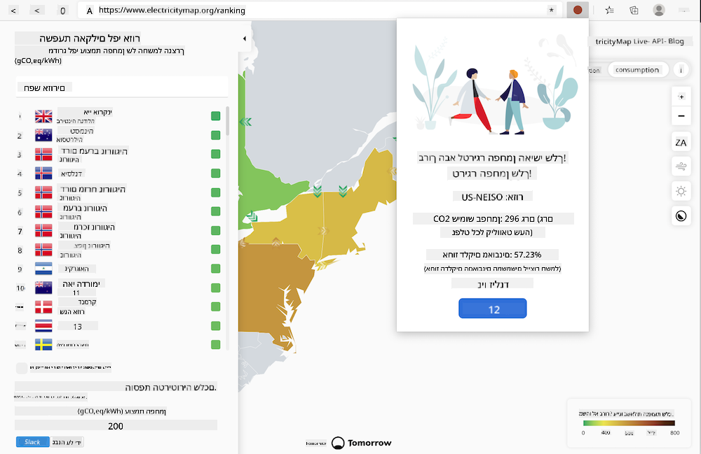
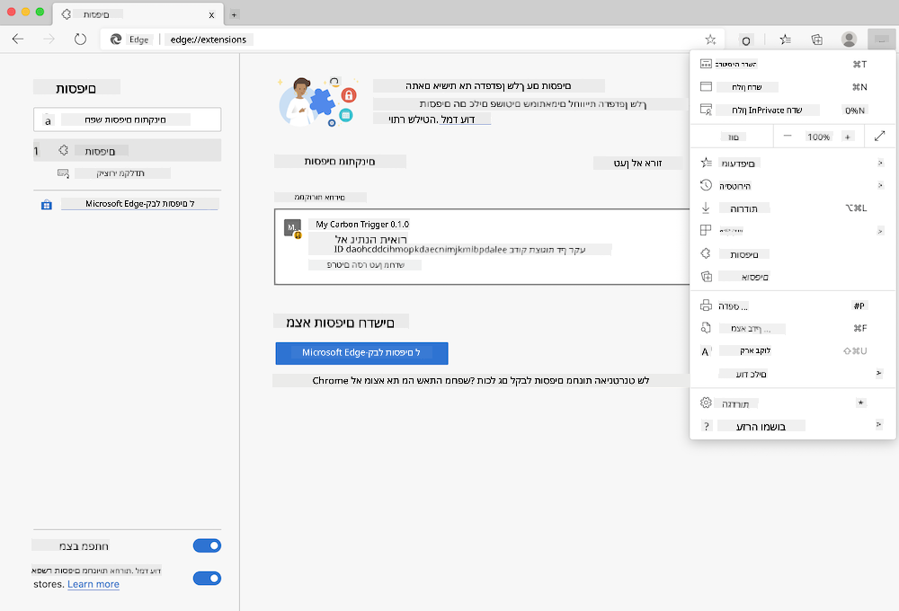

<!--
CO_OP_TRANSLATOR_METADATA:
{
  "original_hash": "9a6b22a2eff0f499b66236be973b24ad",
  "translation_date": "2025-08-27T20:54:07+00:00",
  "source_file": "5-browser-extension/solution/translation/README.it.md",
  "language_code": "he"
}
-->
# Carbon Trigger: קוד להתחלת עבודה

נשתמש ב-API של Signal CO2 מבית tmrow כדי לעקוב אחר צריכת החשמל וליצור תוסף לדפדפן, כך שנוכל לקבל תזכורת ישירות בדפדפן על כמה כבדה צריכת החשמל באזור שלנו. השימוש בתוסף הזה יעזור להעריך את הפעילויות שלנו בהתבסס על המידע הזה.



## איך להתחיל

יש לוודא ש-[npm](https://npmjs.com) מותקן. להוריד עותק של הקוד הזה לתיקייה במחשב שלכם.

להתקין את כל החבילות הנדרשות:

```
npm install
```

ליצור את התוסף באמצעות webpack:

```
npm run build
```

להתקנה ב-Edge, יש להשתמש בתפריט "שלוש נקודות" בפינה הימנית העליונה של הדפדפן כדי למצוא את לוח הבקרה של תוספים. אם מצב מפתחים לא פעיל, יש להפעיל אותו (בפינה השמאלית התחתונה). לבחור "טען ללא דחיסה" כדי לטעון תוסף חדש. לפתוח את תיקיית "dist" בהנחיה, והתוסף ייטען. כדי להשתמש בו, תצטרכו מפתח API ל-API של CO2 Signal (ניתן [לקבל אותו כאן דרך אימייל](https://www.co2signal.com/) - הכניסו את כתובת האימייל שלכם בתיבה בעמוד הזה) ואת [קוד האזור שלכם](http://api.electricitymap.org/v3/zones) התואם ל-[מפת החשמל](https://www.electricitymap.org/map) (לדוגמה, בבוסטון, "US-NEISO").



לאחר שמפתח ה-API והאזור הוזנו בממשק התוסף, הנקודה הצבעונית בסרגל התוסף בדפדפן אמורה להשתנות כדי לשקף את צריכת האנרגיה באזור ולספק רמז אילו פעילויות עתירות אנרגיה יהיו מתאימות לביצוע. הרעיון מאחורי מערכת ה"נקודות" הזו נלקח מה-[תוסף Energy Lollipop](https://energylollipop.com/) עבור פליטות בקליפורניה.

---

**כתב ויתור**:  
מסמך זה תורגם באמצעות שירות תרגום מבוסס בינה מלאכותית [Co-op Translator](https://github.com/Azure/co-op-translator). למרות שאנו שואפים לדיוק, יש לקחת בחשבון שתרגומים אוטומטיים עשויים להכיל שגיאות או אי דיוקים. המסמך המקורי בשפתו המקורית צריך להיחשב כמקור הסמכותי. עבור מידע קריטי, מומלץ להשתמש בתרגום מקצועי על ידי אדם. איננו נושאים באחריות לאי הבנות או לפרשנויות שגויות הנובעות משימוש בתרגום זה.