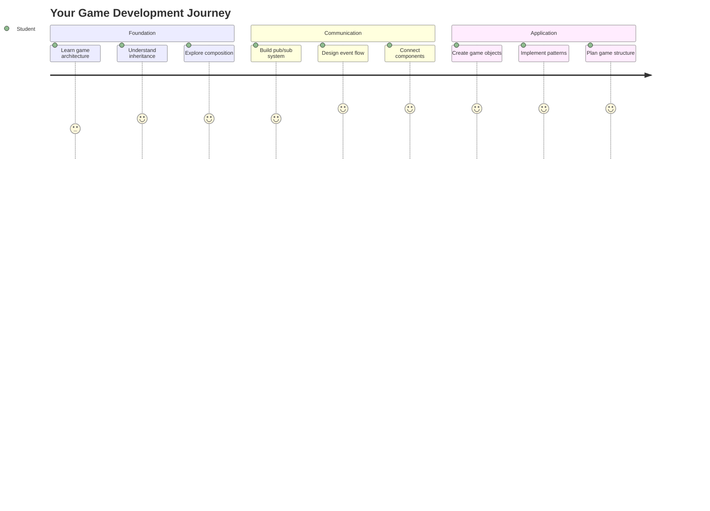
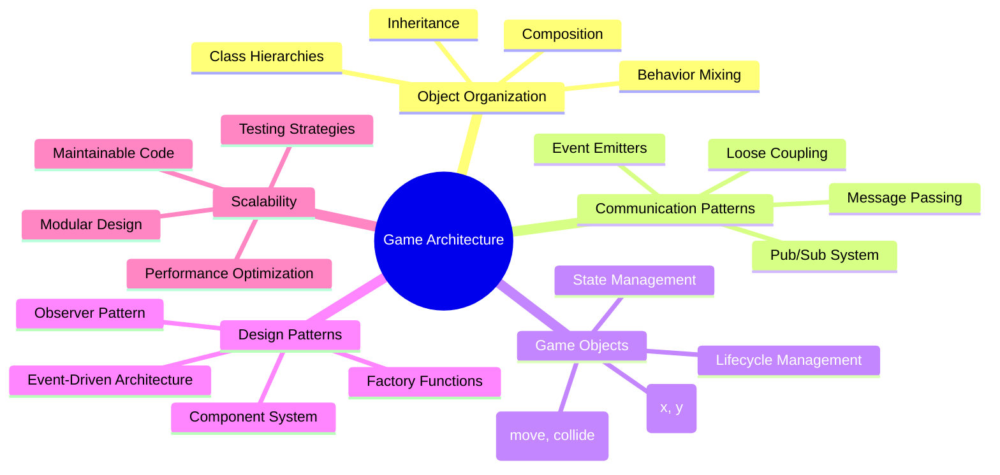
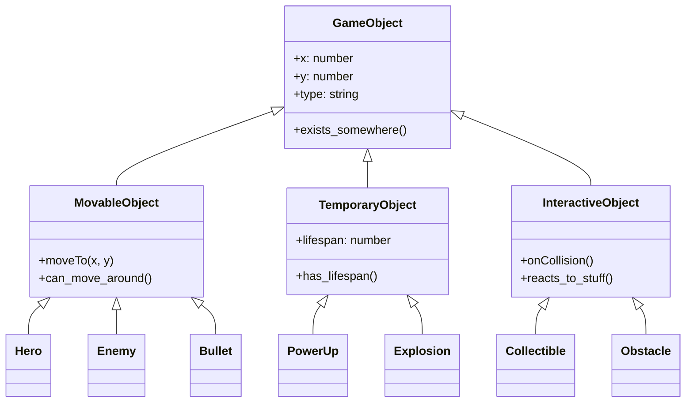
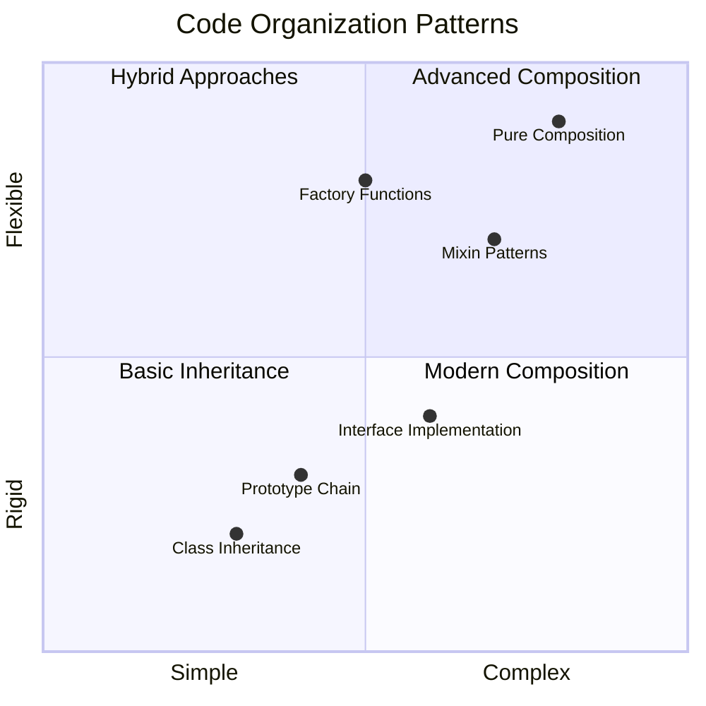
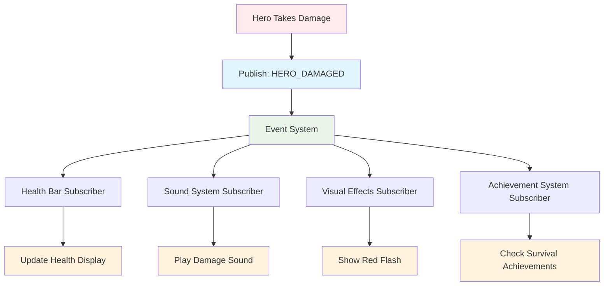
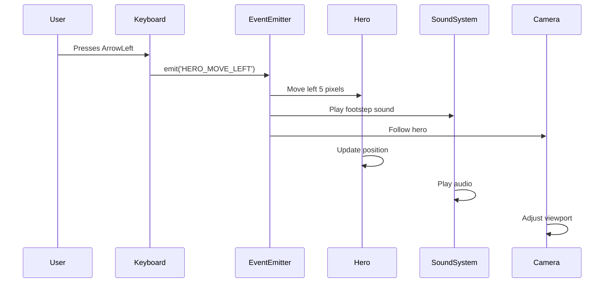
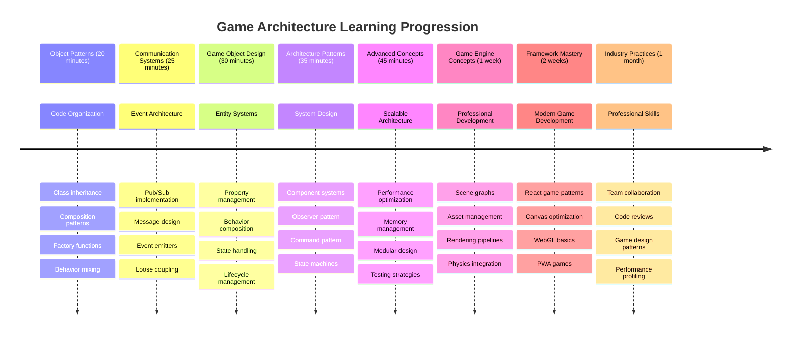

<!--
CO_OP_TRANSLATOR_METADATA:
{
  "original_hash": "a6332a7bb4d0be3bfd24199c83993777",
  "translation_date": "2025-11-04T02:39:06+00:00",
  "source_file": "6-space-game/1-introduction/README.md",
  "language_code": "he"
}
-->
# בניית משחק חלל חלק 1: מבוא




כמו שמרכז הבקרה של נאס"א מתאם מערכות רבות במהלך שיגור חללית, אנחנו הולכים לבנות משחק חלל שמדגים איך חלקים שונים בתוכנית יכולים לעבוד יחד בצורה חלקה. תוך כדי יצירת משהו שתוכלו לשחק בו, תלמדו מושגים תכנותיים חיוניים שתקפים לכל פרויקט תוכנה.

נחקור שתי גישות בסיסיות לארגון קוד: ירושה והרכבה. אלו אינם רק מושגים אקדמיים – אלו דפוסים שמניעים הכל, ממשחקי וידאו ועד מערכות בנקאיות. בנוסף, ניישם מערכת תקשורת בשם pub/sub שפועלת כמו רשתות תקשורת בחלליות, ומאפשרת לרכיבים שונים לשתף מידע מבלי ליצור תלות.

בסוף הסדרה, תבינו איך לבנות יישומים שיכולים להתפתח ולהתרחב – בין אם אתם מפתחים משחקים, יישומי אינטרנט או כל מערכת תוכנה אחרת.



## שאלון לפני ההרצאה

[שאלון לפני ההרצאה](https://ff-quizzes.netlify.app/web/quiz/29)

## ירושה והרכבה בפיתוח משחקים

כשהפרויקטים גדלים במורכבותם, ארגון הקוד הופך לקריטי. מה שמתחיל כסקריפט פשוט יכול להפוך לקשה לתחזוקה ללא מבנה מתאים – בדיוק כמו שהמשימות של אפולו דרשו תיאום מדויק בין אלפי רכיבים.

נחקור שתי גישות בסיסיות לארגון קוד: ירושה והרכבה. לכל אחת יש יתרונות ייחודיים, והבנת שתיהן עוזרת לבחור את הגישה הנכונה למצבים שונים. נדגים את המושגים הללו דרך משחק החלל שלנו, שבו גיבורים, אויבים, חיזוקים ורכיבים אחרים חייבים לתקשר ביעילות.

✅ אחד הספרים המפורסמים ביותר על תכנות עוסק ב-[דפוסי עיצוב](https://en.wikipedia.org/wiki/Design_Patterns).

בכל משחק, יש לכם `game objects` – האלמנטים האינטראקטיביים שמאכלסים את עולם המשחק שלכם. גיבורים, אויבים, חיזוקים ואפקטים חזותיים הם כולם אובייקטים במשחק. כל אחד מהם קיים בקואורדינטות מסוימות על המסך באמצעות ערכי `x` ו-`y`, בדומה לשרטוט נקודות על מערכת צירים.

למרות ההבדלים החזותיים שלהם, אובייקטים אלו חולקים לעיתים קרובות התנהגויות בסיסיות:

- **הם קיימים איפשהו** – לכל אובייקט יש קואורדינטות x ו-y כדי שהמשחק ידע היכן לצייר אותו
- **רבים יכולים לנוע** – גיבורים רצים, אויבים רודפים, כדורים עפים על פני המסך
- **יש להם אורך חיים** – חלקם נשארים לנצח, אחרים (כמו פיצוצים) מופיעים לזמן קצר ונעלמים
- **הם מגיבים לדברים** – כשדברים מתנגשים, חיזוקים נאספים, מדדי חיים מתעדכנים

✅ חשבו על משחק כמו פאק-מן. האם תוכלו לזהות את ארבעת סוגי האובייקטים המפורטים לעיל במשחק הזה?



### ביטוי התנהגות דרך קוד

עכשיו כשאתם מבינים את ההתנהגויות המשותפות לאובייקטים במשחק, בואו נחקור איך ליישם את ההתנהגויות הללו ב-JavaScript. ניתן לבטא התנהגות אובייקט דרך מתודות שמצורפות או למחלקות או לאובייקטים בודדים, ויש כמה גישות לבחירה.

**הגישה מבוססת המחלקות**

מחלקות וירושה מספקות גישה מובנית לארגון אובייקטים במשחק. כמו מערכת הסיווג הטקסונומית שפותחה על ידי קרל לינאוס, מתחילים עם מחלקת בסיס שמכילה תכונות משותפות, ואז יוצרים מחלקות מיוחדות שיורשות את היסודות הללו תוך הוספת יכולות ספציפיות.

✅ ירושה היא מושג חשוב להבנה. למדו עוד ב-[מאמר של MDN על ירושה](https://developer.mozilla.org/docs/Web/JavaScript/Inheritance_and_the_prototype_chain).

כך ניתן ליישם אובייקטים במשחק באמצעות מחלקות וירושה:

```javascript
// Step 1: Create the base GameObject class
class GameObject {
  constructor(x, y, type) {
    this.x = x;
    this.y = y;
    this.type = type;
  }
}
```

**בואו נפרק את זה שלב אחר שלב:**
- אנחנו יוצרים תבנית בסיסית שכל אובייקט במשחק יכול להשתמש בה
- הבנאי שומר היכן נמצא האובייקט (`x`, `y`) ומה סוגו
- זה הופך לבסיס שעליו כל האובייקטים במשחק יבנו

```javascript
// Step 2: Add movement capability through inheritance
class Movable extends GameObject {
  constructor(x, y, type) {
    super(x, y, type); // Call parent constructor
  }

  // Add the ability to move to a new position
  moveTo(x, y) {
    this.x = x;
    this.y = y;
  }
}
```

**במקרה זה, עשינו:**
- **הרחבנו** את מחלקת GameObject כדי להוסיף פונקציונליות תנועה
- **קראנו** לבנאי ההורה באמצעות `super()` כדי לאתחל תכונות שהורשו
- **הוספנו** מתודת `moveTo()` שמעדכנת את מיקום האובייקט

```javascript
// Step 3: Create specific game object types
class Hero extends Movable {
  constructor(x, y) {
    super(x, y, 'Hero'); // Set type automatically
  }
}

class Tree extends GameObject {
  constructor(x, y) {
    super(x, y, 'Tree'); // Trees don't need movement
  }
}

// Step 4: Use your game objects
const hero = new Hero(0, 0);
hero.moveTo(5, 5); // Hero can move!

const tree = new Tree(10, 15);
// tree.moveTo() would cause an error - trees can't move
```

**הבנת המושגים הללו:**
- **יוצרת** סוגי אובייקטים מיוחדים שיורשים התנהגויות מתאימות
- **מדגימה** איך ירושה מאפשרת הכללת תכונות סלקטיבית
- **מראה** שגיבורים יכולים לנוע בעוד עצים נשארים במקום
- **ממחישה** איך היררכיית המחלקות מונעת פעולות לא מתאימות

✅ הקדישו כמה דקות לדמיין מחדש גיבור פאק-מן (אינקי, פינקי או בלינקי, למשל) ואיך הוא היה נכתב ב-JavaScript.

**הגישה ההרכבתית**

הרכבה עוקבת אחר פילוסופיית עיצוב מודולרית, בדומה לאופן שבו מהנדסים מעצבים חלליות עם רכיבים ניתנים להחלפה. במקום לרשת ממחלקת הורה, משלבים התנהגויות ספציפיות כדי ליצור אובייקטים עם בדיוק הפונקציונליות שהם צריכים. גישה זו מציעה גמישות ללא מגבלות היררכיות נוקשות.

```javascript
// Step 1: Create base behavior objects
const gameObject = {
  x: 0,
  y: 0,
  type: ''
};

const movable = {
  moveTo(x, y) {
    this.x = x;
    this.y = y;
  }
};
```

**הנה מה שהקוד הזה עושה:**
- **מגדיר** אובייקט בסיסי `gameObject` עם תכונות מיקום וסוג
- **יוצר** אובייקט התנהגות נפרד `movable` עם פונקציונליות תנועה
- **מפריד** בין נתוני מיקום ללוגיקת תנועה

```javascript
// Step 2: Compose objects by combining behaviors
const movableObject = { ...gameObject, ...movable };

// Step 3: Create factory functions for different object types
function createHero(x, y) {
  return {
    ...movableObject,
    x,
    y,
    type: 'Hero'
  };
}

function createStatic(x, y, type) {
  return {
    ...gameObject,
    x,
    y,
    type
  };
}
```

**במקרה זה, עשינו:**
- **שילבנו** תכונות אובייקט בסיסיות עם התנהגות תנועה באמצעות תחביר spread
- **יצרנו** פונקציות מפעל שמחזירות אובייקטים מותאמים אישית
- **אפשרנו** יצירת אובייקטים גמישה ללא היררכיות מחלקתיות נוקשות
- **אפשרנו** לאובייקטים לקבל בדיוק את ההתנהגויות שהם צריכים

```javascript
// Step 4: Create and use your composed objects
const hero = createHero(10, 10);
hero.moveTo(5, 5); // Works perfectly!

const tree = createStatic(0, 0, 'Tree');
// tree.moveTo() is undefined - no movement behavior was composed
```

**נקודות מפתח לזכור:**
- **מרכיבים** אובייקטים על ידי שילוב התנהגויות במקום לרשת אותן
- **מספקים** יותר גמישות מאשר היררכיות ירושה נוקשות
- **מאפשרים** לאובייקטים לקבל בדיוק את התכונות שהם צריכים
- **משתמשים** בתחביר spread מודרני של JavaScript לשילוב אובייקטים נקי
```

**Which Pattern Should You Choose?**

**Which Pattern Should You Choose?**



> 💡 **טיפ מקצועי**: לשני הדפוסים יש מקום בפיתוח JavaScript מודרני. מחלקות עובדות היטב עבור היררכיות מוגדרות בבירור, בעוד שהרכבה מצטיינת כשצריך גמישות מרבית.
> 
**מתי להשתמש בכל גישה:**
- **בחרו** בירושה כשיש לכם קשרי "הוא-סוג-של" ברורים (גיבור *הוא-סוג-של* אובייקט נייד)
- **בחרו** בהרכבה כשצריך קשרי "יש-לו" (לגיבור *יש* יכולות תנועה)
- **שקלו** את העדפות הצוות ודרישות הפרויקט
- **זכרו** שניתן לשלב את שתי הגישות באותו יישום

### 🔄 **בדיקה פדגוגית**
**הבנת ארגון אובייקטים**: לפני המעבר לדפוסי תקשורת, ודאו שאתם יכולים:
- ✅ להסביר את ההבדל בין ירושה להרכבה
- ✅ לזהות מתי להשתמש במחלקות לעומת פונקציות מפעל
- ✅ להבין איך מילת המפתח `super()` פועלת בירושה
- ✅ לזהות את היתרונות של כל גישה לפיתוח משחקים

**מבחן עצמי מהיר**: איך הייתם יוצרים אויב מעופף שיכול גם לנוע וגם לעוף?
- **גישה של ירושה**: `class FlyingEnemy extends Movable`
- **גישה של הרכבה**: `{ ...movable, ...flyable, ...gameObject }`

**חיבור לעולם האמיתי**: דפוסים אלו מופיעים בכל מקום:
- **רכיבי React**: Props (הרכבה) לעומת ירושה מחלקתית
- **מנועי משחק**: מערכות רכיב-ישות משתמשות בהרכבה
- **אפליקציות מובייל**: מסגרות UI משתמשות לעיתים קרובות בהיררכיות ירושה

## דפוסי תקשורת: מערכת Pub/Sub

כשהיישומים גדלים במורכבותם, ניהול התקשורת בין רכיבים הופך לאתגר. דפוס publish-subscribe (pub/sub) פותר את הבעיה הזו באמצעות עקרונות דומים לשידור רדיו – משדר אחד יכול להגיע למספר מקלטים מבלי לדעת מי מאזין.

חשבו מה קורה כשגיבור נפגע: מד החיים מתעדכן, אפקטים קוליים מופעלים, משוב חזותי מופיע. במקום לקשר את אובייקט הגיבור ישירות למערכות אלו, pub/sub מאפשר לגיבור לשדר הודעת "נגרם נזק". כל מערכת שצריכה להגיב יכולה להירשם לסוג ההודעה הזה ולהגיב בהתאם.

✅ **Pub/Sub** מייצג 'publish-subscribe'



### הבנת ארכיטקטורת Pub/Sub

דפוס pub/sub שומר על חלקים שונים ביישום שלכם מנותקים זה מזה, כלומר הם יכולים לעבוד יחד מבלי להיות תלויים ישירות זה בזה. הפרדה זו הופכת את הקוד שלכם ליותר ניתן לתחזוקה, לבדיקה ולשינויים.

**השחקנים המרכזיים ב-pub/sub:**
- **הודעות** – תוויות טקסט פשוטות כמו `'PLAYER_SCORED'` שמתארות מה קרה (בתוספת מידע נוסף)
- **משדרים** – האובייקטים שצועקים "קרה משהו!" לכל מי שמאזין
- **מנויים** – האובייקטים שאומרים "אכפת לי מהאירוע הזה" ומגיבים כשהוא קורה
- **מערכת אירועים** – המתווך שמוודא שההודעות מגיעות למאזינים הנכונים

### בניית מערכת אירועים

בואו ניצור מערכת אירועים פשוטה אך חזקה שמדגימה את המושגים הללו:

```javascript
// Step 1: Create the EventEmitter class
class EventEmitter {
  constructor() {
    this.listeners = {}; // Store all event listeners
  }
  
  // Register a listener for a specific message type
  on(message, listener) {
    if (!this.listeners[message]) {
      this.listeners[message] = [];
    }
    this.listeners[message].push(listener);
  }
  
  // Send a message to all registered listeners
  emit(message, payload = null) {
    if (this.listeners[message]) {
      this.listeners[message].forEach(listener => {
        listener(message, payload);
      });
    }
  }
}
```

**פירוק מה שקורה כאן:**
- **יוצר** מערכת ניהול אירועים מרכזית באמצעות מחלקה פשוטה
- **שומר** מאזינים באובייקט שמאורגן לפי סוג הודעה
- **רושם** מאזינים חדשים באמצעות מתודת `on()`
- **משדר** הודעות לכל המאזינים המתעניינים באמצעות `emit()`
- **תומך** במטעני נתונים אופציונליים להעברת מידע רלוונטי

### חיבור הכל יחד: דוגמה מעשית

טוב, בואו נראה את זה בפעולה! נבנה מערכת תנועה פשוטה שמראה כמה pub/sub יכול להיות נקי וגמיש:

```javascript
// Step 1: Define your message types
const Messages = {
  HERO_MOVE_LEFT: 'HERO_MOVE_LEFT',
  HERO_MOVE_RIGHT: 'HERO_MOVE_RIGHT',
  ENEMY_SPOTTED: 'ENEMY_SPOTTED'
};

// Step 2: Create your event system and game objects
const eventEmitter = new EventEmitter();
const hero = createHero(0, 0);
```

**הנה מה שהקוד הזה עושה:**
- **מגדיר** אובייקט קבועים כדי למנוע שגיאות בשמות הודעות
- **יוצר** מופע של משדר אירועים לניהול כל התקשורת
- **מאתחל** אובייקט גיבור במיקום ההתחלתי

```javascript
// Step 3: Set up event listeners (subscribers)
eventEmitter.on(Messages.HERO_MOVE_LEFT, () => {
  hero.moveTo(hero.x - 5, hero.y);
  console.log(`Hero moved to position: ${hero.x}, ${hero.y}`);
});

eventEmitter.on(Messages.HERO_MOVE_RIGHT, () => {
  hero.moveTo(hero.x + 5, hero.y);
  console.log(`Hero moved to position: ${hero.x}, ${hero.y}`);
});
```

**במקרה זה, עשינו:**
- **רשמנו** מאזיני אירועים שמגיבים להודעות תנועה
- **עדכנו** את מיקום הגיבור בהתאם לכיוון התנועה
- **הוספנו** רישום לקונסולה כדי לעקוב אחר שינויי מיקום הגיבור
- **הפרדנו** את לוגיקת התנועה מטיפול הקלט

```javascript
// Step 4: Connect keyboard input to events (publishers)
window.addEventListener('keydown', (event) => {
  switch(event.key) {
    case 'ArrowLeft':
      eventEmitter.emit(Messages.HERO_MOVE_LEFT);
      break;
    case 'ArrowRight':
      eventEmitter.emit(Messages.HERO_MOVE_RIGHT);
      break;
  }
});
```

**הבנת המושגים הללו:**
- **מחבר** קלט מקלדת לאירועי משחק מבלי ליצור תלות חזקה
- **מאפשר** למערכת הקלט לתקשר עם אובייקטים במשחק בעקיפין
- **מאפשר** למערכות רבות להגיב לאותם אירועי מקלדת
- **מקלה** על שינוי הקצאות מקשים או הוספת שיטות קלט חדשות



> 💡 **טיפ מקצועי**: היופי של הדפוס הזה הוא בגמישות! תוכלו להוסיף בקלות אפקטים קוליים, רעידות מסך או אפקטים חלקיקיים פשוט על ידי הוספת מאזיני אירועים נוספים – אין צורך לשנות את קוד הקלט או התנועה הקיים.
> 
**הנה למה תאהבו את הגישה הזו:**
- הוספת תכונות חדשות הופכת לקלה מאוד – פשוט הקשיבו לאירועים שמעניינים אתכם
- דברים רבים יכולים להגיב לאותו אירוע מבלי להפריע זה לזה
- בדיקות הופכות לפשוטות בהרבה כי כל חלק עובד באופן עצמאי
- כשמשהו נשבר, אתם יודעים בדיוק איפה לחפש

### למה Pub/Sub מתמודד היטב עם גדילה

דפוס pub/sub שומר על פשטות כשהיישומים גדלים במורכבותם. בין אם מדובר בניהול עשרות אויבים, עדכוני UI דינמיים או מערכות קול, הדפוס מתמודד עם הגדלת היקף מבלי לשנות את הארכיטקטורה. תכונות חדשות משתלבות במערכת האירועים הקיימת מבלי להשפיע על הפונקציונליות הקיימת.

> ⚠️ **טעות נפוצה**: אל תיצרו יותר מדי סוגי הודעות ספציפיים מוקדם מדי. התחילו עם קטגוריות רחבות ושפרו אותן ככל שצרכי המשחק שלכם מתבהרים.
> 
**הנחיות מומלצות לעקוב אחריהן:**
- **מקבצים** הודעות קשורות לקטגוריות לוגיות
- **משתמשים** בשמות תיאוריים שמבהירים מה קרה
- **שומרים** על מטעני הודעות פשוטים וממוקדים
- **מתעדים** את סוגי ההודעות לשיתוף פעולה בצוות

### 🔄 **בדיקה פדגוגית**
**הבנת ארכיטקטורה מונעת אירועים**: ודאו שאתם מבינים את המערכת המלאה:
- ✅ איך דפוס pub/sub מונע תלות חזקה בין רכיבים?
- ✅ למה קל יותר להוסיף תכונות חדשות עם ארכיטקטורה מונעת אירועים?
- ✅ מה תפקידו של EventEmitter בזרימת התקשורת?
- ✅ איך קבועי הודעות מונעים שגיאות ומשפרים את התחזוקה?

**אתגר עיצוב**: איך הייתם מתמודדים עם תרחישי המשחק הללו באמצעות pub/sub?
1. **אויב מת**: עדכון ניקוד, הפעלת צליל, יצירת חיזוק, הסרה מהמסך
2. **שלב הושלם**: עצירת מוזיקה, הצגת UI, שמירת התקדמות, טעינת השלב הבא
3. **חיזוק נאסף**: שיפור יכולות, עדכון UI, הפעלת אפקט, התחלת טיימר

**חיבור מקצועי**: דפוס זה מופיע ב:
- **מסגרות פרונטאנד**: מערכות אירועים של React/Vue
- **שירותי Backend**: תקשורת מיקרו-שירותים
- **מנועי משחק**: מערכת האירועים של Unity
- **פיתוח מובייל**: מערכות התראות של iOS/Android

---

## אתגר סוכן GitHub Copilot 🚀

השתמשו במצב סוכן כדי להשלים את האתגר הבא:

**תיאור:** צרו מערכת אובייקטים למשחק פשוט באמצעות גם ירושה וגם דפוס pub/sub. תיישמו משחק בסיסי שבו אובייקטים שונים יכולים לתקשר דרך אירועים מבלי לדעת ישירות זה על זה.

**הנחיה:** צרו מערכת משחק ב-JavaScript עם הדרישות הבאות: 1) צרו מחלקת בסיס GameObject עם קואורדינטות x, y ותכונת סוג. 2) צרו מחלקת Hero שמרחיבה את GameObject ויכולה לנוע. 3) צרו מחלקת Enemy שמרחיבה את GameObject ויכולה לרדוף אחרי הגיבור. 4) יישמו מחלקת EventEmitter לדפוס pub/sub. 5) הגדירו מאזיני אירועים כך שכאשר הגיבור נע, אויבים קרובים יקבלו אירוע 'HERO_MOV
שקול כיצד דפוס pub-sub יכול לשפר את ארכיטקטורת המשחק. זהה אילו רכיבים צריכים לשדר אירועים וכיצד המערכת צריכה להגיב. עצב רעיון למשחק ומפה את דפוסי התקשורת בין רכיביו.

## שאלון לאחר ההרצאה

[שאלון לאחר ההרצאה](https://ff-quizzes.netlify.app/web/quiz/30)

## סקירה ולימוד עצמי

למד עוד על Pub/Sub על ידי [קריאה בנושא](https://docs.microsoft.com/azure/architecture/patterns/publisher-subscriber/?WT.mc_id=academic-77807-sagibbon).

### ⚡ **מה ניתן לעשות בחמש הדקות הקרובות**
- [ ] פתח כל משחק HTML5 אונליין ובדוק את הקוד שלו באמצעות DevTools
- [ ] צור אלמנט HTML5 Canvas פשוט וצייר צורה בסיסית
- [ ] נסה להשתמש ב-`setInterval` כדי ליצור לולאת אנימציה פשוטה
- [ ] חקור את תיעוד Canvas API ונסה שיטת ציור

### 🎯 **מה ניתן להשיג בשעה הקרובה**
- [ ] השלם את שאלון לאחר השיעור והבין את מושגי פיתוח המשחקים
- [ ] הקם את מבנה פרויקט המשחק שלך עם קבצי HTML, CSS ו-JavaScript
- [ ] צור לולאת משחק בסיסית שמתעדכנת ומציירת באופן רציף
- [ ] צייר את הדמויות הראשונות שלך על הקנבס
- [ ] יישם טעינת נכסים בסיסית לתמונות וקולות

### 📅 **יצירת משחק לאורך שבוע**
- [ ] השלם את משחק החלל המלא עם כל התכונות המתוכננות
- [ ] הוסף גרפיקה מלוטשת, אפקטים קוליים ואנימציות חלקות
- [ ] יישם מצבי משחק (מסך התחלה, משחק, סיום משחק)
- [ ] צור מערכת ניקוד ומעקב אחר התקדמות השחקן
- [ ] הפוך את המשחק שלך לרספונסיבי ונגיש בכל המכשירים
- [ ] שתף את המשחק שלך אונליין ואסוף משוב משחקנים

### 🌟 **פיתוח משחקים לאורך חודש**
- [ ] בנה מספר משחקים שחוקרים ז'אנרים ומכניקות שונים
- [ ] למד מסגרת פיתוח משחקים כמו Phaser או Three.js
- [ ] תרום לפרויקטים פתוחים של פיתוח משחקים
- [ ] שלוט בדפוסי תכנות משחקים מתקדמים ואופטימיזציה
- [ ] צור תיק עבודות שמציג את כישורי פיתוח המשחקים שלך
- [ ] היה מנטור לאחרים שמתעניינים בפיתוח משחקים ומדיה אינטראקטיבית

## 🎯 ציר הזמן לשליטה בפיתוח משחקים



### 🛠️ סיכום ערכת הכלים לארכיטקטורת משחקים שלך

לאחר השלמת השיעור, יש לך:
- **שליטה בדפוסי עיצוב**: הבנה של יתרונות וחסרונות של ירושה מול קומפוזיציה
- **ארכיטקטורה מבוססת אירועים**: יישום pub/sub לתקשורת בקנה מידה גדול
- **עיצוב מונחה עצמים**: היררכיות מחלקות וקומפוזיציית התנהגות
- **JavaScript מודרני**: פונקציות מפעל, תחביר spread ודפוסי ES6+
- **ארכיטקטורה בקנה מידה גדול**: עקרונות עיצוב מודולריים ומבנה רופף
- **יסודות פיתוח משחקים**: מערכות ישויות ודפוסי רכיבים
- **דפוסים מקצועיים**: גישות סטנדרטיות בתעשייה לארגון קוד

**יישומים בעולם האמיתי**: דפוסים אלו מיושמים ישירות ב:
- **מסגרות פרונטאנד**: ארכיטקטורת רכיבים וניהול מצב ב-React/Vue
- **שירותי Backend**: תקשורת מיקרו-שירותים ומערכות מבוססות אירועים
- **פיתוח מובייל**: ארכיטקטורת אפליקציות iOS/Android ומערכות התראות
- **מנועי משחקים**: פיתוח משחקים מבוססי Unity, Unreal, ו-Web
- **תוכנה ארגונית**: תכנון מערכות מבוזרות ומקורות אירועים
- **עיצוב API**: שירותי RESTful ותקשורת בזמן אמת

**כישורים מקצועיים שנרכשו**: עכשיו אתה יכול:
- **לעצב** ארכיטקטורות תוכנה בקנה מידה גדול באמצעות דפוסים מוכחים
- **ליישם** מערכות מבוססות אירועים שמטפלות באינטראקציות מורכבות
- **לבחור** אסטרטגיות ארגון קוד מתאימות לתרחישים שונים
- **לפתור בעיות** ולתחזק מערכות רופפות בצורה יעילה
- **לתקשר** החלטות טכניות באמצעות טרמינולוגיה סטנדרטית בתעשייה

**הרמה הבאה**: אתה מוכן ליישם את הדפוסים הללו במשחק אמיתי, לחקור נושאים מתקדמים בפיתוח משחקים, או ליישם את מושגי הארכיטקטורה הללו באפליקציות ווב!

🌟 **הישג נפתח**: שלטת בדפוסי ארכיטקטורת תוכנה בסיסיים שמניעים הכל ממשחקים פשוטים ועד מערכות ארגוניות מורכבות!

## משימה

[עצב משחק](assignment.md)

---

**כתב ויתור**:  
מסמך זה תורגם באמצעות שירות תרגום AI [Co-op Translator](https://github.com/Azure/co-op-translator). למרות שאנו שואפים לדיוק, יש לקחת בחשבון שתרגומים אוטומטיים עשויים להכיל שגיאות או אי דיוקים. המסמך המקורי בשפתו המקורית צריך להיחשב כמקור סמכותי. עבור מידע קריטי, מומלץ להשתמש בתרגום מקצועי אנושי. איננו אחראים לאי הבנות או לפרשנויות שגויות הנובעות משימוש בתרגום זה.