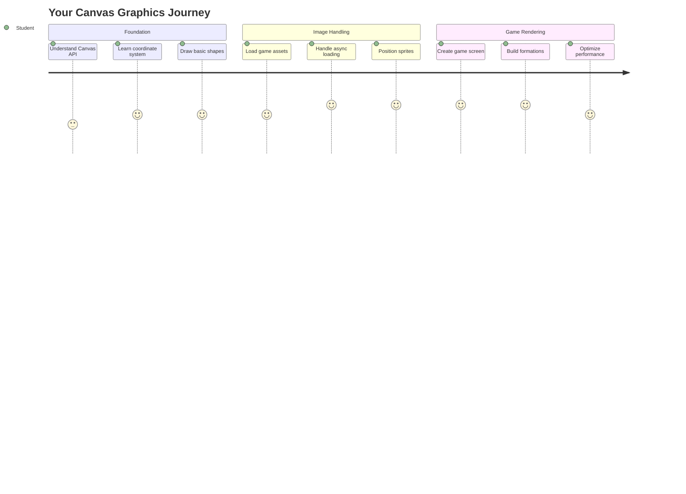
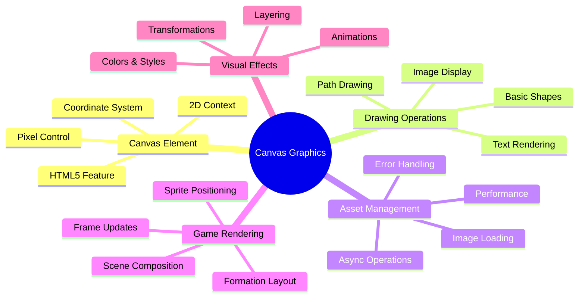
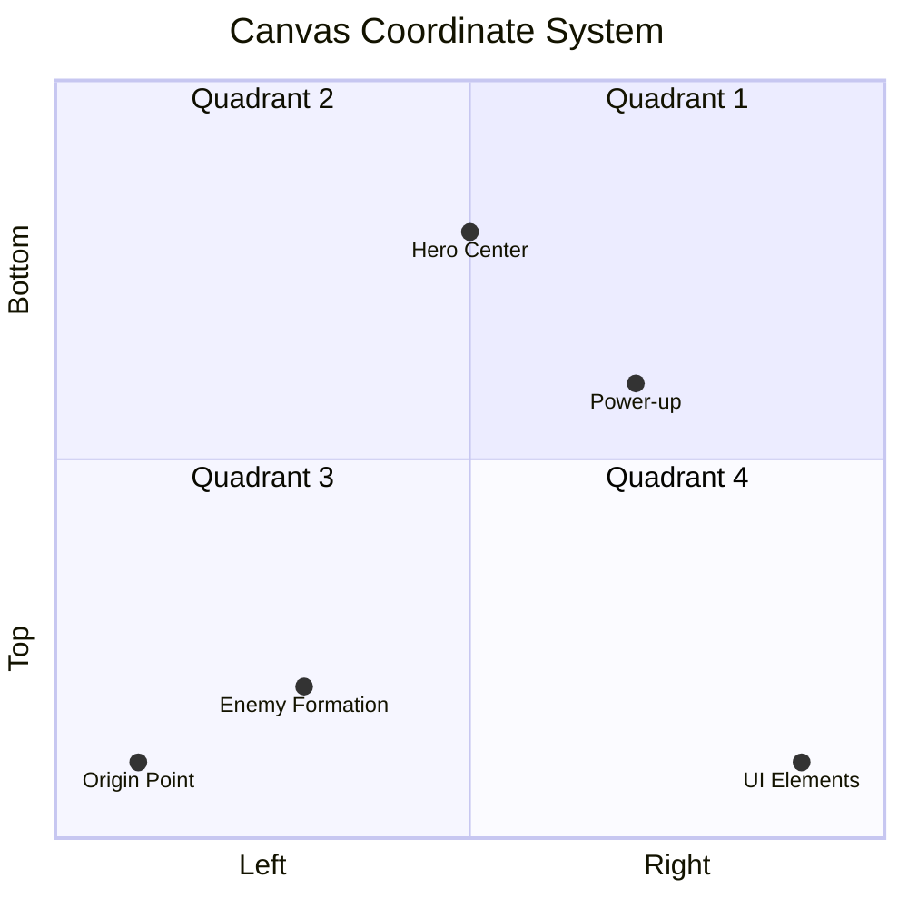
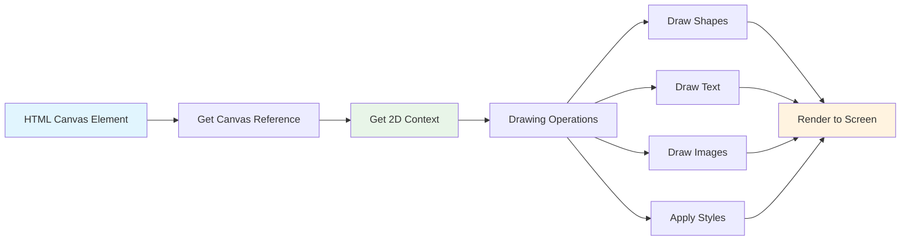
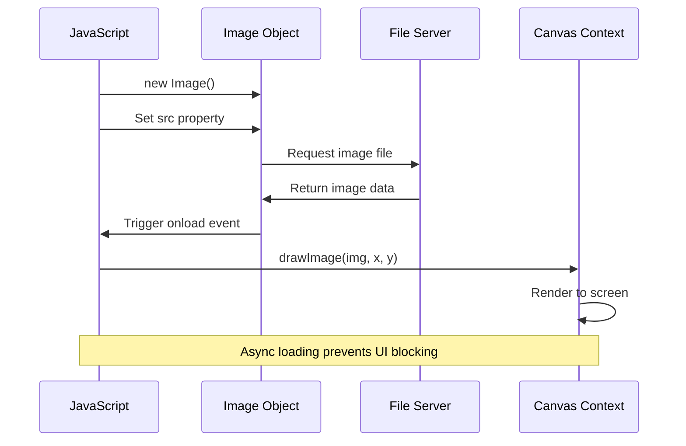
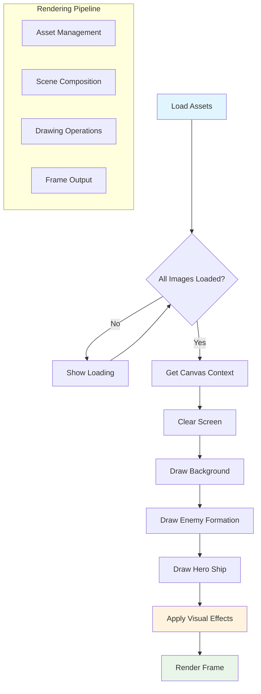
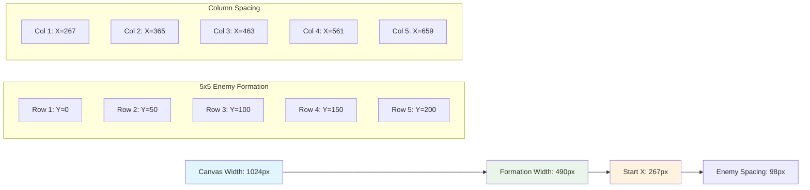
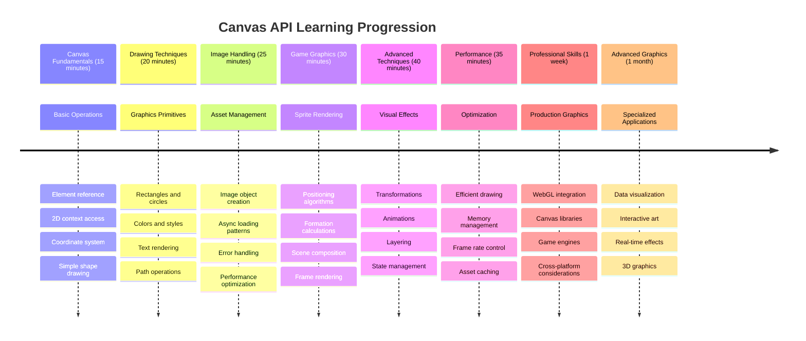

<!--
CO_OP_TRANSLATOR_METADATA:
{
  "original_hash": "7994743c5b21fdcceb36307916ef249a",
  "translation_date": "2025-11-04T02:36:49+00:00",
  "source_file": "6-space-game/2-drawing-to-canvas/README.md",
  "language_code": "he"
}
-->
# בנה משחק חלל חלק 2: ציור גיבור ומפלצות על הקנבס



API הקנבס הוא אחד הכלים החזקים ביותר בפיתוח אתרים ליצירת גרפיקה דינמית ואינטראקטיבית ישירות בדפדפן שלך. בשיעור הזה, נהפוך את אלמנט ה-HTML `<canvas>` הריק לעולם משחק מלא בגיבורים ומפלצות. חשבו על הקנבס כלוח האמנות הדיגיטלי שלכם שבו הקוד הופך לויזואלי.

אנחנו ממשיכים לבנות על מה שלמדתם בשיעור הקודם, ועכשיו נצלול להיבטים הוויזואליים. תלמדו איך לטעון ולהציג דמויות משחק, למקם אלמנטים בדיוק, וליצור את הבסיס הוויזואלי למשחק החלל שלכם. זה מגשר על הפער בין דפי אינטרנט סטטיים לחוויות דינמיות ואינטראקטיביות.

בסוף השיעור הזה, תהיה לכם סצנת משחק מלאה עם ספינת הגיבור שלכם ממוקמת נכון ותצורות אויב מוכנות לקרב. תבינו איך משחקים מודרניים מציגים גרפיקה בדפדפנים ותרכשו מיומנויות ליצירת חוויות ויזואליות אינטראקטיביות משלכם. בואו נחקור את גרפיקת הקנבס ונביא את משחק החלל שלכם לחיים!



## שאלון לפני השיעור

[שאלון לפני השיעור](https://ff-quizzes.netlify.app/web/quiz/31)

## הקנבס

אז מה בדיוק האלמנט `<canvas>` הזה? זו הפתרון של HTML5 ליצירת גרפיקה ואנימציות דינמיות בדפדפנים. בניגוד לתמונות או סרטונים רגילים שהם סטטיים, הקנבס נותן לכם שליטה ברמת הפיקסל על כל מה שמופיע על המסך. זה הופך אותו למושלם למשחקים, ויזואליזציות נתונים ואמנות אינטראקטיבית. חשבו עליו כמשטח ציור מתוכנת שבו JavaScript הופך למכחול שלכם.

בברירת מחדל, אלמנט הקנבס נראה כמו מלבן ריק ושקוף בדף שלכם. אבל כאן טמון הפוטנציאל! הכוח האמיתי שלו מתגלה כשאתם משתמשים ב-JavaScript כדי לצייר צורות, לטעון תמונות, ליצור אנימציות ולגרום לדברים להגיב לאינטראקציות משתמש. זה דומה לאופן שבו חלוצי גרפיקה ממוחשבת ב-Bell Labs בשנות ה-60 היו צריכים לתכנת כל פיקסל כדי ליצור את האנימציות הדיגיטליות הראשונות.

✅ קראו [עוד על API הקנבס](https://developer.mozilla.org/docs/Web/API/Canvas_API) ב-MDN.

כך בדרך כלל מצהירים עליו כחלק מגוף הדף:

```html
<canvas id="myCanvas" width="200" height="100"></canvas>
```

**מה הקוד הזה עושה:**
- **מגדיר** את מאפיין `id` כך שתוכלו להתייחס לאלמנט הקנבס הספציפי הזה ב-JavaScript
- **קובע** את הרוחב בפיקסלים כדי לשלוט בגודל האופקי של הקנבס
- **מגדיר** את הגובה בפיקסלים כדי לקבוע את הממדים האנכיים של הקנבס

## ציור גיאומטריה פשוטה

עכשיו כשאתם יודעים מהו אלמנט הקנבס, בואו נחקור איך לצייר עליו בפועל! הקנבס משתמש במערכת קואורדינטות שעשויה להרגיש מוכרת משיעורי מתמטיקה, אבל יש טוויסט חשוב ספציפי לגרפיקה ממוחשבת.

הקנבס משתמש בקואורדינטות קרטזיות עם ציר x (אופקי) וציר y (אנכי) כדי למקם כל מה שאתם מציירים. אבל הנה ההבדל המרכזי: בניגוד למערכת הקואורדינטות משיעורי מתמטיקה, נקודת המקור `(0,0)` מתחילה בפינה השמאלית העליונה, כאשר ערכי x גדלים כשאתם זזים ימינה וערכי y גדלים כשאתם זזים למטה. גישה זו נובעת מתצוגות מחשב מוקדמות שבהן קרני אלקטרונים סרקו מלמעלה למטה, מה שהפך את הפינה השמאלית העליונה לנקודת ההתחלה הטבעית.




> תמונה מ-[MDN](https://developer.mozilla.org/docs/Web/API/Canvas_API/Tutorial/Drawing_shapes)

כדי לצייר על אלמנט הקנבס, תעקבו אחר אותו תהליך בן שלושה שלבים שמרכיב את הבסיס לכל גרפיקת הקנבס. ברגע שתעשו זאת כמה פעמים, זה יהפוך לטבע שני:



1. **קבלו הפניה** לאלמנט הקנבס שלכם מה-DOM (בדיוק כמו כל אלמנט HTML אחר)
2. **קבלו את הקשר הרינדור הדו-ממדי** – זה מספק את כל שיטות הציור
3. **התחילו לצייר!** השתמשו בשיטות המובנות של הקשר כדי ליצור את הגרפיקה שלכם

כך זה נראה בקוד:

```javascript
// Step 1: Get the canvas element
const canvas = document.getElementById("myCanvas");

// Step 2: Get the 2D rendering context
const ctx = canvas.getContext("2d");

// Step 3: Set fill color and draw a rectangle
ctx.fillStyle = 'red';
ctx.fillRect(0, 0, 200, 200); // x, y, width, height
```

**בואו נפרק את זה שלב אחר שלב:**
- אנחנו **תופסים** את אלמנט הקנבס שלנו באמצעות ה-ID שלו ושומרים אותו במשתנה
- אנחנו **מקבלים** את הקשר הרינדור הדו-ממדי – זה ארגז הכלים שלנו מלא בשיטות ציור
- אנחנו **אומרים** לקנבס שאנחנו רוצים למלא דברים באדום באמצעות מאפיין `fillStyle`
- אנחנו **מציירים** מלבן שמתחיל בפינה השמאלית העליונה (0,0) ברוחב וגובה של 200 פיקסלים

✅ API הקנבס מתמקד בעיקר בצורות דו-ממדיות, אבל אתם יכולים גם לצייר אלמנטים תלת-ממדיים לאתר; לשם כך, תוכלו להשתמש ב-[WebGL API](https://developer.mozilla.org/docs/Web/API/WebGL_API).

אפשר לצייר כל מיני דברים עם API הקנבס כמו:

- **צורות גיאומטריות**, כבר הראינו איך לצייר מלבן, אבל יש הרבה יותר שאפשר לצייר.
- **טקסט**, אפשר לצייר טקסט עם כל גופן וצבע שתרצו.
- **תמונות**, אפשר לצייר תמונה על בסיס נכס תמונה כמו .jpg או .png למשל.

✅ נסו את זה! אתם יודעים איך לצייר מלבן, האם תוכלו לצייר עיגול על דף? תסתכלו על כמה ציורי קנבס מעניינים ב-CodePen. הנה [דוגמה מרשימה במיוחד](https://codepen.io/dissimulate/pen/KrAwx).

### 🔄 **בדיקה פדגוגית**
**הבנת יסודות הקנבס**: לפני המעבר לטעינת תמונות, ודאו שאתם יכולים:
- ✅ להסביר איך מערכת הקואורדינטות של הקנבס שונה מקואורדינטות מתמטיות
- ✅ להבין את תהליך שלושת השלבים לפעולות ציור בקנבס
- ✅ לזהות מה מספק הקשר הרינדור הדו-ממדי
- ✅ לתאר איך `fillStyle` ו-`fillRect` עובדים יחד

**מבחן עצמי מהיר**: איך הייתם מציירים עיגול כחול במיקום (100, 50) עם רדיוס 25?
```javascript
ctx.fillStyle = 'blue';
ctx.beginPath();
ctx.arc(100, 50, 25, 0, 2 * Math.PI);
ctx.fill();
```

**שיטות ציור בקנבס שאתם כבר מכירים**:
- **fillRect()**: מצייר מלבנים מלאים
- **fillStyle**: מגדיר צבעים ודפוסים
- **beginPath()**: מתחיל נתיבי ציור חדשים
- **arc()**: יוצר עיגולים ועקומות

## טעינה וציור של נכס תמונה

ציור צורות בסיסיות הוא שימושי להתחלה, אבל רוב המשחקים זקוקים לתמונות אמיתיות! דמויות, רקעים וטקסטורות הם אלו שמעניקים למשחקים את האטרקטיביות הוויזואלית שלהם. טעינה והצגת תמונות על הקנבס עובדת בצורה שונה מציור צורות גיאומטריות, אבל זה פשוט ברגע שמבינים את התהליך.

אנחנו צריכים ליצור אובייקט `Image`, לטעון את קובץ התמונה שלנו (זה קורה באופן אסינכרוני, כלומר "ברקע"), ואז לצייר אותו על הקנבס ברגע שהוא מוכן. גישה זו מבטיחה שהתמונות שלכם יוצגו כראוי מבלי לחסום את האפליקציה בזמן הטעינה.



### טעינת תמונה בסיסית

```javascript
const img = new Image();
img.src = 'path/to/my/image.png';
img.onload = () => {
  // Image loaded and ready to be used
  console.log('Image loaded successfully!');
};
```

**מה קורה בקוד הזה:**
- אנחנו **יוצרים** אובייקט תמונה חדש לחלוטין כדי להחזיק את הדמות או הטקסטורה שלנו
- אנחנו **אומרים** לו איזה קובץ תמונה לטעון על ידי הגדרת נתיב המקור
- אנחנו **מאזינים** לאירוע הטעינה כדי לדעת בדיוק מתי התמונה מוכנה לשימוש

### דרך טובה יותר לטעון תמונות

הנה דרך יותר מתקדמת לטפל בטעינת תמונות שבה מפתחים מקצועיים משתמשים בדרך כלל. נעטוף את לוגיקת טעינת התמונות בפונקציה מבוססת Promise – גישה זו, שהפכה פופולרית כאשר Promises הפכו לסטנדרט ב-ES6, הופכת את הקוד שלכם ליותר מאורגן ומטפלת בשגיאות בצורה אלגנטית:

```javascript
function loadAsset(path) {
  return new Promise((resolve, reject) => {
    const img = new Image();
    img.src = path;
    img.onload = () => {
      resolve(img);
    };
    img.onerror = () => {
      reject(new Error(`Failed to load image: ${path}`));
    };
  });
}

// Modern usage with async/await
async function initializeGame() {
  try {
    const heroImg = await loadAsset('hero.png');
    const monsterImg = await loadAsset('monster.png');
    // Images are now ready to use
  } catch (error) {
    console.error('Failed to load game assets:', error);
  }
}
```

**מה עשינו כאן:**
- **עטפנו** את כל לוגיקת טעינת התמונות ב-Promise כדי שנוכל לטפל בזה טוב יותר
- **הוספנו** טיפול בשגיאות שממש אומר לנו מתי משהו משתבש
- **השתמשנו** בתחביר async/await מודרני כי הוא הרבה יותר קריא
- **כללנו** בלוקים של try/catch כדי לטפל בצורה אלגנטית בכל תקלת טעינה

ברגע שהתמונות שלכם נטענות, ציורן על הקנבס הוא למעשה די פשוט:

```javascript
async function renderGameScreen() {
  try {
    // Load game assets
    const heroImg = await loadAsset('hero.png');
    const monsterImg = await loadAsset('monster.png');

    // Get canvas and context
    const canvas = document.getElementById("myCanvas");
    const ctx = canvas.getContext("2d");

    // Draw images to specific positions
    ctx.drawImage(heroImg, canvas.width / 2, canvas.height / 2);
    ctx.drawImage(monsterImg, 0, 0);
  } catch (error) {
    console.error('Failed to render game screen:', error);
  }
}
```

**בואו נעבור על זה שלב אחר שלב:**
- אנחנו **טוענים** את תמונות הגיבור והמפלצות שלנו ברקע באמצעות await
- אנחנו **תופסים** את אלמנט הקנבס שלנו ומקבלים את הקשר הרינדור הדו-ממדי שאנחנו צריכים
- אנחנו **ממקמים** את תמונת הגיבור ממש במרכז באמצעות קצת מתמטיקה מהירה של קואורדינטות
- אנחנו **מציבים** את תמונת המפלצת בפינה השמאלית העליונה כדי להתחיל את תצורת האויבים שלנו
- אנחנו **תופסים** כל שגיאה שעלולה לקרות במהלך הטעינה או הרינדור



## עכשיו הזמן להתחיל לבנות את המשחק שלכם

עכשיו נשלב הכל כדי ליצור את הבסיס הוויזואלי של משחק החלל שלכם. יש לכם הבנה מוצקה של יסודות הקנבס וטכניקות טעינת תמונות, אז החלק המעשי הזה ידריך אתכם בבניית מסך משחק מלא עם דמויות ממוקמות כראוי.

### מה לבנות

תבנו דף אינטרנט עם אלמנט קנבס. הוא צריך להציג מסך שחור בגודל `1024*768`. סיפקנו לכם שתי תמונות:

- ספינת גיבור

   

- 5*5 מפלצות

   

### צעדים מומלצים להתחלת הפיתוח

אתרו את קבצי ההתחלה שנוצרו עבורכם בתיקיית `your-work`. מבנה הפרויקט שלכם צריך להכיל:

```bash
your-work/
├── assets/
│   ├── enemyShip.png
│   └── player.png
├── index.html
├── app.js
└── package.json
```

**מה יש לכם לעבוד איתו:**
- **דמויות המשחק** נמצאות בתיקיית `assets/` כך שהכל נשאר מאורגן
- **קובץ ה-HTML הראשי שלכם** מכין את אלמנט הקנבס ומכין הכל
- **קובץ JavaScript** שבו תכתבו את כל קסם הרינדור של המשחק שלכם
- **קובץ package.json** שמגדיר שרת פיתוח כך שתוכלו לבדוק מקומית

פתחו את התיקייה הזו ב-Visual Studio Code כדי להתחיל בפיתוח. תצטרכו סביבת פיתוח מקומית עם Visual Studio Code, NPM ו-Node.js מותקנים. אם אין לכם `npm` מוגדר במחשב שלכם, [הנה איך להתקין אותו](https://www.npmjs.com/get-npm).

התחילו את שרת הפיתוח שלכם על ידי ניווט לתיקיית `your-work`:

```bash
cd your-work
npm start
```

**הפקודה הזו עושה כמה דברים די מגניבים:**
- **מפעילה** שרת מקומי ב-`http://localhost:5000` כך שתוכלו לבדוק את המשחק שלכם
- **מגישה** את כל הקבצים שלכם כראוי כך שהדפדפן שלכם יוכל לטעון אותם נכון
- **עוקבת** אחרי הקבצים שלכם לשינויים כך שתוכלו לפתח בצורה חלקה
- **מספקת לכם** סביבת פיתוח מקצועית לבדוק הכל

> 💡 **הערה**: הדפדפן שלכם יראה דף ריק בהתחלה – זה צפוי! ככל שתוסיפו קוד, רעננו את הדפדפן כדי לראות את השינויים שלכם. גישה זו לפיתוח איטרטיבי דומה לאופן שבו נאס"א בנתה את מחשב ההנחיה של אפולו – בדיקת כל רכיב לפני שילובו במערכת הגדולה יותר.

### הוסיפו קוד

הוסיפו את הקוד הנדרש ל-`your-work/app.js` כדי להשלים את המשימות הבאות:

1. **ציירו קנבס עם רקע שחור**
   > 💡 **איך עושים את זה**: מצאו את ה-TODO ב-`/app.js` והוסיפו רק שתי שורות. הגדירו `ctx.fillStyle` לשחור, ואז השתמשו ב-`ctx.fillRect()` שמתחיל ב-(0,0) עם ממדי הקנבס שלכם. קל!

2. **טענו טקסטורות משחק**
   > 💡 **איך עושים את זה**: השתמשו ב-`await loadAsset()` כדי לטעון את תמונות השחקן והאויב שלכם. שמרו אותן במשתנים כך שתוכלו להשתמש בהן מאוחר יותר. זכרו – הן לא יופיעו עד שתציירו אותן בפועל!

3. **ציירו את ספינת הגיבור במיקום המרכז-תחתון**
   > 💡 **איך עושים את זה**: השתמשו ב-`ctx.drawImage()` כדי למקם את הגיבור. עבור קואורדינטת x, נסו `canvas.width / 2 - 45` כדי למרכז אותה, ועבור קואורדינטת y השתמשו ב-`canvas.height - canvas.height / 4` כדי למקם אותה באזור התחתון.

4. **ציירו תצורה של 5×5 ספינות אויב**
   > 💡 **איך עושים את זה**: מצאו את הפונקציה `createEnemies` והגדירו לולאה מקוננת. תצטרכו לעשות קצת מתמטיקה עבור מרווחים ומיקומים, אבל אל תדאגו – אני אראה לכם בדיוק איך!

ראשית, הגדירו קבועים לפריסת תצורת האויבים הנכונה:

```javascript
const ENEMY_TOTAL = 5;
const ENEMY_SPACING = 98;
const FORMATION_WIDTH = ENEMY_TOTAL * ENEMY_SPACING;
const START_X = (canvas.width - FORMATION_WIDTH) / 2;
const STOP_X = START_X + FORMATION_WIDTH;
```

**בואו נפרק מה הקבועים האלה עושים:**
- אנחנו **מגדירים** 5 אויבים לכל שורה ועמודה (רשת יפה של 5×5)
- אנחנו **קובעים** כמה מרווח לשים בין אויבים כדי שלא ייראו צפופים
- אנחנו **מחשבים** כמה רחבה תהיה כל התצורה שלנו
- אנחנו **מגלים** איפה להתחיל ולסיים כדי שהתצורה תיראה ממורכזת



לאחר מכן, צרו לולאות מקוננות כדי לצייר את תצורת האויבים:

```javascript
for (let x = START_X; x < STOP_X; x += ENEMY_SPACING) {
  for (let y = 0; y < 50 * 5; y += 50) {
    ctx.drawImage(enemyImg, x, y);
  }
}
```

**מה הלולאה המקוננת הזו עושה:**
- הלולאה החיצונית **זזה** משמאל לימין על פני התצורה שלנו
- הלולאה הפנימית **עוברת** מלמעלה למטה כדי ליצור שורות מסודרות
- אנחנו **מציירים** כל דמות אויב בדיוק בקואורדינטות x,y שחישבנו
- הכל נשאר **מרווח באופן שווה** כך שזה נראה מקצועי ומאורגן

### 🔄 **בדיקה פדגוגית**
**שליטה ברינדור משחק**: ודאו שאתם מבינים את מערכת הרינדור המלאה:
- ✅ איך טעינת תמונות אסינכרונית מונעת חסימת ממשק המשתמש בזמן הפעלת המשחק?
- ✅ למה אנחנו מחשבים מיקומי תצורת אויבים באמצעות קבועים במקום לקודד אותם?
- ✅ מה תפקידו של הקשר הרינדור הדו-ממדי בפעולות ציור?
- ✅ איך לולאות מקוננות יוצרות תצורות דמויות מסודרות?

**שיקולי ביצועים**: המשחק שלכם עכשיו מדגים:
- **טעינת נכסים יעילה**: ניהול תמונות מבוסס Promise
- **רינדור מאורגן**: פעולות ציור מובנות
- **מיקום מתמטי**: מיקום דמויות מחושב
- **טיפול בשגיאות**: ניהול כשל אלגנטי

**מושגים בתכנות ויזואלי**: למדתם:
- **מערכות קואורדינטות**: תרגום מתמטיקה למיקומים על המסך  
- **ניהול ספרייטים**: טעינה והצגת גרפיקה במשחק  
- **אלגוריתמי מבנה**: דפוסים מתמטיים לפריסות מאורגנות  
- **פעולות אסינכרוניות**: JavaScript מודרני לחוויית משתמש חלקה  

## תוצאה  

התוצאה הסופית צריכה להיראות כך:  

  

## פתרון  

נסו לפתור בעצמכם קודם, אבל אם אתם נתקעים, תוכלו להציץ ב-[פתרון](../../../../6-space-game/2-drawing-to-canvas/solution/app.js)  

---

## אתגר סוכן GitHub Copilot 🚀  

השתמשו במצב סוכן כדי להשלים את האתגר הבא:  

**תיאור:** שפרו את קנבס משחק החלל שלכם על ידי הוספת אפקטים חזותיים ואלמנטים אינטראקטיביים באמצעות טכניקות Canvas API שלמדתם.  

**הנחיה:** צרו קובץ חדש בשם `enhanced-canvas.html` עם קנבס שמציג כוכבים מונפשים ברקע, פס בריאות פועם עבור ספינת הגיבור, וספינות אויב שזזות לאט כלפי מטה. כללו קוד JavaScript שמצייר כוכבים מנצנצים באמצעות מיקומים ואטימות אקראיים, מממש פס בריאות שמשנה צבע בהתאם לרמת הבריאות (ירוק > צהוב > אדום), ומנפיש את ספינות האויב לנוע מטה במסך במהירויות שונות.  

למדו עוד על [מצב סוכן](https://code.visualstudio.com/blogs/2025/02/24/introducing-copilot-agent-mode) כאן.  

## 🚀 אתגר  

למדתם על ציור עם Canvas API ממוקד 2D; נסו להסתכל על [WebGL API](https://developer.mozilla.org/docs/Web/API/WebGL_API), ונסו לצייר אובייקט תלת-ממדי.  

## מבחן לאחר ההרצאה  

[מבחן לאחר ההרצאה](https://ff-quizzes.netlify.app/web/quiz/32)  

## סקירה ולימוד עצמי  

למדו עוד על Canvas API על ידי [קריאה עליו](https://developer.mozilla.org/docs/Web/API/Canvas_API).  

### ⚡ **מה אפשר לעשות ב-5 דקות הקרובות**  
- [ ] פתחו את קונסולת הדפדפן וצרו אלמנט קנבס עם `document.createElement('canvas')`  
- [ ] נסו לצייר מלבן באמצעות `fillRect()` על הקשר של הקנבס  
- [ ] נסו צבעים שונים באמצעות מאפיין `fillStyle`  
- [ ] ציירו עיגול פשוט באמצעות השיטה `arc()`  

### 🎯 **מה אפשר להשיג בשעה הקרובה**  
- [ ] השלימו את המבחן לאחר השיעור והבינו את יסודות הקנבס  
- [ ] צרו אפליקציית ציור קנבס עם צורות וצבעים מרובים  
- [ ] מימוש טעינת תמונות והצגת ספרייטים עבור המשחק שלכם  
- [ ] בנו אנימציה פשוטה שמזיזה אובייקטים על פני הקנבס  
- [ ] תרגלו טרנספורמציות קנבס כמו שינוי גודל, סיבוב ותרגום  

### 📅 **מסע הקנבס שלכם לשבוע הקרוב**  
- [ ] השלימו את משחק החלל עם גרפיקה מלוטשת ואנימציות ספרייטים  
- [ ] שלטו בטכניקות קנבס מתקדמות כמו גרדיאנטים, דפוסים וקומפוזיציה  
- [ ] צרו ויזואליזציות אינטראקטיביות באמצעות קנבס לייצוג נתונים  
- [ ] למדו על טכניקות אופטימיזציה של קנבס לביצועים חלקים  
- [ ] בנו אפליקציית ציור או צביעה עם כלים שונים  
- [ ] חקרו דפוסי קוד יצירתיים ואמנות גנרטיבית עם קנבס  

### 🌟 **שליטה בגרפיקה שלכם לחודש הקרוב**  
- [ ] בנו אפליקציות חזותיות מורכבות באמצעות Canvas 2D ו-WebGL  
- [ ] למדו מושגים בתכנות גרפי ובסיסי שיידרים  
- [ ] תרמו לספריות גרפיקה בקוד פתוח וכלי ויזואליזציה  
- [ ] שלטו באופטימיזציה של ביצועים לאפליקציות גרפיקה אינטנסיביות  
- [ ] צרו תוכן חינוכי על תכנות קנבס וגרפיקה ממוחשבת  
- [ ] הפכו למומחים בתכנות גרפי שעוזרים לאחרים ליצור חוויות חזותיות  

## 🎯 ציר הזמן לשליטה בגרפיקה בקנבס  


  
### 🛠️ סיכום ערכת הכלים שלכם לגרפיקה בקנבס  

לאחר השלמת השיעור, עכשיו יש לכם:  
- **שליטה ב-Canvas API**: הבנה מלאה של תכנות גרפיקה דו-ממדית  
- **מתמטיקת קואורדינטות**: מיקום מדויק ואלגוריתמי פריסה  
- **ניהול נכסים**: טעינת תמונות מקצועית וטיפול בשגיאות  
- **צינור רינדור**: גישה מובנית להרכבת סצנה  
- **גרפיקה למשחקים**: מיקום ספרייטים וחישובי מבנה  
- **תכנות אסינכרוני**: דפוסי JavaScript מודרניים לביצועים חלקים  
- **תכנות חזותי**: תרגום מושגים מתמטיים לגרפיקה על המסך  

**יישומים בעולם האמיתי**: הכישורים שלכם בקנבס חלים ישירות על:  
- **ויזואליזציה של נתונים**: גרפים, תרשימים ולוחות מחוונים אינטראקטיביים  
- **פיתוח משחקים**: משחקים דו-ממדיים, סימולציות וחוויות אינטראקטיביות  
- **אמנות דיגיטלית**: קוד יצירתי ופרויקטים של אמנות גנרטיבית  
- **עיצוב UI/UX**: גרפיקה מותאמת אישית ואלמנטים אינטראקטיביים  
- **תוכנה חינוכית**: כלי למידה חזותיים וסימולציות  
- **אפליקציות אינטרנט**: גרפיקה דינמית וויזואליזציות בזמן אמת  

**כישורים מקצועיים שנרכשו**: עכשיו אתם יכולים:  
- **לבנות** פתרונות גרפיקה מותאמים אישית ללא ספריות חיצוניות  
- **לייעל** ביצועי רינדור לחוויות משתמש חלקות  
- **לפתור בעיות** חזותיות מורכבות באמצעות כלי פיתוח בדפדפן  
- **לעצב** מערכות גרפיקה בקנה מידה גדול באמצעות עקרונות מתמטיים  
- **לשלב** גרפיקה בקנבס עם מסגרות אפליקציות אינטרנט מודרניות  

**שיטות Canvas API שלמדתם**:  
- **ניהול אלמנטים**: getElementById, getContext  
- **פעולות ציור**: fillRect, drawImage, fillStyle  
- **טעינת נכסים**: אובייקטי תמונה, דפוסי Promise  
- **מיקום מתמטי**: חישובי קואורדינטות, אלגוריתמי מבנה  

**הרמה הבאה**: אתם מוכנים להוסיף אנימציה, אינטראקציה עם משתמש, זיהוי התנגשויות, או לחקור WebGL לגרפיקה תלת-ממדית!  

🌟 **הישג נפתח**: בניתם מערכת רינדור משחק שלמה באמצעות טכניקות בסיסיות של Canvas API!  

## משימה  

[שחקו עם Canvas API](assignment.md)  

---

**הצהרת אחריות**:  
מסמך זה תורגם באמצעות שירות תרגום AI [Co-op Translator](https://github.com/Azure/co-op-translator). למרות שאנו שואפים לדיוק, יש לקחת בחשבון שתרגומים אוטומטיים עשויים להכיל שגיאות או אי דיוקים. המסמך המקורי בשפתו המקורית צריך להיחשב כמקור סמכותי. עבור מידע קריטי, מומלץ להשתמש בתרגום מקצועי אנושי. אנו לא נושאים באחריות לאי הבנות או לפרשנויות שגויות הנובעות משימוש בתרגום זה.