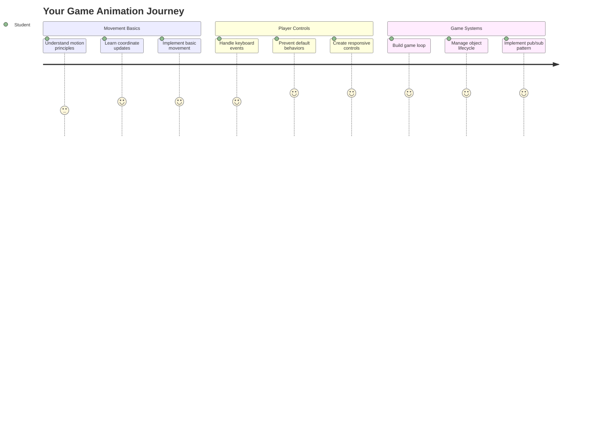
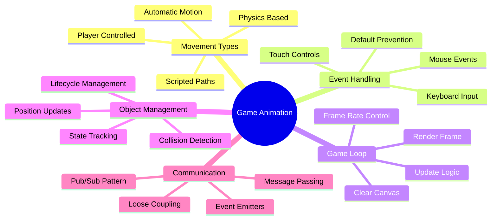
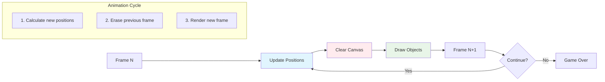
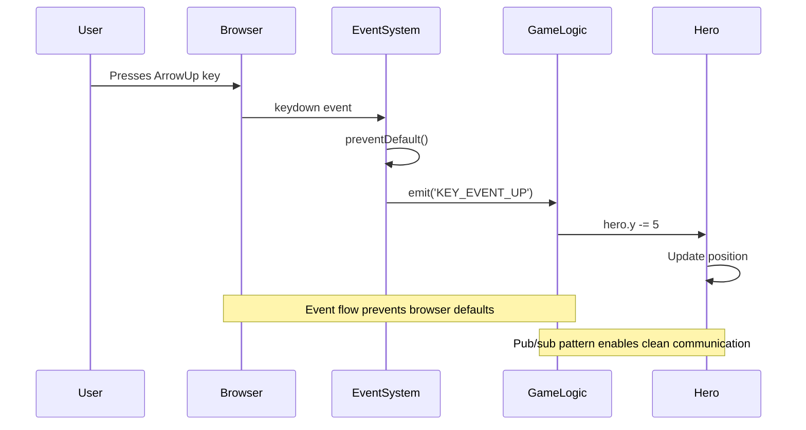
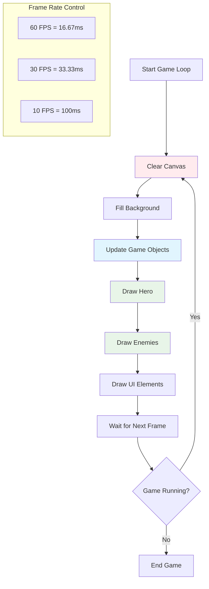
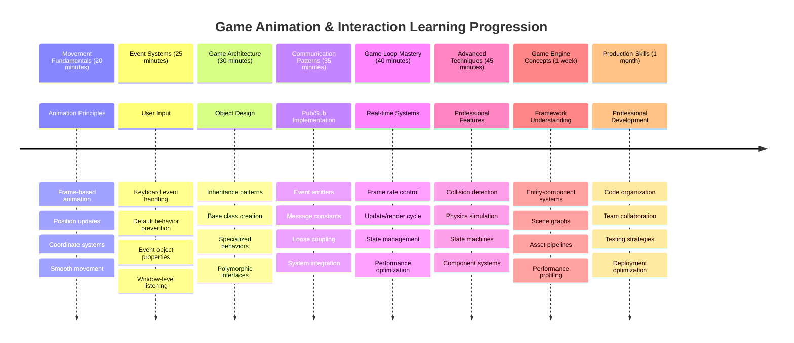

# בניית משחק חלל חלק 3: הוספת תנועה



חשבו על המשחקים האהובים עליכם – מה שהופך אותם למרתקים זה לא רק הגרפיקה היפה, אלא גם האופן שבו הכל זז ומגיב לפעולות שלכם. כרגע, משחק החלל שלכם הוא כמו ציור יפה, אבל אנחנו עומדים להוסיף תנועה שתביא אותו לחיים.

כשמהנדסי נאס"א תכנתו את מחשב ההנחיה למשימות אפולו, הם עמדו בפני אתגר דומה: איך לגרום לחללית להגיב לפקודות הטייס תוך שמירה אוטומטית על תיקוני מסלול? העקרונות שנלמד היום מהדהדים את אותם רעיונות – ניהול תנועה בשליטת שחקן לצד התנהגויות מערכת אוטומטיות.

בשיעור הזה תלמדו איך לגרום לחלליות להחליק על המסך, להגיב לפקודות שחקן וליצור דפוסי תנועה חלקים. נפרק הכל למושגים שניתן להבין בקלות ושבונים אחד על השני באופן טבעי.

בסוף, השחקנים יטיסו את ספינת הגיבור שלהם על המסך בזמן שספינות אויב יסיירו מעל. חשוב יותר, תבינו את העקרונות המרכזיים שמניעים מערכות תנועה במשחקים.



## שאלון לפני השיעור

[שאלון לפני השיעור](https://ff-quizzes.netlify.app/web/quiz/33)

## הבנת תנועה במשחקים

משחקים מתעוררים לחיים כשהדברים מתחילים לזוז, ויש שתי דרכים בסיסיות שבהן זה קורה:

- **תנועה בשליטת שחקן**: כשאתם לוחצים על מקש או מקליקים בעכבר, משהו זז. זה החיבור הישיר ביניכם לבין עולם המשחק.
- **תנועה אוטומטית**: כשהמשחק עצמו מחליט להזיז דברים – כמו ספינות אויב שצריכות לסייר על המסך בלי קשר למה שאתם עושים.

להזיז אובייקטים על מסך מחשב זה פשוט יותר ממה שאתם חושבים. זוכרים את הקואורדינטות x ו-y משיעורי מתמטיקה? בדיוק עם זה אנחנו עובדים כאן. כשגלילאו עקב אחרי ירחי צדק בשנת 1610, הוא למעשה עשה את אותו הדבר – תיעד מיקומים לאורך זמן כדי להבין דפוסי תנועה.

להזיז דברים על המסך זה כמו ליצור אנימציה בספרון דפדוף – צריך לעקוב אחרי שלושה שלבים פשוטים:



1. **עדכון המיקום** – לשנות איפה האובייקט צריך להיות (אולי להזיז אותו 5 פיקסלים ימינה)
2. **מחיקת הפריים הישן** – לנקות את המסך כדי שלא יופיעו שאריות רפאים בכל מקום
3. **ציור הפריים החדש** – למקם את האובייקט במקום החדש שלו

עשו זאת מספיק מהר, ובום! יש לכם תנועה חלקה שמרגישה טבעית לשחקנים.

כך זה יכול להיראות בקוד:

```javascript
// Set the hero's location
hero.x += 5;
// Clear the rectangle that hosts the hero
ctx.clearRect(0, 0, canvas.width, canvas.height);
// Redraw the game background and hero
ctx.fillRect(0, 0, canvas.width, canvas.height);
ctx.fillStyle = "black";
ctx.drawImage(heroImg, hero.x, hero.y);
```

**מה הקוד הזה עושה:**
- **מעדכן** את קואורדינטת ה-x של הגיבור ב-5 פיקסלים כדי להזיז אותו אופקית
- **מנקה** את כל אזור הקנבס כדי להסיר את הפריים הקודם
- **ממלא** את הקנבס בצבע רקע שחור
- **מצייר מחדש** את תמונת הגיבור במיקומו החדש

✅ האם אתם יכולים לחשוב על סיבה מדוע ציור מחדש של הגיבור בפריימים רבים בשנייה עשוי לגרום לעלויות ביצועים? קראו על [חלופות לדפוס הזה](https://developer.mozilla.org/en-US/docs/Web/API/Canvas_API/Tutorial/Optimizing_canvas).

## טיפול באירועי מקלדת

כאן אנחנו מחברים את קלט השחקן לפעולת המשחק. כשמישהו לוחץ על מקש הרווח כדי לירות לייזר או מקיש על מקש חץ כדי להתחמק מאסטרואיד, המשחק שלכם צריך לזהות ולהגיב לקלט הזה.

אירועי מקלדת מתרחשים ברמת החלון, כלומר כל חלון הדפדפן שלכם מקשיב ללחיצות המקלדת האלה. לחיצות עכבר, לעומת זאת, יכולות להיות קשורות לאלמנטים ספציפיים (כמו לחיצה על כפתור). עבור משחק החלל שלנו, נתמקד בשליטת מקלדת מכיוון שזה מה שנותן לשחקנים את התחושה הקלאסית של משחק ארקייד.

זה מזכיר לי איך מפעילי טלגרף במאה ה-19 היו צריכים לתרגם קלט קוד מורס להודעות משמעותיות – אנחנו עושים משהו דומה, מתרגמים לחיצות מקשים לפקודות משחק.

כדי לטפל באירוע, עליכם להשתמש בשיטת `addEventListener()` של החלון ולספק לה שני פרמטרים. הפרמטר הראשון הוא שם האירוע, למשל `keyup`. הפרמטר השני הוא הפונקציה שצריכה להיות מופעלת כתוצאה מהתרחשות האירוע.

הנה דוגמה:

```javascript
window.addEventListener('keyup', (evt) => {
  // evt.key = string representation of the key
  if (evt.key === 'ArrowUp') {
    // do something
  }
});
```

**פירוק מה שקורה כאן:**
- **מקשיב** לאירועי מקלדת על כל החלון
- **לוכד** את אובייקט האירוע שמכיל מידע על איזה מקש נלחץ
- **בודק** אם המקש שנלחץ תואם למקש ספציפי (במקרה הזה, חץ למעלה)
- **מבצע** קוד כאשר התנאי מתקיים

עבור אירועי מקשים יש שתי תכונות על האירוע שניתן להשתמש בהן כדי לראות איזה מקש נלחץ:

- `key` - זהו ייצוג מחרוזת של המקש שנלחץ, למשל `'ArrowUp'`
- `keyCode` - זהו ייצוג מספרי, למשל `37`, שמתאים ל-`ArrowLeft`

✅ מניפולציה של אירועי מקשים שימושית גם מחוץ לפיתוח משחקים. אילו שימושים נוספים אתם יכולים לחשוב עליהם עבור הטכניקה הזו?



### מקשים מיוחדים: שימו לב!

לחלק מהמפתחות יש התנהגויות מובנות בדפדפן שיכולות להפריע למשחק שלכם. מקשי החצים גוללים את הדף ומקש הרווח מקפיץ למטה – התנהגויות שאתם לא רוצים כשמישהו מנסה להטיס את החללית שלו.

אנחנו יכולים למנוע את ההתנהגויות המובנות האלה ולתת למשחק שלנו לטפל בקלט במקום. זה דומה לאיך שמתכנתים מוקדמים היו צריכים לעקוף הפרעות מערכת כדי ליצור התנהגויות מותאמות אישית – אנחנו פשוט עושים את זה ברמת הדפדפן. הנה איך:

```javascript
const onKeyDown = function (e) {
  console.log(e.keyCode);
  switch (e.keyCode) {
    case 37:
    case 39:
    case 38:
    case 40: // Arrow keys
    case 32:
      e.preventDefault();
      break; // Space
    default:
      break; // do not block other keys
  }
};

window.addEventListener('keydown', onKeyDown);
```

**הבנת קוד המניעה הזה:**
- **בודק** קודי מקשים ספציפיים שעשויים לגרום להתנהגות לא רצויה בדפדפן
- **מונע** את הפעולה המובנית של הדפדפן עבור מקשי החצים ומקש הרווח
- **מאפשר** למקשים אחרים לפעול כרגיל
- **משתמש** ב-`e.preventDefault()` כדי לעצור את ההתנהגות המובנית של הדפדפן

### 🔄 **בדיקה פדגוגית**
**הבנת טיפול באירועים**: לפני המעבר לתנועה אוטומטית, ודאו שאתם יכולים:
- ✅ להסביר את ההבדל בין אירועי `keydown` ו-`keyup`
- ✅ להבין מדוע אנחנו מונעים התנהגויות מובנות של הדפדפן
- ✅ לתאר איך מאזיני אירועים מחברים קלט משתמש ללוגיקת המשחק
- ✅ לזהות אילו מקשים עשויים להפריע לשליטת המשחק

**מבחן עצמי מהיר**: מה היה קורה אם לא הייתם מונעים את ההתנהגות המובנית עבור מקשי החצים?
*תשובה: הדפדפן היה גולל את הדף, מה שהיה מפריע לתנועת המשחק*

**ארכיטקטורת מערכת האירועים**: עכשיו אתם מבינים:
- **האזנה ברמת החלון**: לכידת אירועים ברמת הדפדפן
- **תכונות אובייקט האירוע**: מחרוזות `key` מול מספרי `keyCode`
- **מניעת ברירת מחדל**: עצירת התנהגויות לא רצויות של הדפדפן
- **לוגיקה מותנית**: תגובה לשילובי מקשים ספציפיים

## תנועה שמונעת על ידי המשחק

עכשיו נדבר על אובייקטים שזזים ללא קלט שחקן. חשבו על ספינות אויב שמפליגות על המסך, כדורים שעפים בקווים ישרים או עננים שמרחפים ברקע. התנועה האוטונומית הזו גורמת לעולם המשחק שלכם להרגיש חי גם כשאף אחד לא נוגע בשליטה.

אנחנו משתמשים בטיימרים מובנים של JavaScript כדי לעדכן מיקומים במרווחים קבועים. הרעיון הזה דומה לאיך שעונים עם מטוטלת עובדים – מנגנון קבוע שמפעיל פעולות מתוזמנות באופן עקבי. הנה כמה זה פשוט:

```javascript
const id = setInterval(() => {
  // Move the enemy on the y axis
  enemy.y += 10;
}, 100);
```

**מה הקוד הזה עושה:**
- **יוצר** טיימר שרץ כל 100 מילישניות
- **מעדכן** את קואורדינטת ה-y של האויב ב-10 פיקסלים בכל פעם
- **שומר** את מזהה המרווח כדי שנוכל לעצור אותו מאוחר יותר אם צריך
- **מזיז** את האויב כלפי מטה על המסך באופן אוטומטי

## לולאת המשחק

הנה הרעיון שמחבר הכל יחד – לולאת המשחק. אם המשחק שלכם היה סרט, לולאת המשחק הייתה מקרן הסרטים, שמראה פריים אחרי פריים כל כך מהר שהכל נראה כאילו זז בצורה חלקה.

לכל משחק יש אחת מהלולאות האלה שרצה מאחורי הקלעים. זו פונקציה שמעדכנת את כל אובייקטי המשחק, מציירת מחדש את המסך, וחוזרת על התהליך הזה ברציפות. זה עוקב אחרי הגיבור שלכם, כל האויבים, כל הלייזרים שעפים – כל מצב המשחק.

הרעיון הזה מזכיר לי איך אנימטורים מוקדמים כמו וולט דיסני היו צריכים לצייר מחדש דמויות פריים אחרי פריים כדי ליצור את אשליית התנועה. אנחנו עושים את אותו הדבר, רק עם קוד במקום עפרונות.

כך לולאת משחק יכולה להיראות בדרך כלל, בקוד:



```javascript
const gameLoopId = setInterval(() => {
  function gameLoop() {
    ctx.clearRect(0, 0, canvas.width, canvas.height);
    ctx.fillStyle = "black";
    ctx.fillRect(0, 0, canvas.width, canvas.height);
    drawHero();
    drawEnemies();
    drawStaticObjects();
  }
  gameLoop();
}, 200);
```

**הבנת מבנה לולאת המשחק:**
- **מנקה** את כל הקנבס כדי להסיר את הפריים הקודם
- **ממלא** את הרקע בצבע אחיד
- **מצייר** את כל אובייקטי המשחק במיקומם הנוכחי
- **חוזר** על התהליך הזה כל 200 מילישניות כדי ליצור אנימציה חלקה
- **מנהל** את קצב הפריימים על ידי שליטה בתזמון המרווחים

## המשך משחק החלל

עכשיו נוסיף תנועה לסצנה הסטטית שבניתם קודם. אנחנו עומדים להפוך אותה מצילום מסך לחוויה אינטראקטיבית. נעבוד על זה שלב אחר שלב כדי להבטיח שכל חלק נבנה על הקודם.

קחו את הקוד מהמקום שבו הפסקנו בשיעור הקודם (או התחילו עם הקוד בתיקיית [Part II- starter](../../../../6-space-game/3-moving-elements-around/your-work) אם אתם צריכים התחלה חדשה).

**הנה מה שאנחנו בונים היום:**
- **שליטת גיבור**: מקשי החצים יטיסו את החללית שלכם על המסך
- **תנועת אויבים**: ספינות החייזרים יתחילו את ההתקדמות שלהן

בואו נתחיל ליישם את התכונות האלה.

## שלבים מומלצים

אתרו את הקבצים שנוצרו עבורכם בתיקיית `your-work`. היא אמורה להכיל את הדברים הבאים:

```bash
-| assets
  -| enemyShip.png
  -| player.png
-| index.html
-| app.js
-| package.json
```

תתחילו את הפרויקט שלכם בתיקיית `your-work` על ידי הקלדת:

```bash
cd your-work
npm start
```

**מה הפקודה הזו עושה:**
- **מנווטת** לתיקיית הפרויקט שלכם
- **מתחילה** שרת HTTP בכתובת `http://localhost:5000`
- **מגישה** את קבצי המשחק שלכם כדי שתוכלו לבדוק אותם בדפדפן

הפקודה הזו תתחיל שרת HTTP בכתובת `http://localhost:5000`. פתחו דפדפן והכניסו את הכתובת הזו, כרגע זה אמור להציג את הגיבור ואת כל האויבים; שום דבר עדיין לא זז!

### הוסיפו קוד

1. **הוסיפו אובייקטים ייעודיים** עבור `hero`, `enemy` ו-`game object`, הם צריכים לכלול תכונות `x` ו-`y`. (זכרו את החלק על [Inheritance or composition](../README.md)).

   *רמז*: `game object` צריך להיות זה עם `x` ו-`y` והיכולת לצייר את עצמו על קנבס.

   > **טיפ**: התחילו בהוספת מחלקת `GameObject` חדשה עם הבנאי שלה כפי שמוצג למטה, ואז ציירו אותה על הקנבס:

    ```javascript
    class GameObject {
      constructor(x, y) {
        this.x = x;
        this.y = y;
        this.dead = false;
        this.type = "";
        this.width = 0;
        this.height = 0;
        this.img = undefined;
      }
    
      draw(ctx) {
        ctx.drawImage(this.img, this.x, this.y, this.width, this.height);
      }
    }
    ```

    **הבנת מחלקת הבסיס הזו:**
    - **מגדירה** תכונות משותפות שכל אובייקטי המשחק חולקים (מיקום, גודל, תמונה)
    - **כוללת** דגל `dead` כדי לעקוב אם האובייקט צריך להיות מוסר
    - **מספקת** שיטת `draw()` שמציירת את האובייקט על הקנבס
    - **מגדירה** ערכי ברירת מחדל לכל התכונות שהמחלקות הילדות יכולות להחליף

    ```mermaid
    classDiagram
        class GameObject {
            +x: number
            +y: number
            +dead: boolean
            +type: string
            +width: number
            +height: number
            +img: Image
            +draw(ctx)
        }
        
        class Hero {
            +speed: number
            +type: "Hero"
            +width: 98
            +height: 75
        }
        
        class Enemy {
            +type: "Enemy"
            +width: 98
            +height: 50
            +setInterval()
        }
        
        GameObject <|-- Hero
        GameObject <|-- Enemy
        
        class EventEmitter {
            +listeners: object
            +on(message, listener)
            +emit(message, payload)
        }
    ```

    עכשיו, הרחיבו את `GameObject` כדי ליצור את `Hero` ו-`Enemy`:
    
    ```javascript
    class Hero extends GameObject {
      constructor(x, y) {
        super(x, y);
        this.width = 98;
        this.height = 75;
        this.type = "Hero";
        this.speed = 5;
      }
    }
    ```

    ```javascript
    class Enemy extends GameObject {
      constructor(x, y) {
        super(x, y);
        this.width = 98;
        this.height = 50;
        this.type = "Enemy";
        const id = setInterval(() => {
          if (this.y < canvas.height - this.height) {
            this.y += 5;
          } else {
            console.log('Stopped at', this.y);
            clearInterval(id);
          }
        }, 300);
      }
    }
    ```

    **מושגים מרכזיים במחלקות האלה:**
    - **יורש** מ-`GameObject` באמצעות מילת המפתח `extends`
    - **קורא** לבנאי ההורה עם `super(x, y)`
    - **מגדיר** מידות ותכונות ספציפיות לכל סוג אובייקט
    - **מיישם** תנועה אוטומטית עבור אויבים באמצעות `setInterval()`

2. **הוסיפו מאזיני אירועים למקשים** כדי לטפל בניווט מקשים (להזיז את הגיבור למעלה/למטה שמאלה/ימינה)

   *זכרו* שזה מערכת קרטזית, פינה שמאלית עליונה היא `0,0`. גם זכרו להוסיף קוד לעצירת *התנהגות ברירת מחדל*

   > **טיפ**: צרו את פונקציית `onKeyDown` שלכם וצרפו אותה לחלון:

   ```javascript
   const onKeyDown = function (e) {
     console.log(e.keyCode);
     // Add the code from the lesson above to stop default behavior
     switch (e.keyCode) {
       case 37:
       case 39:
       case 38:
       case 40: // Arrow keys
       case 32:
         e.preventDefault();
         break; // Space
       default:
         break; // do not block other keys
     }
   };

   window.addEventListener("keydown", onKeyDown);
   ```
    
   **מה עושה מאזין האירועים הזה:**
   - **מקשיב** לאירועי keydown על כל החלון
   - **מתעד** את קוד המקש כדי לעזור לכם לבדוק אילו מקשים נלחצים
   - **מונע** התנהגות ברירת מחדל של הדפדפן עבור מקשי החצים ומקש הרווח
   - **מאפשר** למקשים אחרים לפעול כרגיל
   
   בדקו את קונסולת הדפדפן שלכם בשלב הזה, וצפו בלחיצות המקלדת שמתועדות.

3. **יישמו** את [דפוס Pub sub](../README.md), זה ישמור על הקוד שלכם נקי ככל שתמשיכו בחלקים הבאים.

   דפוס Publish-Subscribe עוזר לארגן את הקוד שלכם על ידי הפרדת זיהוי אירועים מטיפול באירועים. זה הופך את הקוד שלכם ליותר מודולרי וקל לתחזוקה.

   כדי לבצע את החלק האחרון הזה, אתם יכולים:

   1. **להוסיף מאזין אירועים** על החלון:

       ```javascript
       window.addEventListener("keyup", (evt) => {
         if (evt.key === "ArrowUp") {
           eventEmitter.emit(Messages.KEY_EVENT_UP);
         } else if (evt.key === "ArrowDown") {
           eventEmitter.emit(Messages.KEY_EVENT_DOWN);
         } else if (evt.key === "ArrowLeft") {
           eventEmitter.emit(Messages.KEY_EVENT_LEFT);
         } else if (evt.key === "ArrowRight") {
           eventEmitter.emit(Messages.KEY_EVENT_RIGHT);
         }
       });
       ```

   **מה עושה מערכת האירועים הזו:**
   - **מזהה** קלט מקלדת וממיר אותו לאירועי משחק מותאמים אישית
   - **מפריד** זיהוי קלט מלוגיקת המשחק
   - **מקלה** על שינוי שליטה מאוחר יותר מבלי להשפיע על קוד המשחק
   - **מאפשרת** למערכות מרובות להגיב לאותו קלט

   ```mermaid
   flowchart TD
       A["Keyboard Input"] --> B["Window Event Listener"]
       B --> C["Event Emitter"]
       C --> D["KEY_EVENT_UP"]
       C --> E["KEY_EVENT_DOWN"]
       C --> F["KEY_EVENT_LEFT"]
       C --> G["KEY_EVENT_RIGHT"]
       
       D --> H["Hero Movement"]
       D --> I["Sound System"]
       D --> J["Visual Effects"]
       
       E --> H
       F --> H
       G --> H
       
       style A fill:#e1f5fe
       style C fill:#e8f5e8
       style H fill:#fff3e0
   ```

   2. **צרו מחלקת EventEmitter** כדי לפרסם ולהירשם להודעות:

       ```javascript
       class EventEmitter {
         constructor() {
           this.listeners = {};
         }
       
         on(message, listener) {
           if (!this.listeners[message]) {
             this.listeners[message] = [];
           }
           this.listeners[message].push(listener);
         }
       
   3. **הוסיפו קבועים** והגדירו את EventEmitter:

       ```javascript
       const Messages = {
         KEY_EVENT_UP: "KEY_EVENT_UP",
         KEY_EVENT_DOWN: "KEY_EVENT_DOWN",
         KEY_EVENT_LEFT: "KEY_EVENT_LEFT",
         KEY_EVENT_RIGHT: "KEY_EVENT_RIGHT",
       };
       
       let heroImg, 
           enemyImg, 
           laserImg,
           canvas, ctx, 
           gameObjects = [], 
           hero, 
           eventEmitter = new EventEmitter();
       ```

   **הבנת ההגדרה:**
   - **מגדירה** קבועי הודעות כדי להימנע משגיאות ולהקל על שינוי קוד
   - **מצהירה** על משתנים עבור תמונות, הקשר קנבס ומצב משחק
   - **יוצרת** EventEmitter גלובלי עבור מערכת pub-sub
   - **מאתחל** מערך לשמירת כל אובייקטי המשחק

   4. **אתחול המשחק**

       ```javascript
       function initGame() {
         gameObjects = [];
         createEnemies();
         createHero();
       
         eventEmitter.on(Messages.KEY_EVENT_UP, () => {
           hero.y -= 5;
         });
       
         eventEmitter.on(Messages.KEY_EVENT_DOWN, () => {
           hero.y += 5;
         });
       
         eventEmitter.on(Messages.KEY_EVENT_LEFT, () => {
           hero.x -= 5;
         });
       
4. **הגדרת לולאת המשחק**

   בצע שינוי בפונקציה `window.onload` כדי לאתחל את המשחק ולהגדיר לולאת משחק במרווח זמן מתאים. בנוסף, תוסיף קרן לייזר:

    ```javascript
    window.onload = async () => {
      canvas = document.getElementById("canvas");
      ctx = canvas.getContext("2d");
      heroImg = await loadTexture("assets/player.png");
      enemyImg = await loadTexture("assets/enemyShip.png");
      laserImg = await loadTexture("assets/laserRed.png");
    
      initGame();
      const gameLoopId = setInterval(() => {
        ctx.clearRect(0, 0, canvas.width, canvas.height);
        ctx.fillStyle = "black";
        ctx.fillRect(0, 0, canvas.width, canvas.height);
        drawGameObjects(ctx);
      }, 100);
    };
    ```

   **הבנת הגדרת המשחק:**
   - **ממתין** לטעינת הדף במלואה לפני התחלה
   - **מקבל** את אלמנט הקנבס ואת הקונטקסט של הרינדור ב-2D
   - **טוען** את כל נכסי התמונות באופן אסינכרוני באמצעות `await`
   - **מתחיל** את לולאת המשחק במרווחים של 100ms (10 FPS)
   - **מנקה** ומצייר מחדש את כל המסך בכל פריים

5. **הוסף קוד** להזזת אויבים במרווח זמן מסוים

    בצע שינוי בפונקציה `createEnemies()` כדי ליצור את האויבים ולהוסיף אותם למחלקת gameObjects החדשה:

    ```javascript
    function createEnemies() {
      const MONSTER_TOTAL = 5;
      const MONSTER_WIDTH = MONSTER_TOTAL * 98;
      const START_X = (canvas.width - MONSTER_WIDTH) / 2;
      const STOP_X = START_X + MONSTER_WIDTH;
    
      for (let x = START_X; x < STOP_X; x += 98) {
        for (let y = 0; y < 50 * 5; y += 50) {
          const enemy = new Enemy(x, y);
          enemy.img = enemyImg;
          gameObjects.push(enemy);
        }
      }
    }
    ```

    **מה עושה יצירת האויבים:**
    - **מחשב** מיקומים למרכז האויבים על המסך
    - **יוצר** גריד של אויבים באמצעות לולאות מקוננות
    - **משייך** את תמונת האויב לכל אובייקט אויב
    - **מוסיף** כל אויב למערך אובייקטי המשחק הגלובלי
    
    והוסף פונקציה `createHero()` כדי לבצע תהליך דומה עבור הגיבור.
    
    ```javascript
    function createHero() {
      hero = new Hero(
        canvas.width / 2 - 45,
        canvas.height - canvas.height / 4
      );
      hero.img = heroImg;
      gameObjects.push(hero);
    }
    ```

    **מה עושה יצירת הגיבור:**
    - **ממקם** את הגיבור בתחתית מרכז המסך
    - **משייך** את תמונת הגיבור לאובייקט הגיבור
    - **מוסיף** את הגיבור למערך אובייקטי המשחק לצורך רינדור

    ולבסוף, הוסף פונקציה `drawGameObjects()` כדי להתחיל את הציור:

    ```javascript
    function drawGameObjects(ctx) {
      gameObjects.forEach(go => go.draw(ctx));
    }
    ```

    **הבנת פונקציית הציור:**
    - **עובר** על כל אובייקטי המשחק במערך
    - **קורא** לפונקציה `draw()` על כל אובייקט
    - **מעביר** את קונטקסט הקנבס כדי שהאובייקטים יוכלו לרנדר את עצמם

    ### 🔄 **בדיקה פדגוגית**
    **הבנת מערכת המשחק המלאה**: בדוק את שליטתך בכל הארכיטקטורה:
    - ✅ איך הירושה מאפשרת לגיבור ולאויבים לשתף תכונות משותפות של GameObject?
    - ✅ למה תבנית pub/sub הופכת את הקוד שלך ליותר ניתן לתחזוקה?
    - ✅ מה תפקידה של לולאת המשחק ביצירת אנימציה חלקה?
    - ✅ איך מאזיני אירועים מחברים קלט משתמש להתנהגות אובייקטי המשחק?

    **אינטגרציית מערכת**: המשחק שלך עכשיו מדגים:
    - **עיצוב מונחה עצמים**: מחלקות בסיס עם הירושה מותאמת
    - **ארכיטקטורה מונעת אירועים**: תבנית pub/sub לחיבור רופף
    - **מסגרת אנימציה**: לולאת משחק עם עדכוני פריימים עקביים
    - **טיפול בקלט**: אירועי מקלדת עם מניעת ברירת מחדל
    - **ניהול נכסים**: טעינת תמונות ורינדור ספרייטים

    **תבניות מקצועיות**: יישמת:
    - **הפרדת תחומים**: קלט, לוגיקה ורינדור מופרדים
    - **פולימורפיזם**: כל אובייקטי המשחק חולקים ממשק ציור משותף
    - **העברת הודעות**: תקשורת נקייה בין רכיבים
    - **ניהול משאבים**: טיפול יעיל בספרייטים ואנימציות

    האויבים שלך צריכים להתחיל להתקדם לעבר חללית הגיבור שלך!
      }
    }
    ```
    
    and add a `createHero()` function to do a similar process for the hero.
    
    ```javascript
    function createHero() {
      hero = new Hero(
        canvas.width / 2 - 45,
        canvas.height - canvas.height / 4
      );
      hero.img = heroImg;
      gameObjects.push(hero);
    }
    ```

    ולבסוף, הוסף פונקציה `drawGameObjects()` כדי להתחיל את הציור:

    ```javascript
    function drawGameObjects(ctx) {
      gameObjects.forEach(go => go.draw(ctx));
    }
    ```

    האויבים שלך צריכים להתחיל להתקדם לעבר חללית הגיבור שלך!

---

## אתגר סוכן GitHub Copilot 🚀

הנה אתגר שישפר את הפוליש של המשחק שלך: הוספת גבולות ושליטה חלקה. כרגע, הגיבור שלך יכול לעוף מחוץ למסך, והתנועה עשויה להרגיש מקוטעת.

**המשימה שלך:** הפוך את החללית שלך ליותר מציאותית על ידי יישום גבולות מסך ותנועה חלקה. זה דומה לאופן שבו מערכות בקרת טיסה של נאס"א מונעות מחלליות לחרוג מפרמטרי פעולה בטוחים.

**מה לבנות:** צור מערכת ששומרת את חללית הגיבור שלך על המסך, ותגרום לשליטה להרגיש חלקה. כאשר שחקנים מחזיקים מקש חץ, החללית צריכה להחליק ברציפות במקום לזוז בצעדים נפרדים. שקול להוסיף משוב חזותי כאשר החללית מגיעה לגבולות המסך – אולי אפקט עדין שמציין את קצה אזור המשחק.

למד עוד על [מצב סוכן](https://code.visualstudio.com/blogs/2025/02/24/introducing-copilot-agent-mode) כאן.

## 🚀 אתגר

ארגון קוד הופך לחשוב יותר ככל שהפרויקטים גדלים. אולי שמתם לב שהקובץ שלכם מתמלא בפונקציות, משתנים ומחלקות מעורבבים יחד. זה מזכיר לי איך המהנדסים שארגנו את קוד משימת אפולו היו צריכים ליצור מערכות ברורות וניתנות לתחזוקה שצוותים מרובים יוכלו לעבוד עליהן בו זמנית.

**המשימה שלך:**
חשוב כמו ארכיטקט תוכנה. איך היית מארגן את הקוד שלך כך שישה חודשים מעכשיו, אתה (או חבר צוות) תוכל להבין מה קורה? גם אם הכל נשאר בקובץ אחד כרגע, אתה יכול ליצור ארגון טוב יותר:

- **קיבוץ פונקציות קשורות** יחד עם כותרות הערות ברורות
- **הפרדת תחומים** - שמור את לוגיקת המשחק נפרדת מהרינדור
- **שימוש בשמות עקביים** למשתנים ולפונקציות
- **יצירת מודולים** או מרחבי שמות לארגון היבטים שונים של המשחק שלך
- **הוספת תיעוד** שמסביר את מטרת כל חלק מרכזי

**שאלות למחשבה:**
- אילו חלקים בקוד שלך הכי קשה להבין כשאתה חוזר אליהם?
- איך היית מארגן את הקוד שלך כדי להקל על מישהו אחר לתרום?
- מה יקרה אם תרצה להוסיף תכונות חדשות כמו בונוסים או סוגי אויבים שונים?

## חידון לאחר ההרצאה

[חידון לאחר ההרצאה](https://ff-quizzes.netlify.app/web/quiz/34)

## סקירה ולימוד עצמי

בנינו הכל מאפס, שזה נהדר ללמידה, אבל הנה סוד קטן – יש כמה מסגרות JavaScript מדהימות שיכולות לטפל בהרבה מהעבודה הקשה עבורך. ברגע שתרגיש בנוח עם היסודות שכיסינו, כדאי [לחקור מה זמין](https://github.com/collections/javascript-game-engines).

חשוב על מסגרות כמו שיש לך ארגז כלים מצויד היטב במקום ליצור כל כלי בעצמך. הן יכולות לפתור רבות מאותן אתגרי ארגון קוד שדיברנו עליהם, בנוסף להציע תכונות שייקח שבועות לבנות בעצמך.

**דברים שכדאי לחקור:**
- איך מנועי משחק מארגנים קוד – תתפלא מהתבניות החכמות שהם משתמשים בהן
- טריקים לביצועים כדי לגרום למשחקי קנבס לרוץ בצורה חלקה  
- תכונות JavaScript מודרניות שיכולות להפוך את הקוד שלך לנקי וניתן לתחזוקה
- גישות שונות לניהול אובייקטי משחק והיחסים ביניהם

## 🎯 ציר הזמן לשליטה באנימציית משחקים שלך



### 🛠️ סיכום ערכת הכלים לפיתוח משחקים שלך

לאחר השלמת השיעור הזה, עכשיו שלטת ב:
- **עקרונות אנימציה**: תנועה מבוססת פריימים ומעברים חלקים
- **תכנות מונע אירועים**: טיפול בקלט מקלדת עם ניהול אירועים נכון
- **עיצוב מונחה עצמים**: היררכיות ירושה וממשקים פולימורפיים
- **תבניות תקשורת**: ארכיטקטורת pub/sub לקוד ניתן לתחזוקה
- **ארכיטקטורת לולאת משחק**: עדכון בזמן אמת ומחזורי רינדור
- **מערכות קלט**: מיפוי שליטה משתמש עם מניעת התנהגות ברירת מחדל
- **ניהול נכסים**: טעינת ספרייטים וטכניקות רינדור יעילות

### ⚡ **מה אתה יכול לעשות ב-5 הדקות הבאות**
- [ ] פתח את קונסולת הדפדפן ונסה `addEventListener('keydown', console.log)` כדי לראות אירועי מקלדת
- [ ] צור אלמנט div פשוט והזז אותו באמצעות מקשי החצים
- [ ] נסה את `setInterval` כדי ליצור תנועה רציפה
- [ ] נסה למנוע התנהגות ברירת מחדל עם `event.preventDefault()`

### 🎯 **מה אתה יכול להשיג בשעה הקרובה**
- [ ] השלם את החידון לאחר השיעור והבנת תכנות מונע אירועים
- [ ] בנה את חללית הגיבור הנעה עם שליטה מלאה במקלדת
- [ ] יישם דפוסי תנועה חלקים לאויבים
- [ ] הוסף גבולות כדי למנוע מאובייקטי משחק לצאת מהמסך
- [ ] צור זיהוי התנגשות בסיסי בין אובייקטי משחק

### 📅 **מסע האנימציה שלך לשבוע**
- [ ] השלם את משחק החלל המלא עם תנועה ואינטראקציות מלוטשות
- [ ] הוסף דפוסי תנועה מתקדמים כמו עקומות, תאוצה ופיזיקה
- [ ] יישם מעברים חלקים ופונקציות הקלה
- [ ] צור אפקטים חלקיקים ומערכות משוב חזותיות
- [ ] בצע אופטימיזציה לביצועי המשחק למשחק חלק ב-60fps
- [ ] הוסף שליטה במגע לנייד ועיצוב רספונסיבי

### 🌟 **פיתוח אינטראקטיבי שלך לחודש**
- [ ] בנה יישומים אינטראקטיביים מורכבים עם מערכות אנימציה מתקדמות
- [ ] למד ספריות אנימציה כמו GSAP או צור מנוע אנימציה משלך
- [ ] תרום לפרויקטים פתוחים של פיתוח משחקים ואנימציה
- [ ] שלוט באופטימיזציית ביצועים ליישומים גרפיים אינטנסיביים
- [ ] צור תוכן חינוכי על פיתוח משחקים ואנימציה
- [ ] בנה תיק עבודות המציג מיומנויות תכנות אינטראקטיביות מתקדמות

**יישומים בעולם האמיתי**: מיומנויות האנימציה שלך במשחקים חלות ישירות על:
- **יישומי אינטרנט אינטראקטיביים**: לוחות מחוונים דינמיים וממשקים בזמן אמת
- **הדמיית נתונים**: גרפים מונפשים וגרפיקה אינטראקטיבית
- **תוכנה חינוכית**: סימולציות אינטראקטיביות וכלי למידה
- **פיתוח לנייד**: משחקים מבוססי מגע וטיפול במחוות
- **יישומי שולחן עבודה**: אפליקציות Electron עם אנימציות חלקות
- **אנימציות אינטרנט**: ספריות אנימציה ב-CSS וב-JavaScript

**מיומנויות מקצועיות שנרכשו**: עכשיו אתה יכול:
- **לתכנן** מערכות מונעות אירועים שמתרחבות עם מורכבות
- **ליישם** אנימציות חלקות באמצעות עקרונות מתמטיים
- **לפתור בעיות** במערכות אינטראקציה מורכבות באמצעות כלי פיתוח דפדפן
- **לייעל** ביצועי משחק למכשירים ודפדפנים שונים
- **לעצב** מבני קוד ניתנים לתחזוקה באמצעות תבניות מוכחות

**מושגים בפיתוח משחקים שנרכשו**:
- **ניהול קצב פריימים**: הבנת FPS ובקרות תזמון
- **טיפול בקלט**: מערכות מקלדת ואירועים חוצות פלטפורמות
- **מחזור חיים של אובייקט**: תבניות יצירה, עדכון והשמדה
- **סנכרון מצב**: שמירה על מצב משחק עקבי בין פריימים
- **ארכיטקטורת אירועים**: תקשורת מנותקת בין מערכות משחק

**הרמה הבאה**: אתה מוכן להוסיף זיהוי התנגשות, מערכות ניקוד, אפקטים קוליים, או לחקור מסגרות משחק מודרניות כמו Phaser או Three.js!

🌟 **הישג נפתח**: בנית מערכת משחק אינטראקטיבית מלאה עם תבניות ארכיטקטורה מקצועיות!

## משימה

[הער את הקוד שלך](assignment.md)

---

**כתב ויתור**:  
מסמך זה תורגם באמצעות שירות תרגום AI [Co-op Translator](https://github.com/Azure/co-op-translator). למרות שאנו שואפים לדיוק, יש לקחת בחשבון שתרגומים אוטומטיים עשויים להכיל שגיאות או אי דיוקים. המסמך המקורי בשפתו המקורית צריך להיחשב כמקור הסמכותי. עבור מידע קריטי, מומלץ להשתמש בתרגום מקצועי אנושי. איננו אחראים לאי הבנות או לפרשנויות שגויות הנובעות משימוש בתרגום זה.