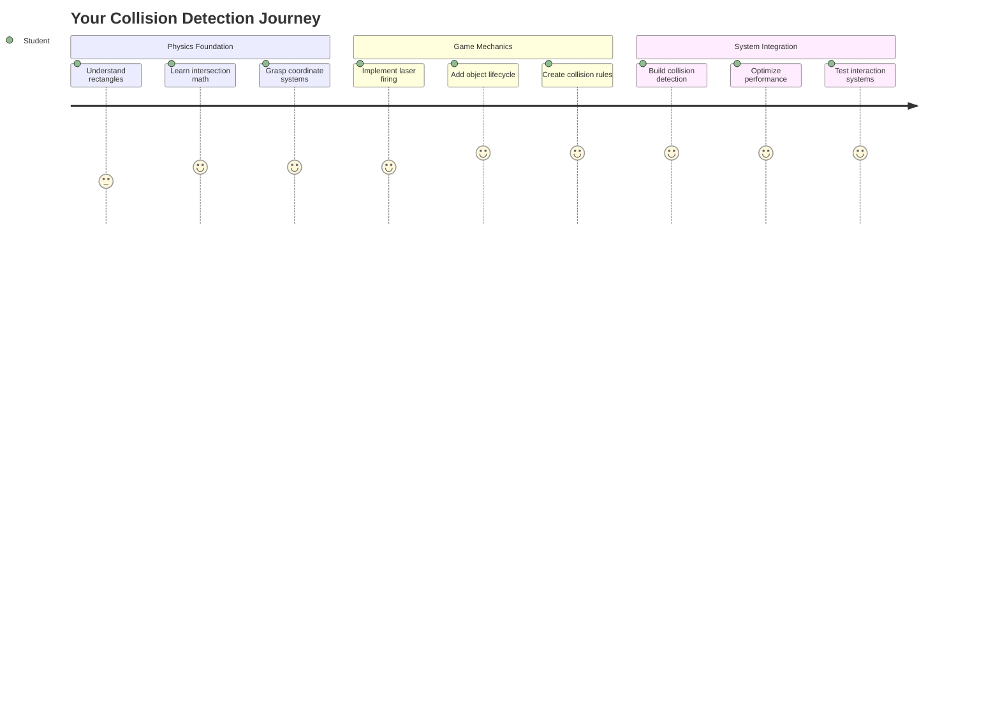
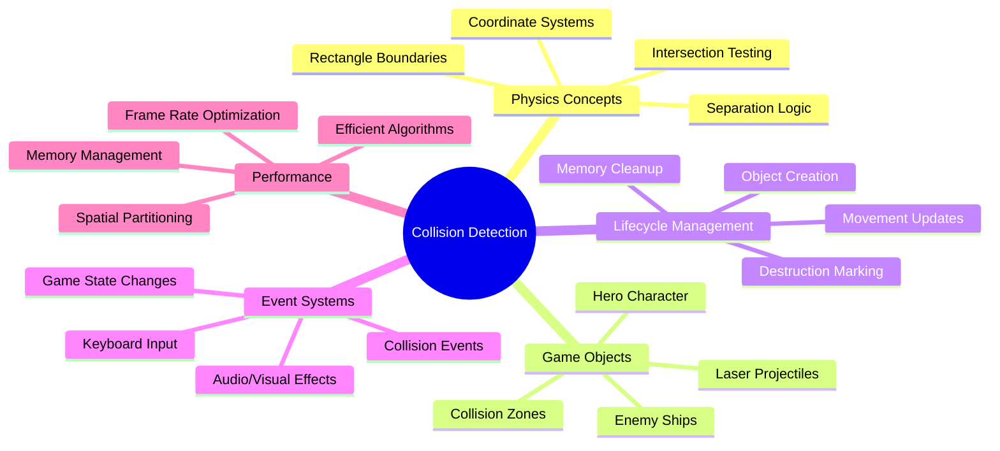
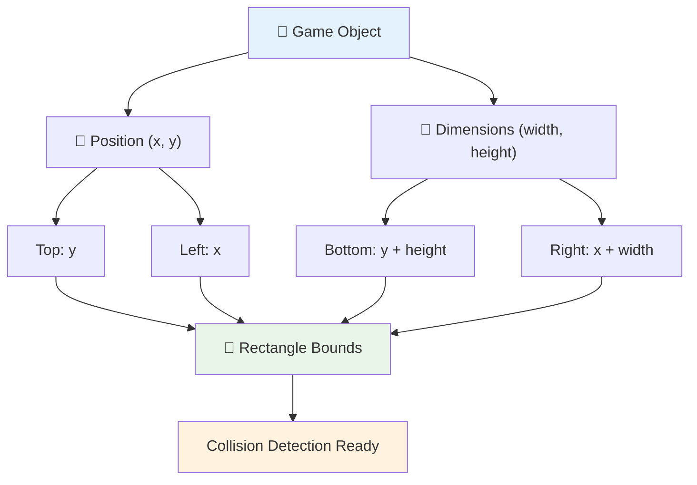
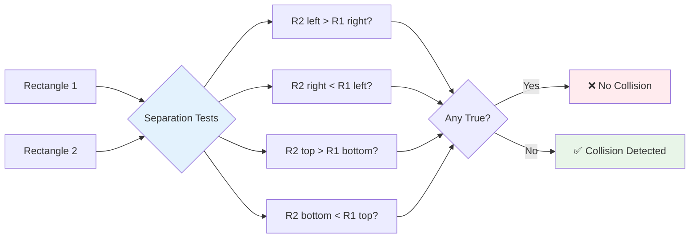
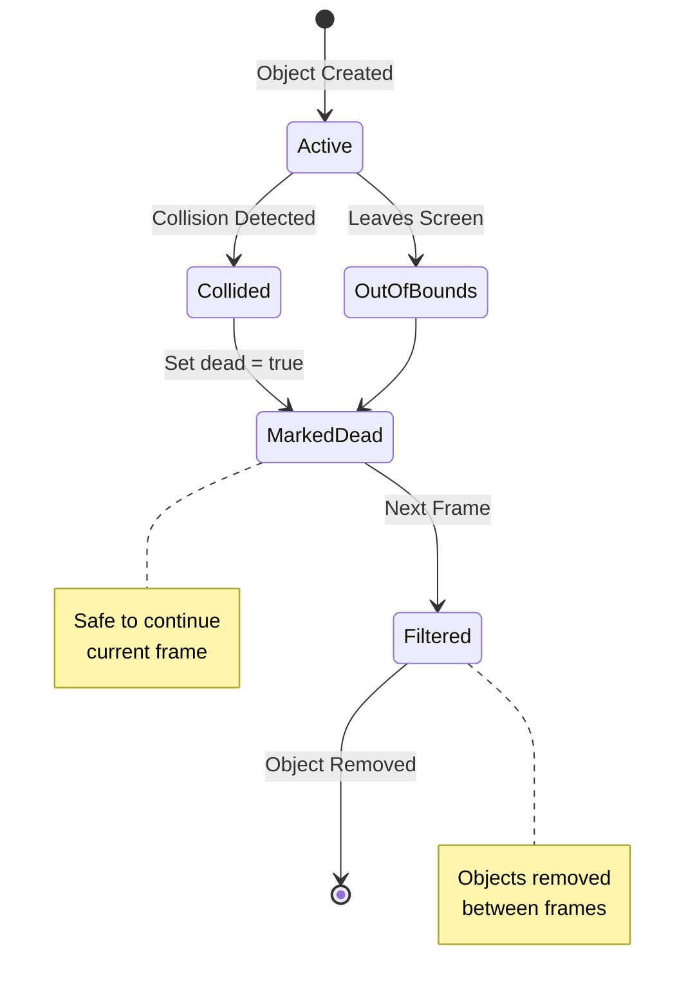
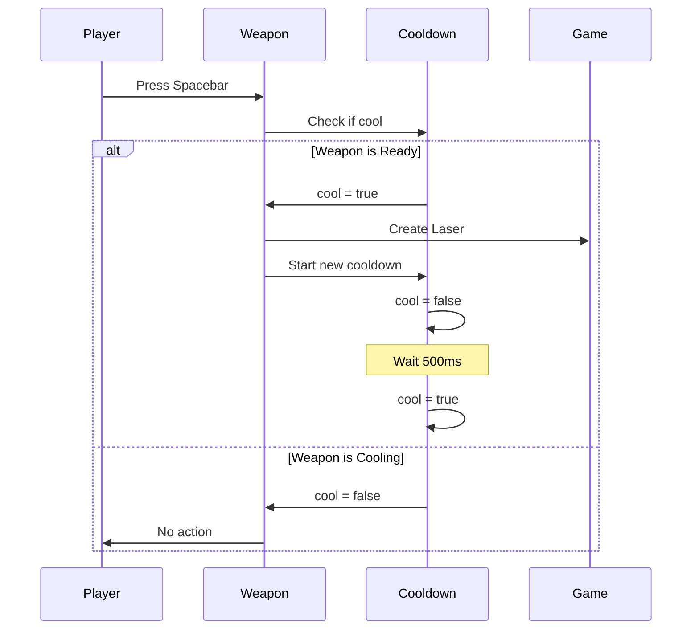
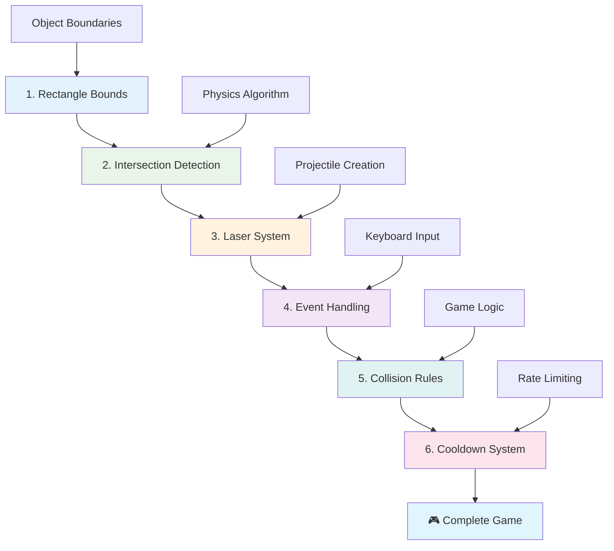
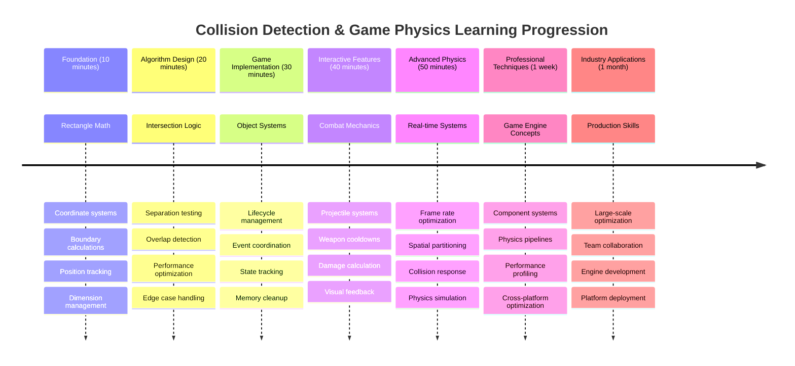

# בניית משחק חלל חלק 4: הוספת לייזר וזיהוי התנגשויות



## שאלון לפני השיעור

[שאלון לפני השיעור](https://ff-quizzes.netlify.app/web/quiz/35)

חשבו על הרגע ב"מלחמת הכוכבים" שבו הטורפדו של לוק פגעו בפתח הפליטה של כוכב המוות. זיהוי ההתנגשות המדויק הזה שינה את גורל הגלקסיה! במשחקים, זיהוי התנגשויות עובד באותו אופן - הוא קובע מתי אובייקטים מתקשרים ומה קורה לאחר מכן.

בשיעור הזה, תוסיפו כלי נשק לייזר למשחק החלל שלכם ותיישמו זיהוי התנגשויות. בדיוק כמו שמתכנני משימות של נאס"א מחשבים מסלולי חלליות כדי להימנע מפסולת, תלמדו לזהות מתי אובייקטים במשחק מצטלבים. נפרק את זה לשלבים פשוטים שנבנים אחד על השני.

בסוף, יהיה לכם מערכת קרב מתפקדת שבה לייזרים משמידים אויבים והתנגשויות מפעילות אירועים במשחק. אותם עקרונות זיהוי התנגשויות משמשים בכל דבר, החל מסימולציות פיזיקה ועד ממשקים אינטראקטיביים ברשת.



✅ בצעו מחקר קטן על משחק המחשב הראשון שנכתב אי פעם. מה הייתה הפונקציונליות שלו?

## זיהוי התנגשויות

זיהוי התנגשויות עובד כמו חיישני הקרבה של מודול הירח אפולו - הוא בודק מרחקים באופן קבוע ומפעיל התראות כאשר אובייקטים מתקרבים מדי. במשחקים, מערכת זו קובעת מתי אובייקטים מתקשרים ומה צריך לקרות לאחר מכן.

הגישה שנשתמש בה מתייחסת לכל אובייקט במשחק כמלבן, בדומה לאופן שבו מערכות בקרת תעופה משתמשות בצורות גיאומטריות פשוטות כדי לעקוב אחר מטוסים. שיטה מלבנית זו עשויה להיראות בסיסית, אך היא יעילה מבחינה חישובית ועובדת היטב ברוב תרחישי המשחק.

### ייצוג מלבנים

כל אובייקט במשחק צריך גבולות קואורדינטות, בדומה לאופן שבו רובר Pathfinder של מאדים מיפה את מיקומו על פני השטח של מאדים. כך אנו מגדירים את גבולות הקואורדינטות הללו:



```javascript
rectFromGameObject() {
  return {
    top: this.y,
    left: this.x,
    bottom: this.y + this.height,
    right: this.x + this.width
  }
}
```

**בואו נפרק את זה:**
- **קצה עליון**: זה פשוט המקום שבו האובייקט מתחיל אנכית (מיקום ה-y שלו)
- **קצה שמאלי**: המקום שבו הוא מתחיל אופקית (מיקום ה-x שלו)
- **קצה תחתון**: הוסיפו את הגובה למיקום ה-y - עכשיו אתם יודעים איפה הוא מסתיים!
- **קצה ימני**: הוסיפו את הרוחב למיקום ה-x - ויש לכם את הגבול המלא

### אלגוריתם חיתוך

זיהוי חיתוך מלבנים משתמש בלוגיקה דומה לאופן שבו טלסקופ החלל האבל קובע אם אובייקטים שמימיים חופפים בשדה הראייה שלו. האלגוריתם בודק הפרדה:



```javascript
function intersectRect(r1, r2) {
  return !(r2.left > r1.right ||
    r2.right < r1.left ||
    r2.top > r1.bottom ||
    r2.bottom < r1.top);
}
```

**מבחן ההפרדה עובד כמו מערכות רדאר:**
- האם מלבן 2 נמצא לחלוטין מימין למלבן 1?
- האם מלבן 2 נמצא לחלוטין משמאל למלבן 1?
- האם מלבן 2 נמצא לחלוטין מתחת למלבן 1?
- האם מלבן 2 נמצא לחלוטין מעל למלבן 1?

אם אף אחד מהתנאים הללו אינו נכון, המלבנים חייבים להיות חופפים. גישה זו משקפת כיצד מפעילי רדאר קובעים אם שני מטוסים נמצאים במרחקים בטוחים.

## ניהול מחזורי חיים של אובייקטים

כאשר לייזר פוגע באויב, שני האובייקטים צריכים להימחק מהמשחק. עם זאת, מחיקת אובייקטים במהלך הלולאה יכולה לגרום לקריסות - שיעור שנלמד בדרך הקשה במערכות מחשב מוקדמות כמו מחשב ההנחיה של אפולו. במקום זאת, אנו משתמשים בגישה של "סימון למחיקה" שמסירה אובייקטים בבטחה בין פריימים.



כך אנו מסמנים משהו להסרה:

```javascript
// Mark object for removal
enemy.dead = true;
```

**מדוע גישה זו עובדת:**
- אנו מסמנים את האובייקט כ"מת" אך לא מוחקים אותו מיד
- זה מאפשר לפריים המשחק הנוכחי להסתיים בבטחה
- אין קריסות מניסיון להשתמש במשהו שכבר נמחק!

לאחר מכן מסננים אובייקטים מסומנים לפני מחזור הרינדור הבא:

```javascript
gameObjects = gameObjects.filter(go => !go.dead);
```

**מה הסינון הזה עושה:**
- יוצר רשימה חדשה עם רק האובייקטים "החיים"
- זורק כל דבר שסומן כמת
- שומר על המשחק פועל בצורה חלקה
- מונע הצטברות זיכרון מאובייקטים שנהרסו

## יישום מכניקת לייזר

פרויקטים של לייזר במשחקים עובדים על אותו עיקרון כמו טורפדו פוטון ב"מסע בין כוכבים" - הם אובייקטים נפרדים שנעים בקווים ישרים עד שהם פוגעים במשהו. כל לחיצה על מקש הרווח יוצרת אובייקט לייזר חדש שנע על פני המסך.

כדי לגרום לזה לעבוד, אנחנו צריכים לתאם כמה חלקים שונים:

**רכיבים מרכזיים ליישום:**
- **יצירת** אובייקטי לייזר שמופיעים ממיקום הגיבור
- **טיפול** בקלט מקלדת כדי להפעיל יצירת לייזר
- **ניהול** תנועת לייזר ומחזור החיים שלו
- **יישום** ייצוג חזותי לפרויקטי הלייזר

## יישום בקרת קצב ירי

קצב ירי בלתי מוגבל יעמיס על מנוע המשחק ויהפוך את המשחק לקל מדי. מערכות נשק אמיתיות מתמודדות עם מגבלות דומות - אפילו הפייזרים של USS Enterprise היו צריכים זמן לטעינה מחדש בין יריות.

ניישם מערכת קירור שמונעת ירי מהיר מדי תוך שמירה על שליטה תגובתית:



```javascript
class Cooldown {
  constructor(time) {
    this.cool = false;
    setTimeout(() => {
      this.cool = true;
    }, time);
  }
}

class Weapon {
  constructor() {
    this.cooldown = null;
  }
  
  fire() {
    if (!this.cooldown || this.cooldown.cool) {
      // Create laser projectile
      this.cooldown = new Cooldown(500);
    } else {
      // Weapon is still cooling down
    }
  }
}
```

**איך הקירור עובד:**
- בעת יצירה, הנשק מתחיל "חם" (לא יכול לירות עדיין)
- לאחר תקופת ההמתנה, הוא הופך ל"קר" (מוכן לירי)
- לפני הירי, אנו בודקים: "האם הנשק קר?"
- זה מונע לחיצה מהירה תוך שמירה על שליטה תגובתית

✅ חזרו לשיעור הראשון בסדרת משחק החלל כדי להזכיר לעצמכם על מערכות קירור.

## בניית מערכת זיהוי התנגשויות

תאריכו את קוד משחק החלל הקיים שלכם כדי ליצור מערכת זיהוי התנגשויות. כמו מערכת ההימנעות מהתנגשויות האוטומטית של תחנת החלל הבינלאומית, המשחק שלכם יעקוב באופן רציף אחר מיקומי אובייקטים ויגיב לחיתוכים.

מתחילים מקוד השיעור הקודם שלכם, תוסיפו זיהוי התנגשויות עם כללים ספציפיים שמנהלים את האינטראקציות בין האובייקטים.

> 💡 **טיפ מקצועי**: הסמל של הלייזר כבר כלול בתיקיית הנכסים שלכם ומוזכר בקוד, מוכן ליישום.

### כללי התנגשויות ליישום

**מכניקת משחק להוספה:**
1. **לייזר פוגע באויב**: אובייקט האויב נהרס כאשר פוגע בו פרויקט לייזר
2. **לייזר פוגע בגבול המסך**: הלייזר נמחק כאשר מגיע לקצה העליון של המסך
3. **התנגשות אויב וגיבור**: שני האובייקטים נהרסים כאשר הם מצטלבים
4. **אויב מגיע לתחתית**: מצב סיום משחק כאשר אויבים מגיעים לתחתית המסך

### 🔄 **בדיקה פדגוגית**
**יסודות זיהוי התנגשויות**: לפני היישום, ודאו שאתם מבינים:
- ✅ איך גבולות מלבנים מגדירים אזורי התנגשויות
- ✅ מדוע מבחן הפרדה יעיל יותר מחישוב חיתוך
- ✅ חשיבות ניהול מחזורי חיים של אובייקטים בלולאות משחק
- ✅ איך מערכות מונעות אירועים מתאמות תגובות להתנגשויות

**מבחן עצמי מהיר**: מה יקרה אם תמחקו אובייקטים מיד במקום לסמן אותם?
*תשובה: מחיקה במהלך הלולאה יכולה לגרום לקריסות או לדלג על אובייקטים באיטרציה*

**הבנת פיזיקה**: עכשיו אתם מבינים:
- **מערכות קואורדינטות**: איך מיקום ומידות יוצרים גבולות
- **לוגיקת חיתוך**: עקרונות מתמטיים מאחורי זיהוי התנגשויות
- **אופטימיזציה ביצועית**: מדוע אלגוריתמים יעילים חשובים במערכות בזמן אמת
- **ניהול זיכרון**: דפוסי מחזור חיים בטוחים ליציבות

## הגדרת סביבת הפיתוח שלכם

חדשות טובות - כבר הכנו את רוב התשתית עבורכם! כל נכסי המשחק והמבנה הבסיסי מחכים בתיקיית `your-work`, מוכנים להוספת תכונות ההתנגשות המגניבות.

### מבנה הפרויקט

```bash
-| assets
  -| enemyShip.png
  -| player.png
  -| laserRed.png
-| index.html
-| app.js
-| package.json
```

**הבנת מבנה הקבצים:**
- **מכיל** את כל תמונות הסמלים הדרושות לאובייקטי המשחק
- **כולל** את מסמך ה-HTML הראשי וקובץ האפליקציה של JavaScript
- **מספק** תצורת חבילה לשרת פיתוח מקומי

### הפעלת שרת הפיתוח

עברו לתיקיית הפרויקט שלכם והפעילו את השרת המקומי:

```bash
cd your-work
npm start
```

**רצף הפקודות הזה:**
- **משנה** את הספרייה לתיקיית הפרויקט שלכם
- **מפעיל** שרת HTTP מקומי ב-`http://localhost:5000`
- **מגיש** את קבצי המשחק שלכם לבדיקה ופיתוח
- **מאפשר** פיתוח חי עם טעינה אוטומטית

פתחו את הדפדפן שלכם ועברו ל-`http://localhost:5000` כדי לראות את מצב המשחק הנוכחי שלכם עם הגיבור והאויבים מוצגים על המסך.

### יישום שלב אחר שלב

כמו הגישה השיטתית שבה נאס"א תכנתה את חללית Voyager, ניישם זיהוי התנגשויות באופן שיטתי, ונבנה כל רכיב שלב אחר שלב.



#### 1. הוספת גבולות חיתוך מלבניים

ראשית, נלמד את אובייקטי המשחק שלנו כיצד לתאר את הגבולות שלהם. הוסיפו את השיטה הזו למחלקת `GameObject` שלכם:

```javascript
rectFromGameObject() {
    return {
      top: this.y,
      left: this.x,
      bottom: this.y + this.height,
      right: this.x + this.width,
    };
  }
```

**השיטה הזו משיגה:**
- **יוצרת** אובייקט מלבן עם גבולות קואורדינטות מדויקים
- **מחשבת** קצוות תחתונים וימניים באמצעות מיקום פלוס מידות
- **מחזירה** אובייקט מוכן לאלגוריתמי זיהוי התנגשויות
- **מספקת** ממשק סטנדרטי לכל אובייקטי המשחק

#### 2. יישום זיהוי חיתוך

עכשיו ניצור את הבלש שלנו להתנגשויות - פונקציה שיכולה לומר מתי שני מלבנים חופפים:

```javascript
function intersectRect(r1, r2) {
  return !(
    r2.left > r1.right ||
    r2.right < r1.left ||
    r2.top > r1.bottom ||
    r2.bottom < r1.top
  );
}
```

**האלגוריתם הזה עובד על ידי:**
- **בודק** ארבעה תנאי הפרדה בין מלבנים
- **מחזיר** `false` אם כל תנאי הפרדה נכון
- **מציין** התנגשות כאשר אין הפרדה
- **משתמש** בלוגיקת שלילה לבדיקת חיתוך יעילה

#### 3. יישום מערכת ירי לייזר

כאן הדברים מתחילים להיות מרגשים! בואו נגדיר את מערכת ירי הלייזר.

##### קבועי הודעות

ראשית, נגדיר כמה סוגי הודעות כדי שחלקים שונים במשחק יוכלו לתקשר אחד עם השני:

```javascript
KEY_EVENT_SPACE: "KEY_EVENT_SPACE",
COLLISION_ENEMY_LASER: "COLLISION_ENEMY_LASER",
COLLISION_ENEMY_HERO: "COLLISION_ENEMY_HERO",
```

**הקבועים הללו מספקים:**
- **מסטנדרטים** שמות אירועים בכל האפליקציה
- **מאפשרים** תקשורת עקבית בין מערכות המשחק
- **מונעים** שגיאות כתיב ברישום מטפלי אירועים

##### טיפול בקלט מקלדת

הוסיפו זיהוי מקש רווח למאזין אירועי המקלדת שלכם:

```javascript
} else if(evt.keyCode === 32) {
  eventEmitter.emit(Messages.KEY_EVENT_SPACE);
}
```

**מטפל הקלט הזה:**
- **מזהה** לחיצות מקש רווח באמצעות keyCode 32
- **משדר** הודעת אירוע סטנדרטית
- **מאפשר** לוגיקת ירי מנותקת

##### הגדרת מאזין אירועים

רשמו התנהגות ירי בפונקציית `initGame()` שלכם:

```javascript
eventEmitter.on(Messages.KEY_EVENT_SPACE, () => {
 if (hero.canFire()) {
   hero.fire();
 }
});
```

**מאזין האירועים הזה:**
- **מגיב** לאירועי מקש רווח
- **בודק** את מצב קירור הירי
- **מפעיל** יצירת לייזר כאשר מותר

הוסיפו טיפול בהתנגשויות לאינטראקציות לייזר-אויב:

```javascript
eventEmitter.on(Messages.COLLISION_ENEMY_LASER, (_, { first, second }) => {
  first.dead = true;
  second.dead = true;
});
```

**מטפל ההתנגשויות הזה:**
- **מקבל** נתוני אירוע התנגשות עם שני האובייקטים
- **מסמן** את שני האובייקטים להסרה
- **מבטיח** ניקוי נכון לאחר התנגשות

#### 4. יצירת מחלקת לייזר

יישמו פרויקט לייזר שנע כלפי מעלה ומנהל את מחזור החיים שלו:

```javascript
class Laser extends GameObject {
  constructor(x, y) {
    super(x, y);
    this.width = 9;
    this.height = 33;
    this.type = 'Laser';
    this.img = laserImg;
    
    let id = setInterval(() => {
      if (this.y > 0) {
        this.y -= 15;
      } else {
        this.dead = true;
        clearInterval(id);
      }
    }, 100);
  }
}
```

**יישום המחלקה הזו:**
- **מרחיב** את GameObject כדי לרשת פונקציונליות בסיסית
- **מגדיר** מידות מתאימות לסמל הלייזר
- **יוצר** תנועה אוטומטית כלפי מעלה באמצעות `setInterval()`
- **מטפל** בהרס עצמי כאשר מגיע לקצה העליון של המסך
- **מנהל** את תזמון האנימציה והניקוי שלו

#### 5. יישום מערכת זיהוי התנגשויות

צרו פונקציית זיהוי התנגשויות מקיפה:

```javascript
function updateGameObjects() {
  const enemies = gameObjects.filter(go => go.type === 'Enemy');
  const lasers = gameObjects.filter(go => go.type === "Laser");
  
  // Test laser-enemy collisions
  lasers.forEach((laser) => {
    enemies.forEach((enemy) => {
      if (intersectRect(laser.rectFromGameObject(), enemy.rectFromGameObject())) {
        eventEmitter.emit(Messages.COLLISION_ENEMY_LASER, {
          first: laser,
          second: enemy,
        });
      }
    });
  });

  // Remove destroyed objects
  gameObjects = gameObjects.filter(go => !go.dead);
}
```

**מערכת ההתנגשויות הזו:**
- **מסננת** אובייקטי משחק לפי סוג לבדיקה יעילה
- **בודקת** כל לייזר מול כל אויב לחיתוכים
- **משדרת** אירועי התנגשות כאשר חיתוכים מזוהים
- **מנקה** אובייקטים שנהרסו לאחר עיבוד התנגשויות

> ⚠️ **חשוב**: הוסיפו את `updateGameObjects()` ללולאת המשחק הראשית שלכם ב-`window.onload` כדי לאפשר זיהוי התנגשויות.

#### 6. הוספת מערכת קירור למחלקת Hero

שפרו את מחלקת Hero עם מכניקת ירי והגבלת קצב:

```javascript
class Hero extends GameObject {
  constructor(x, y) {
    super(x, y);
    this.width = 99;
    this.height = 75;
    this.type = "Hero";
    this.speed = { x: 0, y: 0 };
    this.cooldown = 0;
  }
  
  fire() {
    gameObjects.push(new Laser(this.x + 45, this.y - 10));
    this.cooldown = 500;

    let id = setInterval(() => {
      if (this.cooldown > 0) {
        this.cooldown -= 100;
      } else {
        clearInterval(id);
      }
    }, 200);
  }
  
  canFire() {
    return this.cooldown === 0;
  }
}
```

**הבנת מחלקת Hero המשופרת:**
- **מאתחלת** טיימר קירור באפס (מוכן לירי)
- **יוצרת** אובייקטי לייזר ממוקמים מעל ספינת הגיבור
- **מגדירה** תקופת קירור כדי למנוע ירי מהיר
- **מקטינה** את טיימר הקירור באמצעות עדכונים מבוססי אינטרוול
- **מספקת** בדיקת מצב ירי דרך שיטת `canFire()`

### 🔄 **בדיקה פדגוגית**
**הבנת מערכת מלאה**: ודאו שאתם שולטים במערכת זיהוי ההתנגשויות:
- ✅ איך גבולות מלבנים מאפשרים זיהוי התנגשויות יעיל?
- ✅ מדוע ניהול מחזורי חיים של אובייקטים קריטי ליציבות המשחק?
- ✅ איך מערכת הקירור מונעת בעיות ביצועים?
- ✅ מה תפקיד הארכיטקטורה מונעת האירועים בטיפול בהתנגשויות?

**אינטגרציית מערכת**: זיהוי ההתנגשויות שלכם מדגים:
- **דיוק מתמטי**: אלגוריתמי חיתוך מלבנים
- **אופטימיזציה ביצועית**: דפוסי בדיקת התנגשויות יעילים
- **ניהול זיכרון**: יצירה והרס אובייקטים בטוחים
- **תיאום אירועים**: תקשורת מערכת מנותקת
- **עיבוד בזמן אמת**: מחזורי עדכון מבוססי פריימים

**דפוסים מקצועיים**: יישמתם:
- **הפרדת תחומים**: פיזיקה, רינדור וקלט מופרדים
- **עיצוב מונחה עצמים**: ירושה ופולימורפיזם
- **ניהול מצב**: מעקב מחזורי חיים ומצב משחק
- **אופטימיזציה ביצועית**: אלגוריתמים יעילים לשימוש בזמן אמת

### בדיקת היישום שלכם

משחק החלל שלכם עכשיו כולל ז
- [ ] הוסף פקודות `console.log` כדי לעקוב אחר אירועי התנגשות בזמן אמת

### 🎯 **מה ניתן להשיג בשעה זו**
- [ ] השלם את מבחן הסיכום לאחר השיעור והבין את האלגוריתמים לזיהוי התנגשות
- [ ] הוסף אפקטים חזותיים כמו פיצוצים כאשר מתרחשות התנגשויות
- [ ] יישם סוגים שונים של פרויקטים עם תכונות משתנות
- [ ] צור שדרוגים זמניים שמשפרים את יכולות השחקן
- [ ] הוסף אפקטים קוליים כדי להפוך את ההתנגשויות למספקות יותר

### 📅 **תכנות פיזיקה למשך שבוע**
- [ ] השלם את משחק החלל המלא עם מערכות התנגשות מלוטשות
- [ ] יישם צורות התנגשות מתקדמות מעבר למלבנים (מעגלים, פוליגונים)
- [ ] הוסף מערכות חלקיקים לאפקטים של פיצוץ מציאותי
- [ ] צור התנהגות אויב מורכבת עם הימנעות מהתנגשות
- [ ] בצע אופטימיזציה לזיהוי התנגשות לשיפור ביצועים עם מספר רב של אובייקטים
- [ ] הוסף סימולציה פיזיקלית כמו מומנטום ותנועה מציאותית

### 🌟 **שליטה בפיזיקה של משחקים לאורך חודש**
- [ ] בנה משחקים עם מנועי פיזיקה מתקדמים וסימולציות מציאותיות
- [ ] למד זיהוי התנגשות בתלת-ממד ואלגוריתמים לחלוקת מרחב
- [ ] תרום לספריות פיזיקה בקוד פתוח ולמנועי משחקים
- [ ] שלוט באופטימיזציית ביצועים עבור יישומים גרפיים אינטנסיביים
- [ ] צור תוכן חינוכי על פיזיקה של משחקים וזיהוי התנגשות
- [ ] בנה תיק עבודות המציג מיומנויות תכנות פיזיקה מתקדמות

## 🎯 ציר הזמן לשליטה בזיהוי התנגשות



### 🛠️ סיכום ערכת הכלים לפיזיקה של משחקים

לאחר השלמת השיעור, שלטת ב:
- **מתמטיקה של התנגשות**: אלגוריתמים לחיתוך מלבנים ומערכות קואורדינטות
- **אופטימיזציית ביצועים**: זיהוי התנגשות יעיל ליישומים בזמן אמת
- **ניהול מחזור חיים של אובייקטים**: דפוסים בטוחים ליצירה, עדכון והשמדה
- **ארכיטקטורה מבוססת אירועים**: מערכות מופרדות לתגובה להתנגשות
- **שילוב בלולאת משחק**: עדכוני פיזיקה מבוססי פריימים ותיאום רינדור
- **מערכות קלט**: שליטה תגובתית עם הגבלת קצב ומשוב
- **ניהול זיכרון**: אסטרטגיות יעילות לאגירת אובייקטים וניקוי

**יישומים בעולם האמיתי**: מיומנויות זיהוי ההתנגשות שלך מיושמות ישירות ב:
- **סימולציות אינטראקטיביות**: מודלים מדעיים וכלים חינוכיים
- **עיצוב ממשק משתמש**: אינטראקציות גרירה ושחרור וזיהוי מגע
- **הדמיית נתונים**: גרפים אינטראקטיביים ואלמנטים לחיצים
- **פיתוח מובייל**: זיהוי מחוות מגע וטיפול בהתנגשויות
- **תכנות רובוטיקה**: תכנון מסלול והימנעות ממכשולים
- **גרפיקה ממוחשבת**: מעקב קרניים ואלגוריתמים מרחביים

**מיומנויות מקצועיות שנרכשו**: כעת תוכל:
- **לעצב** אלגוריתמים יעילים לזיהוי התנגשות בזמן אמת
- **ליישם** מערכות פיזיקה שמסתגלות למורכבות אובייקטים
- **לנפות שגיאות** במערכות אינטראקציה מורכבות באמצעות עקרונות מתמטיים
- **לבצע אופטימיזציה** לביצועים עבור חומרה ויכולות דפדפן שונות
- **לארכיטקט** מערכות משחקים ניתנות לתחזוקה באמצעות דפוסי עיצוב מוכחים

**מושגים בפיתוח משחקים שנרכשו**:
- **סימולציה פיזיקלית**: זיהוי התנגשות ותגובה בזמן אמת
- **הנדסת ביצועים**: אלגוריתמים מותאמים ליישומים אינטראקטיביים
- **מערכות אירועים**: תקשורת מופרדת בין רכיבי משחק
- **ניהול אובייקטים**: דפוסי מחזור חיים יעילים לתוכן דינמי
- **טיפול בקלט**: שליטה תגובתית עם משוב מתאים

**הרמה הבאה**: אתה מוכן לחקור מנועי פיזיקה מתקדמים כמו Matter.js, ליישם זיהוי התנגשות בתלת-ממד או לבנות מערכות חלקיקים מורכבות!

🌟 **הישג נפתח**: בנית מערכת אינטראקציה מבוססת פיזיקה מלאה עם זיהוי התנגשות ברמה מקצועית!

## אתגר סוכן GitHub Copilot 🚀

השתמש במצב סוכן כדי להשלים את האתגר הבא:

**תיאור:** שפר את מערכת זיהוי ההתנגשות על ידי יישום שדרוגים שמופיעים באופן אקראי ומספקים יכולות זמניות כאשר נאספים על ידי ספינת הגיבור.

**הנחיה:** צור מחלקת PowerUp שמרחיבה את GameObject ויישם זיהוי התנגשות בין הגיבור לשדרוגים. הוסף לפחות שני סוגי שדרוגים: אחד שמגדיל את קצב הירי (מפחית את זמן ההמתנה) ואחד שיוצר מגן זמני. כלול לוגיקת יצירה שמייצרת שדרוגים במרווחים ובמיקומים אקראיים.

---

## 🚀 אתגר

הוסף פיצוץ! עיין בנכסי המשחק ב-[מאגר אמנות החלל](../../../../6-space-game/solution/spaceArt/readme.txt) ונסה להוסיף פיצוץ כאשר הלייזר פוגע בחייזר.

## מבחן לאחר השיעור

[מבחן לאחר השיעור](https://ff-quizzes.netlify.app/web/quiz/36)

## סקירה ולימוד עצמי

נסה לשחק עם המרווחים במשחק שלך עד כה. מה קורה כשאתה משנה אותם? קרא עוד על [אירועי תזמון ב-JavaScript](https://www.freecodecamp.org/news/javascript-timing-events-settimeout-and-setinterval/).

## משימה

[חקור התנגשויות](assignment.md)

---

**הצהרת אחריות**:  
מסמך זה תורגם באמצעות שירות תרגום AI [Co-op Translator](https://github.com/Azure/co-op-translator). למרות שאנו שואפים לדיוק, יש להיות מודעים לכך שתרגומים אוטומטיים עשויים להכיל שגיאות או אי דיוקים. המסמך המקורי בשפתו המקורית צריך להיחשב כמקור סמכותי. עבור מידע קריטי, מומלץ להשתמש בתרגום מקצועי אנושי. אנו לא נושאים באחריות לכל אי הבנות או פרשנויות שגויות הנובעות משימוש בתרגום זה.