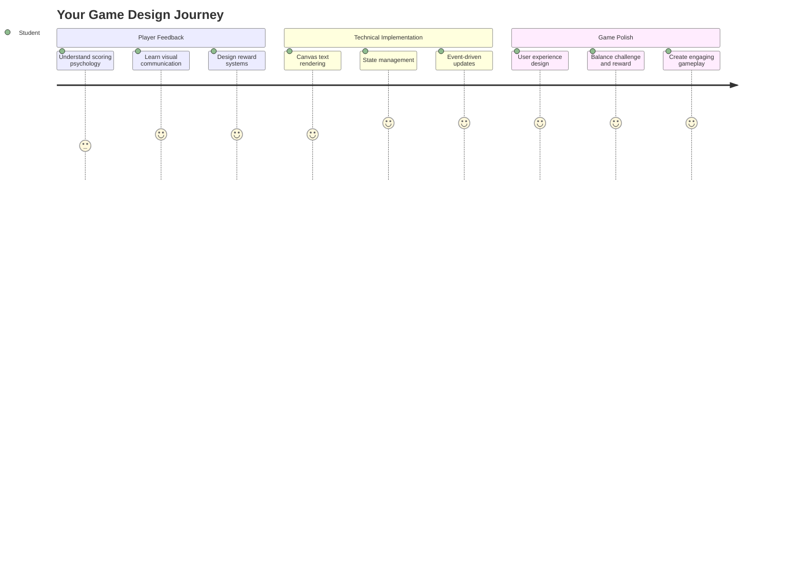
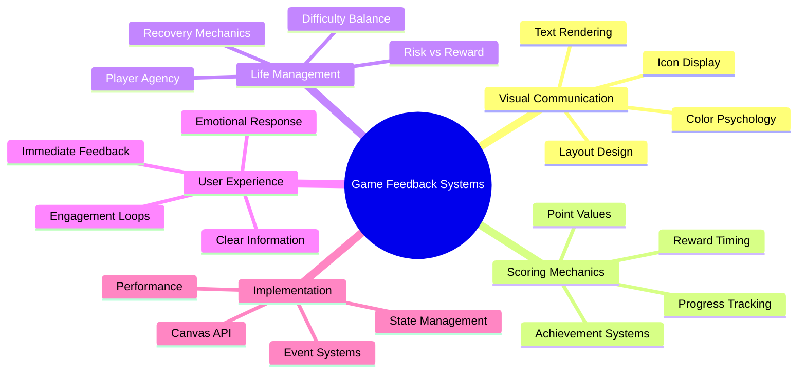
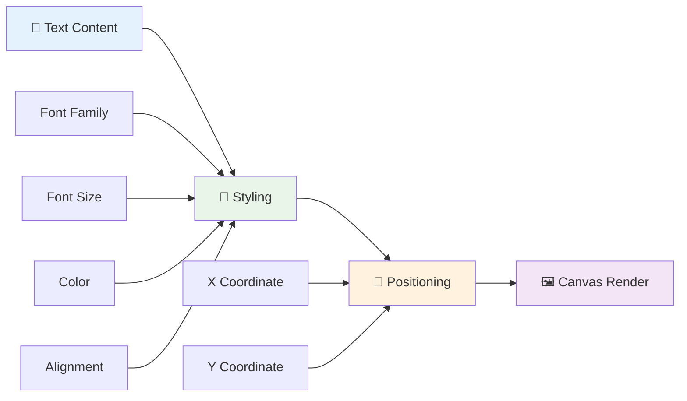
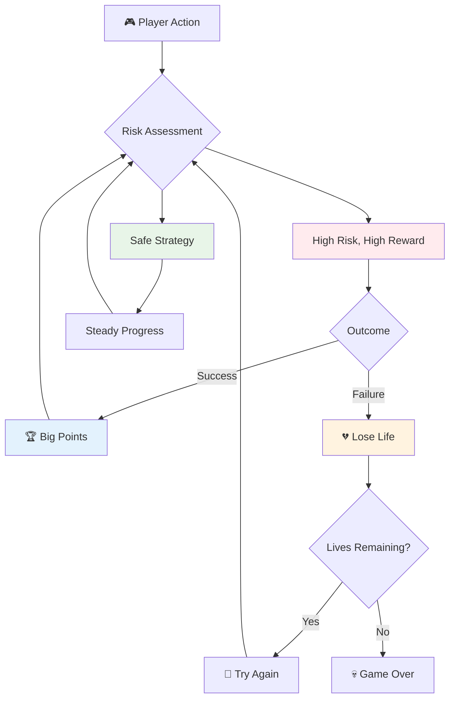
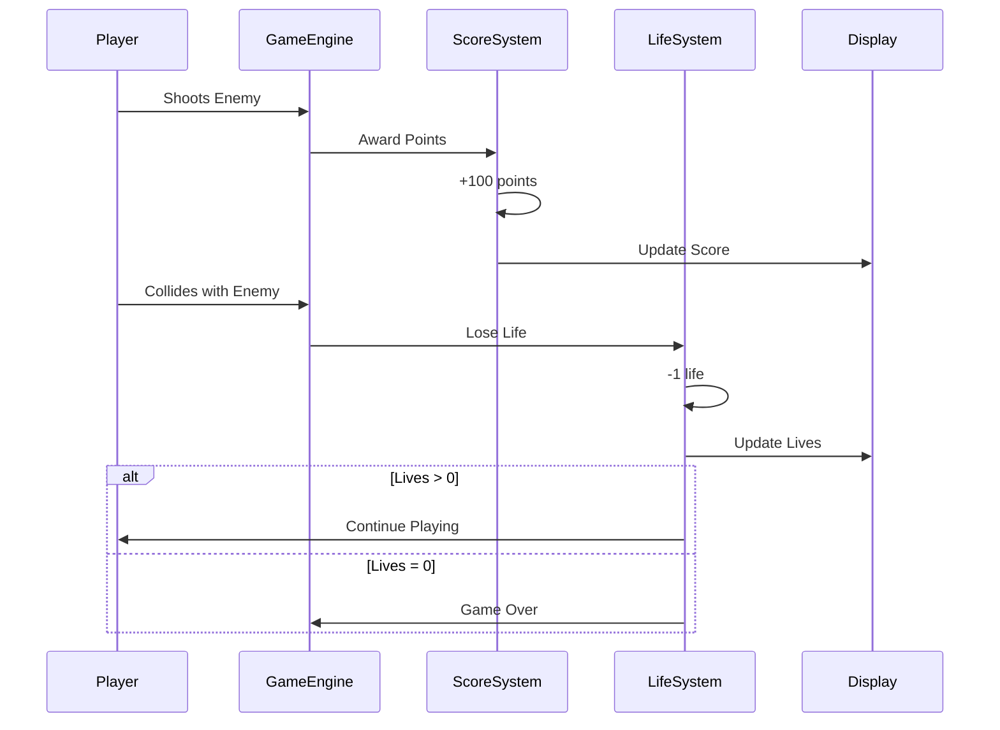
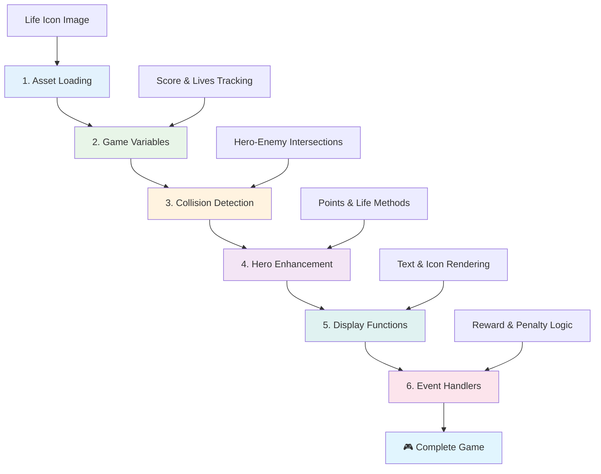
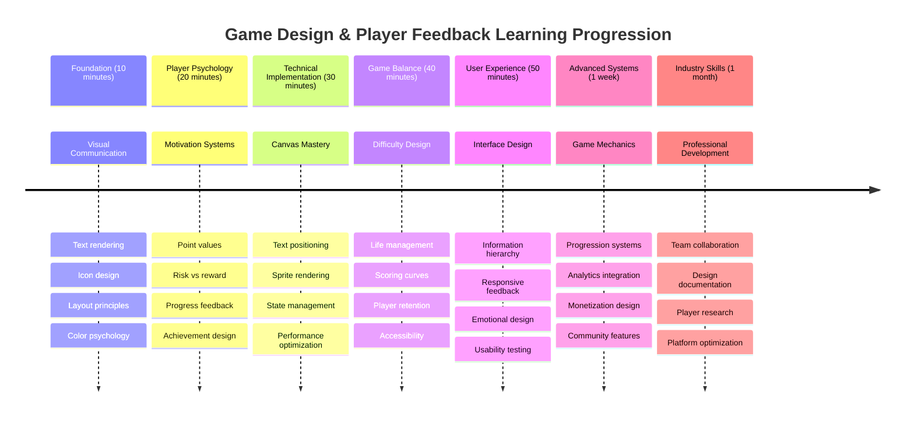

<!--
CO_OP_TRANSLATOR_METADATA:
{
  "original_hash": "2ed9145a16cf576faa2a973dff84d099",
  "translation_date": "2025-11-04T02:39:47+00:00",
  "source_file": "6-space-game/5-keeping-score/README.md",
  "language_code": "he"
}
-->
# בנה משחק חלל חלק 5: ניקוד וחיים



## חידון לפני ההרצאה

[חידון לפני ההרצאה](https://ff-quizzes.netlify.app/web/quiz/37)

מוכנים להפוך את משחק החלל שלכם למשחק אמיתי? בואו נוסיף מערכת ניקוד וניהול חיים - המכניקות הבסיסיות שהפכו משחקי ארקייד מוקדמים כמו Space Invaders מהדגמות פשוטות לבידור ממכר. כאן המשחק שלכם באמת הופך להיות ניתן למשחק.



## הצגת טקסט על המסך - הקול של המשחק שלכם

כדי להציג את הניקוד שלכם, עלינו ללמוד כיצד להציג טקסט על הקנבס. השיטה `fillText()` היא הכלי העיקרי שלכם לכך - זו אותה טכניקה ששימשה במשחקי ארקייד קלאסיים להצגת ניקוד ומידע על מצב המשחק.



יש לכם שליטה מלאה על מראה הטקסט:

```javascript
ctx.font = "30px Arial";
ctx.fillStyle = "red";
ctx.textAlign = "right";
ctx.fillText("show this on the screen", 0, 0);
```

✅ חקרו לעומק [הוספת טקסט לקנבס](https://developer.mozilla.org/docs/Web/API/Canvas_API/Tutorial/Drawing_text) - ייתכן שתופתעו לגלות עד כמה ניתן להיות יצירתיים עם גופנים ועיצוב!

## חיים - יותר מסתם מספר

בעיצוב משחקים, "חיים" מייצגים את מרווח הטעות של השחקן. הרעיון הזה קיים עוד מימי מכונות הפינבול, שבהן הייתם מקבלים מספר כדורים לשחק איתם. במשחקי וידאו מוקדמים כמו Asteroids, חיים נתנו לשחקנים רשות לקחת סיכונים וללמוד מטעויות.



לייצוג חזותי יש חשיבות רבה - הצגת אייקונים של חלליות במקום רק "חיים: 3" יוצרת זיהוי חזותי מיידי, בדומה לאופן שבו מכונות ארקייד מוקדמות השתמשו באייקונים כדי לתקשר מעבר למחסומי שפה.

## בניית מערכת התגמולים של המשחק שלכם

עכשיו ניישם את מערכות המשוב המרכזיות שמחזיקות את השחקנים מעורבים:



- **מערכת ניקוד**: כל ספינת אויב שהושמדה מזכה ב-100 נקודות (מספרים עגולים קלים יותר לחישוב מנטלי עבור השחקנים). הניקוד יוצג בפינה השמאלית התחתונה.
- **מונה חיים**: הגיבור שלכם מתחיל עם שלושה חיים - סטנדרט שנקבע על ידי משחקי ארקייד מוקדמים כדי לאזן בין אתגר לבין יכולת משחק. כל התנגשות עם אויב תעלה בחיים אחד. נציג את מספר החיים הנותרים בפינה הימנית התחתונה באמצעות אייקונים של חלליות .

## בואו נתחיל לבנות!

ראשית, הכינו את סביבת העבודה שלכם. גשו לקבצים בתיקיית המשנה `your-work`. אתם אמורים לראות את הקבצים הבאים:

```bash
-| assets
  -| enemyShip.png
  -| player.png
  -| laserRed.png
-| index.html
-| app.js
-| package.json
```

כדי לבדוק את המשחק שלכם, הפעילו את שרת הפיתוח מתוך תיקיית `your_work`:

```bash
cd your-work
npm start
```

זה יפעיל שרת מקומי בכתובת `http://localhost:5000`. פתחו את הכתובת הזו בדפדפן שלכם כדי לראות את המשחק. בדקו את השליטה עם מקשי החצים ונסו לירות באויבים כדי לוודא שהכול עובד.



### זמן לקודד!

1. **השיגו את הנכסים הוויזואליים שתצטרכו**. העתיקו את הנכס `life.png` מתיקיית `solution/assets/` לתיקיית `your-work`. לאחר מכן הוסיפו את lifeImg לפונקציה window.onload:

    ```javascript
    lifeImg = await loadTexture("assets/life.png");
    ```

1. אל תשכחו להוסיף את `lifeImg` לרשימת הנכסים שלכם:

    ```javascript
    let heroImg,
    ...
    lifeImg,
    ...
    eventEmitter = new EventEmitter();
    ```
  
2. **הגדירו את משתני המשחק שלכם**. הוסיפו קוד למעקב אחר הניקוד הכולל שלכם (מתחיל ב-0) והחיים הנותרים (מתחיל ב-3). נציג את אלה על המסך כדי שהשחקנים תמיד ידעו היכן הם עומדים.

3. **ממשו זיהוי התנגשות**. הרחיבו את הפונקציה `updateGameObjects()` כדי לזהות מתי אויבים מתנגשים עם הגיבור שלכם:

    ```javascript
    enemies.forEach(enemy => {
        const heroRect = hero.rectFromGameObject();
        if (intersectRect(heroRect, enemy.rectFromGameObject())) {
          eventEmitter.emit(Messages.COLLISION_ENEMY_HERO, { enemy });
        }
      })
    ```

4. **הוסיפו מעקב חיים ונקודות לגיבור שלכם**. 
   1. **אתחול המונים**. מתחת ל-`this.cooldown = 0` במחלקת `Hero`, הגדירו חיים ונקודות:

        ```javascript
        this.life = 3;
        this.points = 0;
        ```

   1. **הציגו את הערכים האלה לשחקן**. צרו פונקציות לציור הערכים האלה על המסך:

        ```javascript
        function drawLife() {
          // TODO, 35, 27
          const START_POS = canvas.width - 180;
          for(let i=0; i < hero.life; i++ ) {
            ctx.drawImage(
              lifeImg, 
              START_POS + (45 * (i+1) ), 
              canvas.height - 37);
          }
        }
        
        function drawPoints() {
          ctx.font = "30px Arial";
          ctx.fillStyle = "red";
          ctx.textAlign = "left";
          drawText("Points: " + hero.points, 10, canvas.height-20);
        }
        
        function drawText(message, x, y) {
          ctx.fillText(message, x, y);
        }

        ```

   1. **חברו הכול ללולאת המשחק שלכם**. הוסיפו את הפונקציות האלה לפונקציה window.onload מיד אחרי `updateGameObjects()`:

        ```javascript
        drawPoints();
        drawLife();
        ```

### 🔄 **בדיקה פדגוגית**
**הבנת עיצוב משחקים**: לפני יישום השלכות, ודאו שאתם מבינים:
- ✅ כיצד משוב חזותי מתקשר את מצב המשחק לשחקנים
- ✅ מדוע מיקום עקבי של אלמנטים בממשק משתמש משפר את השימושיות
- ✅ הפסיכולוגיה שמאחורי ערכי נקודות וניהול חיים
- ✅ כיצד הצגת טקסט בקנבס שונה מהצגת טקסט ב-HTML

**מבחן עצמי מהיר**: מדוע משחקי ארקייד משתמשים בדרך כלל במספרים עגולים לערכי נקודות?
*תשובה: מספרים עגולים קלים יותר לחישוב מנטלי ויוצרים תגמול פסיכולוגי מספק*

**עקרונות חוויית משתמש**: כעת אתם מיישמים:
- **היררכיה חזותית**: מיקום מידע חשוב במקום בולט
- **משוב מיידי**: עדכונים בזמן אמת לפעולות השחקן
- **עומס קוגניטיבי**: הצגת מידע פשוטה וברורה
- **עיצוב רגשי**: אייקונים וצבעים שיוצרים חיבור רגשי עם השחקן

1. **ממשו השלכות ותגמולים במשחק**. עכשיו נוסיף את מערכות המשוב שהופכות את פעולות השחקן למשמעותיות:

   1. **התנגשויות עולות בחיים**. בכל פעם שהגיבור שלכם מתנגש באויב, תאבדו חיים.
   
      הוסיפו את השיטה הזו למחלקת `Hero`:

        ```javascript
        decrementLife() {
          this.life--;
          if (this.life === 0) {
            this.dead = true;
          }
        }
        ```

   2. **פגיעה באויבים מזכה בנקודות**. כל פגיעה מוצלחת מזכה ב-100 נקודות, ומספקת משוב חיובי מיידי על ירי מדויק.

      הרחיבו את מחלקת Hero עם שיטת ההוספה הזו:
    
        ```javascript
          incrementPoints() {
            this.points += 100;
          }
        ```

        כעת חברו את הפונקציות האלה לאירועי ההתנגשות:

        ```javascript
        eventEmitter.on(Messages.COLLISION_ENEMY_LASER, (_, { first, second }) => {
           first.dead = true;
           second.dead = true;
           hero.incrementPoints();
        })

        eventEmitter.on(Messages.COLLISION_ENEMY_HERO, (_, { enemy }) => {
           enemy.dead = true;
           hero.decrementLife();
        });
        ```

✅ סקרנים לגבי משחקים אחרים שנבנו עם JavaScript ו-Canvas? חקרו קצת - ייתכן שתופתעו ממה שאפשרי!

לאחר יישום התכונות האלה, בדקו את המשחק שלכם כדי לראות את מערכת המשוב המלאה בפעולה. אתם אמורים לראות אייקוני חיים בפינה הימנית התחתונה, את הניקוד שלכם בפינה השמאלית התחתונה, ולראות כיצד התנגשויות מפחיתות חיים בעוד שפגיעות מוצלחות מעלות את הניקוד.

למשחק שלכם כעת יש את המכניקות החיוניות שהפכו את משחקי הארקייד המוקדמים לכל כך מרתקים - מטרות ברורות, משוב מיידי והשלכות משמעותיות לפעולות השחקן.

### 🔄 **בדיקה פדגוגית**
**מערכת עיצוב משחקים שלמה**: ודאו את שליטתכם במערכות משוב לשחקן:
- ✅ כיצד מכניקות ניקוד יוצרות מוטיבציה ומעורבות אצל השחקן?
- ✅ מדוע עקביות חזותית חשובה לעיצוב ממשק משתמש?
- ✅ כיצד מערכת החיים מאזנת בין אתגר לשימור שחקנים?
- ✅ מה תפקיד המשוב המיידי ביצירת חוויית משחק מספקת?

**שילוב מערכות**: מערכת המשוב שלכם מדגימה:
- **עיצוב חוויית משתמש**: תקשורת חזותית ברורה והיררכיית מידע
- **ארכיטקטורה מונחית אירועים**: עדכונים תגובתיים לפעולות השחקן
- **ניהול מצב**: מעקב והצגת נתוני משחק דינמיים
- **שליטה בקנבס**: הצגת טקסט מקצועית עם עיצוב ומיקום
- **פסיכולוגיית משחקים**: הבנת מוטיבציה ומעורבות של שחקנים

**תבניות מקצועיות**: יישמתם:
- **ארכיטקטורת MVC**: הפרדת לוגיקת המשחק, נתונים והצגה
- **תבנית הצופה**: עדכונים מונחי אירועים לשינויים במצב המשחק
- **עיצוב רכיבים**: פונקציות לשימוש חוזר להצגה ולוגיקה
- **אופטימיזציית ביצועים**: הצגה יעילה בלולאות משחק

### ⚡ **מה תוכלו לעשות ב-5 הדקות הבאות**
- [ ] נסו גדלים וצבעים שונים לגופן של תצוגת הניקוד
- [ ] נסו לשנות את ערכי הנקודות ולראות כיצד זה משפיע על תחושת המשחק
- [ ] הוסיפו פקודות console.log כדי לעקוב אחרי שינויים בנקודות ובחיים
- [ ] בדקו מקרים קיצוניים כמו סיום חיים או השגת ניקוד גבוה

### 🎯 **מה תוכלו להשיג בשעה הקרובה**
- [ ] השלימו את החידון שלאחר השיעור והבינו את פסיכולוגיית עיצוב המשחקים
- [ ] הוסיפו אפקטים קוליים לניקוד ואיבוד חיים
- [ ] מימוש מערכת ניקוד גבוהה באמצעות localStorage
- [ ] יצירת ערכי נקודות שונים לסוגי אויבים שונים
- [ ] הוספת אפקטים חזותיים כמו רעידת מסך בעת איבוד חיים

### 📅 **מסע עיצוב המשחקים שלכם לשבוע הקרוב**
- [ ] השלימו את משחק החלל המלא עם מערכות משוב מלוטשות
- [ ] מימוש מכניקות ניקוד מתקדמות כמו מכפילי קומבו
- [ ] הוספת הישגים ותוכן שניתן לפתוח
- [ ] יצירת מערכות התקדמות ואיזון קושי
- [ ] עיצוב ממשקי משתמש לתפריטים ומסכי סיום משחק
- [ ] חקרו משחקים אחרים כדי להבין מנגנוני מעורבות

### 🌟 **שליטה בפיתוח משחקים תוך חודש**
- [ ] בניית משחקים שלמים עם מערכות התקדמות מתוחכמות
- [ ] למידת ניתוח משחקים ומדידת התנהגות שחקנים
- [ ] תרומה לפרויקטים של פיתוח משחקים בקוד פתוח
- [ ] שליטה בתבניות עיצוב משחקים מתקדמות ומוניטיזציה
- [ ] יצירת תוכן חינוכי על עיצוב משחקים וחוויית משתמש
- [ ] בניית תיק עבודות המציג כישורי עיצוב ופיתוח משחקים

## 🎯 ציר הזמן לשליטה בעיצוב משחקים



### 🛠️ סיכום ערכת הכלים לעיצוב משחקים

לאחר השלמת השיעור הזה, כעת שלטתם ב:
- **פסיכולוגיית שחקנים**: הבנת מוטיבציה, סיכון/תגמול ולולאות מעורבות
- **תקשורת חזותית**: עיצוב ממשק משתמש יעיל באמצעות טקסט, אייקונים ופריסה
- **מערכות משוב**: תגובה בזמן אמת לפעולות שחקנים ואירועי משחק
- **ניהול מצב**: מעקב והצגת נתוני משחק דינמיים ביעילות
- **הצגת טקסט בקנבס**: הצגת טקסט מקצועית עם עיצוב ומיקום
- **שילוב אירועים**: חיבור פעולות משתמש להשלכות משמעותיות במשחק
- **איזון משחק**: עיצוב עקומות קושי ומערכות התקדמות שחקנים

**יישומים בעולם האמיתי**: כישורי עיצוב המשחקים שלכם חלים ישירות על:
- **עיצוב ממשק משתמש**: יצירת ממשקים אינטואיטיביים ומרתקים
- **פיתוח מוצרים**: הבנת מוטיבציה של משתמשים ולולאות משוב
- **טכנולוגיה חינוכית**: גיימיפיקציה ומערכות מעורבות בלמידה
- **הצגת נתונים**: הפיכת מידע מורכב לנגיש ומרתק
- **פיתוח אפליקציות מובייל**: מנגנוני שימור ועיצוב חוויית משתמש
- **טכנולוגיית שיווק**: הבנת התנהגות משתמשים ואופטימיזציה של המרה

**כישורים מקצועיים שנרכשו**: כעת תוכלו:
- **לעצב** חוויות משתמש שמניעות ומעוררות משתמשים
- **ליישם** מערכות משוב שמנחות את התנהגות המשתמשים ביעילות
- **לאזן** בין אתגר ונגישות במערכות אינטראקטיביות
- **ליצור** תקשורת חזותית שעובדת עם קבוצות משתמשים שונות
- **לנתח** התנהגות משתמשים ולשפר עיצובים

**מושגי פיתוח משחקים שנרכשו**:
- **מוטיבציה של שחקנים**: הבנת מה מניע מעורבות ושימור
- **עיצוב חזותי**: יצירת ממשקים ברורים, אטרקטיביים ופונקציונליים
- **שילוב מערכות**: חיבור מערכות משחק שונות לחוויה קוהרנטית
- **אופטימיזציית ביצועים**: הצגה יעילה וניהול מצב
- **נגישות**: עיצוב לרמות מיומנות וצרכים שונים של שחקנים

**הרמה הבאה**: אתם מוכנים לחקור תבניות עיצוב משחקים מתקדמות, ליישם מערכות ניתוח או ללמוד אסטרטגיות מוניטיזציה ושימור שחקנים!

🌟 **הישג נפתח**: בניתם מערכת משוב לשחקן שלמה עם עקרונות עיצוב משחקים מקצועיים!

---

## אתגר סוכן GitHub Copilot 🚀

השתמשו במצב סוכן כדי להשלים את האתגר הבא:

**תיאור:** שפרו את מערכת הניקוד של משחק החלל על ידי יישום תכונת ניקוד גבוה עם אחסון מתמשך ומכניקות ניקוד בונוס.

**הנחיה:** צרו מערכת ניקוד גבוה ששומרת את הניקוד הטוב ביותר של השחקן ב-localStorage. הוסיפו נקודות בונוס על הריגות אויב רצופות (מערכת קומבו) ויישמו ערכי נקודות שונים לסוגי אויבים שונים. הוסיפו אינדיקטור חזותי כאשר השחקן משיג ניקוד גבוה חדש והציגו את הניקוד הגבוה הנוכחי על מסך המשחק.


## 🚀 אתגר

כעת יש לכם משחק פונקציונלי עם ניקוד וחיים. חשבו אילו תכונות נוספות עשויות לשפר את חוויית השחקן.

## חידון לאחר ההרצאה

[חידון לאחר ההרצאה](https://ff-quizzes.netlify.app/web/quiz/38)

## סקירה ולמידה עצמית

רוצים לחקור עוד? חקרו גישות שונות למערכות ניקוד וחיים במשחקים. ישנם מנועי משחק מרתקים כמו [PlayFab](https://playfab.com) שמטפלים בניקוד, לוחות מובילים והתקדמות שחקנים. איך שילוב של משהו כזה יכול לקחת את המשחק שלכם לשלב הבא?

## משימה

[בנו משחק ניקוד](assignment.md)

---

**הצהרת אחריות**:  
מסמך זה תורגם באמצעות שירות תרגום מבוסס בינה מלאכותית [Co-op Translator](https://github.com/Azure/co-op-translator). למרות שאנו שואפים לדיוק, יש לקחת בחשבון שתרגומים אוטומטיים עשויים להכיל שגיאות או אי דיוקים. המסמך המקורי בשפתו המקורית צריך להיחשב כמקור סמכותי. למידע קריטי, מומלץ להשתמש בתרגום מקצועי על ידי אדם. אנו לא נושאים באחריות לכל אי הבנות או פרשנויות שגויות הנובעות משימוש בתרגום זה.