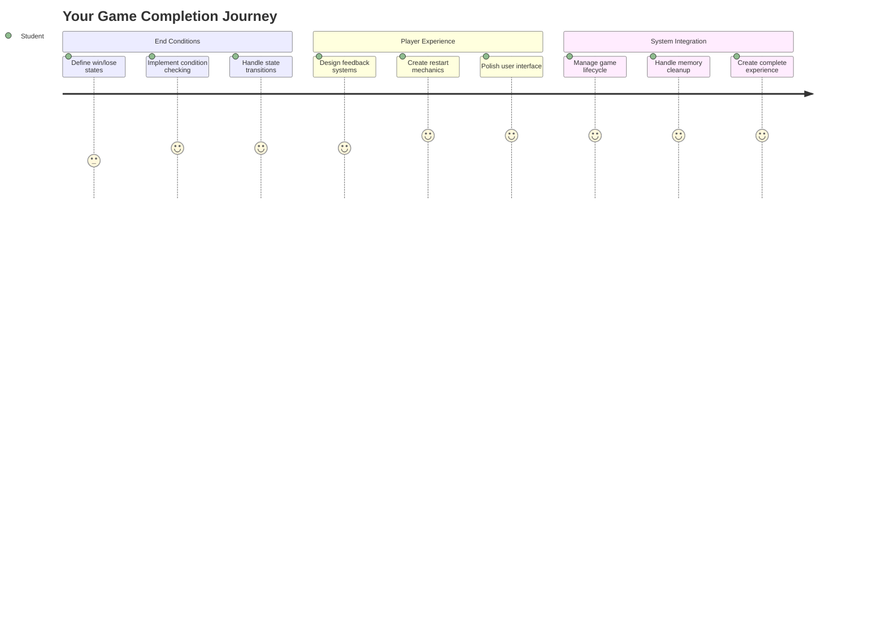
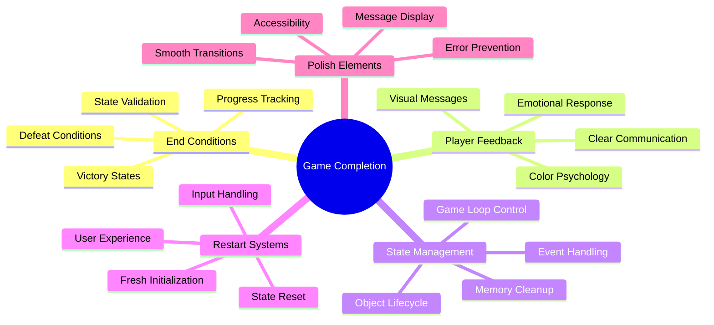
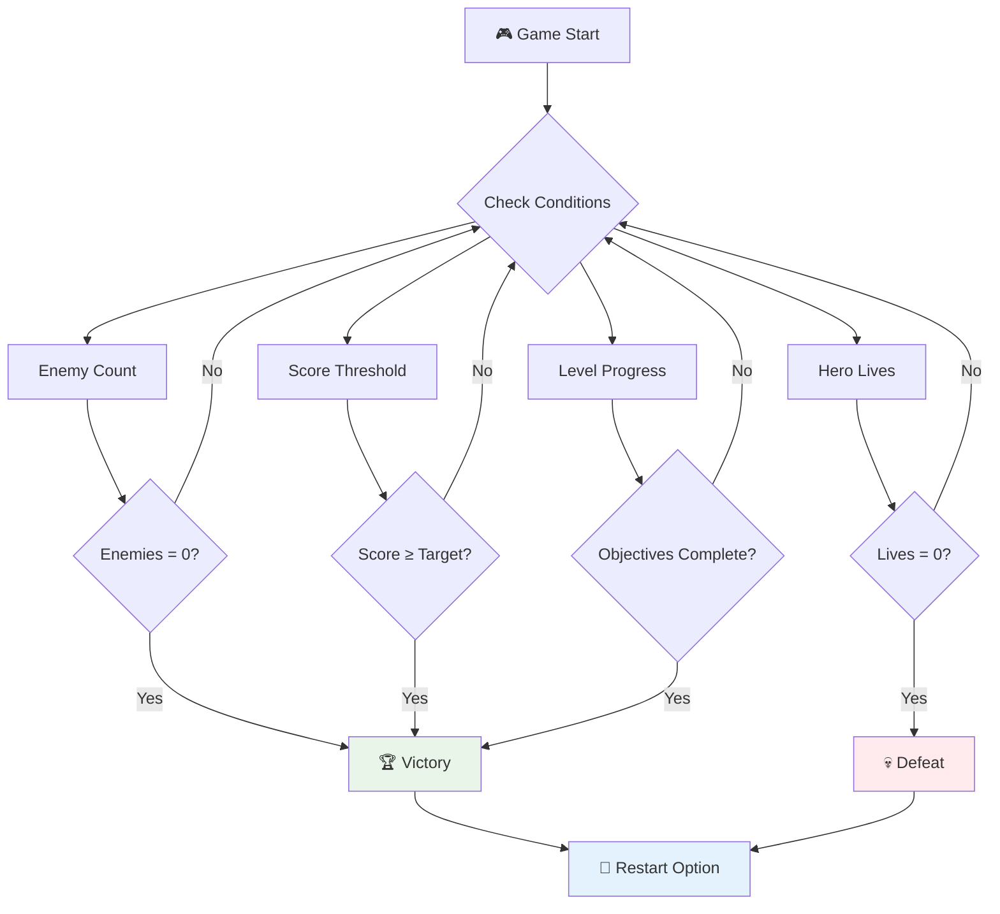
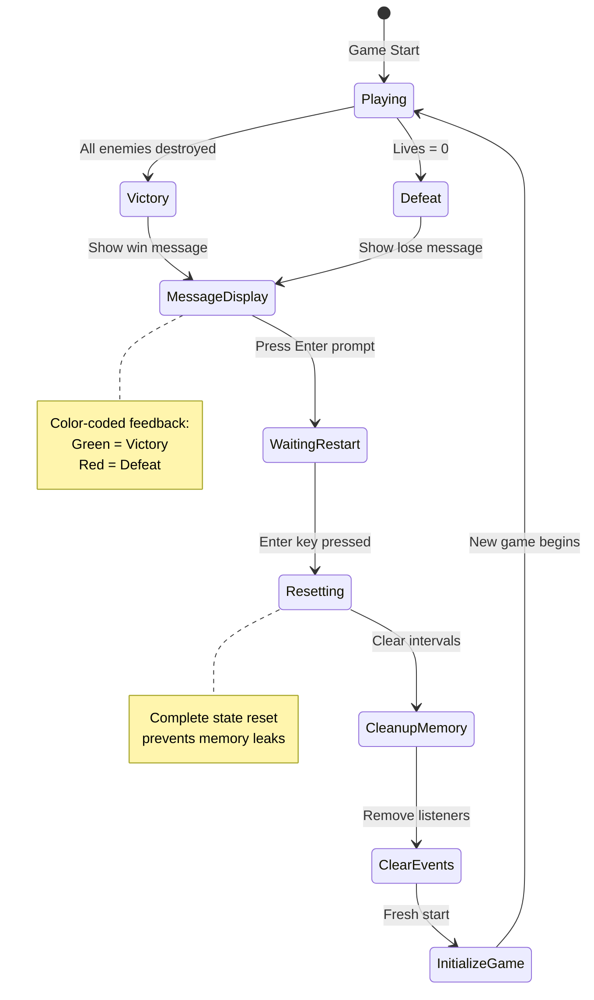
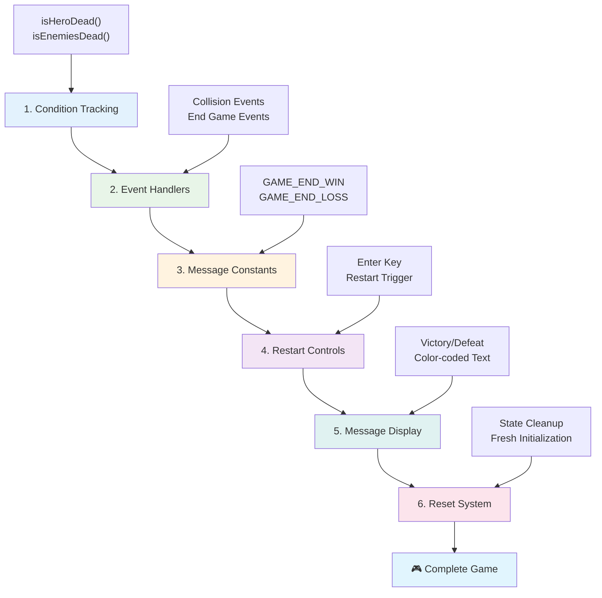
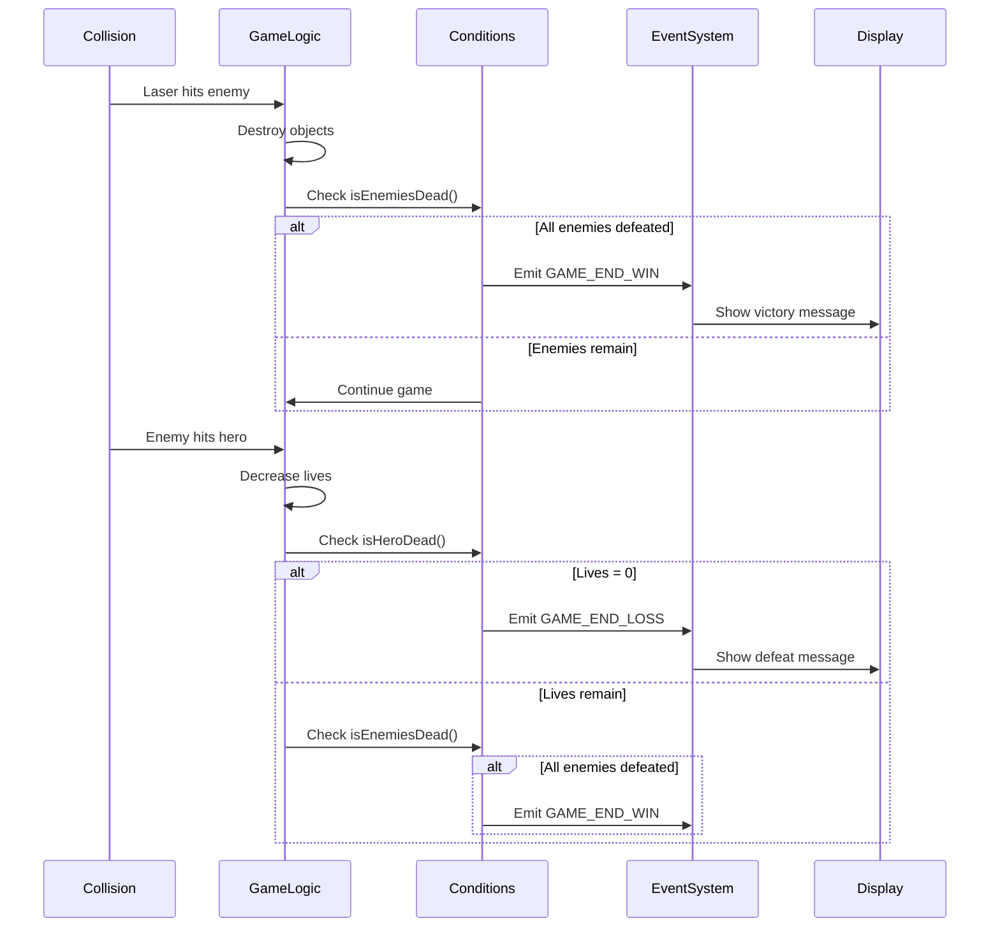
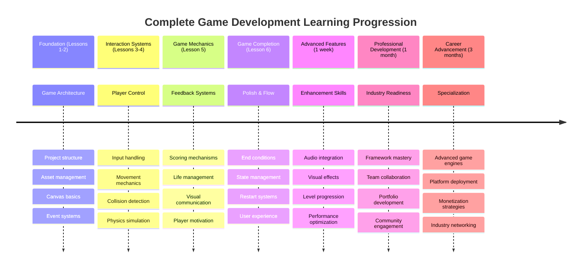

# בנה משחק חלל חלק 6: סיום והתחלה מחדש


  
כל משחק טוב זקוק לתנאי סיום ברורים ולמנגנון התחלה מחדש חלק. יצרת משחק חלל מרשים עם תנועה, קרב וניקוד - עכשיו הגיע הזמן להוסיף את החלקים האחרונים שיהפכו אותו למושלם.

המשחק שלך כרגע פועל ללא הגבלה, כמו גשושיות וויאג'ר ששיגרה נאס"א ב-1977 - עדיין מטיילות בחלל עשרות שנים לאחר מכן. בעוד שזה מתאים לחקר החלל, משחקים זקוקים לנקודות סיום מוגדרות כדי ליצור חוויות מספקות.

היום, ניישם תנאי ניצחון/הפסד ומערכת התחלה מחדש. בסוף השיעור הזה, יהיה לך משחק מלוטש ששחקנים יכולים להשלים ולשחק שוב, בדיוק כמו משחקי הארקייד הקלאסיים שהגדירו את התחום.


  
## שאלון לפני השיעור  

[שאלון לפני השיעור](https://ff-quizzes.netlify.app/web/quiz/39)  

## הבנת תנאי סיום במשחקים  

מתי המשחק שלך צריך להסתיים? שאלה בסיסית זו עיצבה את עיצוב המשחקים מאז עידן הארקייד המוקדם. פק-מן מסתיים כשנתפסת על ידי רוחות או כשמנקים את כל הנקודות, בעוד ש-Space Invaders מסתיים כשהחייזרים מגיעים לתחתית או כשאתה משמיד את כולם.

כמפתח המשחק, אתה מגדיר את תנאי הניצחון וההפסד. עבור משחק החלל שלנו, הנה גישות מוכחות שיוצרות משחקיות מרתקת:


  
- **`N` ספינות אויב הושמדו**: זה די נפוץ אם מחלקים את המשחק לרמות שונות שבהן צריך להשמיד `N` ספינות אויב כדי להשלים רמה.  
- **הספינה שלך הושמדה**: יש בהחלט משחקים שבהם מפסידים אם הספינה שלך נהרסת. גישה נפוצה נוספת היא שיש מושג של חיים. בכל פעם שהספינה שלך נהרסת זה מוריד חיים. ברגע שכל החיים אבדו, אתה מפסיד במשחק.  
- **אספת `N` נקודות**: תנאי סיום נפוץ נוסף הוא לאסוף נקודות. איך משיגים נקודות תלוי בך, אבל זה די נפוץ להקצות נקודות לפעילויות שונות כמו השמדת ספינת אויב או אולי איסוף פריטים שהפריטים *משאירים* כשהם נהרסים.  
- **השלמת רמה**: זה עשוי לכלול מספר תנאים כמו `X` ספינות אויב שהושמדו, `Y` נקודות שנאספו או אולי פריט ספציפי שנאסף.  

## יישום פונקציונליות התחלה מחדש במשחק  

משחקים טובים מעודדים משחק חוזר באמצעות מנגנוני התחלה מחדש חלקים. כאשר שחקנים משלימים משחק (או מפסידים), הם לעיתים קרובות רוצים לנסות שוב מיד - בין אם כדי לשפר את הניקוד או את הביצועים שלהם.


  
טטריס מדגים זאת בצורה מושלמת: כאשר הבלוקים שלך מגיעים לראש, אתה יכול להתחיל משחק חדש מיד מבלי לנווט בתפריטים מורכבים. נבנה מערכת התחלה מחדש דומה שמאפסת את מצב המשחק בצורה נקייה ומחזירה את השחקנים לפעולה במהירות.

✅ **הרהור**: חשבו על המשחקים ששיחקתם. באילו תנאים הם מסתיימים, וכיצד אתם מתבקשים להתחיל מחדש? מה הופך חוויית התחלה מחדש לחלקה לעומת מתסכלת?

## מה תבנו  

תיישמו את התכונות האחרונות שיהפכו את הפרויקט שלכם לחוויית משחק שלמה. אלמנטים אלו מבדילים משחקים מלוטשים מפרוטוטיפים בסיסיים.

**הנה מה שנוסיף היום:**  
1. **תנאי ניצחון**: השמד את כל האויבים וקבל חגיגה ראויה (הרווחת את זה!)  
2. **תנאי הפסד**: נגמרו החיים ותתמודד עם מסך הפסד  
3. **מנגנון התחלה מחדש**: לחץ Enter כדי לחזור מיד - כי משחק אחד אף פעם לא מספיק  
4. **ניהול מצב**: התחלה נקייה בכל פעם - בלי אויבים שנשארו או תקלות מוזרות מהמשחק הקודם  

## מתחילים  

בואו נכין את סביבת הפיתוח שלכם. עליכם להכין את כל קבצי משחק החלל שלכם מהשיעורים הקודמים.

**הפרויקט שלכם צריך להיראות בערך כך:**  

```bash
-| assets
  -| enemyShip.png
  -| player.png
  -| laserRed.png
  -| life.png
-| index.html
-| app.js
-| package.json
```
  
**הפעילו את שרת הפיתוח שלכם:**  

```bash
cd your-work
npm start
```
  
**הפקודה הזו:**  
- מפעילה שרת מקומי ב-`http://localhost:5000`  
- מגישה את הקבצים שלכם בצורה נכונה  
- מתעדכנת אוטומטית כשאתם מבצעים שינויים  

פתחו את `http://localhost:5000` בדפדפן שלכם ואשרו שהמשחק שלכם פועל. אתם אמורים להיות מסוגלים לזוז, לירות ולתקשר עם אויבים. לאחר אישור, נוכל להמשיך ליישום.

> 💡 **טיפ מקצועי**: כדי להימנע מאזהרות ב-Visual Studio Code, הכריזו על `gameLoopId` בראש הקובץ שלכם כ-`let gameLoopId;` במקום להכריז עליו בתוך פונקציית `window.onload`. זה עוקב אחר שיטות ההכרזה המודרניות של משתנים ב-JavaScript.


  
## שלבי היישום  

### שלב 1: יצירת פונקציות מעקב אחר תנאי סיום  

אנחנו צריכים פונקציות שינטרו מתי המשחק צריך להסתיים. כמו חיישנים בתחנת החלל הבינלאומית שמנטרים כל הזמן מערכות קריטיות, הפונקציות הללו יבדקו באופן רציף את מצב המשחק.

```javascript
function isHeroDead() {
  return hero.life <= 0;
}

function isEnemiesDead() {
  const enemies = gameObjects.filter((go) => go.type === "Enemy" && !go.dead);
  return enemies.length === 0;
}
```
  
**הנה מה שקורה מאחורי הקלעים:**  
- **בודק** אם לגיבור שלנו נגמרו החיים (אוי!)  
- **סופר** כמה אויבים עדיין חיים ובועטים  
- **מחזיר** `true` כשהשדה קרב נקי מאויבים  
- **משתמש** בלוגיקה פשוטה של true/false כדי לשמור על הדברים פשוטים  
- **מסנן** את כל אובייקטי המשחק כדי למצוא את השורדים  

### שלב 2: עדכון מטפלי אירועים לתנאי סיום  

עכשיו נחבר את בדיקות התנאים למערכת האירועים של המשחק. בכל פעם שמתרחשת התנגשות, המשחק יעריך אם היא מפעילה תנאי סיום. זה יוצר משוב מיידי לאירועים קריטיים במשחק.


  
```javascript
eventEmitter.on(Messages.COLLISION_ENEMY_LASER, (_, { first, second }) => {
    first.dead = true;
    second.dead = true;
    hero.incrementPoints();

    if (isEnemiesDead()) {
      eventEmitter.emit(Messages.GAME_END_WIN);
    }
});

eventEmitter.on(Messages.COLLISION_ENEMY_HERO, (_, { enemy }) => {
    enemy.dead = true;
    hero.decrementLife();
    if (isHeroDead())  {
      eventEmitter.emit(Messages.GAME_END_LOSS);
      return; // loss before victory
    }
    if (isEnemiesDead()) {
      eventEmitter.emit(Messages.GAME_END_WIN);
    }
});

eventEmitter.on(Messages.GAME_END_WIN, () => {
    endGame(true);
});
  
eventEmitter.on(Messages.GAME_END_LOSS, () => {
  endGame(false);
});
```
  
**מה קורה כאן:**  
- **לייזר פוגע באויב**: שניהם נעלמים, אתה מקבל נקודות, ואנחנו בודקים אם ניצחת  
- **אויב פוגע בך**: אתה מאבד חיים, ואנחנו בודקים אם אתה עדיין חי  
- **סדר חכם**: אנחנו בודקים הפסד קודם (אף אחד לא רוצה לנצח ולהפסיד באותו זמן!)  
- **תגובות מיידיות**: ברגע שמשהו חשוב קורה, המשחק יודע על זה  

### שלב 3: הוספת קבועי הודעות חדשים  

תצטרכו להוסיף סוגי הודעות חדשים לאובייקט הקבועים `Messages` שלכם. קבועים אלו עוזרים לשמור על עקביות ולמנוע שגיאות כתיב במערכת האירועים שלכם.

```javascript
GAME_END_LOSS: "GAME_END_LOSS",
GAME_END_WIN: "GAME_END_WIN",
```
  
**במה מדובר:**  
- **הוספנו** קבועים לאירועי סיום המשחק כדי לשמור על עקביות  
- **השתמשנו** בשמות תיאוריים שמציינים בבירור את מטרת האירוע  
- **עקבנו** אחר קונבנציית השמות הקיימת עבור סוגי הודעות  

### שלב 4: יישום בקרות התחלה מחדש  

עכשיו תוסיפו בקרות מקלדת שמאפשרות לשחקנים להתחיל מחדש את המשחק. מקש Enter הוא בחירה טבעית מכיוון שהוא מזוהה בדרך כלל עם אישור פעולות והתחלת משחקים חדשים.

**הוסיפו זיהוי מקש Enter למאזין אירועי keydown הקיים שלכם:**  

```javascript
else if(evt.key === "Enter") {
   eventEmitter.emit(Messages.KEY_EVENT_ENTER);
}
```
  
**הוסיפו את קבוע ההודעה החדש:**  

```javascript
KEY_EVENT_ENTER: "KEY_EVENT_ENTER",
```
  
**מה שצריך לדעת:**  
- **מרחיב** את מערכת טיפול באירועי המקלדת הקיימת שלכם  
- **משתמש** במקש Enter כטריגר להתחלה מחדש לחוויית משתמש אינטואיטיבית  
- **משדר** אירוע מותאם אישית שחלקים אחרים במשחק שלכם יכולים להאזין לו  
- **שומר** על אותו דפוס כמו בקרות המקלדת האחרות שלכם  

### שלב 5: יצירת מערכת הצגת הודעות  

המשחק שלכם צריך לתקשר תוצאות בצורה ברורה לשחקנים. ניצור מערכת הודעות שמציגה מצבי ניצחון והפסד באמצעות טקסט בצבעים שונים, בדומה לממשקי הטרמינל של מחשבים מוקדמים שבהם ירוק סימן הצלחה ואדום סימן שגיאות.

**צרו את הפונקציה `displayMessage()`:**  

```javascript
function displayMessage(message, color = "red") {
  ctx.font = "30px Arial";
  ctx.fillStyle = color;
  ctx.textAlign = "center";
  ctx.fillText(message, canvas.width / 2, canvas.height / 2);
}
```
  
**שלב אחר שלב, הנה מה שקורה:**  
- **מגדיר** את גודל הגופן והמשפחה לטקסט ברור וקריא  
- **מיישם** פרמטר צבע עם "אדום" כברירת מחדל לאזהרות  
- **מרכז** את הטקסט אופקית ואנכית על הקנבס  
- **משתמש** בפרמטרים ברירת מחדל מודרניים של JavaScript לאפשרויות צבע גמישות  
- **מנצל** את הקשר 2D של הקנבס לציור טקסט ישיר  

**צרו את הפונקציה `endGame()`:**  

```javascript
function endGame(win) {
  clearInterval(gameLoopId);

  // Set a delay to ensure any pending renders complete
  setTimeout(() => {
    ctx.clearRect(0, 0, canvas.width, canvas.height);
    ctx.fillStyle = "black";
    ctx.fillRect(0, 0, canvas.width, canvas.height);
    if (win) {
      displayMessage(
        "Victory!!! Pew Pew... - Press [Enter] to start a new game Captain Pew Pew",
        "green"
      );
    } else {
      displayMessage(
        "You died !!! Press [Enter] to start a new game Captain Pew Pew"
      );
    }
  }, 200)  
}
```
  
**מה הפונקציה הזו עושה:**  
- **מקפיאה** הכל במקום - אין יותר תנועת ספינות או לייזרים  
- **לוקחת** הפסקה קטנה (200ms) כדי לתת למסגרת האחרונה לסיים לצייר  
- **מנקה** את המסך ומציירת אותו בשחור לאפקט דרמטי  
- **מציגה** הודעות שונות למנצחים ולמפסידים  
- **מקודדת בצבע** את החדשות - ירוק לטוב, אדום ל... טוב, לא כל כך טוב  
- **אומרת** לשחקנים בדיוק איך לחזור למשחק  

### 🔄 **בדיקה פדגוגית**  
**ניהול מצב משחק**: לפני יישום פונקציונליות האיפוס, ודאו שאתם מבינים:  
- ✅ כיצד תנאי סיום יוצרים מטרות משחק ברורות  
- ✅ מדוע משוב חזותי חיוני להבנת השחקן  
- ✅ חשיבות הניקוי הנכון במניעת דליפות זיכרון  
- ✅ כיצד ארכיטקטורה מונעת אירועים מאפשרת מעבר מצב נקי  

**מבחן עצמי מהיר**: מה יקרה אם לא תנקו מאזיני אירועים במהלך האיפוס?  
*תשובה: דליפות זיכרון ומטפלי אירועים כפולים שגורמים להתנהגות בלתי צפויה*  

**עקרונות עיצוב משחק**: אתם עכשיו מיישמים:  
- **מטרות ברורות**: שחקנים יודעים בדיוק מה מגדיר הצלחה וכישלון  
- **משוב מיידי**: שינויים במצב המשחק מתקשרים מיד  
- **שליטה למשתמש**: שחקנים יכולים להתחיל מחדש כשהם מוכנים  
- **אמינות מערכת**: ניקוי נכון מונע באגים ובעיות ביצועים  

### שלב 6: יישום פונקציונליות איפוס משחק  

מערכת האיפוס צריכה לנקות לחלוטין את מצב המשחק הנוכחי ולהתחיל משחק חדש. זה מבטיח שהשחקנים יקבלו התחלה נקייה ללא נתונים שנותרו מהמשחק הקודם.

**צרו את הפונקציה `resetGame()`:**  

```javascript
function resetGame() {
  if (gameLoopId) {
    clearInterval(gameLoopId);
    eventEmitter.clear();
    initGame();
    gameLoopId = setInterval(() => {
      ctx.clearRect(0, 0, canvas.width, canvas.height);
      ctx.fillStyle = "black";
      ctx.fillRect(0, 0, canvas.width, canvas.height);
      drawPoints();
      drawLife();
      updateGameObjects();
      drawGameObjects(ctx);
    }, 100);
  }
}
```
  
**בואו נבין כל חלק:**  
- **בודק** אם לולאת משחק פועלת כרגע לפני האיפוס  
- **מנקה** את לולאת המשחק הקיימת כדי לעצור את כל פעילות המשחק הנוכחית  
- **מסיר** את כל מאזיני האירועים כדי למנוע דליפות זיכרון  
- **מאתחל מחדש** את מצב המשחק עם אובייקטים ומשתנים חדשים  
- **מתחיל** לולאת משחק חדשה עם כל פונקציות המשחק החיוניות  
- **שומר** על אותו מרווח של 100ms לביצועי משחק עקביים  

**הוסיפו את מטפל אירועי מקש Enter לפונקציה `initGame()`:**  

```javascript
eventEmitter.on(Messages.KEY_EVENT_ENTER, () => {
  resetGame();
});
```
  
**הוסיפו את השיטה `clear()` למחלקת EventEmitter שלכם:**  

```javascript
clear() {
  this.listeners = {};
}
```
  
**נקודות מפתח לזכור:**  
- **מחבר** את לחיצת מקש Enter לפונקציונליות האיפוס של המשחק  
- **רושם** את מאזין האירועים הזה במהלך אתחול המשחק  
- **מספק** דרך נקייה להסיר את כל מאזיני האירועים בעת האיפוס  
- **מונע** דליפות זיכרון על ידי ניקוי מטפלי אירועים בין משחקים  
- **מאפס** את אובייקט המאזינים למצב ריק לאתחול חדש  

## מזל טוב! 🎉  

👽 💥 🚀 בניתם בהצלחה משחק שלם מהיסוד. כמו המתכנתים שיצרו את משחקי הווידאו הראשונים בשנות ה-70, הפכתם שורות קוד לחוויה אינטראקטיבית עם מכניקת משחק נכונה ומשוב משתמש. 🚀 💥 👽  

**הישגים שלכם:**  
- **יישמתם** תנאי ניצחון והפסד מלאים עם משוב משתמש  
- **יצרתם** מערכת התחלה מחדש חלקה למשחק רציף  
- **עיצבתם** תקשורת חזותית ברורה למצבי משחק  
- **ניהלתם** מעברי מצב משחק מורכבים וניקוי  
- **הרכבתם** את כל הרכיבים למשחק שלם שניתן לשחק  

### 🔄 **בדיקה פדגוגית**  
**מערכת פיתוח משחק שלמה**: חגגו את השליטה שלכם במחזור הפיתוח המלא של משחקים:  
- ✅ כיצד תנאי סיום יוצרים חוויות שחקן מספקות?  
- ✅ מדוע ניהול מצב נכון קריטי ליציבות המשחק?  
- ✅ כיצד משוב חזותי משפר את הבנת השחקן?  
- ✅ מה תפקיד מערכת ההתחלה מחדש בשימור השחקן?  

**שליטה במערכת**: המשחק השלם שלכם מדגים:  
- **פיתוח משחק מלא**: מגרפיקה ועד קלט ועד ניהול מצב  
- **ארכיטקטורה מקצועית**: מערכות מונעות אירועים עם ניקוי נכון  
- **עיצוב חוויית משתמש**: משוב ברור ובקרות אינטואיטיביות  
- **אופטימיזציית ביצועים**: רינדור יעיל וניהול זיכרון  
- **גימור ושלמות**: כל הפרטים שהופכים משחק למושלם  

**מיומנויות מוכנות לתעשייה**: יישמתם:  
- **ארכיטקטורת לולאת משחק**: מערכות בזמן אמת עם ביצועים עקביים  
- **תכנות מונחה אירועים**: מערכות מופרדות שמתרחבות ביעילות  
- **ניהול מצב**: טיפול נתונים מורכב וניהול מחזור חיים  
- **עיצוב ממשק משתמש**: תקשורת ברורה ובקרות מגיבות  
- **בדיקות וניפוי שגיאות**: פיתוח איטרטיבי ופתרון בעיות  

### ⚡ **מה תוכלו לעשות ב-5 הדקות הקרובות**  
- [ ] שחקו במשחק השלם שלכם ובדקו את כל תנאי הניצחון וההפסד  
- [ ] נסו פרמטרים שונים לתנאי סיום  
- [ ] נסו להוסיף הצהרות console.log כדי לעקוב אחר שינויים במצב המשחק  
- [ ] שתפו את המשחק שלכם עם חברים ואספו משוב  

### 🎯 **מה תוכלו להשיג בשעה הקרובה**  
- [ ] השלימו את שאלון לאחר השיעור והרהרו במסע פיתוח המשחק שלכם  
- [ ] הוסיפו אפקטים קוליים למצבי ניצחון והפסד  
- [ ] יישמו תנאי סיום נוספים כמו מגבלות זמן או מטרות בונוס  
- [ ] צרו רמות קושי שונות עם מספרי אויב משתנים  
- [ ] שפרו את ההצגה החזותית עם פונטים וצבעים טובים יותר  

### 📅 **שליטה בפיתוח משחקים לאורך שבוע**  
- [ ] השלימו את משחק החלל המשופר עם רמות מרובות והתקדמות  
- [ ] הוסיפו תכונות מתקדמות כמו שדרוגים, סוגי אויב שונים ונשקים מיוחדים  
- [ ] צרו מערכת ניקוד גבוהה עם אחסון מתמשך  
- [ ] עיצבו ממשקי משתמש לתפריטים, הגדרות ואפשרויות משחק  
- [ ] בצעו אופטימיזציה לביצועים עבור מכשירים ודפדפנים שונים  
- [ ] פרסמו את המשחק שלכם אונליין ושתפו אותו עם הקהילה  
### 🌟 **קריירת פיתוח משחקים חודשית**
- [ ] פיתוח מספר משחקים מלאים תוך חקר ז'אנרים ומכניקות שונות
- [ ] לימוד מסגרות פיתוח משחקים מתקדמות כמו Phaser או Three.js
- [ ] תרומה לפרויקטים של פיתוח משחקים בקוד פתוח
- [ ] לימוד עקרונות עיצוב משחקים ופסיכולוגיית שחקנים
- [ ] יצירת תיק עבודות המציג את כישורי פיתוח המשחקים שלך
- [ ] התחברות לקהילת פיתוח המשחקים והמשך למידה

## 🎯 לוח זמנים מלא לשליטה בפיתוח משחקים



### 🛠️ סיכום ערכת הכלים המלאה שלך לפיתוח משחקים

לאחר שסיימת את סדרת משחקי החלל הזו, כעת שלטת ב:
- **ארכיטקטורת משחקים**: מערכות מבוססות אירועים, לולאות משחק וניהול מצבים
- **תכנות גרפי**: Canvas API, רינדור ספרייטים ואפקטים חזותיים
- **מערכות קלט**: טיפול במקלדת, זיהוי התנגשות ושליטה תגובתית
- **עיצוב משחקים**: משוב שחקנים, מערכות התקדמות ומכניקות מעורבות
- **אופטימיזציית ביצועים**: רינדור יעיל, ניהול זיכרון ושליטה בקצב פריימים
- **חוויית משתמש**: תקשורת ברורה, שליטה אינטואיטיבית ופרטים מלוטשים
- **דפוסים מקצועיים**: קוד נקי, טכניקות דיבוג וארגון פרויקטים

**יישומים בעולם האמיתי**: כישורי פיתוח המשחקים שלך חלים ישירות על:
- **יישומי אינטרנט אינטראקטיביים**: ממשקים דינמיים ומערכות בזמן אמת
- **הדמיית נתונים**: גרפים מונפשים וגרפיקה אינטראקטיבית
- **טכנולוגיה חינוכית**: גיימיפיקציה וחוויות למידה מרתקות
- **פיתוח מובייל**: אינטראקציות מבוססות מגע ואופטימיזציית ביצועים
- **תוכנות סימולציה**: מנועי פיזיקה ודימוי בזמן אמת
- **תעשיות יצירתיות**: אמנות אינטראקטיבית, בידור וחוויות דיגיטליות

**כישורים מקצועיים שנרכשו**: כעת אתה יכול:
- **לתכנן** מערכות אינטראקטיביות מורכבות מאפס
- **לדבג** יישומים בזמן אמת באמצעות גישות שיטתיות
- **לאופטם** ביצועים לחוויות משתמש חלקות
- **לעצב** ממשקי משתמש ומערכות אינטראקציה מרתקות
- **לשתף פעולה** ביעילות בפרויקטים טכניים עם ארגון קוד נכון

**מושגים בפיתוח משחקים שנלמדו**:
- **מערכות בזמן אמת**: לולאות משחק, ניהול קצב פריימים וביצועים
- **ארכיטקטורה מבוססת אירועים**: מערכות מנותקות והעברת הודעות
- **ניהול מצבים**: טיפול בנתונים מורכבים וניהול מחזור חיים
- **תכנות ממשק משתמש**: גרפיקה ב-Canvas ועיצוב תגובתי
- **תיאוריה של עיצוב משחקים**: פסיכולוגיית שחקנים ומכניקות מעורבות

**הרמה הבאה**: אתה מוכן לחקור מסגרות משחק מתקדמות, גרפיקה תלת-ממדית, מערכות מרובות משתתפים או לעבור לתפקידים מקצועיים בפיתוח משחקים!

🌟 **הישג נפתח**: סיימת מסע פיתוח משחקים מלא ובנית חוויה אינטראקטיבית מקצועית מאפס!

**ברוך הבא לקהילת פיתוח המשחקים!** 🎮✨

## אתגר סוכן GitHub Copilot 🚀

השתמש במצב סוכן כדי להשלים את האתגר הבא:

**תיאור:** שפר את משחק החלל על ידי יישום מערכת התקדמות שלבים עם קושי עולה ותכונות בונוס.

**הנחיה:** צור מערכת משחק חלל מרובת שלבים שבה בכל שלב יש יותר ספינות אויב עם מהירות ובריאות מוגברות. הוסף מכפיל ניקוד שמתגבר עם כל שלב, ויישם חיזוקים (כמו ירי מהיר או מגן) שמופיעים באופן אקראי כאשר אויבים מושמדים. כלול בונוס סיום שלב והצג את השלב הנוכחי על המסך לצד הניקוד והחיים הקיימים.

למידע נוסף על [מצב סוכן](https://code.visualstudio.com/blogs/2025/02/24/introducing-copilot-agent-mode) כאן.

## 🚀 אתגר שיפור אופציונלי

**הוסף אודיו למשחק שלך**: שפר את חוויית המשחק על ידי יישום אפקטים קוליים! שקול להוסיף אודיו עבור:

- **ירי לייזר** כאשר השחקן יורה
- **השמדת אויב** כאשר ספינות נפגעות
- **נזק לגיבור** כאשר השחקן נפגע
- **מוזיקת ניצחון** כאשר המשחק מנצח
- **צליל הפסד** כאשר המשחק מפסיד

**דוגמה ליישום אודיו:**

```javascript
// Create audio objects
const laserSound = new Audio('assets/laser.wav');
const explosionSound = new Audio('assets/explosion.wav');

// Play sounds during game events
function playLaserSound() {
  laserSound.currentTime = 0; // Reset to beginning
  laserSound.play();
}
```

**מה שאתה צריך לדעת:**
- **יוצר** אובייקטי אודיו עבור אפקטים קוליים שונים
- **מאפס** את `currentTime` כדי לאפשר אפקטים קוליים מהירים
- **מטפל** במדיניות הפעלה אוטומטית של דפדפנים על ידי הפעלת צלילים מאינטראקציות משתמש
- **מנהל** עוצמת קול ותזמון לחוויית משחק טובה יותר

> 💡 **משאב למידה**: חקור את [סביבת האודיו הזו](https://www.w3schools.com/jsref/tryit.asp?filename=tryjsref_audio_play) כדי ללמוד עוד על יישום אודיו במשחקי JavaScript.

## שאלון לאחר ההרצאה

[שאלון לאחר ההרצאה](https://ff-quizzes.netlify.app/web/quiz/40)

## סקירה ולימוד עצמי

המשימה שלך היא ליצור דוגמת משחק חדשה, אז חקור כמה משחקים מעניינים כדי לראות איזה סוג משחק תוכל לבנות.

## משימה

[בנה דוגמת משחק](assignment.md)

---

**כתב ויתור**:  
מסמך זה תורגם באמצעות שירות תרגום AI [Co-op Translator](https://github.com/Azure/co-op-translator). למרות שאנו שואפים לדיוק, יש לקחת בחשבון שתרגומים אוטומטיים עשויים להכיל שגיאות או אי דיוקים. המסמך המקורי בשפתו המקורית צריך להיחשב כמקור סמכותי. עבור מידע קריטי, מומלץ להשתמש בתרגום מקצועי אנושי. איננו אחראים לאי הבנות או לפרשנויות שגויות הנובעות משימוש בתרגום זה.