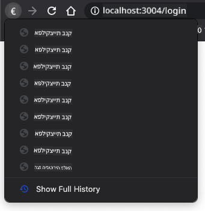

<!--
CO_OP_TRANSLATOR_METADATA:
{
  "original_hash": "8da1b5e2c63f749808858c53f37b8ce7",
  "translation_date": "2025-08-27T21:02:35+00:00",
  "source_file": "7-bank-project/1-template-route/README.md",
  "language_code": "he"
}
-->
# בניית אפליקציית בנק חלק 1: תבניות HTML ונתיבים באפליקציית ווב

## חידון לפני השיעור

[חידון לפני השיעור](https://ff-quizzes.netlify.app/web/quiz/41)

### מבוא

מאז הופעת JavaScript בדפדפנים, אתרי אינטרנט הופכים לאינטראקטיביים ומורכבים יותר מאי פעם. טכנולוגיות ווב משמשות כיום ליצירת אפליקציות מלאות הפועלות ישירות בדפדפן, שאנו מכנים [אפליקציות ווב](https://en.wikipedia.org/wiki/Web_application). מכיוון שאפליקציות ווב הן מאוד אינטראקטיביות, משתמשים לא רוצים להמתין לטעינה מחדש של כל הדף בכל פעם שמתבצעת פעולה. לכן, נעשה שימוש ב-JavaScript לעדכון ה-HTML ישירות באמצעות ה-DOM, כדי לספק חוויית משתמש חלקה יותר.

בשיעור זה, נניח את היסודות ליצירת אפליקציית בנק ווב, תוך שימוש בתבניות HTML ליצירת מסכים מרובים שניתן להציג ולעדכן מבלי לטעון מחדש את כל דף ה-HTML.

### דרישות מוקדמות

אתם צריכים שרת ווב מקומי כדי לבדוק את אפליקציית הווב שנבנה בשיעור זה. אם אין לכם אחד, תוכלו להתקין [Node.js](https://nodejs.org) ולהשתמש בפקודה `npx lite-server` מתוך תיקיית הפרויקט שלכם. זה ייצור שרת ווב מקומי ויפתח את האפליקציה שלכם בדפדפן.

### הכנה

במחשב שלכם, צרו תיקייה בשם `bank` עם קובץ בשם `index.html` בתוכה. נתחיל מתבנית [boilerplate](https://en.wikipedia.org/wiki/Boilerplate_code) של HTML:

```html
<!DOCTYPE html>
<html lang="en">
  <head>
    <meta charset="UTF-8">
    <meta name="viewport" content="width=device-width, initial-scale=1.0">
    <title>Bank App</title>
  </head>
  <body>
    <!-- This is where you'll work -->
  </body>
</html>
```

---

## תבניות HTML

אם אתם רוצים ליצור מסכים מרובים לדף ווב, פתרון אחד יהיה ליצור קובץ HTML נפרד לכל מסך שתרצו להציג. עם זאת, פתרון זה מגיע עם כמה חסרונות:

- יש לטעון מחדש את כל ה-HTML בעת מעבר בין מסכים, מה שיכול להיות איטי.
- קשה לשתף נתונים בין המסכים השונים.

גישה אחרת היא להשתמש בקובץ HTML אחד בלבד, ולהגדיר מספר [תבניות HTML](https://developer.mozilla.org/docs/Web/HTML/Element/template) באמצעות האלמנט `<template>`. תבנית היא בלוק HTML שניתן לשימוש חוזר, שאינו מוצג על ידי הדפדפן, ויש להפעיל אותו בזמן ריצה באמצעות JavaScript.

### משימה

ניצור אפליקציית בנק עם שני מסכים: דף התחברות ולוח בקרה. ראשית, נוסיף בגוף ה-HTML אלמנט placeholder שנשתמש בו כדי להפעיל את המסכים השונים של האפליקציה שלנו:

```html
<div id="app">Loading...</div>
```

נתנו לו `id` כדי להקל על איתורו באמצעות JavaScript מאוחר יותר.

> טיפ: מכיוון שהתוכן של אלמנט זה יוחלף, ניתן לשים בו הודעת טעינה או אינדיקטור שיוצגו בזמן שהאפליקציה נטענת.

לאחר מכן, נוסיף מתחתיו את תבנית ה-HTML לדף ההתחברות. לעת עתה, נשים שם רק כותרת ומקטע המכיל קישור שנשתמש בו לניווט.

```html
<template id="login">
  <h1>Bank App</h1>
  <section>
    <a href="/dashboard">Login</a>
  </section>
</template>
```

לאחר מכן נוסיף תבנית HTML נוספת לדף לוח הבקרה. דף זה יכיל מקטעים שונים:

- כותרת עם כותרת וקישור להתנתקות
- היתרה הנוכחית של חשבון הבנק
- רשימת עסקאות, שתוצג בטבלה

```html
<template id="dashboard">
  <header>
    <h1>Bank App</h1>
    <a href="/login">Logout</a>
  </header>
  <section>
    Balance: 100$
  </section>
  <section>
    <h2>Transactions</h2>
    <table>
      <thead>
        <tr>
          <th>Date</th>
          <th>Object</th>
          <th>Amount</th>
        </tr>
      </thead>
      <tbody></tbody>
    </table>
  </section>
</template>
```

> טיפ: בעת יצירת תבניות HTML, אם אתם רוצים לראות איך הן ייראו, תוכלו להוסיף הערות סביב `<template>` ו-`</template>` באמצעות `<!-- -->`.

✅ מדוע לדעתכם אנו משתמשים במאפייני `id` על התבניות? האם ניתן להשתמש במשהו אחר כמו מחלקות (classes)?

## הצגת תבניות עם JavaScript

אם תנסו את קובץ ה-HTML הנוכחי שלכם בדפדפן, תראו שהוא נתקע על הצגת `Loading...`. זאת מכיוון שעלינו להוסיף קוד JavaScript כדי להפעיל ולהציג את תבניות ה-HTML.

הפעלת תבנית נעשית בדרך כלל ב-3 שלבים:

1. איתור אלמנט התבנית ב-DOM, למשל באמצעות [`document.getElementById`](https://developer.mozilla.org/docs/Web/API/Document/getElementById).
2. שכפול אלמנט התבנית, באמצעות [`cloneNode`](https://developer.mozilla.org/docs/Web/API/Node/cloneNode).
3. חיבורו ל-DOM תחת אלמנט גלוי, למשל באמצעות [`appendChild`](https://developer.mozilla.org/docs/Web/API/Node/appendChild).

✅ מדוע עלינו לשכפל את התבנית לפני חיבורה ל-DOM? מה לדעתכם יקרה אם נדלג על שלב זה?

### משימה

צרו קובץ חדש בשם `app.js` בתיקיית הפרויקט שלכם וייבאו את הקובץ הזה בקטע `<head>` של ה-HTML:

```html
<script src="app.js" defer></script>
```

כעת, ב-`app.js`, ניצור פונקציה חדשה בשם `updateRoute`:

```js
function updateRoute(templateId) {
  const template = document.getElementById(templateId);
  const view = template.content.cloneNode(true);
  const app = document.getElementById('app');
  app.innerHTML = '';
  app.appendChild(view);
}
```

מה שאנו עושים כאן הוא בדיוק שלושת השלבים שתוארו לעיל. אנו מפעילים את התבנית עם ה-id `templateId`, ומכניסים את התוכן המשוכפל שלה בתוך ה-placeholder של האפליקציה שלנו. שימו לב שעלינו להשתמש ב-`cloneNode(true)` כדי להעתיק את כל תת-העץ של התבנית.

כעת קראו לפונקציה זו עם אחת התבניות ובדקו את התוצאה.

```js
updateRoute('login');
```

✅ מה מטרת הקוד `app.innerHTML = '';`? מה קורה בלעדיו?

## יצירת נתיבים

כשמדברים על אפליקציית ווב, אנו מתכוונים ל-*Routing* ככוונה למפות **כתובות URL** למסכים ספציפיים שצריכים להיות מוצגים. באתר עם מספר קבצי HTML, זה נעשה אוטומטית מכיוון שהנתיבים משתקפים בכתובת ה-URL. לדוגמה, עם קבצים אלה בתיקיית הפרויקט שלכם:

```
mywebsite/index.html
mywebsite/login.html
mywebsite/admin/index.html
```

אם תיצרו שרת ווב עם `mywebsite` כשורש, מיפוי ה-URL יהיה:

```
https://site.com            --> mywebsite/index.html
https://site.com/login.html --> mywebsite/login.html
https://site.com/admin/     --> mywebsite/admin/index.html
```

עם זאת, עבור אפליקציית הווב שלנו אנו משתמשים בקובץ HTML יחיד המכיל את כל המסכים, כך שהתנהגות ברירת המחדל הזו לא תעזור לנו. עלינו ליצור את המפה הזו ידנית ולעדכן את התבנית המוצגת באמצעות JavaScript.

### משימה

נשתמש באובייקט פשוט כדי ליישם [מפה](https://en.wikipedia.org/wiki/Associative_array) בין נתיבי URL לתבניות שלנו. הוסיפו אובייקט זה בראש קובץ `app.js` שלכם.

```js
const routes = {
  '/login': { templateId: 'login' },
  '/dashboard': { templateId: 'dashboard' },
};
```

כעת נשנה מעט את פונקציית `updateRoute`. במקום להעביר ישירות את `templateId` כארגומנט, נרצה לאתר אותו תחילה על ידי בדיקת כתובת ה-URL הנוכחית, ואז להשתמש במפה שלנו כדי לקבל את ערך ה-template ID המתאים. נוכל להשתמש ב-[`window.location.pathname`](https://developer.mozilla.org/docs/Web/API/Location/pathname) כדי לקבל רק את חלק הנתיב מה-URL.

```js
function updateRoute() {
  const path = window.location.pathname;
  const route = routes[path];

  const template = document.getElementById(route.templateId);
  const view = template.content.cloneNode(true);
  const app = document.getElementById('app');
  app.innerHTML = '';
  app.appendChild(view);
}
```

כאן מיפינו את הנתיבים שהצהרנו לתבנית המתאימה. תוכלו לבדוק שזה עובד כראוי על ידי שינוי ה-URL ידנית בדפדפן שלכם.

✅ מה קורה אם תזינו נתיב לא ידוע ב-URL? איך נוכל לפתור זאת?

## הוספת ניווט

השלב הבא באפליקציה שלנו הוא להוסיף אפשרות לנווט בין דפים מבלי לשנות את ה-URL ידנית. זה כולל שני דברים:

1. עדכון כתובת ה-URL הנוכחית  
2. עדכון התבנית המוצגת בהתבסס על ה-URL החדש  

כבר טיפלנו בחלק השני עם פונקציית `updateRoute`, כך שעלינו להבין כיצד לעדכן את כתובת ה-URL הנוכחית.

נשתמש ב-JavaScript ובמיוחד ב-[`history.pushState`](https://developer.mozilla.org/docs/Web/API/History/pushState), שמאפשרת לעדכן את ה-URL וליצור ערך חדש בהיסטוריית הגלישה, מבלי לטעון מחדש את ה-HTML.

> הערה: בעוד שאלמנט העוגן של HTML [`<a href>`](https://developer.mozilla.org/docs/Web/HTML/Element/a) יכול לשמש בפני עצמו ליצירת קישורים לכתובות URL שונות, הוא יגרום לדפדפן לטעון מחדש את ה-HTML כברירת מחדל. יש למנוע התנהגות זו בעת טיפול בנתיבים עם JavaScript מותאם אישית, באמצעות הפונקציה `preventDefault()` על אירוע הלחיצה.

### משימה

בואו ניצור פונקציה חדשה שנוכל להשתמש בה לניווט באפליקציה שלנו:

```js
function navigate(path) {
  window.history.pushState({}, path, path);
  updateRoute();
}
```

שיטה זו קודם כל מעדכנת את כתובת ה-URL הנוכחית בהתבסס על הנתיב שניתן, ואז מעדכנת את התבנית. המאפיין `window.location.origin` מחזיר את שורש ה-URL, ומאפשר לנו לבנות מחדש כתובת URL מלאה מנתיב נתון.

כעת, כשיש לנו פונקציה זו, נוכל לטפל בבעיה שיש לנו אם נתיב אינו תואם לאף נתיב שהוגדר. נשנה את פונקציית `updateRoute` על ידי הוספת fallback לאחד הנתיבים הקיימים אם לא נמצא התאמה.

```js
function updateRoute() {
  const path = window.location.pathname;
  const route = routes[path];

  if (!route) {
    return navigate('/login');
  }

  ...
```

אם לא ניתן למצוא נתיב, כעת נבצע הפניה לדף `login`.

כעת ניצור פונקציה לקבלת ה-URL כאשר לוחצים על קישור, ולמנוע את התנהגות ברירת המחדל של הדפדפן:

```js
function onLinkClick(event) {
  event.preventDefault();
  navigate(event.target.href);
}
```

נשלים את מערכת הניווט על ידי הוספת קישורים ל-*Login* ו-*Logout* ב-HTML.

```html
<a href="/dashboard" onclick="onLinkClick(event)">Login</a>
...
<a href="/login" onclick="onLinkClick(event)">Logout</a>
```

האובייקט `event` למעלה, לוכד את אירוע ה-`click` ומעביר אותו לפונקציית `onLinkClick` שלנו.

באמצעות המאפיין [`onclick`](https://developer.mozilla.org/docs/Web/API/GlobalEventHandlers/onclick) נוכל לקשור את אירוע ה-`click` לקוד JavaScript, כאן הקריאה לפונקציה `navigate()`.

נסו ללחוץ על הקישורים הללו, כעת תוכלו לנווט בין המסכים השונים של האפליקציה שלכם.

✅ שיטת `history.pushState` היא חלק מהסטנדרט של HTML5 ומיושמת [בכל הדפדפנים המודרניים](https://caniuse.com/?search=pushState). אם אתם בונים אפליקציית ווב לדפדפנים ישנים יותר, יש טריק שניתן להשתמש בו במקום ה-API הזה: שימוש ב-[hash (`#`)](https://en.wikipedia.org/wiki/URI_fragment) לפני הנתיב, ניתן ליישם ניתוב שעובד עם ניווט עוגן רגיל ואינו טוען מחדש את הדף, שכן מטרתו הייתה ליצור קישורים פנימיים בתוך דף.

## טיפול בכפתורי חזור והתקדם של הדפדפן

שימוש ב-`history.pushState` יוצר ערכים חדשים בהיסטוריית הניווט של הדפדפן. תוכלו לבדוק זאת על ידי לחיצה ממושכת על כפתור ה-*חזור* של הדפדפן שלכם, זה אמור להציג משהו כזה:



אם תנסו ללחוץ על כפתור החזור כמה פעמים, תראו שכתובת ה-URL הנוכחית משתנה וההיסטוריה מתעדכנת, אבל אותה תבנית ממשיכה להיות מוצגת.

זה קורה מכיוון שהאפליקציה אינה יודעת שעלינו לקרוא ל-`updateRoute()` בכל פעם שההיסטוריה משתנה. אם תסתכלו על [תיעוד `history.pushState`](https://developer.mozilla.org/docs/Web/API/History/pushState), תוכלו לראות שאם המצב משתנה - כלומר עברנו לכתובת URL שונה - אירוע [`popstate`](https://developer.mozilla.org/docs/Web/API/Window/popstate_event) מופעל. נשתמש בזה כדי לתקן את הבעיה.

### משימה

כדי לוודא שהתבנית המוצגת מתעדכנת כאשר היסטוריית הדפדפן משתנה, נחבר פונקציה חדשה שקוראת ל-`updateRoute()`. נעשה זאת בתחתית קובץ `app.js` שלנו:

```js
window.onpopstate = () => updateRoute();
updateRoute();
```

> הערה: השתמשנו ב-[פונקציית חץ](https://developer.mozilla.org/docs/Web/JavaScript/Reference/Functions/Arrow_functions) כאן כדי להצהיר על מטפל אירוע `popstate` שלנו בקיצור, אבל פונקציה רגילה תעבוד באותו אופן.

הנה סרטון רענון על פונקציות חץ:

[](https://youtube.com/watch?v=OP6eEbOj2sc "פונקציות חץ")

> 🎥 לחצו על התמונה למעלה לסרטון על פונקציות חץ.

כעת נסו להשתמש בכפתורי החזור והתקדם של הדפדפן שלכם, ובדקו שהתבנית המוצגת מתעדכנת כראוי הפעם.

---

## 🚀 אתגר

הוסיפו תבנית ונתיב חדשים לדף שלישי שמציג את הקרדיטים עבור האפליקציה הזו.

## חידון אחרי השיעור

[חידון אחרי השיעור](https://ff-quizzes.netlify.app/web/quiz/42)

## סקירה ולימוד עצמי

ניתוב הוא אחד החלקים המפתיעים במורכבותם בפיתוח ווב, במיוחד כשהווב עובר מהתנהגות של רענון דפים לאפליקציות דף יחיד. קראו מעט על [איך שירות Azure Static Web App](https://docs.microsoft.com/azure/static-web-apps/routes/?WT.mc_id=academic-77807-sagibbon) מטפל בנתיבים. האם תוכלו להסביר מדוע חלק מההחלטות המתוארות במסמך זה נחוצות?

## משימה

[שפרו את הניתוב](assignment.md)

---

**כתב ויתור**:  
מסמך זה תורגם באמצעות שירות תרגום מבוסס בינה מלאכותית [Co-op Translator](https://github.com/Azure/co-op-translator). בעוד שאנו שואפים לדיוק, יש להיות מודעים לכך שתרגומים אוטומטיים עשויים להכיל שגיאות או אי דיוקים. המסמך המקורי בשפתו המקורית צריך להיחשב כמקור סמכותי. עבור מידע קריטי, מומלץ להשתמש בתרגום מקצועי על ידי אדם. איננו נושאים באחריות לאי הבנות או לפרשנויות שגויות הנובעות משימוש בתרגום זה.