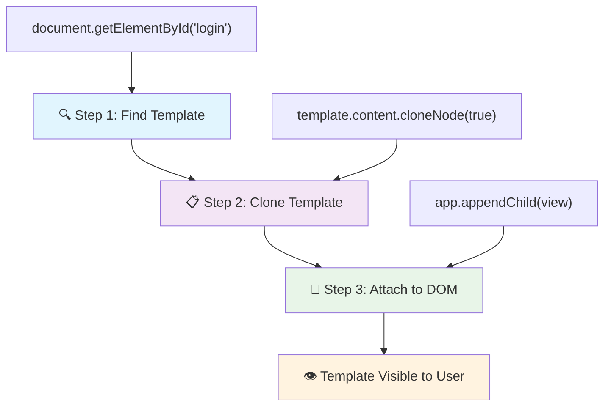
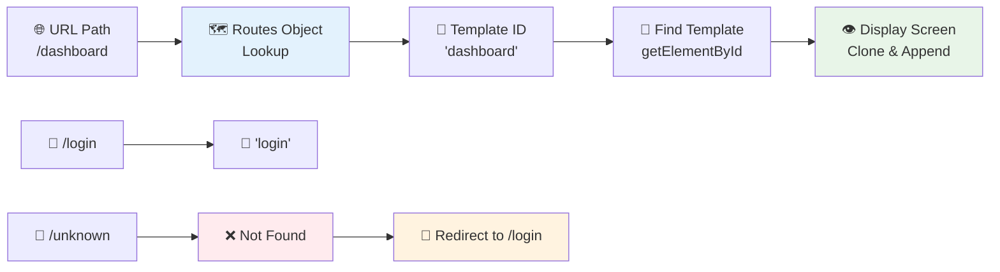
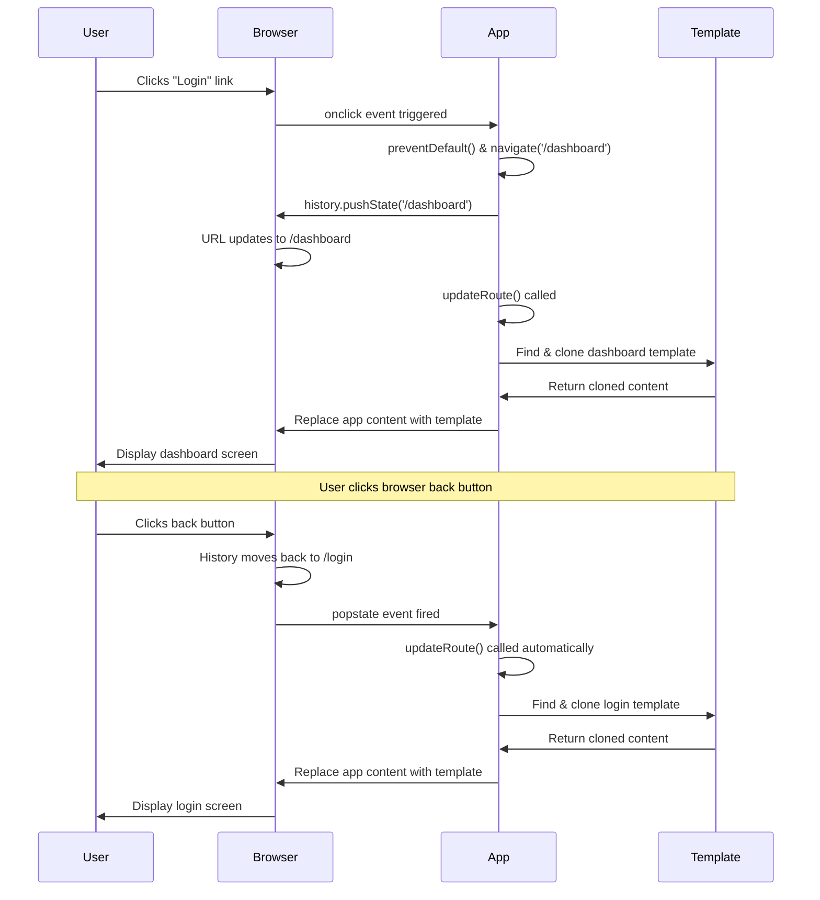

<!--
CO_OP_TRANSLATOR_METADATA:
{
  "original_hash": "5d259f6962464ad91e671083aa0398f4",
  "translation_date": "2025-10-23T01:31:22+00:00",
  "source_file": "7-bank-project/1-template-route/README.md",
  "language_code": "he"
}
-->
# בניית אפליקציית בנקאות חלק 1: תבניות HTML ונתיבים באפליקציית ווב

כשמחשב ההנחיה של אפולו 11 ניווט לירח בשנת 1969, הוא היה צריך לעבור בין תוכניות שונות מבלי להפעיל מחדש את כל המערכת. אפליקציות ווב מודרניות פועלות באופן דומה – הן משנות את מה שאתה רואה מבלי לטעון הכל מחדש. זה יוצר חוויית משתמש חלקה ומהירה כפי שמצופה כיום.

בניגוד לאתרים מסורתיים שטוענים מחדש את כל הדף בכל אינטראקציה, אפליקציות ווב מודרניות מעדכנות רק את החלקים שדורשים שינוי. גישה זו, בדומה לאופן שבו מרכז הבקרה עובר בין תצוגות שונות תוך שמירה על תקשורת רציפה, יוצרת את החוויה החלקה שאנו מצפים לה.

הנה מה שהופך את ההבדל לכל כך דרמטי:

| אפליקציות מרובות דפים מסורתיות | אפליקציות דף יחיד מודרניות |
|----------------------------------|----------------------------|
| **ניווט** | טעינת דף מלאה לכל מסך | מעבר תוכן מיידי |
| **ביצועים** | איטי יותר בשל הורדת HTML מלאה | מהיר יותר עם עדכונים חלקיים |
| **חוויית משתמש** | הבהובים בדף | מעברים חלקים כמו אפליקציה |
| **שיתוף נתונים** | קשה בין דפים | ניהול מצב קל |
| **פיתוח** | תחזוקת קבצי HTML מרובים | HTML יחיד עם תבניות דינמיות |

**הבנת האבולוציה:**
- **אפליקציות מסורתיות** דורשות בקשות לשרת עבור כל פעולה ניווט
- **אפליקציות דף יחיד מודרניות** נטענות פעם אחת ומעדכנות תוכן באופן דינמי באמצעות JavaScript
- **ציפיות משתמשים** כיום מעדיפות אינטראקציות מיידיות וחלקות
- **יתרונות ביצועים** כוללים הפחתת רוחב פס ותגובות מהירות יותר

בשיעור הזה, נבנה אפליקציית בנקאות עם מסכים מרובים שזורמים יחד בצורה חלקה. כמו מדענים שמשתמשים במכשירים מודולריים שניתן להתאים לניסויים שונים, נשתמש בתבניות HTML כרכיבים שניתן להשתמש בהם מחדש ולהציגם לפי הצורך.

תעבדו עם תבניות HTML (תוכניות בסיס לשימוש חוזר עבור מסכים שונים), ניתוב JavaScript (המערכת שמחליפה בין מסכים), ו-API ההיסטוריה של הדפדפן (ששומר על כפתור החזרה פועל כמצופה). אלו הן אותן טכניקות בסיסיות שמשתמשים בהן מסגרות כמו React, Vue ו-Angular.

בסוף השיעור, תהיה לכם אפליקציית בנקאות עובדת שמדגימה עקרונות מקצועיים של אפליקציות דף יחיד.

## שאלון לפני השיעור

[שאלון לפני השיעור](https://ff-quizzes.netlify.app/web/quiz/41)

### מה תצטרכו

נזדקק לשרת ווב מקומי כדי לבדוק את אפליקציית הבנקאות שלנו – אל תדאגו, זה קל יותר ממה שזה נשמע! אם עדיין אין לכם אחד כזה, פשוט התקינו [Node.js](https://nodejs.org) והריצו `npx lite-server` מתיקיית הפרויקט שלכם. הפקודה הזו תפעיל שרת מקומי ותפתח את האפליקציה שלכם בדפדפן באופן אוטומטי.

### הכנה

במחשב שלכם, צרו תיקייה בשם `bank` עם קובץ בשם `index.html` בתוכה. נתחיל מתבנית HTML [בסיסית](https://en.wikipedia.org/wiki/Boilerplate_code):

```html
<!DOCTYPE html>
<html lang="en">
  <head>
    <meta charset="UTF-8">
    <meta name="viewport" content="width=device-width, initial-scale=1.0">
    <title>Bank App</title>
  </head>
  <body>
    <!-- This is where you'll work -->
  </body>
</html>
```

**הנה מה שהתבנית הזו מספקת:**
- **מגדירה** את מבנה מסמך HTML5 עם הצהרת DOCTYPE נכונה
- **מגדירה** קידוד תווים כ-UTF-8 לתמיכה בטקסט בינלאומי
- **מאפשרת** עיצוב רספונסיבי עם תג מטה viewport להתאמה לניידים
- **מגדירה** כותרת תיאורית שמופיעה בלשונית הדפדפן
- **יוצרת** חלק גוף נקי שבו נבנה את האפליקציה שלנו

> 📁 **תצוגה מקדימה של מבנה הפרויקט**
> 
> **בסוף השיעור, הפרויקט שלכם יכיל:**
> ```
> bank/
> ├── index.html      <!-- Main HTML with templates -->
> ├── app.js          <!-- Routing and navigation logic -->
> └── style.css       <!-- (Optional for future lessons) -->
> ```
> 
> **תפקידי הקבצים:**
> - **index.html**: מכיל את כל התבניות ומספק את מבנה האפליקציה
> - **app.js**: מטפל בניווט, ניתוב וניהול תבניות
> - **תבניות**: מגדירות את ממשק המשתמש עבור התחברות, לוח בקרה ומסכים אחרים

---

## תבניות HTML

תבניות פותרות בעיה בסיסית בפיתוח ווב. כשגוטנברג המציא את הדפוס עם אותיות ניידות בשנות ה-1440, הוא הבין שבמקום לחרוט דפים שלמים, הוא יכול ליצור בלוקים של אותיות לשימוש חוזר ולסדר אותם לפי הצורך. תבניות HTML פועלות על אותו עיקרון – במקום ליצור קבצי HTML נפרדים לכל מסך, אתם מגדירים מבנים לשימוש חוזר שניתן להציגם לפי הצורך.

חשבו על תבניות כעל תוכניות בסיס לחלקים שונים של האפליקציה שלכם. כמו שאדריכל יוצר תוכנית אחת ומשתמש בה מספר פעמים במקום לצייר מחדש חדרים זהים, אנחנו יוצרים תבניות פעם אחת ומשתמשים בהן לפי הצורך. הדפדפן שומר את התבניות האלה מוסתרות עד ש-JavaScript מפעיל אותן.

אם אתם רוצים ליצור מסכים מרובים עבור דף ווב, פתרון אחד יהיה ליצור קובץ HTML נפרד עבור כל מסך שתרצו להציג. עם זאת, פתרון זה מגיע עם כמה אי-נוחות:

- אתם צריכים לטעון מחדש את כל ה-HTML כשעוברים בין מסכים, מה שיכול להיות איטי.
- קשה לשתף נתונים בין המסכים השונים.

גישה אחרת היא להשתמש בקובץ HTML יחיד, ולהגדיר מספר [תבניות HTML](https://developer.mozilla.org/docs/Web/HTML/Element/template) באמצעות אלמנט `<template>`. תבנית היא בלוק HTML לשימוש חוזר שאינו מוצג על ידי הדפדפן, ויש להפעיל אותה בזמן ריצה באמצעות JavaScript.

### בואו נבנה את זה

אנחנו הולכים ליצור אפליקציית בנק עם שני מסכים עיקריים: דף התחברות ולוח בקרה. קודם כל, נוסיף אלמנט placeholder לגוף ה-HTML שלנו – זה המקום שבו כל המסכים השונים שלנו יופיעו:

```html
<div id="app">Loading...</div>
```

**הבנת ה-placeholder הזה:**
- **יוצר** מיכל עם מזהה "app" שבו כל המסכים יוצגו
- **מציג** הודעת טעינה עד ש-JavaScript יאתחל את המסך הראשון
- **מספק** נקודת הרכבה יחידה לתוכן הדינמי שלנו
- **מאפשר** מיקוד קל מ-JavaScript באמצעות `document.getElementById()`

> 💡 **טיפ מקצועי**: מכיוון שהתוכן של האלמנט הזה יוחלף, אפשר לשים הודעת טעינה או אינדיקטור שיוצג בזמן שהאפליקציה נטענת.

לאחר מכן, נוסיף מתחת תבנית HTML לדף ההתחברות. כרגע נשים שם רק כותרת ומקטע שמכיל קישור שנשתמש בו כדי לבצע ניווט.

```html
<template id="login">
  <h1>Bank App</h1>
  <section>
    <a href="/dashboard">Login</a>
  </section>
</template>
```

**פירוק תבנית ההתחברות הזו:**
- **מגדירה** תבנית עם מזהה ייחודי "login" למיקוד JavaScript
- **כוללת** כותרת ראשית שמבססת את המיתוג של האפליקציה
- **מכילה** אלמנט `<section>` סמנטי לקיבוץ תוכן קשור
- **מספקת** קישור ניווט שיכוון משתמשים ללוח הבקרה

לאחר מכן נוסיף תבנית HTML נוספת לדף לוח הבקרה. דף זה יכיל מקטעים שונים:

- כותרת עם כותרת וקישור יציאה
- יתרת חשבון הבנק הנוכחית
- רשימת עסקאות, מוצגת בטבלה

```html
<template id="dashboard">
  <header>
    <h1>Bank App</h1>
    <a href="/login">Logout</a>
  </header>
  <section>
    Balance: 100$
  </section>
  <section>
    <h2>Transactions</h2>
    <table>
      <thead>
        <tr>
          <th>Date</th>
          <th>Object</th>
          <th>Amount</th>
        </tr>
      </thead>
      <tbody></tbody>
    </table>
  </section>
</template>
```

**הבנת כל חלק בלוח הבקרה הזה:**
- **מארגן** את הדף עם אלמנט `<header>` סמנטי שמכיל ניווט
- **מציג** את כותרת האפליקציה באופן עקבי בין מסכים למיתוג
- **מספק** קישור יציאה שמכוון חזרה למסך ההתחברות
- **מציג** את יתרת החשבון הנוכחית במקטע ייעודי
- **מארגן** נתוני עסקאות באמצעות טבלת HTML מובנית
- **מגדיר** כותרות טבלה עבור עמודות תאריך, אובייקט וסכום
- **משאיר** את גוף הטבלה ריק להזרקת תוכן דינמי מאוחר יותר

> 💡 **טיפ מקצועי**: כשאתם יוצרים תבניות HTML, אם אתם רוצים לראות איך זה ייראה, תוכלו להוסיף הערות סביב `<template>` ו-`</template>` באמצעות `<!-- -->`.

✅ למה לדעתכם אנחנו משתמשים במזהי `id` על התבניות? האם יכולנו להשתמש במשהו אחר כמו מחלקות?

## הפיכת תבניות לפעילות באמצעות JavaScript

עכשיו אנחנו צריכים להפוך את התבניות שלנו לפעילות. כמו שמדפסת תלת-ממד לוקחת תוכנית דיגיטלית ויוצרת אובייקט פיזי, JavaScript לוקח את התבניות המוסתרות שלנו ויוצר אלמנטים נראים ואינטראקטיביים שמשתמשים יכולים לראות ולהשתמש בהם.

התהליך עוקב אחרי שלושה שלבים עקביים שמרכיבים את הבסיס לפיתוח ווב מודרני. ברגע שתבינו את הדפוס הזה, תזהו אותו בהרבה מסגרות וספריות.

אם תנסו את קובץ ה-HTML הנוכחי שלכם בדפדפן, תראו שהוא נתקע בהצגת `Loading...`. זה בגלל שאנחנו צריכים להוסיף קצת קוד JavaScript כדי להפעיל ולהציג את תבניות ה-HTML.

הפעלת תבנית נעשית בדרך כלל בשלושה שלבים:

1. אחזור אלמנט התבנית ב-DOM, למשל באמצעות [`document.getElementById`](https://developer.mozilla.org/docs/Web/API/Document/getElementById).
2. שכפול אלמנט התבנית, באמצעות [`cloneNode`](https://developer.mozilla.org/docs/Web/API/Node/cloneNode).
3. הצמדתו ל-DOM תחת אלמנט נראה, למשל באמצעות [`appendChild`](https://developer.mozilla.org/docs/Web/API/Node/appendChild).



**פירוק חזותי של התהליך:**
- **שלב 1** מאתר את התבנית המוסתרת במבנה ה-DOM
- **שלב 2** יוצר עותק עובד שניתן לשנותו בבטחה
- **שלב 3** מכניס את העותק לאזור הדף הנראה
- **תוצאה** היא מסך פעיל שמשתמשים יכולים לתקשר איתו

✅ למה אנחנו צריכים לשכפל את התבנית לפני שמצמידים אותה ל-DOM? מה לדעתכם יקרה אם נדלג על שלב זה?

### משימה

צרו קובץ חדש בשם `app.js` בתיקיית הפרויקט שלכם וייבאו את הקובץ הזה בסעיף `<head>` של ה-HTML:

```html
<script src="app.js" defer></script>
```

**הבנת ייבוא הסקריפט הזה:**
- **מקשר** את קובץ ה-JavaScript למסמך ה-HTML שלנו
- **משתמש** בתכונת `defer` כדי להבטיח שהסקריפט יפעל לאחר סיום ניתוח ה-HTML
- **מאפשר** גישה לכל אלמנטי ה-DOM מכיוון שהם נטענים במלואם לפני ביצוע הסקריפט
- **עוקב** אחרי שיטות עבודה מומלצות מודרניות לטעינת סקריפטים וביצועים

עכשיו ב-`app.js`, ניצור פונקציה חדשה בשם `updateRoute`:

```js
function updateRoute(templateId) {
  const template = document.getElementById(templateId);
  const view = template.content.cloneNode(true);
  const app = document.getElementById('app');
  app.innerHTML = '';
  app.appendChild(view);
}
```

**שלב אחר שלב, הנה מה שקורה:**
- **מאתר** את אלמנט התבנית באמצעות מזהה ייחודי
- **יוצר** עותק עמוק של תוכן התבנית באמצעות `cloneNode(true)`
- **מוצא** את מיכל האפליקציה שבו יוצג התוכן
- **מנקה** כל תוכן קיים ממיכל האפליקציה
- **מכניס** את תוכן התבנית המשוכפל ל-DOM הנראה

עכשיו קראו לפונקציה הזו עם אחת מהתבניות ותראו את התוצאה.

```js
updateRoute('login');
```

**מה קריאה לפונקציה הזו משיגה:**
- **מפעילה** את תבנית ההתחברות על ידי העברת מזהה שלה כפרמטר
- **מדגימה** איך לעבור בין מסכים שונים באפליקציה באופן תכנותי
- **מציגה** את מסך ההתחברות במקום הודעת "Loading..."

✅ מה המטרה של הקוד הזה `app.innerHTML = '';`? מה קורה בלעדיו?

## יצירת נתיבים

ניתוב עוסק בעיקר בחיבור כתובות URL לתוכן הנכון. חשבו איך מפעילי טלפון מוקדמים השתמשו בלוחות חיבור כדי לחבר שיחות – הם היו לוקחים בקשה נכנסת ומכוונים אותה ליעד הנכון. ניתוב ווב עובד באופן דומה, לוקח בקשת URL וקובע איזה תוכן להציג.

באופן מסורתי, שרתי ווב טיפלו בזה על ידי הגשת קבצי HTML שונים עבור כתובות URL שונות. מכיוון שאנחנו בונים אפליקציית דף יחיד, אנחנו צריכים לטפל בניתוב הזה בעצמנו באמצעות JavaScript. גישה זו נותנת לנו יותר שליטה על חוויית המשתמש והביצועים.



**הבנת זרימת הניתוב:**
- **שינויים ב-URL** מפעילים חיפוש בתצורת הנתיבים שלנו
- **נתיבים תקינים** ממופים למזהי תבניות ספציפיים להצגה
- **נתיבים לא תקינים** מפעילים התנהגות חלופית כדי למנוע מצבים שבורים
- **הצגת תבניות** עוקבת אחרי תהליך שלושת השלבים שלמדנו קודם

כשמדברים על אפליקציית ווב, אנחנו קוראים ל*ניתוב* הכוונה למפות **כתובות URL** למסכים ספציפיים שצריך להציג. באתר עם קבצי HTML מרובים, זה נעשה אוטומטית כשהנתיבים משתקפים בכתובת ה-URL. לדוגמה, עם הקבצים האלה בתיקיית הפרויקט שלכם:

```
mywebsite/index.html
mywebsite/login.html
mywebsite/admin/index.html
```

אם תיצרו שרת ווב עם `mywebsite` כשורש, מיפוי הכתובות יהיה:

```
https://site.com            --> mywebsite/index.html
https://site.com/login.html --> mywebsite/login.html
https://site.com/admin/     --> mywebsite/admin/index.html
```

עם זאת, עבור אפליקציית הווב שלנו אנחנו משתמשים בקובץ HTML יחיד שמכיל את כל המסכים כך שהתנהגות ברירת המחדל הזו לא תעזור לנו. אנחנו צריכים ליצור את המפה הזו ידנית ולבצע עדכון של התבנית המוצגת באמצעות JavaScript.

### משימה

נשתמש באובייקט פשוט כדי ליישם [מפה](https://en.wikipedia.org/wiki/Associative_array) בין נתיבי URL לתבניות שלנו. הוסיפו את האובייקט הזה בראש קובץ `app.js` שלכם.

```js
const routes = {
  '/login': { templateId: 'login' },
  '/dashboard': { templateId: 'dashboard' },
};
```

**הבנת תצורת הנתיבים הזו:**
- **מגדירה** מיפוי בין נתיבי URL למזהי תבניות
- **משתמשת** בתחביר אובייקט שבו המפתחות הם נתיבי URL והערכים מכילים מידע על תבניות
- **מאפשרת** חיפוש קל של איזו תבנית להציג עבור כל כתובת URL נתונה
- **מספקת** מבנה ניתן להרחבה להוספת נתיבים חדשים בעתיד

עכשיו נשנה קצת את פונקציית `updateRoute`. במקום להעביר ישירות את `templateId` כארגומנט, אנחנו רוצים לאחזר אותו קודם על ידי הסתכלות על כתובת ה-URL הנוכחית, ואז להשתמש במפה שלנו כדי לקבל את ערך מזהה התבנית המתאים. אנחנו יכולים להשתמש ב-[`window.location.pathname`](https://developer.mozilla.org/docs/Web/API/Location/pathname) כדי לקבל רק את חלק הנתיב מהכתובת.

```js
function updateRoute() {
  const path = window.location.pathname;
  const route = routes[path];

  const template = document.getElementById(route.templateId);
  const view = template.content.cloneNode(true);
  const app = document.getElementById('app');
  app.innerHTML = '';
  app.appendChild(view);
}
```

**פירוק מה שקורה כאן:**
- **מאחזר** את הנתיב הנוכחי מכתובת ה-URL של הדפדפן באמצעות `window.location.pathname`
- **מחפש** את תצורת הנתיב המתאימה באובייקט הנתיבים שלנו
- **מאחזר** את מזהה התבנית מתצורת הנתיב
- **עוקב** אחרי אותו תהליך הצגת תבניות כמו קודם
- **יוצר** מערכת דינמית שמגיבה לשינויים בכתובת ה-URL

כאן מיפינו את הנתיבים שהצהרנו לתבנית המתאימה. תוכלו לנסות שזה עובד נכון על ידי שינוי הכתובת באופן ידני בדפדפן שלכם.
✅ מה קורה אם מזינים נתיב לא מוכר ב-URL? איך אפשר לפתור את זה?

## הוספת ניווט

עם הגדרת ניתוב, משתמשים צריכים דרך לנווט באפליקציה. אתרים מסורתיים טוענים מחדש את כל הדף כאשר לוחצים על קישורים, אבל אנחנו רוצים לעדכן את ה-URL ואת התוכן בלי רענון הדף. זה יוצר חוויית משתמש חלקה יותר, בדומה לאופן שבו אפליקציות שולחניות עוברות בין תצוגות שונות.

אנחנו צריכים לתאם שני דברים: לעדכן את ה-URL של הדפדפן כך שמשתמשים יוכלו לשמור דפים ולשתף קישורים, ולהציג את התוכן המתאים. כאשר זה מיושם נכון, זה יוצר את חוויית הניווט החלקה שמשתמשים מצפים לה באפליקציות מודרניות.

> 🏗️ **תובנה ארכיטקטונית**: רכיבי מערכת ניווט  
>
> **מה שאתם בונים:**
> - **🔄 ניהול URL**: מעדכן את שורת הכתובת של הדפדפן בלי טעינת דף מחדש  
> - **📋 מערכת תבניות**: מחליף תוכן באופן דינמי בהתאם לנתיב הנוכחי  
> - **📚 אינטגרציה עם היסטוריה**: שומר על פונקציונליות כפתורי אחורה/קדימה בדפדפן  
> - **🛡️ טיפול בשגיאות**: פתרונות אלגנטיים לנתיבים לא חוקיים או חסרים  
>
> **איך הרכיבים עובדים יחד:**
> - **מאזין** לאירועי ניווט (לחיצות, שינויים בהיסטוריה)  
> - **מעדכן** את ה-URL באמצעות History API  
> - **מציג** את התבנית המתאימה לנתיב החדש  
> - **שומר** על חוויית משתמש חלקה לאורך כל הדרך  

השלב הבא באפליקציה שלנו הוא להוסיף אפשרות לנווט בין דפים בלי לשנות את ה-URL באופן ידני. זה אומר שני דברים:

1. עדכון ה-URL הנוכחי  
2. עדכון התבנית המוצגת בהתאם ל-URL החדש  

כבר טיפלנו בחלק השני עם הפונקציה `updateRoute`, אז עכשיו אנחנו צריכים להבין איך לעדכן את ה-URL הנוכחי.

נצטרך להשתמש ב-JavaScript ובמיוחד ב-[`history.pushState`](https://developer.mozilla.org/docs/Web/API/History/pushState) שמאפשר לעדכן את ה-URL וליצור ערך חדש בהיסטוריית הגלישה, בלי לטעון מחדש את ה-HTML.

> ⚠️ **הערה חשובה**: למרות שאפשר להשתמש באלמנט העוגן של HTML [`<a href>`](https://developer.mozilla.org/docs/Web/HTML/Element/a) כדי ליצור קישורים ל-URL שונים, זה יגרום לדפדפן לטעון מחדש את ה-HTML כברירת מחדל. יש למנוע את ההתנהגות הזו כאשר מטפלים בניווט עם JavaScript מותאם אישית, באמצעות הפונקציה preventDefault() באירוע הלחיצה.

### משימה

בואו ניצור פונקציה חדשה שנוכל להשתמש בה כדי לנווט באפליקציה שלנו:

```js
function navigate(path) {
  window.history.pushState({}, path, path);
  updateRoute();
}
```
  
**הבנת פונקציית הניווט הזו:**  
- **מעדכנת** את ה-URL של הדפדפן לנתיב החדש באמצעות `history.pushState`  
- **מוסיפה** ערך חדש לערימת ההיסטוריה של הדפדפן לתמיכה בכפתורי אחורה/קדימה  
- **מפעילה** את הפונקציה `updateRoute()` כדי להציג את התבנית המתאימה  
- **שומרת** על חוויית אפליקציה חד-עמודית בלי טעינת דף מחדש  

שיטה זו קודם מעדכנת את ה-URL הנוכחי בהתאם לנתיב שניתן, ואז מעדכנת את התבנית. המאפיין `window.location.origin` מחזיר את שורש ה-URL, ומאפשר לנו לבנות מחדש URL מלא מנתיב נתון.

עכשיו שיש לנו את הפונקציה הזו, נוכל לטפל בבעיה שיש לנו אם נתיב לא תואם לאף נתיב מוגדר. נשנה את הפונקציה `updateRoute` על ידי הוספת פתרון חלופי לאחד הנתיבים הקיימים אם לא נמצא התאמה.

```js
function updateRoute() {
  const path = window.location.pathname;
  const route = routes[path];

  if (!route) {
    return navigate('/login');
  }

  const template = document.getElementById(route.templateId);
  const view = template.content.cloneNode(true);
  const app = document.getElementById('app');
  app.innerHTML = '';
  app.appendChild(view);
}
```
  
**נקודות מפתח לזכור:**  
- **בודקת** אם קיים נתיב עבור הנתיב הנוכחי  
- **מנתבת מחדש** לדף ההתחברות כאשר ניגשים לנתיב לא חוקי  
- **מספקת** מנגנון חלופי שמונע ניווט שבור  
- **מבטיחה** שמשתמשים תמיד יראו מסך חוקי, גם עם כתובות URL שגויות  

אם לא ניתן למצוא נתיב, עכשיו ננתב מחדש לדף `login`.

עכשיו בואו ניצור פונקציה שתשיג את ה-URL כאשר לוחצים על קישור, ותמנע את התנהגות ברירת המחדל של הדפדפן:

```js
function onLinkClick(event) {
  event.preventDefault();
  navigate(event.target.href);
}
```
  
**פירוק של מטפל הלחיצה הזה:**  
- **מונע** את התנהגות ברירת המחדל של הדפדפן באמצעות `preventDefault()`  
- **מחלץ** את ה-URL היעד מאלמנט הקישור שנלחץ  
- **מפעיל** את פונקציית הניווט המותאמת שלנו במקום לטעון מחדש את הדף  
- **שומר** על חוויית אפליקציה חד-עמודית חלקה  

```html
<a href="/dashboard" onclick="onLinkClick(event)">Login</a>
...
<a href="/login" onclick="onLinkClick(event)">Logout</a>
```
  
**מה ההצמדה הזו ל-onclick משיגה:**  
- **מחברת** כל קישור למערכת הניווט המותאמת שלנו  
- **מעבירה** את אירוע הלחיצה לפונקציה `onLinkClick` שלנו לעיבוד  
- **מאפשרת** ניווט חלק בלי טעינת דף מחדש  
- **שומרת** על מבנה URL נכון שמשתמשים יכולים לשמור או לשתף  

המאפיין [`onclick`](https://developer.mozilla.org/docs/Web/API/GlobalEventHandlers/onclick) מצמיד את אירוע הלחיצה לקוד JavaScript, כאן הקריאה לפונקציה `navigate()`.

נסו ללחוץ על הקישורים האלה, עכשיו תוכלו לנווט בין המסכים השונים של האפליקציה שלכם.

✅ השיטה `history.pushState` היא חלק מהסטנדרט של HTML5 ומיושמת ב-[כל הדפדפנים המודרניים](https://caniuse.com/?search=pushState). אם אתם בונים אפליקציית ווב לדפדפנים ישנים, יש טריק שאפשר להשתמש בו במקום ה-API הזה: שימוש ב-[hash (`#`)](https://en.wikipedia.org/wiki/URI_fragment) לפני הנתיב מאפשר ליישם ניתוב שעובד עם ניווט עוגן רגיל ולא טוען מחדש את הדף, שכן מטרתו הייתה ליצור קישורים פנימיים בתוך דף.

## לגרום לכפתורי אחורה וקדימה לעבוד

כפתורי אחורה וקדימה הם חלק בסיסי בגלישה באינטרנט, כמו איך שמנהלי משימות בנאס"א יכולים לבדוק מצבים קודמים של המערכת במהלך משימות חלל. משתמשים מצפים שהכפתורים האלה יעבדו, וכאשר הם לא עובדים, זה שובר את חוויית הגלישה הצפויה.

האפליקציה החד-עמודית שלנו צריכה תצורה נוספת כדי לתמוך בזה. הדפדפן שומר ערימת היסטוריה (שאליה אנחנו מוסיפים עם `history.pushState`), אבל כאשר משתמשים מנווטים דרך ההיסטוריה הזו, האפליקציה שלנו צריכה להגיב על ידי עדכון התוכן המוצג בהתאם.


  
**נקודות אינטראקציה מרכזיות:**  
- **פעולות משתמש** מפעילות ניווט דרך לחיצות או כפתורי הדפדפן  
- **האפליקציה מיירטת** לחיצות על קישורים כדי למנוע טעינת דף מחדש  
- **History API** מנהל שינויים ב-URL ובערימת ההיסטוריה של הדפדפן  
- **תבניות** מספקות את מבנה התוכן לכל מסך  
- **מאזינים לאירועים** מבטיחים שהאפליקציה מגיבה לכל סוגי הניווט  

שימוש ב-`history.pushState` יוצר ערכים חדשים בהיסטוריית הניווט של הדפדפן. תוכלו לבדוק זאת על ידי לחיצה ממושכת על *כפתור אחורה* בדפדפן שלכם, זה אמור להציג משהו כזה:


אם תנסו ללחוץ על כפתור אחורה כמה פעמים, תראו שה-URL הנוכחי משתנה וההיסטוריה מתעדכנת, אבל אותה תבנית ממשיכה להיות מוצגת.

זה בגלל שהאפליקציה לא יודעת שאנחנו צריכים לקרוא ל-`updateRoute()` בכל פעם שההיסטוריה משתנה. אם תסתכלו על [תיעוד `history.pushState`](https://developer.mozilla.org/docs/Web/API/History/pushState), תוכלו לראות שאם המצב משתנה - כלומר עברנו ל-URL שונה - אירוע [`popstate`](https://developer.mozilla.org/docs/Web/API/Window/popstate_event) מופעל. נשתמש בזה כדי לתקן את הבעיה.

### משימה

כדי לוודא שהתבנית המוצגת מתעדכנת כאשר היסטוריית הדפדפן משתנה, נצמיד פונקציה חדשה שתפעיל את `updateRoute()`. נעשה זאת בתחתית קובץ `app.js` שלנו:

```js
window.onpopstate = () => updateRoute();
updateRoute();
```
  
**הבנת האינטגרציה עם ההיסטוריה:**  
- **מאזין** לאירועי `popstate` שמתרחשים כאשר משתמשים מנווטים עם כפתורי הדפדפן  
- **משתמש** בפונקציית חץ לסינטקס תמציתי של מטפל אירועים  
- **מפעיל** את `updateRoute()` באופן אוטומטי בכל פעם שמצב ההיסטוריה משתנה  
- **מאתחל** את האפליקציה על ידי קריאה ל-`updateRoute()` כאשר הדף נטען לראשונה  
- **מבטיח** שהתבנית הנכונה תוצג ללא קשר לאופן שבו משתמשים מנווטים  

> 💡 **טיפ מקצועי**: השתמשנו ב-[פונקציית חץ](https://developer.mozilla.org/docs/Web/JavaScript/Reference/Functions/Arrow_functions) כאן כדי להגדיר את מטפל האירועים `popstate` בצורה תמציתית, אבל פונקציה רגילה תעבוד באותה מידה.

הנה סרטון רענון על פונקציות חץ:

[](https://youtube.com/watch?v=OP6eEbOj2sc "פונקציות חץ")

> 🎥 לחצו על התמונה למעלה לצפייה בסרטון על פונקציות חץ.

עכשיו נסו להשתמש בכפתורי אחורה וקדימה של הדפדפן שלכם, ובדקו שהתצוגה של הנתיב מתעדכנת כראוי הפעם.

---

## אתגר סוכן GitHub Copilot 🚀

השתמשו במצב סוכן כדי להשלים את האתגר הבא:

**תיאור:** שפרו את אפליקציית הבנקאות על ידי יישום טיפול בשגיאות ודף תבנית 404 לנתיבים לא חוקיים, לשיפור חוויית המשתמש כאשר מנווטים לדפים שאינם קיימים.

**הנחיה:** צרו תבנית HTML חדשה עם מזהה "not-found" שמציגה דף שגיאה 404 ידידותי למשתמש עם עיצוב. לאחר מכן, שנו את לוגיקת הניתוב ב-JavaScript כדי להציג את התבנית הזו כאשר משתמשים מנווטים לכתובות URL לא חוקיות, והוסיפו כפתור "חזור לדף הבית" שמנווט חזרה לדף ההתחברות.

למדו עוד על [מצב סוכן](https://code.visualstudio.com/blogs/2025/02/24/introducing-copilot-agent-mode) כאן.

## 🚀 אתגר

הוסיפו תבנית ונתיב חדשים לדף שלישי שמציג את הקרדיטים עבור האפליקציה הזו.

**מטרות האתגר:**
- **צרו** תבנית HTML חדשה עם מבנה תוכן מתאים  
- **הוסיפו** את הנתיב החדש לאובייקט תצורת הנתיבים שלכם  
- **כללו** קישורי ניווט אל ומדף הקרדיטים  
- **בדקו** שכל הניווט עובד כראוי עם היסטוריית הדפדפן  

## שאלון לאחר ההרצאה

[שאלון לאחר ההרצאה](https://ff-quizzes.netlify.app/web/quiz/42)

## סקירה ולימוד עצמי

ניתוב הוא אחד החלקים המפתיעים והמורכבים בפיתוח ווב, במיוחד כשהווב עובר מהתנהגות של טעינת דפים לאפליקציות חד-עמודיות. קראו מעט על [איך שירות Azure Static Web App](https://docs.microsoft.com/azure/static-web-apps/routes/?WT.mc_id=academic-77807-sagibbon) מטפל בניתוב. האם תוכלו להסביר מדוע חלק מההחלטות המתוארות במסמך הזה הן הכרחיות?

**משאבי לימוד נוספים:**
- **חקורו** איך מסגרות פופולריות כמו React Router ו-Vue Router מיישמות ניתוב בצד הלקוח  
- **חקרו** את ההבדלים בין ניתוב מבוסס hash לבין ניתוב באמצעות History API  
- **למדו** על רינדור בצד השרת (SSR) ואיך הוא משפיע על אסטרטגיות ניתוב  
- **בדקו** איך אפליקציות ווב מתקדמות (PWAs) מטפלות בניווט וניתוב  

## משימה

[שפרו את הניתוב](assignment.md)

---

**הצהרת אחריות**:  
מסמך זה תורגם באמצעות שירות תרגום AI [Co-op Translator](https://github.com/Azure/co-op-translator). למרות שאנו שואפים לדיוק, יש להיות מודעים לכך שתרגומים אוטומטיים עשויים להכיל שגיאות או אי דיוקים. המסמך המקורי בשפתו המקורית צריך להיחשב כמקור סמכותי. עבור מידע קריטי, מומלץ להשתמש בתרגום מקצועי אנושי. אנו לא נושאים באחריות לכל אי הבנות או פרשנויות שגויות הנובעות משימוש בתרגום זה.