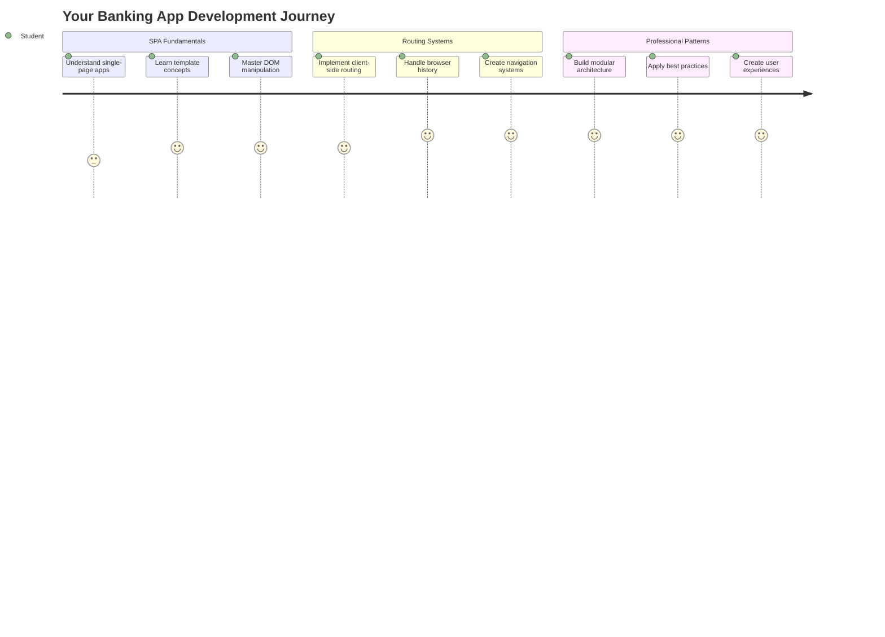
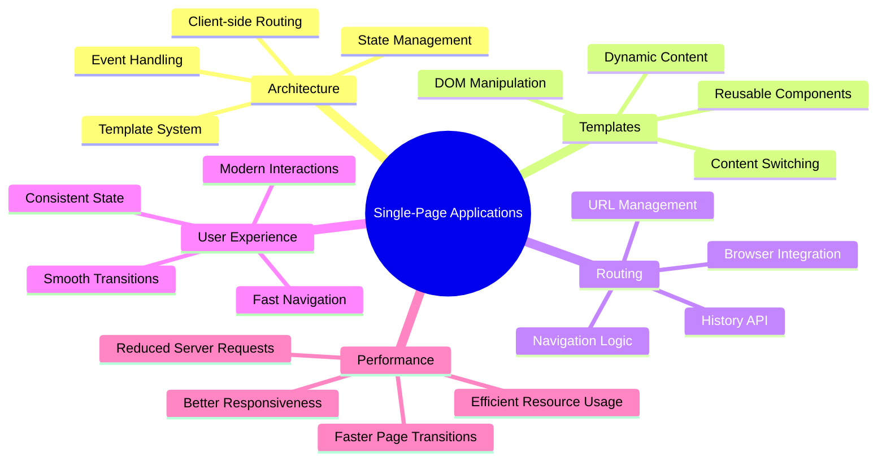
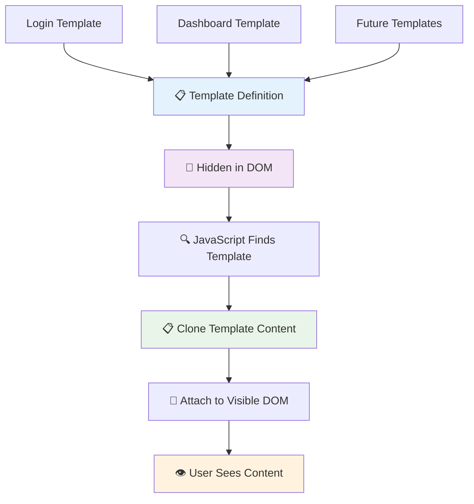
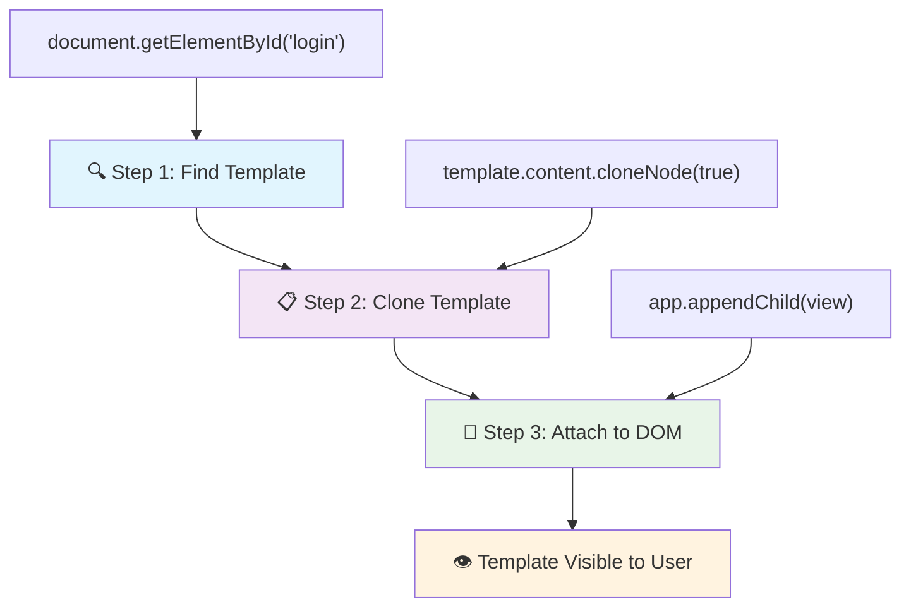
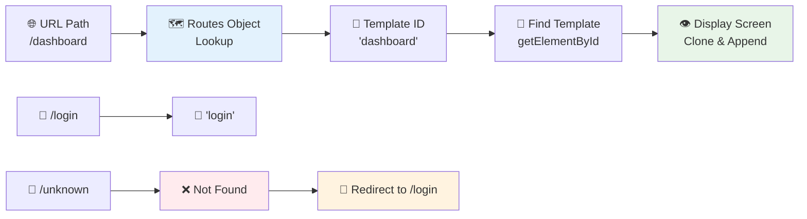
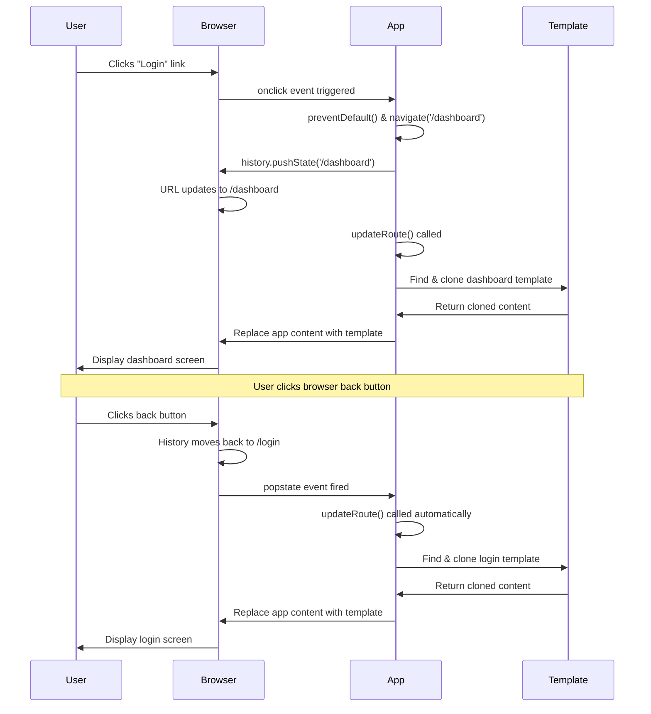

# בניית אפליקציית בנקאות חלק 1: תבניות HTML ונתיבים באפליקציית ווב



כשמחשב ההנחיה של אפולו 11 ניווט לירח בשנת 1969, הוא היה צריך לעבור בין תוכניות שונות מבלי להפעיל מחדש את כל המערכת. אפליקציות ווב מודרניות פועלות באופן דומה – הן משנות את מה שאתה רואה מבלי לטעון הכל מחדש. זה יוצר את החוויה החלקה והמהירה שהמשתמשים מצפים לה כיום.

בניגוד לאתרים מסורתיים שטוענים דפים שלמים בכל אינטראקציה, אפליקציות ווב מודרניות מעדכנות רק את החלקים שדורשים שינוי. גישה זו, בדומה לאופן שבו מרכז הבקרה עובר בין תצוגות שונות תוך שמירה על תקשורת רציפה, יוצרת את החוויה הזורמת שאליה התרגלנו.

הנה מה שהופך את ההבדל לכל כך משמעותי:

| אפליקציות מרובות דפים מסורתיות | אפליקציות דף יחיד מודרניות |
|----------------------------------|-----------------------------|
| **ניווט** | טעינת דף מלאה לכל מסך | מעבר תוכן מיידי |
| **ביצועים** | איטיים יותר בגלל הורדת HTML מלאה | מהירים יותר עם עדכונים חלקיים |
| **חוויית משתמש** | הבהובים בדף | מעברים חלקים כמו אפליקציה |
| **שיתוף נתונים** | קשה בין דפים | ניהול מצב קל |
| **פיתוח** | תחזוקת קבצי HTML מרובים | HTML יחיד עם תבניות דינמיות |

**הבנת האבולוציה:**
- **אפליקציות מסורתיות** דורשות בקשות שרת לכל פעולה ניווט
- **אפליקציות דף יחיד מודרניות** נטענות פעם אחת ומעדכנות תוכן באופן דינמי באמצעות JavaScript
- **ציפיות המשתמשים** כיום מעדיפות אינטראקציות מיידיות וחלקות
- **יתרונות ביצועים** כוללים הפחתת רוחב פס ותגובות מהירות יותר

בשיעור זה, נבנה אפליקציית בנקאות עם מסכים מרובים שזורמים יחד בצורה חלקה. כמו מדענים שמשתמשים במכשירים מודולריים שניתן להתאים לניסויים שונים, נשתמש בתבניות HTML כרכיבים שניתן לעשות בהם שימוש חוזר ולהציגם לפי הצורך.

תעבדו עם תבניות HTML (תוכניות בסיס לשימוש חוזר עבור מסכים שונים), ניתוב JavaScript (המערכת שמחליפה בין מסכים), ו-API ההיסטוריה של הדפדפן (ששומר על פעולת כפתור החזרה כמצופה). אלו הן אותן טכניקות בסיסיות שמשתמשים בהן במסגרת כמו React, Vue ו-Angular.

בסוף, תהיה לכם אפליקציית בנקאות עובדת שמדגימה עקרונות מקצועיים של אפליקציות דף יחיד.



## שאלון לפני השיעור

[שאלון לפני השיעור](https://ff-quizzes.netlify.app/web/quiz/41)

### מה תצטרכו

נזדקק לשרת ווב מקומי כדי לבדוק את אפליקציית הבנקאות שלנו – אל תדאגו, זה קל יותר ממה שזה נשמע! אם עדיין אין לכם אחד מוגדר, פשוט התקינו [Node.js](https://nodejs.org) והריצו `npx lite-server` מתיקיית הפרויקט שלכם. הפקודה הנוחה הזו תפעיל שרת מקומי ותפתח את האפליקציה שלכם בדפדפן באופן אוטומטי.

### הכנה

במחשב שלכם, צרו תיקייה בשם `bank` עם קובץ בשם `index.html` בתוכה. נתחיל מתבנית HTML [בסיסית](https://en.wikipedia.org/wiki/Boilerplate_code):

```html
<!DOCTYPE html>
<html lang="en">
  <head>
    <meta charset="UTF-8">
    <meta name="viewport" content="width=device-width, initial-scale=1.0">
    <title>Bank App</title>
  </head>
  <body>
    <!-- This is where you'll work -->
  </body>
</html>
```

**הנה מה שהתבנית הבסיסית מספקת:**
- **מגדירה** את מבנה מסמך HTML5 עם הצהרת DOCTYPE נכונה
- **מגדירה** קידוד תווים כ-UTF-8 לתמיכה בטקסט בינלאומי
- **מאפשרת** עיצוב רספונסיבי עם תג מטה של viewport להתאמה לניידים
- **מגדירה** כותרת תיאורית שמופיעה בלשונית הדפדפן
- **יוצרת** חלק גוף נקי שבו נבנה את האפליקציה שלנו

> 📁 **תצוגה מקדימה של מבנה הפרויקט**
> 
> **בסוף השיעור, הפרויקט שלכם יכיל:**
> ```
> bank/
> ├── index.html      <!-- Main HTML with templates -->
> ├── app.js          <!-- Routing and navigation logic -->
> └── style.css       <!-- (Optional for future lessons) -->
> ```
> 
> **תפקידי הקבצים:**
> - **index.html**: מכיל את כל התבניות ומספק את מבנה האפליקציה
> - **app.js**: מטפל בניווט, ניתוב וניהול תבניות
> - **תבניות**: מגדירות את ממשק המשתמש עבור התחברות, לוח מחוונים ומסכים אחרים

---

## תבניות HTML

תבניות פותרות בעיה בסיסית בפיתוח ווב. כשגוטנברג המציא את הדפוס הנייד בשנות ה-1440, הוא הבין שבמקום לחרוט דפים שלמים, הוא יכול ליצור בלוקים של אותיות לשימוש חוזר ולסדר אותם לפי הצורך. תבניות HTML פועלות על אותו עיקרון – במקום ליצור קבצי HTML נפרדים לכל מסך, אתם מגדירים מבנים לשימוש חוזר שניתן להציגם לפי הצורך.



חשבו על תבניות כעל תוכניות בסיס לחלקים שונים של האפליקציה שלכם. בדיוק כמו שאדריכל יוצר תוכנית אחת ומשתמש בה מספר פעמים במקום לצייר מחדש חדרים זהים, אנחנו יוצרים תבניות פעם אחת ומשתמשים בהן לפי הצורך. הדפדפן שומר את התבניות הללו מוסתרות עד ש-JavaScript מפעיל אותן.

אם אתם רוצים ליצור מסכים מרובים עבור דף ווב, פתרון אחד יהיה ליצור קובץ HTML אחד לכל מסך שתרצו להציג. עם זאת, פתרון זה מגיע עם כמה אי-נוחות:

- אתם צריכים לטעון מחדש את כל ה-HTML כשעוברים מסך, מה שיכול להיות איטי.
- קשה לשתף נתונים בין המסכים השונים.

גישה אחרת היא להשתמש בקובץ HTML אחד בלבד, ולהגדיר מספר [תבניות HTML](https://developer.mozilla.org/docs/Web/HTML/Element/template) באמצעות אלמנט `<template>`. תבנית היא בלוק HTML לשימוש חוזר שאינו מוצג על ידי הדפדפן, ויש להפעיל אותה בזמן ריצה באמצעות JavaScript.

### בואו נבנה את זה

אנחנו הולכים ליצור אפליקציית בנק עם שני מסכים עיקריים: דף התחברות ולוח מחוונים. קודם כל, נוסיף אלמנט מחזיק מקום לגוף ה-HTML שלנו – כאן יופיעו כל המסכים השונים שלנו:

```html
<div id="app">Loading...</div>
```

**הבנת מחזיק המקום הזה:**
- **יוצר** מיכל עם מזהה "app" שבו יוצגו כל המסכים
- **מציג** הודעת טעינה עד ש-JavaScript יאתחל את המסך הראשון
- **מספק** נקודת הרכבה יחידה לתוכן הדינמי שלנו
- **מאפשר** מיקוד קל מ-JavaScript באמצעות `document.getElementById()`

> 💡 **טיפ מקצועי**: מכיוון שהתוכן של אלמנט זה יוחלף, ניתן לשים הודעת טעינה או אינדיקטור שיוצגו בזמן שהאפליקציה נטענת.

לאחר מכן, נוסיף מתחת את תבנית ה-HTML לדף ההתחברות. לעת עתה נכניס שם רק כותרת ומקטע שמכיל קישור שנשתמש בו לביצוע הניווט.

```html
<template id="login">
  <h1>Bank App</h1>
  <section>
    <a href="/dashboard">Login</a>
  </section>
</template>
```

**פירוק תבנית ההתחברות הזו:**
- **מגדירה** תבנית עם מזהה ייחודי "login" למיקוד JavaScript
- **כוללת** כותרת ראשית שמבססת את המיתוג של האפליקציה
- **מכילה** אלמנט `<section>` סמנטי לקיבוץ תוכן קשור
- **מספקת** קישור ניווט שיכוון את המשתמשים ללוח המחוונים

לאחר מכן נוסיף תבנית HTML נוספת לדף לוח המחוונים. דף זה יכיל מקטעים שונים:

- כותרת עם כותרת וקישור להתנתקות
- יתרת החשבון הנוכחית
- רשימת עסקאות, מוצגת בטבלה

```html
<template id="dashboard">
  <header>
    <h1>Bank App</h1>
    <a href="/login">Logout</a>
  </header>
  <section>
    Balance: 100$
  </section>
  <section>
    <h2>Transactions</h2>
    <table>
      <thead>
        <tr>
          <th>Date</th>
          <th>Object</th>
          <th>Amount</th>
        </tr>
      </thead>
      <tbody></tbody>
    </table>
  </section>
</template>
```

**בואו נבין כל חלק בלוח המחוונים הזה:**
- **מארגן** את הדף עם אלמנט `<header>` סמנטי שמכיל ניווט
- **מציג** את כותרת האפליקציה באופן עקבי בין המסכים למיתוג
- **מספק** קישור להתנתקות שמכוון חזרה למסך ההתחברות
- **מציג** את יתרת החשבון הנוכחית במקטע ייעודי
- **מארגן** נתוני עסקאות באמצעות טבלת HTML מובנית כראוי
- **מגדיר** כותרות טבלה עבור עמודות תאריך, אובייקט וסכום
- **משאיר** את גוף הטבלה ריק להזרקת תוכן דינמי מאוחר יותר

> 💡 **טיפ מקצועי**: כשאתם יוצרים תבניות HTML, אם אתם רוצים לראות איך זה ייראה, תוכלו להסתיר את `<template>` ו-`</template>` על ידי עטיפתם ב-`<!-- -->`.

### 🔄 **בדיקה פדגוגית**
**הבנת מערכת התבניות**: לפני יישום JavaScript, ודאו שאתם מבינים:
- ✅ איך תבניות שונות מאלמנטים HTML רגילים
- ✅ למה תבניות נשארות מוסתרות עד ש-JavaScript מפעיל אותן
- ✅ החשיבות של מבנה HTML סמנטי בתבניות
- ✅ איך תבניות מאפשרות רכיבי ממשק משתמש לשימוש חוזר

**מבחן עצמי מהיר**: מה קורה אם אתם מסירים את תגי `<template>` מסביב ל-HTML שלכם?
*תשובה: התוכן הופך לגלוי מיד ומאבד את הפונקציונליות של התבנית*

**יתרונות ארכיטקטורה**: תבניות מספקות:
- **שימוש חוזר**: הגדרה אחת, מופעים מרובים
- **ביצועים**: אין ניתוח HTML מיותר
- **תחזוקה**: מבנה ממשק משתמש מרכזי
- **גמישות**: מעבר תוכן דינמי

✅ למה לדעתכם אנחנו משתמשים במזהי `id` על התבניות? האם יכולנו להשתמש במשהו אחר כמו מחלקות?

## הפיכת תבניות לפעילות עם JavaScript

עכשיו אנחנו צריכים להפוך את התבניות שלנו לפונקציונליות. כמו מדפסת תלת-ממדית שלוקחת תוכנית דיגיטלית ויוצרת אובייקט פיזי, JavaScript לוקח את התבניות המוסתרות שלנו ויוצר אלמנטים גלויים ואינטראקטיביים שהמשתמשים יכולים לראות ולהשתמש בהם.

התהליך עוקב אחר שלושה שלבים עקביים שמרכיבים את הבסיס לפיתוח ווב מודרני. ברגע שתבינו את הדפוס הזה, תזהו אותו בהרבה מסגרות וספריות.

אם תנסו את קובץ ה-HTML הנוכחי שלכם בדפדפן, תראו שהוא נתקע על הצגת `Loading...`. זה בגלל שאנחנו צריכים להוסיף קוד JavaScript כדי להפעיל ולהציג את תבניות ה-HTML.

הפעלת תבנית נעשית בדרך כלל ב-3 שלבים:

1. אחזור אלמנט התבנית ב-DOM, למשל באמצעות [`document.getElementById`](https://developer.mozilla.org/docs/Web/API/Document/getElementById).
2. שכפול אלמנט התבנית, באמצעות [`cloneNode`](https://developer.mozilla.org/docs/Web/API/Node/cloneNode).
3. הצמדתו ל-DOM תחת אלמנט גלוי, למשל באמצעות [`appendChild`](https://developer.mozilla.org/docs/Web/API/Node/appendChild).



**פירוק חזותי של התהליך:**
- **שלב 1** מאתר את התבנית המוסתרת במבנה ה-DOM
- **שלב 2** יוצר עותק עבודה שניתן לשנות בבטחה
- **שלב 3** מכניס את העותק לאזור הדף הגלוי
- **תוצאה** היא מסך פונקציונלי שהמשתמשים יכולים לתקשר איתו

✅ למה אנחנו צריכים לשכפל את התבנית לפני הצמדתה ל-DOM? מה לדעתכם יקרה אם נדלג על שלב זה?

### משימה

צרו קובץ חדש בשם `app.js` בתיקיית הפרויקט שלכם וייבאו את הקובץ הזה בסעיף `<head>` של ה-HTML שלכם:

```html
<script src="app.js" defer></script>
```

**הבנת ייבוא הסקריפט הזה:**
- **מקשר** את קובץ JavaScript למסמך ה-HTML שלנו
- **משתמש** בתכונה `defer` כדי להבטיח שהסקריפט ירוץ לאחר סיום ניתוח ה-HTML
- **מאפשר** גישה לכל אלמנטי ה-DOM מכיוון שהם נטענים במלואם לפני ביצוע הסקריפט
- **עוקב** אחר שיטות עבודה מומלצות מודרניות לטעינת סקריפטים וביצועים

עכשיו ב-`app.js`, ניצור פונקציה חדשה בשם `updateRoute`:

```js
function updateRoute(templateId) {
  const template = document.getElementById(templateId);
  const view = template.content.cloneNode(true);
  const app = document.getElementById('app');
  app.innerHTML = '';
  app.appendChild(view);
}
```

**שלב אחר שלב, הנה מה שקורה:**
- **מאתר** את אלמנט התבנית באמצעות מזהה ייחודי שלו
- **יוצר** עותק עמוק של תוכן התבנית באמצעות `cloneNode(true)`
- **מוצא** את מיכל האפליקציה שבו יוצג התוכן
- **מנקה** כל תוכן קיים ממיכל האפליקציה
- **מכניס** את תוכן התבנית המשוכפל ל-DOM הגלוי

עכשיו קראו לפונקציה הזו עם אחת התבניות ותראו את התוצאה.

```js
updateRoute('login');
```

**מה קריאה לפונקציה הזו משיגה:**
- **מפעילה** את תבנית ההתחברות על ידי העברת מזהה שלה כפרמטר
- **מדגימה** איך לעבור בין מסכים שונים של האפליקציה באופן תכנותי
- **מציגה** את מסך ההתחברות במקום הודעת "Loading..."

✅ מה מטרת הקוד הזה `app.innerHTML = '';`? מה קורה בלעדיו?

## יצירת נתיבים

ניתוב עוסק בעיקר בחיבור כתובות URL לתוכן הנכון. חשבו איך מפעילי טלפון מוקדמים השתמשו בלוחות חיבור כדי לחבר שיחות – הם היו לוקחים בקשה נכנסת ומנתבים אותה ליעד הנכון. ניתוב ווב עובד באופן דומה, לוקח בקשת URL וקובע איזה תוכן להציג.



באופן מסורתי, שרתי ווב טיפלו בכך על ידי הגשת קבצי HTML שונים עבור כתובות URL שונות. מכיוון שאנחנו בונים אפליקציית דף יחיד, אנחנו צריכים לטפל בניתוב הזה בעצמנו באמצעות JavaScript. גישה זו נותנת לנו יותר שליטה על חוויית המשתמש והביצועים.


**הבנת זרימת הניתוב:**
- **שינויים בכתובת URL** מפעילים חיפוש בתצורת הנתיבים שלנו
- **נתיבים תקפים** ממופים למזהי תבניות ספציפיים להצגה
- **נתיבים לא תקפים** מפעילים התנהגות חלופית כדי למנוע מצבים שבורים
- **הצגת תבניות** עוקבת אחר תהליך שלושת השלבים שלמדנו קודם

כשמדברים על אפליקציית ווב, אנחנו קוראים ל*ניתוב* הכוונה למפות **כתובות URL** למסכים ספציפיים שצריך להציג. באתר עם קבצי HTML מרובים, זה נעשה באופן אוטומטי כשהנתיבים משתקפים בכתובת ה-URL. לדוגמה, עם הקבצים האלה בתיקיית הפרויקט שלכם:

```
mywebsite/index.html
mywebsite/login.html
mywebsite/admin/index.html
```

אם תיצרו שרת ווב עם `mywebsite` כשורש, מיפוי הכתובות יהיה:

```
https://site.com            --> mywebsite/index.html
https://site.com/login.html --> mywebsite/login.html
https://site.com/admin/     --> mywebsite/admin/index.html
```

עם זאת, עבור אפליקציית הווב שלנו אנחנו משתמשים בקובץ HTML יחיד שמכיל את כל המסכים כך שהתנהגות ברירת המחדל הזו לא תעזור לנו. אנחנו צריכים ליצור את המפה הזו ידנית ולבצע עדכון של התבנית המוצגת באמצעות JavaScript.

### משימה

נשתמש באובייקט פשוט כדי ליישם [מפה](https://en.wikipedia.org/wiki/Associative_array) בין נתיבי URL לתבניות שלנו. הוסיפו את האובייקט הזה בראש קובץ `app.js` שלכם.

```js
const routes = {
  '/login': { templateId: 'login' },
  '/dashboard': { templateId: 'dashboard' },
};
```

**הבנת תצורת הנתיבים הזו:**
- **מגדירה** מיפוי בין נתיבי URL למזהי תבניות
- **משתמשת** בתחביר אובייקט שבו המפתחות הם נתיבי URL והערכים מכילים מידע על תבניות
- **מאפשרת** חיפוש קל של איזו תבנית להציג עבור כל כתובת URL נתונה
- **מספקת** מבנה שניתן
עכשיו בואו נשנה קצת את הפונקציה `updateRoute`. במקום להעביר ישירות את `templateId` כארגומנט, אנחנו רוצים לשלוף אותו קודם על ידי בדיקת ה-URL הנוכחי, ואז להשתמש במפה שלנו כדי לקבל את הערך המתאים של מזהה התבנית. ניתן להשתמש ב-[`window.location.pathname`](https://developer.mozilla.org/docs/Web/API/Location/pathname) כדי לקבל רק את החלק של הנתיב מתוך ה-URL.

```js
function updateRoute() {
  const path = window.location.pathname;
  const route = routes[path];

  const template = document.getElementById(route.templateId);
  const view = template.content.cloneNode(true);
  const app = document.getElementById('app');
  app.innerHTML = '';
  app.appendChild(view);
}
```

**פירוק מה שקורה כאן:**
- **מחלץ** את הנתיב הנוכחי מתוך ה-URL של הדפדפן באמצעות `window.location.pathname`
- **מחפש** את תצורת הנתיב המתאימה באובייקט הנתיבים שלנו
- **שולף** את מזהה התבנית מתוך תצורת הנתיב
- **עוקב** אחרי אותו תהליך רינדור תבנית כמו קודם
- **יוצר** מערכת דינמית שמגיבה לשינויים ב-URL

כאן מיפינו את הנתיבים שהגדרנו לתבניות המתאימות. אתם יכולים לבדוק שזה עובד נכון על ידי שינוי ה-URL ידנית בדפדפן שלכם.

✅ מה קורה אם אתם מזינים נתיב לא מוכר ב-URL? איך אפשר לפתור את זה?

## הוספת ניווט

עם הגדרת הנתיבים, המשתמשים צריכים דרך לנווט באפליקציה. אתרים מסורתיים טוענים מחדש את כל הדף כאשר לוחצים על קישורים, אבל אנחנו רוצים לעדכן גם את ה-URL וגם את התוכן בלי רענון הדף. זה יוצר חוויה חלקה יותר, בדומה לאופן שבו אפליקציות שולחניות עוברות בין תצוגות שונות.

אנחנו צריכים לתאם שני דברים: לעדכן את ה-URL של הדפדפן כך שמשתמשים יוכלו לשמור דפים ולשתף קישורים, ולהציג את התוכן המתאים. כאשר זה מיושם נכון, זה יוצר את חוויית הניווט החלקה שמשתמשים מצפים לה מאפליקציות מודרניות.



### 🔄 **בדיקה פדגוגית**
**ארכיטקטורת אפליקציה חד-עמודית**: בדקו את ההבנה שלכם של המערכת המלאה:
- ✅ איך ניווט בצד הלקוח שונה מניווט בצד השרת המסורתי?
- ✅ למה ה-History API חיוני לניווט נכון באפליקציות חד-עמודיות?
- ✅ איך תבניות מאפשרות תוכן דינמי בלי רענון דף?
- ✅ מה תפקיד טיפול באירועים במניעת ניווט?

**אינטגרציית מערכת**: האפליקציה החד-עמודית שלכם מדגימה:
- **ניהול תבניות**: רכיבי UI לשימוש חוזר עם תוכן דינמי
- **ניווט בצד הלקוח**: ניהול URL בלי בקשות לשרת
- **ארכיטקטורה מבוססת אירועים**: ניווט תגובתי ואינטראקציות משתמש
- **אינטגרציה עם הדפדפן**: תמיכה נכונה בכפתורי חזרה/קדימה
- **אופטימיזציית ביצועים**: מעברים מהירים והפחתת עומס על השרת

**דפוסים מקצועיים**: יישמתם:
- **הפרדת מודל-תצוגה**: תבניות מופרדות מלוגיקת האפליקציה
- **ניהול מצב**: מצב URL מסונכרן עם התוכן המוצג
- **שיפור פרוגרסיבי**: JavaScript משפר פונקציונליות HTML בסיסית
- **חוויית משתמש**: ניווט חלק, דמוי אפליקציה, בלי רענון דף

> � **תובנה ארכיטקטונית**: רכיבי מערכת ניווט
>
> **מה שאתם בונים:**
> - **🔄 ניהול URL**: מעדכן את שורת הכתובת של הדפדפן בלי רענון דף
> - **📋 מערכת תבניות**: מחליף תוכן דינמית לפי הנתיב הנוכחי  
> - **📚 אינטגרציית היסטוריה**: שומר על פונקציונליות כפתורי חזרה/קדימה בדפדפן
> - **🛡️ טיפול בשגיאות**: פתרונות אלגנטיים לנתיבים לא חוקיים או חסרים
>
> **איך הרכיבים עובדים יחד:**
> - **מאזין** לאירועי ניווט (לחיצות, שינויים בהיסטוריה)
> - **מעדכן** את ה-URL באמצעות History API
> - **מרנדר** את התבנית המתאימה לנתיב החדש
> - **שומר** על חוויית משתמש חלקה לאורך כל הדרך

השלב הבא באפליקציה שלנו הוא להוסיף את האפשרות לנווט בין דפים בלי לשנות את ה-URL ידנית. זה כולל שני דברים:

  1. עדכון ה-URL הנוכחי
  2. עדכון התבנית המוצגת לפי ה-URL החדש

כבר טיפלנו בחלק השני עם הפונקציה `updateRoute`, אז אנחנו צריכים להבין איך לעדכן את ה-URL הנוכחי.

נצטרך להשתמש ב-JavaScript ובמיוחד ב-[`history.pushState`](https://developer.mozilla.org/docs/Web/API/History/pushState) שמאפשר לעדכן את ה-URL וליצור ערך חדש בהיסטוריית הגלישה, בלי לטעון מחדש את ה-HTML.

> ⚠️ **הערה חשובה**: בעוד שאפשר להשתמש באלמנט העוגן של HTML [`<a href>`](https://developer.mozilla.org/docs/Web/HTML/Element/a) כדי ליצור קישורים ל-URL שונים, זה יגרום לדפדפן לטעון מחדש את ה-HTML כברירת מחדל. יש למנוע את ההתנהגות הזו בעת טיפול בניווט עם JavaScript מותאם אישית, באמצעות הפונקציה preventDefault() על אירוע הלחיצה.

### משימה

בואו ניצור פונקציה חדשה שנוכל להשתמש בה כדי לנווט באפליקציה שלנו:

```js
function navigate(path) {
  window.history.pushState({}, path, path);
  updateRoute();
}
```

**הבנת פונקציית הניווט הזו:**
- **מעדכנת** את ה-URL של הדפדפן לנתיב החדש באמצעות `history.pushState`
- **מוסיפה** ערך חדש לערימת ההיסטוריה של הדפדפן לתמיכה נכונה בכפתורי חזרה/קדימה
- **מפעילה** את הפונקציה `updateRoute()` כדי להציג את התבנית המתאימה
- **שומרת** על חוויית האפליקציה החד-עמודית בלי רענון דף

שיטה זו קודם מעדכנת את ה-URL הנוכחי לפי הנתיב שניתן, ואז מעדכנת את התבנית. התכונה `window.location.origin` מחזירה את שורש ה-URL, ומאפשרת לנו לבנות מחדש URL מלא מנתיב נתון.

עכשיו שיש לנו את הפונקציה הזו, נוכל לטפל בבעיה שיש לנו אם נתיב לא תואם לאף נתיב מוגדר. נשנה את הפונקציה `updateRoute` על ידי הוספת פתרון חלופי לאחד הנתיבים הקיימים אם לא נמצא התאמה.

```js
function updateRoute() {
  const path = window.location.pathname;
  const route = routes[path];

  if (!route) {
    return navigate('/login');
  }

  const template = document.getElementById(route.templateId);
  const view = template.content.cloneNode(true);
  const app = document.getElementById('app');
  app.innerHTML = '';
  app.appendChild(view);
}
```

**נקודות מפתח לזכור:**
- **בודקת** אם נתיב קיים עבור הנתיב הנוכחי
- **מנתבת מחדש** לדף ההתחברות כאשר ניגשים לנתיב לא חוקי
- **מספקת** מנגנון חלופי שמונע ניווט שבור
- **מבטיחה** שמשתמשים תמיד יראו מסך חוקי, גם עם URL שגוי

אם לא ניתן למצוא נתיב, עכשיו ננתב מחדש לדף `login`.

עכשיו בואו ניצור פונקציה כדי לקבל את ה-URL כאשר לוחצים על קישור, ולמנוע את התנהגות ברירת המחדל של הדפדפן.

```js
function onLinkClick(event) {
  event.preventDefault();
  navigate(event.target.href);
}
```

**פירוק מטפל הלחיצה הזה:**
- **מונע** את התנהגות ברירת המחדל של הדפדפן באמצעות `preventDefault()`
- **מחלץ** את ה-URL היעד מתוך אלמנט הקישור שנלחץ
- **מפעיל** את פונקציית הניווט המותאמת שלנו במקום לטעון מחדש את הדף
- **שומר** על חוויית האפליקציה החד-עמודית החלקה

```html
<a href="/dashboard" onclick="onLinkClick(event)">Login</a>
...
<a href="/login" onclick="onLinkClick(event)">Logout</a>
```

**מה הקישור הזה משיג:**
- **מחבר** כל קישור למערכת הניווט המותאמת שלנו
- **מעביר** את אירוע הלחיצה לפונקציה `onLinkClick` שלנו לעיבוד
- **מאפשר** ניווט חלק בלי רענון דף
- **שומר** על מבנה URL נכון שמשתמשים יכולים לשמור או לשתף

המאפיין [`onclick`](https://developer.mozilla.org/docs/Web/API/GlobalEventHandlers/onclick) מקשר את אירוע הלחיצה לקוד JavaScript, כאן הקריאה לפונקציה `navigate()`.

נסו ללחוץ על הקישורים האלה, עכשיו אתם אמורים להיות מסוגלים לנווט בין המסכים השונים של האפליקציה שלכם.

✅ השיטה `history.pushState` היא חלק מהסטנדרט של HTML5 ומיושמת ב-[כל הדפדפנים המודרניים](https://caniuse.com/?search=pushState). אם אתם בונים אפליקציה אינטרנטית לדפדפנים ישנים, יש טריק שאפשר להשתמש בו במקום ה-API הזה: שימוש ב-[hash (`#`)](https://en.wikipedia.org/wiki/URI_fragment) לפני הנתיב מאפשר ליישם ניווט שעובד עם ניווט עוגן רגיל ולא טוען מחדש את הדף, שכן מטרתו הייתה ליצור קישורים פנימיים בתוך דף.

## לגרום לכפתורי חזרה וקדימה לעבוד

כפתורי חזרה וקדימה הם יסודיים לגלישה באינטרנט, כמו איך שמנהלי משימות של נאס"א יכולים לבדוק מצבי מערכת קודמים במהלך משימות חלל. משתמשים מצפים שהכפתורים האלה יעבדו, וכאשר הם לא, זה שובר את חוויית הגלישה הצפויה.

האפליקציה החד-עמודית שלנו צריכה תצורה נוספת כדי לתמוך בזה. הדפדפן שומר ערימת היסטוריה (שאנחנו מוסיפים לה עם `history.pushState`), אבל כאשר משתמשים מנווטים דרך ההיסטוריה הזו, האפליקציה שלנו צריכה להגיב על ידי עדכון התוכן המוצג בהתאם.


**נקודות אינטראקציה מרכזיות:**
- **פעולות משתמש** מפעילות ניו
- **תכנן** אפליקציות חד-עמודיות עם הפרדה נכונה בין תחומי אחריות  
- **ממש** מערכות ניתוב בצד הלקוח שמתאימות למורכבות האפליקציה  
- **נטר** זרימות ניווט מורכבות באמצעות כלי פיתוח של הדפדפן  
- **שפר** ביצועי אפליקציה באמצעות ניהול תבניות יעיל  
- **עצב** חוויות משתמש שמרגישות טבעיות ותגובתיות  

**מושגים בפיתוח פרונטאנד שנלמדו**:  
- **ארכיטקטורת רכיבים**: תבניות UI לשימוש חוזר ומערכות תבניות  
- **סנכרון מצב**: ניהול מצב URL והיסטוריית דפדפן  
- **תכנות מונחה אירועים**: טיפול באינטראקציות משתמש וניווט  
- **אופטימיזציית ביצועים**: מניפולציה יעילה של DOM וטעינת תוכן  
- **עיצוב חוויית משתמש**: מעברים חלקים וניווט אינטואיטיבי  

**הרמה הבאה**: אתה מוכן לחקור פריימוורקים מודרניים לפרונטאנד, ניהול מצב מתקדם, או לבנות אפליקציות ארגוניות מורכבות!  

🌟 **הישג נפתח**: בנית בסיס מקצועי לאפליקציות חד-עמודיות עם דפוסי ארכיטקטורה מודרניים!  

---

## אתגר סוכן GitHub Copilot 🚀  

השתמש במצב סוכן כדי להשלים את האתגר הבא:  

**תיאור:** שפר את אפליקציית הבנקאות על ידי יישום טיפול בשגיאות ותבנית עמוד 404 לנתיבים לא חוקיים, לשיפור חוויית המשתמש בעת ניווט לעמודים שאינם קיימים.  

**הנחיה:** צור תבנית HTML חדשה עם מזהה "not-found" שמציגה עמוד שגיאה 404 ידידותי למשתמש עם עיצוב. לאחר מכן, עדכן את לוגיקת הניתוב ב-JavaScript כך שתציג את התבנית הזו כאשר משתמשים מנווטים לכתובות URL לא חוקיות, והוסף כפתור "חזור לדף הבית" שמנווט חזרה לעמוד ההתחברות.  

למד עוד על [מצב סוכן](https://code.visualstudio.com/blogs/2025/02/24/introducing-copilot-agent-mode) כאן.  

## 🚀 אתגר  

הוסף תבנית ונתיב חדשים לעמוד שלישי שמציג את הקרדיטים עבור האפליקציה הזו.  

**מטרות האתגר**:  
- **צור** תבנית HTML חדשה עם מבנה תוכן מתאים  
- **הוסף** את הנתיב החדש לאובייקט תצורת הנתיבים שלך  
- **כלול** קישורי ניווט אל ומעמוד הקרדיטים  
- **בדוק** שכל הניווט עובד כראוי עם היסטוריית הדפדפן  

## מבחן לאחר ההרצאה  

[מבחן לאחר ההרצאה](https://ff-quizzes.netlify.app/web/quiz/42)  

## סקירה ולימוד עצמי  

ניתוב הוא אחד החלקים המפתיעים במורכבותם בפיתוח אתרים, במיוחד כשהרשת עוברת מהתנהגות רענון עמודים לאפליקציות חד-עמודיות. קרא מעט על [איך שירות Azure Static Web App](https://docs.microsoft.com/azure/static-web-apps/routes/?WT.mc_id=academic-77807-sagibbon) מטפל בניתוב. האם תוכל להסביר מדוע חלק מההחלטות המתוארות במסמך הזה הכרחיות?  

**משאבי לימוד נוספים**:  
- **חקור** איך פריימוורקים פופולריים כמו React Router ו-Vue Router מיישמים ניתוב בצד הלקוח  
- **חפש** את ההבדלים בין ניתוב מבוסס hash לבין ניתוב API היסטוריה  
- **למד** על רינדור בצד השרת (SSR) ואיך הוא משפיע על אסטרטגיות ניתוב  
- **חקור** איך אפליקציות ווב מתקדמות (PWAs) מטפלות בניווט וניתוב  

## משימה  

[שפר את הניתוב](assignment.md)  

---

**הצהרת אחריות**:  
מסמך זה תורגם באמצעות שירות תרגום AI [Co-op Translator](https://github.com/Azure/co-op-translator). למרות שאנו שואפים לדיוק, יש לקחת בחשבון שתרגומים אוטומטיים עשויים להכיל שגיאות או אי דיוקים. המסמך המקורי בשפתו המקורית צריך להיחשב כמקור סמכותי. עבור מידע קריטי, מומלץ להשתמש בתרגום מקצועי אנושי. אנו לא נושאים באחריות לכל אי הבנות או פרשנויות שגויות הנובעות משימוש בתרגום זה.