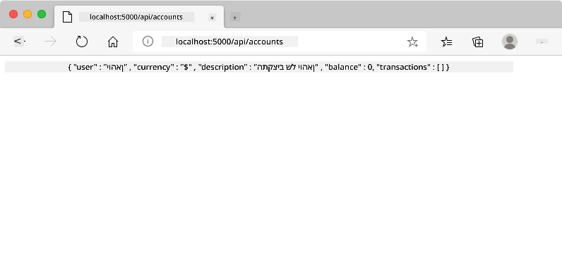
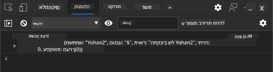
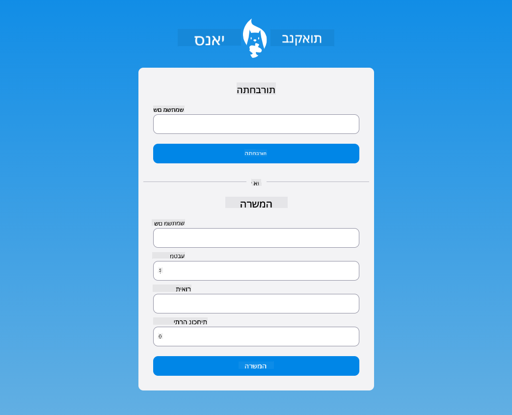

<!--
CO_OP_TRANSLATOR_METADATA:
{
  "original_hash": "b667b7d601e2ee19acb5aa9d102dc9f3",
  "translation_date": "2025-08-27T20:57:13+00:00",
  "source_file": "7-bank-project/2-forms/README.md",
  "language_code": "he"
}
-->
# בניית אפליקציית בנק חלק 2: יצירת טופס כניסה והרשמה

## שאלון לפני השיעור

[שאלון לפני השיעור](https://ashy-river-0debb7803.1.azurestaticapps.net/quiz/43)

### הקדמה

בכמעט כל אפליקציית אינטרנט מודרנית, ניתן ליצור חשבון אישי כדי לקבל מרחב פרטי משלך. מכיוון שמשתמשים רבים יכולים לגשת לאפליקציה בו-זמנית, יש צורך במנגנון שיאפשר אחסון נתונים אישיים לכל משתמש בנפרד ובחירה אילו נתונים להציג. לא נעסוק בנושא [ניהול זהות משתמש בצורה מאובטחת](https://en.wikipedia.org/wiki/Authentication) מכיוון שזהו נושא רחב בפני עצמו, אך נדאג שכל משתמש יוכל ליצור חשבון בנק אחד (או יותר) באפליקציה שלנו.

בחלק הזה נשתמש בטפסי HTML כדי להוסיף כניסה והרשמה לאפליקציה שלנו. נלמד כיצד לשלוח נתונים ל-API של שרת בצורה תכנותית, ובסופו של דבר נגדיר כללי אימות בסיסיים עבור קלטי המשתמש.

### דרישות מקדימות

עליך להשלים את [תבניות HTML וניתוב](../1-template-route/README.md) של האפליקציה עבור שיעור זה. כמו כן, יש להתקין את [Node.js](https://nodejs.org) ולהפעיל את [API של שרת האפליקציה](../api/README.md) באופן מקומי כדי שתוכל לשלוח נתונים ליצירת חשבונות.

**שים לב**
יהיו לך שני טרמינלים פעילים בו-זמנית כפי שמפורט להלן:
1. עבור אפליקציית הבנק הראשית שבנינו בשיעור [תבניות HTML וניתוב](../1-template-route/README.md)
2. עבור [API של שרת אפליקציית הבנק](../api/README.md) שהגדרנו קודם.

יש להפעיל את שני השרתים כדי להמשיך עם שאר השיעור. הם מאזינים על פורטים שונים (פורט `3000` ופורט `5000`) כך שהכול אמור לעבוד בצורה תקינה.

ניתן לבדוק שהשרת פועל כראוי על ידי ביצוע הפקודה הבאה בטרמינל:

```sh
curl http://localhost:5000/api
# -> should return "Bank API v1.0.0" as a result
```

---

## טופס ורכיבי שליטה

אלמנט `<form>` עוטף חלק במסמך HTML שבו המשתמש יכול להזין ולשלוח נתונים באמצעות רכיבי שליטה אינטראקטיביים. ישנם סוגים רבים של רכיבי ממשק משתמש (UI) שניתן להשתמש בהם בתוך טופס, כאשר הנפוצים ביותר הם אלמנטים `<input>` ו-`<button>`.

ישנם סוגים רבים של [קלטים](https://developer.mozilla.org/docs/Web/HTML/Element/input), לדוגמה, כדי ליצור שדה שבו המשתמש יכול להזין את שם המשתמש שלו ניתן להשתמש ב:

```html
<input id="username" name="username" type="text">
```

המאפיין `name` ישמש כשם המאפיין כאשר נתוני הטופס יישלחו. המאפיין `id` משמש לקשר בין `<label>` לבין רכיב השליטה בטופס.

> עיין ברשימה המלאה של [סוגי `<input>`](https://developer.mozilla.org/docs/Web/HTML/Element/input) ו-[רכיבי טופס אחרים](https://developer.mozilla.org/docs/Learn/Forms/Other_form_controls) כדי לקבל מושג על כל רכיבי ה-UI הטבעיים שניתן להשתמש בהם בעת בניית ממשק המשתמש שלך.

✅ שים לב ש-`<input>` הוא [אלמנט ריק](https://developer.mozilla.org/docs/Glossary/Empty_element) שאין להוסיף לו תג סגירה תואם. עם זאת, ניתן להשתמש בסימון `<input/>` הסוגר את האלמנט בעצמו, אך זה אינו חובה.

אלמנט `<button>` בתוך טופס הוא מעט מיוחד. אם לא תציין את מאפיין `type`, הוא יגיש את נתוני הטופס לשרת באופן אוטומטי כאשר לוחצים עליו. הנה הערכים האפשריים עבור `type`:

- `submit`: ברירת המחדל בתוך `<form>`, הכפתור מפעיל את פעולת שליחת הטופס.
- `reset`: הכפתור מאפס את כל רכיבי הטופס לערכים הראשוניים שלהם.
- `button`: אינו מקצה פעולה ברירת מחדל כאשר לוחצים על הכפתור. ניתן להקצות לו פעולות מותאמות אישית באמצעות JavaScript.

### משימה

נתחיל בהוספת טופס לתבנית `login`. נצטרך שדה *שם משתמש* וכפתור *כניסה*.

```html
<template id="login">
  <h1>Bank App</h1>
  <section>
    <h2>Login</h2>
    <form id="loginForm">
      <label for="username">Username</label>
      <input id="username" name="user" type="text">
      <button>Login</button>
    </form>
  </section>
</template>
```

אם תסתכל מקרוב, תוכל להבחין שהוספנו גם אלמנט `<label>` כאן. אלמנטים `<label>` משמשים להוספת שם לרכיבי UI, כמו שדה שם המשתמש שלנו. תוויות חשובות לקריאות הטפסים שלך, אך הן גם מביאות יתרונות נוספים:

- על ידי קישור תווית לרכיב שליטה בטופס, היא עוזרת למשתמשים המשתמשים בטכנולוגיות מסייעות (כמו קורא מסך) להבין אילו נתונים הם נדרשים לספק.
- ניתן ללחוץ על התווית כדי למקד ישירות את הקלט המשויך, מה שמקל על הגישה במכשירים מבוססי מסך מגע.

> [נגישות](https://developer.mozilla.org/docs/Learn/Accessibility/What_is_accessibility) באינטרנט היא נושא חשוב מאוד שלעתים קרובות מתעלמים ממנו. בזכות [אלמנטים HTML סמנטיים](https://developer.mozilla.org/docs/Learn/Accessibility/HTML) לא קשה ליצור תוכן נגיש אם משתמשים בהם בצורה נכונה. ניתן [לקרוא עוד על נגישות](https://developer.mozilla.org/docs/Web/Accessibility) כדי להימנע מטעויות נפוצות ולהפוך למפתח אחראי.

כעת נוסיף טופס שני להרשמה, ממש מתחת לטופס הקודם:

```html
<hr/>
<h2>Register</h2>
<form id="registerForm">
  <label for="user">Username</label>
  <input id="user" name="user" type="text">
  <label for="currency">Currency</label>
  <input id="currency" name="currency" type="text" value="$">
  <label for="description">Description</label>
  <input id="description" name="description" type="text">
  <label for="balance">Current balance</label>
  <input id="balance" name="balance" type="number" value="0">
  <button>Register</button>
</form>
```

באמצעות מאפיין `value` ניתן להגדיר ערך ברירת מחדל עבור קלט מסוים.
שימו לב גם שהקלט עבור `balance` הוא מסוג `number`. האם הוא נראה שונה מהקלטים האחרים? נסו לתקשר איתו.

✅ האם ניתן לנווט ולהשתמש בטפסים באמצעות מקלדת בלבד? איך הייתם עושים זאת?

## שליחת נתונים לשרת

כעת, לאחר שיש לנו ממשק משתמש פונקציונלי, השלב הבא הוא לשלוח את הנתונים לשרת. בואו נעשה בדיקה מהירה באמצעות הקוד הנוכחי שלנו: מה קורה אם תלחצו על כפתור *כניסה* או *הרשמה*?

האם שמתם לב לשינוי בכתובת ה-URL של הדפדפן?


פעולת ברירת המחדל של `<form>` היא לשלוח את הטופס לכתובת ה-URL הנוכחית של השרת באמצעות [שיטת GET](https://www.w3.org/Protocols/rfc2616/rfc2616-sec9.html#sec9.3), תוך הוספת נתוני הטופס ישירות לכתובת ה-URL. לשיטה זו יש כמה חסרונות:

- הנתונים שנשלחים מוגבלים בגודלם (כ-2000 תווים)
- הנתונים גלויים ישירות בכתובת ה-URL (לא אידיאלי עבור סיסמאות)
- היא אינה עובדת עם העלאות קבצים

לכן ניתן לשנות אותה לשימוש בשיטת [POST](https://www.w3.org/Protocols/rfc2616/rfc2616-sec9.html#sec9.5) ששולחת את נתוני הטופס לשרת בגוף הבקשה של HTTP, ללא המגבלות הקודמות.

> בעוד ש-POST היא השיטה הנפוצה ביותר לשליחת נתונים, [במצבים מסוימים](https://www.w3.org/2001/tag/doc/whenToUseGet.html) עדיף להשתמש בשיטת GET, למשל בעת יישום שדה חיפוש.

### משימה

הוסיפו מאפיינים `action` ו-`method` לטופס ההרשמה:

```html
<form id="registerForm" action="//localhost:5000/api/accounts" method="POST">
```

כעת נסו להירשם לחשבון חדש עם שמכם. לאחר לחיצה על כפתור *הרשמה* אמור להופיע משהו כזה:



אם הכול עובד כראוי, השרת אמור לענות לבקשה שלכם עם תגובת [JSON](https://www.json.org/json-en.html) המכילה את נתוני החשבון שנוצר.

✅ נסו להירשם שוב עם אותו שם. מה קורה?

## שליחת נתונים ללא טעינת הדף מחדש

כפי שכנראה שמתם לב, יש בעיה קטנה בגישה שבה השתמשנו: כאשר שולחים את הטופס, אנו יוצאים מהאפליקציה והדפדפן מפנה לכתובת ה-URL של השרת. אנו מנסים להימנע מכל טעינת דף באפליקציית האינטרנט שלנו, מכיוון שאנו יוצרים [אפליקציה חד-עמודית (SPA)](https://en.wikipedia.org/wiki/Single-page_application).

כדי לשלוח את נתוני הטופס לשרת מבלי לגרום לטעינת דף מחדש, עלינו להשתמש בקוד JavaScript. במקום לשים כתובת URL במאפיין `action` של אלמנט `<form>`, ניתן להשתמש בכל קוד JavaScript שמתחיל במחרוזת `javascript:` כדי לבצע פעולה מותאמת אישית. שימוש בגישה זו גם אומר שתצטרכו ליישם כמה משימות שהדפדפן ביצע באופן אוטומטי:

- איסוף נתוני הטופס
- המרה וקידוד נתוני הטופס לפורמט מתאים
- יצירת בקשת HTTP ושליחתה לשרת

### משימה

החליפו את מאפיין `action` של טופס ההרשמה ב:

```html
<form id="registerForm" action="javascript:register()">
```

פתחו את `app.js` והוסיפו פונקציה חדשה בשם `register`:

```js
function register() {
  const registerForm = document.getElementById('registerForm');
  const formData = new FormData(registerForm);
  const data = Object.fromEntries(formData);
  const jsonData = JSON.stringify(data);
}
```

כאן אנו מאתרים את אלמנט הטופס באמצעות `getElementById()` ומשתמשים ב-[`FormData`](https://developer.mozilla.org/docs/Web/API/FormData) כדי לחלץ את הערכים מרכיבי השליטה בטופס כסט של זוגות מפתח/ערך. לאחר מכן אנו ממירים את הנתונים לאובייקט רגיל באמצעות [`Object.fromEntries()`](https://developer.mozilla.org/docs/Web/JavaScript/Reference/Global_Objects/Object/fromEntries) ולבסוף מסדרים את הנתונים ל-[JSON](https://www.json.org/json-en.html), פורמט נפוץ להחלפת נתונים באינטרנט.

הנתונים מוכנים כעת לשליחה לשרת. צרו פונקציה חדשה בשם `createAccount`:

```js
async function createAccount(account) {
  try {
    const response = await fetch('//localhost:5000/api/accounts', {
      method: 'POST',
      headers: { 'Content-Type': 'application/json' },
      body: account
    });
    return await response.json();
  } catch (error) {
    return { error: error.message || 'Unknown error' };
  }
}
```

מה עושה הפונקציה הזו? ראשית, שימו לב למילת המפתח `async` כאן. משמעות הדבר היא שהפונקציה מכילה קוד שיבוצע [באופן אסינכרוני](https://developer.mozilla.org/docs/Web/JavaScript/Reference/Statements/async_function). כאשר משתמשים במילת המפתח `await`, ניתן להמתין לביצוע קוד אסינכרוני - כמו המתנה לתשובת השרת כאן - לפני שממשיכים.

הנה סרטון קצר על שימוש ב-`async/await`:

[](https://youtube.com/watch?v=YwmlRkrxvkk "Async and Await לניהול הבטחות")

> 🎥 לחצו על התמונה למעלה לסרטון על async/await.

אנו משתמשים ב-`fetch()` API כדי לשלוח נתוני JSON לשרת. שיטה זו מקבלת שני פרמטרים:

- כתובת ה-URL של השרת, לכן אנו מחזירים כאן את `//localhost:5000/api/accounts`.
- הגדרות הבקשה. כאן אנו מגדירים את השיטה ל-`POST` ומספקים את `body` של הבקשה. מכיוון שאנו שולחים נתוני JSON לשרת, עלינו גם להגדיר את כותרת `Content-Type` ל-`application/json` כדי שהשרת ידע כיצד לפרש את התוכן.

מכיוון שהשרת יענה לבקשה עם JSON, ניתן להשתמש ב-`await response.json()` כדי לנתח את תוכן ה-JSON ולהחזיר את האובייקט המתקבל. שימו לב ששיטה זו היא אסינכרונית, ולכן אנו משתמשים במילת המפתח `await` כאן לפני ההחזרה כדי לוודא שכל שגיאה במהלך הניתוח תיתפס גם היא.

כעת הוסיפו קוד לפונקציה `register` כדי לקרוא ל-`createAccount()`:

```js
const result = await createAccount(jsonData);
```

מכיוון שאנו משתמשים במילת המפתח `await` כאן, עלינו להוסיף את מילת המפתח `async` לפני הפונקציה register:

```js
async function register() {
```

לבסוף, נוסיף כמה לוגים כדי לבדוק את התוצאה. הפונקציה הסופית צריכה להיראות כך:

```js
async function register() {
  const registerForm = document.getElementById('registerForm');
  const formData = new FormData(registerForm);
  const jsonData = JSON.stringify(Object.fromEntries(formData));
  const result = await createAccount(jsonData);

  if (result.error) {
    return console.log('An error occurred:', result.error);
  }

  console.log('Account created!', result);
}
```

זה היה קצת ארוך אבל הגענו לשם! אם תפתחו את [כלי המפתחים של הדפדפן](https://developer.mozilla.org/docs/Learn/Common_questions/What_are_browser_developer_tools), ותנסו להירשם לחשבון חדש, לא תראו שום שינוי בדף האינטרנט אך הודעה תופיע בקונסולה המאשרת שהכול עובד.



✅ האם לדעתכם הנתונים נשלחים לשרת בצורה מאובטחת? מה אם מישהו יוכל ליירט את הבקשה? ניתן לקרוא על [HTTPS](https://en.wikipedia.org/wiki/HTTPS) כדי ללמוד עוד על תקשורת נתונים מאובטחת.

## אימות נתונים

אם תנסו להירשם לחשבון חדש מבלי להגדיר שם משתמש תחילה, תוכלו לראות שהשרת מחזיר שגיאה עם קוד סטטוס [400 (בקשה שגויה)](https://developer.mozilla.org/docs/Web/HTTP/Status/400#:~:text=The%20HyperText%20Transfer%20Protocol%20(HTTP,%2C%20or%20deceptive%20request%20routing).).

לפני שליחת נתונים לשרת, מומלץ [לאמת את נתוני הטופס](https://developer.mozilla.org/docs/Learn/Forms/Form_validation) מראש כאשר הדבר אפשרי, כדי לוודא שאתם שולחים בקשה תקינה. רכיבי טפסים ב-HTML5 מספקים אימות מובנה באמצעות מאפיינים שונים:

- `required`: השדה חייב להיות מלא אחרת הטופס לא יכול להישלח.
- `minlength` ו-`maxlength`: מגדירים את מספר התווים המינימלי והמקסימלי בשדות טקסט.
- `min` ו-`max`: מגדירים את הערך המינימלי והמקסימלי של שדה מספרי.
- `type`: מגדיר את סוג הנתונים הצפוי, כמו `number`, `email`, `file` או [סוגים מובנים אחרים](https://developer.mozilla.org/docs/Web/HTML/Element/input). מאפיין זה עשוי גם לשנות את התצוגה החזותית של רכיב השליטה בטופס.
- `pattern`: מאפשר להגדיר [ביטוי רגולרי](https://developer.mozilla.org/docs/Web/JavaScript/Guide/Regular_Expressions) כדי לבדוק אם הנתונים שהוזנו תקינים או לא.
טיפ: ניתן להתאים את המראה של רכיבי הטופס שלך בהתאם לשאלה אם הם תקינים או לא, באמצעות פסאודו-קלאסים של CSS `:valid` ו-`:invalid`.
### משימה

ישנם שני שדות חובה ליצירת חשבון חדש תקין: שם המשתמש ומטבע. שאר השדות הם אופציונליים. עדכנו את ה-HTML של הטופס, תוך שימוש גם בתכונת `required` וגם בטקסט בתווית השדה כך ש:

```html
<label for="user">Username (required)</label>
<input id="user" name="user" type="text" required>
...
<label for="currency">Currency (required)</label>
<input id="currency" name="currency" type="text" value="$" required>
```

למרות שמימוש השרת הספציפי הזה אינו אוכף מגבלות מסוימות על אורך מקסימלי של השדות, תמיד מומלץ להגדיר מגבלות סבירות להזנת טקסט על ידי המשתמש.

הוסיפו תכונת `maxlength` לשדות הטקסט:

```html
<input id="user" name="user" type="text" maxlength="20" required>
...
<input id="currency" name="currency" type="text" value="$" maxlength="5" required>
...
<input id="description" name="description" type="text" maxlength="100">
```

כעת, אם תלחצו על כפתור *Register* ושדה כלשהו אינו עומד בכללי האימות שהגדרנו, תראו משהו כזה:


אימות מסוג זה, שמתבצע *לפני* שליחת נתונים לשרת, נקרא **אימות בצד הלקוח**. אך שימו לב שלא תמיד ניתן לבצע את כל הבדיקות מבלי לשלוח את הנתונים. לדוגמה, לא נוכל לבדוק כאן אם כבר קיים חשבון עם אותו שם משתמש מבלי לשלוח בקשה לשרת. אימות נוסף שמתבצע בשרת נקרא **אימות בצד השרת**.

בדרך כלל יש ליישם את שניהם. בעוד שאימות בצד הלקוח משפר את חוויית המשתמש על ידי מתן משוב מיידי, אימות בצד השרת הוא קריטי כדי לוודא שהנתונים שאתם מעבדים הם תקינים ובטוחים.

---

## 🚀 אתגר

הציגו הודעת שגיאה ב-HTML אם המשתמש כבר קיים.

הנה דוגמה לאיך עמוד ההתחברות הסופי יכול להיראות לאחר מעט עיצוב:



## חידון לאחר ההרצאה

[חידון לאחר ההרצאה](https://ashy-river-0debb7803.1.azurestaticapps.net/quiz/44)

## סקירה ולמידה עצמית

מפתחים הפגינו יצירתיות רבה בבניית טפסים, במיוחד בכל הנוגע לאסטרטגיות אימות. למדו על זרימות טפסים שונות על ידי עיון ב-[CodePen](https://codepen.com); האם תוכלו למצוא טפסים מעניינים ומעוררי השראה?

## משימה

[עצבו את אפליקציית הבנק שלכם](assignment.md)

---

**כתב ויתור**:  
מסמך זה תורגם באמצעות שירות תרגום מבוסס בינה מלאכותית [Co-op Translator](https://github.com/Azure/co-op-translator). למרות שאנו שואפים לדיוק, יש לקחת בחשבון שתרגומים אוטומטיים עשויים להכיל שגיאות או אי דיוקים. המסמך המקורי בשפתו המקורית צריך להיחשב כמקור סמכותי. עבור מידע קריטי, מומלץ להשתמש בתרגום מקצועי על ידי אדם. איננו נושאים באחריות לאי הבנות או לפרשנויות שגויות הנובעות משימוש בתרגום זה.