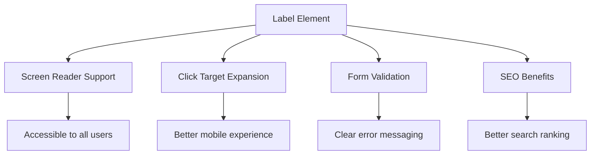
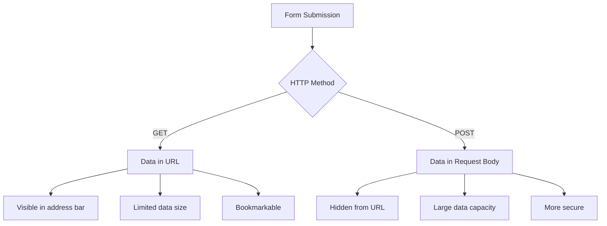
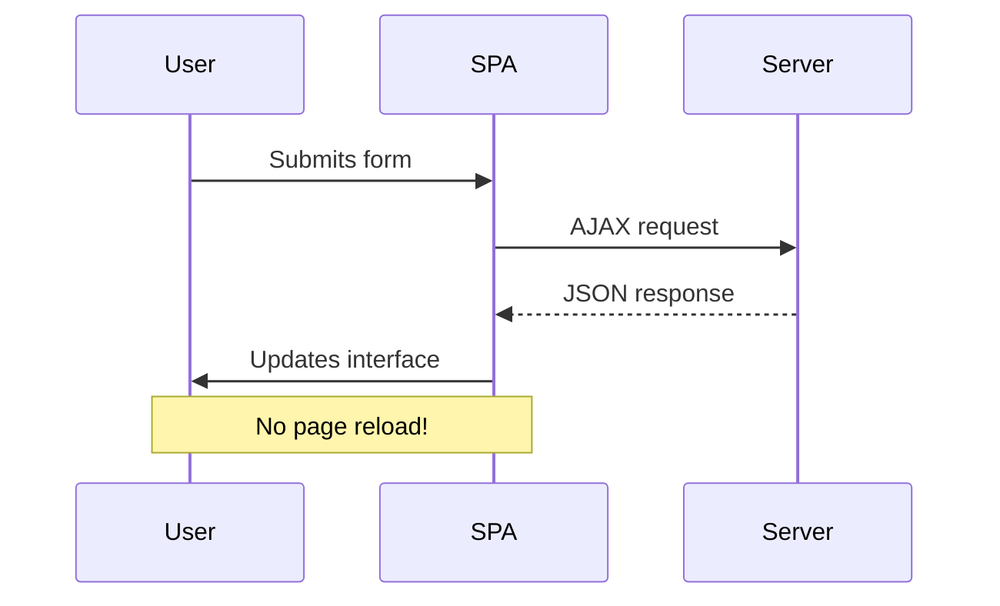
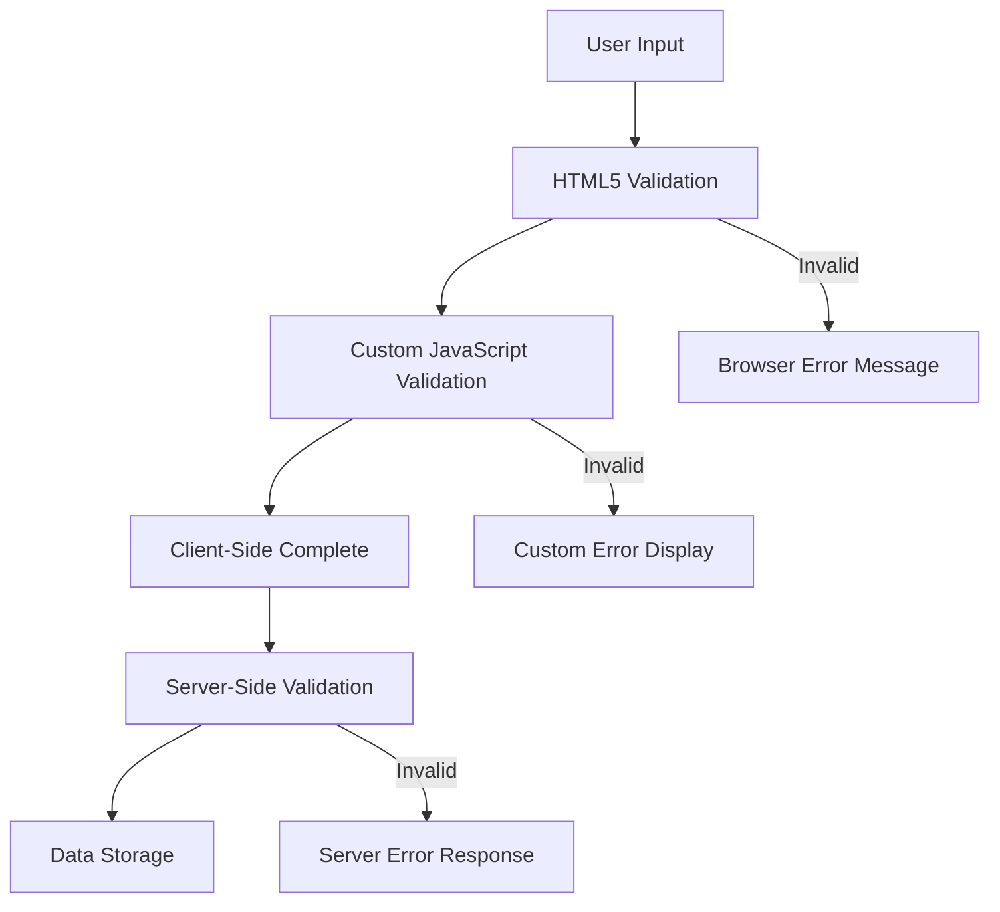
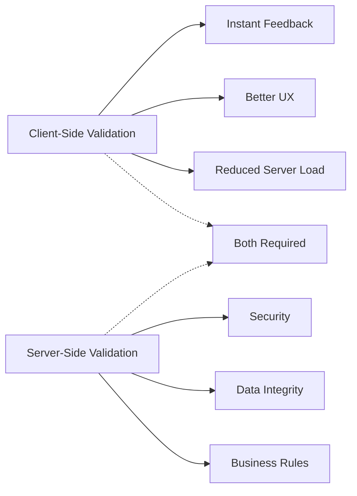

<!--
CO_OP_TRANSLATOR_METADATA:
{
  "original_hash": "b24f28fc46dd473aa9080f174182adde",
  "translation_date": "2025-10-23T01:33:10+00:00",
  "source_file": "7-bank-project/2-forms/README.md",
  "language_code": "he"
}
-->
# בניית אפליקציית בנקאות חלק 2: יצירת טופס כניסה והרשמה

## שאלון לפני השיעור

[שאלון לפני השיעור](https://ff-quizzes.netlify.app/web/quiz/43)

האם אי פעם מילאתם טופס אונליין והוא דחה את פורמט האימייל שלכם? או איבדתם את כל המידע כשניסיתם לשלוח אותו? כולנו נתקלנו בחוויות מתסכלות כאלה.

טפסים הם הגשר בין המשתמשים שלכם לבין הפונקציונליות של האפליקציה שלכם. כמו הפרוטוקולים המדויקים שמשתמשים בהם פקחי טיסה כדי להנחות מטוסים בבטחה ליעדם, טפסים מעוצבים היטב מספקים משוב ברור ומונעים טעויות יקרות. טפסים גרועים, לעומת זאת, יכולים להרחיק משתמשים מהר יותר מאי הבנה בשדה תעופה עמוס.

בשיעור הזה, נהפוך את אפליקציית הבנקאות הסטטית שלכם לאפליקציה אינטראקטיבית. תלמדו לבנות טפסים שמאמתים את קלט המשתמש, מתקשרים עם שרתים ומספקים משוב מועיל. חשבו על זה כעל בניית ממשק שליטה שמאפשר למשתמשים לנווט בתכונות האפליקציה שלכם.

בסיום השיעור, תהיה לכם מערכת כניסה והרשמה מלאה עם אימות שמכוונת את המשתמשים להצלחה במקום לתסכול.

## דרישות מוקדמות

לפני שנתחיל לבנות טפסים, בואו נוודא שהכל מוגדר כראוי. השיעור הזה ממשיך בדיוק מהמקום שבו עצרנו בשיעור הקודם, אז אם דילגתם קדימה, אולי כדאי לחזור אחורה ולהפעיל את הבסיס קודם.

### הגדרות נדרשות

| רכיב | סטטוס | תיאור |
|------|-------|-------|
| [תבניות HTML](../1-template-route/README.md) | ✅ נדרש | מבנה בסיסי של אפליקציית הבנקאות שלכם |
| [Node.js](https://nodejs.org) | ✅ נדרש | סביבת ריצה של JavaScript לשרת |
| [שרת API של הבנק](../api/README.md) | ✅ נדרש | שירות אחורי לאחסון נתונים |

> 💡 **טיפ לפיתוח**: תפעילו שני שרתים נפרדים בו-זמנית – אחד לאפליקציית הבנקאות הקדמית שלכם ואחד לשרת ה-API האחורי. הגדרה זו משקפת פיתוח בעולם האמיתי שבו שירותי קדימה ואחורה פועלים באופן עצמאי.

### הגדרת שרת

**סביבת הפיתוח שלכם תכלול:**
- **שרת קדמי**: מספק את אפליקציית הבנקאות שלכם (בדרך כלל פורט `3000`)
- **שרת API אחורי**: מטפל באחסון ושליפת נתונים (פורט `5000`)
- **שני השרתים** יכולים לפעול בו-זמנית ללא התנגשויות

**בדיקת חיבור ה-API שלכם:**
```bash
curl http://localhost:5000/api
# Expected response: "Bank API v1.0.0"
```

**אם אתם רואים את תגובת גרסת ה-API, אתם מוכנים להמשיך!**

---

## הבנת טפסי HTML ושליטה

טפסי HTML הם הדרך שבה משתמשים מתקשרים עם האפליקציה שלכם. חשבו עליהם כמערכת הטלגרף שחיברה מקומות רחוקים במאה ה-19 – הם פרוטוקול התקשורת בין כוונת המשתמש לתגובת האפליקציה. כאשר הם מעוצבים בצורה מחושבת, הם תופסים טעויות, מנחים את עיצוב הקלט ומספקים הצעות מועילות.

טפסים מודרניים מתקדמים בהרבה מקלטי טקסט בסיסיים. HTML5 הציגה סוגי קלט מיוחדים שמטפלים באימות אימייל, עיצוב מספרים ובחירת תאריכים באופן אוטומטי. שיפורים אלה מועילים גם לנגישות וגם לחוויות משתמשים ניידים.

### רכיבי טופס חיוניים

**אבני הבניין שכל טופס צריך:**

```html
<!-- Basic form structure -->
<form id="userForm" method="POST">
  <label for="username">Username</label>
  <input id="username" name="username" type="text" required>
  
  <button type="submit">Submit</button>
</form>
```

**מה הקוד הזה עושה:**
- **יוצר** מיכל טופס עם מזהה ייחודי
- **מציין** את שיטת HTTP לשליחת נתונים
- **מקשר** תוויות עם קלטים לנגישות
- **מגדיר** כפתור שליחה לעיבוד הטופס

### סוגי קלט מודרניים ותכונות

| סוג קלט | מטרה | דוגמת שימוש |
|---------|------|------------|
| `text` | קלט טקסט כללי | `<input type="text" name="username">` |
| `email` | אימות אימייל | `<input type="email" name="email">` |
| `password` | קלט טקסט מוסתר | `<input type="password" name="password">` |
| `number` | קלט מספרי | `<input type="number" name="balance" min="0">` |
| `tel` | מספרי טלפון | `<input type="tel" name="phone">` |

> 💡 **יתרון HTML5 מודרני**: שימוש בסוגי קלט ספציפיים מספק אימות אוטומטי, מקלדות ניידות מתאימות ותמיכה טובה יותר בנגישות ללא JavaScript נוסף!

### סוגי כפתורים והתנהגותם

```html
<!-- Different button behaviors -->
<button type="submit">Save Data</button>     <!-- Submits the form -->
<button type="reset">Clear Form</button>    <!-- Resets all fields -->
<button type="button">Custom Action</button> <!-- No default behavior -->
```

**מה כל סוג כפתור עושה:**
- **כפתורי שליחה**: מפעילים שליחת טופס ושולחים נתונים לנקודת הקצה שצוינה
- **כפתורי איפוס**: משחזרים את כל שדות הטופס למצבם ההתחלתי
- **כפתורים רגילים**: אינם מספקים התנהגות ברירת מחדל ודורשים JavaScript מותאם אישית לפונקציונליות

> ⚠️ **הערה חשובה**: אלמנט `<input>` הוא סגור בעצמו ואינו דורש תג סגירה. הפרקטיקה המודרנית היא לכתוב `<input>` ללא הסלאש.

### יצירת טופס כניסה

עכשיו ניצור טופס כניסה מעשי שמדגים את שיטות העבודה המודרניות של טפסי HTML. נתחיל עם מבנה בסיסי ונשפר אותו בהדרגה עם תכונות נגישות ואימות.

```html
<template id="login">
  <h1>Bank App</h1>
  <section>
    <h2>Login</h2>
    <form id="loginForm" novalidate>
      <div class="form-group">
        <label for="username">Username</label>
        <input id="username" name="user" type="text" required 
               autocomplete="username" placeholder="Enter your username">
      </div>
      <button type="submit">Login</button>
    </form>
  </section>
</template>
```

**פירוט מה קורה כאן:**
- **מארגן** את הטופס עם אלמנטים סמנטיים של HTML5
- **מקבץ** אלמנטים קשורים באמצעות מיכלי `div` עם מחלקות משמעותיות
- **מקשר** תוויות עם קלטים באמצעות תכונות `for` ו-`id`
- **כולל** תכונות מודרניות כמו `autocomplete` ו-`placeholder` לחוויית משתמש טובה יותר
- **מוסיף** `novalidate` כדי לטפל באימות עם JavaScript במקום ברירת המחדל של הדפדפן

### כוחם של תוויות נכונות

**מדוע תוויות חשובות לפיתוח ווב מודרני:**



**מה תוויות נכונות משיגות:**
- **מאפשרות** לקוראי מסך להכריז על שדות הטופס בצורה ברורה
- **מרחיבות** את שטח הלחיצה (לחיצה על התווית ממקדת את הקלט)
- **משפרות** את השימושיות בנייד עם מטרות מגע גדולות יותר
- **תומכות** באימות טופס עם הודעות שגיאה משמעותיות
- **משפרות** SEO על ידי מתן משמעות סמנטית לאלמנטים של הטופס

> 🎯 **מטרה לנגישות**: כל קלט טופס צריך להיות מקושר לתווית. פרקטיקה פשוטה זו הופכת את הטפסים שלכם לשימושיים עבור כולם, כולל משתמשים עם מוגבלויות, ומשפרת את החוויה עבור כל המשתמשים.

### יצירת טופס ההרשמה

טופס ההרשמה דורש מידע מפורט יותר כדי ליצור חשבון משתמש מלא. בואו נבנה אותו עם תכונות HTML5 מודרניות ונגישות משופרת.

```html
<hr/>
<h2>Register</h2>
<form id="registerForm" novalidate>
  <div class="form-group">
    <label for="user">Username</label>
    <input id="user" name="user" type="text" required 
           autocomplete="username" placeholder="Choose a username">
  </div>
  
  <div class="form-group">
    <label for="currency">Currency</label>
    <input id="currency" name="currency" type="text" value="$" 
           required maxlength="3" placeholder="USD, EUR, etc.">
  </div>
  
  <div class="form-group">
    <label for="description">Account Description</label>
    <input id="description" name="description" type="text" 
           maxlength="100" placeholder="Personal savings, checking, etc.">
  </div>
  
  <div class="form-group">
    <label for="balance">Starting Balance</label>
    <input id="balance" name="balance" type="number" value="0" 
           min="0" step="0.01" placeholder="0.00">
  </div>
  
  <button type="submit">Create Account</button>
</form>
```

**בקטע הקוד לעיל:**
- **ארגנו** כל שדה במיכלי div לשיפור העיצוב והפריסה
- **הוספנו** תכונות `autocomplete` מתאימות לתמיכה במילוי אוטומטי של הדפדפן
- **כללנו** טקסט עזר ב-`placeholder` להנחיית קלט המשתמש
- **הגדרנו** ערכי ברירת מחדל באמצעות תכונת `value`
- **יישמנו** תכונות אימות כמו `required`, `maxlength`, ו-`min`
- **השתמשנו** ב-`type="number"` לשדה היתרה עם תמיכה בעשרונים

### חקר סוגי קלט והתנהגותם

**סוגי קלט מודרניים מספקים פונקציונליות משופרת:**

| תכונה | יתרון | דוגמה |
|-------|-------|-------|
| `type="number"` | מקלדת מספרית בנייד | הזנת יתרה קלה יותר |
| `step="0.01"` | שליטה בדיוק עשרוני | מאפשר סנטים במטבע |
| `autocomplete` | מילוי אוטומטי של הדפדפן | השלמת טופס מהירה יותר |
| `placeholder` | רמזים הקשריים | מנחה את ציפיות המשתמש |

> 🎯 **אתגר נגישות**: נסו לנווט בטפסים באמצעות המקלדת בלבד! השתמשו ב-`Tab` כדי לעבור בין שדות, `Space` כדי לסמן תיבות, ו-`Enter` כדי לשלוח. חוויה זו תעזור לכם להבין כיצד משתמשי קוראי מסך מתקשרים עם הטפסים שלכם.

## הבנת שיטות שליחת טפסים

כשמישהו ממלא את הטופס שלכם ולוחץ על שלח, הנתונים צריכים להגיע לאנשהו – בדרך כלל לשרת שיכול לשמור אותם. יש כמה דרכים שונות שזה יכול לקרות, וידיעת הדרך הנכונה יכולה לחסוך לכם כאבי ראש בהמשך.

בואו נבחן מה באמת קורה כשמישהו לוחץ על כפתור השליחה.

### התנהגות ברירת מחדל של טופס

ראשית, נבחן מה קורה עם שליחת טופס בסיסית:

**בדקו את הטפסים הנוכחיים שלכם:**
1. לחצו על כפתור *הרשמה* בטופס שלכם
2. שימו לב לשינויים בשורת הכתובת של הדפדפן שלכם
3. שימו לב כיצד הדף נטען מחדש והנתונים מופיעים בכתובת ה-URL


### השוואת שיטות HTTP



**הבנת ההבדלים:**

| שיטה | שימוש | מיקום נתונים | רמת אבטחה | מגבלת גודל |
|------|-------|-------------|-----------|------------|
| `GET` | שאילתות חיפוש, מסננים | פרמטרים ב-URL | נמוכה (גלויה) | ~2000 תווים |
| `POST` | חשבונות משתמשים, נתונים רגישים | גוף הבקשה | גבוהה (מוסתרת) | ללא מגבלה מעשית |

**הבנת ההבדלים הבסיסיים:**
- **GET**: מוסיף נתוני טופס לכתובת ה-URL כפרמטרים (מתאים לפעולות חיפוש)
- **POST**: כולל נתונים בגוף הבקשה (חיוני למידע רגיש)
- **מגבלות GET**: מגבלות גודל, נתונים גלויים, היסטוריית דפדפן מתמשכת
- **יתרונות POST**: קיבולת נתונים גדולה, הגנה על פרטיות, תמיכה בהעלאת קבצים

> 💡 **פרקטיקה מומלצת**: השתמשו ב-`GET` לטפסי חיפוש ומסננים (שליפת נתונים), השתמשו ב-`POST` להרשמת משתמשים, כניסה ויצירת נתונים.

### הגדרת שליחת טופס

בואו נגדיר את טופס ההרשמה שלכם לתקשר כראוי עם שרת ה-API האחורי באמצעות שיטת POST:

```html
<form id="registerForm" action="//localhost:5000/api/accounts" 
      method="POST" novalidate>
```

**מה ההגדרה הזו עושה:**
- **מכוונת** את שליחת הטופס לנקודת הקצה של ה-API שלכם
- **משתמשת** בשיטת POST להעברת נתונים מאובטחת
- **כוללת** `novalidate` כדי לטפל באימות עם JavaScript

### בדיקת שליחת טופס

**בצעו את השלבים הבאים כדי לבדוק את הטופס שלכם:**
1. **מלאו** את טופס ההרשמה עם המידע שלכם
2. **לחצו** על כפתור "צור חשבון"
3. **שימו לב** לתגובת השרת בדפדפן שלכם


**מה שאתם אמורים לראות:**
- **הדפדפן מפנה** לכתובת נקודת הקצה של ה-API
- **תגובת JSON** המכילה את נתוני החשבון החדש שלכם
- **אישור השרת** שהחשבון נוצר בהצלחה

> 🧪 **זמן ניסוי**: נסו להירשם שוב עם אותו שם משתמש. איזו תגובה אתם מקבלים? זה עוזר לכם להבין כיצד השרת מטפל בנתונים כפולים ובתנאי שגיאה.

### הבנת תגובות JSON

**כאשר השרת מעבד את הטופס שלכם בהצלחה:**
```json
{
  "user": "john_doe",
  "currency": "$",
  "description": "Personal savings",
  "balance": 100,
  "id": "unique_account_id"
}
```

**תגובה זו מאשרת:**
- **יוצרת** חשבון חדש עם הנתונים שציינתם
- **מעניקה** מזהה ייחודי להתייחסות עתידית
- **מחזירה** את כל מידע החשבון לאימות
- **מציינת** אחסון מוצלח בבסיס הנתונים

## טיפול מודרני בטפסים עם JavaScript

שליחת טפסים מסורתית גורמת לטעינה מחדש של הדף כולו, בדומה לאופן שבו משימות חלל מוקדמות דרשו איפוס מלא של המערכת לתיקון מסלול. גישה זו משבשת את חוויית המשתמש ומאבדת את מצב האפליקציה.

טיפול בטפסים באמצעות JavaScript עובד כמו מערכות הנחיה רציפות המשמשות חלליות מודרניות – ביצוע התאמות בזמן אמת מבלי לאבד את הקשר הניווט. אנחנו יכולים ליירט שליחת טפסים, לספק משוב מיידי, לטפל בשגיאות בצורה חלקה ולעדכן את הממשק על סמך תגובות השרת תוך שמירה על מיקום המשתמש באפליקציה.

### מדוע להימנע מטעינת דפים מחדש?



**יתרונות טיפול בטפסים באמצעות JavaScript:**
- **שומר** על מצב האפליקציה והקשר המשתמש
- **מספק** משוב מיידי ואינדיקטורים לטעינה
- **מאפשר** טיפול דינמי בשגיאות ואימות
- **יוצר** חוויות משתמש חלקות, כמו אפליקציות
- **מאפשר** לוגיקה מותנית על בסיס תגובות השרת

### מעבר מטפסים מסורתיים למודרניים

**אתגרי הגישה המסורתית:**
- **מפנה** משתמשים מחוץ לאפליקציה שלכם
- **מאבד** את מצב האפליקציה והקשר הנוכחי
- **דורש** טעינה מחדש של הדף לפעולות פשוטות
- **מספק** שליטה מוגבלת על משוב המשתמש

**יתרונות הגישה המודרנית של JavaScript:**
- **שומר** על המשתמשים בתוך האפליקציה שלכם
- **משמר** את כל מצב האפליקציה והנתונים
- **מאפשר** אימות ומשוב בזמן אמת
- **תומך** בשיפור הדרגתי ונגישות

### יישום טיפול בטפסים באמצעות JavaScript

בואו נחליף את שליחת הטופס המסורתית עם טיפול באירועים מודרני באמצעות JavaScript:

```html
<!-- Remove the action attribute and add event handling -->
<form id="registerForm" method="POST" novalidate>
```

**הוסיפו את לוגיקת ההרשמה לקובץ `app.js` שלכם:**

```javascript
// Modern event-driven form handling
function register() {
  const registerForm = document.getElementById('registerForm');
  const formData = new FormData(registerForm);
  const data = Object.fromEntries(formData);
  const jsonData = JSON.stringify(data);
  
  console.log('Form data prepared:', data);
}

// Attach event listener when the page loads
document.addEventListener('DOMContentLoaded', () => {
  const registerForm = document.getElementById('registerForm');
  registerForm.addEventListener('submit', (event) => {
    event.preventDefault(); // Prevent default form submission
    register();
  });
});
```

**פירוט מה קורה כאן:**
- **מונע** שליחת טופס ברירת מחדל באמצעות `event.preventDefault()`
- **מאחזר** את אלמנט הטופס באמצעות בחירה מודרנית של DOM
- **מוציא** נתוני טופס באמצעות API החזק `FormData`
- **ממיר** את FormData לאובייקט פשוט עם `Object.fromEntries()`
- **משרשר** את הנתונים לפורמט JSON לתקשורת עם השרת
- **רושם** את הנתונים המעובדים לצורך ניפוי שגיאות ואימות

### הבנת API של FormData

**API של FormData מספק טיפול טפסים חזק:**

```javascript
// Example of what FormData captures
const formData = new FormData(registerForm);

// FormData automatically captures:
// {
//   "user": "john_doe",
//   "currency": "$", 
//   "description": "Personal account",
//   "balance": "100"
// }
```

**יתרונות API של FormData:**
- **איסוף מקיף**: לוכד את כל אלמנטי הטופס כולל טקסט, קבצים וקלטים מורכבים
- **מודעות סוג**: מטפל בסוגי קלט שונים באופן אוטומטי ללא קוד מותאם אישית
- **יעילות**: מבטל איסוף שדות
- **מספק** הודעות שגיאה מפורטות לצורך איתור בעיות
- **מחזיר** מבנה נתונים עקבי למקרים של הצלחה ושגיאה

### הכוח של Fetch API המודרני

**יתרונות Fetch API על פני שיטות ישנות:**

| תכונה | יתרון | יישום |
|-------|-------|-------|
| מבוסס הבטחה | קוד אסינכרוני נקי | `await fetch()` |
| התאמה אישית של בקשות | שליטה מלאה ב-HTTP | כותרות, שיטות, גוף |
| טיפול בתגובות | ניתוח נתונים גמיש | `.json()`, `.text()`, `.blob()` |
| טיפול בשגיאות | לכידת שגיאות מקיפה | בלוקים של Try/catch |

> 🎥 **למידע נוסף**: [מדריך Async/Await](https://youtube.com/watch?v=YwmlRkrxvkk) - הבנת דפוסי JavaScript אסינכרוניים לפיתוח אתרים מודרני.

**מושגים מרכזיים לתקשורת עם שרת:**
- **פונקציות אסינכרוניות** מאפשרות להשהות את הביצוע עד לקבלת תגובות מהשרת
- **מילת המפתח await** גורמת לקוד אסינכרוני להיראות כמו קוד סינכרוני
- **Fetch API** מספק בקשות HTTP מודרניות מבוססות הבטחה
- **טיפול בשגיאות** מבטיח שהאפליקציה שלך תגיב בצורה חלקה לבעיות רשת

### השלמת פונקציית ההרשמה

בואו נשלב הכל יחד עם פונקציית הרשמה מלאה ומוכנה לייצור:

```javascript
async function register() {
  const registerForm = document.getElementById('registerForm');
  const submitButton = registerForm.querySelector('button[type="submit"]');
  
  try {
    // Show loading state
    submitButton.disabled = true;
    submitButton.textContent = 'Creating Account...';
    
    // Process form data
    const formData = new FormData(registerForm);
    const jsonData = JSON.stringify(Object.fromEntries(formData));
    
    // Send to server
    const result = await createAccount(jsonData);
    
    if (result.error) {
      console.error('Registration failed:', result.error);
      alert(`Registration failed: ${result.error}`);
      return;
    }
    
    console.log('Account created successfully!', result);
    alert(`Welcome, ${result.user}! Your account has been created.`);
    
    // Reset form after successful registration
    registerForm.reset();
    
  } catch (error) {
    console.error('Unexpected error:', error);
    alert('An unexpected error occurred. Please try again.');
  } finally {
    // Restore button state
    submitButton.disabled = false;
    submitButton.textContent = 'Create Account';
  }
}
```

**היישום המשופר הזה כולל:**
- **מספק** משוב חזותי במהלך שליחת הטופס
- **משבית** את כפתור השליחה כדי למנוע שליחה כפולה
- **מטפל** בשגיאות צפויות ולא צפויות בצורה חלקה
- **מציג** הודעות הצלחה ושגיאה ידידותיות למשתמש
- **מאפס** את הטופס לאחר הרשמה מוצלחת
- **משחזר** את מצב ממשק המשתמש ללא קשר לתוצאה

### בדיקת היישום שלך

**פתח את כלי המפתחים בדפדפן ובדוק את ההרשמה:**

1. **פתח** את קונסולת הדפדפן (F12 → לשונית Console)
2. **מלא** את טופס ההרשמה
3. **לחץ** על "צור חשבון"
4. **צפה** בהודעות הקונסולה ובמשוב למשתמש


**מה שאתה אמור לראות:**
- **מצב טעינה** מופיע על כפתור השליחה
- **יומני קונסולה** מציגים מידע מפורט על התהליך
- **הודעת הצלחה** מופיעה כאשר יצירת החשבון מצליחה
- **הטופס מתאפס** באופן אוטומטי לאחר שליחה מוצלחת

> 🔒 **שיקול אבטחה**: נכון לעכשיו, הנתונים מועברים דרך HTTP, שאינו מאובטח לייצור. באפליקציות אמיתיות, תמיד השתמש ב-HTTPS כדי להצפין את העברת הנתונים. למידע נוסף על [אבטחת HTTPS](https://en.wikipedia.org/wiki/HTTPS) ולמה זה חיוני להגנה על נתוני משתמשים.

## ולידציה מקיפה לטפסים

ולידציה לטפסים מונעת את החוויה המתסכלת של גילוי שגיאות רק לאחר השליחה. כמו מערכות בטיחות מרובות בתחנת החלל הבינלאומית, ולידציה אפקטיבית משתמשת בשכבות רבות של בדיקות בטיחות.

הגישה האופטימלית משלבת ולידציה ברמת הדפדפן לצורך משוב מיידי, ולידציה ב-JavaScript לשיפור חוויית המשתמש, וולידציה בצד השרת לצורך אבטחה ושלמות נתונים. ריבוי שכבות זה מבטיח גם שביעות רצון משתמשים וגם הגנה על המערכת.

### הבנת שכבות הוולידציה



**אסטרטגיית ולידציה רב-שכבתית:**
- **ולידציה HTML5**: בדיקות מיידיות מבוססות דפדפן
- **ולידציה JavaScript**: לוגיקה מותאמת וחוויית משתמש
- **ולידציה בצד השרת**: בדיקות אבטחה ושלמות נתונים סופיות
- **שיפור פרוגרסיבי**: עובד גם אם JavaScript מושבת

### מאפייני ולידציה ב-HTML5

**כלי ולידציה מודרניים העומדים לרשותך:**

| מאפיין | מטרה | שימוש לדוגמה | התנהגות דפדפן |
|---------|-------|--------------|----------------|
| `required` | שדות חובה | `<input required>` | מונע שליחה ריקה |
| `minlength`/`maxlength` | מגבלות אורך טקסט | `<input maxlength="20">` | אוכף מגבלות תווים |
| `min`/`max` | טווחים מספריים | `<input min="0" max="1000">` | מאמת גבולות מספריים |
| `pattern` | כללי רגקס מותאמים | `<input pattern="[A-Za-z]+">` | מתאים פורמטים ספציפיים |
| `type` | ולידציה של סוג נתונים | `<input type="email">` | ולידציה ספציפית לפורמט |

### עיצוב ולידציה עם CSS

**צור משוב חזותי למצבי ולידציה:**

```css
/* Valid input styling */
input:valid {
  border-color: #28a745;
  background-color: #f8fff9;
}

/* Invalid input styling */
input:invalid {
  border-color: #dc3545;
  background-color: #fff5f5;
}

/* Focus states for better accessibility */
input:focus:valid {
  box-shadow: 0 0 0 0.2rem rgba(40, 167, 69, 0.25);
}

input:focus:invalid {
  box-shadow: 0 0 0 0.2rem rgba(220, 53, 69, 0.25);
}
```

**מה משיגים הרמזים החזותיים הללו:**
- **גבולות ירוקים**: מצביעים על ולידציה מוצלחת, כמו אור ירוק במרכז הבקרה
- **גבולות אדומים**: מסמנים שגיאות ולידציה הדורשות תשומת לב
- **הדגשת פוקוס**: מספקת הקשר חזותי ברור למיקום הקלט הנוכחי
- **עיצוב עקבי**: יוצר דפוסי ממשק צפויים שהמשתמשים יכולים ללמוד

> 💡 **טיפ מקצועי**: השתמש במחלקות CSS `:valid` ו-`:invalid` כדי לספק משוב חזותי מיידי בזמן שהמשתמשים מקלידים, וליצור ממשק תגובתי ומועיל.

### יישום ולידציה מקיפה

בואו נשפר את טופס ההרשמה שלכם עם ולידציה חזקה שמספקת חוויית משתמש מעולה ואיכות נתונים:

```html
<form id="registerForm" method="POST" novalidate>
  <div class="form-group">
    <label for="user">Username <span class="required">*</span></label>
    <input id="user" name="user" type="text" required 
           minlength="3" maxlength="20" 
           pattern="[a-zA-Z0-9_]+" 
           autocomplete="username"
           title="Username must be 3-20 characters, letters, numbers, and underscores only">
    <small class="form-text">Choose a unique username (3-20 characters)</small>
  </div>
  
  <div class="form-group">
    <label for="currency">Currency <span class="required">*</span></label>
    <input id="currency" name="currency" type="text" required 
           value="$" maxlength="3" 
           pattern="[A-Z$€£¥₹]+" 
           title="Enter a valid currency symbol or code">
    <small class="form-text">Currency symbol (e.g., $, €, £)</small>
  </div>
  
  <div class="form-group">
    <label for="description">Account Description</label>
    <input id="description" name="description" type="text" 
           maxlength="100" 
           placeholder="Personal savings, checking, etc.">
    <small class="form-text">Optional description (up to 100 characters)</small>
  </div>
  
  <div class="form-group">
    <label for="balance">Starting Balance</label>
    <input id="balance" name="balance" type="number" 
           value="0" min="0" step="0.01" 
           title="Enter a positive number for your starting balance">
    <small class="form-text">Initial account balance (minimum $0.00)</small>
  </div>
  
  <button type="submit">Create Account</button>
</form>
```

**הבנת הוולידציה המשופרת:**
- **משלב** אינדיקטורים לשדות חובה עם תיאורים מועילים
- **כולל** מאפייני `pattern` לוולידציה של פורמטים
- **מספק** מאפייני `title` לנגישות וטיפים
- **מוסיף** טקסט עזר להנחיית הקלט של המשתמש
- **משתמש** במבנה HTML סמנטי לנגישות טובה יותר

### כללי ולידציה מתקדמים

**מה כל כלל ולידציה משיג:**

| שדה | כללי ולידציה | יתרון למשתמש |
|-----|--------------|--------------|
| שם משתמש | `required`, `minlength="3"`, `maxlength="20"`, `pattern="[a-zA-Z0-9_]+"` | מבטיח מזהים תקינים וייחודיים |
| מטבע | `required`, `maxlength="3"`, `pattern="[A-Z$€£¥₹]+"` | מקבל סמלי מטבע נפוצים |
| יתרה | `min="0"`, `step="0.01"`, `type="number"` | מונע יתרות שליליות |
| תיאור | `maxlength="100"` | מגבלות אורך סבירות |

### בדיקת התנהגות ולידציה

**נסה את תרחישי הוולידציה הבאים:**
1. **שלח** את הטופס עם שדות חובה ריקים
2. **הכנס** שם משתמש קצר מ-3 תווים
3. **נסה** תווים מיוחדים בשדה שם המשתמש
4. **הכנס** סכום יתרה שלילי


**מה שתראה:**
- **הדפדפן מציג** הודעות ולידציה מקוריות
- **שינויים בעיצוב** מבוססי `:valid` ו-`:invalid`
- **שליחת הטופס** נמנעת עד שכל הוולידציות עוברות
- **הפוקוס עובר אוטומטית** לשדה הראשון שאינו תקין

### ולידציה בצד לקוח מול ולידציה בצד שרת



**למה צריך את שתי השכבות:**
- **ולידציה בצד לקוח**: מספקת משוב מיידי ומשפרת את חוויית המשתמש
- **ולידציה בצד שרת**: מבטיחה אבטחה ומטפלת בכללים עסקיים מורכבים
- **גישה משולבת**: יוצרת אפליקציות חזקות, ידידותיות למשתמש ובטוחות
- **שיפור פרוגרסיבי**: עובד גם כאשר JavaScript מושבת

> 🛡️ **תזכורת אבטחה**: לעולם אל תסמוך רק על ולידציה בצד לקוח! משתמשים זדוניים יכולים לעקוף בדיקות בצד לקוח, ולכן ולידציה בצד שרת חיונית לאבטחה ושלמות נתונים.

---

---

## אתגר סוכן GitHub Copilot 🚀

השתמש במצב סוכן כדי להשלים את האתגר הבא:

**תיאור:** שפר את טופס ההרשמה עם ולידציה מקיפה בצד לקוח ומשוב למשתמש. אתגר זה יעזור לך לתרגל ולידציה לטפסים, טיפול בשגיאות ושיפור חוויית המשתמש עם משוב אינטראקטיבי.

**הנחיה:** צור מערכת ולידציה מלאה לטופס ההרשמה הכוללת: 1) משוב ולידציה בזמן אמת לכל שדה בזמן שהמשתמש מקליד, 2) הודעות ולידציה מותאמות שמופיעות מתחת לכל שדה קלט, 3) שדה אישור סיסמה עם ולידציה של התאמה, 4) אינדיקטורים חזותיים (כמו סימני וי ירוקים לשדות תקינים ואזהרות אדומות לשדות לא תקינים), 5) כפתור שליחה שמופעל רק כאשר כל הוולידציות עוברות. השתמש במאפייני ולידציה של HTML5, CSS לעיצוב מצבי הוולידציה, ו-JavaScript להתנהגות אינטראקטיבית.

למידע נוסף על [מצב סוכן](https://code.visualstudio.com/blogs/2025/02/24/introducing-copilot-agent-mode) כאן.

## 🚀 אתגר

הצג הודעת שגיאה ב-HTML אם המשתמש כבר קיים.

הנה דוגמה לאיך עמוד ההתחברות הסופי יכול להיראות לאחר מעט עיצוב:


## מבחן לאחר ההרצאה

[מבחן לאחר ההרצאה](https://ff-quizzes.netlify.app/web/quiz/44)

## סקירה ולימוד עצמי

מפתחים הפכו יצירתיים מאוד במאמצי בניית הטפסים שלהם, במיוחד בכל הנוגע לאסטרטגיות ולידציה. למד על זרימות טפסים שונות על ידי עיון ב-[CodePen](https://codepen.com); האם תוכל למצוא טפסים מעניינים ומעוררי השראה?

## משימה

[עצב את אפליקציית הבנק שלך](assignment.md)

---

**הצהרת אחריות**:  
מסמך זה תורגם באמצעות שירות תרגום AI [Co-op Translator](https://github.com/Azure/co-op-translator). למרות שאנו שואפים לדיוק, יש לקחת בחשבון שתרגומים אוטומטיים עשויים להכיל שגיאות או אי דיוקים. המסמך המקורי בשפתו המקורית צריך להיחשב כמקור סמכותי. למידע קריטי, מומלץ להשתמש בתרגום מקצועי אנושי. איננו אחראים לאי הבנות או לפרשנויות שגויות הנובעות משימוש בתרגום זה.