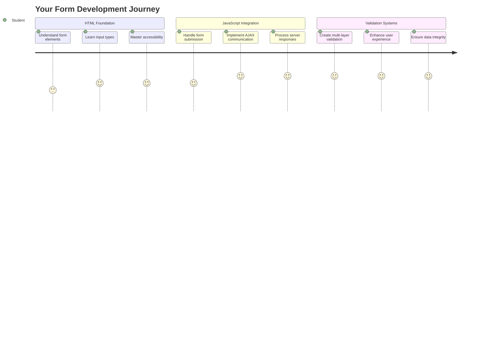
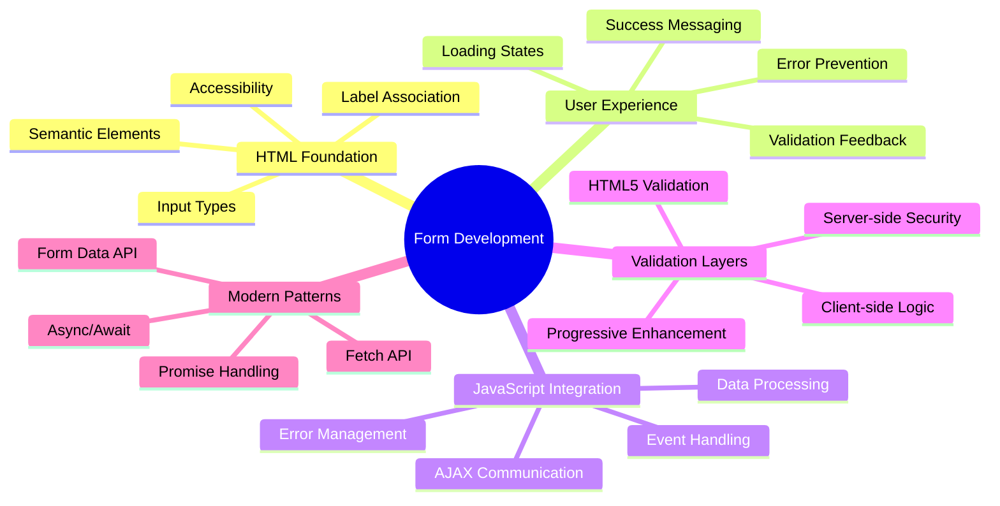
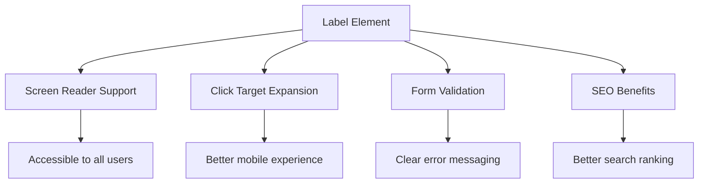
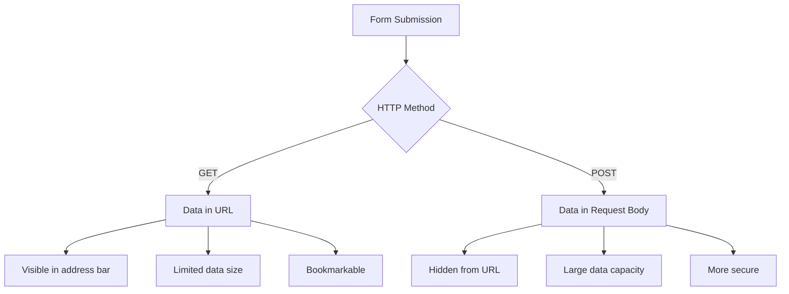
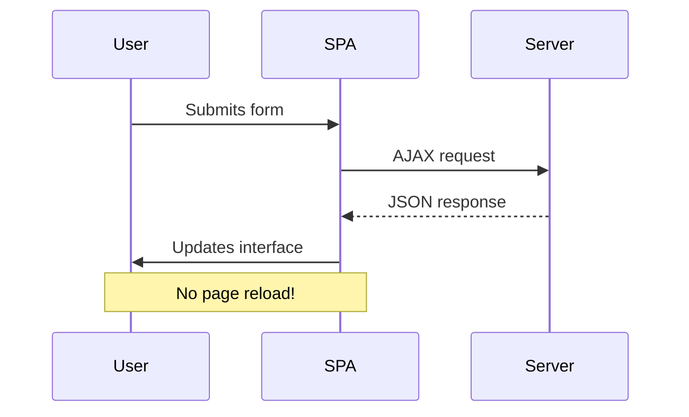
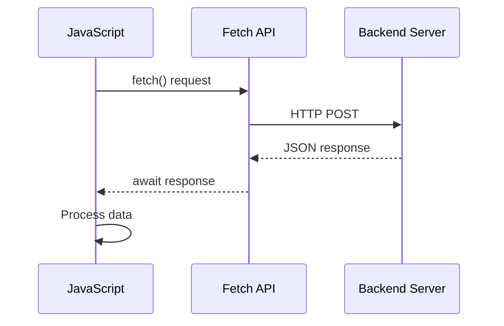
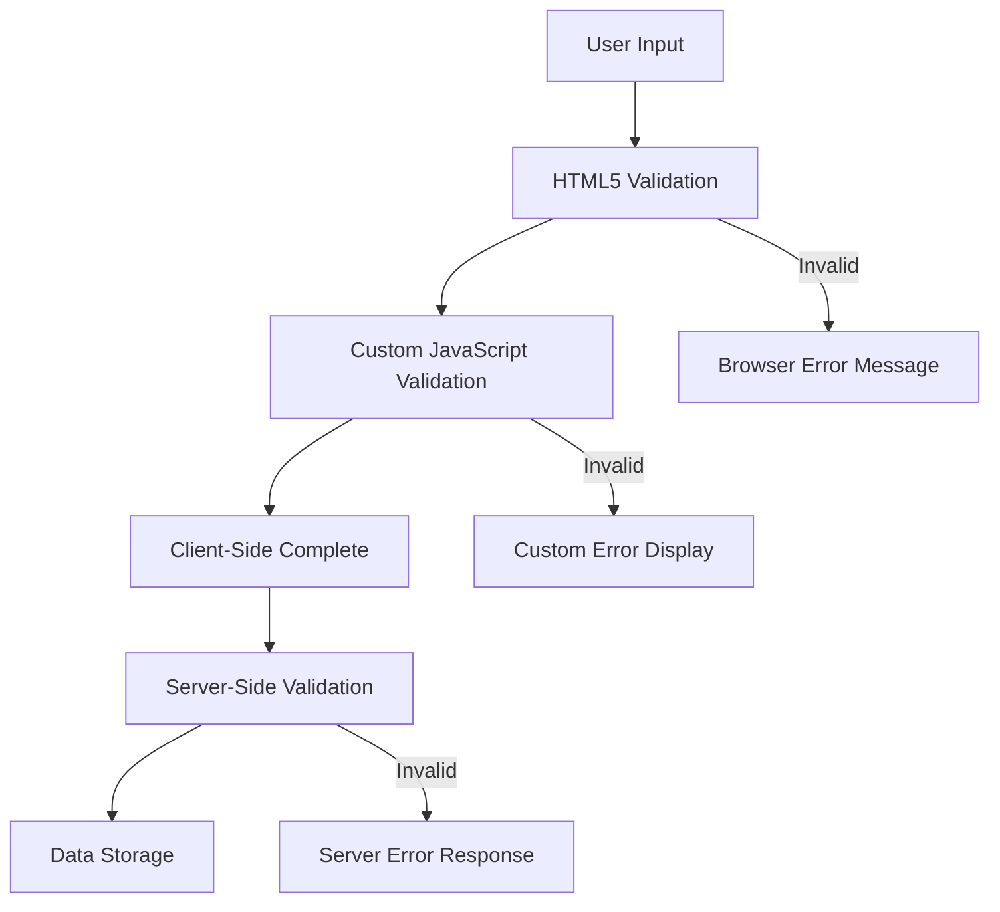
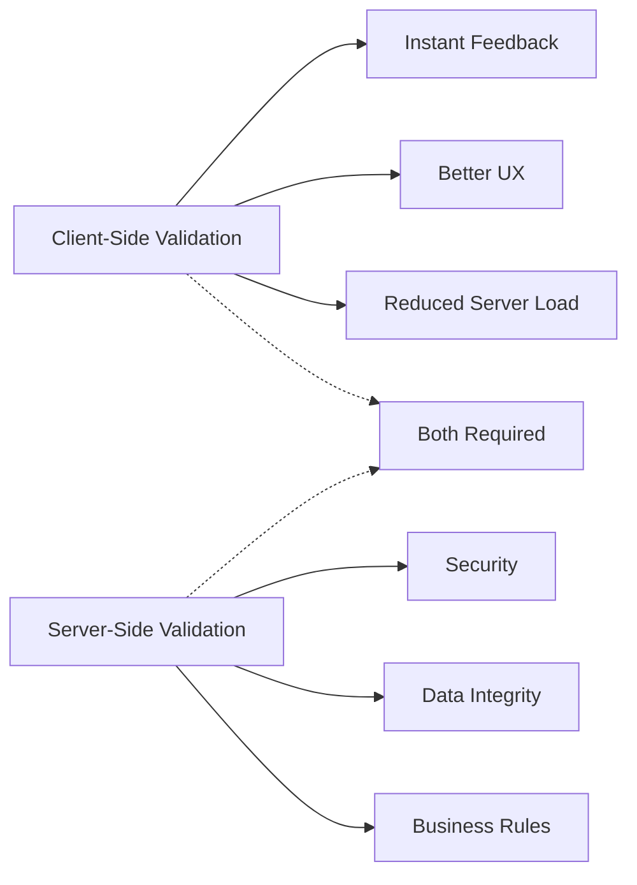
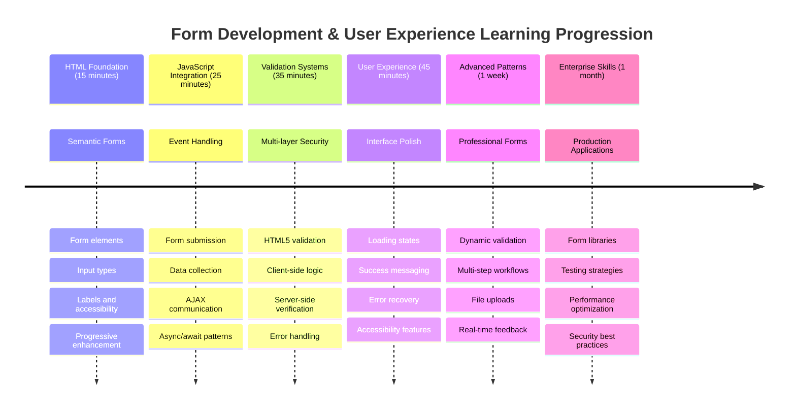

<!--
CO_OP_TRANSLATOR_METADATA:
{
  "original_hash": "7cbdbd132d39a2bb493e85bc2a9387cc",
  "translation_date": "2025-11-04T02:33:32+00:00",
  "source_file": "7-bank-project/2-forms/README.md",
  "language_code": "he"
}
-->
# בניית אפליקציית בנקאות חלק 2: יצירת טופס כניסה והרשמה



## שאלון לפני השיעור

[שאלון לפני השיעור](https://ff-quizzes.netlify.app/web/quiz/43)

מילאתם פעם טופס באינטרנט והוא דחה את כתובת האימייל שלכם? או איבדתם את כל המידע כשלחצתם על "שלח"? כולנו נתקלנו בחוויות מתסכלות כאלה.

טפסים הם הגשר בין המשתמשים שלכם לבין הפונקציונליות של האפליקציה שלכם. כמו הפרוטוקולים המדויקים שמשתמשים בהם פקחי טיסה כדי להנחות מטוסים בבטחה ליעדם, טפסים מעוצבים היטב מספקים משוב ברור ומונעים טעויות יקרות. טפסים גרועים, לעומת זאת, יכולים להרחיק משתמשים מהר יותר מאי-הבנה בשדה תעופה עמוס.

בשיעור הזה, נהפוך את אפליקציית הבנקאות הסטטית שלכם לאפליקציה אינטראקטיבית. תלמדו ליצור טפסים שמאמתים את קלט המשתמש, מתקשרים עם שרתים ומספקים משוב מועיל. תחשבו על זה כיצירת ממשק שליטה שמאפשר למשתמשים לנווט בתכונות האפליקציה שלכם.

בסיום השיעור, תהיה לכם מערכת כניסה והרשמה מלאה עם אימות שמכוונת את המשתמשים להצלחה במקום לתסכול.



## דרישות מוקדמות

לפני שנתחיל לבנות טפסים, בואו נוודא שהכל מוגדר כראוי. השיעור הזה ממשיך בדיוק מהמקום שבו עצרנו בשיעור הקודם, אז אם דילגתם קדימה, אולי כדאי לחזור ולהגדיר את הבסיס קודם.

### הגדרות נדרשות

| רכיב | סטטוס | תיאור |
|------|-------|-------|
| [תבניות HTML](../1-template-route/README.md) | ✅ נדרש | מבנה בסיסי של אפליקציית הבנקאות שלכם |
| [Node.js](https://nodejs.org) | ✅ נדרש | סביבת ריצה של JavaScript לשרת |
| [שרת API בנקאי](../api/README.md) | ✅ נדרש | שירות אחורי לאחסון נתונים |

> 💡 **טיפ לפיתוח**: תפעילו שני שרתים נפרדים בו-זמנית – אחד לאפליקציית הבנקאות הקדמית שלכם ואחד ל-API האחורי. הגדרה זו משקפת פיתוח בעולם האמיתי שבו שירותי קדימה ואחורה פועלים באופן עצמאי.

### הגדרת שרת

**סביבת הפיתוח שלכם תכלול:**
- **שרת קדמי**: מספק את אפליקציית הבנקאות שלכם (בדרך כלל פורט `3000`)
- **שרת API אחורי**: מטפל באחסון ושליפת נתונים (פורט `5000`)
- **שני השרתים** יכולים לפעול בו-זמנית ללא התנגשויות

**בדיקת חיבור ה-API שלכם:**
```bash
curl http://localhost:5000/api
# Expected response: "Bank API v1.0.0"
```

**אם אתם רואים את תגובת גרסת ה-API, אתם מוכנים להמשיך!**

---

## הבנת טפסי HTML ושליטה

טפסי HTML הם הדרך שבה משתמשים מתקשרים עם האפליקציה שלכם. תחשבו עליהם כמו מערכת הטלגרף שחיברה מקומות רחוקים במאה ה-19 – הם פרוטוקול התקשורת בין כוונת המשתמש לתגובת האפליקציה. כאשר הם מעוצבים בצורה מחושבת, הם תופסים טעויות, מנחים את עיצוב הקלט ומספקים הצעות מועילות.

טפסים מודרניים מתקדמים בהרבה מקלטי טקסט בסיסיים. HTML5 הציגה סוגי קלט מיוחדים שמטפלים באימות אימייל, עיצוב מספרים ובחירת תאריכים באופן אוטומטי. שיפורים אלה מועילים גם לנגישות וגם לחוויות משתמשים ניידים.

### אלמנטים חיוניים בטופס

**אבני הבניין שכל טופס צריך:**

```html
<!-- Basic form structure -->
<form id="userForm" method="POST">
  <label for="username">Username</label>
  <input id="username" name="username" type="text" required>
  
  <button type="submit">Submit</button>
</form>
```

**מה הקוד הזה עושה:**
- **יוצר** מיכל טופס עם מזהה ייחודי
- **מציין** את שיטת ה-HTTP לשליחת נתונים
- **מקשר** תוויות עם קלטים לנגישות
- **מגדיר** כפתור שליחה לעיבוד הטופס

### סוגי קלט מודרניים ותכונות

| סוג קלט | מטרה | דוגמת שימוש |
|---------|------|-------------|
| `text` | קלט טקסט כללי | `<input type="text" name="username">` |
| `email` | אימות אימייל | `<input type="email" name="email">` |
| `password` | קלט טקסט מוסתר | `<input type="password" name="password">` |
| `number` | קלט מספרי | `<input type="number" name="balance" min="0">` |
| `tel` | מספרי טלפון | `<input type="tel" name="phone">` |

> 💡 **יתרון HTML5 מודרני**: שימוש בסוגי קלט ספציפיים מספק אימות אוטומטי, מקלדות ניידות מתאימות ותמיכה טובה יותר בנגישות ללא JavaScript נוסף!

### סוגי כפתורים והתנהגותם

```html
<!-- Different button behaviors -->
<button type="submit">Save Data</button>     <!-- Submits the form -->
<button type="reset">Clear Form</button>    <!-- Resets all fields -->
<button type="button">Custom Action</button> <!-- No default behavior -->
```

**מה כל סוג כפתור עושה:**
- **כפתורי שליחה**: מפעילים שליחת טופס ושולחים נתונים לנקודת הקצה שצוינה
- **כפתורי איפוס**: משחזרים את כל שדות הטופס למצבם ההתחלתי
- **כפתורים רגילים**: אינם מספקים התנהגות ברירת מחדל ודורשים JavaScript מותאם אישית לפונקציונליות

> ⚠️ **הערה חשובה**: אלמנט `<input>` הוא סגור בעצמו ואינו דורש תג סגירה. הפרקטיקה המודרנית היא לכתוב `<input>` ללא הסלאש.

### יצירת טופס כניסה

עכשיו ניצור טופס כניסה מעשי שמדגים את שיטות העבודה המודרניות של טפסי HTML. נתחיל עם מבנה בסיסי ונשפר אותו בהדרגה עם תכונות נגישות ואימות.

```html
<template id="login">
  <h1>Bank App</h1>
  <section>
    <h2>Login</h2>
    <form id="loginForm" novalidate>
      <div class="form-group">
        <label for="username">Username</label>
        <input id="username" name="user" type="text" required 
               autocomplete="username" placeholder="Enter your username">
      </div>
      <button type="submit">Login</button>
    </form>
  </section>
</template>
```

**פירוק מה שקורה כאן:**
- **מבנה** הטופס עם אלמנטים סמנטיים של HTML5
- **קיבוץ** אלמנטים קשורים באמצעות מיכלי `div` עם מחלקות משמעותיות
- **קישור** תוויות עם קלטים באמצעות תכונות `for` ו-`id`
- **הוספת** תכונות מודרניות כמו `autocomplete` ו-`placeholder` לחוויית משתמש טובה יותר
- **הוספת** `novalidate` כדי לטפל באימות עם JavaScript במקום ברירת המחדל של הדפדפן

### כוחם של תוויות נכונות

**למה תוויות חשובות לפיתוח אתרים מודרני:**



**מה תוויות נכונות משיגות:**
- **מאפשרות** לקוראי מסך להכריז על שדות הטופס בצורה ברורה
- **מרחיבות** את שטח הלחיצה (לחיצה על התווית ממקדת את הקלט)
- **משפרות** את השימושיות בנייד עם מטרות מגע גדולות יותר
- **תומכות** באימות טופס עם הודעות שגיאה משמעותיות
- **משפרות** SEO על ידי מתן משמעות סמנטית לאלמנטים של הטופס

> 🎯 **מטרה נגישות**: לכל קלט טופס צריך להיות תווית מקושרת. פרקטיקה פשוטה זו הופכת את הטפסים שלכם לשימושיים עבור כולם, כולל משתמשים עם מוגבלויות, ומשפרת את החוויה עבור כל המשתמשים.

### יצירת טופס ההרשמה

טופס ההרשמה דורש מידע מפורט יותר כדי ליצור חשבון משתמש מלא. בואו נבנה אותו עם תכונות HTML5 מודרניות ונגישות משופרת.

```html
<hr/>
<h2>Register</h2>
<form id="registerForm" novalidate>
  <div class="form-group">
    <label for="user">Username</label>
    <input id="user" name="user" type="text" required 
           autocomplete="username" placeholder="Choose a username">
  </div>
  
  <div class="form-group">
    <label for="currency">Currency</label>
    <input id="currency" name="currency" type="text" value="$" 
           required maxlength="3" placeholder="USD, EUR, etc.">
  </div>
  
  <div class="form-group">
    <label for="description">Account Description</label>
    <input id="description" name="description" type="text" 
           maxlength="100" placeholder="Personal savings, checking, etc.">
  </div>
  
  <div class="form-group">
    <label for="balance">Starting Balance</label>
    <input id="balance" name="balance" type="number" value="0" 
           min="0" step="0.01" placeholder="0.00">
  </div>
  
  <button type="submit">Create Account</button>
</form>
```

**במה שראינו למעלה:**
- **ארגון** כל שדה במיכלי div לעיצוב ופריסה טובים יותר
- **הוספת** תכונות `autocomplete` מתאימות לתמיכה במילוי אוטומטי של הדפדפן
- **הוספת** טקסט עזר ב-`placeholder` להנחיית קלט המשתמש
- **הגדרת** ברירות מחדל הגיוניות באמצעות תכונת `value`
- **יישום** תכונות אימות כמו `required`, `maxlength` ו-`min`
- **שימוש** ב-`type="number"` לשדה יתרה עם תמיכה בעשרונים

### חקר סוגי קלט והתנהגותם

**סוגי קלט מודרניים מספקים פונקציונליות משופרת:**

| תכונה | יתרון | דוגמה |
|-------|-------|-------|
| `type="number"` | מקלדת מספרית בנייד | הזנת יתרה קלה יותר |
| `step="0.01"` | שליטה בדיוק עשרוני | מאפשר אגורות במטבע |
| `autocomplete` | מילוי אוטומטי של הדפדפן | השלמת טופס מהירה יותר |
| `placeholder` | רמזים הקשריים | מנחה את ציפיות המשתמש |

> 🎯 **אתגר נגישות**: נסו לנווט בטפסים באמצעות המקלדת בלבד! השתמשו ב-`Tab` כדי לעבור בין שדות, ב-`Space` כדי לסמן תיבות וב-`Enter` כדי לשלוח. חוויה זו עוזרת לכם להבין כיצד משתמשי קוראי מסך מתקשרים עם הטפסים שלכם.

### 🔄 **בדיקת הבנה פדגוגית**
**הבנת יסודות הטופס**: לפני יישום JavaScript, ודאו שאתם מבינים:
- ✅ כיצד HTML סמנטי יוצר מבני טופס נגישים
- ✅ למה סוגי קלט חשובים למקלדות ניידות ואימות
- ✅ הקשר בין תוויות לשליטת טופס
- ✅ כיצד תכונות טופס משפיעות על התנהגות ברירת המחדל של הדפדפן

**מבחן עצמי מהיר**: מה קורה אם אתם שולחים טופס ללא טיפול ב-JavaScript?
*תשובה: הדפדפן מבצע שליחה ברירת מחדל, בדרך כלל מפנה לכתובת ה-URL של הפעולה*

**יתרונות טופס HTML5**: טפסים מודרניים מספקים:
- **אימות מובנה**: בדיקת פורמט אימייל ומספר אוטומטית
- **אופטימיזציה לנייד**: מקלדות מתאימות לסוגי קלט שונים
- **נגישות**: תמיכה בקוראי מסך וניווט במקלדת
- **שיפור הדרגתי**: עובד גם כאשר JavaScript מושבת

## הבנת שיטות שליחת טופס

כשמישהו ממלא את הטופס שלכם ולוחץ על "שלח", הנתונים צריכים להגיע למקום כלשהו – בדרך כלל לשרת שיכול לשמור אותם. יש כמה דרכים שונות שזה יכול לקרות, וידיעת הדרך הנכונה יכולה לחסוך לכם כאבי ראש בהמשך.

בואו נסתכל על מה שקורה בפועל כשמישהו לוחץ על כפתור השליחה.

### התנהגות טופס ברירת מחדל

ראשית, בואו נבחן מה קורה עם שליחת טופס בסיסית:

**בדקו את הטפסים הנוכחיים שלכם:**
1. לחצו על כפתור *הרשמה* בטופס שלכם
2. שימו לב לשינויים בשורת הכתובת של הדפדפן שלכם
3. שימו לב כיצד הדף נטען מחדש והנתונים מופיעים בכתובת ה-URL


### השוואת שיטות HTTP



**הבנת ההבדלים:**

| שיטה | מקרה שימוש | מיקום נתונים | רמת אבטחה | מגבלת גודל |
|------|------------|--------------|-----------|------------|
| `GET` | שאילתות חיפוש, מסננים | פרמטרים בכתובת ה-URL | נמוכה (גלויה) | ~2000 תווים |
| `POST` | חשבונות משתמשים, נתונים רגישים | גוף הבקשה | גבוהה (מוסתרת) | ללא מגבלה מעשית |

**הבנת ההבדלים הבסיסיים:**
- **GET**: מוסיף נתוני טופס לכתובת ה-URL כפרמטרים (מתאים לפעולות חיפוש)
- **POST**: כולל נתונים בגוף הבקשה (חיוני למידע רגיש)
- **מגבלות GET**: מגבלות גודל, נתונים גלויים, היסטוריית דפדפן מתמשכת
- **יתרונות POST**: קיבולת נתונים גדולה, הגנת פרטיות, תמיכה בהעלאת קבצים

> 💡 **פרקטיקה מומלצת**: השתמשו ב-`GET` לטפסי חיפוש ומסננים (שליפת נתונים), השתמשו ב-`POST` להרשמת משתמשים, כניסה ויצירת נתונים.

### הגדרת שליחת טופס

בואו נגדיר את טופס ההרשמה שלכם לתקשר כראוי עם ה-API האחורי באמצעות שיטת POST:

```html
<form id="registerForm" action="//localhost:5000/api/accounts" 
      method="POST" novalidate>
```

**מה ההגדרה הזו עושה:**
- **מכוונת** את שליחת הטופס לנקודת הקצה של ה-API שלכם
- **משתמשת** בשיטת POST לשליחת נתונים מאובטחת
- **כוללת** `novalidate` כדי לטפל באימות עם JavaScript

### בדיקת שליחת טופס

**בצעו את השלבים הבאים כדי לבדוק את הטופס שלכם:**
1. **מלאו** את טופס ההרשמה עם המידע שלכם
2. **לחצו** על כפתור "צור חשבון"
3. **שימו לב** לתגובת השרת בדפדפן שלכם


**מה שאתם אמורים לראות:**
- **הדפדפן מפנה** לכתובת ה-URL של נקודת הקצה של ה-API
- **תגובת JSON** המכילה את נתוני החשבון החדש שלכם
- **אישור מהשרת** שהחשבון נוצר בהצלחה

> 🧪 **זמן ניסוי**: נסו להירשם שוב עם אותו שם משתמש. איזו תגובה אתם מקבלים? זה עוזר לכם להבין כיצד השרת מטפל בנתונים כפולים ובתנאי שגיאה.

### הבנת תגובות JSON

**כאשר השרת מעבד את הטופס שלכם בהצלחה:**
```json
{
  "user": "john_doe",
  "currency": "$",
  "description": "Personal savings",
  "balance": 100,
  "id": "unique_account_id"
}
```

**תגובה זו מאשרת:**
- **יוצר** חשבון חדש עם הנתונים שציינתם
- **מעניק** מזהה ייחודי להתייחסות עתידית
- **מחזיר** את כל מידע החשבון לאימות
- **מציין** אחסון מוצלח בבסיס הנתונים

## טיפול מודרני בטפסים עם JavaScript

שליחות טפסים מסורתיות גורמות לטעינה מחדש של הדף כולו, בדומה לאופן שבו משימות חלל מוקדמות דרשו איפוס מלא של המערכת לתיקוני מסלול. גישה זו מפריעה לחוויית המשתמש ומאבדת את מצב האפליקציה.

טיפול בטפסים עם JavaScript עובד כמו מערכות הנחיה רציפות המשמשות חלליות מודרניות – ביצוע התאמות בזמן אמת מבלי לאבד את הקשר הניווט. אנחנו יכולים ליירט שליחות טפסים, לספק משוב מיידי, לטפל בשגיאות בצורה אלגנטית ולעדכן את הממשק על סמך תגובות השרת תוך שמירה על מיקום המשתמש באפליקציה.

### למה להימנע מטעינת דף מחדש?



**יתרונות טיפול בטפסים עם JavaScript:**
- **שומר** על מצב האפליקציה והקשר המשתמש
- **מספק** משוב מיידי ואינדיקטורים לטעינה
- **מאפשר** טיפול דינמי בשגיאות ואימות
- **יוצר** חוויות משתמש חלקות, כמו אפליקציה
- **מאפשר** לוגיקה מותנית על סמך תגובות השרת

### מעבר מטפסים מסורתיים למודרניים

**אתגרי הגישה המסורתית:**
- **מפנה** משתמשים מחוץ לאפליקציה שלכם
- **מאבד** את מצב האפליקציה והקשר הנוכחי
- **דורש** טעינה מחדש של הדף לפעולות פשוטות
- **מספק** שליטה מוגבלת על משוב המשתמש

**יתרונות הגישה המודרנית עם JavaScript:**
- **שומר** על המשתמשים בתוך האפליקציה שלכם
- **שומר** על כל מצב האפליקציה והנתונים
- **מאפשר** אימות ומשוב בזמן אמת
- **תומך** בשיפור הדרגתי ונגישות

### יישום טיפול בטפסים עם JavaScript

בואו נחליף את שליחת הטופס המסורתית עם טיפול בא
```javascript
// Example of what FormData captures
const formData = new FormData(registerForm);

// FormData automatically captures:
// {
//   "user": "john_doe",
//   "currency": "$", 
//   "description": "Personal account",
//   "balance": "100"
// }
```

**יתרונות ה-FormData API:**
- **איסוף מקיף**: לוכד את כל רכיבי הטופס כולל טקסט, קבצים וקלטים מורכבים
- **מודעות לסוגים**: מטפל בסוגי קלט שונים באופן אוטומטי ללא צורך בקוד מותאם אישית
- **יעילות**: מבטל את הצורך באיסוף ידני של שדות עם קריאה אחת ל-API
- **התאמה**: שומר על פונקציונליות גם כאשר מבנה הטופס משתנה

### יצירת פונקציית תקשורת עם השרת

כעת נבנה פונקציה חזקה לתקשורת עם שרת ה-API שלך באמצעות דפוסי JavaScript מודרניים:

```javascript
async function createAccount(account) {
  try {
    const response = await fetch('//localhost:5000/api/accounts', {
      method: 'POST',
      headers: { 
        'Content-Type': 'application/json',
        'Accept': 'application/json'
      },
      body: account
    });
    
    // Check if the response was successful
    if (!response.ok) {
      throw new Error(`HTTP error! status: ${response.status}`);
    }
    
    return await response.json();
  } catch (error) {
    console.error('Account creation failed:', error);
    return { error: error.message || 'Network error occurred' };
  }
}
```

**הבנת JavaScript אסינכרוני:**



**מה ההטמעה המודרנית הזו משיגה:**
- **שימוש** ב-`async/await` לקוד אסינכרוני קריא
- **כוללת** טיפול שגיאות נכון עם בלוקים של try/catch
- **בודקת** את סטטוס התגובה לפני עיבוד הנתונים
- **מגדירה** כותרות מתאימות לתקשורת JSON
- **מספקת** הודעות שגיאה מפורטות לצורך ניפוי שגיאות
- **מחזירה** מבנה נתונים עקבי למקרים של הצלחה ושגיאה

### כוחו של Fetch API מודרני

**יתרונות Fetch API על פני שיטות ישנות:**

| תכונה | יתרון | יישום |
|-------|-------|-------|
| מבוסס הבטחה | קוד אסינכרוני נקי | `await fetch()` |
| התאמת בקשה | שליטה מלאה ב-HTTP | כותרות, שיטות, גוף |
| טיפול בתגובה | ניתוח נתונים גמיש | `.json()`, `.text()`, `.blob()` |
| טיפול בשגיאות | לכידת שגיאות מקיפה | בלוקים של try/catch |

> 🎥 **למידע נוסף**: [מדריך Async/Await](https://youtube.com/watch?v=YwmlRkrxvkk) - הבנת דפוסי JavaScript אסינכרוניים לפיתוח ווב מודרני.

**מושגים מרכזיים לתקשורת עם השרת:**
- **פונקציות אסינכרוניות** מאפשרות להשהות ביצוע כדי להמתין לתגובות מהשרת
- **מילת המפתח await** גורמת לקוד אסינכרוני להיראות כמו קוד סינכרוני
- **Fetch API** מספק בקשות HTTP מודרניות מבוססות הבטחה
- **טיפול בשגיאות** מבטיח שהאפליקציה שלך תגיב בצורה טובה לבעיות רשת

### השלמת פונקציית ההרשמה

בואו נשלב הכל יחד עם פונקציית הרשמה מלאה ומוכנה לייצור:

```javascript
async function register() {
  const registerForm = document.getElementById('registerForm');
  const submitButton = registerForm.querySelector('button[type="submit"]');
  
  try {
    // Show loading state
    submitButton.disabled = true;
    submitButton.textContent = 'Creating Account...';
    
    // Process form data
    const formData = new FormData(registerForm);
    const jsonData = JSON.stringify(Object.fromEntries(formData));
    
    // Send to server
    const result = await createAccount(jsonData);
    
    if (result.error) {
      console.error('Registration failed:', result.error);
      alert(`Registration failed: ${result.error}`);
      return;
    }
    
    console.log('Account created successfully!', result);
    alert(`Welcome, ${result.user}! Your account has been created.`);
    
    // Reset form after successful registration
    registerForm.reset();
    
  } catch (error) {
    console.error('Unexpected error:', error);
    alert('An unexpected error occurred. Please try again.');
  } finally {
    // Restore button state
    submitButton.disabled = false;
    submitButton.textContent = 'Create Account';
  }
}
```

**הטמעה משופרת זו כוללת:**
- **מספקת** משוב חזותי במהלך שליחת הטופס
- **משביתה** את כפתור השליחה כדי למנוע שליחות כפולות
- **מטפלת** בשגיאות צפויות ולא צפויות בצורה טובה
- **מציגה** הודעות הצלחה ושגיאה ידידותיות למשתמש
- **מאפסת** את הטופס לאחר הרשמה מוצלחת
- **משחזרת** את מצב ה-UI ללא קשר לתוצאה

### בדיקת ההטמעה שלך

**פתח את כלי המפתחים של הדפדפן ובדוק את ההרשמה:**

1. **פתח** את קונסולת הדפדפן (F12 → לשונית Console)
2. **מלא** את טופס ההרשמה
3. **לחץ** על "צור חשבון"
4. **צפה** בהודעות הקונסולה ובמשוב למשתמש


**מה אתה אמור לראות:**
- **מצב טעינה** מופיע על כפתור השליחה
- **לוגים בקונסולה** מציגים מידע מפורט על התהליך
- **הודעת הצלחה** מופיעה כאשר יצירת החשבון מצליחה
- **הטופס מתאפס** באופן אוטומטי לאחר שליחה מוצלחת

> 🔒 **שיקול אבטחה**: נכון לעכשיו, הנתונים מועברים דרך HTTP, שאינו מאובטח לייצור. באפליקציות אמיתיות, תמיד השתמש ב-HTTPS כדי להצפין את העברת הנתונים. למידע נוסף על [אבטחת HTTPS](https://en.wikipedia.org/wiki/HTTPS) ולמה זה חיוני להגנה על נתוני משתמשים.

### 🔄 **בדיקת הבנה פדגוגית**
**שילוב JavaScript מודרני**: בדוק את הבנתך בטיפול בטפסים אסינכרוניים:
- ✅ כיצד `event.preventDefault()` משנה את התנהגות הטופס ברירת המחדל?
- ✅ מדוע FormData API יעיל יותר מאיסוף שדות ידני?
- ✅ כיצד דפוסי async/await משפרים את קריאות הקוד?
- ✅ מה תפקיד טיפול השגיאות בחוויית המשתמש?

**ארכיטקטורת מערכת**: טיפול הטפסים שלך מדגים:
- **תכנות מונחה אירועים**: טפסים מגיבים לפעולות משתמשים ללא טעינת עמוד מחדש
- **תקשורת אסינכרונית**: בקשות לשרת אינן חוסמות את ממשק המשתמש
- **טיפול בשגיאות**: התמודדות עם כשלי רשת בצורה טובה
- **ניהול מצב**: עדכוני UI משקפים תגובות מהשרת בצורה מתאימה
- **שיפור פרוגרסיבי**: פונקציונליות בסיסית עובדת, JavaScript משפר אותה

**דפוסים מקצועיים**: יישמת:
- **אחריות יחידה**: פונקציות עם מטרות ברורות וממוקדות
- **גבולות שגיאה**: בלוקים של try/catch מונעים קריסות אפליקציה
- **משוב למשתמש**: מצבי טעינה והודעות הצלחה/שגיאה
- **המרת נתונים**: FormData ל-JSON לתקשורת עם השרת

## ולידציה מקיפה לטפסים

ולידציה של טפסים מונעת את החוויה המתסכלת של גילוי שגיאות רק לאחר השליחה. כמו מערכות בטיחות מרובות בתחנת החלל הבינלאומית, ולידציה יעילה משלבת שכבות רבות של בדיקות בטיחות.

הגישה האופטימלית משלבת ולידציה ברמת הדפדפן לצורך משוב מיידי, ולידציה ב-JavaScript לשיפור חוויית המשתמש, וולידציה בצד השרת לצורך אבטחה ושלמות נתונים. שכבות אלו מבטיחות גם שביעות רצון משתמשים וגם הגנה על המערכת.

### הבנת שכבות ולידציה



**אסטרטגיית ולידציה רב-שכבתית:**
- **ולידציה HTML5**: בדיקות מיידיות מבוססות דפדפן
- **ולידציה JavaScript**: לוגיקה מותאמת וחוויית משתמש
- **ולידציה בצד השרת**: בדיקות אבטחה ושלמות נתונים סופיות
- **שיפור פרוגרסיבי**: עובד גם אם JavaScript מושבת

### מאפייני ולידציה ב-HTML5

**כלי ולידציה מודרניים העומדים לרשותך:**

| מאפיין | מטרה | דוגמת שימוש | התנהגות דפדפן |
|--------|------|-------------|---------------|
| `required` | שדות חובה | `<input required>` | מונע שליחה ריקה |
| `minlength`/`maxlength` | מגבלות אורך טקסט | `<input maxlength="20">` | אוכף מגבלות תווים |
| `min`/`max` | טווחים מספריים | `<input min="0" max="1000">` | מאמת גבולות מספר |
| `pattern` | חוקי רג'קס מותאמים | `<input pattern="[A-Za-z]+">` | מתאים פורמטים ספציפיים |
| `type` | ולידציה של סוג נתונים | `<input type="email">` | ולידציה מבוססת פורמט |

### עיצוב ולידציה ב-CSS

**צור משוב חזותי למצבי ולידציה:**

```css
/* Valid input styling */
input:valid {
  border-color: #28a745;
  background-color: #f8fff9;
}

/* Invalid input styling */
input:invalid {
  border-color: #dc3545;
  background-color: #fff5f5;
}

/* Focus states for better accessibility */
input:focus:valid {
  box-shadow: 0 0 0 0.2rem rgba(40, 167, 69, 0.25);
}

input:focus:invalid {
  box-shadow: 0 0 0 0.2rem rgba(220, 53, 69, 0.25);
}
```

**מה משיגים הרמזים החזותיים הללו:**
- **גבולות ירוקים**: מצביעים על ולידציה מוצלחת, כמו אורות ירוקים במרכז הבקרה
- **גבולות אדומים**: מסמנים שגיאות ולידציה הדורשות תשומת לב
- **הדגשת פוקוס**: מספקת הקשר חזותי ברור למיקום הקלט הנוכחי
- **עיצוב עקבי**: יוצר דפוסי ממשק צפויים שהמשתמשים יכולים ללמוד

> 💡 **טיפ מקצועי**: השתמש ב-`:valid` ו-`:invalid` ב-CSS כדי לספק משוב חזותי מיידי בזמן שהמשתמשים מקלידים, וליצור ממשק תגובתי ומועיל.

### הטמעת ולידציה מקיפה

בואו נשפר את טופס ההרשמה שלך עם ולידציה חזקה המספקת חוויית משתמש מצוינת ואיכות נתונים:

```html
<form id="registerForm" method="POST" novalidate>
  <div class="form-group">
    <label for="user">Username <span class="required">*</span></label>
    <input id="user" name="user" type="text" required 
           minlength="3" maxlength="20" 
           pattern="[a-zA-Z0-9_]+" 
           autocomplete="username"
           title="Username must be 3-20 characters, letters, numbers, and underscores only">
    <small class="form-text">Choose a unique username (3-20 characters)</small>
  </div>
  
  <div class="form-group">
    <label for="currency">Currency <span class="required">*</span></label>
    <input id="currency" name="currency" type="text" required 
           value="$" maxlength="3" 
           pattern="[A-Z$€£¥₹]+" 
           title="Enter a valid currency symbol or code">
    <small class="form-text">Currency symbol (e.g., $, €, £)</small>
  </div>
  
  <div class="form-group">
    <label for="description">Account Description</label>
    <input id="description" name="description" type="text" 
           maxlength="100" 
           placeholder="Personal savings, checking, etc.">
    <small class="form-text">Optional description (up to 100 characters)</small>
  </div>
  
  <div class="form-group">
    <label for="balance">Starting Balance</label>
    <input id="balance" name="balance" type="number" 
           value="0" min="0" step="0.01" 
           title="Enter a positive number for your starting balance">
    <small class="form-text">Initial account balance (minimum $0.00)</small>
  </div>
  
  <button type="submit">Create Account</button>
</form>
```

**הבנת ולידציה משופרת:**
- **משלבת** אינדיקטורים לשדות חובה עם תיאורים מועילים
- **כוללת** מאפייני `pattern` לוולידציה פורמט
- **מספקת** מאפייני `title` לנגישות וטיפים
- **מוסיפה** טקסט עזר להכוונת קלט משתמש
- **משתמשת** במבנה HTML סמנטי לנגישות טובה יותר

### חוקי ולידציה מתקדמים

**מה כל חוק ולידציה משיג:**

| שדה | חוקי ולידציה | יתרון למשתמש |
|-----|-------------|--------------|
| שם משתמש | `required`, `minlength="3"`, `maxlength="20"`, `pattern="[a-zA-Z0-9_]+"` | מבטיח מזהים תקפים וייחודיים |
| מטבע | `required`, `maxlength="3"`, `pattern="[A-Z$€£¥₹]+"` | מקבל סמלי מטבע נפוצים |
| יתרה | `min="0"`, `step="0.01"`, `type="number"` | מונע יתרות שליליות |
| תיאור | `maxlength="100"` | מגבלות אורך סבירות |

### בדיקת התנהגות ולידציה

**נסה את תרחישי הוולידציה הבאים:**
1. **שלח** את הטופס עם שדות חובה ריקים
2. **הכנס** שם משתמש קצר מ-3 תווים
3. **נסה** תווים מיוחדים בשדה שם המשתמש
4. **הכנס** סכום יתרה שלילי


**מה תבחין:**
- **הדפדפן מציג** הודעות ולידציה מקוריות
- **שינויים בעיצוב** מבוססים על מצבי `:valid` ו-`:invalid`
- **שליחת הטופס** נמנעת עד שכל הוולידציות עוברות
- **הפוקוס עובר אוטומטית** לשדה הראשון שאינו תקין

### ולידציה בצד לקוח מול צד שרת



**מדוע אתה צריך את שתי השכבות:**
- **ולידציה בצד לקוח**: מספקת משוב מיידי ומשפרת את חוויית המשתמש
- **ולידציה בצד שרת**: מבטיחה אבטחה ומטפלת בחוקי עסקים מורכבים
- **גישה משולבת**: יוצרת אפליקציות חזקות, ידידותיות למשתמש ובטוחות
- **שיפור פרוגרסיבי**: עובד גם כאשר JavaScript מושבת

> 🛡️ **תזכורת אבטחה**: לעולם אל תסמוך רק על ולידציה בצד לקוח! משתמשים זדוניים יכולים לעקוף בדיקות בצד לקוח, ולכן ולידציה בצד שרת חיונית לאבטחה ושלמות נתונים.

### ⚡ **מה אתה יכול לעשות ב-5 הדקות הבאות**
- [ ] בדוק את הטופס שלך עם נתונים לא תקינים כדי לראות הודעות ולידציה
- [ ] נסה לשלוח את הטופס עם JavaScript מושבת כדי לראות ולידציה ב-HTML5
- [ ] פתח את כלי המפתחים של הדפדפן ובדוק את נתוני הטופס שנשלחים לשרת
- [ ] נסה סוגי קלט שונים כדי לראות שינויים במקלדת במכשירים ניידים

### 🎯 **מה תוכל להשיג בשעה הקרובה**
- [ ] השלם את מבחן הסיכום של השיעור והבנת מושגי טיפול בטפסים
- [ ] הטמע את אתגר הוולידציה המקיפה עם משוב בזמן אמת
- [ ] הוסף עיצוב CSS ליצירת טפסים מקצועיים
- [ ] צור טיפול בשגיאות עבור שמות משתמש כפולים ושגיאות שרת
- [ ] הוסף שדות אישור סיסמה עם ולידציה תואמת

### 📅 **מסע המאסטרי שלך בטפסים לאורך השבוע**
- [ ] השלם את אפליקציית הבנקאות המלאה עם תכונות טופס מתקדמות
- [ ] הטמע יכולות העלאת קבצים לתמונות פרופיל או מסמכים
- [ ] הוסף טפסים מרובי שלבים עם אינדיקטורים להתקדמות וניהול מצב
- [ ] צור טפסים דינמיים שמתאימים עצמם על בסיס בחירות משתמש
- [ ] הטמע שמירת טופס אוטומטית ושחזור לחוויית משתמש טובה יותר
- [ ] הוסף ולידציה מתקדמת כמו אימות דוא"ל ועיצוב מספרי טלפון

### 🌟 **מסע המאסטרי שלך בפיתוח פרונטאנד לאורך החודש**
- [ ] בנה אפליקציות טופס מורכבות עם לוגיקה מותנית וזרימות עבודה
- [ ] למד ספריות טפסים ומסגרות לפיתוח מהיר
- [ ] שלוט בהנחיות נגישות ועקרונות עיצוב כוללניים
- [ ] הטמע בינאום ולוקליזציה לטפסים גלובליים
- [ ] צור ספריות רכיבי טופס לשימוש חוזר ומערכות עיצוב
- [ ] תרום לפרויקטים טפסים בקוד פתוח ושתף שיטות עבודה מומלצות

## 🎯 ציר הזמן שלך למאסטרי פיתוח טפסים



### 🛠️ סיכום ערכת הכלים שלך לפיתוח טפסים

לאחר השלמת השיעור, כעת שלטת ב:
- **טפסי HTML5**: מבנה סמנטי, סוגי קלט ותכונות נגישות
- **טיפול בטפסים ב-JavaScript**: ניהול אירועים, איסוף נתונים ותקשורת AJAX
- **ארכיטקטורת ולידציה**: ולידציה רב-שכבתית לאבטחה וחוויית משתמש
- **תכנות אסינכרוני**: Fetch API מודרני ודפוסי async/await
- **ניהול שגיאות**: טיפול שגיאות מקיף ומערכות משוב למשתמש
- **עיצוב חוויית משתמש**: מצבי טעינה, הודעות הצלחה ושחזור שגיאות
- **שיפור פרוגרסיבי**: טפסים שעובדים בכל הדפדפנים והיכולות

**יישומים בעולם האמיתי**: מיומנויות פיתוח הטפסים שלך חלות ישירות על:
- **אפליקציות מסחר אלקטרוני**: תהליכי צ'קאאוט, הרשמת חשבונות וטפסי תשלום
- **תוכנה ארגונית**: מערכות הזנת נתונים, ממשקי דיווח וזרימות עבודה
- **ניהול תוכן**: פלטפורמות פרסום, תוכן שנוצר על ידי משתמשים וממשקי ניהול
- **אפליקציות פיננסיות**: ממשקי בנקאות, פלטפורמות השקעה ומערכות עסקאות
- **מערכות בריאות**: פורטלים למטופלים, תזמון פגישות וטפסי רשומות רפואיות
- **פלטפורמות חינוכיות**: הרשמת קורסים, כלי הערכה ומערכות ניהול למידה

**מיומנויות מקצועיות שנרכשו**: כעת תוכל:
- **לעצב** טפסים נגישים שעובדים עבור כל המשתמשים כולל בעלי מוגבלויות
- **להטמיע** ולידציה מאובטחת לטפסים שמונעת שחיתות נתונים ופגיעות אבטחה
- **ליצור** ממשקי משתמש תגובתיים המספקים משוב והכוונה ברורה
- **לנפות שגיאות** אינטראקציות טפסים מורכבות באמצעות כלי מפתחים של הדפדפן וניתוח רשת
- **לייעל** ביצועי טפסים באמצעות טיפול נתונים יעיל ואסטרטגיות ולידציה

**מושגי פיתוח פרונטאנד שנרכשו**:
- **ארכיטקטורה מונחית אירועים
**הנחיה:** צור מערכת מלאה לאימות טפסים עבור טופס הרשמה הכוללת: 1) משוב אימות בזמן אמת עבור כל שדה בזמן שהמשתמש מקליד, 2) הודעות אימות מותאמות אישית שמופיעות מתחת לכל שדה קלט, 3) שדה אישור סיסמה עם אימות התאמה, 4) אינדיקטורים חזותיים (כמו סימני וי ירוקים לשדות תקינים ואזהרות אדומות לשדות לא תקינים), 5) כפתור שליחה שמופעל רק כאשר כל האימותים עוברים. השתמש בתכונות אימות של HTML5, CSS לעיצוב מצבי האימות, ו-JavaScript להתנהגות האינטראקטיבית.

למידע נוסף על [מצב סוכן](https://code.visualstudio.com/blogs/2025/02/24/introducing-copilot-agent-mode) כאן.

## 🚀 אתגר

הצג הודעת שגיאה ב-HTML אם המשתמש כבר קיים.

הנה דוגמה לאיך עמוד ההתחברות הסופי יכול להיראות לאחר קצת עיצוב:


## חידון לאחר ההרצאה

[חידון לאחר ההרצאה](https://ff-quizzes.netlify.app/web/quiz/44)

## סקירה ולימוד עצמי

מפתחים הפכו יצירתיים מאוד בכל הנוגע לבניית טפסים, במיוחד באסטרטגיות האימות. למד על זרימות טפסים שונות על ידי עיון ב-[CodePen](https://codepen.com); האם תוכל למצוא טפסים מעניינים ומעוררי השראה?

## משימה

[עצב את אפליקציית הבנק שלך](assignment.md)

---

**הצהרת אחריות**:  
מסמך זה תורגם באמצעות שירות תרגום מבוסס AI [Co-op Translator](https://github.com/Azure/co-op-translator). למרות שאנו שואפים לדיוק, יש לקחת בחשבון שתרגומים אוטומטיים עשויים להכיל שגיאות או אי דיוקים. המסמך המקורי בשפתו המקורית צריך להיחשב כמקור סמכותי. למידע קריטי, מומלץ להשתמש בתרגום מקצועי אנושי. איננו אחראים לאי הבנות או פרשנויות שגויות הנובעות משימוש בתרגום זה.