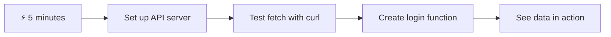
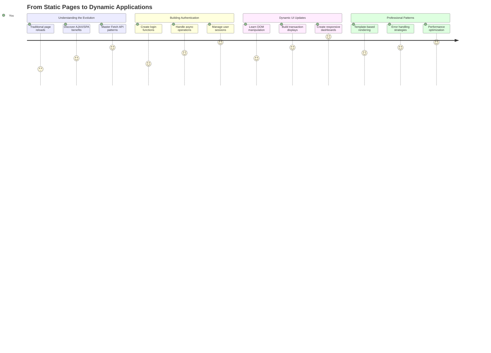
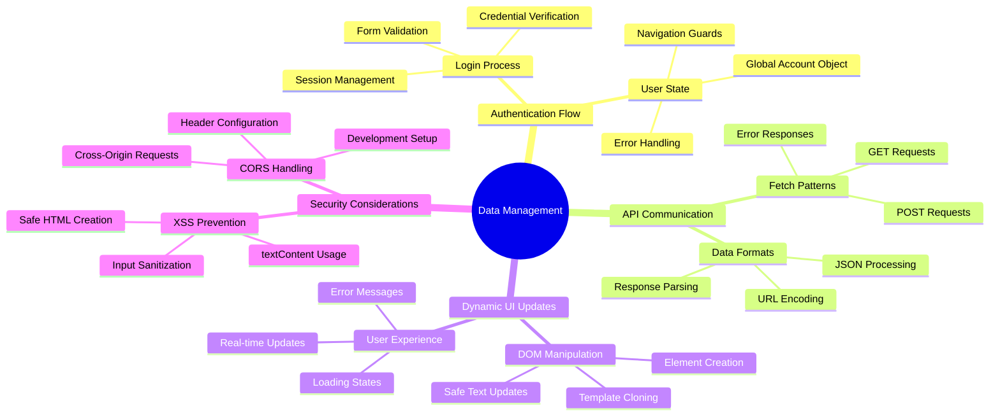
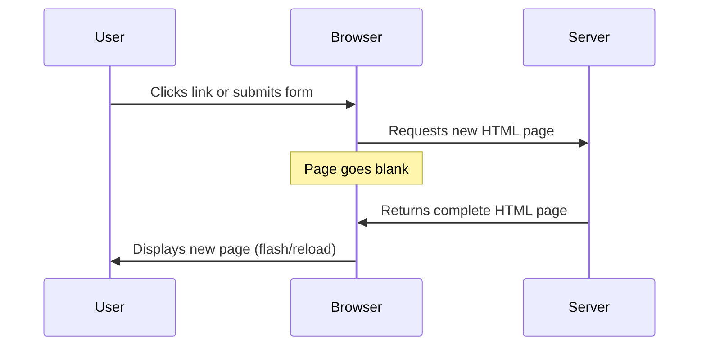
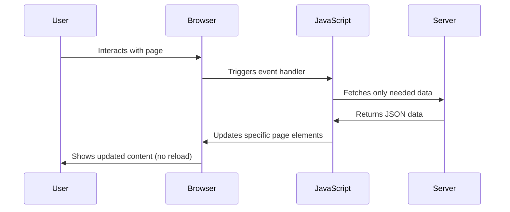
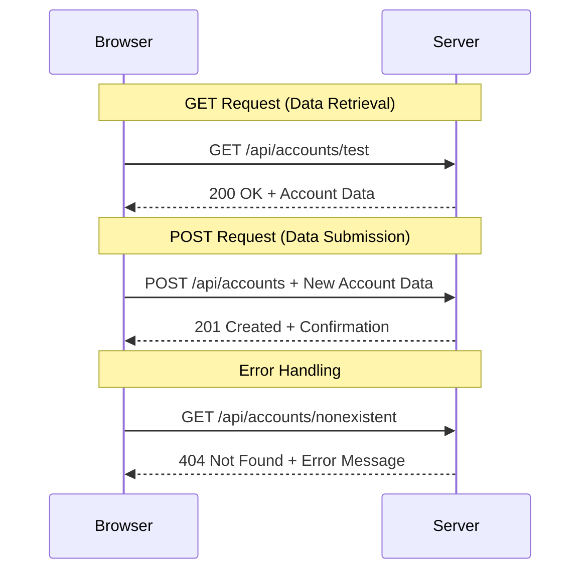
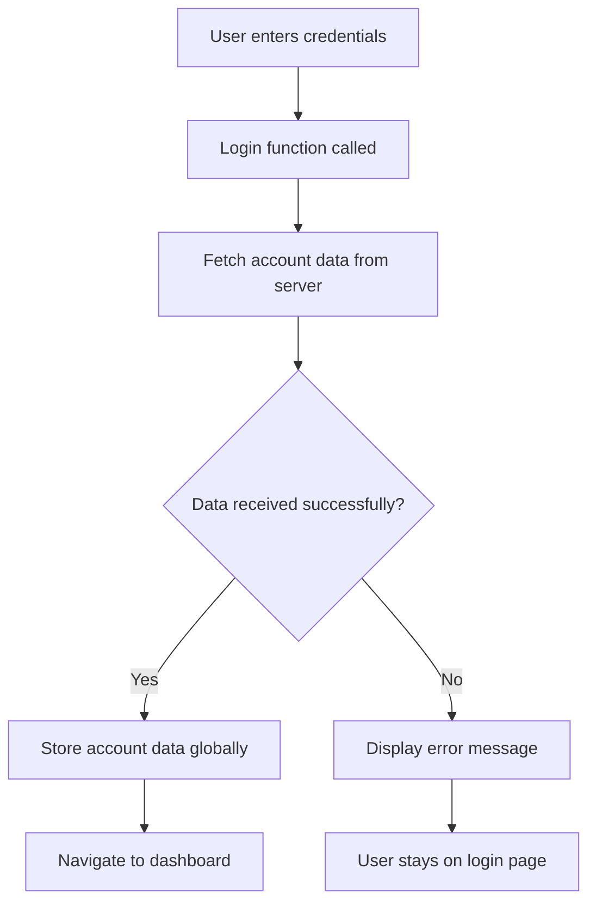
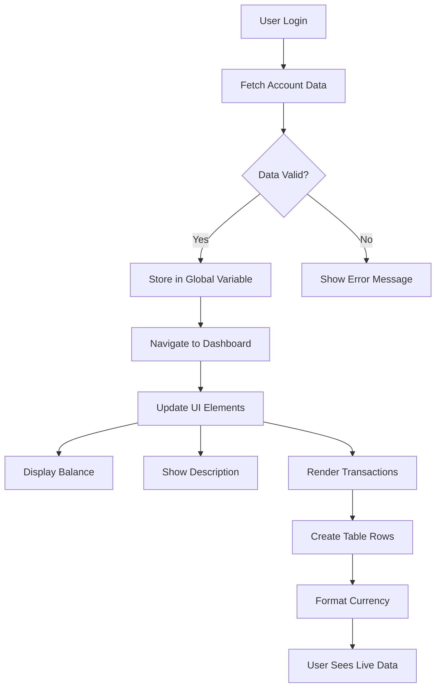
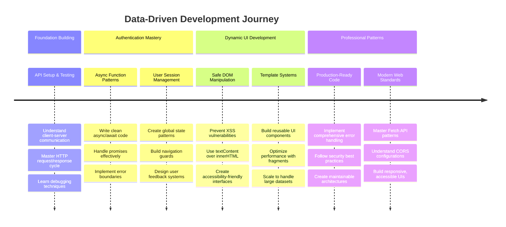

<!--
CO_OP_TRANSLATOR_METADATA:
{
  "original_hash": "86ee5069f27ea3151389d8687c95fac9",
  "translation_date": "2025-11-04T02:29:19+00:00",
  "source_file": "7-bank-project/3-data/README.md",
  "language_code": "he"
}
-->
# בניית אפליקציית בנקאות חלק 3: שיטות לשליפת נתונים ושימוש בהם

תחשבו על המחשב של האנטרפרייז ב"מסע בין כוכבים" - כשקפטן פיקארד מבקש מצב ספינה, המידע מופיע מיד בלי שהממשק כולו ייסגר וייבנה מחדש. הזרימה החלקה הזו של מידע היא בדיוק מה שאנחנו בונים כאן עם שליפת נתונים דינמית.

כרגע, אפליקציית הבנקאות שלכם היא כמו עיתון מודפס - אינפורמטיבית אבל סטטית. אנחנו הולכים להפוך אותה למשהו יותר כמו מרכז הבקרה של נאס"א, שבו נתונים זורמים באופן רציף ומתעדכנים בזמן אמת בלי להפריע למהלך העבודה של המשתמש.

תלמדו איך לתקשר עם שרתים בצורה אסינכרונית, להתמודד עם נתונים שמגיעים בזמנים שונים, ולהפוך מידע גולמי למשהו משמעותי עבור המשתמשים שלכם. זה ההבדל בין דמו לתוכנה מוכנה לייצור.

## ⚡ מה אפשר לעשות ב-5 הדקות הקרובות

**מסלול התחלה מהירה למפתחים עסוקים**



- **דקה 1-2**: הפעלו את שרת ה-API שלכם (`cd api && npm start`) ובדקו את החיבור
- **דקה 3**: צרו פונקציה בסיסית `getAccount()` באמצעות fetch
- **דקה 4**: חברו את טופס ההתחברות עם `action="javascript:login()"`
- **דקה 5**: בדקו את ההתחברות וצפו בנתוני החשבון מופיעים בקונסול

**פקודות בדיקה מהירה**:
```bash
# Verify API is running
curl http://localhost:5000/api

# Test account data fetch
curl http://localhost:5000/api/accounts/test
```

**למה זה חשוב**: תוך 5 דקות תראו את הקסם של שליפת נתונים אסינכרונית שמניעה כל אפליקציית ווב מודרנית. זה הבסיס שגורם לאפליקציות להרגיש תגובתיות וחיות.

## 🗺️ מסע הלמידה שלכם דרך אפליקציות ווב מבוססות נתונים



**יעד המסע שלכם**: בסוף השיעור הזה, תבינו איך אפליקציות ווב מודרניות שולפות, מעבדות ומציגות נתונים באופן דינמי, ויוצרות את חוויות המשתמש החלקות שאנו מצפים מאפליקציות מקצועיות.

## שאלון לפני השיעור

[שאלון לפני השיעור](https://ff-quizzes.netlify.app/web/quiz/45)

### דרישות מקדימות

לפני שתצללו לשליפת נתונים, ודאו שיש לכם את הרכיבים הבאים מוכנים:

- **שיעור קודם**: השלימו את [טופס ההתחברות וההרשמה](../2-forms/README.md) - נבנה על הבסיס הזה
- **שרת מקומי**: התקינו [Node.js](https://nodejs.org) ו[הפעילו את שרת ה-API](../api/README.md) כדי לספק נתוני חשבון
- **חיבור API**: בדקו את חיבור השרת שלכם עם הפקודה הזו:

```bash
curl http://localhost:5000/api
# Expected response: "Bank API v1.0.0"
```

בדיקה מהירה זו מבטיחה שכל הרכיבים מתקשרים כראוי:
- מאמתת ש-Node.js פועל כראוי במערכת שלכם
- מאשרת ששרת ה-API פעיל ומגיב
- מוודאת שהאפליקציה שלכם יכולה להגיע לשרת (כמו בדיקת קשר רדיו לפני משימה)

## 🧠 סקירה של מערכת ניהול נתונים



**עקרון מרכזי**: אפליקציות ווב מודרניות הן מערכות תזמור נתונים - הן מתאמות בין ממשקי משתמש, APIs של שרתים ומודלי אבטחת דפדפן כדי ליצור חוויות חלקות ותגובתיות.

---

## הבנת שליפת נתונים באפליקציות ווב מודרניות

האופן שבו אפליקציות ווב מתמודדות עם נתונים השתנה באופן דרמטי במהלך שני העשורים האחרונים. הבנת האבולוציה הזו תעזור לכם להעריך מדוע טכניקות מודרניות כמו AJAX ו-Fetch API הן כל כך עוצמתיות ומדוע הן הפכו לכלים חיוניים למפתחי ווב.

בואו נחקור איך אתרים מסורתיים עבדו בהשוואה לאפליקציות הדינמיות והתגובתיות שאנחנו בונים היום.

### אפליקציות מרובות עמודים מסורתיות (MPA)

בימי האינטרנט הראשונים, כל לחיצה הייתה כמו להחליף ערוצים בטלוויזיה ישנה - המסך היה מתרוקן ואז מתכוונן לאט לתוכן החדש. זו הייתה המציאות של אפליקציות ווב מוקדמות, שבהן כל אינטראקציה דרשה בנייה מחדש של כל העמוד מאפס.




**למה הגישה הזו הרגישה מסורבלת:**
- כל לחיצה דרשה בנייה מחדש של כל העמוד מאפס
- משתמשים הופרעו באמצע המחשבה על ידי הבהובים מעצבנים של העמוד
- חיבור האינטרנט עבד שעות נוספות בהורדת אותו כותרת ותחתית שוב ושוב
- אפליקציות הרגישו יותר כמו לעבור דרך ארון תיוק מאשר להשתמש בתוכנה

### אפליקציות עמוד יחיד מודרניות (SPA)

AJAX (JavaScript ו-XML אסינכרוני) שינה את הפרדיגמה הזו לחלוטין. כמו העיצוב המודולרי של תחנת החלל הבינלאומית, שבו אסטרונאוטים יכולים להחליף רכיבים בודדים בלי לבנות מחדש את כל המבנה, AJAX מאפשר לנו לעדכן חלקים ספציפיים של עמוד ווב בלי לטעון הכל מחדש. למרות שהשם מזכיר XML, אנחנו משתמשים בעיקר ב-JSON היום, אבל העיקרון המרכזי נשאר: לעדכן רק את מה שצריך להשתנות.




**למה אפליקציות SPA מרגישות כל כך טוב:**
- רק החלקים שבאמת השתנו מתעדכנים (חכם, נכון?)
- אין יותר הפרעות פתאומיות - המשתמשים נשארים בזרימה שלהם
- פחות נתונים עוברים ברשת, מה שאומר טעינה מהירה יותר
- הכל מרגיש מהיר ותגובתי, כמו האפליקציות בטלפון שלכם

### האבולוציה ל-Fetch API מודרני

דפדפנים מודרניים מספקים את [`Fetch` API](https://developer.mozilla.org/docs/Web/API/Fetch_API), שמחליף את [`XMLHttpRequest`](https://developer.mozilla.org/docs/Web/API/XMLHttpRequest/Using_XMLHttpRequest) הישן. כמו ההבדל בין הפעלת טלגרף לשימוש באימייל, Fetch API משתמש בהבטחות לקוד אסינכרוני נקי יותר ומטפל ב-JSON באופן טבעי.

| תכונה | XMLHttpRequest | Fetch API |
|-------|----------------|-----------|
| **תחביר** | מבוסס קריאות מורכבות | מבוסס הבטחות נקי |
| **טיפול ב-JSON** | נדרש ניתוח ידני | שיטה מובנית `.json()` |
| **טיפול בשגיאות** | מידע שגיאות מוגבל | פרטי שגיאות מקיפים |
| **תמיכה מודרנית** | תאימות למורשת | הבטחות ES6+ ו-async/await |

> 💡 **תאימות דפדפנים**: חדשות טובות - Fetch API עובד בכל הדפדפנים המודרניים! אם אתם סקרנים לגבי גרסאות ספציפיות, [caniuse.com](https://caniuse.com/fetch) מציע את סיפור התאימות המלא.
> 
**בשורה התחתונה:**
- עובד נהדר ב-Chrome, Firefox, Safari ו-Edge (בעצם בכל מקום שבו המשתמשים שלכם נמצאים)
- רק Internet Explorer זקוק לעזרה נוספת (ובכנות, הגיע הזמן להיפרד מ-IE)
- מכין אתכם בצורה מושלמת לדפוסי async/await האלגנטיים שנשתמש בהם בהמשך

### יישום התחברות משתמש ושליפת נתונים

עכשיו ניישם את מערכת ההתחברות שממירה את אפליקציית הבנקאות שלכם מתצוגה סטטית לאפליקציה פונקציונלית. כמו פרוטוקולי האימות המשמשים במתקנים צבאיים מאובטחים, נאמת את פרטי המשתמש ואז נספק גישה לנתונים הספציפיים שלהם.

נבנה את זה בהדרגה, החל מאימות בסיסי ואז נוסיף את יכולות שליפת הנתונים.

#### שלב 1: יצירת בסיס פונקציית ההתחברות

פתחו את קובץ `app.js` שלכם והוסיפו פונקציה חדשה בשם `login`. זו תטפל בתהליך אימות המשתמש:

```javascript
async function login() {
  const loginForm = document.getElementById('loginForm');
  const user = loginForm.user.value;
}
```

**בואו נפרק את זה:**
- המילה `async`? היא אומרת ל-JavaScript "היי, הפונקציה הזו עשויה להזדקק להמתנה לדברים"
- אנחנו שולפים את הטופס מהעמוד (לא משהו מפואר, פשוט מוצאים אותו לפי ה-ID שלו)
- ואז אנחנו שולפים את מה שהמשתמש הקליד בתור שם המשתמש שלו
- הנה טריק נחמד: אפשר לגשת לכל קלט טופס לפי תכונת `name` שלו - אין צורך בקריאות getElementById נוספות!

> 💡 **דפוס גישה לטופס**: כל בקרת טופס יכולה להיות נגישה לפי השם שלה (שנקבע ב-HTML באמצעות תכונת `name`) כמאפיין של אלמנט הטופס. זה מספק דרך נקייה וקריאה לקבל נתוני טופס.

#### שלב 2: יצירת פונקציית שליפת נתוני חשבון

בהמשך, ניצור פונקציה ייעודית לשליפת נתוני חשבון מהשרת. זה עוקב אחרי אותו דפוס כמו פונקציית ההרשמה שלכם אבל מתמקד בשליפת נתונים:

```javascript
async function getAccount(user) {
  try {
    const response = await fetch('//localhost:5000/api/accounts/' + encodeURIComponent(user));
    return await response.json();
  } catch (error) {
    return { error: error.message || 'Unknown error' };
  }
}
```

**הנה מה שהקוד הזה משיג:**
- **משתמש** ב-API המודרני `fetch` כדי לבקש נתונים בצורה אסינכרונית
- **בונה** כתובת URL של בקשת GET עם פרמטר שם המשתמש
- **מיישם** `encodeURIComponent()` כדי לטפל בבטחה בתווים מיוחדים בכתובות URL
- **ממיר** את התגובה לפורמט JSON לצורך מניפולציה קלה של נתונים
- **מטפל** בשגיאות בצורה חלקה על ידי החזרת אובייקט שגיאה במקום קריסה

> ⚠️ **הערת אבטחה**: הפונקציה `encodeURIComponent()` מטפלת בתווים מיוחדים בכתובות URL. כמו מערכות קידוד המשמשות בתקשורת ימית, היא מבטיחה שההודעה שלכם תגיע בדיוק כפי שהתכוונתם, ומונעת מתווים כמו "#" או "&" להתפרש בצורה שגויה.
> 
**למה זה חשוב:**
- מונע מתווים מיוחדים לשבור כתובות URL
- מגן מפני התקפות מניפולציית URL
- מבטיח שהשרת יקבל את הנתונים המיועדים
- עוקב אחרי פרקטיקות קידוד מאובטחות

#### הבנת בקשות HTTP GET

הנה משהו שעשוי להפתיע אתכם: כשמשתמשים ב-`fetch` בלי אפשרויות נוספות, הוא יוצר אוטומטית בקשת [`GET`](https://developer.mozilla.org/docs/Web/HTTP/Methods/GET). זה מושלם למה שאנחנו עושים - מבקשים מהשרת "היי, אפשר לראות את נתוני החשבון של המשתמש הזה?"

חשבו על בקשות GET כמו לבקש בנימוס להשאיל ספר מהספרייה - אתם מבקשים לראות משהו שכבר קיים. בקשות POST (שבהן השתמשנו להרשמה) הן יותר כמו להגיש ספר חדש להוספה לאוסף.

| בקשת GET | בקשת POST |
|----------|-----------|
| **מטרה** | שליפת נתונים קיימים | שליחת נתונים חדשים לשרת |
| **פרמטרים** | בנתיב URL/מחרוזת שאילתה | בגוף הבקשה |
| **מטמון** | ניתן למטמון על ידי דפדפנים | לא בדרך כלל |
| **אבטחה** | גלוי ב-URL/יומנים | מוסתר בגוף הבקשה |



#### שלב 3: חיבור הכל יחד

עכשיו לחלק המספק - בואו נחבר את פונקציית שליפת החשבון לתהליך ההתחברות. כאן הכל מתחבר:

```javascript
async function login() {
  const loginForm = document.getElementById('loginForm');
  const user = loginForm.user.value;
  const data = await getAccount(user);

  if (data.error) {
    return console.log('loginError', data.error);
  }

  account = data;
  navigate('/dashboard');
}
```

הפונקציה הזו עוקבת אחרי רצף ברור:
- שולפת את שם המשתמש מקלט הטופס
- מבקשת את נתוני החשבון של המשתמש מהשרת
- מטפלת בכל שגיאה שמתרחשת במהלך התהליך
- שומרת את נתוני החשבון ומנווטת ללוח הבקרה במקרה של הצלחה

> 🎯 **דפוס Async/Await**: מכיוון ש-`getAccount` היא פונקציה אסינכרונית, אנחנו משתמשים במילת המפתח `await` כדי להשהות את הביצוע עד שהשרת מגיב. זה מונע מהקוד להמשיך עם נתונים לא מוגדרים.

#### שלב 4: יצירת מקום לנתונים שלכם

האפליקציה שלכם צריכה מקום לשמור את מידע החשבון ברגע שהוא נטען. חשבו על זה כמו הזיכרון לטווח קצר של האפליקציה שלכם - מקום לשמור את נתוני המשתמש הנוכחי בהישג יד. הוסיפו את השורה הזו בראש קובץ `app.js` שלכם:

```javascript
// This holds the current user's account data
let account = null;
```

**למה אנחנו צריכים את זה:**
- שומר את נתוני החשבון נגישים מכל מקום באפליקציה שלכם
- התחלה עם `null` אומרת "אף אחד עדיין לא מחובר"
- מתעדכן כשמישהו מתחבר או נרשם בהצלחה
- פועל כמו מקור אמת יחיד - אין בלבול לגבי מי מחובר

#### שלב 5: חיבור הטופס שלכם

עכשיו בואו נחבר את פונקציית ההתחברות החדשה שלכם לטופס ה-HTML שלכם. עדכנו את תג הטופס שלכם כך:

```html
<form id="loginForm" action="javascript:login()">
  <!-- Your existing form inputs -->
</form>
```

**מה השינוי הקטן הזה עושה:**
- עוצר את הטופס מלעשות את ההתנהגות ברירת המחדל שלו "לטעון מחדש את כל העמוד"
- קורא לפונקציית JavaScript המותאמת שלכם במקום
- שומר על הכל חלק ודמוי אפליקציית עמוד יחיד
- נותן לכם שליטה מלאה על מה שקורה כשמשתמשים לוחצים על "התחבר"

#### שלב 6: שיפור פונקציית ההרשמה שלכם

למען עקביות, עדכנו את פונקציית `register` שלכם גם לשמור נתוני חשבון ולנווט ללוח הבקרה:

```javascript
// Add these lines at the end of your register function
account = result;
navigate('/dashboard');
```

**השיפור הזה מספק:**
- **מעבר חלק** מהרשמה ללוח הבקרה
- **חוויית משתמש עקבית** בין זרימות ההתחברות וההרשמה
- **גישה מיידית** לנתוני חשבון לאחר הרשמה מוצלחת

#### בדיקת היישום שלכם



**זמן לקחת את זה לסיבוב:**
1. צרו חשבון חדש כדי לוודא שהכל עובד
2. נסו להתחבר עם אותם פרטי התחברות
3. הציצו בקונסול של הדפדפן שלכם (F12) אם משהו נראה לא תקין
4. ודאו שאתם מגיעים ללוח הבקרה לאחר התחברות מוצלחת

אם משהו לא עובד, אל תיבהלו! רוב הבעיות הן תיקונים פשוטים כמו שגיאות כתיב או שכחה להפעיל את שרת ה-API.

#### מילה מהירה על קסם בין-מקורי

אולי אתם תוהים: "איך אפליקציית הווב שלי מדברת עם שרת ה-API הזה כשהם פועלים על פורטים שונים?" שאלה מצוינת! זה נוגע למשהו שכל מפתח ווב נתקל בו בסופו של דבר.

> 🔒 **אבטחת בין-מקור**: דפדפנים אוכפים "מדיניות מקור זהה" כדי למנוע תקשורת לא מורשית בין דומיינים שונים. כמו מערכת הבדיקה בפנטגון, הם מאמתים שתקשורת מורשית לפני שמאפשרים העברת נתונים.
> 
**בהגדרה שלנו:**
- אפליקציית הווב שלכם פועלת על `localhost:3000` (שרת פיתוח)
- שרת ה-API שלכם פועל על `localhost:5000` (שרת אחורי)
- שרת ה-API כולל [כותרות CORS](https://developer.mozilla.org/docs/Web/HTTP/CORS) שמאשרות במפורש תקשורת מאפליקציית הווב שלכם

הגדרה זו משקפת פיתוח בעולם האמיתי שבו אפליקציות פרונטאנד ובקאנד פועלות בדרך כלל על שרתים נפרדים.

> 📚 **למדו עוד**: צללו עמוק יותר ל-APIs ושליפת נתונים עם [מודול Microsoft Learn המקיף על APIs](https://docs.microsoft.com/learn/modules/use-apis-discover-museum-art/?WT.mc_id=academic-77807-sagibbon).

## הבאת הנתונים שלכם לחיים ב-HTML

עכשיו נעשה את הנתונים שנשלפו גלויים למשתמשים דרך מניפולציה של
מניפולציה ב-DOM היא הטכניקה שהופכת דפי אינטרנט סטטיים לאפליקציות דינמיות שמעדכנות את התוכן שלהן בהתאם לאינטראקציות המשתמש ולתגובות מהשרת.

### בחירת הכלי הנכון למשימה

כשמדובר בעדכון ה-HTML שלך באמצעות JavaScript, יש לך כמה אפשרויות. תחשוב על זה כמו על כלים שונים בארגז כלים - כל אחד מהם מושלם למשימות ספציפיות:

| שיטה | למה היא מצוינת | מתי להשתמש בה | רמת בטיחות |
|------|----------------|----------------|------------|
| `textContent` | הצגת נתוני משתמש בצורה בטוחה | בכל פעם שאתה מציג טקסט | ✅ יציב לחלוטין |
| `createElement()` + `append()` | בניית מבנים מורכבים | יצירת חלקים חדשים/רשימות | ✅ חסין |
| `innerHTML` | הגדרת תוכן HTML | ⚠️ נסה להימנע מזה | ❌ מסוכן |

#### הדרך הבטוחה להציג טקסט: textContent

המאפיין [`textContent`](https://developer.mozilla.org/docs/Web/API/Node/textContent) הוא החבר הכי טוב שלך כשמדובר בהצגת נתוני משתמש. זה כמו שיש שומר סף לדף האינטרנט שלך - שום דבר מזיק לא עובר:

```javascript
// The safe, reliable way to update text
const balanceElement = document.getElementById('balance');
balanceElement.textContent = account.balance;
```

**יתרונות של textContent:**
- מתייחס לכל דבר כטקסט רגיל (מונע ביצוע סקריפטים)
- מנקה תוכן קיים באופן אוטומטי
- יעיל לעדכוני טקסט פשוטים
- מספק אבטחה מובנית נגד תוכן מזיק

#### יצירת אלמנטים HTML דינמיים

לתוכן מורכב יותר, שלב את [`document.createElement()`](https://developer.mozilla.org/docs/Web/API/Document/createElement) עם השיטה [`append()`](https://developer.mozilla.org/docs/Web/API/ParentNode/append):

```javascript
// Safe way to create new elements
const transactionItem = document.createElement('div');
transactionItem.className = 'transaction-item';
transactionItem.textContent = `${transaction.date}: ${transaction.description}`;
container.append(transactionItem);
```

**הבנת הגישה הזו:**
- **יוצר** אלמנטים DOM חדשים באופן תכנותי
- **שומר** על שליטה מלאה בתכונות ובתוכן האלמנט
- **מאפשר** מבנים מורכבים ומקוננים של אלמנטים
- **שומר** על אבטחה על ידי הפרדת מבנה מתוכן

> ⚠️ **שיקול אבטחה**: בעוד [`innerHTML`](https://developer.mozilla.org/docs/Web/API/Element/innerHTML) מופיע בהרבה מדריכים, הוא יכול לבצע סקריפטים מוטמעים. כמו פרוטוקולי האבטחה ב-CERN שמונעים ביצוע קוד לא מורשה, שימוש ב-`textContent` ו-`createElement` מספק חלופות בטוחות יותר.

**סיכונים של innerHTML:**
- מבצע כל תג `<script>` בנתוני משתמש
- פגיע להתקפות הזרקת קוד
- יוצר פגיעויות אבטחה פוטנציאליות
- החלופות הבטוחות שאנחנו משתמשים בהן מספקות פונקציונליות שוות ערך

### הפיכת שגיאות לידידותיות למשתמש

כרגע, שגיאות התחברות מופיעות רק בקונסול של הדפדפן, מה שהופך אותן לבלתי נראות למשתמשים. כמו ההבדל בין אבחון פנימי של טייס לבין מערכת מידע לנוסעים, אנחנו צריכים לתקשר מידע חשוב דרך הערוץ המתאים.

הצגת הודעות שגיאה גלויה מספקת למשתמשים משוב מיידי על מה השתבש ואיך להמשיך.

#### שלב 1: הוספת מקום להודעות שגיאה

ראשית, בואו ניתן להודעות השגיאה מקום ב-HTML שלך. הוסף את זה ממש לפני כפתור ההתחברות שלך כך שהמשתמשים יראו את זה באופן טבעי:

```html
<!-- This is where error messages will appear -->
<div id="loginError" role="alert"></div>
<button>Login</button>
```

**מה קורה כאן:**
- אנחנו יוצרים מיכל ריק שנשאר בלתי נראה עד שהוא נדרש
- הוא ממוקם במקום שבו המשתמשים מסתכלים באופן טבעי לאחר לחיצה על "התחבר"
- ה-`role="alert"` הוא תוספת נחמדה לקוראי מסך - הוא אומר לטכנולוגיה מסייעת "היי, זה חשוב!"
- ה-`id` הייחודי נותן ל-JavaScript שלנו מטרה קלה

#### שלב 2: יצירת פונקציית עזר שימושית

בואו ניצור פונקציית עזר קטנה שיכולה לעדכן את הטקסט של כל אלמנט. זו אחת מהפונקציות של "כתוב פעם אחת, השתמש בכל מקום" שתחסוך לך זמן:

```javascript
function updateElement(id, text) {
  const element = document.getElementById(id);
  element.textContent = text;
}
```

**יתרונות הפונקציה:**
- ממשק פשוט שדורש רק מזהה אלמנט ותוכן טקסט
- מאתר ומעדכן אלמנטים DOM בצורה בטוחה
- תבנית לשימוש חוזר שמפחיתה כפילות קוד
- שומר על התנהגות עדכון עקבית בכל האפליקציה

#### שלב 3: הצגת שגיאות במקום שבו המשתמשים יכולים לראות אותן

עכשיו בואו נחליף את הודעת הקונסול הנסתרת במשהו שהמשתמשים יכולים לראות בפועל. עדכן את פונקציית ההתחברות שלך:

```javascript
// Instead of just logging to console, show the user what's wrong
if (data.error) {
  return updateElement('loginError', data.error);
}
```

**השינוי הקטן הזה עושה הבדל גדול:**
- הודעות שגיאה מופיעות בדיוק במקום שבו המשתמשים מסתכלים
- אין יותר כישלונות שקטים מסתוריים
- המשתמשים מקבלים משוב מיידי וניתן לפעולה
- האפליקציה שלך מתחילה להרגיש מקצועית ומתחשבת

עכשיו כשאתה בודק עם חשבון לא חוקי, תראה הודעת שגיאה מועילה ממש על הדף!


#### שלב 4: להיות כוללני עם נגישות

הנה משהו מגניב לגבי ה-`role="alert"` שהוספנו קודם - זה לא רק קישוט! התכונה הקטנה הזו יוצרת מה שנקרא [אזור חי](https://developer.mozilla.org/docs/Web/Accessibility/ARIA/ARIA_Live_Regions) שמכריז מיד על שינויים לקוראי מסך:

```html
<div id="loginError" role="alert"></div>
```

**למה זה חשוב:**
- משתמשי קוראי מסך שומעים את הודעת השגיאה ברגע שהיא מופיעה
- כולם מקבלים את אותו מידע חשוב, ללא קשר לאופן שבו הם מנווטים
- זו דרך פשוטה לגרום לאפליקציה שלך לעבוד עבור יותר אנשים
- מראה שאתה דואג ליצירת חוויות כוללות

נגיעות קטנות כאלה מבדילות בין מפתחים טובים למעולים!

### 🎯 בדיקה פדגוגית: תבניות אימות

**עצור וחשוב**: הרגע יישמת זרימת אימות מלאה. זהו תבנית בסיסית בפיתוח אתרים.

**הערכה עצמית מהירה**:
- האם אתה יכול להסביר למה אנחנו משתמשים ב-async/await לקריאות API?
- מה היה קורה אם היינו שוכחים את הפונקציה `encodeURIComponent()`?
- איך טיפול השגיאות שלנו משפר את חוויית המשתמש?

**חיבור לעולם האמיתי**: התבניות שלמדת כאן (משיכת נתונים אסינכרונית, טיפול בשגיאות, משוב למשתמש) משמשות בכל אפליקציה גדולה, מפלטפורמות מדיה חברתית ועד אתרי מסחר אלקטרוני. אתה בונה מיומנויות ברמת ייצור!

**שאלת אתגר**: איך היית משנה את מערכת האימות הזו כדי לטפל בתפקידים מרובים של משתמשים (לקוח, מנהל, פקיד)? חשוב על מבנה הנתונים והשינויים ב-UI הנדרשים.

#### שלב 5: יישום אותה תבנית בהרשמה

למען עקביות, יישם טיפול שגיאות זהה בטופס ההרשמה שלך:

1. **הוסף** אלמנט הצגת שגיאה ל-HTML של ההרשמה:
```html
<div id="registerError" role="alert"></div>
```

2. **עדכן** את פונקציית ההרשמה שלך להשתמש בתבנית הצגת השגיאה:
```javascript
if (data.error) {
  return updateElement('registerError', data.error);
}
```

**יתרונות של טיפול שגיאות עקבי:**
- **מספק** חוויית משתמש אחידה בכל הטפסים
- **מפחית** עומס קוגניטיבי על ידי שימוש בתבניות מוכרות
- **מפשט** תחזוקה עם קוד לשימוש חוזר
- **מבטיח** עמידה בסטנדרטים של נגישות בכל האפליקציה

## יצירת לוח מחוונים דינמי

עכשיו נהפוך את לוח המחוונים הסטטי שלך לממשק דינמי שמציג נתוני חשבון אמיתיים. כמו ההבדל בין לוח זמנים טיסה מודפס לבין לוחות יציאה חיים בשדות תעופה, אנחנו עוברים ממידע סטטי לתצוגות בזמן אמת.

באמצעות טכניקות מניפולציה ב-DOM שלמדת, ניצור לוח מחוונים שמתעדכן אוטומטית עם מידע עדכני על חשבון.

### הכרת הנתונים שלך

לפני שנתחיל לבנות, בואו נציץ איזה סוג נתונים השרת שלך שולח בחזרה. כשמישהו מתחבר בהצלחה, הנה אוצר המידע שאתה מקבל לעבוד איתו:

```json
{
  "user": "test",
  "currency": "$",
  "description": "Test account",
  "balance": 75,
  "transactions": [
    { "id": "1", "date": "2020-10-01", "object": "Pocket money", "amount": 50 },
    { "id": "2", "date": "2020-10-03", "object": "Book", "amount": -10 },
    { "id": "3", "date": "2020-10-04", "object": "Sandwich", "amount": -5 }
  ]
}
```

**מבנה הנתונים הזה מספק:**
- **`user`**: מושלם להתאמה אישית של החוויה ("ברוך שובך, שרה!")
- **`currency`**: מבטיח שאנחנו מציגים סכומי כסף בצורה נכונה
- **`description`**: שם ידידותי לחשבון
- **`balance`**: היתרה הנוכחית החשובה ביותר
- **`transactions`**: היסטוריית העסקאות המלאה עם כל הפרטים

כל מה שאתה צריך כדי לבנות לוח מחוונים מקצועי לבנקאות!



> 💡 **טיפ מקצועי**: רוצה לראות את לוח המחוונים שלך בפעולה מיד? השתמש בשם המשתמש `test` כשאתה מתחבר - הוא מגיע טעון מראש עם נתוני דוגמה כך שתוכל לראות הכל עובד בלי שתצטרך ליצור עסקאות קודם.
> 
**למה חשבון הבדיקה שימושי:**
- מגיע עם נתוני דוגמה מציאותיים טעונים מראש
- מושלם לראות איך עסקאות מוצגות
- נהדר לבדוק את תכונות לוח המחוונים שלך
- חוסך לך את הצורך ליצור נתוני דמה באופן ידני

### יצירת אלמנטים תצוגה ללוח המחוונים

בואו נבנה את ממשק לוח המחו
> ⚡ **אופטימיזציה לביצועים**: [`document.createDocumentFragment()`](https://developer.mozilla.org/docs/Web/API/Document/createDocumentFragment) עובד כמו תהליך ההרכבה בבואינג - רכיבים מוכנים מחוץ לקו הראשי ואז מותקנים כיחידה שלמה. גישה זו של קיבוץ ממזערת את מספר השינויים ב-DOM על ידי ביצוע פעולה אחת במקום מספר פעולות נפרדות.

### שלב 5: שיפור פונקציית העדכון לתוכן מעורב

הפונקציה `updateElement()` שלך כרגע מטפלת רק בתוכן טקסטואלי. עדכן אותה כך שתוכל לעבוד גם עם טקסט וגם עם צמתים של DOM:

```javascript
function updateElement(id, textOrNode) {
  const element = document.getElementById(id);
  element.textContent = ''; // Removes all children
  element.append(textOrNode);
}
```

**שיפורים מרכזיים בעדכון זה:**
- **מנקה** תוכן קיים לפני הוספת תוכן חדש
- **מקבלת** מחרוזות טקסט או צמתים של DOM כפרמטרים
- **משתמשת** בשיטה [`append()`](https://developer.mozilla.org/docs/Web/API/ParentNode/append) לצורך גמישות
- **שומרת** על תאימות לאחור עם שימוש מבוסס טקסט קיים

### לקחת את לוח הבקרה שלך לנסיעת מבחן

הגיע הזמן לרגע האמת! בוא נראה את לוח הבקרה הדינמי שלך בפעולה:

1. התחבר באמצעות חשבון `test` (יש בו נתוני דוגמה מוכנים)
2. נווט ללוח הבקרה שלך
3. בדוק שהשורות של העסקאות מופיעות עם עיצוב נכון
4. ודא שהתאריכים, התיאורים והסכומים נראים טוב

אם הכל עובד, אתה אמור לראות רשימת עסקאות פונקציונלית לחלוטין בלוח הבקרה שלך! 🎉

**מה שהשגת:**
- בנית לוח בקרה שמסתגל לכל כמות נתונים
- יצרת תבניות לשימוש חוזר לעיצוב עקבי
- יישמת טכניקות יעילות למניפולציה של DOM
- פיתחת פונקציונליות ברמה של אפליקציות בנקאיות מקצועיות

הפכת דף אינטרנט סטטי לאפליקציה אינטרנטית דינמית.

### 🎯 בדיקה פדגוגית: יצירת תוכן דינמי

**הבנת הארכיטקטורה**: יישמת צינור נתונים ל-UI מתוחכם שמדמה דפוסים המשמשים במסגרות כמו React, Vue ו-Angular.

**מושגים מרכזיים שנלמדו**:
- **עיצוב מבוסס תבניות**: יצירת רכיבי UI לשימוש חוזר
- **מסמכי פרגמנט**: אופטימיזציה לביצועי DOM
- **מניפולציה בטוחה של DOM**: מניעת פגיעויות אבטחה
- **המרת נתונים**: הפיכת נתוני שרת לממשקי משתמש

**חיבור לתעשייה**: טכניקות אלו מהוות את הבסיס למסגרות פרונטאנד מודרניות. ה-DOM הווירטואלי של React, מערכת התבניות של Vue והארכיטקטורה של רכיבי Angular כולם מבוססים על מושגים אלו.

**שאלת רפלקציה**: איך היית מרחיב את המערכת הזו כדי להתמודד עם עדכונים בזמן אמת (כמו הופעת עסקאות חדשות באופן אוטומטי)? שקול שימוש ב-WebSockets או Server-Sent Events.

---

## 📈 ציר הזמן לשליטה בניהול נתונים



**🎓 אבן דרך לסיום**: בנית בהצלחה אפליקציה אינטרנטית מבוססת נתונים מלאה תוך שימוש בדפוסי JavaScript מודרניים. מיומנויות אלו מתורגמות ישירות לעבודה עם מסגרות כמו React, Vue או Angular.

**🔄 יכולות ברמה הבאה**:
- מוכן לחקור מסגרות פרונטאנד המבוססות על מושגים אלו
- מוכן ליישם תכונות בזמן אמת עם WebSockets
- מצויד לבנות אפליקציות אינטרנט מתקדמות עם יכולות עבודה במצב לא מקוון
- בסיס ללימוד דפוסי ניהול מצב מתקדמים

## אתגר סוכן GitHub Copilot 🚀

השתמש במצב סוכן כדי להשלים את האתגר הבא:

**תיאור:** שפר את אפליקציית הבנקאות על ידי יישום תכונת חיפוש וסינון עסקאות שמאפשרת למשתמשים למצוא עסקאות ספציפיות לפי טווח תאריכים, סכום או מילות מפתח בתיאור.

**הנחיה:** צור פונקציונליות חיפוש עבור אפליקציית הבנקאות שכוללת: 1) טופס חיפוש עם שדות קלט לטווח תאריכים (מ/עד), סכום מינימלי/מקסימלי ומילות מפתח בתיאור העסקה, 2) פונקציה `filterTransactions()` שמסננת את מערך account.transactions לפי קריטריוני החיפוש, 3) עדכן את הפונקציה `updateDashboard()` כדי להציג תוצאות מסוננות, ו-4) הוסף כפתור "נקה סינונים" לאיפוס התצוגה. השתמש בשיטות מודרניות של מערכים ב-JavaScript כמו `filter()` וטפל במקרים חריגים של קריטריוני חיפוש ריקים.

למד עוד על [מצב סוכן](https://code.visualstudio.com/blogs/2025/02/24/introducing-copilot-agent-mode) כאן.

## 🚀 אתגר

מוכן לקחת את אפליקציית הבנקאות שלך לשלב הבא? בוא נעשה אותה יפה ונוחה לשימוש. הנה כמה רעיונות שיעוררו את היצירתיות שלך:

**עשה אותה יפה**: הוסף עיצוב CSS כדי להפוך את לוח הבקרה הפונקציונלי שלך למשהו מושך מבחינה חזותית. חשב על קווים נקיים, מרווחים טובים ואולי אפילו כמה אנימציות עדינות.

**עשה אותה רספונסיבית**: נסה להשתמש ב-[media queries](https://developer.mozilla.org/docs/Web/CSS/Media_Queries) כדי ליצור [עיצוב רספונסיבי](https://developer.mozilla.org/docs/Web/Progressive_web_apps/Responsive/responsive_design_building_blocks) שעובד מצוין בטלפונים, טאבלטים ומחשבים שולחניים. המשתמשים שלך יעריכו את זה!

**הוסף קצת סטייל**: שקול לקודד עסקאות לפי צבעים (ירוק להכנסות, אדום להוצאות), להוסיף אייקונים או ליצור אפקטים של ריחוף שיגרמו לממשק להרגיש אינטראקטיבי.

כך יכול להיראות לוח בקרה מלוטש:


אל תרגיש שאתה חייב להתאים בדיוק לזה - השתמש בזה כהשראה ויצר משהו ייחודי משלך!

## מבחן לאחר ההרצאה

[מבחן לאחר ההרצאה](https://ff-quizzes.netlify.app/web/quiz/46)

## משימה

[שפר והוסף הערות לקוד שלך](assignment.md)

---

**כתב ויתור**:  
מסמך זה תורגם באמצעות שירות תרגום AI [Co-op Translator](https://github.com/Azure/co-op-translator). למרות שאנו שואפים לדיוק, יש לקחת בחשבון שתרגומים אוטומטיים עשויים להכיל שגיאות או אי דיוקים. המסמך המקורי בשפתו המקורית צריך להיחשב כמקור סמכותי. עבור מידע קריטי, מומלץ להשתמש בתרגום מקצועי אנושי. איננו אחראים לאי הבנות או לפרשנויות שגויות הנובעות משימוש בתרגום זה.