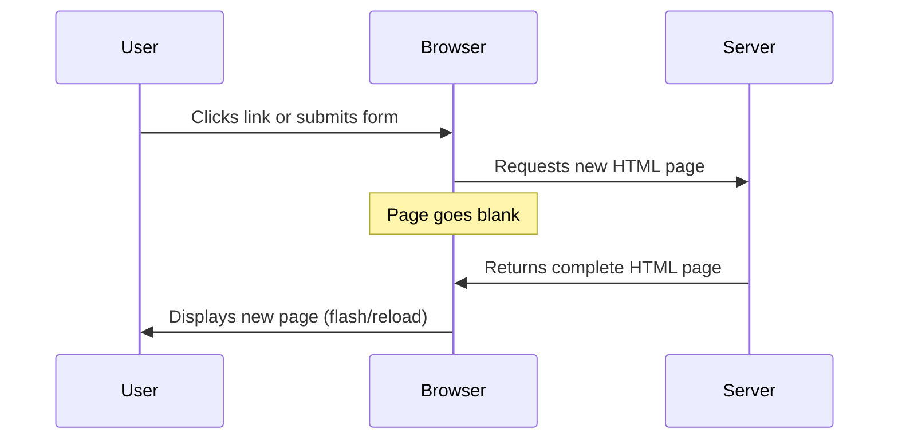
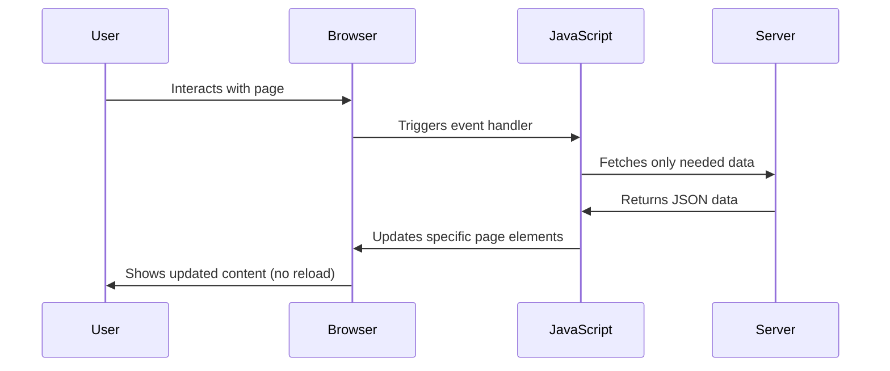
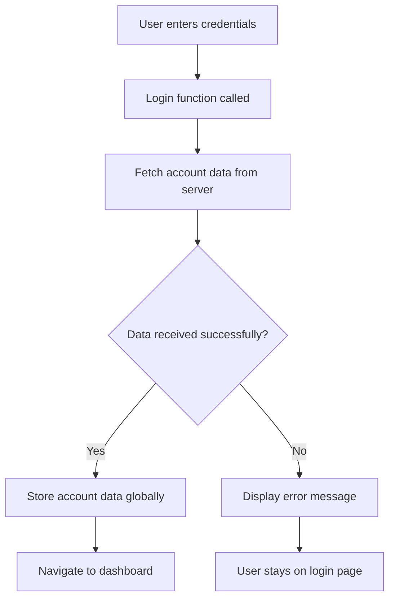
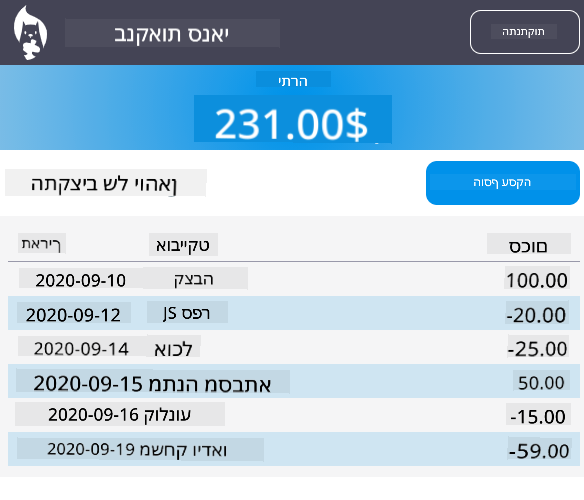

<!--
CO_OP_TRANSLATOR_METADATA:
{
  "original_hash": "2c1164912414820c8efd699b43f64954",
  "translation_date": "2025-10-23T01:29:33+00:00",
  "source_file": "7-bank-project/3-data/README.md",
  "language_code": "he"
}
-->
# בניית אפליקציית בנקאות חלק 3: שיטות לשליפת נתונים ושימוש בהם

תחשבו על המחשב של האנטרפרייז ב"מסע בין כוכבים" - כשקפטן פיקארד מבקש מידע על מצב הספינה, המידע מופיע מיד בלי שהממשק כולו יקרוס ויבנה את עצמו מחדש. הזרימה החלקה הזו של מידע היא בדיוק מה שאנחנו בונים כאן עם שליפת נתונים דינמית.

כרגע, אפליקציית הבנקאות שלכם היא כמו עיתון מודפס - אינפורמטיבית אבל סטטית. אנחנו הולכים להפוך אותה למשהו יותר כמו מרכז הבקרה של נאס"א, שבו נתונים זורמים באופן רציף ומתעדכנים בזמן אמת בלי להפריע למשתמש.

תלמדו איך לתקשר עם שרתים בצורה אסינכרונית, להתמודד עם נתונים שמגיעים בזמנים שונים, ולהפוך מידע גולמי למשהו משמעותי עבור המשתמשים שלכם. זה ההבדל בין דמו לתוכנה מוכנה לייצור.

## שאלון לפני ההרצאה

[שאלון לפני ההרצאה](https://ff-quizzes.netlify.app/web/quiz/45)

### דרישות מוקדמות

לפני שנצלול לשליפת נתונים, ודאו שיש לכם את הרכיבים הבאים מוכנים:

- **השיעור הקודם**: השלימו את [טופס ההתחברות וההרשמה](../2-forms/README.md) - נבנה על הבסיס הזה
- **שרת מקומי**: התקינו [Node.js](https://nodejs.org) ו[הריצו את ה-API של השרת](../api/README.md) כדי לספק נתוני חשבון
- **חיבור API**: בדקו את חיבור השרת שלכם עם הפקודה הזו:

```bash
curl http://localhost:5000/api
# Expected response: "Bank API v1.0.0"
```

בדיקה מהירה זו מבטיחה שכל הרכיבים מתקשרים כראוי:
- מאמתת ש-Node.js פועל כראוי במערכת שלכם
- מאשרת ששרת ה-API פעיל ומגיב
- מוודאת שהאפליקציה שלכם יכולה להגיע לשרת (כמו בדיקת קשר רדיו לפני משימה)

---

## הבנת שליפת נתונים באפליקציות ווב מודרניות

האופן שבו אפליקציות ווב מתמודדות עם נתונים השתנה באופן דרמטי בעשרים השנים האחרונות. הבנת האבולוציה הזו תעזור לכם להעריך מדוע טכניקות מודרניות כמו AJAX ו-Fetch API הן כל כך חזקות ומדוע הן הפכו לכלים חיוניים למפתחי ווב.

בואו נחקור איך אתרים מסורתיים עבדו לעומת האפליקציות הדינמיות והתגובתיות שאנחנו בונים היום.

### אפליקציות מרובות עמודים מסורתיות (MPA)

בימים הראשונים של האינטרנט, כל לחיצה הייתה כמו להחליף ערוץ בטלוויזיה ישנה - המסך היה מתרוקן ואז לאט לאט מתכוונן לתוכן החדש. זו הייתה המציאות של אפליקציות ווב מוקדמות, שבהן כל אינטראקציה דרשה בנייה מחדש של כל העמוד מאפס.




**למה הגישה הזו הרגישה מסורבלת:**
- כל לחיצה דרשה בנייה מחדש של כל העמוד מאפס
- משתמשים הופרעו באמצע המחשבה על ידי הבהובים מעצבנים של העמוד
- חיבור האינטרנט שלכם עבד שעות נוספות בהורדת אותו כותרת ותחתית שוב ושוב
- אפליקציות הרגישו יותר כמו לעבור דרך ארון תיוק מאשר להשתמש בתוכנה

### אפליקציות עמוד יחיד מודרניות (SPA)

AJAX (JavaScript ו-XML אסינכרוני) שינה את הפרדיגמה הזו לחלוטין. כמו העיצוב המודולרי של תחנת החלל הבינלאומית, שבו אסטרונאוטים יכולים להחליף רכיבים בודדים בלי לבנות מחדש את כל המבנה, AJAX מאפשר לנו לעדכן חלקים ספציפיים של עמוד ווב בלי לטעון מחדש את הכל. למרות שהשם מזכיר XML, אנחנו משתמשים בעיקר ב-JSON היום, אבל העיקרון המרכזי נשאר: לעדכן רק את מה שצריך להשתנות.




**למה SPA מרגישות כל כך טוב:**
- רק החלקים שבאמת השתנו מתעדכנים (חכם, נכון?)
- אין יותר הפרעות פתאומיות - המשתמשים שלכם נשארים בזרימה שלהם
- פחות נתונים עוברים ברשת, מה שאומר טעינה מהירה יותר
- הכל מרגיש מהיר ותגובתי, כמו האפליקציות בטלפון שלכם

### האבולוציה ל-Fetch API מודרני

דפדפנים מודרניים מספקים את [`Fetch` API](https://developer.mozilla.org/docs/Web/API/Fetch_API), שמחליף את [`XMLHttpRequest`](https://developer.mozilla.org/docs/Web/API/XMLHttpRequest/Using_XMLHttpRequest) הישן. כמו ההבדל בין הפעלת טלגרף לשימוש באימייל, Fetch API משתמש בהבטחות לקוד אסינכרוני נקי יותר ומטפל ב-JSON באופן טבעי.

| תכונה | XMLHttpRequest | Fetch API |
|---------|----------------|----------|
| **תחביר** | מבוסס קריאות חוזרות מורכבות | מבוסס הבטחות נקי |
| **טיפול ב-JSON** | נדרש ניתוח ידני | שיטה מובנית `.json()` |
| **טיפול בשגיאות** | מידע מוגבל על שגיאות | פרטי שגיאה מקיפים |
| **תמיכה מודרנית** | תאימות למורשת | הבטחות ES6+ ו-async/await |

> 💡 **תאימות דפדפנים**: חדשות טובות - Fetch API עובד בכל הדפדפנים המודרניים! אם אתם סקרנים לגבי גרסאות ספציפיות, [caniuse.com](https://caniuse.com/fetch) מציע את סיפור התאימות המלא.
> 
**בשורה התחתונה:**
- עובד נהדר ב-Chrome, Firefox, Safari ו-Edge (בעצם בכל מקום שבו המשתמשים שלכם נמצאים)
- רק Internet Explorer זקוק לעזרה נוספת (ובכנות, הגיע הזמן להיפרד מ-IE)
- מכין אתכם בצורה מושלמת לדפוסי async/await האלגנטיים שנשתמש בהם בהמשך

### יישום מערכת התחברות ושליפת נתונים

עכשיו ניישם את מערכת ההתחברות שממירה את אפליקציית הבנקאות שלכם מתצוגה סטטית לאפליקציה פונקציונלית. כמו פרוטוקולי האימות המשמשים במתקנים צבאיים מאובטחים, נאמת את פרטי המשתמש ואז נספק גישה לנתונים הספציפיים שלהם.

נבנה את זה בהדרגה, החל מאימות בסיסי ואז נוסיף את יכולות שליפת הנתונים.

#### שלב 1: יצירת בסיס פונקציית ההתחברות

פתחו את קובץ `app.js` שלכם והוסיפו פונקציה חדשה בשם `login`. זו תטפל בתהליך אימות המשתמש:

```javascript
async function login() {
  const loginForm = document.getElementById('loginForm');
  const user = loginForm.user.value;
}
```

**בואו נפרק את זה:**
- המילה `async`? היא אומרת ל-JavaScript "היי, הפונקציה הזו עשויה להזדקק להמתנה לדברים"
- אנחנו שולפים את הטופס מהעמוד (לא משהו מפואר, פשוט מוצאים אותו לפי ה-ID שלו)
- ואז אנחנו שולפים את מה שהמשתמש הקליד בתור שם המשתמש שלו
- הנה טריק נחמד: אתם יכולים לגשת לכל קלט טופס לפי תכונת `name` שלו - אין צורך בקריאות getElementById נוספות!

> 💡 **דפוס גישה לטופס**: כל בקרת טופס יכולה להיות נגישה לפי השם שלה (שנקבע ב-HTML באמצעות תכונת `name`) כתכונה של אלמנט הטופס. זה מספק דרך נקייה וקריאה לקבל נתוני טופס.

#### שלב 2: יצירת פונקציה לשליפת נתוני חשבון

בהמשך, ניצור פונקציה ייעודית לשליפת נתוני חשבון מהשרת. זה עוקב אחר אותו דפוס כמו פונקציית ההרשמה שלכם אבל מתמקד בשליפת נתונים:

```javascript
async function getAccount(user) {
  try {
    const response = await fetch('//localhost:5000/api/accounts/' + encodeURIComponent(user));
    return await response.json();
  } catch (error) {
    return { error: error.message || 'Unknown error' };
  }
}
```

**הנה מה שהקוד הזה משיג:**
- **משתמש** ב-Fetch API המודרני כדי לבקש נתונים בצורה אסינכרונית
- **בונה** כתובת URL של בקשת GET עם פרמטר שם המשתמש
- **מיישם** `encodeURIComponent()` כדי לטפל בבטחה בתווים מיוחדים בכתובות URL
- **ממיר** את התגובה לפורמט JSON למניפולציה קלה של נתונים
- **מטפל** בשגיאות בצורה חלקה על ידי החזרת אובייקט שגיאה במקום לקרוס

> ⚠️ **הערת אבטחה**: הפונקציה `encodeURIComponent()` מטפלת בתווים מיוחדים בכתובות URL. כמו מערכות קידוד המשמשות בתקשורת ימית, היא מבטיחה שההודעה שלכם תגיע בדיוק כפי שהתכוונתם, ומונעת מתווים כמו "#" או "&" להתפרש בצורה שגויה.
> 
**למה זה חשוב:**
- מונע מתווים מיוחדים לשבור כתובות URL
- מגן מפני התקפות מניפולציה של כתובות URL
- מבטיח שהשרת שלכם מקבל את הנתונים המיועדים
- עוקב אחרי שיטות קידוד מאובטחות

#### הבנת בקשות HTTP GET

הנה משהו שעשוי להפתיע אתכם: כשאתם משתמשים ב-`fetch` בלי אפשרויות נוספות, הוא יוצר אוטומטית בקשת [`GET`](https://developer.mozilla.org/docs/Web/HTTP/Methods/GET). זה מושלם למה שאנחנו עושים - מבקשים מהשרת "היי, אפשר לראות את נתוני החשבון של המשתמש הזה?"

חשבו על בקשות GET כמו לבקש בנימוס להשאיל ספר מהספרייה - אתם מבקשים לראות משהו שכבר קיים. בקשות POST (ששימשנו להרשמה) הן יותר כמו להגיש ספר חדש להוספה לאוסף.

| בקשת GET | בקשת POST |
|-------------|-------------|
| **מטרה** | שליפת נתונים קיימים | שליחת נתונים חדשים לשרת |
| **פרמטרים** | בנתיב/מחרוזת שאילתה של URL | בגוף הבקשה |
| **מטמון** | ניתן למטמון על ידי דפדפנים | לא בדרך כלל |
| **אבטחה** | גלוי ב-URL/יומנים | מוסתר בגוף הבקשה |

#### שלב 3: חיבור הכל יחד

עכשיו לחלק המספק - בואו נחבר את פונקציית שליפת החשבון לתהליך ההתחברות. כאן הכל מתחבר למקום:

```javascript
async function login() {
  const loginForm = document.getElementById('loginForm');
  const user = loginForm.user.value;
  const data = await getAccount(user);

  if (data.error) {
    return console.log('loginError', data.error);
  }

  account = data;
  navigate('/dashboard');
}
```

הפונקציה הזו עוקבת אחרי רצף ברור:
- שולפת את שם המשתמש מקלט הטופס
- מבקשת את נתוני החשבון של המשתמש מהשרת
- מטפלת בכל שגיאה שמתרחשת במהלך התהליך
- שומרת את נתוני החשבון ומנווטת ללוח הבקרה בהצלחה

> 🎯 **דפוס Async/Await**: מכיוון ש-`getAccount` היא פונקציה אסינכרונית, אנחנו משתמשים במילת המפתח `await` כדי להשהות את הביצוע עד שהשרת מגיב. זה מונע מהקוד להמשיך עם נתונים לא מוגדרים.

#### שלב 4: יצירת מקום לנתונים שלכם

האפליקציה שלכם צריכה מקום לזכור את המידע על החשבון ברגע שהוא נטען. חשבו על זה כמו הזיכרון קצר הטווח של האפליקציה שלכם - מקום לשמור את הנתונים של המשתמש הנוכחי בהישג יד. הוסיפו את השורה הזו בראש קובץ `app.js` שלכם:

```javascript
// This holds the current user's account data
let account = null;
```

**למה אנחנו צריכים את זה:**
- שומר את נתוני החשבון נגישים מכל מקום באפליקציה שלכם
- התחלה עם `null` אומרת "אף אחד עדיין לא מחובר"
- מתעדכן כשמישהו מתחבר או נרשם בהצלחה
- פועל כמו מקור אמת יחיד - אין בלבול לגבי מי מחובר

#### שלב 5: חיבור הטופס שלכם

עכשיו בואו נחבר את פונקציית ההתחברות החדשה שלכם לטופס ה-HTML שלכם. עדכנו את תג הטופס שלכם כך:

```html
<form id="loginForm" action="javascript:login()">
  <!-- Your existing form inputs -->
</form>
```

**מה השינוי הקטן הזה עושה:**
- עוצר את הטופס מלעשות את ההתנהגות ברירת המחדל שלו "לטעון מחדש את כל העמוד"
- קורא לפונקציית JavaScript המותאמת אישית שלכם במקום
- שומר על הכל חלק ודמוי אפליקציית עמוד יחיד
- נותן לכם שליטה מלאה על מה שקורה כשמשתמשים לוחצים על "התחבר"

#### שלב 6: שיפור פונקציית ההרשמה שלכם

למען עקביות, עדכנו את פונקציית `register` שלכם גם לשמור נתוני חשבון ולנווט ללוח הבקרה:

```javascript
// Add these lines at the end of your register function
account = result;
navigate('/dashboard');
```

**השיפור הזה מספק:**
- מעבר **חלק** מהרשמה ללוח הבקרה
- חוויית משתמש **עקבית** בין זרימות ההתחברות וההרשמה
- גישה **מיידית** לנתוני חשבון לאחר הרשמה מוצלחת

#### בדיקת היישום שלכם



**זמן לבדוק את זה:**
1. צרו חשבון חדש כדי לוודא שהכל עובד
2. נסו להתחבר עם אותם פרטי התחברות
3. הציצו בקונסול של הדפדפן שלכם (F12) אם משהו נראה לא תקין
4. ודאו שאתם מגיעים ללוח הבקרה לאחר התחברות מוצלחת

אם משהו לא עובד, אל תיבהלו! רוב הבעיות הן תיקונים פשוטים כמו שגיאות כתיב או שכחה להפעיל את שרת ה-API.

#### מילה מהירה על קסם בין-מקורי

אולי אתם תוהים: "איך האפליקצ
לשימוש בתוכן מורכב יותר, שלבו את [`document.createElement()`](https://developer.mozilla.org/docs/Web/API/Document/createElement) עם המתודה [`append()`](https://developer.mozilla.org/docs/Web/API/ParentNode/append):

```javascript
// Safe way to create new elements
const transactionItem = document.createElement('div');
transactionItem.className = 'transaction-item';
transactionItem.textContent = `${transaction.date}: ${transaction.description}`;
container.append(transactionItem);
```

**הבנת הגישה הזו:**
- **יוצרת** אלמנטים חדשים ב-DOM באופן תכנותי
- **שומרת** על שליטה מלאה בתכונות ובתוכן של האלמנטים
- **מאפשרת** מבנים מורכבים ומקוננים של אלמנטים
- **מבטיחה** אבטחה על ידי הפרדת מבנה מתוכן

> ⚠️ **שיקולי אבטחה**: למרות ש- [`innerHTML`](https://developer.mozilla.org/docs/Web/API/Element/innerHTML) מופיע בהרבה מדריכים, הוא יכול להריץ סקריפטים מוטמעים. כמו פרוטוקולי האבטחה ב-CERN שמונעים הרצת קוד לא מורשה, שימוש ב-`textContent` ו-`createElement` מספק חלופות בטוחות יותר.
> 
**סיכונים של innerHTML:**
- מריץ כל תג `<script>` שנמצא בנתוני המשתמש
- פגיע להתקפות הזרקת קוד
- יוצר פגיעויות אבטחה פוטנציאליות
- החלופות הבטוחות שאנחנו משתמשים בהן מספקות פונקציונליות מקבילה

### הפיכת שגיאות לידידותיות למשתמש

כרגע, שגיאות התחברות מופיעות רק בקונסול של הדפדפן, מה שהופך אותן לבלתי נראות למשתמשים. כמו ההבדל בין אבחון פנימי של טייס לבין מערכת מידע לנוסעים, אנחנו צריכים לתקשר מידע חשוב דרך הערוץ המתאים.

הצגת הודעות שגיאה גלויות מספקת למשתמשים משוב מיידי על מה השתבש ואיך להמשיך.

#### שלב 1: הוספת מקום להודעות שגיאה

ראשית, בואו ניתן להודעות השגיאה מקום ב-HTML שלכם. הוסיפו את זה ממש לפני כפתור ההתחברות כדי שהמשתמשים יראו את זה באופן טבעי:

```html
<!-- This is where error messages will appear -->
<div id="loginError" role="alert"></div>
<button>Login</button>
```

**מה קורה כאן:**
- אנחנו יוצרים מיכל ריק שנשאר בלתי נראה עד שהוא נדרש
- הוא ממוקם במקום שבו המשתמשים מסתכלים באופן טבעי לאחר לחיצה על "התחבר"
- ה-`role="alert"` הוא תוספת נחמדה לקוראי מסך - הוא אומר לטכנולוגיה מסייעת "היי, זה חשוב!"
- ה-`id` הייחודי נותן ל-JavaScript שלנו מטרה קלה

#### שלב 2: יצירת פונקציית עזר שימושית

בואו ניצור פונקציה קטנה שתוכל לעדכן את הטקסט של כל אלמנט. זו אחת מהפונקציות של "כתוב פעם אחת, השתמש בכל מקום" שתחסוך לכם זמן:

```javascript
function updateElement(id, text) {
  const element = document.getElementById(id);
  element.textContent = text;
}
```

**יתרונות הפונקציה:**
- ממשק פשוט שדורש רק מזהה אלמנט ותוכן טקסט
- מאתר ומעדכן אלמנטים ב-DOM בצורה בטוחה
- תבנית לשימוש חוזר שמפחיתה כפילות קוד
- שומרת על התנהגות עדכון עקבית בכל האפליקציה

#### שלב 3: הצגת שגיאות במקום שבו המשתמשים יכולים לראות אותן

עכשיו בואו נחליף את הודעת הקונסול הנסתרת במשהו שהמשתמשים יכולים לראות בפועל. עדכנו את פונקציית ההתחברות שלכם:

```javascript
// Instead of just logging to console, show the user what's wrong
if (data.error) {
  return updateElement('loginError', data.error);
}
```

**השינוי הקטן הזה עושה הבדל גדול:**
- הודעות שגיאה מופיעות בדיוק במקום שבו המשתמשים מסתכלים
- אין יותר כישלונות שקטים ומסתוריים
- המשתמשים מקבלים משוב מיידי וניתן לפעולה
- האפליקציה שלכם מתחילה להרגיש מקצועית ומתחשבת

עכשיו, כשאתם בודקים עם חשבון לא תקין, תראו הודעת שגיאה מועילה ישירות על הדף!


#### שלב 4: להיות כוללניים עם נגישות

הנה משהו מגניב לגבי ה-`role="alert"` שהוספנו קודם - זה לא רק קישוט! התכונה הקטנה הזו יוצרת מה שנקרא [Live Region](https://developer.mozilla.org/docs/Web/Accessibility/ARIA/ARIA_Live_Regions) שמכריזה מיד על שינויים לקוראי מסך:

```html
<div id="loginError" role="alert"></div>
```

**למה זה חשוב:**
- משתמשי קוראי מסך שומעים את הודעת השגיאה ברגע שהיא מופיעה
- כולם מקבלים את אותו מידע חשוב, ללא קשר לאופן שבו הם מנווטים
- זו דרך פשוטה לגרום לאפליקציה שלכם לעבוד עבור יותר אנשים
- מראה שאכפת לכם ליצור חוויות כוללניות

נגיעות קטנות כאלה מבדילות בין מפתחים טובים למעולים!

#### שלב 5: יישום אותה תבנית בהרשמה

למען העקביות, יישמו טיפול שגיאות זהה בטופס ההרשמה שלכם:

1. **הוסיפו** אלמנט תצוגת שגיאה ל-HTML של ההרשמה:
```html
<div id="registerError" role="alert"></div>
```

2. **עדכנו** את פונקציית ההרשמה שלכם להשתמש בתבנית תצוגת השגיאה:
```javascript
if (data.error) {
  return updateElement('registerError', data.error);
}
```

**יתרונות של טיפול שגיאות עקבי:**
- **מספק** חוויית משתמש אחידה בכל הטפסים
- **מפחית** עומס קוגניטיבי על ידי שימוש בתבניות מוכרות
- **מפשט** תחזוקה עם קוד לשימוש חוזר
- **מבטיח** עמידה בסטנדרטים של נגישות בכל האפליקציה

## יצירת לוח מחוונים דינמי

עכשיו נהפוך את לוח המחוונים הסטטי שלכם לממשק דינמי שמציג נתוני חשבון אמיתיים. כמו ההבדל בין לוח זמנים מודפס לבין לוחות יציאה חיים בשדות תעופה, אנחנו עוברים ממידע סטטי לתצוגות בזמן אמת ומגיבות.

באמצעות טכניקות מניפולציית DOM שלמדתם, ניצור לוח מחוונים שמתעדכן אוטומטית עם מידע החשבון הנוכחי.

### הכרת הנתונים שלכם

לפני שנתחיל לבנות, בואו נציץ איזה סוג נתונים השרת שלכם שולח בחזרה. כשמישהו מתחבר בהצלחה, הנה אוצר המידע שאתם מקבלים לעבוד איתו:

```json
{
  "user": "test",
  "currency": "$",
  "description": "Test account",
  "balance": 75,
  "transactions": [
    { "id": "1", "date": "2020-10-01", "object": "Pocket money", "amount": 50 },
    { "id": "2", "date": "2020-10-03", "object": "Book", "amount": -10 },
    { "id": "3", "date": "2020-10-04", "object": "Sandwich", "amount": -5 }
  ]
}
```

**מבנה הנתונים הזה מספק:**
- **`user`**: מושלם להתאמה אישית של החוויה ("ברוך שובך, שרה!")
- **`currency`**: מבטיח שנציג סכומי כסף בצורה נכונה
- **`description`**: שם ידידותי לחשבון
- **`balance`**: היתרה הנוכחית החשובה ביותר
- **`transactions`**: היסטוריית העסקאות המלאה עם כל הפרטים

כל מה שאתם צריכים כדי לבנות לוח מחוונים מקצועי לבנקאות!

> 💡 **טיפ מקצועי**: רוצים לראות את לוח המחוונים שלכם בפעולה מיד? השתמשו בשם המשתמש `test` כשאתם מתחברים - הוא מגיע טעון מראש עם נתוני דוגמה כך שתוכלו לראות הכל עובד מבלי שתצטרכו ליצור עסקאות קודם.
> 
**למה חשבון הבדיקה שימושי:**
- מגיע עם נתוני דוגמה מציאותיים שכבר טעונים
- מושלם לראות איך העסקאות מוצגות
- נהדר לבדוק את תכונות לוח המחוונים שלכם
- חוסך מכם את הצורך ליצור נתוני דמה באופן ידני

### יצירת אלמנטים תצוגה ללוח המחוונים

בואו נבנה את ממשק לוח המחוונים שלכם שלב אחר שלב, החל ממידע סיכום החשבון ולאחר מכן נעבור לתכונות מורכבות יותר כמו רשימות עסקאות.

#### שלב 1: עדכון מבנה ה-HTML שלכם

ראשית, החליפו את סעיף "יתרה" הסטטי באלמנטים מצייני מקום דינמיים שה-JavaScript שלכם יכול למלא:

```html
<section>
  Balance: <span id="balance"></span><span id="currency"></span>
</section>
```

לאחר מכן, הוסיפו סעיף לתיאור החשבון. מכיוון שזה משמש ככותרת לתוכן לוח המחוונים, השתמשו ב-HTML סמנטי:

```html
<h2 id="description"></h2>
```

**הבנת מבנה ה-HTML:**
- **משתמש** באלמנטים `<span>` נפרדים ליתרה ולמטבע לשליטה פרטנית
- **מיישם** מזהים ייחודיים לכל אלמנט למטרת מיקוד ב-JavaScript
- **עוקב** אחרי HTML סמנטי על ידי שימוש ב-`<h2>` לתיאור החשבון
- **יוצר** היררכיה לוגית לקוראי מסך ו-SEO

> ✅ **תובנה על נגישות**: תיאור החשבון משמש ככותרת לתוכן לוח המחוונים, ולכן הוא מסומן סמנטית ככותרת. למדו עוד על איך [מבנה כותרות](https://www.nomensa.com/blog/2017/how-structure-headings-web-accessibility) משפיע על נגישות. האם אתם יכולים לזהות אלמנטים אחרים בעמוד שלכם שיכולים להרוויח מתגי כותרת?

#### שלב 2: יצירת פונקציית עדכון ללוח המחוונים

עכשיו צרו פונקציה שממלאת את לוח המחוונים שלכם עם נתוני חשבון אמיתיים:

```javascript
function updateDashboard() {
  if (!account) {
    return navigate('/login');
  }

  updateElement('description', account.description);
  updateElement('balance', account.balance.toFixed(2));
  updateElement('currency', account.currency);
}
```

**שלב אחר שלב, הנה מה שהפונקציה הזו עושה:**
- **מאמתת** שקיימים נתוני חשבון לפני שהיא ממשיכה
- **מנתבת** משתמשים לא מאומתים חזרה לעמוד ההתחברות
- **מעדכנת** את תיאור החשבון באמצעות פונקציית `updateElement` לשימוש חוזר
- **מפרמטת** את היתרה כך שתמיד תציג שתי ספרות עשרוניות
- **מציגה** את סמל המטבע המתאים

> 💰 **פורמט כסף**: המתודה [`toFixed(2)`](https://developer.mozilla.org/docs/Web/JavaScript/Reference/Global_Objects/Number/toFixed) היא מצילת חיים! היא מבטיחה שהיתרה שלכם תמיד תיראה כמו כסף אמיתי - "75.00" במקום רק "75". המשתמשים שלכם יעריכו לראות פורמט מטבע מוכר.

#### שלב 3: לוודא שלוח המחוונים מתעדכן

כדי להבטיח שלוח המחוונים שלכם מתרענן עם נתונים עדכניים בכל פעם שמישהו מבקר בו, אנחנו צריכים להתחבר למערכת הניווט שלכם. אם השלמתם את [משימת שיעור 1](../1-template-route/assignment.md), זה אמור להרגיש מוכר. אם לא, אל תדאגו - הנה מה שאתם צריכים:

הוסיפו את זה לסוף פונקציית `updateRoute()` שלכם:

```javascript
if (typeof route.init === 'function') {
  route.init();
}
```

לאחר מכן עדכנו את המסלולים שלכם לכלול את אתחול לוח המחו
**הנחיה:** צור פונקציונליות חיפוש עבור אפליקציית הבנקאות שכוללת: 1) טופס חיפוש עם שדות קלט לטווח תאריכים (מ/עד), סכום מינימלי/מקסימלי ומילות מפתח לתיאור העסקה, 2) פונקציה `filterTransactions()` שמסננת את מערך account.transactions על בסיס קריטריוני החיפוש, 3) עדכון הפונקציה `updateDashboard()` להצגת תוצאות מסוננות, ו-4) הוספת כפתור "נקה מסננים" לאיפוס התצוגה. השתמש בשיטות מודרניות של מערכים ב-JavaScript כמו `filter()` וטפל במקרים קיצוניים של קריטריוני חיפוש ריקים.

למידע נוסף על [מצב סוכן](https://code.visualstudio.com/blogs/2025/02/24/introducing-copilot-agent-mode) כאן.

## 🚀 אתגר

מוכן לקחת את אפליקציית הבנקאות שלך לשלב הבא? בואו נעשה אותה כזו שתרצו להשתמש בה באמת. הנה כמה רעיונות שיעוררו את היצירתיות שלכם:

**תעשו אותה יפה**: הוסיפו עיצוב CSS כדי להפוך את לוח המחוונים הפונקציונלי שלכם למשהו מושך מבחינה חזותית. חשבו על קווים נקיים, מרווחים טובים ואולי אפילו אנימציות עדינות.

**תעשו אותה רספונסיבית**: נסו להשתמש ב-[שאילתות מדיה](https://developer.mozilla.org/docs/Web/CSS/Media_Queries) כדי ליצור [עיצוב רספונסיבי](https://developer.mozilla.org/docs/Web/Progressive_web_apps/Responsive/responsive_design_building_blocks) שעובד מצוין בטלפונים, טאבלטים ומחשבים שולחניים. המשתמשים שלכם יעריכו את זה!

**תוסיפו קצת סטייל**: שקלו לקודד בצבעים עסקאות (ירוק להכנסות, אדום להוצאות), להוסיף אייקונים או ליצור אפקטים של ריחוף שיגרמו לממשק להרגיש אינטראקטיבי.

כך יכול להיראות לוח מחוונים מלוטש:



אין צורך להתאים בדיוק - השתמשו בזה כהשראה וצרו משהו ייחודי משלכם!

## שאלון לאחר ההרצאה

[שאלון לאחר ההרצאה](https://ff-quizzes.netlify.app/web/quiz/46)

## משימה

[שפרו והוסיפו הערות לקוד שלכם](assignment.md)

---

**כתב ויתור**:  
מסמך זה תורגם באמצעות שירות תרגום AI [Co-op Translator](https://github.com/Azure/co-op-translator). למרות שאנו שואפים לדיוק, יש להיות מודעים לכך שתרגומים אוטומטיים עשויים להכיל שגיאות או אי דיוקים. המסמך המקורי בשפתו המקורית צריך להיחשב כמקור סמכותי. עבור מידע קריטי, מומלץ להשתמש בתרגום מקצועי אנושי. איננו נושאים באחריות לכל אי הבנות או פרשנויות שגויות הנובעות משימוש בתרגום זה.