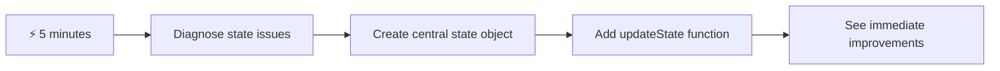
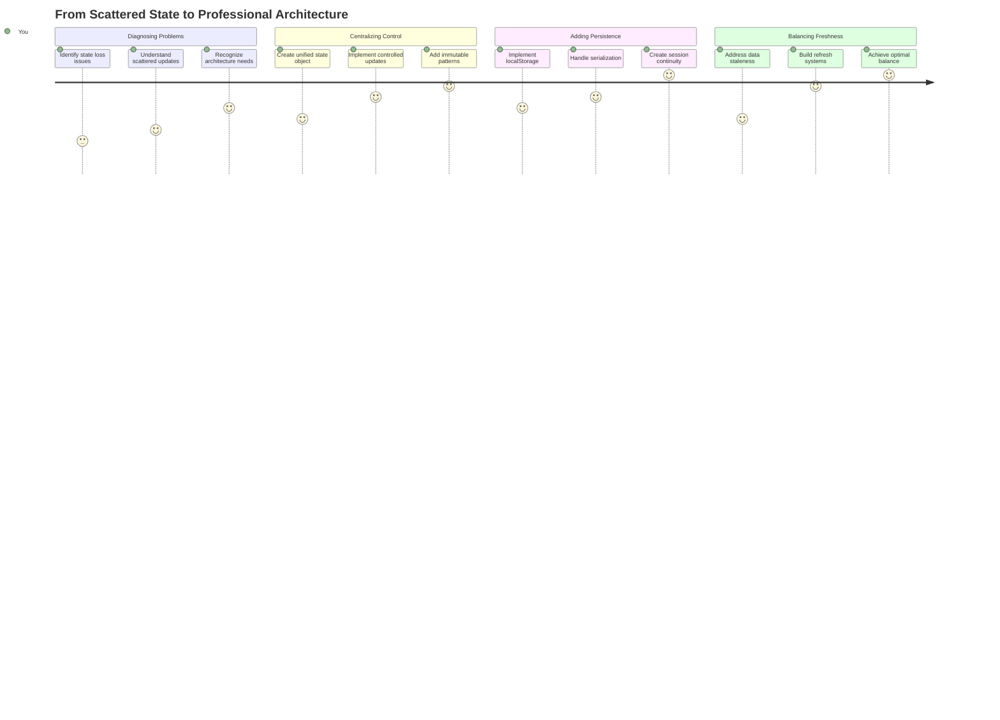
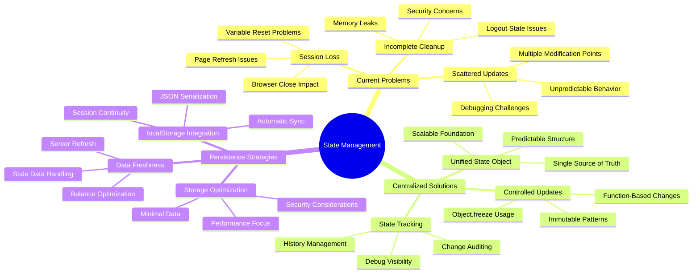
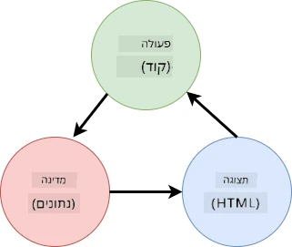
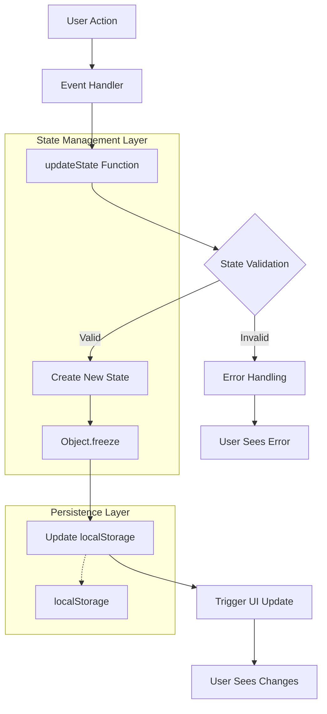
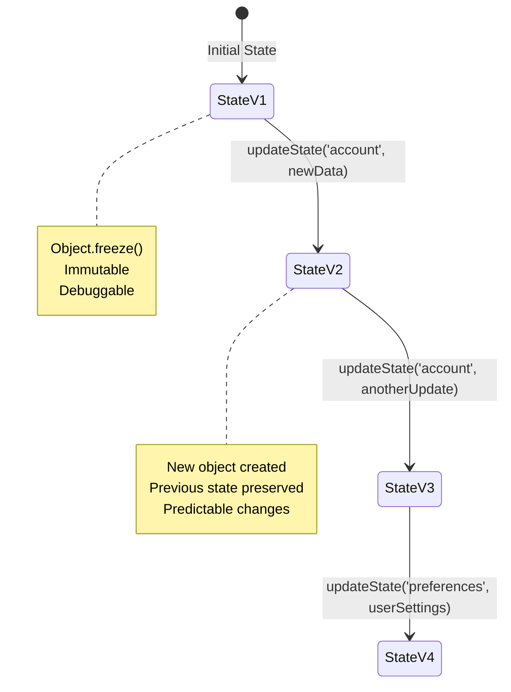
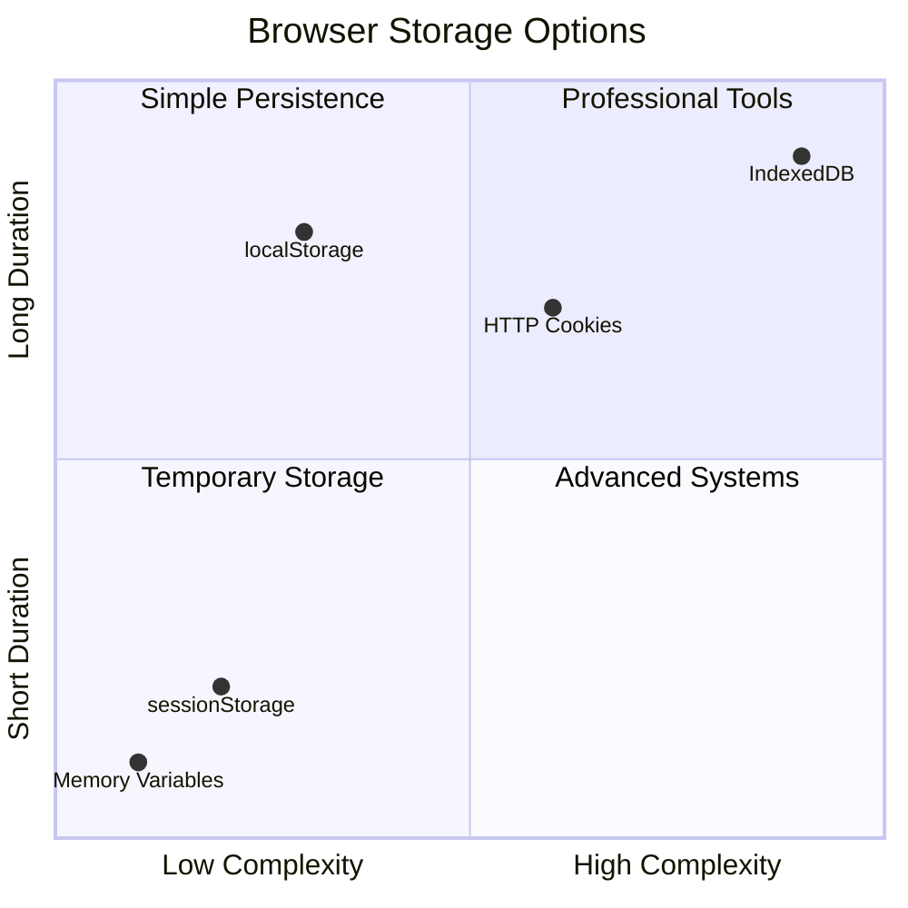
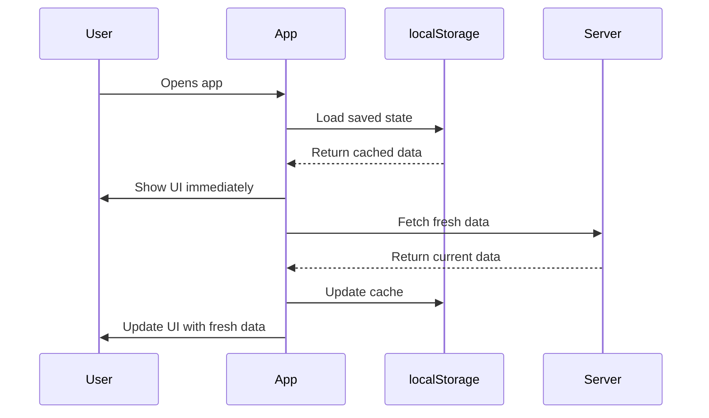
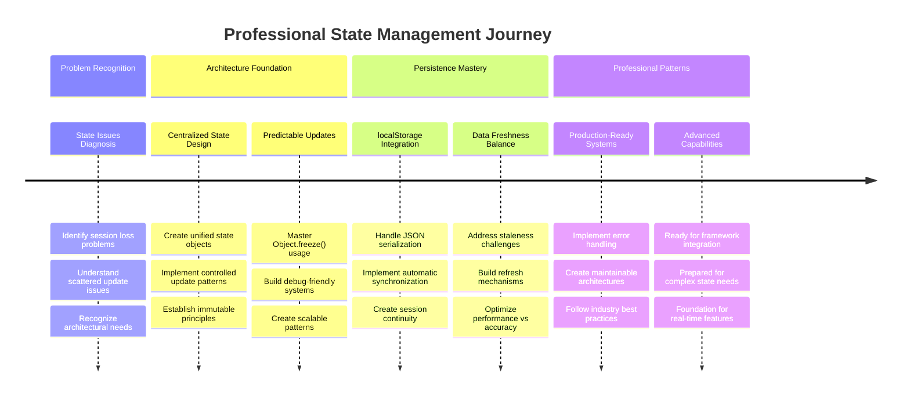

# בניית אפליקציית בנקאות חלק 4: מושגים בניהול מצב

## ⚡ מה אפשר לעשות ב-5 הדקות הקרובות

**מסלול התחלה מהירה למפתחים עסוקים**



- **דקה 1**: בדוק את בעיית המצב הנוכחי - התחבר, רענן את הדף, שים לב ליציאה מהמערכת
- **דקה 2**: החלף `let account = null` ב- `let state = { account: null }`
- **דקה 3**: צור פונקציה פשוטה `updateState()` לעדכונים מבוקרים
- **דקה 4**: עדכן פונקציה אחת לשימוש בתבנית החדשה
- **דקה 5**: בדוק את השיפור בניבוי וביכולת הדיבוג

**מבחן אבחון מהיר**:
```javascript
// Before: Scattered state
let account = null; // Lost on refresh!

// After: Centralized state
let state = Object.freeze({ account: null }); // Controlled and trackable!
```

**למה זה חשוב**: תוך 5 דקות תחווה את השינוי מניהול מצב כאוטי לדפוסים ניתנים לניבוי ודיבוג. זהו הבסיס שהופך אפליקציות מורכבות לניתנות לתחזוקה.

## 🗺️ מסע הלמידה שלך לשליטה בניהול מצב



**יעד המסע שלך**: בסוף השיעור הזה, תבנה מערכת ניהול מצב ברמה מקצועית שמטפלת בהתמדה, רעננות נתונים ועדכונים ניתנים לניבוי - אותם דפוסים שמשמשים באפליקציות ייצור.

## שאלון לפני השיעור

[שאלון לפני השיעור](https://ff-quizzes.netlify.app/web/quiz/47)

## מבוא

ניהול מצב הוא כמו מערכת ניווט בחללית וויאג'ר – כשהכול עובד בצורה חלקה, כמעט לא שמים לב שהיא שם. אבל כשמשהו משתבש, זה ההבדל בין להגיע לחלל הבין-כוכבי לבין להיסחף אבודים בריק הקוסמי. בפיתוח אתרים, מצב מייצג את כל מה שהאפליקציה שלך צריכה לזכור: מצב התחברות של משתמש, נתוני טפסים, היסטוריית ניווט ומצבים זמניים של ממשק.

כשהאפליקציה הבנקאית שלך התפתחה מטופס התחברות פשוט לאפליקציה מתוחכמת יותר, סביר להניח שנתקלת בכמה אתגרים נפוצים. רענן את הדף והמשתמשים יוצאים מהמערכת באופן בלתי צפוי. סגור את הדפדפן וכל ההתקדמות נעלמת. דבג בעיה ואתה מחפש בין פונקציות רבות שמעדכנות את אותם נתונים בדרכים שונות.

אלו אינם סימנים לקוד גרוע – אלו כאבי גדילה טבעיים שמתרחשים כשהאפליקציות מגיעות לרמת מורכבות מסוימת. כל מפתח מתמודד עם אתגרים אלו כשהאפליקציות שלו עוברות מ"ראיית היתכנות" ל"מוכנות לייצור".

בשיעור הזה, ניישם מערכת ניהול מצב מרכזית שתהפוך את האפליקציה הבנקאית שלך לאפליקציה אמינה ומקצועית. תלמד לנהל זרימות נתונים בצורה ניתנת לניבוי, לשמר את מצבי המשתמש בצורה מתאימה וליצור חוויית משתמש חלקה שהאפליקציות המודרניות דורשות.

## דרישות מוקדמות

לפני שנצלול למושגים של ניהול מצב, תצטרך להגדיר את סביבת הפיתוח שלך בצורה נכונה ולהכין את הבסיס של האפליקציה הבנקאית שלך. השיעור הזה מתבסס ישירות על המושגים והקוד מהחלקים הקודמים בסדרה הזו.

וודא שיש לך את הרכיבים הבאים מוכנים לפני שתמשיך:

**הגדרה נדרשת:**
- השלם את [שיעור שליפת הנתונים](../3-data/README.md) - האפליקציה שלך צריכה לטעון ולהציג נתוני חשבון בהצלחה
- התקן [Node.js](https://nodejs.org) במערכת שלך להפעלת ה-API של ה-backend
- הפעל את [שרת ה-API](../api/README.md) באופן מקומי כדי לטפל בפעולות נתוני החשבון

**בדיקת הסביבה שלך:**

וודא ששרת ה-API שלך פועל בצורה תקינה על ידי ביצוע הפקודה הזו בטרמינל:

```sh
curl http://localhost:5000/api
# -> should return "Bank API v1.0.0" as a result
```

**מה הפקודה הזו עושה:**
- **שולחת** בקשת GET לשרת ה-API המקומי שלך
- **בודקת** את החיבור ומוודאת שהשרת מגיב
- **מחזירה** את מידע גרסת ה-API אם הכול עובד בצורה תקינה

## 🧠 סקירה כללית על ארכיטקטורת ניהול מצב



**עקרון מרכזי**: ניהול מצב מקצועי מאזן בין ניבוי, התמדה וביצועים כדי ליצור חוויות משתמש אמינות שמתרחבות מאינטראקציות פשוטות לזרימות עבודה מורכבות באפליקציה.

---

## אבחון בעיות המצב הנוכחי

כמו שרלוק הולמס שבוחן זירת פשע, אנחנו צריכים להבין בדיוק מה קורה ביישום הנוכחי שלנו לפני שנוכל לפתור את תעלומת היעלמות מצבי המשתמש.

בואו נבצע ניסוי פשוט שמגלה את אתגרי ניהול המצב הבסיסיים:

**🧪 נסה את מבחן האבחון הזה:**
1. התחבר לאפליקציה הבנקאית שלך ועבור ללוח הבקרה
2. רענן את דף הדפדפן
3. שים לב מה קורה למצב ההתחברות שלך

אם אתה מנותב חזרה למסך ההתחברות, גילית את בעיית ההתמדה הקלאסית של מצב. התנהגות זו מתרחשת מכיוון שהיישום הנוכחי שלנו שומר נתוני משתמש במשתני JavaScript שמתאפסים בכל טעינת דף.

**בעיות ביישום הנוכחי:**

המשתנה הפשוט `account` מהשיעור הקודם שלנו יוצר שלוש בעיות משמעותיות שמשפיעות הן על חוויית המשתמש והן על תחזוקת הקוד:

| בעיה | סיבה טכנית | השפעת המשתמש |
|------|-------------|--------------|
| **אובדן סשן** | רענון דף מנקה משתני JavaScript | משתמשים צריכים להתחבר מחדש לעיתים קרובות |
| **עדכונים מפוזרים** | פונקציות רבות מעדכנות מצב ישירות | דיבוג הופך לקשה יותר |
| **ניקוי לא מלא** | יציאה מהמערכת לא מנקה את כל הפניות למצב | חששות אבטחה ופרטיות פוטנציאליים |

**האתגר הארכיטקטוני:**

כמו העיצוב המחולק של הטיטאניק שנראה חזק עד שמספר תאים הוצפו בו-זמנית, תיקון הבעיות הללו באופן פרטני לא יטפל בבעיה הארכיטקטונית הבסיסית. אנחנו צריכים פתרון ניהול מצב מקיף.

> 💡 **מה אנחנו באמת מנסים להשיג כאן?**

[ניהול מצב](https://en.wikipedia.org/wiki/State_management) עוסק למעשה בפתרון שתי חידות בסיסיות:

1. **איפה הנתונים שלי?**: מעקב אחר איזה מידע יש לנו ומהיכן הוא מגיע
2. **האם כולם באותו עמוד?**: לוודא שמה שהמשתמשים רואים תואם למה שבאמת קורה

**תוכנית הפעולה שלנו:**

במקום לרדוף אחרי הזנב שלנו, אנחנו הולכים ליצור מערכת **ניהול מצב מרכזית**. תחשוב על זה כמו שיש אדם אחד מאוד מאורגן שאחראי על כל הדברים החשובים:





**הבנת זרימת הנתונים הזו:**
- **מרכזת** את כל מצב האפליקציה במקום אחד
- **מנתבת** את כל שינויי המצב דרך פונקציות מבוקרות
- **מבטיחה** שה-UI נשאר מסונכרן עם המצב הנוכחי
- **מספקת** תבנית ברורה וניתנת לניבוי לניהול נתונים

> 💡 **תובנה מקצועית**: השיעור הזה מתמקד במושגים בסיסיים. עבור אפליקציות מורכבות, ספריות כמו [Redux](https://redux.js.org) מספקות תכונות ניהול מצב מתקדמות יותר. הבנת העקרונות הבסיסיים הללו תעזור לך לשלוט בכל ספריית ניהול מצב.

> ⚠️ **נושא מתקדם**: לא נעסוק בעדכוני UI אוטומטיים שמופעלים על ידי שינויי מצב, מכיוון שזה כולל מושגים של [תכנות תגובתי](https://en.wikipedia.org/wiki/Reactive_programming). שקול זאת כצעד הבא מצוין למסע הלמידה שלך!

### משימה: מרכז את מבנה המצב

בואו נתחיל להפוך את ניהול המצב המפוזר שלנו למערכת מרכזית. הצעד הראשון הזה יוצר את הבסיס לכל השיפורים שיבואו אחריו.

**שלב 1: צור אובייקט מצב מרכזי**

החלף את ההצהרה הפשוטה `account`:

```js
let account = null;
```

באובייקט מצב מובנה:

```js
let state = {
  account: null
};
```

**למה השינוי הזה חשוב:**
- **מרכז** את כל נתוני האפליקציה במקום אחד
- **מכין** את המבנה להוספת מאפייני מצב נוספים בהמשך
- **יוצר** גבול ברור בין מצב לבין משתנים אחרים
- **מבסס** תבנית שמתרחבת ככל שהאפליקציה שלך גדלה

**שלב 2: עדכן דפוסי גישה למצב**

עדכן את הפונקציות שלך לשימוש במבנה המצב החדש:

**בפונקציות `register()` ו-`login()`**, החלף:
```js
account = ...
```

ב:
```js
state.account = ...
```

**בפונקציה `updateDashboard()`**, הוסף את השורה הזו בתחילת הקוד:
```js
const account = state.account;
```

**מה העדכונים הללו משיגים:**
- **שומרים** על הפונקציונליות הקיימת תוך שיפור המבנה
- **מכינים** את הקוד שלך לניהול מצב מתוחכם יותר
- **יוצרים** דפוסים עקביים לגישה לנתוני מצב
- **מבססים** את הבסיס לעדכוני מצב מרכזיים

> 💡 **הערה**: הריפקטורינג הזה לא פותר מיד את הבעיות שלנו, אבל הוא יוצר את הבסיס החיוני לשיפורים החזקים שיבואו בהמשך!

### 🎯 בדיקה פדגוגית: עקרונות מרכזיות

**עצור וחשוב**: הרגע יישמת את הבסיס לניהול מצב מרכזי. זו החלטה ארכיטקטונית קריטית.

**הערכה עצמית מהירה**:
- האם אתה יכול להסביר למה מרכז את המצב באובייקט אחד עדיף על משתנים מפוזרים?
- מה יקרה אם תשכח לעדכן פונקציה לשימוש ב-`state.account`?
- איך התבנית הזו מכינה את הקוד שלך לתכונות מתקדמות יותר?

**חיבור לעולם האמיתי**: תבנית המרכזיות שלמדת היא הבסיס של מסגרות מודרניות כמו Redux, Vuex ו-React Context. אתה בונה את אותה חשיבה ארכיטקטונית שמשמשת באפליקציות גדולות.

**שאלת אתגר**: אם היית צריך להוסיף העדפות משתמש (נושא, שפה) לאפליקציה שלך, איפה היית מוסיף אותן במבנה המצב? איך זה יגדל?

## יישום עדכוני מצב מבוקרים

עם המצב שלנו מרוכז, הצעד הבא כולל הקמת מנגנונים מבוקרים לשינויים בנתונים. גישה זו מבטיחה שינויי מצב ניתנים לניבוי ודיבוג קל יותר.

העיקרון המרכזי דומה לבקרת תעבורה אווירית: במקום לאפשר לפונקציות רבות לשנות מצב באופן עצמאי, ננתב את כל השינויים דרך פונקציה אחת מבוקרת. תבנית זו מספקת פיקוח ברור על מתי ואיך מתרחשים שינויי נתונים.

**ניהול מצב בלתי ניתן לשינוי:**

נטפל באובייקט `state` שלנו כ[*בלתי ניתן לשינוי*](https://en.wikipedia.org/wiki/Immutable_object), כלומר לעולם לא נשנה אותו ישירות. במקום זאת, כל שינוי ייצור אובייקט מצב חדש עם הנתונים המעודכנים.

למרות שהגישה הזו עשויה להיראות לא יעילה בהתחלה בהשוואה לשינויים ישירים, היא מספקת יתרונות משמעותיים לדיבוג, בדיקות ולשמירה על ניבוי האפליקציה.

**יתרונות ניהול מצב בלתי ניתן לשינוי:**

| יתרון | תיאור | השפעה |
|-------|--------|-------|
| **ניבוי** | שינויים מתרחשים רק דרך פונקציות מבוקרות | קל יותר לדבג ולבדוק |
| **מעקב היסטוריה** | כל שינוי מצב יוצר אובייקט חדש | מאפשר פונקציונליות של ביטול/חזרה |
| **מניעת תופעות לוואי** | אין שינויים מקריים | מונע באגים מסתוריים |
| **אופטימיזציית ביצועים** | קל לזהות מתי המצב באמת השתנה | מאפשר עדכוני UI יעילים |

**בלתי ניתן לשינוי ב-JavaScript עם `Object.freeze()`:**

JavaScript מספקת את [`Object.freeze()`](https://developer.mozilla.org/docs/Web/JavaScript/Reference/Global_Objects/Object/freeze) למניעת שינויים באובייקטים:

```js
const immutableState = Object.freeze({ account: userData });
// Any attempt to modify immutableState will throw an error
```

**פירוט מה קורה כאן:**
- **מונע** השמות או מחיקות ישירות של מאפיינים
- **זורק** חריגות אם נעשים ניסיונות לשינוי
- **מבטיח** ששינויי מצב חייבים לעבור דרך פונקציות מבוקרות
- **יוצר** חוזה ברור לאופן שבו ניתן לעדכן מצב

> 💡 **צלילה עמוקה**: למד על ההבדל בין אובייקטים בלתי ניתנים לשינוי *שטחיים* ו*עמוקים* בתיעוד [MDN](https://developer.mozilla.org/docs/Web/JavaScript/Reference/Global_Objects/Object/freeze#What_is_shallow_freeze). הבנת ההבדל הזה חיונית למבני מצב מורכבים.



### משימה

בואו ניצור פונקציה חדשה `updateState()`:

```js
function updateState(property, newData) {
  state = Object.freeze({
    ...state,
    [property]: newData
  });
}
```

בפונקציה הזו, אנחנו יוצרים אובייקט מצב חדש ומעתיקים נתונים מהמצב הקודם באמצעות [*אופרטור הפיזור (`...`)*](https://developer.mozilla.org/docs/Web/JavaScript/Reference/Operators/Spread_syntax#Spread_in_object_literals). לאחר מכן אנחנו מחליפים מאפיין מסוים של אובייקט המצב עם הנתונים החדשים באמצעות [הערת סוגריים](https://developer.mozilla.org/docs/Web/JavaScript/Guide/Working_with_Objects#Objects_and_properties) `[property]` להשמה. לבסוף, אנחנו נועלים את האובייקט כדי למנוע שינויים באמצעות `Object.freeze()`. כרגע יש לנו רק את המאפיין `account` שמאוחסן במצב, אבל עם הגישה הזו ניתן להוסיף כמה מאפיינים שצריך במצב.

נעדכן גם את אתחול המצב כדי לוודא שהמצב ההתחלתי נעול גם הוא:

```js
let state = Object.freeze({
  account: null
});
```

לאחר מכן, עדכן את הפונקציה `register` על ידי החלפת ההשמה `state.account = result;` ב:

```js
updateState('account', result);
```

עשה את אותו הדבר עם הפונקציה `login`, החלף `state.account = data;` ב:

```js
updateState('account', data);
```

עכשיו ננצל את ההזדמנות לתקן את הבעיה של נתוני חשבון שלא מתנקים כאשר המשתמש לוחץ על *יציאה*.

צור פונקציה חדשה `logout()`:

```js
function logout() {
  updateState('account', null);
  navigate('/login');
}
```

ב-`updateDashboard()`, החלף את ההפניה `return navigate('/login');` ב-`return logout();`

נסה לרשום חשבון חדש, לצאת ולהתחבר שוב כדי לבדוק שהכול עדיין עובד בצורה תקינה.

> טיפ: תוכל להסתכל על כל שינויי המצב על ידי הוספת `console.log(state)` בתחתית `updateState()` ופתיחת הקונסול בכלי הפיתוח של הדפדפן שלך.

## יישום התמדה של נתונים

בעיית אובדן הסשן שזיהינו קודם דורשת פתרון התמדה שמחזיק את מצב המשתמש בין סשנים של הדפדפן. זה הופך את האפליקציה שלנו מחוויה זמנית לכלי אמין ומקצועי.

חשוב על איך שעונים אטומיים שומרים על זמן מדויק גם במהלך הפסקות חשמל על ידי אחסון מצב קריטי בזיכרון שאינו נדיף. באופן דומה, אפליקציות אינטרנט צריכות מנגנוני אחסון מתמידים כדי לשמר נתוני משתמש חיוניים בין סשנים של הדפדפן וטעינות דף.

**שאלות אסטרטגיות להתמדה של נתונים:**

לפני יישום התמדה, שקול את הגורמים הקריטיים הבאים:

| שאלה | הקשר אפליקציית בנקאות | השפעת ההחלטה |
|------|-------------------------|--------------|
| **האם הנתונים רגישים?** |
| **כמה זמן צריך לשמור את המידע?** | מצב התחברות מול העדפות ממשק זמניות | בחר משך אחסון מתאים |
| **האם השרת זקוק למידע הזה?** | אסימוני אימות מול הגדרות ממשק | קבע דרישות שיתוף |

**אפשרויות אחסון בדפדפן:**

דפדפנים מודרניים מספקים מספר מנגנוני אחסון, כל אחד מיועד לשימושים שונים:

**ממשקי אחסון עיקריים:**

1. **[`localStorage`](https://developer.mozilla.org/docs/Web/API/Window/localStorage)**: אחסון [מפתח/ערך](https://en.wikipedia.org/wiki/Key%E2%80%93value_database) מתמשך
   - **שומר** נתונים בין סשנים של הדפדפן ללא הגבלת זמן  
   - **שורד** הפעלות מחדש של הדפדפן ואתחול המחשב
   - **מוגבל** לדומיין הספציפי של האתר
   - **מושלם** עבור העדפות משתמש ומצבי התחברות

2. **[`sessionStorage`](https://developer.mozilla.org/docs/Web/API/Window/sessionStorage)**: אחסון סשן זמני
   - **פועל** באופן זהה ל-localStorage במהלך סשנים פעילים
   - **נמחק** אוטומטית כאשר סוגרים את לשונית הדפדפן
   - **אידיאלי** לנתונים זמניים שלא צריכים להישמר

3. **[HTTP Cookies](https://developer.mozilla.org/docs/Web/HTTP/Cookies)**: אחסון משותף עם השרת
   - **נשלח** אוטומטית עם כל בקשה לשרת
   - **מושלם** עבור [אימות](https://en.wikipedia.org/wiki/Authentication) אסימונים
   - **מוגבל** בגודל ויכול להשפיע על ביצועים

**דרישת סריאליזציה של נתונים:**

גם `localStorage` וגם `sessionStorage` מאחסנים רק [מחרוזות](https://developer.mozilla.org/docs/Web/JavaScript/Reference/Global_Objects/String):

```js
// Convert objects to JSON strings for storage
const accountData = { user: 'john', balance: 150 };
localStorage.setItem('account', JSON.stringify(accountData));

// Parse JSON strings back to objects when retrieving
const savedAccount = JSON.parse(localStorage.getItem('account'));
```

**הבנת סריאליזציה:**
- **ממיר** אובייקטים של JavaScript למחרוזות JSON באמצעות [`JSON.stringify()`](https://developer.mozilla.org/docs/Web/JavaScript/Reference/Global_Objects/JSON/stringify)
- **משחזר** אובייקטים מ-JSON באמצעות [`JSON.parse()`](https://developer.mozilla.org/docs/Web/JavaScript/Reference/Global_Objects/JSON/parse)
- **מטפל** באובייקטים מורכבים ומערכים מקוננים באופן אוטומטי
- **נכשל** על פונקציות, ערכים לא מוגדרים והתייחסויות מעגליות

> 💡 **אפשרות מתקדמת**: עבור אפליקציות מורכבות לא מקוונות עם מערכי נתונים גדולים, שקול את ממשק ה-API של [`IndexedDB`](https://developer.mozilla.org/docs/Web/API/IndexedDB_API). הוא מספק מסד נתונים מלא בצד הלקוח אך דורש יישום מורכב יותר.



### משימה: יישום אחסון מתמשך ב-localStorage

ניישם אחסון מתמשך כך שמשתמשים יישארו מחוברים עד שיתנתקו באופן מפורש. נשתמש ב-`localStorage` כדי לשמור נתוני חשבון בין סשנים של הדפדפן.

**שלב 1: הגדרת תצורת אחסון**

```js
const storageKey = 'savedAccount';
```

**מה מספקת הקבועה הזו:**
- **יוצרת** מזהה עקבי עבור הנתונים המאוחסנים שלנו
- **מונעת** שגיאות הקלדה בהפניות למפתחי אחסון
- **מקלה** על שינוי מפתח האחסון במידת הצורך
- **עוקבת** אחר שיטות עבודה מומלצות לקוד שניתן לתחזוקה

**שלב 2: הוספת אחסון אוטומטי**

הוסף את השורה הזו בסוף פונקציית `updateState()`:

```js
localStorage.setItem(storageKey, JSON.stringify(state.account));
```

**פירוט מה קורה כאן:**
- **ממיר** את אובייקט החשבון למחרוזת JSON לאחסון
- **שומר** את הנתונים באמצעות מפתח האחסון העקבי שלנו
- **מתבצע** אוטומטית בכל פעם שמתרחשים שינויים במצב
- **מבטיח** שהנתונים המאוחסנים תמיד מסונכרנים עם המצב הנוכחי

> 💡 **יתרון ארכיטקטוני**: מכיוון שריכזנו את כל עדכוני המצב דרך `updateState()`, הוספת האחסון דרשה רק שורת קוד אחת. זה מדגים את הכוח של החלטות ארכיטקטוניות טובות!

**שלב 3: שחזור מצב בעת טעינת האפליקציה**

צור פונקציית אתחול לשחזור נתונים שמורים:

```js
function init() {
  const savedAccount = localStorage.getItem(storageKey);
  if (savedAccount) {
    updateState('account', JSON.parse(savedAccount));
  }

  // Our previous initialization code
  window.onpopstate = () => updateRoute();
  updateRoute();
}

init();
```

**הבנת תהליך האתחול:**
- **מאחזר** כל נתוני חשבון שמורים מ-localStorage
- **מפרש** את מחרוזת ה-JSON חזרה לאובייקט JavaScript
- **מעדכן** את המצב באמצעות פונקציית העדכון המבוקרת שלנו
- **משחזר** את סשן המשתמש באופן אוטומטי בעת טעינת הדף
- **מתבצע** לפני עדכוני מסלול כדי להבטיח שהמצב זמין

**שלב 4: אופטימיזציה למסלול ברירת מחדל**

עדכן את מסלול ברירת המחדל כדי לנצל את האחסון המתמשך:

ב-`updateRoute()`, החלף:
```js
// Replace: return navigate('/login');
return navigate('/dashboard');
```

**למה השינוי הזה הגיוני:**
- **מנצל** את מערכת האחסון החדשה שלנו בצורה יעילה
- **מאפשר** ללוח הבקרה לטפל בבדיקות אימות
- **מנתב** להתחברות אוטומטית אם אין סשן שמור
- **יוצר** חוויית משתמש חלקה יותר

**בדיקת היישום שלך:**

1. התחבר לאפליקציית הבנקאות שלך
2. רענן את דף הדפדפן
3. וודא שאתה נשאר מחובר ונמצא בלוח הבקרה
4. סגור ופתח מחדש את הדפדפן
5. חזור לאפליקציה שלך ואשר שאתה עדיין מחובר

🎉 **הישג הושג**: יישמת בהצלחה ניהול מצב מתמשך! האפליקציה שלך מתנהגת עכשיו כמו אפליקציה מקצועית.

### 🎯 בדיקת למידה: ארכיטקטורת אחסון מתמשך

**הבנת הארכיטקטורה**: יישמת שכבת אחסון מתקדמת שמאזנת בין חוויית משתמש לבין מורכבות ניהול נתונים.

**מושגים מרכזיים שנלמדו**:
- **סריאליזציה של JSON**: המרת אובייקטים מורכבים למחרוזות שניתן לאחסן
- **סנכרון אוטומטי**: שינויים במצב מפעילים אחסון מתמשך
- **שחזור סשן**: אפליקציות יכולות לשחזר את הקשר המשתמש לאחר הפרעות
- **אחסון מרכזי**: פונקציית עדכון אחת מטפלת בכל האחסון

**קשר לתעשייה**: דפוס האחסון הזה הוא בסיסי לאפליקציות אינטרנט מתקדמות (PWAs), אפליקציות לא מקוונות, וחוויות אינטרנט מודרניות. אתה בונה יכולות ברמת ייצור.

**שאלת מחשבה**: איך היית משנה את המערכת הזו כדי לטפל במספר חשבונות משתמשים על אותו מכשיר? שקול את ההשלכות על פרטיות ואבטחה.

## איזון בין אחסון מתמשך לטריות נתונים

מערכת האחסון שלנו מצליחה לשמור סשנים של משתמשים, אך מציגה אתגר חדש: התיישנות נתונים. כאשר משתמשים או אפליקציות אחרות משנים את אותם נתוני שרת, המידע המקומי המאוחסן הופך לישן.

מצב זה דומה לנווטים ויקינגים שהסתמכו גם על מפות כוכבים שמורות וגם על תצפיות שמיים עדכניות. המפות סיפקו עקביות, אך הנווטים נזקקו לתצפיות עדכניות כדי להתחשב בתנאים המשתנים. באופן דומה, האפליקציה שלנו זקוקה גם למצב משתמש מתמשך וגם לנתוני שרת עדכניים.

**🧪 גילוי בעיית טריות הנתונים:**

1. התחבר ללוח הבקרה באמצעות חשבון `test`
2. הרץ את הפקודה הזו בטרמינל כדי לדמות עסקה ממקור אחר:

```sh
curl --request POST \
     --header "Content-Type: application/json" \
     --data "{ \"date\": \"2020-07-24\", \"object\": \"Bought book\", \"amount\": -20 }" \
     http://localhost:5000/api/accounts/test/transactions
```

3. רענן את דף לוח הבקרה בדפדפן
4. בדוק אם אתה רואה את העסקה החדשה

**מה שהבדיקה הזו מדגימה:**
- **מראה** כיצד אחסון מקומי יכול להפוך ל"ישן" (לא עדכני)
- **מדמה** תרחישים אמיתיים שבהם מתרחשים שינויים בנתונים מחוץ לאפליקציה שלך
- **מגלה** את המתח בין אחסון מתמשך לטריות נתונים

**אתגר התיישנות הנתונים:**

| בעיה | סיבה | השפעת משתמש |
|------|------|-------------|
| **נתונים ישנים** | localStorage לעולם לא פג תוקף אוטומטית | משתמשים רואים מידע לא עדכני |
| **שינויים בשרת** | אפליקציות/משתמשים אחרים משנים את אותם נתונים | תצוגות לא עקביות בין פלטפורמות |
| **מטמון מול מציאות** | המטמון המקומי לא תואם את מצב השרת | חוויית משתמש ירודה ובלבול |

**אסטרטגיית פתרון:**

ניישם דפוס "רענון בעת טעינה" שמאזן בין היתרונות של אחסון מתמשך לבין הצורך בנתונים עדכניים. גישה זו שומרת על חוויית משתמש חלקה תוך הבטחת דיוק הנתונים.



### משימה: יישום מערכת רענון נתונים

ניצור מערכת שמבצעת באופן אוטומטי משיכת נתונים עדכניים מהשרת תוך שמירה על היתרונות של ניהול מצב מתמשך.

**שלב 1: יצירת מעדכן נתוני חשבון**

```js
async function updateAccountData() {
  const account = state.account;
  if (!account) {
    return logout();
  }

  const data = await getAccount(account.user);
  if (data.error) {
    return logout();
  }

  updateState('account', data);
}
```

**הבנת הלוגיקה של הפונקציה הזו:**
- **בודקת** אם משתמש מחובר כרגע (state.account קיים)
- **מנתבת** להתנתקות אם לא נמצא סשן תקף
- **מושכת** נתוני חשבון עדכניים מהשרת באמצעות פונקציית `getAccount()` הקיימת
- **מטפלת** בשגיאות שרת בצורה חלקה על ידי התנתקות מסשנים לא תקפים
- **מעדכנת** את המצב עם נתונים עדכניים באמצעות מערכת העדכון המבוקרת שלנו
- **מפעילה** אחסון מתמשך אוטומטי דרך פונקציית `updateState()`

**שלב 2: יצירת מנהל רענון ללוח הבקרה**

```js
async function refresh() {
  await updateAccountData();
  updateDashboard();
}
```

**מה הפונקציה הזו משיגה:**
- **מתאמת** את תהליך רענון הנתונים ועדכון הממשק
- **ממתינה** לטעינת נתונים עדכניים לפני עדכון התצוגה
- **מבטיחה** שלוח הבקרה מציג את המידע העדכני ביותר
- **שומרת** על הפרדה נקייה בין ניהול נתונים לעדכוני ממשק

**שלב 3: שילוב עם מערכת המסלולים**

עדכן את תצורת המסלול שלך כדי להפעיל רענון באופן אוטומטי:

```js
const routes = {
  '/login': { templateId: 'login' },
  '/dashboard': { templateId: 'dashboard', init: refresh }
};
```

**איך השילוב הזה עובד:**
- **מבצע** את פונקציית הרענון בכל פעם שמסלול לוח הבקרה נטען
- **מבטיח** שנתונים עדכניים תמיד מוצגים כאשר משתמשים מנווטים ללוח הבקרה
- **שומר** על מבנה המסלול הקיים תוך הוספת טריות נתונים
- **מספק** דפוס עקבי לאתחול ספציפי למסלול

**בדיקת מערכת רענון הנתונים שלך:**

1. התחבר לאפליקציית הבנקאות שלך
2. הרץ את פקודת ה-curl מהשלב הקודם כדי ליצור עסקה חדשה
3. רענן את דף לוח הבקרה או נווט ממנו וחזור
4. וודא שהעסקה החדשה מופיעה מיד

🎉 **איזון מושלם הושג**: האפליקציה שלך עכשיו משלבת את החוויה החלקה של מצב מתמשך עם הדיוק של נתוני שרת עדכניים!

## 📈 ציר הזמן של שליטה בניהול מצב



**🎓 אבן דרך לסיום**: בנית בהצלחה מערכת ניהול מצב מלאה תוך שימוש באותם עקרונות שמניעים את Redux, Vuex וספריות ניהול מצב מקצועיות אחרות. דפוסים אלה מתאימים מאפליקציות פשוטות ועד אפליקציות ארגוניות.

**🔄 יכולות ברמה הבאה**:
- מוכן לשלוט במסגרת ניהול מצב (Redux, Zustand, Pinia)
- מוכן ליישם תכונות בזמן אמת עם WebSockets
- מצויד לבנות אפליקציות אינטרנט מתקדמות לא מקוונות
- בסיס מוכן לדפוסים מתקדמים כמו מכונות מצב וצופים

## אתגר סוכן GitHub Copilot 🚀

השתמש במצב סוכן כדי להשלים את האתגר הבא:

**תיאור:** יישם מערכת ניהול מצב מקיפה עם פונקציונליות של ביטול/חזרה עבור אפליקציית הבנקאות. אתגר זה יעזור לך לתרגל מושגים מתקדמים בניהול מצב כולל מעקב אחר היסטוריית מצב, עדכונים בלתי משתנים וסנכרון ממשק משתמש.

**הנחיה:** צור מערכת ניהול מצב משופרת הכוללת: 1) מערך היסטוריית מצב שעוקב אחר כל המצבים הקודמים, 2) פונקציות ביטול וחזרה שיכולות לחזור למצבים קודמים, 3) כפתורי ממשק משתמש לביטול/חזרה בלוח הבקרה, 4) מגבלת היסטוריה מקסימלית של 10 מצבים כדי למנוע בעיות זיכרון, ו-5) ניקוי נכון של ההיסטוריה כאשר המשתמש מתנתק. וודא שפונקציונליות הביטול/חזרה עובדת עם שינויים במאזן החשבון ונשמרת בין רענוני דפדפן.

למד עוד על [מצב סוכן](https://code.visualstudio.com/blogs/2025/02/24/introducing-copilot-agent-mode) כאן.

## 🚀 אתגר: אופטימיזציית אחסון

היישום שלך עכשיו מטפל בסשנים של משתמשים, רענון נתונים וניהול מצב בצורה יעילה. עם זאת, שקול האם הגישה הנוכחית שלנו מאזנת בצורה מיטבית בין יעילות אחסון לבין פונקציונליות.

כמו מאסטרים בשחמט שמבדילים בין חלקים חיוניים לבין חיילים שניתן להקריב, ניהול מצב יעיל דורש זיהוי אילו נתונים חייבים להישמר מול אילו צריכים תמיד להיות עדכניים מהשרת.

**ניתוח אופטימיזציה:**

הערך את יישום ה-localStorage הנוכחי שלך ושקול את השאלות האסטרטגיות הבאות:
- מהו המידע המינימלי הנדרש לשמירה על אימות משתמש?
- אילו נתונים משתנים בתדירות גבוהה מספיק כך שאחסון מקומי מספק מעט תועלת?
- איך אופטימיזציית אחסון יכולה לשפר ביצועים מבלי לפגוע בחוויית המשתמש?

**אסטרטגיית יישום:**
- **זהה** את הנתונים החיוניים שחייבים להישמר (כנראה רק זיהוי משתמש)
- **שנה** את יישום ה-localStorage שלך לאחסן רק נתוני סשן קריטיים
- **וודא** שנתונים עדכניים תמיד נטענים מהשרת בביקורים בלוח הבקרה
- **בדוק** שהגישה האופטימלית שלך שומרת על אותה חוויית משתמש

**שיקול מתקדם:**
- **השווה** את היתרונות והחסרונות בין אחסון נתוני חשבון מלא לבין רק אסימוני אימות
- **תעד** את ההחלטות וההיגיון שלך עבור חברי צוות עתידיים

אתגר זה יעזור לך לחשוב כמו מפתח מקצועי שמאזן בין חוויית משתמש לבין יעילות אפליקציה. קח את הזמן להתנסות בגישות שונות!

## מבחן לאחר ההרצאה

[מבחן לאחר ההרצאה](https://ff-quizzes.netlify.app/web/quiz/48)

## משימה

[יישום דיאלוג "הוסף עסקה"](assignment.md)

הנה דוגמה לתוצאה לאחר השלמת המשימה:


---

**כתב ויתור**:  
מסמך זה תורגם באמצעות שירות תרגום AI [Co-op Translator](https://github.com/Azure/co-op-translator). למרות שאנו שואפים לדיוק, יש להיות מודעים לכך שתרגומים אוטומטיים עשויים להכיל שגיאות או אי דיוקים. המסמך המקורי בשפתו המקורית צריך להיחשב כמקור סמכותי. עבור מידע קריטי, מומלץ להשתמש בתרגום מקצועי אנושי. איננו אחראים לאי הבנות או לפרשנויות שגויות הנובעות משימוש בתרגום זה.