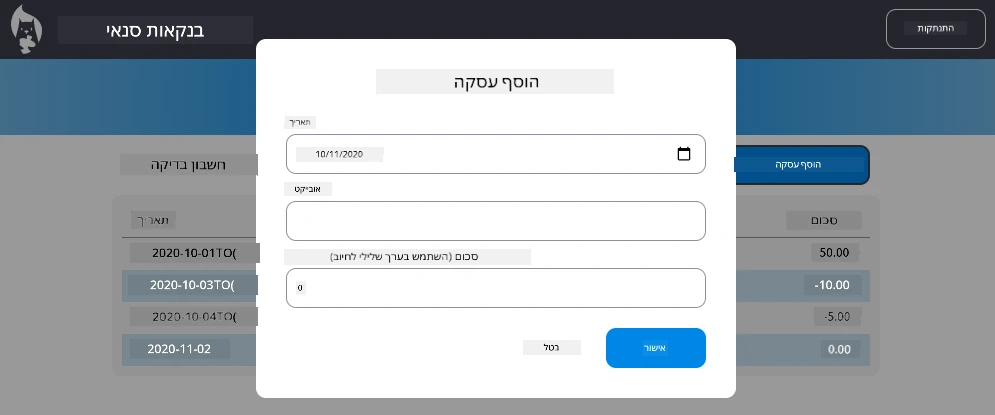

<!--
CO_OP_TRANSLATOR_METADATA:
{
  "original_hash": "50a7783473b39a2e0f133e271a102231",
  "translation_date": "2025-10-23T01:28:16+00:00",
  "source_file": "7-bank-project/4-state-management/assignment.md",
  "language_code": "he"
}
-->
# יישום דיאלוג "הוספת עסקה"

## סקירה כללית

לאפליקציית הבנקאות שלכם יש כעת ניהול מצב יציב ושמירת נתונים, אך חסרה לה תכונה קריטית שאפליקציות בנקאות אמיתיות זקוקות לה: היכולת של משתמשים להוסיף עסקאות משלהם. במשימה זו, תיישמו דיאלוג מלא של "הוספת עסקה" שמשתלב בצורה חלקה עם מערכת ניהול המצב הקיימת שלכם.

משימה זו מאחדת את כל מה שלמדתם בארבעת השיעורים על בנקאות: תבניות HTML, טיפול בטפסים, אינטגרציה עם API וניהול מצב.

## מטרות למידה

על ידי השלמת משימה זו, תלמדו:
- **ליצור** ממשק דיאלוג ידידותי למשתמש להזנת נתונים
- **ליישם** עיצוב טפסים נגיש עם תמיכה במקלדת ובקוראי מסך
- **לשלב** תכונות חדשות עם מערכת ניהול המצב הקיימת שלכם
- **לתרגל** תקשורת עם API וטיפול בשגיאות
- **ליישם** דפוסי פיתוח מודרניים בתכונה אמיתית

## הוראות

### שלב 1: כפתור הוספת עסקה

**צרו** כפתור "הוספת עסקה" בעמוד לוח הבקרה שלכם כך שמשתמשים יוכלו למצוא אותו בקלות ולהשתמש בו.

**דרישות:**
- **מקמו** את הכפתור במקום הגיוני בלוח הבקרה
- **השתמשו** בטקסט ברור ומכוון פעולה על הכפתור
- **עצבו** את הכפתור כך שיתאים לעיצוב ה-UI הקיים שלכם
- **וודאו** שהכפתור נגיש באמצעות מקלדת

### שלב 2: יישום הדיאלוג

בחרו אחת משתי הגישות ליישום הדיאלוג שלכם:

**אפשרות א': עמוד נפרד**
- **צרו** תבנית HTML חדשה עבור טופס העסקה
- **הוסיפו** נתיב חדש למערכת הניתוב שלכם
- **יישמו** ניווט אל ומעמוד הטופס

**אפשרות ב': דיאלוג מודאלי (מומלץ)**
- **השתמשו** ב-JavaScript כדי להציג/להסתיר את הדיאלוג מבלי לעזוב את לוח הבקרה
- **יישמו** באמצעות [תכונת `hidden`](https://developer.mozilla.org/docs/Web/HTML/Global_attributes/hidden) או מחלקות CSS
- **צרו** חוויית משתמש חלקה עם ניהול פוקוס נכון

### שלב 3: יישום נגישות

**וודאו** שהדיאלוג שלכם עומד ב[סטנדרטים לנגישות דיאלוגים מודאליים](https://developer.paciellogroup.com/blog/2018/06/the-current-state-of-modal-dialog-accessibility/):

**ניווט באמצעות מקלדת:**
- **תמכו** במקש Escape לסגירת הדיאלוג
- **לכדו** את הפוקוס בתוך הדיאלוג כשהוא פתוח
- **החזירו** את הפוקוס לכפתור ההפעלה כשהדיאלוג נסגר

**תמיכה בקוראי מסך:**
- **הוסיפו** תוויות ARIA ותפקידים מתאימים
- **הכריזו** על פתיחה/סגירה של הדיאלוג לקוראי מסך
- **ספקו** תוויות שדה טופס ברורות והודעות שגיאה

### שלב 4: יצירת טופס

**עצבו** טופס HTML שאוסף נתוני עסקה:

**שדות חובה:**
- **תאריך**: מתי העסקה התרחשה
- **תיאור**: מה הייתה מטרת העסקה
- **סכום**: ערך העסקה (חיובי להכנסות, שלילי להוצאות)

**תכונות טופס:**
- **אמתו** את קלט המשתמש לפני שליחה
- **ספקו** הודעות שגיאה ברורות עבור נתונים לא תקינים
- **הוסיפו** טקסט עזר ותוויות מועילות
- **עצבו** באופן עקבי עם העיצוב הקיים שלכם

### שלב 5: אינטגרציה עם API

**חברו** את הטופס שלכם ל-API של השרת:

**שלבי יישום:**
- **סקירה** של [מפרטי ה-API של השרת](../api/README.md) עבור נקודת הקצה והפורמט הנכון של הנתונים
- **יצירת** נתוני JSON מקלטי הטופס שלכם
- **שליחה** של הנתונים ל-API עם טיפול בשגיאות מתאים
- **הצגת** הודעות הצלחה/כישלון למשתמש
- **טיפול** בשגיאות רשת בצורה חלקה

### שלב 6: אינטגרציה עם ניהול מצב

**עדכנו** את לוח הבקרה עם העסקה החדשה:

**דרישות אינטגרציה:**
- **רעננו** את נתוני החשבון לאחר הוספת עסקה בהצלחה
- **עדכנו** את תצוגת לוח הבקרה מבלי לדרוש טעינת עמוד מחדש
- **וודאו** שהעסקה החדשה מופיעה מיד
- **שמרו** על עקביות מצב נכונה לאורך התהליך

## מפרטים טכניים

**פרטי נקודת הקצה של ה-API:**
עיינו ב[תיעוד ה-API של השרת](../api/README.md) עבור:
- פורמט JSON הנדרש לנתוני עסקה
- שיטת HTTP וכתובת URL של נקודת הקצה
- פורמט תגובה צפוי
- טיפול בתגובות שגיאה

**תוצאה צפויה:**
לאחר השלמת המשימה, אפליקציית הבנקאות שלכם צריכה לכלול תכונת "הוספת עסקה" פונקציונלית לחלוטין שנראית ומתנהגת באופן מקצועי:

## בדיקת היישום שלכם

**בדיקות פונקציונליות:**
1. **וודאו** שכפתור "הוספת עסקה" נראה בבירור ונגיש
2. **בדקו** שהדיאלוג נפתח ונסגר כראוי
3. **אשרו** שהטופס מאמת את כל השדות הנדרשים
4. **בדקו** שעסקאות מוצלחות מופיעות מיד בלוח הבקרה
5. **וודאו** שטיפול בשגיאות עובד עבור נתונים לא תקינים ובעיות רשת

**בדיקות נגישות:**
1. **נווטו** בכל התהליך באמצעות המקלדת בלבד
2. **בדקו** עם קורא מסך כדי לוודא הכרזות נכונות
3. **אשרו** שניהול הפוקוס עובד כראוי
4. **בדקו** שלכל רכיבי הטופס יש תוויות מתאימות

## קריטריונים להערכה

| קריטריון | מצוין | מספק | דורש שיפור |
| -------- | ------ | ------ | ----------- |
| **פונקציונליות** | תכונת הוספת העסקה פועלת בצורה מושלמת עם חוויית משתמש מצוינת ועומדת בכל שיטות העבודה המומלצות מהשיעורים | תכונת הוספת העסקה פועלת כראוי אך ייתכן שאינה עומדת בחלק משיטות העבודה המומלצות או שיש לה בעיות קלות בשימושיות | תכונת הוספת העסקה פועלת באופן חלקי או שיש לה בעיות שימושיות משמעותיות |
| **איכות קוד** | הקוד מאורגן היטב, עומד בדפוסים מבוססים, כולל טיפול בשגיאות מתאים ומשתלב בצורה חלקה עם ניהול המצב הקיים | הקוד עובד אך ייתכן שיש לו בעיות ארגון או דפוסים לא עקביים עם בסיס הקוד הקיים | לקוד יש בעיות מבניות משמעותיות או שאינו משתלב היטב עם דפוסים קיימים |
| **נגישות** | תמיכה מלאה בניווט באמצעות מקלדת, תאימות לקוראי מסך ועומד בהנחיות WCAG עם ניהול פוקוס מצוין | תכונות נגישות בסיסיות מיושמות אך ייתכן שחסרות תכונות ניווט במקלדת או תמיכה בקוראי מסך | אין או מעט התייחסות לנגישות |
| **חוויית משתמש** | ממשק אינטואיטיבי, מלוטש עם משוב ברור, אינטראקציות חלקות ומראה מקצועי | חוויית משתמש טובה עם אזורים לשיפור קל במשוב או בעיצוב חזותי | חוויית משתמש גרועה עם ממשק מבלבל או חוסר משוב למשתמש |

## אתגרים נוספים (אופציונלי)

לאחר שהשלמתם את הדרישות הבסיסיות, שקלו את השיפורים הבאים:

**תכונות משופרות:**
- **הוסיפו** קטגוריות לעסקאות (אוכל, תחבורה, בידור וכו')
- **יישמו** אימות קלט עם משוב בזמן אמת
- **צרו** קיצורי מקלדת למשתמשים מתקדמים
- **הוסיפו** יכולות עריכה ומחיקה של עסקאות

**אינטגרציה מתקדמת:**
- **יישמו** פונקציונליות ביטול לעסקאות שהוספו לאחרונה
- **הוסיפו** ייבוא עסקאות בכמות גדולה מקבצי CSV
- **צרו** יכולות חיפוש וסינון עסקאות
- **יישמו** פונקציונליות ייצוא נתונים

תכונות אופציונליות אלו יעזרו לכם לתרגל מושגים מתקדמים בפיתוח אתרים וליצור אפליקציית בנקאות שלמה יותר!

---

**כתב ויתור**:  
מסמך זה תורגם באמצעות שירות תרגום מבוסס בינה מלאכותית [Co-op Translator](https://github.com/Azure/co-op-translator). למרות שאנו שואפים לדיוק, יש לקחת בחשבון שתרגומים אוטומטיים עשויים להכיל שגיאות או אי דיוקים. המסמך המקורי בשפתו המקורית צריך להיחשב כמקור סמכותי. למידע קריטי, מומלץ להשתמש בתרגום מקצועי אנושי. איננו אחראים לאי הבנות או לפרשנויות שגויות הנובעות משימוש בתרגום זה.