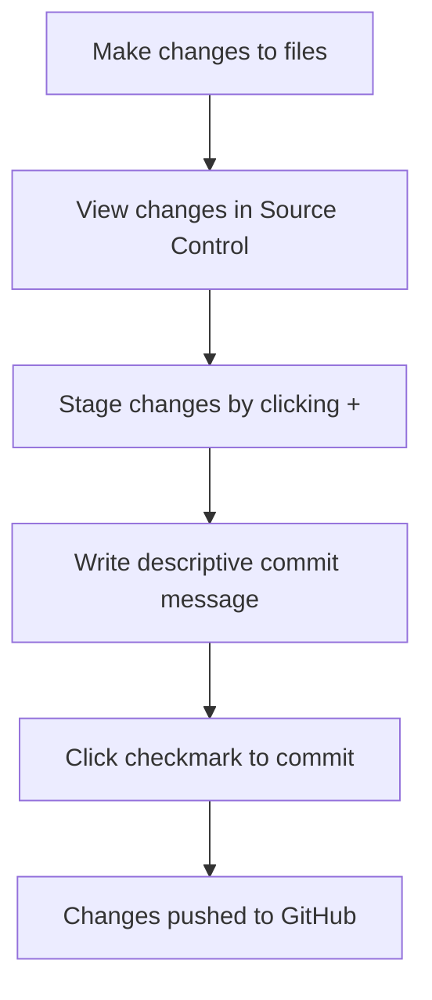

<!--
CO_OP_TRANSLATOR_METADATA:
{
  "original_hash": "cfd4a15974168ca426d50c67682ab9d4",
  "translation_date": "2025-10-23T01:12:21+00:00",
  "source_file": "8-code-editor/1-using-a-code-editor/README.md",
  "language_code": "he"
}
-->
# שימוש בעורך קוד: שליטה ב-VSCode.dev

זוכרים שבסרט *המטריקס* ניאו היה צריך להתחבר למחשב ענק כדי לגשת לעולם הדיגיטלי? כלי הפיתוח של היום הם סיפור הפוך לחלוטין – יכולות עוצמתיות שנגישות מכל מקום. VSCode.dev הוא עורך קוד מבוסס דפדפן שמביא כלים מקצועיים לפיתוח לכל מכשיר עם חיבור לאינטרנט.

כמו שהדפוס הפך ספרים לנגישים לכולם, ולא רק לנזירים במנזרים, VSCode.dev מנגיש את עולם הקוד. אתם יכולים לעבוד על פרויקטים ממחשב בספרייה, מעבדה בבית הספר או מכל מקום שיש בו גישה לדפדפן. בלי התקנות, בלי מגבלות של "אני צריך את ההגדרות הספציפיות שלי".

בסוף השיעור הזה, תבינו איך לנווט ב-VSCode.dev, לפתוח מאגרי GitHub ישירות בדפדפן שלכם ולהשתמש ב-Git לניהול גרסאות – מיומנויות שהן חלק בלתי נפרד מחיי היום-יום של מפתחים מקצועיים.

## מה תלמדו

אחרי שנעבור על זה יחד, תוכלו:

- לנווט ב-VSCode.dev כאילו זה הבית השני שלכם – למצוא כל מה שאתם צריכים בלי להתבלבל
- לפתוח כל מאגר GitHub בדפדפן ולהתחיל לערוך מיד (זה די קסום!)
- להשתמש ב-Git כדי לעקוב אחרי השינויים ולשמור את ההתקדמות שלכם כמו מקצוענים
- לשדרג את העורך עם הרחבות שהופכות את הקידוד למהיר ומהנה יותר
- ליצור ולארגן קבצי פרויקט בביטחון

## מה תצטרכו

הדרישות פשוטות:

- חשבון [GitHub](https://github.com) חינמי (נדריך אתכם איך ליצור אחד אם צריך)
- היכרות בסיסית עם דפדפנים
- שיעור הבסיסים של GitHub מספק רקע מועיל, אך אינו הכרחי

> 💡 **חדשים ב-GitHub?** יצירת חשבון היא חינמית ולוקחת דקות ספורות. כמו שכרטיס ספרייה נותן לכם גישה לספרים ברחבי העולם, חשבון GitHub פותח דלתות למאגרי קוד ברחבי האינטרנט.

## למה עורכי קוד מבוססי דפדפן חשובים

לפני האינטרנט, מדענים באוניברסיטאות שונות לא יכלו לשתף מחקרים בקלות. ואז הגיע ARPANET בשנות ה-60, שחיבר מחשבים מרחוק. עורכי קוד מבוססי דפדפן פועלים על אותו עיקרון – הם הופכים כלים עוצמתיים לנגישים ללא קשר למיקום הפיזי או למכשיר שלכם.

עורך קוד משמש כמרחב העבודה שלכם לפיתוח, שבו אתם כותבים, עורכים ומארגנים קבצי קוד. בניגוד לעורכי טקסט פשוטים, עורכי קוד מקצועיים מספקים הדגשת תחביר, זיהוי שגיאות ותכונות לניהול פרויקטים.

VSCode.dev מביא את היכולות הללו לדפדפן שלכם:

**יתרונות העריכה מבוססת דפדפן:**

| תכונה | תיאור | יתרון מעשי |
|-------|--------|------------|
| **עצמאות פלטפורמה** | פועל על כל מכשיר עם דפדפן | עבודה ממחשבים שונים בצורה חלקה |
| **אין צורך בהתקנה** | גישה דרך כתובת URL | עקיפת מגבלות התקנת תוכנה |
| **עדכונים אוטומטיים** | תמיד פועל בגרסה העדכנית ביותר | גישה לתכונות חדשות ללא עדכונים ידניים |
| **אינטגרציה עם מאגרים** | חיבור ישיר ל-GitHub | עריכת קוד ללא צורך בניהול קבצים מקומי |

**השלכות מעשיות:**
- המשכיות עבודה בסביבות שונות
- ממשק עקבי ללא קשר למערכת ההפעלה
- יכולות שיתוף פעולה מיידיות
- דרישות אחסון מקומי מופחתות

## חקר VSCode.dev

כמו שהמעבדה של מארי קירי הכילה ציוד מתוחכם במרחב פשוט יחסית, VSCode.dev מכיל כלים מקצועיים לפיתוח בממשק דפדפן. יישום האינטרנט הזה מספק את אותה פונקציונליות בסיסית כמו עורכי קוד שולחניים.

התחילו על ידי ניווט ל-[vscode.dev](https://vscode.dev) בדפדפן שלכם. הממשק נטען ללא הורדות או התקנות מערכת – יישום ישיר של עקרונות מחשוב ענן.

### חיבור חשבון GitHub שלכם

כמו שהטלפון של אלכסנדר גרהם בל חיבר מקומות רחוקים, חיבור חשבון GitHub שלכם מקשר בין VSCode.dev למאגרים שלכם. מומלץ לאשר את החיבור הזה כאשר תתבקשו להתחבר ל-GitHub.

**אינטגרציה עם GitHub מספקת:**
- גישה ישירה למאגרים שלכם בתוך העורך
- סנכרון הגדרות והרחבות בין מכשירים
- זרימת עבודה חלקה לשמירה ב-GitHub
- סביבת פיתוח מותאמת אישית

### הכרת סביבת העבודה החדשה שלכם

ברגע שהכל נטען, תראו סביבת עבודה נקייה ומעוצבת שנועדה לשמור אתכם ממוקדים במה שחשוב – הקוד שלכם!

**הנה סיור בשכונה:**
- **סרגל הפעילות** (הפס בצד שמאל): הניווט הראשי שלכם עם Explorer 📁, חיפוש 🔍, בקרת גרסאות 🌿, הרחבות 🧩 והגדרות ⚙️
- **סרגל צדדי** (הפאנל לידו): משתנה כדי להציג מידע רלוונטי בהתאם למה שבחרתם
- **אזור העורך** (המרחב הגדול באמצע): כאן מתרחש הקסם – אזור הקידוד הראשי שלכם

**קחו רגע לחקור:**
- לחצו על האייקונים בסרגל הפעילות וראו מה כל אחד עושה
- שימו לב איך הסרגל הצדדי מתעדכן כדי להציג מידע שונה – די מגניב, נכון?
- תצוגת ה-Explorer (📁) היא כנראה המקום שבו תבלו את רוב הזמן, אז תתרגלו אליה

## פתיחת מאגרי GitHub

לפני האינטרנט, חוקרים היו צריכים לנסוע פיזית לספריות כדי לגשת למסמכים. מאגרי GitHub פועלים באופן דומה – הם אוספים קוד שמאוחסן מרחוק. VSCode.dev מבטל את הצורך המסורתי להוריד מאגרים למחשב המקומי לפני העריכה.

יכולת זו מאפשרת גישה מיידית לכל מאגר ציבורי לצפייה, עריכה או תרומה. הנה שתי שיטות לפתיחת מאגרים:

### שיטה 1: הדרך הקלה

זו דרך מושלמת כשאתם מתחילים ב-VSCode.dev ורוצים לפתוח מאגר ספציפי. זה פשוט וידידותי למתחילים:

**כך עושים זאת:**

1. גשו ל-[vscode.dev](https://vscode.dev) אם אתם לא שם כבר
2. חפשו את כפתור "Open Remote Repository" במסך הפתיחה ולחצו עליו

   

3. הדביקו כל כתובת URL של מאגר GitHub (נסו את זו: `https://github.com/microsoft/Web-Dev-For-Beginners`)
4. לחצו Enter ותראו את הקסם קורה!

**טיפ מקצועי - קיצור דרך לתפריט הפקודות:**

רוצים להרגיש כמו קוסמי קוד? נסו את קיצור הדרך הזה במקלדת: Ctrl+Shift+P (או Cmd+Shift+P במק) כדי לפתוח את תפריט הפקודות:

**תפריט הפקודות הוא כמו מנוע חיפוש לכל מה שאפשר לעשות:**
- כתבו "open remote" והוא ימצא עבורכם את פותח המאגרים
- הוא זוכר מאגרים שפתחתם לאחרונה (ממש שימושי!)
- ברגע שתתרגלו אליו, תרגישו שאתם מקודדים במהירות האור
- זה בעצם הגרסה של VSCode.dev ל"היי סירי, אבל לקידוד"

### שיטה 2: טכניקת שינוי כתובת URL

כמו ש-HTTP ו-HTTPS משתמשים בפרוטוקולים שונים תוך שמירה על מבנה דומיין דומה, VSCode.dev משתמש בתבנית כתובת URL שמדמה את מערכת הכתובות של GitHub. כל כתובת URL של מאגר GitHub יכולה להשתנות כדי להיפתח ישירות ב-VSCode.dev.

**תבנית שינוי כתובת URL:**

| סוג מאגר | כתובת URL של GitHub | כתובת URL של VSCode.dev |
|----------|----------------------|--------------------------|
| **מאגר ציבורי** | `github.com/microsoft/Web-Dev-For-Beginners` | `vscode.dev/github/microsoft/Web-Dev-For-Beginners` |
| **פרויקט אישי** | `github.com/your-username/my-project` | `vscode.dev/github/your-username/my-project` |
| **כל מאגר נגיש** | `github.com/their-username/awesome-repo` | `vscode.dev/github/their-username/awesome-repo` |

**יישום:**
- החליפו את `github.com` ב-`vscode.dev/github`
- שמרו על כל שאר רכיבי הכתובת ללא שינוי
- עובד עם כל מאגר ציבורי נגיש
- מספק גישה מיידית לעריכה

> 💡 **טיפ משנה חיים**: שמרו במועדפים את גרסאות VSCode.dev של המאגרים האהובים עליכם. יש לי מועדפים כמו "ערוך את הפורטפוליו שלי" ו"תיקון תיעוד" שמובילים אותי ישירות למצב עריכה!

**איזו שיטה כדאי לבחור?**
- **הדרך דרך הממשק**: מעולה כשאתם חוקרים או לא זוכרים את שמות המאגרים המדויקים
- **טריק הכתובת**: מושלם לגישה מהירה כשאתם יודעים בדיוק לאן אתם הולכים

## עבודה עם קבצים ופרויקטים

עכשיו כשפתחתם מאגר, בואו נתחיל לעבוד! VSCode.dev נותן לכם את כל מה שאתם צריכים כדי ליצור, לערוך ולארגן את קבצי הקוד שלכם. תחשבו על זה כמו סדנה דיגיטלית – כל כלי נמצא בדיוק במקום שאתם צריכים אותו.

בואו נצלול למשימות היומיומיות שירכיבו את רוב זרימת העבודה שלכם בקידוד.

### יצירת קבצים חדשים

כמו ארגון תוכניות במשרד של אדריכל, יצירת קבצים ב-VSCode.dev מתבצעת בצורה מובנית. המערכת תומכת בכל סוגי הקבצים הסטנדרטיים לפיתוח אתרים.

**תהליך יצירת קובץ:**

1. נווטו לתיקייה הרצויה בסרגל הצד של ה-Explorer
2. רחפו מעל שם התיקייה כדי לחשוף את אייקון "קובץ חדש" (📄+)
3. הזינו את שם הקובץ כולל הסיומת המתאימה (`style.css`, `script.js`, `index.html`)
4. לחצו Enter כדי ליצור את הקובץ

**כללי שמות:**
- השתמשו בשמות תיאוריים שמציינים את מטרת הקובץ
- כללו סיומות קובץ להדגשת תחביר נכונה
- שמרו על דפוסי שמות עקביים לאורך הפרויקטים
- השתמשו באותיות קטנות ובמקפים במקום רווחים

### עריכה ושמירת קבצים

כאן מתחילה הכיף האמיתי! העורך של VSCode.dev מלא בתכונות מועילות שהופכות את הקידוד לחלק ואינטואיטיבי. זה כמו שיש לכם עוזר כתיבה ממש חכם, אבל לקוד.

**זרימת העבודה שלכם בעריכה:**

1. לחצו על כל קובץ ב-Explorer כדי לפתוח אותו באזור המרכזי
2. התחילו להקליד ותראו איך VSCode.dev עוזר לכם עם צבעים, הצעות ותפיסת שגיאות
3. שמרו את העבודה שלכם עם Ctrl+S (Windows/Linux) או Cmd+S (Mac) – למרות שהוא גם שומר אוטומטית!

**הדברים המגניבים שקורים בזמן שאתם מקודדים:**
- הקוד שלכם מקבל הדגשה צבעונית יפה כך שקל לקרוא אותו
- VSCode.dev מציע השלמות תוך כדי הקלדה (כמו תיקון אוטומטי, אבל הרבה יותר חכם)
- הוא מזהה שגיאות וטייפוס לפני שאתם אפילו שומרים
- אתם יכולים לפתוח כמה קבצים בכרטיסיות, בדיוק כמו בדפדפן
- הכל נשמר אוטומטית ברקע

> ⚠️ **טיפ מהיר**: למרות שהשמירה האוטומטית מגבה אתכם, לחיצה על Ctrl+S או Cmd+S היא עדיין הרגל טוב. זה שומר הכל מיד ומפעיל כמה תכונות עזר נוספות כמו בדיקת שגיאות.

### ניהול גרסאות עם Git

כמו שארכיאולוגים יוצרים רשומות מפורטות של שכבות חפירה, Git עוקב אחרי שינויים בקוד שלכם לאורך זמן. מערכת זו שומרת על היסטוריית הפרויקט ומאפשרת לכם לחזור לגרסאות קודמות בעת הצורך. VSCode.dev כולל פונקציונליות Git מובנית.

**ממשק בקרת גרסאות:**

1. גשו לפאנל בקרת גרסאות דרך האייקון 🌿 בסרגל הפעילות
2. קבצים ששונו מופיעים בסעיף "Changes"
3. קידוד צבעים מציין סוגי שינויים: ירוק לתוספות, אדום למחיקות

**שמירת העבודה שלכם (זרימת עבודה של commit):**

**הנה תהליך שלב-אחר-שלב:**
- לחצו על אייקון "+" ליד הקבצים שברצונכם לשמור (זה "מעלה" אותם)
- בדקו שוב שאתם מרוצים מכל השינויים שהועלו
- כתבו הערה קצרה שמסבירה מה עשיתם (זו "הודעת ה-commit" שלכם)
- לחצו על כפתור הסימון כדי לשמור הכל ב-GitHub
- אם שיניתם את דעתכם לגבי משהו, אייקון הביטול מאפשר לכם לבטל שינויים

**כתיבת הודעות commit טובות (זה קל יותר ממה שאתם חושבים!):**
- פשוט תארו מה עשיתם, כמו "הוספת טופס יצירת קשר" או "תיקון ניווט שבור"
- שמרו על זה קצר וקולע – תחשבו על אורך של ציוץ, לא חיבור
- התחילו עם מילים כמו "הוספת", "תיקון", "עדכון" או "הסרה"
- **דוגמאות טובות**: "הוספת תפריט ניווט רספונסיבי", "תיקון בעיות עיצוב במובייל", "עדכון צבעים לשיפור נגישות"

> 💡 **טיפ ניווט מהיר**: השתמשו בתפריט ההמבורגר (☰) בפינה השמאלית העליונה כדי לחזור למאגר GitHub שלכם ולראות את השינויים ששמרתם אונליין. זה כמו פורטל בין סביבת העריכה שלכם לבין הבית של הפרויקט שלכם ב-GitHub!

## שיפור הפונקציונליות עם הרחבות

כמו שבסדנה של אומן יש כלים מיוחדים למשימות שונות, ניתן להתאים את VSCode.dev עם הרחבות שמוסיפות יכולות ספציפיות. תוספים אלו, שפותחו על ידי הקהילה, עונים על צרכים נפוצים בפיתוח כמו עיצוב קוד, תצוגה מקדימה בזמן אמת ושיפור אינטגרציה עם Git.

שוק ההרחבות מכיל אלפי כלים חינמיים שפותחו על ידי מפתחים מכל העולם. כל הרחבה פותרת אתגרים מסוימים בזרימת העבודה, ומאפשרת לכם לבנות סביבת פיתוח מותאמת אישית לצרכים ולהעדפות שלכם.

### מציאת ההרחבות המושלמות עבורכם

שוק ההרחבות מאורגן היטב, כך שלא תתבלבלו בניסיון למצוא את מה שאתם צריכים. הוא נועד לעזור לכם לגלות גם כלים ספציפיים וגם דברים מגניבים שלא ידעתם עליהם!

**הגעה לשוק ההרחבות:**

1. לחצו על אייקון ההרחבות (🧩) בסרגל הפעילות
2. חפשו או דפדפו לפי משהו ספציפי
3. לחצו על כל דבר שנראה מעניין כדי ללמוד עליו יותר

**מה תמצאו שם:**

| סעיף | מה בפנים | למה זה מועיל |
|-------|----------|-------------|
| **מותקן** | הרחבות שכבר הוספתם | ערכת הכלים האישית שלכם לקידוד |
| **פופולרי** | המועדפים של הקהל | מה שרוב המפתחים נשבעים עליו |
| **מומלץ** | הצעות חכמות לפרויקט שלכם | ההמלצות המועילות של VSCode.dev |

**מה הופך את הדפד
- כל הרחבה מציגה דירוגים, מספר הורדות וביקורות של משתמשים אמיתיים  
- תקבלו צילומי מסך ותיאורים ברורים של מה שכל אחת עושה  
- הכל מסומן בבירור עם מידע על תאימות  
- מוצעות הרחבות דומות כדי שתוכלו להשוות בין אפשרויות  

### התקנת הרחבות (זה ממש קל!)

הוספת יכולות חדשות לעורך שלכם פשוטה כמו לחיצה על כפתור. הרחבות מותקנות תוך שניות ומתחילות לעבוד מיד – בלי הפעלה מחדש, בלי לחכות.  

**הנה כל מה שצריך לעשות:**  

1. חפשו את מה שאתם רוצים (נסו לחפש "live server" או "prettier")  
2. לחצו על אחת שנראית לכם טובה כדי לראות פרטים נוספים  
3. קראו מה היא עושה ובדקו את הדירוגים  
4. לחצו על כפתור "Install" הכחול וסיימתם!  

  

**מה קורה מאחורי הקלעים:**  
- ההרחבה מורידה ומתקינה את עצמה באופן אוטומטי  
- תכונות חדשות מופיעות בממשק שלכם מיד  
- הכל מתחיל לעבוד מיד (באמת, זה כל כך מהיר!)  
- אם אתם מחוברים, ההרחבה מסתנכרנת לכל המכשירים שלכם  

**כמה הרחבות שאני ממליץ להתחיל איתן:**  
- **Live Server**: צפו באתר שלכם מתעדכן בזמן אמת בזמן שאתם כותבים קוד (זה קסום!)  
- **Prettier**: הופך את הקוד שלכם לנקי ומקצועי באופן אוטומטי  
- **Auto Rename Tag**: שינוי תג HTML אחד והשותף שלו מתעדכן גם כן  
- **Bracket Pair Colorizer**: צובע את הסוגריים שלכם כך שלעולם לא תתבלבלו  
- **GitLens**: משדרג את תכונות ה-Git שלכם עם המון מידע מועיל  

### התאמת ההרחבות שלכם  

רוב ההרחבות מגיעות עם הגדרות שניתן להתאים כדי לגרום להן לעבוד בדיוק כמו שאתם אוהבים. תחשבו על זה כמו לכוון את המושב והמראות ברכב – לכל אחד יש את ההעדפות שלו!  

**התאמת הגדרות ההרחבות:**  

1. מצאו את ההרחבה שהתקנתם בלוח ההרחבות  
2. חפשו את סמל ההגדרות הקטן (⚙️) ליד השם שלה ולחצו עליו  
3. בחרו "Extension Settings" מהתפריט הנפתח  
4. התאימו את ההגדרות עד שיתאימו בדיוק לזרימת העבודה שלכם  

  

**דברים נפוצים שתרצו להתאים:**  
- איך הקוד שלכם מעוצב (טאבים מול רווחים, אורך שורה וכו')  
- אילו קיצורי מקלדת מפעילים פעולות שונות  
- אילו סוגי קבצים ההרחבה צריכה לעבוד איתם  
- הפעלה או כיבוי של תכונות ספציפיות כדי לשמור על סדר  

### שמירה על סדר בהרחבות שלכם  

כשתגלו עוד הרחבות מגניבות, תרצו לשמור על האוסף שלכם מסודר ופועל בצורה חלקה. VSCode.dev הופך את זה לקל מאוד לניהול.  

**אפשרויות ניהול ההרחבות שלכם:**  

| מה אפשר לעשות | מתי זה מועיל | טיפ מקצועי |  
|--------|---------|----------|  
| **השבתה** | לבדוק אם הרחבה גורמת לבעיות | עדיף מאשר להסיר אם אולי תרצו אותה שוב |  
| **הסרה** | הסרה מוחלטת של הרחבות שאתם לא צריכים | שומר על הסביבה שלכם נקייה ומהירה |  
| **עדכון** | קבלת התכונות האחרונות ותיקוני באגים | בדרך כלל קורה אוטומטית, אבל כדאי לבדוק |  

**איך אני אוהב לנהל הרחבות:**  
- כל כמה חודשים אני בודק מה התקנתי ומסיר כל דבר שאני לא משתמש בו  
- אני שומר על הרחבות מעודכנות כדי לקבל את השיפורים האחרונים ותיקוני האבטחה  
- אם משהו נראה איטי, אני משבית זמנית הרחבות כדי לבדוק אם אחת מהן היא הגורם  
- אני קורא את הערות העדכון כשיש עדכונים גדולים להרחבות – לפעמים יש תכונות חדשות מגניבות!  

> ⚠️ **טיפ לביצועים**: הרחבות הן מדהימות, אבל יותר מדי יכולות להאט את העניינים. התמקדו באלו שבאמת מקלות על החיים שלכם ואל תפחדו להסיר את אלו שאתם לא משתמשים בהן.  

## אתגר סוכן GitHub Copilot 🚀  

כמו הגישה המובנית של נאס"א למשימות חלל, אתגר זה כולל יישום שיטתי של מיומנויות VSCode.dev בתרחיש עבודה מלא.  

**מטרה:** להדגים מיומנות עם VSCode.dev על ידי יצירת זרימת עבודה מלאה לפיתוח אתרים.  

**דרישות הפרויקט:** בעזרת מצב סוכן, השלימו את המשימות הבאות:  
1. יצירת מאגר חדש או ביצוע Fork למאגר קיים  
2. יצירת מבנה פרויקט פונקציונלי עם קבצי HTML, CSS ו-JavaScript  
3. התקנה והגדרה של שלוש הרחבות לשיפור הפיתוח  
4. תרגול של בקרת גרסאות עם הודעות commit מתוארות  
5. ניסוי ביצירת ושינוי ענפי פיצ'רים  
6. תיעוד התהליך והלמידות בקובץ README.md  

תרגיל זה מאגד את כל מושגי VSCode.dev לתוך זרימת עבודה מעשית שניתן ליישם בפרויקטים עתידיים.  

למידע נוסף על [מצב סוכן](https://code.visualstudio.com/blogs/2025/02/24/introducing-copilot-agent-mode) כאן.  

## משימה  

הגיע הזמן לבדוק את המיומנויות האלה בפועל! יש לי פרויקט מעשי שיאפשר לכם לתרגל את כל מה שלמדנו: [יצירת אתר קורות חיים באמצעות VSCode.dev](./assignment.md)  

משימה זו תדריך אתכם בבניית אתר קורות חיים מקצועי כולו בדפדפן שלכם. תשתמשו בכל תכונות VSCode.dev שחקרנו, ובסוף יהיה לכם גם אתר מרשים וגם ביטחון חזק בזרימת העבודה החדשה שלכם.  

## המשיכו לחקור ולפתח את המיומנויות שלכם  

יש לכם עכשיו בסיס מוצק, אבל יש עוד כל כך הרבה דברים מגניבים לגלות! הנה כמה משאבים ורעיונות להמשך פיתוח מיומנויות VSCode.dev שלכם:  

**מסמכים רשמיים שכדאי לשמור:**  
- [תיעוד VSCode Web](https://code.visualstudio.com/docs/editor/vscode-web?WT.mc_id=academic-0000-alfredodeza) – המדריך המלא לעריכה מבוססת דפדפן  
- [GitHub Codespaces](https://docs.github.com/en/codespaces) – כשאתם רוצים עוד יותר כוח בענן  

**תכונות מגניבות שכדאי להתנסות בהן בהמשך:**  
- **קיצורי מקלדת**: למדו את השילובים שיגרמו לכם להרגיש כמו נינג'ות קוד  
- **הגדרות סביבת עבודה**: הגדירו סביבות שונות לסוגי פרויקטים שונים  
- **סביבות עבודה מרובות שורשים**: עבדו על מספר מאגרים בו זמנית (ממש שימושי!)  
- **שילוב טרמינל**: גישה לכלי שורת הפקודה ישירות בדפדפן שלכם  

**רעיונות לתרגול:**  
- הצטרפו לפרויקטים בקוד פתוח ותרמו באמצעות VSCode.dev – זו דרך נהדרת לתרום!  
- נסו הרחבות שונות כדי למצוא את ההגדרות המושלמות עבורכם  
- צרו תבניות פרויקטים לסוגי האתרים שאתם בונים הכי הרבה  
- תרגלו זרימות עבודה של Git כמו יצירת ענפים ומיזוג – מיומנויות אלו הן זהב בפרויקטים צוותיים  

---

**שליטה בפיתוח מבוסס דפדפן!** 🎉 כמו איך המצאת מכשירים ניידים אפשרה למדענים לבצע מחקר במקומות מרוחקים, VSCode.dev מאפשר קידוד מקצועי מכל מכשיר שמחובר לאינטרנט.  

מיומנויות אלו משקפות את שיטות העבודה הנוכחיות בתעשייה – מפתחים מקצועיים רבים משתמשים בסביבות פיתוח מבוססות ענן בזכות הגמישות והנגישות שלהן. למדתם זרימת עבודה שמתאימה לפרויקטים אישיים וגם לשיתופי פעולה בצוותים גדולים.  

יישמו את הטכניקות הללו בפרויקט הפיתוח הבא שלכם! 🚀  

---

**הצהרת אחריות**:  
מסמך זה תורגם באמצעות שירות תרגום AI [Co-op Translator](https://github.com/Azure/co-op-translator). למרות שאנו שואפים לדיוק, יש לקחת בחשבון שתרגומים אוטומטיים עשויים להכיל שגיאות או אי דיוקים. המסמך המקורי בשפתו המקורית צריך להיחשב כמקור סמכותי. עבור מידע קריטי, מומלץ להשתמש בתרגום מקצועי אנושי. אנו לא נושאים באחריות לכל אי הבנות או פרשנויות שגויות הנובעות משימוש בתרגום זה.