<!--
CO_OP_TRANSLATOR_METADATA:
{
  "original_hash": "a9a3bcc037a447e2d8994d99e871cd9f",
  "translation_date": "2025-11-04T02:12:59+00:00",
  "source_file": "8-code-editor/1-using-a-code-editor/README.md",
  "language_code": "he"
}
-->
# שימוש בעורך קוד: שליטה ב-VSCode.dev

זוכרים את *המטריקס* כשניאו היה צריך להתחבר למסוף מחשב ענק כדי לגשת לעולם הדיגיטלי? כלי הפיתוח של היום הם סיפור הפוך – יכולות עוצמתיות שנגישות מכל מקום. VSCode.dev הוא עורך קוד מבוסס דפדפן שמביא כלי פיתוח מקצועיים לכל מכשיר עם חיבור לאינטרנט.

כמו שהדפוס הפך ספרים לנגישים לכולם, ולא רק לנזירים במנזרים, VSCode.dev מנגיש את הקידוד. אתם יכולים לעבוד על פרויקטים ממחשב בספרייה, מעבדה בבית ספר או מכל מקום שיש בו גישה לדפדפן. בלי התקנות, בלי מגבלות של "אני צריך את ההגדרות הספציפיות שלי".

בסוף השיעור הזה, תבינו איך לנווט ב-VSCode.dev, לפתוח מאגרי GitHub ישירות בדפדפן שלכם ולהשתמש ב-Git לניהול גרסאות – מיומנויות שהמפתחים המקצועיים מסתמכים עליהן מדי יום.

## ⚡ מה אפשר לעשות ב-5 הדקות הקרובות

**מסלול התחלה מהירה למפתחים עסוקים**

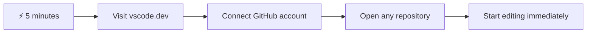

- **דקה 1**: נווטו ל-[vscode.dev](https://vscode.dev) - אין צורך בהתקנה
- **דקה 2**: התחברו עם GitHub כדי לקשר את המאגר שלכם
- **דקה 3**: נסו את הטריק של ה-URL: החליפו `github.com` ב-`vscode.dev/github` בכל כתובת מאגר
- **דקה 4**: צרו קובץ חדש וצפו בהדגשת התחביר פועלת באופן אוטומטי
- **דקה 5**: בצעו שינוי ושמרו אותו דרך לוח בקרת המקור

**כתובת URL לבדיקה מהירה**:
```
# Transform this:
github.com/microsoft/Web-Dev-For-Beginners

# Into this:
vscode.dev/github/microsoft/Web-Dev-For-Beginners
```

**למה זה חשוב**: תוך 5 דקות, תחוו את החופש לקודד מכל מקום עם כלים מקצועיים. זה מייצג את עתיד הפיתוח - נגיש, עוצמתי ומיידי.

## 🗺️ מסע הלמידה שלכם בפיתוח מבוסס ענן

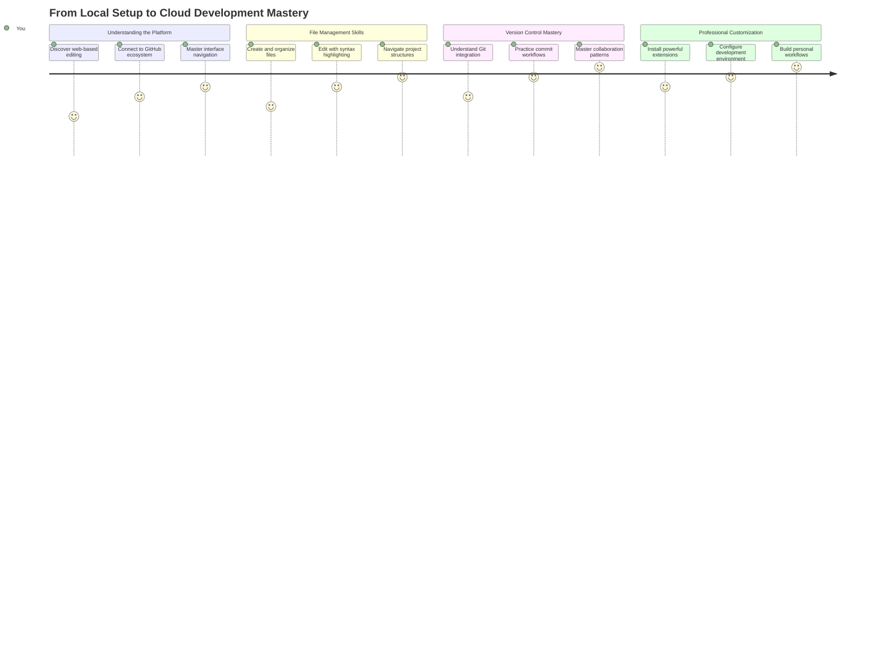

**יעד המסע שלכם**: בסוף השיעור הזה, תשלוט בסביבת פיתוח מקצועית מבוססת ענן שעובדת מכל מכשיר, ותאפשר לכם לקודד עם אותם כלים בהם משתמשים מפתחים בחברות טכנולוגיה גדולות.

## מה תלמדו

אחרי שנעבור על זה יחד, תוכלו:

- לנווט ב-VSCode.dev כאילו זה הבית השני שלכם – למצוא כל מה שאתם צריכים בלי ללכת לאיבוד
- לפתוח כל מאגר GitHub בדפדפן ולהתחיל לערוך מיד (זה די קסום!)
- להשתמש ב-Git כדי לעקוב אחר השינויים ולשמור את ההתקדמות שלכם כמו מקצוענים
- לשדרג את העורך שלכם עם הרחבות שהופכות את הקידוד למהיר ומהנה יותר
- ליצור ולארגן קבצי פרויקטים בביטחון

## מה תצטרכו

הדרישות פשוטות:

- חשבון [GitHub](https://github.com) חינמי (נדריך אתכם ביצירתו אם צריך)
- היכרות בסיסית עם דפדפנים
- שיעור הבסיסים של GitHub מספק רקע מועיל, אך אינו הכרחי

> 💡 **חדשים ב-GitHub?** יצירת חשבון היא חינמית ולוקחת דקות. כמו שכרטיס ספרייה נותן לכם גישה לספרים ברחבי העולם, חשבון GitHub פותח דלתות למאגרי קוד ברחבי האינטרנט.

## 🧠 סקירה של מערכת הפיתוח בענן

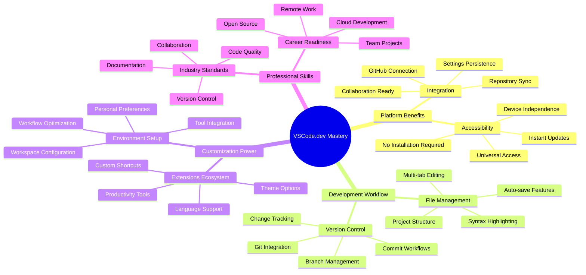

**עקרון מרכזי**: סביבות פיתוח מבוססות ענן מייצגות את עתיד הקידוד - מספקות כלים מקצועיים שהם נגישים, שיתופיים ובלתי תלויים בפלטפורמה.

## למה עורכי קוד מבוססי דפדפן חשובים

לפני האינטרנט, מדענים באוניברסיטאות שונות לא יכלו לשתף מחקרים בקלות. ואז הגיע ARPANET בשנות ה-60, שחיבר מחשבים למרחקים. עורכי קוד מבוססי דפדפן פועלים על אותו עיקרון – הם הופכים כלים עוצמתיים לנגישים ללא קשר למיקום הפיזי או למכשיר שלכם.

עורך קוד משמש כמרחב העבודה שלכם לפיתוח, בו אתם כותבים, עורכים ומארגנים קבצי קוד. בניגוד לעורכי טקסט פשוטים, עורכי קוד מקצועיים מספקים הדגשת תחביר, זיהוי שגיאות ותכונות לניהול פרויקטים.

VSCode.dev מביא את היכולות הללו לדפדפן שלכם:

**יתרונות העריכה מבוססת דפדפן:**

| תכונה | תיאור | יתרון מעשי |
|-------|--------|------------|
| **עצמאות פלטפורמה** | פועל על כל מכשיר עם דפדפן | עבודה ממחשבים שונים ללא בעיה |
| **אין צורך בהתקנה** | גישה דרך כתובת URL | עקיפת מגבלות התקנת תוכנה |
| **עדכונים אוטומטיים** | תמיד פועל בגרסה העדכנית ביותר | גישה לתכונות חדשות ללא עדכונים ידניים |
| **אינטגרציה עם מאגרים** | חיבור ישיר ל-GitHub | עריכת קוד ללא ניהול קבצים מקומי |

**השלכות מעשיות:**
- רציפות עבודה בסביבות שונות
- ממשק עקבי ללא קשר למערכת ההפעלה
- יכולות שיתוף פעולה מיידיות
- דרישות אחסון מקומי מופחתות

## חקר VSCode.dev

כמו שהמעבדה של מארי קירי הכילה ציוד מתוחכם במרחב פשוט יחסית, VSCode.dev מכיל כלי פיתוח מקצועיים בממשק דפדפן. יישום האינטרנט הזה מספק את אותה פונקציונליות בסיסית כמו עורכי קוד שולחניים.

התחילו על ידי ניווט ל-[vscode.dev](https://vscode.dev) בדפדפן שלכם. הממשק נטען ללא הורדות או התקנות מערכת – יישום ישיר של עקרונות מחשוב ענן.

### חיבור חשבון GitHub שלכם

כמו שהטלפון של אלכסנדר גרהם בל חיבר מקומות רחוקים, חיבור חשבון GitHub שלכם מקשר בין VSCode.dev למאגרי הקוד שלכם. מומלץ לאשר את החיבור כשמתבקשים להתחבר עם GitHub.

**אינטגרציה עם GitHub מספקת:**
- גישה ישירה למאגרים שלכם בתוך העורך
- סנכרון הגדרות והרחבות בין מכשירים
- זרימת עבודה חלקה לשמירה ב-GitHub
- סביבת פיתוח מותאמת אישית

### הכרת סביבת העבודה החדשה שלכם

ברגע שהכל נטען, תראו סביבת עבודה נקייה ומעוצבת שנועדה לשמור אתכם ממוקדים במה שחשוב – הקוד שלכם!

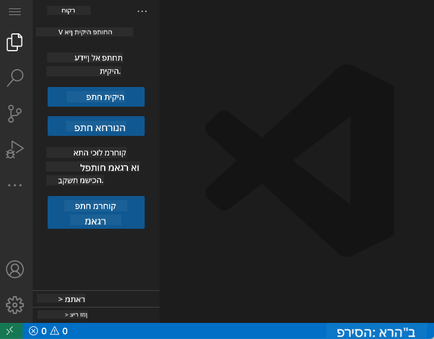

**הנה סיור בשכונה:**
- **סרגל הפעילות** (הפס בצד שמאל): הניווט הראשי שלכם עם Explorer 📁, חיפוש 🔍, בקרת מקור 🌿, הרחבות 🧩 והגדרות ⚙️
- **סרגל הצד** (הפאנל לידו): משתנה כדי להראות מידע רלוונטי בהתאם למה שבחרתם
- **אזור העורך** (המרחב הגדול באמצע): כאן מתרחש הקסם – אזור הקידוד הראשי שלכם

**קחו רגע לחקור:**
- לחצו על אייקוני סרגל הפעילות וראו מה כל אחד עושה
- שימו לב איך סרגל הצד מתעדכן כדי להציג מידע שונה – די מגניב, נכון?
- תצוגת ה-Explorer (📁) היא כנראה המקום בו תבלו את רוב הזמן, אז תתרגלו אליה

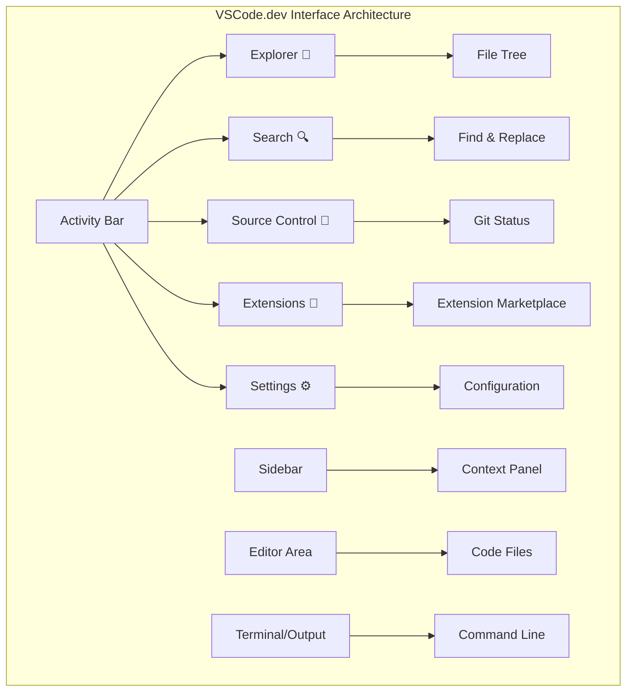

## פתיחת מאגרי GitHub

לפני האינטרנט, חוקרים היו צריכים לנסוע פיזית לספריות כדי לגשת למסמכים. מאגרי GitHub פועלים באופן דומה – הם אוספי קוד שמאוחסנים מרחוק. VSCode.dev מבטל את הצעד המסורתי של הורדת מאגרים למחשב המקומי לפני העריכה.

יכולת זו מאפשרת גישה מיידית לכל מאגר ציבורי לצפייה, עריכה או תרומה. הנה שתי שיטות לפתיחת מאגרים:

### שיטה 1: הדרך הקלה והלחיצה

זו מושלמת כשאתם מתחילים ב-VSCode.dev ורוצים לפתוח מאגר ספציפי. זה פשוט וידידותי למתחילים:

**כך עושים זאת:**

1. גשו ל-[vscode.dev](https://vscode.dev) אם אתם לא שם כבר
2. חפשו את כפתור "Open Remote Repository" במסך הפתיחה ולחצו עליו

   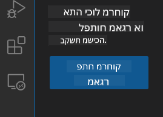

3. הדביקו כל כתובת URL של מאגר GitHub (נסו את זו: `https://github.com/microsoft/Web-Dev-For-Beginners`)
4. לחצו Enter וצפו בקסם קורה!

**טיפ מקצועי - קיצור דרך של Command Palette:**

רוצים להרגיש כמו קוסמי קוד? נסו את קיצור הדרך הזה במקלדת: Ctrl+Shift+P (או Cmd+Shift+P במק) לפתיחת Command Palette:

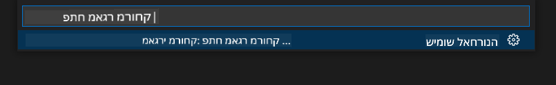

**Command Palette הוא כמו מנוע חיפוש לכל מה שאפשר לעשות:**
- הקלידו "open remote" והוא ימצא עבורכם את פותחן המאגרים
- הוא זוכר מאגרים שפתחתם לאחרונה (סופר שימושי!)
- ברגע שתתרגלו אליו, תרגישו שאתם מקודדים במהירות האור
- זה בעצם הגרסה של VSCode.dev ל"היי סירי, אבל לקידוד"

### שיטה 2: טכניקת שינוי כתובת URL

כמו ש-HTTP ו-HTTPS משתמשים בפרוטוקולים שונים תוך שמירה על מבנה דומיין זהה, VSCode.dev משתמש בתבנית URL שמדמה את מערכת הכתובות של GitHub. כל כתובת URL של מאגר GitHub יכולה להשתנות כדי להיפתח ישירות ב-VSCode.dev.

**תבנית שינוי כתובת URL:**

| סוג מאגר | כתובת URL של GitHub | כתובת URL של VSCode.dev |
|----------|----------------------|--------------------------|
| **מאגר ציבורי** | `github.com/microsoft/Web-Dev-For-Beginners` | `vscode.dev/github/microsoft/Web-Dev-For-Beginners` |
| **פרויקט אישי** | `github.com/your-username/my-project` | `vscode.dev/github/your-username/my-project` |
| **כל מאגר נגיש** | `github.com/their-username/awesome-repo` | `vscode.dev/github/their-username/awesome-repo` |

**יישום:**
- החליפו `github.com` ב-`vscode.dev/github`
- שמרו על כל שאר רכיבי הכתובת ללא שינוי
- עובד עם כל מאגר ציבורי נגיש
- מספק גישה מיידית לעריכה

> 💡 **טיפ משנה חיים**: שמרו במועדפים את גרסאות VSCode.dev של המאגרים האהובים עליכם. יש לי מועדפים כמו "ערוך את הפורטפוליו שלי" ו"תיקון תיעוד" שמובילים אותי ישירות למצב עריכה!

**איזו שיטה כדאי להשתמש?**
- **הדרך דרך הממשק**: מעולה כשאתם חוקרים או לא זוכרים שמות מאגרים מדויקים
- **הטריק של ה-URL**: מושלם לגישה מהירה כשאתם יודעים בדיוק לאן אתם הולכים

### 🎯 בדיקת התקדמות פדגוגית: גישה לפיתוח בענן

**עצירה והרהור**: הרגע למדתם שתי שיטות לגישה למאגרי קוד דרך דפדפן אינטרנט. זה מייצג שינוי יסודי באיך פיתוח עובד.

**הערכה עצמית מהירה**:
- האם אתם יכולים להסביר למה עריכה מבוססת דפדפן מבטלת את הצורך בהגדרת "סביבת פיתוח" מסורתית?
- אילו יתרונות מספקת טכניקת שינוי כתובת URL לעומת שיבוט מקומי של git?
- איך הגישה הזו משנה את הדרך שבה אתם עשויים לתרום לפרויקטים בקוד פתוח?

**חיבור לעולם האמיתי**: חברות גדולות כמו GitHub, GitLab ו-Replit בנו את פלטפורמות הפיתוח שלהן סביב עקרונות הענן. אתם לומדים את אותם זרימות עבודה שמשתמשים בהן צוותי פיתוח מקצועיים ברחבי העולם.

**שאלת אתגר**: איך פיתוח מבוסס ענן עשוי לשנות את הדרך שבה מלמדים קידוד בבתי ספר? שקלו דרישות מכשירים, ניהול תוכנה ואפשרויות שיתוף פעולה.

## עבודה עם קבצים ופרויקטים

עכשיו כשפתחתם מאגר, בואו נתחיל לבנות! VSCode.dev נותן לכם את כל מה שאתם צריכים כדי ליצור, לערוך ולארגן את קבצי הקוד שלכם. חשבו על זה כסדנה הדיגיטלית שלכם – כל כלי נמצא בדיוק במקום שאתם צריכים אותו.

בואו נצלול למשימות היומיומיות שירכיבו את רוב זרימת העבודה שלכם בקידוד.

### יצירת קבצים חדשים

כמו ארגון תוכניות במשרד של אדריכל, יצירת קבצים ב-VSCode.dev עוקבת אחרי גישה מובנית. המערכת תומכת בכל סוגי הקבצים הסטנדרטיים לפיתוח אתרים.

**תהליך יצירת קובץ:**

1. נווטו לתיקיית היעד בסרגל הצד של ה-Explorer
2. רחפו מעל שם התיקייה כדי לחשוף את אייקון "New File" (📄+)
3. הזינו את שם הקובץ כולל הסיומת המתאימה (`style.css`, `script.js`, `index.html`)
4. לחצו Enter כדי ליצור את הקובץ


**כללי שמות:**
- השתמשו בשמות תיאוריים שמצביעים על מטרת הקובץ
- כללו סיומות קבצים להדגשת תחביר נכונה
- עקבו אחרי דפוסי שמות עקביים לאורך הפרויקטים
- השתמשו באותיות קטנות ובמקפים במקום רווחים

### עריכה ושמירת קבצים

כאן מתחילה הכיף האמיתי! העורך של VSCode.dev מלא בתכונות מועילות שהופכות את הקידוד לחלק ואינטואיטיבי. זה כמו שיש לכם עוזר כתיבה ממש חכם, אבל לקוד.

**זרימת העבודה שלכם בעריכה:**

1. לחצו על כל קובץ ב-Explorer כדי לפתוח אותו באזור המרכזי
2. התחילו להקליד וצפו ב-VSCode.dev עוזר לכם עם צבעים, הצעות וזיהוי שגיאות
3. שמרו את העבודה שלכם עם Ctrl+S (Windows/Linux) או Cmd+S (Mac) – למרות שהוא שומר אוטומטית גם!


**הדברים המגניבים שקורים בזמן שאתם מקודדים:**
- הקוד שלכם מקבל צבעים יפים כך שקל לקרוא אותו
- VSCode.dev מציע השלמות בזמן שאתם מקלידים (כמו תיקון אוטומטי, אבל הרבה יותר חכם)
- הוא מזהה שגיאות וטיפוסים לפני שאתם אפילו שומרים
- אתם יכולים לפתוח כמה קבצים בכרטיסיות, בדיוק כמו בדפדפן
- הכל נשמר אוטומטית ברקע

> ⚠️ **טיפ מהיר**: למרות שהשמירה האוטומטית מגבה אתכם, לחיצה על Ctrl+S או Cmd+S היא עדיין הרגל טוב. זה שומר הכל מיד ומפעיל כמה תכונות מועילות נוספות כמו בדיקת שגיאות.

### ניהול גרסאות עם Git

כמו שארכיאולוגים יוצרים רשומות מפורטות של שכבות חפירה, Git עוקב אחר שינויים בקוד שלכם לאורך זמן. מערכת זו משמרת את היסטוריית הפרויקט ומאפשרת לכם לחזור לגרסאות קודמות כשצריך. VSCode.dev כולל פונקציונליות Git משולבת.

**ממשק בקרת מקור:**

1. גשו ללוח בקרת המקור דרך האייקון 🌿 בסרגל הפעילות
2. קבצים ששונו מופיעים בקטע "Changes"
3. קידוד צבעים מציין סוגי שינויים: ירוק לתוספות, אדום למחיקות


**שמירת העבודה שלכם (זרימת העבודה של commit):**

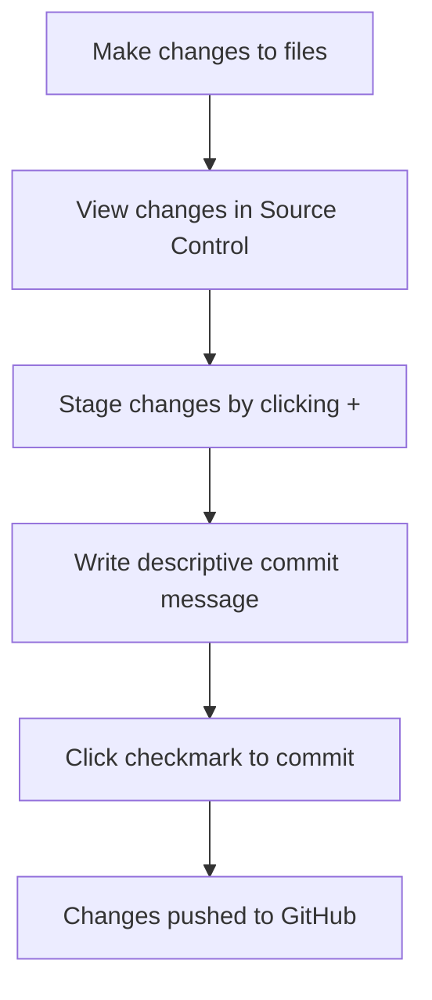

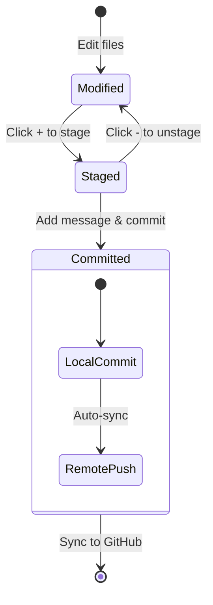

**הנה תהליך שלב אחר שלב:**
- לחצו על האייקון "+" ליד הקבצים שברצונכם לשמור (זה "מעלה" אותם)
- בדוק שוב שאתה מרוצה מכל השינויים שהכנת
- כתוב הערה קצרה שמסבירה מה עשית (זו "הודעת הקומיט" שלך)
- לחץ על כפתור סימן הביקורת כדי לשמור הכל ב-GitHub
- אם שינית את דעתך לגבי משהו, סמל הביטול מאפשר לך לבטל שינויים

**כתיבת הודעות קומיט טובות (זה קל יותר ממה שאתה חושב!):**
- פשוט תאר מה עשית, כמו "הוספת טופס יצירת קשר" או "תיקון ניווט שבור"
- שמור על זה קצר וקולע – תחשוב על אורך ציוץ, לא חיבור
- התחל עם מילים של פעולה כמו "הוסף", "תקן", "עדכן" או "הסר"
- **דוגמאות טובות**: "הוספת תפריט ניווט רספונסיבי", "תיקון בעיות עיצוב במובייל", "עדכון צבעים לשיפור נגישות"

> 💡 **טיפ ניווט מהיר**: השתמש בתפריט ההמבורגר (☰) בפינה השמאלית העליונה כדי לחזור למאגר GitHub שלך ולראות את השינויים שהתחייבת אליהם אונליין. זה כמו פורטל בין סביבת העריכה שלך לבית הפרויקט שלך ב-GitHub!

## שיפור פונקציונליות עם הרחבות

כמו שסדנת אומן מכילה כלים מיוחדים למשימות שונות, ניתן להתאים את VSCode.dev עם הרחבות שמוסיפות יכולות ספציפיות. תוספים שפותחו על ידי הקהילה עונים על צרכים נפוצים כמו עיצוב קוד, תצוגה חיה ושילוב Git משופר.

שוק ההרחבות מארח אלפי כלים חינמיים שנוצרו על ידי מפתחים מכל העולם. כל הרחבה פותרת אתגרים מסוימים בעבודה, ומאפשרת לך לבנות סביבת פיתוח מותאמת אישית לצרכים והעדפות שלך.

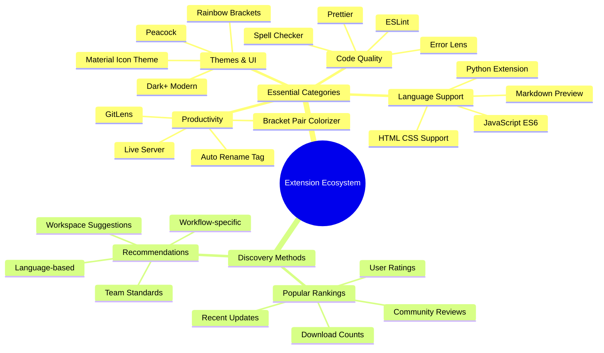

### מציאת ההרחבות המושלמות עבורך

שוק ההרחבות מאורגן היטב, כך שלא תלך לאיבוד בניסיון למצוא את מה שאתה צריך. הוא נועד לעזור לך לגלות גם כלים ספציפיים וגם דברים מגניבים שלא ידעת שקיימים!

**איך להגיע לשוק ההרחבות:**

1. לחץ על סמל ההרחבות (🧩) בסרגל הפעילות
2. חפש או עיין במשהו ספציפי
3. לחץ על כל דבר שנראה מעניין כדי ללמוד עליו יותר


**מה תראה שם:**

| קטגוריה | מה בפנים | למה זה מועיל |
|----------|---------|----------|
| **מותקן** | הרחבות שכבר הוספת | ערכת הכלים האישית שלך |
| **פופולרי** | המועדפים של הקהל | מה שרוב המפתחים נשבעים עליו |
| **מומלץ** | הצעות חכמות לפרויקט שלך | ההמלצות המועילות של VSCode.dev |

**מה הופך את העיון לקל:**
- כל הרחבה מציגה דירוגים, מספר הורדות וביקורות משתמשים אמיתיות
- תוכל לראות צילומי מסך ותיאורים ברורים של מה כל אחת עושה
- הכל מסומן בבירור עם מידע על תאימות
- מוצעות הרחבות דומות כדי שתוכל להשוות אפשרויות

### התקנת הרחבות (זה ממש קל!)

הוספת יכולות חדשות לעורך שלך פשוטה כמו לחיצה על כפתור. הרחבות מותקנות תוך שניות ומתחילות לעבוד מיד – בלי הפעלות מחדש, בלי המתנה.

**כך תעשה זאת:**

1. חפש את מה שאתה רוצה (נסה לחפש "live server" או "prettier")
2. לחץ על אחת שנראית טוב כדי לראות פרטים נוספים
3. קרא מה היא עושה ובדוק את הדירוגים
4. לחץ על כפתור "התקן" הכחול וזהו!


**מה קורה מאחורי הקלעים:**
- ההרחבה מורידה ומגדירה את עצמה אוטומטית
- תכונות חדשות מופיעות בממשק שלך מיד
- הכל מתחיל לעבוד מיד (באמת, זה כל כך מהיר!)
- אם אתה מחובר, ההרחבה מסתנכרנת לכל המכשירים שלך

**כמה הרחבות שאני ממליץ להתחיל איתן:**
- **Live Server**: ראה את האתר שלך מתעדכן בזמן אמת בזמן שאתה כותב קוד (זה קסום!)
- **Prettier**: גורם לקוד שלך להיראות נקי ומקצועי באופן אוטומטי
- **Auto Rename Tag**: שנה תג HTML אחד והשותף שלו מתעדכן גם כן
- **Bracket Pair Colorizer**: מקודד בצבעים את הסוגריים שלך כדי שלא תלך לאיבוד
- **GitLens**: משדרג את תכונות ה-Git שלך עם המון מידע מועיל

### התאמת ההרחבות שלך

רוב ההרחבות מגיעות עם הגדרות שתוכל להתאים כדי לגרום להן לעבוד בדיוק כמו שאתה אוהב. תחשוב על זה כמו לכוון את המושב והמראות ברכב – לכל אחד יש את ההעדפות שלו!

**התאמת הגדרות הרחבה:**

1. מצא את ההרחבה המותקנת שלך בלוח ההרחבות
2. חפש את סמל ההילוכים הקטן (⚙️) ליד שמה ולחץ עליו
3. בחר "הגדרות הרחבה" מהתפריט הנפתח
4. התאם דברים עד שהם מרגישים בדיוק נכון לעבודה שלך

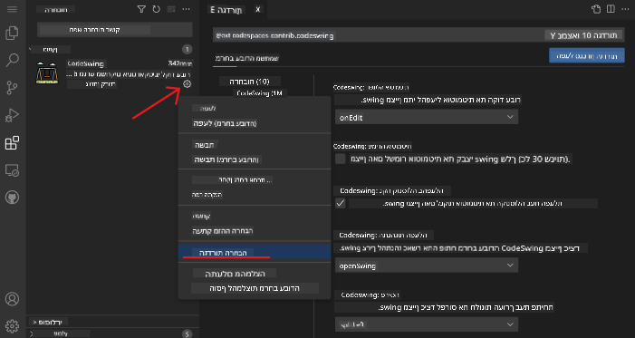

**דברים נפוצים שתרצה להתאים:**
- איך הקוד שלך מעוצב (טאבים מול רווחים, אורך שורה וכו')
- אילו קיצורי מקלדת מפעילים פעולות שונות
- אילו סוגי קבצים ההרחבה צריכה לעבוד איתם
- הפעלת או כיבוי תכונות ספציפיות כדי לשמור על ניקיון

### שמירה על ההרחבות שלך מאורגנות

כשתגלה עוד הרחבות מגניבות, תרצה לשמור על האוסף שלך מסודר ופועל בצורה חלקה. VSCode.dev הופך את זה לקל מאוד לניהול.

**אפשרויות ניהול ההרחבות שלך:**

| מה אפשר לעשות | מתי זה מועיל | טיפ מקצועי |
|--------|---------|----------|
| **השבתה** | לבדוק אם הרחבה גורמת לבעיות | עדיף מאשר להסיר אם אולי תרצה אותה שוב |
| **הסרה** | הסרה מוחלטת של הרחבות שאינך צריך | שומר על הסביבה שלך נקייה ומהירה |
| **עדכון** | קבלת התכונות האחרונות ותיקוני באגים | בדרך כלל קורה אוטומטית, אבל שווה לבדוק |

**איך אני אוהב לנהל הרחבות:**
- כל כמה חודשים אני בודק מה התקנתי ומסיר כל דבר שאני לא משתמש בו
- אני שומר על הרחבות מעודכנות כדי לקבל את השיפורים האחרונים ותיקוני האבטחה
- אם משהו נראה איטי, אני משבית זמנית הרחבות כדי לראות אם אחת מהן היא הגורם
- אני קורא את הערות העדכון כשיש עדכונים גדולים להרחבות – לפעמים יש תכונות חדשות מגניבות!

> ⚠️ **טיפ ביצועים**: הרחבות הן מדהימות, אבל יותר מדי מהן יכולות להאט את המערכת. התמקד באלו שבאמת מקלות על החיים שלך ואל תפחד להסיר את אלו שאתה לא משתמש בהן.

### 🎯 בדיקה פדגוגית: התאמת סביבת פיתוח

**הבנת ארכיטקטורה**: למדת להתאים סביבת פיתוח מקצועית באמצעות הרחבות שנוצרו על ידי הקהילה. זה משקף איך צוותי פיתוח ארגוניים בונים שרשראות כלים סטנדרטיות.

**מושגים מרכזיים שנלמדו**:
- **גילוי הרחבות**: מציאת כלים שפותרים אתגרים ספציפיים בפיתוח
- **הגדרת סביבה**: התאמת כלים להעדפות אישיות או צוותיות
- **אופטימיזציית ביצועים**: איזון בין פונקציונליות לביצועי מערכת
- **שיתוף פעולה קהילתי**: ניצול כלים שנוצרו על ידי קהילת המפתחים העולמית

**חיבור לתעשייה**: מערכות הרחבות מניעות פלטפורמות פיתוח מרכזיות כמו VS Code, Chrome DevTools ו-IDEs מודרניים. הבנת איך להעריך, להתקין ולהגדיר הרחבות חיונית לעבודה מקצועית בפיתוח.

**שאלת רפלקציה**: איך היית ניגש להקמת סביבת פיתוח סטנדרטית לצוות של 10 מפתחים? שקול עקביות, ביצועים והעדפות אישיות.

## 📈 ציר הזמן לשליטה בפיתוח בענן

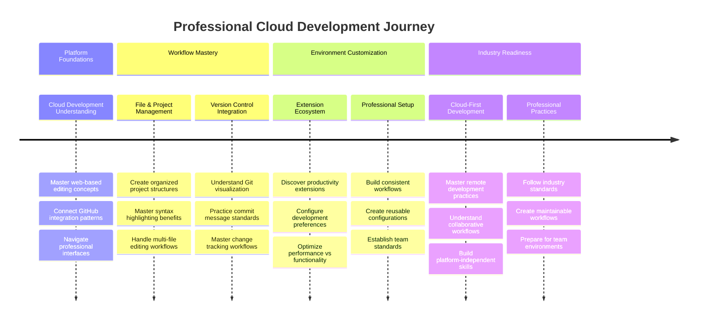

**🎓 אבן דרך סיום**: שלטת בפיתוח מבוסס ענן באמצעות אותם כלים ותהליכי עבודה בהם משתמשים מפתחים מקצועיים בחברות טכנולוגיה גדולות. מיומנויות אלו מייצגות את עתיד הפיתוח התוכנה.

**🔄 יכולות ברמה הבאה**:
- מוכן לחקור פלטפורמות פיתוח מתקדמות בענן (Codespaces, GitPod)
- מוכן לעבוד בצוותי פיתוח מבוזרים
- מצויד לתרום לפרויקטים בקוד פתוח ברחבי העולם
- בסיס מוכן לפרקטיקות DevOps מודרניות ואינטגרציה מתמשכת

## אתגר סוכן GitHub Copilot 🚀

כמו הגישה המובנית של נאס"א למשימות חלל, אתגר זה כולל יישום שיטתי של מיומנויות VSCode.dev בתרחיש זרימת עבודה מלא.

**מטרה:** להדגים מיומנות עם VSCode.dev על ידי הקמת זרימת עבודה מלאה לפיתוח אתרים.

**דרישות הפרויקט:** באמצעות מצב סוכן, השלם את המשימות הבאות:
1. בצע Fork למאגר קיים או צור חדש
2. הקם מבנה פרויקט פונקציונלי עם קבצי HTML, CSS ו-JavaScript
3. התקן והגדר שלוש הרחבות שמשפרות את הפיתוח
4. תרגל בקרת גרסאות עם הודעות קומיט תיאוריות
5. נסה יצירה ושינוי של ענפי פיצ'רים
6. תעד את התהליך והלמידות בקובץ README.md

תרגיל זה מאחד את כל מושגי VSCode.dev לזרימת עבודה מעשית שניתן ליישם בפרויקטי פיתוח עתידיים.

למידע נוסף על [מצב סוכן](https://code.visualstudio.com/blogs/2025/02/24/introducing-copilot-agent-mode) כאן.

## משימה

הגיע הזמן לקחת את המיומנויות האלה לנסיעת מבחן אמיתית! יש לי פרויקט מעשי שיאפשר לך לתרגל את כל מה שכיסינו: [צור אתר קורות חיים באמצעות VSCode.dev](./assignment.md)

משימה זו מדריכה אותך בבניית אתר קורות חיים מקצועי כולו בדפדפן שלך. תשתמש בכל תכונות VSCode.dev שחקרנו, ובסוף, יהיה לך גם אתר שנראה נהדר וגם ביטחון מוצק בזרימת העבודה החדשה שלך.

## המשך לחקור ולפתח את המיומנויות שלך

יש לך בסיס מוצק עכשיו, אבל יש עוד הרבה דברים מגניבים לגלות! הנה כמה משאבים ורעיונות לקחת את מיומנויות VSCode.dev שלך לשלב הבא:

**מסמכים רשמיים שכדאי לשמור במועדפים:**
- [תיעוד VSCode Web](https://code.visualstudio.com/docs/editor/vscode-web?WT.mc_id=academic-0000-alfredodeza) – המדריך המלא לעריכה מבוססת דפדפן
- [GitHub Codespaces](https://docs.github.com/en/codespaces) – כשאתה רוצה עוד יותר כוח בענן

**תכונות מגניבות להתנסות בהן בהמשך:**
- **קיצורי מקלדת**: למד את הקומבינציות שיגרמו לך להרגיש כמו נינג'ה בקוד
- **הגדרות סביבת עבודה**: הקם סביבות שונות לסוגי פרויקטים שונים
- **סביבות עבודה מרובות שורשים**: עבד על מספר מאגרים בו זמנית (ממש שימושי!)
- **שילוב טרמינל**: גש לכלי שורת הפקודה ישירות בדפדפן שלך

**רעיונות לתרגול:**
- הצטרף לכמה פרויקטים בקוד פתוח ותרום באמצעות VSCode.dev – זו דרך נהדרת להחזיר!
- נסה הרחבות שונות כדי למצוא את ההגדרה המושלמת עבורך
- צור תבניות פרויקטים לסוגי האתרים שאתה בונה הכי הרבה
- תרגל זרימות עבודה של Git כמו יצירת ענפים ומיזוג – מיומנויות אלו הן זהב בפרויקטים צוותיים

---

**שלטת בפיתוח מבוסס דפדפן!** 🎉 כמו איך שהמצאת מכשירים ניידים אפשרה למדענים לבצע מחקר במקומות מרוחקים, VSCode.dev מאפשר קידוד מקצועי מכל מכשיר שמחובר לאינטרנט.

מיומנויות אלו משקפות את שיטות העבודה הנוכחיות בתעשייה – מפתחים מקצועיים רבים משתמשים בסביבות פיתוח מבוססות ענן בזכות הגמישות והנגישות שלהן. למדת זרימת עבודה שמתרחבת מפרויקטים אישיים לשיתופי פעולה צוותיים גדולים.

השתמש בטכניקות אלו בפרויקט הפיתוח הבא שלך! 🚀

---

**הצהרת אחריות**:  
מסמך זה תורגם באמצעות שירות תרגום מבוסס AI [Co-op Translator](https://github.com/Azure/co-op-translator). למרות שאנו שואפים לדיוק, יש לקחת בחשבון שתרגומים אוטומטיים עשויים להכיל שגיאות או אי דיוקים. המסמך המקורי בשפתו המקורית צריך להיחשב כמקור סמכותי. למידע קריטי, מומלץ להשתמש בתרגום מקצועי אנושי. אנו לא נושאים באחריות לאי הבנות או לפרשנויות שגויות הנובעות משימוש בתרגום זה.