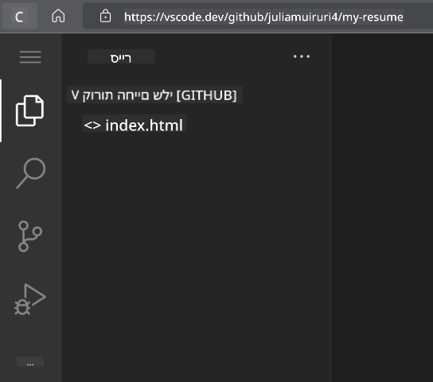
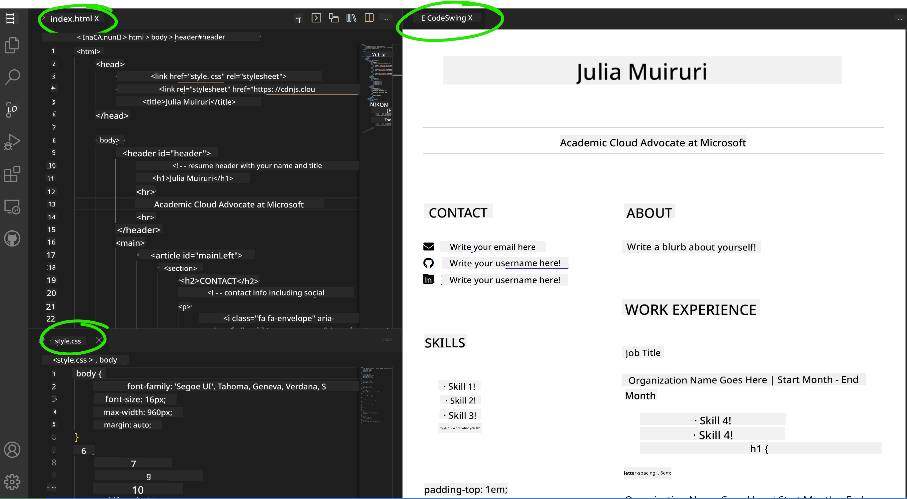

<!--
CO_OP_TRANSLATOR_METADATA:
{
  "original_hash": "bd3aa6d2b879c30ea496c43aec1c49ed",
  "translation_date": "2025-08-29T01:19:56+00:00",
  "source_file": "8-code-editor/1-using-a-code-editor/assignment.md",
  "language_code": "he"
}
-->
# יצירת אתר קורות חיים באמצעות vscode.dev

_כמה מגניב זה יהיה אם מגייס יבקש ממך את קורות החיים שלך ואתה תשלח לו קישור?_ 😎

## מטרות

לאחר המשימה הזו, תלמדו כיצד:

- ליצור אתר להצגת קורות החיים שלכם

### דרישות מקדימות

1. חשבון GitHub. היכנסו ל-[GitHub](https://github.com/) וצרו חשבון אם עדיין אין לכם.

## שלבים

**שלב 1:** צרו מאגר חדש ב-GitHub ותנו לו את השם `my-resume`

**שלב 2:** צרו קובץ בשם `index.html` במאגר שלכם. נוסיף לפחות קובץ אחד בזמן שאנחנו עדיין ב-github.com, מכיוון שלא ניתן לפתוח מאגר ריק ב-vscode.dev.

לחצו על הקישור `creating a new file`, הקלידו את השם `index.html` ובחרו בכפתור `Commit new file`.


**שלב 3:** פתחו את [VSCode.dev](https://vscode.dev) ובחרו בכפתור `Open Remote Repository`.

העתיקו את כתובת ה-URL של המאגר שיצרתם עבור אתר קורות החיים שלכם והדביקו אותה בתיבת הקלט:

_החליפו `your-username` בשם המשתמש שלכם ב-GitHub_

```
https://github.com/your-username/my-resume
```

✅ אם הפעולה הצליחה, תראו את הפרויקט שלכם ואת הקובץ index.html פתוחים בעורך הטקסט בדפדפן.



**שלב 4:** פתחו את הקובץ `index.html`, הדביקו את הקוד הבא באזור הקוד ושמרו:

<details>
    <summary><b>קוד HTML שאחראי על התוכן באתר קורות החיים שלכם.</b></summary>
    
        <html>

            <head>
                <link href="style.css" rel="stylesheet">
                <link rel="stylesheet" href="https://cdnjs.cloudflare.com/ajax/libs/font-awesome/5.15.4/css/all.min.css">
                <title>השם שלך כאן!</title>
            </head>
            <body>
                <header id="header">
                    <!-- כותרת קורות חיים עם השם והתפקיד שלך -->
                    <h1>השם שלך כאן!</h1>
                    <hr>
                    התפקיד שלך!
                    <hr>
                </header>
                <main>
                    <article id="mainLeft">
                        <section>
                            <h2>יצירת קשר</h2>
                            <!-- פרטי יצירת קשר כולל רשתות חברתיות -->
                            <p>
                                <i class="fa fa-envelope" aria-hidden="true"></i>
                                <a href="mailto:username@domain.top-level domain">כתוב כאן את האימייל שלך</a>
                            </p>
                            <p>
                                <i class="fab fa-github" aria-hidden="true"></i>
                                <a href="github.com/yourGitHubUsername">כתוב כאן את שם המשתמש שלך!</a>
                            </p>
                            <p>
                                <i class="fab fa-linkedin" aria-hidden="true"></i>
                                <a href="linkedin.com/yourLinkedInUsername">כתוב כאן את שם המשתמש שלך!</a>
                            </p>
                        </section>
                        <section>
                            <h2>כישורים</h2>
                            <!-- הכישורים שלך -->
                            <ul>
                                <li>כישור 1!</li>
                                <li>כישור 2!</li>
                                <li>כישור 3!</li>
                                <li>כישור 4!</li>
                            </ul>
                        </section>
                        <section>
                            <h2>השכלה</h2>
                            <!-- ההשכלה שלך -->
                            <h3>כתוב כאן את הקורס שלך!</h3>
                            <p>
                                כתוב כאן את המוסד שלך!
                            </p>
                            <p>
                                תאריך התחלה - תאריך סיום
                            </p>
                        </section>            
                    </article>
                    <article id="mainRight">
                        <section>
                            <h2>אודות</h2>
                            <!-- אודותיך -->
                            <p>כתוב כאן כמה מילים על עצמך!</p>
                        </section>
                        <section>
                            <h2>ניסיון תעסוקתי</h2>
                            <!-- הניסיון התעסוקתי שלך -->
                            <h3>תפקיד</h3>
                            <p>
                                שם הארגון כאן | חודש התחלה – חודש סיום
                            </p>
                            <ul>
                                    <li>משימה 1 - כתוב מה עשית!</li>
                                    <li>משימה 2 - כתוב מה עשית!</li>
                                    <li>כתוב את התוצאות/ההשפעה של התרומה שלך</li>
                                    
                            </ul>
                            <h3>תפקיד 2</h3>
                            <p>
                                שם הארגון כאן | חודש התחלה – חודש סיום
                            </p>
                            <ul>
                                    <li>משימה 1 - כתוב מה עשית!</li>
                                    <li>משימה 2 - כתוב מה עשית!</li>
                                    <li>כתוב את התוצאות/ההשפעה של התרומה שלך</li>
                                    
                            </ul>
                        </section>
                    </article>
                </main>
            </body>
        </html>
</details>

הוסיפו את פרטי קורות החיים שלכם במקום הטקסט הזמני בקוד ה-HTML.

**שלב 5:** רחפו מעל תיקיית My-Resume, לחצו על סמל `New File ...` וצרו שני קבצים חדשים בפרויקט שלכם: `style.css` ו-`codeswing.json`.

**שלב 6:** פתחו את הקובץ `style.css`, הדביקו את הקוד הבא ושמרו:

<details>
        <summary><b>קוד CSS לעיצוב פריסת האתר.</b></summary>
            
            body {
                font-family: 'Segoe UI', Tahoma, Geneva, Verdana, sans-serif;
                font-size: 16px;
                max-width: 960px;
                margin: auto;
            }
            h1 {
                font-size: 3em;
                letter-spacing: .6em;
                padding-top: 1em;
                padding-bottom: 1em;
            }

            h2 {
                font-size: 1.5em;
                padding-bottom: 1em;
            }

            h3 {
                font-size: 1em;
                padding-bottom: 1em;
            }
            main { 
                display: grid;
                grid-template-columns: 40% 60%;
                margin-top: 3em;
            }
            header {
                text-align: center;
                margin: auto 2em;
            }

            section {
                margin: auto 1em 4em 2em;
            }

            i {
                margin-right: .5em;
            }

            p {
                margin: .2em auto
            }

            hr {
                border: none;
                background-color: lightgray;
                height: 1px;
            }

            h1, h2, h3 {
                font-weight: 100;
                margin-bottom: 0;
            }
            #mainLeft {
                border-right: 1px solid lightgray;
            }
            
</details>

**שלב 6:** פתחו את הקובץ `codeswing.json`, הדביקו את הקוד הבא ושמרו:

    {
    "scripts": [],
    "styles": []
    }

**שלב 7:** התקינו את התוסף `Codeswing` כדי לצפות באתר קורות החיים באזור הקוד.

לחצו על סמל _`Extensions`_ בסרגל הפעילות והקלידו Codeswing. לחצו על כפתור ההתקנה הכחול בסרגל הפעילות המורחב או השתמשו בכפתור ההתקנה שמופיע באזור הקוד לאחר בחירת התוסף. מיד לאחר ההתקנה, שימו לב לשינויים בפרויקט שלכם 😃.


זה מה שתראו על המסך שלכם לאחר התקנת התוסף.



אם אתם מרוצים מהשינויים שביצעתם, רחפו מעל תיקיית `Changes` ולחצו על כפתור `+` כדי להעלות את השינויים.

הקלידו הודעת commit _(תיאור של השינוי שביצעתם בפרויקט)_ ובצעו commit על ידי לחיצה על `check`. לאחר שסיימתם לעבוד על הפרויקט, בחרו בסמל תפריט ההמבורגר בפינה השמאלית העליונה כדי לחזור למאגר ב-GitHub.

מזל טוב 🎉 זה עתה יצרתם אתר קורות חיים באמצעות vscode.dev בכמה שלבים פשוטים.

## 🚀 אתגר

פתחו מאגר מרוחק שיש לכם הרשאות לבצע בו שינויים ועדכנו כמה קבצים. לאחר מכן, נסו ליצור ענף חדש עם השינויים שלכם ובצעו Pull Request.

## סקירה ולמידה עצמית

קראו עוד על [VSCode.dev](https://code.visualstudio.com/docs/editor/vscode-web?WT.mc_id=academic-0000-alfredodeza) ועל כמה מהתכונות הנוספות שלו.

---

**כתב ויתור**:  
מסמך זה תורגם באמצעות שירות תרגום מבוסס בינה מלאכותית [Co-op Translator](https://github.com/Azure/co-op-translator). בעוד שאנו שואפים לדיוק, יש לקחת בחשבון שתרגומים אוטומטיים עשויים להכיל שגיאות או אי-דיוקים. המסמך המקורי בשפתו המקורית נחשב למקור הסמכותי. למידע קריטי, מומלץ להשתמש בתרגום מקצועי על ידי מתרגם אנושי. איננו נושאים באחריות לכל אי-הבנה או פרשנות שגויה הנובעת משימוש בתרגום זה.