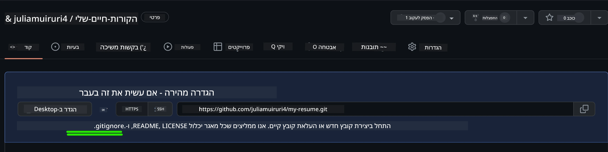
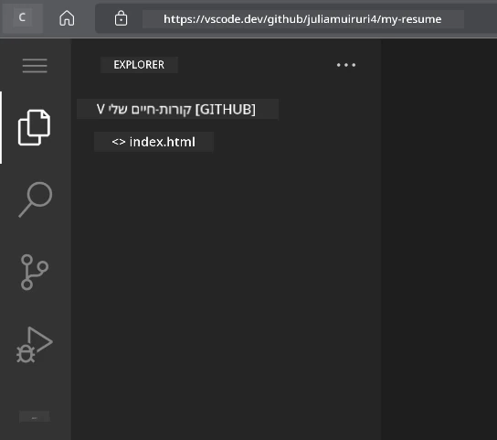
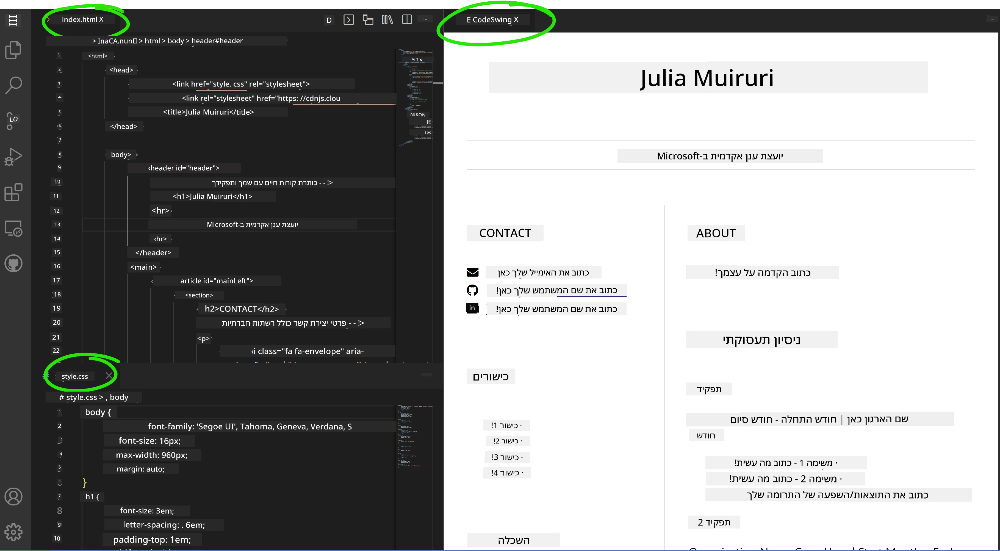

# צור אתר קורות חיים באמצעות VSCode.dev

שפר את סיכויי הקריירה שלך על ידי בניית אתר קורות חיים מקצועי המציג את הכישורים והניסיון שלך בפורמט אינטראקטיבי ומודרני. במקום לשלוח קובצי PDF מסורתיים, דמיין שאתה מספק למגייסים אתר אינטרנט אלגנטי ורספונסיבי שמדגים גם את הכישורים שלך וגם את יכולות הפיתוח שלך.

משימה מעשית זו תאפשר לך ליישם את כל הכישורים שלמדת ב-VSCode.dev תוך כדי יצירת משהו שימושי באמת לקריירה שלך. תתנסה בתהליך העבודה המלא של פיתוח אתרים – החל מיצירת מאגר ועד לפריסה – הכל בתוך הדפדפן שלך.

בסיום הפרויקט, יהיה לך נוכחות מקצועית אונליין שניתן לשתף בקלות עם מעסיקים פוטנציאליים, לעדכן ככל שהכישורים שלך מתפתחים, ולהתאים אותה למותג האישי שלך. זהו בדיוק סוג הפרויקט המעשי שמדגים כישורי פיתוח אתרים בעולם האמיתי.

## מטרות למידה

לאחר שתשלים את המשימה, תוכל:

- **ליצור** ולנהל פרויקט פיתוח אתרים מלא באמצעות VSCode.dev
- **לבנות** אתר מקצועי באמצעות אלמנטים סמנטיים של HTML
- **לעצב** פריסות רספונסיביות עם טכניקות CSS מודרניות
- **ליישם** תכונות אינטראקטיביות באמצעות טכנולוגיות אינטרנט בסיסיות
- **לפרוס** אתר חי שניתן לגשת אליו באמצעות כתובת URL שניתן לשתף
- **להדגים** את שיטות העבודה הטובות ביותר של בקרת גרסאות לאורך תהליך הפיתוח

## דרישות מוקדמות

לפני שתתחיל במשימה זו, ודא שיש לך:

- חשבון GitHub (צור אחד ב-[github.com](https://github.com/) אם צריך)
- סיום השיעור של VSCode.dev המכסה ניווט בממשק ותפעול בסיסי
- הבנה בסיסית של מבנה HTML וקונספטים של עיצוב CSS

## הגדרת הפרויקט ויצירת מאגר

נתחיל בהקמת הבסיס לפרויקט שלך. תהליך זה משקף את תהליכי העבודה האמיתיים בפיתוח, שבהם פרויקטים מתחילים עם ייזום מאגר ותכנון מבנה נכון.

### שלב 1: צור את מאגר GitHub שלך

הגדרת מאגר ייעודי מבטיחה שהפרויקט שלך יהיה מאורגן ומבוקר גרסאות מההתחלה.

1. **גש** ל-[GitHub.com](https://github.com) והתחבר לחשבונך
2. **לחץ** על הכפתור הירוק "New" או על סמל "+" בפינה הימנית העליונה
3. **תן שם** למאגר שלך `my-resume` (או בחר שם אישי כמו `john-smith-resume`)
4. **הוסף** תיאור קצר: "אתר קורות חיים מקצועי שנבנה עם HTML ו-CSS"
5. **בחר** "Public" כדי שהקורות חיים שלך יהיו נגישים למעסיקים פוטנציאליים
6. **סמן** "Add a README file" כדי ליצור תיאור פרויקט ראשוני
7. **לחץ** "Create repository" כדי לסיים את ההגדרה

> 💡 **טיפ לשמות מאגר**: השתמש בשמות תיאוריים ומקצועיים שמבהירים את מטרת הפרויקט. זה עוזר כשמשתפים עם מעסיקים או במהלך סקירות תיק עבודות.

### שלב 2: ייזום מבנה הפרויקט

מכיוון ש-VSCode.dev דורש לפחות קובץ אחד כדי לפתוח מאגר, ניצור את קובץ ה-HTML הראשי שלנו ישירות ב-GitHub לפני שנעבור לעורך האינטרנט.

1. **לחץ** על הקישור "creating a new file" במאגר החדש שלך
2. **הקלד** `index.html` כשם הקובץ
3. **הוסף** את מבנה ה-HTML הראשוני הזה:

```html
<!DOCTYPE html>
<html lang="en">
<head>
    <meta charset="UTF-8">
    <meta name="viewport" content="width=device-width, initial-scale=1.0">
    <title>Your Name - Professional Resume</title>
</head>
<body>
    <h1>Your Name</h1>
    <p>Professional Resume Website</p>
</body>
</html>
```

4. **כתוב** הודעת commit: "Add initial HTML structure"
5. **לחץ** "Commit new file" כדי לשמור את השינויים שלך



**הנה מה שההגדרה הראשונית הזו משיגה:**
- **מבססת** מבנה מסמך HTML5 נכון עם אלמנטים סמנטיים
- **כוללת** תג מטה של viewport לתאימות עיצוב רספונסיבי
- **מגדירה** כותרת עמוד תיאורית שמופיעה בלשוניות הדפדפן
- **יוצרת** את הבסיס לארגון תוכן מקצועי

## עבודה ב-VSCode.dev

עכשיו כשהבסיס למאגר שלך הוקם, נעבור ל-VSCode.dev לעבודה העיקרית על הפיתוח. עורך מבוסס אינטרנט זה מספק את כל הכלים הדרושים לפיתוח אתרים מקצועי.

### שלב 3: פתח את הפרויקט שלך ב-VSCode.dev

1. **גש** ל-[vscode.dev](https://vscode.dev) בלשונית דפדפן חדשה
2. **לחץ** על "Open Remote Repository" במסך הפתיחה
3. **העתק** את כתובת ה-URL של המאגר שלך מ-GitHub והדבק אותה בשדה הקלט

   פורמט: `https://github.com/your-username/my-resume`
   
   *החלף את `your-username` בשם המשתמש האמיתי שלך ב-GitHub*

4. **לחץ** Enter כדי לטעון את הפרויקט שלך

✅ **אינדיקטור הצלחה**: אתה אמור לראות את קבצי הפרויקט שלך בסרגל הצד של Explorer ואת `index.html` זמין לעריכה באזור העורך הראשי.



**מה שתראה בממשק:**
- **סרגל הצד של Explorer**: **מציג** את קבצי המאגר שלך ומבנה התיקיות
- **אזור העורך**: **מציג** את תוכן הקבצים שנבחרו לעריכה
- **סרגל הפעילות**: **מספק** גישה לתכונות כמו בקרת מקור ותוספים
- **סרגל המצב**: **מציין** את מצב החיבור ומידע על הענף הנוכחי

### שלב 4: בנה את תוכן הקורות חיים שלך

החלף את תוכן הדוגמה ב-`index.html` במבנה קורות חיים מקיף. HTML זה מספק את הבסיס להצגת מקצועית של הכישורים שלך.

<details>
<summary><b>מבנה קורות חיים מלא ב-HTML</b></summary>

```html
<!DOCTYPE html>
<html lang="en">
<head>
    <meta charset="UTF-8">
    <meta name="viewport" content="width=device-width, initial-scale=1.0">
    <link href="style.css" rel="stylesheet">
    <link rel="stylesheet" href="https://cdnjs.cloudflare.com/ajax/libs/font-awesome/5.15.4/css/all.min.css">
    <title>Your Name - Professional Resume</title>
</head>
<body>
    <header id="header">
        <h1>Your Full Name</h1>
        <hr>
        <p class="role">Your Professional Title</p>
        <hr>
    </header>
    
    <main>
        <article id="mainLeft">
            <section>
                <h2>CONTACT</h2>
                <p>
                    <i class="fa fa-envelope" aria-hidden="true"></i>
                    <a href="mailto:your.email@domain.com">your.email@domain.com</a>
                </p>
                <p>
                    <i class="fab fa-github" aria-hidden="true"></i>
                    <a href="https://github.com/your-username">github.com/your-username</a>
                </p>
                <p>
                    <i class="fab fa-linkedin" aria-hidden="true"></i>
                    <a href="https://linkedin.com/in/your-profile">linkedin.com/in/your-profile</a>
                </p>
            </section>
            
            <section>
                <h2>SKILLS</h2>
                <ul>
                    <li>HTML5 & CSS3</li>
                    <li>JavaScript (ES6+)</li>
                    <li>Responsive Web Design</li>
                    <li>Version Control (Git)</li>
                    <li>Problem Solving</li>
                </ul>
            </section>
            
            <section>
                <h2>EDUCATION</h2>
                <h3>Your Degree or Certification</h3>
                <p>Institution Name</p>
                <p>Start Date - End Date</p>
            </section>
        </article>
        
        <article id="mainRight">
            <section>
                <h2>ABOUT</h2>
                <p>Write a compelling summary that highlights your passion for web development, key achievements, and career goals. This section should give employers insight into your personality and professional approach.</p>
            </section>
            
            <section>
                <h2>WORK EXPERIENCE</h2>
                <div class="job">
                    <h3>Job Title</h3>
                    <p class="company">Company Name | Start Date – End Date</p>
                    <ul>
                        <li>Describe a key accomplishment or responsibility</li>
                        <li>Highlight specific skills or technologies used</li>
                        <li>Quantify impact where possible (e.g., "Improved efficiency by 25%")</li>
                    </ul>
                </div>
                
                <div class="job">
                    <h3>Previous Job Title</h3>
                    <p class="company">Previous Company | Start Date – End Date</p>
                    <ul>
                        <li>Focus on transferable skills and achievements</li>
                        <li>Demonstrate growth and learning progression</li>
                        <li>Include any leadership or collaboration experiences</li>
                    </ul>
                </div>
            </section>
            
            <section>
                <h2>PROJECTS</h2>
                <div class="project">
                    <h3>Project Name</h3>
                    <p>Brief description of what the project accomplishes and technologies used.</p>
                    <a href="#" target="_blank">View Project</a>
                </div>
            </section>
        </article>
    </main>
</body>
</html>
```
</details>

**הנחיות להתאמה אישית:**
- **החלף** את כל טקסט הדוגמה במידע האמיתי שלך
- **התאם** את הסעיפים בהתאם לרמת הניסיון שלך ולמיקוד הקריירה
- **הוסף** או הסר סעיפים לפי הצורך (לדוגמה, תעודות, עבודה התנדבותית, שפות)
- **כלול** קישורים לפרופילים ולפרויקטים האמיתיים שלך

### שלב 5: צור קבצים תומכים

אתרים מקצועיים דורשים מבני קבצים מאורגנים. צור את גיליון הסגנונות של CSS ואת קבצי הקונפיגורציה הדרושים לפרויקט שלם.

1. **העבר את העכבר** מעל שם תיקיית הפרויקט שלך בסרגל הצד של Explorer
2. **לחץ** על סמל "New File" (📄+) שמופיע
3. **צור** את הקבצים הבאים אחד אחד:
   - `style.css` (לעיצוב ופריסה)
   - `codeswing.json` (לקונפיגורציה של תוסף התצוגה המקדימה)

**יצירת קובץ ה-CSS (`style.css`):**

<details>
<summary><b>עיצוב CSS מקצועי</b></summary>

```css
/* Modern Resume Styling */
body {
    font-family: 'Segoe UI', Tahoma, Geneva, Verdana, sans-serif;
    font-size: 16px;
    line-height: 1.6;
    max-width: 960px;
    margin: 0 auto;
    padding: 20px;
    color: #333;
    background-color: #f9f9f9;
}

/* Header Styling */
header {
    text-align: center;
    margin-bottom: 3em;
    padding: 2em;
    background: linear-gradient(135deg, #667eea 0%, #764ba2 100%);
    color: white;
    border-radius: 10px;
    box-shadow: 0 4px 6px rgba(0, 0, 0, 0.1);
}

h1 {
    font-size: 3em;
    letter-spacing: 0.1em;
    margin-bottom: 0.2em;
    font-weight: 300;
}

.role {
    font-size: 1.3em;
    font-weight: 300;
    margin: 1em 0;
}

/* Main Content Layout */
main {
    display: grid;
    grid-template-columns: 35% 65%;
    gap: 3em;
    margin-top: 3em;
    background: white;
    padding: 2em;
    border-radius: 10px;
    box-shadow: 0 2px 10px rgba(0, 0, 0, 0.1);
}

/* Typography */
h2 {
    font-size: 1.4em;
    font-weight: 600;
    margin-bottom: 1em;
    color: #667eea;
    border-bottom: 2px solid #667eea;
    padding-bottom: 0.3em;
}

h3 {
    font-size: 1.1em;
    font-weight: 600;
    margin-bottom: 0.5em;
    color: #444;
}

/* Section Styling */
section {
    margin-bottom: 2.5em;
}

#mainLeft {
    border-right: 1px solid #e0e0e0;
    padding-right: 2em;
}

/* Contact Links */
section a {
    color: #667eea;
    text-decoration: none;
    transition: color 0.3s ease;
}

section a:hover {
    color: #764ba2;
    text-decoration: underline;
}

/* Icons */
i {
    margin-right: 0.8em;
    width: 20px;
    text-align: center;
    color: #667eea;
}

/* Lists */
ul {
    list-style: none;
    padding-left: 0;
}

li {
    margin: 0.5em 0;
    padding: 0.3em 0;
    position: relative;
}

li:before {
    content: "▸";
    color: #667eea;
    margin-right: 0.5em;
}

/* Work Experience */
.job, .project {
    margin-bottom: 2em;
    padding-bottom: 1.5em;
    border-bottom: 1px solid #f0f0f0;
}

.company {
    font-style: italic;
    color: #666;
    margin-bottom: 0.5em;
}

/* Responsive Design */
@media (max-width: 768px) {
    main {
        grid-template-columns: 1fr;
        gap: 2em;
    }
    
    #mainLeft {
        border-right: none;
        border-bottom: 1px solid #e0e0e0;
        padding-right: 0;
        padding-bottom: 2em;
    }
    
    h1 {
        font-size: 2.2em;
    }
    
    body {
        padding: 10px;
    }
}

/* Print Styles */
@media print {
    body {
        background: white;
        color: black;
        font-size: 12pt;
    }
    
    header {
        background: none;
        color: black;
        box-shadow: none;
    }
    
    main {
        box-shadow: none;
    }
}
```
</details>

**יצירת קובץ הקונפיגורציה (`codeswing.json`):**

```json
{
    "scripts": [],
    "styles": []
}
```

**הבנת תכונות ה-CSS:**
- **שימוש** ב-CSS Grid למבנה פריסה רספונסיבי ומקצועי
- **יישום** סכמות צבע מודרניות עם כותרות גרדיאנט
- **הוספת** אפקטים של ריחוף ומעברים חלקים לאינטראקטיביות
- **מתן** עיצוב רספונסיבי שמתאים לכל גדלי המכשירים
- **הוספת** סגנונות ידידותיים להדפסה ליצירת קובצי PDF

### שלב 6: התקן והגדר תוספים

תוספים משפרים את חוויית הפיתוח שלך על ידי מתן יכולות תצוגה מקדימה חיה וכלי עבודה משופרים. תוסף CodeSwing שימושי במיוחד לפרויקטים של פיתוח אתרים.

**התקנת תוסף CodeSwing:**

1. **לחץ** על סמל התוספים (🧩) בסרגל הפעילות
2. **חפש** "CodeSwing" בתיבת החיפוש של השוק
3. **בחר** את תוסף CodeSwing מתוצאות החיפוש
4. **לחץ** על כפתור "Install" הכחול


**מה CodeSwing מספק:**
- **מאפשר** תצוגה מקדימה חיה של האתר שלך בזמן העריכה
- **מציג** שינויים בזמן אמת ללא צורך ברענון ידני
- **תומך** בסוגי קבצים שונים כולל HTML, CSS ו-JavaScript
- **מספק** חוויית סביבת פיתוח משולבת

**תוצאות מיידיות לאחר ההתקנה:**
לאחר התקנת CodeSwing, תראה תצוגה מקדימה חיה של אתר הקורות חיים שלך מופיעה בעורך. זה מאפשר לך לראות בדיוק איך האתר שלך נראה בזמן שאתה מבצע שינויים.



**הבנת הממשק המשופר:**
- **תצוגה מפוצלת**: **מציגה** את הקוד שלך בצד אחד ואת התצוגה המקדימה בצד השני
- **עדכונים בזמן אמת**: **משקפת** שינויים מיד כשאתה מקליד
- **תצוגה מקדימה אינטראקטיבית**: **מאפשרת** לך לבדוק קישורים ואינטראקציות
- **סימולציה לנייד**: **מספקת** יכולות בדיקת עיצוב רספונסיבי

### שלב 7: בקרת גרסאות ופרסום

עכשיו כשהאתר שלך מוכן, השתמש ב-Git כדי לשמור את העבודה שלך ולהפוך אותה לזמינה אונליין.

**ביצוע commit לשינויים שלך:**

1. **לחץ** על סמל בקרת המקור (🌿) בסרגל הפעילות
2. **סקור** את כל הקבצים שיצרת ושינית בסעיף "Changes"
3. **שלב** את השינויים שלך על ידי לחיצה על סמל "+" ליד כל קובץ
4. **כתוב** הודעת commit תיאורית, כמו:
   - "Add complete resume website with responsive design"
   - "Implement professional styling and content structure"
5. **לחץ** על סימן ה-checkmark (✓) כדי לבצע ולדחוף את השינויים שלך

**דוגמאות להודעות commit אפקטיביות:**
- "Add professional resume content and styling"
- "Implement responsive design for mobile compatibility"
- "Update contact information and project links"

> 💡 **טיפ מקצועי**: הודעות commit טובות עוזרות לעקוב אחר התפתחות הפרויקט שלך ומדגימות תשומת לב לפרטים – תכונות שמעסיקים מעריכים.

**גישה לאתר שפורסם:**
לאחר ביצוע commit, תוכל לחזור למאגר GitHub שלך באמצעות תפריט ההמבורגר (☰) בפינה השמאלית העליונה. אתר הקורות חיים שלך עכשיו מבוקר גרסאות ומוכן לפריסה או לשיתוף.

## תוצאות והשלבים הבאים

**מזל טוב! 🎉** יצרת בהצלחה אתר קורות חיים מקצועי באמצעות VSCode.dev. הפרויקט שלך מדגים:
**כישורים טכניים שהודגמו:**
- **ניהול מאגר**: יצירת מבנה פרויקט מלא ומאורגן
- **פיתוח אתרים**: בניית אתר רספונסיבי באמצעות HTML5 ו-CSS3 מודרניים
- **בקרת גרסאות**: יישום תהליך עבודה נכון עם Git והודעות commit משמעותיות
- **שליטה בכלים**: שימוש יעיל בממשק ובמערכת התוספים של VSCode.dev

**תוצאות מקצועיות שהושגו:**
- **נוכחות אונליין**: כתובת URL שניתן לשתף המציגה את הכישורים שלך
- **פורמט מודרני**: אלטרנטיבה אינטראקטיבית לקורות חיים מסורתיים בפורמט PDF
- **כישורים מדגימים**: הוכחה מוחשית ליכולות הפיתוח שלך
- **עדכונים קלים**: בסיס שתוכל לשפר ולהתאים באופן מתמיד

### אפשרויות פריסה

כדי להפוך את הקורות חיים שלך לנגישים למעסיקים, שקול את אפשרויות האירוח הבאות:

**GitHub Pages (מומלץ):**
1. עבור להגדרות המאגר שלך ב-GitHub
2. גלול לסעיף "Pages"
3. בחר "Deploy from a branch" ובחר "main"
4. האתר שלך יהיה זמין בכתובת `https://your-username.github.io/my-resume`

**פלטפורמות חלופיות:**
- **Netlify**: פריסה אוטומטית עם דומיינים מותאמים אישית
- **Vercel**: פריסה מהירה עם תכונות אירוח מודרניות
- **GitHub Codespaces**: סביבת פיתוח עם תצוגה מקדימה מובנית

### הצעות לשיפור

המשך לפתח את הכישורים שלך על ידי הוספת התכונות הבאות:

**שיפורים טכניים:**
- **אינטראקטיביות עם JavaScript**: הוסף גלילה חלקה או אלמנטים אינטראקטיביים
- **מעבר בין מצבי תאורה**: יישם שינויי נושא להעדפת המשתמש
- **טופס יצירת קשר**: אפשר תקשורת ישירה ממעסיקים פוטנציאליים
- **אופטימיזציה SEO**: הוסף תגי מטה ונתונים מובנים לשיפור הנראות בחיפוש

**שיפורי תוכן:**
- **תיק עבודות פרויקטים**: קישור למאגרי GitHub ולהדגמות חיות
- **הדמיית כישורים**: צור גרפים או מערכות דירוג כישורים
- **סעיף המלצות**: כלול המלצות מעמיתים או מדריכים
- **שילוב בלוג**: הוסף סעיף בלוג כדי להציג את מסע הלמידה שלך

## אתגר סוכן GitHub Copilot 🚀

השתמש במצב Agent כדי להשלים את האתגר הבא:

**תיאור:** שפר את אתר הקורות חיים שלך עם תכונות מתקדמות שמדגימות יכולות פיתוח אתרים מקצועיות ועקרונות עיצוב מודרניים.

**הנחיה:** בהתבסס על אתר הקורות חיים הקיים שלך, יישם את התכונות המתקדמות הבאות:
1. הוסף מעבר בין נושא כהה/בהיר עם מעברים חלקים
2. צור סעיף כישורים אינטראקטיבי עם גרפים מתקדמים
3. יישם טופס יצירת קשר עם ולידציה
4. הוסף סעיף תיק עבודות פרויקטים עם אפקטים של ריחוף וחלונות קופצים
5. כלול סעיף בלוג עם לפחות 3 פוסטים לדוגמה על מסע הלמידה שלך
6. בצע אופטימיזציה ל-SEO עם תגי מטה, נתונים מובנים וביצועים
7. פרוס את האתר המשופר באמצעות GitHub Pages או Netlify
8. תעד את כל התכונות החדשות ב-README.md עם צילומי מסך

האתר המשופר שלך צריך להדגים שליטה בפרקטיקות פיתוח אתרים מודרניות כולל עיצוב רספונסיבי, אינטראקטיביות עם JavaScript ותהליכי פריסה מקצועיים.

## הרחבת האתגר

מוכן לקחת את הכישורים שלך רחוק יותר? נסה את האתגרים המתקדמים הבאים:

**📱 עיצוב מחדש מבוסס נייד:** בנה מחדש את האתר שלך לחלוטין באמצעות גישה מבוססת נייד עם CSS Grid ו-Flexbox

**🔍 אופטימיזציה ל-SEO:** יישם אופטימיזציה מקיפה ל-SEO כולל תגי מטה, נתונים מובנים ואופטימיזציה לביצועים

**🌐 תמיכה בריבוי שפות:** הוסף תכונות בינלאומיות לתמיכה במספר שפות

**📊 שילוב אנליטיקות:** הוסף Google Analytics כדי לעקוב אחר מעורבות מבקרים ולשפר את התוכן שלך

**🚀 אופטימיזציה לביצועים:** השג ציוני Lighthouse מושלמים בכל הקטגוריות

## סקירה ולימוד עצמי

הרחב את הידע שלך עם המשאבים הבאים:

**תכונות מתקדמות של VSCode.dev:**
- [תיעוד VSCode.dev](https://code.visualstudio.com/docs/editor/vscode-web?
- **נגישות**: למד את הנחיות WCAG לעיצוב אתרים כוללני  
- **ביצועים**: חקור כלים כמו Lighthouse לשיפור אופטימיזציה  
- **SEO**: הבן את יסודות אופטימיזציית מנועי החיפוש  

**פיתוח מקצועי:**  
- **בניית תיק עבודות**: צור פרויקטים נוספים להציג מגוון מיומנויות  
- **קוד פתוח**: תרום לפרויקטים קיימים כדי לצבור ניסיון בשיתוף פעולה  
- **נטוורקינג**: שתף את אתר קורות החיים שלך בקהילות מפתחים לקבלת משוב  
- **למידה מתמשכת**: הישאר מעודכן עם מגמות וטכנולוגיות בפיתוח אתרים  

---

**הצעדים הבאים שלך:** שתף את אתר קורות החיים שלך עם חברים, משפחה או מנטורים לקבלת משוב. השתמש בהצעות שלהם כדי לשפר ולעצב מחדש את האתר. זכור, הפרויקט הזה הוא לא רק קורות חיים – הוא הדגמה של הצמיחה שלך כמפתח אתרים!

---

**הצהרת אחריות**:  
מסמך זה תורגם באמצעות שירות תרגום AI [Co-op Translator](https://github.com/Azure/co-op-translator). למרות שאנו שואפים לדיוק, יש לקחת בחשבון שתרגומים אוטומטיים עשויים להכיל שגיאות או אי דיוקים. המסמך המקורי בשפתו המקורית צריך להיחשב כמקור סמכותי. עבור מידע קריטי, מומלץ להשתמש בתרגום מקצועי אנושי. אנו לא נושאים באחריות לאי הבנות או פירושים שגויים הנובעים משימוש בתרגום זה.