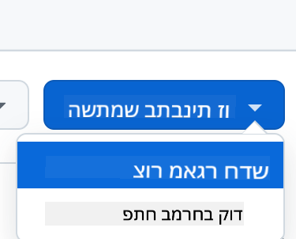
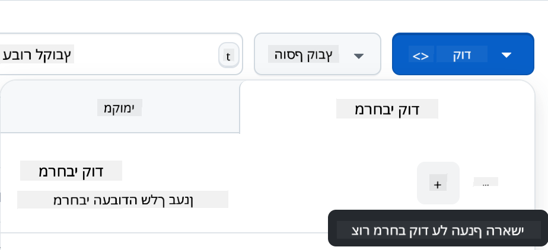

<!--
CO_OP_TRANSLATOR_METADATA:
{
  "original_hash": "cf15ff7770c5a484349383bb27d1131f",
  "translation_date": "2025-08-29T01:27:35+00:00",
  "source_file": "9-chat-project/README.md",
  "language_code": "he"
}
-->
# פרויקט צ'אט

פרויקט הצ'אט הזה מדגים כיצד לבנות עוזר צ'אט באמצעות GitHub Models.

כך נראה הפרויקט המוגמר:

<div>
  
</div>

קצת רקע, בניית עוזרי צ'אט באמצעות AI גנרטיבי היא דרך מצוינת להתחיל ללמוד על AI. במהלך השיעור הזה תלמדו כיצד לשלב AI גנרטיבי באפליקציית ווב. בואו נתחיל.

## התחברות ל-AI גנרטיבי

בצד השרת, אנחנו משתמשים ב-GitHub Models. זהו שירות נהדר שמאפשר לכם להשתמש ב-AI בחינם. גשו ל-playground שלו וקחו את הקוד שמתאים לשפת ה-backend שבחרתם. כך זה נראה ב-[GitHub Models Playground](https://github.com/marketplace/models/azure-openai/gpt-4o-mini/playground)

<div>
  
</div>

כפי שאמרנו, בחרו בלשונית "Code" וב-runtime שבחרתם.

<div>
  
</div>

במקרה הזה אנחנו בוחרים ב-Python, מה שאומר שנבחר את הקוד הזה:

```python
"""Run this model in Python

> pip install openai
"""
import os
from openai import OpenAI

# To authenticate with the model you will need to generate a personal access token (PAT) in your GitHub settings. 
# Create your PAT token by following instructions here: https://docs.github.com/en/authentication/keeping-your-account-and-data-secure/managing-your-personal-access-tokens
client = OpenAI(
    base_url="https://models.github.ai/inference",
    api_key=os.environ["GITHUB_TOKEN"],
)

response = client.chat.completions.create(
    messages=[
        {
            "role": "system",
            "content": "",
        },
        {
            "role": "user",
            "content": "What is the capital of France?",
        }
    ],
    model="openai/gpt-4o-mini",
    temperature=1,
    max_tokens=4096,
    top_p=1
)

print(response.choices[0].message.content)
```

בואו ננקה את הקוד הזה קצת כדי שיהיה ניתן לשימוש חוזר:

```python
def call_llm(prompt: str, system_message: str):
    response = client.chat.completions.create(
        messages=[
            {
                "role": "system",
                "content": system_message,
            },
            {
                "role": "user",
                "content": prompt,
            }
        ],
        model="openai/gpt-4o-mini",
        temperature=1,
        max_tokens=4096,
        top_p=1
    )

    return response.choices[0].message.content
```

עם הפונקציה `call_llm` אנחנו יכולים עכשיו לקחת prompt ו-system prompt, והפונקציה תחזיר את התוצאה.

### התאמת עוזר ה-AI

אם אתם רוצים להתאים את עוזר ה-AI, תוכלו להגדיר כיצד אתם רוצים שהוא יתנהג על ידי מילוי ה-system prompt כך:

```python
call_llm("Tell me about you", "You're Albert Einstein, you only know of things in the time you were alive")
```

## חשיפה דרך Web API

מצוין, סיימנו את חלק ה-AI, בואו נראה איך אפשר לשלב אותו ב-Web API. עבור ה-Web API, אנחנו בוחרים להשתמש ב-Flask, אבל כל framework ווב יהיה טוב. הנה הקוד:

```python
# api.py
from flask import Flask, request, jsonify
from llm import call_llm
from flask_cors import CORS

app = Flask(__name__)
CORS(app)   # *   example.com

@app.route("/", methods=["GET"])
def index():
    return "Welcome to this API. Call POST /hello with 'message': 'my message' as JSON payload"


@app.route("/hello", methods=["POST"])
def hello():
    # get message from request body  { "message": "do this taks for me" }
    data = request.get_json()
    message = data.get("message", "")

    response = call_llm(message, "You are a helpful assistant.")
    return jsonify({
        "response": response
    })

if __name__ == "__main__":
    app.run(host="0.0.0.0", port=5000)
```

כאן אנחנו יוצרים API עם Flask ומגדירים נתיב ברירת מחדל "/" ונתיב "/chat". הנתיב השני מיועד לשימוש על ידי ה-frontend שלנו כדי להעביר שאלות.

כדי לשלב את *llm.py* הנה מה שצריך לעשות:

- לייבא את הפונקציה `call_llm`:

   ```python
   from llm import call_llm
   from flask import Flask, request
   ```

- לקרוא לה מתוך הנתיב "/chat":

   ```python
   @app.route("/hello", methods=["POST"])
   def hello():
      # get message from request body  { "message": "do this taks for me" }
      data = request.get_json()
      message = data.get("message", "")

      response = call_llm(message, "You are a helpful assistant.")
      return jsonify({
         "response": response
      })
   ```

   כאן אנחנו מנתחים את הבקשה הנכנסת כדי לשלוף את המאפיין `message` מתוך גוף ה-JSON. לאחר מכן אנחנו קוראים ל-LLM עם הקריאה הזו:

   ```python
   response = call_llm(message, "You are a helpful assistant")

   # return the response as JSON
   return jsonify({
      "response": response 
   })
   ```

מצוין, עכשיו סיימנו את מה שצריך.

### הגדרת Cors

חשוב לציין שהגדרנו משהו כמו CORS, שיתוף משאבים בין מקורות. זה אומר שכיוון שה-backend וה-frontend שלנו ירוצו על פורטים שונים, אנחנו צריכים לאפשר ל-frontend לקרוא ל-backend. יש קטע קוד ב-*api.py* שמגדיר את זה:

```python
from flask_cors import CORS

app = Flask(__name__)
CORS(app)   # *   example.com
```

כרגע זה מוגדר לאפשר "*", כלומר כל המקורות, וזה קצת לא בטוח. כדאי להגביל את זה כשנעבור לייצור.

## הרצת הפרויקט

אוקיי, יש לנו *llm.py* ו-*api.py*, איך אפשר לגרום לזה לעבוד עם backend? יש שני דברים שצריך לעשות:

- התקנת תלותים:

   ```sh
   cd backend
   python -m venv venv
   source ./venv/bin/activate

   pip install openai flask flask-cors openai
   ```

- הפעלת ה-API

   ```sh
   python api.py
   ```

   אם אתם ב-Codespaces, צריך לגשת ל-Ports בחלק התחתון של העורך, ללחוץ לחיצה ימנית עליו ולבחור "Port Visibility" ולבחור "Public".

### עבודה על ה-frontend

עכשיו שיש לנו API פעיל, בואו ניצור frontend עבורו. frontend מינימלי שנשפר בהדרגה. בתיקיית *frontend*, צרו את הדברים הבאים:

```text
backend/
frontend/
index.html
app.js
styles.css
```

נתחיל עם **index.html**:

```html
<html>
    <head>
        <link rel="stylesheet" href="styles.css">
    </head>
    <body>
      <form>
        <textarea id="messages"></textarea>
        <input id="input" type="text" />
        <button type="submit" id="sendBtn">Send</button>  
      </form>  
      <script src="app.js" />
    </body>
</html>    
```

הקוד למעלה הוא המינימום הדרוש כדי לתמוך בחלון צ'אט, שכן הוא כולל textarea שבו יוצגו ההודעות, input שבו תכתבו את ההודעה וכפתור לשליחת ההודעה ל-backend. בואו נסתכל על ה-JavaScript הבא ב-*app.js*

**app.js**

```js
// app.js

(function(){
  // 1. set up elements  
  const messages = document.getElementById("messages");
  const form = document.getElementById("form");
  const input = document.getElementById("input");

  const BASE_URL = "change this";
  const API_ENDPOINT = `${BASE_URL}/hello`;

  // 2. create a function that talks to our backend
  async function callApi(text) {
    const response = await fetch(API_ENDPOINT, {
      method: "POST",
      headers: { "Content-Type": "application/json" },
      body: JSON.stringify({ message: text })
    });
    let json = await response.json();
    return json.response;
  }

  // 3. add response to our textarea
  function appendMessage(text, role) {
    const el = document.createElement("div");
    el.className = `message ${role}`;
    el.innerHTML = text;
    messages.appendChild(el);
  }

  // 4. listen to submit events
  form.addEventListener("submit", async(e) => {
    e.preventDefault();
   // someone clicked the button in the form
   
   // get input
   const text = input.value.trim();

   appendMessage(text, "user")

   // reset it
   input.value = '';

   const reply = await callApi(text);

   // add to messages
   appendMessage(reply, "assistant");

  })
})();
```

בואו נעבור על הקוד לפי חלקים:

- 1) כאן אנחנו מקבלים הפניה לכל האלמנטים שנשתמש בהם בהמשך הקוד.
- 2) בחלק הזה אנחנו יוצרים פונקציה שמשתמשת ב-`fetch` המובנה כדי לקרוא ל-backend שלנו.
- 3) `appendMessage` עוזרת להוסיף תגובות וגם את מה שאתם כמשתמשים כותבים.
- 4) כאן אנחנו מאזינים לאירוע submit, קוראים את שדה הקלט, מציבים את הודעת המשתמש ב-textarea, קוראים ל-API, ומציגים את התגובה ב-textarea.

בואו נסתכל על עיצוב, כאן אפשר להשתגע ולעצב איך שרוצים, אבל הנה כמה הצעות:

**styles.css**

```
.message {
    background: #222;
    box-shadow: 0 0 0 10px orange;
    padding: 10px:
    margin: 5px;
}

.message.user {
    background: blue;
}

.message.assistant {
    background: grey;
} 
```

עם שלושת המחלקות האלה, תוכלו לעצב הודעות בצורה שונה בהתאם למקור שלהן - עוזר או אתם כמשתמשים. אם אתם רוצים השראה, בדקו את התיקייה `solution/frontend/styles.css`.

### שינוי Base Url

יש דבר אחד שלא הגדרנו כאן וזה `BASE_URL`, שלא ידוע עד שה-backend מופעל. כדי להגדיר אותו:

- אם אתם מריצים את ה-API מקומית, זה צריך להיות משהו כמו `http://localhost:5000`.
- אם אתם מריצים ב-Codespaces, זה צריך להיראות כמו "[name]app.github.dev".

## משימה

צרו תיקייה משלכם *project* עם תוכן כזה:

```text
project/
  frontend/
    index.html
    app.js
    styles.css
  backend/
    api.py
    llm.py
```

העתיקו את התוכן מההוראות למעלה, אבל הרגישו חופשיים להתאים אותו לטעמכם.

## פתרון

[פתרון](./solution/README.md)

## בונוס

נסו לשנות את האישיות של עוזר ה-AI. כשאתם קוראים ל-`call_llm` ב-*api.py* תוכלו לשנות את הפרמטר השני למה שתרצו, לדוגמה:

```python
call_llm(message, "You are Captain Picard")
```

שנו גם את ה-CSS והטקסט לטעמכם, כך שתעשו שינויים ב-*index.html* וב-*styles.css*.

## סיכום

מצוין, למדתם מאפס איך ליצור עוזר אישי באמצעות AI. עשינו זאת באמצעות GitHub Models, backend ב-Python ו-frontend ב-HTML, CSS ו-JavaScript.

## הגדרה עם Codespaces

- נווטו ל-[Web Dev For Beginners repo](https://github.com/microsoft/Web-Dev-For-Beginners)
- צרו מתוך תבנית (ודאו שאתם מחוברים ל-GitHub) בפינה הימנית העליונה:

    

- ברגע שאתם בתוך הרפו שלכם, צרו Codespace:

    

    זה אמור להפעיל סביבה שבה תוכלו לעבוד עכשיו.

---

**כתב ויתור**:  
מסמך זה תורגם באמצעות שירות תרגום מבוסס בינה מלאכותית [Co-op Translator](https://github.com/Azure/co-op-translator). למרות שאנו שואפים לדיוק, יש לקחת בחשבון שתרגומים אוטומטיים עשויים להכיל שגיאות או אי-דיוקים. המסמך המקורי בשפתו המקורית צריך להיחשב כמקור הסמכותי. למידע קריטי, מומלץ להשתמש בתרגום מקצועי על ידי בני אדם. איננו נושאים באחריות לכל אי-הבנה או פרשנות שגויה הנובעת משימוש בתרגום זה.