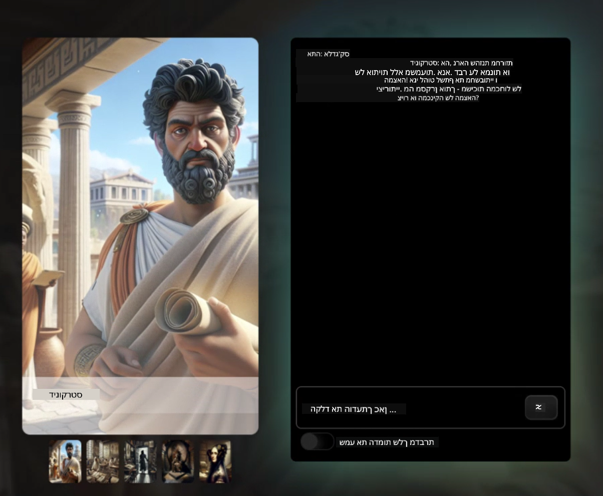
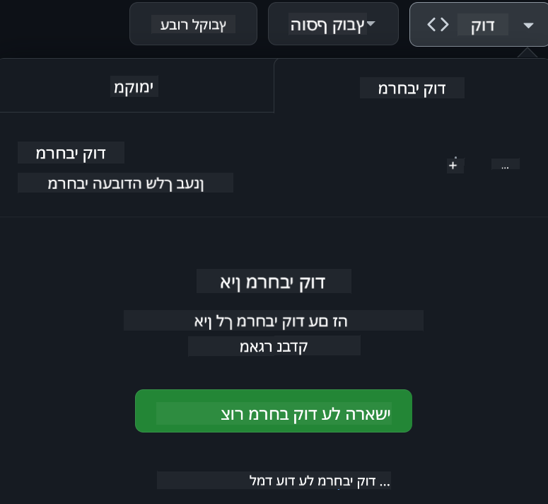

<!--
CO_OP_TRANSLATOR_METADATA:
{
  "original_hash": "8b9d0562ea649b6012d1a67acc630681",
  "translation_date": "2025-11-04T02:09:17+00:00",
  "source_file": "README.md",
  "language_code": "he"
}
-->
[](https://github.com/microsoft/Web-Dev-For-Beginners/blob/master/LICENSE)  
[](https://GitHub.com/microsoft/Web-Dev-For-Beginners/graphs/contributors/)  
[](https://GitHub.com/microsoft/Web-Dev-For-Beginners/issues/)  
[](https://GitHub.com/microsoft/Web-Dev-For-Beginners/pulls/)  
[](http://makeapullrequest.com)  

[](https://GitHub.com/microsoft/Web-Dev-For-Beginners/watchers/)  
[](https://GitHub.com/microsoft/Web-Dev-For-Beginners/network/)  
[](https://GitHub.com/microsoft/Web-Dev-For-Beginners/stargazers/)  

[](https://discord.gg/zxKYvhSnVp?WT.mc_id=academic-000002-leestott)  

# פיתוח אתרים למתחילים - תוכנית לימודים  

למדו את יסודות פיתוח האתרים עם הקורס המקיף שלנו בן 12 שבועות בהנחיית Microsoft Cloud Advocates. כל אחד מ-24 השיעורים מתמקד ב-JavaScript, CSS ו-HTML דרך פרויקטים מעשיים כמו טרריומים, הרחבות לדפדפן ומשחקי חלל. השתתפו בחידונים, דיונים ומשימות מעשיות. שפרו את הכישורים שלכם וייעלו את שימור הידע שלכם עם הפדגוגיה האפקטיבית שלנו המבוססת על פרויקטים. התחילו את מסע הקידוד שלכם היום!  

הצטרפו לקהילת Azure AI Foundry Discord  

[](https://discord.com/invite/ByRwuEEgH4)  

עקבו אחר השלבים הבאים כדי להתחיל להשתמש במשאבים אלו:  
1. **צרו מזלג למאגר**: לחצו [](https://GitHub.com/microsoft/Web-Dev-For-Beginners/fork)  
2. **שכפלו את המאגר**:   `git clone https://github.com/microsoft/Web-Dev-For-Beginners.git`  
3. [**הצטרפו ל-Azure AI Foundry Discord ופגשו מומחים ומפתחים נוספים**](https://discord.com/invite/ByRwuEEgH4)  

### 🌐 תמיכה רב-שפתית  

#### נתמך באמצעות GitHub Action (אוטומטי ותמיד מעודכן)  

[ערבית](../ar/README.md) | [בנגלית](../bn/README.md) | [בולגרית](../bg/README.md) | [בורמזית (מיאנמר)](../my/README.md) | [סינית (פשוטה)](../zh/README.md) | [סינית (מסורתית, הונג קונג)](../hk/README.md) | [סינית (מסורתית, מקאו)](../mo/README.md) | [סינית (מסורתית, טייוואן)](../tw/README.md) | [קרואטית](../hr/README.md) | [צ'כית](../cs/README.md) | [דנית](../da/README.md) | [הולנדית](../nl/README.md) | [אסטונית](../et/README.md) | [פינית](../fi/README.md) | [צרפתית](../fr/README.md) | [גרמנית](../de/README.md) | [יוונית](../el/README.md) | [עברית](./README.md) | [הינדית](../hi/README.md) | [הונגרית](../hu/README.md) | [אינדונזית](../id/README.md) | [איטלקית](../it/README.md) | [יפנית](../ja/README.md) | [קוריאנית](../ko/README.md) | [ליטאית](../lt/README.md) | [מלאית](../ms/README.md) | [מרטהי](../mr/README.md) | [נפאלית](../ne/README.md) | [נורווגית](../no/README.md) | [פרסית (פארסי)](../fa/README.md) | [פולנית](../pl/README.md) | [פורטוגזית (ברזיל)](../br/README.md) | [פורטוגזית (פורטוגל)](../pt/README.md) | [פונג'בית (גורמוקי)](../pa/README.md) | [רומנית](../ro/README.md) | [רוסית](../ru/README.md) | [סרבית (קירילית)](../sr/README.md) | [סלובקית](../sk/README.md) | [סלובנית](../sl/README.md) | [ספרדית](../es/README.md) | [סוואהילית](../sw/README.md) | [שוודית](../sv/README.md) | [טאגאלוג (פיליפינית)](../tl/README.md) | [טמילית](../ta/README.md) | [תאית](../th/README.md) | [טורקית](../tr/README.md) | [אוקראינית](../uk/README.md) | [אורדו](../ur/README.md) | [וייטנאמית](../vi/README.md)  

**אם תרצו להוסיף שפות נוספות, רשימת השפות הנתמכות נמצאת [כאן](https://github.com/Azure/co-op-translator/blob/main/getting_started/supported-languages.md)**  

[](https://open.vscode.dev/microsoft/Web-Dev-For-Beginners)  

#### 🧑‍🎓 _האם אתם סטודנטים?_  

בקרו ב-[**עמוד הסטודנטים**](https://docs.microsoft.com/learn/student-hub/?WT.mc_id=academic-77807-sagibbon) שם תמצאו משאבים למתחילים, חבילות לסטודנטים ואפילו דרכים לקבל שובר לתעודה בחינם. זהו עמוד שכדאי לשמור ולבדוק מדי פעם, שכן אנו מעדכנים את התוכן מדי חודש.  

### 📣 הודעה - אתגרי מצב סוכן חדש של GitHub Copilot להשלמה!  

אתגר חדש נוסף, חפשו את "GitHub Copilot Agent Challenge 🚀" ברוב הפרקים. זהו אתגר חדש עבורכם להשלמה באמצעות GitHub Copilot ומצב סוכן. אם לא השתמשתם במצב סוכן בעבר, הוא מסוגל לא רק לייצר טקסט אלא גם ליצור ולערוך קבצים, להריץ פקודות ועוד.  

### 📣 הודעה - _פרויקט חדש לבנייה באמצעות AI גנרטיבי_  

פרויקט עוזר AI חדש נוסף, בדקו אותו [פרויקט](./09-chat-project/README.md)  

### 📣 הודעה - _תוכנית לימודים חדשה_ על AI גנרטיבי ל-JavaScript שוחררה  

אל תפספסו את תוכנית הלימודים החדשה שלנו על AI גנרטיבי!  

בקרו ב-[https://aka.ms/genai-js-course](https://aka.ms/genai-js-course) כדי להתחיל!  

  

- שיעורים המכסים הכל מהבסיס ועד RAG.  
- אינטראקציה עם דמויות היסטוריות באמצעות GenAI ואפליקציית הליווי שלנו.  
- נרטיב מהנה ומרתק, תצאו למסע בזמן!  

  

כל שיעור כולל משימה להשלמה, בדיקת ידע ואתגר שינחה אתכם בלימוד נושאים כמו:  
- יצירת הנחיות והנדסת הנחיות  
- יצירת אפליקציות טקסט ותמונה  
- אפליקציות חיפוש  

בקרו ב-[https://aka.ms/genai-js-course](https://aka.ms/genai-js-course) כדי להתחיל!  

## 🌱 איך מתחילים  

> **מורים**, אנו [הוספנו כמה הצעות](for-teachers.md) כיצד להשתמש בתוכנית הלימודים הזו. נשמח לשמוע את דעתכם [בפורום הדיונים שלנו](https://github.com/microsoft/Web-Dev-For-Beginners/discussions/categories/teacher-corner)!  

**[לומדים](https://aka.ms/student-page/?WT.mc_id=academic-77807-sagibbon)**, בכל שיעור, התחילו בחידון מקדים והמשיכו בקריאת חומרי השיעור, השלימו את הפעילויות השונות ובדקו את הבנתכם עם החידון שלאחר השיעור.  

כדי לשפר את חוויית הלמידה שלכם, התחברו עם חברים כדי לעבוד יחד על הפרויקטים! דיונים מעודדים ב-[פורום הדיונים שלנו](https://github.com/microsoft/Web-Dev-For-Beginners/discussions) שם צוות המנחים שלנו יהיה זמין לענות על שאלותיכם.  

כדי להרחיב את השכלתכם, אנו ממליצים מאוד לחקור את [Microsoft Learn](https://learn.microsoft.com/users/wirelesslife/collections/p1ddcy5jwy0jkm?WT.mc_id=academic-77807-sagibbon) עבור חומרי לימוד נוספים.  

### 📋 הגדרת סביבת העבודה שלכם  

לתוכנית הלימודים הזו יש סביבת פיתוח מוכנה לשימוש! כשאתם מתחילים, תוכלו לבחור להריץ את התוכנית הלימודים ב-[Codespace](https://github.com/features/codespaces/) (_סביבה מבוססת דפדפן, ללא צורך בהתקנות_), או מקומית על המחשב שלכם באמצעות עורך טקסט כמו [Visual Studio Code](https://code.visualstudio.com/?WT.mc_id=academic-77807-sagibbon).  

#### צרו את המאגר שלכם  
כדי לשמור את העבודה שלכם בקלות, מומלץ ליצור עותק משלכם של מאגר זה. תוכלו לעשות זאת על ידי לחיצה על כפתור **Use this template** בראש העמוד. זה ייצור מאגר חדש בחשבון GitHub שלכם עם עותק של תוכנית הלימודים.  

עקבו אחר השלבים הבאים:  
1. **צרו מזלג למאגר**: לחצו על כפתור "Fork" בפינה הימנית העליונה של עמוד זה.  
2. **שכפלו את המאגר**:   `git clone https://github.com/microsoft/Web-Dev-For-Beginners.git`  

#### הרצת תוכנית הלימודים ב-Codespace  

בעותק של המאגר שיצרתם, לחצו על כפתור **Code** ובחרו **Open with Codespaces**. זה ייצור עבורכם Codespace חדש לעבודה.  

  

#### הרצת תוכנית הלימודים באופן מקומי על המחשב שלכם  

כדי להריץ את תוכנית הלימודים באופן מקומי על המחשב שלכם, תצטרכו עורך טקסט, דפדפן וכלי שורת פקודה. השיעור הראשון שלנו, [מבוא לשפות תכנות וכלי עבודה](../../1-getting-started-lessons/1-intro-to-programming-languages), ידריך אתכם דרך אפשרויות שונות לכל אחד מהכלים הללו כדי שתוכלו לבחור את מה שמתאים לכם ביותר.  

ההמלצה שלנו היא להשתמש ב-[Visual Studio Code](https://code.visualstudio.com/?WT.mc_id=academic-77807-sagibbon) כעורך שלכם, שיש לו גם [טרמינל מובנה](https://code.visualstudio.com/docs/terminal/basics/?WT.mc_id=academic-77807-sagibbon). תוכלו להוריד את Visual Studio Code [כאן](https://code.visualstudio.com/?WT.mc_id=academic-77807-sagibbon).  

1. שכפלו את המאגר שלכם למחשב. תוכלו לעשות זאת על ידי לחיצה על כפתור **Code** והעתקת ה-URL:  

    [CodeSpace](./images/createcodespace.png)  

    לאחר מכן, פתחו את [טרמינל](https://code.visualstudio.com/docs/terminal/basics/?WT.mc_id=academic-77807-sagibbon) בתוך [Visual Studio Code](https://code.visualstudio.com/?WT.mc_id=academic-77807-sagibbon) והריצו את הפקודה הבאה, החליפו `<your-repository-url>` ב-URL שהעתקתם:  

    ```bash 
    git clone <your-repository-url>
    ```
  
2. פתחו את התיקייה ב-Visual Studio Code. תוכלו לעשות זאת על ידי לחיצה על **File** > **Open Folder** ובחירת התיקייה ששכפלתם.  

>  הרחבות מומלצות ל-Visual Studio Code:  
>  
> * [Live Server](https://marketplace.visualstudio.com/items?itemName=ritwickdey.LiveServer&WT.mc_id=academic-77807-sagibbon) - לצפייה מקדימה בדפי HTML בתוך Visual Studio Code  
> * [Copilot](https://marketplace.visualstudio.com/items?itemName=GitHub.copilot&WT.mc_id=academic-77807-sagibbon) - לעזור לכם לכתוב קוד מהר יותר  

## 📂 כל שיעור כולל:

- סקיצה אופציונלית  
- סרטון משלים אופציונלי  
- שאלון חימום לפני השיעור  
- שיעור כתוב  
- עבור שיעורים מבוססי פרויקטים, מדריכים שלב אחר שלב לבניית הפרויקט  
- בדיקות ידע  
- אתגר  
- קריאה משלימה  
- משימה  
- [שאלון לאחר השיעור](https://ff-quizzes.netlify.app/web/)  

> **הערה לגבי שאלונים**: כל השאלונים נמצאים בתיקיית Quiz-app, סה"כ 48 שאלונים עם שלוש שאלות בכל אחד. הם זמינים [כאן](https://ff-quizzes.netlify.app/web/) וניתן להפעיל את אפליקציית השאלונים באופן מקומי או לפרוס אותה ב-Azure; עקבו אחר ההוראות בתיקיית `quiz-app`.

## 🗃️ שיעורים

|     |                       שם הפרויקט                       |                            מושגים נלמדים                             | מטרות למידה                                                                                                                 |                                                         קישור לשיעור                                                          |         מחבר          |
| :-: | :------------------------------------------------------: | :--------------------------------------------------------------------: | ----------------------------------------------------------------------------------------------------------------------------------- | :----------------------------------------------------------------------------------------------------------------------------: | :---------------------: |
| 01  |                     התחלה                      |           מבוא לתכנות וכלי העבודה           | למדו את היסודות מאחורי רוב שפות התכנות ואת התוכנות שעוזרות למפתחים מקצועיים לבצע את עבודתם | [מבוא לשפות תכנות וכלי העבודה](./1-getting-started-lessons/1-intro-to-programming-languages/README.md) |         Jasmine         |
| 02  |                     התחלה                      |             יסודות GitHub, כולל עבודה בצוות             | כיצד להשתמש ב-GitHub בפרויקט שלכם, כיצד לשתף פעולה עם אחרים על בסיס קוד                                                    |                            [מבוא ל-GitHub](./1-getting-started-lessons/2-github-basics/README.md)                             |          Floor          |
| 03  |                     התחלה                      |                             נגישות                              | למדו את היסודות של נגישות באינטרנט                                                                                               |                       [יסודות הנגישות](./1-getting-started-lessons/3-accessibility/README.md)                       |       Christopher       |
| 04  |                        יסודות JS                         |                         סוגי נתונים ב-JavaScript                          | היסודות של סוגי נתונים ב-JavaScript                                                                                                 |                                       [סוגי נתונים](./2-js-basics/1-data-types/README.md)                                        |         Jasmine         |
| 05  |                        יסודות JS                         |                         פונקציות ושיטות                          | למדו על פונקציות ושיטות לניהול זרימת הלוגיקה של האפליקציה                                                             |                              [פונקציות ושיטות](./2-js-basics/2-functions-methods/README.md)                               | Jasmine and Christopher |
| 06  |                        יסודות JS                         |                        קבלת החלטות עם JS                        | למדו כיצד ליצור תנאים בקוד שלכם באמצעות שיטות קבלת החלטות                                                           |                                 [קבלת החלטות](./2-js-basics/3-making-decisions/README.md)                                  |         Jasmine         |
| 07  |                        יסודות JS                         |                            מערכים ולולאות                            | עבודה עם נתונים באמצעות מערכים ולולאות ב-JavaScript                                                                                 |                                   [מערכים ולולאות](./2-js-basics/4-arrays-loops/README.md)                                    |         Jasmine         |
| 08  |       [טרריום](./3-terrarium/solution/README.md)       |                            HTML בפועל                            | בניית HTML ליצירת טרריום מקוון, תוך התמקדות בבניית פריסה                                                         |                                 [מבוא ל-HTML](./3-terrarium/1-intro-to-html/README.md)                                 |           Jen           |
| 09  |       [טרריום](./3-terrarium/solution/README.md)       |                            CSS בפועל                             | בניית CSS לעיצוב הטרריום המקוון, תוך התמקדות ביסודות CSS כולל הפיכת הדף לרספונסיבי                     |                                  [מבוא ל-CSS](./3-terrarium/2-intro-to-css/README.md)                                  |           Jen           |
| 10  |            [טרריום](./3-terrarium/solution/README.md)            |                 סגירות JavaScript, מניפולציה של DOM                  | בניית JavaScript כדי לגרום לטרריום לפעול כממשק גרירה/שחרור, תוך התמקדות בסגירות ובמניפולציה של DOM             |                  [סגירות JavaScript, מניפולציה של DOM](./3-terrarium/3-intro-to-DOM-and-closures/README.md)                   |           Jen           |
| 11  |          [משחק הקלדה](./4-typing-game/solution/README.md)          |                          בניית משחק הקלדה                           | למדו כיצד להשתמש באירועי מקלדת כדי להניע את הלוגיקה של אפליקציית JavaScript שלכם                                                          |                                [תכנות מונחה אירועים](./4-typing-game/typing-game/README.md)                                |       Christopher       |
| 12  | [תוסף דפדפן ירוק](./5-browser-extension/solution/README.md) |                         עבודה עם דפדפנים                          | למדו כיצד דפדפנים עובדים, ההיסטוריה שלהם, וכיצד לבנות את האלמנטים הראשונים של תוסף דפדפן                               |                               [על דפדפנים](./5-browser-extension/1-about-browsers/README.md)                                |           Jen           |
| 13  | [תוסף דפדפן ירוק](./5-browser-extension/solution/README.md) | בניית טופס, קריאה ל-API ואחסון משתנים באחסון מקומי | בניית אלמנטים JavaScript של תוסף הדפדפן שלכם כדי לקרוא ל-API באמצעות משתנים המאוחסנים באחסון מקומי                      |                [APIs, טפסים ואחסון מקומי](./5-browser-extension/2-forms-browsers-local-storage/README.md)                 |           Jen           |
| 14  | [תוסף דפדפן ירוק](./5-browser-extension/solution/README.md) |          תהליכים ברקע בדפדפן, ביצועי רשת          | השתמשו בתהליכים ברקע של הדפדפן כדי לנהל את סמל התוסף; למדו על ביצועי רשת וכמה אופטימיזציות לשיפור   |             [משימות ברקע וביצועים](./5-browser-extension/3-background-tasks-and-performance/README.md)              |           Jen           |
| 15  |           [משחק חלל](./6-space-game/solution/README.md)           |             פיתוח משחק מתקדם יותר עם JavaScript             | למדו על ירושה באמצעות גם מחלקות וגם קומפוזיציה ודפוס Pub/Sub, כהכנה לבניית משחק              |                      [מבוא לפיתוח משחק מתקדם](./6-space-game/1-introduction/README.md)                       |          Chris          |
| 16  |           [משחק חלל](./6-space-game/solution/README.md)           |                           ציור על קנבס                            | למדו על Canvas API, המשמש לציור אלמנטים על המסך                                                                       |                                [ציור על קנבס](./6-space-game/2-drawing-to-canvas/README.md)                                |          Chris          |
| 17  |           [משחק חלל](./6-space-game/solution/README.md)           |                   הזזת אלמנטים על המסך                    | גלו כיצד אלמנטים יכולים לקבל תנועה באמצעות קואורדינטות קרטזיות ו-Canvas API                                            |                           [הזזת אלמנטים על המסך](./6-space-game/3-moving-elements-around/README.md)                           |          Chris          |
| 18  |           [משחק חלל](./6-space-game/solution/README.md)           |                          זיהוי התנגשות                           | גרמו לאלמנטים להתנגש ולהגיב זה לזה באמצעות לחיצות מקשים וספקו פונקציית קירור כדי להבטיח ביצועי המשחק    |                              [זיהוי התנגשות](./6-space-game/4-collision-detection/README.md)                              |          Chris          |
| 19  |           [משחק חלל](./6-space-game/solution/README.md)           |                             שמירת ניקוד                              | בצעו חישובים מתמטיים בהתבסס על מצב המשחק וביצועיו                                                                |                                    [שמירת ניקוד](./6-space-game/5-keeping-score/README.md)                                    |          Chris          |
| 20  |           [משחק חלל](./6-space-game/solution/README.md)           |                     סיום והתחלה מחדש של המשחק                     | למדו על סיום והתחלה מחדש של המשחק, כולל ניקוי נכסים ואיפוס ערכי משתנים                              |                                [תנאי סיום](./6-space-game/6-end-condition/README.md)                                 |          Chris          |
| 21  |         [אפליקציית בנקאות](./7-bank-project/solution/README.md)          |                 תבניות HTML ונתיבים באפליקציית רשת                 | למדו כיצד ליצור את המבנה של ארכיטקטורת אתר מרובה עמודים באמצעות נתיבים ותבניות HTML                             |                            [תבניות HTML ונתיבים](./7-bank-project/1-template-route/README.md)                             |          Yohan          |
| 22  |         [אפליקציית בנקאות](./7-bank-project/solution/README.md)          |                  בניית טופס כניסה ורישום                   | למדו על בניית טפסים וטיפול ברוטינות אימות                                                                          |                                           [טפסים](./7-bank-project/2-forms/README.md)                                           |          Yohan          |
| 23  |         [אפליקציית בנקאות](./7-bank-project/solution/README.md)          |                   שיטות של הבאת נתונים ושימוש בהם                   | כיצד נתונים זורמים פנימה והחוצה מהאפליקציה שלכם, כיצד להביא אותם, לאחסן אותם ולהיפטר מהם                                                 |                                            [נתונים](./7-bank-project/3-data/README.md)                                            |          Yohan          |
| 24  |         [אפליקציית בנקאות](./7-bank-project/solution/README.md)          |                      מושגים של ניהול מצב                      | למדו כיצד האפליקציה שלכם שומרת מצב וכיצד לנהל אותו באופן תכנותי                                                              |                                [ניהול מצב](./7-bank-project/4-state-management/README.md)                                |          Yohan          |
| 25 | [קוד דפדפן/VScode](../../8-code-editor) | עבודה עם VScode | למדו כיצד להשתמש בעורך קוד | [שימוש בעורך קוד VScode](./8-code-editor/1-using-a-code-editor/README.md) | Chris |
| 26 | [עוזרי AI](./9-chat-project/README.md) | עבודה עם AI | למדו כיצד לבנות עוזר AI משלכם | [פרויקט עוזר AI](./9-chat-project/README.md) | Chris |

## 🏫 פדגוגיה

תוכנית הלימודים שלנו עוצבה עם שני עקרונות פדגוגיים מרכזיים:
* למידה מבוססת פרויקטים  
* שאלונים תכופים  

התוכנית מלמדת את יסודות JavaScript, HTML ו-CSS, כמו גם הכלים והטכניקות העדכניים ביותר בהם משתמשים מפתחי רשת כיום. התלמידים יקבלו הזדמנות לפתח ניסיון מעשי על ידי בניית משחק הקלדה, טרריום וירטואלי, תוסף דפדפן ידידותי לסביבה, משחק בסגנון פולש חלל ואפליקציית בנקאות לעסקים. בסוף הסדרה, התלמידים ירכשו הבנה מוצקה של פיתוח רשת.

> 🎓 ניתן לקחת את השיעורים הראשונים בתוכנית הלימודים הזו כ-[מסלול למידה](https://docs.microsoft.com/learn/paths/web-development-101/?WT.mc_id=academic-77807-sagibbon) ב-Microsoft Learn!

על ידי הבטחת התאמת התוכן לפרויקטים, התהליך נעשה יותר מרתק עבור התלמידים ושימור המושגים יוגבר. בנוסף, כתבנו מספר שיעורי פתיחה ביסודות JavaScript כדי להציג מושגים, יחד עם סרטון מתוך אוסף "[סדרת מתחילים ל-JavaScript](https://channel9.msdn.com/Series/Beginners-Series-to-JavaScript/?WT.mc_id=academic-77807-sagibbon)" של מדריכי וידאו, שחלק מהכותבים שלהם תרמו לתוכנית הלימודים הזו.

בנוסף, שאלון בעל סיכון נמוך לפני השיעור מכוון את כוונת התלמיד ללמידת נושא, בעוד שאלון שני לאחר השיעור מבטיח שימור נוסף. תוכנית הלימודים הזו עוצבה להיות גמישה ומהנה וניתן לקחת אותה בשלמותה או בחלקים. הפרויקטים מתחילים קטנים והופכים מורכבים יותר בסוף מחזור של 12 שבועות.

בעוד שבכוונה נמנענו מהצגת מסגרות JavaScript כדי להתמקד במיומנויות הבסיסיות הנדרשות כמפתח רשת לפני אימוץ מסגרת, צעד טוב הבא לאחר השלמת תוכנית הלימודים הזו יהיה ללמוד על Node.js באמצעות אוסף נוסף של סרטונים: "[סדרת מתחילים ל-Node.js](https://channel9.msdn.com/Series/Beginners-Series-to-Nodejs/?WT.mc_id=academic-77807-sagibbon)".

> בקרו ב-[קוד ההתנהגות](CODE_OF_CONDUCT.md) וב-[הנחיות תרומה](CONTRIBUTING.md) שלנו. נשמח לקבל את המשוב הבונה שלכם!

## 🧭 גישה לא מקוונת

ניתן להפעיל את התיעוד הזה באופן לא מקוון באמצעות [Docsify](https://docsify.js.org/#/). עשו Fork למאגר הזה, [התקינו את Docsify](https://docsify.js.org/#/quickstart) במחשב המקומי שלכם, ואז בתיקיית השורש של המאגר הזה, הקלידו `docsify serve`. האתר יוגש על פורט 3000 ב-localhost שלכם: `localhost:3000`.

## 📘 PDF

ניתן למצוא PDF של כל השיעורים [כאן](https://microsoft.github.io/Web-Dev-For-Beginners/pdf/readme.pdf).

## 🎒 קורסים נוספים

הצוות שלנו מייצר קורסים נוספים! בדקו:

### Azure / Edge / MCP / Agents  
[](https://github.com/microsoft/AZD-for-beginners?WT.mc_id=academic-105485-koreyst)
[](https://github.com/microsoft/edgeai-for-beginners?WT.mc_id=academic-105485-koreyst)  
[](https://github.com/microsoft/mcp-for-beginners?WT.mc_id=academic-105485-koreyst)  
[](https://github.com/microsoft/ai-agents-for-beginners?WT.mc_id=academic-105485-koreyst)  

---

### סדרת AI גנרטיבי  
[](https://github.com/microsoft/generative-ai-for-beginners?WT.mc_id=academic-105485-koreyst)  
[-9333EA?style=for-the-badge&labelColor=E5E7EB&color=9333EA)](https://github.com/microsoft/Generative-AI-for-beginners-dotnet?WT.mc_id=academic-105485-koreyst)  
[-C084FC?style=for-the-badge&labelColor=E5E7EB&color=C084FC)](https://github.com/microsoft/generative-ai-for-beginners-java?WT.mc_id=academic-105485-koreyst)  
[-E879F9?style=for-the-badge&labelColor=E5E7EB&color=E879F9)](https://github.com/microsoft/generative-ai-with-javascript?WT.mc_id=academic-105485-koreyst)  

---

### למידה בסיסית  
[](https://aka.ms/ml-beginners?WT.mc_id=academic-105485-koreyst)  
[](https://aka.ms/datascience-beginners?WT.mc_id=academic-105485-koreyst)  
[](https://aka.ms/ai-beginners?WT.mc_id=academic-105485-koreyst)  
[](https://github.com/microsoft/Security-101?WT.mc_id=academic-96948-sayoung)  
[](https://aka.ms/webdev-beginners?WT.mc_id=academic-105485-koreyst)  
[](https://aka.ms/iot-beginners?WT.mc_id=academic-105485-koreyst)  
[](https://github.com/microsoft/xr-development-for-beginners?WT.mc_id=academic-105485-koreyst)  

---

### סדרת Copilot  
[](https://aka.ms/GitHubCopilotAI?WT.mc_id=academic-105485-koreyst)  
[](https://github.com/microsoft/mastering-github-copilot-for-dotnet-csharp-developers?WT.mc_id=academic-105485-koreyst)  
[](https://github.com/microsoft/CopilotAdventures?WT.mc_id=academic-105485-koreyst)  

## קבלת עזרה  

אם אתם נתקעים או יש לכם שאלות על בניית אפליקציות AI, הצטרפו:  

[](https://aka.ms/foundry/discord)  

אם יש לכם משוב על מוצרים או שגיאות בזמן הבנייה, בקרו:  

[](https://aka.ms/foundry/forum)  

## רישיון  

מאגר זה מורשה תחת רישיון MIT. ראו את קובץ [LICENSE](../../LICENSE) למידע נוסף.  

---

**הצהרת אחריות**:  
מסמך זה תורגם באמצעות שירות תרגום AI [Co-op Translator](https://github.com/Azure/co-op-translator). למרות שאנו שואפים לדיוק, יש לקחת בחשבון שתרגומים אוטומטיים עשויים להכיל שגיאות או אי דיוקים. המסמך המקורי בשפתו המקורית צריך להיחשב כמקור סמכותי. עבור מידע קריטי, מומלץ להשתמש בתרגום מקצועי אנושי. אנו לא נושאים באחריות לכל אי הבנות או פרשנויות שגויות הנובעות משימוש בתרגום זה.