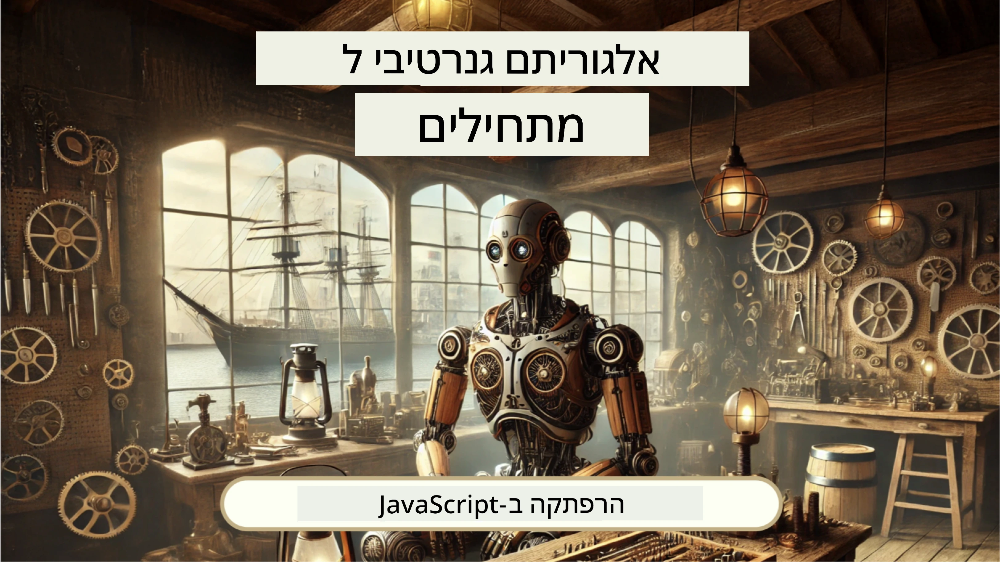
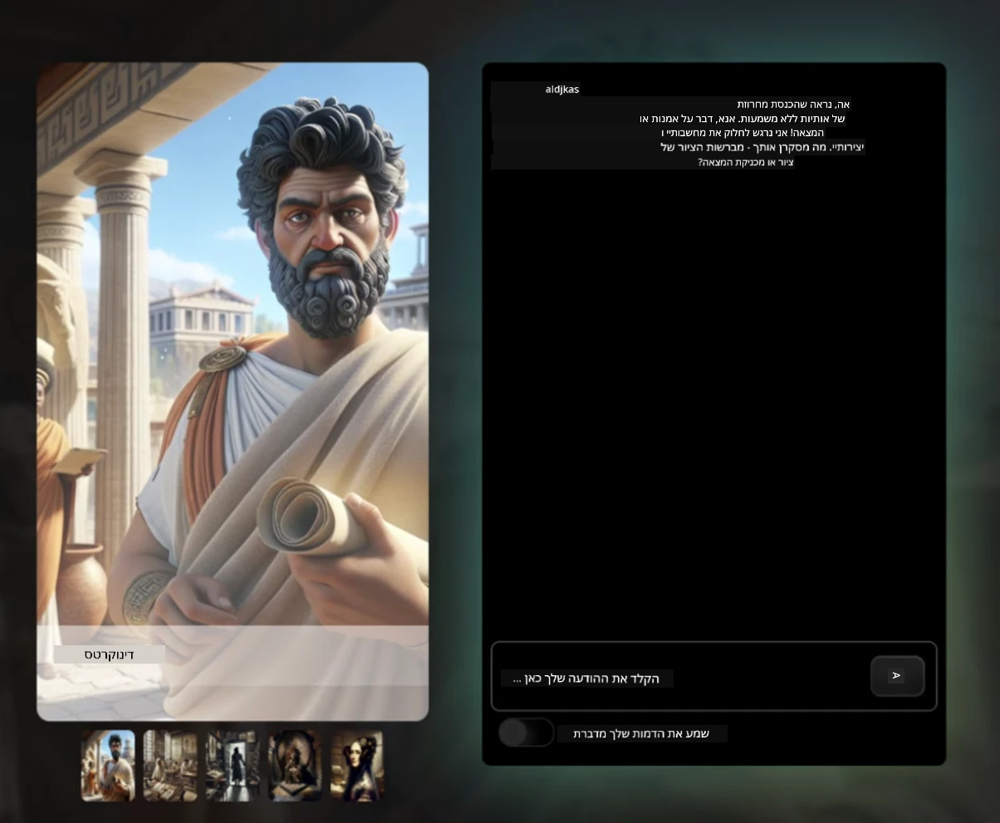
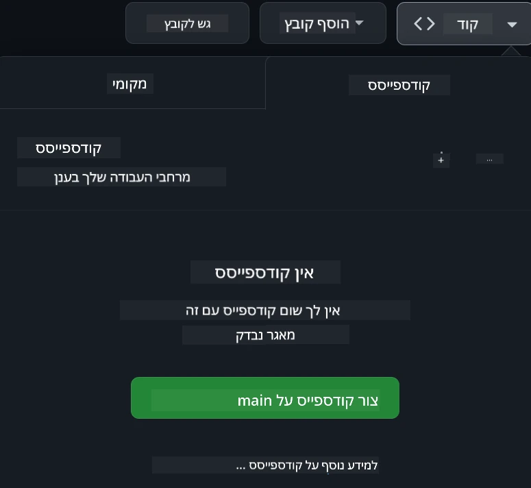

[](https://github.com/microsoft/Web-Dev-For-Beginners/blob/master/LICENSE)
[](https://GitHub.com/microsoft/Web-Dev-For-Beginners/graphs/contributors/)
[](https://GitHub.com/microsoft/Web-Dev-For-Beginners/issues/)
[](https://GitHub.com/microsoft/Web-Dev-For-Beginners/pulls/)
[](http://makeapullrequest.com) 

[](https://GitHub.com/microsoft/Web-Dev-For-Beginners/watchers/)
[](https://GitHub.com/microsoft/Web-Dev-For-Beginners/network/)
[](https://GitHub.com/microsoft/Web-Dev-For-Beginners/stargazers/)

[](https://discord.gg/nTYy5BXMWG)

# פיתוח אתרים למתחילים - תכנית לימודים

למדו את יסודות פיתוח האינטרנט עם הקורס המקיף שלנו בן 12 השבועות על ידי Microsoft Cloud Advocates. כל אחת מ-24 השיעורים מתעמקת ב-JavaScript, CSS ו-HTML דרך פרויקטים מעשיים כמו טרטריומים, תוספות לדפדפן, ומשחקי חלל. התנסו עם חידונים, דיונים ומשימות מעשיות. שפרו את הכישורים שלכם ואופטימיזו את השימור של הידע עם הפדגוגיה היעילה שלנו המבוססת על פרויקטים. התחילו את מסע הקידוד שלכם היום!

הצטרפו לקהילת Azure AI Foundry ב-Discord

[](https://discord.gg/nTYy5BXMWG)

עקבו אחר השלבים הבאים כדי להתחיל להשתמש במשאבים אלו:
1. **פיצול הריפוזיטורי**: לחצו כאן [](https://GitHub.com/microsoft/Web-Dev-For-Beginners/fork)
2. **שכפול הריפוזיטורי**:   `git clone https://github.com/microsoft/Web-Dev-For-Beginners.git`
3. [**הצטרפו ל-Azure AI Foundry Discord ופגשו מומחים ומפתחים נוספים**](https://discord.com/invite/ByRwuEEgH4)

### 🌐 תמיכה רב-שפתית

#### נתמך בעזרת פעולה של GitHub (אוטומטי ותמיד מעודכן)

<!-- CO-OP TRANSLATOR LANGUAGES TABLE START -->
[ערבית](../ar/README.md) | [בנגלית](../bn/README.md) | [בולגרית](../bg/README.md) | [בורמזית (מיאנמר)](../my/README.md) | [סינית (מפושטת)](../zh-CN/README.md) | [סינית (מסורתית, הונג קונג)](../zh-HK/README.md) | [סינית (מסורתית, מקאו)](../zh-MO/README.md) | [סינית (מסורתית, טייוואן)](../zh-TW/README.md) | [קרואטית](../hr/README.md) | [צ'כית](../cs/README.md) | [דנית](../da/README.md) | [הולנדית](../nl/README.md) | [אסטונית](../et/README.md) | [פינית](../fi/README.md) | [צרפתית](../fr/README.md) | [גרמנית](../de/README.md) | [יוונית](../el/README.md) | [עברית](./README.md) | [הינדי](../hi/README.md) | [הונגרית](../hu/README.md) | [אינדונזית](../id/README.md) | [איטלקית](../it/README.md) | [יפנית](../ja/README.md) | [קנדה](../kn/README.md) | [חמרית](../km/README.md) | [קוריאנית](../ko/README.md) | [ליטאית](../lt/README.md) | [מלאית](../ms/README.md) | [מאלאיאלאם](../ml/README.md) | [מרטהית](../mr/README.md) | [נפאלית](../ne/README.md) | [ניגרית פידגין](../pcm/README.md) | [נורווגית](../no/README.md) | [פרסית (פארסית)](../fa/README.md) | [פולנית](../pl/README.md) | [פורטוגזית (ברזיל)](../pt-BR/README.md) | [פורטוגזית (פורטוגל)](../pt-PT/README.md) | [פונג'בית (ג׳רמוקי)](../pa/README.md) | [רומנית](../ro/README.md) | [רוסית](../ru/README.md) | [סרבית (קירילית)](../sr/README.md) | [סלובקית](../sk/README.md) | [סלובנית](../sl/README.md) | [ספרדית](../es/README.md) | [סוואהילית](../sw/README.md) | [שבדית](../sv/README.md) | [טגלוג (פיליפינית)](../tl/README.md) | [טמילית](../ta/README.md) | [טלוגו](../te/README.md) | [תאית](../th/README.md) | [טורקית](../tr/README.md) | [אוקראינית](../uk/README.md) | [אורדו](../ur/README.md) | [וייטנאמית](../vi/README.md)

> **מעדיפים לשכפל מקומית?**
>
> מאגר זה כולל למעלה מ-50 שפות תרגום, מה שמגדיל משמעותית את גודל ההורדה. לשכפול ללא תרגומים, השתמשו ב-sparse checkout:
>
> **Bash / macOS / Linux:**
> ```bash
> git clone --filter=blob:none --sparse https://github.com/microsoft/Web-Dev-For-Beginners.git
> cd Web-Dev-For-Beginners
> git sparse-checkout set --no-cone '/*' '!translations' '!translated_images'
> ```
>
> **CMD (Windows):**
> ```cmd
> git clone --filter=blob:none --sparse https://github.com/microsoft/Web-Dev-For-Beginners.git
> cd Web-Dev-For-Beginners
> git sparse-checkout set --no-cone "/*" "!translations" "!translated_images"
> ```
>
> זה נותן לכם את כל מה שנדרש כדי להשלים את הקורס עם הורדה מהירה הרבה יותר.
<!-- CO-OP TRANSLATOR LANGUAGES TABLE END -->

**אם אתם מעוניינים בתמיכה בשפות תרגום נוספות, הן רשומות [כאן](https://github.com/Azure/co-op-translator/blob/main/getting_started/supported-languages.md)**

[](https://open.vscode.dev/microsoft/Web-Dev-For-Beginners)

#### 🧑‍🎓 _האם אתה תלמיד?_

בקרו ב-[**דף מרכז התלמיד**](https://docs.microsoft.com/learn/student-hub/?WT.mc_id=academic-77807-sagibbon) שם תמצאו משאבים למתחילים, חבילות לסטודנטים ועוד דרכים לקבל שובר לתעודה חינמית. זה הדף שכדאי לכם לסמן בבקבוק ולעיין בו מדי פעם כשאנו מחליפים תוכן מדי חודש.

### 📣 הכרזה - אתגרי מצב GitHub Copilot Agent חדשים להשלים!

אתגר חדש נוסף, חפשו "GitHub Copilot Agent Challenge 🚀" ברוב הפרקים. זהו אתגר חדש עבורכם להשלים תוך שימוש ב-GitHub Copilot ובמצב Agent. אם לא השתמשתם במצב Agent קודם לכן, הוא מסוגל לא רק לייצר טקסט אלא גם ליצור ולערוך קבצים, להריץ פקודות ועוד.

### 📣 הכרזה - _פרויקט חדש לבנייה באמצעות AI גנרטיבי_

פרויקט עוזר AI חדש נוסף, בדקו אותו [כאן](./9-chat-project/README.md)

### 📣 הכרזה - _תכנית לימודים חדשה_ ל-AI גנרטיבי עבור JavaScript שפורסמה לאחרונה

אל תפספסו את תכנית הלימודים החדשה שלנו ל-AI גנרטיבי!

בקרו ב-[https://aka.ms/genai-js-course](https://aka.ms/genai-js-course) כדי להתחיל!



- שיעורים המכסים הכל מבסיסי ועד RAG.
- אינטראקציה עם דמויות היסטוריות באמצעות GenAI ואפליקציית הליווי שלנו.
- נרטיב מהנה ומרתק, טיול בזמן מחכה לכם!



כל שיעור כולל משימה להשלים, בדיקת ידע ואתגר להנחות אותך בנושאים כמו:
- יצירת פקודות והנדסת פקודות
- יצירת אפליקציות טקסט ותמונה
- אפליקציות חיפוש

בקרו ב-[https://aka.ms/genai-js-course](https://aka.ms/genai-js-course) כדי להתחיל!


## 🌱 להתחיל

> **מורים**, כללנו [הצעות](for-teachers.md) כיצד להשתמש בתכנית לימודים זו. נשמח למשוב שלכם [בפורום הדיון שלנו](https://github.com/microsoft/Web-Dev-For-Beginners/discussions/categories/teacher-corner)!

**[לומדים](https://aka.ms/student-page/?WT.mc_id=academic-77807-sagibbon)**, עבור כל שיעור, התחילו בחידון טרום-הרצאה ועקבו אחר קריאת חומר ההרצאה, השלמת הפעילויות השונות ובדיקת ההבנה שלכם עם חידון לאחר ההרצאה.

כדי לשפר את חוויית הלמידה שלכם, התחברו עם חבריכם לעבוד יחד על הפרויקטים! דיונים מומלצים ב[פורום הדיון שלנו](https://github.com/microsoft/Web-Dev-For-Beginners/discussions) שבו צוות המפמ"רים שלנו יהיה זמין לענות על שאלותיכם.

להרחבת ההשכלה שלכם, אנו ממליצים בחום לחקור את [Microsoft Learn](https://learn.microsoft.com/users/wirelesslife/collections/p1ddcy5jwy0jkm?WT.mc_id=academic-77807-sagibbon) לקבלת חומרי לימוד נוספים.

### 📋 הגדרת סביבת העבודה שלכם

לתכנית לימודים זו קיימת סביבת פיתוח מוכנה לשימוש! כאשר תתחילו תוכלו לבחור להריץ את התכנית ב-[Codespace](https://github.com/features/codespaces/) (_סביבת עבודה בדפדפן ללא צורך בהתקנות_), או מקומית במחשב שלכם תוך שימוש בעורך טקסט כמו [Visual Studio Code](https://code.visualstudio.com/?WT.mc_id=academic-77807-sagibbon).

#### צרו את מאגר הקוד שלכם
כדי שתוכלו לשמור את העבודה שלכם בקלות, מומלץ ליצור עותק משלכם של מאגר הקוד הזה. ניתן לעשות זאת על ידי לחיצה על כפתור **Use this template** בראש הדף. זה ייצור מאגר חדש בחשבון ה-GitHub שלכם עם עותק של תכנית הלימודים.

עקבו אחר השלבים האלה:
1. **פיצול הריפוזיטורי**: לחצו על כפתור "Fork" בפינה הימנית העליונה של דף זה.
2. **שכפול הריפוזיטורי**:   `git clone https://github.com/microsoft/Web-Dev-For-Beginners.git`

#### הרצת תכנית הלימודים ב-Codespace

בעותק שלכם של המאגר שיצרתם, לחצו על כפתור **Code** ובחרו **Open with Codespaces**. זה ייצור Codespace חדש שבו תוכלו לעבוד.



#### הרצת תכנית הלימודים במחשב האישי שלכם

כדי להריץ תכנית לימודים זו באופן מקומי, תזדקקו לעורך טקסט, לדפדפן וכלי שורת פקודה. השיעור הראשון שלנו, [מבוא לשפות תכנות וכלים מקצועיים](../../1-getting-started-lessons/1-intro-to-programming-languages), ידריך אתכם דרך אפשרויות שונות לכל אחד מהכלים לבחירתכם.

ההמלצה שלנו היא להשתמש ב-[Visual Studio Code](https://code.visualstudio.com/?WT.mc_id=academic-77807-sagibbon) כעורך הטקסט שלכם, שיש לו גם [טרמינל מובנה](https://code.visualstudio.com/docs/terminal/basics/?WT.mc_id=academic-77807-sagibbon). ניתן להוריד את Visual Studio Code [כאן](https://code.visualstudio.com/?WT.mc_id=academic-77807-sagibbon).
1. שכפל את המאגר שלך למחשב האישי. ניתן לעשות זאת על ידי לחיצה על כפתור **Code** והעתקת ה-URL:

    [CodeSpace](./images/createcodespace.png)

    לאחר מכן, פתח את [הטרמינל](https://code.visualstudio.com/docs/terminal/basics/?WT.mc_id=academic-77807-sagibbon) בתוך [Visual Studio Code](https://code.visualstudio.com/?WT.mc_id=academic-77807-sagibbon) והרץ את הפקודה הבאה, כשהחלפת את `<your-repository-url>` עם ה-URL שהעתקת זה עתה:

    ```bash 
    git clone <your-repository-url>
    ```

2. פתח את התיקייה ב-Visual Studio Code. ניתן לעשות זאת על ידי לחיצה על **File** > **Open Folder** ובחירת התיקייה ששכפלת זה עתה.


>  הרחבות מומלצות ל-Visual Studio Code:
>
> * [Live Server](https://marketplace.visualstudio.com/items?itemName=ritwickdey.LiveServer&WT.mc_id=academic-77807-sagibbon) - לתצוגה מקדימה של דפי HTML בתוך Visual Studio Code
> * [Copilot](https://marketplace.visualstudio.com/items?itemName=GitHub.copilot&WT.mc_id=academic-77807-sagibbon) - כדי לעזור לך לכתוב קוד מהר יותר

## 📂 כל שיעור כולל:

- סקצ'נוט אופציונלי
- וידאו משלים אופציונלי
- חידון חימום לפני השיעור
- שיעור כתוב
- בשיעורים מבוססי פרויקטים, מדריכים שלב-אחר-שלב כיצד לבנות את הפרויקט
- בדיקות ידע
- אתגר
- קריאה משלימה
- משימה
- [חידון לאחר השיעור](https://ff-quizzes.netlify.app/web/)

> **הערה על חידונים**: כל החידונים נמצאים בתיקיית Quiz-app, 48 חידונים בסך הכול עם שלוש שאלות בכל אחד מהם. הם זמינים [כאן](https://ff-quizzes.netlify.app/web/) ניתן להריץ את אפליקציית החידון באופן מקומי או לפרוס אותה לאזור; עקבו אחרי ההוראות בתיקיית `quiz-app`.

## 🗃️ שיעורים

|     |                       שם הפרויקט                       |                            מושגים שנלמדים                             | מטרות הלמידה                                                                                                                 |                                                         שיעור מקושר                                                          |         מחבר          |
| :-: | :------------------------------------------------------: | :--------------------------------------------------------------------: | ----------------------------------------------------------------------------------------------------------------------------------- | :----------------------------------------------------------------------------------------------------------------------------: | :---------------------: |
| 01  |                     מתחילים                      |           מבוא לתכנות וכלי המסחר           | למדו את היסודות הבסיסיים שמאחורי רוב שפות התכנות ועל התוכנה שעוזרת למפתחים מקצועיים לבצע את עבודתם | [מבוא לשפות תכנות וכלי מסחר](./1-getting-started-lessons/1-intro-to-programming-languages/README.md) |         ג'אזמין         |
| 02  |                     מתחילים                      |             יסודות GitHub, כולל עבודה בצוות             | כיצד להשתמש ב-GitHub בפרויקט שלך, כיצד לשתף פעולה עם אחרים בבסיס קוד                                                    |                            [מבוא ל-GitHub](./1-getting-started-lessons/2-github-basics/README.md)                             |          פלור          |
| 03  |                     מתחילים                      |                             נגישות                              | למדו את יסודות הנגישות באינטרנט                                                                                               |                       [יסודות הנגישות](./1-getting-started-lessons/3-accessibility/README.md)                       |       כריסטופר       |
| 04  |                        יסודות JS                         |                         סוגי נתונים ב-JavaScript                          | היסודות של סוגי הנתונים ב-JavaScript                                                                                                 |                                       [סוגי נתונים](./2-js-basics/1-data-types/README.md)                                        |         ג'אזמין         |
| 05  |                        יסודות JS                         |                         פונקציות ושיטות                          | למדו על פונקציות ושיטות לניהול זרימת הלוגיקה באפליקציה                                                             |                              [פונקציות ושיטות](./2-js-basics/2-functions-methods/README.md)                               | ג'אזמין וכריסטופר |
| 06  |                        יסודות JS                         |                        קבלת החלטות עם JS                        | למדו כיצד ליצור תנאים בקוד שלכם באמצעות שיטות קבלת החלטות                                                           |                                 [קבלת החלטות](./2-js-basics/3-making-decisions/README.md)                                  |         ג'אזמין         |
| 07  |                        יסודות JS                         |                            מערכים ולולאות                            | עבודה עם נתונים באמצעות מערכים ולולאות ב-JavaScript                                                                                 |                                   [מערכים ולולאות](./2-js-basics/4-arrays-loops/README.md)                                    |         ג'אזמין         |
| 08  |       [Terrarium](./3-terrarium/solution/README.md)       |                            HTML בפעולה                            | בניית ה-HTML ליצירת טרריום מקוון, התמקדות בבניית פריסה                                                         |                                 [מבוא ל-HTML](./3-terrarium/1-intro-to-html/README.md)                                 |           ג'ן           |
| 09  |       [Terrarium](./3-terrarium/solution/README.md)       |                            CSS בפעולה                             | בניית ה-CSS לעיצוב הטרריום המקוון, התמקדות ביסודות CSS כולל התאמת העמוד לתצוגה רספונסיבית                     |                                  [מבוא ל-CSS](./3-terrarium/2-intro-to-css/README.md)                                  |           ג'ן           |
| 10  |            [Terrarium](./3-terrarium/solution/README.md)            |                 JavaScript Closures, מניפולציית DOM                  | בניית הקוד ב-JavaScript כדי לגרום לטרריום לתפקד כממשק גרירה ושחרור, עם דגש על Closure ומניפולציית DOM             |                  [JavaScript Closures, מניפולציית DOM](./3-terrarium/3-intro-to-DOM-and-closures/README.md)                   |           ג'ן           |
| 11  |          [Typing Game](./4-typing-game/solution/README.md)          |                          בניית משחק הקלדה                           | למדו כיצד להשתמש באירועי מקלדת כדי לנהל את הלוגיקה של אפליקציית ה-JavaScript שלכם                                                          |                                [תכנות מוכוון אירועים](./4-typing-game/typing-game/README.md)                                |       כריסטופר       |
| 12  | [הרחבת דפדפן ירוקה](./5-browser-extension/solution/README.md) |                         עבודה עם דפדפנים                          | למדו כיצד דפדפנים עובדים, ההיסטוריה שלהם, ואיך להקים את רכיבי הבסיס של הרחבת דפדפן                               |                               [על דפדפנים](./5-browser-extension/1-about-browsers/README.md)                                |           ג'ן           |
| 13  | [הרחבת דפדפן ירוקה](./5-browser-extension/solution/README.md) | בניית טופס, קריאה ל-API ואחסון משתנים בזיכרון מקומי | בנו את רכיבי ה-JavaScript של הרחבת הדפדפן שלכם לקריאה ל-API תוך שימוש במשתנים המאוחסנים בזיכרון המקומי                      |                [API, טפסים ואחסון מקומי](./5-browser-extension/2-forms-browsers-local-storage/README.md)                 |           ג'ן           |
| 14  | [הרחבת דפדפן ירוקה](./5-browser-extension/solution/README.md) |          תהליכים ברקע בדפדפן, ביצועי ווב          | השתמשו בתהליכים ברקע של הדפדפן לניהול האייקון של ההרחבה; למדו על ביצועי רשת וכמה אופטימיזציות לשיפור ביצועי ההרחבה   |             [משימות רקע וביצועים](./5-browser-extension/3-background-tasks-and-performance/README.md)              |           ג'ן           |
| 15  |           [משחק חלל](./6-space-game/solution/README.md)           |             פיתוח משחק מתקדם יותר עם JavaScript             | למדו על ירושה באמצעות מחלקות וקומפוזיציה וגם על תבנית Pub/Sub, כהכנה לבניית משחק              |                      [מבוא לפיתוח משחק מתקדם](./6-space-game/1-introduction/README.md)                       |          כריס          |
| 16  |           [משחק חלל](./6-space-game/solution/README.md)           |                           ציור על הקנבס                            | למדו על Canvas API, המשמש לציור אלמנטים על המסך                                                                       |                                [ציור על קנבס](./6-space-game/2-drawing-to-canvas/README.md)                                |          כריס          |
| 17  |           [משחק חלל](./6-space-game/solution/README.md)           |                   הזזת אלמנטים על המסך                    | גלו כיצד אלמנטים יכולים לקבל תנועה באמצעות קואורדינטות קרטזיות ו-Canvas API                                            |                           [הזזת אלמנטים](./6-space-game/3-moving-elements-around/README.md)                           |          כריס          |
| 18  |           [משחק חלל](./6-space-game/solution/README.md)           |                          זיהוי התנגשות                           | הפכו אלמנטים להתנגש ולהגיב זה לזה באמצעות לחיצות מקשים וספקו פונקציית קירור כדי לוודא ביצועים טובים במשחק    |                              [זיהוי התנגשות](./6-space-game/4-collision-detection/README.md)                              |          כריס          |
| 19  |           [משחק חלל](./6-space-game/solution/README.md)           |                             שמירת ניקוד                              | בצעו חישובים מתמטיים על בסיס מצב המשחק והביצועים                                                                |                                    [שימור ניקוד](./6-space-game/5-keeping-score/README.md)                                    |          כריס          |
| 20  |           [משחק חלל](./6-space-game/solution/README.md)           |                     סיום והפעלה מחדש של המשחק                     | למדו על סיום והפעלה מחדש של המשחק, כולל ניקוי משאבים ואיפוס ערכי משתנים                              |                                [תנאי סיום](./6-space-game/6-end-condition/README.md)                                 |          כריס          |
| 21  |         [אפליקציית בנקאות](./7-bank-project/solution/README.md)          |                 תבניות HTML ונתיבים באפליקציית ווב                 | למדו כיצד ליצור תשתית של אתר רב-דפי באמצעות ניתוב ותבניות HTML                             |                            [תבניות HTML ונתיבים](./7-bank-project/1-template-route/README.md)                             |          יוהאן          |
| 22  |         [אפליקציית בנקאות](./7-bank-project/solution/README.md)          |                  בניית טופס התחברות והרשמה                   | למדו על בניית טפסים וטיפול בשגרות אימות                                                                          |                                           [טפסים](./7-bank-project/2-forms/README.md)                                           |          יוהאן          |
| 23  |         [אפליקציית בנקאות](./7-bank-project/solution/README.md)          |                   שיטות לקבלת שימוש בנתונים                    | כיצד נתונים זורמים פנימה והחוצה מהאפליקציה שלך, כיצד לאחסן אותם, לשלוף אותם ולפנות אותם                                                 |                                            [נתונים](./7-bank-project/3-data/README.md)                                            |          יוהאן          |
| 24  |         [אפליקציית בנקאות](./7-bank-project/solution/README.md)          |                      מושגי ניהול מצב                      | למדו כיצד האפליקציה שלכם שומרת מצב וכיצד לנהל אותו תכנותית                                                              |                                [ניהול מצבים](./7-bank-project/4-state-management/README.md)                                |          יוהאן          |
| 25 | [קוד דפדפן/VScode](../../8-code-editor) | עבודה עם VScode | למדו כיצד להשתמש בעורך קוד| [שימוש בעורך קוד VScode](./8-code-editor/1-using-a-code-editor/README.md) | כריס |
| 26 | [עוזרי בינה מלאכותית](./9-chat-project/README.md) | עבודה עם בינה מלאכותית | למדו כיצד לבנות עוזר AI משלכם | [פרויקט עוזר AI](./9-chat-project/README.md) | כריס |

## 🏫 פדגוגיה

תכנית הלימודים שלנו מעוצבת עם שני עקרונות פדגוגיים מרכזיים:
* למידה מבוססת פרויקטים
* חידונים תכופים

התכנית מלמדת את הבסיס של JavaScript, HTML, ו-CSS, כמו גם את הכלים והשיטות העדכניות שמשתמשים בהם מפתחי ווב כיום. לתלמידים תינתן ההזדמנות לפתח ניסיון מעשי באמצעות בניית משחק הקלדה, טרריום וירטואלי, הרחבת דפדפן אקולוגית, משחק בסגנון Space Invaders, ואפליקציית בנקאות לעסקים. בסיום הסדרה, התלמידים ירכשו הבנה מוצקה של פיתוח אתרי אינטרנט.

> 🎓 ניתן לקחת את השיעורים הראשונים בתכנית זו כ-[נתיב למידה](https://docs.microsoft.com/learn/paths/web-development-101/?WT.mc_id=academic-77807-sagibbon) ב-Microsoft Learn!

על ידי הבטחת ההתאמה בין התוכן לפרויקטים, התהליך נעשה יותר מרתק עבור התלמידים וזכירת המושגים מועצמת. כמו כן כתבנו מספר שיעורי בסיס ב-JavaScript להכרות עם מושגים, בתוספת וידאו מתוך אוסף ההדרכות "[Beginners Series to: JavaScript](https://channel9.msdn.com/Series/Beginners-Series-to-JavaScript/?WT.mc_id=academic-77807-sagibbon)", חלק מהכותבים שלהם תרמו לתכנית לימודים זו.

בנוסף, חידון בעל סיכון נמוך לפני השיעור מגדיר את כוונת התלמיד ללמידת נושא, בעוד שחידון שני לאחר הכיתה מבטיח זכירה נוספת. תכנית הלימודים עוצבה להיות גמישה ומהנה וניתן לעבור אותה כולה או בחלקה. הפרויקטים מתחילים קטנים והולכים ומסובכים לקראת סוף מחזור של 12 שבועות.

אמנם הימנענו במודע מהכנסת מסגרות JavaScript כדי להתמקד בכישורים הבסיסיים הדרושים כמפתח ווב לפני אימוץ מסגרת, צעד טוב הבא להשלמת תכנית זו יהיה ללמוד על Node.js באמצעות אוסף וידאו נוסף: "[Beginner Series to: Node.js](https://channel9.msdn.com/Series/Beginners-Series-to-Nodejs/?WT.mc_id=academic-77807-sagibbon)".

> בקרו בהנחיות [קוד ההתנהגות שלנו](CODE_OF_CONDUCT.md) ו[השתתפות](CONTRIBUTING.md). נשמח לקבל משוב בונה ממכם!


## 🧭 גישה לא מקוונת

ניתן להפעיל תיעוד זה במצב לא מקוון באמצעות [Docsify](https://docsify.js.org/#/). פצלו את הרפו, [התקינו Docsify](https://docsify.js.org/#/quickstart) במחשב המקומי שלכם, ואז בתיקיית השורש של הרפו, הקלידו `docsify serve`. האתר יפעל על פורט 3000 במחשב המקומי שלכם: `localhost:3000`.

## 📘 PDF
ניתן למצוא קובץ PDF של כל השיעורים [כאן](https://microsoft.github.io/Web-Dev-For-Beginners/pdf/readme.pdf).


## 🎒 קורסים אחרים

הצוות שלנו מפיק קורסים נוספים! עיינו ב:

<!-- CO-OP TRANSLATOR OTHER COURSES START -->
### LangChain
[](https://aka.ms/langchain4j-for-beginners)
[](https://aka.ms/langchainjs-for-beginners?WT.mc_id=m365-94501-dwahlin)
[](https://github.com/microsoft/langchain-for-beginners?WT.mc_id=m365-94501-dwahlin)
---

### Azure / Edge / MCP / Agents
[](https://github.com/microsoft/AZD-for-beginners?WT.mc_id=academic-105485-koreyst)
[](https://github.com/microsoft/edgeai-for-beginners?WT.mc_id=academic-105485-koreyst)
[](https://github.com/microsoft/mcp-for-beginners?WT.mc_id=academic-105485-koreyst)
[](https://github.com/microsoft/ai-agents-for-beginners?WT.mc_id=academic-105485-koreyst)

---
 
### סדרת AI גנרטיבי
[](https://github.com/microsoft/generative-ai-for-beginners?WT.mc_id=academic-105485-koreyst)
[-9333EA?style=for-the-badge&labelColor=E5E7EB&color=9333EA)](https://github.com/microsoft/Generative-AI-for-beginners-dotnet?WT.mc_id=academic-105485-koreyst)
[-C084FC?style=for-the-badge&labelColor=E5E7EB&color=C084FC)](https://github.com/microsoft/generative-ai-for-beginners-java?WT.mc_id=academic-105485-koreyst)
[-E879F9?style=for-the-badge&labelColor=E5E7EB&color=E879F9)](https://github.com/microsoft/generative-ai-with-javascript?WT.mc_id=academic-105485-koreyst)

---
 
### לימודה בסיסית
[](https://aka.ms/ml-beginners?WT.mc_id=academic-105485-koreyst)
[](https://aka.ms/datascience-beginners?WT.mc_id=academic-105485-koreyst)
[](https://aka.ms/ai-beginners?WT.mc_id=academic-105485-koreyst)
[](https://github.com/microsoft/Security-101?WT.mc_id=academic-96948-sayoung)
[](https://aka.ms/webdev-beginners?WT.mc_id=academic-105485-koreyst)
[](https://aka.ms/iot-beginners?WT.mc_id=academic-105485-koreyst)
[](https://github.com/microsoft/xr-development-for-beginners?WT.mc_id=academic-105485-koreyst)

---
 
### סדרת קופיילוט
[](https://aka.ms/GitHubCopilotAI?WT.mc_id=academic-105485-koreyst)
[](https://github.com/microsoft/mastering-github-copilot-for-dotnet-csharp-developers?WT.mc_id=academic-105485-koreyst)
[](https://github.com/microsoft/CopilotAdventures?WT.mc_id=academic-105485-koreyst)
<!-- CO-OP TRANSLATOR OTHER COURSES END -->

## קבלת עזרה

אם אתם נתקעים או יש לכם שאלות לגבי בניית אפליקציות AI. הצטרפו ללומדים אחרים ולמפתחים מנוסים לדיונים על MCP. זה קהילה תומכת שבה שאלות מתקבלות בברכה והידע נשאר חופשי.

[](https://discord.gg/nTYy5BXMWG)

אם יש לכם משוב על המוצר או שגיאות במהלך הבנייה בקרו ב:

[](https://aka.ms/foundry/forum)

## רישיון

מאגר זה מורשה תחת רישיון MIT. ראה את הקובץ [LICENSE](../../LICENSE) למידע נוסף.

---

<!-- CO-OP TRANSLATOR DISCLAIMER START -->
**כתב ויתור**:  
מסמך זה תורגם באמצעות שירות תרגום בינה מלאכותית [Co-op Translator](https://github.com/Azure/co-op-translator). אף שאנו שואפים לדיוק, יש להביא בחשבון כי תרגומים ממוכנים עלולים להכיל שגיאות או אי דיוקים. המסמך המקורי בשפת המקור שלו צריך להיחשב למקור הסמכותי. עבור מידע קריטי, מומלץ תרגום מקצועי על ידי אדם. אנו לא נושאים באחריות לכל אי הבנה או פרשנות שגויה הנובעות מהשימוש בתרגום זה.
<!-- CO-OP TRANSLATOR DISCLAIMER END -->