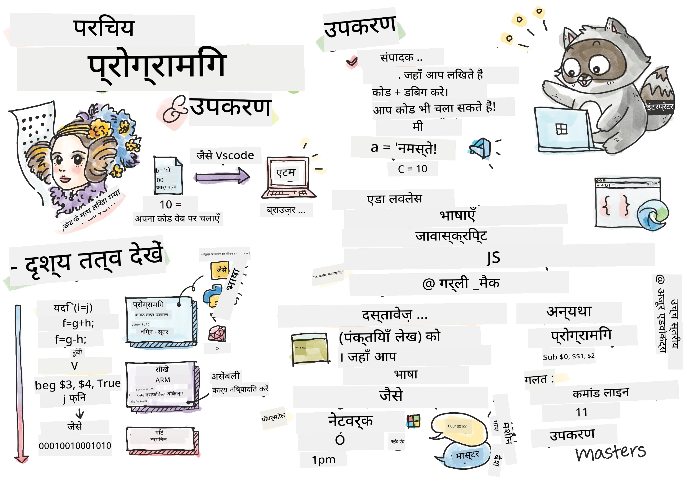
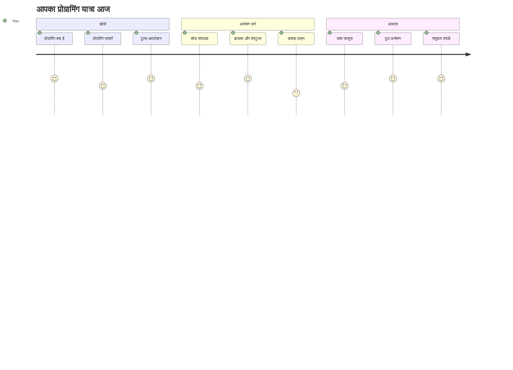
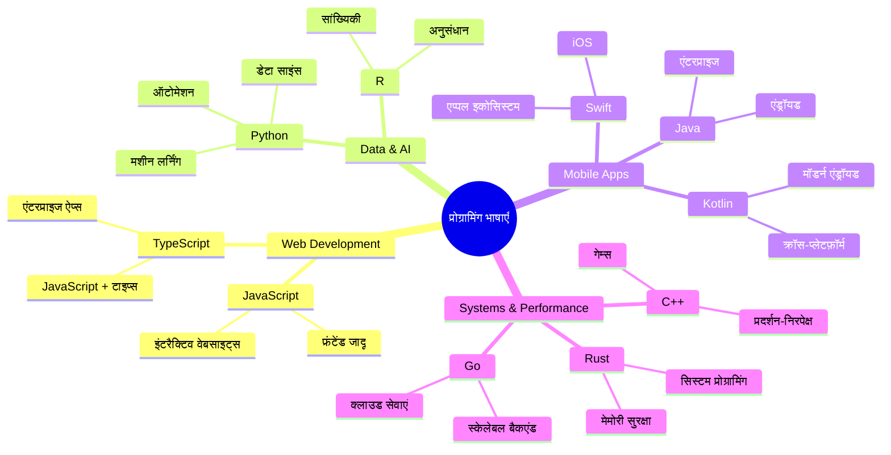
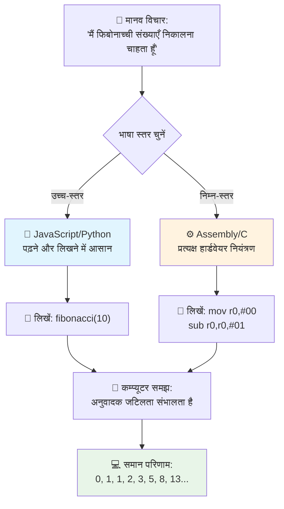
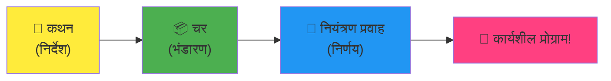
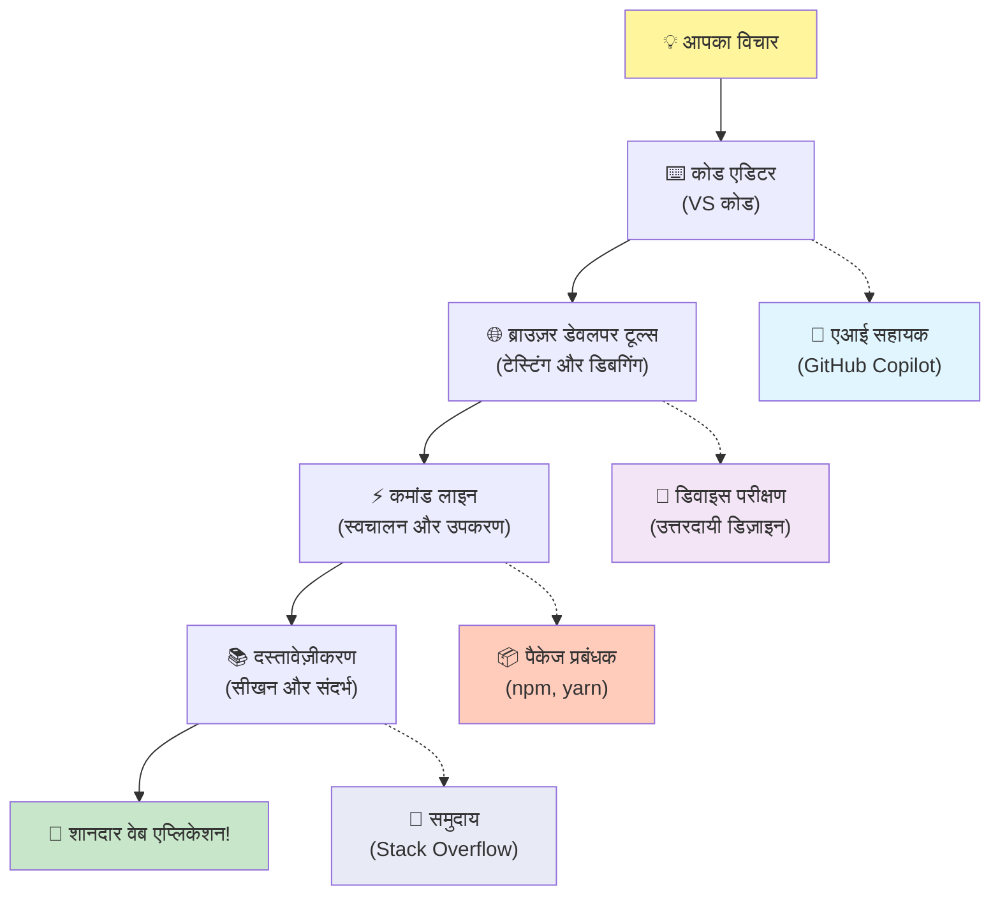
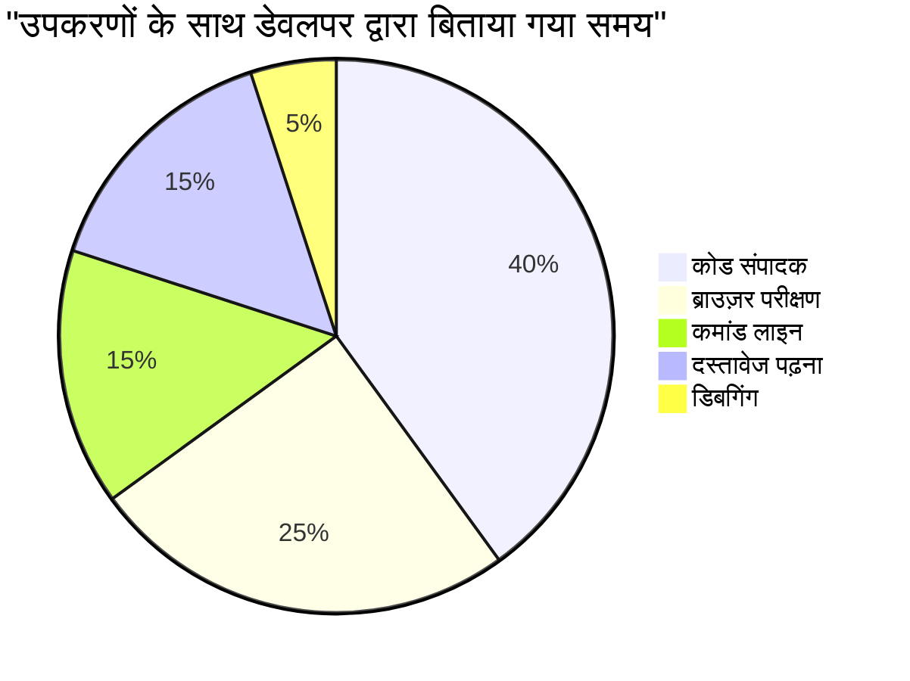

# प्रोग्रामिंग भाषाओं और आधुनिक डेवलपर टूल्स का परिचय

नमस्ते, भविष्य के डेवलपर! 👋 क्या मैं आपको कुछ ऐसा बता सकता हूँ जो मुझे हर दिन रोमांचित कर देता है? आप अभी यह खोजने वाले हैं कि प्रोग्रामिंग केवल कंप्यूटर के बारे में नहीं है – यह आपकी सबसे अविश्वसनीय कल्पनाओं को जीवन में लाने की वास्तविक सुपरपावर है!

आप जानते हैं वह पल जब आप अपने पसंदीदा ऐप का उपयोग कर रहे होते हैं और सब कुछ बिल्कुल सही ढंग से मेल खाता है? जब आप एक बटन दबाते हैं और कुछ बिल्कुल जादुई होता है जो आपको "वाह, उन्होंने यह कैसे किया?" कहने पर मजबूर कर देता है? खैर, कोई आप जैसे ही – शायद अपनी पसंदीदा कॉफी शॉप में 2 बजे अपनी तीसरी एस्प्रेसो के साथ बैठा – वह कोड लिखता है जिसने वह जादू बनाए। और यहाँ जो आपकी सोच को हिला देगा: इस पाठ के अंत तक, आप न केवल यह समझेंगे कि उन्होंने इसे कैसे किया, बल्कि आप खुद भी इसे आजमाने के लिए उत्सुक होंगे!

देखिए, मुझे पूरी तरह से समझ आता है अगर प्रोग्रामिंग अभी डरावना लग रहा हो। जब मैंने पहली बार शुरू किया था, तो मुझे सच में लगा था कि आपको कोई गणित का जीनियस होना चाहिए या पाँच साल की उम्र से कोडिंग कर रहे होना चाहिए। लेकिन यहाँ वह चीज़ है जिसने मेरी सोच पूरी तरह बदल दी: प्रोग्रामिंग बिल्कुल वैसी ही है जैसी एक नई भाषा में बातचीत सीखना। आप "नमस्ते" और "धन्यवाद" से शुरू करते हैं, फिर कॉफी ऑर्डर करने तक पहुँचते हैं, और फिर पता चलता है कि आप गहरे दार्शनिक वार्तालाप कर रहे हैं! बस इस मामले में, आप कंप्यूटरों से बातचीत कर रहे हैं, और ईमानदारी से? वे सबसे धैर्यशील बातचीत साथी हैं जिन्हें आपने कभी देखा होगा – वे कभी आपकी गलतियों का जज नहीं करते और हमेशा फिर से कोशिश करने के लिए उत्साहित रहते हैं!

आज, हम उन अद्भुत उपकरणों का अन्वेषण करने वाले हैं जो आधुनिक वेब विकास को न केवल संभव बनाते हैं, बल्कि अत्यधिक मजेदार भी। मैं बात कर रहा हूँ बिलकुल उन्हीं संपादकों, ब्राउज़रों, और वर्कफ़्लोज़ की जो नेटफ्लिक्स, स्पॉटिफाई, और आपके पसंदीदा इंडी ऐप स्टूडियो के डेवलपर हर दिन उपयोग करते हैं। और यहाँ वह हिस्सा है जो आपको खुश नाचने पर मजबूर कर देगा: इनमें से अधिकांश पेशेवर-ग्रेड, उद्योग-मानक उपकरण पूरी तरह से मुफ्त हैं!


> स्केचक नोट द्वारा [Tomomi Imura](https://twitter.com/girlie_mac)


## आईए देखें आप क्या पहले से जानते हैं!

मज़ेदार चीज़ों में कूदने से पहले, मैं जानना चाहता हूँ – आप इस प्रोग्रामिंग दुनिया के बारे में पहले से क्या जानते हैं? और सुनिए, अगर आप इन सवालों को देखकर सोच रहे हैं "मुझे इस बारे में बिल्कुल भी जानकारी नहीं है," तो यह ठीक है, यह परफेक्ट है! इसका मतलब है कि आप बिल्कुल सही जगह पर हैं। इस क्विज़ को सोचिए जैसे व्यायाम से पहले स्ट्रेचिंग – हम बस अपने दिमाग़ की मांसपेशियों को गर्म कर रहे हैं!

[प्री-लेसन क्विज़ लें](https://forms.office.com/r/dru4TE0U9n?origin=lprLink)


## हमारी जो यात्रा हम साथ में शुरू करने वाले हैं

ठीक है, मैं सच में उत्साहित हूँ कि हम आज क्या एक्सप्लोर करने वाले हैं! सच में, काश मैं आपकी प्रतिक्रिया देख पाता जब कुछ कॉन्सेप्ट्स समझ में आते हैं। यहाँ वह अद्भुत यात्रा है जो हम साथ में कर रहे हैं:

- **प्रोग्रामिंग असल में क्या है (और यह क्यों सबसे कूल चीज़ है!)** – हम जानेंगे कि कोड वह अदृश्य जादू है जो आपके चारों ओर सब कुछ संचालित करता है, उस अलार्म से जो किसी तरह से पता लगा लेता है कि सोमवार सुबह है, उस एल्गोरिद्म तक जो बिल्कुल सही तरीके से आपकी नेटफ्लिक्स सिफारिशें चुनता है
- **प्रोग्रामिंग भाषाएँ और उनकी अद्भुत विशेषताएँ** – कल्पना करें कि आप किसी पार्टी में गए जहां हर व्यक्ति के पास पूरी तरह अलग सुपरपावर होते हैं और समस्याओं को हल करने के अलग तरीके होते हैं। यही प्रोग्रामिंग भाषाओं की दुनिया है, और आप उनसे मिलकर प्यार कर लेंगे!
- **मूलभूत बिल्डिंग ब्लॉक्स जो डिजिटल जादू संभव बनाते हैं** – इन्हें ऐसे समझिए जैसे सबसे बेहतरीन क्रिएटिव LEGO सेट। एक बार जब आप समझ जाएंगे कि ये टुकड़े कैसे फिट होते हैं, तो आप कल्पना कर सकते हैं कि आप सच में कुछ भी बना सकते हैं
- **पेशेवर उपकरण जो आपको जादूगर की छड़ी थमाए जाने जैसा महसूस कराएंगे** – मैं बढ़ा-चढ़ा कर नहीं कह रहा हूं – ये उपकरण आपको सच में सुपरपावर जैसा महसूस कराएंगे, और सबसे अच्छी बात? ये वही उपकरण हैं जिनका प्रोफेशनल्स इस्तेमाल करते हैं!

> 💡 **एक बात:** आज सब कुछ याद करने की कोशिश बिल्कुल मत कीजिए! अभी मैं चाहता हूँ कि आप इस संभावना की जोशिलीय आगे बढ़ने की भावना महसूस करें। विवरण स्वाभाविक रूप से तब याद रहेंगे जब हम साथ अभ्यास करेंगे – यही असली सीखने का तरीका है!

> आप इस पाठ को [Microsoft Learn](https://docs.microsoft.com/learn/modules/web-development-101/introduction-programming/?WT.mc_id=academic-77807-sagibbon) पर भी ले सकते हैं!

## तो प्रोग्रामिंग *क्या* है असल में?

ठीक है, आईए उस करोड़ों डॉलर के सवाल पर बात करें: प्रोग्रामिंग वास्तव में क्या है?

मैं आपको एक कहानी देता हूँ जिसने मेरी सोच पूरी तरह बदल दी। पिछले हफ्ते, मैं अपनी माँ को समझाने की कोशिश कर रहा था कि हमारे नए स्मार्ट टीवी रिमोट का उपयोग कैसे करें। मैंने खुद को कहते हुए पाया “लाल बटन दबाओ, लेकिन वो बड़ा लाल बटन नहीं, बायाँ छोटा लाल बटन... नहीं, तुम्हारी दूसरी बाएँ... ठीक है, अब इसे दो सेकंड के लिए पकड़ो, एक नहीं, तीन नहीं...” सुनते हुए परिचित लग रहा है? 😅

यही है प्रोग्रामिंग! यह उस कला का नाम है जिसमें आप बहुत विस्तार से और चरण-दर-चरण निर्देश देते हैं किसी बहुत शक्तिशाली चीज़ को, जिसे सब कुछ बिल्कुल स्पष्ट रूप से बताना पड़ता है। बस फर्क इतना है कि आप अपनी माँ को नहीं (जो पूछ सकती हैं "कौन सा लाल बटन?!"), बल्कि कंप्यूटर को समझा रहे हैं (जो बिल्कुल वही करता है जो आप कहते हैं, भले ही आपने कुछ गलत कहा हो)।

जब मैं यह पहली बार सीख रहा था तो मुझे सबसे ज़्यादा हैरत थी: कंप्यूटर असल में अपने मूल में बहुत सरल हैं। वे बस दो चीज़ें समझते हैं – 1 और 0, जो basically "हाँ" और "ना" या "चालू" और "बंद" हैं। बस इतनी सी बात! लेकिन यहाँ जादू होता है – हमें 1 और 0 की भाषा में बात करने की ज़रूरत नहीं, जैसे हम The Matrix में हों। यहाँ **प्रोग्रामिंग भाषाएँ** काम आती हैं। वे ऐसी हैं जैसे दुनिया की सबसे बेहतरीन अनुवादक जो आपके सामान्य इंसानी विचारों को कंप्यूटर भाषा में बदल देती हैं।

और यह वह चीज है जो मुझे हर सुबह सच्चा रोमांचित करती है: आपकी ज़िंदगी में जो कुछ भी डिजिटल है, वह किसी आप जैसे ही व्यक्ति से शुरू हुआ, शायद पजामे में कप कॉफी लिए अपने लैपटॉप पर कोड टाइप करते हुए। वह इंस्टाग्राम फ़िल्टर जो आपको परफेक्ट दिखाता है? किसी ने कोड किया। वह सिफारिश जिसने आपको आपका नया पसंदीदा गाना दिया? किसी डेवलपर ने वह एल्गोरिद्म बनाया। वह ऐप जो आपके दोस्तों के साथ डिनर बिल बाँटने में मदद करता है? हाँ, किसी ने सोचा "ये बड़ी झंझट है, मैं इसे ठीक कर सकता हूँ" और फिर... उन्होंने कर दिखाया!

जब आप प्रोग्राम करना सीखते हैं, तो आप केवल एक नई स्किल नहीं सीख रहे होते – आप उस अद्भुत समस्या-समाधानकर्ता समुदाय का हिस्सा बन रहे होते हैं जो दिनभर सोचते रहते हैं, "अगर मैं कुछ ऐसा बना सकूं जो किसी का दिन थोड़ा बेहतर बना दे तो?" सच में, इससे कूल क्या हो सकता है?

✅ **मज़ेदार तथ्य ढूँढ़ना**: जब आपके पास फुर्सत हो, तो यह खोजिए कि दुनिया का पहला कंप्यूटर प्रोग्रामर कौन था? मैं आपको एक संकेत देता हूँ: यह आप जो सोच रहे हैं शायद वह न हो! इस व्यक्ति की कहानी पूरी तरह से रोचक है और दिखाती है कि प्रोग्रामिंग हमेशा से रचनात्मक समस्या-समाधान और बॉक्स के बाहर सोचने के बारे में रही है।

### 🧠 **जांच करें: आप कैसा महसूस कर रहे हैं?**

**एक पल लें सोचने के लिए:**
- क्या अब आपको "कंप्यूटरों को निर्देश देने" का विचार समझ में आता है?
- क्या आप कोई रोज़ाना का काम सोच सकते हैं जिसे आप प्रोग्रामिंग से स्वचालित करना चाहेंगे?
- इस पूरी प्रोग्रामिंग चीज़ के बारे में आपके मन में कौन से सवाल उठ रहे हैं?

> **याद रखिए**: यह बिलकुल सामान्य है अगर कुछ अवधारणाएँ अभी धुंधली लग रही हों। प्रोग्रामिंग सीखना एक नई भाषा सीखने जैसा है – आपके मस्तिष्क को उन न्यूरल पथों का निर्माण करने में समय लगता है। आप अच्छा कर रहे हैं!

## प्रोग्रामिंग भाषाएँ जादू के अलग-अलग स्वादों की तरह हैं

ठीक है, यह थोड़ा अजीब लग सकता है, पर मेरे साथ रहिए – प्रोग्रामिंग भाषाएँ संगीत के अलग-अलग प्रकारों की तरह हैं। सोचिए: आपके पास जैज़ है, जो स्मूद और इम्प्रोवाइज़ेशन वाला है, रॉक है जो शक्तिशाली और सरल है, क्लासिकल है जो सुरुचिपूर्ण और संरचित है, और हिप-हॉप है जो क्रिएटिव और अभिव्यक्तिपूर्ण है। हर शैली की अपनी अलग vibe है, अपने भावुक प्रशंसकों का अपना समुदाय है, और हर एक अलग मूड और मौके के लिए परफेक्ट है।

प्रोग्रामिंग भाषाएँ भी बिल्कुल ऐसा ही काम करती हैं! आप एक ही भाषा का उपयोग मजेदार मोबाइल गेम बनाने के लिए नहीं करेंगे जो आप विशाल मात्रा में क्लाइमेट डेटा crunch करने के लिए करते, ठीक वैसे ही जैसे आप योगा क्लास में डेथ मेटल नहीं सुनाएंगे (खैर, ज़्यादातर योगा क्लासेस में नहीं! 😄)।

पर कुछ ऐसी बात है जो मुझे हर बार सोचने पर चौंका देती है: ये भाषाएँ वैसे ही हैं जैसे दुनिया का सबसे धैर्यशील, प्रतिभाशाली दुभाषिया आपके बगल में बैठे हों। आप अपनी बात इस तरह से रख सकते हैं जो आपके इंसानी मस्तिष्क के लिए बिल्कुल प्राकृतिक लगे, और ये भाषाएँ उस बेहद जटिल काम को संभालती हैं जो इसे कंप्यूटर की 1 और 0 की भाषा में बदलता है। यह ऐसा है जैसे एक दोस्त जो दोनों "मानव रचनाशीलता" और "कंप्यूटर तर्क" में पूरी तरह धाराप्रवाह हो – और वे कभी थकते नहीं, कभी कॉफी ब्रेक नहीं लेते, और दो बार एक ही सवाल पूछने पर कभी नाराज़ नहीं होते!

### लोकप्रिय प्रोग्रामिंग भाषाएँ और उनका उपयोग


| भाषा | सबसे अच्छा उपयोग | यह क्यों लोकप्रिय है |
|----------|----------|------------------|
| **JavaScript** | वेब विकास, यूजर इंटरफेस | ब्राउज़र में चलता है और इंटरएक्टिव वेबसाइट्स को पावर करता है |
| **Python** | डेटा साइंस, ऑटोमेशन, एआई | पढ़ने और सीखने में आसान, शक्तिशाली पुस्तकालयों के साथ |
| **Java** | एंटरप्राइज़ एप्लीकेशंस, एंड्रॉयड ऐप्स | प्लेटफ़ॉर्म-स्वतंत्र, बड़े सिस्टम के लिए मजबूत |
| **C#** | विंडोज़ एप्लीकेशंस, गेम डेवलपमेंट | Microsoft इकोसिस्टम द्वारा मजबूत समर्थन |
| **Go** | क्लाउड सेवाएँ, बैकएंड सिस्टम | तेज, सरल, आधुनिक कंप्यूटिंग के लिए डिज़ाइन किया गया |

### उच्च-स्तरीय बनाम निम्न-स्तरीय भाषाएँ

ठीक है, यह वह अवधारणा थी जिसने मेरी समझ को सबसे ज्यादा तोड़ दिया जब मैं पहली बार सीख रहा था, इसलिए मैं वह रूपक साझा करने जा रहा हूँ जिसने मुझे इसे समझने में मदद की – और मुझे उम्मीद है यह आपको भी मदद करेगा!

कल्पना करें कि आप ऐसे देश में गए हैं जहाँ आप भाषा नहीं बोलते, और आपको सबसे नजदीकी बाथरूम ढूँढ़ना है (हम सभी ऐसा कर चुके हैं, है ना? 😅):

- **निम्न-स्तरीय प्रोग्रामिंग** उस स्थानीय बोली सीखने जैसा है जिससे आप फल बेचने वाली दादी से सांस्कृतिक संदर्भों, स्थानीय शब्दों और अंदर की बातों के साथ बात कर सकते हैं जो केवल वही लोग समझते हैं जो वहाँ बड़े हुए हों। बेहद प्रभावशाली और बहुत कुशल... अगर आप उस भाषा में धाराप्रवाह हों! लेकिन जब आप बस बाथरूम खोजना चाहते हों तो यह ज़्यादा भारी लग सकता है।

- **उच्च-स्तरीय प्रोग्रामिंग** ऐसा है जैसे आपके पास एक ऐसा स्थानीय दोस्त हो जो आपको पूरी तरह समझता हो। आप साधारण अंग्रेज़ी में कह सकते हैं "मुझे वाक़ई बाथरूम ढूँढना है," और वह सारी सांस्कृतिक अनुवाद करता है और आपको ऐसी दिशा-निर्देश देता है जो आपके गैर-स्थानीय दिमाग़ को पूरी तरह समझ में आ जाए।

प्रोग्रामिंग टर्म्स में:
- **निम्न-स्तरीय भाषाएँ** (जैसे Assembly या C) आपको कंप्यूटर के वास्तविक हार्डवेयर से बेहद विस्तृत बातचीत करने देती हैं, लेकिन आपको मशीन जैसा सोचना पड़ता है, जो... चलिए कहें यह एक बड़ा मानसिक बदलाव है!
- **उच्च-स्तरीय भाषाएँ** (जैसे JavaScript, Python या C#) आपको इंसान की तरह सोचने देती हैं जबकि ये भाषाएँ पर्दे के पीछे सारी मशीन-संबंधित बातें संभालती हैं। साथ ही, इनके पास अत्यंत स्वागतयोग्य समुदाय होते हैं जो याद रखते हैं कि कभी वे भी नए थे और वे सच में मदद करना चाहते हैं!

सोचिए मैं आपको किससे शुरू करने की सलाह दूंगा? 😉 उच्च-स्तरीय भाषाएँ ऐसी ट्रेनिंग व्हील्स की तरह हैं जिन्हें आप कभी उतारना नहीं चाहते क्योंकि वे अनुभव को बहुत आसान बना देती हैं!


### मैं आपको दिखाता हूँ कि उच्च-स्तरीय भाषाएँ इतनी ज्यादा मित्रवत क्यों हैं

ठीक है, मैं आपको कुछ दिखाने वाला हूँ जो पूरी तरह दर्शाता है कि मैं उच्च-स्तरीय भाषाओं से क्यों प्यार करता हूँ, लेकिन पहले – मुझे आपसे एक वादा चाहिए। जब आप पहला कोड उदाहरण देखें, घबराना नहीं! यह थोड़ा डरावना लग सकता है। यही मेरी बात का मुख्य हिस्सा है!

हम एक ही कार्य को दो पूरी तरह अलग शैली में लिखे हुए देखेंगे। दोनों Fibonacci अनुक्रम बनाते हैं – यह एक खूबसूरत गणितीय पैटर्न है जहाँ प्रत्येक संख्या पिछले दो की कुल होती है: 0, 1, 1, 2, 3, 5, 8, 13... (मज़ेदार तथ्य: यह पैटर्न आपको प्रकृति में हर जगह मिलेगा – सूरजमुखी के बीजों की घुमावदार लकीरें, पाइनकोन के पैटर्न, यहां तक कि आकाशगंगाओं के बनने का तरीका भी!)

मुक़ाबला देखने के लिए तैयार? चलिए शुरू करते हैं!

**उच्च-स्तरीय भाषा (JavaScript) – मानव-मैत्रीपूर्ण:**

```javascript
// चरण 1: बुनियादी फिबोनाच्ची सेटअप
const fibonacciCount = 10;
let current = 0;
let next = 1;

console.log('Fibonacci sequence:');
```

**यह कोड क्या करता है:**
- **घोषित करें** एक कॉन्स्टेंट कि हम कितने फिबोनाची नंबर जनरेट करना चाहते हैं  
- **शुरुआत करें** दो वेरिएबल्स जो अनुक्रम में वर्तमान और अगली संख्या को ट्रैक करें  
- **सेट करें** शुरुआती मान (0 और 1) जो फिबोनाची पैटर्न को परिभाषित करते हैं  
- **दिखाएँ** एक हेडर संदेश अपने आउटपुट को पहचानने के लिए

```javascript
// चरण 2: लूप के साथ अनुक्रम बनाएँ
for (let i = 0; i < fibonacciCount; i++) {
  console.log(`Position ${i + 1}: ${current}`);
  
  // अनुक्रम में अगला संख्या गणना करें
  const sum = current + next;
  current = next;
  next = sum;
}
```

**यहाँ क्या होता है:**
- **लूप करें** अनुक्रम की हर स्थिति पर `for` लूप का उपयोग कर  
- **दिखाएँ** प्रत्येक संख्या को उसकी स्थिति के साथ टेम्पलेट लिटरल फॉर्मेटिंग के माध्यम से  
- **गणना करें** अगली फिबोनाची संख्या को वर्तमान और अगले मान जोड़कर  
- **अपडेट करें** हमारे ट्रैकिंग वेरिएबल्स को अगली पुनरावृत्ति के लिए

```javascript
// चरण 3: आधुनिक कार्यात्मक दृष्टिकोण
const generateFibonacci = (count) => {
  const sequence = [0, 1];
  
  for (let i = 2; i < count; i++) {
    sequence[i] = sequence[i - 1] + sequence[i - 2];
  }
  
  return sequence;
};

// उपयोग का उदाहरण
const fibSequence = generateFibonacci(10);
console.log(fibSequence);
```

**ऊपर हमने किया है:**
- **बनाया** एक पुन: प्रयोज्य फ़ंक्शन आधुनिक ऐरो फ़ंक्शन सिंटैक्स का उपयोग करते हुए  
- **बनाया** एक एरे जिसमें पूरा अनुक्रम संग्रहीत किया गया, बजाय एक-एक करके दिखाने के  
- **इस्तेमाल किया** एरे इंडेक्सिंग हर नए नंबर की गणना करने के लिए पिछले मानों से  
- **रिटर्न किया** पूरा अनुक्रम ताकि इसे प्रोग्राम के अन्य भागों में फ्लेक्सिबली उपयोग किया जा सके

**निम्न-स्तरीय भाषा (ARM Assembly) – कंप्यूटर-मैत्रीपूर्ण:**

```assembly
 area ascen,code,readonly
 entry
 code32
 adr r0,thumb+1
 bx r0
 code16
thumb
 mov r0,#00
 sub r0,r0,#01
 mov r1,#01
 mov r4,#10
 ldr r2,=0x40000000
back add r0,r1
 str r0,[r2]
 add r2,#04
 mov r3,r0
 mov r0,r1
 mov r1,r3
 sub r4,#01
 cmp r4,#00
 bne back
 end
```

ध्यान दें कि JavaScript संस्करण लगभग अंग्रेज़ी निर्देशों जैसा पढ़ता है, जबकि Assembly संस्करण में ऐसे रहस्यमय कमांड हैं जो सीधे कंप्यूटर के प्रोसेसर को नियंत्रित करते हैं। दोनों काम बिल्कुल समान पूरा करते हैं, लेकिन उच्च-स्तरीय भाषा मनुष्यों के लिए समझना, लिखना, और बनाए रखना कहीं अधिक आसान है।

**मुख्य फर्क जो आप देखेंगे:**
- **पठन योग्यता**: JavaScript में वर्णनात्मक नाम जैसे `fibonacciCount` होते हैं जबकि Assembly में रहस्यमय लेबल्स जैसे `r0`, `r1` होते हैं
- **टिप्पणियाँ**: उच्च-स्तरीय भाषाएँ व्याख्यात्मक टिप्पणियाँ प्रोत्साहित करती हैं जो कोड को स्व-प्रलेखित बनाती हैं  
- **संरचना**: जावास्क्रिप्ट की तार्किक प्रक्रिया इस प्रकार होती है जैसे मनुष्य समस्याओं को चरण-दर-चरण सोचते हैं  
- **रखरखाव**: अलग-अलग आवश्यकताओं के लिए जावास्क्रिप्ट संस्करण को अपडेट करना सरल और स्पष्ट होता है  

✅ **फ़िबोनाच्ची अनुक्रम के बारे में**: यह अद्भुत संख्या पैटर्न (जहाँ प्रत्येक संख्या उससे पहले की दो संख्याओं का योग होती है: 0, 1, 1, 2, 3, 5, 8...) प्रकृति में शाब्दिक रूप से *हर जगह* दिखता है! आप इसे सूरजमुखी के स्पाइरल्स, पाइनकोन के पैटर्न, नॉटिलस शंख के घुमाव, और यहाँ तक कि पेड़ की शाखाओं के बढ़ने के तरीके में पाएंगे। यह बहुत ही विचारणीय है कि गणित और कोड की मदद से हम प्रकृति द्वारा सुंदरता बनाने के लिए उपयोग किए गए पैटर्न को समझ और पुनःनिर्मित कर सकते हैं!

## जादू को संभव बनाने वाली निर्माण खंड

ठीक है, अब जब आपने देखा कि प्रोग्रामिंग भाषाएँ किस तरह कार्यरत दिखती हैं, तो आइए उन मूलभूत तत्वों को समझें जो हर एक प्रोग्राम में होते हैं। इन्हें मानिए जैसे आपकी पसंदीदा रेसिपी के आवश्यक सामग्री – एक बार यह समझ गए कि हर एक का क्या काम है, तो आप लगभग किसी भी भाषा में कोड पढ़ और लिख पाएंगे!

यह प्रोग्रामिंग की व्याकरण सीखने जैसा है। याद है स्कूल में जब आपने संज्ञा, क्रिया, और वाक्य बनाने के नियम सीखे थे? प्रोग्रामिंग की भी अपनी व्याकरण होती है, और सच कहूँ तो यह अंग्रेजी व्याकरण से कहीं अधिक तार्किक और दयालु है! 😄

### स्टेटमेंट्स: क्रमवार निर्देश

चलिए शुरू करते हैं **स्टेटमेंट्स** से – ये आपके कंप्यूटर के साथ बातचीत में व्यक्तिगत वाक्य की तरह होते हैं। हर स्टेटमेंट कंप्यूटर को एक विशिष्ट काम करने का निर्देश देता है, जैसे कोई दिशा-निर्देश देना: "यहाँ बाएँ मुँड़ो," "लाल बत्ती पर रुक जाओ," "उस स्थान पर पार्क करो।"

मुझे स्टेटमेंट्स की एक खूबी बहुत पसंद है कि वे आमतौर पर पढ़ने में आसान होते हैं। इसे देखें:

```javascript
// मूल बयान जो एकल क्रियाएं करते हैं
const userName = "Alex";                    
console.log("Hello, world!");              
const sum = 5 + 3;                         
```
  
**यह कोड क्या करता है:**  
- उपयोगकर्ता का नाम संग्रहीत करने के लिए एक स्थिर चर घोषित करता है  
- कंसोल आउटपुट पर एक स्वागत संदेश दिखाता है  
- एक गणितीय ऑपरेशन का परिणाम गणना कर संग्रहीत करता है  

```javascript
// वेब पृष्ठों के साथ इंटरैक्ट करने वाले कथन
document.title = "My Awesome Website";      
document.body.style.backgroundColor = "lightblue";
```
  
**चरण-दर-चरण, यह हो रहा है:**  
- ब्राउज़र टैब में प्रदर्शित वेबपेज का शीर्षक संशोधित करता है  
- पूरे पृष्ठ के पृष्ठभूमि का रंग बदलता है  

### वेरिएबल्स: आपके प्रोग्राम की मेमोरी प्रणाली

ठीक है, **वेरिएबल्स** वास्तव में मेरी पसंदीदा अवधारणाओं में से एक हैं क्योंकि वे रोज़मर्रा की चीज़ों जैसे होते हैं जिनका आप रोजाना उपयोग करते हैं!

अपने फोन के संपर्क सूची के बारे में सोचें। आप हर किसी का नंबर याद नहीं रखते – बग़ैर नाम "माँ," "सबसे अच्छा दोस्त," या "पिज़्ज़ा की दुकान जो 2 बजे तक डिलीवर करती है" सहेज लेते हैं और फोन खुद नंबर याद रखता है। वेरिएबल्स भी बिल्कुल ऐसे ही होते हैं! वे लेबल वाले कंटेनर की तरह होते हैं जहाँ आपका प्रोग्राम जानकारी संग्रह कर सकता है और बाद में नाम के जरिए उसे पुनः प्राप्त कर सकता है जो सच में समझ में आता है।

यह दिलचस्प है: वेरिएबल्स आपके प्रोग्राम के चलते समय बदल सकते हैं (इसी कारण इन्हें "वेरिएबल" कहा जाता है – समझे?). जैसे आप पिज़्ज़ा की दुकान का संपर्क अपडेट कर सकते हैं यदि कहीं बेहतर मिल जाए, वैसे ही वेरिएबल्स तब अपडेट होते हैं जब प्रोग्राम नई जानकारी सीखता है या परिस्थिति बदलती है!

आइए मैं आपको दिखाता हूँ कि यह कितना सरल और खूबसूरत हो सकता है:

```javascript
// चरण 1: मूल चर बनाना
const siteName = "Weather Dashboard";        
let currentWeather = "sunny";               
let temperature = 75;                       
let isRaining = false;                      
```
  
**इन अवधारणाओं को समझना:**  
- `const` वेरिएबल्स में अपरिवर्तनीय मान संग्रहीत करें (जैसे साइट का नाम)  
- `let` का उपयोग उन मानों के लिए करें जो प्रोग्राम के दौरान बदल सकते हैं  
- विभिन्न डाटा प्रकारों को सौंपें: स्ट्रिंग्स (टेक्स्ट), संख्याएं, और बूलीयन (सही/गलत)  
- वर्णनात्मक नाम चुनें जो समझाएं कि हर वेरिएबल में क्या है  

```javascript
// चरण 2: संबंधित डेटा को समूहित करने के लिए वस्तुओं के साथ कार्य करना
const weatherData = {                       
  location: "San Francisco",
  humidity: 65,
  windSpeed: 12
};
```
  
**ऊपर हमने:**  
- एक ऑब्जेक्ट बनाया जो मौसम से संबंधित जानकारी को एक साथ रखता है  
- एक ही वेरिएबल नाम के तहत कई डेटा टुकड़े व्यवस्थित किए  
- प्रत्येक जानकारी के टुकड़े को स्पष्ट रूप से लेबल करने के लिए की-वैल्यू पेयर इस्तेमाल किए  

```javascript
// चरण 3: चर का उपयोग और अपडेट करना
console.log(`${siteName}: Today is ${currentWeather} and ${temperature}°F`);
console.log(`Wind speed: ${weatherData.windSpeed} mph`);

// परिवर्तनीय चर को अपडेट करना
currentWeather = "cloudy";                  
temperature = 68;                          
```
  
**आइए हर हिस्से को समझें:**  
- टेम्प्लेट लिटरेल्स का उपयोग करके `${}` सिंटैक्स से जानकारी दिखाएं  
- डॉट नोटेशन (`weatherData.windSpeed`) से ऑब्जेक्ट प्रॉपर्टीज़ तक पहुँचें  
- `let` से घोषित वेरिएबल्स को बदलते हालात के अनुसार अपडेट करें  
- कई वेरिएबल्स को मिलाकर सार्थक संदेश बनाएं  

```javascript
// चरण 4: साफ़ कोड के लिए आधुनिक डीस्ट्रक्चरिंग
const { location, humidity } = weatherData; 
console.log(`${location} humidity: ${humidity}%`);
```
  
**आपको जानना ज़रूरी है:**  
- ऑब्जेक्ट से विशिष्ट प्रॉपर्टीज़ डिस्ट्रक्चरिंग असाइनमेंट से निकालें  
- ऑब्जेक्ट कीस के समान नामों वाले नए वेरिएबल्स स्वतः बनाएं  
- बार-बार डॉट नोटेशन इस्तेमाल करने से बचकर कोड को सरल बनाएं  

### नियंत्रण प्रवाह: अपने प्रोग्राम को सोचने की शिक्षा देना

ठीक है, यहाँ प्रोग्रामिंग वास्तव में दिमाग घुमाने वाली हो जाती है! **कंट्रोल फ्लो** बुनियादी तौर पर आपके प्रोग्राम को स्मार्ट निर्णय लेना सिखाना है, बिलकुल उसी तरह जैसे आप हर दिन बिना सोचे समझे करते हैं।

कल्पना कीजिए: आज सुबह आपने ऐसा कुछ किया होगा जैसे "अगर बारिश हो रही है, तो छाता लूँगा। अगर ठंड है, तो जैकेट पहनूंगा। अगर मैं देर से हूँ, तो नाश्ता छोड़कर रास्ते में कॉफी लूँगा।" आपका दिमाग स्वाभाविक रूप से हर दिन इस तरह के कई फैसले करता है!

यही वजह है कि प्रोग्राम्स बुद्धिमान और जीवंत लगते हैं, केवल एक उबाऊ, अनुमानित स्क्रिप्ट का पालन नहीं करते। वे स्थिति को देख सकते हैं, परिस्थितियों का मूल्यांकन कर सकते हैं, और सही प्रतिक्रिया दे सकते हैं। यह आपके प्रोग्राम को एक दिमाग देने जैसा है जो अनुकूलन कर सकता है और निर्णय ले सकता है!

देखना चाहते हैं कि यह कितना खूबसूरती से काम करता है? मैं दिखाता हूँ:

```javascript
// चरण 1: मूल शर्तीय तर्क
const userAge = 17;

if (userAge >= 18) {
  console.log("You can vote!");
} else {
  const yearsToWait = 18 - userAge;
  console.log(`You'll be able to vote in ${yearsToWait} year(s).`);
}
```
  
**यह कोड क्या करता है:**  
- उपयोगकर्ता की उम्र को मतदान योग्यता के लिए जांचता है  
- स्थिति के परिणाम के आधार पर अलग कोड ब्लॉक्स चलाता है  
- 18 से कम उम्र वालों के लिए मतदान योग्यता तक बचे समय की गणना और प्रदर्शन करता है  
- हर स्थिति के लिए विशिष्ट, सहायक प्रतिक्रिया देता है  

```javascript
// चरण 2: तर्क ऑपरेटरों के साथ कई शर्तें
const userAge = 17;
const hasPermission = true;

if (userAge >= 18 && hasPermission) {
  console.log("Access granted: You can enter the venue.");
} else if (userAge >= 16) {
  console.log("You need parent permission to enter.");
} else {
  console.log("Sorry, you must be at least 16 years old.");
}
```
  
**यहाँ क्या हो रहा है:**  
- `&&` (और) आपरेटर की मदद से कई स्थितियों को मिलाता है  
- `else if` का उपयोग करके कई स्थिति की श्रेणी बनाता है  
- अंतिम `else` स्टेटमेंट से सभी संभावित मामलों को संभालता है  
- हर अलग स्थिति के लिए स्पष्ट, क्रियान्वयन योग्य प्रतिक्रिया प्रदान करता है  

```javascript
// चरण 3: टर्नरी ऑपरेटर के साथ संक्षिप्त शर्तीय
const votingStatus = userAge >= 18 ? "Can vote" : "Cannot vote yet";
console.log(`Status: ${votingStatus}`);
```
  
**याद रखने योग्य बातें:**  
- सरल दो विकल्प वाले निर्णयों के लिए टर्नरी ऑपरेटर (`? :`) का उपयोग करें  
- पहले स्थिति लिखें, फिर `?`, फिर सही परिणाम, फिर `:`, और फिर गलत परिणाम लिखें  
- परिस्थितियों के अनुसार मान नियुक्त करने के लिए यह पैटर्न लागू करें  

```javascript
// चरण 4: कई विशिष्ट मामलों को संभालना
const dayOfWeek = "Tuesday";

switch (dayOfWeek) {
  case "Monday":
  case "Tuesday":
  case "Wednesday":
  case "Thursday":
  case "Friday":
    console.log("It's a weekday - time to work!");
    break;
  case "Saturday":
  case "Sunday":
    console.log("It's the weekend - time to relax!");
    break;
  default:
    console.log("Invalid day of the week");
}
```
  
**यह कोड निम्न कार्य करता है:**  
- वेरिएबल के मान को कई विशिष्ट मामलों के साथ मिलाता है  
- समान मामलों को समूहित करता है (वर्किंग दिन बनाम सप्ताहांत)  
- जब मेल मिलता है तो उपयुक्त कोड ब्लॉक चलाता है  
- अप्रत्याशित मानों को संभालने के लिए `default` मामला शामिल करता है  
- कोड को अगले मामले तक जाने से रोकने के लिए `break` स्टेटमेंट का उपयोग करता है  

> 💡 **वास्तविक दुनिया की तुलना**: कंट्रोल फ्लो को ऐसे समझिए जैसे आपके पास दुनिया का सबसे धीरज वाला GPS हो जो आपको दिशानिर्देश देता है। यह कह सकता है "अगर मेन स्ट्रीट पर ट्रैफिक है, तो हाईवे लें। अगर हाईवे पर निर्माण कार्य है, तो मनोरम रास्ता आजमाएं।" प्रोग्राम इसी तरह की शर्तीय लॉजिक का इस्तेमाल करते हैं ताकि वे बुद्धिमानी से विभिन्न परिस्थितियों का जवाब दें और उपयोगकर्ताओं को सर्वोत्तम अनुभव प्रदान करें।  

### 🎯 **अवधारणा जाँच: निर्माण खंडों में महारत**

**देखते हैं कि आप मूल बातें कितना समझे हैं:**  
- क्या आप अपने शब्दों में वेरिएबल और स्टेटमेंट के बीच का अंतर समझा सकते हैं?  
- एक वास्तविक जीवन की स्थिति सोचिए जहाँ आप if-then निर्णय का उपयोग कर सकें (जैसे हमारा मतदान उदाहरण)  
- प्रोग्रामिंग लॉजिक के बारे में कौन सी बात ने आपको आश्चर्यचकित किया?  

**त्वरित आत्मविश्वास बढ़ाने वाला:**  

✅ **आगे क्या आने वाला है**: हम इन अवधारणाओं में और गहराई से उतरेंगे और इस अद्भुत यात्रा को साथ मिलकर जारी रखेंगे! अभी बस उन सभी शानदार संभावनाओं को लेकर उत्साहित होने पर ध्यान दें जो आपके सामने हैं। विशेष कौशल और तकनीकें अभ्यास के दौरान स्वाभाविक रूप से आ जाएंगी – मुझे विश्वास है कि यह उम्मीद से कहीं अधिक मज़ेदार होगा!  

## व्यापार के उपकरण

ठीक है, यहाँ मैं इतना उत्साहित हूँ कि खुद को रोक नहीं पा रहा! 🚀 हम उन अविश्वसनीय उपकरणों के बारे में बात करने वाले हैं जो आपको ऐसा महसूस कराएंगे जैसे आपको डिजिटल अंतरिक्ष यान की चाबियाँ मिल गई हों।

आप जानते हैं जैसे एक शेफ के पास बेंजोरी नाइफ्स होते हैं जो उनके हाथों का विस्तार लगते हैं? या जैसे एक संगीतकार के पास एक गिटार होता है जो छूते ही संगीत गाने लगता है? वैसे ही डेवलपर्स के पास अपने जादुई उपकरण होते हैं, और यहाँ कुछ है जो आपका दिमाग उड़ाने वाला है – इनमें से अधिकांश पूरी तरह से मुफ़्त हैं!

मैं इस बारे में सोचकर बिल्कुल उछल रहा हूँ कि ये उपकरण आपके साथ साझा करूँ क्योंकि इन्होंने सॉफ्टवेयर बनाने के तरीके में क्रांति ला दी है। हम बात कर रहे हैं AI-सक्षम कोडिंग असिस्टेंट्स की जो आपके कोड को लिखने में सहायता कर सकते हैं (मैं मज़ाक नहीं कर रहा!), क्लाउड वातावरण जहां से आप वाई-फाई की मदद से कहीं से भी पूरे ऐप्लिकेशन बना सकते हैं, और डिबगिंग उपकरण जो इतने परिष्कृत हैं कि वे आपकी प्रोग्रामिंग के लिए एक्स-रे विज़न की तरह हैं।

और यह हिस्सा जो मुझे अभी भी रोमांचित करता है: ये "शुरुआती उपकरण" नहीं हैं जिनसे आप आगे बढ़ जाएंगे। ये वही पेशेवर ग्रेड उपकरण हैं जिन्हें गूगल, नेटफ्लिक्स, और जो इंडी ऐप स्टूडियो आप पसंद करते हैं, वे अभी इसी पल उपयोग कर रहे हैं। ये इस्तेमाल करके आपको प्रो जैसा महसूस होगा!


### कोड एडिटर्स और IDEs: आपके नए डिजिटल सबसे अच्छे दोस्त

आइए कोड एडिटर्स की बात करते हैं – ये वास्तव में आपके पसंदीदा जगहें बनने वाले हैं! इन्हें ऐसे समझिए जैसे आपका व्यक्तिगत कोडिंग अभयारण्य जहाँ आप अपने डिजिटल निर्माण को बनाने और सुधारने में अधिकांश समय बिताएंगे।

लेकिन आधुनिक एडिटर्स में जो असाधारण बात है वह यह है कि वे केवल साधारण टेक्स्ट एडिटर नहीं हैं। वे ऐसे हैं जैसे आपके बगल में दिन-रात सबसे बुद्धिमान, सहायक कोडिंग मेंटर बैठे हों। ये आपकी टाइपिंग की गलतियाँ पहले पकड़ लेते हैं जब आपको पता भी नहीं चलता, सुधार के सुझाव देते हैं जो आपको जीनियस जैसा दिखाते हैं, यह समझाने में मदद करते हैं कि हर कोड का टुकड़ा क्या करता है, और उनमें से कुछ पूर्वानुमान भी लगा लेते हैं कि आप क्या टाइप करने वाले हैं और आपके विचार पूरे करने का प्रस्ताव देते हैं!

मुझे याद है जब मैंने पहली बार ऑटो-कंप्लीशन देखा था – मुझे सचमुच ऐसा लगा जैसे मैं भविष्य में जी रहा हूँ। आप कुछ टाइप करना शुरू करते हैं, और आपका एडिटर कहता है, "अरे, क्या आप यह फंक्शन इस्तेमाल करने जा रहे थे जो बिल्कुल आपकी जरूरत पूरा करता है?" यह ऐसा है जैसे आपके कोडिंग साथी में एक मानसिक रीडर हो!

**ये एडिटर्स इतने अद्भुत क्या बनाते हैं?**

आधुनिक कोड एडिटर्स उत्पादकता बढ़ाने के लिए फीचर्स का प्रभावशाली सेट प्रदान करते हैं:

| फीचर | क्या करता है | क्यों मददगार है |
|---------|--------------|--------------|
| **सिंटैक्स हाइलाइटिंग** | कोड के विभिन्न हिस्सों को रंगीन बनाता है | कोड पढ़ना आसान बनाता है और त्रुटियाँ पहचानने में मदद करता है |
| **ऑटो-कंप्लीशन** | टाइप करते वक्त कोड का सुझाव देता है | कोडिंग तेज करता है और टाइपो कम करता है |
| **डिबगिंग टूल्स** | त्रुटियाँ खोजने और सुधारने में मदद करता है | समस्या सुलझाने में घंटों बचाता है |
| **एक्सटेंशंस** | विशेष फीचर्स जोड़ता है | किसी भी तकनीक के लिए एडिटर अनुकूलित करता है |
| **AI असिस्टेंट्स** | कोड और व्याख्यान सुझाव देते हैं | सीखने और उत्पादकता को तेज करता है |

> 🎥 **वीडियो संसाधन**: इन उपकरणों को क्रियान्वित देखने के लिए यह [Tools of the Trade वीडियो](https://youtube.com/watch?v=69WJeXGBdxg) देखें।  

#### वेब विकास के लिए अनुशंसित एडिटर्स

**[Visual Studio Code](https://code.visualstudio.com/?WT.mc_id=academic-77807-sagibbon)** (मुफ़्त)  
- वेब डेवलपर्स में सबसे लोकप्रिय  
- एक्सटेंशन का बेहतरीन पारिस्थितिकी तंत्र  
- इनबिल्ट टर्मिनल और Git इंटीग्रेशन  
- **जरूरी एक्सटेंशंस:**  
  - [GitHub Copilot](https://marketplace.visualstudio.com/items?itemName=GitHub.copilot) - AI-सक्षम कोड सुझाव  
  - [Live Share](https://marketplace.visualstudio.com/items?itemName=MS-vsliveshare.vsliveshare) - रियल-टाइम सहयोग  
  - [Prettier](https://marketplace.visualstudio.com/items?itemName=esbenp.prettier-vscode) - स्वचालित कोड फॉर्मैटिंग  
  - [Code Spell Checker](https://marketplace.visualstudio.com/items?itemName=streetsidesoftware.code-spell-checker) - कोड में टाइपो पकड़ना  

**[JetBrains WebStorm](https://www.jetbrains.com/webstorm/)** (पेड, छात्रों के लिए मुफ्त)  
- उन्नत डिबगिंग और परीक्षण उपकरण  
- बुद्धिमान कोड पूर्णता  
- इनबिल्ट संस्करण नियंत्रण  

**क्लाउड-आधारित IDEs** (विभिन्न मूल्य निर्धारण)  
- [GitHub Codespaces](https://github.com/features/codespaces) - आपके ब्राउज़र में पूरा VS Code  
- [Replit](https://replit.com/) - सीखने और कोड साझा करने के लिए उत्कृष्ट  
- [StackBlitz](https://stackblitz.com/) - त्वरित, पूर्ण स्टैक वेब विकास  

> 💡 **शुरुआत करने का सुझाव:** Visual Studio Code से शुरू करें – यह मुफ़्त है, उद्योग में व्यापक रूप से उपयोग किया जाता है, और इसके लिए कई उपयोगी ट्यूटोरियल और एक्सटेंशंस की बड़ी समुदाय है।  

### वेब ब्राउज़र: आपका गुप्त विकास प्रयोगशाला

ठीक है, तैयार हो जाइए अपने दिमाग को पूरी तरह से उड़ाने के लिए! आप जानते हैं कि आप ब्राउज़रों का उपयोग कैसे सोशल मीडिया स्क्रॉल करने और वीडियो देखने के लिए करते रहे हैं? तो पता चला कि वे इस पूरी अवधि में एक अद्भुत गुप्त डेवलपर प्रयोगशाला छुपाए हुए थे, बस आपके द्वारा खोजे जाने के लिए!

हर बार जब आप किसी वेबपेज पर राइट-क्लिक करके "Inspect Element" चुनते हैं, तो आप डेवलपर टूल्स की एक छिपी हुई दुनिया खोलते हैं जो वास्तव में उन महंगे सॉफ़्टवेयर से भी अधिक शक्तिशाली हैं जिनके लिए मैं कभी सैंकड़ों डॉलर देता था। यह ऐसा है जैसे आपका पुराना साधारण रसोईघर एक गुप्त पैनल के पीछे एक पेशेवर शेफ की प्रयोगशाला छुपाए हुए हो!
पहली बार जब किसी ने मुझे ब्राउज़र DevTools दिखाया, तो मैंने लगभग तीन घंटे सिर्फ क्लिक करते हुए बिताए और कहा "रुको, ये भी कर सकता है?!" आप सचमुच किसी भी वेबसाइट को रियल-टाइम में एडिट कर सकते हैं, देख सकते हैं कि सब कुछ कितनी तेजी से लोड हो रहा है, अपने साइट को विभिन्न डिवाइसों पर कैसे दिखता है टेस्ट कर सकते हैं, और यहां तक कि जावास्क्रिप्ट को पूरी प्रोफेशनल तरह से डिबग कर सकते हैं। यह बिल्कुल दिमाग उड़ाने वाला है!

**ये हैं वो कारण जिनकी वजह से ब्राउज़र आपका गुप्त हथियार हैं:**

जब आप कोई वेबसाइट या वेब ऐप्लीकेशन बनाते हैं, तो आपको यह देखना होगा कि यह वास्तविक दुनिया में कैसा दिखता है और कैसा व्यवहार करता है। ब्राउज़र न केवल आपका काम दिखाते हैं बल्कि प्रदर्शन, पहुंच और संभावित समस्याओं के बारे में विस्तृत प्रतिक्रिया भी देते हैं।

#### ब्राउज़र डेवलपर टूल्स (DevTools)

आधुनिक ब्राउज़र व्यापक डेवलपमेंट सूट शामिल करते हैं:

| टूल श्रेणी | यह क्या करता है | उदाहरण उपयोग केस |
|------------|-----------------|------------------|
| **एलिमेंट इंस्पेक्टर** | HTML/CSS को रियल-टाइम में देखें और संपादित करें | तुरंत परिणाम देखने के लिए स्टाइलिंग में बदलाव करें |
| **कंसोल** | त्रुटि संदेश देखें और जावास्क्रिप्ट टेस्ट करें | समस्याएं डिबग करें और कोड के साथ प्रयोग करें |
| **नेटवर्क मॉनिटर** | संसाधनों के लोड होने का ट्रैक रखें | प्रदर्शन और लोडिंग समय को अनुकूलित करें |
| **सुलभता चेकर** | समावेशी डिजाइन के लिए टेस्ट करें | सुनिश्चित करें कि आपकी साइट सभी उपयोगकर्ताओं के लिए काम करे |
| **डिवाइस सिम्युलेटर** | विभिन्न स्क्रीन साइज पर पूर्वावलोकन करें | बिना कई डिवाइसों के रेस्पॉन्सिव डिजाइन टेस्ट करें |

#### विकास के लिए अनुशंसित ब्राउज़र

- **[Chrome](https://developers.google.com/web/tools/chrome-devtools/)** - विस्तृत दस्तावेज़ीकरण के साथ उद्योग-मानक DevTools
- **[Firefox](https://developer.mozilla.org/docs/Tools)** - उत्कृष्ट CSS Grid और accessibility टूल्स
- **[Edge](https://docs.microsoft.com/microsoft-edge/devtools-guide-chromium/?WT.mc_id=academic-77807-sagibbon)** - Microsoft के डेवलपर संसाधनों के साथ Chromium आधारित

> ⚠️ **महत्वपूर्ण परीक्षण टिप**: हमेशा अपनी वेबसाइट्स को कई ब्राउज़रों में टेस्ट करें! जो Chrome में बिल्कुल सही काम करता है, वह Safari या Firefox में अलग दिख सकता है। पेशेवर डेवलपर्स सभी मुख्य ब्राउज़रों में परीक्षण करते हैं ताकि लगातार उपयोगकर्ता अनुभव सुनिश्चित हो सके।


### कमांड लाइन टूल्स: आपके डेवलपर सुपरपावर के द्वार

ठीक है, आइए कमांड लाइन के बारे में पूरी ईमानदारी से बात करें, क्योंकि मैं चाहता हूं कि आप इसे किसी से सुनें जो वास्तव में इसे समझता है। जब मैंने इसे पहली बार देखा – यह सिर्फ एक डरावनी काली स्क्रीन थी जिसमें टेबलाइट टेक्स्ट चमक रहा था – मैं सच में सोच रहा था, "नहीं, बिल्कुल नहीं! यह कुछ 1980 के दशक की हैकर मूवी जैसा लग रहा है, और मैं इसके लिए बिल्कुल स्मार्ट नहीं हूं!" 😅

लेकिन यहां जो मैं चाहता हूं कि कोई तब मुझे बताता, और मैं आपको अभी बता रहा हूं: कमांड लाइन डरावनी नहीं है – यह वास्तव में आपके कंप्यूटर से सीधे बातचीत करने जैसा है। इसे ऐसे समझिए जैसे खाना ऑर्डर करना एक खूबसूरत ऐप सेPictures और मेनू के साथ (जो आसान और सुंदर है) के बजाय अपने पसंदीदा स्थानीय रेस्तरां में जाना, जहां शेफ को पता है कि आपको क्या पसंद है और वह "मुझे कुछ आश्चर्यजनक दें" कहने मात्र से कुछ परफेक्ट बनाने लगता है।

कमांड लाइन वह जगह है जहां डेवलपर्स खुद को जादूगर महसूस करते हैं। आप कुछ जादुई शब्द टाइप करते हैं (ठीक है, ये सिर्फ कमांड हैं, लेकिन वे जादूई लगते हैं!), एंटर दबाते हैं और झट से – आपने पूरे प्रोजेक्ट स्ट्रक्चर बनाए, दुनिया भर से पावरफुल टूल्स इंस्टॉल किए, या अपनी ऐप को इंटरनेट पर करोड़ों लोगों के देखने के लिए डिप्लॉय कर दिया। एक बार जब आप इस शक्ति का पहला स्वाद चख लेते हैं, तो यह सचमुच बहुत लगने वाला होता है!

**कमांड लाइन आपका पसंदीदा टूल क्यों बनेगा:**

जबकि ग्राफिकल इंटरफेस कई कार्यों के लिए बढ़िया हैं, कमांड लाइन ऑटोमेशन, सटीकता, और गति में उत्कृष्ट है। कई डेवलपमेंट टूल मुख्य रूप से कमांड लाइन इंटरफेस के माध्यम से काम करते हैं, और उन्हें कुशलतापूर्वक उपयोग करना सीखना आपकी उत्पादकता को नाटकीय रूप से बढ़ा सकता है।

```bash
# चरण 1: प्रोजेक्ट निर्देशिका बनाएँ और उसमें जाएँ
mkdir my-awesome-website
cd my-awesome-website
```

**यह कोड क्या करता है:**
- **"my-awesome-website" नाम का नया डायरेक्ट्री बनाएं** अपने प्रोजेक्ट के लिए
- **नए बनाए गए डायरेक्ट्री में प्रवेश करें** काम शुरू करने के लिए

```bash
# चरण 2: package.json के साथ प्रोजेक्ट प्रारंभ करें
npm init -y

# आधुनिक विकास उपकरण स्थापित करें
npm install --save-dev vite prettier eslint
npm install --save-dev @eslint/js
```

**कदम दर कदम, यह हो रहा है:**
- `npm init -y` के साथ डिफ़ॉल्ट सेटिंग्स से नया Node.js प्रोजेक्ट इनिशियलाइज़ करना
- तेज़ विकास और उत्पादन बिल्ड्स के लिए Vite को आधुनिक बिल्ड टूल के रूप में इंस्टॉल करना
- स्वचालित कोड प्रारूपण के लिए Prettier और कोड गुणवत्ता जांच के लिए ESLint जोड़ना
- इन्हें विकास-केवल निर्भरताओं के रूप में चिह्नित करने के लिए `--save-dev` फ़्लैग का इस्तेमाल

```bash
# चरण 3: परियोजना संरचना और फ़ाइलें बनाएं
mkdir src assets
echo '<!DOCTYPE html><html><head><title>My Site</title></head><body><h1>Hello World</h1></body></html>' > index.html

# विकास सर्वर शुरू करें
npx vite
```

**ऊपर, हमने किया है:**
- स्रोत कोड और एसेट्स के लिए अलग-अलग फोल्डर बनाकर अपने प्रोजेक्ट को व्यवस्थित किया
- उचित डॉक्युमेंट संरचना के साथ एक बुनियादी HTML फ़ाइल जनरेट की
- लाइव रीलोडिंग और हॉट मॉड्यूल रिप्लेसमेंट के लिए Vite डेवलपमेंट सर्वर शुरू किया

#### वेब विकास के लिए आवश्यक कमांड लाइन टूल्स

| टूल | उद्देश्य | आपको इसकी जरूरत क्यों है |
|------|---------|-------------------------|
| **[Git](https://git-scm.com/)** | वर्शन कंट्रोल | परिवर्तन ट्रैक करें, दूसरों के साथ सहयोग करें, अपने काम का बैकअप लें |
| **[Node.js & npm](https://nodejs.org/)** | जावास्क्रिप्ट रनटाइम & पैकेज मैनेजमेंट | ब्राउज़र के बाहर जावास्क्रिप्ट चलाएं, आधुनिक विकास टूल्स इंस्टॉल करें |
| **[Vite](https://vitejs.dev/)** | बिल्ड टूल & देव सर्वर | हॉट मॉड्यूल रिप्लेसमेंट के साथ तेज़ विकास |
| **[ESLint](https://eslint.org/)** | कोड क्वालिटी | अपने जावास्क्रिप्ट में समस्याओं को स्वचालित रूप से खोजें और ठीक करें |
| **[Prettier](https://prettier.io/)** | कोड फ़ॉर्मेटिंग | अपने कोड को लगातार फार्मेटेड और पठनीय रखें |

#### प्लेटफ़ॉर्म-विशिष्ट विकल्प

**Windows:**
- **[Windows Terminal](https://docs.microsoft.com/windows/terminal/?WT.mc_id=academic-77807-sagibbon)** - आधुनिक, फीचर-समृद्ध टर्मिनल
- **[PowerShell](https://docs.microsoft.com/powershell/?WT.mc_id=academic-77807-sagibbon)** 💻 - शक्तिशाली स्क्रिप्टिंग वातावरण
- **[Command Prompt](https://docs.microsoft.com/windows-server/administration/windows-commands/?WT.mc_id=academic-77807-sagibbon)** 💻 - पारंपरिक विंडोज़ कमांड लाइन

**macOS:**
- **[Terminal](https://support.apple.com/guide/terminal/)** 💻 - बिल्ट-इन टर्मिनल एप्लीकेशन
- **[iTerm2](https://iterm2.com/)** - उन्नत फीचर्स के साथ बेहतर टर्मिनल

**Linux:**
- **[Bash](https://www.gnu.org/software/bash/)** 💻 - स्टैण्डर्ड लिनक्स शेल
- **[KDE Konsole](https://docs.kde.org/trunk5/en/konsole/konsole/index.html)** - उन्नत टर्मिनल इम्यूलेटर

> 💻 = ऑपरेटिंग सिस्टम पर पूर्व-इंस्टॉल्ड

> 🎯 **शिक्षा मार्ग**: पहले `cd` (डायरेक्ट्री बदलें), `ls` या `dir` (फाइल सूची), और `mkdir` (फोल्डर बनाएं) जैसे बुनियादी कमांड से शुरू करें। आधुनिक वर्कफ़्लो कमांड जैसे `npm install`, `git status`, और `code .` (VS Code में वर्तमान डायरेक्ट्री खोलें) का अभ्यास करें। जैसे-जैसे आप सहज होते जाएंगे, आप स्वाभाविक रूप से अधिक उन्नत कमांड और ऑटोमेशन तकनीकें सीख जाएंगे।


### दस्तावेज़ीकरण: आपकी हमेशा उपलब्ध सीखने वाली मेंटोर

ठीक है, मैं एक छोटा सा रहस्य साझा करता हूं जो आपको शुरुआत वाले होने का एहसास बहुत अच्छा कराएगा: यहां तक कि सबसे अनुभवी डेवलपर्स भी अपने समय का बड़ा हिस्सा दस्तावेज़ पढ़ने में बिताते हैं। और ऐसा इसलिए नहीं कि वे नहीं जानते कि वे क्या कर रहे हैं – यह वास्तव में समझदारी का संकेत है!

दस्तावेज़ीकरण को दुनिया के सबसे धैर्यशील, ज्ञानवान शिक्षकों की तरह सोचें जो 24/7 उपलब्ध हैं। अगर आप 2 बजे रात को किसी समस्या में फंस जाते हैं, तो दस्तावेज़ीकरण आपके लिए एक गर्म वर्चुअल गले के साथ है, और बिल्कुल वही उत्तर प्रदान करता है जिसकी आपको आवश्यकता है। अगर आप किसी नई कूल फीचर के बारे में जानना चाहते हैं जिसकी हर कोई बात कर रहा है, तो दस्तावेज़ीकरण कदम-दर-कदम उदाहरणों के साथ आपके साथ है। अगर आप समझना चाहते हैं कि कुछ क्यों वैसा काम करता है जैसा करता है, तो आपने सही पकड़ा – दस्तावेज़ीकरण इसे समझाने के लिए तैयार है ताकि वह अंततः समझ में आए!

यह कुछ ऐसा है जिसने मेरी सोच पूरी तरह बदल दी: वेब विकास की दुनिया बहुत तेज़ी से बदलती है, और कोई भी (बहुत बड़े अनुभव वाले भी!) हर चीज़ को याद नहीं रख पाते। मैंने 15+ वर्षों के अनुभवी सीनियर डेवलपर्स को बुनियादी सिंटैक्स खोजते हुए देखा है, और आप जानते हैं? यह शर्मनाक नहीं है – यह स्मार्ट है! यह एक आदर्श स्मृति रखने के बारे में नहीं है, बल्कि जानना है कि भरोसेमंद उत्तर तेजी से कहां मिलेंगे और उन्हें कैसे लागू किया जाए।

**यहां असली जादू होता है:**

पेशेवर डेवलपर्स अपने समय का एक बड़ा हिस्सा दस्तावेज़ पढ़ने में बिताते हैं – यह इसलिए नहीं कि वे नहीं जानते कि वे क्या कर रहे हैं, बल्कि क्योंकि वेब विकास का क्षेत्र इतनी तेजी से विकसित होता है कि अद्यतित रहना निरंतर सीखने की मांग करता है। अच्छी दस्तावेज़ीकरण आपको यह समझने में मदद करता है कि न केवल *कैसे* कुछ उपयोग करें, बल्कि *क्यों* और *कब* इसका उपयोग करें।

#### आवश्यक दस्तावेज़ीकरण संसाधन

**[Mozilla Developer Network (MDN)](https://developer.mozilla.org/docs/Web)**
- वेब तकनीक के लिए स्वर्ण मानक डॉक्यूमेंटेशन
- HTML, CSS, और जावास्क्रिप्ट के लिए व्यापक मार्गदर्शिकाएँ
- ब्राउज़र संगतता जानकारी शामिल है
- व्यावहारिक उदाहरण और इंटरएक्टिव डेमो फीचर करते हैं

**[Web.dev](https://web.dev)** (गूगल द्वारा)
- आधुनिक वेब विकास सर्वोत्तम प्रथाएँ
- प्रदर्शन अनुकूलन मार्गदर्शिकाएँ
- सुलभता और समावेशी डिजाइन सिद्धांत
- वास्तविक परियोजनाओं से केस स्टडीज़

**[Microsoft Developer Documentation](https://docs.microsoft.com/microsoft-edge/#microsoft-edge-for-developers)**
- Edge ब्राउज़र विकास संसाधन
- प्रोग्रेसिव वेब ऐप मार्गदर्शिकाएँ
- क्रॉस-प्लेटफ़ॉर्म विकास अंतर्दृष्टि

**[Frontend Masters Learning Paths](https://frontendmasters.com/learn/)**
- संरचित सीखने के पाठ्यक्रम
- उद्योग विशेषज्ञों के वीडियो कोर्स
- व्यावहारिक कोडिंग अभ्यास

> 📚 **अध्ययन रणनीति**: दस्तावेज़ीकरण को याद करने की कोशिश न करें – इसके बजाय, इसे कुशलतापूर्वक नेविगेट करना सीखें। अक्सर उपयोग किए जाने वाले संदर्भों को बुकमार्क करें और विशिष्ट जानकारी तेजी से खोजने के लिए खोज फ़ंक्शन का अभ्यास करें।

### 🔧 **टूल महारत जांच: आपके साथ क्या घुलमिलता है?**

**एक पल सोचें:**
- आप सबसे पहले किस टूल को आजमाने के लिए सबसे अधिक उत्साहित हैं? (यहाँ कोई गलत जवाब नहीं है!)
- क्या कमांड लाइन अभी भी डरावना लगता है, या इसके प्रति आपकी जिज्ञासा बढ़ी है?
- क्या आप ब्राउज़र DevTools का उपयोग करके अपनी पसंदीदा वेबसाइट्स के पर्दे के पीछे झांकने की कल्पना कर सकते हैं?


> **मज़ेदार तथ्य**: अधिकांश डेवलपर्स अपने कोड संपादक में लगभग 40% समय बिताते हैं, लेकिन ध्यान दें कि कितनी देर टेस्टिंग, सीखने, और समस्या-समाधान में जाता है। प्रोग्रामिंग केवल कोड लिखने के बारे में नहीं है – यह अनुभव बनाने के बारे में है!

✅ **सोचने के लिए भोजन**: ये एक दिलचस्प बात है – आप कैसे सोचते हैं कि वेबसाइट बनाने के लिए उपयोग किए जाने वाले टूल (विकास) और उनकी दिखावट डिजाइन करने के टूल (डिजाइन) में क्या अंतर है? यह बिलकुल ऐसा है जैसे एक आर्किटेक्ट जो सुंदर घर डिजाइन करता है और बिल्डर जो उसे वास्तव में बनाता है। दोनों महत्वपूर्ण हैं, लेकिन उनके लिए अलग टूलबॉक्स की जरूरत होती है! इस सोच से आपको यह देखने में मदद मिलेगी कि वेबसाइटें कैसे जीवित होती हैं।

## GitHub Copilot एजेंट चुनौती 🚀

एजेंट मोड का उपयोग करके निम्न चुनौती पूरी करें:

**विवरण:** एक आधुनिक कोड संपादक या IDE की विशेषताओं का अन्वेषण करें और दिखाएं कि यह वेब डेवलपर के रूप में आपके वर्कफ़्लो में कैसे सुधार कर सकता है।

**प्रॉम्प्ट:** एक कोड संपादक या IDE चुनें (जैसे Visual Studio Code, WebStorm, या क्लाउड-आधारित IDE)। तीन ऐसी विशेषताएँ या एक्सटेंशंस सूचीबद्ध करें जो आपको कोड लिखने, डिबग करने, या बनाए रखने में अधिक कुशल बनाती हैं। प्रत्येक के लिए संक्षिप्त व्याख्या दें कि यह आपके वर्कफ़्लो को कैसे लाभ पहुंचाती है।

---

## 🚀 चुनौती

**ठीक है, जासूस, अपने पहले मामले के लिए तैयार हो?**

अब जब आपके पास यह शानदार नींव है, तो मेरे पास एक रोमांचक यात्रा है जो आपको दिखाएगी कि प्रोग्रामिंग की दुनिया कितनी विविध और दिलचस्प है। और सुनिए – यह अभी कोड लिखने के बारे में नहीं है, इसलिए कोई दबाव नहीं! अपने आप को एक प्रोग्रामिंग भाषा जासूस के रूप में सोचिए जो अपने पहले रोमांचक मामले पर है!

**आपका मिशन, यदि आप स्वीकार करें:**
1. **भाषा के अन्वेषक बनें**: पूरी तरह से अलग-अलग यूनिवर्स से तीन प्रोग्रामिंग भाषाएँ चुनें – शायद एक जो वेबसाइट बनाए, एक जो मोबाइल ऐप्स बनाता हो, और एक जो वैज्ञानिकों के लिए डेटा प्रोसेस करता हो। प्रत्येक भाषा में एक ही सरल कार्य के उदाहरण खोजें। मैं वादा करता हूं कि आप चकित रह जाएंगे कि ये भाषाएँ एक ही काम करते हुए कितनी अलग दिख सकती हैं!

2. **उनकी उत्पत्ति की कहानियां खोजें**: प्रत्येक भाषा को विशेष क्या बनाता है? एक दिलचस्प तथ्य – प्रत्येक प्रोग्रामिंग भाषा इसलिए बनाई गई थी क्योंकि किसी ने सोचा, "मालूम है? इस विशिष्ट समस्या को हल करने का एक बेहतर तरीका होना चाहिए।" क्या आप उन समस्याओं का पता लगा सकते हैं? इनमें से कुछ कहानियाँ वास्तव में आकर्षक हैं!

3. **समुदायों से मिलें**: देखें कि प्रत्येक भाषा का समुदाय कितना स्वागतयोग्य और उत्साहित है। कुछ में लाखों डेवलपर्स ज्ञान साझा करते हैं और एक-दूसरे की मदद करते हैं, अन्य छोटे लेकिन बेहद घनिष्ठ और सहायक होते हैं। आप ये विभिन्न समुदायों की अलग-अलग पर्सनैलिटीज़ देखकर मजा आएगा!

4. **अपने दिल की सुनें**: अभी आपके लिए कौन सी भाषा सबसे अधिक पहुँच वाली लगती है? "सही" विकल्प चुनने की चिंता न करें – बस अपनी अंतर्दृष्टि पर भरोसा करें! यहां कोई गलत जवाब नहीं है, और आप बाद में अन्य भाषाओं का पता लगा सकते हैं।

**बोनस जासूसी कार्य**: देखें कि आप पता लगा सकते हैं कि कौन सी प्रमुख वेबसाइट्स या ऐप्स किस भाषा से बनाई गई हैं। मैं गारंटीकृत करता हूं कि आप चौंक जाएंगे यह जानकर कि Instagram, Netflix, या वह मोबाइल गेम जिसे आप रोक नहीं पा रहे हैं, किस पर चलते हैं!

> 💡 **याद रखें**: आप आज किसी भी भाषा में विशेषज्ञ बनने की कोशिश नहीं कर रहे हैं। आप बस इस पड़ोस को जान रहे हैं इससे पहले कि आप तय करें कि आप कहां जगह बनाना चाहते हैं। अपनी गति से चलें, मज़े करें, और अपने जिज्ञासा को मार्गदर्शन दें!

## चलिए आपकी खोज का जश्न मनाते हैं!

हे भगवान, आपने आज बहुत सारी अविश्वसनीय जानकारी जुटाई है! मैं सच में उत्सुक हूं देखना कि इस अद्भुत यात्रा का कितना हिस्सा आपके साथ रहा। और याद रखें – यह कोई टेस्ट नहीं है जहाँ आपको सब कुछ सही करना है। यह तो बस उस दिलचस्प दुनिया के बारे में आपने जितना कुछ सीखा है, उसका जश्न मनाने जैसा है जिसमें आप अब डुबकी लगाने वाले हैं!

[पाठ के बाद क्विज़ लें](https://ff-quizzes.netlify.app/web/)
## समीक्षा और स्वयं अध्ययन

**इससे जुड़ने में समय लें और आनंद लें!**

आपने आज बहुत कुछ सीखा है, और यह गर्व करने वाली बात है! अब मज़ेदार हिस्सा आता है – उन विषयों को खोजने का जो आपकी जिज्ञासा को जन्म देते हैं। याद रखें, यह गृहकार्य नहीं है – यह एक साहसिक यात्रा है!

**जो आपको उत्साहित करता है उसमें गहराई से डुबकी लगाएं:**

**प्रोग्रामिंग भाषाओं के साथ व्यावहारिक करें:**
- उन 2-3 भाषाओं की आधिकारिक वेबसाइटों पर जाएँ जिन्होंने आपकी रुचि आकर्षित की। हर एक की अपनी खासियत और कहानी होती है!
- कुछ ऑनलाइन कोडिंग प्लेग्राउंड जैसे [CodePen](https://codepen.io/), [JSFiddle](https://jsfiddle.net/), या [Replit](https://replit.com/) आज़माएँ। प्रयोग करने से मत घबराएं – आप कुछ भी खराब नहीं कर सकते!
- अपनी पसंदीदा भाषा के उद्भव के बारे में पढ़ें। सच बताऊँ तो, कुछ मूल कहानीें बहुत रोचक होती हैं और यह समझने में मदद करती हैं कि भाषाएँ जिस तरह काम करती हैं, क्यों करती हैं।

**अपने नए उपकरणों के साथ सहज हो जाएं:**
- अगर आपने अभी तक Visual Studio Code डाउनलोड नहीं किया है – इसे डाउनलोड करें, यह मुफ़्त है और आपको यह पसंद आएगा!
- एक्सटेंशंस मार्केटप्लेस में कुछ मिनट बिताएं। यह आपके कोड संपादक के लिए एक ऐप स्टोर जैसा है!
- अपने ब्राउज़र के डेवलपर टूल्स खोलें और बस क्लिक करें। सब कुछ समझने की चिंता न करें – बस वहां क्या है उससे परिचित हो जाएं।

**समुदाय से जुड़ें:**
- [Dev.to](https://dev.to/), [Stack Overflow](https://stackoverflow.com/), या [GitHub](https://github.com/) पर कुछ डेवलपर समुदायों का अनुसरण करें। प्रोग्रामिंग समुदाय नए सदस्यों का बेहद स्वागत करता है!
- यूट्यूब पर शुरुआती लोगों के लिए कोडिंग वीडियो देखें। वहाँ बहुत सारे महान निर्माता हैं जो जानते हैं कि शुरूआत करना कैसा होता है।
- स्थानीय मीटअप या ऑनलाइन समुदायों में शामिल होने पर विचार करें। मुझ पर विश्वास करें, डेवलपर्स नए लोगों की मदद करना पसंद करते हैं!

> 🎯 **सुनिए, मैं चाहता हूँ आप याद रखें**: आपसे उम्मीद नहीं है कि आप एक रात में कोडिंग के जादूगर बन जाएं! अभी आप बस इस अद्भुत नई दुनिया को जान रहे हैं जिसका आप हिस्सा बनने वाले हैं। अपना समय लें, यात्रा का आनंद लें, और याद रखें – हर एक डेवलपर जिसे आप पसंद करते हैं, कभी वैसे ही था जैसे आप अभी हैं, उत्साहित और शायद थोड़ा अभिभूत। यह बिलकुल सामान्य है, और इसका मतलब है कि आप सही दिशा में हैं!


## असाइनमेंट

[Reading the Docs](assignment.md)

> 💡 **आपके असाइनमेंट के लिए एक छोटा सा सुझाव**: मैं सच में चाहता हूँ कि आप उन उपकरणों का अन्वेषण करें जिनके बारे में हमने अभी तक बात नहीं की! उन संपादकों, ब्राउज़रों और कमांड लाइन टूल्स को छोड़ दें जिनके बारे में हमने पहले ही चर्चा की है – वहाँ एक पूरी अद्भुत दुनिया है अद्भुत विकास उपकरणों की जो बस खोजे जाने की प्रतीक्षा कर रहे हैं। उन उपकरणों को खोजें जो सक्रिय रूप से बनाए रखे जाते हैं और जिनके जीवंत, सहायक समुदाय हैं (ऐसे समुदायों में सबसे अच्छे ट्यूटोरियल और सबसे मददगार लोग होते हैं, जब आप रास्ते में फंसे हों और किसी दोस्ताना मदद की ज़रूरत हो)।

---

## 🚀 आपकी प्रोग्रामिंग यात्रा का समयरेखा

### ⚡ **अगले 5 मिनट में आप क्या कर सकते हैं**
- [ ] 2-3 प्रोग्रामिंग भाषा की वेबसाइटें बुकमार्क करें जिन्होंने आपकी रुचि आकर्षित की
- [ ] Visual Studio Code डाउनलोड करें अगर आपने अभी तक नहीं किया है
- [ ] अपने ब्राउज़र के डेवटूल्स (F12) खोलें और किसी भी वेबसाइट पर क्लिक करें
- [ ] एक प्रोग्रामिंग समुदाय में शामिल हों (Dev.to, Reddit r/webdev, या Stack Overflow)

### ⏰ **इस घंटे में आप क्या पूरा कर सकते हैं**
- [ ] पोस्ट-लैसन क्विज़ पूरा करें और अपने उत्तरों पर विचार करें
- [ ] GitHub Copilot एक्सटेंशन के साथ VS Code सेट अप करें
- [ ] 2 अलग-अलग प्रोग्रामिंग भाषाओं में ऑनलाइन "Hello World" उदाहरण आज़माएँ
- [ ] यूट्यूब पर "डे इन द लाइफ ऑफ़ अ डेवलपर" वीडियो देखें
- [ ] अपनी प्रोग्रामिंग भाषा की जासूसी शुरू करें (चुनौती से)

### 📅 **आपका सप्ताह भर का साहसिक कार्य**
- [ ] असाइनमेंट पूरा करें और 3 नए विकास उपकरणों का अन्वेषण करें
- [ ] सोशल मीडिया पर 5 डेवलपर्स या प्रोग्रामिंग अकाउंट्स का अनुसरण करें
- [ ] CodePen या Replit में कुछ छोटा बनाना आज़माएँ (यहाँ तक कि सिर्फ "Hello, [आपका नाम]!" भी हो सकता है)
- [ ] किसी डेवलपर की कोडिंग यात्रा से जुड़ी एक ब्लॉग पोस्ट पढ़ें
- [ ] एक वर्चुअल मीटअप में शामिल हों या प्रोग्रामिंग टॉक देखें
- [ ] ऑनलाइन ट्यूटोरियल के साथ अपनी चुनी हुई भाषा सीखना शुरू करें

### 🗓️ **आपका महीने भर का परिवर्तन**
- [ ] अपनी पहली छोटी परियोजना बनाएं (यहाँ तक कि एक साधारण वेबपेज भी चलेगा!)
- [ ] एक ओपन-सोर्स प्रोजेक्ट में योगदान करें (डॉक्यूमेंटेशन सुधार से शुरुआत करें)
- [ ] किसी नए प्रोग्रामर का मार्गदर्शन करें जो अभी शुरुआत कर रहा हो
- [ ] अपनी डेवलपर पोर्टफोलियो वेबसाइट बनाएं
- [ ] स्थानीय डेवलपर समुदाय या अध्ययन समूहों से जुड़ें
- [ ] अपनी अगली सीखने की मील का पत्थर योजना बनाना शुरू करें

### 🎯 **अंतिम चिंतन चेक-इन**

**आगे बढ़ने से पहले, एक क्षण पहले जश्न मनाएं:**
- आज प्रोग्रामिंग के बारे में क्या चीज़ आपको सबसे ज़्यादा उत्साहित किया?
- किस उपकरण या अवधारणा को आप सबसे पहले खोजना चाहते हैं?
- इस प्रोग्रामिंग यात्रा की शुरुआत के बारे में आप कैसा महसूस कर रहे हैं?
- अभी आप डेवलपर से कौन सा सवाल पूछना चाहेंगे?


> 🌟 **याद रखें**: हर विशेषज्ञ कभी शुरुआती था। हर वरिष्ठ डेवलपर ने कभी ऐसा ही महसूस किया था जैसे आप अभी कर रहे हैं – उत्साहित, शायद थोड़ा अभिभूत, और ज़रूर जिज्ञासु कि क्या संभव है। आप अद्भुत संगति में हैं, और यह यात्रा अविश्वसनीय होने वाली है। प्रोग्रामिंग की इस अद्भुत दुनिया में आपका स्वागत है! 🎉

---

<!-- CO-OP TRANSLATOR DISCLAIMER START -->
**अस्वीकरण**:
यह दस्तावेज़ AI अनुवाद सेवा [Co-op Translator](https://github.com/Azure/co-op-translator) का उपयोग करके अनुवादित किया गया है। जबकि हम सटीकता के लिए प्रयास करते हैं, कृपया ध्यान दें कि स्वचालित अनुवादों में त्रुटियाँ या अशुद्धियाँ हो सकती हैं। मूल दस्तावेज़ अपनी मूल भाषा में अधिकृत स्रोत माना जाना चाहिए। महत्वपूर्ण जानकारी के लिए, पेशेवर मानव अनुवाद की सलाह दी जाती है। इस अनुवाद के उपयोग से होने वाली किसी भी गलतफहमी या व्याख्या के लिए हम उत्तरदायी नहीं हैं।
<!-- CO-OP TRANSLATOR DISCLAIMER END -->