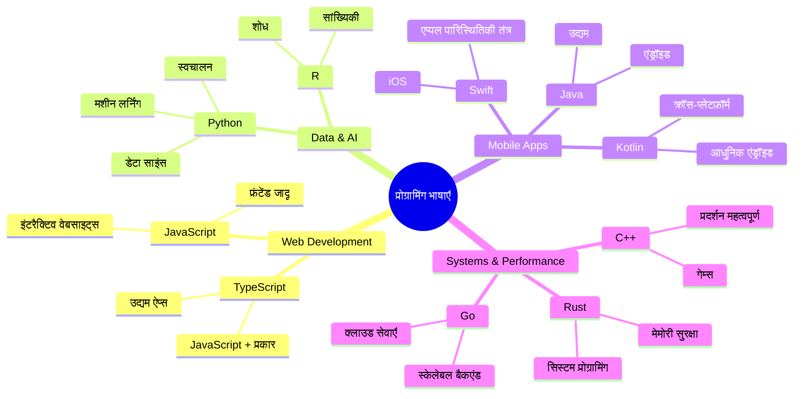
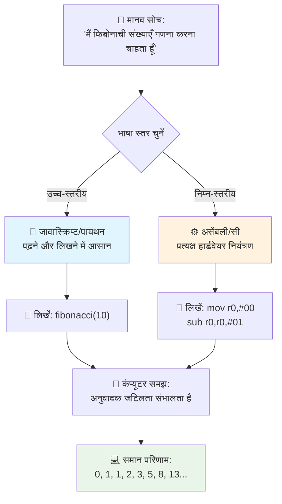
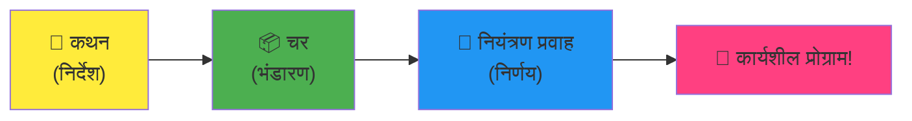
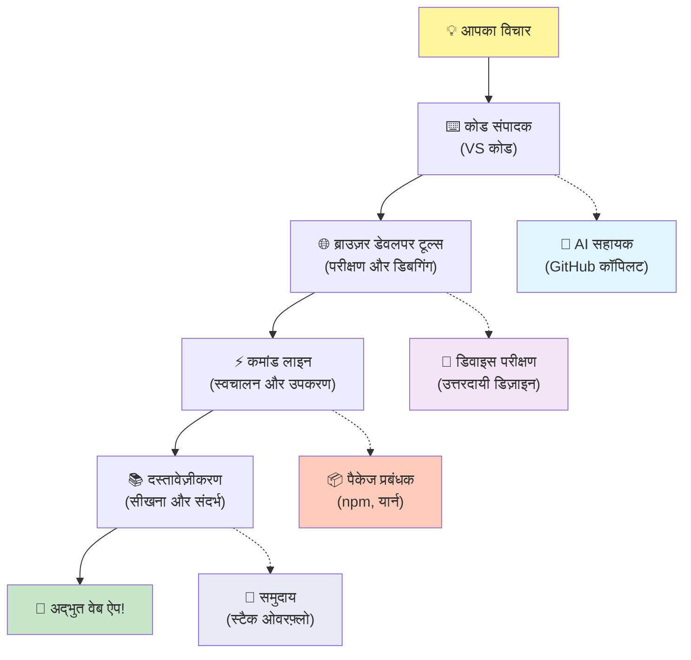
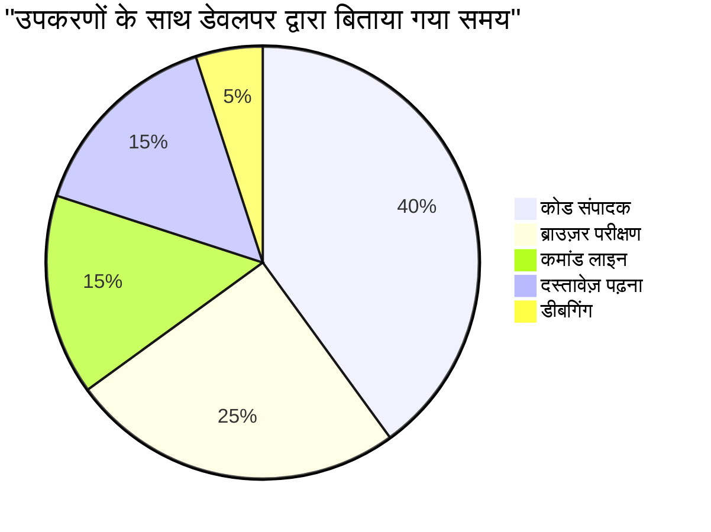

# प्रोग्रामिंग भाषाओं और आधुनिक डेवलपर टूल्स का परिचय

अरे वहां, भविष्य के डेवलपर! 👋 क्या मैं आपको कुछ ऐसा बता सकता हूँ जो हर दिन मुझे अभी भी रोमांचित करता है? आप यह जानने वाले हैं कि प्रोग्रामिंग सिर्फ कंप्यूटरों के बारे में नहीं है – यह आपके सबसे जीवंत विचारों को जीवन में लाने के लिए असली सुपरपावर पाने के बारे में है!

आप जानते हैं वह पल जब आप अपने पसंदीदा ऐप का उपयोग कर रहे होते हैं और सब कुछ पूरी तरह से ठीक होता है? जब आप एक बटन दबाते हैं और कुछ बिल्कुल जादुई होता है जो आपको कहने पर मजबूर कर देता है "वाह, उन्होंने यह कैसे किया?" खैर, आपका जैसा कोई व्यक्ति – शायद अपनी पसंदीदा कॉफी शॉप में 2 बजे अपनी तीसरी एस्प्रेसो के साथ बैठा हुआ – उस कोड को लिखा जिसने वह जादू बनाया। और यह है जो आपका दिमाग उड़ाने वाला है: इस पाठ के अंत तक, आप न केवल समझेंगे कि उन्होंने यह कैसे किया, बल्कि खुद इसे आज़माने के लिए उत्साहित होंगे!

देखिए, अगर प्रोग्रामिंग अभी डरावनी लग रही है तो मैं पूरी तरह समझता हूँ। जब मैंने शुरुआत की थी, तो मैं सच में सोचता था कि आपको कोई गणित का जीनियस होना चाहिए या पांच साल की उम्र से कोडिंग कर रहे होना चाहिए। लेकिन यह रहा वह चीज जिसने मेरी सोच पूरी तरह बदल दी: प्रोग्रामिंग बिल्कुल वैसा ही है जैसे किसी नई भाषा में बातचीत सीखना। आप "नमस्ते" और "धन्यवाद" से शुरू करते हैं, फिर कॉफी आर्डर करना सीखते हैं, और जल्दी ही आप गहरे दार्शनिक चर्चाओं में लगे होते हैं! बस इस मामले में, आप कंप्यूटरों से बातचीत कर रहे होते हैं, और सच्चाई यह है? वे सबसे सहनशील वार्तालाप साथी होते हैं – वे कभी आपकी गलतियों का न्याय नहीं करते और हमेशा फिर से कोशिश करने के लिए उत्साहित रहते हैं!

आज, हम उन अद्भुत टूल्स का अन्वेषण करने जा रहे हैं जो आधुनिक वेब डेवलपमेंट को संभव बनाते हैं, बल्कि इसे गंभीरता से नशे की तरह addictive बनाते हैं। मैं बात कर रहा हूँ वही एडिटर्स, ब्राउज़र्स, और वर्कफ़्लो की जो नेटफ्लिक्स, स्पॉटिफाई, और आपके पसंदीदा इंडी ऐप स्टूडियो के डेवलपर्स हर दिन इस्तेमाल करते हैं। और यहाँ वह हिस्सा है जो आपको खुश नाचने पर मजबूर कर देगा: इन में से अधिकांश पेशेवर स्तर के और उद्योग मानक टूल्स पूरी तरह से मुफ्त हैं!


> Sketchnote by [Tomomi Imura](https://twitter.com/girlie_mac)


```mermaid
journey
    title आपकी प्रोग्रामिंग यात्रा आज
    section Discover
      प्रोग्रामिंग क्या है: 5: You
      प्रोग्रामिंग भाषाएँ: 4: You
      उपकरण अवलोकन: 5: You
    section Explore
      कोड संपादक: 4: You
      ब्राउज़र और डिवटूल्स: 5: You
      कमांड लाइन: 3: You
    section Practice
      भाषा जासूस: 4: You
      उपकरण अन्वेषण: 5: You
      समुदाय संपर्क: 5: You
```
## चलिए देखते हैं आप पहले से क्या जानते हैं!

मज़ेदार चीजों में जाने से पहले, मैं उत्सुक हूँ – आप प्रोग्रामिंग की इस दुनिया के बारे में पहले से क्या जानते हैं? और सुनिए, अगर आप इन सवालों को देखकर सोच रहे हैं "मुझे वास्तव में इसकी कोई जानकारी नहीं है," तो यह सिर्फ ठीक नहीं, बल्कि परफेक्ट है! इसका मतलब है कि आप बिलकुल सही जगह पर हैं। इस क्विज़ को व्यायाम की तरह समझिए – हम बस अपने दिमाग की मांसपेशियों को गर्म कर रहे हैं!

[प्री-लेसन क्विज़ लें](https://ff-quizzes.netlify.app/web/)


## हम साथ में जिस साहसिक यात्रा पर जा रहे हैं

ठीक है, मैं सचमुच उत्साहित हूँ आज हम क्या अन्वेषण करने वाले हैं! सच बताऊँ तो, आपकी प्रतिक्रिया देखने की इच्छा हो रही है जब कुछ कॉन्सेप्ट्स आपके लिए क्लियर होंगे। यहाँ वह अद्भुत यात्रा है जिस पर हम साथ में जा रहे हैं:

- **प्रोग्रामिंग वास्तव में क्या है (और क्यों यह सबसे कूल चीज़ है!)** – हम पता लगाएंगे कि कोड कैसे हर उस चीज़ के पीछे अदृश्य जादू है जो आपके आस-पास है, उस अलार्म से जो किसी तरह पड़ता है कि सोमवार सुबह है, उस अल्गोरिद्म तक जो आपके नेटफ्लिक्स रिकमेंडेशंस को परफेक्ट बनाता है
- **प्रोग्रामिंग भाषाओं और उनके अद्भुत व्यक्तित्व** – कल्पना करें कि आप एक पार्टी में जा रहे हैं जहाँ हर व्यक्ति के पास पूरी तरह से अलग सुपरपावर और समस्या सुलझाने के तरीके हैं। प्रोग्रामिंग भाषा की दुनिया ऐसी ही है, और आपको उनसे मिलना बहुत पसंद आएगा!
- **वे मूलभूत घटक जो डिजिटल जादू को संभव बनाते हैं** – इनको अंतिम क्रिएटिव LEGO सेट समझिए। जब आप समझ जाएंगे कि ये हिस्से कैसे जुड़ते हैं, तो आप किसी भी चीज़ को अपने कल्पना के अनुसार बना सकते हैं
- **पेशेवर टूल्स जो आपको लगेगा कि आपके हाथ में जादूगर की छड़ी है** – मैं नाटक नहीं कर रहा हूँ – ये टूल्स आपको सच में सुपरपावर देने वाले हैं, और सबसे अच्छी बात? इन्हें वही प्रोफेशनल उपयोग करते हैं!

> 💡 **यह बात ध्यान रखें**: आज सब कुछ याद करने की कोशिश न करें! अभी मैं बस चाहता हूँ कि आप यह चिंगारी महसूस करें कि क्या संभव है। डिटेल्स अपने आप चिपक जाएंगी जैसे हम साथ में अभ्यास करेंगे – सही सीखने का यही तरीका है!

> आप यह पाठ [Microsoft Learn](https://learn.microsoft.com/en-us/learn/modules/web-development-101/introduction-programming/?WT.mc_id=academic-77807-sagibbon) पर भी ले सकते हैं!

## तो प्रोग्रामिंग *असल में* क्या है?

ठीक है, चलिए उस करोड़ों के सवाल से निपटते हैं: प्रोग्रामिंग वास्तव में क्या है?

मैं आपको एक कहानी बताता हूँ जिसने मेरी सोच पूरी तरह बदल दी। पिछले हफ्ते, मैं अपनी माँ को हमारे नए स्मार्ट टीवी रिमोट का उपयोग करने समझाकर जूझ रहा था। मैंने खुद को कहते हुए पाया, "लाल बटन दबाओ, लेकिन बड़ा लाल बटन नहीं, बाएँ तरफ वाला छोटा लाल बटन दबाओ... नहीं, तुम्हारे दूसरे बायें... ठीक है, अब इसे दो सेकंड के लिए पकड़ो, एक नहीं, तीन नहीं..." सुनने में परिचित लगता है? 😅

यही है प्रोग्रामिंग! यह एक बहुत ही शक्तिशाली चीज़ को विस्तृत, कदम दर कदम निर्देश देने की कला है, जिसके लिए सब कुछ बिल्कुल सही कहना आवश्यक है। सिर्फ आपकी माँ को समझाने के बजाय (जो पूछ सकती हैं "कौन सा लाल बटन?!"), आप कंप्यूटर को समझा रहे होते हैं (जो बिल्कुल वही करेगा जो आप कहते हैं, भले ही आपने जो कहा वह ठीक वैसा न हो जैसा आपका मतलब था)।

जब मैंने यह पहली बार सीखा तो यह बात मेरे लिए दिमाग उड़ाने वाली थी: कंप्यूटर मूलत: काफी सरल होते हैं। वे केवल दो चीजें समझते हैं – 1 और 0, जो मूल रूप से "हाँ" और "नहीं" या "चालू" और "बंद" है। सिर्फ इतना! लेकिन जादू यहाँ शुरू होता है – हमें 1 और 0 में बात करने की ज़रूरत नहीं है जैसे हम द मैट्रिक्स में हों। यहाँ **प्रोग्रामिंग भाषाएँ** काम आती हैं। वे मानो सबसे बेहतरीन अनुवादक हैं जो आपके सामान्य मानव विचारों को कंप्यूटर भाषा में बदल देते हैं।

और यह बात हर सुबह मुझे सचमुच रोमांचित करती है: आपकी जिंदगी का हर डिजिटल हिस्सा किसी आपके जैसा व्यक्ति से शुरू हुआ, शायद पजामा पहने कॉफी का कप लेकर, लैपटॉप पर कोड टाइप करते हुए। वह इंस्टाग्राम फिल्टर जो आपको परफेक्ट दिखाता है? किसी ने कोड किया। वह सुझाव जो आपको आपके नए पसंदीदा गाने तक पहुंचाया? एक डेवलपर ने वह अल्गोरिद्म बनाया। वह ऐप जो दोस्तों के साथ डिनर बिल बांटने में मदद करता है? हाँ, किसी ने सोचा "यह परेशान करता है, मैं इसे ठीक कर सकता हूँ" और फिर... किया!

जब आप प्रोग्राम करना सीखते हैं, तो आप सिर्फ एक नया कौशल सीख रहे नहीं होते – आप समस्या हल करने वाले इस अविश्वसनीय समुदाय का हिस्सा बन जाते हैं जो दिन भर सोचते रहते हैं, "अगर मैं कुछ ऐसा बना सकूँ जो किसी के दिन को थोड़ा बेहतर बना दे?" सच में, इससे कूल कुछ और हो सकता है?

✅ **मज़ेदार तथ्य खोज**: जब आपके पास खाली समय हो तो यह जानने की कोशिश करें – आपको क्या लगता है कि दुनिया के पहले कंप्यूटर प्रोग्रामर कौन थे? मैं एक हिंट देता हूँ: शायद आपकी उम्मीद के अनुरूप न हों! उनके पीछे की कहानी कमाल की है और यह दिखाती है कि प्रोग्रामिंग हमेशा से रचनात्मक समस्या समाधान और पारंपरिक सोच से बाहर सोचने का विषय रही है।

### 🧠 **चेक-इन टाइम: आप कैसा महसूस कर रहे हैं?**

**थोड़ा रुकिए और सोचिए:**
- क्या आपको अब "कंप्यूटर को निर्देश देना" समझ में आता है?
- क्या आप कोई रोज़मर्रा का काम सोच सकते हैं जिसे आप प्रोग्रामिंग से स्वचालित करना चाहेंगे?
- इस पूरे प्रोग्रामिंग विषय पर आपके मन में कौन से सवाल उठ रहे हैं?

> **याद रखें**: अगर कुछ कॉन्सेप्ट्स अभी अस्पष्ट लगें तो यह बिलकुल सामान्य है। प्रोग्रामिंग सीखना नए भाषा सीखने जैसा है – आपके दिमाग को उन न्यूरल पाथवे बनाने में समय लगता है। आप बहुत अच्छे कर रहे हैं!

## प्रोग्रामिंग भाषाएँ विभिन्न प्रकार के जादू की तरह होती हैं

ठीक है, यह अजीब लग सकता है, लेकिन मेरे साथ बने रहें – प्रोग्रामिंग भाषाएँ संगीत के विभिन्न प्रकारों की तरह होती हैं। सोचिए: आपके पास जैज है, जो चिकना और तात्कालिक है, रॉक जो शक्तिशाली और सीधा है, क्लासिकल जो सुरुचिपूर्ण और संरचित है, और हिप-हॉप जो क्रिएटिव और अभिव्यक्तिपूर्ण है। हर शैली की अपनी अलग मिजाज, अपनी पसंदीदा समुदाय होता है, और हर एक अलग मूड और अवसरों के लिए परफेक्ट है।

प्रोग्रामिंग भाषाएँ भी बिल्कुल ऐसे ही काम करती हैं! आप वही भाषा नहीं इस्तेमाल करेंगे जो एक मज़ेदार मोबाइल गेम बनाने के लिए है, जलवायु डेटा के बड़े पैमाने पर विश्लेषण के लिए, बिल्कुल वैसे ही जैसे आप योग कक्षा में डेथ मेटल नहीं बजाएंगे (खैर, ज्यादातर योग कक्षाएं नहीं! 😄)।

लेकिन हर बार जब मैं इसके बारे में सोचता हूँ, तो जो बात मेरा दिमाग उड़ाती है वह यह है: ये भाषाएँ ऐसी हैं मानो आपके बगल में सबसे धैर्यवान, प्रतिभाशाली अनुवादक बैठे हों। आप अपने विचार ऐसे व्यक्त कर सकते हैं जो आपके मानव मस्तिष्क के लिए स्वाभाविक हों, और ये सभी जटिल कार्यों को संभालते हैं कि उन्हें वे 1 और 0 में बदल दें जिनमें कंप्यूटर वास्तव में बात करते हैं। यह मानो किसी दोस्त के जैसा है जो "मानव रचनात्मकता" और "कंप्यूटर लॉजिक" दोनों में निपुण हो – और वह कभी थकता नहीं, कॉफी ब्रेक नहीं लेता, और दो बार एक ही सवाल पूछने पर आपको जज नहीं करता!

### लोकप्रिय प्रोग्रामिंग भाषाएँ और उनका उपयोग


```mermaid
mindmap
  root((प्रोग्रामिंग भाषाएँ))
    Web Development
      JavaScript
        फ्रंटेंड जादू
        इंटरैक्टिव वेबसाइट्स
      TypeScript
        JavaScript + प्रकार
        उद्यम ऐप्स
    Data & AI
      Python
        डेटा साइंस
        मशीन लर्निंग
        स्वचालन
      R
        सांख्यिकी
        शोध
    Mobile Apps
      Java
        एंड्रॉइड
        उद्यम
      Swift
        iOS
        एप्पल पारिस्थितिकी तंत्र
      Kotlin
        आधुनिक एंड्रॉइड
        क्रॉस-प्लेटफ़ॉर्म
    Systems & Performance
      C++
        गेम्स
        प्रदर्शन महत्वपूर्ण
      Rust
        मेमोरी सुरक्षा
        सिस्टम प्रोग्रामिंग
      Go
        क्लाउड सेवाएँ
        स्केलेबल बैकएंड
```
| भाषा | सर्वश्रेष्ठ लिए | क्यों लोकप्रिय है |
|----------|----------|------------------|
| **JavaScript** | वेब विकास, यूजर इंटरफेस | ब्राउज़रों में चलता है और इंटरैक्टिव वेबसाइट्स को चलाता है |
| **Python** | डेटा साइंस, ऑटोमेशन, एआई | पढ़ने और सीखने में आसान, शक्तिशाली लाइब्रेरीज |
| **Java** | एंटरप्राइज एप्लिकेशन, एंड्रॉइड ऐप्स | प्लेटफ़ॉर्म-स्वतंत्र, बड़े सिस्टमों के लिए मजबूत |
| **C#** | विंडोज़ एप्लिकेशन, गेम डेवलपमेंट | मजबूत माइक्रोसॉफ्ट इकोसिस्टम सपोर्ट |
| **Go** | क्लाउड सर्विसेज़, बैकएंड सिस्टम | तेज, सरल, आधुनिक कंप्यूटिंग के लिए डिज़ाइन किया गया |

### हाई-लेवल बनाम लो-लेवल भाषाएँ

ठीक है, यह सच में वह कॉन्सेप्ट था जिसने मेरी सोच हिला दी जब मैंने शुरुआत की थी, इसलिए मैं वह उपमा साझा करूंगा जिसने इसे मेरे लिए क्लियर किया – और मुझे उम्मीद है यह आपके लिए भी मददगार होगा!

कल्पना कीजिए कि आप किसी ऐसे देश में गए हैं जहाँ आप भाषा नहीं बोलते, और आपको बहुत जरूरी तौर पर नजदीकी बाथरूम खोजनी है (हम सब वहाँ जा चुके हैं, सही? 😅):

- **लो-लेवल प्रोग्रामिंग** वैसी है जैसे आप स्थानीय बोली इतनी अच्छी तरह सीख लें कि आप कोने पर फल बेचने वाली दादी से सांस्कृतिक संदर्भ, स्थानीय स्लैंग, और अंदर के मज़ाक के साथ बातचीत कर सकें जो केवल कोई वहाँ पला बढ़ा ही समझ सकता है। बहुत प्रभावशाली और अत्यंत कुशल… अगर आप उसमें निपुण हों! लेकिन जब आप बस बाथरूम खोज रहे हों तो यह थोड़ा भारी पड़ सकता है।

- **हाई-लेवल प्रोग्रामिंग** वैसी है जैसे कि आपके पास वह अद्भुत स्थानीय दोस्त हो जो आपको समझता हो। आप सरल अंग्रेज़ी में कह सकते हैं "मुझे बाथरूम चाहिए," और वह सारी सांस्कृतिक अनुवाद करता है और आपको ऐसी दिशा देता है जो आपके गैर-स्थानीय दिमाग के लिए भी पूरी तरह समझ में आती हो।

प्रोग्रामिंग की भाषा में:
- **लो-लेवल भाषाएँ** (जैसे Assembly या C) आपको कंप्यूटर के वास्तविक हार्डवेयर से बहुत विस्तृत बातचीत करने देती हैं, लेकिन आपको मशीन की तरह सोचना पड़ता है, जो... खैर, कहें तो मानसिक रूप से एक बड़ा बदलाव है!
- **हाई-लेवल भाषाएँ** (जैसे JavaScript, Python, या C#) आपको एक इंसान की तरह सोचने देती हैं जबकि वे कंप्यूटर भाषा को पीछे से संभालती हैं। इसके अलावा, इन भाषाओं के समुदाय इतने स्वागतयोग्य होते हैं जहाँ नए लोग आएं तो पुराने याद करते हैं कि नए होने पर कैसा लगता था और सच्चे दिल से मदद करते हैं!

आप सोच रहे होंगे, मैं आपको किसके साथ शुरुआत करने के लिए कहूँगा? 😉 हाई-लेवल भाषाएँ वैसी होती हैं जैसे ट्रेनिंग व्हील्स जो आपको कभी हटाने का दिल नहीं करता क्योंकि वे पूरे अनुभव को बहुत आनंदमय बना देते हैं!


```mermaid
flowchart TB
    A["👤 मानव सोच:<br/>'मैं फिबोनाची संख्याएँ गणना करना चाहता हूँ'"] --> B{भाषा स्तर चुनें}
    
    B -->|उच्च-स्तरीय| C["🌟 जावास्क्रिप्ट/पायथन<br/>पढ़ने और लिखने में आसान"]
    B -->|निम्न-स्तरीय| D["⚙️ असेंबली/सी<br/>प्रत्यक्ष हार्डवेयर नियंत्रण"]
    
    C --> E["📝 लिखें: fibonacci(10)"]
    D --> F["📝 लिखें: mov r0,#00<br/>sub r0,r0,#01"]
    
    E --> G["🤖 कंप्यूटर समझ:<br/>अनुवादक जटिलता संभालता है"]
    F --> G
    
    G --> H["💻 समान परिणाम:<br/>0, 1, 1, 2, 3, 5, 8, 13..."]
    
    style C fill:#e1f5fe
    style D fill:#fff3e0
    style H fill:#e8f5e8
```
### मैं आपको दिखाता हूँ कि हाई-लेवल भाषाएँ इतनी दोस्ताना क्यों हैं

अच्छा, मैं आपको कुछ ऐसा दिखाने वाला हूँ जो पूरी तरह से दर्शाता है कि मैं हाई-लेवल भाषाओं से क्यों प्यार करता हूँ, लेकिन पहले – मुझे आपसे एक वादा चाहिए। जब आप वह पहला कोड उदाहरण देखें तो घबराएँ मत! इसे डरावना दिखना चाहिए। यही मैं साबित करना चाहता हूँ!

हम एक ही काम को दो बिल्कुल अलग स्टाइलों में लिखी हुई देखेंगे। दोनों उस चीज़ को बनाते हैं जिसे Fibonacci अनुक्रम कहते हैं – यह एक सुंदर गणितीय पैटर्न है जहाँ हर नंबर पिछले दो नंबरों का योग होता है: 0, 1, 1, 2, 3, 5, 8, 13... (मज़ेदार तथ्य: आप यह पैटर्न प्रकृति में हर जगह पाएंगे – सूरजमुखी के बीजों के सर्पिल, पाइंस के फूल के पैटर्न, यहाँ तक कि आकाशगंगाओं के गठन में!)

तैयार हैं फर्क देखने के लिए? चलिए!

**हाई-लेवल भाषा (JavaScript) – मानव-अनुकूल:**

```javascript
// चरण 1: बुनियादी फिबोनाच्ची सेटअप
const fibonacciCount = 10;
let current = 0;
let next = 1;

console.log('Fibonacci sequence:');
```

**यह कोड क्या करता है:**
- **घोषणा** करता है एक कॉन्स्टेंट कि हमें कितने Fibonacci नंबर जनरेट करने हैं
- **इनिशियलाइज़** करता है दो वैरिएबल जो अनुक्रम के वर्तमान और अगले नंबर को ट्रैक करते हैं
- **सेटअप** करता है शुरुआती मान (0 और 1) जो Fibonacci पैटर्न को परिभाषित करते हैं
- **प्रदर्शित** करता है एक शीर्षक संदेश जो हमारे आउटपुट की पहचान करता है

```javascript
// चरण 2: एक लूप के साथ अनुक्रम उत्पन्न करें
for (let i = 0; i < fibonacciCount; i++) {
  console.log(`Position ${i + 1}: ${current}`);
  
  // अनुक्रम में अगला नंबर निकालें
  const sum = current + next;
  current = next;
  next = sum;
}
```

**यहाँ क्या होता है, उसका विश्लेषण:**
- **लूप** करता है हमारे अनुक्रम के प्रत्येक स्थान पर `for` लूप का उपयोग कर
- **प्रदर्शित** करता है हर नंबर को उसके स्थान के साथ टेम्प्लेट लिटरल फॉर्मेटिंग के ज़रिये
- **गणना** करता है अगला Fibonacci नंबर वर्तमान और अगले मान को जोड़कर
- **अपडेट** करता है हमारे ट्रैकिंग वैरिएबल्स को अगले चक्र में जाने के लिए

```javascript
// चरण 3: आधुनिक कार्यात्मक दृष्टिकोण
const generateFibonacci = (count) => {
  const sequence = [0, 1];
  
  for (let i = 2; i < count; i++) {
    sequence[i] = sequence[i - 1] + sequence[i - 2];
  }
  
  return sequence;
};

// उपयोग का उदाहरण
const fibSequence = generateFibonacci(10);
console.log(fibSequence);
```

**ऊपर हमने:**
- **बनाया** एक पुन: उपयोग योग्य फ़ंक्शन आधुनिक तीर फ़ंक्शन सिंटैक्स का उपयोग करके
- **संभाला** एक एरे जिससे पूरा श्रृंखला संग्रहित की जाए बजाय एक एक करके दिखाने के
- **इस्तेमाल किया** एरे इंडेक्सिंग जिससे हर नया नंबर पिछले मानों से निकाला जाए
- **लौटाया** पूरी श्रृंखला प्रोग्राम के अन्य हिस्सों में लचीलेपन के लिए

**लो-लेवल भाषा (ARM Assembly) – कंप्यूटर-अनुकूल:**

```assembly
 area ascen,code,readonly
 entry
 code32
 adr r0,thumb+1
 bx r0
 code16
thumb
 mov r0,#00
 sub r0,r0,#01
 mov r1,#01
 mov r4,#10
 ldr r2,=0x40000000
back add r0,r1
 str r0,[r2]
 add r2,#04
 mov r3,r0
 mov r0,r1
 mov r1,r3
 sub r4,#01
 cmp r4,#00
 bne back
 end
```

ध्यान दें कि JavaScript संस्करण लगभग अंग्रेज़ी निर्देशों की तरह पढ़ता है, जबकि Assembly संस्करण ऐसे गुप्त कमांडों का उपयोग करता है जो सीधे कंप्यूटर के प्रोसेसर को नियंत्रित करते हैं। दोनों एक ही काम पूरा करते हैं, लेकिन हाई-लेवल भाषा इंसानों के लिए समझना, लिखना और बनाए रखना बहुत आसान है।

**मुख्य अंतर जो आप देखेंगे:**
- **पढ़ने में आसान**: JavaScript वर्णनात्मक नामों का उपयोग करता है जैसे `fibonacciCount` जबकि Assembly गुप्त लेबल जैसे `r0`, `r1` का उपयोग करता है
- **टिप्पणियाँ**: उच्च-स्तरीय भाषाएं व्याख्यात्मक टिप्पणियाँ प्रोत्साहित करती हैं जो कोड को आत्म-प्रलेखित बनाती हैं
- **संरचना**: JavaScript का तार्किक प्रवाह आदमियों की तरह समस्या को चरण-दर-चरण सोचने से मेल खाता है
- **रखरखाव**: अलग-अलग आवश्यकताओं के लिए JavaScript संस्करण को अपडेट करना सरल और स्पष्ट है

✅ **फिबोनाच्ची अनुक्रम के बारे में**: यह बिल्कुल सुंदर संख्यात्मक पैटर्न (जहां हर संख्या पिछले दो का योग होती है: 0, 1, 1, 2, 3, 5, 8...) सचमुच *प्रकृति में हर जगह* पाया जाता है! आप इसे सूरजमुखी के घुमावों में, पाइनकोन पैटर्नों में, नौटिलस शेल के घुमाव में, और यहां तक कि पेड़ की शाखाओं के बढ़ने के तरीके में भी पाएंगे। यह वास्तव में दिमाग उड़ाने वाला है कि गणित और कोड हमें प्रकृति के उपयोग किए गए पैटर्न को समझने और पुन: बनाने में मदद कर सकते हैं जो सुंदरता पैदा करते हैं!


## जादू करने वाले बुनियादी ब्लॉक्स

ठीक है, अब जब आपने देखा कि प्रोग्रामिंग भाषाएं कार्यान्वयन में कैसी दिखती हैं, तो चलिए उनके मूल तत्वों को तोड़ते हैं जो सचमुच हर लिखित प्रोग्राम का हिस्सा होते हैं। इन्हें अपनी पसंदीदा रेसिपी के आवश्यक घटकों की तरह सोचें – एक बार जब आप समझ जाएंगे कि हर एक का क्या काम है, तो आप लगभग किसी भी भाषा में कोड पढ़ और लिख पाएंगे!

यह कुछ हद तक प्रोग्रामिंग की व्याकरण सीखने जैसा है। याद है स्कूल में जब आपने संज्ञा, क्रिया और वाक्यों के संयोजन के बारे में सीखा था? प्रोग्रामिंग की अपनी एक व्याकरण है, और सच कहूं तो यह अंग्रेजी व्याकरण से कहीं ज्यादा तार्किक और दयालु है! 😄

### वक्तव्य: कदम दर कदम निर्देश

आइए शुरू करें **वक्तव्य** से – ये कंप्यूटर के साथ बातचीत में व्यक्तिगत वाक्यों की तरह हैं। हर वक्तव्य कंप्यूटर को एक विशिष्ट कार्य करने के लिए कहता है, जैसे दिशा-निर्देश देना: "यहां बाएं मुड़ो," "लाल बत्ती पर रुकें," "उस जगह पार्क करें।"

मुझे वक्तव्यों की यह बात बहुत अच्छी लगती है कि वे आमतौर पर कितने पढ़ने में आसान होते हैं। इसे देखें:

```javascript
// बुनियादी कथन जो एकल क्रियाएं करते हैं
const userName = "Alex";                    
console.log("Hello, world!");              
const sum = 5 + 3;                         
```

**यह कोड क्या करता है:**
- उपयोगकर्ता का नाम संग्रहीत करने के लिए एक स्थिर चर घोषित करता है
- कंसोल आउटपुट में अभिवादन संदेश प्रदर्शित करता है
- एक गणितीय क्रिया का परिणाम गणना कर संग्रहीत करता है

```javascript
// वेब पृष्ठों के साथ इंटरैक्ट करने वाले बयान
document.title = "My Awesome Website";      
document.body.style.backgroundColor = "lightblue";
```

**कदम दर कदम, यहां क्या हो रहा है:**
- ब्राउज़र टैब में दिखाई देने वाले वेबपेज के शीर्षक को संशोधित करता है
- पूरे पृष्ठ के पृष्ठभूमि रंग को बदलता है

### चर: आपके प्रोग्राम की मेमोरी सिस्टम

ठीक है, **चर** वास्तव में सिखाने के लिए मेरी सबसे पसंदीदा अवधारणाओं में से एक हैं क्योंकि वे उन चीज़ों की तरह हैं जिन्हें आप हर दिन उपयोग करते हैं!

अपनी फोन की संपर्क सूची के बारे में सोचें। आप हर किसी का फोन नंबर याद नहीं रखते – बल्कि आप "माँ," "सबसे अच्छा दोस्त," या "पिज़्ज़ा जगह जो 2 बजे तक डिलीवरी करती है" सहेजते हैं और आपका फोन असली नंबर याद रखता है। चर बिल्कुल इसी तरह काम करते हैं! वे लेबल वाले कंटेनर की तरह होते हैं जहां आपका प्रोग्राम जानकारी संग्रहीत कर सकता है और बाद में उसे समझदारी से नाम द्वारा पुनः प्राप्त कर सकता है।

यह वास्तव में मज़ेदार है: जैसे-जैसे आपका प्रोग्राम चलता है, चर बदल सकते हैं (इसलिए इन्हें "चर" कहा जाता है – समझ गए ना?). ठीक वैसे ही जैसे आप अपने पिज़्ज़ा जगह के संपर्क को अपडेट करते हैं जब आपको कोई बेहतर जगह मिलती है, चर भी प्रोग्राम के नई जानकारी सीखने या परिस्थितियों के बदलने पर अपडेट हो सकते हैं!

आइए मैं आपको दिखाऊं कि यह कितना खूबसूरती से सरल हो सकता है:

```javascript
// चरण 1: बुनियादी वेरिएबल्स बनाना
const siteName = "Weather Dashboard";        
let currentWeather = "sunny";               
let temperature = 75;                       
let isRaining = false;                      
```

**इन अवधारणाओं को समझना:**
- `const` चर में अपरिवर्तनीय मान संग्रहित करें (जैसे साइट का नाम)
- `let` का उपयोग उन मानों के लिए करें जो आपके प्रोग्राम के दौरान बदल सकते हैं
- विभिन्न डेटा प्रकार सौंपें: स्ट्रिंग (पाठ), संख्याएं, और बूलियन (सत्य/असत्य)
- वर्णनात्मक नाम चुनें जो बताते हैं कि प्रत्येक चर में क्या है

```javascript
// चरण 2: संबंधित डेटा को समूहित करने के लिए ऑब्जेक्ट्स के साथ काम करना
const weatherData = {                       
  location: "San Francisco",
  humidity: 65,
  windSpeed: 12
};
```

**ऊपर, हमने:**
- संबंधित मौसम जानकारी को एक वस्तु में समूहित किया
- कई डेटा टुकड़ों को एक चर नाम के अंतर्गत व्यवस्थित किया
- प्रत्येक डेटा को स्पष्ट रूप से लेबल करने के लिए कुंजी-मूल्य जोड़े का उपयोग किया

```javascript
// चरण 3: वेरिएबल्स का उपयोग करना और उन्हें अपडेट करना
console.log(`${siteName}: Today is ${currentWeather} and ${temperature}°F`);
console.log(`Wind speed: ${weatherData.windSpeed} mph`);

// परिवर्तनीय वेरिएबल्स को अपडेट करना
currentWeather = "cloudy";                  
temperature = 68;                          
```

**हर हिस्से को समझें:**
- टेम्प्लेट लिटरल्स का उपयोग करके `${}` सिंटैक्स के साथ जानकारी प्रदर्शित करें
- डॉट नोटेशन (`weatherData.windSpeed`) का उपयोग करके वस्तु की विशेषताओं तक पहुँचें
- बदलती स्थिति को प्रतिबिंबित करने के लिए `let` से घोषित चर को अपडेट करें
- अर्थपूर्ण संदेश बनाने के लिए कई चर संयोजित करें

```javascript
// चरण 4: स्वच्छ कोड के लिए आधुनिक डेस्ट्रक्चरिंग
const { location, humidity } = weatherData; 
console.log(`${location} humidity: ${humidity}%`);
```

**आपको जो जानना जरूरी है:**
- वस्तुओं से विशिष्ट गुणों को डिकंस्ट्रक्चरिंग असाइनमेंट से निकालें
- ऑब्जेक्ट की चाबियों के समान नाम के साथ नए चर स्वचालित रूप से बनाएं
- अक्सर दोहराए जाने वाले डॉट नोटेशन से बचकर कोड को सरल बनाएं

### नियंत्रण प्रवाह: अपने प्रोग्राम को सोचने की शिक्षा देना

ठीक है, यह वह जगह है जहां प्रोग्रामिंग बिल्कुल दिमाग उड़ाने वाली हो जाती है! **नियंत्रण प्रवाह** मूल रूप से आपके प्रोग्राम को स्मार्ट निर्णय लेना सिखाना है, बिल्कुल वैसे ही जैसे आप बिना सोचे वैसे करते हैं।

कल्पना करें: आज सुबह आपने कुछ ऐसा किया होगा "अगर बारिश हो रही है, तो मैं छाता ले जाऊंगा। अगर ठंड है, तो जैकेट पहनूंगा। अगर मैं देर से चल रहा हूं, तो नाश्ता छोड़ दूंगा और रास्ते में कॉफ़ी लूंगा।" आपका दिमाग स्वाभाविक रूप से इस if-then तर्क का पालन करता है दिन में दर्जनों बार!

इसी कारण प्रोग्राम बुद्धिमान और जीवंत लगते हैं बजाय कुछ उबाऊ, पूर्वानुमेय स्क्रिप्ट का पालन करने के। वे वास्तव में स्थिति को देख सकते हैं, मूल्यांकन कर सकते हैं कि क्या हो रहा है, और उपयुक्त प्रतिक्रिया दे सकते हैं। यह ऐसा है जैसे आपके प्रोग्राम को एक दिमाग दिया हो जो अनुकूलित कर सकता है और विकल्प चुन सकता है!

देखना चाहते हैं कि यह कितना खूबसूरती से काम करता है? मैं आपको दिखाता हूं:

```javascript
// चरण 1: मूल सशर्त तर्क
const userAge = 17;

if (userAge >= 18) {
  console.log("You can vote!");
} else {
  const yearsToWait = 18 - userAge;
  console.log(`You'll be able to vote in ${yearsToWait} year(s).`);
}
```

**यह कोड क्या करता है:**
- जाँचता है कि उपयोगकर्ता की उम्र मतदान आवश्यकता से मेल खाती है या नहीं
- परिणाम के आधार पर विभिन्न कोड ब्लॉकों को निष्पादित करता है
- 18 से कम होने पर मतदान पात्रता तक कितना समय है, गणना और प्रदर्शित करता है
- प्रत्येक स्थिति के लिए विशिष्ट, सहायक प्रतिक्रिया प्रदान करता है

```javascript
// चरण 2: तार्किक ऑपरेटर के साथ कई शर्तें
const userAge = 17;
const hasPermission = true;

if (userAge >= 18 && hasPermission) {
  console.log("Access granted: You can enter the venue.");
} else if (userAge >= 16) {
  console.log("You need parent permission to enter.");
} else {
  console.log("Sorry, you must be at least 16 years old.");
}
```

**यहां क्या हो रहा है:**
- `&&` (और) ऑपरेटर का उपयोग करके कई शर्तों को संयोजित करता है
- कई परिदृश्यों के लिए `else if` का उपयोग करके शर्तों की पदानुक्रम बनाता है
- अंतिम `else` कथन से सभी संभावित मामलों को संभालता है
- प्रत्येक अलग स्थिति के लिए स्पष्ट, क्रियाशील प्रतिक्रिया प्रदान करता है

```javascript
// चरण 3: टर्नरी ऑपरेटर के साथ संक्षिप्त शर्तीय अभिव्यक्ति
const votingStatus = userAge >= 18 ? "Can vote" : "Cannot vote yet";
console.log(`Status: ${votingStatus}`);
```

**यह याद रखने की आवश्यकता है:**
- सरल दो-विकल्पीय शर्तों के लिए टर्नरी ऑपरेटर (`? :`) का उपयोग करें
- सबसे पहले शर्त लिखें, उसके बाद `?`, फिर सत्य परिणाम, फिर `:`, और फिर असत्य परिणाम
- जब आपको शर्तों के आधार पर मान सौंपने की आवश्यकता हो तो इसका उपयोग करें

```javascript
// चरण 4: कई विशिष्ट मामलों को संभालना
const dayOfWeek = "Tuesday";

switch (dayOfWeek) {
  case "Monday":
  case "Tuesday":
  case "Wednesday":
  case "Thursday":
  case "Friday":
    console.log("It's a weekday - time to work!");
    break;
  case "Saturday":
  case "Sunday":
    console.log("It's the weekend - time to relax!");
    break;
  default:
    console.log("Invalid day of the week");
}
```

**यह कोड निम्नलिखित करता है:**
- चर मान को कई विशिष्ट मामलों के खिलाफ मिलान करता है
- समान मामलों को समूहबद्ध करता है (सप्ताह के दिन बनाम सप्ताहांत)
- मैच मिलने पर उपयुक्त कोड ब्लॉक निष्पादित करता है
- अप्रत्याशित मानों को संभालने के लिए `default` केस शामिल करता है
- अगले केस में कोड जारी न रहने देने के लिए `break` कथनों का उपयोग करता है

> 💡 **वास्तविक दुनिया का उपमा**: नियंत्रण प्रवाह को ऐसे सोचें जैसे दुनिया का सबसे धैर्यवान जीपीएस जो आपको दिशा-निर्देश दे रहा हो। यह कह सकता है "अगर मेन स्ट्रीट पर ट्रैफ़िक है, तो राजमार्ग लें। अगर राजमार्ग निर्माण बंद है, तो प्राकृतिक रास्ता ले।" प्रोग्राम बिल्कुल इसी प्रकार की सशर्त तर्क प्रणाली का उपयोग करते हैं ताकि वे अलग-अलग स्थितियों पर बुद्धिमानी से प्रतिक्रिया दे सकें और हमेशा उपयोगकर्ताओं को सर्वोत्तम अनुभव प्रदान कर सकें।

### 🎯 **अवधारणा जांच: बिल्डिंग ब्लॉक्स विशेषज्ञता**

**आइए देखें आप मूल बातें कितनी अच्छी तरह समझते हैं:**
- क्या आप अपने शब्दों में चर और वक्तव्य के बीच अंतर समझा सकते हैं?
- कोई वास्तविक स्थिति सोचें जहां आप if-then निर्णय का उपयोग करेंगे (जैसे हमारा मतदान उदाहरण)
- प्रोग्रामिंग तर्क में आपको कौन सी बात सबसे अधिक आश्चर्यचकित करती है?

**त्वरित आत्मविश्वास बढ़ाने वाला:**

```mermaid
flowchart LR
    A["📝 कथन<br/>(निर्देश)"] --> B["📦 चर<br/>(भंडारण)"] --> C["🔀 नियंत्रण प्रवाह<br/>(निर्णय)"] --> D["🎉 कार्यशील प्रोग्राम!"]
    
    style A fill:#ffeb3b
    style B fill:#4caf50
    style C fill:#2196f3
    style D fill:#ff4081
```
✅ **आगामी विषय**: हम इन अवधारणाओं में गहराई से जाने वाले हैं और इस अद्भुत यात्रा को साथ में जारी रखेंगे! अभी बस इस बात पर ध्यान दें कि आपके सामने कितनी अद्भुत संभावनाएं हैं। विशिष्ट कौशल और तकनीकें स्वाभाविक रूप से अभ्यास के साथ आपके पास आएंगी – मैं वादा करता हूं कि यह आप की अपेक्षा से कहीं ज्यादा मज़ेदार होने वाला है!

## उपकरण

ठीक है, सच कहूं तो अब मैं इतना उत्साहित हूं कि खुद को रोकना मुश्किल हो रहा है! 🚀 हम बात करने जा रहे हैं उन अद्भुत उपकरणों की जो आपको ऐसा महसूस कराएंगे जैसे आपको एक डिजिटल अंतरिक्ष यान की चाबियाँ सौंप दी गई हों।

आप जानते हैं कैसे एक शेफ के पास परफेक्टली बैलेंस्ड चाकू होते हैं जो उनके हाथों का एक्सटेंशन महसूस होते हैं? या किसी संगीतकार के पास वह एक गिटार जो छूते ही गाना शुरू कर देता है? ठीक वैसे ही, डेवलपर्स के पास भी ऐसे जादुई उपकरण होते हैं, और यहाँ क्या है जो आपको पूरी तरह से हैरान कर देगा – उनमें से अधिकांश पूरी तरह से मुफ्त हैं!

मैं सचमुच अपनी कुर्सी में कूद रहा हूं क्योंकि ये उपकरण हमारे सॉफ्टवेयर निर्माण के तरीके को पूरी तरह से बदल चुके हैं। हम एआई समर्थित कोडिंग सहायक की बात कर रहे हैं जो आपके कोड को लिखने में मदद कर सकते हैं (मैं मजाक नहीं कर रहा!), क्लाउड वातावरण जहां आप वाई-फाई से कहीं से भी पूरी एप्लिकेशन बना सकते हैं, और डिबगिंग टूल इतने परिष्कृत हैं कि वे आपके प्रोग्राम के लिए एक्स-रे विजन की तरह हैं।

और यह बात जो अभी भी मेरे रोंगटे खड़े कर देती है: ये "शुरुआती उपकरण" नहीं हैं जिन्हें आप जल्द ही छोड़ देंगे। ये बिल्कुल वही पेशेवर स्तर के उपकरण हैं जिनका उपयोग Google, Netflix, और आपके पसंदीदा इंडी ऐप स्टूडियो के डेवलपर्स अभी इसी पल कर रहे हैं। इन्हें इस्तेमाल करते हुए आप खुद को एक प्रोफेशनल महसूस करेंगे!


```mermaid
graph TD
    A["💡 आपका विचार"] --> B["⌨️ कोड संपादक<br/>(VS कोड)"] 
    B --> C["🌐 ब्राउज़र डेवलपर टूल्स<br/>(परीक्षण और डिबगिंग)"]
    C --> D["⚡ कमांड लाइन<br/>(स्वचालन और उपकरण)"]
    D --> E["📚 दस्तावेज़ीकरण<br/>(सीखना और संदर्भ)"]
    E --> F["🚀 अद्भुत वेब ऐप!"]
    
    B -.-> G["🤖 AI सहायक<br/>(GitHub कॉपिलट)"]
    C -.-> H["📱 डिवाइस परीक्षण<br/>(उत्तरदायी डिज़ाइन)"]
    D -.-> I["📦 पैकेज प्रबंधक<br/>(npm, यार्न)"]
    E -.-> J["👥 समुदाय<br/>(स्टैक ओवरफ़्लो)"]
    
    style A fill:#fff59d
    style F fill:#c8e6c9
    style G fill:#e1f5fe
    style H fill:#f3e5f5
    style I fill:#ffccbc
    style J fill:#e8eaf6
```
### कोड एडिटर और IDEs: आपके नए डिजिटल सबसे अच्छे दोस्त

चलिए बात करते हैं कोड एडिटरों की – ये सचमुच आपके नए पसंदीदा जगह बनने वाले हैं! इन्हें अपने व्यक्तिगत कोडिंग आश्रम की तरह सोचें जहां आप अपना अधिकांश समय डिजिटल रचनाओं को तैयार करने और पूर्ण करने में बिताएंगे।

लेकिन आधुनिक एडिटरों में एक जादू है: ये सिर्फ फैंसी टेक्स्ट एडिटर नहीं हैं। ये आपके साथ 24/7 बैठे सबसे प्रतिभाशाली, सहायक कोडिंग सलाहकार की तरह हैं। वे आपकी टाइपो को तब पकड़ लेते हैं जब आपने उन्हें नोटिस भी नहीं किया होता, सुधार सुझाते हैं जो आपको प्रतिभाशाली दिखाते हैं, हर कोड के हिस्से को समझने में मदद करते हैं, और कुछ आपके टाइप करने वाली बात को पूर्वानुमानित कर आपके विचार पूरा करने का ऑफर देते हैं!

मुझे याद है जब मैंने पहली बार ऑटो-कंप्लीशन देखा था – मुझे लगा मानो मैं भविष्य में रह रहा हूं। आप कुछ लिखना शुरू करते हैं, और आपका एडिटर कहता है, "हे, क्या आप इसी फ़ंक्शन के बारे में सोच रहे थे जो बिल्कुल वही करता है जो आपको चाहिए?" यह ऐसा है जैसे आपके कोडिंग साथी के पास मन पढ़ने की क्षमता हो!

**क्या इन्हें इतना अद्भुत बनाता है?**

आधुनिक कोड एडिटर में आपकी उत्पादकता बढ़ाने के लिए प्रभावशाली विशेषताएं होती हैं:

| विशेषता | क्या करता है | क्यों मदद करता है |
|---------|--------------|------------------|
| **सिंटैक्स हाईलाइटिंग** | आपके कोड के विभिन्न भागों को रंगीन करता है | कोड को पढ़ना आसान बनाता है और त्रुटियां पकड़ने में मदद करता है |
| **ऑटो-कंप्लीशन** | टाइप करते समय कोड सुझाता है | कोडिंग तेजी से करता है और टाइपो कम करता है |
| **डिबगिंग टूल्स** | त्रुटियां खोजने और ठीक करने में मदद करता है | समस्या सुलझाने में कई घंटे बचाता है |
| **एक्सटेंशन्स** | विशेषताएं जोड़ता है | किसी भी तकनीक के लिए अपने एडिटर को अनुकूलित करें |
| **एआई असिस्टेंट्स** | कोड और स्पष्टीकरण सुझाते हैं | सीखने और उत्पादकता को तेज़ करता है |

> 🎥 **वीडियो संसाधन**: इन टूल्स को क्रियाशील रूप में देखना चाहते हैं? इस [Tools of the Trade वीडियो](https://youtube.com/watch?v=69WJeXGBdxg) को देखें जिसमें एक व्यापक अवलोकन है।

#### वेब विकास के लिए अनुशंसित एडिटर

**[Visual Studio Code](https://code.visualstudio.com/?WT.mc_id=academic-77807-sagibbon)** (मुफ्त)
- वेब डेवलपर्स के बीच सबसे लोकप्रिय
- उत्कृष्ट एक्सटेंशन इकोसिस्टम
- बिल्ट-इन टर्मिनल और Git इंटीग्रेशन
- **जरूरी एक्सटेंशन्स**:
  - [GitHub Copilot](https://marketplace.visualstudio.com/items?itemName=GitHub.copilot) - एआई संचालित कोड सुझाव
  - [Live Share](https://marketplace.visualstudio.com/items?itemName=MS-vsliveshare.vsliveshare) - वास्तविक समय सहयोग
  - [Prettier](https://marketplace.visualstudio.com/items?itemName=esbenp.prettier-vscode) - स्वचालित कोड फॉर्मैटिंग
  - [Code Spell Checker](https://marketplace.visualstudio.com/items?itemName=streetsidesoftware.code-spell-checker) - कोड में टाइपो पकड़ता है

**[JetBrains WebStorm](https://www.jetbrains.com/webstorm/)** (पेड, छात्रों के लिए मुफ्त)
- उन्नत डीबगिंग और परीक्षण उपकरण
- बुद्धिमान कोड पूर्णता
- बिल्ट-इन संस्करण नियंत्रण

**क्लाउड-आधारित IDEs** (विभिन्न मूल्य निर्धारण)
- [GitHub Codespaces](https://github.com/features/codespaces) - आपके ब्राउज़र में पूर्ण VS Code
- [Replit](https://replit.com/) - सीखने और कोड साझा करने के लिए शानदार
- [StackBlitz](https://stackblitz.com/) - तात्कालिक, पूर्ण स्टैक वेब विकास

> 💡 **शुरुआत करने का सुझाव**: Visual Studio Code से शुरू करें – यह मुफ्त है, उद्योग में व्यापक रूप से उपयोग किया जाता है, और इसका विशाल समुदाय है जो मददगार ट्यूटोरियल और एक्सटेंशन्स बनाता है।


### वेब ब्राउज़र: आपका गुप्त विकास प्रयोगशाला

ठीक है, तैयार हो जाइए कि आपका दिमाग पूरी तरह से उड़ जाए! आप वेब ब्राउज़रों का उपयोग सोशल मीडिया स्क्रॉल करने और वीडियो देखने के लिए करते आ रहे हैं, लेकिन पता चला है वे पूरा समय एक अद्भुत गुप्त डेवलपर प्रयोगशाला छुपाए हुए थे, बस आपकी खोज के लिए इंतजार कर रहे थे!

हर बार जब आप किसी वेबपेज पर राइट-क्लिक करके "Inspect Element" चुनते हैं, तो आप डेवलपर टूल्स की छुपी हुई दुनिया खोल रहे होते हैं जो सचमुच उन महंगे सॉफ्टवेयर से भी ज्यादा शक्तिशाली हैं जिनके लिए मैंने पहले सौ डॉलर से अधिक भुगतान किया था। यह ऐसा है जैसे यह पता चले कि आपका सामान्य पुराना किचन एक गुप्त पैनल के पीछे एक प्रोफेशनल शेफ की प्रयोगशाला छुपाए हुए था!
पहली बार जब किसी ने मुझे ब्राउज़र DevTools दिखाया, तो मैंने लगभग तीन घंटे बस क्लिक करते हुए बिताए और कहा, "रुको, यह भी कर सकता है?!" आप वास्तव में किसी भी वेबसाइट को रियल-टाइम में एडिट कर सकते हैं, ठीक देख सकते हैं कि सब कुछ कितनी जल्दी लोड होता है, यह परीक्षण कर सकते हैं कि आपकी साइट अलग-अलग डिवाइसों पर कैसी दिखती है, और यहां तक कि JavaScript को पूरी तरह से प्रो की तरह डिबग भी कर सकते हैं। यह पूरी तरह से दिमाग उड़ाने वाला है!

**यहां बताया गया है कि ब्राउज़र आपके गुप्त हथियार क्यों हैं:**

जब आप वेबसाइट या वेब एप्लिकेशन बनाते हैं, तो आपको यह देखना होता है कि यह असली दुनिया में कैसा दिखता और व्यवहार करता है। ब्राउज़र न केवल आपके काम को दिखाते हैं बल्कि प्रदर्शन, पहुंच योग्यता और संभावित समस्याओं के बारे में विस्तृत प्रतिक्रिया भी प्रदान करते हैं।

#### ब्राउज़र डेवलपर टूल्स (DevTools)

आधुनिक ब्राउज़रों में व्यापक विकास सूट शामिल होते हैं:

| टूल श्रेणी | यह क्या करता है | उपयोग का उदाहरण |
|---------------|--------------|------------------|
| **एलीमेंट इंस्पेक्टर** | रियल-टाइम में HTML/CSS देखें और संपादित करें | स्टाइलिंग को समायोजित करें और तुरंत परिणाम देखें |
| **कंसोल** | त्रुटि संदेश देखें और JavaScript का परीक्षण करें | समस्याओं को डिबग करें और कोड के साथ प्रयोग करें |
| **नेटवर्क मॉनिटर** | संसाधन लोडिंग को ट्रैक करें | प्रदर्शन और लोडिंग समय को अनुकूलित करें |
| **पहुंच योग्यता चेकर** | समावेशी डिज़ाइन के लिए परीक्षण करें | सुनिश्चित करें कि आपकी साइट सभी उपयोगकर्ताओं के लिए काम करती है |
| **डिवाइस सिम्युलेटर** | विभिन्न स्क्रीन आकारों पर पूर्वावलोकन करें | बिना कई डिवाइसों के प्रतिक्रियाशील डिज़ाइन का परीक्षण करें |

#### विकास के लिए अनुशंसित ब्राउज़र

- **[Chrome](https://developers.google.com/web/tools/chrome-devtools/)** - व्यापक दस्तावेज़ीकरण के साथ उद्योग-मानक DevTools
- **[Firefox](https://developer.mozilla.org/docs/Tools)** - उत्कृष्ट CSS Grid और पहुँच योग्यता उपकरण
- **[Edge](https://docs.microsoft.com/microsoft-edge/devtools-guide-chromium/?WT.mc_id=academic-77807-sagibbon)** - Chromium पर आधारित माइक्रोसॉफ्ट के डेवलपर संसाधनों के साथ

> ⚠️ **महत्वपूर्ण परीक्षण टिप**: हमेशा अपनी वेबसाइट को कई ब्राउज़रों में परखें! जो Chrome में बिल्कुल सही काम करता है, वह Safari या Firefox में अलग दिख सकता है। पेशेवर डेवलपर्स सभी प्रमुख ब्राउज़रों में परीक्षण करते हैं ताकि लगातार उपयोगकर्ता अनुभव सुनिश्चित हो सके।


### कमांड लाइन टूल्स: आपके डेवलपर सुपरपॉवर्स का द्वार

ठीक है, यहां कमांड लाइन के बारे में पूरी ईमानदारी से बात करते हैं, क्योंकि मैं चाहता हूं कि आप इसे किसी ऐसे व्यक्ति से सुनें जो इसे सचमुच समझता है। जब मैंने इसे पहली बार देखा – बस यह डरावनी काली स्क्रीन जिसमें टाइपिंग होती है – तो मैंने सच में सोचा, "नहीं, बिल्कुल नहीं! यह किसी 1980 के दशक की हैकर मूवी जैसा लग रहा है, और मैं इसके लिए बिल्कुल भी स्मार्ट नहीं हूं!" 😅

लेकिन यहां वह बात है जो काश उस वक्त मुझे कोई बताता, और जो मैं आपको अभी बता रहा हूं: कमांड लाइन डरावनी नहीं है – यह वास्तव में आपके कंप्यूटर के साथ एक डायरेक्ट बातचीत की तरह है। इसे ऐसे सोचें जैसे आप खाना ऑर्डर कर रहे हों कुछ शानदार ऐप के जरिए जिसमें तस्वीरें और मेनू होते हैं (जो अच्छा और आसान है) बनाम आप अपने पसंदीदा स्थानीय रेस्तरां में जा रहे हों, जहां शेफ़ जानता है कि आपको क्या पसंद है और वह सिर्फ "मुझे कुछ शानदार सरप्राइज कर दो" कहने पर बिल्कुल आवश्यक व्यंजन बना देता है।

कमांड लाइन वह जगह है जहां डेवलपर्स बिल्कुल जादूगर महसूस करते हैं। आप कुछ जादुई शब्द (ठीक है, ये सिर्फ कमांड हैं, लेकिन ये जादुई लगते हैं!) टाइप करते हैं, एंटर दबाते हैं, और बूम – आपने पूरे प्रोजेक्ट ढांचे बनाए, दुनिया भर से शक्तिशाली टूल स्थापित किए, या अपनी ऐप को इंटरनेट पर लाखों लोगों के लिए लॉन्च कर दिया। जब आपको इस शक्ति का पहला स्वाद मिलता है, तो यह सचमुच काफी लत लगने वाला अनुभव होता है!

**कमांड लाइन आपका पसंदीदा टूल क्यों बनेगा:**

जबकि ग्राफिकल इंटरफेस कई कार्यों के लिए शानदार हैं, कमांड लाइन स्वचालन, सटीकता, और गति में उत्कृष्ट है। कई विकास टूल मुख्य रूप से कमांड लाइन इंटरफेस के माध्यम से काम करते हैं, और उन्हें कुशलतापूर्वक उपयोग करना सीखना आपकी उत्पादकता में नाटकीय सुधार कर सकता है।

```bash
# चरण 1: प्रोजेक्ट डायरेक्टरी बनाएं और उसमें जाएं
mkdir my-awesome-website
cd my-awesome-website
```

**यह कोड क्या करता है:**
- **एक नया डायरेक्टरी "my-awesome-website" बनाएं** अपने प्रोजेक्ट के लिए
- **नई बनाई गई डायरेक्टरी में जाएं** और काम शुरू करें

```bash
# चरण 2: package.json के साथ प्रोजेक्ट प्रारंभ करें
npm init -y

# आधुनिक विकास उपकरण स्थापित करें
npm install --save-dev vite prettier eslint
npm install --save-dev @eslint/js
```

**कदम दर कदम, यहां क्या हो रहा है:**
- `npm init -y` का उपयोग करके डिफ़ॉल्ट सेटिंग्स के साथ नया Node.js प्रोजेक्ट **इनिशियलाइज़ करें**
- तेज विकास और प्रोडक्शन बिल्ड के लिए आधुनिक बिल्ड टूल Vite **इंस्टॉल करें**
- ऑटोमैटिक कोड फॉर्मैटिंग के लिए Prettier और कोड गुणवत्ता जांच के लिए ESLint **जोड़ें**
- इन टूल्स को केवल विकास के निर्भरता के रूप में चिह्नित करने के लिए `--save-dev` फ्लैग **का उपयोग करें**

```bash
# चरण 3: परियोजना संरचना और फ़ाइलें बनाएं
mkdir src assets
echo '<!DOCTYPE html><html><head><title>My Site</title></head><body><h1>Hello World</h1></body></html>' > index.html

# विकास सर्वर शुरू करें
npx vite
```

**ऊपर, हमने किया है:**
- स्रोत कोड और एसेट्स के लिए अलग-अलग फोल्डर बनाकर अपने प्रोजेक्ट का संगठन किया
- सही डॉक्यूमेंट संरचना के साथ एक बेसिक HTML फाइल बनाई
- लाइव रीलोडिंग और हॉट मॉड्यूल रिप्लेसमेंट के लिए Vite डेवलपमेंट सर्वर शुरू किया

#### वेब विकास के लिए आवश्यक कमांड लाइन टूल्स

| टूल | उद्देश्य | आपको इसकी जरूरत क्यों है |
|------|---------|-----------------|
| **[Git](https://git-scm.com/)** | संस्करण नियंत्रण | बदलाव ट्रैक करें, दूसरों के साथ सहयोग करें, अपने काम का बैकअप लें |
| **[Node.js & npm](https://nodejs.org/)** | JavaScript रंटाइम एवं पैकेज प्रबंधन | ब्राउज़रों के बाहर JavaScript चलाएं, आधुनिक विकास टूल इंस्टॉल करें |
| **[Vite](https://vitejs.dev/)** | बिल्ड टूल एवं डेवलपमेंट सर्वर | बहुत तेज विकास और हॉट मॉड्यूल रिप्लेसमेंट के साथ |
| **[ESLint](https://eslint.org/)** | कोड गुणवत्ता | अपने JavaScript में समस्याएं ऑटोमैटिक रूप से खोजें और फिक्स करें |
| **[Prettier](https://prettier.io/)** | कोड फॉर्मैटिंग | अपने कोड को संगठित, लगातार फॉर्मैटेड और पठनीय बनाएं |

#### प्लेटफ़ॉर्म-विशिष्ट विकल्प

**Windows:**
- **[Windows Terminal](https://docs.microsoft.com/windows/terminal/?WT.mc_id=academic-77807-sagibbon)** - आधुनिक, फीचर-समृद्ध टर्मिनल
- **[PowerShell](https://docs.microsoft.com/powershell/?WT.mc_id=academic-77807-sagibbon)** 💻 - शक्तिशाली स्क्रिप्टिंग वातावरण
- **[Command Prompt](https://docs.microsoft.com/windows-server/administration/windows-commands/?WT.mc_id=academic-77807-sagibbon)** 💻 - पारंपरिक Windows कमांड लाइन

**macOS:**
- **[Terminal](https://support.apple.com/guide/terminal/)** 💻 - बिल्ट-इन टर्मिनल एप्लिकेशन
- **[iTerm2](https://iterm2.com/)** - उन्नत सुविधाओं के साथ बेहतर टर्मिनल

**Linux:**
- **[Bash](https://www.gnu.org/software/bash/)** 💻 - स्टैंडर्ड Linux शेल
- **[KDE Konsole](https://docs.kde.org/trunk5/en/konsole/konsole/index.html)** - उन्नत टर्मिनल एमुलेटर

> 💻 = ऑपरेटिंग सिस्टम पर प्री-इंस्टॉल्ड

> 🎯 **सीखने का रास्ता**: `cd` (डायरेक्टरी बदलें), `ls` या `dir` (फाइल लिस्ट करें), और `mkdir` (फोल्डर बनाएं) जैसे बेसिक कमांड से शुरू करें। आधुनिक वर्कफ़्लो कमांड जैसे `npm install`, `git status`, और `code .` (VS Code में वर्तमान डायरेक्टरी खोलें) का अभ्यास करें। जैसे-जैसे आप सहज होते जाएं, आप स्वाभाविक रूप से जटिल कमांड और ऑटोमेशन तकनीकों को सीखेंगे।


### दस्तावेज़ीकरण: आपका हमेशा उपलब्ध सीखने वाला मार्गदर्शक

ठीक है, मैं एक छोटा सा रहस्य साझा करता हूं जो आपको शुरुआती होने के बारे में बहुत अच्छा महसूस कराएगा: सबसे अनुभवी डेवलपर्स भी अपना बहुत सारा समय दस्तावेज़ पढ़ने में बिताते हैं। और यह इसलिए नहीं कि वे नहीं जानते कि वे क्या कर रहे हैं – यह बुद्धिमत्ता का निशान है!

दस्तावेज़ीकरण को सोचें जैसे आपके पास दुनिया के सबसे धैर्यवान, जानकार शिक्षक हों जो 24/7 उपलब्ध हों। क्या आप 2 बजे रात एक समस्या पर अटके हुए हैं? दस्तावेज़ आपको एक गर्म वर्चुअल गले के साथ और बिल्कुल सही जवाब के साथ साथ देगा। क्या आप किसी कूल नए फीचर के बारे में जानना चाहते हैं जिसके बारे में हर कोई बात कर रहा है? दस्तावेज़ आपके लिए चरण दर चरण उदाहरण लेकर आता है। किसी चीज़ के काम करने के तरीके को समझने की कोशिश कर रहे हैं? आपने सही सोचा – दस्तावेज़ इसे इस तरह समझाने के लिए तैयार है कि अंत में सब समझ में आ जाए!

ऐसा कुछ जिसने मेरी सोच पूरी तरह से बदल दी: वेब विकास की दुनिया बहुत तेजी से बदलती है, और कोई भी (मैं सचमुच कोई भी नहीं!) सब कुछ याद नहीं रखता। मैंने 15+ वर्षों के अनुभव वाले वरिष्ठ डेवलपर्स को बुनियादी सिंटैक्स देखते और खोजते देखा है, और आपको पता है क्या? यह कोई शर्म की बात नहीं है – यह स्मार्ट है! यह एक परफेक्ट मेमोरी रखने के बारे में नहीं है; यह जल्दी भरोसेमंद जवाब खोजने और उन्हें लागू करने के बारे में है।

**यहां असली जादू होता है:**

पेशेवर डेवलपर्स अपना काफी समय दस्तावेज़ पढ़ने में बिताते हैं – क्योंकि वे नहीं जानते कि वे क्या कर रहे हैं, बल्कि इसलिए कि वेब विकास का परिदृश्य इतनी तेज़ी से विकसित होता है कि नवीनतम बने रहने के लिए सतत सीखना आवश्यक है। शानदार दस्तावेज़ आपको न केवल यह समझने में मदद करता है कि *कैसे* किसी चीज़ का इस्तेमाल करें, बल्कि *क्यों* और *कब* इसका उपयोग करना चाहिए।

#### आवश्यक दस्तावेज़ीकरण संसाधन

**[Mozilla Developer Network (MDN)](https://developer.mozilla.org/docs/Web)**
- वेब तकनीक दस्तावेज़ीकरण के लिए स्वर्ण मानक
- HTML, CSS, और JavaScript के लिए व्यापक मार्गदर्शिकाएँ
- ब्राउज़र संगतता जानकारी शामिल है
- व्यावहारिक उदाहरण और इंटरैक्टिव डेमो प्रदान करता है

**[Web.dev](https://web.dev)** (Google द्वारा)
- आधुनिक वेब विकास की सर्वोत्तम प्रथाएँ
- प्रदर्शन अनुकूलन गाइड
- पहुंच योग्यता और समावेशी डिज़ाइन सिद्धांत
- वास्तविक परियोजनाओं के केस स्टडी

**[Microsoft Developer Documentation](https://docs.microsoft.com/microsoft-edge/#microsoft-edge-for-developers)**
- Edge ब्राउज़र विकास संसाधन
- प्रोग्रेसिव वेब ऐप गाइड
- क्रॉस-प्लेटफॉर्म विकास अंतर्दृष्टि

**[Frontend Masters Learning Paths](https://frontendmasters.com/learn/)**
- संरचित सीखने का पाठ्यक्रम
- उद्योग विशेषज्ञों के वीडियो पाठ्यक्रम
- व्यावहारिक कोडिंग अभ्यास

> 📚 **अध्ययन रणनीति**: दस्तावेज़ को याद करने की कोशिश न करें – इसके बजाय सीखें कि इसे कैसे कुशलता से नेविगेट किया जाए। बार-बार इस्तेमाल होने वाले संदर्भों को बुकमार्क करें और विशिष्ट जानकारी जल्दी खोजने के लिए सर्च फ़ंक्शन का अभ्यास करें।

### 🔧 **टूल मास्टरी चेक: क्या आपके साथ सबसे ज्यादा जुड़ता है?**

**एक पल लें सोचने के लिए:**
- आप सबसे पहले कौन सा टूल आजमाने के लिए सबसे उत्साहित हैं? (कोई गलत जवाब नहीं है!)
- क्या कमांड लाइन अभी भी डरावनी लगती है, या आप इसके बारे में जिज्ञासु हैं?
- क्या आप ब्राउज़र DevTools का इस्तेमाल अपनी पसंदीदा वेबसाइटों के पर्दे के पीछे झांकने के लिए कर सकते हैं?


```mermaid
pie title "उपकरणों के साथ डेवलपर द्वारा बिताया गया समय"
    "कोड संपादक" : 40
    "ब्राउज़र परीक्षण" : 25
    "कमांड लाइन" : 15
    "दस्तावेज़ पढ़ना" : 15
    "डीबगिंग" : 5
```
> **मज़ेदार अंतर्दृष्टि**: अधिकांश डेवलपर्स अपना लगभग 40% समय कोड एडिटर में बिताते हैं, लेकिन ध्यान दें कि परीक्षण, सीखने, और समस्या सुलझाने में कितना समय जाता है। प्रोग्रामिंग केवल कोड लिखना नहीं है – यह अनुभवों को बनाना है!

✅ **सोचने के लिए भोजन**: यह सोचने वाली बात है – आपको लगता है कि वेबसाइट बनाने के उपकरण (डेवलपमेंट) और उन्हें कैसे दिखना चाहिए (डिजाइन) के उपकरण कैसे अलग हो सकते हैं? यह एक खूबसूरत घर डिजाइन करने वाले आर्किटेक्ट और उस घर का निर्माण करने वाले ठेकेदार के बीच का अंतर जैसा है। दोनों जरूरी हैं, लेकिन उन्हें अलग-अलग टूलबॉक्स की आवश्यकता होती है! इस तरह की सोच आपको यह देखने में मदद करेगी कि वेबसाइटें कैसे जीवन में आती हैं।

## GitHub Copilot एजेंट चैलेंज 🚀

एजेंट मोड का उपयोग करके निम्न चुनौती पूरी करें:

**विवरण:** एक आधुनिक कोड एडिटर या IDE की विशेषताओं का अन्वेषण करें और दिखाएं कि यह वेब डेवलपर के रूप में आपके वर्कफ़्लो को कैसे बेहतर बना सकता है।

**प्रॉम्प्ट:** एक कोड एडिटर या IDE चुनें (जैसे Visual Studio Code, WebStorm, या क्लाउड-आधारित IDE)। तीन ऐसी विशेषताएं या एक्सटेंशन सूचीबद्ध करें जो आपको कोड लिखने, डिबग करने, या बनाए रखने में मदद करती हैं। प्रत्येक के लिए संक्षिप्त व्याख्या दें कि यह आपके वर्कफ़्लो में कैसे लाभकारी है।

---

## 🚀 चुनौती

**ठीक है, जासूस, क्या आप अपने पहले केस के लिए तैयार हैं?**

अब जब आपके पास यह शानदार आधार है, तो मेरे पास एक रोमांच है जो आपको यह दिखाने में मदद करेगा कि प्रोग्रामिंग की दुनिया कितनी विविध और आकर्षक है। और सुनो – अभी कोड लिखने की बात नहीं है, इसलिए कोई दबाव नहीं! खुद को एक प्रोग्रामिंग भाषा जासूस समझो जो अपने पहले रोमांचक केस पर है!

**आपका मिशन, यदि आप इसे स्वीकार करते हैं:**
1. **भाषा अन्वेषक बनें**: पूरी तरह अलग दुनिया से तीन प्रोग्रामिंग भाषाएँ चुनें – शायद एक वेबसाइट बनाती हो, एक मोबाइल ऐप बनाती हो, और एक वैज्ञानिकों के लिए डेटा crunch करती हो। एक ही सरल कार्य के उदाहरण खोजें जो प्रत्येक भाषा में लिखा गया हो। मैं वादा करता हूं कि आप पूरी तरह से आश्चर्यचकित होंगे कि ये एक ही काम करते हुए कितनी अलग दिख सकती हैं!

2. **उनकी उत्पत्ति की कहानियां खोजें**: हर भाषा क्या खास बनाती है? एक दिलचस्प तथ्य – हर प्रोग्रामिंग भाषा इसलिए बनाई गई क्योंकि किसी ने सोचा, "मुझे लगता है कि इस विशेष समस्या को हल करने का बेहतर तरीका होना चाहिए।" क्या आप यह पता लगा सकते हैं कि वे समस्याएं क्या थीं? कुछ कहानियां वास्तव में दिलचस्प हैं!

3. **समुदायों से मिलें**: देखें कि हर भाषा का समुदाय कितना स्वागतयोग्य और उत्साही है। कुछ के लाखों डेवलपर्स हैं जो ज्ञान साझा करते हैं और एक-दूसरे की मदद करते हैं, अन्य छोटे लेकिन बहुत ही घनिष्ठ और सहायक हैं। आप इन समुदायों की अलग-अलग शख्सियतों को देखना पसंद करेंगे!

4. **अपनी अंतर्ज्ञान का पालन करें**: अभी कौन सी भाषा आपको सबसे ज्यादा सहज लगती है? "परफेक्ट" चुनाव करने के लिए चिंता मत करें – बस अपनी प्रवृत्ति सुनें! यहां कोई गलत जवाब नहीं है, और आप हमेशा बाद में दूसरों की खोज कर सकते हैं।

**बोनस जासूसी कार्य**: देखें कि आप पता लगा सकते हैं कि कौन-कौन सी बड़ी वेबसाइट या ऐप्स हर भाषा के साथ बनी हैं। मुझे यकीन है कि आप जानकर चौंक जाएंगे कि Instagram, Netflix, या वह मोबाइल गेम जिसे आप बंद नहीं कर पा रहे, किस भाषा पर चलते हैं!

> 💡 **याद रखें**: आप आज इन भाषाओं में विशेषज्ञ बनने की कोशिश नहीं कर रहे हैं। आप बस पड़ोस को जान रहे हैं ताकि आप तय कर सकें कि आप कहां अपना ठिकाना बनाना चाहते हैं। अपना समय लें, इसे मजेदार बनाएं, और अपनी जिज्ञासा का अनुसरण करें!

## चलिए जश्न मनाते हैं जो आपने खोजा है!

हे भगवान, आपने आज इतनी अद्भुत जानकारी प्राप्त की है! मुझे वास्तव में खुशी है यह देखने के लिए कि इस अद्भुत यात्रा का कितना हिस्सा आपके साथ जुड़ा है। और याद रखें – यह कोई परीक्षा नहीं है जिसमें आपको सबकुछ परफेक्ट करना है। यह उस सभी कूल चीज़ों का जश्न है जो आपने इस आकर्षक दुनिया के बारे में सीखी हैं, जिसमें आप डुबकी लगाने वाले हैं!

[पोस्ट-लक्षण क्विज़ लें](https://ff-quizzes.netlify.app/web/)

## पुनरावलोकन और स्व-अध्ययन

**अपना समय लें और इसका आनंद लें!**
आपने आज बहुत कुछ सीखा है, और यह आपके लिए गर्व की बात है! अब मज़ेदार हिस्सा आता है – उन विषयों का अन्वेषण करना जिन्होंने आपकी जिज्ञासा को जगाया। याद रखें, यह होमवर्क नहीं है – यह एक साहसिक यात्रा है!

**जिस बात से आप उत्साहित हैं उसमें गहराई से उतरें:**

**प्रोग्रामिंग भाषाओं के साथ हाथ आजमाएं:**
- 2-3 भाषाओं की आधिकारिक वेबसाइट्स देखें जिन्होंने आपका ध्यान खींचा। हर भाषा की अपनी एक व्यक्तिगतता और कहानी होती है!
- कुछ ऑनलाइन कोडिंग प्लेग्राउंड आजमाएं जैसे [CodePen](https://codepen.io/), [JSFiddle](https://jsfiddle.net/), या [Replit](https://replit.com/). प्रयोग करने से डरो मत – आप कुछ भी तोड़ नहीं सकते!
- पढ़ें कि आपकी पसंदीदा भाषा कैसे बनी। सच में, इनकी उत्पत्ति की कहानियां बहुत रोचक होती हैं और इससे आपको यह समझने में मदद मिलेगी कि भाषाएं इस तरह काम क्यों करती हैं।

**अपने नए टूल्स के साथ सहज हो जाएं:**
- यदि आपने अभी तक Visual Studio Code डाउनलोड नहीं किया है तो इसे डाउनलोड करें – यह मुफ्त है और आपको यह बहुत पसंद आएगा!
- Extensions मार्केटप्लेस में कुछ मिनट बिताएं। यह आपके कोड संपादक के लिए एक ऐप स्टोर जैसा है!
- अपने ब्राउज़र के Developer Tools खोलें और बस चारों ओर क्लिक करें। सब कुछ समझने की चिंता मत करें – बस वहां क्या है उससे परिचित हो जाएं।

**समुदाय से जुड़ें:**
- कुछ डेवलपर समुदायों को फ़ॉलो करें जैसे [Dev.to](https://dev.to/), [Stack Overflow](https://stackoverflow.com/), या [GitHub](https://github.com/). प्रोग्रामिंग समुदाय नवागंतुकों के लिए बेहद स्वागत योग्य है!
- YouTube पर कुछ शुरुआती-स्तर के कोडिंग वीडियो देखें। वहाँ इतने अच्छे क्रिएटर्स हैं जो जानते हैं कि शुरूआत करने जैसा कैसा होता है।
- स्थानीय मीटअप या ऑनलाइन समुदायों में शामिल होने पर विचार करें। मुझ पर विश्वास करें, डेवलपर्स नए सदस्यों की मदद करना बहुत पसंद करते हैं!

> 🎯 **सुनिए, मैं आपसे यही चाहूंगा कि आप याद रखें**: आप से उम्मीद नहीं की जाती कि आप तुरंत कोडिंग में माहिर बन जाएं! अभी, आप बस इस अद्भुत नए संसार को जान रहे हैं जिसका हिस्सा बनने जा रहे हैं। अपने समय लें, इस यात्रा का आनंद लें, और याद रखें – हर एक डेवलपर जिसे आप पसंद करते हैं, कभी आपके जैसी स्थिति में था, उत्साहित और शायद थोड़ा अभिभूत भी। यह पूरी तरह से सामान्य है, और इसका मतलब है कि आप सही कर रहे हैं!


## Assignment

[Reading the Docs](assignment.md)

> 💡 **आपके असाइनमेंट के लिए एक छोटा सा सुझाव**: मुझे बेहद खुशी होगी अगर आप कुछ ऐसे टूल्स का अन्वेषण करें जिनका हमने अभी तक जिक्र नहीं किया है! उन संपादकों, ब्राउज़रों और कमांड लाइन टूल्स को छोड़ दें जिनके बारे में हमने बात की है – वहां एक अद्भुत और विशाल विकास टूल्स का ब्रह्मांड है जो खोजे जाने का इंतजार कर रहा है। ऐसे टूल्स देखें जो सक्रिय रूप से मेंटेन किए जाते हैं और जिनकी जीवंत, सहायक समुदायें हैं (इनमें सबसे अच्छे ट्यूटोरियल और सबसे सहायक लोग होते हैं, जब आप फंस जाते हैं और मदद चाहते हैं)।

---

## 🚀 आपकी प्रोग्रामिंग यात्रा टाइमलाइन

### ⚡ **अगले 5 मिनट में आप क्या कर सकते हैं**
- [ ] 2-3 प्रोग्रामिंग भाषा की वेबसाइट्स को बुकमार्क करें जिन्होंने आपका ध्यान खींचा
- [ ] यदि आपने अभी तक नहीं किया है तो Visual Studio Code डाउनलोड करें
- [ ] अपने ब्राउज़र के DevTools (F12) खोलें और किसी भी वेबसाइट पर क्लिक करें
- [ ] एक प्रोग्रामिंग समुदाय में शामिल हों (Dev.to, Reddit r/webdev, या Stack Overflow)

### ⏰ **इस घंटे में आप क्या पूरा कर सकते हैं**
- [ ] पोस्ट-लीसन क्विज़ पूरा करें और अपने उत्तरों पर विचार करें
- [ ] VS Code में GitHub Copilot एक्सटेंशन सेट करें
- [ ] 2 अलग-अलग प्रोग्रामिंग भाषाओं में ऑनलाइन "Hello World" उदाहरण आज़माएं
- [ ] YouTube पर "डे इन द लाइफ ऑफ़ अ डेवलपर" वीडियो देखें
- [ ] अपनी प्रोग्रामिंग भाषा की जासूसी शुरू करें (चैलेंज से)

### 📅 **आपका सप्ताह भर का साहसिक कार्य**
- [ ] असाइनमेंट पूरा करें और 3 नए विकास टूल्स का अन्वेषण करें
- [ ] सोशल मीडिया पर 5 डेवलपर्स या प्रोग्रामिंग अकाउंट्स को फ़ॉलो करें
- [ ] CodePen या Replit में कुछ छोटा बनाकर देखें (यहाँ तक कि सिर्फ "Hello, [Your Name]!" भी चलेगा)
- [ ] किसी डेवलपर की कोडिंग यात्रा पर एक ब्लॉग पोस्ट पढ़ें
- [ ] एक वर्चुअल मीटअप में शामिल हों या प्रोग्रामिंग टॉक देखें
- [ ] ऑनलाइन ट्यूटोरियल्स के साथ अपनी चुनी हुई भाषा सीखना शुरू करें

### 🗓️ **आपका महीने भर का रूपांतरण**
- [ ] अपनी पहली छोटी परियोजना बनाएं (एक साधारण वेबपेज भी चलता है!)
- [ ] किसी ओपन-सोर्स प्रोजेक्ट में योगदान करें (शुरुआत दस्तावेज़ सुधार से करें)
- [ ] किसी नए प्रोग्रामर का मार्गदर्शन करें जो अभी शुरुआत कर रहा हो
- [ ] अपना डेवलपर पोर्टफोलियो वेबसाइट बनाएं
- [ ] स्थानीय डेवलपर समुदायों या अध्ययन समूहों से जुड़ें
- [ ] अपने अगले सीखने के लक्ष्य की योजना बनाना शुरू करें

### 🎯 **अंतिम आत्ममंथन जांच**

**आगे बढ़ने से पहले एक पल रुककर जश्न मनाएं:**
- आज प्रोग्रामिंग के बारे में एक ऐसी चीज़ क्या थी जिसने आपको उत्साहित किया?
- कौन सा टूल या अवधारणा आप सबसे पहले अन्वेषण करना चाहते हैं?
- इस प्रोग्रामिंग यात्रा की शुरुआत को लेकर आपका महसूस क्या है?
- अभी आप एक डेवलपर से कौन सा सवाल पूछना चाहेंगे?


```mermaid
journey
    title आपका आत्मविश्वास बढ़ाने की यात्रा
    section आज
      जिज्ञासु: 3: You
      अभिभूत: 4: You
      उत्साहित: 5: You
    section इस सप्ताह
      खोज कर रहे हैं: 4: You
      सीख रहे हैं: 5: You
      जुड़ रहे हैं: 4: You
    section अगला महीना
      बना रहे हैं: 5: You
      आत्मविश्वासी: 5: You
      दूसरों की मदद कर रहे हैं: 5: You
```
> 🌟 **याद रखें**: हर विशेषज्ञ कभी नवशिक्षु था। हर वरिष्ठ डेवलपर ने बिल्कुल आपकी तरह महसूस किया था – उत्साहित, शायद थोड़ा अभिभूत, और निश्चित रूप से जिज्ञासु कि संभावनाएं क्या हैं। आप बेहतरीन संगति में हैं, और यह यात्रा अविश्वसनीय होगी। प्रोग्रामिंग की अद्भुत दुनिया में आपका स्वागत है! 🎉

---

<!-- CO-OP TRANSLATOR DISCLAIMER START -->
**अस्वीकरण**:  
इस दस्तावेज़ का अनुवाद AI अनुवाद सेवा [Co-op Translator](https://github.com/Azure/co-op-translator) का उपयोग करके किया गया है। यद्यपि हम सटीकता के लिए प्रयासरत हैं, कृपया ध्यान दें कि स्वचालित अनुवाद में त्रुटियां या गलतियां हो सकती हैं। मूल भाषा में दस्तावेज़ को ही अधिकारिक स्रोत माना जाना चाहिए। महत्वपूर्ण जानकारी के लिए पेशेवर मानव अनुवाद की सलाह दी जाती है। इस अनुवाद के उपयोग से उत्पन्न किसी भी गलतफहमी या गलत व्याख्या के लिए हम जिम्मेदार नहीं हैं।
<!-- CO-OP TRANSLATOR DISCLAIMER END -->