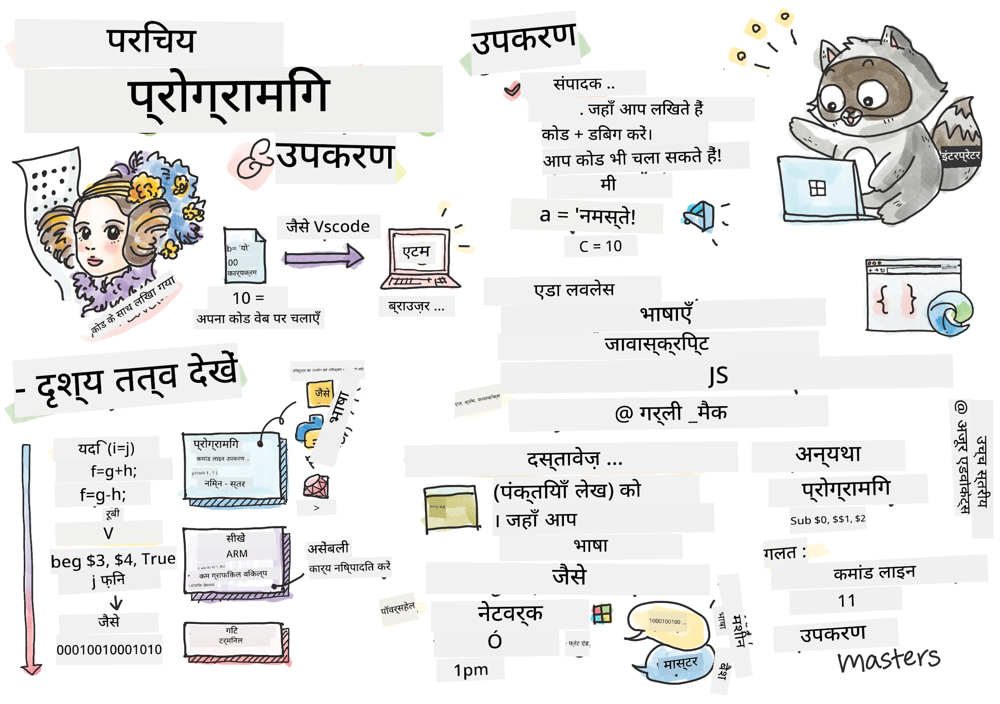
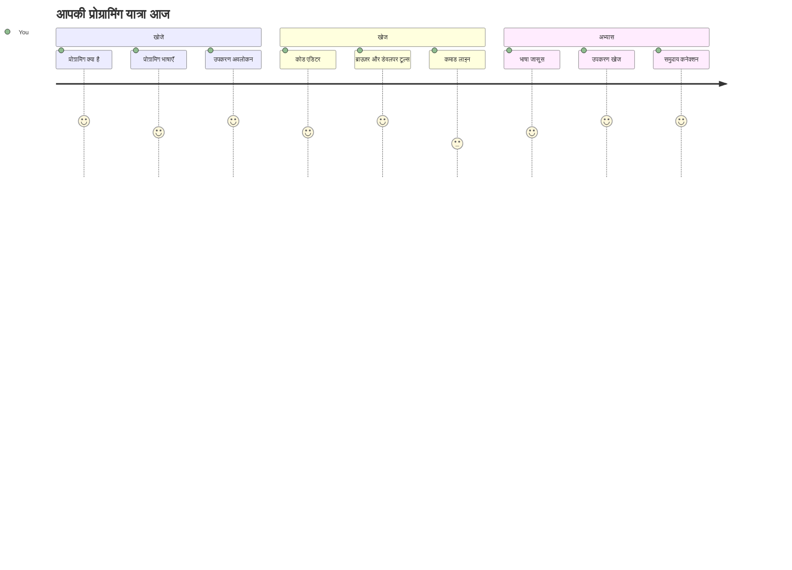
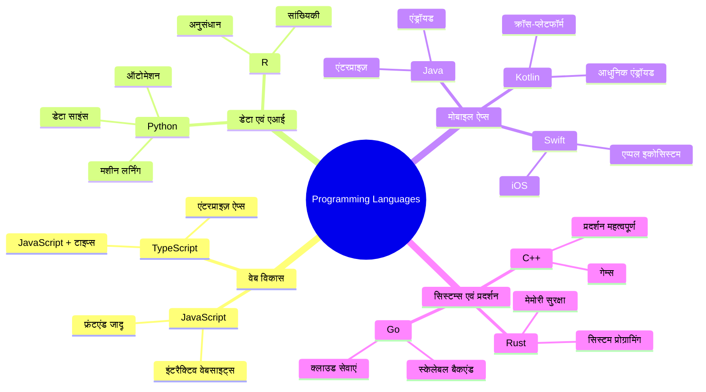
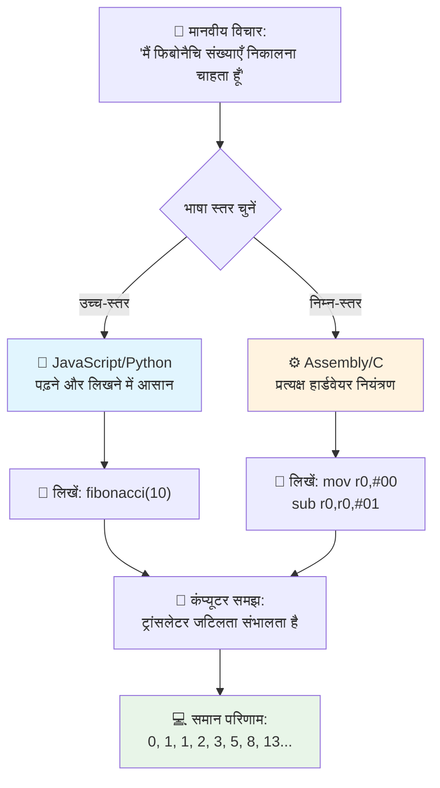
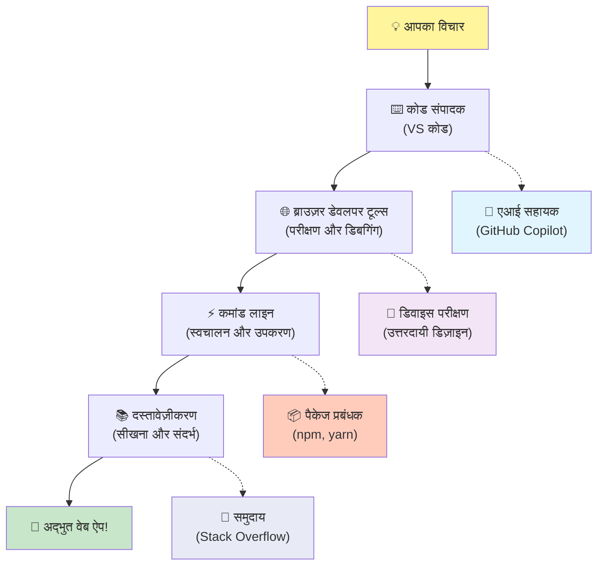
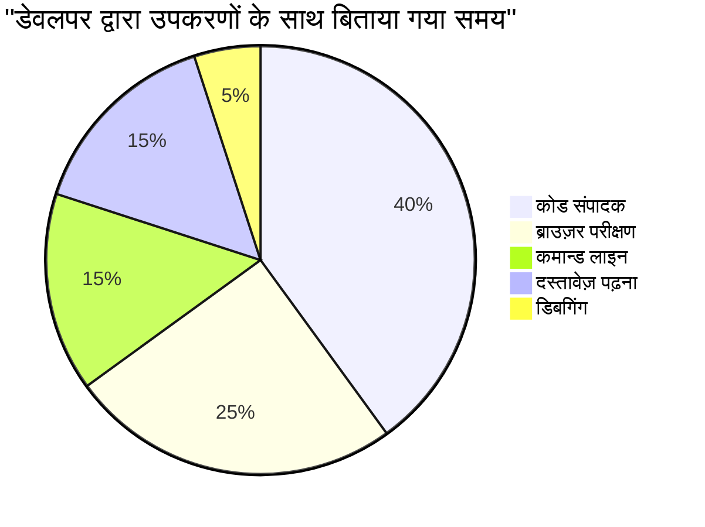
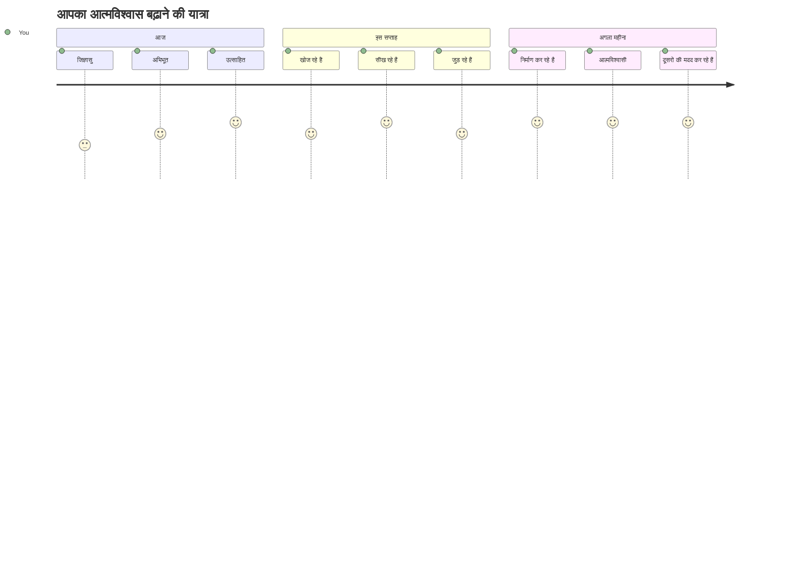

# प्रोग्रामिंग भाषाओं और आधुनिक डेवलपर उपकरणों का परिचय

नमस्ते, भविष्य के डेवलपर! 👋 क्या मैं आपको कुछ बता सकता हूँ जो हर दिन मुझे रोमांचित कर देता है? आप यह जानने वाले हैं कि प्रोग्रामिंग केवल कंप्यूटर के बारे में नहीं है – यह आपके सबसे अनोखे विचारों को जीवन में लाने की असली सुपरपावर है!

आप जानते हैं वह क्षण जब आप अपने पसंदीदा ऐप का उपयोग कर रहे होते हैं और सब कुछ बिल्कुल सही काम करता है? जब आप एक बटन दबाते हैं और कुछ जादुई होता है जिससे आप कहते हैं "वाह, उन्होंने ये कैसे किया?" खैर, आप जैसा कोई व्यक्ति – शायद अपनी पसंदीदा कॉफी शॉप में रात के 2 बजे अपनी तीसरी एस्प्रेसो के साथ बैठा हुआ – वही कोड लिखा जिसने वह जादू बनाया। और ये बात आपके दिमाग को हिला देगी: इस पाठ के अंत तक, आप न केवल समझ जाएंगे कि वे यह कैसे करते हैं, बल्कि आप खुद इसे आजमाने के लिए उत्साहित हो उठेंगे!

देखिए, मैं पूरी तरह समझता हूँ अगर प्रोग्रामिंग अभी डरावना लग रहा है। जब मैंने शुरुआत की थी, तो मुझे सच में लगता था कि आपको कोई गणितीय जीनियस होना चाहिए या आप पांच साल की उम्र से कोडिंग कर रहे हों। लेकिन जो बात मेरे नजरिए को पूरी तरह बदल गई वह यह थी: प्रोग्रामिंग बिल्कुल वैसा ही है जैसे किसी नई भाषा में बातचीत सीखना। आप "हैलो" और "थैंक यू" से शुरू करते हैं, फिर कॉफी ऑर्डर करना सीखते हैं, और इससे पहले कि आपको पता चले, आप गहन दार्शनिक चर्चाएं कर रहे होते हैं! बस इस मामले में, आप कंप्यूटर से बातचीत कर रहे हैं, और सच बताऊं? वे सबसे धैर्यवान वार्तालापी हैं – वे आपकी गलतियों का कभी न्याय नहीं करते और वे हमेशा फिर से कोशिश करने के लिए उत्साहित रहते हैं!

आज, हम उन अद्भुत उपकरणों का पता लगाएंगे जो आधुनिक वेब विकास को न केवल संभव बल्कि बेहद लत लगने वाला बनाते हैं। मैं उन बिल्कुल ही एडिटर्स, ब्राउज़र्स, और वर्कफ़्लोज़ की बात कर रहा हूँ जिन्हें नेटफ्लिक्स, स्पॉटिफ़ाई और आपके पसंदीदा इंडी ऐप स्टूडियो के डेवलपर्स हर दिन उपयोग करते हैं। और यहाँ वह हिस्सा है जिससे आप खुशी से नाच उठेंगे: इन पेशेवर-ग्रेड, उद्योग-मानक उपकरणों का अधिकांश हिस्सा पूरी तरह से मुफ्त है!


> स्केचनोट द्वारा [Tomomi Imura](https://twitter.com/girlie_mac)


```mermaid
journey
    title आपकी प्रोग्रामिंग यात्रा आज
    section खोजें
      प्रोग्रामिंग क्या है: 5: You
      प्रोग्रामिंग भाषाएँ: 4: You
      उपकरण अवलोकन: 5: You
    section खोज
      कोड एडिटर: 4: You
      ब्राउज़र और डेवलपर टूल्स: 5: You
      कमांड लाइन: 3: You
    section अभ्यास
      भाषा जासूस: 4: You
      उपकरण खोज: 5: You
      समुदाय कनेक्शन: 5: You
```
## चलिए देखते हैं आप पहले से क्या जानते हैं!

मज़ेदार बातों में कूदने से पहले, मैं उत्सुक हूँ – आप इस प्रोग्रामिंग दुनिया के बारे में पहले से क्या जानते हैं? और सुनिए, अगर आप इन सवालों को देखकर सोच रहे हैं "मुझे वास्तव में इस बारे में कुछ भी नहीं पता," तो यह न केवल ठीक है, बल्कि परफेक्ट है! इसका मतलब है कि आप बिलकुल सही जगह पर हैं। इस क्विज़ को व्यायाम से पहले स्ट्रेचिंग की तरह सोचें – हम बस अपने दिमाग की मांसपेशियों को गरम कर रहे हैं!

[प्री-लेसन क्विज़ लें](https://ff-quizzes.netlify.app/web/)


## हमारा साहसिक कार्य जो हम साथ में करने वाले हैं

ठीक है, मैं सच में उत्साहित हूँ कि हम आज क्या खोजने जा रहे हैं! सच में, मैं आपकी प्रतिक्रिया देखना चाहता हूँ जब ये कुछ अवधारणाएं समझ में आएंगी। यहाँ हमारा अद्भुत सफर है:

- **प्रोग्रामिंग वास्तव में क्या है (और यह क्यों सबसे कूल चीज़ है!)** – हम जानेंगे कि कोड असल में वह अदृश्य जादू है जो आपके आस-पास सब कुछ चलाता है, उस अलार्म से जो किसी तरह जानता है कि सोमवार की सुबह है, उस एल्गोरिद्म तक जो आपकी नेटफ्लिक्स सिफ़ारिशों को बिल्कुल सही बनाता है
- **प्रोग्रामिंग भाषाएं और उनकी शानदार विशेषताएं** – कल्पना कीजिए कि आप एक पार्टी में जा रहे हैं जहाँ हर व्यक्ति के पास पूरी तरह से अलग सुपरपावर और समस्या सुलझाने के तरीके हैं। प्रोग्रामिंग भाषा की दुनिया वैसी ही है, और आप उनसे मिलना पसंद करेंगे!
- **वे मूलभूत निर्माण ब्लॉक्स जो डिजिटल जादू करते हैं** – इन्हें किसी अल्टीमेट क्रिएटिव LEGO सेट की तरह सोचें। एक बार जब आप समझ जाएंगे कि ये टुकड़े कैसे मेल खाते हैं, तो आप सच में कुछ भी बना सकते हैं जो आपकी कल्पना में हो
- **पेशेवर उपकरण जो आपको ऐसा महसूस कराएंगे जैसे आपको जादूगर की छड़ी मिली हो** – मैं यहाँ नाटकीय नहीं हो रहा हूँ – ये उपकरण आपको सच में सुपरपावर का अहसास कराएंगे, और सबसे अच्छी बात? ये वही उपकरण हैं जो प्रोफेशनल्स उपयोग करते हैं!

> 💡 **ध्यान रखें**: आज सब कुछ याद करने की कोशिश बिल्कुल न करें! अभी तो मैं बस यह चाहता हूँ कि आप संभावनाओं के प्रति उत्साहित महसूस करें। विवरण स्वाभाविक रूप से हमारे साथ अभ्यास करते हुए आपके साथ चिपक जाएंगे – यही असली सीखने का तरीका है!

> आप इस पाठ को [Microsoft Learn](https://learn.microsoft.com/en-us/learn/modules/web-development-101/introduction-programming/?WT.mc_id=academic-77807-sagibbon) पर भी ले सकते हैं!

## तो प्रोग्रामिंग *वास्तव में* क्या है?

ठीक है, आइए उस लाखों डॉलर वाले प्रश्न का जवाब दें: प्रोग्रामिंग असल में क्या है?

मैं आपको एक कहानी बताता हूँ जिसने मेरी सोच पूरी तरह बदल दी। पिछले सप्ताह, मैं अपनी माँ को हमारे नए स्मार्ट टीवी रिमोट का उपयोग करना समझा रहा था। मैंने देखा कि मैं ये सब कह रहा था, "लाल बटन दबाओ, लेकिन बड़ा लाल बटन नहीं, बाएं तरफ वाला छोटा लाल बटन... नहीं, तुम्हारा दूसरा बायां... ठीक है, अब दो सेकंड के लिए दबाए रखो, एक नहीं, तीन नहीं..." ये बात आपको परिचित लगती है? 😅

यही है प्रोग्रामिंग! यह एक कला है जिसमें आप बहुत ही विस्तृत, चरण-दर-चरण निर्देश देते हैं किसी ऐसी चीज़ को जो बेहद शक्तिशाली है लेकिन जिसे सब कुछ बिल्कुल सही तरीके से बताया जाना चाहिए। बस यह आपके माँ को समझाने जैसा नहीं है (जो पूछ सकती हैं "कौन सा लाल बटन?"), बल्कि आप कंप्यूटर को समझा रहे हैं (जो बिल्कुल वैसा ही करता है जैसा आप कहते हैं, भले ही आपने जो कहा वह बिल्कुल वैसा न हो जो आप चाहते थे)।

जब मैंने यह पहली बार सीखा, तो मुझे यह बात हैरानी में डाल गई: कंप्यूटर वास्तव में उनके मूल में काफी सरल होते हैं। वे सच में केवल दो चीज़ें समझते हैं – 1 और 0, जो असल में बस "हाँ" और "नहीं" या "ऑन" और "ऑफ" हैं। बस इतना ही! लेकिन यहाँ जादू होता है – हमें 1 और 0 में बात करने की जरूरत नहीं जैसे हम फिल्म "द मैट्रिक्स" में हों। यही वह जगह है जहाँ **प्रोग्रामिंग भाषाएं** मदद करती हैं। ये ऐसे हैं जैसे आपके पास दुनिया के सबसे अच्छे अनुवादक हों जो आपके बिल्कुल सामान्य मानव विचारों को कंप्यूटर भाषा में बदल देते हैं।

और ये वह बात है जो मुझे हर सुबह वास्तविक रोमांचित करती है: आपके जीवन में जो भी डिजिटल चीज़ें हैं, वे सब ठीक वैसे ही शुरू हुईं जैसे आप – शायद अपने पायजामे में कॉफी की चाय के साथ बैठकर, अपने लैपटॉप पर कोड टाइप करते हुए। वह इंस्टाग्राम फ़िल्टर जो आपको परफेक्ट दिखाता है? किसी ने कोड किया। वह सिफ़ारिश जिसने आपको आपका नया पसंदीदा गाना दिखाया? एक डेवलपर ने उस एल्गोरिद्म को बनाया। वह ऐप जो आपकी दोस्तों के साथ डिनर बिल्स बाँटने में मदद करता है? हाँ, किसी ने सोचा "यह परेशान करता है, मैं इसे ठीक कर सकता हूँ" और फिर... उन्होंने किया!

जब आप प्रोग्राम करना सीखते हैं, तो आप सिर्फ एक नया कौशल नहीं सीख रहे होते – आप उस अद्भुत समस्या-समाधान समुदाय का हिस्सा बन रहे होते हैं जो दिन भर सोचता है, "अगर मैं कुछ ऐसा बना सकूं जो किसी का दिन थोड़ा बेहतर बना सके?" सच में, इससे कूल कुछ हो ही नहीं सकता!

✅ **मज़ेदार तथ्य खोज**: जब आपके पास खाली समय हो, तो एक बात खोजें – आप सोचते हैं दुनिया का पहला कंप्यूटर प्रोग्रामर कौन था? मैं आपको एक हिंट देता हूँ: वह वो नहीं हो सकता जिसकी आप उम्मीद कर रहे हैं! इस व्यक्ति की कहानी बिल्कुल रोमांचक है और दिखाती है कि प्रोग्रामिंग हमेशा रचनात्मक समस्या-समाधान और अलग सोचने के बारे में रही है।

### 🧠 **जांच का समय: आप कैसा महसूस कर रहे हैं?**

**थोड़ा समय लें और सोचें:**
- क्या "कंप्यूटर को निर्देश देना" का विचार अब आपके लिए समझ में आता है?
- क्या आप किसी दैनिक काम को प्रोग्रामिंग से स्वचालित करना चाहते हैं?
- इस पूरी प्रोग्रामिंग चीज़ के बारे में आपके मन में कौन से सवाल उठ रहे हैं?

> **याद रखें**: यह पूरी तरह से सामान्य है अगर कुछ अवधारणाएँ अभी थोड़ा अस्पष्ट लग रही हैं। प्रोग्रामिंग सीखना किसी नई भाषा को सीखने जैसा है – आपके दिमाग को उन न्यूरल पाथवे बनाने में समय लगता है। आप बढ़िया कर रहे हैं!

## प्रोग्रामिंग भाषाएं जादू के अलग-अलग स्वादों जैसी हैं

ठीक है, यह थोड़ा अजीब लगेगा, लेकिन मेरे साथ बने रहें – प्रोग्रामिंग भाषाएं अलग-अलग प्रकार के संगीत जैसी होती हैं। सोचिए: आपके पास जैज़ है, जो मुलायम और स्वाभाविक है, रॉक जो ताकतवर और सीधे-साधे हैं, क्लासिकल जो सुरुचिपूर्ण और संरचित है, और हिप-हॉप जो रचनात्मक और अभिव्यक्तिपूर्ण है। हर शैली की अपनी एक अलग भावना होती है, अपने उत्साही प्रशंसकों का समुदाय होता है, और हर एक मनोदशा और अवसर के लिए पूरी तरह उपयुक्त है।

प्रोग्रामिंग भाषाएं बिल्कुल ऐसा ही करती हैं! आप वह भाषा इस्तेमाल नहीं करेंगे जो मज़ेदार मोबाइल गेम बनाने के लिए हो, बड़ी मात्रा में जलवायु डेटा को संसाधित करने के लिए, ठीक वैसे ही जैसे आप योग क्लास में डेथ मेटल नहीं बजाएंगे (अच्छा, ज़्यादातर योग क्लासेस में! 😄)।

लेकिन यहाँ हर बार मेरा दिमाग उड़ जाता है जब मैं इस बारे में सोचता हूँ: ये भाषाएं ऐसी हैं जैसे आपके पास सबसे धैर्यवान, प्रतिभाशाली दुभाषिये हों जो बिल्कुल आपके बगल में बैठे हों। आप अपने विचारों को एक ऐसे तरीके से व्यक्त कर सकते हैं जो आपके मानव दिमाग के लिए प्राकृतिक लगे, और वे उस बेहद जटिल काम को संभालते हैं जो उसे 1 और 0 में कंप्यूटर की भाषा में बदल देता है। यह ऐसा है जैसे आपके पास एक दोस्त हो जो पूरी तरह से "मानव रचनात्मकता" और "कंप्यूटर तर्क" दोनों में पारंगत हो – और वे कभी थकते नहीं, कॉफी ब्रेक की जरूरत नहीं होती, और दो बार एक ही सवाल पूछने पर भी वे आपको कभी नहीं मारते!

### लोकप्रिय प्रोग्रामिंग भाषाएं और उनका उपयोग


```mermaid
mindmap
  root((Programming Languages))
    वेब विकास
      JavaScript
        फ्रंटएंड जादू
        इंटरैक्टिव वेबसाइट्स
      TypeScript
        JavaScript + टाइप्स
        एंटरप्राइज़ ऐप्स
    डेटा एवं एआई
      Python
        डेटा साइंस
        मशीन लर्निंग
        ऑटोमेशन
      R
        सांख्यिकी
        अनुसंधान
    मोबाइल ऐप्स
      Java
        एंड्रॉयड
        एंटरप्राइज़
      Swift
        iOS
        एप्पल इकोसिस्टम
      Kotlin
        आधुनिक एंड्रॉयड
        क्रॉस-प्लेटफॉर्म
    सिस्टम्स एवं प्रदर्शन
      C++
        गेम्स
        प्रदर्शन महत्वपूर्ण
      Rust
        मेमोरी सुरक्षा
        सिस्टम प्रोग्रामिंग
      Go
        क्लाउड सेवाएं
        स्केलेबल बैकएंड
```
| भाषा       | सर्वोत्तम उपयोग          | यह लोकप्रिय क्यों है       |
|------------|------------------------|---------------------------|
| **JavaScript** | वेब विकास, उपयोगकर्ता इंटरफेस | ब्राउज़रों में चलता है और इंटरैक्टिव वेबसाइट चलाता है |
| **Python**  | डेटा साइंस, स्वचालन, AI | पढ़ने और सीखने में आसान, शक्तिशाली पुस्तकालय |
| **Java**    | एंटरप्राइज़ एप्लिकेशन, एंड्रॉइड ऐप्स | प्लेटफॉर्म-स्वतंत्र, बड़े सिस्टम के लिए मजबूत |
| **C#**      | विंडोज़ एप्लिकेशन, गेम विकास | माइक्रोसॉफ्ट पारिस्थितिकी तंत्र का मजबूत समर्थन |
| **Go**      | क्लाउड सेवाएं, बैकएंड सिस्टम | तेज, सरल, आधुनिक कंप्यूटिंग के लिए डिज़ाइन किया गया |

### हाई-लेवल बनाम लो-लेवल भाषाएं

ठीक है, यह वास्तव में वह अवधारणा थी जिसने मेरी सोच तोड़ दी थी जब मैंने पहली बार सीखना शुरू किया था, इसलिए मैं वह उपमा साझा करता हूँ जिसने इसे मेरे लिए स्पष्ट कर दिया – और मुझे उम्मीद है कि यह आपकी भी मदद करेगा!

कल्पना करें कि आप ऐसे देश में हैं जहाँ आप भाषा नहीं बोलते, और आपको बेहद ज़रूरत है सबसे नजदीकी टॉयलेट ढूंढ़ने की (हम सब वहाँ रहे हैं, है ना? 😅):

- **लो-लेवल प्रोग्रामिंग** वैसी है जैसे आप स्थानीय बोली इतनी अच्छी तरह सीख लें कि आप फल बेचने वाली दादी से सांस्कृतिक संदर्भों, स्थानीय स्लैंग, और अंदरूनी चुटकुलों के साथ बात कर सकें जो सिर्फ वहीं के लोग समझते हैं। बहुत प्रभावशाली और बेहद कुशल... यदि आप उस भाषा में पारंगत हैं! लेकिन जब आप सिर्फ टॉयलेट ढूंढ़ रहे हों तो यह थोड़ा भारी पड़ सकता है।

- **हाई-लेवल प्रोग्रामिंग** वैसी है जैसे आपका कोई ऐसा स्थानीय दोस्त हो जो आपको बस समझता हो। आप "मुझे सच में एक वॉशरूम चाहिए" साधारण अंग्रेज़ी में कह सकते हैं, और वे सारे सांस्कृतिक अनुवाद कर देते हैं और आपको ऐसी दिशा-निर्देश देते हैं जो आपके गैर-स्थानीय दिमाग को पूरी तरह समझ में आ जाए।

प्रोग्रामिंग भाषा के लिहाज से:
- **लो-लेवल भाषाएं** (जैसे Assembly या C) आपको कंप्यूटर के हार्डवेयर के साथ बहुत ही विस्तृत बातचीत करने देती हैं, लेकिन आपको मशीन जैसा सोचना पड़ता है, जो... चलिए कहें यह एक बड़ा मानसिक बदलाव है!
- **हाई-लेवल भाषाएं** (जैसे JavaScript, Python, या C#) आपको इंसान की तरह सोचने देती हैं जबकि वे पर्दे के पीछे सारी मशीन की भाषा संभालती हैं। साथ ही, इनके पास बेहद स्वागतशील समुदाय होते हैं जो जानते हैं कि नए होना कैसा होता है और जो वास्तव में मदद करना चाहते हैं!

सोचो मैं आपको किससे शुरुआत करने का सुझाव दूंगा? 😉 हाई-लेवल भाषाएं ऐसी होती हैं जैसे ट्रेनिंग व्हील्स हो जो आप कभी नहीं हटाना चाहेंगे क्योंकि वे पूरे अनुभव को बहुत सहज और मजेदार बना देती हैं!


```mermaid
flowchart TB
    A["👤 मानवीय विचार:<br/>'मैं फिबोनैचि संख्याएँ निकालना चाहता हूँ'"] --> B{भाषा स्तर चुनें}
    
    B -->|उच्च-स्तर| C["🌟 JavaScript/Python<br/>पढ़ने और लिखने में आसान"]
    B -->|निम्न-स्तर| D["⚙️ Assembly/C<br/>प्रत्यक्ष हार्डवेयर नियंत्रण"]
    
    C --> E["📝 लिखें: fibonacci(10)"]
    D --> F["📝 लिखें: mov r0,#00<br/>sub r0,r0,#01"]
    
    E --> G["🤖 कंप्यूटर समझ:<br/>ट्रांसलेटर जटिलता संभालता है"]
    F --> G
    
    G --> H["💻 समान परिणाम:<br/>0, 1, 1, 2, 3, 5, 8, 13..."]
    
    style C fill:#e1f5fe
    style D fill:#fff3e0
    style H fill:#e8f5e8
```
### मैं आपको दिखाता हूँ कि हाई-लेवल भाषाएं क्यों अधिक मित्रवत होती हैं

ठीक है, मैं आपको कुछ दिखाने वाला हूँ जो पूरी तरह से दिखाता है कि मुझे हाई-लेवल भाषाओं से प्यार क्यों हो गया, लेकिन पहले – मुझे आपसे एक वादा चाहिए। जब आप पहला कोड उदाहरण देखें, तो घबराएं नहीं! यह थोड़ा intimidating दिखना ही है। यही बात मैं समझाना चाहता हूँ!

हम दो बिल्कुल अलग शैलियों में लिखा वही काम देखने वाले हैं। दोनों वही Fibonacci क्रम बनाते हैं – यह एक सुंदर गणितीय पैटर्न है जहाँ हर संख्या पिछले दो नंबरों का योग होती है: 0, 1, 1, 2, 3, 5, 8, 13... (मज़ेदार तथ्य: यह पैटर्न प्रकृति में हर जगह मिलता है – सूरजमुखी के बीजों की सर्पिल, पाइनकोन के पैटर्न, यहाँ तक कि आकाशगंगाओं का गठन!)

तैयार हैं अंतर देखने के लिए? चलिए शुरू करते हैं!

**हाई-लेवल भाषा (JavaScript) – मानव-अनुकूल:**

```javascript
// चरण 1: बुनियादी फिबोनाच्ची सेटअप
const fibonacciCount = 10;
let current = 0;
let next = 1;

console.log('Fibonacci sequence:');
```

**यह कोड क्या करता है:**
- **एक स्थायी मान घोषित करें** कि हमें कितने फिबोनैची नंबर जनरेट करने हैं
- **दो चर प्रारंभ करें** वर्तमान और अगले नंबर को ट्रैक करने के लिए
- **शुरुआती मान सेट करें** (0 और 1) जो Fibonacci पैटर्न को परिभाषित करते हैं
- **एक शीर्षक संदेश दिखाएं** ताकि हमारा आउटपुट पहचाना जा सके

```javascript
// चरण 2: लूप के साथ श्रंखला बनाएं
for (let i = 0; i < fibonacciCount; i++) {
  console.log(`Position ${i + 1}: ${current}`);
  
  // श्रंखला में अगला नंबर गणना करें
  const sum = current + next;
  current = next;
  next = sum;
}
```

**यहाँ क्या होता है, उसका विवरण:**
- **एक `for` लूप के साथ** हमारी सीक्वेंस में हर पॉज़िशन पर जाएं
- **प्रत्येक संख्या और उसकी स्थिति दिखाएं** टेम्प्लेट लिटरेल फॉर्मेटिंग से
- **वर्तमान और अगले मूल्यों को जोड़कर** अगला Fibonacci नंबर कैलकुलेट करें
- **हमारे ट्रैकिंग वेरिएबल्स को अपडेट करें** ताकि हम अगली पुनरावृत्ति पर जाएं

```javascript
// चरण 3: आधुनिक कार्यात्मक दृष्टिकोण
const generateFibonacci = (count) => {
  const sequence = [0, 1];
  
  for (let i = 2; i < count; i++) {
    sequence[i] = sequence[i - 1] + sequence[i - 2];
  }
  
  return sequence;
};

// उपयोग का उदाहरण
const fibSequence = generateFibonacci(10);
console.log(fibSequence);
```

**ऊपर हमने किया है:**
- **आधुनिक एरो फंक्शन सिंटैक्स का उपयोग करके** एक पुन: प्रयोज्य फ़ंक्शन बनाया
- **पूरा क्रम संग्रहित करने के लिए** एक ऐरे बनाया बजाय एक-एक करके दिखाने के
- **पिछले मूल्यों से प्रत्येक नए नंबर की गणना** के लिए ऐरे इंडेक्सिंग का उपयोग किया
- **संपूर्ण क्रम लौटाया** ताकि इसे प्रोग्राम के अन्य हिस्सों में लचीले ढंग से उपयोग किया जा सके

**लो-लेवल भाषा (ARM Assembly) – कंप्यूटर-अनुकूल:**

```assembly
 area ascen,code,readonly
 entry
 code32
 adr r0,thumb+1
 bx r0
 code16
thumb
 mov r0,#00
 sub r0,r0,#01
 mov r1,#01
 mov r4,#10
 ldr r2,=0x40000000
back add r0,r1
 str r0,[r2]
 add r2,#04
 mov r3,r0
 mov r0,r1
 mov r1,r3
 sub r4,#01
 cmp r4,#00
 bne back
 end
```

ध्यान दें कि JavaScript संस्करण लगभग अंग्रेज़ी निर्देशों की तरह पढ़ता है, जबकि Assembly संस्करण कंप्यूटर के प्रोसेसर को सीधे नियंत्रित करने वाले गूढ़ कमांड्स का उपयोग करता है। दोनों समान कार्य करते हैं, लेकिन हाई-लेवल भाषा इंसानों के लिए समझने, लिखने और बनाए रखने में बहुत आसान होती है।

**मुख्य अंतर जो आप देखेंगे:**
- **पढ़ने में सरलता**: JavaScript में विवरणात्मक नाम जैसे `fibonacciCount` इस्तेमाल होते हैं जबकि Assembly में गुप्त लेबल जैसे `r0`, `r1` होते हैं  
- **टिप्पणियाँ**: उच्च-स्तरीय भाषाएँ व्याख्यात्मक टिप्पणियों को प्रोत्साहित करती हैं जो कोड को स्वयं-दस्तावेजी बनाती हैं  
- **संरचना**: JavaScript की तार्किक प्रवाह इस तरह से होती है जैसे मनुष्य समस्याओं को चरण-दर-चरण सोचते हैं  
- **रखरखाव**: अलग-अलग आवश्यकताओं के लिए JavaScript संस्करण को अपडेट करना सरल और स्पष्ट होता है  

✅ **फिबोनैचि अनुक्रम के बारे में**: यह बिल्कुल शानदार संख्या पैटर्न (जहाँ प्रत्येक संख्या उससे पहले दो संख्याओं के योग के बराबर होती है: 0, 1, 1, 2, 3, 5, 8...) प्रकृति में सचमुच हर जगह दिखाई देता है! आप इसे सूरजमुखी के घुमावों, पाइनकोन पैटर्न, नौटिलस शंख की घुमावदार आकृति, और यहां तक कि पेड़ की शाखाओं के बढ़ने के तरीके में भी पाएंगे। यह बेहद रोमांचक है कि गणित और कोड हमारी मदद कैसे करते हैं उन पैटर्न को समझने और फिर से बनाने में जिनका उपयोग प्रकृति सुंदरता बनाने के लिए करती है!  

## वह निर्माणात्मक अवयव जो जादू करते हैं संभव

ठीक है, अब जब आपने देखा कि प्रोग्रामिंग भाषाएँ क्रियान्वित होती कैसे हैं, तो आइए उन मूलभूत टुकड़ों को तोड़ते हैं जो सचमुच हर लिखे गए प्रोग्राम को बनाते हैं। इन्हें अपने पसंदीदा व्यंजन के जरूरी सामग्री समझें – एक बार जब आप समझ जाएंगे कि प्रत्येक क्या करता है, तो आप लगभग किसी भी भाषा में कोड पढ़ और लिख सकेंगे!  

यह कुछ वैसा ही है जैसे प्रोग्रामिंग की व्याकरण सीखना। याद है स्कूल में जब आपने संज्ञा, क्रिया और वाक्यों के निर्माण के बारे में सीखा था? प्रोग्रामिंग की अपनी व्याकरण होती है, और सच कहूं तो यह अंग्रेज़ी व्याकरण से कहीं अधिक तार्किक और उदार है! 😄  

### कथन: चरण-दर-चरण निर्देश

आइए शुरू करते हैं **कथन** से – ये कंप्यूटर से संवाद करते हुए व्यक्त एक-एक वाक्य जैसे होते हैं। प्रत्येक कथन कंप्यूटर को एक विशिष्ट काम करने के लिए बताता है, जैसे दिशानिर्देश देना: "यहाँ बायां मुड़ो," "लाल बत्ती पर रुको," "उस जगह पार्क करो।"  

मुझे कथनों की बात यह पसंद है कि वे आमतौर पर कितने पढ़ने में आसान होते हैं। यह देखें:  

```javascript
// बुनियादी कथन जो एकल क्रियाएँ करते हैं
const userName = "Alex";                    
console.log("Hello, world!");              
const sum = 5 + 3;                         
```
  
**यह कोड क्या करता है:**  
- उपयोगकर्ता का नाम संग्रहित करने के लिए एक स्थिरांक (`constant`) घोषित करें  
- कंसोल आउटपुट में स्वागत संदेश दिखाएं  
- एक गणितीय ऑपरेशन का परिणाम निकालें और संग्रहित करें  

```javascript
// बयान जो वेब पृष्ठों के साथ इंटरैक्ट करते हैं
document.title = "My Awesome Website";      
document.body.style.backgroundColor = "lightblue";
```
  
**चरण-दर-चरण, यह क्या हो रहा है:**  
- वेबपेज के शीर्षक को संशोधित करें जो ब्राउज़र टैब में दिखाई देता है  
- पूरे पेज के पृष्ठभूमि का रंग बदलें  

### चर: आपके प्रोग्राम की मेमोरी प्रणाली

ठीक है, **चर** वास्तव में मेरी पसंदीदा अवधारणाओं में से एक हैं क्योंकि वे बिल्कुल वैसे ही हैं जैसे आप रोजमर्रा की जिंदगी में उपयोग करते हैं!  

अपने फोन के संपर्क सूची के बारे में सोचें। आप हर किसी का नंबर याद नहीं रखते – इसके बजाय, आप "माँ," "सबसे अच्छा दोस्त," या "पिज़्ज़ा स्थान जो दोपहर 2 बजे तक डिलीवरी करता है" जैसे लेबल सेव करते हैं और आपका फोन असली नंबर याद रखता है। चर बिल्कुल इसी तरह काम करते हैं! ये नामित कंटेनर होते हैं जहाँ आपका प्रोग्राम जानकारी संग्रहित कर सकता है और बाद में उस नाम से पुनः प्राप्त कर सकता है जो वास्तव में समझ में आता है।  

यहां जो सबसे मजेदार है: चर आपके प्रोग्राम के चलते बदल सकते हैं (इसलिए नाम "चर" रखा गया है – समझे न?). जैसे आप उस पिज़्ज़ा स्थान का संपर्क अपडेट कर सकते हैं जब आपको कहीं बेहतर जगह मिले, वैसे ही चर उस जानकारी के अनुसार अपडेट हो सकते हैं जिसे आपका प्रोग्राम नया सीखता है या जैसे हालात बदलते हैं!  

आइए आपको दिखाता हूँ कि यह कितना सरल हो सकता है:  

```javascript
// चरण 1: बुनियादी चर बनाना
const siteName = "Weather Dashboard";        
let currentWeather = "sunny";               
let temperature = 75;                       
let isRaining = false;                      
```
  
**इन अवधारणाओं को समझना:**  
- `const` चर में स्थिर मान संग्रहित करें (जैसे साइट का नाम)  
- उन मानों के लिए `let` का उपयोग करें जो आपके प्रोग्राम के दौरान बदल सकते हैं  
- विभिन्न डेटा प्रकार असाइन करें: स्ट्रिंग्स (पाठ), नंबर, और बूलियन (सत्य/असत्य)  
- उन नामों का चयन करें जो स्पष्ट रूप से बताएं कि प्रत्येक चर में क्या है  

```javascript
// चरण 2: संबंधित डेटा को समूहित करने के लिए वस्तुओं के साथ काम करना
const weatherData = {                       
  location: "San Francisco",
  humidity: 65,
  windSpeed: 12
};
```
  
**ऊपर दिए गए उदाहरण में हम:**
- संबंधित मौसम जानकारी को एक वस्तु (`object`) में समूहित किया  
- एक ही चर नाम के तहत कई डेटा आइटम व्यवस्थित किए  
- प्रत्येक जानकारी को स्पष्ट रूप से लेबल करने के लिए कुंजी-मूल्य (`key-value`) जोड़े उपयोग किए  

```javascript
// चरण 3: परिवर्तनीयों का उपयोग और अद्यतन करना
console.log(`${siteName}: Today is ${currentWeather} and ${temperature}°F`);
console.log(`Wind speed: ${weatherData.windSpeed} mph`);

// परिवर्तनशील परिवर्तनीयों को अपडेट करना
currentWeather = "cloudy";                  
temperature = 68;                          
```
  
**आइए प्रत्येक भाग समझें:**  
- `${}` सिंटैक्स के साथ टेम्पलेट लिटरल का उपयोग करके जानकारी प्रदर्शित करें  
- डॉट नोटेशन (`weatherData.windSpeed`) से वस्तु की संपत्तियों तक पहुंचें  
- `let` के साथ घोषित चर को बदलें ताकि बदलती परिस्थितियों को दर्शाया जा सके  
- कई चर मिलाकर सार्थक संदेश बनाएं  

```javascript
// चरण 4: साफ-सुथरे कोड के लिए आधुनिक डीस्ट्रक्चरिंग
const { location, humidity } = weatherData; 
console.log(`${location} humidity: ${humidity}%`);
```
  
**आपको जानने की जरूरत है:**  
- वस्तुओं से विशिष्ट गुण निकालने के लिए डीस्ट्रक्चरिंग असाइनमेंट (`destructuring assignment`) का उपयोग करें  
- वस्तु की कुंजी के नाम के समान नए चर स्वचालित रूप से बनाएं  
- दोहराए जाने वाले डॉट नोटेशन से बचकर कोड सरल बनाएं  

### नियंत्रण प्रवाह: अपने प्रोग्राम को सोचने की शिक्षा देना

ठीक है, यहाँ प्रोग्रामिंग बिल्कुल दिमाग उड़ा देने वाली हो जाती है! **नियंत्रण प्रवाह** मूलतः आपके प्रोग्राम को स्मार्ट निर्णय लेना सिखाना है, बिलकुल उसी तरह जैसे आप हर दिन बिना सोचे समझे करते हैं।  

कल्पना करें: आज सुबह आपने संभवतः कुछ ऐसा किया होगा, "अगर बारिश हो रही है तो मैं छाता लूँगा। अगर ठंड है तो जैकेट पहनूंगा। अगर मैं देर से हूँ तो नाश्ता छोड़कर रास्ते में कॉफी ले लूंगा।" आपका दिमाग स्वाभाविक रूप से इस यदि-तो तर्क (if-then logic) का पालन करता है दर्जनों बार हर दिन!  

यहीं से प्रोग्राम बुद्धिमान और जीवन्त महसूस करते हैं, बजाय इसके कि वे कोई नीरस, अनुमानित स्क्रिप्ट का पालन कर रहे हों। वे वास्तव में स्थिति को देख सकते हैं, जो हो रहा है उसका मूल्यांकन कर सकते हैं, और उचित प्रतिक्रिया दे सकते हैं। यह ऐसे है जैसे आपके प्रोग्राम को ऐसा मस्तिष्क मिल गया हो जो अनुकूलित हो सके और विकल्प बना सके!  

देखना चाहते हैं कि यह कितनी सुंदरता से काम करता है? मैं दिखाता हूँ:  

```javascript
// चरण 1: बुनियादी सशर्त तर्क
const userAge = 17;

if (userAge >= 18) {
  console.log("You can vote!");
} else {
  const yearsToWait = 18 - userAge;
  console.log(`You'll be able to vote in ${yearsToWait} year(s).`);
}
```
  
**यह कोड क्या करता है:**  
- जांचता है कि उपयोगकर्ता की उम्र मतदान की आवश्यकता को पूरा करती है या नहीं  
- परिणाम के आधार पर विभिन्न कोड ब्लॉकों को निष्पादित करता है  
- यदि उम्र 18 से कम हो तो मतदान पात्रता तक कितनी देर बाकी है यह गणना करता है और दिखाता है  
- प्रत्येक परिदृश्य के लिए विशिष्ट, सहायक प्रतिक्रिया प्रदान करता है  

```javascript
// चरण 2: तार्किक ऑपरेटरों के साथ कई शर्तें
const userAge = 17;
const hasPermission = true;

if (userAge >= 18 && hasPermission) {
  console.log("Access granted: You can enter the venue.");
} else if (userAge >= 16) {
  console.log("You need parent permission to enter.");
} else {
  console.log("Sorry, you must be at least 16 years old.");
}
```
  
**यहाँ क्या हो रहा है इसका विश्लेषण:**  
- कई शर्तों को `&&` (और) ऑपरेटर के साथ संयोजित करता है  
- एकाधिक परिस्थितियों के लिए `else if` का उपयोग करके शर्तों की पदानुक्रम बनाता है  
- अंतिम `else` कथन के साथ सभी संभावित मामलों को संभालता है  
- प्रत्येक अलग स्थिति के लिए स्पष्ट, क्रियाशील प्रतिक्रिया देता है  

```javascript
// चरण 3: टर्नरी ऑपरेटर के साथ संक्षिप्त शर्तीय।
const votingStatus = userAge >= 18 ? "Can vote" : "Cannot vote yet";
console.log(`Status: ${votingStatus}`);
```
  
**आपको याद रखना चाहिए:**  
- सरल दो- विकल्प वाली स्थितियों के लिए टर्नरी ऑपरेटर (`? :`) का उपयोग करें  
- पहले शर्त लिखें, फिर `?`, फिर सत्य परिणाम, फिर `:`, फिर असत्य परिणाम लिखें  
- जब आपको स्थितियों के आधार पर मान असाइन करना हो तो इस पैटर्न को लागू करें  

```javascript
// चरण 4: कई विशिष्ट मामलों को संभालना
const dayOfWeek = "Tuesday";

switch (dayOfWeek) {
  case "Monday":
  case "Tuesday":
  case "Wednesday":
  case "Thursday":
  case "Friday":
    console.log("It's a weekday - time to work!");
    break;
  case "Saturday":
  case "Sunday":
    console.log("It's the weekend - time to relax!");
    break;
  default:
    console.log("Invalid day of the week");
}
```
  
**यह कोड निम्नलिखित करता है:**  
- चर के मान को कई विशिष्ट मामलों से मिलाता है  
- समान मामलों को एक साथ समूहित करता है (सप्ताह के दिन बनाम सप्ताहांत)  
- मेल मिलने पर उपयुक्त कोड ब्लॉक निष्पादित करता है  
- अप्रत्याशित मानों को संभालने के लिए `default` केस शामिल करता है  
- अगले मामले पर जाने से रोकने के लिए `break` स्टेटमेंट्स का उपयोग करता है  

> 💡 **वास्तविक दुनिया का उदाहरण**: नियंत्रण प्रवाह को ऐसे सोचें जैसे दुनिया का सबसे धैर्यवान GPS आपको दिशा निर्देश दे रहा हो। यह कह सकता है, "अगर मेन स्ट्रीट पर ट्रैफिक है तो हाईवे लें। अगर कनस्ट्रक्शन हाईवे ब्लॉक कर रहा है तो दर्शनीय मार्ग आजमाएं।" प्रोग्राम बिल्कुल इसी प्रकार की स्थितिगत तर्कशक्ति का उपयोग अलग-अलग परिस्थितियों पर बुद्धिमानी से प्रतिक्रिया देने के लिए करते हैं और उपयोगकर्ताओं को हमेशा सर्वोत्तम अनुभव प्रदान करते हैं।  

### 🎯 **अवधारणा जाँच: निर्माण अवयवों का मास्टरी**

**आइए देखें कि आप मूल बातें कितनी अच्छी तरह समझ रहे हैं:**  
- क्या आप अपने शब्दों में चर और कथन के बीच का अंतर समझा सकते हैं?  
- कोई वास्तविक दुनिया का उदाहरण सोचें जहां आप यदि-तो निर्णय का उपयोग करेंगे (जैसे हमारा मतदान उदाहरण)  
- प्रोग्रामिंग लॉजिक के बारे में ऐसी कौन सी बात है जिसने आपको आश्चर्यचकित किया?  

**एक त्वरित आत्मविश्वास बढ़ाने वाला:**  

```mermaid
flowchart LR
    A["📝 बयान<br/>(निर्देश)"] --> B["📦 चर<br/>(संग्रहण)"] --> C["🔀 नियंत्रण प्रवाह<br/>(निर्णय)"] --> D["🎉 कार्यकारी कार्यक्रम!"]
    
    style A fill:#ffeb3b
    style B fill:#4caf50
    style C fill:#2196f3
    style D fill:#ff4081
```  
✅ **आगे क्या आने वाला है**: अब हम इन अवधारणाओं में और गहराई से उतरने जा रहे हैं और साथ मिलकर इस अद्भुत यात्रा का आनंद लेंगे! अभी के लिए, उन सभी महान संभावनाओं के बारे में उत्साहित महसूस करने पर ध्यान दें जो आपके सामने हैं। विशिष्ट कौशल और तकनीकें स्वाभाविक रूप से बन जाएंगी जैसे-जैसे हम साथ अभ्यास करेंगे – मैं वादा करता हूँ यह आप की अपेक्षा से कहीं अधिक मज़ेदार होने वाला है!  

## व्यापारिक उपकरण

ठीक है, यहाँ मुझे वास्तव में इतनी उत्सुकता होती है कि मैं खुद को कंटेन नहीं कर पाता! 🚀 हम बात करने वाले हैं उन अविश्वसनीय टूल्स के बारे में जो आपको ऐसा महसूस कराएंगे जैसे आपको अभी-अभी एक डिजिटल अंतरिक्ष यान की चाबियाँ मिल गईं हों।  

आप जानते हैं एक शेफ के पास वे पूरी तरह संतुलित चाकू होते हैं जो उनके हाथों का विस्तार लगते हैं? या कैसे एक संगीतकार के पास वह गिटार होती है जो छूते ही गीत गाता है? ठीक उसी तरह, डेवलपर्स के पास भी हमारे अपने जादुई उपकरण होते हैं, और यह सुनकर आपके होश उड़ जाएंगे – इनमें से अधिकतर उपकरण पूरी तरह मुफ्त हैं!  

मैं अपने कुर्सी पर कूदता रहता हूँ इन्हें आपके साथ साझा करने के बारे में सोचकर क्योंकि इन्होंने हमारे सॉफ़्टवेयर निर्माण के तरीके को पूरी तरह परिवर्तित कर दिया है। हम AI-संचालित कोडिंग सहायक की बात कर रहे हैं जो आपकी कोडिंग में मदद कर सकते हैं (मैं मजाक नहीं कर रहा!), क्लाउड वातावरण जहाँ आप वाई-फाई के ज़रिए कहीं से भी पूरे ऐप्लिकेशन बना सकते हैं, और डिबगिंग टूल्स इतने उन्नत हैं कि वे आपके प्रोग्रामों के लिए X-रे विजन की तरह हैं।  

और यह हिस्सा जो मुझे अभी भी रोमांचित करता है: ये "शुरुआती उपकरण" नहीं हैं जिन्हें आप जल्दी ही छोड़ देंगे। ये वही पेशेवर-स्तरीय उपकरण हैं जिनका उपयोग Google, Netflix, और उस इंडी ऐप स्टूडियो में जो आप पसंद करते हैं, उसी समय कर रहे हैं। इन्हें उपयोग करके आप खुद को सचमुच एक प्रो महसूस करेंगे!  


```mermaid
graph TD
    A["💡 आपका विचार"] --> B["⌨️ कोड संपादक<br/>(VS कोड)"] 
    B --> C["🌐 ब्राउज़र डेवलपर टूल्स<br/>(परीक्षण और डिबगिंग)"]
    C --> D["⚡ कमांड लाइन<br/>(स्वचालन और उपकरण)"]
    D --> E["📚 दस्तावेज़ीकरण<br/>(सीखना और संदर्भ)"]
    E --> F["🚀 अद्भुत वेब ऐप!"]
    
    B -.-> G["🤖 एआई सहायक<br/>(GitHub Copilot)"]
    C -.-> H["📱 डिवाइस परीक्षण<br/>(उत्तरदायी डिज़ाइन)"]
    D -.-> I["📦 पैकेज प्रबंधक<br/>(npm, yarn)"]
    E -.-> J["👥 समुदाय<br/>(Stack Overflow)"]
    
    style A fill:#fff59d
    style F fill:#c8e6c9
    style G fill:#e1f5fe
    style H fill:#f3e5f5
    style I fill:#ffccbc
    style J fill:#e8eaf6
```  
### कोड एडिटर्स और IDEs: आपके नए डिजिटल सबसे अच्छे दोस्त

चलिए कोड एडिटर्स के बारे में बात करते हैं – ये सचमुच आपके पसंदीदा जगहें बनने वाले हैं जहाँ आप अपना ज्यादातर समय डिजिटल रचनाएँ बनाने और संवारने में बिताएंगे।  

पर आधुनिक एडिटर्स की सबसे जादुई बात यह है कि ये केवल फैंसी टेक्स्ट एडिटर्स नहीं हैं। ये बिलकुल ऐसे हैं जैसे आपके कोडिंग मेंटर 24/7 आपके बगल में बैठा हो। ये आपकी टाइपिंग की गलतियों को तब पकड़ लेते हैं जब आप उन्हें नोटिस भी नहीं करते, सुधार सुझाते हैं जो आपको एक जीनियस जैसा दिखाते हैं, आपको समझाते हैं कि प्रत्येक कोड का हिस्सा क्या करता है, और कुछ तो आपकी टाइपिंग पूरा होने से पहले आपके विचारों को पूरा करने की भी पेशकश करते हैं!  

मुझे याद है जब पहली बार मैंने ऑटो-कंप्लीशन खोजा था – मुझे लगा मैं भविष्य में जी रहा हूँ। आप कुछ टाइप करना शुरू करते हैं, तो आपका एडिटर कहता है, "अरे, क्या आप उस फ़ंक्शन के बारे में सोच रहे थे जो बिल्कुल वही करता है जो आपको चाहिए?" यह बिलकुल ऐसा है जैसे कोई आपके मन को पढ़ने वाला कोडिंग साथी हो!  

**इन एडिटर्स को इतना अद्भुत क्या बनाता है?**  

आधुनिक कोड एडिटर्स सुविधाओं का प्रभावशाली संग्रह प्रदान करते हैं जो आपकी उत्पादकता बढ़ाते हैं:  

| सुविधा | यह क्या करता है | क्यों यह मदद करता है |  
|---------|-----------------|---------------------|  
| **सिंटैक्स हाईलाइटिंग** | आपके कोड के विभिन्न हिस्सों को रंगीन करता है | कोड पढ़ने और त्रुटियाँ खोजने में आसान बनाता है |  
| **ऑटो-कंप्लीशन** | टाइप करते समय कोड सुझाव देता है | कोडिंग तेज करता है और टाइपिंग गलतियाँ कम करता है |  
| **डिबगिंग टूल्स** | त्रुटियाँ खोजने और सुधारने में मदद करता है | समस्या निवारण में घंटों बचाता है |  
| **एक्सटेंशंस** | विशिष्ट सुविधाएँ जोड़ते हैं | किसी भी तकनीक के लिए अपने एडिटर को अनुकूलित करें |  
| **AI सहायक** | कोड और व्याख्याएं सुझाते हैं | सीखने और उत्पादकता को गति देते हैं |  

> 🎥 **वीडियो संसाधन**: क्या आप इन टूल्स को क्रियाशील रूप में देखना चाहते हैं? इस [Tools of the Trade वीडियो](https://youtube.com/watch?v=69WJeXGBdxg) में विस्तृत अवलोकन देखें।  

#### वेब विकास के लिए अनुशंसित एडिटर्स  

**[Visual Studio Code](https://code.visualstudio.com/?WT.mc_id=academic-77807-sagibbon)** (मुफ्त)  
- वेब डेवलपर्स में सबसे लोकप्रिय  
- उत्कृष्ट एक्सटेंशन पारिस्थितिकी तंत्र  
- बिल्ट-इन टर्मिनल और Git एकीकरण  
- **जरूरी एक्सटेंशंस**:  
  - [GitHub Copilot](https://marketplace.visualstudio.com/items?itemName=GitHub.copilot) - AI संचालित कोड सुझाव  
  - [Live Share](https://marketplace.visualstudio.com/items?itemName=MS-vsliveshare.vsliveshare) - वास्तविक समय सहयोग  
  - [Prettier](https://marketplace.visualstudio.com/items?itemName=esbenp.prettier-vscode) - स्वचालित कोड फॉर्मेटिंग  
  - [Code Spell Checker](https://marketplace.visualstudio.com/items?itemName=streetsidesoftware.code-spell-checker) - कोड में टाइपो पकड़ने के लिए  

**[JetBrains WebStorm](https://www.jetbrains.com/webstorm/)** (पेड, छात्रों के लिए मुफ्त)  
- उन्नत डिबगिंग और परीक्षण उपकरण  
- बुद्धिमान कोड पूर्णता  
- बिल्ट-इन संस्करण नियंत्रण  

**क्लाउड-आधारित IDEs** (विभिन्न मूल्य निर्धारण)  
- [GitHub Codespaces](https://github.com/features/codespaces) - आपके ब्राउज़र में पूरा VS Code  
- [Replit](https://replit.com/) - सीखने और कोड साझा करने के लिए बढ़िया  
- [StackBlitz](https://stackblitz.com/) - त्वरित, पूरा स्टैक वेब विकास  

> 💡 **शुरुआत करने का सुझाव**: Visual Studio Code से शुरुआत करें – यह मुफ्त है, उद्योग में व्यापक रूप से इस्तेमाल होता है, और इसके लिए विशाल समुदाय उपलब्ध है जो सहायक ट्यूटोरियल और एक्सटेंशंस बनाता है।  

### वेब ब्राउज़र: आपका गुप्त विकास प्रयोगशाला

ठीक है, तैयार हो जाइए अपना दिमाग पूरी तरह उड़ाने के लिए! आप जानते हैं कि आप ब्राउज़र का इस्तेमाल सोशल मीडिया देखने और वीडियो देखने के लिए करते हैं? ठीक है, अब पता चला है कि ये पूरे समय आपके सामने एक अविश्वसनीय गुप्त डेवलपर लैबोरेटरी छुपाए हुए थे, जो सिर्फ आपके द्वारा खोजे जाने का इंतजार कर रही थी!  

हर बार जब आप वेबपेज पर राइट-क्लिक करके "Inspect Element" चुनते हैं, तो आप डेवलपर टूल्स की एक छुपी हुई दुनिया खोल रहे होते हैं जो वास्तव में कुछ महंगे सॉफ़्टवेयर से भी ज्यादा शक्तिशाली है जिनके लिए मैं कभी सैकड़ों डॉलर खर्च करता था। यह बिलकुल ऐसा है जैसे आपका पुराना रसोईघर किसी गुप्त पैनल के पीछे एक पेशेवर शेफ की लैबोरेटरी छुपाए हुए हो!
पहली बार जब किसी ने मुझे ब्राउज़र DevTools दिखाया, तो मैं लगभग तीन घंटे सिर्फ क्लिक करता रहा और कहता रहा "रुको, यह भी कर सकता है?!" आप सच में किसी भी वेबसाइट को रियल टाइम में एडिट कर सकते हैं, बिल्कुल देख सकते हैं कि हर चीज़ कितनी जल्दी लोड हो रही है, अपनी साइट को अलग-अलग डिवाइस पर कैसे दिखता है यह टेस्ट कर सकते हैं, और यहां तक कि JavaScript को एक प्रो की तरह डिबग कर सकते हैं। यह पूरी तरह से दिमाग हिला देने वाला है!

**इसलिए ब्राउज़र आपके गुप्त हथियार हैं:**

जब आप एक वेबसाइट या वेब एप्लिकेशन बनाते हैं, तो आपको यह देखना होता है कि यह असली दुनिया में कैसा दिखता है और कैसा व्यवहार करता है। ब्राउज़र न केवल आपके काम को दिखाते हैं बल्कि प्रदर्शन, पहुंचयोग्यता, और संभावित समस्याओं के बारे में विस्तृत प्रतिक्रिया भी देते हैं।

#### ब्राउज़र डेवलपर टूल्स (DevTools)

आधुनिक ब्राउज़र व्यापक विकास सूट शामिल करते हैं:

| टूल श्रेणी | यह क्या करता है | उपयोग का उदाहरण |
|------------|----------------|------------------|
| **एलिमेंट इंस्पेक्टर** | रियल-टाइम में HTML/CSS देखें और संपादित करें | तुरंत परिणाम देखने के लिए स्टाइलिंग समायोजित करें |
| **कंसोल** | त्रुटि संदेश देखें और JavaScript टेस्ट करें | समस्याओं को डिबग करें और कोड के साथ प्रयोग करें |
| **नेटवर्क मॉनिटर** | संसाधनों के लोड होने को ट्रैक करें | प्रदर्शन और लोडिंग समय बेहतर बनाएं |
| **एक्सेसिबिलिटी चेकर** | समावेशी डिजाइन टेस्ट करें | सुनिश्चित करें कि आपकी साइट सभी उपयोगकर्ताओं के लिए काम करती है |
| **डिवाइस सिम्युलेटर** | अलग-अलग स्क्रीन साइज़ पर पूर्वावलोकन करें | बिना कई डिवाइस के रिस्पॉन्सिव डिज़ाइन टेस्ट करें |

#### विकास के लिए अनुशंसित ब्राउज़र

- **[Chrome](https://developers.google.com/web/tools/chrome-devtools/)** - उद्योग मानक DevTools के साथ व्यापक दस्तावेज़ीकरण
- **[Firefox](https://developer.mozilla.org/docs/Tools)** - उत्कृष्ट CSS Grid और एक्सेसिबिलिटी टूल्स
- **[Edge](https://docs.microsoft.com/microsoft-edge/devtools-guide-chromium/?WT.mc_id=academic-77807-sagibbon)** - Chromium पर आधारित Microsoft के डेवलपर संसाधनों के साथ

> ⚠️ **महत्वपूर्ण परीक्षण टिप**: अपनी वेबसाइट्स को हमेशा कई ब्राउज़रों में टेस्ट करें! जो Chrome में पूरी तरह काम करता है, वह Safari या Firefox में अलग दिख सकता है। पेशेवर डेवलपर सभी प्रमुख ब्राउज़रों में टेस्ट करते हैं ताकि उपयोगकर्ता अनुभव लगातार एक जैसा रहे।

### कमांड लाइन टूल्स: आपके डेवलपर सुपरपॉवर के द्वार

ठीक है, चलिए कमांड लाइन के बारे में पूरी ईमानदारी से बात करते हैं, क्योंकि मैं चाहता हूँ कि आप इसे किसी ऐसे व्यक्ति से सुनें जो सच में इसे समझता है। जब मैंने इसे पहली बार देखा – बस यह डरावनी काली स्क्रीन जो चमकता टेक्स्ट दिखाती थी – तो मैं सच में सोच रहा था, "नहीं, बिलकुल नहीं! यह कुछ 1980 के दशक की हैकर फिल्म जैसा दिखता है, और मैं इसके लिए बिलकुल भी समझदार नहीं हूँ!" 😅

लेकिन यहां मैं चाहता हूं कि मैं उस वक्त कोई मुझसे कहता – और अभी मैं आपको कह रहा हूँ: कमांड लाइन डरावनी नहीं है – यह वास्तव में आपके कंप्यूटर के साथ सीधे संवाद करने जैसा है। इसे ऐसे समझिए जैसे खाने का ऑर्डर एक शानदार ऐप के ज़रिए देना जिसमें तस्वीरें और मेनू होते हैं (जो आसान और अच्छा है) बनाम अपने पसंदीदा स्थानीय रेस्टोरेंट में जाना जहां शेफ जानता है कि आपको क्या पसंद है और आप बस कह देते हैं "मुझे कुछ आश्चर्यजनक बनाओ।"

कमांड लाइन वह जगह है जहाँ डेवलपर्स जादूगर महसूस करते हैं। आप कुछ जादुई शब्द टाइप करते हैं (ठीक है, ये सिर्फ कमांड हैं, लेकिन ये जादू जैसे लगते हैं!), एंटर दबाते हैं, और बूम – आपने पूरा प्रोजेक्ट स्ट्रक्चर बना दिया, दुनियाभर से शक्तिशाली टूल इंस्टॉल कर लिए, या अपनी ऐप को इंटरनेट पर तैनात कर दिया ताकि लाखों लोग देख सकें। एक बार आपने उस शक्ति का पहला स्वाद चख लिया, तो यह वास्तव में काफी लत लगाकर बनाने वाला होता है!

**कमांड लाइन आपके पसंदीदा टूल बन जाएगा क्योंकि:**

जबकि ग्राफिकल इंटरफेस कई कार्यों के लिए अच्छे हैं, कमांड लाइन स्वचालन, सटीकता और गति में उत्कृष्ट है। कई विकास टूल मुख्य रूप से कमांड लाइन इंटरफेस के माध्यम से काम करते हैं, और उन्हें प्रभावी रूप से इस्तेमाल करना आपकी उत्पादकता में जबरदस्त सुधार कर सकता है।

```bash
# चरण 1: परियोजना निर्देशिका बनाएँ और उसमें जाएँ
mkdir my-awesome-website
cd my-awesome-website
```
  
**यह कोड क्या करता है:**  
- आपके प्रोजेक्ट के लिए "my-awesome-website" नाम का नया डायरेक्टरी बनाता है  
- काम शुरू करने के लिए नई बनी डायरेक्टरी में नेविगेट करता है  

```bash
# चरण 2: package.json के साथ परियोजना आरंभ करें
npm init -y

# आधुनिक विकास उपकरण स्थापित करें
npm install --save-dev vite prettier eslint
npm install --save-dev @eslint/js
```
  
**कदम दर कदम, यह हो रहा है:**  
- `npm init -y` के साथ डिफ़ॉल्ट सेटिंग्स के साथ नया Node.js प्रोजेक्ट इनिशियलाइज़ करता है  
- तेज़ विकास और प्रोडक्शन बिल्ड के लिए Vite को इंस्टॉल करता है  
- ऑटोमैटिक कोड फॉर्मैटिंग के लिए Prettier और कोड क्वालिटी जांच के लिए ESLint जोड़ता है  
- इन्हें केवल विकास-सम्बंधित डिपेंडेंसी के रूप में चिह्नित करने के लिए `--save-dev` फ़्लैग का उपयोग करता है  

```bash
# कदम 3: परियोजना संरचना और फ़ाइलें बनाएँ
mkdir src assets
echo '<!DOCTYPE html><html><head><title>My Site</title></head><body><h1>Hello World</h1></body></html>' > index.html

# विकास सर्वर शुरू करें
npx vite
```
  
**ऊपर हमने किया है:**  
- स्रोत कोड और एसेट्स के लिए अलग-अलग फोल्डर बनाकर प्रोजेक्ट व्यवस्थित किया  
- उचित डॉक्यूमेंट स्ट्रक्चर के साथ एक बेसिक HTML फ़ाइल जनरेट की  
- लाइव रीलोडिंग और हॉट मॉड्यूल रिप्लेसमेंट के लिए Vite डेवलपमेंट सर्वर शुरू किया  

#### वेब विकास के लिए आवश्यक कमांड लाइन टूल्स

| टूल | उद्देश्य | आपको इसकी जरूरत क्यों है |
|------|---------|-------------------------|
| **[Git](https://git-scm.com/)** | संस्करण नियंत्रण | परिवर्तनों को ट्रैक करें, दूसरों के साथ सहयोग करें, अपने काम का बैकअप लें |
| **[Node.js & npm](https://nodejs.org/)** | JavaScript रनटाइम और पैकेज प्रबंधन | ब्राउज़र के बाहर JavaScript चलाएं, आधुनिक विकास टूल्स इंस्टॉल करें |
| **[Vite](https://vitejs.dev/)** | बिल्ड टूल और डेवलपमेंट सर्वर | हॉट मॉड्यूल रिप्लेसमेंट के साथ बहुत तेज विकास |
| **[ESLint](https://eslint.org/)** | कोड गुणवत्ता | अपने JavaScript में समस्याओं को स्वचालित रूप से खोजें और ठीक करें |
| **[Prettier](https://prettier.io/)** | कोड फॉर्मेटिंग | अपने कोड को लगातार फॉर्मेटेड और पठनीय बनाए रखें |

#### प्लेटफ़ॉर्म-विशिष्ट विकल्प

**Windows:**  
- **[Windows Terminal](https://docs.microsoft.com/windows/terminal/?WT.mc_id=academic-77807-sagibbon)** - आधुनिक, फीचर-रिच टर्मिनल  
- **[PowerShell](https://docs.microsoft.com/powershell/?WT.mc_id=academic-77807-sagibbon)** 💻 - शक्तिशाली स्क्रिप्टिंग माहौल  
- **[Command Prompt](https://learn.microsoft.com/windows-server/administration/windows-commands/windows-commands)** 💻 - पारंपरिक Windows कमांड लाइन  

**macOS:**  
- **[Terminal](https://support.apple.com/guide/terminal/)** 💻 - बिल्ट-इन टर्मिनल एप्लिकेशन  
- **[iTerm2](https://iterm2.com/)** - उन्नत सुविधाओं वाला बेहतर टर्मिनल  

**Linux:**  
- **[Bash](https://www.gnu.org/software/bash/)** 💻 - स्टैण्डर्ड Linux शेल  
- **[KDE Konsole](https://docs.kde.org/trunk5/en/konsole/konsole/index.html)** - उन्नत टर्मिनल इमुलेटर  

> 💻 = ऑपरेटिंग सिस्टम पर पूर्व-इंस्टॉल्ड

> 🎯 **सीखने का रास्ता**: `cd` (डायरेक्टरी बदलें), `ls` या `dir` (फ़ाइल सूची देखें), और `mkdir` (फ़ोल्डर बनाएं) जैसे बेसिक कमांड से शुरू करें। आधुनिक वर्कफ़्लो कमांड जैसे `npm install`, `git status`, और `code .` (वर्तमान डायरेक्टरी VS Code में खोलता है) से अभ्यास करें। जैसे-जैसे आप सहज होते जाएंगे, आप स्वाभाविक रूप से अधिक उन्नत कमांड और स्वचालन तकनीकें सीखेंगे।

### दस्तावेज़ीकरण: आपका हमेशा उपलब्ध सीखने वाला मेंटर

ठीक है, मैं एक छोटा रहस्य साझा करता हूँ जो आपको शुरुआती होने पर बहुत बेहतर महसूस कराएगा: सबसे अनुभवी डेवलपर्स भी अपना बहुत समय दस्तावेज़ पढ़ने में बिताते हैं। और यह इसलिए नहीं कि उन्हें पता नहीं है कि वे क्या कर रहे हैं – बल्कि यह बुद्धिमानी का एक संकेत है!

दस्तावेज़ीकरण को दुनिया के सबसे धैर्यवान, जानकार शिक्षकों के रूप में सोचें जो 24/7 उपलब्ध हैं। 2 बजे रात को किसी समस्या पर फंसे? दस्तावेज़ीकरण वहां है गर्म आभासी गले के साथ और आप जो सही जवाब चाहिए वो बिल्कुल देता है। एक नई बढ़िया फीचर के बारे में जानना चाहते हैं जिस पर सब बात कर रहे हैं? दस्तावेज़ीकरण आपके साथ है कदम दर कदम उदाहरणों के साथ। समझने की कोशिश कर रहे हैं कि कुछ कैसे और क्यों काम करता है? आपने सही सोचा – दस्तावेज़ीकरण इसे एक ऐसे तरीके से समझाने के लिए तैयार है जो अंततः आपको समझ में आ जाए!

यहां कुछ ऐसा है जिसने मेरा नजरिया पूरी तरह बदल दिया: वेब विकास की दुनिया अत्यंत तेज़ी से बदलती है, और कोई भी (मैं वास्तव में कोई नहीं!) सब कुछ याद नहीं रखता। मैंने 15+ वर्षों के अनुभव वाले सीनियर डेवलपर्स को बेसिक सिंटैक्स देखते देखा है, और आप जानते हैं क्या? यह शर्मनाक नहीं है – यह स्मार्ट है! यह पूर्ण मेमोरी होने के बारे में नहीं है; यह इस बारे में है कि आप भरोसेमंद उत्तर कहां जल्दी पा सकते हैं और उन्हें कैसे लागू करते हैं।

**यहां असली जादू होता है:**

पेशेवर डेवलपर्स अपने समय का एक बड़ा हिस्सा दस्तावेज़ पढ़ने में बिताते हैं – इसलिए नहीं कि वे नहीं जानते कि वे क्या कर रहे हैं, बल्कि इसलिए कि वेब विकास का परिदृश्य इतनी तेजी से विकसित होता है कि लगातार सीखते रहना आवश्यक होता है। अच्छी दस्तावेज़ीकरण आपको समझने में मदद करता है कि केवल *कैसे* किसी चीज़ का उपयोग करना है, बल्कि *क्यों* और *कब* इसका उपयोग करना चाहिए।

#### आवश्यक दस्तावेज़ीकरण संसाधन

**[Mozilla Developer Network (MDN)](https://developer.mozilla.org/docs/Web)**  
- वेब तकनीक दस्तावेज़ीकरण के लिए स्वर्ण मानक  
- HTML, CSS, और JavaScript के लिए व्यापक मार्गदर्शिकाएँ  
- ब्राउज़र संगतता की जानकारी शामिल  
- व्यावहारिक उदाहरण और इंटरैक्टिव डेमो प्रदान करता है  

**[Web.dev](https://web.dev)** (Google द्वारा)  
- आधुनिक वेब विकास के सर्वोत्तम अभ्यास  
- प्रदर्शन अनुकूलन गाइड  
- पहुंचयोग्यता और समावेशी डिजाइन सिद्धांत  
- असली दुनिया परियोजनाओं से केस स्टडीज  

**[Microsoft Developer Documentation](https://docs.microsoft.com/microsoft-edge/#microsoft-edge-for-developers)**  
- Edge ब्राउज़र डेवलपमेंट संसाधन  
- प्रोग्रेसिव वेब एप गाइड  
- क्रॉस-प्लेटफ़ॉर्म विकास अंतर्दृष्टि  

**[Frontend Masters Learning Paths](https://frontendmasters.com/learn/)**  
- संरचित सीखने का पाठ्यक्रम  
- उद्योग विशेषज्ञों के वीडियो कोर्स  
- व्यावहारिक कोडिंग अभ्यास  

> 📚 **अध्ययन रणनीति**: दस्तावेज़ीकरण को याद करने की कोशिश न करें – बल्कि इसे कुशलता से नेविगेट करना सीखें। अक्सर इस्तेमाल किए जाने वाले संदर्भों को बुकमार्क करें और तेज़ी से विशिष्ट जानकारी खोजने के लिए खोज कार्यक्षमता का अभ्यास करें।

### 🔧 **टूल मास्टरी चेक: आपको क्या सबसे ज़्यादा पसंद आता है?**

**थोड़ा सोचें:**  
- आप सबसे पहले किस टूल को आजमाने के लिए उत्साहित हैं? (कोई गलत जवाब नहीं!)  
- क्या कमांड लाइन अभी भी डरावनी लगती है, या आप इसके बारे में उत्सुक हैं?  
- क्या आप ब्राउज़र DevTools का उपयोग कर अपनी पसंदीदा वेबसाइटों के पर्दे के पीछे झांकने की कल्पना कर सकते हैं?


```mermaid
pie title "डेवलपर द्वारा उपकरणों के साथ बिताया गया समय"
    "कोड संपादक" : 40
    "ब्राउज़र परीक्षण" : 25
    "कमान्ड लाइन" : 15
    "दस्तावेज़ पढ़ना" : 15
    "डिबगिंग" : 5
```  
> **मज़ेदार जानकारी**: अधिकांश डेवलपर्स अपना लगभग 40% समय अपने कोड एडिटर में बिताते हैं, लेकिन ध्यान दें कि कितना समय परीक्षण, सीखने, और समस्या-समाधान में जाता है। प्रोग्रामिंग केवल कोड लिखने के बारे में नहीं है – यह अनुभव बनाने के बारे में है!

✅ **सोचने के लिए भोजन**: यह एक दिलचस्प बात है – आप क्या सोचते हैं कि वेबसाइट बनाने (विकास) के टूल्स और उनके डिजाइन (डिज़ाइन) के टूल्स में क्या अंतर होगा? यह बिल्कुल ऐसे है जैसे एक आर्किटेक्ट जो सुंदर घर डिजाइन करता है और एक कॉन्ट्रैक्टर जो घर बनाता है। दोनों महत्वपूर्ण हैं, लेकिन उन्हें अलग-अलग टूलबॉक्स की जरूरत होती है! यह सोच आपको बड़े चित्र को समझने में मदद करेगी कि वेबसाइट्स जीवन में कैसे आती हैं।

## GitHub Copilot Agent Challenge 🚀

Agent मोड का उपयोग करके निम्न चुनौती पूरी करें:

**विवरण:** एक आधुनिक कोड एडिटर या IDE के फीचर्स का पता लगाएं और दिखाएं कि यह वेब डेवलपर के रूप में आपके वर्कफ़्लो को कैसे बेहतर बना सकता है।

**प्रॉम्प्ट:** एक कोड एडिटर या IDE चुनें (जैसे Visual Studio Code, WebStorm, या क्लाउड-आधारित IDE)। तीन फीचर्स या एक्सटेंशन्स की सूची बनाएं जो आपको कोड लिखने, डिबग करने या मेंटेन करने में अधिक प्रभावी बनाते हैं। प्रत्येक के लिए, संक्षिप्त व्याख्या दें कि यह आपके वर्कफ़्लो को कैसे लाभ पहुंचाता है।

---

## 🚀 चुनौती

**ठीक है, जासूस, क्या आप अपनी पहली केस के लिए तैयार हैं?**

अब जब आपके पास यह शानदार आधार है, तो मेरे पास एक रोमांच है जो आपको दिखाएगा कि प्रोग्रामिंग दुनिया कितनी विविध और आकर्षक है। और सुनिए – यह अभी कोड लिखने के बारे में नहीं है, इसलिए कोई दबाव नहीं! खुद को एक प्रोग्रामिंग भाषा जासूस समझिए जो अपने पहले रोमांचक केस पर है!

**आपका मिशन, यदि आप इसे स्वीकार करें:**  
1. **एक भाषा अन्वेषक बनें:** पूरी तरह से अलग-अलग दुनिया की तीन प्रोग्रामिंग भाषाएँ चुनें – शायद एक जो वेबसाइट बनाती है, एक मोबाइल ऐप्स बनाती है, और एक वैज्ञानिकों के लिए डेटा प्रोसेस करती है। हर भाषा में एक ही सरल काम के उदाहरण खोजें। मैं वादा करता हूँ आप चकित हो जाएंगे कि वे कैसे बिल्कुल अलग दिखते हुए वही काम करते हैं!  
2. **उनकी उत्पत्ति की कहानियां खोजें:** हर भाषा को खास क्या बनाता है? एक मज़ेदार तथ्य यह है – हर एक प्रोग्रामिंग भाषा किसी ने इस सोच के साथ बनाई थी कि "मुझे लगता है कि इस विशिष्ट समस्या को हल करने का बेहतर तरीका होना चाहिए।" क्या आप यह पता लगा सकते हैं कि वो समस्याएं क्या थीं? कुछ कहानियां सचमुच बहुत रोचक हैं!  
3. **समुदाय से मिलें:** देखें कि हर भाषा का समुदाय कितना स्वागत करता है और कितना उत्साही है। कुछ के लाखों डेवलपर्स ज्ञान साझा करते हैं और एक-दूसरे की मदद करते हैं, तो कुछ छोटे लेकिन बेहद घनिष्ठ और सहायक होते हैं। आप इन समुदायों की विभिन्न व्यक्तित्वों को देखना पसंद करेंगे!  
4. **अपने दिल की सुनें:** अभी आपके लिए कौन सी भाषा सबसे आसान लगती है? "परफेक्ट" विकल्प चुनने की चिंता न करें – अपनी प्रवृत्तियों को सुनें! यहाँ कोई गलत जवाब नहीं है, और बाद में आप हमेशा अन्य भाषाओं का पता लगा सकते हैं।  

**बोनस जासूसी कार्य:** देखें कि आप पता लगा सकते हैं कि प्रमुख वेबसाइट्स या ऐप्स किस भाषा के साथ बनाए गए हैं। मैं गारंटी देता हूँ कि आप हैरान रह जाएंगे कि Instagram, Netflix, या वह मोबाइल गेम जिसे आप नहीं छोड़ सकते, किस तकनीक पर चलते हैं!

> 💡 **याद रखें:** आप आज इन भाषाओं के विशेषज्ञ बनने की कोशिश नहीं कर रहे हैं। आप बस क्षेत्र को समझ रहे हैं कि आप कहां अपना नया ठिकाना बनाना चाहते हैं। अपना समय लें, मज़े करें, और अपनी जिज्ञासा को मार्गदर्शन करें!

## चलिए आपके खोज की जश्न मनाते हैं!

हे भगवान, आपने आज इतनी अद्भुत जानकारियाँ सीख ली हैं! मैं सच में उत्साहित हूँ यह देखने के लिए कि इस अद्भुत सफर ने आपके साथ क्या छोड़ा है। और याद रखें – यह कोई परीक्षा नहीं है जहाँ आपको सब कुछ परफेक्ट करना है। यह एक जश्न है उन सभी शानदार चीज़ों का जो आपने इस दिलचस्प दुनिया के बारे में सीखी हैं, जिसमें आप डुबकी लगाने वाले हैं!

[पाठ के बाद क्विज़ लें](https://ff-quizzes.netlify.app/web/)

## समीक्षा और स्व-अध्ययन

**अपने समय लें, खोज करें और मज़े करें!**
आपने आज काफी कुछ सीख लिया है, और यह आपकी मेहनत का परिणाम है! अब मज़ेदार हिस्सा आता है – उन विषयों का पता लगाना जिन्होंने आपकी जिज्ञासा को जगाया है। याद रखें, यह होमवर्क नहीं है – यह एक साहसिक यात्रा है!

**जिसमें आपकी रुचि हो, उसमें गहराई से डूबें:**

**प्रोग्रामिंग भाषाओं के साथ हाथ आज़माएँ:**
- उन 2-3 भाषाओं की आधिकारिक वेबसाइट पर जाएं जिन्होंने आपका ध्यान खींचा। हर एक की अपनी खासियत और कहानी होती है!
- कुछ ऑनलाइन कोडिंग प्लेग्राउंड्स जैसे [CodePen](https://codepen.io/), [JSFiddle](https://jsfiddle.net/), या [Replit](https://replit.com/) पर प्रयोग करें। कोशिश करने से न डरें – आप कुछ भी तोड़ नहीं सकते!
- पढ़ें कि आपकी पसंदीदा भाषा कैसे बनी। सच में, उनमें से कुछ मूल कहानी बहुत दिलचस्प होती है और आपको समझने में मदद करेगी कि भाषाएँ क्यों उसी तरह काम करती हैं जैसे वो करती हैं।

**अपने नए टूल्स के साथ सहज हों:**
- अगर आपने अभी तक Visual Studio Code डाउनलोड नहीं किया है तो कर लें – यह मुफ़्त है और आपको यह बहुत पसंद आएगा!
- एक्सटेंशंस मार्केटप्लेस को कुछ मिनटों के लिए देखें। यह आपके कोड एडिटर के लिए ऐप स्टोर की तरह है!
- अपने ब्राउज़र के डेवलपर टूल्स खोलें और कहीं-कहीं क्लिक करते रहें। सब कुछ समझने की चिंता न करें – बस वहां मौजूद चीजों से परिचित हो जाएं।

**समुदाय में शामिल हों:**
- कुछ डेवलपर कम्युनिटीज को [Dev.to](https://dev.to/), [Stack Overflow](https://stackoverflow.com/), या [GitHub](https://github.com/) पर फ़ॉलो करें। प्रोग्रामिंग समुदाय नए लोगों के लिए बहुत स्वागतयोग्य होता है!
- YouTube पर शुरुआती के अनुकूल कोडिंग वीडियो देखें। कई महान क्रिएटर्स हैं जो याद रखते हैं कि शुरुआत कैसी होती है।
- स्थानीय मीटअप या ऑनलाइन समुदायों में शामिल होने पर विचार करें। मुझ पर भरोसा करें, डेवलपर नए लोगों की मदद करना पसंद करते हैं!

> 🎯 **सुनिए, मैं चाहता हूँ कि आप याद रखें**: आपसे उम्मीद नहीं कि आप रातोंरात कोडिंग के जादूगर बन जाएं! अभी आप बस इस अद्भुत नई दुनिया को जान रहे हैं जिसका हिस्सा बनने वाले हैं। अपना समय लें, इस यात्रा का आनंद लें, और याद रखें – हर एक डेवलपर जिसे आप पसंद करते हैं, कभी आपके जैसे ही स्थिति में था, उत्साहित और शायद थोड़ा अधिभारित महसूस कर रहा था। यह पूरी तरह से सामान्य है, और इसका मतलब है कि आप सही रास्ते पर हैं!


## असाइनमेंट

[Reading the Docs](assignment.md)

> 💡 **आपके असाइनमेंट के लिए एक छोटा सा सुझाव**: मैं वास्तव में चाहूँगा कि आप कुछ ऐसे टूल्स एक्सप्लोर करें जिनके बारे में हमने अभी तक बात नहीं की है! जिन एडिटर्स, ब्राउज़र्स, और कमांड लाइन टूल्स की हमने चर्चा की है उन्हें छोड़ दें – वहाँ एक पूरी अद्भुत दुनिया है विकास उपकरणों की जो बस आपकी खोज का इंतजार कर रही है। ऐसे टूल्स खोजें जो सक्रिय रूप से बनाए जा रहे हैं और जिनकी समुदायें जीवंत और सहायक हों (ऐसे टूल्स में सबसे अच्छे ट्यूटोरियल्स और सबसे मददगार लोग होते हैं जब आप कहीं अटक जाते हैं और किसी दोस्त की मदद चाहते हैं)।

---

## 🚀 आपकी प्रोग्रामिंग यात्रा का टाइमलाइन

### ⚡ **अगले 5 मिनट में आप क्या कर सकते हैं**
- [ ] 2-3 प्रोग्रामिंग भाषा वेबसाइटों को बुकमार्क करें जो आपकी रुचि बनी हों
- [ ] अगर आपने अभी तक Visual Studio Code डाउनलोड नहीं किया है तो डाउनलोड करें
- [ ] अपने ब्राउज़र के DevTools (F12) खोलें और किसी भी वेबसाइट पर क्लिक करें
- [ ] किसी एक प्रोग्रामिंग समुदाय (Dev.to, Reddit r/webdev, या Stack Overflow) में शामिल हों

### ⏰ **इस घंटे में आप क्या पूरा कर सकते हैं**
- [ ] पाठ के बाद क्विज़ पूरी करें और अपने उत्तरों पर विचार करें
- [ ] GitHub Copilot एक्सटेंशन के साथ VS Code सेटअप करें
- [ ] ऑनलाइन दो अलग-अलग प्रोग्रामिंग भाषाओं में "Hello World" उदाहरण आज़माएं
- [ ] YouTube पर "डे इन द लाइफ ऑफ़ ए डेवलपर" वीडियो देखें
- [ ] अपनी प्रोग्रामिंग भाषा की खोज शुरू करें (चैलेंज से)

### 📅 **आपका सप्ताह भर का साहसिक कार्य**
- [ ] असाइनमेंट पूरा करें और 3 नए विकास उपकरण एक्सप्लोर करें
- [ ] सोशल मीडिया पर 5 डेवलपर्स या प्रोग्रामिंग अकाउंट्स को फ़ॉलो करें
- [ ] CodePen या Replit में कुछ छोटा सा बनाएँ (यहाँ तक कि "Hello, [Your Name]!" भी चलेगा)
- [ ] किसी डेवलपर के कोडिंग सफर पर लिखा एक ब्लॉग पोस्ट पढ़ें
- [ ] एक वर्चुअल मीटअप में शामिल हों या प्रोग्रामिंग टॉक देखें
- [ ] ऑनलाइन ट्यूटोरियल्स के साथ अपनी चुनी हुई भाषा सीखना शुरू करें

### 🗓️ **आपका एक महीने का परिवर्तन**
- [ ] अपनी पहली छोटी परियोजना बनाएं (यहाँ तक कि एक सरल वेबपेज भी सही है!)
- [ ] किसी ओपन सोर्स प्रोजेक्ट में योगदान दें (डॉक्यूमेंटेशन सुधार से शुरू करें)
- [ ] किसी ऐसे व्यक्ति को मेंटर करें जो अभी प्रोग्रामिंग की शुरुआत कर रहा है
- [ ] अपनी डेवलपर पोर्टफोलियो वेबसाइट बनाएं
- [ ] स्थानीय डेवलपर समुदायों या अध्ययन समूहों से जुड़ें
- [ ] अपनी अगली सीखने की मील का पत्थर योजना बनाएं

### 🎯 **अंतिम विचार और आत्ममूल्यांकन**

**आगे बढ़ने से पहले, जश्न मनाएं:**
- प्रोग्रामिंग के बारे में आज आपको कौन-सी बात सबसे अधिक उत्साहित करती है?
- कौन सा टूल या अवधारणा आप सबसे पहले एक्सप्लोर करना चाहते हैं?
- इस प्रोग्रामिंग यात्रा की शुरुआत के बारे में आप कैसा महसूस करते हैं?
- अभी आप किसी डेवलपर से कौन सा सवाल पूछना चाहेंगे?


```mermaid
journey
    title आपका आत्मविश्वास बढ़ाने की यात्रा
    section आज
      जिज्ञासु: 3: You
      अभिभूत: 4: You
      उत्साहित: 5: You
    section इस सप्ताह
      खोज रहे हैं: 4: You
      सीख रहे हैं: 5: You
      जुड़ रहे हैं: 4: You
    section अगला महीना
      निर्माण कर रहे हैं: 5: You
      आत्मविश्वासी: 5: You
      दूसरों की मदद कर रहे हैं: 5: You
```
> 🌟 **याद रखें**: हर एक्सपर्ट कभी शुरुआती था। हर वरिष्ठ डेवलपर ने कभी ऐसा ही महसूस किया है जैसा आप अभी कर रहे हैं – उत्साहित, शायद थोड़ा अधिभारित, और जरूर जिज्ञासु कि क्या-क्या संभव है। आप अद्भुत कंपनी में हैं, और यह यात्रा अविस्मरणीय होगी। प्रोग्रामिंग की इस अद्भुत दुनिया में आपका स्वागत है! 🎉

---

<!-- CO-OP TRANSLATOR DISCLAIMER START -->
**अस्वीकरण**:  
यह दस्तावेज़ एआई अनुवाद सेवा [Co-op Translator](https://github.com/Azure/co-op-translator) का उपयोग करके अनूदित किया गया है। जबकि हम सटीकता के लिए प्रयासरत हैं, कृपया ध्यान रखें कि स्वचालित अनुवादों में त्रुटियाँ या अशुद्धियाँ हो सकती हैं। मूल दस्तावेज़ अपनी मूल भाषा में प्राधिकार स्रोत माना जाना चाहिए। महत्वपूर्ण जानकारी के लिए, पेशेवर मानव अनुवाद की सलाह दी जाती है। इस अनुवाद के उपयोग से उत्पन्न किसी भी गलतफहमी या गलत व्याख्या के लिए हम जिम्मेदार नहीं हैं।
<!-- CO-OP TRANSLATOR DISCLAIMER END -->