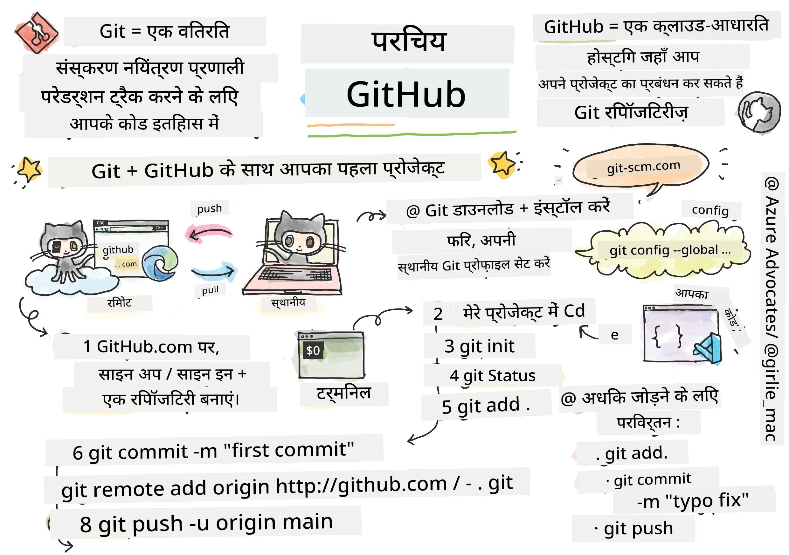
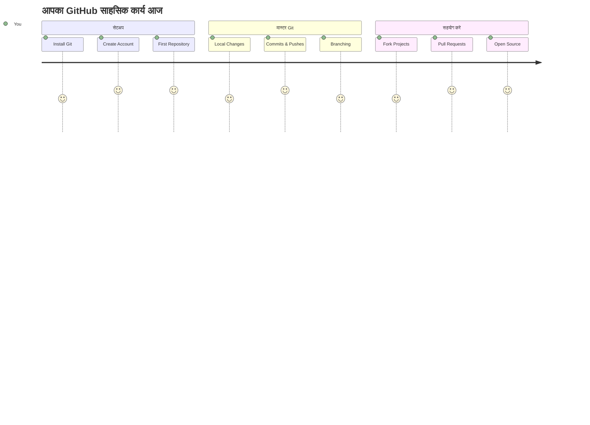
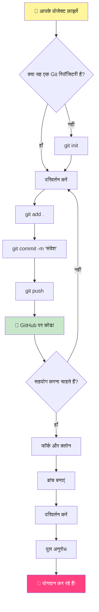
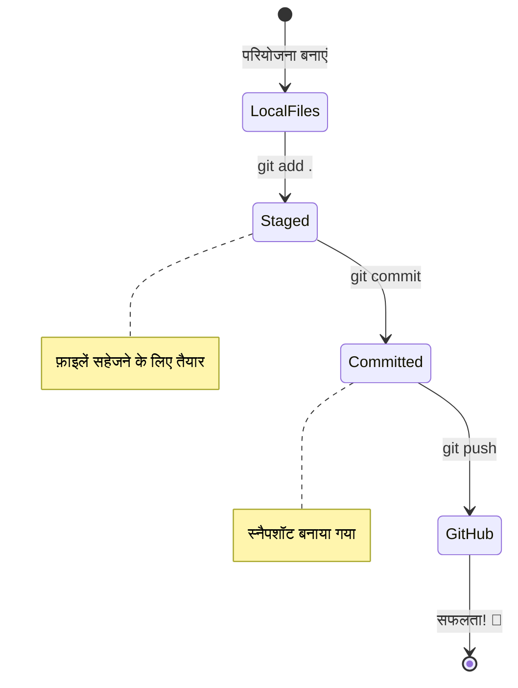
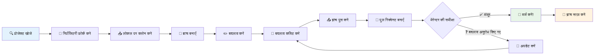
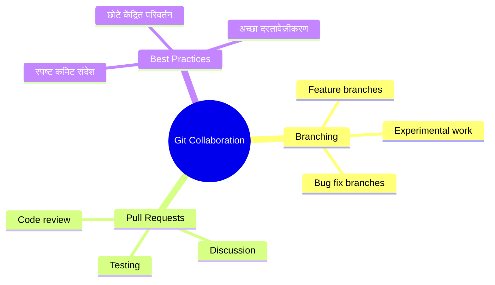
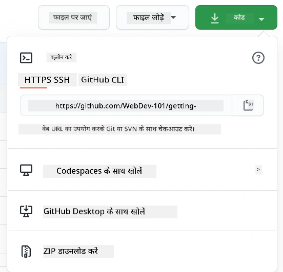
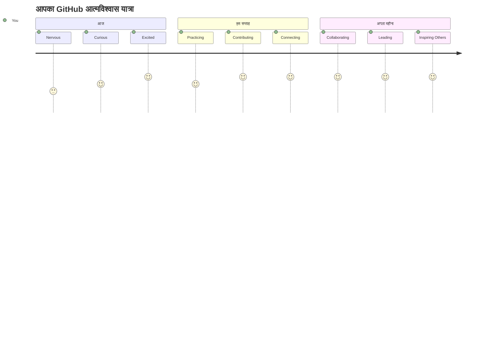

# GitHub परिचय

नमस्ते, भविष्य के डेवलपर! 👋 क्या आप दुनिया भर के लाखों कोडर्स में शामिल होने के लिए तैयार हैं? मैं आपको GitHub से परिचित कराने के लिए वास्तव में उत्साहित हूँ – इसे प्रोग्रामर के लिए सोशल मीडिया प्लेटफ़ॉर्म समझिए, सिवाय इसके कि यहाँ आप अपने लंच की फोटो साझा करने के बजाय, कोड साझा करते हैं और साथ में अद्भुत चीजें बनाते हैं!

यह बात जो मुझे बेहद चौंकाती है: आपके फोन का हर ऐप, हर वेबसाइट जो आप देखते हैं, और अधिकांश उपकरण जिन्हें आप सीखेंगे, उन सभी को डेवलपर्स की टीमों ने GitHub जैसे प्लेटफ़ॉर्म पर सहयोग करके बनाया है। जो म्यूजिक ऐप आपको पसंद है? कोई आपके जैसा व्यक्ति उसमें योगदान दे चुका है। वह गेम जिसे आप छोड़ नहीं पा रहे? हाँ, संभवतः GitHub सहयोग से बनायी गई है। और अब आप यह सीखने वाले हैं कि उस अद्भुत समुदाय का हिस्सा कैसे बने!

मुझे पता है कि यह शुरुआत में थोड़ा भारी लग सकता है – सच कहूँ तो, मैं पहली बार GitHub पेज पर देखकर यही सोचता था "यह सब आखिर क्या मतलब है?" लेकिन बात यह है: हर डेवलपर ठीक उसी जगह से शुरू हुआ जहाँ आप अभी हैं। इस पाठ के अंत तक, आपके पास अपना खुद का GitHub रेपोजिटरी होगा (इसे अपने क्लाउड में व्यक्तिगत प्रोजेक्ट शोकेस समझें), और आप जानेंगे कि अपने काम को कैसे सेव करना है, दूसरों के साथ साझा करना है, और उन प्रोजेक्ट्स में कैसे योगदान देना है जिन्हें लाखों लोग उपयोग करते हैं।

हम इस यात्रा को साथ-साथ कदम दर कदम तय करेंगे। कोई जल्दी नहीं, कोई दबाव नहीं – सिर्फ आप, मैं, और कुछ बहुत ही बढ़िया टूल्स जो आपके नए सबसे अच्छे दोस्त बनने वाले हैं!


> स्केचनोट [Tomomi Imura](https://twitter.com/girlie_mac) द्वारा


## प्री-लेक्चर क्विज़
[प्री-लेक्चर क्विज़](https://ff-quizzes.netlify.app)

## परिचय

असल में मजेदार चीज़ों में जाने से पहले, आइए आपके कंप्यूटर को GitHub के लिए तैयार करें! इसे इस तरह सोचें जैसे कि आप अपने कला के सामान को व्यवस्थित कर रहे हों ताकि आप एक मास्टरपीस बना सकें – सही टूल्स होना सब कुछ बहुत आसान और मज़ेदार बनाता है।

मैं आपको व्यक्तिगत रूप से हर सेटअप स्टेप के माध्यम से मार्गदर्शन करूँगा, और वादा करता हूँ कि यह उतना डरावना नहीं है जितना पहली नजर में लग सकता है। अगर कुछ तुरंत समझ में न आये, तो चिंता मत करें! मुझे याद है कि जब मैंने पहली बार अपना विकास वातावरण सेटअप किया था, तो मुझे लग रहा था जैसे मैं प्राचीन चित्रलिपियाँ पढ़ रहा हूँ। हर डेवलपर ठीक आपकी तरह ही शुरू करता है, यह सोचते हुए कि क्या वे सही कर रहे हैं। ध्यान रखें: अगर आप यहाँ सीख रहे हैं, तो आप पहले से ही सही कर रहे हैं! 🌟

इस पाठ में हम कवर करेंगे:

- अपने मशीन पर किए गए कार्य को ट्रैक करना
- दूसरों के साथ प्रोजेक्ट्स पर काम करना
- ओपन सोर्स सॉफ़्टवेयर में योगदान कैसे दें

### पूर्वापेक्षाएँ

आइए आपके कंप्यूटर को GitHub के लिए तैयार करें! चिंता मत करें – यह सेटअप एक बार करना होता है, उसके बाद आपका पूरा कोडिंग सफर आसान हो जाता है।

सबसे पहले, हमें देखना होगा कि क्या Git पहले से आपके कंप्यूटर पर मौजूद है। Git एक सुपर-स्मार्ट सहायक की तरह है जो आपके कोड में किए गए हर बदलाव को याद रखता है – Ctrl+S बार-बार दबाने से कहीं बेहतर (हम सभी इससे गुजरते हैं!)।

अपने टर्मिनल में यह जादुई कमांड टाइप करके देखें कि Git पहले से इंस्टॉल है या नहीं:
`git --version`

अगर Git नहीं है, तो कोई बात नहीं! बस [download Git](https://git-scm.com/downloads) पर जाइए और इसे डाउनलोड करें। इंस्टॉल कर लेने के बाद, हमें Git को अपने बारे में बताना होगा:

> 💡 **पहला सेटअप:** ये कमांड Git को बताते हैं कि आप कौन हैं। यह जानकारी आपके हर कमिट से जुड़ी होगी, इसलिए ऐसा नाम और ईमेल चुनें जिसे आप सार्वजनिक रूप से साझा करने में सहज हों।

```bash
git config --global user.name "your-name"
git config --global user.email "your-email"
```

Git पहले से कॉन्फ़िगर है या नहीं यह जांचने के लिए टाइप करें:
```bash
git config --list
```

आपको एक GitHub अकाउंट, एक कोड एडिटर (जैसे Visual Studio Code), और अपना टर्मिनल (या: कमांड प्रॉम्प्ट) खोलना होगा।

[jithub.com](https://github.com/) पर जाएं और अगर आपका अकाउंट नहीं है तो बनाएं, या लॉगिन करें और अपनी प्रोफ़ाइल भरें।

💡 **आधुनिक सुझाव:** पासवर्ड की जरूरत के बिना आसान प्रमाणीकरण के लिए [SSH keys](https://docs.github.com/en/authentication/connecting-to-github-with-ssh) सेटअप करें या [GitHub CLI](https://cli.github.com/) उपयोग करें।

✅ GitHub दुनिया का एकमात्र कोड रेपोजिटरी नहीं है; और भी हैं, लेकिन GitHub सबसे प्रसिद्ध है

### तैयारी

आपके पास एक लोकल मशीन (लैपटॉप या पीसी) पर कोड प्रोजेक्ट वाला फोल्डर होना चाहिए, और GitHub पर एक सार्वजनिक रेपोजिटरी, जो दूसरों के प्रोजेक्ट को योगदान देने के उदाहरण के रूप में काम करेगी।

### अपने कोड को सुरक्षित रखना

सुरक्षा के बारे में थोड़ी बात करते हैं – पर घबराइए मत, हम आपको डरावनी बातें सुनाने नहीं आ रहे! सुरक्षा की आदतों को ऐसे सोचें जैसे आप अपनी कार या घर को लॉक करते हैं। ये सरल आदतें हैं जो आपके कड़ी मेहनत को सुरक्षित रखती हैं।

हम आपको शुरु से ही GitHub के आधुनिक, सुरक्षित तरीकों से काम करना सिखाएंगे। इस तरह, आप अच्छे सुरक्षा आदतें विकसित करेंगे जो आपकी पूरी कोडिंग यात्रा में काम आएंगी।

GitHub के साथ काम करते समय सुरक्षा की सर्वोत्तम प्रथाएँ अपनाना जरूरी है:

| सुरक्षा क्षेत्र | सर्वोत्तम प्रथा | क्यों महत्वपूर्ण है |
|---------------|----------------|-------------------|
| **प्रमाणीकरण** | SSH keys या व्यक्तिगत एक्सेस टोकन का उपयोग करें | पासवर्ड कम सुरक्षित होते हैं और धीरे-धीरे हटाए जा रहे हैं |
| **दो-कारक प्रमाणीकरण** | अपने GitHub अकाउंट पर 2FA सक्षम करें | आपके अकाउंट की सुरक्षा को अतिरिक्त स्तर देता है |
| **रेपोजिटरी सुरक्षा** | संवेदनशील जानकारी कभी कमिट न करें | API keys और पासवर्ड को सार्वजनिक रेपोजिटरी में नहीं रखना चाहिए |
| **निर्भरता प्रबंधन** | अपडेट के लिए Dependabot सक्षम करें | आपकी निर्भरताओं को सुरक्षित और नवीनतम रखता है |

> ⚠️ **महत्वपूर्ण सुरक्षा चेतावनी:** API keys, पासवर्ड या कोई अन्य संवेदनशील जानकारी कभी भी किसी रेपोजिटरी में कमिट न करें। संवेदनशील डेटा की सुरक्षा के लिए पर्यावरण चर और `.gitignore` फ़ाइलों का उपयोग करें।

**आधुनिक प्रमाणीकरण सेटअप:**

```bash
# SSH कुंजी उत्पन्न करें (आधुनिक ed25519 एल्गोरिदम)
ssh-keygen -t ed25519 -C "your_email@example.com"

# SSH का उपयोग करने के लिए Git सेट करें
git remote set-url origin git@github.com:username/repository.git
```

> 💡 **प्रो टिप:** SSH keys बार-बार पासवर्ड डालने की जरूरत खत्म कर देती हैं और पारंपरिक प्रमाणीकरण तरीकों से अधिक सुरक्षित होती हैं।

---

## अपने कोड को प्रो की तरह मैनेज करना

ठीक है, यहाँ चीजें वास्तव में मज़ेदार होने वाली हैं! 🎉 हम सीखने जा रहे हैं कि कोड को प्रोफेशनल की तरह ट्रैक और मैनेज कैसे किया जाता है, और सच कहूँ तो यह मेरी सबसे पसंदीदा चीज़ों में से एक है क्योंकि यह एक बड़ा गेम-चेंजर है।

कल्पना कीजिए: आप एक अद्भुत कहानी लिख रहे हैं, और आप हर ड्राफ्ट, हर शानदार संशोधन, और हर "रुको, ये तो ज़बरदस्त है!" पल को ट्रैक करना चाहते हैं। बिलकुल ऐसा ही Git आपके कोड के लिए करता है! यह ऐसा है जैसे आपके पास एक अविश्वसनीय टाइम-ट्रैवलिंग नोटबुक हो जो सब कुछ याद रखती है – हर कीस्ट्रोक, हर बदलाव, हर "उफ़, यह सब कुछ तोड़ दिया" पल जिसे आप तुरंत उलट सकते हैं।

मैं ईमानदारी से कहूँ तो शुरू में यह भारी लग सकता है। जब मैंने शुरू किया था, तो मैंने सोचा था "मैं अपने फाइल्स को सामान्य तरीके से क्यों नहीं सेव कर सकता?" लेकिन मुझ पर भरोसा करें: एक बार Git समझ में आ गया (और आ जाएगा!), तो आपको एक ऐसा अहसास होगा कि "मैं पहले बिना इस के कैसे कोड करता था?" यह वैसा ही है जैसे आपको पता चले कि आप चलने के बजाय उड़ भी सकते हैं!

मान लीजिए आपके पास लोकल मशीन पर एक कोड प्रोजेक्ट का फोल्डर है और आप git का उपयोग करके अपनी प्रगति ट्रैक करना चाहते हैं - यह संस्करण नियंत्रण प्रणाली है। कुछ लोग git का उपयोग करना अपने भविष्य के स्वयं को प्यार का एक पत्र लिखने जैसा मानते हैं। दिन, सप्ताह या महीने बाद अपने कमिट संदेश पढ़कर आप याद कर पाएंगे कि आपने क्यों कोई निर्णय लिया, या "रोलबैक" कर पाएंगे - यानी, जब आप अच्छे "कमिट संदेश" लिखते हैं।


### कार्य: अपना पहला रेपोजिटरी बनाएं!

> 🎯 **आपका मिशन (और मैं आपके लिए बहुत उत्साहित हूँ!)**: हम साथ में आपका पहला GitHub रेपोजिटरी बनाएंगे! जब हम यहाँ खत्म करेंगे, तो आपका अपना एक कोड का कोना होगा इंटरनेट पर, और आपने अपना पहला "commit" कर दिया होगा (डेवलपर भाषा में इसे अपने काम को एक स्मार्ट तरीके से सेव करना कहते हैं)। 
>
> यह वास्तव में एक खास पल है – आप आधिकारिक रूप से वैश्विक डेवलपर्स समुदाय में शामिल होने वाले हैं! मुझे अभी भी याद है जब मैंने पहली बार अपना रेपो बनाया था और सोचा था "वाह, मैं सच में ऐसा कर रहा हूँ!"

आइए इस साहसिक कार्य में साथ-साथ कदम दर कदम चलें। हर हिस्से के साथ अपना समय लें – जल्दीबाजी का कोई इनाम नहीं है, और मैं वादा करता हूँ कि हर एक कदम समझ में आएगा। याद रखें, हर कोडिंग सुपरस्टार जिन्हें आप पसंद करते हैं, वे भी एक समय आपके जैसे ही थे, जो अपना पहला रेपोजिटरी बनाने वाले थे। कितना शानदार है यह बात!

> वीडियो देखें
> 
> [](https://www.youtube.com/watch?v=9R31OUPpxU4)

**आइए इसे साथ मिलकर करें:**

1. **GitHub पर अपना रेपोजिटरी बनाएँ**। GitHub.com पर जाएं और शीर्ष दाएं कोने में चमकता हुआ हरा **New** बटन (या **+** चिह्न) देखें। उस पर क्लिक करें और **New repository** चुनें।

   ऐसा करें:
   1. अपने रेपोजिटरी को एक नाम दें – ऐसा नाम चुनें जो आपके लिए मायने रखता हो!
   1. चाहें तो एक विवरण जोड़ें (यह दूसरों को आपके प्रोजेक्ट के बारे में समझने में मदद करता है)
   1. तय करें कि आप इसे सार्वजनिक (सभी देख सकते हैं) या निजी (सिर्फ आपके लिए) रखना चाहते हैं
   1. मैं सुझाव दूंगा कि README फ़ाइल जोड़ें – यह आपके प्रोजेक्ट का मुखपृष्ठ जैसा होता है
   1. **Create repository** पर क्लिक करें और जश्न मनाएं – आपने अपना पहला रेपो बनाया! 🎉

2. **अपने प्रोजेक्ट फोल्डर पर जाएं**। अब टर्मिनल खोलें (डरें नहीं, उतना डरावना नहीं है जितना दिखता है!). हमें अपने कंप्यूटर को बताना है कि आपके प्रोजेक्ट फोल्डर कहाँ हैं। यह कमांड टाइप करें:

   ```bash
   cd [name of your folder]
   ```

   **हम यहाँ क्या कर रहे हैं:**
   - हम कंप्यूटर को कह रहे हैं "मुझे मेरे प्रोजेक्ट फ़ोल्डर पर ले चलो"
   - यह आपके डेस्कटॉप पर किसी विशेष फ़ोल्डर को खोलने जैसा है, लेकिन हम इसे टेक्स्ट कमांड के जरिए कर रहे हैं
   - `[name of your folder]` को अपने प्रोजेक्ट फोल्डर के असली नाम से बदलें

3. **अपने फोल्डर को Git रेपोजिटरी बनाएं**। यहीं जादू होने वाला है! टाइप करें:

   ```bash
   git init
   ```

   **यहाँ अभी क्या हुआ (काफी कूल है!):**
   - Git ने आपके प्रोजेक्ट में एक छुपा हुआ `.git` फ़ोल्डर बनाया – आप इसे नहीं देखेंगे, लेकिन यह वहाँ है!
   - आपका सामान्य फ़ोल्डर अब एक "repository" है जो आपके हर बदलाव को ट्रैक कर सकता है
   - इसे ऐसे समझें जैसे आपके फोल्डर को सुपरपावर मिल गई हो जो हर चीज़ याद रखती है

4. **देखें क्या चल रहा है**। आइए देखें Git आपके प्रोजेक्ट के बारे में अभी क्या सोचता है:

   ```bash
   git status
   ```

   **Git आपको क्या बता रहा है समझना:**

   आप कुछ ऐसा देख सकते हैं:

   ```output
   Changes not staged for commit:
   (use "git add <file>..." to update what will be committed)
   (use "git restore <file>..." to discard changes in working directory)

        modified:   file.txt
        modified:   file2.txt
   ```

   **पैनिक मत करें! इसका मतलब है:**
   - लाल रंग में दिखने वाली फाइलें वे हैं जिनमें बदलाव हैं लेकिन वे अभी सेव के लिए तैयार नहीं हैं
   - हरे रंग की फाइलें (जब आप उन्हें देखते हैं) सेव के लिए तैयार होती हैं
   - Git मददगार हो रहा है और आपको यह बता रहा है कि आप आगे क्या कर सकते हैं

   > 💡 **प्रो टिप:** `git status` कमांड आपका सबसे अच्छा दोस्त है! जब भी आप कंफ्यूज हों, इसका इस्तेमाल करें। यह ऐसे है जैसे आप Git से पूछ रहे हों "अभी की स्थिति क्या है?"

5. **अपनी फाइलें सेव के लिए तैयार करें** (इसे "staging" कहते हैं):

   ```bash
   git add .
   ```

   **हमने अभी क्या किया:**
   - हमने Git को बताया "अगली सेव में मैं अपनी सारी फाइलें शामिल करना चाहता हूँ"
   - `.` का मतलब है "इस फ़ोल्डर में सब कुछ"
   - अब आपकी फाइलें "staged" हैं और अगले कदम के लिए तैयार हैं

   **थोड़ा चयनात्मक होना चाहते हैं?** आप केवल कुछ खास फाइलें भी जोड़ सकते हैं:

   ```bash
   git add [file or folder name]
   ```

   **ऐसा क्यों करना चाहेंगे?**
   - कभी-कभी आप संबंधित बदलावों को एक साथ सेव करना चाहते हैं
   - यह आपके काम को तार्किक हिस्सों में व्यवस्थित करने में मदद करता है
   - यह समझना आसान बनाता है कि कब क्या बदला

   **मन बदल गया?** कोई बात नहीं! आप इस तरह फाइलें अनस्टेज कर सकते हैं:

   ```bash
   # सब कुछ अनस्टेज करें
   git reset
   
   # सिर्फ एक फ़ाइल अनस्टेज करें
   git reset [file name]
   ```

   चिंता मत करें – ये आपके काम को डिलीट नहीं करता, बस फाइलों को "सेव के लिए तैयार" ढेर से बाहर निकालता है।

6. **अपने काम को स्थायी रूप से सेव करें** (अपना पहला कमिट बनाते हुए!):

   ```bash
   git commit -m "first commit"
   ```

   **🎉 बधाई हो! आपने अपना पहला कमिट बना दिया है!**
   
   **यहाँ अभी क्या हुआ:**
   - Git ने इस ठीक समय पर आपकी सभी staged फाइलों की "स्नैपशॉट" ली
   - आपका कमिट संदेश "first commit" बताता है कि यह सेव पॉइंट किस बारे में है
   - Git ने इस स्नैपशॉट को एक यूनिक आईडी दी ताकि आप इसे बाद में हमेशा ढूंढ सकें
   - आपने आधिकारिक तौर पर अपने प्रोजेक्ट का इतिहास ट्रैक करना शुरू कर दिया है!

   > 💡 **आगे के कमिट संदेश:** अपने अगले कमिट्स के लिए ज्यादा वर्णनात्मक हों! "updated stuff" की बजाय जैसे "Add contact form to homepage" या "Fix navigation menu bug" लिखें। आपका भविष्य का आप इसका धन्यवाद करेगा!

7. **अपने लोकल प्रोजेक्ट को GitHub से जोड़ें**। फिलहाल, आपका प्रोजेक्ट केवल आपके कंप्यूटर पर है। आइए इसे आपके GitHub रेपोजिटरी से कनेक्ट करें ताकि आप इसे दुनिया के साथ साझा कर सकें!

   सबसे पहले, अपनी GitHub रेपोजिटरी पेज पर जाएं और URL कॉपी करें। फिर वापस यहां आकर टाइप करें:

   ```bash
   git remote add origin https://github.com/username/repository_name.git
   ```
   
   (उस URL को अपनी वास्तविक रेपोजिटरी URL से बदलें!)

   **हमने अभी क्या किया:**
   - हमने आपके स्थानीय प्रोजेक्ट और आपके GitHub रिपॉजिटरी के बीच एक कनेक्शन बनाया
   - "Origin" आपके GitHub रिपॉजिटरी का सिर्फ एक उपनाम है – यह आपके फोन में किसी संपर्क को जोड़ने जैसा है
   - अब आपका स्थानीय Git जानता है कि जब आप साझा करने के लिए तैयार हों तो आपका कोड कहां भेजना है

   💡 **आसान तरीका**: यदि आपके पास GitHub CLI इंस्टॉल है, तो आप यह एक ही कमांड में कर सकते हैं:
   ```bash
   gh repo create my-repo --public --push --source=.
   ```

8. **अपना कोड GitHub पर भेजें** (वह बड़ा पल!):

   ```bash
   git push -u origin main
   ```

   **🚀 यही है! आप अपना कोड GitHub पर अपलोड कर रहे हैं!**
   
   **क्या हो रहा है:**
   - आपकी कमिट्स आपके कंप्यूटर से GitHub तक यात्रा कर रही हैं
   - `-u` फ्लैग एक स्थायी कनेक्शन सेट करता है ताकि भविष्य में पुश करना आसान हो जाए
   - "main" आपकी प्राथमिक शाखा का नाम है (जैसे मुख्य फ़ोल्डर)
   - इसके बाद, आप भविष्य के अपलोड के लिए बस `git push` टाइप कर सकते हैं!

   💡 **त्वरित नोट**: यदि आपकी शाखा का नाम कुछ और है (जैसे "master"), तो उस नाम का उपयोग करें। आप `git branch --show-current` से जांच सकते हैं।

9. **आपकी नई दैनिक कोडिंग लय** (यहाँ यह नशे की तरह बन जाता है!):

   अब से, जब भी आप अपने प्रोजेक्ट में बदलाव करते हैं, आपके पास यह सरल तीन-चरणीय प्रक्रिया है:

   ```bash
   git add .
   git commit -m "describe what you changed"
   git push
   ```

   **यह आपकी कोडिंग की धड़कन बन जाती है:**
   - अपने कोड में कुछ शानदार बदलाव करें ✨
   - उन्हें `git add` के साथ स्टेज करें ("अरे Git, इन बदलावों पर ध्यान दो!")
   - उन्हें `git commit` और एक वर्णनात्मक संदेश के साथ सेव करें (भविष्य के आप आपका धन्यवाद करेंगे!)
   - उन्हें `git push` 🚀 के साथ दुनिया के साथ साझा करें
   - बार-बार करें — सचमुच, यह सांस लेने जितना स्वाभाविक हो जाता है!

   मुझे यह वर्कफ़्लो पसंद है क्योंकि यह ऐसे है जैसे वीडियो गेम में कई सेव पॉइंट्स हों। कोई बदलाव किया जो आपको पसंद आया? उसे कमिट करें! कुछ जोखिमपूर्ण आजमाना चाहते हैं? कोई बात नहीं – यदि चीजें उलझ जाएं तो आप हमेशा अपनी आखिरी कमिट पर वापस जा सकते हैं!

   > 💡 **टिप**: आप एक `.gitignore` फ़ाइल अपनाना चाहते होंगे ताकि वे फाइलें जो आप ट्रैक नहीं करना चाहते GitHub पर न दिखें – जैसे वह नोट्स फ़ाइल जो आप उसी फोल्डर में रखते हैं लेकिन सार्वजनिक रिपॉजिटरी में नहीं होनी चाहिए। आप `.gitignore` फाइलों के टेम्पलेट्स [.gitignore templates](https://github.com/github/gitignore) पर पा सकते हैं या [gitignore.io](https://www.toptal.com/developers/gitignore) से खुद बना सकते हैं।

### 🧠 **पहली रिपॉजिटरी चेक-इन: कैसा लगा?**

**एक पल मनाएँ और सोचें:**
- पहली बार GitHub पर अपना कोड देखना कैसा लगा?
- कौन सा कदम सबसे भ्रमित करने वाला था, और कौन सा अप्रत्याशित रूप से आसान लगा?
- क्या आप `git add`, `git commit`, और `git push` के बीच का अंतर अपने शब्दों में समझा सकते हैं?


> **याद रखें**: अनुभवी डेवलपर्स भी कभी-कभी सही कमांड भूल जाते हैं। इस वर्कफ़्लो को मसल मैमोरी बनाना अभ्यास मांगता है – आप बेहतरीन कर रहे हैं!

#### आधुनिक Git वर्कफ़्लोज़

इन आधुनिक प्रथाओं को अपनाने पर विचार करें:

- **Conventional Commits**: एक मानकीकृत कमिट संदेश फॉर्मेट जैसे `feat:`, `fix:`, `docs:` आदि का उपयोग करें। अधिक जानें [conventionalcommits.org](https://www.conventionalcommits.org/)
- **Atomic commits**: प्रत्येक कमिट को एकल तार्किक बदलाव का प्रतिनिधित्व करने दें
- **Frequent commits**: बड़े, कम बार कमिट करने के बजाय अक्सर वर्णनात्मक संदेशों के साथ कमिट करें

#### कमिट संदेश

एक बढ़िया Git कमिट विषय पंक्ति इस वाक्य को पूरा करती है:
यदि लागू किया जाए, तो यह कमिट <यहाँ अपना विषय वाक्य डालें>

विषय में क्रिया रूप, वर्तमान काल का प्रयोग करें: "change" न कि "changed" या "changes"। 
विषय की तरह, बॉडी (वैकल्पिक) में भी क्रिया रूप, वर्तमान काल का उपयोग करें। बॉडी में बदलाव के कारण और पिछले व्यवहार के साथ इसके विपरीत होने की व्याख्या होनी चाहिए। आप `क्यों` समझा रहे हैं, न कि `कैसे`।

✅ GitHub पर कुछ अच्छे कमिट संदेश खोजने के लिए कुछ मिनट दें। क्या आप कोई बहुत बढ़िया चेतावनी संदेश पा सकते हैं? कोई बहुत संक्षिप्त संदेश? आपको क्या लगता है कि कमिट संदेश में सबसे महत्वपूर्ण और उपयोगी जानकारी क्या है?

## दूसरों के साथ काम करना (मजेदार भाग!)

अपना ध्यान रखें क्योंकि यहीं पर GitHub असली जादू बन जाता है! 🪄 आपने अपना कोड प्रबंधित करना सीख लिया है, लेकिन अब हम मेरे पसंदीदा हिस्से में उतर रहे हैं – दुनिया भर के अद्भुत लोगों के साथ सहयोग करना।

कल्पना करें: आप कल सुबह उठते हैं और देखते हैं कि टोक्यो में किसी ने आपकी नींद के दौरान आपके कोड को सुधार दिया। फिर बर्लिन में किसी ने उस बग को ठीक किया जिससे आप फंसे थे। दोपहर तक, साओ पाउलो के एक डेवलपर ने वह फीचर जोड़ दिया जिसे आपने कभी सोचा भी नहीं था। यह विज्ञान-कथा नहीं है – यह GitHub ब्रह्मांड में मंगलवार का दिन है!

जो मुझे वास्तव में उत्साहित करता है, वह यह है कि वे सहयोग कौशल जिन्हें आप सीखने वाले हैं? ये बिल्कुल वही वर्कफ़्लोज़ हैं जो Google, Microsoft, और आपके पसंदीदा स्टार्टअप्स की टीमें हर रोज इस्तेमाल करती हैं। आप सिर्फ एक कूल टूल नहीं सीख रहे – आप उस गुप्त भाषा को सीख रहे हैं जो पूरी सॉफ्टवेयर दुनिया को साथ मिलकर काम करने में मदद करती है।

सच में, जब आप पहली बार अपना पहला पुल रिक्वेस्ट मर्ज होते देखेंगे, तो आप समझ जाएंगे कि डेवलपर्स मुक्त स्रोत के लिए क्यों इतना उत्साहित होते हैं। यह दुनिया की सबसे बड़ी, सबसे क्रिएटिव टीम परियोजना का हिस्सा होने जैसा है!

> वीडियो देखें
>
> [](https://www.youtube.com/watch?v=bFCM-PC3cu8)

GitHub पर चीज़ें डालने का मुख्य कारण यह था कि यह अन्य डेवलपर्स के साथ सहयोग करना संभव बनाए।


अपने रिपॉजिटरी में `Insights > Community` पर जाएं ताकि देखें आपका प्रोजेक्ट संदर्भित समुदाय मानकों से कैसे मेल खाता है।

क्या आप अपनी रिपॉजिटरी को पेशेवर और स्वागतयोग्य बनाना चाहते हैं? अपनी रिपॉजिटरी में जाएं और `Insights > Community` पर क्लिक करें। यह शानदार फीचर आपको दिखाएगा कि आपका प्रोजेक्ट GitHub समुदाय द्वारा "अच्छी रिपॉजिटरी प्रथाओं" के मुकाबले कैसा है।

> 🎯 **अपने प्रोजेक्ट को चमकदार बनाएं**: एक अच्छी तरह से व्यवस्थित रिपॉजिटरी जिसमें अच्छी डाक्यूमेंटेशन हो, एक साफ़-सुथरी, स्वागत योग्य दुकान की तरह होती है। इससे लोग जानते हैं कि आप अपने काम को लेकर गंभीर हैं और दूसरों को योगदान करने की प्रेरणा मिलती है!

**यहाँ एक शानदार रिपॉजिटरी बनाने के तत्व हैं:**

| क्या जोड़ें | क्यों यह महत्वपूर्ण है | यह आपके लिए क्या करता है |
|-------------|---------------------|-------------------------|
| **Description** | पहला प्रभाव महत्वपूर्ण है! | लोग तुरंत जानते हैं आपका प्रोजेक्ट क्या करता है |
| **README** | आपके प्रोजेक्ट का मुखपृष्ठ | नए आगंतुकों के लिए एक मैत्रीपूर्ण मार्गदर्शक की तरह |
| **Contributing Guidelines** | दिखाता है कि आप मदद का स्वागत करते हैं | लोग जानते हैं कि वे कैसे आपकी मदद कर सकते हैं |
| **Code of Conduct** | एक मैत्रीपूर्ण स्थान बनाता है | सभी प्रतिभागियों को स्वागत महसूस होता है |
| **License** | कानूनी स्पष्टता | अन्य लोग जानते हैं वे आपके कोड का कैसे उपयोग कर सकते हैं |
| **Security Policy** | दिखाता है कि आप जिम्मेदार हैं | पेशेवर प्रथाओं का प्रदर्शन करता है |

> 💡 **प्रो टिप**: GitHub इन सभी फाइलों के लिए टेम्पलेट्स प्रदान करता है। नई रिपॉजिटरी बनाते समय, इन फाइलों को स्वचालित रूप से बनाने के लिए बॉक्स चेक करें।

**आधुनिक GitHub फीचर्स जिन्हें एक्सप्लोर करें:**

🤖 **स्वचालन और CI/CD:**
- **GitHub Actions** स्वचालित परीक्षण और तैनाती के लिए
- **Dependabot** स्वचालित निर्भरता अपडेट के लिए

💬 **समुदाय और परियोजना प्रबंधन:**
- **GitHub Discussions** मुद्दों से परे समुदाय बातचीत के लिए
- **GitHub Projects** कानबन-शैली परियोजना प्रबंधन के लिए
- **Branch protection rules** कोड गुणवत्ता मानकों को लागू करने के लिए


ये सभी संसाधन नए टीम सदस्यों के ऑन-बोर्डिंग में मदद करते हैं। और आमतौर पर नए योगदानकर्ता यहां देखते हैं कि आपकी रिपॉजिटरी उनके लिए सही जगह है या नहीं, इससे पहले कि वे आपका कोड देखें।

✅ README फ़ाइलें, जिन्हें तैयार करने में समय लगता है, अक्सर व्यस्त मेंटेनर्स द्वारा नज़रअंदाज़ कर दी जाती हैं। क्या आप कोई खासतौर पर विवरणपूर्ण README पा सकते हैं? नोट: कुछ [उपकरण अच्छे README बनाने में मदद करते हैं](https://www.makeareadme.com/) जिन्हें आप आज़मा सकते हैं।

### कार्य: कुछ कोड मर्ज करें

Contributing docs लोगों को प्रोजेक्ट में योगदान करने में मदद करती हैं। यह बताती है कि आप किस प्रकार के योगदान की तलाश में हैं और प्रक्रिया कैसे काम करती है। योगदानकर्ता GitHub पर आपकी रिपॉजिटरी में योगदान करने के लिए निम्नलिखित चरणों से गुजरने होंगे:


1. **अपने रिपॉजिटरी को Fork करना** आप चाहते होंगे कि लोग आपका प्रोजेक्ट _fork_ करें। Forking का मतलब है आपके रिपॉजिटरी की एक प्रतिलिपि उनके GitHub प्रोफाइल पर बनाना।
1. **Clone करें**। वहां से वे प्रोजेक्ट को अपनी स्थानीय मशीन पर क्लोन करेंगे।
1. **एक शाखा बनाएं**। आप चाहेंगे कि वे अपने काम के लिए एक _branch_ बनाएं।
1. **अपने बदलावों को एक क्षेत्र पर केंद्रित करें**। योगदानकर्ताओं से कहें कि वे अपनी योगदानों को एक समय में एक विषय पर केंद्रित करें - ऐसा करने से आपकी संभावना बढ़ती है कि आप उनके काम को _merge_ कर सकेंगे। कल्पना करें कि उन्होंने एक बग फिक्स लिखा, एक नया फीचर जोड़ा, और कई टेस्ट अपडेट किए - अगर आप 3 में से केवल 2 या 1 को ही लागू कर सकें तो क्या होगा?

✅ ऐसी स्थिति की कल्पना करें जहां शाखाएं अच्छी कोड लिखने और प्रसारित करने में विशेष रूप से महत्वपूर्ण हों। आप किन उपयोग मामलों के बारे में सोच सकते हैं?

> ध्यान दें, आप दुनिया में वह बदलाव बनें जो आप देखना चाहते हैं, और अपने काम के लिए भी शाखाएं बनाएं। कोई भी कमिट आप करते हैं, वह उस शाखा में होगा जिस पर आप वर्तमान में "चेक आउट" हैं। यह देखने के लिए `git status` का उपयोग करें कि वह कौन सी शाखा है।

आइए योगदानकर्ता वर्कफ़्लो से गुजरें। मान लीजिए योगदानकर्ता ने पहले ही अपने रिपॉजिटरी को _fork_ और _clone_ कर लिया है ताकि उनके पास स्थानीय मशीन पर काम करने के लिए Git रिपॉजिटरी हो:

1. **एक शाखा बनाएं**। उस शाखा को बनाने के लिए `git branch` कमांड का उपयोग करें जिसमें वे योगदान करना चाहते हैं:

   ```bash
   git branch [branch-name]
   ```

   > 💡 **आधुनिक तरीका**: आप एक ही कमांड में नई शाखा बना सकते हैं और स्विच भी कर सकते हैं:
   ```bash
   git switch -c [branch-name]
   ```

1. **वर्किंग शाखा पर स्विच करें**। निर्दिष्ट शाखा पर स्विच करें और कार्य निर्देशिका अपडेट करें `git switch` के साथ:

   ```bash
   git switch [branch-name]
   ```

   > 💡 **आधुनिक नोट**: `git switch` शाखाएं बदलने के लिए `git checkout` का आधुनिक विकल्प है। यह शुरुआती लोगों के लिए स्पष्ट और सुरक्षित है।

1. **काम करें**। इस बिंदु पर आप अपने बदलाव जोड़ना चाहते हैं। Git को इसके बारे में बताना न भूलें निम्न कमांड्स के साथ:

   ```bash
   git add .
   git commit -m "my changes"
   ```

   > ⚠️ **कमिट संदेश की गुणवत्ता**: सुनिश्चित करें कि आप अपने कमिट को एक अच्छा नाम दें, अपने और उस रिपॉजिटरी के मेंटेनर के लिए जिसकी आप मदद कर रहे हैं। जो बदला है उसमें विशिष्ट रहें!

1. **अपने काम को `main` शाखा के साथ मिलाएं**। कुछ समय बाद आपका काम पूरा हो जाता है और आप इसे `main` शाखा के साथ मिलाना चाहते हैं। इस बीच `main` शाखा बदल चुकी हो सकती है इसलिए पहले इसे नवीनतम बनाएँ इस तरह:

   ```bash
   git switch main
   git pull
   ```

   इस बिंदु पर आप यह सुनिश्चित करना चाहते हैं कि आपकी कार्य शाखा में कोई भी _conflict_, ऐसी स्थिति जहां Git आसानी से बदलावों को _combine_ नहीं कर सकता, हो। इसलिए निम्नलिखित कमांड्स चलाएं:

   ```bash
   git switch [branch_name]
   git merge main
   ```

   `git merge main` कमांड आपके शाखा में `main` से सभी बदलाव लाएगा। उम्मीद है आप बस जारी रख सकेंगे। यदि नहीं, तो VS Code आपको बताएगा कि Git कहाँ _confused_ है और आप प्रभावित फ़ाइलों को संशोधित कर सही सामग्री चुन सकते हैं।

   💡 **आधुनिक विकल्प**: एक साफ़ इतिहास के लिए `git rebase` का उपयोग करने पर विचार करें:
   ```bash
   git rebase main
   ```
   यह आपकी कमिट्स को नवीनतम main शाखा के शीर्ष पर पुनः चलाता है, एक रैखिक इतिहास बनाता है।

1. **अपना काम GitHub पर भेजें**। अपना काम GitHub पर भेजने का मतलब है अपनी शाखा को अपने रिपॉजिटरी पर पुश करना और फिर एक PR, पुल रिक्वेस्ट खोलना।

   ```bash
   git push --set-upstream origin [branch-name]
   ```

   उपरोक्त कमांड आपकी फोर्क किए गए रिपॉजिटरी पर शाखा बनाता है।

### 🤝 **सहयोग कौशल जांच: दूसरों के साथ काम करने के लिए तैयार?**

**आइए देखें कि सहयोग के प्रति आपकी भावना क्या है:**
- क्या अब फोर्किंग और पुल रिक्वेस्ट का विचार आपके लिए स्पष्ट है?
- शाखाओं के साथ काम करने में कौन-सी एक चीज़ है जिसे आप और अभ्यास करना चाहते हैं?
- किसी और के प्रोजेक्ट में योगदान देने को लेकर आप कितना सहज महसूस करते हैं?


> **आत्मविश्वास बढ़ाएँ**: हर एक डेवलपर जिसे आप प्रशंसा करते हैं, पहली पुल रिक्वेस्ट को लेकर कभी नर्वस था। GitHub समुदाय नवागंतुकों के लिए बेहद स्वागत योग्य है!

1. **एक PR खोलें**। अगला, आप एक PR खोलना चाहते हैं। आप ऐसा GitHub पर फोर्क किए गए रिपॉजिटरी पर जाकर करते हैं। GitHub पर आपको एक संकेत मिलेगा कि क्या आप नया PR बनाना चाहते हैं, आप उस पर क्लिक करते हैं और आपको एक इंटरफ़ेस मिलता है जहाँ आप कमिट संदेश का शीर्षक बदल सकते हैं, इसे अधिक उपयुक्त विवरण दे सकते हैं। अब रिपॉजिटरी के मेंटेनर जिन्हें आपने फोर्क किया है वह इस PR को देखेंगे और _उम्मीद है_ वे इसे सराहेंगे और आपकी PR को _merge_ करेंगे। आप अब एक योगदानकर्ता हैं, याय :)

   💡 **आधुनिक टिप**: आप GitHub CLI का उपयोग करके भी PR बना सकते हैं:
   ```bash
   gh pr create --title "Your PR title" --body "Description of changes"
   ```

   🔧 **PR के लिए सर्वश्रेष्ठ प्रथाएं**:
   - "Fixes #123" जैसे कीवर्ड्स का उपयोग करके संबंधित इश्यूज लिंक करें
   - UI बदलावों के लिए स्क्रीनशॉट जोड़ें
   - विशिष्ट समीक्षकों को अनुरोध करें
   - प्रगति में कार्य के लिए ड्राफ्ट PR का उपयोग करें
   - समीक्षा के लिए अनुरोध करने से पहले सभी CI जांचें सफल करें
1. **साफ़-सफ़ाई करें**। एक PR को सफलतापूर्वक मर्ज करने के बाद _साफ़-सफ़ाई_ करना एक अच्छा अभ्यास माना जाता है। आप अपने लोकल ब्रांच और उस ब्रांच को जो आपने GitHub पर पुश किया है, दोनों की साफ़-सफ़ाई करना चाहेंगे। पहले नीचे दिए गए कमांड के साथ इसे लोकल में हटाएं:

   ```bash
   git branch -d [branch-name]
   ```

   सुनिश्चित करें कि आप अगले GitHub पेज पर जाकर उस रिमोट ब्रांच को हटा दें जिसे आपने अभी पुश किया है।

`पुल रिक्वेस्ट` एक अजीब शब्द लगता है क्योंकि असल में आप अपने बदलावों को परियोजना में पुश करना चाहते हैं। लेकिन मैनटेनर (परियोजना मालिक) या मुख्य टीम को आपके बदलावों पर विचार करना होता है इससे पहले कि वे इसे परियोजना की "मुख्य" ब्रांच के साथ मर्ज करें, इसलिए आप वास्तव में मैनटेनर से परिवर्तन निर्णय का अनुरोध कर रहे हैं।

एक पुल रिक्वेस्ट वह जगह है जहां किसी ब्रांच पर किए गए अंतर की तुलना और चर्चा होती है समीक्षा, टिप्पणियाँ, इंटीग्रेटेड टेस्ट और अन्य चीज़ों के साथ। एक अच्छी पुल रिक्वेस्ट लगभग उसी नियम का पालन करती है जो एक कमिट संदेश करता है। आप इश्यू ट्रैकर में किसी इश्यू का संदर्भ जोड़ सकते हैं, जब आपका काम उदाहरण के लिए किसी इश्यू को ठीक करता है। यह `#` के बाद आपके इश्यू का नंबर डालकर किया जाता है। उदाहरण के लिए `#97`।

🤞उम्मीद है कि सभी चेक पास हों और परियोजना के मालिक आपके बदलावों को परियोजना में मर्ज कर दें🤞

अपने वर्तमान लोकल वर्किंग ब्रांच को GitHub पर संबंधित रिमोट ब्रांच से सभी नए कमिट्स के साथ अपडेट करें:

`git pull`

## ओपन सोर्स में योगदान करना (आपका मौका प्रभाव डालने का!)

क्या आप कुछ ऐसा करने के लिए तैयार हैं जो आपके दिमाग को पूरी तरह हिला देगा? 🤯 आइए बात करते हैं ओपन सोर्स परियोजनाओं में योगदान करने की – और इस बारे में सोचकर ही मुझे रोमांच हो रहा है कि मैं यह आपके साथ साझा कर रहा हूँ!

यह आपका मौका है कुछ सचमुच असाधारण का हिस्सा बनने का। कल्पना करें उन टूल्स को बेहतर बनाने की जिन्हें लाखों डेवलपर्स हर दिन उपयोग करते हैं, या एक ऐसी ऐप में बग ठीक करने की जिसे आपके दोस्त पसंद करते हैं। यह सिर्फ एक सपना नहीं है – यही तो ओपन सोर्स योगदान का असली मतलब है!

जो चीज मुझे हर बार रोमांचित करती है जब मैं इसके बारे में सोचता हूँ: हर वो टूल जिसे आपने सीखना शुरू किया – आपका कोड एडिटर, जिन फ्रेमवर्क्स की हम खोज करेंगे, यहां तक कि आपका ब्राउज़र जिसमें आप यह पढ़ रहे हैं – यह सब किसी ऐसे व्यक्ति के साथ शुरू हुआ जिसने आपकी तरह अपना पहला योगदान दिया। वह प्रतिभाशाली डेवलपर जिसने आपका पसंदीदा VS Code एक्सटेंशन बनाया? वे भी एक बार शुरुआती थे जो "create pull request" पर कंपकंपाते हाथों से क्लिक कर रहे थे, बिल्कुल जैसे आप करने वाले हैं।

और ये सबसे खूबसूरत हिस्सा है: ओपन सोर्स समुदाय इंटरनेट की सबसे बड़ी गले लगाने वाली जमात की तरह है। अधिकांश प्रोजेक्ट्स सक्रिय रूप से नए लोगों की तलाश करते हैं और उनके पास "good first issue" टैग के साथ विशेष चिह्नित इश्यू होते हैं जो आपके जैसे लोगों के लिए होते हैं! मैनटेनर्स सचमुच उत्साहित हो जाते हैं जब वे नए योगदानकर्ताओं को देखते हैं क्योंकि उन्हें अपनी पहली शुरुआत याद आती है।

```mermaid
flowchart TD
    A[🔍 GitHub एक्सप्लोर करें] --> B[🏷️ "good first issue" खोजें]
    B --> C[📖 योगदान दिशानिर्देश पढ़ें]
    C --> D[🍴 रिपॉजिटरी फोर्क करें]
    D --> E[💻 स्थानीय परिवेश सेट अप करें]
    E --> F[🌿 फीचर ब्रांच बनाएं]
    F --> G[✨ अपना योगदान करें]
    G --> H[🧪 अपने बदलावों का परीक्षण करें]
    H --> I[📝 स्पष्ट कमिट लिखें]
    I --> J[📤 पुश करें और PR बनाएं]
    J --> K[💬 प्रतिक्रिया के साथ जुड़ें]
    K --> L[🎉 मर्ज हो गया! आप एक योगदानकर्ता हैं!]
    L --> M[🌟 अगला इश्यू खोजें]
    
    style A fill:#e1f5fe
    style L fill:#c8e6c9
    style M fill:#fff59d
```
यहाँ आप सिर्फ कोड सीख ही नहीं रहे - आप उन बिल्डर्स के वैश्विक परिवार में शामिल होने की तैयारी कर रहे हैं जो रोज़ सुबह उठकर सोचते हैं "डिजिटल दुनिया को थोड़ा बेहतर कैसे बनाया जाए?" क्लब में आपका स्वागत है! 🌟

सबसे पहले, आइए GitHub पर अपनी रुचि के अनुसार कोई रिपॉजिटरी (या **repo**) खोजें जिसमें आप बदलाव का योगदान देना चाहते हैं। आप इसके कंटेंट को अपनी मशीन पर कॉपी करना चाहेंगे।

✅ 'beginner-friendly' रिपॉजिटरी खोजने का एक अच्छा तरीका है [‘good-first-issue’ टैग से खोजें](https://github.blog/2020-01-22-browse-good-first-issues-to-start-contributing-to-open-source/)।



कोड कॉपी करने के कई तरीके हैं। एक तरीका है रिपॉजिटरी के कंटेंट को "क्लोन" करना, HTTPS, SSH, या GitHub CLI (कमांड लाइन इंटरफ़ेस) का उपयोग करके।

अपना टर्मिनल खोलें और इस तरह रिपॉजिटरी क्लोन करें:
```bash
# HTTPS का उपयोग करना
git clone https://github.com/ProjectURL

# SSH का उपयोग करना (SSH कुंजी सेटअप आवश्यक)
git clone git@github.com:username/repository.git

# GitHub CLI का उपयोग करना
gh repo clone username/repository
```

परियोजना पर काम करने के लिए सही फ़ोल्डर में जाएं:
`cd ProjectURL`

आप पूरे प्रोजेक्ट को भी खोल सकते हैं:
- **[GitHub Codespaces](https://github.com/features/codespaces)** - ब्राउज़र में VS Code के साथ GitHub का क्लाउड विकास वातावरण
- **[GitHub Desktop](https://desktop.github.com/)** - Git संचालन के लिए GUI ऐप्लिकेशन  
- **[GitHub.dev](https://github.dev)** - किसी भी GitHub रिपॉजिटरी में `.` की दबाकर ब्राउज़र में VS Code खोलें
- VS Code साथ GitHub Pull Requests एक्सटेंशन

अंत में, आप कोड को ज़िप फ़ोल्डर में डाउनलोड भी कर सकते हैं।

### GitHub के बारे में कुछ और दिलचस्प बातें

आप GitHub पर किसी भी सार्वजनिक रिपॉजिटरी को स्टार, वॉच और/या "फोर्क" कर सकते हैं। आप अपनी स्टार की हुई रिपॉजिटरीज टॉप-राइट ड्रॉपडाउन मेनू में पा सकते हैं। यह बुकमार्किंग की तरह है, केवल कोड के लिए।

प्रोजेक्ट्स में इश्यू ट्रैकर होता है, ज्यादातर GitHub पर "Issues" टैब में जब तक कि कहीं और उल्लेख न हो, जहां लोग प्रोजेक्ट से संबंधित मुद्दों पर चर्चा करते हैं। और Pull Requests टैब जहां लोग प्रगति पर परिवर्तन पर चर्चा और समीक्षा करते हैं।

प्रोजेक्ट्स में फोरम, मेलिंग लिस्ट, या Slack, Discord या IRC जैसे चैट चैनल भी हो सकते हैं।

🔧 **आधुनिक GitHub सुविधाएं**:
- **GitHub Discussions** - समुदाय वार्तालाप के लिए इन-बिल्ट फोरम
- **GitHub Sponsors** - मैनटेनर्स को वित्तीय सहायता  
- **सिक्योरिटी टैब** - कमजोरियों की रिपोर्ट और सुरक्षा सलाह
- **Actions टैब** - स्वचालित वर्कफ़्लो और CI/CD पाइपलाइन देखें
- **Insights टैब** - योगदानकर्ताओं, कमिट्स और प्रोजेक्ट स्वास्थ्य के बारे में विश्लेषण
- **Projects टैब** - GitHub के इन-बिल्ट प्रोजेक्ट प्रबंधन उपकरण

✅ अपने नए GitHub रिपॉजिटरी के आसपास देखें और कुछ चीज़ें आज़माएं, जैसे सेटिंग्स संपादित करना, अपने रिपॉजिटरी में जानकारी जोड़ना, एक प्रोजेक्ट बनाना (जैसे कानबन बोर्ड), और ऑटोमेशन के लिए GitHub Actions सेटअप करना। आप बहुत कुछ कर सकते हैं!

---

## 🚀 चुनौती

ठीक है, अब अपने नए शानदार GitHub सुपरपावर का परीक्षण करने का समय है! 🚀 यहाँ एक चुनौती है जो हर चीज़ को सबसे संतोषजनक तरीके से समझने में मदद करेगी:

अपना कोई दोस्त (या वह परिवार का सदस्य जो हमेशा पूछता रहता है कि आप इस सारे "कंप्यूटर के काम" के साथ क्या कर रहे हैं) लें और मिलकर एक सहयोगी कोडिंग साहसिक कार्य पर निकलें! यहीं असली जादू होता है – एक प्रोजेक्ट बनाएं, उन्हें इसे फोर्क करने दें, कुछ ब्रांच बनाएं, और जैसे प्रो बनते जा रहे हैं, बदलाव मर्ज करें।

मैं झूठ नहीं बोलूंगा – आप शायद किसी बिंदु पर हँसेंगे (खासकर जब आप दोनों एक ही लाइन को बदलने की कोशिश करेंगे), शायद उलझन में सिर पकड़ेंगे, लेकिन आपको निश्चित रूप से वह अद्भुत "आहा!" क्षण मिलेंगे जो सारी सीखने की मेहनत को सार्थक बनाते हैं। साथ ही, किसी और के साथ पहला सफल मर्ज शेयर करने का कुछ खास ही मज़ा होता है – यह आपकी प्रगति का एक छोटा जश्न होता है!

अभी तक आपके पास कोडिंग साथी नहीं है? चिंता मत करें! GitHub समुदाय बेहद स्वागतयोग्य लोगों से भरा है जो जानता है कि नए होने का अनुभव कैसा होता है। "good first issue" लेबल वाले रिपॉजिटरी देखें – वे मूलतः कह रहे हैं "अरे शुरुआती लोग, हमारे साथ सीखो!" कितना अद्भुत है यह?

## पोस्ट-लेक्चर क्विज़
[Post-lecture quiz](https://ff-quizzes.netlify.app/web/en/)

## समीक्षा और सीखते रहें

वाह! 🎉 देखिए तो आपको – आपने GitHub के मूल सिद्धांतों को एकदम शान से सीख लिया! अगर आपका दिमाग अभी थोड़ा भरा हुआ महसूस हो रहा है, तो यह पूरी तरह सामान्य है और वास्तव में अच्छा संकेत भी है। आपने अभी ऐसे उपकरण सीखे हैं जिन्हें सीखने में मुझे हफ्तों लगे थे जब मैंने शुरू किया था।

Git और GitHub बेहद शक्तिशाली हैं (बहुत ही शक्तिशाली), और मैं जानता हूँ कि हर डेवलपर – जिनमें से कई अब जादूगर लगते हैं – को अभ्यास करना पड़ा और थोड़े-बहुत फिसलना पड़ा इससे पहले कि सब कुछ समझ में आए। आपने इस पाठ को पूरा कर लिया है इसका मतलब है कि आप डेवलपर की टूलकिट के कुछ सबसे महत्वपूर्ण उपकरणों में महारत हासिल करने की राह पर हैं।

यहाँ कुछ बेहतरीन संसाधन हैं जो आपकी प्रैक्टिस में मदद करेंगे और आपको और भी शानदार बनाएंगे:

- [ओपन सोर्स सॉफ़्टवेयर में योगदान करने के लिए गाइड](https://opensource.guide/how-to-contribute/#how-to-submit-a-contribution) – फर्क डालने का आपका रोडमैप
- [Git चीटशीट](https://training.github.com/downloads/github-git-cheat-sheet/) – त्वरित संदर्भ के लिए उपयोगी!

और याद रखें: अभ्यास से प्रगति होती है, पूर्णता से नहीं! जितना अधिक आप Git और GitHub का उपयोग करेंगे, उतना ही यह सहज होता जाएगा। GitHub ने कई अद्भुत इंटरैक्टिव कोर्स बनाए हैं जो आपको सुरक्षित वातावरण में अभ्यास करने देते हैं:

- [GitHub का परिचय](https://github.com/skills/introduction-to-github)
- [Markdown का उपयोग करके संवाद करें](https://github.com/skills/communicate-using-markdown)  
- [GitHub Pages](https://github.com/skills/github-pages)
- [मर्ज कॉन्फ्लिक्ट प्रबंधित करना](https://github.com/skills/resolve-merge-conflicts)

**रोमांचक महसूस कर रहे हैं? इन आधुनिक टूल देखें:**
- [GitHub CLI दस्तावेज़](https://cli.github.com/manual/) – जब आप कमांड-लाइन विज़ार्ड जैसा महसूस करना चाहें
- [GitHub Codespaces दस्तावेज़](https://docs.github.com/en/codespaces) – क्लाउड में कोड करें!
- [GitHub Actions दस्तावेज़](https://docs.github.com/en/actions) – सब कुछ ऑटोमेट करें
- [Git सर्वोत्तम अभ्यास](https://www.atlassian.com/git/tutorials/comparing-workflows) – अपने वर्कफ़्लो गेम को बेहतर बनाएं

## GitHub Copilot एजेंट चुनौती 🚀

एजेंट मोड का उपयोग करके निम्न चुनौती पूरी करें:

**विवरण:** एक सहकारी वेब विकास प्रोजेक्ट बनाएं जो इस पाठ में सीखे गए GitHub वर्कफ़्लो को पूरी तरह से प्रदर्शित करता है। यह चुनौती आपको रिपॉजिटरी निर्माण, सहयोगी फीचर्स, और आधुनिक Git वर्कफ़्लोज़ का व्यावहारिक अभ्यास कराएगी।

**प्रॉम्प्ट:** एक सरल "वेब विकास संसाधन" प्रोजेक्ट के लिए नई सार्वजनिक GitHub रिपॉजिटरी बनाएँ। रिपॉजिटरी में एक सुव्यवस्थित README.md फाइल शामिल हो जिसमें उपयोगी वेब विकास उपकरण और संसाधनों की सूची हो, अलग-अलग श्रेणियों (HTML, CSS, JavaScript, आदि) में व्यवस्थित। रिपॉजिटरी को उचित समुदाय मानकों के साथ सेटअप करें जिसमें लाइसेंस, सहयोग दिशानिर्देश, और आचार संहिता शामिल हो। कम से कम दो फीचर ब्रांच बनाएं: एक CSS संसाधन जोड़ने के लिए और दूसरी JavaScript संसाधन के लिए। प्रत्येक ब्रांच में वर्णनात्मक कमिट मैसेज के साथ कमिट करें, फिर परिवर्तनों को मुख्य शाखा में मर्ज करने के लिए पुल रिक्वेस्ट बनाएं। GitHub सुविधाएं जैसे Issues, Discussions सक्षम करें, और स्वचालित जांचों के लिए एक मूल GitHub Actions वर्कफ़्लो सेटअप करें।

## असाइनमेंट

आपका मिशन, यदि आप स्वीकार करते हैं: GitHub Skills पर [Introduction to GitHub](https://github.com/skills/introduction-to-github) कोर्स पूरा करें। यह इंटरैक्टिव कोर्स आपको सुरक्षित, मार्गदर्शित वातावरण में आपने जो कुछ भी सीखा है उसका अभ्यास करने देगा। और जब आप इसे पूरा करेंगे, तो आपको एक शानदार बैज भी मिलेगा! 🏅

**अधिक चुनौतियों के लिए तैयार?**
- अपने GitHub अकाउंट के लिए SSH प्रमाणीकरण सेट करें (पासवर्ड नहीं!)
- दैनिक Git ऑपरेशंस के लिए GitHub CLI का उपयोग करें
- एक GitHub Actions वर्कफ़्लो के साथ रिपॉजिटरी बनाएं
- GitHub Codespaces को क्लाउड-आधारित संपादक में इस रिपॉजिटरी को खोलकर एक्सप्लोर करें

---

## 🚀 आपकी GitHub मास्टरी टाइमलाइन

### ⚡ **अगले 5 मिनट में आप क्या कर सकते हैं**
- [ ] इस रिपॉजिटरी को स्टार करें और 3 अन्य परियोजनाओं को भी जो आपको पसंद हों
- [ ] अपने GitHub अकाउंट पर टू-फैक्टर ऑथेंटिकेशन सेट करें
- [ ] अपना पहला सरल README बनाएं
- [ ] 5 डेवलपर्स को फॉलो करें जिनका कार्य आपको प्रेरित करता है

### 🎯 **इस घंटे में आप क्या पूरा कर सकते हैं**
- [ ] पोस्ट-लेक्चर क्विज़ पूरा करें और अपनी GitHub यात्रा पर विचार करें
- [ ] पासवर्ड मुक्त GitHub प्रमाणीकरण के लिए SSH की सेटअप करें
- [ ] एक उत्कृष्ट कमिट संदेश के साथ अपना पहला महत्वपूर्ण कमिट करें
- [ ] GitHub के "Explore" टैब को खोजें और ट्रेंडिंग प्रोजेक्ट्स देखें
- [ ] फोर्क करने और एक छोटा बदलाव करने का अभ्यास करें

### 📅 **आपका सप्ताहभर का GitHub एडवेंचर**
- [ ] GitHub Skills कोर्स (Introduction to GitHub, Markdown) पूरा करें
- [ ] किसी ओपन सोर्स प्रोजेक्ट के लिए अपना पहला पुल रिक्वेस्ट बनाएं
- [ ] अपना कार्य दिखाने के लिए GitHub Pages साइट सेटअप करें
- [ ] प्रोजेक्ट्स पर GitHub Discussions में शामिल हों
- [ ] एक रिपॉजिटरी बनाएँ जिसमें उचित समुदाय मानक हों (README, License, आदि)
- [ ] क्लाउड-आधारित विकास के लिए GitHub Codespaces आज़माएं

### 🌟 **आपका महीने भर का रूपांतरण**
- [ ] 3 विभिन्न ओपन सोर्स प्रोजेक्ट्स में योगदान दें
- [ ] GitHub में नए लोगों को मार्गदर्शन करें (pay it forward!)
- [ ] GitHub Actions के साथ स्वचालित वर्कफ़्लो सेटअप करें
- [ ] अपने GitHub योगदानों को दिखाने वाला एक पोर्टफोलियो बनाएं
- [ ] Hacktoberfest या समान सामुदायिक कार्यक्रमों में भाग लें
- [ ] अपने स्वयं के प्रोजेक्ट का मैनटेनेर बनें जिसमें अन्य लोग योगदान देते हों

### 🎓 **अंतिम GitHub मास्टरी चेक-इन**

**देखिए आपने कितना हासिल किया है:**
- GitHub का उपयोग करते समय आपकी पसंदीदा बात क्या है?
- कौन सा सहयोगी फीचर आपको सबसे ज्यादा उत्साहित करता है?
- आप ओपन सोर्स में योगदान करने को लेकर अब कितना आत्मविश्वासी महसूस करते हैं?
- आप सबसे पहले किस प्रोजेक्ट में योगदान देना चाहते हैं?


> 🌍 **वैश्विक डेवलपर समुदाय में आपका स्वागत है!** अब आपके पास मिलियनों डेवलपर्स के साथ सहयोग करने के लिए उपकरण हैं। आपका पहला योगदान शायद छोटा लगे, लेकिन याद रखें - हर बड़ा ओपन सोर्स प्रोजेक्ट किसी ने अपनी पहली कमिट से शुरू किया था। सवाल यह नहीं है कि क्या आप प्रभाव डालेंगे, बल्कि यह है कि आपकी अनूठी दृष्टिकोण से सबसे पहले कौन सा अद्भुत प्रोजेक्ट लाभान्वित होगा! 🚀

याद रखें: हर विशेषज्ञ कभी एक शुरुआती था। आप कर सकते हैं! 💪

---

<!-- CO-OP TRANSLATOR DISCLAIMER START -->
**अस्वीकरण**:
इस दस्तावेज़ का अनुवाद AI अनुवाद सेवा [Co-op Translator](https://github.com/Azure/co-op-translator) का उपयोग करके किया गया है। जबकि हम सटीकता के लिए प्रयासरत हैं, कृपया ध्यान दें कि स्वचालित अनुवादों में त्रुटियां या गलतियां हो सकती हैं। मूल दस्तावेज़ अपनी मूल भाषा में प्राधिकृत स्रोत माना जाना चाहिए। महत्वपूर्ण जानकारी के लिए पेशेवर मानव अनुवाद की सलाह दी जाती है। इस अनुवाद के उपयोग से उत्पन्न किसी भी गलतफहमी या गलत व्याख्या के लिए हम उत्तरदायी नहीं हैं।
<!-- CO-OP TRANSLATOR DISCLAIMER END -->