<!--
CO_OP_TRANSLATOR_METADATA:
{
  "original_hash": "7f2c48e04754724123ea100a822765e5",
  "translation_date": "2026-01-06T17:06:59+00:00",
  "source_file": "1-getting-started-lessons/3-accessibility/README.md",
  "language_code": "hi"
}
-->
# सुलभ वेबपेज बनाना


> स्केचनोट: [टोमोमी इमुरा](https://twitter.com/girlie_mac)

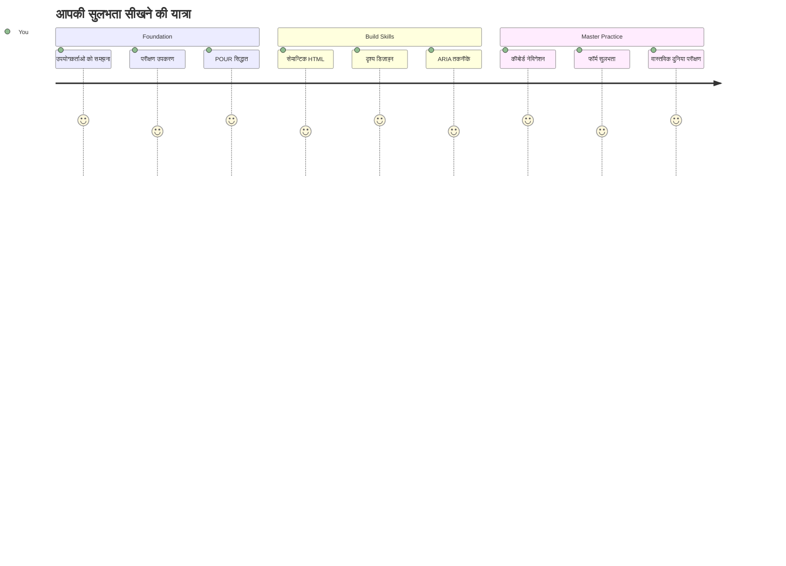
## पूर्व-व्याख्यान क्विज़
[पूर्व-व्याख्यान क्विज़](https://ff-quizzes.netlify.app/web/)

> वेब की ताकत इसकी सार्वभौमिकता में है। विकलांगता की परवाह किए बिना सभी के लिए पहुँच एक महत्वपूर्ण पहलू है।
>
> \- सर टिमोथी बर्नर्स-ली, W3C निदेशक और वर्ल्ड वाइड वेब के आविष्कारक

यहाँ कुछ ऐसा है जो आपको चौंका सकता है: जब आप सुलभ वेबसाइटें बनाते हैं, तो आप केवल विकलांग लोगों की मदद ही नहीं कर रहे होते — आप वास्तव में वेब को सभी के लिए बेहतर बना रहे होते हैं!

क्या आपने कभी उस फुटपाथ के किनारे बने कर्ब कट्स (curb cuts) देखे हैं? वे मूल रूप से व्हीलचेयर के लिए डिजाइन किए गए थे, लेकिन अब वे स्टोलर्स (strollers) वाले लोगों, डिलीवरी कर्मचारियों के डॉलीज़, घूमने वाले यात्रियों के रोलिंग लगेज, और साइकिल चालकों की भी मदद करते हैं। यही सुलभ वेब डिजाइन का तरीका है—ऐसे समाधान जो एक समूह की मदद करते हैं अक्सर सभी के लिए लाभदायक होते हैं। काफ़ी अच्छा है, है ना?

इस पाठ में, हम उन वेबसाइटों को बनाने के तरीकों का पता लगाएंगे जो वास्तव में हर किसी के लिए काम करती हैं, चाहे वे वेब कैसे भी ब्राउज़ करें। आप वेब मानकों में पहले से मौजूद व्यावहारिक तकनीकों को जानेंगे, परीक्षण उपकरणों के साथ व्यावहारिक ज्ञान प्राप्त करेंगे, और देखेंगे कि कैसे सुलभता आपकी साइटों को सभी उपयोगकर्ताओं के लिए अधिक उपयोगी बनाती है।

पाठ के अंत तक, आपके पास यह आत्मविश्वास होगा कि आप सुलभता को अपने विकास वर्कफ़्लो का स्वाभाविक हिस्सा बना सकेंगे। तैयार हैं यह जानने के लिए कि सोच-समझकर लिए गए डिज़ाइन विकल्प किस तरह अरबों उपयोगकर्ताओं के लिए वेब को खोल सकते हैं? तो चलिए शुरू करते हैं!

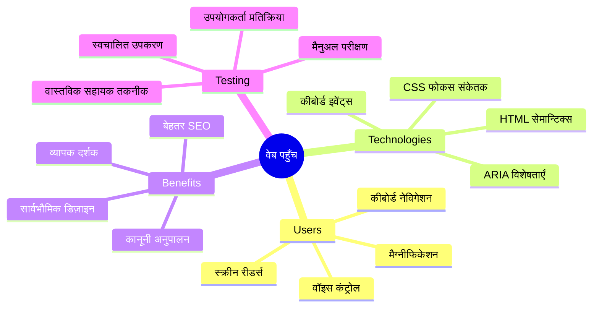
> आप यह पाठ [Microsoft Learn](https://docs.microsoft.com/learn/modules/web-development-101/accessibility/?WT.mc_id=academic-77807-sagibbon) पर भी ले सकते हैं!

## सहायक प्रौद्योगिकियों को समझना

कोडिंग में कूदने से पहले, आइए एक पल लें और समझें कि विभिन्न क्षमताओं वाले लोग वेब का अनुभव कैसे करते हैं। यह केवल सिद्धांत नहीं है — इन वास्तविक दुनिया की नेविगेशन पद्धतियों को समझना आपको एक बेहतर डेवलपर बनाएगा!

सहायक प्रौद्योगिकियाँ ऐसे अद्भुत उपकरण हैं जो विकलांग लोगों को वेबसाइटों के साथ इंटरैक्ट करने में मदद करते हैं, जो आपको आश्चर्यचकित कर सकती हैं। जब आप समझ जाते हैं कि ये प्रौद्योगिकियाँ कैसे काम करती हैं, तो सुलभ वेब अनुभव बनाना बहुत अधिक सहज हो जाता है। यह ऐसा है जैसे आप अपने कोड को किसी और की नजर से देखना सीख रहे हों।

### स्क्रीन रीडर

[स्क्रीन रीडर्स](https://en.wikipedia.org/wiki/Screen_reader) काफी परिष्कृत तकनीकें हैं जो डिजिटल टेक्स्ट को वाक् या ब्रेल आउटपुट में बदल देती हैं। जब ये मुख्य रूप से दृष्टि बाधित उपयोगकर्ता उपयोग करते हैं, ये डिस्लेक्सिया जैसे सीखने की कठिनाइयों वाले उपयोगकर्ताओं के लिए भी बेहद मददगार हैं।

मैं स्क्रीन रीडर को ऐसे सोचता हूँ जैसे आपके लिए कोई बहुत चालाक कथावाचक किताब पढ़ रहा हो। यह सामग्री को तार्किक क्रम में जोर से पढ़ता है, इंटरैक्टिव तत्वों जैसे "बटन" या "लिंक" की घोषणा करता है, और पेज में नेविगेट करने के लिए कीबोर्ड शॉर्टकट प्रदान करता है। लेकिन बात यह है—स्क्रीन रीडर्स तभी अपना जादू दिखा सकते हैं जब हम वेबसाइटों को उचित संरचना और अर्थपूर्ण सामग्री के साथ बनाते हैं। यही वह जगह है जहाँ आप एक डेवलपर के रूप में आते हैं!

**प्लेटफार्मों पर लोकप्रिय स्क्रीन रीडर्स:**
- **Windows**: [NVDA](https://www.nvaccess.org/about-nvda/) (मुफ्त और सबसे लोकप्रिय), [JAWS](https://webaim.org/articles/jaws/), [Narrator](https://support.microsoft.com/windows/complete-guide-to-narrator-e4397a0d-ef4f-b386-d8ae-c172f109bdb1/?WT.mc_id=academic-77807-sagibbon) (बिल्ट-इन)
- **macOS/iOS**: [VoiceOver](https://support.apple.com/guide/voiceover/welcome/10) (बिल्ट-इन और बहुत सक्षम)
- **Android**: [TalkBack](https://support.google.com/accessibility/android/answer/6283677) (बिल्ट-इन)
- **Linux**: [Orca](https://wiki.gnome.org/Projects/Orca) (मुफ्त और ओपन-सोर्स)

**स्क्रीन रीडर्स वेब कंटेंट में इस प्रकार नेविगेट करते हैं:**

स्क्रीन रीडर कई नेविगेशन तरीके प्रदान करते हैं जो अनुभवी उपयोगकर्ताओं के लिए ब्राउज़िंग को कुशल बनाते हैं:
- **क्रमिक पठन**: ऊपर से नीचे तक सामग्री पढ़ना, जैसे किताब पढ़ना
- **लैंडमार्क नेविगेशन**: पेज के सेक्शन्स (हेडर, नेव, मेन, फूटर) के बीच कूदना
- **हैडिंग नेविगेशन**: शीर्षकों के बीच कूदकर पेज संरचना समझना
- **लिंक सूची**: सभी लिंक की सूची बनाना तेज़ पहुँच के लिए
- **फ़ॉर्म नियंत्रण**: इनपुट फ़ील्ड्स और बटनों के बीच सीधे नेविगेट करना

> 💡 **यह मेरी समझ से परे था**: 68% स्क्रीन रीडर उपयोगकर्ता प्राथमिक रूप से शीर्षकों के द्वारा नेविगेट करते हैं ([WebAIM Survey](https://webaim.org/projects/screenreadersurvey9/#finding))। इसका अर्थ है कि आपका शीर्षक ढांचा उपयोगकर्ताओं के लिए एक नक्शा है—जब यह सही होता है, तो आप वास्तव में लोगों को उनके सामग्री के आस-पास तेज़ी से मार्ग दिखा रहे होते हैं!

### आपका परीक्षण वर्कफ़्लो बनाना

यहाँ अच्छी खबर है — प्रभावी सुलभता परीक्षण भारी-भरकम नहीं होना चाहिए! आप स्वचालित उपकरणों (जो स्पष्ट समस्याओं को पकड़ने में शानदार हैं) को कुछ हाथों-हाथ परीक्षण के साथ संयोजित करना चाहेंगे। यहाँ एक व्यवस्थित तरीका है जिससे मैंने पाया है कि यह सबसे अधिक मुद्दें पकड़ता है बिना आपके पूरे दिन को खपत किए:

**आवश्यक मैनुअल परीक्षण वर्कफ़्लो:**

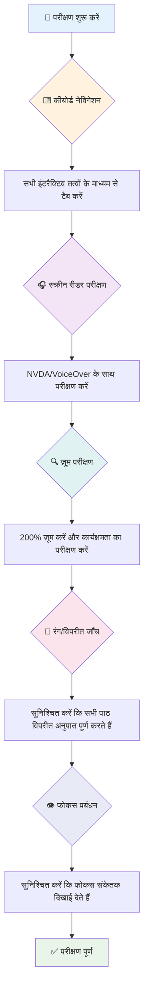
**चरण-दर-चरण परीक्षण चेकलिस्ट:**
1. **कीबोर्ड नेविगेशन**: केवल Tab, Shift+Tab, Enter, Space, और एरो कीज़ का उपयोग करें
2. **स्क्रीन रीडर परीक्षण**: NVDA, VoiceOver, या Narrator चालू करें और आंखें बंद कर नेविगेट करें
3. **जूम परीक्षण**: 200% और 400% जूम स्तर पर परीक्षण करें
4. **रंग विरोध सत्यापन**: सभी टेक्स्ट और UI घटकों की जांच करें
5. **फोकस सूचक परीक्षण**: सुनिश्चित करें कि सभी इंटरैक्टिव तत्वों में स्पष्ट फोकस स्टेट्स हों

✅ **लाइटहाउस से शुरू करें**: अपने ब्राउज़र के DevTools खोलें, लाइटहाउस सुलभता ऑडिट चलाएं, फिर परिणामों का उपयोग करके अपने मैनुअल परीक्षण के फोकस क्षेत्रों का निर्धारण करें।

### ज़ूम और मैग्निफिकेशन उपकरण

आप जानते हैं कि जब टेक्स्ट बहुत छोटा होता है तो आप कभी-कभी अपने मोबाइल पर पिंच टू ज़ूम करते हैं, या तेज़ धूप में लैपटॉप स्क्रीन पर नज़दीक-नज़दीक देखते हैं? कई उपयोगकर्ता प्रत्येक दिन कंटेंट को पठनीय बनाने के लिए मैग्निफिकेशन उपकरणों पर भरोसा करते हैं। इसमें कम दृष्टि वाले लोग, बूढ़े वयस्क, और कोई भी जो कभी बाहर वेबसाइट पढ़ने की कोशिश करता है, शामिल हैं।

आधुनिक ज़ूम तकनीकें केवल चीजों को बड़ा करने से आगे निकल चुकी हैं। यह समझना कि ये उपकरण कैसे काम करते हैं, आपको उत्तरदायी डिज़ाइन बनाने में मदद करेगा जो किसी भी ज़ूम स्तर पर कार्यात्मक और आकर्षक बनाए रखे।

**आधुनिक ब्राउज़र ज़ूम क्षमताएँ:**
- **पेज ज़ूम**: सभी सामग्री को समानुपातिक रूप से स्केल करता है (टेक्स्ट, छवियां, लेआउट) - यह सबसे पसंदीदा तरीका है
- **केवल टेक्स्ट ज़ूम**: मूल लेआउट बनाये रखते हुए फ़ॉन्ट आकार बढ़ाता है
- **पिंच-टू-ज़ूम**: मोबाइल जेस्चर समर्थन अस्थायी मैग्निफिकेशन के लिए
- **ब्राउज़र समर्थन**: सभी आधुनिक ब्राउज़र ज़ूम को 500% तक बिना कार्यक्षमता टूटे सपोर्ट करते हैं

**विशेष मैग्निफिकेशन सॉफ़्टवेयर:**
- **Windows**: [Magnifier](https://support.microsoft.com/windows/use-magnifier-to-make-things-on-the-screen-easier-to-see-414948ba-8b1c-d3bd-8615-0e5e32204198) (बिल्ट-इन), [ZoomText](https://www.freedomscientific.com/training/zoomtext/getting-started/)
- **macOS/iOS**: [Zoom](https://www.apple.com/accessibility/mac/vision/) (बिल्ट-इन साथ उन्नत विशेषताएँ)

> ⚠️ **डिज़ाइन विचार**: WCAG यह आवश्यक करता है कि सामग्री 200% ज़ूम पर भी कार्यात्मक बनी रहे। इस स्तर पर, क्षैतिज स्क्रॉलिंग न्यूनतम होनी चाहिए, और सभी इंटरैक्टिव तत्व सुलभ बने रहना चाहिए।

✅ **अपने उत्तरदायी डिज़ाइन का परीक्षण करें**: अपने ब्राउज़र को 200% और 400% तक ज़ूम करें। क्या आपका लेआउट सहजता से अनुकूलित होता है? क्या आप अत्यधिक स्क्रॉलिंग के बिना सभी कार्यक्षमताओं तक पहुँच सकते हैं?

## आधुनिक सुलभता परीक्षण उपकरण

अब जब आप समझ गए हैं कि लोग सहायक प्रौद्योगिकियों के साथ वेब पर कैसे नेविगेट करते हैं, तो आइए उन उपकरणों की खोज करें जो आपको सुलभ वेबसाइटें बनाने और परीक्षण करने में मदद करते हैं।

इसे इस तरह सोचिए: ऑटोमेटेड उपकरण स्पष्ट मुद्दों को पकड़ने में अच्छे हैं (जैसे गायब alt टेक्स्ट), जबकि हाथों-हाथ परीक्षण आपको सुनिश्चित करने में मदद करता है कि आपकी साइट असली दुनिया में उपयोग करने में अच्छी लगती है। साथ मिलकर, वे आपको यह आत्मविश्वास देते हैं कि आपकी साइटें सभी के लिए काम करती हैं।

### रंग भेद परीक्षण

यहाँ अच्छी खबर है: रंग भेद सबसे आम सुलभता मुद्दों में से एक है, लेकिन यह ठीक करने में भी सबसे आसान है। अच्छा कंट्रास्ट सभी के लिए लाभकारी होता है — दृष्टि बाधित उपयोगकर्ताओं से लेकर वे लोग जो सूरज के नीचे अपने फोन पढ़ने की कोशिश कर रहे हों।

**WCAG कंट्रास्ट आवश्यकताएँ:**

| टेक्स्ट प्रकार | WCAG AA (न्यूनतम) | WCAG AAA (उन्नत) |
|-----------|-------------------|---------------------|
| **सामान्य टेक्स्ट** (18pt से कम) | 4.5:1 कंट्रास्ट अनुपात | 7:1 कंट्रास्ट अनुपात |
| **बड़ा टेक्स्ट** (18pt+ या 14pt+ बोल्ड) | 3:1 कंट्रास्ट अनुपात | 4.5:1 कंट्रास्ट अनुपात |
| **UI घटक** (बटन, फ़ॉर्म बॉर्डर) | 3:1 कंट्रास्ट अनुपात | 3:1 कंट्रास्ट अनुपात |

**आवश्यक परीक्षण उपकरण:**
- [Colour Contrast Analyser](https://www.tpgi.com/color-contrast-checker/) - डेस्कटॉप ऐप रंग चयनकर्ता के साथ
- [WebAIM Contrast Checker](https://webaim.org/resources/contrastchecker/) - वेब आधारित तत्क्षण फीडबैक के साथ
- [Stark](https://www.getstark.co/) - Figma, Sketch, Adobe XD के लिए डिज़ाइन उपकरण प्लगइन
- [Accessible Colors](https://accessible-colors.com/) - सुलभ रंग पट्टियाँ खोजें

✅ **बेहतर रंग पैलेट बनाएं**: अपने ब्रांड रंगों से शुरू करें और कंट्रास्ट चेकर का उपयोग करके सुलभ विकल्प बनाएं। इन्हें अपनी डिज़ाइन प्रणाली के सुलभ रंग टोकन के रूप में दस्तावेज़ करें।

### व्यापक सुलभता ऑडिटिंग

सबसे प्रभावी सुलभता परीक्षण विभिन्न तरीकों का संयोजन करता है। कोई एकल उपकरण सब कुछ नहीं पकड़ पाता, इसलिए विभिन्न तरीकों के साथ परीक्षण दिनचर्या बनाना सुनिश्चित कवरेज देता है।

**ब्राउज़र-आधारित परीक्षण (DevTools में अंतर्निहित):**
- **Chrome/Edge**: लाइटहाउस सुलभता ऑडिट + सुलभता पैनल
- **Firefox**: विस्तृत ट्री व्यू के साथ सुलभता इंस्पेक्टर
- **Safari**: Web Inspector में ऑडिट टैब VoiceOver सिमुलेशन के साथ

**पेशेवर परीक्षण एक्सटेंशन:**
- [axe DevTools](https://www.deque.com/axe/devtools/) - उद्योग-मानक स्वचालित परीक्षण
- [WAVE](https://wave.webaim.org/extension/) - त्रुटि हाइलाइटिंग के साथ दृश्य प्रतिक्रिया
- [Accessibility Insights](https://accessibilityinsights.io/) - Microsoft का व्यापक परीक्षण सूट

**कमांड-लाइन और CI/CD एकीकरण:**
- [axe-core](https://github.com/dequelabs/axe-core) - स्वचालित परीक्षण के लिए जावास्क्रिप्ट लाइब्रेरी
- [Pa11y](https://pa11y.org/) - कमांड-लाइन सुलभता परीक्षण उपकरण
- [Lighthouse CI](https://github.com/GoogleChrome/lighthouse-ci) - स्वचालित सुलभता स्कोरिंग

> 🎯 **परीक्षण लक्ष्य**: लाइटहाउस सुलभता स्कोर 95+ को अपने बेसलाइन के रूप में लक्ष्य बनाएं। याद रखें, स्वचालित उपकरण केवल लगभग 30-40% सुलभता मुद्दों को पकड़ पाते हैं—मैनुअल परीक्षण अभी भी आवश्यक है!

### 🧠 **परीक्षण कौशल जांच: मुद्दे खोजने के लिए तैयार?**

**आइए देखें कि आप सुलभता परीक्षण को लेकर कैसा महसूस करते हैं:**
- इस समय कौन सा परीक्षण तरीका आपको सबसे अधिक अपनाने योग्य लगता है?
- क्या आप कल्पना कर सकते हैं कि एक पूरा दिन सिर्फ कीबोर्ड नेविगेशन का उपयोग करें?
- ऑनलाइन आपने व्यक्तिगत रूप से कौन सी सुलभता बाधा अनुभव की है?

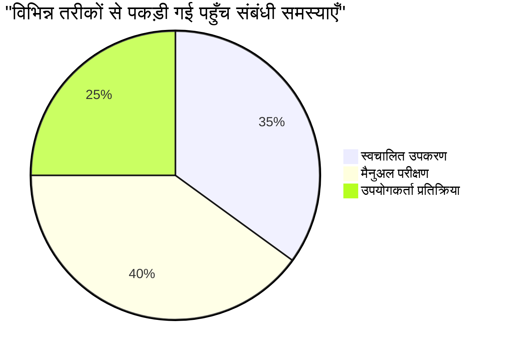
> **आत्मविश्वास बढ़ाने वाला**: पेशेवर सुलभता परीक्षक इस सटीक संयोजन का उपयोग करते हैं। आप उद्योग-मानक अभ्यास सीख रहे हैं!

## प्रारंभ से सुलभता का निर्माण

सुलभता की सफलता की कुंजी इसे पहले दिन से ही अपनी नींव में बनाना है। मुझे पता है कि यह सोचने में लुभावना होता है "मैं बाद में सुलभता जोड़ लूंगा," लेकिन यह ऐसा ही है जैसे घर बनने के बाद रैंप जोड़ने की कोशिश करना। संभव? हाँ। आसान? वास्तव में नहीं।

सुलभता को ऐसे सोचें जैसे आप एक घर की योजना बना रहे हों—अपने प्रारंभिक वास्तु योजना में व्हीलचेयर पहुँच शामिल करना बाद में सब कुछ फिर से बदलने से कहीं आसान होता है।

### POUR सिद्धांत: आपकी सुलभता की नींव

वेब कंटेंट सुलभता दिशानिर्देश (WCAG) चार मौलिक सिद्धांतों के इर्द-गिर्द बनाए गए हैं जिन्हें POUR कहा जाता है। चिंता मत करें—यह कोई रूढ़िवादी अकादमिक अवधारणाएँ नहीं हैं! ये वास्तव में व्यवहारिक दिशानिर्देश हैं जो ऐसी सामग्री बनाने में मदद करते हैं जो सभी के लिए काम करती है।

एक बार जब आप POUR को समझ जाते हैं, तो सुलभता निर्णय लेना बहुत अधिक सहज हो जाता है। यह ऐसा है जैसे आपके पास एक मानसिक चेकलिस्ट हो जो आपके डिज़ाइन विकल्पों का मार्गदर्शन करती है। आइए इसे विस्तार से देखें:

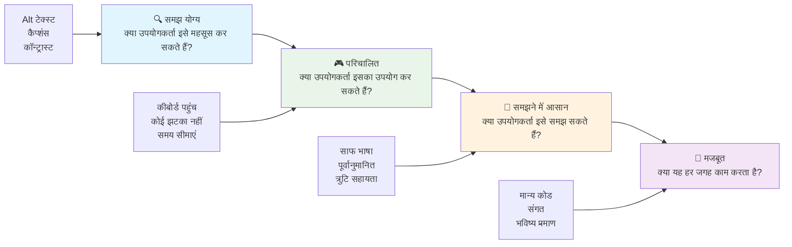
**🔍 Perceivable**: जानकारी ऐसी होनी चाहिए जिसे उपयोगकर्ता अपनी उपलब्ध इंद्रियों के माध्यम से महसूस कर सकें

- गैर-पाठ सामग्री (छवियां, वीडियो, ऑडियो) के लिए पाठ विकल्प प्रदान करें
- सभी टेक्स्ट और UI घटकों के लिए पर्याप्त रंग विरोध सुनिश्चित करें
- मल्टीमीडिया सामग्री के लिए कैप्शन और ट्रांसक्रिप्ट प्रदान करें
- ऐसी सामग्री डिज़ाइन करें जो 200% तक आकार बढ़ाने पर भी कार्यात्मक बनी रहे
- जानकारी व्यक्त करने के लिए कई संवेदी विशेषताओं का उपयोग करें (सिर्फ रंग नहीं)

**🎮 Operable**: सभी इंटरफेस घटक उपलब्ध इनपुट विधियों से ऑपरेबल होने चाहिए

- सभी कार्यक्षमता को कीबोर्ड नेविगेशन के माध्यम से सुलभ बनाएं
- उपयोगकर्ताओं को सामग्री पढ़ने और बातचीत करने के लिए पर्याप्त समय दें
- ऐसी सामग्री से बचें जो दौरे या वेस्टिबुलर विकार का कारण बने
- स्पष्ट संरचना और लैंडमार्क के साथ नेविगेशन को दक्ष बनाएं
- इंटरैक्टिव तत्वों के लिए पर्याप्त लक्ष्य आकार सुनिश्चित करें (कम से कम 44px)

**📖 Understandable**: जानकारी और UI संचालन स्पष्ट और समझने योग्य होना चाहिए

- अपने उपयोगकर्ता के अनुसार स्पष्ट, सरल भाषा का उपयोग करें
- सुनिश्चित करें कि सामग्री पूर्वानुमेय और सुसंगत तरीके से प्रकट और संचालन हो
- उपयोगकर्ता इनपुट के लिए स्पष्ट निर्देश और त्रुटि संदेश प्रदान करें
- उपयोगकर्ताओं को फॉर्म में त्रुटियाँ समझने और सुधारने में मदद करें
- तार्किक पठन क्रम और सूचना पदानुक्रम के साथ सामग्री व्यवस्थित करें

**💪 Robust**: सामग्री विभिन्न तकनीकों और सहायक उपकरणों के साथ विश्वसनीय रूप से काम करनी चाहिए

- **अपनी नींव के रूप में मान्य, सेमांटिक HTML का उपयोग करें**
- **वर्तमान और आने वाली सहायक प्रौद्योगिकियों के साथ संगतता सुनिश्चित करें**
- **मार्कअप के लिए वेब मानकों और सर्वोत्तम प्रथाओं का पालन करें**
- **विभिन्न ब्राउज़रों, उपकरणों और सहायक उपकरणों में परीक्षण करें**
- **सामग्री को इस तरह से संरचित करें कि जब उन्नत सुविधाएँ समर्थित न हों तो वह सुचारू रूप से कम गुणवत्ता वाली न दिखे**

### 🎯 **POUR सिद्धांत जांच: इसे यादगार बनाना**

**मूल बातें पर त्वरित चिंतन:**
- क्या आप किसी ऐसी वेबसाइट सुविधा के बारे में सोच सकते हैं जो प्रत्येक POUR सिद्धांत में विफल हो?
- आपको कौन सा सिद्धांत एक डेवलपर के रूप में सबसे स्वाभाविक लगता है?
- ये सिद्धांत केवल विकलांग उपयोगकर्ताओं के लिए ही नहीं, बल्कि सभी के लिए डिजाइन में कैसे सुधार कर सकते हैं?

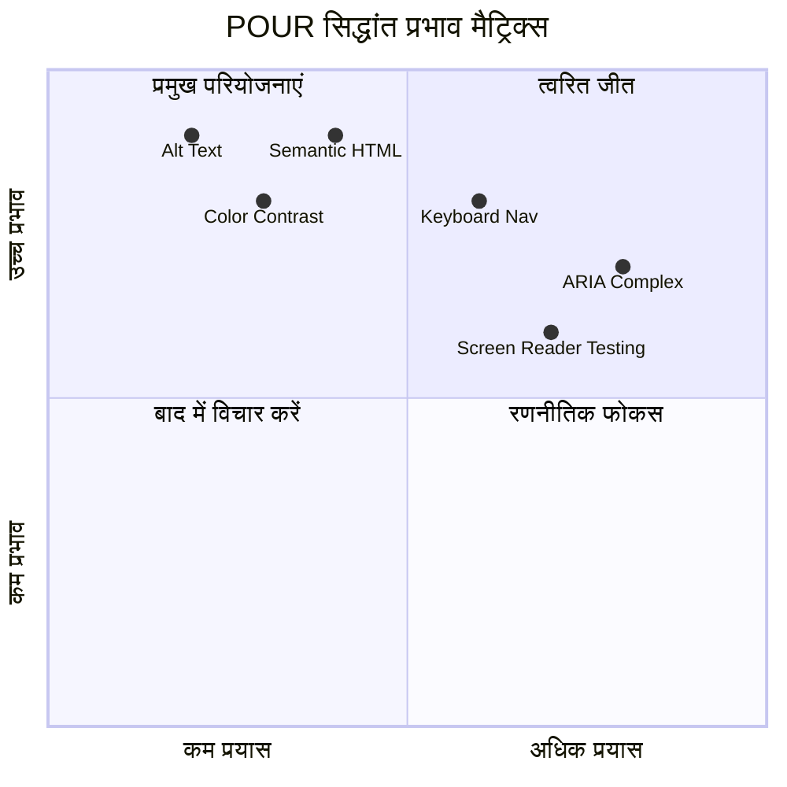
> **याद रखें**: उच्च प्रभाव वाले, कम प्रयास वाले सुधारों से शुरू करें। सेमांटिक HTML और alt टेक्स्ट आपको सबसे कम प्रयास में सबसे बड़ा पहुँच बढ़ाने वाला लाभ देते हैं!

## सुलभ दृश्य डिज़ाइन बनाना

अच्छा दृश्य डिज़ाइन और सुलभता हाथ में हाथ देते हैं। जब आप सुलभता को ध्यान में रखकर डिजाइन करते हैं, तो अक्सर आपको पता चलता है कि ये सीमाएँ साफ-सुथरे, अधिक सुरुचिपूर्ण समाधान की ओर ले जाती हैं जो सभी उपयोगकर्ताओं के लिए फायदेमंद होती हैं।

आइए देखें कि कैसे दृश्य रूप से आकर्षक डिज़ाइन बनाएँ जो हर किसी के लिए काम करें, चाहे उनकी दृश्य क्षमता कैसी भी हो या वे आपकी सामग्री को किस परिस्थिति में देख रहे हों।

### रंग और दृश्य सुलभता रणनीतियाँ

रंग संचार के लिए शक्तिशाली है, लेकिन यह कभी भी महत्वपूर्ण जानकारी पहुंचाने का एकमात्र तरीका नहीं होना चाहिए। रंग के परे डिजाइन करना अधिक मजबूत, समावेशी अनुभव बनाता है जो ज्यादा परिस्थितियों में काम करता है।

**रंग दृष्टि भिन्नताओं के लिए डिजाइन करें:**

लगभग 8% पुरुष और 0.5% महिलाएं किसी न किसी प्रकार की रंग दृष्टि भिन्नता (अक्सर "रंग अंधता" कहा जाता है) से प्रभावित होती हैं। सबसे सामान्य प्रकार हैं:
- **ड्युटेरानोपिया**: लाल और हरे के बीच अंतर करना मुश्किल
- **प्रोटोनोपिया**: लाल रंग अधिक फीका दिखाई देता है
- **ट्रिटानोपिया**: नीला और पीले के साथ कठिनाई (अल्पविरल)

**समावेशी रंग रणनीतियाँ:**

```css
/* ❌ Bad: Using only color to indicate status */
.error { color: red; }
.success { color: green; }

/* ✅ Good: Color plus icons and context */
.error {
  color: #d32f2f;
  border-left: 4px solid #d32f2f;
}
.error::before {
  content: "⚠️";
  margin-right: 8px;
}

.success {
  color: #2e7d32;
  border-left: 4px solid #2e7d32;
}
.success::before {
  content: "✅";
  margin-right: 8px;
}
```

**मूल कंट्रास्ट आवश्यकताओं के परे:**
- रंग अंध निदर्शकों के साथ अपने रंग विकल्पों का परीक्षण करें
- रंग कोडिंग के साथ पैटर्न, बनावट, या आकृतियाँ उपयोग करें
- सुनिश्चित करें कि इंटरैक्टिव स्टेट्स बिना रंग के भी अलग पहचाने जा सकें
- जांचें कि आपका डिज़ाइन उच्च कंट्रास्ट मोड में कैसा दिखता है

✅ **अपनी रंग सुलभता का परीक्षण करें**: [Coblis](https://www.color-blindness.com/coblis-color-blindness-simulator/) जैसे उपकरणों का उपयोग करें यह देखने के लिए कि आपका साइट रंग दृष्टि भिन्नताओं वाले उपयोगकर्ताओं के लिए कैसा दिखता है।

### फोकस संकेतक और इंटरैक्शन डिज़ाइन

फोकस संकेतक डिजिटल कर्सर के बराबर होते हैं—वे कीबोर्ड उपयोगकर्ताओं को दिखाते हैं कि वे पन्ने पर कहाँ हैं। अच्छी तरह से डिज़ाइन किए गए फोकस संकेतक सभी के लिए इंटरैक्शन स्पष्ट और पूर्वानुमेय बनाकर अनुभव को बेहतर बनाते हैं।

**आधुनिक फोकस संकेतक सर्वश्रेष्ठ प्रथाएँ:**

```css
/* Enhanced focus styles that work across browsers */
button:focus-visible {
  outline: 2px solid #0066cc;
  outline-offset: 2px;
  box-shadow: 0 0 0 4px rgba(0, 102, 204, 0.25);
}

/* Remove focus outline for mouse users, preserve for keyboard users */
button:focus:not(:focus-visible) {
  outline: none;
}

/* Focus-within for complex components */
.card:focus-within {
  box-shadow: 0 0 0 3px rgba(74, 144, 164, 0.5);
  border-color: #4A90A4;
}

/* Ensure focus indicators meet contrast requirements */
.custom-focus:focus-visible {
  outline: 3px solid #ffffff;
  outline-offset: 2px;
  box-shadow: 0 0 0 6px #000000;
}
```
  
**फोकस संकेतक आवश्यकताएँ:**
- **दृश्यता**: आस-पास के तत्वों के साथ कम से कम 3:1 कंट्रास्ट अनुपात होना चाहिए
- **चौड़ाई**: पूरे तत्व के चारों ओर न्यूनतम 2px मोटाई
- **टिकाऊपन**: तब तक दिखना चाहिए जब तक कि फोकस कहीं और न चला जाए
- **भेदभाव**: अन्य UI स्टेट्स से दृश्य रूप से अलग होना चाहिए

> 💡 **डिज़ाइन टिप**: उत्कृष्ट फोकस संकेतक अक्सर आउटलाइन, बॉक्स-शैडो, और रंग परिवर्तन का संयोजन उपयोग करते हैं ताकि विभिन्न पृष्ठभूमि और संदर्भों में दृश्यता सुनिश्चित हो सके।

✅ **फोकस संकेतकों का ऑडिट करें**: अपनी वेबसाइट पर टैब दबाकर जांचें कि किन तत्वों पर स्पष्ट फोकस संकेतक हैं। क्या कोई दिखने में कठिन है या पूरी तरह गायब है?

### सेमांटिक HTML: सुलभता की नींव

सेमांटिक HTML, आपकी वेबसाइट के लिए सहायक तकनीकों को जीपीएस सिस्टम देने के समान है। जब आप अपने HTML तत्वों का सही उद्देश्य के लिए उपयोग करते हैं, तो आप स्क्रीन रीडर्स, कीबोर्ड और अन्य उपकरणों को उपयोगकर्ताओं को प्रभावी रूप से नेविगेट करने में मदद करने के लिए एक विस्तृत नक्शा प्रदान कर रहे होते हैं।

यहां एक उदाहरण है जो मेरे लिए बहुत समझने योग्य था: सेमांटिक HTML एक अच्छी तरह से व्यवस्थित पुस्तकालय और स्पष्ट श्रेणियाँ तथा सहायक संकेतों वाला उपकरण है, बनिस्बत एक गोदाम के जहाँ किताबें बेतरतीब रखी हों। दोनों जगहों पर समान किताबें होती हैं, लेकिन आप किस जगह कुछ खोजने की कोशिश करेंगे? बिल्कुल!

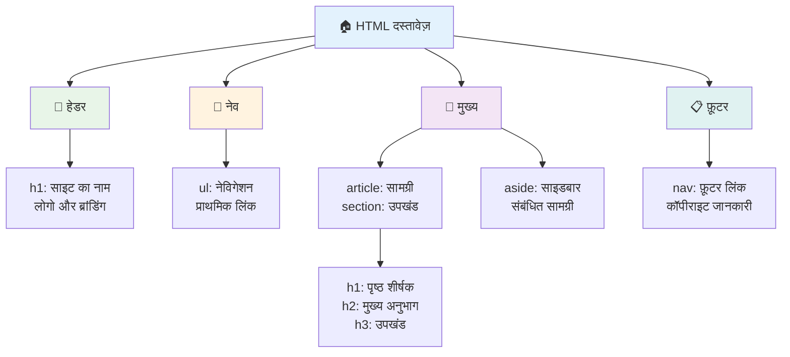
**सुलभ पृष्ठ संरचना के निर्माण खंड:**

```html
<!-- Landmark elements provide page navigation structure -->
<header>
  <h1>Your Site Name</h1>
  <nav aria-label="Main navigation">
    <ul>
      <li><a href="/home">Home</a></li>
      <li><a href="/about">About</a></li>
      <li><a href="/services">Services</a></li>
    </ul>
  </nav>
</header>

<main>
  <article>
    <header>
      <h1>Article Title</h1>
      <p>Published on <time datetime="2024-10-14">October 14, 2024</time></p>
    </header>
    
    <section>
      <h2>First Section</h2>
      <p>Content that relates to this section...</p>
    </section>
    
    <section>
      <h2>Second Section</h2>
      <p>More related content...</p>
    </section>
  </article>
  
  <aside>
    <h2>Related Links</h2>
    <nav aria-label="Related articles">
      <ul>
        <li><a href="/related-1">First related article</a></li>
        <li><a href="/related-2">Second related article</a></li>
      </ul>
    </nav>
  </aside>
</main>

<footer>
  <p>&copy; 2024 Your Site Name. All rights reserved.</p>
  <nav aria-label="Footer links">
    <ul>
      <li><a href="/privacy">Privacy Policy</a></li>
      <li><a href="/contact">Contact Us</a></li>
    </ul>
  </nav>
</footer>
```
  
**सेमांटिक HTML कैसे सुलभता को बदलता है:**

| सेमांटिक तत्व | उद्देश्य | स्क्रीन रीडर लाभ |
|------------------|---------|----------------------|
| `<header>` | पृष्ठ या अनुभाग हैडर | "बैनर लैंडमार्क" - शीर्ष तक त्वरित नेविगेशन |
| `<nav>` | नेविगेशन लिंक | "नेविगेशन लैंडमार्क" - नेविगेशन अनुभागों की सूची |
| `<main>` | मुख्य पृष्ठ सामग्री | "मुख्य लैंडमार्क" - सीधे सामग्री पर जाएं |
| `<article>` | स्व-निहित सामग्री | लेख की सीमाएं घोषणा करता है |
| `<section>` | विषयगत सामग्री समूह | सामग्री संरचना प्रदान करता है |
| `<aside>` | संबंधित साइडबार सामग्री | "पूरक लैंडमार्क" |
| `<footer>` | पृष्ठ या अनुभाग फुटर | "सामग्री सूचना लैंडमार्क" |

**सेमांटिक HTML के साथ स्क्रीन रीडर की सुपरपावर:**
- **लैंडमार्क नेविगेशन**: प्रमुख पृष्ठ अनुभागों के बीच तुरंत कूदें
- **हेडिंग आउटलाइन**: हेडिंग संरचना से सामग्री तालिका बनाएं
- **तत्व सूचियाँ**: सभी लिंक, बटन या फॉर्म नियंत्रण की सूचियाँ बनाएं
- **प्रसंग जागरूकता**: सामग्री अनुभागों के बीच संबंध समझें

> 🎯 **त्वरित परीक्षण**: स्क्रीन रीडर के साथ लैंडमार्क शॉर्टकट्स (NVDA/JAWS में D के लिए लैंडमार्क, H के लिए हेडिंग, K के लिए लिंक) का उपयोग करके अपनी साइट नेविगेट करें। क्या नेविगेशन समझ में आता है?

### 🏗️ **सेमांटिक HTML माहिरी जांच: मजबूत आधार बनाएँ**

**आइए आपकी सेमांटिक समझ का मूल्यांकन करें:**
- क्या आप केवल HTML देखकर किसी वेबपेज पर लैंडमार्क पहचान सकते हैं?
- आप `<section>` और `<div>` के बीच का अंतर एक मित्र को कैसे समझाएंगे?
- यदि स्क्रीन रीडर उपयोगकर्ता नेविगेशन समस्या रिपोर्ट करे, तो आप सबसे पहले क्या जांचेंगे?

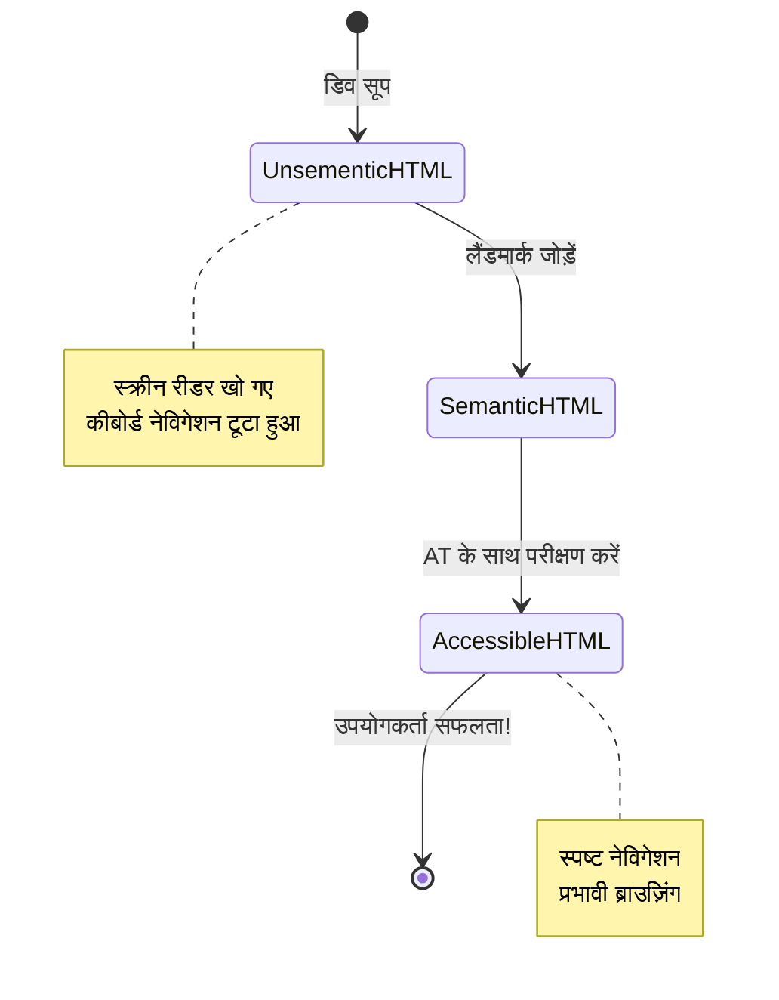
> **प्रो इनसाइट**: अच्छी सेमांटिक HTML स्वचालित रूप से सुलभता समस्याओं का लगभग 70% हल कर देती है। इस आधार को मास्टर करें और आप सही रास्ते पर हैं!

✅ **अपनी सेमांटिक संरचना का ऑडिट करें**: अपने ब्राउज़र के डेवलपर टूल्स में Accessibility पैनल का उपयोग करें ताकि आप सुलभता वृक्ष देख सकें और सुनिश्चित करें कि आपका मार्कअप तार्किक संरचना बनाता है।

### हेडिंग पदानुक्रम: तार्किक सामग्री रूपरेखा बनाना

हेडिंग्स सुलभ सामग्री के लिए अत्यंत महत्वपूर्ण हैं—वे स्पाइन की तरह होते हैं जो सब कुछ एक साथ रखते हैं। स्क्रीन रीडर उपयोगकर्ता हेडिंग्स पर भारी निर्भर रहते हैं ताकि वे आपकी सामग्री को समझ सकें और नेविगेट कर सकें। इसे आपकी पृष्ठ के लिए सामग्री तालिका प्रदान करने के समान समझें।

**हेडिंग के लिए स्वर्ण नियम यहाँ है:**
कभी भी स्तर छोड़ें नहीं। हमेशा तार्किक रूप से `<h1>` से `<h2>` से `<h3>` तक प्रगति करें। क्या आपको स्कूल में रूपरेखा बनाना याद है? यही सिद्धांत है—आप "I. मुख्य बिंदु" से सीधे "C. उप-उप-बिंदु" पर नहीं कूदेंगे बिना "A. उप-बिंदु" के बीच में, सही?

**परफेक्ट हेडिंग संरचना उदाहरण:**

```html
<!-- ✅ Excellent: Logical, hierarchical progression -->
<main>
  <h1>Complete Guide to Web Accessibility</h1>
  
  <section>
    <h2>Understanding Screen Readers</h2>
    <p>Introduction to screen reader technology...</p>
    
    <h3>Popular Screen Reader Software</h3>
    <p>NVDA, JAWS, and VoiceOver comparison...</p>
    
    <h3>Testing with Screen Readers</h3>
    <p>Step-by-step testing instructions...</p>
  </section>
  
  <section>
    <h2>Color and Contrast Guidelines</h2>
    <p>Designing with sufficient contrast...</p>
    
    <h3>WCAG Contrast Requirements</h3>
    <p>Understanding the different contrast levels...</p>
    
    <h3>Testing Tools and Techniques</h3>
    <p>Tools for verifying contrast ratios...</p>
  </section>
</main>
```
  
```html
<!-- ❌ Problematic: Skipping levels, inconsistent structure -->
<h1>Page Title</h1>
<h3>Subsection</h3> <!-- Skipped h2 -->
<h2>This should come before h3</h2>
<h1>Another main heading?</h1> <!-- Multiple h1s -->
```
  
**हेडिंग सर्वश्रेष्ठ प्रथाएँ:**
- **प्रति पृष्ठ एक `<h1>`**: आम तौर पर आपका मुख्य पृष्ठ शीर्षक या प्राथमिक सामग्री हेडिंग
- **तार्किक प्रगति**: कभी भी स्तर न छोड़ें (h1 → h2 → h3, न कि h1 → h3)
- **विवरणात्मक सामग्री**: हेडिंग्स को संदर्भ से बाहर पढ़े जाने पर भी अर्थपूर्ण बनाएं
- **CSS के साथ दृश्य स्टाइलिंग**: दिखावट के लिए CSS का उपयोग करें, संरचना के लिए HTML स्तरों का

**स्क्रीन रीडर नेविगेशन सांख्यिकी:**
- 68% स्क्रीन रीडर उपयोगकर्ता हेडिंग्स द्वारा नेविगेट करते हैं ([WebAIM Survey](https://webaim.org/projects/screenreadersurvey9/#finding))
- उपयोगकर्ता तार्किक हेडिंग रूपरेखा खोजने की उम्मीद करते हैं
- हेडिंग्स पृष्ठ संरचना समझने का सबसे तेज़ तरीका प्रदान करते हैं

> 💡 **प्रो टिप**: "HeadingsMap" जैसे ब्राउज़र एक्सटेंशन का उपयोग करें ताकि आप अपनी हेडिंग संरचना को विज़ुअलाइज़ कर सकें। इसे अच्छी तरह से व्यवस्थित सामग्री तालिका की तरह पढ़ना चाहिए।

✅ **अपनी हेडिंग संरचना का परीक्षण करें**: स्क्रीन रीडर के हेडिंग नेविगेशन (NVDA में H कुंजी) का उपयोग करके अपनी हेडिंग्स के बीच कूदें। क्या प्रगति आपकी सामग्री की कहानी तार्किक रूप से बताती है?

### उन्नत दृश्य सुलभता तकनीकें

कंट्रास्ट और रंग के मूल से परे, ऐसी उन्नत तकनीकें हैं जो वास्तव में समावेशी दृश्य अनुभव बनाती हैं। ये विधियाँ यह सुनिश्चित करती हैं कि आपकी सामग्री विभिन्न देखने की परिस्थितियों और सहायक तकनीकों में काम करे।

**आवश्यक दृश्य संचार रणनीतियाँ:**

- **मल्टी-मोडल फीडबैक**: दृश्य, पाठ्यात्मक और कभी-कभी ऑडियो संकेत संयोजन करें
- **प्रगति-आधारित प्रकटीकरण**: जानकारी को पचाने योग्य टुकड़ों में प्रस्तुत करें
- **संगत इंटरैक्शन पैटर्न**: परिचित UI सम्मेलन का उपयोग करें
- **उत्तरदायी टाइपोग्राफी**: उपकरणों के अनुसार पाठ का उचित आकार बदलें
- **लोडिंग और त्रुटि अवस्थाएँ**: सभी उपयोगकर्ता क्रियाओं के लिए स्पष्ट प्रतिक्रिया प्रदान करें

**बेहतर सुलभता के लिए CSS उपयोगिताएँ:**

```css
/* Screen reader only text - visually hidden but accessible */
.sr-only {
  position: absolute;
  width: 1px;
  height: 1px;
  padding: 0;
  margin: -1px;
  overflow: hidden;
  clip: rect(0, 0, 0, 0);
  white-space: nowrap;
  border: 0;
}

/* Skip link for keyboard navigation */
.skip-link {
  position: absolute;
  top: -40px;
  left: 6px;
  background: #000000;
  color: #ffffff;
  padding: 8px 16px;
  text-decoration: none;
  border-radius: 4px;
  font-weight: bold;
  transition: top 0.3s ease;
  z-index: 1000;
}

.skip-link:focus {
  top: 6px;
}

/* Reduced motion respect */
@media (prefers-reduced-motion: reduce) {
  .skip-link {
    transition: none;
  }
  
  * {
    animation-duration: 0.01ms !important;
    animation-iteration-count: 1 !important;
    transition-duration: 0.01ms !important;
  }
}

/* High contrast mode support */
@media (prefers-contrast: high) {
  .button {
    border: 2px solid;
  }
}
```
  
> 🎯 **सुलभता पैटर्न**: "स्किप लिंक" कीबोर्ड उपयोगकर्ताओं के लिए आवश्यक है। यह आपके पृष्ठ पर पहला फोकसेबल तत्व होना चाहिए और सीधे मुख्य सामग्री क्षेत्र पर कूदना चाहिए।

✅ **स्किप नेविगेशन लागू करें**: अपने पृष्ठों में स्किप लिंक जोड़ें और पृष्ठ लोड होते ही Tab दबाकर उनका परीक्षण करें। उन्हें प्रदर्शित होना चाहिए और आपको मुख्य सामग्री पर कूदने देना चाहिए।

## अर्थपूर्ण लिंक टेक्स्ट बनाना

लिंक वेब के राजमार्ग की तरह होते हैं, लेकिन खराब लिखे गए लिंक टेक्स्ट सड़क संकेतों के उस तरह होते हैं जो केवल "स्थान" कहते हैं बजाय "डाउनटाउन शिकागो" के। बहुत मददगार नहीं, है ना?

यहाँ ऐसी बात है जिसने मुझे हैरान कर दिया जब मैंने पहली बार सीखा: स्क्रीन रीडर पृष्ठ से सभी लिंक निकाल सकते हैं और उन्हें एक बड़ी सूची के रूप में दिखा सकते हैं। कल्पना करें किसने आपको आपके पृष्ठ पर हर लिंक की निर्देशिका दी हो। क्या उनमें से हर एक का मतलब अपने आप समझ आता? यही परीक्षण है जो आपके लिंक टेक्स्ट को पास करना होता है!

### लिंक नेविगेशन पैटर्न को समझना

स्क्रीन रीडर शक्तिशाली लिंक नेविगेशन सुविधाएँ प्रदान करते हैं जो अच्छी तरह से लिखे गए लिंक टेक्स्ट पर निर्भर करती हैं:

**लिंक नेविगेशन तरीके:**
- **अनुक्रमिक पढ़ना**: लिंक सामग्री प्रवाह का हिस्सा के तौर पर संदर्भ में पढ़े जाते हैं
- **लिंक सूची निर्माण**: सभी पृष्ठ लिंक एक खोजने योग्य निर्देशिका में संकलित होते हैं
- **त्वरित नेविगेशन**: कीबोर्ड शॉर्टकट्स (NVDA में K) का उपयोग करके लिंक से लिंक पर जाएँ
- **खोज कार्यक्षमता**: आंशिक पाठ टाइप करके विशिष्ट लिंक खोजें

**संदर्भ के महत्व की वजह:**
जब स्क्रीन रीडर उपयोगकर्ता लिंक सूची बनाते हैं, तो वे कुछ इस तरह देखते हैं:
- "रिपोर्ट डाउनलोड करें"
- "और जानें"
- "यहाँ क्लिक करें"
- "गोपनीयता नीति"
- "यहाँ क्लिक करें"

इनमें से केवल दो लिंक संदर्भ से बाहर पढ़े जाने पर उपयोगी जानकारी देते हैं!

> 📊 **उपयोगकर्ता प्रभाव**: स्क्रीन रीडर उपयोगकर्ता जल्दी में पृष्ठ सामग्री समझने के लिए लिंक सूचियाँ स्कैन करते हैं। साधारण लिंक टेक्स्ट उन्हें प्रत्येक लिंक के संदर्भ पर वापस नेविगेट करने के लिए मजबूर करता है, जिससे उनकी ब्राउज़िंग गति काफी धीमी हो जाती है।

### आम लिंक टेक्स्ट त्रुटियाँ जिनसे बचें

यह समझना कि क्या काम नहीं करता है, आपको मौजूदा सामग्री में पहुँच समस्याओं को पहचानने और ठीक करने में मदद करता है।

**❌ सामान्य लिंक टेक्स्ट जो कोई संदर्भ नहीं देता:**

```html
<!-- Meaningless when read from a link list -->
<p>Our sustainability efforts are detailed in our recent report. 
   <a href="/sustainability-2024.pdf">Click here</a> to view it.</p>

<!-- Repeated generic text throughout the page -->
<div class="article-card">
  <h3>Web Accessibility Guide</h3>
  <p>Learn the fundamentals...</p>
  <a href="/accessibility-guide">Read more</a>
</div>
<div class="article-card">
  <h3>Color Contrast Tips</h3>
  <p>Improve your design...</p>
  <a href="/color-contrast">Read more</a>
</div>

<!-- URLs as link text (difficult for screen readers to announce) -->
<p>Visit https://www.w3.org/WAI/WCAG21/quickref/ for WCAG guidelines.</p>

<!-- Vague action words -->
<a href="/contact">Go</a> | <a href="/about">See</a> | <a href="/help">View</a>
```
  
**यह पैटर्न क्यों विफल होते हैं:**
- **"यहाँ क्लिक करें"** उपयोगकर्ताओं को गंतव्य के बारे में कुछ नहीं बताता
- **"और पढ़ें"** कई बार दोहराने से भ्रम पैदा होता है
- **कच्चे URLs** स्क्रीन रीडर के लिए स्पष्ट उच्चारण करना कठिन होते हैं
- **"जाओ" या "देखो" जैसे एकल शब्द** वर्णनात्मक संदर्भ में कमी रखते हैं

### उत्कृष्ट लिंक टेक्स्ट लिखना

वर्णनात्मक लिंक टेक्स्ट सभी के लिए लाभकारी है—दृश्य उपयोगकर्ता जल्दी लिंक स्कैन कर सकते हैं, और स्क्रीन रीडर उपयोगकर्ता गंतव्य तुरंत समझ जाते हैं।

**✅ स्पष्ट, वर्णनात्मक लिंक टेक्स्ट उदाहरण:**

```html
<!-- Descriptive text that explains the destination -->
<p>Our comprehensive <a href="/sustainability-2024.pdf">2024 sustainability report (PDF, 2.1MB)</a> details our environmental initiatives.</p>

<!-- Specific, unique link text for each card -->
<div class="article-card">
  <h3>Web Accessibility Guide</h3>
  <p>Learn the fundamentals of inclusive design...</p>
  <a href="/accessibility-guide">Read our complete web accessibility guide</a>
</div>
<div class="article-card">
  <h3>Color Contrast Tips</h3>
  <p>Improve your design with better color choices...</p>
  <a href="/color-contrast">Explore color contrast best practices</a>
</div>

<!-- Meaningful text instead of raw URLs -->
<p>The <a href="https://www.w3.org/WAI/WCAG21/quickref/">WCAG 2.1 Quick Reference guide</a> provides comprehensive accessibility guidelines.</p>

<!-- Descriptive action links -->
<a href="/contact">Contact our support team</a> | 
<a href="/about">About our company</a> | 
<a href="/help">Get help with your account</a>
```
  
**लिंक टेक्स्ट सर्वश्रेष्ठ प्रथाएँ:**
- **विशिष्ट बनें**: "त्रैमासिक वित्तीय रिपोर्ट डाउनलोड करें" बनाम "डाउनलोड करें"
- **फ़ाइल प्रकार और आकार शामिल करें**: downloadable फाइलों के लिए "(PDF, 1.2MB)"
- **बताएं यदि लिंक बाहरी हैं**: जब उपयुक्त हो "(नई विंडो में खुलता है)"
- **सक्रिय भाषा उपयोग करें**: "संपर्क करें" बनाम "संपर्क पृष्ठ"
- **संक्षिप्त रखें**: संभवतः 2-8 शब्दों का लक्ष्य रखें

### उन्नत लिंक सुलभता पैटर्न

कभी-कभी दृश्य डिज़ाइन सीमाएँ या तकनीकी आवश्यकताएँ विशेष समाधान की मांग करती हैं। यहां आम चुनौतीपूर्ण परिदृश्यों के लिए उन्नत तकनीकें हैं:

**बेहतर संदर्भ के लिए ARIA का उपयोग:**

```html
<!-- When button text must be short but needs more context -->
<a href="/report.pdf" 
   aria-label="Download 2024 annual financial report, PDF format, 2.3MB">
  Download Report
</a>

<!-- When the full context comes from surrounding content -->
<h3 id="sustainability-heading">Sustainability Initiative</h3>
<p>Our efforts to reduce environmental impact...</p>
<a href="/sustainability-details" 
   aria-labelledby="sustainability-heading"
   aria-describedby="sustainability-summary">
  Learn more
</a>
<p id="sustainability-summary">Detailed breakdown of our 2024 environmental goals and achievements</p>
```
  
**फ़ाइल प्रकार और बाहरी गंतव्य संकेतित करना:**

```html
<!-- Method 1: Include information in visible link text -->
<a href="/annual-report.pdf">
  Download our 2024 annual report (PDF, 2.3MB)
</a>

<!-- Method 2: Use screen reader-only text for file details -->
<a href="/annual-report.pdf">
  Download our 2024 annual report
  <span class="sr-only">(PDF format, 2.3MB)</span>
</a>

<!-- Method 3: External link indication -->
<a href="https://example.com" 
   target="_blank" 
   aria-describedby="external-link-warning">
  Visit external resource
</a>
<span id="external-link-warning" class="sr-only">
  (opens in new window)
</span>

<!-- Method 4: Using CSS for visual indicators -->
<a href="https://example.com" class="external-link">
  External resource
</a>
```
  
```css
/* Visual indicator for external links */
.external-link::after {
  content: " ↗";
  font-size: 0.8em;
  color: #666;
}

/* Screen reader announcement for external links */
.external-link::before {
  content: "External link: ";
  position: absolute;
  left: -10000px;
  width: 1px;
  height: 1px;
  overflow: hidden;
}
```
  
> ⚠️ **महत्वपूर्ण**: जब `target="_blank"` का उपयोग करें, हमेशा उपयोगकर्ताओं को सूचित करें कि लिंक नई विंडो या टैब में खुलता है। अप्रत्याशित नेविगेशन परिवर्तन भ्रमित कर सकते हैं।

✅ **अपने लिंक संदर्भ का परीक्षण करें**: अपने ब्राउज़र के डेवलपर टूल्स का उपयोग करके अपनी पृष्ठ पर सभी लिंक की सूची उत्पन्न करें। क्या आप प्रत्येक लिंक का उद्देश्य बिना किसी जिससे जुड़े संदर्भ के समझ पाते हैं?

## ARIA: HTML सुलभता को सुपरचार्ज करना

[Accessible Rich Internet Applications (ARIA)](https://developer.mozilla.org/docs/Web/Accessibility/ARIA) आपकी जटिल वेब एप्लिकेशन और सहायक तकनीकों के बीच एक सार्वभौमिक अनुवादक की तरह है। जब HTML अकेले आपकी इंटरैक्टिव घटकों के सभी कामों को व्यक्त नहीं कर पाता, तब ARIA उन अंतरालों को भरता है।

मुझे ARIA को अपनी HTML में सहायक टिप्पणियाँ जोड़ने जैसा लगता है—ठीक वैसे जैसे नाट्य लेख में स्टेज निर्देश अभिनेता की भूमिका और संबंध समझाने में मदद करते हैं।

**ARIA के बारे में सबसे महत्वपूर्ण नियम ये हैं**: हमेशा पहले सेमांटिक HTML का उपयोग करें, फिर उसको बेहतर बनाने के लिए ARIA जोड़ें। ARIA को मुख्य व्यंजन नहीं, बल्कि मसाले के रूप में सोचें। यह आपके HTML संरचना को स्पष्ट और बढ़ाना चाहिए, कभी प्रतिस्थापित नहीं। सबसे पहले आधार सही कर लें!

### रणनीतिक ARIA कार्यान्वयन

ARIA शक्तिशाली है, लेकिन शक्ति के साथ जिम्मेदारी भी आती है। गलत ARIA सुलभता को बिना ARIA से भी खराब बना सकता है। यहाँ कब और कैसे प्रभावी रूप से इसका उपयोग करें:

**✅ ARIA का उपयोग करें जब:**
- कस्टम इंटरैक्टिव विजेट (एकॉर्डियन, टैब, कैरोसेल) बनाते समय
- गतिशील सामग्री बनाते हैं जो पृष्ठ रीलोड के बिना बदलती है
- जटिल UI संबंधों के लिए अतिरिक्त संदर्भ प्रदान करते हैं
- लोडिंग स्टेट्स या लाइव कंटेंट अपडेट सूचित करते हैं
- कस्टम नियंत्रणों वाले ऐप जैसे इंटरफेस बनाते हैं

**❌ ARIA से बचें जब:**
- मानक HTML तत्व पहले से आवश्यक सेमांटिक्स प्रदान करते हों
- आप ठीक से इसे लागू करने में अनिश्चित हों
- यह पहले से मौजूद सेमांटिक HTML द्वारा प्रदान की गई जानकारी को दोहराता हो
- आपने इसे वास्तविक सहायक तकनीक के साथ परीक्षण नहीं किया हो

> 🎯 **ARIA स्वर्ण नियम**: "जब तक कि आपको अनिवार्य न हो semantics न बदलें, कीबोर्ड पहुंच सुनिश्चित करें, और वास्तविक सहायक तकनीक के साथ परीक्षण करें।"
**ARIA की पाँच श्रेणियाँ:**

1. **भूमिकाएँ (Roles)**: यह तत्व क्या है? (`button`, `tab`, `dialog`)
2. **गुण (Properties)**: इसकी विशेषताएँ क्या हैं? (`aria-required`, `aria-haspopup`)
3. **स्थिति (States)**: इसकी वर्तमान स्थिति क्या है? (`aria-expanded`, `aria-checked`)
4. **लैंडमार्क्स (Landmarks)**: यह पेज संरचना में कहाँ है? (`banner`, `navigation`, `main`)
5. **लाइव क्षेत्र (Live regions)**: परिवर्तनों की घोषणा कैसे होनी चाहिए? (`aria-live`, `aria-atomic`)

### आधुनिक वेब ऐप्स के लिए आवश्यक ARIA पैटर्न

ये पैटर्न इंटरैक्टिव वेब ऐप्लिकेशन में सबसे सामान्य एक्सेसिबिलिटी चुनौतियों का समाधान करते हैं:

**तत्वों का नामकरण और वर्णन करना:**

```html
<!-- aria-label: Provides accessible name when visible text isn't sufficient -->
<button aria-label="Close newsletter subscription dialog">×</button>

<!-- aria-labelledby: References existing text as the accessible name -->
<section aria-labelledby="news-heading">
  <h2 id="news-heading">Latest News</h2>
  <!-- news content -->
</section>

<!-- aria-describedby: Links to additional descriptive text -->
<input type="password" 
       aria-describedby="pwd-requirements pwd-strength"
       required>
<div id="pwd-requirements">
  Password must contain at least 8 characters, including uppercase, lowercase, and numbers.
</div>
<div id="pwd-strength" aria-live="polite">
  <!-- Dynamic password strength indicator -->
</div>
```

**डायनामिक सामग्री के लिए लाइव क्षेत्र:**

```html
<!-- Polite announcements (don't interrupt current speech) -->
<div aria-live="polite" id="status-updates">
  <!-- Status messages appear here -->
</div>

<!-- Assertive announcements (interrupt and announce immediately) -->
<div aria-live="assertive" id="urgent-alerts">
  <!-- Error messages and critical alerts -->
</div>

<!-- Loading states with live regions -->
<button id="submit-btn" aria-describedby="loading-status">
  Submit Application
</button>
<div id="loading-status" aria-live="polite" aria-atomic="true">
  <!-- "Processing your application..." appears here -->
</div>
```

**इंटरैक्टिव विजेट उदाहरण (एकॉर्डियन):**

```html
<div class="accordion">
  <h3>
    <button aria-expanded="false" 
            aria-controls="panel-1" 
            id="accordion-trigger-1"
            class="accordion-trigger">
      Accessibility Guidelines
    </button>
  </h3>
  <div id="panel-1" 
       role="region"
       aria-labelledby="accordion-trigger-1" 
       hidden>
    <p>WCAG 2.1 provides comprehensive guidelines...</p>
  </div>
</div>
```

```javascript
// अकॉर्डियन स्थिति प्रबंधित करने के लिए जावास्क्रिप्ट
function toggleAccordion(trigger) {
  const panel = document.getElementById(trigger.getAttribute('aria-controls'));
  const isExpanded = trigger.getAttribute('aria-expanded') === 'true';
  
  // स्थिति टॉगल करें
  trigger.setAttribute('aria-expanded', !isExpanded);
  panel.hidden = isExpanded;
  
  // स्क्रीन रीडर्स को परिवर्तन की घोषणा करें
  const status = document.getElementById('status-updates');
  status.textContent = isExpanded ? 'Section collapsed' : 'Section expanded';
}
```

### ARIA कार्यान्वयन के सर्वोत्तम अभ्यास

ARIA शक्तिशाली है लेकिन सावधानीपूर्वक लागू करने की जरूरत होती है। इन दिशानिर्देशों का पालन करने से आपकी ARIA एक्सेसिबिलिटी को बढ़ावा देती है, बाधा नहीं डालती:

**🛡️ मूल सिद्धांत:**

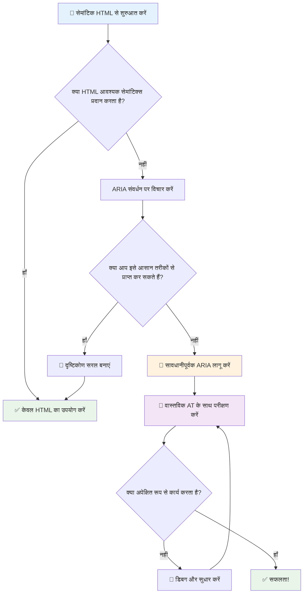
1. **पहले सेमांटिक HTML को प्राथमिकता दें**: हमेशा `<button>` को `<div role="button">` पर प्राथमिकता दें
2. **सेमांटिक्स को न तोड़ें**: मौजूदा HTML अर्थ को कभी ओवरराइड न करें (जैसे `<h1 role="button">` से बचें)
3. **कीबोर्ड एक्सेसिबिलिटी बनाए रखें**: सभी इंटरैक्टिव ARIA तत्व पूरी तरह कीबोर्ड के साथ सुलभ होने चाहिए
4. **वास्तविक उपयोगकर्ताओं के साथ परीक्षण करें**: ARIA समर्थन सहायक तकनीकों के बीच बहुत भिन्न होता है
5. **सरल से शुरू करें**: जटिल ARIA कार्यान्वयन में त्रुटियों की संभावना अधिक होती है

**🔍 परीक्षण कार्यप्रवाह:**

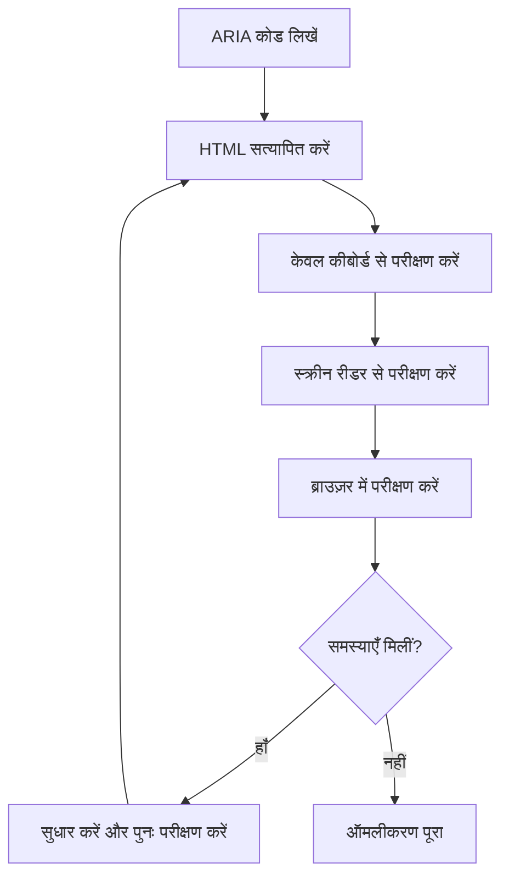
**🚫 आम ARIA गलतियों से बचें:**

- **विवादास्पद जानकारी**: HTML सेमांटिक्स के विपरीत जानकारी न दें
- **अधिक लेबलिंग**: ज्यादा ARIA जानकारी उपयोगकर्ताओं को भ्रमित कर सकती है
- **स्थैतिक ARIA**: सामग्री के बदलने पर ARIA राज्यों को अपडेट करना न भूलें
- **अंध परीक्षण कार्यान्वयन**: ARIA जो सैद्धांतिक रूप से काम करता है लेकिन व्यावहारिक रूप से विफल रहता है
- **कीबोर्ड समर्थन की कमी**: ARIA भूमिकाएँ बिना कीबोर्ड इंटरैक्शन के

> 💡 **परीक्षण संसाधन**: [accessibility-checker](https://www.npmjs.com/package/accessibility-checker) जैसे टूल का उपयोग कर स्वचालित ARIA सत्यापन करें, लेकिन पूरा अनुभव पाने के लिए हमेशा वास्तविक स्क्रीन रीडर के साथ टेस्ट करें।

### 🎭 **ARIA कौशल जाँच: जटिल इंटरैक्शन के लिए तैयार?**

**अपनी ARIA आत्मविश्वास को मापें:**
- आप सेमांटिक HTML के स्थान पर ARIA कब चुनेंगे? (संकेत: लगभग कभी नहीं!)
- क्या आप समझा सकते हैं कि `<div role="button">` आमतौर पर `<button>` से खराब क्यों होता है?
- ARIA परीक्षण के बारे में सबसे महत्वपूर्ण बात क्या याद रखनी चाहिए?

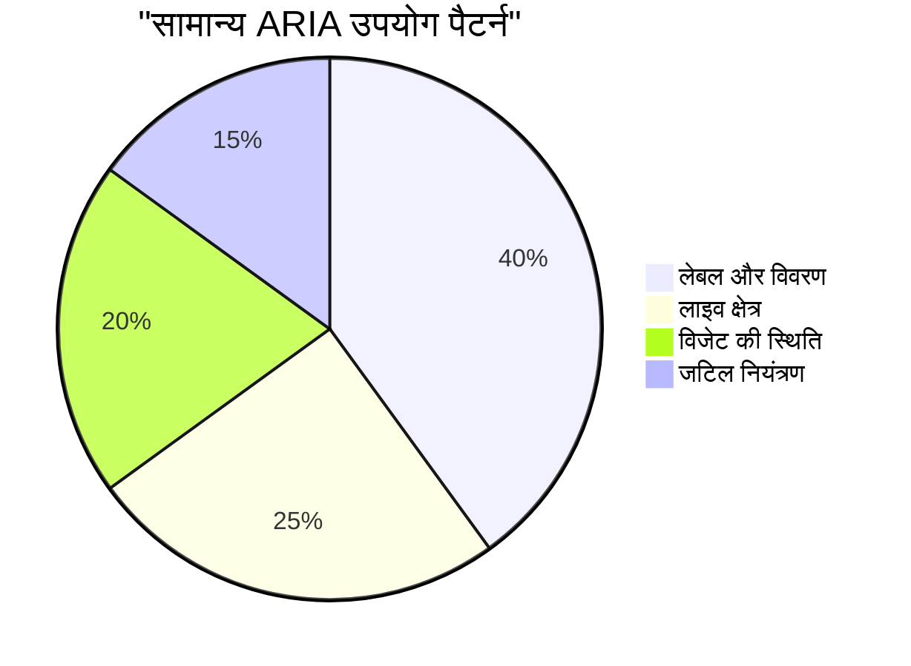
> **मुख्य अंतर्दृष्टि**: अधिकांश ARIA उपयोग लेबलिंग और तत्वों के वर्णन के लिए है। जटिल विजेट पैटर्न अपेक्षा से कहीं कम सामान्य हैं!

✅ **विशेषज्ञों से सीखें**: [ARIA Authoring Practices Guide](https://w3c.github.io/aria-practices/) पढ़ें, जिसमें जटिल इंटरैक्टिव विजेट्स के लिए परीक्षित पैटर्न और कार्यान्वयन हैं।

## छवियों और मीडिया को सुलभ बनाना

दृश्य और ऑडियो सामग्री आधुनिक वेब अनुभवों के आवश्यक हिस्से हैं, लेकिन यदि सोच-समझकर लागू न किए जाएं तो वे बाधाएँ उत्पन्न कर सकते हैं। लक्ष्य यह सुनिश्चित करना है कि आपकी मीडिया की जानकारी और भावनात्मक प्रभाव हर उपयोगकर्ता तक पहुंचे। एक बार जब आप इसे समझ जाते हैं, तो यह आपकी दूसरी प्रकृति बन जाती है।

विभिन्न प्रकार के मीडिया के लिए अलग-अलग एक्सेसिबिलिटी दृष्टिकोणों की आवश्यकता होती है। यह खाना पकाने जैसा है—आप नाजुक मछली को उसी तरह नहीं पकाएंगे जैसे एक भारी स्टेक को। इन भेदों को समझना आपको हर स्थिति के लिए सही समाधान चुनने में मदद करता है।

### रणनीतिक छवि पहुंच

आपकी वेबसाइट पर प्रत्येक छवि का एक उद्देश्य होता है। उस उद्देश्य को समझना बेहतर विकल्पात्मक पाठ लिखने और अधिक समावेशी अनुभव बनाने में मदद करता है।

**छवियों के चार प्रकार और उनके अल्ट टेक्स्ट रणनीतियाँ:**

**सूचनात्मक छवियाँ** - महत्वपूर्ण जानकारी प्रदान करती हैं:
```html

```

**सजावटी छवियाँ** - केवल दृश्यात्मक होती हैं, जिनमें कोई सूचना नहीं होती:
```html

```

**कार्यात्मक छवियाँ** - बटन या नियंत्रण के रूप में काम करती हैं:
```html
<button>
  
</button>
```

**जटिल छवियाँ** - चार्ट, आरेख, इन्फोग्राफिक्स:
```html

<div id="chart-description">
  <p>Detailed description: Sales data shows a steady increase across all quarters...</p>
</div>
```

### वीडियो और ऑडियो एक्सेसिबिलिटी

**वीडियो आवश्यकताएँ:**
- **कैप्शंस**: बोले गए सामग्री और ध्वनि प्रभाव का पाठ्य संस्करण
- **ऑडियो विवरण**: दृष्टिहीन उपयोगकर्ताओं के लिए दृश्य तत्वों का वर्णन
- **ट्रांस्क्रिप्ट्स**: सभी ऑडियो और दृश्य सामग्री का पूरा पाठ्य संस्करण

```html
<video controls>
  <source src="video.mp4" type="video/mp4">
  <track kind="captions" src="captions.vtt" srclang="en" label="English">
  <track kind="descriptions" src="descriptions.vtt" srclang="en" label="Audio descriptions">
</video>
```

**ऑडियो आवश्यकताएँ:**
- **ट्रांस्क्रिप्ट्स**: बोले गए सभी कंटेंट का टेक्स्ट संस्करण
- **दृश्य संकेत**: केवल ऑडियो सामग्री के लिए दृश्य सूचनाएँ प्रदान करें

### आधुनिक छवि तकनीकें

**सजावटी छवियों के लिए CSS का उपयोग:**
```css
.hero-section {
  background-image: url('decorative-hero.jpg');
  /* Decorative images in CSS don't need alt text */
}
```

**पहुंच के साथ उत्तरदायी छवियाँ:**
```html
<picture>
  <source media="(min-width: 800px)" srcset="large-chart.png">
  <source media="(min-width: 400px)" srcset="medium-chart.png">
  
</picture>
```

✅ **छवि एक्सेसिबिलिटी का परीक्षण करें**: एक स्क्रीन रीडर का उपयोग करके उस पेज को नेविगेट करें जिसमें छवियाँ हों। क्या आपको सामग्री को समझने के लिए पर्याप्त जानकारी मिल रही है?

## कीबोर्ड नेविगेशन और फोकस प्रबंधन

कई उपयोगकर्ता पूरी वेब नेविगेशन कीबोर्ड से करते हैं। इसमें मोटर विकलांगता वाले लोग, पावर यूजर्स जो माउस से तेज़ी से कीबोर्ड इस्तेमाल करते हैं, और कोई भी जिनका माउस काम करना बंद कर देता है शामिल हैं। यह सुनिश्चित करना कि आपकी साइट कीबोर्ड इनपुट के साथ अच्छी तरह काम करे, आवश्यक है और अक्सर आपकी साइट को सभी उपयोगकर्ताओं के लिए अधिक प्रभावी बनाता है।

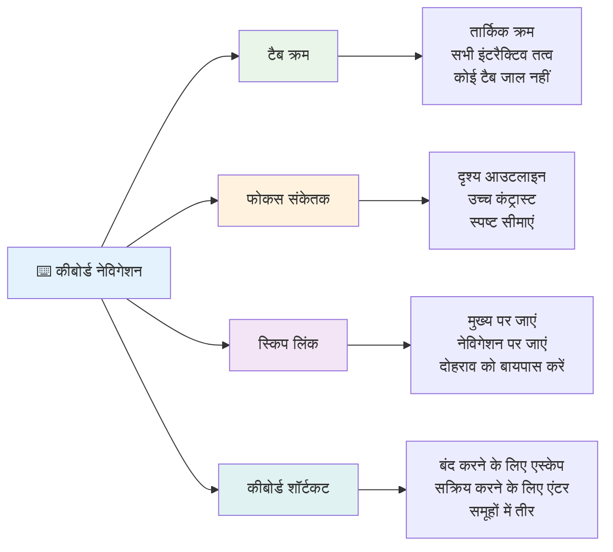
### आवश्यक कीबोर्ड नेविगेशन पैटर्न

**मापदंड कीबोर्ड इंटरैक्शन:**
- **Tab**: इंटरैक्टिव तत्वों के बीच फोकस आगे बढ़ाएँ
- **Shift + Tab**: फोकस पीछे ले जाएँ
- **Enter**: बटन और लिंक सक्रिय करें
- **Space**: बटन सक्रिय करें, चेकबॉक्स जांचें
- **एरो कीज़**: कंपोनेंट समूहों (रेडियो बटन, मेनू) के भीतर नेविगेट करें
- **Escape**: मोडल, ड्रॉपडाउन बंद करें या ऑपरेशन रद्द करें

### फोकस प्रबंधन के सर्वोत्तम अभ्यास

**दृश्यमान फोकस संकेत:**
```css
/* Ensure focus is always visible */
button:focus-visible {
  outline: 2px solid #4A90A4;
  outline-offset: 2px;
}

/* Custom focus styles for different components */
.card:focus-within {
  box-shadow: 0 0 0 3px rgba(74, 144, 164, 0.5);
}
```

**कुशल नेविगेशन के लिए स्किप लिंक:**
```html
<a href="#main-content" class="skip-link">Skip to main content</a>
<a href="#navigation" class="skip-link">Skip to navigation</a>

<nav id="navigation">
  <!-- navigation content -->
</nav>
<main id="main-content">
  <!-- main content -->
</main>
```

**सही टैब क्रम:**
```html
<!-- Use semantic HTML for natural tab order -->
<form>
  <label for="name">Name:</label>
  <input type="text" id="name" tabindex="0">
  
  <label for="email">Email:</label>
  <input type="email" id="email" tabindex="0">
  
  <button type="submit" tabindex="0">Submit</button>
</form>
```

### मोडल में फोकस ट्रैपिंग

मोडल संवाद खोलने पर, फोकस मोडल के भीतर फंसा होना चाहिए:

```javascript
// आधुनिक फोकस ट्रैप कार्यान्वयन
function trapFocus(element) {
  const focusableElements = element.querySelectorAll(
    'button, [href], input, select, textarea, [tabindex]:not([tabindex="-1"])'
  );
  
  const firstElement = focusableElements[0];
  const lastElement = focusableElements[focusableElements.length - 1];

  element.addEventListener('keydown', (e) => {
    if (e.key === 'Tab') {
      if (e.shiftKey && document.activeElement === firstElement) {
        e.preventDefault();
        lastElement.focus();
      } else if (!e.shiftKey && document.activeElement === lastElement) {
        e.preventDefault();
        firstElement.focus();
      }
    }
    
    if (e.key === 'Escape') {
      closeModal();
    }
  });
  
  // जब मोडल खुलता है तो पहले तत्व पर फोकस करें
  firstElement.focus();
}
```

✅ **कीबोर्ड नेविगेशन का परीक्षण करें**: केवल Tab कुंजी का उपयोग करके अपनी वेबसाइट नेविगेट करें। क्या आप सभी इंटरैक्टिव तत्वों तक पहुंच पा रहे हैं? क्या फोकस क्रम तार्किक है? क्या फोकस संकेत स्पष्ट रूप से दिखाई देते हैं?

## फॉर्म एक्सेसिबिलिटी

फॉर्म उपयोगकर्ता इंटरैक्शन के लिए महत्वपूर्ण हैं और एक्सेसिबिलिटी के लिए विशेष ध्यान आवश्यक है।

### लेबल और फॉर्म कंट्रोल का संबंध

**प्रत्येक फॉर्म कंट्रोल को एक लेबल चाहिए:**
```html
<!-- Explicit labeling (preferred) -->
<label for="username">Username:</label>
<input type="text" id="username" name="username" required>

<!-- Implicit labeling -->
<label>
  Password:
  <input type="password" name="password" required>
</label>

<!-- Using aria-label when visual label isn't desired -->
<input type="search" aria-label="Search products" placeholder="Search...">
```

### त्रुटि प्रबंधन और मान्यता

**सुलभ त्रुटि संदेश:**
```html
<label for="email">Email Address:</label>
<input type="email" id="email" name="email" 
       aria-describedby="email-error" 
       aria-invalid="true" required>
<div id="email-error" role="alert">
  Please enter a valid email address
</div>
```

**फॉर्म मान्यता के सर्वोत्तम अभ्यास:**
- अमान्य फ़ील्ड को दर्शाने के लिए `aria-invalid` का उपयोग करें
- स्पष्ट, विशिष्ट त्रुटि संदेश प्रदान करें
- महत्वपूर्ण त्रुटि घोषणाओं के लिए `role="alert"` का उपयोग करें
- त्रुटियाँ तुरंत और फॉर्म जमा करने पर दोनों दिखाएँ

### फील्डसेट और समूहबद्ध करना

**संबंधित फॉर्म नियंत्रणों को समूहित करें:**
```html
<fieldset>
  <legend>Shipping Address</legend>
  <label for="street">Street Address:</label>
  <input type="text" id="street" name="street">
  
  <label for="city">City:</label>
  <input type="text" id="city" name="city">
</fieldset>

<fieldset>
  <legend>Preferred Contact Method</legend>
  <input type="radio" id="contact-email" name="contact" value="email">
  <label for="contact-email">Email</label>
  
  <input type="radio" id="contact-phone" name="contact" value="phone">
  <label for="contact-phone">Phone</label>
</fieldset>
```

## आपकी एक्सेसिबिलिटी यात्रा: मुख्य बातें

बधाई हो! आपने वाकई समावेशी वेब अनुभव बनाने का आधारभूत ज्ञान प्राप्त कर लिया है। यह बहुत ही रोमांचक है! वेब एक्सेसिबिलिटी केवल पालन नियमों की जाँच के बारे में नहीं है—यह डिजिटल सामग्री के साथ लोगों की विविध बातचीत की समझ के बारे में है और इस अद्भुत जटिलता के लिए डिज़ाइन करने के बारे में है।

अब आप उस बढ़ती हुई डेवलपर्स समुदाय का हिस्सा हैं जो समझते हैं कि महान डिज़ाइन सभी के लिए काम करता है। क्लब में आपका स्वागत है!

**🎯 आपकी एक्सेसिबिलिटी टूलकिट अब शामिल है:**

| मूल सिद्धांत | कार्यान्वयन | प्रभाव |
|----------------|----------------|---------|
| **सेमांटिक HTML आधार** | उचित HTML तत्वों का उनके उद्देश्य के लिए उपयोग | स्क्रीन रीडर सहजता से नेविगेट कर सकते हैं, कीबोर्ड स्वतः कार्य करते हैं |
| **समावेशी दृश्य डिज़ाइन** | पर्याप्त कंट्रास्ट, सार्थक रंग उपयोग, दृश्यमान फोकस संकेत | किसी भी प्रकाश व्यवस्था में सभी के लिए स्पष्ट |
| **वर्णनात्मक सामग्री** | सार्थक लिंक टेक्स्ट, अल्ट टेक्स्ट, हेडिंग्स | उपयोगकर्ता बिना दृश्य संदर्भ के सामग्री समझते हैं |
| **कीबोर्ड एक्सेसिबिलिटी** | टैब क्रम, कीबोर्ड शॉर्टकट, फोकस प्रबंधन | मोटर एक्सेसिबिलिटी और पावर उपयोगकर्ता प्रभावशीलता |
| **ARIA संवर्धन** | सेमांटिक रिक्त स्थान भरने के लिए रणनीतिक उपयोग | जटिल ऐप्लिकेशन सहायक तकनीकों के साथ काम करते हैं |
| **समग्र परीक्षण** | स्वचालित उपकरण + मैनुअल सत्यापन + वास्तविक उपयोगकर्ता परीक्षण | उपयोगकर्ताओं पर प्रभाव डालने से पहले मुद्दों को पकड़ना |

**🚀 आपके अगले कदम:**

1. **अपने वर्कफ़्लो में एक्सेसिबिलिटी शामिल करें**: परीक्षण को आपकी विकास प्रक्रिया का प्राकृतिक हिस्सा बनाएं
2. **वास्तविक उपयोगकर्ताओं से सीखें**: सहायक तकनीकों का उपयोग करने वाले लोगों से प्रतिक्रिया मांगें
3. **अप-टू-डेट रहें**: नई तकनीकों और मानकों के साथ एक्सेसिबिलिटी तकनीक विकसित होती रहती है
4. **समावेशन के लिए वकालत करें**: अपना ज्ञान साझा करें और एक्सेसिबिलिटी को टीम की प्राथमिकता बनाएं

> 💡 **याद रखें**: एक्सेसिबिलिटी प्रतिबंध अक्सर अभिनव, सुरुचिपूर्ण समाधानों को जन्म देते हैं जो सभी के लाभ में होते हैं। कर्ब कट्स, कैप्शंस और आवाज नियंत्रण सभी एक्सेसिबिलिटी विशेषताओं के रूप में शुरू हुए और बाद में मुख्यधारा में शामिल हुए।

**व्यावसायिक मामला स्पष्ट है**: सुलभ वेबसाइट्स अधिक उपयोगकर्ताओं तक पहुंचती हैं, खोज इंजनों में बेहतर रैंक करती हैं, रखरखाव लागत कम होती है, और कानूनी जोखिमों से बचती हैं। लेकिन सच कहें तो? एक्सेसिबिलिटी की परवाह करने का असली कारण इससे कहीं गहरा है। सुलभ वेबसाइट्स वेब के सर्वोत्तम मूल्यों का प्रतिनिधित्व करती हैं— openness, समावेशन, और विचार कि हर किसी को सूचना का समान अधिकार मिलना चाहिए।

अब आप भविष्य की समावेशी वेब बनाने के लिए सक्षम हैं। हर सुलभ साइट जो आप बनाते हैं, इंटरनेट को सभी के लिए अधिक स्वागतशील स्थान बनाता है। यह सोचने पर वास्तव में अद्भुत है!

## अतिरिक्त संसाधन

अपनी एक्सेसिबिलिटी सीखने की यात्रा को इन आवश्यक संसाधनों के साथ जारी रखें:

**📚 आधिकारिक मानक और दिशा-निर्देश:**
- [WCAG 2.1 Guidelines](https://www.w3.org/WAI/WCAG21/quickref/) - आधिकारिक एक्सेसिबिलिटी मानक के त्वरित संदर्भ के साथ
- [ARIA Authoring Practices Guide](https://w3c.github.io/aria-practices/) - इंटरैक्टिव विजेट्स के लिए व्यापक पैटर्न
- [WebAIM Guidelines](https://webaim.org/) - व्यावहारिक, शुरुआती के अनुकूल एक्सेसिबिलिटी मार्गदर्शन

**🛠️ टूल्स और परीक्षण संसाधन:**
- [axe DevTools](https://www.deque.com/axe/devtools/) - उद्योग मानक एक्सेसिबिलिटी परीक्षण
- [A11y Project Checklist](https://www.a11yproject.com/checklist/) - चरण-दर-चरण एक्सेसिबिलिटी सत्यापन
- [Accessibility Insights](https://accessibilityinsights.io/) - Microsoft का व्यापक परीक्षण सूट
- [Color Oracle](https://colororacle.org/) - डिजाइन परीक्षण के लिए रंग अंधता सिम्युलेटर

**🎓 सीखना और समुदाय:**
- [WebAIM Screen Reader Survey](https://webaim.org/projects/screenreadersurvey9/) - वास्तविक उपयोगकर्ता की पसंद और व्यवहार
- [Inclusive Components](https://inclusive-components.design/) - आधुनिक सुलभ कंपोनेंट पैटर्न
- [A11y Coffee](https://a11y.coffee/) - त्वरित एक्सेसिबिलिटी सुझाव और अंतर्दृष्टि
- [Web Accessibility Initiative (WAI)](https://www.w3.org/WAI/) - W3C के व्यापक एक्सेसिबिलिटी संसाधन

**🎥 व्यावहारिक सीखना:**
- [Accessibility Developer Guide](https://www.accessibility-developer-guide.com/) - व्यावहारिक कार्यान्वयन मार्गदर्शन
- [Deque University](https://dequeuniversity.com/) - पेशेवर एक्सेसिबिलिटी प्रशिक्षण कोर्स

## GitHub Copilot एजेंट चैलेंज 🚀

एजेंट मोड का उपयोग करके निम्नलिखित चुनौती पूरी करें:

**विवरण:** एक सुलभ मोडल डायलॉग कंपोनेंट बनाएं जो उचित फोकस प्रबंधन, ARIA गुण, और कीबोर्ड नेविगेशन पैटर्न प्रदर्शित करता हो।

**प्रॉम्प्ट:** HTML, CSS, और JavaScript के साथ एक पूर्ण मोडल डायलॉग कंपोनेंट बनाएँ जिसमें शामिल हों: उचित फोकस ट्रैपिंग, ESC कुंजी से बंद करना, बाहर क्लिक पर बंद करना, स्क्रीन रीडर के लिए ARIA गुण, और दृष्टिगोचर फोकस संकेत। मोडल में उचित लेबल और त्रुटि प्रबंधन के साथ एक फॉर्म होना चाहिए। सुनिश्चित करें कि कंपोनेंट WCAG 2.1 AA मानकों को पूरा करता है।

## 🚀 चुनौती

इस HTML को लें और इसे आपकी सीखी गई रणनीतियों के अनुसार यथासंभव सुलभ बनाने के लिए पुनर्लेखन करें।

```html
<!DOCTYPE html>
<html lang="en">
  <head>
    <meta charset="UTF-8">
    <meta name="viewport" content="width=device-width, initial-scale=1.0">
    <title>Turtle Ipsum - The World's Premier Turtle Fan Club</title>
    <link href='../assets/style.css' rel='stylesheet' type='text/css'>
  </head>
  <body>
    <header class="site-header">
      <h1 class="site-title">Turtle Ipsum</h1>
      <p class="site-subtitle">The World's Premier Turtle Fan Club</p>
    </header>
    
    <nav class="main-nav" aria-label="Main navigation">
      <h2 class="nav-header">Resources</h2>
      <ul class="nav-list">
        <li><a href="https://www.youtube.com/watch?v=CMNry4PE93Y">"I like turtles" video</a></li>
        <li><a href="https://en.wikipedia.org/wiki/Turtle">Basic turtle information</a></li>
        <li><a href="https://en.wikipedia.org/wiki/Turtles_(chocolate)">Chocolate turtles candy</a></li>
      </ul>
    </nav>
    
    <main class="main-content">
      <article>
        <h1>Welcome to Turtle Ipsum</h1>
        <p class="intro">
          <a href="/about">Learn more about our turtle community</a> and discover fascinating facts about these amazing creatures.
        </p>
        <p class="article-text">
          Turtle ipsum dolor sit amet, consectetur adipiscing elit, sed do eiusmod tempor incididunt ut labore et dolore magna aliqua. Ut enim ad minim veniam, quis nostrud exercitation ullamco laboris nisi ut aliquip ex ea commodo consequat. Duis aute irure dolor in reprehenderit in voluptate velit esse cillum dolore eu fugiat nulla pariatur. Excepteur sint occaecat cupidatat non proident, sunt in culpa qui officia deserunt mollit anim id est laborum.
        </p>
      </article>
    </main>
    
    <footer class="footer">
      <section class="newsletter-signup">
        <h2>Stay Updated</h2>
        <button type="button" onclick="showNewsletterForm()">Sign up for turtle news</button>
      </section>
      
      <nav class="footer-nav" aria-label="Footer navigation">
        <h2>Site Pages</h2>
        <ul>
          <li><a href="../">Home</a></li>
          <li><a href="../semantic">Semantic HTML example</a></li>
        </ul>
      </nav>
      
      <p class="footer-copyright">&copy; 2024 Instrument. All rights reserved.</p>
    </footer>
  </body>
</html>
```

**मुख्य सुधार जिनकी गई:**
- उचित सेमांटिक HTML संरचना जोड़ी गई
- हेडिंग पदानुक्रम ठीक किया (सिर्फ एक h1, तार्किक प्रगति)
- "click here" के स्थान पर सार्थक लिंक टेक्स्ट जोड़ा
- नेविगेशन के लिए उचित ARIA लेबल शामिल किए
- lang एट्रिब्यूट और उचित मेटा टैग्स जोड़े गए
- इंटरैक्टिव तत्वों के लिए बटन एलिमेंट का उपयोग किया गया
- उचित लैंडमार्क्स के साथ फुटर सामग्री संरचित की गई

## पोस्ट-लेक्चर क्विज़
[Post-lecture quiz](https://ff-quizzes.netlify.app/web/en/)

## समीक्षा और स्व-अध्ययन

कई सरकारों के पास एक्सेसिबिलिटी आवश्यकताओं को लेकर कानून होते हैं। अपने गृह देश के एक्सेसिबिलिटी कानूनों के बारे में पढ़ें। क्या शामिल है, क्या नहीं? एक उदाहरण है [यह सरकारी वेब साइट](https://accessibility.blog.gov.uk/)।

## असाइनमेंट
 
[असुलभ वेबसाइट का विश्लेषण करें](assignment.md)

क्रेडिट: [Turtle Ipsum](https://github.com/Instrument/semantic-html-sample) द्वारा Instrument

---

## 🚀 आपकी एक्सेसिबिलिटी महारत समयरेखा

### ⚡ **अगले 5 मिनट में आप क्या कर सकते हैं**
- [ ] अपने ब्राउज़र में axe DevTools एक्सटेंशन इंस्टॉल करें
- [ ] अपनी पसंदीदा वेबसाइट पर Lighthouse एक्सेसिबिलिटी ऑडिट चलाएँ
- [ ] किसी भी वेबसाइट को केवल Tab कुंजी से नेविगेट करने का प्रयास करें
- [ ] अपने ब्राउज़र के बिल्ट-इन स्क्रीन रीडर (Narrator/VoiceOver) का परीक्षण करें

### 🎯 **इस घंटे में आप क्या हासिल कर सकते हैं**
- [ ] पोस्ट-लेसन क्विज़ पूरा करें और एक्सेसिबिलिटी अंतर्दृष्टि पर विचार करें
- [ ] 10 विभिन्न छवियों के लिए सार्थक अल्ट टेक्स्ट लिखने का अभ्यास करें
- [ ] HeadingsMap एक्सटेंशन का उपयोग करके वेबसाइट की हेडिंग संरचना का ऑडिट करें
- [ ] चुनौती HTML में पाए गए एक्सेसिबिलिटी मुद्दों को ठीक करें
- [ ] WebAIM के टूल के साथ अपने वर्तमान प्रोजेक्ट पर रंग कंट्रास्ट का परीक्षण करें

### 📅 **आपकी एक सप्ताह की एक्सेसिबिलिटी यात्रा**
- [ ] असाइनमेंट पूरा करें जिसमें असुलभ वेबसाइट का विश्लेषण करें
- [ ] एक्सेसिबिलिटी परीक्षण टूल्स के साथ अपना विकास वातावरण सेट करें
- [ ] 5 अलग-अलग जटिल वेबसाइटों पर कीबोर्ड नेविगेशन का अभ्यास करें
- [ ] उचित लेबल, त्रुटि प्रबंधन, और ARIA के साथ एक सरल फॉर्म बनाएं
- [ ] एक एक्सेसिबिलिटी समुदाय में शामिल हों (A11y Slack, WebAIM फोरम)
- [ ] विकलांग उपयोगकर्ताओं को वेबसाइटों को नेविगेट करते हुए देखें (YouTube पर उत्कृष्ट उदाहरण हैं)

### 🌟 **आपका महीने भर का परिवर्तन**
- [ ] अपने विकास कार्यप्रवाह में एक्सेसिबिलिटी परीक्षण को एकीकृत करें
- [ ] एक्सेसिबिलिटी मुद्दों को ठीक करके किसी ओपन सोर्स प्रोजेक्ट में योगदान दें
- [ ] ऐसे व्यक्ति के साथ उपयोगिता परीक्षण करें जो सहायक तकनीक का उपयोग करता हो
- [ ] अपनी टीम के लिए एक एक्सेसिबल कंपोनेंट लाइब्रेरी बनाएं
- [ ] अपने कार्यस्थल या समुदाय में एक्सेसिबिलिटी का समर्थन करें
- [ ] एक्सेसिबिलिटी अवधारणाओं के नए व्यक्ति को मार्गदर्शन दें

### 🏆 **अंतिम एक्सेसिबिलिटी चैंपियन चेक-इन**

**अपने एक्सेसिबिलिटी सफर का जश्न मनाएं:**
- आपने यह जानकर सबसे हैरानी वाली बात क्या सीखी कि लोग वेब का उपयोग कैसे करते हैं?
- कौन सा एक्सेसिबिलिटी सिद्धांत आपके विकास शैली से सबसे अधिक मेल खाता है?
- एक्सेसिबिलिटी के बारे में सीखने से आपकी डिजाइन परिप्रेक्ष्य कैसे बदला है?
- आप सबसे पहले किस वास्तविक प्रोजेक्ट पर एक्सेसिबिलिटी सुधार करना चाहेंगे?

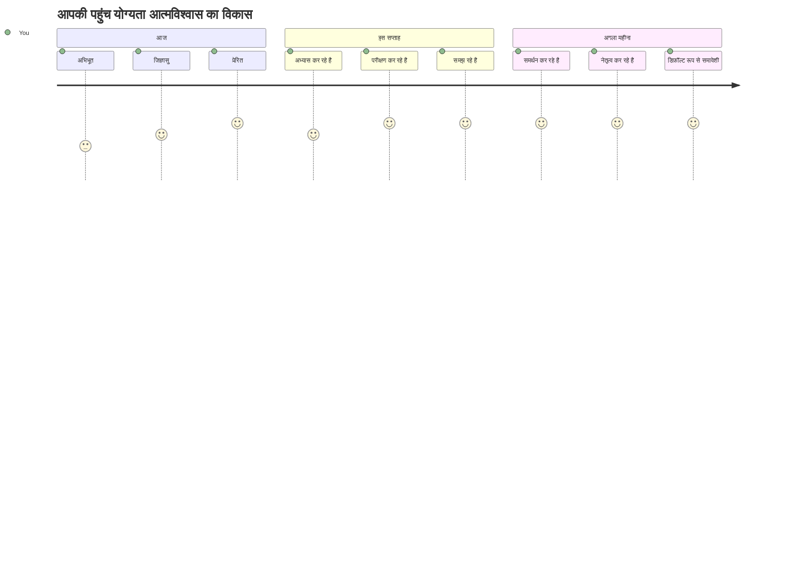
> 🌍 **आप अब एक एक्सेसिबिलिटी चैंपियन हैं!** आप समझते हैं कि बेहतरीन वेब अनुभव हर किसी के लिए काम करते हैं, चाहे वे वेब तक कैसे भी पहुंचें। आप जो भी एक्सेसिबल फीचर बनाते हैं, वह इंटरनेट को अधिक समावेशी बनाता है। वेब को आपकी तरह के डेवलपर्स की जरूरत है जो एक्सेसिबिलिटी को प्रतिबंध के रूप में नहीं बल्कि सभी उपयोगकर्ताओं के लिए बेहतर अनुभव बनाने के अवसर के रूप में देखते हैं। आंदोलन में आपका स्वागत है! 🎉

---

<!-- CO-OP TRANSLATOR DISCLAIMER START -->
**अस्वीकरण**:
यह दस्तावेज़ AI अनुवाद सेवा [Co-op Translator](https://github.com/Azure/co-op-translator) का उपयोग करके अनुवादित किया गया है। जबकि हम सटीकता के लिए प्रयासरत हैं, कृपया ध्यान दें कि स्वचालित अनुवाद में त्रुटियाँ या असंगतियाँ हो सकती हैं। मूल दस्तावेज़ अपनी मूल भाषा में प्रामाणिक स्रोत माना जाना चाहिए। महत्वपूर्ण जानकारी के लिए, पेशेवर मानव अनुवाद की सिफारिश की जाती है। इस अनुवाद के उपयोग से उत्पन्न किसी भी गलतफहमी या गलत व्याख्या के लिए हम उत्तरदायी नहीं हैं।
<!-- CO-OP TRANSLATOR DISCLAIMER END -->