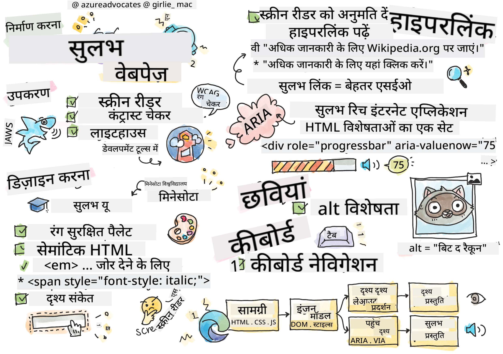

<!--
CO_OP_TRANSLATOR_METADATA:
{
  "original_hash": "f0c88c3e2cefa8952d356f802b1e47ca",
  "translation_date": "2025-08-29T16:04:16+00:00",
  "source_file": "1-getting-started-lessons/3-accessibility/README.md",
  "language_code": "hi"
}
-->
# वेबपेज को सुलभ बनाना


> स्केच नोट [Tomomi Imura](https://twitter.com/girlie_mac) द्वारा

## प्री-लेक्चर क्विज़
[प्री-लेक्चर क्विज़](https://ff-quizzes.netlify.app/web/)

> वेब की शक्ति इसकी सार्वभौमिकता में है। विकलांगता की परवाह किए बिना सभी के लिए पहुंच एक आवश्यक पहलू है।
>
> \- सर टिमोथी बर्नर्स-ली, W3C निदेशक और वर्ल्ड वाइड वेब के आविष्कारक

यह उद्धरण सुलभ वेबसाइट बनाने के महत्व को पूरी तरह से उजागर करता है। एक ऐसा एप्लिकेशन जिसे सभी द्वारा एक्सेस नहीं किया जा सकता है, वह स्वाभाविक रूप से बहिष्कृत है। एक वेब डेवलपर के रूप में हमें हमेशा सुलभता को ध्यान में रखना चाहिए। शुरुआत से ही इस पर ध्यान केंद्रित करके, आप यह सुनिश्चित करने की दिशा में सही कदम उठाएंगे कि हर कोई आपके द्वारा बनाए गए पेजों तक पहुंच सके। इस पाठ में, आप उन उपकरणों के बारे में जानेंगे जो यह सुनिश्चित करने में आपकी मदद कर सकते हैं कि आपके वेब संसाधन सुलभ हैं और सुलभता को ध्यान में रखते हुए निर्माण कैसे करें।

> आप इस पाठ को [Microsoft Learn](https://docs.microsoft.com/learn/modules/web-development-101/accessibility/?WT.mc_id=academic-77807-sagibbon) पर ले सकते हैं!

## उपयोग करने के लिए उपकरण

### स्क्रीन रीडर

सबसे प्रसिद्ध सुलभता उपकरणों में से एक स्क्रीन रीडर हैं।

[स्क्रीन रीडर](https://en.wikipedia.org/wiki/Screen_reader) आमतौर पर दृष्टि बाधित लोगों द्वारा उपयोग किए जाते हैं। जैसे हम यह सुनिश्चित करने में समय लगाते हैं कि ब्राउज़र वह जानकारी सही ढंग से प्रस्तुत करता है जिसे हम साझा करना चाहते हैं, हमें यह भी सुनिश्चित करना चाहिए कि स्क्रीन रीडर भी ऐसा ही करे।

सबसे बुनियादी स्तर पर, स्क्रीन रीडर एक पेज को ऊपर से नीचे तक सुनने योग्य रूप में पढ़ता है। यदि आपका पेज केवल टेक्स्ट है, तो रीडर ब्राउज़र के समान तरीके से जानकारी प्रस्तुत करेगा। हालांकि, वेब पेज शायद ही कभी केवल टेक्स्ट होते हैं; उनमें लिंक, ग्राफिक्स, रंग और अन्य दृश्य घटक होते हैं। यह सुनिश्चित करने के लिए सावधानी बरतनी चाहिए कि स्क्रीन रीडर द्वारा इस जानकारी को सही ढंग से पढ़ा जाए।

हर वेब डेवलपर को स्क्रीन रीडर से परिचित होना चाहिए। जैसा कि ऊपर बताया गया है, यह आपके उपयोगकर्ताओं द्वारा उपयोग किया जाने वाला क्लाइंट है। जिस तरह आप ब्राउज़र के संचालन से परिचित हैं, उसी तरह आपको स्क्रीन रीडर के संचालन से भी परिचित होना चाहिए। सौभाग्य से, अधिकांश ऑपरेटिंग सिस्टम में स्क्रीन रीडर अंतर्निहित होते हैं।

कुछ ब्राउज़र में अंतर्निहित उपकरण और एक्सटेंशन भी होते हैं जो टेक्स्ट को जोर से पढ़ सकते हैं या कुछ बुनियादी नेविगेशन सुविधाएँ प्रदान कर सकते हैं, जैसे [Edge ब्राउज़र के ये सुलभता-केंद्रित उपकरण](https://support.microsoft.com/help/4000734/microsoft-edge-accessibility-features)। ये भी महत्वपूर्ण सुलभता उपकरण हैं, लेकिन स्क्रीन रीडर परीक्षण उपकरणों के रूप में इन्हें भ्रमित नहीं किया जाना चाहिए।

✅ स्क्रीन रीडर और ब्राउज़र टेक्स्ट रीडर आज़माएं। Windows पर [Narrator](https://support.microsoft.com/windows/complete-guide-to-narrator-e4397a0d-ef4f-b386-d8ae-c172f109bdb1/?WT.mc_id=academic-77807-sagibbon) डिफ़ॉल्ट रूप से शामिल है, और [JAWS](https://webaim.org/articles/jaws/) और [NVDA](https://www.nvaccess.org/about-nvda/) को भी इंस्टॉल किया जा सकता है। macOS और iOS पर, [VoiceOver](https://support.apple.com/guide/voiceover/welcome/10) डिफ़ॉल्ट रूप से इंस्टॉल होता है।

### ज़ूम

दृष्टि बाधित लोगों द्वारा उपयोग किए जाने वाले एक अन्य उपकरण ज़ूमिंग है। ज़ूमिंग का सबसे बुनियादी प्रकार स्थिर ज़ूम है, जिसे `Control + प्लस साइन (+)` या स्क्रीन रिज़ॉल्यूशन को कम करके नियंत्रित किया जाता है। इस प्रकार का ज़ूम पूरे पेज को पुन: आकार देता है, इसलिए [उत्तरदायी डिज़ाइन](https://developer.mozilla.org/docs/Learn/CSS/CSS_layout/Responsive_Design) का उपयोग करना बढ़े हुए ज़ूम स्तरों पर अच्छा उपयोगकर्ता अनुभव प्रदान करने के लिए महत्वपूर्ण है।

ज़ूमिंग का एक अन्य प्रकार विशेष सॉफ़्टवेयर पर निर्भर करता है जो स्क्रीन के एक क्षेत्र को बड़ा करता है और पैन करता है, जैसे कि वास्तविक आवर्धक कांच का उपयोग करना। Windows पर, [Magnifier](https://support.microsoft.com/windows/use-magnifier-to-make-things-on-the-screen-easier-to-see-414948ba-8b1c-d3bd-8615-0e5e32204198) अंतर्निहित है, और [ZoomText](https://www.freedomscientific.com/training/zoomtext/getting-started/) एक तृतीय-पक्ष आवर्धन सॉफ़्टवेयर है जिसमें अधिक सुविधाएँ और बड़ा उपयोगकर्ता आधार है। macOS और iOS दोनों में [Zoom](https://www.apple.com/accessibility/mac/vision/) नामक अंतर्निहित आवर्धन सॉफ़्टवेयर है।

### कंट्रास्ट चेकर

वेबसाइटों पर रंगों का चयन सावधानीपूर्वक किया जाना चाहिए ताकि रंग-अंधता वाले उपयोगकर्ताओं या कम-कंट्रास्ट रंगों को देखने में कठिनाई वाले लोगों की ज़रूरतों को पूरा किया जा सके।

✅ किसी ब्राउज़र एक्सटेंशन जैसे [WCAG का रंग चेकर](https://microsoftedge.microsoft.com/addons/detail/wcag-color-contrast-check/idahaggnlnekelhgplklhfpchbfdmkjp?hl=en-US&WT.mc_id=academic-77807-sagibbon) का उपयोग करके किसी वेबसाइट का रंग उपयोग परीक्षण करें। आप क्या सीखते हैं?

### लाइटहाउस

आपके ब्राउज़र के डेवलपर टूल क्षेत्र में, आपको लाइटहाउस टूल मिलेगा। यह टूल किसी वेबसाइट की सुलभता (साथ ही अन्य विश्लेषण) का पहला दृश्य प्राप्त करने के लिए महत्वपूर्ण है। जबकि केवल लाइटहाउस पर निर्भर रहना महत्वपूर्ण नहीं है, 100% स्कोर एक उपयोगी आधार रेखा है।

✅ अपने ब्राउज़र के डेवलपर टूल पैनल में लाइटहाउस खोजें और किसी भी साइट पर विश्लेषण चलाएं। आप क्या खोजते हैं?

## सुलभता के लिए डिज़ाइन करना

सुलभता एक अपेक्षाकृत बड़ा विषय है। आपकी मदद करने के लिए, कई संसाधन उपलब्ध हैं।

- [Accessible U - University of Minnesota](https://accessibility.umn.edu/your-role/web-developers)

हालांकि हम सुलभ साइट बनाने के हर पहलू को कवर नहीं कर पाएंगे, नीचे कुछ मुख्य सिद्धांत दिए गए हैं जिन्हें आप लागू करना चाहेंगे। शुरुआत से ही सुलभ पेज डिज़ाइन करना **हमेशा** मौजूदा पेज को सुलभ बनाने की तुलना में आसान होता है।

## अच्छे प्रदर्शन सिद्धांत

### रंग सुरक्षित पैलेट

लोग दुनिया को अलग-अलग तरीकों से देखते हैं, और इसमें रंग भी शामिल हैं। अपनी साइट के लिए रंग योजना का चयन करते समय, आपको यह सुनिश्चित करना चाहिए कि यह सभी के लिए सुलभ हो। [रंग पैलेट बनाने के लिए एक शानदार टूल Color Safe](http://colorsafe.co/) है।

✅ ऐसी वेबसाइट की पहचान करें जो रंगों के उपयोग में बहुत समस्याग्रस्त हो। क्यों?

### सही HTML का उपयोग करें

CSS और JavaScript के साथ, किसी भी तत्व को किसी भी प्रकार के नियंत्रण जैसा दिखाना संभव है। `<span>` का उपयोग `<button>` बनाने के लिए किया जा सकता है, और `<b>` हाइपरलिंक बन सकता है। हालांकि इसे स्टाइल करना आसान माना जा सकता है, यह स्क्रीन रीडर को कुछ भी नहीं बताता। पेज पर नियंत्रण बनाते समय उपयुक्त HTML का उपयोग करें। यदि आप हाइपरलिंक चाहते हैं, तो `<a>` का उपयोग करें। सही नियंत्रण के लिए सही HTML का उपयोग करना सेमांटिक HTML का उपयोग करना कहलाता है।

✅ किसी भी वेबसाइट पर जाएं और देखें कि क्या डिज़ाइनर और डेवलपर्स HTML का सही उपयोग कर रहे हैं। क्या आप ऐसा बटन ढूंढ सकते हैं जिसे लिंक होना चाहिए? संकेत: अपने ब्राउज़र में 'View Page Source' चुनने के लिए राइट क्लिक करें और अंतर्निहित कोड देखें।

### वर्णनात्मक शीर्षक पदानुक्रम बनाएं

स्क्रीन रीडर उपयोगकर्ता [शीर्षकों पर बहुत अधिक निर्भर करते हैं](https://webaim.org/projects/screenreadersurvey8/#finding) जानकारी खोजने और पेज पर नेविगेट करने के लिए। वर्णनात्मक शीर्षक सामग्री लिखना और सेमांटिक शीर्षक टैग का उपयोग करना स्क्रीन रीडर उपयोगकर्ताओं के लिए आसानी से नेविगेट करने योग्य साइट बनाने के लिए महत्वपूर्ण है।

### अच्छे दृश्य संकेतों का उपयोग करें

CSS पेज पर किसी भी तत्व के रूप को पूरी तरह से नियंत्रित करने की पेशकश करता है। आप बिना आउटलाइन वाले टेक्स्ट बॉक्स या बिना अंडरलाइन वाले हाइपरलिंक बना सकते हैं। दुर्भाग्य से, इन संकेतों को हटाने से किसी ऐसे व्यक्ति के लिए इसे पहचानना अधिक चुनौतीपूर्ण हो सकता है जो उन पर निर्भर करता है।

## लिंक टेक्स्ट का महत्व

हाइपरलिंक वेब पर नेविगेट करने के लिए मुख्य हैं। परिणामस्वरूप, यह सुनिश्चित करना कि स्क्रीन रीडर लिंक को सही ढंग से पढ़ सके, सभी उपयोगकर्ताओं को आपकी साइट पर नेविगेट करने की अनुमति देता है।

### स्क्रीन रीडर और लिंक

जैसा कि आप उम्मीद करेंगे, स्क्रीन रीडर लिंक टेक्स्ट को उसी तरह पढ़ते हैं जैसे वे पेज पर किसी अन्य टेक्स्ट को पढ़ते हैं। इसे ध्यान में रखते हुए, नीचे दिखाया गया टेक्स्ट पूरी तरह से स्वीकार्य लग सकता है।

> छोटा पेंगुइन, जिसे कभी-कभी परी पेंगुइन के रूप में जाना जाता है, दुनिया का सबसे छोटा पेंगुइन है। [यहां क्लिक करें](https://en.wikipedia.org/wiki/Little_penguin) अधिक जानकारी के लिए।

> छोटा पेंगुइन, जिसे कभी-कभी परी पेंगुइन के रूप में जाना जाता है, दुनिया का सबसे छोटा पेंगुइन है। अधिक जानकारी के लिए https://en.wikipedia.org/wiki/Little_penguin पर जाएं।

> **NOTE** जैसा कि आप पढ़ने वाले हैं, आपको **कभी भी** ऊपर जैसा लिंक नहीं बनाना चाहिए।

याद रखें, स्क्रीन रीडर ब्राउज़र से अलग इंटरफ़ेस हैं जिनमें अलग-अलग सुविधाओं का सेट होता है।

### URL का उपयोग करने की समस्या

स्क्रीन रीडर टेक्स्ट पढ़ते हैं। यदि टेक्स्ट में URL दिखाई देता है, तो स्क्रीन रीडर URL को पढ़ेगा। सामान्य तौर पर, URL सार्थक जानकारी नहीं देता है और कष्टप्रद लग सकता है। आपने इसे अनुभव किया होगा यदि आपके फोन ने कभी टेक्स्ट संदेश में URL को जोर से पढ़ा हो।

### "यहां क्लिक करें" की समस्या

स्क्रीन रीडर में केवल पेज पर मौजूद हाइपरलिंक को पढ़ने की क्षमता होती है, जैसे कि दृष्टि वाले व्यक्ति पेज पर लिंक को स्कैन करते हैं। यदि लिंक टेक्स्ट हमेशा "यहां क्लिक करें" है, तो उपयोगकर्ता केवल "यहां क्लिक करें, यहां क्लिक करें, यहां क्लिक करें, यहां क्लिक करें, यहां क्लिक करें, ..." सुनेंगे। अब सभी लिंक एक-दूसरे से अलग नहीं हैं।

### अच्छा लिंक टेक्स्ट

अच्छा लिंक टेक्स्ट संक्षेप में वर्णन करता है कि लिंक के दूसरी तरफ क्या है। ऊपर दिए गए उदाहरण में छोटे पेंगुइन के बारे में बात करते हुए, लिंक प्रजातियों के विकिपीडिया पेज पर है। *छोटे पेंगुइन* वाक्यांश लिंक टेक्स्ट के लिए एकदम सही होगा क्योंकि यह स्पष्ट करता है कि कोई व्यक्ति लिंक पर क्लिक करने पर क्या सीखेगा - छोटे पेंगुइन।

> [छोटा पेंगुइन](https://en.wikipedia.org/wiki/Little_penguin), जिसे कभी-कभी परी पेंगुइन के रूप में जाना जाता है, दुनिया का सबसे छोटा पेंगुइन है।

✅ कुछ मिनटों के लिए वेब पर सर्फ करें और उन पेजों को खोजें जो अस्पष्ट लिंकिंग रणनीतियों का उपयोग करते हैं। उनकी तुलना अन्य, बेहतर लिंक वाली साइटों से करें। आप क्या सीखते हैं?

#### सर्च इंजन नोट्स

सभी के लिए आपकी साइट को सुलभ बनाने के लिए बोनस के रूप में, आप सर्च इंजन को आपकी साइट पर नेविगेट करने में मदद करेंगे। सर्च इंजन पेजों के विषयों को जानने के लिए लिंक टेक्स्ट का उपयोग करते हैं। इसलिए अच्छा लिंक टेक्स्ट उपयोग करना सभी के लिए मददगार है!

### ARIA

निम्नलिखित पेज की कल्पना करें:

| उत्पाद        | विवरण              | ऑर्डर         |
| ------------ | ------------------ | ------------ |
| विडगेट       | [विवरण](../../../../1-getting-started-lessons/3-accessibility/')       | [ऑर्डर](../../../../1-getting-started-lessons/3-accessibility/') |
| सुपर विडगेट | [विवरण](../../../../1-getting-started-lessons/3-accessibility/')       | [ऑर्डर](../../../../1-getting-started-lessons/3-accessibility/') |

इस उदाहरण में, विवरण और ऑर्डर के टेक्स्ट को डुप्लिकेट करना ब्राउज़र का उपयोग करने वाले व्यक्ति के लिए समझ में आता है। हालांकि, स्क्रीन रीडर का उपयोग करने वाला व्यक्ति केवल *विवरण* और *ऑर्डर* शब्दों को बिना संदर्भ के बार-बार सुनेगा।

इन प्रकार के परिदृश्यों का समर्थन करने के लिए, HTML एक सेट प्रदान करता है जिसे [Accessible Rich Internet Applications (ARIA)](https://developer.mozilla.org/docs/Web/Accessibility/ARIA) के रूप में जाना जाता है। ये विशेषताएँ स्क्रीन रीडर को अतिरिक्त जानकारी प्रदान करने की अनुमति देती हैं।

> **NOTE**: HTML के कई पहलुओं की तरह, ब्राउज़र और स्क्रीन रीडर समर्थन भिन्न हो सकता है। हालांकि, अधिकांश मुख्यधारा के क्लाइंट ARIA विशेषताओं का समर्थन करते हैं।

आप `aria-label` का उपयोग करके लिंक का वर्णन कर सकते हैं जब पेज का प्रारूप आपको ऐसा करने की अनुमति नहीं देता। विडगेट के लिए विवरण को इस प्रकार सेट किया जा सकता है:

``` html
<a href="#" aria-label="Widget description">description</a>
```

✅ सामान्य तौर पर, ऊपर वर्णित सेमांटिक मार्कअप का उपयोग ARIA के उपयोग को अधिभूत करता है, लेकिन कभी-कभी विभिन्न HTML विजेट्स के लिए कोई सेमांटिक समकक्ष नहीं होता। एक अच्छा उदाहरण है ट्री। ट्री के लिए कोई HTML समकक्ष नहीं है, इसलिए आप इस तत्व के सामान्य `<div>` को उचित भूमिका और ARIA मानों के साथ पहचानते हैं। [MDN पर ARIA का दस्तावेज़](https://developer.mozilla.org/docs/Web/Accessibility/ARIA) अधिक उपयोगी जानकारी प्रदान करता है।

```html
<h2 id="tree-label">File Viewer</h2>
<div role="tree" aria-labelledby="tree-label">
  <div role="treeitem" aria-expanded="false" tabindex="0">Uploads</div>
</div>
```

## छवियां

यह बिना कहे चला जाता है कि स्क्रीन रीडर स्वचालित रूप से यह नहीं पढ़ सकते कि छवि में क्या है। छवियों को सुलभ बनाना ज्यादा काम नहीं लेता - यही `alt` विशेषता के बारे में है। सभी सार्थक छवियों में यह वर्णन करने के लिए `alt` होना चाहिए कि वे क्या हैं।  
जो छवियां केवल सजावटी हैं, उनकी `alt` विशेषता को खाली स्ट्रिंग पर सेट किया जाना चाहिए: `alt=""`। यह स्क्रीन रीडर को सजावटी छवि की अनावश्यक घोषणा करने से रोकता है।

✅ जैसा कि आप उम्मीद कर सकते हैं, सर्च इंजन भी यह नहीं समझ सकते कि छवि में क्या है। वे भी alt टेक्स्ट का उपयोग करते हैं। इसलिए एक बार फिर, यह सुनिश्चित करना कि आपका पेज सुलभ है, अतिरिक्त बोनस प्रदान करता है!

## कीबोर्ड

कुछ उपयोगकर्ता माउस या ट्रैकपैड का उपयोग करने में असमर्थ होते हैं, इसके बजाय कीबोर्ड इंटरैक्शन पर निर्भर होते हैं ताकि एक तत्व से दूसरे तक टैब किया जा सके। यह महत्वपूर्ण है कि आपकी वेबसाइट आपकी सामग्री को तार्किक क्रम में प्रस्तुत करे ताकि कीबोर्ड उपयोगकर्ता प्रत्येक इंटरैक्टिव तत्व तक पहुंच सकें जैसे वे दस्तावेज़ में नीचे जाते हैं। यदि आप अपने वेब पेजों को सेमांटिक मार्कअप के साथ बनाते हैं और उनके दृश्य लेआउट को स्टाइल करने के लिए CSS का उपयोग करते हैं, तो आपकी साइट कीबोर्ड-नेविगेट करने योग्य होनी चाहिए, लेकिन इसे मैन्युअल रूप से परीक्षण करना महत्वपूर्ण है। [कीबोर्ड नेविगेशन रणनीतियों](https://webaim.org/techniques/keyboard/) के बारे में अधिक जानें।

✅ किसी भी वेबसाइट पर जाएं और केवल कीबोर्ड का उपयोग करके इसे नेविगेट करने का प्रयास करें। क्या काम करता है, क्या काम नहीं करता है? क्यों?

## सारांश

कुछ के लिए सुलभ वेब वास्तव में 'वर्ल्ड-वाइड वेब' नहीं है। यह सुनिश्चित करने का सबसे अच्छा तरीका है कि आप जो साइट बनाते हैं वह सुलभ है, शुरुआत से ही सुलभता सर्वोत्तम प्रथाओं को शामिल करना है। हालांकि इसमें अतिरिक्त कदम शामिल हैं, अब इन कौशलों को अपने वर्कफ़्लो में शामिल करने का मतलब होगा कि आप जो भी पेज बनाते हैं वह सुलभ होगा।

---

## 🚀 चुनौती

इस HTML को लें और इसे जितना संभव हो सके सुलभ बनाने के लिए फिर से लिखें, जो आपने सीखा है उसे ध्यान में रखते हुए।

```html
<!DOCTYPE html>
<html>
  <head>
    <title>
      Example
    </title>
    <link href='../assets/style.css' rel='stylesheet' type='text/css'>
  </head>
  <body>
    <div class="site-header">
      <p class="site-title">Turtle Ipsum</p>
      <p class="site-subtitle">The World's Premier Turtle Fan Club</p>
    </div>
    <div class="main-nav">
      <p class="nav-header">Resources</p>
      <div class="nav-list">
        <p class="nav-item nav-item-bull"><a href="https://www.youtube.com/watch?v=CMNry4PE93Y">"I like turtles"</a></p>
        <p class="nav-item nav-item-bull"><a href="https://en.wikipedia.org/wiki/Turtle">Basic Turtle Info</a></p>
        <p class="nav-item nav-item-bull"><a href="https://en.wikipedia.org/wiki/Turtles_(chocolate)">Chocolate Turtles</a></p>
      </div>
    </div>
    <div class="main-content">
      <div>
        <p class="page-title">Welcome to Turtle Ipsum. 
            <a href="">Click here</a> to learn more.
        </p>
        <p class="article-text">
          Turtle ipsum dolor sit amet, consectetur adipiscing elit, sed do eiusmod tempor incididunt ut labore et dolore magna aliqua. Ut enim ad minim veniam, quis nostrud exercitation ullamco laboris nisi ut aliquip ex ea commodo consequat. Duis aute irure dolor in reprehenderit in voluptate velit esse cillum dolore eu fugiat nulla pariatur. Excepteur sint occaecat cupidatat non proident, sunt in culpa qui officia deserunt mollit anim id est laborum
        </p>
      </div>
    </div>
    <div class="footer">
      <div class="footer-section">
        <span class="button">Sign up for turtle news</span>
      </div><div class="footer-section">
        <p class="nav-header footer-title">
          Internal Pages
        </p>
        <div class="nav-list">
          <p class="nav-item nav-item-bull"><a href="../">Index</a></p>
          <p class="nav-item nav-item-bull"><a href="../semantic">Semantic Example</a></p>
        </div>
      </div>
      <p class="footer-copyright">&copy; 2016 Instrument</p>
    </div>
  </body>
</html>
```

## पोस्ट-लेक्चर क्विज़
[पोस्ट-लेक्चर क्विज़](https://ff-quizzes.netlify.app/web/en/)

## समीक्षा और स्व-अध्ययन
कई सरकारों के पास पहुंच योग्यता आवश्यकताओं से संबंधित कानून होते हैं। अपने देश के पहुंच योग्यता कानूनों के बारे में जानकारी प्राप्त करें। इसमें क्या शामिल है और क्या नहीं? एक उदाहरण है [यह सरकारी वेबसाइट](https://accessibility.blog.gov.uk/)।

## असाइनमेंट

[एक गैर-पहुंच योग्य वेबसाइट का विश्लेषण करें](assignment.md)

क्रेडिट्स: [Turtle Ipsum](https://github.com/Instrument/semantic-html-sample) द्वारा Instrument

---

**अस्वीकरण**:  
यह दस्तावेज़ AI अनुवाद सेवा [Co-op Translator](https://github.com/Azure/co-op-translator) का उपयोग करके अनुवादित किया गया है। जबकि हम सटीकता सुनिश्चित करने का प्रयास करते हैं, कृपया ध्यान दें कि स्वचालित अनुवाद में त्रुटियां या अशुद्धियां हो सकती हैं। मूल भाषा में उपलब्ध मूल दस्तावेज़ को प्रामाणिक स्रोत माना जाना चाहिए। महत्वपूर्ण जानकारी के लिए, पेशेवर मानव अनुवाद की सिफारिश की जाती है। इस अनुवाद के उपयोग से उत्पन्न किसी भी गलतफहमी या गलत व्याख्या के लिए हम जिम्मेदार नहीं हैं।