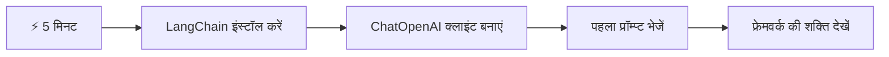
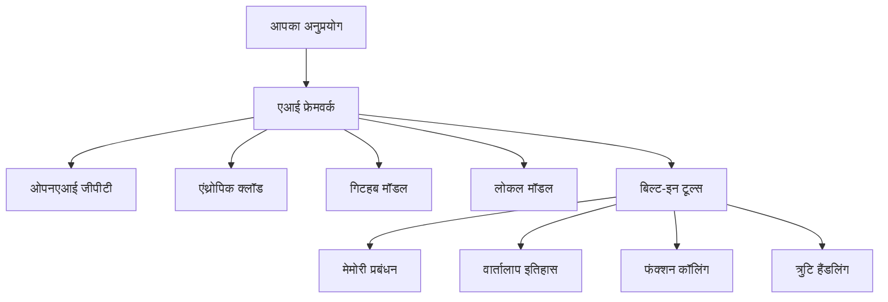
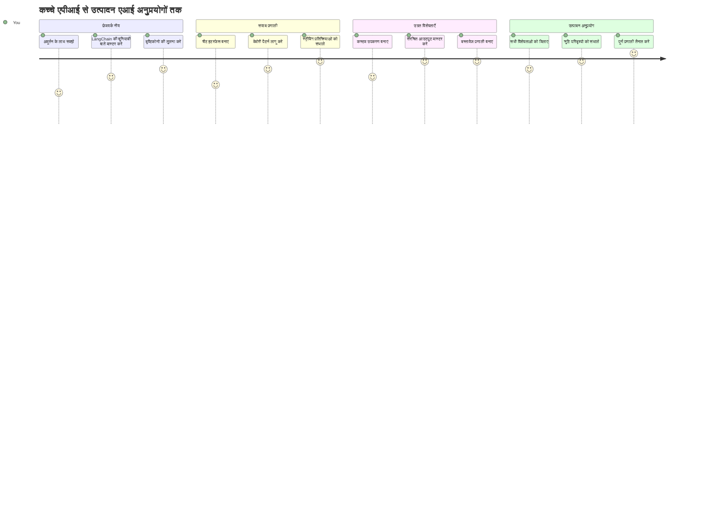
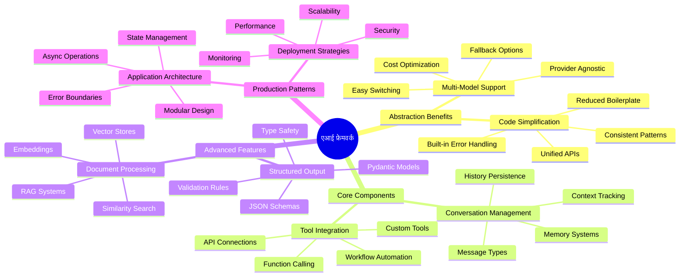
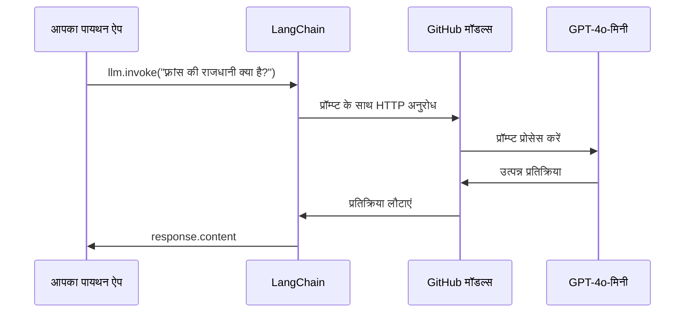
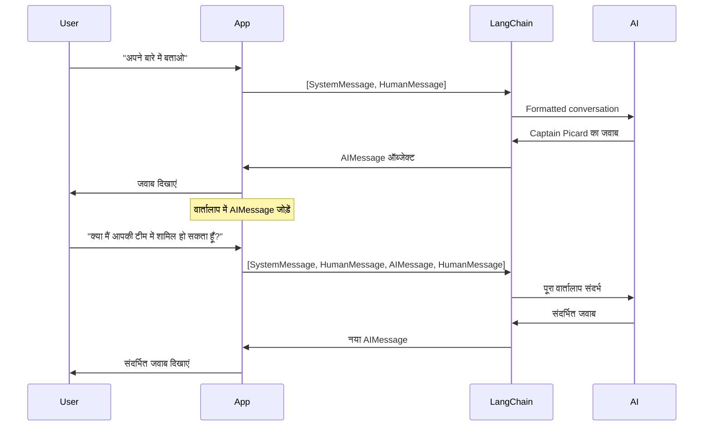
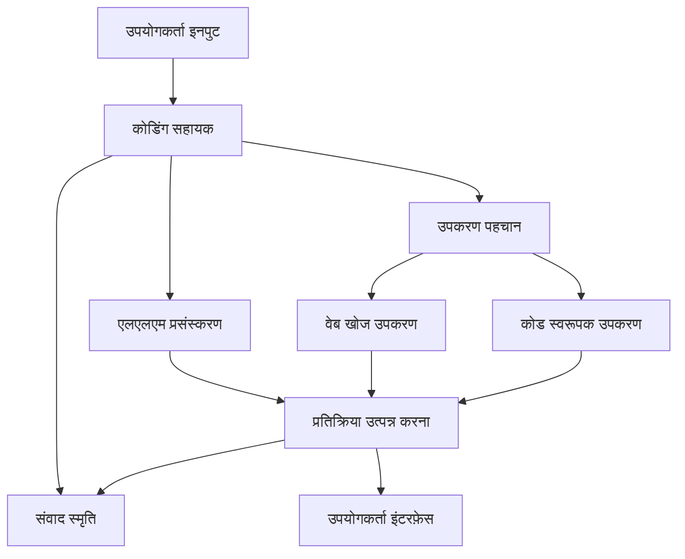
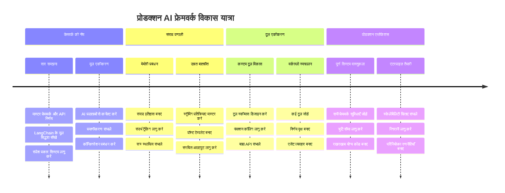
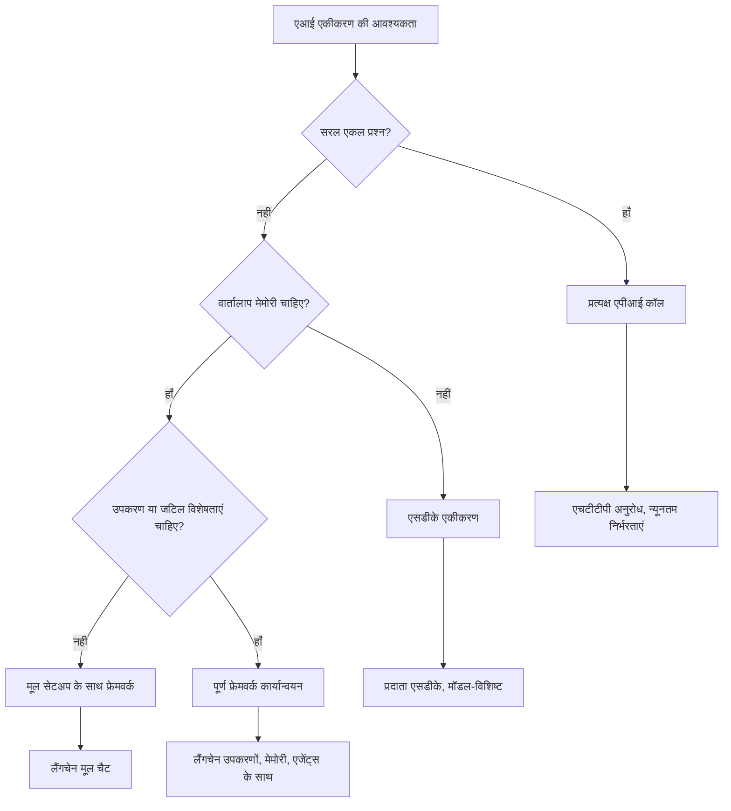

# एआई फ्रेमवर्क

क्या कभी आपने सोचा है कि शून्य से एआई एप्लिकेशन बनाना कितना भारी हो सकता है? आप अकेले नहीं हैं! एआई फ्रेमवर्क ऐसा होता है जैसे एआई विकास के लिए एक स्विस आर्मी चाकू — ये शक्तिशाली उपकरण हैं जो बुद्धिमान एप्लिकेशन बनाने में आपका समय और सिरदर्द बचाते हैं। एक एआई फ्रेमवर्क को एक सुव्यवस्थित पुस्तकालय के रूप में सोचें: यह पहले से बने घटक, मानकीकृत एपीआई, और स्मार्ट अमूर्तता प्रदान करता है ताकि आप कार्यान्वयन विवरण के बजाय समस्या सुलझाने पर ध्यान केंद्रित कर सकें।

इस पाठ में, हम ऐसे फ्रेमवर्क्स जैसे LangChain का पता लगाएंगे जो पहले जटिल एआई समाकलन कार्यों को साफ, पठनीय कोड में बदल सकते हैं। आप सीखेंगे कि कैसे बातचीत को ट्रैक रखना है, टूल कॉलिंग लागू करनी है, और कैसे एक एकीकृत इंटरफ़ेस के माध्यम से विभिन्न एआई मॉडलों को संभालना है।

जब हम खत्म करेंगे, तो आप जानेंगे कि कच्चे एपीआई कॉल के बजाय फ्रेमवर्क का कब उपयोग करना है, उनकी अमूर्तताओं का प्रभावी उपयोग कैसे करना है, और कैसे वास्तविक दुनिया के उपयोग के लिए तैयार एआई एप्लिकेशन बनाना है। आइये देखें कि एआई फ्रेमवर्क आपके प्रोजेक्ट्स के लिए क्या कर सकते हैं।

## ⚡ अगले 5 मिनट में आप क्या कर सकते हैं

**व्यस्त डेवलपर्स के लिए त्वरित शुरुआत मार्ग**


- **मिनट 1**: LangChain इंस्टॉल करें: `pip install langchain langchain-openai`
- **मिनट 2**: अपना GitHub टोकन सेट करें और ChatOpenAI क्लाइंट इम्पोर्ट करें
- **मिनट 3**: सिस्टम और मानव संदेशों के साथ एक सरल बातचीत बनाएं
- **मिनट 4**: एक बुनियादी टूल (जैसे जोड़ने वाला फंक्शन) जोड़ें और AI टूल कॉलिंग देखें
- **मिनट 5**: कच्चे एपीआई कॉल और फ्रेमवर्क अमूर्तता के बीच का अंतर अनुभव करें

**त्वरित परीक्षण कोड**:
```python
from langchain_openai import ChatOpenAI
from langchain_core.messages import SystemMessage, HumanMessage

llm = ChatOpenAI(
    api_key=os.environ["GITHUB_TOKEN"],
    base_url="https://models.github.ai/inference",
    model="openai/gpt-4o-mini"
)

response = llm.invoke([
    SystemMessage(content="You are a helpful coding assistant"),
    HumanMessage(content="Explain Python functions briefly")
])
print(response.content)
```

**क्यों यह महत्वपूर्ण है**: 5 मिनट में, आप देखेंगे कि कैसे एआई फ्रेमवर्क जटिल एआई समाकलन को सरल मेथड कॉल में बदल देते हैं। यह उत्पादन-स्तर के एआई एप्लिकेशन की नींव है।

## फ्रेमवर्क क्यों चुनें?

तो आप एक एआई ऐप बनाने के लिए तैयार हैं - शानदार! लेकिन बात यह है कि आपके पास कई अलग-अलग रास्ते हैं, और हर एक के अपने फायदे और नुकसान हैं। यह वैसा ही है जैसे कहीं पहुँचने के लिए चलना, साइकिल चलाना, या ड्राइविंग करना — ये सभी आपको वहाँ पहुंचाएंगे, लेकिन अनुभव (और प्रयास) पूरी तरह अलग होगा।

आइए तीन मुख्य तरीकों को तोड़कर देखें जिनसे आप अपने प्रोजेक्ट्स में एआई को जोड़ सकते हैं:

| तरीका | फायदे | सर्वश्रेष्ठ उपयोग | ध्यान देने योग्य बातें |
|----------|------------|----------|--------------|
| **प्रत्यक्ष HTTP अनुरोध** | पूर्ण नियंत्रण, कोई निर्भरता नहीं | सरल प्रश्न, मूल बातें सीखना | अधिक विस्तृत कोड, मैनुअल एरर हैंडलिंग |
| **SDK समाकलन** | कम बायलरप्लेट, मॉडल-विशिष्ट अनुकूलन | एकल-मॉडल एप्लिकेशन | विशिष्ट प्रदाताओं तक सीमित |
| **एआई फ्रेमवर्क्स** | एकीकृत एपीआई, अंतर्निर्मित अमूर्तता | बहु-मॉडल ऐप्स, जटिल वर्कफ़्लो | सीखने की प्रक्रिया, संभावित अधिक अमूर्तता |

### प्रैक्टिस में फ्रेमवर्क लाभ


**फ्रेमवर्क क्यों महत्वपूर्ण हैं:**
- **एकीकृत करता है** कई एआई प्रदाताओं को एक इंटरफ़ेस के तहत
- **बातचीत स्मृति** को स्वचालित रूप से संभालता है
- **सामान्य कार्यों** के लिए रेडी-मेड टूल्स प्रदान करता है जैसे एम्बेडिंग और फंक्शन कॉलिंग
- **त्रुटि हैंडलिंग और पुनः प्रयास** तर्क का प्रबंधन करता है
- **जटिल वर्कफ़्लो** को पठनीय मेथड कॉल में बदल देता है

> 💡 **प्रो टिप**: जब आप विभिन्न एआई मॉडलों के बीच स्विच कर रहे हों या एजेंट्स, मेमोरी, या टूल कॉलिंग जैसे जटिल फीचर्स बना रहे हों तो फ्रेमवर्क का उपयोग करें। मूल बातें सीखते समय या सरल, केंद्रित एप्लिकेशन बनाते समय सीधे एपीआई का उपयोग करें।

**निचोड़**: जैसे कारीगर के विशेष उपकरण और एक पूर्ण कार्यशाला के बीच चयन करना, यह काम के अनुसार उपकरण का मिलान करने का मामला है। जटिल, फीचर-समृद्ध एप्लिकेशन के लिए फ्रेमवर्क बेहतरीन हैं, जबकि सीधे एपीआई सरल उपयोग मामलों के लिए अच्छा काम करते हैं।

## 🗺️ आपका एआई फ्रेमवर्क मास्टरी का सीखने का सफर


**आपका लक्ष्य**: इस पाठ के अंत तक, आप एआई फ्रेमवर्क विकास में महारत हासिल कर चुके होंगे और व्यावसायिक एआई सहायकों के बराबर परिष्कृत, उत्पादन-सक्षम एआई एप्लिकेशन बना सकेंगे।

## परिचय

इस पाठ में, हम सीखेंगे:

- एक सामान्य एआई फ्रेमवर्क का उपयोग कैसे करें।
- सामान्य समस्याओं को संबोधित करना जैसे चैट बातचीत, टूल उपयोग, मेमोरी और संदर्भ।
- इसका उपयोग करके एआई ऐप बनाना।

## 🧠 एआई फ्रेमवर्क विकास परिदृश्य


**मूल सिद्धांत**: एआई फ्रेमवर्क जटिलता को अमूर्त करते हैं जबकि बातचीत प्रबंधन, टूल समाकलन, और दस्तावेज़ प्रसंस्करण के लिए शक्तिशाली अमूर्तताएँ प्रदान करते हैं, जिससे डेवलपर्स साफ-सुथरे, रखरखाव योग्य कोड के साथ परिष्कृत एआई एप्लिकेशन बना सकते हैं।

## आपका पहला एआई प्रांप्ट

आइए बुनियादी बातों से शुरू करें और अपना पहला एआई एप्लिकेशन बनाएं जो प्रश्न भेजता है और उत्तर प्राप्त करता है। जैसे आर्किमिडीज़ ने अपने स्नान में विस्थापन सिद्धांत की खोज की, कभी-कभी सबसे सरल अवलोकन सबसे शक्तिशाली अंतर्दृष्टि देते हैं — और फ्रेमवर्क इन अंतर्दृष्टियों को पहुंचाने में मदद करते हैं।

### GitHub मॉडलों के साथ LangChain सेटअप करना

हम LangChain का उपयोग GitHub मॉडलों से जुड़ने के लिए करेंगे, जो काफी अच्छा है क्योंकि यह आपको विभिन्न एआई मॉडलों का मुफ्त एक्सेस देता है। सबसे अच्छी बात? शुरू करने के लिए आपको केवल कुछ सरल कॉन्फ़िगरेशन पैरामीटर की आवश्यकता है:

```python
from langchain_openai import ChatOpenAI
import os

llm = ChatOpenAI(
    api_key=os.environ["GITHUB_TOKEN"],
    base_url="https://models.github.ai/inference",
    model="openai/gpt-4o-mini",
)

# एक सरल प्रॉम्प्ट भेजें
response = llm.invoke("What's the capital of France?")
print(response.content)
```

**यहाँ क्या हो रहा है इसे समझते हैं:**
- **LangChain क्लाइंट बनाता है `ChatOpenAI` क्लास का उपयोग करके** - यह आपका AI का प्रवेश द्वार है!
- **GitHub मॉडलों से कनेक्शन को कॉन्फ़िगर करता है आपके प्रमाणीकरण टोकन के साथ**
- **निर्धारित करता है कौन सा AI मॉडल उपयोग करना है (`gpt-4o-mini`)** - इसे अपने AI सहायक के रूप में सोचें
- **अपने प्रश्न को `invoke()` मेथड के साथ भेजता है** - यही जादू होता है
- **उत्तर निकालता है और प्रदर्शित करता है** - और voilà, आप AI के साथ बातचीत कर रहे हैं!

> 🔧 **सेटअप नोट**: यदि आप GitHub Codespaces का उपयोग कर रहे हैं, तो आप भाग्यशाली हैं — `GITHUB_TOKEN` पहले से सेट है! लोकल पर काम कर रहे हैं? कोई चिंता नहीं, आपको सही अनुमतियों के साथ एक व्यक्तिगत एक्सेस टोकन बनाना होगा।

**अपेक्षित आउटपुट:**
```text
The capital of France is Paris.
```


## बातचीत वाले एआई का निर्माण

पहला उदाहरण मूल बातें दिखाता है, लेकिन यह केवल एकल आदान-प्रदान है — आप एक प्रश्न पूछते हैं, उत्तर पाते हैं, और बस। वास्तविक एप्लिकेशन में, आप चाहते हैं कि आपका AI यह याद रखे कि आप क्या चर्चा कर रहे थे, जैसे वॉटसन और होल्म्स ने समय के साथ अपनी जांच बातचीत विकसित की।

यहाँ LangChain विशेष रूप से उपयोगी होता है। यह विभिन्न संदेश प्रकार प्रदान करता है जो बातचीत को संरचित करने में मदद करते हैं और आपको अपने AI को एक व्यक्तित्व देने देते हैं। आप चैट अनुभव बनाएंगे जो संदर्भ और चरित्र को बनाए रखते हैं।

### संदेश प्रकार को समझना

इन संदेश प्रकारों को इस तरह सोचें जैसे बातचीत में प्रतिभागी अलग-अलग "टोपी" पहनते हैं। LangChain अलग-अलग संदेश वर्गों का उपयोग करता है यह ट्रैक करने के लिए कि कौन क्या कह रहा है:

| संदेश प्रकार | उद्देश्य | उदाहरण उपयोग केस |
|--------------|---------|------------------|
| `SystemMessage` | AI की व्यक्तित्व और व्यवहार निर्धारित करता है | "आप एक सहायक कोडिंग सहायक हैं" |
| `HumanMessage` | उपयोगकर्ता इनपुट का प्रतिनिधित्व करता है | "फ़ंक्शन कैसे काम करते हैं समझाएं" |
| `AIMessage` | AI प्रतिक्रियाओं को संग्रहित करता है | बातचीत में पिछली AI प्रतिक्रियाएं |

### आपकी पहली बातचीत बनाना

आइए ऐसी बातचीत बनाएं जहाँ हमारा AI एक विशिष्ट भूमिका निभाए। इसे कैप्टन पिकार्ड की भूमिका निभानी होगी — एक ऐसा पात्र जो कूटनीतिक बुद्धिमत्ता और नेतृत्व के लिए जाना जाता है:

```python
messages = [
    SystemMessage(content="You are Captain Picard of the Starship Enterprise"),
    HumanMessage(content="Tell me about you"),
]
```

**इस बातचीत सेटअप को तोड़कर देखें:**
- `SystemMessage` के माध्यम से AI की भूमिका और व्यक्तित्व स्थापित करता है
- `HumanMessage` के जरिए प्रारंभिक उपयोगकर्ता प्रश्न प्रदान करता है
- बहु-टर्न बातचीत का आधार बनाता है

इस उदाहरण का पूरा कोड इस प्रकार दिखता है:

```python
from langchain_core.messages import HumanMessage, SystemMessage
from langchain_openai import ChatOpenAI
import os

llm = ChatOpenAI(
    api_key=os.environ["GITHUB_TOKEN"],
    base_url="https://models.github.ai/inference",
    model="openai/gpt-4o-mini",
)

messages = [
    SystemMessage(content="You are Captain Picard of the Starship Enterprise"),
    HumanMessage(content="Tell me about you"),
]


# काम करता है
response  = llm.invoke(messages)
print(response.content)
```

आपको एक आउटपुट इस तरह प्राप्त होनी चाहिए:

```text
I am Captain Jean-Luc Picard, the commanding officer of the USS Enterprise (NCC-1701-D), a starship in the United Federation of Planets. My primary mission is to explore new worlds, seek out new life and new civilizations, and boldly go where no one has gone before. 

I believe in the importance of diplomacy, reason, and the pursuit of knowledge. My crew is diverse and skilled, and we often face challenges that test our resolve, ethics, and ingenuity. Throughout my career, I have encountered numerous species, grappled with complex moral dilemmas, and have consistently sought peaceful solutions to conflicts.

I hold the ideals of the Federation close to my heart, believing in the importance of cooperation, understanding, and respect for all sentient beings. My experiences have shaped my leadership style, and I strive to be a thoughtful and just captain. How may I assist you further?
```

बातचीत की निरंतरता बनाए रखने के लिए (हर बार संदर्भ रीसेट करने के बजाय), आपको संदेश सूची में लगातार प्रतिक्रियाएँ जोड़नी होंगी। जैसे मौखिक परंपराओं ने कहानियों को पीढ़ी दर पीढ़ी संरक्षित किया, यह तरीका स्थायी स्मृति बनाता है:

```python
from langchain_core.messages import HumanMessage, SystemMessage
from langchain_openai import ChatOpenAI
import os

llm = ChatOpenAI(
    api_key=os.environ["GITHUB_TOKEN"],
    base_url="https://models.github.ai/inference",
    model="openai/gpt-4o-mini",
)

messages = [
    SystemMessage(content="You are Captain Picard of the Starship Enterprise"),
    HumanMessage(content="Tell me about you"),
]


# काम करता है
response  = llm.invoke(messages)

print(response.content)

print("---- Next ----")

messages.append(response)
messages.append(HumanMessage(content="Now that I know about you, I'm Chris, can I be in your crew?"))

response  = llm.invoke(messages)

print(response.content)

```

काफी शानदार, है न? यहाँ जो हो रहा है वह यह है कि हम LLM को दो बार कॉल कर रहे हैं — पहले केवल शुरुआती दो संदेशों के साथ, फिर पूरे बातचीत इतिहास के साथ। यह ऐसा है जैसे AI वास्तव में हमारी चैट को फ़ॉलो कर रहा हो!

जब आप यह कोड चलाएंगे, तो आपको दूसरी प्रतिक्रिया मिलेगी जो कुछ इस प्रकार लगेगी:

```text
Welcome aboard, Chris! It's always a pleasure to meet those who share a passion for exploration and discovery. While I cannot formally offer you a position on the Enterprise right now, I encourage you to pursue your aspirations. We are always in need of talented individuals with diverse skills and backgrounds. 

If you are interested in space exploration, consider education and training in the sciences, engineering, or diplomacy. The values of curiosity, resilience, and teamwork are crucial in Starfleet. Should you ever find yourself on a starship, remember to uphold the principles of the Federation: peace, understanding, and respect for all beings. Your journey can lead you to remarkable adventures, whether in the stars or on the ground. Engage!
```


मैं इसे शायद कहूँगा ;)

## स्ट्रीमिंग प्रतिक्रियाएँ

क्या आपने गौर किया है कि ChatGPT अपनी प्रतिक्रियाएँ रियल-टाइम में "टाइप" करता हुआ लगता है? वह स्ट्रीमिंग है। जैसे कुशल सुलेखकार काम करता है — अक्षर को स्ट्रोक दर स्ट्रोक देखते हैं बजाय सीधे एक साथ प्रकट होने के — स्ट्रीमिंग बातचीत को अधिक प्राकृतिक महसूस कराता है और त्वरित प्रतिक्रिया प्रदान करता है।

### LangChain के साथ स्ट्रीमिंग लागू करना

```python
from langchain_openai import ChatOpenAI
import os

llm = ChatOpenAI(
    api_key=os.environ["GITHUB_TOKEN"],
    base_url="https://models.github.ai/inference",
    model="openai/gpt-4o-mini",
    streaming=True
)

# प्रतिक्रिया को स्ट्रीम करें
for chunk in llm.stream("Write a short story about a robot learning to code"):
    print(chunk.content, end="", flush=True)
```

**स्ट्रीमिंग क्यों शानदार है:**
- **बनते हुए कंटेंट को दिखाता है** - अब और किसी तरह की असहज प्रतीक्षा नहीं!
- **उपयोगकर्ताओं को लगता है कि कुछ हो रहा है**
- **तकनीकी रूप से तेज़ न होते हुए भी तेज़ महसूस होता है**
- **उपयोगकर्ताओं को पढ़ना शुरू करने देता है जबकि AI अभी भी "सोच" रहा है**

> 💡 **उपयोगकर्ता अनुभव टिप**: स्ट्रीमिंग तब वास्तव में चमकता है जब आप लंबी प्रतिक्रियाओं से निपट रहे हों जैसे कोड व्याख्याएँ, रचनात्मक लेखन, या विस्तृत ट्यूटोरियल। आपके उपयोगकर्ताओं को प्रगति देखते रहना पसंद आएगा बजाय खाली स्क्रीन देखते रहने के!

### 🎯 शैक्षिक चेक-इन: फ्रेमवर्क अमूर्तता के लाभ

**रोकें और सोचें**: आपने अभी एआई फ्रेमवर्क अमूर्तताओं की शक्ति का अनुभव किया। पिछले पाठों के कच्चे एपीआई कॉल के मुकाबले आपने जो सीखा उसका मूल्यांकन करें।

**त्वरित स्वयं-मूल्यांकन**:
- क्या आप बता सकते हैं कि LangChain बातचीत प्रबंधन को मैन्युअल संदेश ट्रैकिंग के मुकाबले कैसे सरल बनाता है?
- `invoke()` और `stream()` मेथड्स में क्या अंतर है, और आप कब क्या उपयोग करेंगे?
- फ्रेमवर्क का संदेश प्रकार सिस्टम कोड संगठन में कैसे सुधार करता है?

**वास्तविक दुनिया कनेक्शन**: आपने जो अमूर्त पैटर्न सीखे हैं (संदेश प्रकार, स्ट्रीमिंग इंटरफेस, बातचीत स्मृति) वे हर प्रमुख एआई एप्लिकेशन में उपयोग होते हैं — ChatGPT के इंटरफ़ेस से लेकर GitHub Copilot के कोड सहायता तक। आप उसी वास्तुकला पैटर्न में महारत हासिल कर रहे हैं जिसे पेशेवर एआई विकास टीमें उपयोग करती हैं।

**चुनौती प्रश्न**: आप कैसे फ्रेमवर्क अमूर्तता डिजाइन करेंगे जो विभिन्न एआई मॉडल प्रदाताओं (OpenAI, Anthropic, Google) को एकल इंटरफेस से संभाल सके? इसके फायदे और जोखिम क्या होंगे?

## प्रांप्ट टेम्प्लेट

प्रांप्ट टेम्प्लेट वैसा काम करते हैं जैसे क्लासिकल भाषण कला में प्रयुक्त वाक्य रचनाएँ — सोचें कि किसेरो कैसे अपने भाषण पैटर्न्स को विभिन्न श्रोताओं के अनुसार अनुकूलित करता था जबकि समान प्रभावी ढांचा बनाए रखता था। ये आपको पुन: प्रयोज्य प्रांप्ट बनाने देते हैं जहां आप विभिन्न जानकारियाँ बदल सकते हैं बिना सब कुछ फिर से लिखे। एक बार टेम्प्लेट सेट करने के बाद, आप केवल वेरिएबल्स को अपनी जरूरत के अनुसार भरते हैं।

### पुन: प्रयोज्य प्रांप्ट बनाना

```python
from langchain_core.prompts import ChatPromptTemplate

# कोड व्याख्याओं के लिए एक टेम्पलेट परिभाषित करें
template = ChatPromptTemplate.from_messages([
    ("system", "You are an expert programming instructor. Explain concepts clearly with examples."),
    ("human", "Explain {concept} in {language} with a practical example for {skill_level} developers")
])

# विभिन्न मानों के साथ टेम्पलेट का उपयोग करें
questions = [
    {"concept": "functions", "language": "JavaScript", "skill_level": "beginner"},
    {"concept": "classes", "language": "Python", "skill_level": "intermediate"},
    {"concept": "async/await", "language": "JavaScript", "skill_level": "advanced"}
]

for question in questions:
    prompt = template.format_messages(**question)
    response = llm.invoke(prompt)
    print(f"Topic: {question['concept']}\n{response.content}\n---\n")
```

**आप टेम्प्लेट्स को क्यों पसंद करेंगे:**
- **पूरे ऐप में आपके प्रांप्ट्स को सुसंगत बनाए रखता है**
- **अब कोई गंदा स्ट्रिंग जोडऩा नहीं — बस साफ-सुथरे सरल वेरिएबल्स**
- **आपका AI पूर्वानुमेय व्यवहार करता है क्योंकि संरचना समान रहती है**
- **अपडेट करना आसान — टेम्प्लेट एक बार बदलो, और हर जगह ठीक हो जाता है**

## संरचित आउटपुट

क्या आप कभी अनस्ट्रक्चर्ड टेक्स्ट के रूप में आए एआई प्रतिक्रियाओं को पार्स करने में परेशान हुए हैं? संरचित आउटपुट ऐसा है जैसे आप अपने AI को जैविक वर्गीकरण के लिए लिनियस की प्रणाली की तरह व्यवस्थित, पूर्वानुमेय, और काम करने में आसान विधि का पालन करने के लिए सिखा रहे हों। आप JSON, विशिष्ट डेटा संरचनाएँ, या किसी भी प्रारूप का अनुरोध कर सकते हैं।

### आउटपुट स्कीमा परिभाषित करना

```python
from langchain_core.prompts import ChatPromptTemplate
from langchain_core.output_parsers import JsonOutputParser
from pydantic import BaseModel, Field

class CodeReview(BaseModel):
    score: int = Field(description="Code quality score from 1-10")
    strengths: list[str] = Field(description="List of code strengths")
    improvements: list[str] = Field(description="List of suggested improvements")
    overall_feedback: str = Field(description="Summary feedback")

# पार्सर सेट करें
parser = JsonOutputParser(pydantic_object=CodeReview)

# प्रारूप निर्देशों के साथ प्रॉम्प्ट बनाएं
prompt = ChatPromptTemplate.from_messages([
    ("system", "You are a code reviewer. {format_instructions}"),
    ("human", "Review this code: {code}")
])

# निर्देशों के साथ प्रॉम्प्ट को प्रारूपित करें
chain = prompt | llm | parser

# संगठित प्रतिक्रिया प्राप्त करें
code_sample = """
def calculate_average(numbers):
    return sum(numbers) / len(numbers)
"""

result = chain.invoke({
    "code": code_sample,
    "format_instructions": parser.get_format_instructions()
})

print(f"Score: {result['score']}")
print(f"Strengths: {', '.join(result['strengths'])}")
```

**संरचित आउटपुट क्यों गेम-चेंजर है:**
- **अब कोई अंदाजा नहीं कि आपको किस प्रारूप में मिलेगा — हर बार सुसंगत रहता है**
- **बिना अतिरिक्त काम के सीधे आपके डेटाबेस और API में फिट हो जाता है**
- **अजीब AI प्रतिक्रियाओं को पकड़ता है इससे पहले कि वे आपके ऐप को तोड़ें**
- **आपका कोड साफ रहता है क्योंकि आप जानते हैं कि आप क्या इस्तेमाल कर रहे हैं**

## टूल कॉलिंग

अब हम सबसे शक्तिशाली फीचरों में से एक पर पहुँच गए हैं: टूल्स। यही वह तरीका है जिससे आप अपने AI को बातचीत से परे व्यावहारिक क्षमताएँ देते हैं। जैसे मध्यकालीन गिल्ड ने विशेष शिल्पों के लिए विशिष्ट उपकरण विकसित किए, आप अपने AI को लक्षित उपकरणों से सुसज्जित कर सकते हैं। आप इंगित करते हैं कि कौन से टूल्स उपलब्ध हैं, और जब कोई ऐसा अनुरोध करता है जो मेल खाता है, तो आपका AI कार्रवाई कर सकता है।

### Python का उपयोग करना

आइए कुछ टूल्स इस तरह जोड़ें:

```python
from typing_extensions import Annotated, TypedDict

class add(TypedDict):
    """Add two integers."""

    # एनोटेशन में प्रकार होना चाहिए और वैकल्पिक रूप से एक डिफ़ॉल्ट मूल्य और विवरण (उसी क्रम में) शामिल हो सकते हैं।
    a: Annotated[int, ..., "First integer"]
    b: Annotated[int, ..., "Second integer"]

tools = [add]

functions = {
    "add": lambda a, b: a + b
}
```

तो यहाँ क्या हो रहा है? हम `add` नामक एक टूल के लिए एक ब्लूप्रिंट बना रहे हैं। `TypedDict` से विरासत लेकर और `a` और `b` के लिए उन शानदार `Annotated` प्रकारों का उपयोग करके, हम LLM को स्पष्ट रूप से बताते हैं कि यह टूल क्या करता है और इसे क्या चाहिए। `functions` शब्दकोश हमारे टूलबॉक्स की तरह है — यह हमारे कोड को बताता है कि जब AI किसी विशिष्ट टूल का उपयोग करने का निर्णय लेता है तो क्या करना है।

आइए देखें कि हम अगली बार इस टूल के साथ LLM को कैसे कॉल करते हैं:

```python
llm = ChatOpenAI(
    api_key=os.environ["GITHUB_TOKEN"],
    base_url="https://models.github.ai/inference",
    model="openai/gpt-4o-mini",
)

llm_with_tools = llm.bind_tools(tools)
```

यहाँ हम `bind_tools` को हमारे `tools` एरे के साथ कॉल करते हैं और इस प्रकार LLM `llm_with_tools` के पास अब इस टूल का ज्ञान है।

इस नए LLM का उपयोग करने के लिए, हम निम्न कोड लिख सकते हैं:

```python
query = "What is 3 + 12?"

res = llm_with_tools.invoke(query)
if(res.tool_calls):
    for tool in res.tool_calls:
        print("TOOL CALL: ", functions[tool["name"]](../../../10-ai-framework-project/**tool["args"]))
print("CONTENT: ",res.content)
```

अब जब हम इस नए टूल वाले llm पर `invoke` कॉल करते हैं, तो संभवतः `tool_calls` संपत्ति भरी हुई होगी। यदि हाँ, तो किसी भी पहचाने गए टूल के पास `name` और `args` संपत्ति होती है जो निर्दिष्ट करती है कि कौन सा टूल कॉल किया जाना चाहिए और तर्क क्या हैं। पूरा कोड इस प्रकार दिखता है:

```python
from langchain_core.messages import HumanMessage, SystemMessage
from langchain_openai import ChatOpenAI
import os
from typing_extensions import Annotated, TypedDict

class add(TypedDict):
    """Add two integers."""

    # एनोटेशन में प्रकार होना आवश्यक है और वैकल्पिक रूप से एक डिफ़ॉल्ट मान और विवरण (उस क्रम में) शामिल हो सकता है।
    a: Annotated[int, ..., "First integer"]
    b: Annotated[int, ..., "Second integer"]

tools = [add]

functions = {
    "add": lambda a, b: a + b
}

llm = ChatOpenAI(
    api_key=os.environ["GITHUB_TOKEN"],
    base_url="https://models.github.ai/inference",
    model="openai/gpt-4o-mini",
)

llm_with_tools = llm.bind_tools(tools)

query = "What is 3 + 12?"

res = llm_with_tools.invoke(query)
if(res.tool_calls):
    for tool in res.tool_calls:
        print("TOOL CALL: ", functions[tool["name"]](../../../10-ai-framework-project/**tool["args"]))
print("CONTENT: ",res.content)
```

इस कोड को चलाने पर, आपको ऐसा आउटपुट मिलेगा:

```text
TOOL CALL:  15
CONTENT: 
```

AI ने "What is 3 + 12" को जाँचा और इसे `add` टूल के लिए कार्य के रूप में पहचाना। जैसे कुशल लाइब्रेरियन प्रश्न के प्रकार के आधार पर संदर्भ देखता है, AI ने टूल के नाम, विवरण, और फ़ील्ड विनिर्देशों से यह निर्णय लिया। 15 का परिणाम हमारे `functions` शब्दकोश द्वारा टूल को निष्पादित करने से आता है:

```python
print("TOOL CALL: ", functions[tool["name"]](../../../10-ai-framework-project/**tool["args"]))
```

### एक और दिलचस्प टूल जो वेब एपीआई को कॉल करता है


संख्या जोड़ना अवधारणा को दर्शाता है, लेकिन वास्तविक टूल आम तौर पर अधिक जटिल संचालन करते हैं, जैसे वेब APIs को कॉल करना। आइए हमारे उदाहरण को इस प्रकार बढ़ाएं कि AI इंटरनेट से सामग्री प्राप्त करे - ठीक उसी तरह जैसे टेलीग्राफ ऑपरेटर्स एक समय पर दूर-दराज़ के स्थानों को जोड़ते थे:

```python
class joke(TypedDict):
    """Tell a joke."""

    # एनोटेशन में प्रकार होना चाहिए और वैकल्पिक रूप से एक डिफ़ॉल्ट मान और विवरण शामिल किया जा सकता है (उसी क्रम में)।
    category: Annotated[str, ..., "The joke category"]

def get_joke(category: str) -> str:
    response = requests.get(f"https://api.chucknorris.io/jokes/random?category={category}", headers={"Accept": "application/json"})
    if response.status_code == 200:
        return response.json().get("value", f"Here's a {category} joke!")
    return f"Here's a {category} joke!"

functions = {
    "add": lambda a, b: a + b,
    "joke": lambda category: get_joke(category)
}

query = "Tell me a joke about animals"

# बाकी कोड समान है
```

अब यदि आप इस कोड को चलाते हैं तो आपको कुछ इस प्रकार का प्रतिक्रिया मिलेगा:

```text
TOOL CALL:  Chuck Norris once rode a nine foot grizzly bear through an automatic car wash, instead of taking a shower.
CONTENT:  
```

```mermaid
flowchart TD
    A[उपयोगकर्ता प्रश्न: "पशुओं के बारे में एक मजाक बताओ"] --> B[LangChain विश्लेषण]
    B --> C{उपकरण उपलब्ध?}
    C -->|हाँ| D[मजाक उपकरण चुनें]
    C -->|नहीं| E[प्रत्यक्ष उत्तर उत्पन्न करें]
    
    D --> F[पैरामीटर निकालें]
    F --> G[मजाक कॉल करें(category="animals")]
    G --> H[chucknorris.io को API अनुरोध]
    H --> I[मजाक सामग्री लौटाएं]
    I --> J[उपयोगकर्ता को दिखाएं]
    
    E --> K[AI-निर्मित उत्तर]
    K --> J
    
    subgraph "उपकरण परिभाषा स्तर"
        L[TypedDict स्कीमा]
        M[फ़ंक्शन कार्यान्वयन]
        N[पैरामीटर सत्यापन]
    end
    
    D --> L
    F --> N
    G --> M
```
यहाँ पूरा कोड दिया गया है:

```python
from langchain_openai import ChatOpenAI
import requests
import os
from typing_extensions import Annotated, TypedDict

class add(TypedDict):
    """Add two integers."""

    # एनोटेशन में प्रकार होना चाहिए और वैकल्पिक रूप से एक डिफ़ॉल्ट मान और विवरण शामिल हो सकते हैं (उसी क्रम में)।
    a: Annotated[int, ..., "First integer"]
    b: Annotated[int, ..., "Second integer"]

class joke(TypedDict):
    """Tell a joke."""

    # एनोटेशन में प्रकार होना चाहिए और वैकल्पिक रूप से एक डिफ़ॉल्ट मान और विवरण शामिल हो सकते हैं (उसी क्रम में)।
    category: Annotated[str, ..., "The joke category"]

tools = [add, joke]

def get_joke(category: str) -> str:
    response = requests.get(f"https://api.chucknorris.io/jokes/random?category={category}", headers={"Accept": "application/json"})
    if response.status_code == 200:
        return response.json().get("value", f"Here's a {category} joke!")
    return f"Here's a {category} joke!"

functions = {
    "add": lambda a, b: a + b,
    "joke": lambda category: get_joke(category)
}

llm = ChatOpenAI(
    api_key=os.environ["GITHUB_TOKEN"],
    base_url="https://models.github.ai/inference",
    model="openai/gpt-4o-mini",
)

llm_with_tools = llm.bind_tools(tools)

query = "Tell me a joke about animals"

res = llm_with_tools.invoke(query)
if(res.tool_calls):
    for tool in res.tool_calls:
        # print("TOOL CALL: ", tool)
        print("TOOL CALL: ", functions[tool["name"]](../../../10-ai-framework-project/**tool["args"]))
print("CONTENT: ",res.content)
```

## एम्बेडिंग्स और दस्तावेज़ प्रसंस्करण

एंबेडिंग्स आधुनिक AI में सबसे सुरुचिपूर्ण समाधानों में से एक का प्रतिनिधित्व करती हैं। कल्पना करें कि आप किसी भी टेक्स्ट को लेकर उसे संख्यात्मक निर्देशांक में परिवर्तित कर सकते हैं जो उसके अर्थ को पकड़ता हो। ठीक ऐसा ही एम्बेडिंग्स करती हैं - वे टेक्स्ट को मल्टी-डायमेंशनल स्पेस के बिंदुओं में तब्दील कर देती हैं जहाँ समान अवधारणाएँ एक साथ समूहित होती हैं। यह विचारों के लिए एक निर्देशांक प्रणाली की तरह है, जो मेन्डेलीव ने परमाणु गुणों के आधार पर आवर्त सारणी को व्यवस्थित करने के तरीके जैसी है।

### एम्बेडिंग्स बनाना और उपयोग करना

```python
from langchain_openai import OpenAIEmbeddings
from langchain_community.vectorstores import FAISS
from langchain_community.document_loaders import TextLoader
from langchain.text_splitter import CharacterTextSplitter

# एम्बेडिंग्स प्रारंभ करें
embeddings = OpenAIEmbeddings(
    api_key=os.environ["GITHUB_TOKEN"],
    base_url="https://models.github.ai/inference",
    model="text-embedding-3-small"
)

# दस्तावेज़ लोड करें और विभाजित करें
loader = TextLoader("documentation.txt")
documents = loader.load()

text_splitter = CharacterTextSplitter(chunk_size=1000, chunk_overlap=0)
texts = text_splitter.split_documents(documents)

# वेक्टर स्टोर बनाएं
vectorstore = FAISS.from_documents(texts, embeddings)

# समानता खोज करें
query = "How do I handle user authentication?"
similar_docs = vectorstore.similarity_search(query, k=3)

for doc in similar_docs:
    print(f"Relevant content: {doc.page_content[:200]}...")
```

### विभिन्न प्रारूपों के लिए दस्तावेज़ लोडर

```python
from langchain_community.document_loaders import (
    PyPDFLoader,
    CSVLoader,
    JSONLoader,
    WebBaseLoader
)

# विभिन्न दस्तावेज़ प्रकार लोड करें
pdf_loader = PyPDFLoader("manual.pdf")
csv_loader = CSVLoader("data.csv")
json_loader = JSONLoader("config.json")
web_loader = WebBaseLoader("https://example.com/docs")

# सभी दस्तावेज़ों को संसाधित करें
all_documents = []
for loader in [pdf_loader, csv_loader, json_loader, web_loader]:
    docs = loader.load()
    all_documents.extend(docs)
```

**एंबेडिंग्स के साथ आप क्या कर सकते हैं:**
- **सर्ज** बनाएँ जो वास्तव में आपके अर्थ को समझता है, सिर्फ कीवर्ड मिलान नहीं करता
- **AI बनाएं** जो आपके दस्तावेज़ों के बारे में सवालों का जवाब दे सके
- **अनुशंसा प्रणाली** बनाएं जो सचमुच प्रासंगिक सामग्री सुझाए
- **स्वचालित रूप से** अपनी सामग्री को व्यवस्थित और वर्गीकृत करें

```mermaid
flowchart LR
    A[दस्तावेज़] --> B[पाठ विभाजक]
    B --> C[एम्बेडिंग बनाएं]
    C --> D[वेक्टर स्टोर]
    
    E[उपयोगकर्ता प्रश्न] --> F[प्रश्न एम्बेडिंग]
    F --> G[समानता खोज]
    G --> D
    D --> H[प्रासंगिक दस्तावेज़]
    H --> I[एआई प्रतिक्रिया]
    
    subgraph "वेक्टर स्थान"
        J[दस्तावेज़ A: [0.1, 0.8, 0.3...]]
        K[दस्तावेज़ B: [0.2, 0.7, 0.4...]]
        L[प्रश्न: [0.15, 0.75, 0.35...]]
    end
    
    C --> J
    C --> K
    F --> L
    G --> J
    G --> K
```
## एक पूर्ण AI एप्लिकेशन बनाना

अब हम आपने जोकुछ सीखा है उसे एक समग्र एप्लिकेशन में एकीकृत करेंगे - एक कोडिंग सहायक जो सवालों के जवाब दे सके, टूल्स का उपयोग कर सके, और बातचीत की स्मृति बनाए रख सके। जैसे मुद्रण प्रेस ने मौजूदा तकनीकों (स्थानांतरित टाइप, स्याही, कागज और दबाव) को एक रूपांतरणकारी चीज में जोड़ा, वैसे ही हम अपने AI घटकों को कुछ व्यावहारिक और उपयोगी में संयोजित करेंगे।

### पूर्ण एप्लिकेशन उदाहरण

```python
from langchain_openai import ChatOpenAI, OpenAIEmbeddings
from langchain_core.prompts import ChatPromptTemplate
from langchain_core.messages import HumanMessage, SystemMessage, AIMessage
from langchain_community.vectorstores import FAISS
from typing_extensions import Annotated, TypedDict
import os
import requests

class CodingAssistant:
    def __init__(self):
        self.llm = ChatOpenAI(
            api_key=os.environ["GITHUB_TOKEN"],
            base_url="https://models.github.ai/inference",
            model="openai/gpt-4o-mini"
        )
        
        self.conversation_history = [
            SystemMessage(content="""You are an expert coding assistant. 
            Help users learn programming concepts, debug code, and write better software.
            Use tools when needed and maintain a helpful, encouraging tone.""")
        ]
        
        # उपकरण परिभाषित करें
        self.setup_tools()
    
    def setup_tools(self):
        class web_search(TypedDict):
            """Search for programming documentation or examples."""
            query: Annotated[str, "Search query for programming help"]
        
        class code_formatter(TypedDict):
            """Format and validate code snippets."""
            code: Annotated[str, "Code to format"]
            language: Annotated[str, "Programming language"]
        
        self.tools = [web_search, code_formatter]
        self.llm_with_tools = self.llm.bind_tools(self.tools)
    
    def chat(self, user_input: str):
        # उपयोगकर्ता संदेश को वार्तालाप में जोड़ें
        self.conversation_history.append(HumanMessage(content=user_input))
        
        # एआई प्रतिक्रिया प्राप्त करें
        response = self.llm_with_tools.invoke(self.conversation_history)
        
        # यदि कोई हो तो उपकरण कॉल को संभालें
        if response.tool_calls:
            for tool_call in response.tool_calls:
                tool_result = self.execute_tool(tool_call)
                print(f"🔧 Tool used: {tool_call['name']}")
                print(f"📊 Result: {tool_result}")
        
        # एआई प्रतिक्रिया को वार्तालाप में जोड़ें
        self.conversation_history.append(response)
        
        return response.content
    
    def execute_tool(self, tool_call):
        tool_name = tool_call['name']
        args = tool_call['args']
        
        if tool_name == 'web_search':
            return f"Found documentation for: {args['query']}"
        elif tool_name == 'code_formatter':
            return f"Formatted {args['language']} code: {args['code'][:50]}..."
        
        return "Tool execution completed"

# उपयोग का उदाहरण
assistant = CodingAssistant()

print("🤖 Coding Assistant Ready! Type 'quit' to exit.\n")

while True:
    user_input = input("You: ")
    if user_input.lower() == 'quit':
        break
    
    response = assistant.chat(user_input)
    print(f"🤖 Assistant: {response}\n")
```

**एप्लिकेशन वास्तुकला:**


**हमने जो मुख्य सुविधाएँ लागू की हैं:**
- **आपकी पूरी बातचीत को याद रखता है** ताकि संदर्भ में निरंतरता बनी रहे
- **कहानी तक सीमित नहीं, टूल कॉलिंग भी करता है**
- **पूर्वानुमानित इंटरैक्शन पैटर्न का पालन करता है**
- **त्रुटि प्रबंधन और जटिल वर्कफ़्लोज़ को स्वचालित रूप से संभालता है**

### 🎯 शैक्षिक चेक-इन: प्रोडक्शन AI वास्तुकला

**आर्किटेक्चर की समझ**: आपने एक पूर्ण AI एप्लिकेशन बनाया है जो बातचीत प्रबंधन, टूल कॉलिंग और संरचित वर्कफ़्लोज़ को जोड़ता है। यह प्रोडक्शन-स्तर के AI एप्लिकेशन विकास का प्रतिनिधित्व करता है।

**मुख्य अवधारणाएँ जो आपने मास्टर की हैं**:
- **क्लास-आधारित आर्किटेक्चर**: संगठित, बनाए रखने योग्य AI एप्लिकेशन संरचना
- **टूल एकीकरण**: बातचीत से परे कस्टम कार्यक्षमता
- **मेमोरी प्रबंधन**: लगातार बातचीत का संदर्भ
- **त्रुटि प्रबंधन**: मजबूत एप्लिकेशन व्यवहार

**उद्योग संबंध**: आपने जो वास्तुकला पैटर्न लागू किए हैं (बातचीत क्लास, टूल सिस्टम, मेमोरी प्रबंधन) वे Slack के AI सहायक, GitHub Copilot, और Microsoft Copilot जैसे एंटरप्राइज AI एप्लिकेशन में उपयोग किए जाते पैटर्न हैं। आप पेशेवर-ग्रेड आर्किटेक्चरल सोच के साथ निर्माण कर रहे हैं।

**विचार प्रश्न**: आप इस एप्लिकेशन को कैसे बढ़ाएंगे ताकि यह एक से अधिक उपयोगकर्ताओं, लगातार संग्रहण, या बाहरी डेटाबेस एकीकरण को संभाल सके? विस्तारशीलता और स्थिति प्रबंधन की चुनौतियों पर विचार करें।

## असाइनमेंट: अपना खुद का AI-संचालित अध्ययन सहायक बनाएं

**लक्ष्य**: एक AI एप्लिकेशन बनाएं जो छात्रों को प्रोग्रामिंग अवधारणाओं को सीखने में मदद करे, समझाइयों, कोड उदाहरणों, और इंटरैक्टिव क्विज़ प्रदान करके।

### आवश्यकताएँ

**मूल सुविधाएँ (आवश्यक):**
1. **संवादी इंटरफ़ेस**: एक चैट सिस्टम लागू करें जो कई प्रश्नों के दौरान संदर्भ बनाए रखे
2. **शैक्षिक उपकरण**: सीखने में मदद के लिए कम से कम दो टूल बनाएं:
   - कोड व्याख्याकार टूल
   - कॉन्सेप्ट क्विज़ जेनरेटर
3. **व्यक्तिगत सीखना**: सिस्टम संदेशों का उपयोग कर विभिन्न कौशल स्तरों के अनुसार उत्तर समायोजित करें
4. **प्रतिक्रिया स्वरूपण**: क्विज़ प्रश्नों के लिए संरचित आउटपुट लागू करें

### कार्यान्वयन चरण

**चरण 1: अपना वातावरण सेटअप करें**
```bash
pip install langchain langchain-openai
```

**चरण 2: बुनियादी चैट कार्यक्षमता**
- `StudyAssistant` क्लास बनाएं
- बातचीत स्मृति लागू करें
- शैक्षिक समर्थन के लिए पर्सनालिटी कॉन्फ़िगरेशन जोड़ें

**चरण 3: शैक्षिक उपकरण जोड़ें**
- **कोड एक्सप्लेनर**: कोड को समझने योग्य भागों में तोड़ता है
- **क्विज़ जेनरेटर**: प्रोग्रामिंग अवधारणाओं के बारे में प्रश्न बनाता है
- **प्रगति ट्रैकर**: कवर किए गए विषयों का ट्रैक रखता है

**चरण 4: उन्नत सुविधाएँ (वैकल्पिक)**
- बेहतर उपयोगकर्ता अनुभव के लिए स्ट्रीमिंग प्रतिक्रियाओं को लागू करें
- पाठ्यक्रम सामग्री शामिल करने के लिए दस्तावेज़ लोडिंग जोड़ें
- समानता आधारित सामग्री पुनर्प्राप्ति के लिए एम्बेडिंग बनाएँ

### मूल्यांकन मानदंड

| विशेषता | उत्कृष्ट (4) | अच्छा (3) | संतोषजनक (2) | सुधार की आवश्यकता (1) |
|---------|---------------|----------|----------------|------------------|
| **बातचीत प्रवाह** | प्राकृतिक, संदर्भ-जागरूक उत्तर | अच्छा संदर्भ संरक्षण | मूल बातचीत | आदान-प्रदान के बीच कोई स्मृति नहीं |
| **टूल एकीकरण** | कई उपयोगी टूल बिना रुकावट के काम कर रहे | 2+ टूल ठीक से लागू | 1-2 आधारभूत टूल | टूल कार्यात्मक नहीं |
| **कोड गुणवत्ता** | स्वच्छ, अच्छी तरह प्रलेखित, त्रुटि प्रबंधन | अच्छी संरचना, कुछ प्रलेखन | मूलभूत कार्यक्षमता काम करती है | खराब संरचना, कोई त्रुटि प्रबंधन नहीं |
| **शैक्षिक मूल्य** | सीखने में वास्तव में मददगार, अनुकूलनीय | अच्छा सीखने का समर्थन | मूल समझाइयां | सीमित शैक्षिक लाभ |

### नमूना कोड संरचना

```python
class StudyAssistant:
    def __init__(self, skill_level="beginner"):
        # LLM, उपकरण और बातचीत मेमोरी प्रारंभ करें
        pass
    
    def explain_code(self, code, language):
        # उपकरण: कोड कैसे काम करता है समझाएं
        pass
    
    def generate_quiz(self, topic, difficulty):
        # उपकरण: अभ्यास प्रश्न बनाएँ
        pass
    
    def chat(self, user_input):
        # मुख्य बातचीत इंटरफ़ेस
        pass

# उदाहरण उपयोग
assistant = StudyAssistant(skill_level="intermediate")
response = assistant.chat("Explain how Python functions work")
```

**बोनस चुनौतियाँ:**
- वॉइस इनपुट/आउटपुट क्षमताएं जोड़ें
- Streamlit या Flask का उपयोग करके वेब इंटरफ़ेस बनाएं
- एम्बेडिंग्स का उपयोग करके पाठ्यक्रम सामग्री से ज्ञान आधार बनाएँ
- प्रगति ट्रैकिंग और व्यक्तिगत सीखने के पथ जोड़ें

## 📈 आपका AI फ्रेमवर्क विकास मास्टरी टाइमलाइन


**🎓 स्नातक मील का पत्थर**: आपने AI फ्रेमवर्क विकास में महारत हासिल कर ली है, वही टूल्स और पैटर्न इस्तेमाल करते हुए जो आधुनिक AI एप्लिकेशन को शक्ति देते हैं। ये कौशल एंटरप्राइज-ग्रेड बुद्धिमान सिस्टम बनाने की दिशा में आपके लिए आधार हैं।

**🔄 अगले स्तर की क्षमताएँ**:
- उन्नत AI आर्किटेक्चर (एजेंट, मल्टी-एजेंट सिस्टम) का अन्वेषण करने के लिए तैयार
- वेक्टर डेटाबेस के साथ RAG सिस्टम बनाने के लिए तैयार
- मल्टी-मोडल AI एप्लिकेशन बनाने के लिए सुसज्जित
- AI एप्लिकेशन के पैमाने और अनुकूलन के लिए आधार स्थापित

## सारांश

🎉 आपने AI फ्रेमवर्क विकास के मूल सिद्धांतों पर महारत हासिल कर ली है और LangChain का उपयोग करके परिष्कृत AI एप्लिकेशन बनाना सीखा है। जैसे एक व्यापक प्रशिक्षुता पूरा करते हैं, आपने एक महत्वपूर्ण कौशल उपकरण सेट हासिल किया है। आइए समीक्षा करें आपने क्या-क्या हासिल किया है।

### आपने क्या सीखा

**मूल फ्रेमवर्क अवधारणाएँ:**
- **फ्रेमवर्क लाभ**: फ्रेमवर्क कब चुनना है API कॉल्स पर
- **LangChain मूल बातें**: AI मॉडल कनेक्शन सेटअप और कॉन्फ़िगरेशन
- **संदेश प्रकार**: संरचित बातचीत के लिए `SystemMessage`, `HumanMessage`, और `AIMessage` का उपयोग

**उन्नत विशेषताएं:**
- **टूल कॉलिंग**: बढ़ी हुई AI क्षमताओं के लिए कस्टम टूल बनाना और एकीकृत करना
- **बातचीत मेमोरी**: कई बातचीत चक्रों में संदर्भ बनाए रखना
- **स्ट्रीमिंग प्रतिक्रिया**: रियल-टाइम उत्तर वितरण लागू करना
- **प्रॉम्प्ट टेम्प्लेट्स**: पुन: उपयोगी, गतिशील प्रॉम्प्ट बनाना
- **संरचित आउटपुट**: AI प्रतिक्रियाओं की संगति और पार्सिंग में सरलता सुनिश्चित करना
- **एंबेडिंग्स**: सेमांटिक सर्च और दस्तावेज़ प्रसंस्करण क्षमताएं बनाना

**प्रायोगिक अनुप्रयोग:**
- **पूर्ण ऐप बनाना**: अनेक सुविधाओं को मिलाकर उत्पादन-तैयार एप्लिकेशन बनाना
- **त्रुटि प्रबंधन**: मजबूत त्रुटि प्रबंधन और सत्यापन लागू करना
- **टूल एकीकरण**: AI क्षमताओं को बढ़ाने वाले कस्टम टूल बनाना

### मुख्य निष्कर्ष

> 🎯 **याद रखें**: LangChain जैसे AI फ्रेमवर्क आपकी जटिलताओं को छिपाने वाले, सुविधाओं से भरपूर सबसे अच्छे दोस्त हैं। जब आपको बातचीत की स्मृति, टूल कॉलिंग, या कई AI मॉडलों के साथ कार्य करने की ज़रूरत हो तो ये आदर्श हैं।

**AI एकीकरण के लिए निर्णय फ्रेमवर्क:**


### अब आप कहाँ जाएँ?

**अभी से निर्माण शुरू करें:**
- इन अवधारणाओं को लें और कुछ ऐसा बनाएं जो आपको उत्साहित करे!
- LangChain के माध्यम से विभिन्न AI मॉडलों के साथ खेलें - यह AI मॉडल्स का एक खेल का मैदान है
- ऐसे टूल बनाएं जो आपके कार्य या परियोजनाओं में वास्तविक समस्याओं को हल करें

**अगले स्तर के लिए तैयार हैं?**
- **AI एजेंट्स**: ऐसे AI सिस्टम बनाएं जो जटिल कार्यों की योजना बना और उन्हें स्वयं निष्पादित कर सकें
- **RAG (रिट्रीवल-अगमेंटेड जनरेशन)**: AI को अपनी ज्ञान आधार के साथ मिलाएं ताकि सुपर-पावर एप्लिकेशन बन सकें
- **मल्टी-मोडल AI**: टेक्स्ट, इमेज, और ऑडियो को एक साथ संभालें - संभावनाएँ अनंत हैं!
- **प्रोडक्शन डिप्लॉयमेंट**: सीखें कि अपने AI ऐप्स को कैसे स्केल करें और उन्हें वास्तविक दुनिया में मॉनिटर करें

**समुदाय में शामिल हों:**
- LangChain समुदाय अद्यतित रहने और सर्वोत्तम प्रथाओं को सीखने के लिए शानदार है
- GitHub Models आपको अत्याधुनिक AI क्षमताओं तक पहुंच देता है - प्रयोग करने के लिए उपयुक्त
- विभिन्न उपयोग मामलों के साथ अभ्यास जारी रखें - हर परियोजना आपको कुछ नया सिखाएगी

आपके पास अब बुद्धिमान, संवादात्मक एप्लिकेशन बनाने का ज्ञान है जो लोगों को वास्तविक समस्याओं को हल करने में मदद कर सकते हैं। जैसे पुनर्जागरण काल के कारीगरों ने कलात्मक दृष्टि को तकनीकी कौशल के साथ जोड़ा, आप भी अब AI क्षमताओं को व्यावहारिक अनुप्रयोग के साथ जोड़ सकते हैं। सवाल यह है कि आप क्या बनाएंगे? 🚀

## GitHub Copilot एजेंट चुनौती 🚀

एजेंट मोड का उपयोग करके निम्न चुनौती पूरी करें:

**विवरण:** एक उन्नत AI-संचालित कोड समीक्षा सहायक बनाएं जो अनेक LangChain सुविधाओं को संयोजित करता है जिसमें टूल कॉलिंग, संरचित आउटपुट, और बातचीत की स्मृति शामिल हैं, ताकि कोड सबमिशन पर व्यापक प्रतिक्रिया दी जा सके।

**प्रॉम्प्ट:** एक CodeReviewAssistant क्लास बनाएँ जो निम्नलिखित लागू करे:
1. कोड जटिलता का विश्लेषण करने और सुधार सुझाव देने के लिए एक टूल
2. कोड को सर्वश्रेष्ठ प्रथाओं के खिलाफ जांचने के लिए एक टूल
3. सुसंगत समीक्षा स्वरूप के लिए Pydantic मॉडलों का उपयोग कर संरचित आउटपुट
4. समीक्षा सत्रों को ट्रैक करने के लिए बातचीत की स्मृति
5. एक मुख्य चैट इंटरफ़ेस जो कोड प्रस्तुतियों को संभाल सके और विस्तृत, कार्यरत प्रतिक्रिया प्रदान करे

सहायक को एक सत्र में कई प्रोग्रामिंग भाषाओं में कोड की समीक्षा करने में सक्षम होना चाहिए, कई कोड प्रस्तुतियों में संदर्भ बनाए रखना चाहिए, और सारांश स्कोर और विस्तार से सुधार सुझाव दोनों प्रदान करने चाहिए।

[agent mode](https://code.visualstudio.com/blogs/2025/02/24/introducing-copilot-agent-mode) के बारे में अधिक जानने के लिए यहाँ देखें।

---

<!-- CO-OP TRANSLATOR DISCLAIMER START -->
**अस्वीकरण**:
यह दस्तावेज़ AI अनुवाद सेवा [Co-op Translator](https://github.com/Azure/co-op-translator) का उपयोग करके अनूदित किया गया है। हम सटीकता के लिए प्रयासरत हैं, कृपया ध्यान दें कि स्वचालित अनुवादों में त्रुटियाँ या असंगतियाँ हो सकती हैं। मूल भाषा में दस्तावेज़ को अधिकारिक स्रोत माना जाना चाहिए। महत्वपूर्ण जानकारी के लिए, पेशेवर मानव अनुवाद की सिफारिश की जाती है। इस अनुवाद के उपयोग से उत्पन्न किसी भी गलतफहमी या गलत व्याख्या के लिए हम जिम्मेदार नहीं हैं।
<!-- CO-OP TRANSLATOR DISCLAIMER END -->