<!--
CO_OP_TRANSLATOR_METADATA:
{
  "original_hash": "672b0bb6e8b431075f3bdb7130590d2d",
  "translation_date": "2026-01-06T16:06:35+00:00",
  "source_file": "2-js-basics/1-data-types/README.md",
  "language_code": "hi"
}
-->
# JavaScript मूल बातें: डेटा प्रकार

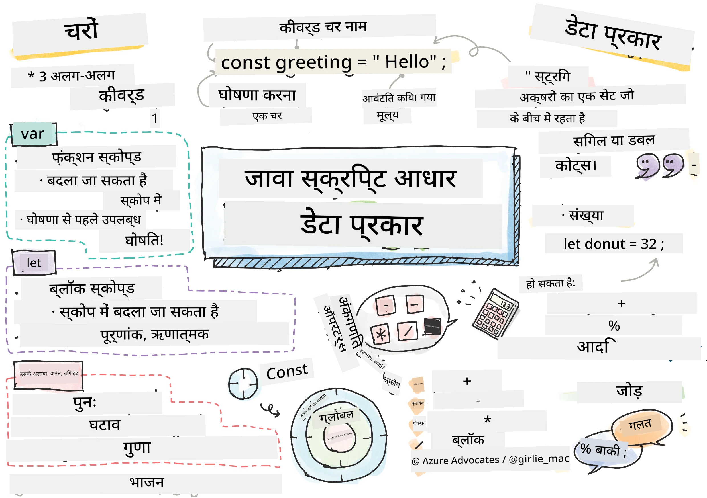
> स्केचनोट द्वारा [Tomomi Imura](https://twitter.com/girlie_mac)

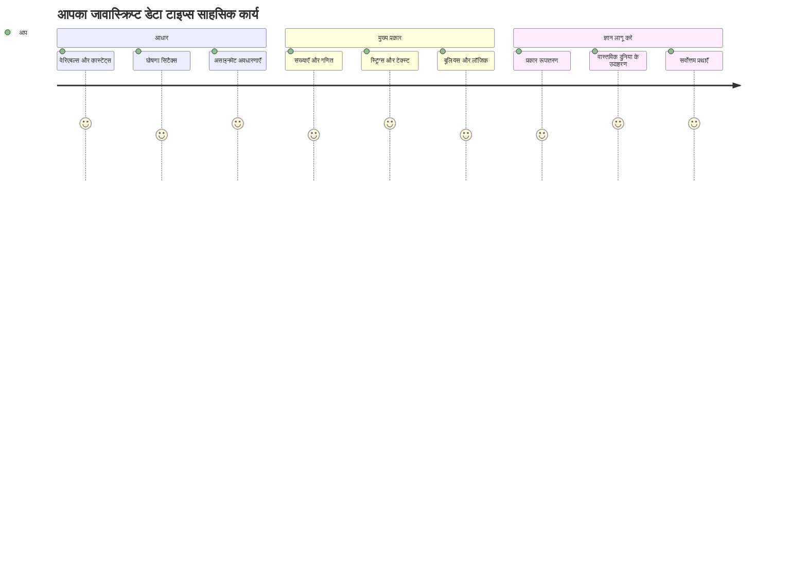
डेटा प्रकार JavaScript में मौलिक अवधारणाओं में से एक हैं जिन्हें आप प्रत्येक प्रोग्राम में मिलेंगे जो आप लिखते हैं। डेटा प्रकारों को आप प्राचीन अलेक्जेंड्रिया के पुस्तकालयाध्यक्षों द्वारा इस्तेमाल किए जाने वाले फ़ाइलिंग सिस्टम की तरह सोचें – उनके पास कविता, गणित और ऐतिहासिक अभिलेखों वाले स्क्रॉल्स के लिए विशिष्ट स्थान थे। JavaScript अलग-अलग प्रकार के डेटा के लिए अलग-अलग श्रेणियाँ बनाकर जानकारी को इसी तरह व्यवस्थित करता है।

इस पाठ में, हम उन मूल डेटा प्रकारों की खोज करेंगे जो JavaScript को काम करते हैं। आप सीखेंगे कि संख्याओं, टेक्स्ट, सच/झूठ के मानों को कैसे संभालना है, और समझेंगे कि सही प्रकार चुनना आपके प्रोग्रामों के लिए क्यों आवश्यक है। ये अवधारणाएँ शुरू में अमूर्त लग सकती हैं, लेकिन अभ्यास के साथ, वे आपकी दूसरी प्रकृति बन जाएंगी।

डेटा प्रकार को समझना JavaScript में सब कुछ बहुत स्पष्ट बना देगा। जैसे वास्तुकारों को एक कैथेड्रल बनाते समय विभिन्न निर्माण सामग्री को समझना आवश्यक होता है, वैसे ही ये मूल बातें उस सबका आधार होंगी जो आप आगे बनाएंगे।

## पूर्व-व्याख्यान क्विज़
[पूर्व-व्याख्यान क्विज़](https://ff-quizzes.netlify.app/web/)

यह पाठ JavaScript की मूल बातें कवर करता है, जो कि वह भाषा है जो वेब पर इंटरैक्टिविटी प्रदान करती है।

> आप इस पाठ को [Microsoft Learn](https://docs.microsoft.com/learn/modules/web-development-101-variables/?WT.mc_id=academic-77807-sagibbon) पर भी ले सकते हैं!

[](https://youtube.com/watch?v=JNIXfGiDWM8 "JavaScript में वेरिएबल")

[](https://youtube.com/watch?v=AWfA95eLdq8 "JavaScript में डेटा टाइप")

> 🎥 ऊपर दी गई तस्वीरों पर क्लिक करें वेरिएबल और डेटा टाइप के बारे में वीडियो देखने के लिए

चलिए शुरू करते हैं वेरिएबल और उन्हें भरने वाले डेटा प्रकारों के साथ!

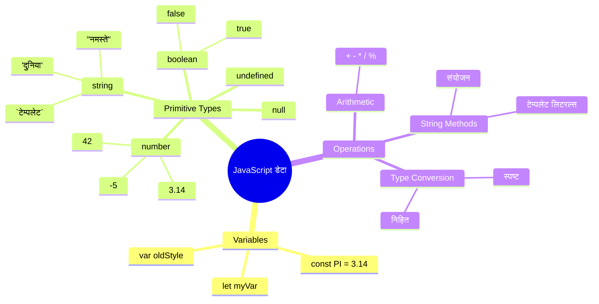
## वेरिएबल्स

वेरिएबल प्रोग्रामिंग में मौलिक बिल्डिंग ब्लॉक्स होते हैं। जैसे मध्यकालीन रसायनशास्त्री विभिन्न पदार्थों को रखने के लिए लेबल वाले जारों का उपयोग करते थे, वैसे ही वेरिएबल आपको जानकारी संग्रहीत करने और उसे एक वर्णनात्मक नाम देने की अनुमति देते हैं ताकि आप बाद में उसका संदर्भ ले सकें। किसी के उम्र को याद रखना है? इसे `age` नामक वेरिएबल में संग्रहीत करें। उपयोगकर्ता का नाम ट्रैक करना है? इसे `userName` नामक वेरिएबल में रखें।

हम JavaScript में वेरिएबल बनाने के आधुनिक तरीके पर ध्यान केंद्रित करेंगे। जो तकनीकें आप यहां सीखेंगे वे वर्षों के भाषा विकास और प्रोग्रामिंग समुदाय द्वारा विकसित सर्वोत्तम प्रथाओं का प्रतिनिधित्व करती हैं।

वेरिएबल बनाने और **घोषित** करने का निम्नलिखित सिंटैक्स होता है: **[keyword] [name]**। यह दो भागों से बना होता है:

- **कीवर्ड**। बदलने योग्य वेरिएबल्स के लिए `let` का उपयोग करें, या स्थिर मानों के लिए `const` का।
- **वेरिएबल का नाम**, यह वह वर्णनात्मक नाम है जिसे आप स्वयं चुनते हैं।

✅ `let` कीवर्ड ES6 में पेश किया गया था और यह आपकी वेरिएबल को एक _ब्लॉक स्कोप_ प्रदान करता है। यह सुझाव दिया जाता है कि आप पुराने `var` की बजाय `let` या `const` का उपयोग करें। हम भविष्य के भागों में ब्लॉक स्कोप की और गहराई से चर्चा करेंगे।

### कार्य - वेरिएबल के साथ काम करना

1. **एक वेरिएबल घोषित करें**। चलिए अपना पहला वेरिएबल बनाकर शुरू करते हैं:

    ```javascript
    let myVariable;
    ```

   **यह क्या पूरा करता है:**
   - यह JavaScript को `myVariable` नामक संग्रहण स्थान बनाने के लिए कहता है
   - JavaScript इस वेरिएबल के लिए मेमोरी में स्थान आवंटित करता है
   - वेरिएबल के पास वर्तमान में कोई मान नहीं है (undefined)

2. **इसमें मान दें**। अब चलिए अपने वेरिएबल में कुछ मान रखते हैं:

    ```javascript
    myVariable = 123;
    ```

   **मान सौंपने का तरीका:**
   - `=` ऑपरेटर हमारे वेरिएबल को मान 123 सौंपता है
   - अब वेरिएबल के पास यह मान होगा, undefined नहीं
   - आप पूरे कोड में इस मान को `myVariable` का उपयोग करके संदर्भित कर सकते हैं

   > ध्यान दें: इस पाठ में `=` का उपयोग "assignment operator" के लिए किया गया है, जिसका मतलब है कि हम वेरिएबल को मान सेट कर रहे हैं। यह समता नहीं दर्शाता।

3. **स्मार्ट तरीका अपनाएं**। वास्तव में, चलिए इन दो चरणों को एक साथ मिला देते हैं:

    ```javascript
    let myVariable = 123;
    ```

    **यह तरीका अधिक कुशल है:**
    - आप एक ही वक्तव्य में वेरिएबल घोषित करते हैं और मान सौंपते हैं
    - यह डेवलपर्स के बीच मानक अभ्यास है
    - यह कोड की लंबाई को कम करता है और स्पष्टता बनाए रखता है

4. **अपना मन बदलें**। अगर हम कोई अलग संख्या संग्रहित करना चाहें तो?

   ```javascript
   myVariable = 321;
   ```

   **पुनः सौंपने को समझना:**
   - अब वेरिएबल के पास 321 है, न कि 123
   - पिछला मान बदल जाता है – वेरिएबल एक समय में केवल एक मान संग्रहीत करता है
   - यह म्यूटेबल (परिवर्तनशीलता) की मुख्य विशेषता है जो `let` से घोषित वेरिएबल में होती है

   ✅ इसे आज़माएं! आप अपने ब्राउज़र में सीधे JavaScript लिख सकते हैं। एक ब्राउज़र विंडो खोलें और Developer Tools पर जाएं। कंसोल में आपको एक प्रॉम्प्ट मिलेगा; `let myVariable = 123` टाइप करें, एंटर दबाएं, फिर `myVariable` टाइप करें। क्या होता है? ध्यान दें, आप इन अवधारणाओं के बारे में अधिक बाद के पाठों में सीखेंगे।

### 🧠 **वेरिएबल्स मास्टरी चेक: सहज होने की प्रक्रिया**

**देखते हैं कि आप वेरिएबल्स के बारे में कैसा महसूस कर रहे हैं:**
- क्या आप वेरिएबल घोषित करने और उसमें मान देने के बीच का फर्क समझा सकते हैं?
- अगर आप वेरिएबल घोषित करने से पहले इसका उपयोग करें तो क्या होता है?
- आप कब `let` को `const` पर प्राथमिकता देंगे?

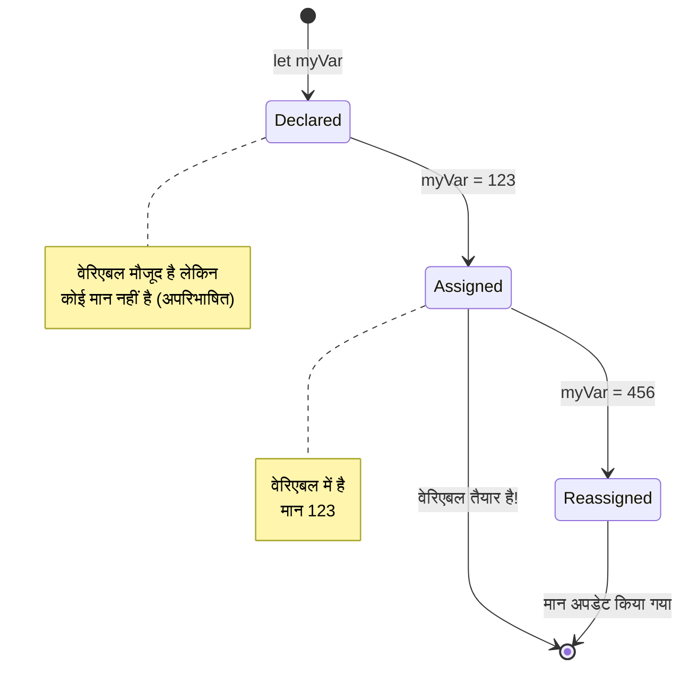
> **त्वरित सुझाव**: वेरिएबल्स को लेबल वाले संग्रहण बॉक्स की तरह सोचें। आप बॉक्स बनाते हैं (`let`), इसमें कुछ डालते हैं (`=`), और बाद में जरूरत पड़ने पर उसमें सामग्री बदल सकते हैं!

## कांसटेंट्स

कभी-कभी आपको ऐसी जानकारी संग्रहित करनी होती है जो प्रोग्राम चलने के दौरान कभी न बदले। ऐसा कांसटेंट को आप प्राचीन ग्रीस में यूक्लिड द्वारा स्थापित गणितीय सिद्धांतों की तरह समझें – एक बार सिद्ध और दर्ज हो जाने पर वे भविष्य के लिए स्थिर रहे।

कांसटेंट्स वेरिएबल्स की तरह काम करते हैं, लेकिन एक महत्वपूर्ण प्रतिबंध के साथ: एक बार मान सौंपने के बाद, इसे बदला नहीं जा सकता। यह अपरिवर्तनीयता आपके प्रोग्राम में महत्वपूर्ण मानों को आकस्मिक परिवर्तनों से बचाने में मदद करती है।

कांसटेंट की घोषणा और आरंभिकी वेरिएबल जैसी ही होती है, बस `const` कीवर्ड का उपयोग होता है। कांसटेंट्स आम तौर पर सभी उच्च अक्षरों में घोषित किए जाते हैं।

```javascript
const MY_VARIABLE = 123;
```

**यह कोड क्या करता है:**
- **एक कांसटेंट बनाता है** जिसका नाम `MY_VARIABLE` और मान 123 है
- **कांसटेंट्स के लिए अपरकेस नामकरण परंपरा** का उपयोग करता है
- **इस मान में भविष्य में कोई बदलाव नहीं होने देता**

कांसटेंट्स के दो मुख्य नियम हैं:

- **आपको इन्हें तुरंत मान देना होगा** – खाली कांसटेंट्स की अनुमति नहीं है!
- **आप इस मान को कभी बदल नहीं सकते** – अगर आप ऐसा करने की कोशिश करेंगे तो JavaScript त्रुटि देगा। आइए देखें:

   **सरल मान** - नीचे दिया हुआ अनुमति नहीं है:

      ```javascript
      const PI = 3;
      PI = 4; // अनुमति नहीं है
      ```

   **आपको याद रखने योग्य बातें:**
   - कांसटेंट को पुनः सौंपने का प्रयास त्रुटि उत्पन्न करेगा
   - महत्वपूर्ण मानों को आकस्मिक परिवर्तनों से बचाता है
   - आपके प्रोग्राम में मान को लगातार बनाए रखता है
 
   **ऑब्जेक्ट संदर्भ सुरक्षित है** - नीचे दिया गया अनुमति नहीं है:

      ```javascript
      const obj = { a: 3 };
      obj = { b: 5 } // अनुमति नहीं है
      ```

   **इन अवधारणाओं को समझना:**
   - पूरे ऑब्जेक्ट को नए ऑब्जेक्ट से बदलने से रोकता है
   - मूल ऑब्जेक्ट के संदर्भ की सुरक्षा करता है
   - मेमोरी में ऑब्जेक्ट की पहचान को बनाए रखता है

    **ऑब्जेक्ट का मान सुरक्षित नहीं है** - नीचे दिया गया अनुमति है:

      ```javascript
      const obj = { a: 3 };
      obj.a = 5;  // अनुमति है      
      ```

      **यहाँ क्या होता है इसके बारे में:**
      - ऑब्जेक्ट के अंदर गुण मान को बदला जाता है
      - उसी ऑब्जेक्ट संदर्भ को बनाए रखा जाता है
      - दिखाता है कि ऑब्जेक्ट की सामग्री बदल सकती है जबकि संदर्भ स्थिर रहता है

   > ध्यान दें, `const` का मतलब केवल संदर्भ पुनः सौंपने से सुरक्षित है। मान _अपरिवर्तनीय_ नहीं है और बदल सकता है, खासकर जब वह जटिल संरचना जैसे ऑब्जेक्ट हो।

## डेटा प्रकार

JavaScript जानकारी को विभिन्न श्रेणियों में व्यवस्थित करता है जिन्हें डेटा प्रकार कहा जाता है। यह अवधारणा प्राचीन विद्वानों के ज्ञान को वर्गीकृत करने के तरीके का प्रतिबिंब है – अरस्तू ने विभिन्न प्रकार के तर्क को अलग किया था, यह जानते हुए कि तार्किक सिद्धांतों को कविता, गणित और प्राकृतिक दार्शनिकता पर समान रूप से लागू नहीं किया जा सकता।

डेटा प्रकार महत्वपूर्ण हैं क्योंकि विभिन्न ऑपरेशन अलग-अलग प्रकार की जानकारी पर काम करते हैं। जैसे आप किसी व्यक्ति के नाम पर अंकगणित नहीं कर सकते या गणितीय समीकरण को वर्णानुक्रम में नहीं लगा सकते, वैसे ही JavaScript प्रत्येक ऑपरेशन के लिए उपयुक्त डेटा प्रकार की मांग करता है। इसे समझने से त्रुटियों से बचा जा सकता है और आपके कोड को अधिक विश्वसनीय बनाया जा सकता है।

वेरिएबल्स कई प्रकार के मान रख सकते हैं, जैसे संख्याएँ और टेक्स्ट। इन विभिन्न प्रकार के मानों को **डेटा प्रकार** कहा जाता है। डेटा प्रकार सॉफ़्टवेयर विकास का एक महत्वपूर्ण हिस्सा हैं क्योंकि यह डेवलपर्स को यह निर्णय लेने में मदद करता है कि कोड कैसे लिखा जाए और सॉफ़्टवेयर कैसे चले। इसके अलावा, कुछ डेटा प्रकारों के विशिष्ट फ़ीचर होते हैं जो किसी मान को बदलने या अतिरिक्त जानकारी निकालने में मदद करते हैं।

✅ डेटा प्रकार को JavaScript डेटा प्रिमिटिव्स भी कहा जाता है, क्योंकि ये भाषा द्वारा प्रदान किए जाने वाले सबसे निचले स्तर के डेटा प्रकार हैं। सात प्रिमिटिव डेटा प्रकार हैं: string, number, bigint, boolean, undefined, null, और symbol। एक मिनट लें और कल्पना करें कि ये प्रिमिटिव्स क्या प्रतिनिधित्व कर सकते हैं। `zebra` क्या है? `0` कैसे? `true`?

### संख्याएँ

संख्याएँ JavaScript में सबसे सहज डेटा प्रकार हैं। चाहे आप पूर्ण संख्या जैसे 42, दशमलव जैसे 3.14, या नकारात्मक संख्या जैसे -5 के साथ काम कर रहे हों, JavaScript सभी को समान रूप से संभालता है।

याद रखें हमारा वेरिएबल जिसमें हमने 123 रखा था? वह वास्तव में एक संख्या डेटा प्रकार था:

```javascript
let myVariable = 123;
```

**मुख्य विशेषताएं:**
- JavaScript स्वतः संख्यात्मक मान पहचान लेता है
- आप इन वेरिएबल्स के साथ गणितीय ऑपरेशन कर सकते हैं
- स्पष्ट प्रकार घोषणा आवश्यक नहीं है

वेरिएबल्स सभी प्रकार की संख्याएँ संग्रहित कर सकते हैं, जिनमें दशमलव और नकारात्मक संख्याएँ भी शामिल हैं। संख्याएँ गणितीय ऑपरेटर्स के साथ भी इस्तेमाल की जा सकती हैं, जो अगली अनुभाग में कवर किए गए हैं।

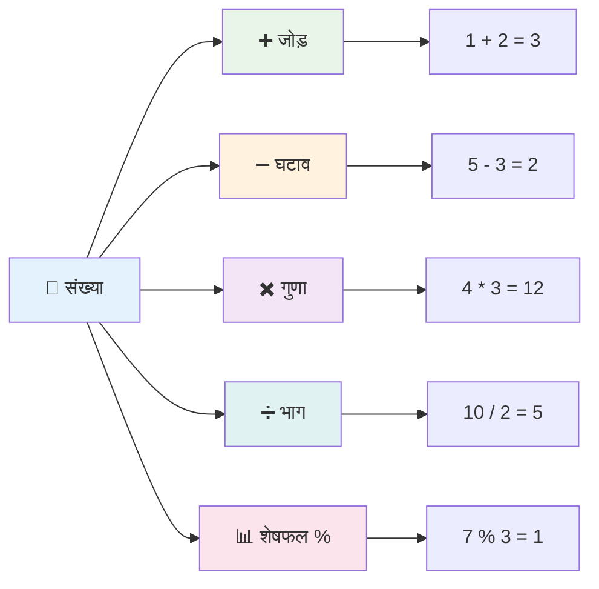
### अंकगणितीय ऑपरेटर्स

अंकगणितीय ऑपरेटर्स आपको JavaScript में गणितीय गणनाएँ करने देते हैं। ये ऑपरेटर्स उन ही सिद्धांतों का पालन करते हैं जिन्हें गणितज्ञ सदियों से उपयोग कर रहे हैं – वे ही प्रतीक जो स्कॉलर अल-ख्वारिज़्मी जैसे विद्वानों के कार्यों में देखे गए, जिन्होंने बीजगणितीय संकेतन विकसित किया।

ऑपरेटर्स वैसे ही काम करते हैं जैसे पारंपरिक गणित में अपेक्षित होता है: प्लस जोड़ के लिए, माइनस घटाव के लिए, आदि।

अंकगणितीय कार्य करते समय उपयोग करने वाले कुछ ऑपरेटर्स यहाँ दिए गए हैं:

| प्रतीक | विवरण                                                                 | उदाहरण                              |
| ------ | ------------------------------------------------------------------- | ----------------------------------- |
| `+`    | **जोड़**: दो संख्याओं का योग करता है                              | `1 + 2 //अपेक्षित उत्तर 3 है`       |
| `-`    | **घटाव**: दो संख्याओं का अंतर निकालता है                          | `1 - 2 //अपेक्षित उत्तर -1 है`      |
| `*`    | **गुणा**: दो संख्याओं का गुणनफल निकालता है                        | `1 * 2 //अपेक्षित उत्तर 2 है`       |
| `/`    | **भाग**: दो संख्याओं का भागफल निकालता है                         | `1 / 2 //अपेक्षित उत्तर 0.5 है`     |
| `%`    | **शेषफल**: दो संख्याओं के भाग के बाद बचा हुआ शेषफल निकालता है    | `1 % 2 //अपेक्षित उत्तर 1 है`       |

✅ इसे आज़माएं! अपने ब्राउज़र के कंसोल में कोई अंकगणितीय ऑपरेशन करें। परिणामों ने आपको चौंकाया क्या?

### 🧮 **गणित कौशल जांच: आत्मविश्वास के साथ गणना करना**

**अपनी अंकगणित समझ का परीक्षण करें:**
- `/` (भाग) और `%` (शेषफल) में क्या अंतर है?
- क्या आप अनुमान लगा सकते हैं कि `10 % 3` क्या होगा? (संकेत: यह 3.33... नहीं है)
- प्रोग्रामिंग में शेषफल ऑपरेटर क्यों उपयोगी हो सकता है?

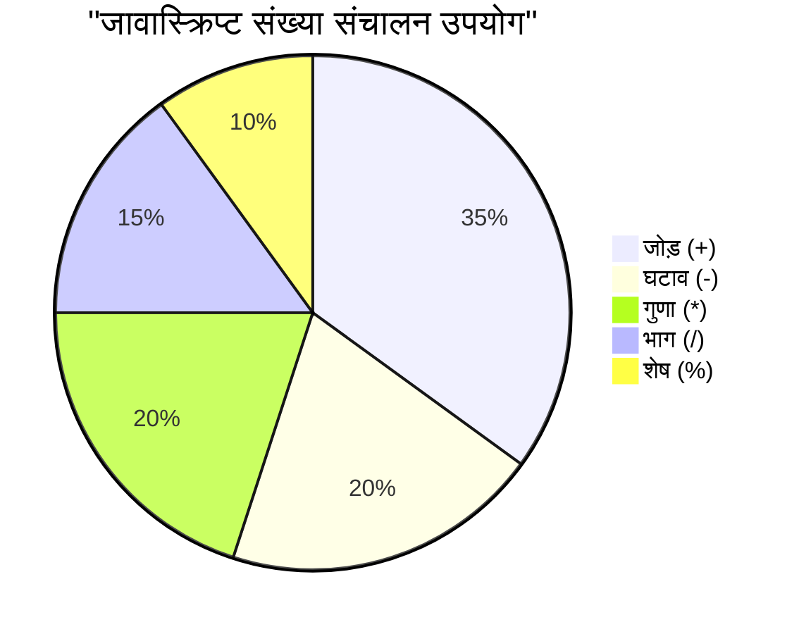
> **वास्तविक दुनिया की जानकारी**: शेषफल ऑपरेटर (%) संख्याओं के सम/विषम होने की जाँच, पैटर्न बनाना, या एररे में चक्र लगाने के लिए बेहद उपयोगी है!

### स्ट्रिंग्स

JavaScript में पाठ्य डेटा को स्ट्रिंग्स के रूप में दर्शाया जाता है। "स्ट्रिंग" शब्द का अर्थ है एक के बाद एक जुड़े हुए अक्षर, जैसे मध्यकालीन मठों में पांडुलिपियों में शब्द और वाक्य बनाने के लिए अक्षरों को जोड़ा जाता था।

स्ट्रिंग्स वेब विकास के लिए मौलिक हैं। वेबसाइट पर प्रदर्शित हर टेक्स्ट – उपयोगकर्ता नाम, बटन लेबल, त्रुटि संदेश, सामग्री – को स्ट्रिंग डेटा के रूप में संभाला जाता है। स्ट्रिंग्स को समझना कार्यात्मक उपयोगकर्ता इंटरफेस बनाने के लिए महत्वपूर्ण है।

स्ट्रिंग्स अक्षरों का एक सेट है जो सिंगल या डबल कोट्स के बीच रहता है।

```javascript
'This is a string'
"This is also a string"
let myString = 'This is a string value stored in a variable';
```

**इन अवधारणाओं को समझना:**
- स्ट्रिंग्स को परिभाषित करने के लिए या तो सिंगल कोट `'` या डबल कोट `"` का उपयोग करता है
- टेक्स्ट डेटा संग्रहीत करता है जिसमें अक्षर, संख्या और प्रतीक शामिल हो सकते हैं
- वेरिएबल्स को बाद में उपयोग के लिए स्ट्रिंग मान सौंपता है
- कोट्स आवश्यक हैं ताकि टेक्स्ट को वेरिएबल नाम से अलग किया जा सके

स्ट्रिंग लिखते समय कोट्स का उपयोग करना याद रखें, अन्यथा JavaScript इसे वेरिएबल नाम समझेगा।

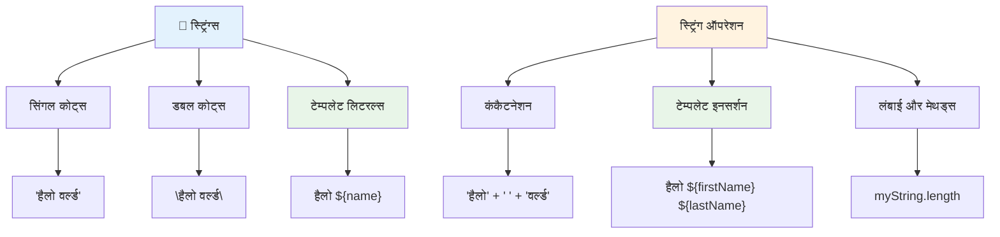
### स्ट्रिंग्स का स्वरूपण

स्ट्रिंग मैनिपुलेशन आपको टेक्स्ट तत्वों को जोड़ने, वेरिएबल्स को शामिल करने, और प्रोग्राम की स्थिति के अनुसार प्रतिक्रिया करने वाली गतिशील सामग्री बनाने की अनुमति देता है। यह तकनीक आपको प्रोग्रामेटिक रूप से टेक्स्ट बनाने की सुविधा देती है।

आमतौर पर आपको कई स्ट्रिंग्स को जोड़ना होता है – इस प्रक्रिया को संकेतन (concatenation) कहा जाता है।
दो या अधिक स्ट्रिंग्स को **संयोजन** करने के लिए, या उन्हें एक साथ जोड़ने के लिए, `+` ऑपरेटर का उपयोग करें।

```javascript
let myString1 = "Hello";
let myString2 = "World";

myString1 + myString2 + "!"; //हैलोवर्ल्ड!
myString1 + " " + myString2 + "!"; //हैलो वर्ल्ड!
myString1 + ", " + myString2 + "!"; //हैलो, वर्ल्ड!
```

**कदम दर कदम, यहाँ क्या हो रहा है:**
- `+` ऑपरेटर का उपयोग करके कई स्ट्रिंग्स को **एक साथ जोड़ता है**
- पहले उदाहरण में स्ट्रिंग्स को सीधे बिना स्पेस के **जोड़ता है**
- पठनीयता के लिए स्ट्रिंग्स के बीच स्पेस कैरेक्टर `" "` **जोड़ता है**
- उचित फॉर्मेटिंग बनाने के लिए कॉमा जैसे विराम चिह्न **सम्मिलित करता है**

✅ क्यों JavaScript में `1 + 1 = 2` होता है, लेकिन `'1' + '1' = 11`? सोचिए। `'1' + 1` के बारे में क्या कहेंगे?

**टेम्पलेट लिटरेल्स** स्ट्रिंग्स को फॉर्मेट करने का एक और तरीका है, सिवाय इसके कि कोट्स के बजाय बैकटिक `` ` `` का उपयोग किया जाता है। जो भी सामान्य टेक्स्ट नहीं है, उसे प्लेसहोल्डर `${ }` के अंदर रखा जाना चाहिए। इसमें कोई भी वेरिएबल्स शामिल हो सकते हैं जो स्ट्रिंग्स हो सकते हैं।

```javascript
let myString1 = "Hello";
let myString2 = "World";

`${myString1} ${myString2}!` //हैलो वर्ल्ड!
`${myString1}, ${myString2}!` //हैलो, वर्ल्ड!
```

**आइए प्रत्येक भाग को समझें:**
- टेम्पलेट लिटरेल्स बनाने के लिए सामान्य कोट्स के बजाय बैकटिक `` ` `` **का उपयोग करता है**
- `${}` प्लेसहोल्डर सिंटैक्स का उपयोग करके सीधे वेरिएबल्स को **एम्बेड करता है**
- स्पेस और फॉर्मेटिंग को बिलकुल उसी तरह **सहेजता है जैसा लिखा गया है**
- वेरिएबल्स के साथ जटिल स्ट्रिंग्स बनाने का एक साफ-सुथरा तरीका **प्रदान करता है**

आप अपनी फॉर्मेटिंग ज़रूरतों को किसी भी विधि से पूरा कर सकते हैं, लेकिन टेम्पलेट लिटरेल्स किसी भी स्पेस और लाइन ब्रेक का सम्मान करेंगे।

✅ आप टेम्पलेट लिटरेल कब उपयोग करेंगे और साधारण स्ट्रिंग कब?

### 🔤 **स्ट्रिंग दक्षता जांच: टेक्स्ट मैनिपुलेशन आत्मविश्वास**

**अपने स्ट्रिंग कौशल का मूल्यांकन करें:**
- क्या आप समझा सकते हैं कि `'1' + '1'` `2` के बजाय `'11'` क्यों होता है?
- आपको कौन सा स्ट्रिंग मेथड अधिक पठनीय लगता है: संयोजन या टेम्पलेट लिटरेल्स?
- अगर आप स्ट्रिंग के चारों ओर कोट भूल जाते हैं तो क्या होता है?

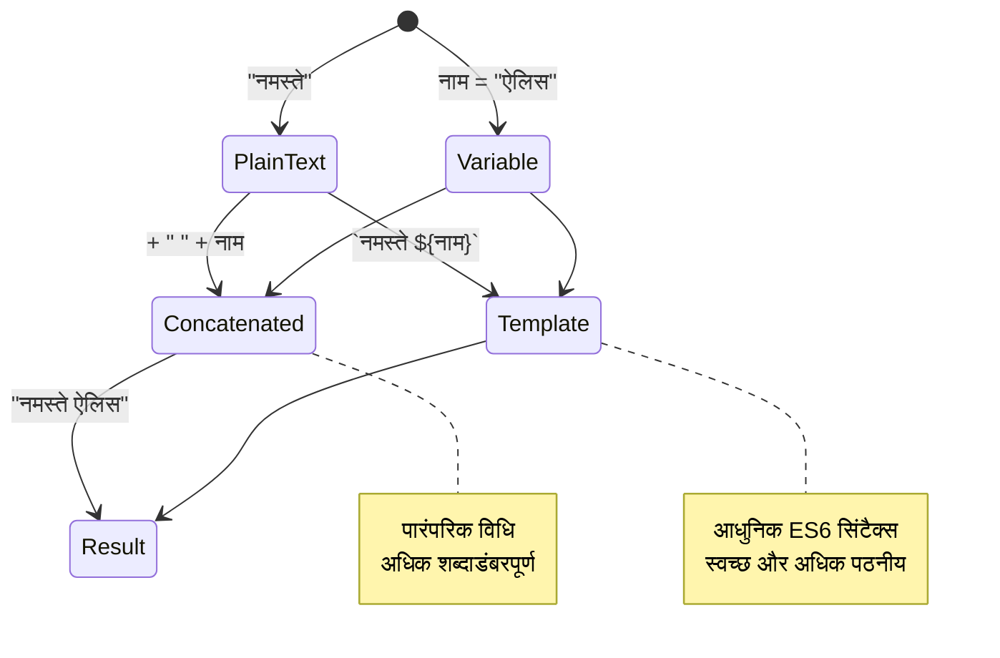
> **प्रो टिप**: टेम्पलेट लिटरेल को आमतौर पर जटिल स्ट्रिंग बनाने के लिए वरीयता दी जाती है क्योंकि वे अधिक पठनीय होते हैं और मल्टी-लाइन स्ट्रिंग्स को सुंदरता से संभालते हैं!

### बुलियन (Booleans)

बुलियन सबसे सरल डेटा स्वरूप का प्रतिनिधित्व करते हैं: वे केवल दो मानों में से एक को रख सकते हैं – `true` या `false`। यह बाइनरी लॉजिक सिस्टम जॉर्ज बुल (George Boole), 19वीं सदी के गणितज्ञ, जोनें बुलियन बीजगणित विकसित किया था, के कार्य से उत्पन्न हुआ है।

अपनी सरलता के बावजूद, बुलियन प्रोग्राम लॉजिक के लिए आवश्यक होते हैं। वे आपके कोड को शर्तों के आधार पर निर्णय लेने में सक्षम बनाते हैं – जैसे कि उपयोगकर्ता लॉग इन है या नहीं, बटन क्लिक किया गया या नहीं, या कुछ विशेष मापदंड पूरे हुए हैं या नहीं।

बुलियन केवल दो मान हो सकते हैं: `true` या `false`। बुलियन आपको यह तय करने में मदद करते हैं कि कौन सी कोड की लाइनें तब चलनी चाहिए जब कुछ शर्तें पूरी हों। कई मामलों में, [ऑपरेटर](../../../../2-js-basics/1-data-types) बुलियन मान सेट करने में मदद करते हैं और आप अक्सर देखेंगे और लिखेंगे कि वेरिएबल्स को ऑपरेटर के साथ इनिशियलाइज़ या उनका मान अपडेट किया जा रहा हो।

```javascript
let myTrueBool = true;
let myFalseBool = false;
```

**ऊपर हमने:**
- बुलियन मूल्य `true` रखने वाला वेरिएबल **बनाया**
- बुलियन मूल्य `false` रखने का तरीका **दिखाया**
- सटीक कीवर्ड `true` और `false` (कोट्स की जरूरत नहीं) **का उपयोग किया**
- इन वेरिएबल्स को कंडीशनल स्टेटमेंट्स में उपयोग के लिए तैयार किया

✅ किसी वेरिएबल को 'ट्रूथी' माना जा सकता है यदि वह_BOOLEAN_ `true` के रूप में मूल्यांकन हो। दिलचस्प बात यह है कि, JavaScript में, [सभी मान ट्रूथी होते हैं जब तक कि उन्हें फाल्सी न घोषित किया गया हो](https://developer.mozilla.org/docs/Glossary/Truthy)।

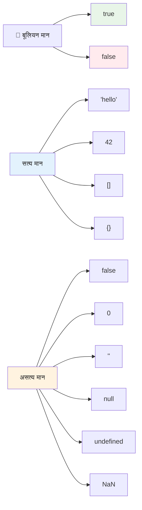
### 🎯 **बुलियन लॉजिक जांच: निर्णय लेने के कौशल**

**अपने बुलियन समझ का परीक्षण करें:**
- आपको क्यों लगता है कि JavaScript के पास केवल `true` और `false` से परे "truthy" और "falsy" मान हैं?
- इनमें से कौन सा फाल्सी है, आप अनुमान लगा सकते हैं: `0`, `"0"`, `[]`, `"false"`?
- प्रोग्राम के फ्लो को नियंत्रित करने में बुलियन कैसे उपयोगी हो सकते हैं?

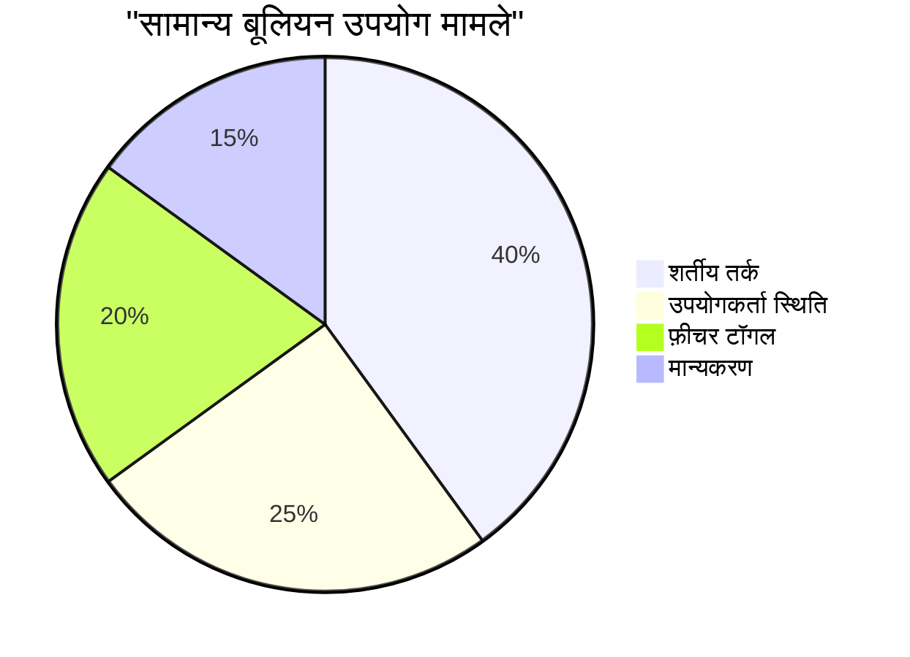
> **याद रखें**: JavaScript में केवल 6 मान फाल्सी होते हैं: `false`, `0`, `""`, `null`, `undefined`, और `NaN`। बाकी सब ट्रूथी हैं!

---

## 📊 **आपके डेटा प्रकार टूलकिट का सारांश**

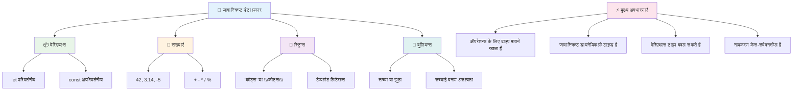
## GitHub Copilot एजेंट चैलेंज 🚀

एजेंट मोड का उपयोग करके निम्नलिखित चैलेंज पूरा करें:

**विवरण:** एक पर्सनल इन्फॉर्मेशन मैनेजर बनाएं जो इस पाठ में सीखे गए सभी JavaScript डेटा प्रकारों का प्रदर्शन करे, जबकि वास्तविक-विश्व डेटा परिदृश्यों को संभालता हो।

**प्रॉम्प्ट:** एक JavaScript प्रोग्राम बनाएं जो एक उपयोगकर्ता प्रोफ़ाइल वस्तु बनाए जिसमें: व्यक्ति का नाम (स्ट्रिंग), आयु (नंबर), विद्यार्थी स्थिति (बुलियन), पसंदीदा रंगों की एक सूची, और एक पता वस्तु जिसमें सड़क, शहर, और ज़िप कोड के गुण शामिल हों। प्रोफ़ाइल जानकारी प्रदर्शित करने और व्यक्तिगत फ़ील्ड अपडेट करने के लिए फ़ंक्शन शामिल करें। स्ट्रिंग संयोजन, टेम्पलेट लिटरेल्स, आयु के गणितीय संचालन, और विद्यार्थी स्थिति के लिए बुलियन लॉजिक प्रदर्शित करना सुनिश्चित करें।

[एजेंट मोड](https://code.visualstudio.com/blogs/2025/02/24/introducing-copilot-agent-mode) के बारे में अधिक जानें।

## 🚀 चुनौती

JavaScript में कुछ ऐसे व्यवहार हैं जो डेवलपर्स को आश्चर्यचकित कर सकते हैं। यहाँ एक क्लासिक उदाहरण है: अपने ब्राउज़र के कंसोल में यह टाइप करने का प्रयास करें: `let age = 1; let Age = 2; age == Age` और परिणाम देखें। यह `false` लौटाता है – क्या आप समझा सकते हैं क्यों?

यह JavaScript के कई व्यवहारों में से एक है जिसे समझना उपयोगी है। इन अजीबताओं से परिचित होने पर आप अधिक विश्वसनीय कोड लिख पाएंगे और समस्याओं को अधिक प्रभावी ढंग से डिबग कर पाएंगे।

## लेक्चर के बाद क्विज़
[Post-lecture quiz](https://ff-quizzes.netlify.app)

## समीक्षा और स्वअध्ययन

[यहाँ JavaScript अभ्यासों की सूची देखें](https://css-tricks.com/snippets/javascript/) और एक आज़माएं। आपने क्या सीखा?

## असाइनमेंट

[Data Types Practice](assignment.md)

## 🚀 आपके JavaScript डेटा प्रकारों की मास्टरी टाइमलाइन

### ⚡ **अगले 5 मिनट में आप क्या कर सकते हैं**
- [ ] अपने ब्राउज़र के कंसोल को खोलें और विभिन्न डेटा प्रकारों के 3 वेरिएबल बनाएं
- [ ] चुनौती का प्रयास करें: `let age = 1; let Age = 2; age == Age` और पता लगाएं कि यह false क्यों है
- [ ] अपने नाम और पसंदीदा नंबर के साथ स्ट्रिंग संयोजन का अभ्यास करें
- [ ] देखें कि जब आप एक संख्या स्ट्रिंग में जोड़ते हैं तो क्या होता है

### 🎯 **इस घंटे में आप क्या हासिल कर सकते हैं**
- [ ] पोस्ट-लेसन क्विज़ पूरा करें और किसी भी भ्रमित करने वाले विषयों की समीक्षा करें
- [ ] एक मिनी कैलकुलेटर बनाएं जो दो संख्याओं को जोड़, घटा, गुणा और भाग करे
- [ ] टेम्पलेट लिटरेल्स का उपयोग करते हुए एक सरल नाम फॉर्मेटर बनाएं
- [ ] `==` और `===` तुलना ऑपरेटरों के बीच के अंतर का अन्वेषण करें
- [ ] विभिन्न डेटा प्रकारों में रूपांतरण का अभ्यास करें

### 📅 **आपका सप्ताह भर का JavaScript आधार**
- [ ] आत्मविश्वास और रचनात्मकता के साथ असाइनमेंट पूरा करें
- [ ] सभी सीखे गए डेटा प्रकारों का उपयोग करते हुए एक व्यक्तिगत प्रोफ़ाइल वस्तु बनाएं
- [ ] [CSS-Tricks के JavaScript अभ्यासों](https://css-tricks.com/snippets/javascript/) के साथ अभ्यास करें
- [ ] बुलियन लॉजिक का उपयोग करते हुए एक सरल फॉर्म वैलिडेटर बनाएं
- [ ] एरे और ऑब्जेक्ट डेटा प्रकारों के साथ प्रयोग करें (आने वाले पाठों का पूर्वावलोकन)
- [ ] एक JavaScript समुदाय में शामिल हों और डेटा प्रकारों के बारे में प्रश्न पूछें

### 🌟 **आपका महीने भर का परिवर्तन**
- [ ] बड़े प्रोग्रामिंग प्रोजेक्ट्स में डेटा प्रकार ज्ञान को एकीकृत करें
- [ ] वास्तविक अनुप्रयोगों में प्रत्येक डेटा प्रकार का उपयोग कब और क्यों करना है समझें
- [ ] अन्य शुरुआती लोगों को JavaScript की मूल बातें समझाने में मदद करें
- [ ] एक छोटी एप्लिकेशन बनाएं जो विभिन्न प्रकार के उपयोगकर्ता डेटा का प्रबंधन करे
- [ ] टाइप कोअरशन और सख्त समानता जैसे उन्नत डेटा प्रकार अवधारणाओं का अन्वेषण करें
- [ ] डॉक्यूमेंटेशन सुधार के साथ ओपन सोर्स JavaScript प्रोजेक्ट्स में योगदान दें

### 🧠 **अंतिम डेटा प्रकार मास्टरी जांच**

**अपने JavaScript आधार का जश्न मनाएं:**
- किस डेटा प्रकार ने आपको इसके व्यवहार के संदर्भ में सबसे अधिक आश्चर्यचकित किया?
- आप कितने सहज महसूस करते हैं वेरिएबल बनाम कॉन्स्टेंट को किसी मित्र को समझाने में?
- JavaScript के टाइप सिस्टम के बारे में आपने सबसे रोचक क्या खोजा?
- इन मूल सिद्धांतों के साथ आप कौन सा वास्तविक दुनिया का ऐप्लिकेशन बना सकते हैं?

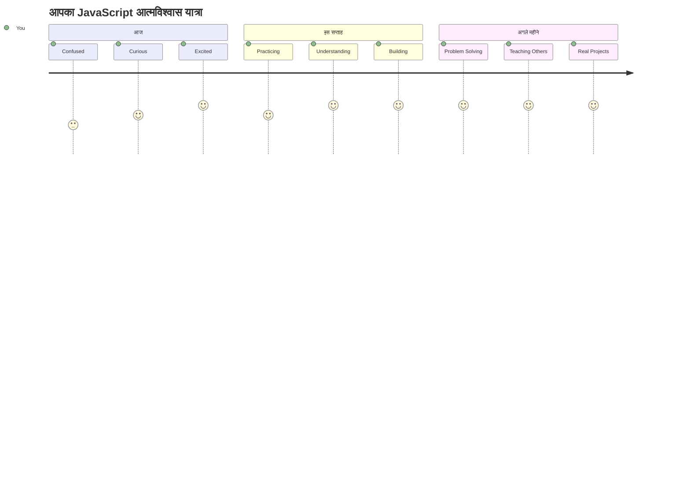
> 💡 **आपने आधार तैयार कर लिया है!** डेटा प्रकारों को समझना कहानी लिखने से पहले वर्णमाला सीखने जैसा है। हर JavaScript प्रोग्राम जो आप कभी लिखेंगे, इन मूल अवधारणाओं का उपयोग करेगा। अब आपके पास इंटरैक्टिव वेबसाइट्स, गतिशील एप्लिकेशन बनाने और कोड के ज़रिए वास्तविक दुनिया की समस्याओं को हल करने के लिए निर्माण खंड हैं। JavaScript की अद्भुत दुनिया में आपका स्वागत है! 🎉

---

<!-- CO-OP TRANSLATOR DISCLAIMER START -->
**अस्वीकरण**:  
इस दस्तावेज़ का अनुवाद एआई अनुवाद सेवा [Co-op Translator](https://github.com/Azure/co-op-translator) का उपयोग करके किया गया है। यद्यपि हम सटीकता के लिए प्रयासरत हैं, कृपया ध्यान दें कि स्वचालित अनुवादों में त्रुटियाँ या असंगतियाँ हो सकती हैं। मूल दस्तावेज़ को उसकी मूल भाषा में विश्वसनीय स्रोत माना जाना चाहिए। महत्वपूर्ण जानकारी के लिए, पेशेवर मानव अनुवाद की अनुशंसा की जाती है। हम इस अनुवाद के उपयोग से उत्पन्न किसी भी गलतफहमी या गलत व्याख्या के लिए उत्तरदायी नहीं हैं।
<!-- CO-OP TRANSLATOR DISCLAIMER END -->