<!--
CO_OP_TRANSLATOR_METADATA:
{
  "original_hash": "71f7d7dafa1c7194d79ddac87f669ff9",
  "translation_date": "2026-01-06T16:03:47+00:00",
  "source_file": "2-js-basics/2-functions-methods/README.md",
  "language_code": "hi"
}
-->
# JavaScript बेसिक्स: मेथड्स और फंक्शन्स

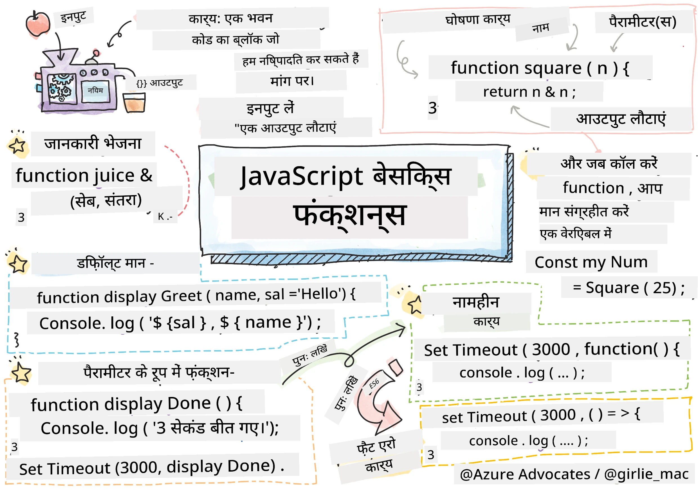
> स्केचनोट द्वारा [Tomomi Imura](https://twitter.com/girlie_mac)

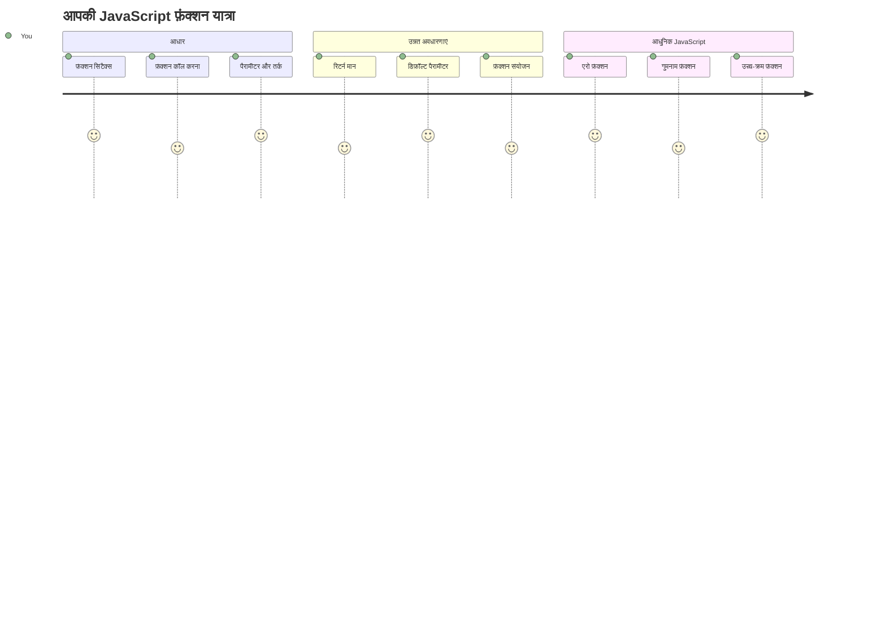
## प्री-लेक्चर क्विज़
[प्री-लेक्चर क्विज़](https://ff-quizzes.netlify.app)

एक ही कोड को बार-बार लिखना प्रोग्रामिंग की सबसे आम निराशाओं में से एक है। फंक्शन्स इस समस्या को हल करते हैं क्योंकि ये आपको कोड को पुन: प्रयोज्य ब्लॉकों में पैकेज करने देते हैं। फंक्शन्स को ऐसे सोचें जैसे कि वे मानकीकृत भाग हैं जिन्होंने हेनरी फोर्ड की असेम्बली लाइन क्रांतिकारी बना दी – एक बार जब आप एक विश्वसनीय कंपोनेंट बनाते हैं, तो आप इसे जरूरत के अनुसार कहीं भी बिना फिर से बनाये उपयोग कर सकते हैं।

फंक्शन्स आपको कोड के टुकड़ों को बंडल करने देते हैं ताकि आप उन्हें अपने प्रोग्राम में हर जगह पुनः उपयोग कर सकें। हर जगह एक ही लॉजिक को कॉपी और पेस्ट करने के बजाय, आप एक बार फंक्शन बना सकते हैं और जब भी जरूरत हो उसे कॉल कर सकते हैं। यह तरीका आपके कोड को व्यवस्थित रखता है और अपडेट करना कहीं ज्यादा आसान बनाता है।

इस पाठ में, आप सीखेंगे कि खुद के फंक्शन्स कैसे बनाएं, उनमें जानकारी कैसे पास करें, और उपयोगी परिणाम कैसे वापस प्राप्त करें। आप फंक्शन्स और मेथड्स के बीच का फर्क समझेंगे, आधुनिक सिंटैक्स के तरीकों को जानेंगे, और देखेंगे कि फंक्शन्स एक दूसरे के साथ कैसे काम कर सकते हैं। हम इन अवधारणाओं को चरण-दर-चरण बनाएंगे।

[](https://youtube.com/watch?v=XgKsD6Zwvlc "मेथड्स और फंक्शन्स")

> 🎥 ऊपर की छवि पर क्लिक करें मेथड्स और फंक्शन्स पर एक वीडियो के लिए।

> आप यह पाठ [Microsoft Learn](https://docs.microsoft.com/learn/modules/web-development-101-functions/?WT.mc_id=academic-77807-sagibbon) पर भी ले सकते हैं!

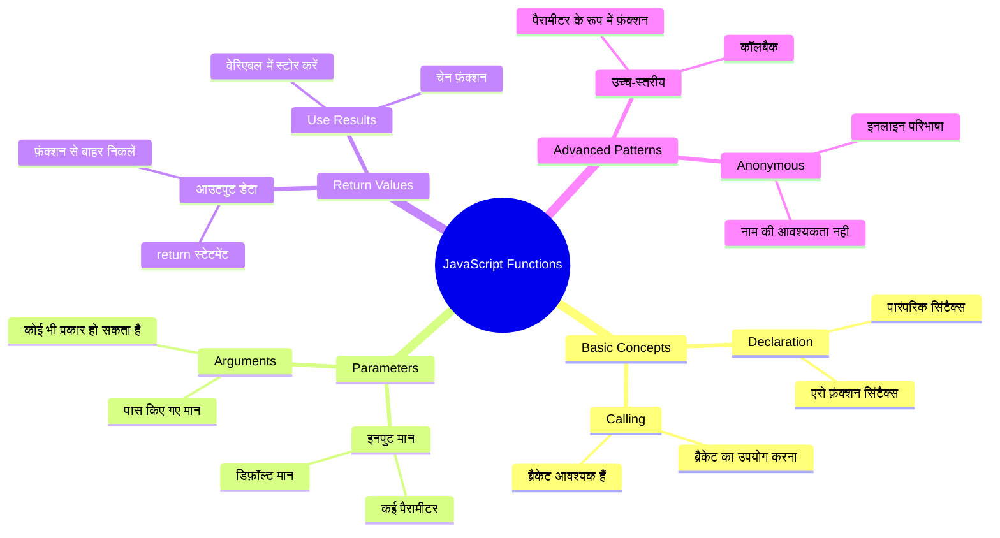
## फंक्शन्स

एक फंक्शन एक स्व-निहित कोड का ब्लॉक होता है जो एक विशिष्ट कार्य करता है। यह उस लॉजिक को समेटे रखता है जिसे आप जब भी जरूरत हो चला सकते हैं।

अपने प्रोग्राम में एक ही कोड को कई बार लिखने के बजाय, आप उसे एक फंक्शन में पैकेज कर सकते हैं और जब भी जरूरत हो उस फंक्शन को कॉल कर सकते हैं। यह तरीका आपके कोड को साफ सुथरा रखता है और अपडेट करना कहीं आसान बना देता है। सोचिए अगर आपको अपनी कोडबेस के 20 अलग-अलग स्थानों पर फैले लॉजिक को बदलना पड़े तो कितना चुनौतीपूर्ण होगा।

अपने फंक्शन्स को स्पष्ट नाम देना जरूरी है। एक अच्छा नामित फंक्शन अपने उद्देश्य को स्पष्ट रूप से संप्रेषित करता है – जब आप `cancelTimer()` देखते हैं, तो आप तुरंत समझ जाते हैं कि यह क्या करता है, ठीक उसी तरह जैसे एक स्पष्ट लेबल वाला बटन आपको बताता है कि क्लिक करने पर क्या होगा।

## फंक्शन बनाना और कॉल करना

आइए देखें कि फंक्शन कैसे बनाते हैं। इसका सिंटैक्स एक समान पैटर्न का पालन करता है:

```javascript
function nameOfFunction() { // फ़ंक्शन परिभाषा
 // फ़ंक्शन परिभाषा/शरीर
}
```

इसे तोड़कर समझें:
- `function` कीवर्ड जावास्क्रिप्ट को बताता है "अरे, मैं एक फंक्शन बना रहा हूँ!"
- `nameOfFunction` वह जगह है जहाँ आप अपने फंक्शन को एक वर्णनात्मक नाम देते हैं
- कर्कश ब्रैकेट्स `()` उन पैरामीटर को दर्शाते हैं जहाँ आप पैरामीटर जोड़ सकते हैं (हम जल्द ही इस पर आएंगे)
- घुंघराले ब्रैकेट्स `{}` वे कोड होते हैं जो आप कॉल करने पर चलते हैं

आइए एक साधारण अभिवादन फंक्शन बनाकर इसे देखें:

```javascript
function displayGreeting() {
  console.log('Hello, world!');
}
```

यह फंक्शन कंसोल पर "Hello, world!" प्रिंट करता है। एक बार परिभाषित होने के बाद, आप इसे जरूरत के अनुसार कई बार उपयोग कर सकते हैं।

अपने फंक्शन को चलाने (या "कॉल" करने) के लिए, उसका नाम लिखें और उसके बाद पैरेंथेसिस लगाएं। जावास्क्रिप्ट आपको अपने फंक्शन को पहले या बाद में परिभाषित करने की अनुमति देता है – जावास्क्रिप्ट इंजन निष्पादन क्रम को संभालेगा।

```javascript
// हमारे फ़ंक्शन को कॉल करना
displayGreeting();
```

जब आप यह लाइन चलाते हैं, तो यह आपके `displayGreeting` फंक्शन के अंदर सभी कोड को निष्पादित करता है, जो आपके ब्राउज़र के कंसोल में "Hello, world!" प्रदर्शित करता है। आप इस फंक्शन को कई बार कॉल कर सकते हैं।

### 🧠 **फंक्शन मूल बातें जांच: अपने पहले फंक्शन्स बनाना**

**आइए देखें कि आप बेसिक फंक्शन्स के बारे में कैसा महसूस कर रहे हैं:**
- फंक्शन परिभाषाओं में `{}` कर्कश ब्रैकेट्स का उपयोग क्यों करते हैं?
- क्या होगा अगर आप `displayGreeting` को बिना पैरेंथेसिस के लिखें?
- आप एक ही फंक्शन को कई बार क्यों कॉल करना चाहेंगे?

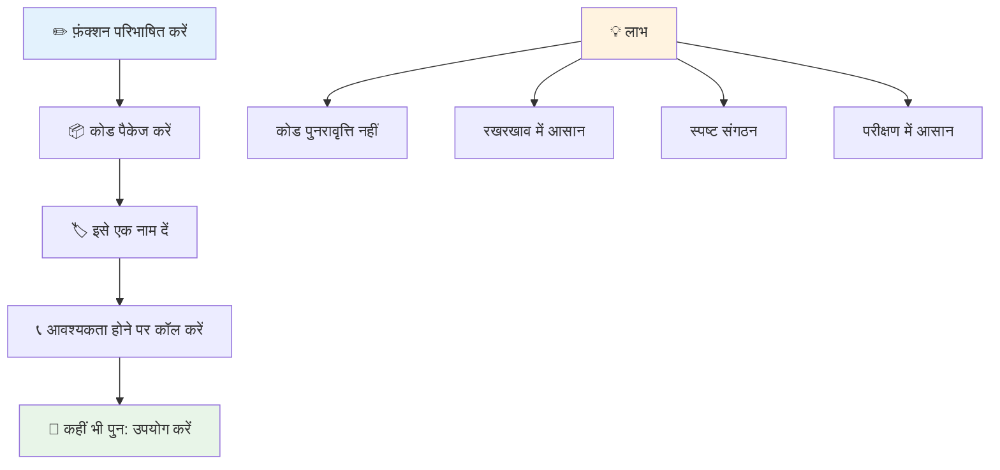
> **ध्यान दें:** आपने इन पाठों में **मेथड्स** का उपयोग किया है। `console.log()` एक मेथड है – मूलतः `console` ऑब्जेक्ट से संबंधित एक फंक्शन। मुख्य अंतर यह है कि मेथड्स ऑब्जेक्ट्स से जुड़े होते हैं, जबकि फंक्शन्स स्वतंत्र होते हैं। कई डेवलपर्स ये शब्द सामान्य बातचीत में समानार्थक रूप से उपयोग करते हैं।

### फंक्शन सर्वश्रेष्ठ प्रथाएं

यहाँ कुछ सुझाव हैं जो आपको बेहतर फंक्शन्स लिखने में मदद करेंगे:

- अपने फंक्शन्स को स्पष्ट, वर्णनात्मक नाम दें – आपका भविष्य का खुद आप इसका आभार मानेंगे!
- यदि नाम कई शब्दों का हो तो **camelCasing** का उपयोग करें (जैसे `calculateTotal` बजाय `calculate_total`)
- हर फंक्शन को एक काम करने पर केन्द्रित रखें

## फंक्शन को जानकारी भेजना

हमारा `displayGreeting` फंक्शन सीमित है – यह हर किसी के लिए सिर्फ "Hello, world!" दिखा सकता है। पैरामीटर हमें फंक्शन्स को अधिक लचीला और उपयोगी बनाना संभव करते हैं।

**पैरामीटर** ऐसे प्लेसहोल्डर्स की तरह होते हैं जहाँ आप अलग-अलग कॉल पर विभिन्न मान डाल सकते हैं। इस तरह, एक ही फंक्शन हर कॉल पर अलग-अलग जानकारी के साथ काम कर सकता है।

जब आप फंक्शन को परिभाषित करते हैं तो पैरेंथेसिस के अंदर पैरामीटर लिखते हैं, और यदि एक से अधिक हैं तो उन्हें कॉमा से अलग करते हैं:

```javascript
function name(param, param2, param3) {

}
```

प्रत्येक पैरामीटर एक प्लेसहोल्डर की तरह कार्य करता है – जब कोई आपका फंक्शन कॉल करता है, तो वे वास्तविक मान प्रदान करते हैं जो इन स्थानों पर डाले जाते हैं।

आइए हमारा ग्रीटिंग फंक्शन अपडेट करें ताकि वह किसी के नाम को स्वीकार कर सके:

```javascript
function displayGreeting(name) {
  const message = `Hello, ${name}!`;
  console.log(message);
}
```

ध्यान दें कि हम बैकटिक्स (`` ` ``) और `${}` का उपयोग कर रहे हैं ताकि नाम सीधे संदेश में डाला जा सके – इसे टेम्पलेट लिटरल कहा जाता है, और यह स्ट्रिंग्स को वेरिएबल के साथ जोड़ने का एक बहुत सुविधाजनक तरीका है।

अब जब हम फंक्शन को कॉल करते हैं, तो हम कोई भी नाम पास कर सकते हैं:

```javascript
displayGreeting('Christopher');
// चलाने पर "नमस्ते, क्रिस्टोफ़र!" दिखाता है
```

जावास्क्रिप्ट स्ट्रिंग `'Christopher'` को `name` पैरामीटर में असाइन कर देता है, और वैयक्तिकृत संदेश "Hello, Christopher!" बनाता है।

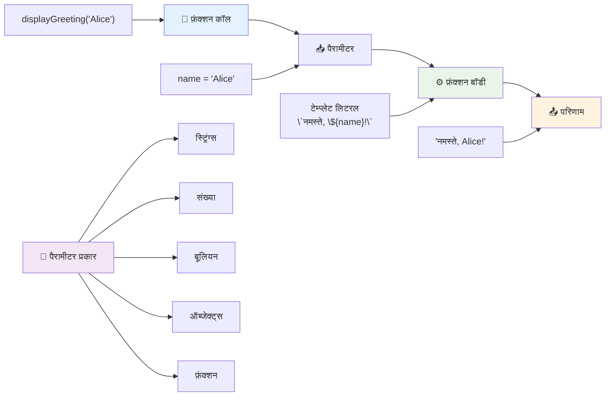
## डिफ़ॉल्ट मान

अगर हम कुछ पैरामीटर को वैकल्पिक बनाना चाहें तो क्या होगा? तब डिफ़ॉल्ट मान काम आते हैं!

मान लीजिए हम चाहते हैं कि लोग ग्रीटिंग शब्द को कस्टमाइज़ कर सकें, लेकिन अगर वे इसे निर्दिष्ट न करें तो हम "Hello" को बैकअप के रूप में उपयोग करेंगे। आप डिफ़ॉल्ट मान इस तरह सेट कर सकते हैं जैसे आप कोई वैरिएबल सेट करते हैं:

```javascript
function displayGreeting(name, salutation='Hello') {
  console.log(`${salutation}, ${name}`);
}
```

यहाँ, `name` अभी भी आवश्यक है, लेकिन `salutation` के पास `'Hello'` का बैकअप मान है यदि कोई अलग ग्रीटिंग निर्दिष्ट न करे।

अब हम इस फंक्शन को दो अलग-अलग तरीकों से कॉल कर सकते हैं:

```javascript
displayGreeting('Christopher');
// "Hello, Christopher" प्रदर्शित करता है

displayGreeting('Christopher', 'Hi');
// "Hi, Christopher" प्रदर्शित करता है
```

पहली कॉल में, जावास्क्रिप्ट डिफ़ॉल्ट "Hello" का उपयोग करता है क्योंकि हमने कोई सल्यूटेशन नहीं दिया। दूसरी कॉल में, यह हमारे कस्टम "Hi" का उपयोग करता है। यह लचीलापन फंक्शन्स को विभिन्न स्थितियों के लिए उपयुक्त बनाता है।

### 🎛️ **पैरामीटर मास्टरी चेक: फंक्शन्स को लचीला बनाना**

**अपने पैरामीटर समझ को जांचें:**
- पैरामीटर और आर्ग्यूमेंट में क्या अंतर है?
- डिफ़ॉल्ट मान वास्तविक प्रोग्रामिंग में क्यों उपयोगी हैं?
- क्या आप अनुमान लगा सकते हैं कि अगर आप पैरामीटर से ज्यादा आर्ग्यूमेंट पास करें तो क्या होगा?

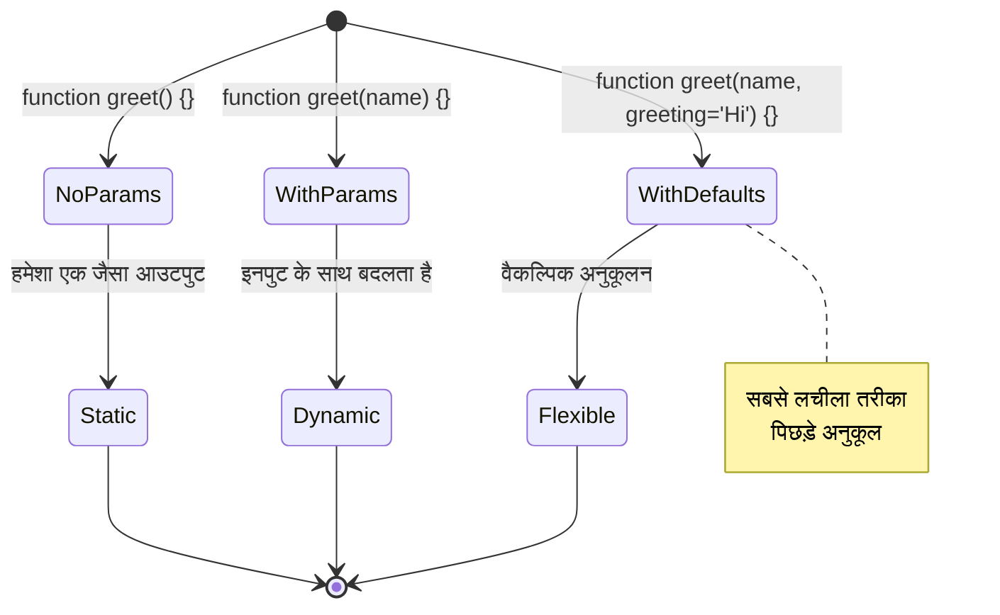
> **पेशेवर सुझाव:** डिफ़ॉल्ट पैरामीटर आपके फंक्शन्स को अधिक उपयोगकर्ता-मित्रवत बनाते हैं। उपयोगकर्ता जल्दी शुरुआत कर सकते हैं समझदारी से सेट किये डिफ़ॉल्ट्स के साथ, लेकिन जरूरत पड़ने पर कस्टमाइज़ भी कर सकते हैं!

## रिटर्न मान

अब तक हमारे फंक्शन्स ने केवल कंसोल पर संदेश प्रिंट किए हैं, लेकिन अगर आप चाहते हैं कि फंक्शन कुछ कैलकुलेट करे और परिणाम वापस दे?

यही जगह है जहां **रिटर्न मान** आते हैं। सिर्फ कुछ दिखाने की बजाय, फंक्शन एक मान वापस कर सकता है जिसे आप किसी वैरिएबल में स्टोर कर सकते हैं या अपने कोड के अन्य भागों में उपयोग कर सकते हैं।

मान वापस भेजने के लिए, आप `return` कीवर्ड का उपयोग करते हैं जिसके बाद आप जो भी वापस करना चाहते हैं वह लिखते हैं:

```javascript
return myVariable;
```

यहाँ एक महत्वपूर्ण बात है: जब फंक्शन को `return` स्टेटमेंट मिलता है, तो वह तुरंत रुक जाता है और वह मान वापस भेज देता है जिसे कॉल किया था।

आइए हमारा ग्रीटिंग फंक्शन इस तरह संशोधित करें कि वह संदेश प्रिंट करने के बजाय वापस करे:

```javascript
function createGreetingMessage(name) {
  const message = `Hello, ${name}`;
  return message;
}
```

अब यह फंक्शन ग्रीटिंग प्रिंट करने के बजाय संदेश बनाता है और हमें वापस देता है।

वापस प्राप्त मान को उपयोग करने के लिए, हम इसे किसी वैरिएबल में स्टोर कर सकते हैं जैसे किसी अन्य मान को करते हैं:

```javascript
const greetingMessage = createGreetingMessage('Christopher');
```

अब `greetingMessage` में "Hello, Christopher" है और हम इसे कहीं भी अपने कोड में उपयोग कर सकते हैं – वेबपेज पर दिखाने, ईमेल में शामिल करने, या किसी अन्य फंक्शन को पास करने के लिए।

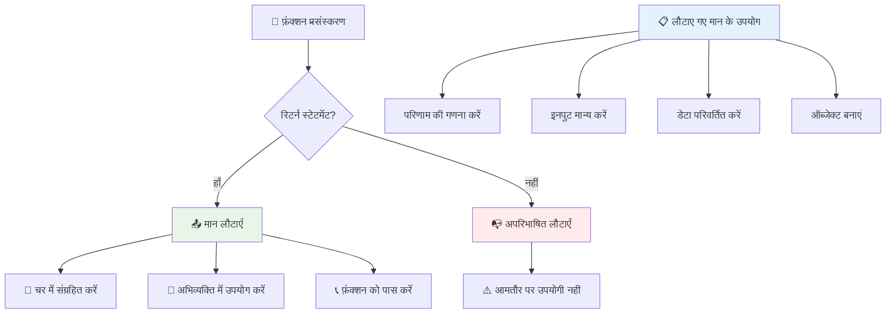
### 🔄 **रिटर्न मान जांच: परिणाम प्राप्त करना**

**अपने रिटर्न मान की समझ का मूल्यांकन करें:**
- फंक्शन में `return` स्टेटमेंट के बाद कोड क्या होता है?
- केवल कंसोल पर प्रिंट करने से बेहतर रिटर्न मान क्यों होता है?
- क्या एक फंक्शन विभिन्न प्रकार के मान (string, number, boolean) वापस कर सकता है?

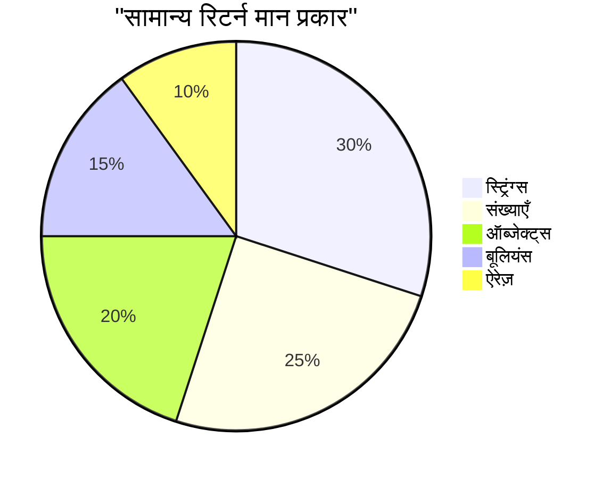
> **मुख्य अंतर्दृष्टि:** जो फंक्शन्स मान वापस करते हैं वे अधिक बहुमुखी होते हैं क्योंकि कॉल करने वाला तय करता है कि परिणाम के साथ क्या करना है। इससे आपका कोड अधिक मॉड्यूलर और पुनः उपयोग योग्य बनता है!

## फंक्शन्स को पैरामीटर के रूप में पास करना

फंक्शन्स को अन्य फंक्शन्स के पैरामीटर के रूप में पास किया जा सकता है। यह अवधारणा शुरू में जटिल लग सकती है, लेकिन यह एक शक्तिशाली फीचर है जो लचीली प्रोग्रामिंग पैटर्न सक्षम बनाता है।

यह पैटर्न बहुत सामान्य है जब आप कहना चाहते हैं "जब कुछ हो, तो यह अन्य काम करो।" उदाहरण के लिए, "जब टाइमर खत्म हो जाए, तब यह कोड चलाओ" या "जब उपयोगकर्ता बटन क्लिक करे, तब यह फंक्शन कॉल करो।"

आइए `setTimeout` देखें, जो एक बिल्ट-इन फंक्शन है जो कुछ समय इंतजार करता है और फिर कुछ कोड चलता है। हमें इसे बताना होता है कि कौन सा कोड चलाना है – फंक्शन पास करने के लिए यह एक बेहतरीन इस्तेमाल है!

यह कोड आज़माएँ – 3 सेकंड बाद आपको एक संदेश दिखेगा:

```javascript
function displayDone() {
  console.log('3 seconds has elapsed');
}
// टाइमर मान मिलीसेकंड में है
setTimeout(displayDone, 3000);
```

ध्यान दें कि हम `displayDone` (पैरेंथेसिस के बिना) `setTimeout` को पास कर रहे हैं। हम खुद फंक्शन को कॉल नहीं कर रहे हैं – हम इसे `setTimeout` के हाथ दे रहे हैं और कह रहे हैं "इसे 3 सेकंड में कॉल करना।"

### अनाम फंक्शन्स

कभी-कभी आपको बस एक ही काम के लिए फंक्शन चाहिए और आप उसे नाम देना नहीं चाहते। सोचिए – अगर आप फंक्शन को केवल एक बार उपयोग कर रहे हैं, तो क्यों अपने कोड को एक अतिरिक्त नाम से भरें?

जावास्क्रिप्ट आपको **अनाम फंक्शन्स** बनाने देता है – नामहीन फंक्शन्स जिन्हें आप ठीक वहीं परिभाषित कर सकते हैं जहाँ आपको जरूरत हो।

यहाँ हमारा टाइमर उदाहरण अनाम फंक्शन का उपयोग कर कैसे दिखेगा:

```javascript
setTimeout(function() {
  console.log('3 seconds has elapsed');
}, 3000);
```

यह वही परिणाम प्राप्त करता है, लेकिन फंक्शन `setTimeout` कॉल के भीतर सीधे परिभाषित होता है, जिससे अलग फंक्शन डिक्लेरेशन की जरूरत खत्म हो जाती है।

### फैट ऐरो फंक्शन्स

आधुनिक जावास्क्रिप्ट में फंक्शन्स लिखने का एक और भी छोटा तरीका है जिसे **ऐरो फंक्शन्स** कहते हैं। वे `=>` का उपयोग करते हैं (जो एक तीर की तरह दिखता है – समझे?) और डेवलपर्स के बीच बहुत लोकप्रिय हैं।

ऐरो फंक्शन्स आपको `function` कीवर्ड को छोड़कर अधिक संक्षिप्त कोड लिखने देते हैं।

यहाँ हमारा टाइमर उदाहरण ऐरो फंक्शन के साथ है:

```javascript
setTimeout(() => {
  console.log('3 seconds has elapsed');
}, 3000);
```

`()` वह जगह है जहाँ पैरामीटर होंगे (यहाँ खाली है), फिर ऐरो `=>` आता है, और अंत में फंक्शन शरीर घुंघराले ब्रैकेट्स में। यह समान कार्यक्षमता अधिक संक्षिप्त सिंटैक्स के साथ प्रदान करता है।

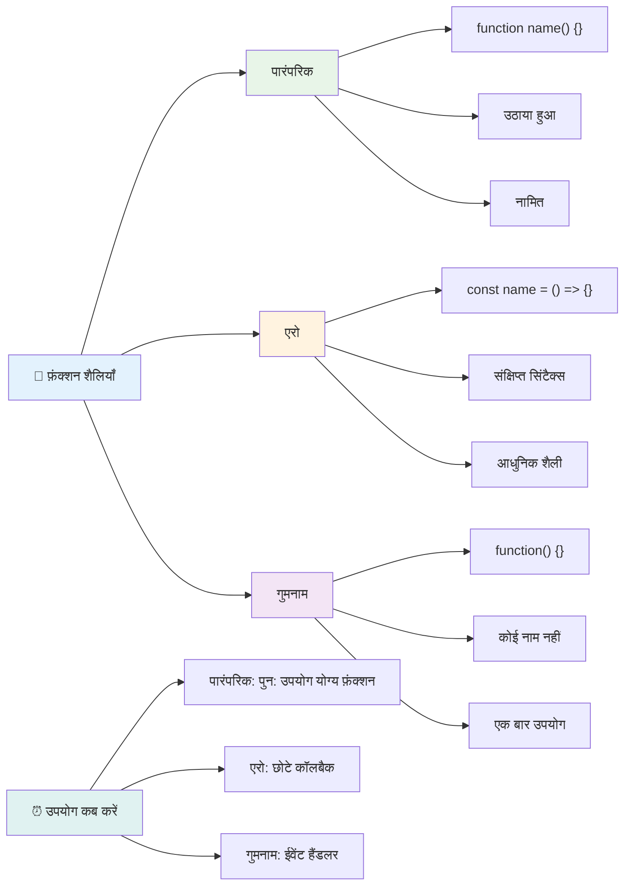
### कब कौन सी रणनीति का उपयोग करें

आप कब किस approach का उपयोग करें? एक व्यावहारिक गाइडलाइन: यदि आप फंक्शन को कई बार उपयोग करेंगे तो इसे नाम दें और अलग से परिभाषित करें। यदि यह किसी एक विशेष उपयोग के लिए है, तो अनाम फंक्शन पर विचार करें। ऐरो फंक्शन्स और पारंपरिक सिंटैक्स दोनों वैध विकल्प हैं, हालांकि आधुनिक जावास्क्रिप्ट कोडबेस में ऐरो फंक्शन्स अधिक प्रचलित हैं।

### 🎨 **फंक्शन स्टाइल मास्टरी चेक: सही सिंटैक्स चुनना**

**अपने सिंटैक्स ज्ञान को जांचें:**
- आप कब पारंपरिक फंक्शन सिंटैक्स की तुलना में ऐरो फंक्शन्स को प्राथमिकता देंगे?
- अनाम फंक्शन्स का मुख्य लाभ क्या है?
- क्या आप ऐसी स्थिति सोच सकते हैं जहाँ नामित फंक्शन अनाम फंक्शन से बेहतर हो?

```mermaid
quadrantChart
    title फ़ंक्शन विकल्प निर्णय मैट्रिक्स
    x-axis सरल --> जटिल
    y-axis एक बार उपयोग --> पुन: प्रयोज्य
    quadrant-1 एरो फ़ंक्शंस
    quadrant-2 नामित फ़ंक्शंस
    quadrant-3 अनाम फ़ंक्शंस
    quadrant-4 पारंपरिक फ़ंक्शंस
    
    Event Handlers: [0.3, 0.2]
    Utility Functions: [0.7, 0.8]
    Callbacks: [0.2, 0.3]
    Class Methods: [0.8, 0.7]
    Mathematical Operations: [0.4, 0.6]
```
> **आधुनिक प्रवृत्ति:** संक्षिप्त सिंटैक्स के कारण कई डेवलपर्स के लिए ऐरो फंक्शन्स डिफ़ॉल्ट विकल्प बन रहे हैं, लेकिन पारंपरिक फंक्शन्स अभी भी अपने स्थान पर हैं!

---


## 🚀 चुनौती

क्या आप एक वाक्य में फंक्शन्स और मेथड्स के बीच का अंतर स्पष्ट कर सकते हैं? इसे आज़माएं!

## GitHub Copilot एजेंट चुनौती 🚀

एजेंट मोड का उपयोग करके निम्नलिखित चुनौती पूरा करें:

**विवरण:** एक उपयोगिता लाइब्रेरी बनाएं जो इस पाठ में कवर किए गए विभिन्न फंक्शन कॉन्सेप्ट्स जैसे पैरामीटर, डिफ़ॉल्ट मान, रिटर्न मान, और ऐरो फंक्शन्स को प्रदर्शित करती हो।

**प्रांप्ट:** एक जावास्क्रिप्ट फाइल `mathUtils.js` बनाएं जिसमें निम्नलिखित फंक्शन्स हों:
1. एक फंक्शन `add` जो दो पैरामीटर ले और उनका योग वापस करे
2. एक फंक्शन `multiply` जिसमें डिफ़ॉल्ट पैरामीटर मान हों (दूसरा पैरामीटर डिफ़ॉल्ट 1)
3. एक ऐरो फंक्शन `square` जो एक नंबर ले और उसका वर्ग वापस करे
4. एक फंक्शन `calculate` जो एक अन्य फंक्शन को पैरामीटर के रूप में स्वीकार करे और दो नंबर, फिर उस फंक्शन को उन नंबरों पर लागू करे
5. उपयुक्त टेस्ट केस के साथ प्रत्येक फंक्शन को कॉल करना प्रदर्शित करें

एजेंट मोड के बारे में अधिक जानने के लिए [यहाँ देखें](https://code.visualstudio.com/blogs/2025/02/24/introducing-copilot-agent-mode)।

## पोस्ट-लेक्चर क्विज़
[पोस्ट-लेक्चर क्विज़](https://ff-quizzes.netlify.app)

## समीक्षा और आत्म-अध्ययन

यह थोड़ा और पढ़ने लायक है कि [ऐरो फंक्शन्स के बारे में](https://developer.mozilla.org/docs/Web/JavaScript/Reference/Functions/Arrow_functions) क्योंकि इन्हें कोड बेस में बढ़ चढ़ कर उपयोग किया जा रहा है। फंक्शन्स लिखने का अभ्यास करें, और फिर इसे नए सिंटैक्स के साथ दोबारा लिखें।

## असाइनमेंट

[फंक्शन्स के साथ मज़ा](assignment.md)

---

## 🧰 **आपका JavaScript फंक्शन्स टूलकिट सारांश**

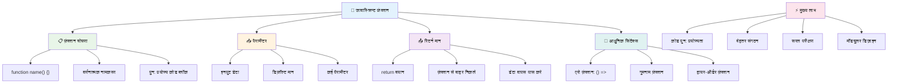
---

## 🚀 आपकी JavaScript फंक्शन्स मास्टरी टाइमलाइन

### ⚡ **आप अगले 5 मिनट में क्या कर सकते हैं**
- [ ] एक साधारण फंक्शन लिखें जो आपका पसंदीदा नंबर वापस करता हो
- [ ] दो पैरामीटर वाला एक फंक्शन बनाएं जो उन्हें जोड़ता हो
- [ ] पारंपरिक फ़ंक्शन को तीर फ़ंक्शन सिंटैक्स में बदलने का प्रयास करें
- [ ] चुनौती का अभ्यास करें: फ़ंक्शन और मेथड के बीच का अंतर समझाएं

### 🎯 **इस घंटे में आप क्या हासिल कर सकते हैं**
- [ ] पोस्ट-लीसन क्विज़ पूरा करें और किसी भी भ्रमित करने वाली अवधारणाओं की समीक्षा करें
- [ ] GitHub Copilot चुनौती से गणित यूटिलिटीज़ लाइब्रेरी बनाएं
- [ ] एक ऐसा फ़ंक्शन बनाएं जो पैरामीटर के रूप में एक अन्य फ़ंक्शन का उपयोग करता हो
- [ ] डिफ़ॉल्ट पैरामीटर के साथ फ़ंक्शन लिखने का अभ्यास करें
- [ ] फ़ंक्शन रिटर्न वैल्यूज़ में टेम्पलेट लिटरेक्स के साथ प्रयोग करें

### 📅 **आपका सप्ताह भर का फ़ंक्शन मास्टरी**
- [ ] "फ़नों के साथ मज़ा" असाइनमेंट को रचनात्मकता के साथ पूरा करें
- [ ] कुछ दोहराए जाने वाले कोड को पुनःप्रयोग योग्य फ़ंक्शनों में सुधारें
- [ ] केवल फ़ंक्शनों का उपयोग करके एक छोटा कैलकुलेटर बनाएं (कोई ग्लोबल वेरिएबल नहीं)
- [ ] `map()` और `filter()` जैसे एरे मेथड्स के साथ तीर फ़ंक्शनों का अभ्यास करें
- [ ] आम कार्यों के लिए उपयोगिता फ़ंक्शनों का संग्रह बनाएं
- [ ] उच्च-स्तरीय फ़ंक्शनों और फ़ंक्शनल प्रोग्रामिंग अवधारणाओं का अध्ययन करें

### 🌟 **आपका महीने भर का परिवर्तन**
- [ ] क्लोज़र और स्कोप जैसे उन्नत फ़ंक्शन अवधारणाओं में महारत हासिल करें
- [ ] एक ऐसा प्रोजेक्ट बनाएं जो फ़ंक्शन कम्पोज़िशन का भारी उपयोग करता हो
- [ ] फ़ंक्शन दस्तावेज़ीकरण को बेहतर करके ओपन सोर्स में योगदान दें
- [ ] किसी और को फ़ंक्शन्स और विभिन्न सिंटैक्स शैलियों के बारे में सिखाएं
- [ ] जावास्क्रिप्ट में फ़ंक्शनल प्रोग्रामिंग तरीके खोजें
- [ ] भविष्य के प्रोजेक्ट्स के लिए पुनःप्रयोग योग्य फ़ंक्शनों की व्यक्तिगत लाइब्रेरी बनाएं

### 🏆 **अंतिम फ़ंक्शन्स चैंपियन चेक-इन**

**अपनी फ़ंक्शन मास्टरी का जश्न मनाएं:**
- अब तक आपने सबसे उपयोगी फ़ंक्शन कौन सा बनाया है?
- फ़ंक्शन्स के बारे में सीखने से आपने कोड संगठन के बारे में अपना दृष्टिकोण कैसे बदला है?
- आप कौन सी फ़ंक्शन सिंटैक्स पसंद करते हैं और क्यों?
- आप कौन सा वास्तविक दुनिया का समस्या फ़ंक्शन लिखकर हल करेंगे?

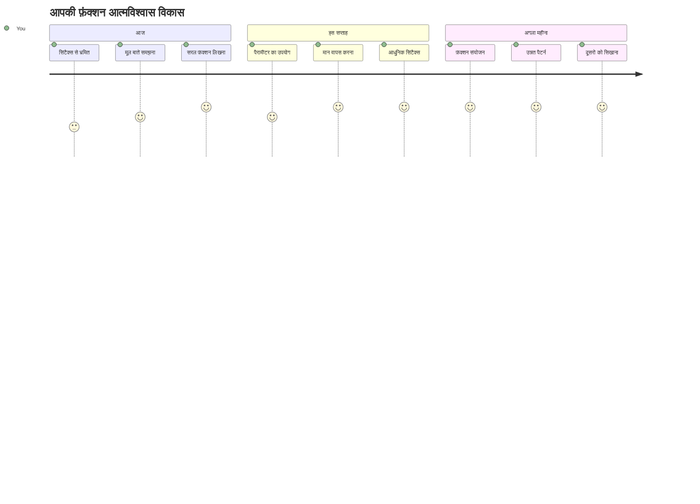
> 🎉 **आपने प्रोग्रामिंग की सबसे शक्तिशाली अवधारणाओं में से एक में महारत हासिल कर ली है!** फ़ंक्शन्स बड़े प्रोग्रामों के बिल्डिंग ब्लॉक्स होते हैं। हर एप्लिकेशन जिसे आप कभी बनाएंगे वह कोड को व्यवस्थित, पुनः उपयोग करने योग्य और संरचित करने के लिए फ़ंक्शन्स का उपयोग करेगा। अब आप लॉजिक को पुनः उपयोग योग्य घटकों में पैकेज करना समझते हैं, जिससे आप एक अधिक कुशल और प्रभावी प्रोग्रामर बन गए हैं। मॉड्यूलर प्रोग्रामिंग की दुनिया में आपका स्वागत है! 🚀

---

<!-- CO-OP TRANSLATOR DISCLAIMER START -->
**अस्वीकरण**:
इस दस्तावेज़ का अनुवाद एआई अनुवाद सेवा [Co-op Translator](https://github.com/Azure/co-op-translator) का उपयोग करके किया गया है। जबकि हम सटीकता के लिए प्रयास करते हैं, कृपया ध्यान दें कि स्वचालित अनुवादों में त्रुटियाँ या अशुद्धियाँ हो सकती हैं। मूल दस्तावेज़ अपनी मूल भाषा में प्राधिकारी स्रोत माना जाना चाहिए। महत्वपूर्ण जानकारी के लिए, पेशेवर मानव अनुवाद की सलाह दी जाती है। इस अनुवाद के उपयोग से उत्पन्न किसी भी गलतफ़हमी या गलत व्याख्या के लिए हम उत्तरदायी नहीं हैं।
<!-- CO-OP TRANSLATOR DISCLAIMER END -->